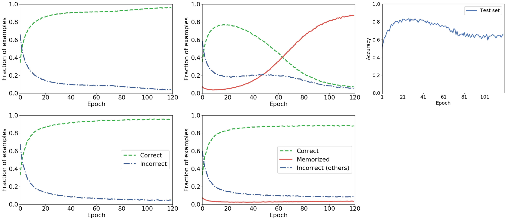

# Learning with Noisy Labels（ノイズラベル学習）

## 一言で

**ラベルの一部が間違っているデータで、それでもまともなモデルを訓練する**問題。中心にあるのは **「早期学習 → 暗記」という深層ネットワークの普遍的な訓練動力学**で、対処法はこの動力学のどこに介入するかで 5 つに分かれる。

> 本ページの一次情報は [[sources/elr]]（Liu et al., NeurIPS 2020）と [[sources/l2rw]]（Ren et al., ICML 2018）の 2 件である。これを超える記述には ⚠ を付けた。

## 中心にある現象: 早期学習と暗記

**すべての出発点はこの経験的事実である。**

<figure>

<figcaption>図（[[sources/elr]] 図1 より再掲）: CIFAR-10 + 40% 対称ノイズ、ResNet-34。上段が交差エントロピー、下段が ELR。中列の赤い線が「誤ったラベルを暗記した事例の割合」。交差エントロピーでは約 0.05 から 0.87 まで単調に増加し、緑（正しく分類）は 0.77 のピークから 0.07 まで崩壊する。右上のテスト精度もエポック 30 付近の 0.83 をピークに 0.65 まで落ちる。</figcaption>
</figure>

| 段階 | 何が起こるか |
|---|---|
| **早期学習（early learning）** | モデルはまずクリーンなラベルに適合する。**誤ラベルの事例に対してすら、モデルは正しいクラスを予測できる** |
| **暗記（memorization）** | やがて誤ったラベルの方を覚え込む。訓練精度は上がり続けるがテスト精度は落ちる |

**「誤ラベル事例に対してすら正しく予測できる時期がある」というのが決定的に重要である。** これがあるからこそ、モデル自身の予測を情報源として使える。ノイズラベル学習のほぼすべての手法が、この時期に何をするかで分かれる。

### なぜ起こるのか — 深層性ではなく高次元性

[[sources/elr]] は**この現象が線形モデル（ロジスティック回帰）でも起こることを証明した**。2 つのガウス分布の混合で $\Delta$ の割合のラベルを反転させ、勾配降下法を回すと:

- **早期**: $\theta$ がまだ正しい方向 $\mathbf{v}$ と相関していない間は、係数 $\tanh(\theta^\top\mathbf{x}^{[i]})-\varepsilon^{[i]}$ が**すべての事例で似た値**になる。すると勾配は事例の平均方向をほぼ指す。**大多数が正しくラベル付けされているので、平均方向は正しい**
- **後期**: $\theta$ が $\mathbf{v}$ と相関すると、勾配は $\mathbf{v}$ に直交する方向を指し始める。**次元 $p$ が十分大きければ、直交方向が暗記を許すのに十分なだけ存在する**

暗記が起こる条件は **$p/n > 1-\Delta/2$**、すなわち**次元がサンプル数に対して十分大きいこと**である（Schläfli の定理による線形分離可能性の数え上げ、[[sources/elr]] 定理 6）。

> **「深層ネットワークだから暗記する」のではなく「高次元だから暗記する」。** これは "Understanding deep learning requires rethinking generalization"（Zhang ら 2017）が示した「深層ネットワークは何でも暗記できる」という観察に、**線形モデルでの証明という形で理論的な下限を与えた**ことになる ⚠（Zhang らの論文自体は本 wiki 未取り込み）。

### 早期停止では足りない

**素朴な対処は「早期学習の終わりで止める」ことだが、これは早期学習の途中で止めることでもある。** [[sources/elr]] 図1 の右上を見ると、テスト精度のピークは明確だが、**そのピークがどこかは事前に分からない**（ノイズ率に依存する）し、ピークを過ぎた後の情報を捨てることになる。

より根本的には、**早期停止は「暗記を止める」のではなく「暗記が始まる前に逃げる」**だけである。ノイズラベル学習の手法群は、**逃げずに暗記だけを止める**ことを目指している。

## 5 つの対処法

[[sources/elr]] の Related Work の分類に、同論文自身の貢献を加えたもの。

| 型 | やり方 | 代表 | 早期学習を使うか |
|---|---|---|---|
| **① ロバスト損失** | ノイズに強い損失関数を設計 | MAE ⚠ / GCE ⚠ / Symmetric CE ⚠ | 使わない |
| **② 損失補正** | 誤ラベル付けの遷移行列を推定して損失を補正 | Forward ⚠ / S-Model ⚠ | 使わない |
| **③ サンプル選択・重み付け** | 損失の小さい事例をクリーンとみなして選ぶ／重みを付ける | Co-teaching ⚠ / MentorNet ⚠ / **[[sources/l2rw\|L2RW]]** | 使う |
| **④ ラベル修正** | モデル予測でラベルを書き換える | SELFIE ⚠ / PENCIL ⚠ / Joint-Optim ⚠ | 使う |
| **⑤ 正則化** | 損失に項を足して暗記だけを抑える | **[[sources/elr\|ELR]]** | 使う |

### ③ サンプル選択の構造的な弱点

[[sources/elr]] の指摘が鋭い。

> このアプローチの限界は、**選択される事例が「より易しい」ものに偏る傾向がある**ことである。その結果、これらの事例に関する**交差エントロピーの勾配は小さく、学習が遅くなる**。

**「損失が小さいからクリーンだと判断」→「選ばれたものは損失が小さいので勾配も小さい」→「学習が進まない」**という自己矛盾が構造に埋め込まれている。加えて、選ばれた部分集合が汎化に十分な豊かさを持たない恐れもある。

これは [[concepts/example-reweighting]] で整理した **「hard 優先 vs easy 優先」の対立**の easy 優先側に固有の問題である。

### ⑤ 正則化 — 事例を選ばない

[[sources/elr]] の ELR は損失に項を 1 つ足すだけである。

$$\mathcal{L}_{\text{ELR}}=\mathcal{L}_{\text{CE}}+\frac{\lambda}{n}\sum_{i}\log\left(1-\langle\mathbf{p}^{[i]},\mathbf{t}^{[i]}\rangle\right)$$

$\mathbf{t}^{[i]}$ はモデル自身の過去の出力の移動平均。**同じ 1 つの項が、クリーンな事例と誤ラベル事例で自動的に逆向きに働く。**

| 事例 | 交差エントロピー項 | ELR 項 |
|---|---|---|
| **クリーン** | $\mathbf{p}\to\mathbf{y}$ で**消失する** | 係数を**大きく保つ** |
| **誤ラベル** | 暗記の方向に**増大する** | **打ち消す** |

**「どちらの事例か」を判定する必要がない**——符号が自動で切り替わる。これがサンプル選択との決定的な違いである。

## 設計上の教訓

### 「目標に近づける」と「目標が指す方向へ押す」は違う

[[sources/elr]] Appendix C が示す最も転用可能な知見。**ELR の代わりに「モデル出力と目標の KL ダイバージェンスにペナルティ」という自然な代替を試すと失敗する。**

| | 正則化項の符号を決めるもの | 帰結 |
|---|---|---|
| **ELR**（内積の log） | $\mathbf{t}_c$ と**目標の他の成分**の差 | 目標が指す方向へ押す |
| **KL** | $\mathbf{t}_c$ と**モデル出力** $\mathbf{p}_c$ の差 | **目標そのものに過適合する** |

実験では $\lambda$ を増やしても暗記は遅れるだけで消えず、**モデルは初期の推定（正しくても誤っていても）に過適合してからノイズを暗記する**。

> **これは④ラベル修正との違いでもある。** ラベル修正は目標を正解として扱うので、目標が誤っていればそれごと覚える。ELR は目標を**方向のヒント**としてしか使わない。[[sources/elr]] が自らを「ラベル修正と精神的には関係しているが根本的に異なる」と位置づける理由である。

### 自己参照のループは正則化なしでは壊れる

「モデルの過去の出力から目標を作り、その目標でモデルを正則化する」という構造は自己参照である。**モデルが壊れれば目標も壊れる。**

[[sources/elr]] Appendix D は、**temporal ensembling だけを行い交差エントロピーで訓練すると、目標自体がやがてノイジーなラベルに過適合する**ことを示した。正則化項は暗記を防ぐと同時に、**自分自身の入力である目標を守っている**。

**移動平均は必須の部品である。** $\beta=0$（平均化なしで生のモデル出力を目標にする）にすると性能が 38% まで崩壊する（[[sources/elr]] Appendix H）。

### 外部の基準か、自分の過去か

ノイズラベル学習の手法は「**何を正しさの基準にするか**」で分けられる。

| 基準 | 代表 | 対価 |
|---|---|---|
| **外部のクリーンなデータ** | [[sources/l2rw\|L2RW]]（勾配方向を照合） | 不偏でクリーンな検証セットが要る（ただし **15 枚**で足りる） |
| **モデル自身の過去** | [[sources/elr\|ELR]]（移動平均を目標に） | 「早期学習が実際に起こる」という前提に乗る |
| **もう 1 つのモデル** | Co-teaching ⚠ / DivideMix ⚠ | 計算コストが倍 |

**ELR の理論パートは、まさに 2 番目の前提を線形モデルで正当化するためにある。**

## 半教師あり学習との合流

**ノイズラベル学習と [[concepts/semi-supervised-learning]] は方法論のレベルで合流しつつある。** [[sources/elr]] の ELR+ を構成する 4 要素は、すべて半教師あり学習由来である。

| 要素 | 出どころ | 目的 |
|---|---|---|
| **temporal ensembling** | Laine & Aila ⚠ | 目標の安定化 |
| **重み平均化** | Mean Teacher ⚠ | **確証バイアス**の緩和 |
| **2 つのネットワーク** | Co-teaching 系 ⚠ | 互いの出力から目標を計算 |
| **mixup** | Zhang ら ⚠ | データ拡張（[[entities/mixmatch]] / [[entities/fixmatch]] も採用） |

**DivideMix ⚠ に至っては、ノイズラベル問題そのものを半教師あり学習として定式化する**（クリーンと判定した事例をラベルあり、ノイジーと判定した事例をラベルなしとして扱う）。

> **「ラベルが足りない」と「ラベルが汚い」は別の問題だが、道具立ては同じになる。** どちらも「モデル自身の予測を信頼できる範囲で使う」ことが核心だからである。[[entities/flexmatch]] の CPL がクラス不均衡で失敗した件（[[concepts/example-reweighting]] 参照）のように、**片方の分野の失敗がもう片方の教訓になる**関係にある。

**高ノイズほど半教師あり技法が効く。** [[sources/elr]] のアブレーションでは、40% ノイズで各要素の寄与が 1〜2 ポイントなのに対し、**80% ノイズでは mixup 単体で 10 ポイント以上動く**。

## 評価の落とし穴

**[[sources/l2rw]] が発した警告は本領域全体に効く。**

> 不偏なテストセットの適切な定義なしには、訓練セットのバイアス問題を解くことは本質的に ill-defined である。モデルは正しいものと誤ったものを区別する手がかりを持たないので、**人工的なノイズ設定では強い正則化をかけるだけで驚くほどうまくいってしまう**。

実際 L2RW の実験では、**整流ガウス乱数で重みを振っただけの「Random」ベースラインが CIFAR-10 UniformFlip で 86.06% を出し、比較した既存手法をすべて上回った**（MentorNet 76.6、Reed-Hard 69.66）。

**この警告は ⑤ 正則化型の手法に特に強く当たる。** ELR は文字どおり正則化項であり、「正則化をかけただけでうまくいっている」のか「早期学習を活用できている」のかを切り分ける対照——**目標を乱数にする、$\mathbf{t}$ を定数にするなど**——は [[sources/elr]] には置かれていない ⚠。

**評価時のチェックリスト**:

1. **乱数ベースラインを置いたか**（正則化効果と真の頑健化の切り分け）
2. **人工ノイズか実世界ノイズか**（対称/非対称の人工ノイズは実データの構造と違う）
3. **評価プロトコルが揃っているか**（[[sources/elr]] は「訓練中の最高検証精度」と「別途取った検証セット」の差を明示して両方の列を出している）
4. **ハイパーパラメータをどこで選んだか**（クリーンな検証セットを使っていないか）

## 現在地

本 wiki に取り込まれた範囲では:

1. **「早期学習 → 暗記」という動力学の理解が共通基盤**になった。[[sources/elr]] がそれを線形モデルで証明したことで、経験則から理論に格上げされた
2. **⑤ 正則化と ③ 重み付けが 2 つの主要な路線**。前者は追加データ不要で軽く、後者は理論保証を得やすい
3. **半教師あり学習との道具の共有が進んだ**。特に高ノイズ領域では半教師あり技法の寄与が支配的になる
4. **評価の設計が追いついていない**。人工ノイズへの依存と、乱数ベースラインの不在は本領域の弱点として残る ⚠

**大規模事前学習の文脈でも生き続けている問題である。** [[concepts/weakly-supervised-pretraining]]（CLIP / SigLIP 系）は「粗いラベルを大量に使う」ことで成立しており、[[entities/biomedclip]] の PMC-15M（論文の図–キャプション対）や [[entities/medgemma]] の内部データも、程度の差はあれノイズを含む。**ただし規模が桁違いに大きい領域で早期学習・暗記の動力学がどう働くかは、本 wiki の一次情報では扱われていない** ⚠。

## 関連ページ

- [[sources/elr]] / [[translations/elr]] — 早期学習と暗記の理論、および正則化による解
- [[sources/l2rw]] / [[translations/l2rw]] — 事例重み付けによる解と、評価の落とし穴の指摘
- [[concepts/example-reweighting]] — 「hard 優先 vs easy 優先」の対立。③ の枝を詳しく扱う
- [[concepts/semi-supervised-learning]] — 道具立てを共有する分野
- [[entities/mixmatch]] / [[entities/fixmatch]] / [[entities/flexmatch]] — mixup・疑似ラベル・閾値適応の系譜
- [[concepts/weakly-supervised-pretraining]] — 粗いラベルを大量に使うパラダイム
- [[concepts/medical-foundation-model]] — ラベルの質が特に問題になる領域

## 今後の ingest 候補

⚠ 以下は本 wiki 未取り込みで、本ページの記述を一次情報に格上げするために有用。

- **"Understanding deep learning requires rethinking generalization"**（Zhang et al., ICLR 2017） — 「深層ネットワークは何でも暗記できる」の原典。**優先度が高い**
- **"A closer look at memorization in deep networks"**（Arpit et al., ICML 2017） — 早期学習現象を最初に記述した論文
- **DivideMix**（Li et al., ICLR 2020） — ノイズラベルを半教師あり学習として定式化。[[sources/elr]] の最大の競合
- **Co-teaching**（Han et al., NeurIPS 2018） — サンプル選択の代表
- **MentorNet**（Jiang et al., ICML 2018） — [[sources/l2rw]] / [[sources/elr]] 双方の比較対象
- **Mean Teacher**（Tarvainen & Valpola, NIPS 2017） / **Temporal Ensembling**（Laine & Aila, ICLR 2017） — ELR+ の部品の原典
- **mixup**（Zhang et al., ICLR 2018） — 本 wiki の複数ページに登場するが未取り込み
- **Generalized Cross Entropy / Symmetric Cross Entropy** — ロバスト損失の代表
