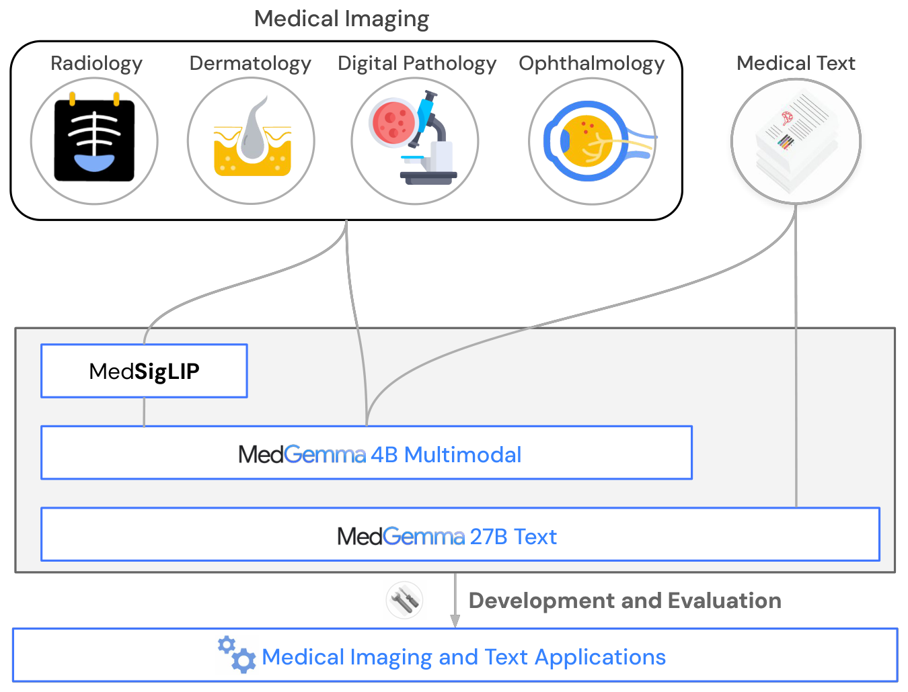

# MedGemma

Google Research + Google DeepMind による**医療の視覚–言語基盤モデル**のコレクション（arXiv:2507.05201, 2025）。**Health AI Developer Foundations（HAI-DEF）** の一部として公開。詳細解説: [[sources/medgemma]] / 翻訳: [[translations/medgemma]]。

## 一言で

**[[entities/gemma-3]] のアーキテクチャを 1 ミリも変えず、[[entities/siglip]] を医療画像で微調整し、訓練データの混ぜ方だけを設計した**モデル群。医療データを **2%（視覚エンコーダ）/ 10%（デコーダ事前学習）** という控えめな重みで混ぜることで、**汎用性能をほとんど落とさずに**医療性能を大きく引き上げている。

## 変種

<figure>

<figcaption>図1（再掲）: MedGemma コレクションの構成。放射線科・皮膚科・デジタル病理・眼科の医療画像は MedSigLIP と MedGemma 4B マルチモーダルへ、医療テキストは MedGemma 27B テキストへ入力される。</figcaption>
</figure>

| 変種 | 入力 | 訓練段階 | 位置づけ |
|---|---|---|---|
| **MedGemma 4B マルチモーダル** | テキスト + 画像 | 視覚強化 → デコーダ PT → 蒸留 → RL（**全段階**） | 主力。1 GPU に載る |
| **MedGemma 27B テキスト** | テキストのみ | **後訓練のみ**（蒸留 + RL） | テキスト QA と臨床推論に特化 |
| **MedGemma 27B マルチモーダル** | テキスト + 画像 | 4B と同じ + EHRQA + Chest ImaGenome | **評価進行中**（Appendix F の予備結果のみ）。解剖学的局在化と EHR 理解を追加 |

**4B PT（事前学習済み）と 4B IT（後訓練済み）は用途が違う。** CXR レポート生成では **PT の方が良い**——RadGraph F1 がレポートのスタイルに敏感で、IT は Gemma 3 のスタイルに寄ってしまうため（[[sources/medgemma]] §3.5）。

## アーキテクチャ

**[[entities/gemma-3]] と完全に同一。**

| 項目 | 値 |
|---|---|
| 視覚エンコーダ | **SigLIP-400M**（医療微調整版 = [[entities/medsiglip]]） |
| 入力解像度 | **896×896**、画素値は [-1, 1] に正規化 |
| 文脈長 | **128K**（5:1 の local:global attention） |
| トークナイザ | SentencePiece 262,000 エントリ |
| 訓練基盤 | TPUv4 / TPUv5e / TPUv5p、事前計算した視覚トークン、マルチポッド |

## 訓練の 3 段階

### 1. 視覚エンコーダ強化（→ MedSigLIP）

**3,300 万超の医療画像–テキスト対**で SigLIP-400M を微調整。内訳は各種モダリティ 63.5 万 + **組織病理パッチ 3,260 万（98%）**。

> **元の WebLI を残し、医療データを 2% の重みで混ぜる。**

### 2. マルチモーダルデコーダ事前学習

新エンコーダに言語モデルを再適応。**医療データを 10% の重み**で、元の Gemma 3 混合（テキスト + インターリーブ画像）を残したまま約 5 エポック。**この段階で医療のテキストのみのデータは追加しない**（元の混合が既に汎用・大規模だから）。

### 3. 後訓練

- **蒸留**: 大規模 IT 教師から医療テキストを学習（合成 20 万問を含む）
- **RL**: 対になったテキストを持つ医療画像データを使用
- **マルチモーダルの後訓練はすべて RL**。「SFT より RL の方が汎化する」と報告

## 訓練データ

**表**: 主要データセット（[[sources/medgemma]] 表1 より。★ = 非公開の内部データ）

| モダリティ | データセット | 事例数 |
|---|---|---|
| テキスト | MedQA / MedMCQA / PubMedQA / AfriMed-QA / MedExpQA / LiveQA / HealthSearchQA | 計 約 20 万 |
| テキスト | **Synthetic**（IT 教師が生成） | 200,000 |
| 放射線 | MIMIC-CXR | 231,483 |
| 放射線 | ★ CT-US1（2D CT スライス） | 59,979 |
| 放射線 | ★ MRI-US1（2D MRI スライス） | 47,622 |
| 放射線 | SLAKE / VQA-Rad / Digital Knee X-ray | 計 約 3,300 |
| 病理 | ★ **Internal histopathology** | **32,550,599** |
| 皮膚科 | ★ Internal dermatology（210 疾患） | 51,049 |
| 皮膚科 | PAD-UFES-20 | 2,047 |
| 眼科 | EyePACS | 199,258 |
| 一般 | PMC（単一パネルのみ） | 41,853 |

**訓練データの中核が非公開**である点は明記しておく価値がある。重みは開いているが訓練は再現できない。

**除外されたもの**: PathVQA と MedVQA は**データ品質の問題**を理由に除外。3D ボリュームとゲノムは 2D に絞る方針で除外（→ [[entities/medgemma-1-5]] で復活）。

## CT の前処理（RGB へのウィンドウ写像）

| チャネル | 対象 | window-width | window-level |
|---|---|---|---|
| R | 骨と肺 | 2250 | -100 |
| G | 軟部組織 | 350 | 40 |
| B | 脳 | 80 | 40 |

放射線科医が読影条件を切り替えながら読むのと同じことを、**RGB という 3 チャネルの器に同時に詰め込んでいる**。

## 主要結果

**テキスト QA**

| Benchmark | MedGemma 4B | Gemma 3 4B | MedGemma 27B | Gemma 3 27B |
|---|---|---|---|---|
| MedQA | **64.4** | 50.7 | **87.7**（TTS あり） | 74.9 |
| MedMCQA | **55.7** | 45.4 | **74.2** | 62.6 |
| PubMedQA | 73.4 | 68.4 | 76.8 | 73.4 |
| MedXpertQA (text) | 14.2 | 11.6 | 25.7 | 15.7 |

**画像分類**（マクロ F1 / 精度）

| Dataset | MedGemma 4B | Gemma 3 4B | Gemini 2.5 Pro |
|---|---|---|---|
| MIMIC-CXR (Med-Gemini test) | **88.9** | 81.2 | 85.8 |
| CheXpert (OOD) | **48.1** | 32.6 | 37.0 |
| CXR14 (OOD) | **50.1** | 32.0 | 39.2 |
| PathMCQA | **69.8** | 37.1 | 42.7 |
| EyePACS | **64.9** | 14.4 | 27.7 |
| US-Derm MCQA | 71.8 | 52.5 | **81.0** |

**エージェント**: AgentClinic-MedQA 56.2（Gemma 3 27B: 50.7）/ AgentClinic-MIMIC (OOD) 46.0（35.2）。**人間の医師は 54.0**。

**汎用性能の維持**: MMLU Pro 39.1（Gemma 3 4B 43.6）、Global MMLU Lite **55.5**（54.5、**上回る**）、MMMU 47.3（48.8）。

## 微調整の効果

| Task | Dataset | Metric | 即応 | 微調整後 | SOTA |
|---|---|---|---|---|---|
| CXR レポート生成 | MIMIC-CXR | RadGraph F1 | 29.5 | **30.3** | 30.0（MedVersa） |
| 気胸分類 | SIIM-ACR (OOD) | F1 | 59.7 | **71.5** | 72.5（Unichest FT） |
| 組織病理分類 | CRC100k (OOD) | Weighted F1 | 32.8 | **94.5** | 97.3（Virchow） |
| EHR 情報検索 | EHRQA | Accuracy | 86.3 | **93.6**（RL） | 95.4（Gemini 2.5 Pro） |

**CRC100k の 32.8 → 94.5** が最も劇的。即応では使い物にならないが微調整すれば特化 SOTA に肉薄する。

## 弱点

- **MedXpertQA で o3 の半分以下**（27B 25.7 vs o3 54.6）。飽和していないベンチマークでは大規模モデルとの差が残る
- **放射線科医評価で約 18% の症例が「AI に従うと患者管理を誤る」**（[[sources/medgemma]] 図4）。しかも**異常例の方が悪い**。評価は**非盲検・単一評価者**
- **訓練データの中核が非公開**で再現不可能
- **27B マルチモーダルは 27B テキストより弱い**（MedQA 85.3 vs 87.7、AfriMed-QA 72.0 vs 84.0）——マルチモーダル化の代償
- 皮膚科では Gemini 2.5 Pro に負ける（71.8 vs 81.0）。**Web 上に画像が豊富なモダリティではドメイン特化の利得が小さい**
- [[entities/eva-x]] のような単一モダリティ特化モデルとの**直接比較がない**

## 公開

- モデル・チュートリアル: <https://goo.gle/medgemma> / HAI-DEF: <https://goo.gle/hai-def>
- ライセンスは Gemma License 系（[[entities/gemma-3]] と同系統、商用可）
- 既存の Gemma 基盤（transformers、Gemma のツール群）とそのまま互換

## 関連ページ

- [[sources/medgemma]] — 論文要約（最重要）
- [[translations/medgemma]] — 全文和訳（Appendix A・C・D・F 込み）
- [[entities/medsiglip]] — 視覚エンコーダ単体
- [[entities/medgemma-1-5]] — 3D CT/MRI・WSI・局在化・経時解析を足した後継
- [[entities/gemma-3]] — 土台。アーキテクチャは完全に共通
- [[entities/siglip]] — 視覚エンコーダの出自
- [[concepts/medical-foundation-model]] — 医療基盤モデルの類型
- [[entities/eva-x]] / [[entities/i-synmed]] — 対照的なアプローチ（単一モダリティ特化 / 合成データ）
- [[entities/mini-internvl]] — 同じドメイン適応の問題設定
