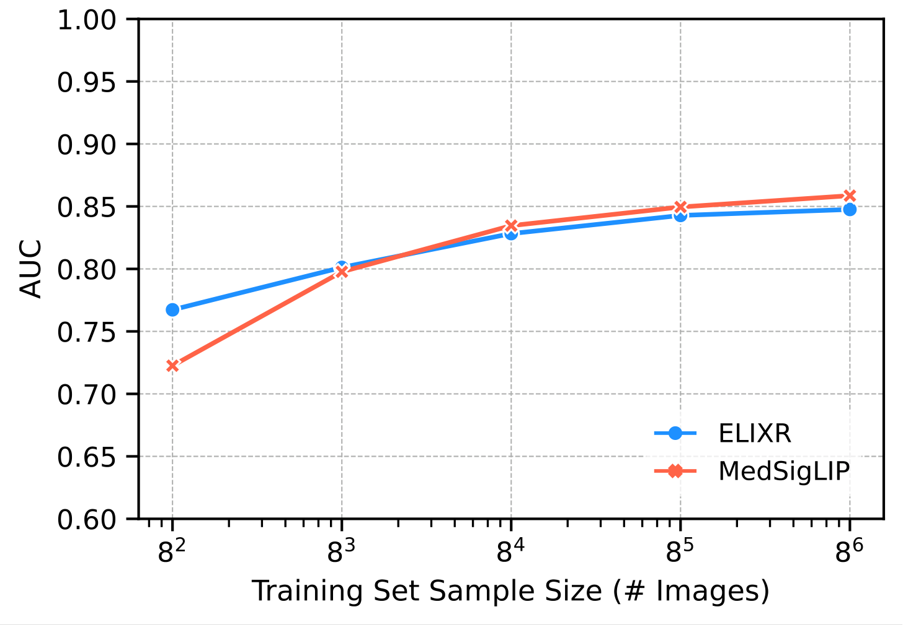

# MedSigLIP

**[[entities/medgemma]] の視覚エンコーダを単独で公開したもの**（Google Research + Google DeepMind, arXiv:2507.05201）。**SigLIP-400M を 3,300 万超の医療画像–テキスト対で微調整**した 4 億パラメータの医療画像エンコーダ。詳細: [[sources/medgemma]] §2.2.2 / §6-7。

## 一言で

**医療画像を「読める」ようにした [[entities/siglip]]**。単独で**ゼロショット分類と画像検索**に使え、**linear probe（データ効率的分類）**では胸部 X 線専用の CXR Foundation（ELIXR）を上回る。しかも**解像度は 448² と相手の 1280² より不利で、かつ多領域兼任**である。

## 由来と作り方

```
SigLIP-400M（WebLI で事前学習）
    ↓  医療画像–テキスト対 3,300 万超で微調整
    ↓  内訳: 各種モダリティ 63.5 万 + 組織病理パッチ 3,260 万（98%）
    ↓  ★ 元の WebLI を残し、医療データは 2% の重みで混合
MedSigLIP
```

**混合比 2% が設計の核心**である。医療データを主役にしないことで、SigLIP の既存の性能を保持したまま医療の識別能力を足している。

## 解像度: 448² と 896² は同一重み

| 用途 | 解像度 | 備考 |
|---|---|---|
| **MedGemma 4B の内部** | **896×896** | [[entities/gemma-3]] との互換性・一貫性のため |
| **公開される MedSigLIP** | **448×448** | 効率的な実験とコミュニティによる適応のため |

> 448² のエンコーダは 896² のエンコーダと**同じモデル重みを共有**しており、唯一の違いは、より少ない入力パッチで動作するように**位置埋め込みをダウンサンプル**していることだけ。

**多くの医療視覚タスクは 448² で十分に機能した**（[[sources/medgemma]] 表15）というのが根拠。計算量は約 1/4 になる。医療画像は高解像度が必須と思われがちだが、少なくとも本論文の評価範囲では成り立たなかった。

## カバーするモダリティ

胸部 X 線 / 皮膚科 / 眼科（眼底）/ 組織病理学の 4 領域。訓練データの 98% は組織病理パッチだが、評価は 4 領域すべてで行われている。

## 評価方法

| 方式 | やり方 |
|---|---|
| **ゼロショット分類** | クラスごとにテキストプロンプトを用意（複数ある場合は埋め込みを平均）→ 画像埋め込みとの**コサイン類似度** → softmax → **AUC** |
| **linear probe（データ効率的分類）** | **テキストエンコーダを使わず**画像埋め込みのみ抽出 → **SAGA ソルバでロジスティック回帰**を訓練 → テストセットで評価 |

linear probe は [[concepts/knn-evaluation-protocol]] と同系統の**凍結特徴量評価**で、「エンコーダの表現がどれだけ線形分離可能な情報を持っているか」を測る。

## 主要結果

**ゼロショット（胸部 X 線）**: **CXR Foundation（ELIXR ベース）を平均 2.0% 上回る**。解像度 **448² 対 1280²** という不利、かつ多領域兼任でこれを達成。

<figure>



<figcaption>図5（再掲）: CheXpert と CXR14 の 7 所見の linear probe 平均 AUC。横軸は訓練サンプル数（8² = 64 枚 〜 8⁶ ≒ 26 万枚）、縦軸は AUC。赤が MedSigLIP、青が ELIXR。</figcaption>
</figure>

**linear probe には非自明な細部がある。** 最小の **8²（64 枚）では MedSigLIP 0.72 < ELIXR 0.77 と負けており**、逆転するのは **8³（512 枚）以降**。以後 8⁶ まで一貫してわずかに上回る。**「データ効率的」と銘打ちながら、最もデータが少ない領域ではむしろ専用エンコーダが強い**——多領域兼任の代償と読める。所見別の内訳は [[translations/medgemma]] の図A1（CheXpert）/ 図A2（CXR14）にある。

**比較対象の制約**: HAI-DEF の **Derm Foundation と Path Foundation は画像のみのモデル**（テキストエンコーダを持たない）なので、**ゼロショット分類での比較が不可能**。この 2 領域では linear probe のみの比較になる。

## 使いどころ

- **医療画像検索**: 画像埋め込みで類似の過去症例を引く。論文が §8 で「解釈の補助、研究コホートの開発、教育ツール」として挙げている
- **データ効率的分類**: ラベルが数百枚しかない状況で、埋め込み + ロジスティック回帰で分類器を作る
- **ゼロショット分類**: テキストプロンプトだけで新しい所見を分類
- **[[entities/medgemma-1-5]] では凍結された**。1.5 では MedSigLIP をそのまま固定し、言語デコーダのみ追加訓練している

## 系譜・位置づけ

- **[[entities/siglip]] の医療派生**。sigmoid 損失による対比学習という骨格はそのまま
- **[[entities/internvit-300m]] と同じ立ち位置**——大きな MLLM の視覚エンコーダを独立した資産として切り出して公開する、という設計思想
- **[[entities/eva-x]] とは対照的**。EVA-X は胸部 X 線に絞り **6M〜22M** で CXR14 mAUC 82〜83 を出す。MedSigLIP は **400M で 4 領域を兼任**する。**特化の深さ vs 汎用の広さ**というトレードオフの両端
- **[[concepts/weakly-supervised-pretraining]] の医療応用**でもある。画像–テキスト対から学ぶという枠組みを、Web データから医療データへ持ち込んだ形

## 弱点

- **極少データ領域（〜数百枚）では専用エンコーダに劣る**
- 訓練データの中核（Internal histopathology 3,260 万パッチ）が**非公開**
- 訓練データの 98% が病理パッチという**偏り**があり、他モダリティは相対的に薄い
- ゼロショット性能はプロンプトの書き方に依存する（クラスごとに複数プロンプトを平均する運用が必要）

## 公開

- <https://goo.gle/medgemma> / HAI-DEF: <https://goo.gle/hai-def>
- 400M パラメータ、448×448 入力

## 関連ページ

- [[sources/medgemma]] — 原典（§2.2.2 が作り方、§6-7 が評価）
- [[translations/medgemma]] — 全文和訳（Appendix C に所見別の linear probe 結果）
- [[entities/medgemma]] / [[entities/medgemma-1-5]] — このエンコーダを使う本体
- [[entities/siglip]] / [[sources/siglip]] — 出自
- [[entities/internvit-300m]] — 同じ「MLLM の視覚エンコーダを独立公開する」設計
- [[entities/eva-x]] — 単一モダリティ特化という対照的な選択
- [[concepts/medical-foundation-model]] — 医療基盤モデルの類型
- [[concepts/knn-evaluation-protocol]] — 凍結特徴量評価の系統
