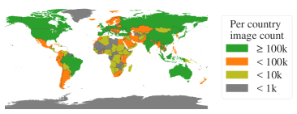

# SA-1B（Segment Anything 1 Billion）

## 概要

**SA-1B** = **Segment Anything 1 Billion**。Meta AI FAIR が SAM（[[entities/sam]]）の訓練のために構築・公開した、**史上最大のセグメンテーションデータセット**。**11M 画像 × 1.1B マスク**で、既存最大のセグメンテーションデータセット Open Images（2.7M マスク）の **400 倍** のマスク数を持つ。

- 公式: <https://ai.facebook.com/datasets/segment-anything>
- ダウンロード: <https://ai.facebook.com/datasets/segment-anything-downloads>
- ライセンス: **研究目的のみ**（SAM モデル自体は Apache 2.0）
- 公開: 2023 年（SAM 論文と同時）
- 詳細: [[sources/segment-anything]] §4-5, §F.1

## 基本仕様

| 項目 | 値 |
|---|---|
| 画像数 | **11,000,000**（1,100 万） |
| マスク数 | **1,100,000,000**（11 億） |
| 画像 1 枚あたり平均マスク数 | **約 100** |
| 平均解像度（元） | 3300 × 4950 px |
| 公開解像度 | 短辺 1500 px にダウンサンプル |
| マスク生成方法 | **99.1% が SAM による完全自動生成**（[[entities/sam]] のデータエンジン段階 3） |
| マスク品質 | 94% のマスクが専門家修正版と 90% 超 IoU（先行データセットのアノテーター間整合性 85-91% を上回る） |
| プライバシー処理 | 顔・ナンバープレートは RetinaFace + 独自モデルでぼかし |

## なぜ「11 億マスク」になったか：データエンジン

人手アノテーションで 11 億マスクは不可能（COCO の 1 マスクあたり 90 秒で 1 億マスク作るのに 2,855 人 × 1 年）。SAM チームは **モデル支援でアノテーションをスケールする「データエンジン」** を構築した：

| 段階 | 方法 | 期間中の SAM の役割 | 収集 |
|---|---|---|---|
| **1. assisted-manual** | アノテーターが SAM 補助のブラウザツールで前景/背景点をクリック | 既存セグメンテーションデータで初期訓練 → 6 回再訓練（ViT-B → ViT-H へ） | 120k 画像 / 4.3M マスク（34s → 14s/マスク） |
| **2. semi-automatic** | SAM が自信あるマスクを事前充填、アノテーターが「残りの less prominent オブジェクト」を追加 | 5 回再訓練 | +180k 画像 / +5.9M マスク（計 10.2M、画像あたり 44 → 72 マスク） |
| **3. fully automatic** | SAM に 32×32 点グリッドをプロンプト、IoU/安定性で NMS フィルタ + ズームインクロップ | 曖昧性対応モデル + 信頼度・安定性スコアで自動選別 | **11M 画像 / 1.1B マスク** |

SA-1B として **公開されるのは段階 3 の完全自動マスクのみ**（手動・半自動マスクは公開せず、内部利用のみ）。

> **補足: なぜ「自動マスクのみで十分か」を著者は確認している** — §7.6 のアブレーション（図 13 左）で「3 段階すべて vs 段階 3 のみで訓練した SAM の性能はほぼ同等（差 0.5 mIoU）」と検証。「手動・半自動マスクは段階 3 の SAM を作るために必要だったが、最終データセットには不要」というブートストラップ的構造。

## 既存データセットとの比較

| データセット | 画像数 | マスク数 | 画像あたりマスク | リリース |
|---|---|---|---|---|
| **SA-1B** | **11M** | **1.1B** | **100** | 2023 |
| Open Images V5 | 1.74M | 2.68M | 1.5 | 2018 |
| COCO | 0.118M | 0.86M | 7.3 | 2014 |
| LVIS v1 | 0.118M | 1.27M | 10.8 | 2019 |
| ADE20K | 0.025M | 0.71M | 28 | 2019 |

- **画像数**: Open Images 比 11×、COCO 比 93×
- **マスク数**: Open Images 比 **400×**
- **画像あたりマスク数**: ADE20K 比 3.5×、Open Images 比 67×
- **解像度**: COCO（約 480×640）に対し SA-1B は短辺 1500 でも 3 倍以上

<figure>


<figcaption>図6（再掲）: SA-1B と他データセットの比較。(左) 画像あたりマスク数の分布、(中) 画像相対マスクサイズ、(右) マスク凹度。SA-1B は LVIS/ADE20K より画像コーナーカバレッジが大きく、COCO/Open Images の中心バイアスを緩和。</figcaption>
</figure>

## 地理的分布

著者はキャプションから NER で撮影国を推定（§C）。Open Images / COCO の北米偏重を緩和した点が特徴：

| 地域 | 画像数 | マスク数 | SA-1B % | COCO % | Open Images % |
|---|---|---|---|---|---|
| アフリカ | 300k | 28M | 2.8% | 3.0% | 1.7% |
| アジア＆オセアニア | 3.9M | 423M | **36.2%** | 11.4% | 14.3% |
| ヨーロッパ | 5.4M | 540M | 49.8% | 34.2% | 36.2% |
| ラテンアメリカ＆カリブ | 380k | 36M | 3.5% | 3.1% | 5.0% |
| 北米 | 830k | 80M | 7.7% | **48.3%** | **42.8%** |

- **高所得国 54.0%**（COCO 89.1%, Open Images 87.5% より大幅にバランス）
- **中所得国 45.0%**（COCO 10.5% より 4 倍）
- アフリカ・低所得国は全データセットで依然過少表現

<figure>



<figcaption>図7（再掲）: SA-1B 画像の推定地理分布。トップ 3 か国は世界の異なる地域から。すべての地域で少なくとも 2,800 万マスク（既存最大データセット総マスク数の 10 倍以上）。</figcaption>
</figure>

## アノテーションとプライバシー

- **アノテーターは 130 人、全員ケニア在住**（[[sources/segment-anything]] §F.2）
- 時給制、B Corporation 認定ベンダー
- **画像はサードパーティ写真プロバイダからライセンス取得**（写真家と直接連携）
- 顔: **RetinaFace** モデルでぼかし
- ナンバープレート: 独自モデルでぼかし
- キャプション付き（撮影内容と場所の自由形式テキスト）、ただし **プロバイダ要件で非公開**（地理分析の内部使用のみ）

## マスクの特性

- **意味カテゴリは付随しない**: 「対応するクラスラベル」「テキスト記述」を持たない純粋なマスクのみ
- **stuff と things 両方を含む**: 「物体」（人、車）と「物質」（空、草、水）の区別なし
- **入れ子（nested）マスクが豊富**: 全体・部位・部分の階層が画像内に複数存在
- **凹度分布は他データセットと類似**: 自動生成でも形状の複雑さが偏らない

## 公開条件と制約

- **研究用途のみ**: ライセンス契約への同意が必要
- **個人特定の試みは禁止**（顔ぼかしを回避する試みも禁止）
- **削除リクエスト**: segment-anything@meta.com で受付（顔ぼかしの不備、不適切画像）
- **「raw」画像は非公開**: ダウンサンプル + 顔・ナンバープレートぼかし版のみ
- **古いバージョンは保持しない**: 削除リクエスト処理後の最新版のみ
- **テスト用に 2k 画像を保留**

## SA-1B の影響

- **後続セグメンテーション foundation model の基盤**: SAM 2（[[entities/sam-2]]、SA-1B を訓練データに含む）、MobileSAM、HQ-SAM などが SA-1B または SA-1B 学習済み SAM を基に開発
- **「データエンジン」パラダイム**: モデル支援アノテーションを大規模に回す手法は、後の DALL-E 3 のキャプション再生成や Llama 3 の合成データ生成にも影響
- **VLM の vision tower 候補**: SA-1B 由来のオブジェクトレベル特徴量は LLaVA-NeXT 系統で CLIP + DINOv2 と並んで使われ得る
- **競合の出現**: V3Det（V3Det, 13M ボックス）、LVIS-Inst（インスタンス特化）、SA-V（動画版）など

## 限界・批判

1. **意味ラベルなし**: クラスやキャプションがないので、セマンティック理解の基盤としては単独では使えない
2. **アフリカ・低所得国の過少表現**: 改善はしたが、依然格差あり
3. **写真家バイアス**: 「人が興味を持って撮影する物体」に偏る
4. **modal/amodal の規約なし**: マスク作成方針が単純化されているため、特定の応用には不向き
5. **画像プロバイダ依存**: Web crawl ではなくライセンス取得なので、特定の年代・スタイルに偏る可能性
6. **2k のテストセットも非公開**: ベンチマーク独立検証が難しい

## アクセス方法

```python
# Hugging Face datasets 経由（コミュニティミラー）
from datasets import load_dataset
ds = load_dataset("...")  # 利用条件への同意が必要

# 公式は <https://ai.facebook.com/datasets/segment-anything-downloads> から
# 段階的に zip ファイル（画像 + マスク JSON）として配布
```

## 関連ページ

- [[sources/segment-anything]] — SA-1B を構築した SAM 論文の要約
- [[entities/sam]] — SA-1B で訓練された / SA-1B を生成した SAM
- [[entities/sam-2]] — SAM 2 でも訓練ミックスに 10-15% で含まれる
- [[entities/sa-v]] — SAM 2 の対応データセット（動画版、CC by 4.0）
- [[concepts/promptable-segmentation]] — SA-1B が駆動するタスクパラダイム
- [[concepts/foundation-model]] — SA-1B が支える foundation model 像
- [[entities/wit-400m]] — CLIP の対応データセット（画像-テキスト対 4 億）
- [[entities/lvd-1689m]] — DINOv3 の対応データセット（純 SSL 用 17 億画像）
- [[overview]] — CV データセット全体俯瞰
