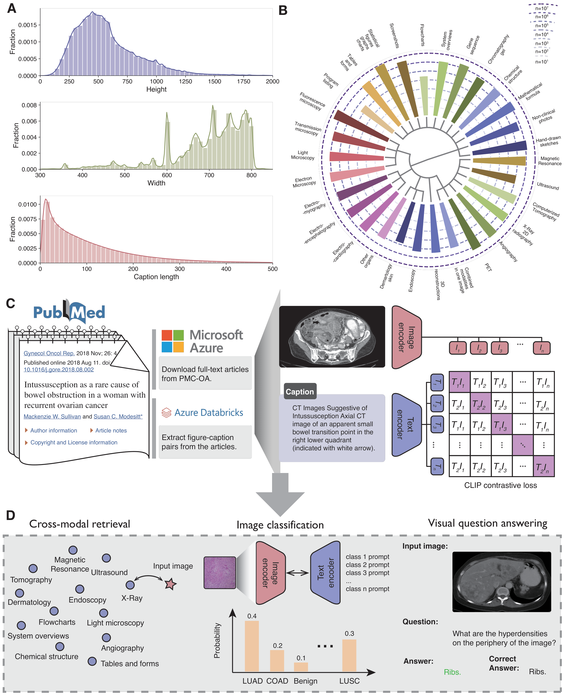
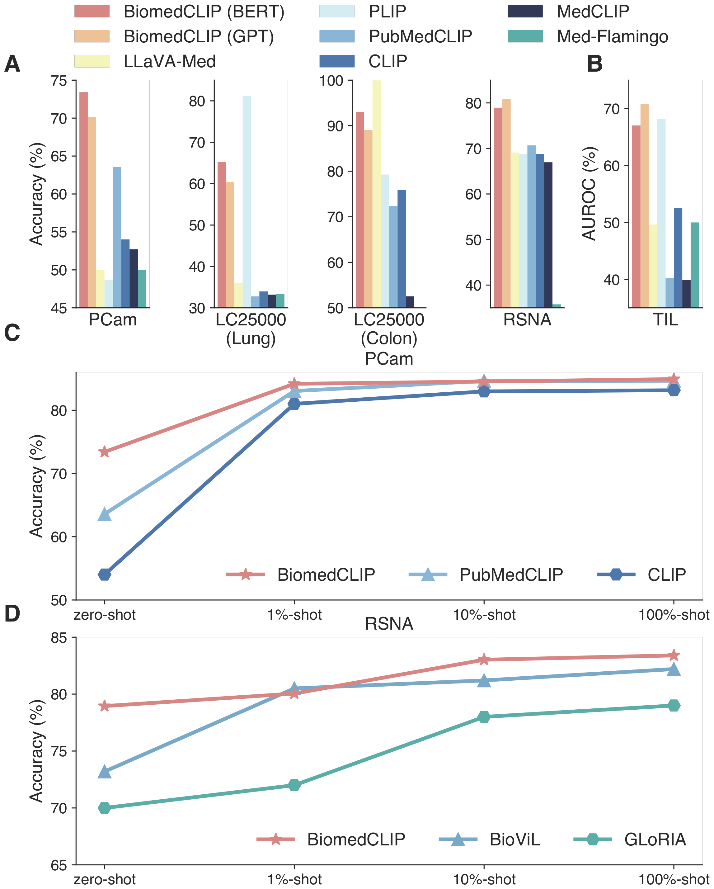

# BiomedCLIP: 科学論文の図とキャプションから作る生物医学の CLIP

> 原典: [[translations/biomedclip]] ・ `raw/papers/BiomedCLIP_ a multimodal biomedical foundation model pretrained from fifteen million scientific image-text pairs.md`
> 著者: Sheng Zhang, Yanbo Xu, Naoto Usuyama, Hanwen Xu ほか（Microsoft Research / University of Washington / Providence Genomics）
> 出典: arXiv:2303.00915
> モデル: <https://aka.ms/biomedclip>

## 一言まとめ

**論文の図とそのキャプションは、そのまま画像–テキスト対である。** PubMed Central の 440 万件の全文論文からそれを 1,500 万対（**PMC-15M**）掻き集め、[[entities/clip]] を生物医学向けに作り直した。**訓練データが全部公開されている**のが最大の特徴。

## 背景と問題意識

### 「医療画像–テキスト対がない」問題への回答

[[concepts/weakly-supervised-pretraining]] の枠組み（画像とテキストの対から対比学習で表現を作る）を医療に持ち込もうとすると、**対になったデータが決定的に足りない**。論文は既存データセットの限界を 3 つに整理する。

| 限界 | 具体 |
|---|---|
| **私的なデータ** | 訓練データが非公開 → モデル自体もアクセス不可能になる |
| **小さい** | MIMIC-CXR 377,110 対 / CheXpert 224,316 / ROCO 87,952 / ARCH 7,562 —— **7k〜377k のレンジ** |
| **多様性がない** | **その多くが胸部 X 線**。他のモダリティへ汎化しない |

**この 3 つを一度に解く着想が「論文の図を使う」だった。** 科学論文の図には必ずキャプションが付いている。しかも PMC-OA（PubMed Central Open Access Subset）は**公開**されている。440 万件の全文論文から図とキャプションを機械的に抜けば、**15,282,336 対**が得られる——MIMIC-CXR の**約 40 倍**である。

> **この着想は本 wiki の他の「データをどう手に入れるか」の系譜と並べると位置がはっきりする。**
>
> | 手法 | データの出どころ | 公開性 |
> |---|---|---|
> | [[entities/clip]] | Web の画像とその alt テキスト（WIT-400M） | **非公開** |
> | [[entities/sam]] | **データエンジン**（モデルとアノテータのループ） | 公開（SA-1B） |
> | [[entities/dfn]] | Web から小さな CLIP で選別 | データセットは公開 |
> | **BiomedCLIP** | **科学論文の図–キャプション** | **完全公開・再現可能** |
> | [[entities/medgemma]] | 病院の内部データ 3,260 万パッチ等 | **非公開** |
>
> 医療では「データを外に出せない」制約が強いので、**そもそも最初から公開されている場所を探す**という解き方が効く。

### 何が「生物医学の CLIP」を難しくするか

論文は PMC-15M の統計から 2 つの具体的なミスマッチを指摘する（図1A）。

- **画像が大きい**: 汎用領域の標準 224×224 より生物医学の画像はずっと大きい
- **キャプションが長い**: 標準 CLIP の既定の最大長 **77 トークン**に全然収まらない

**この 2 点目が本論文の設計の出発点**になる。文脈を 256 に伸ばすと PMC キャプションの 90% を覆える。

## 提案手法

### CLIP の 4 箇所を差し替える

<figure>

<figcaption>図1（再掲）: A は画像サイズとキャプション長の統計、B は上位 30 の画像型の分布（円周方向の対数目盛）、C は PMC → Azure Databricks → 対比学習というパイプライン、D は 3 つの下流タスク。</figcaption>
</figure>

骨格は CLIP の InfoNCE 損失そのままで、**領域に合わない部品だけを取り替える**。

| 箇所 | CLIP | **BiomedCLIP** | 効果（検証 R@1） |
|---|---|---|---|
| **テキストエンコーダ** | GPT-2（白紙から） | **PubMedBERT**（生物医学で事前学習済み） | 64.53 → **69.03** |
| **トークナイザ** | Byte-Pair Encoding | **WordPiece** | 同上 |
| **文脈長** | 77 | **256**（PMC キャプションの 90% を覆う） | 69.03 → **73.50** |
| **視覚エンコーダ** | ViT-B/16 or ResNet | **ViT-B/16**（S → M → B で単調に改善） | 69.45 → 71.85 → **73.50** |

> **補足: なぜ BPE でなく WordPiece か** — BPE はすべての単語を文字に砕いてから頻度に基づいて貪欲に大きなトークンを作る。生物医学の用語（"adenocarcinoma", "pneumothorax" など）は汎用コーパスでの頻度が低いので**細かい断片に砕かれてしまう**。WordPiece はユニグラムの尤度に基づくので、領域特有の語彙（PubMedBERT の 30k）と組み合わせれば専門用語を 1 トークンで持てる。

### アブレーションが本論文の最良の部分

Supplementary Note に体系的なアブレーションがあり、**そこで最も価値があるのは「検証で良くなったのに下流で悪くなった」ケースが 2 つ記録されていること**である。

**(1) 解像度 224 → 384**

| | 検証 R@1 | 下流ゼロショット分類の平均 | 訓練時間 |
|---|---|---|---|
| **224px** | 82.90 | **75.52** | **1.00x** |
| 384px | **84.63** | **70.37** | 1.92x |

**検証は +1.7pt 良くなるのに、下流は −5.2pt 悪くなる。しかも訓練時間は倍。** PCam は 73.41 → 67.15、TCGA-TIL は 67.04 → 57.00 と大きく落ちる。**224 が採用された。**

**(2) バッチサイズ 4k → 64k**

| | 検証 R@1 |
|---|---|
| 4k → 4k | 83.98 |
| 4k → 64k | **87.32** |

検証は +3.3pt 良くなるが、**「その利得はバッチサイズ 4k に達した後の下流の評価には転移しない」**。著者の説明は「極端に大きなバッチは**より多くの訓練データ**とより長いエポックを要する。CLIP は 4 億対だが PMC-15M は 1,500 万対である」。**4k が採用された。**

**(3) ImageNet 初期化 vs ランダム初期化**

検証ではほぼ同点（83.15 vs 82.90）だが、**「我々の下流タスクでは ImageNet で事前学習された重みがより安定した性能を提供する」**ため ImageNet 初期化を採用。

> **3 つとも「検証指標を信じて選んでいたら間違えていた」ケースである。** これは [[sources/l2rw]] の「Random ベースラインが既存手法を全部倒した」と同じ種類の教訓——**代理指標の改善が本番の改善を意味するとは限らない**。CLIP 系の研究では検証セットの retrieval R@1 が事実上の開発指標として使われがちなので、この記録は実務的に価値が高い。

### 実装

OpenCLIP ベース、**A100 または V100 を 16 台**、PyTorch DDP。勾配チェックポインティング + bfloat16 AMP + **sharding contrastive loss**（InfoNCE と同一の勾配を保ちつつ各 GPU で局所的に必要な類似度だけ計算してメモリを削る）。AdamW、peak lr 5e-4、32 エポック。

## 実験結果と知見

### クロスモーダル検索 — 汎用 CLIP が壊滅する

**表**: PMC-15M の 725,739 対のテストセットにおける検索（原典 図2A より）

| Model | txt2img R@1 | R@5 | R@10 | img2txt R@1 | R@5 | R@10 |
|---|---|---|---|---|---|---|
| **BiomedCLIP (BERT)** | **69.60** | **86.30** | **90.20** | **70.10** | **86.40** | **90.20** |
| BiomedCLIP (GPT) | 59.60 | 80.40 | 85.70 | 60.00 | 80.10 | 85.30 |
| CLIP | 8.48 | 16.20 | 20.10 | 7.91 | 15.50 | 19.50 |
| **PubMedCLIP** | **1.00** | 2.51 | 3.59 | **0.79** | 2.13 | 3.08 |

**汎用 CLIP は R@1 で 8% 前後**しか出ない。70 万候補からの検索とはいえ、BiomedCLIP の 70% と比べて**桁が違う**。

**そして PubMedCLIP は R@1 が 1% を切る。汎用 CLIP の 1/8 である。** 論文は驚きを隠さず、原因を訓練データに帰す——「**PubMed にちなんで名付けられているにもかかわらず、PubMedCLIP は放射線画像の小さな集合しか用いていない**」（ROCO の 8 万対）。

> **これは「ドメイン適応は必ず得になる」という素朴な期待への強い反例である。** 狭いデータ（放射線 8 万対）で汎用モデルをファインチューニングすると、**元の汎用能力を失ったうえに新しい領域も広くはカバーできない**という最悪の組み合わせが起こりうる。[[sources/medgemma]] が **WebLI を残して医療を 2% だけ混ぜる**という慎重な配合を選んだのは、まさにこの失敗を避けるためだと読める（[[concepts/medical-foundation-model]] 参照）。

**なお本文の記述と図の数値が食い違う。** 本文は「上位 5 件は 77% 超、上位 1 件は 56% 超」と書くが、図2A のラベルは R@5 86.30 / R@1 69.60 である。どちらも「77% 超 / 56% 超」を満たしはするが、そういう書き方をする理由がなく、**評価設定が異なる可能性がある**。本ページでは図のラベル値を採る。

### 画像分類 — 放射線特化モデルを放射線で上回る

<figure>

<figcaption>図3（再掲）: A, B はゼロショット分類（TCGA-TIL は AUROC、他は精度）。C, D は PCam と RSNA の linear probe。D で BiomedCLIP のゼロショット 79.0 が BioViL のゼロショット 73.2 を上回り、10% で 83.0 に達して BioViL の 100% の 82.4 を超えている。</figcaption>
</figure>

**本論文の目玉は図3D である。**

> **BiomedCLIP はラベル付きデータのわずか 10% を用いるだけで、完全教師ありの BioViL を既に上回る。**

BioViL は **MIMIC-CXR で訓練された放射線科特化モデル**で、RSNA 肺炎検出はその本丸である。そこに、論文の図から作った雑多なデータで訓練した汎用生物医学モデルが勝つ。

**しかも論文はこの結果の解釈を潰しにかかっている。**

> 図1B に示すように、**BiomedCLIP の事前学習で用いられた放射線関連の画像は BioViL の事前学習で用いられた MIMIC-CXR より多くはなく**、画像–テキスト対はおそらくはるかにノイジーである。これは BiomedCLIP の RSNA における優れた性能が**より多くの放射線科特有の事前学習に由来する可能性を排除する**。

つまり「放射線データを多く見たから勝った」のではない。**非放射線科の画像型を含む多様性そのものが、放射線科の性能を上げた**——**正の転移（positive transfer）**である。本論文で最も主張の強い結論であり、[[concepts/medical-foundation-model]] に整理した「単一モダリティ特化 vs 多領域兼任」の議論に直接効く。

**ただしゼロショット分類は一枚岩ではない。**

| Dataset | BiomedCLIP (BERT) | BiomedCLIP (GPT) | 他の最良 |
|---|---|---|---|
| PCam | **~73.5** | ~70.1 | PubMedCLIP ~63.5 |
| LC25000 (Lung) | ~65.3 | ~60.6 | **PLIP ~81** |
| LC25000 (Colon) | ~93.0 | ~89.2 | **LLaVA-Med ~100** |
| RSNA | ~79.0 | **~81.0** | PubMedCLIP ~70.7 |
| TCGA-TIL (AUROC) | ~67.0 | **~70.5** | PLIP ~68 |

- **PLIP は LC25000 (Lung) で BiomedCLIP を 16pt 上回る**。医療 Twitter の病理画像で訓練された特化モデルが、自分の土俵では強い
- 一方 **PLIP は RSNA で崩れ、PCam でも 48.7 と低い**。論文は「PCam のリンパ節転移画像がソーシャルメディアのデータで過小表現だった」と推測
- **Med-Flamingo は RSNA で ~32 と壊滅**。「プロンプトのテンプレートやテスト例にかかわらずほとんど常に同じ答えを生成する」ため。few-shot 学習器として事前学習されたことの副作用
- **BiomedCLIP (GPT) 版が RSNA と TCGA-TIL で BERT 版を上回る**。検証の retrieval では BERT 版が圧勝（69.60 vs 59.60）なのに下流では逆転する——**これが 4 つ目の「検証と下流の乖離」**である

### VQA — 562B モデルと肩を並べる

**表**: 医療 VQA（原典 図4A より）

| Model | VQA-RAD Open | Closed | Overall | SLAKE Open | Closed | Overall |
|---|---|---|---|---|---|---|
| **BiomedCLIP** | **67.00** | 76.50 | 72.70 | 84.30 | **88.90** | 86.10 |
| BiomedGPT-B | 60.90 | 81.30 | 73.20 | 84.30 | 86.78 | 86.50 |
| LLaVA-Med | 64.75 | **83.09** | **75.80** | **87.11** | 82.50 | **87.00** |
| PubMedCLIP | 60.10 | 80.00 | 72.10 | 78.40 | 82.50 | 80.10 |
| CLIP | 59.90 | 79.40 | 71.30 | 78.60 | 81.00 | 79.50 |
| MAML | 56.00 | 77.90 | 69.20 | 76.80 | 80.60 | 78.30 |

**トークンレベル F1 では VQA-RAD で BiomedCLIP 73.13 vs Med-PaLM M（562B）62.06**。パラメータ数が 3 桁違う相手に 11pt 差をつけている。

**ただし全体精度では BiomedCLIP が最上位ではない。** LLaVA-Med が両データセットの Overall で勝ち（75.80 / 87.00）、BiomedGPT-B も VQA-RAD で勝つ（73.20）。論文はこれを「同等の性能」と表現しており、誇張ではないが、**BiomedCLIP が明確に勝っているのは開放型の質問（VQA-RAD Open 67.00）とトークンレベル F1** である。

> **そして LLaVA-Med は BiomedCLIP を中核の視覚エンコーダとして使っている。** つまり「BiomedCLIP に負けた」のではなく「BiomedCLIP の上に指示追従の層を足したものが勝った」。**本モデルの真の価値は下流で使われることにある**という読み方を支持する。

### プライバシー保護の代理 — 論文が言うより弱い

**着想は明快である。** 専有の患者データを外部モデル（GPT-4 など）に送れないなら、**BiomedCLIP でそれに最も似た PMC-15M の公開画像を探し、そちらを外部モデルに投げる**。患者データは外に出ない。

Providence から 980 枚の胸部 X 線と臨床レポートを集め、CheXbert ラベルの一致を測った。

**表**: 専有データと検索された PMC 画像のラベル一致（原典 図5B より）

| Condition | BiomedCLIP Recall@1 | F1@1 | PLIP Recall | CLIP Recall | CLIP F1 |
|---|---|---|---|---|---|
| Lung Opacity | **88.80** | 41.60 | 79.10 | 22.76 | 21.70 |
| Atelectasis | **95.04** | 25.20 | 84.40 | 51.77 | 20.90 |
| Pleural Effusion | 25.35 | 35.40 | 8.45 | 0.00 | 0.00 |
| **Cardiomegaly** | **6.99** | 12.20 | 0.44 | **36.24** | **32.40** |

**論文が本文で挙げるのは 88.80 と 95.04 だけで、これは 4 条件中の上位 2 つである。** 全体像はかなり違う。

- **F1 は 12〜42% と全条件で低い**。Atelectasis は recall 95.04 なのに F1 25.20——**再現率は高いが適合率が壊滅的**（＝関係ない画像も大量に「無気肺」として引いている）
- **Pleural Effusion の recall は 25.35** と低い
- **Cardiomegaly では BiomedCLIP 6.99 に対し CLIP が 36.24 と 5 倍良い**

論文は Cardiomegaly の負けには言及し、「**科学論文のキャプションは臨床レポートほど包括的にすべての状態を提示しているとは限らない**」と正直に説明している。これは PMC-15M というデータ源の本質的な限界の指摘として重要である。**論文の図は所見を網羅的に書く臨床レポートとは違い、その論文が言いたい 1 点だけを書く。**

## 限界・批判的視点

**論文自身が認めている点**

- **引用箇所（citances）を使っていない**。論文本文が図に言及する文も訓練信号になりうるが、PMC-15M には入っていない
- **画像の半分が複合図（composite figure）**。1 枚に複数パネルが詰まった図をそのまま 1 対として扱っている。PMC-Fine-Grained-46M で分割はしたが、**現在の用途は画像型の分布の集計だけ**で事前学習には使っていない
- キャプションが臨床レポートほど網羅的でない（プライバシー代理の Cardiomegaly の失敗）

**本 wiki の視点から見た限界**

- **PMC-15M の大半は医療画像ではない**。図1B の上位は「統計図表・グラフ・チャート」「表とフォーム」「フローチャート」「システム概要図」といった**汎用の科学図解**で、放射線・病理はその下に来る。「1,500 万の生物医学画像」という語感と実態にはずれがある。**正の転移が効いたのは事実だが、有効な医療画像の実数はもっと小さい。**
- **論文の図は「見せたい所見」しか写さない**。臨床画像が現場の分布からランダムに来るのに対し、論文の図は**発表に値するほど典型的か珍しいものに偏っている**。教育的には良いが、実地の有病率分布とは別物である。
- **評価がゼロショット / linear probe / VQA に閉じている**。セグメンテーションや検出のような密なタスクは扱っていない。
- **[[entities/medsiglip]] との直接比較がない**（時期的に不可能）。両者は「医療の CLIP 系エンコーダ」という同じ枠にありながら、**作り方が正反対**である（後述）。

## 既存 wiki との接続

**[[entities/medsiglip]] とは対照的な設計である。** どちらも医療の CLIP 系画像エンコーダで、同じ用途（ゼロショット分類・検索・下流の埋め込み）を狙っているのに、作り方が逆を向いている。

| | **BiomedCLIP**（2023, Microsoft） | **[[entities/medsiglip]]**（2025, Google） |
|---|---|---|
| **出発点** | PubMedBERT + ViT（ほぼゼロから） | **SigLIP-400M**（汎用で完成済み） |
| **データ** | **PMC-15M（1,500 万、完全公開）** | 医療 3,300 万（**内部データが中核、非公開**） |
| **配合** | **医療データが 100%** | **元の WebLI を残して医療を 2%** |
| **損失** | InfoNCE（softmax） | **sigmoid 損失**（[[entities/siglip]]） |
| **汎用性能** | 捨てている | **保持することが設計目標** |
| **解像度** | 224（384 は下流で悪化したため不採用） | 448（896 と同一重み） |
| **再現性** | **完全に再現可能** | 重みのみ公開 |

**「汎用性を捨てて専門性を取る」か「汎用性を保ったまま専門性を足す」か**という、[[concepts/medical-foundation-model]] の中心的な分岐の両端に位置する。そしてどちらも成功している——**目的が違うから**である。BiomedCLIP は生物医学の中で広く使える表現を作ろうとし、MedSigLIP は汎用 MLLM の視覚エンコーダとして機能しなければならない。

**PubMedCLIP の失敗が両者をつなぐ教訓になっている。** 狭いデータ（放射線 8 万対）で汎用 CLIP をファインチューニングした結果、**汎用 CLIP より 8 倍悪い**という最悪の結果になった。BiomedCLIP は「データを 2 桁増やして完全に置き換える」ことで、MedSigLIP は「元データを残して 2% だけ混ぜる」ことで、それぞれこの罠を回避している。

**[[entities/clip]] の直系の医療派生**でもある。損失も骨格も CLIP のままで、**領域に合わない部品（トークナイザ・文脈長・テキストエンコーダ）だけを取り替えた**という点で、[[concepts/weakly-supervised-pretraining]] のパラダイムが領域を越えて移植可能であることの実証になっている。

## 用語と略称

- **BiomedCLIP** = 本論文のモデル。ViT-B/16-224 + PubMedBERT/256
- **PMC-15M** = PubMed Central Open Access Subset から抽出した 15,282,336 の図–キャプション対
- **PMC-Fine-Grained-46M** = PMC-15M の複合図をパネルに分割し引用箇所も加えた拡張版（本論文では分布の集計にのみ使用）
- **PMC / PMC-OA** = PubMed Central / その Open Access Subset
- **PubMedBERT** = 生物医学の文献で事前学習された BERT（同じ Microsoft Research のグループ）
- **citance** = 論文本文中で図を参照している文
- **composite figure（複合図）** = 1 枚に複数パネル（A, B, C…）を含む図
- **InfoNCE** = CLIP の対比損失。バッチ内の正例対の類似度を上げ非対を下げる
- **WordPiece / Byte-Pair Encoding（BPE）** = サブワードのトークン化手法。前者はユニグラム尤度、後者は頻度に基づく貪欲な結合
- **patch dropout** = 訓練時に画像パッチの一部を落として効率を上げる手法
- **sharding contrastive loss** = InfoNCE と同一の勾配を保ちつつ GPU ごとに必要な類似度だけ計算する実装
- **Recall@k（R@k）** = 正解が上位 $k$ 件に入っている割合
- **linear probe** = エンコーダを凍結して線形分類器のみ訓練する評価。[[entities/medsiglip]] と同じ枠組み
- **ELEVATER** = 汎用領域の視覚–言語モデルの評価ツールキット
- **PCam（PatchCamelyon）** = リンパ節切片の 96×96 パッチ 327,680 枚、転移組織の有無の二値
- **LC25000** = 肺・結腸の組織病理画像 25,000 枚、5 クラス
- **TCGA-TIL** = TCGA の肺腺癌 H&E から切った 2,480 パッチ。**5.9% だけが陽性**で大きく不均衡
- **RSNA Pneumonia** = NIH の正面像胸部 X 線約 30,000 枚、肺炎の二値
- **VQA-RAD / SLAKE** = 医療 VQA の標準ベンチマーク。前者は**テスト画像が訓練にも現れる**、後者は現れない
- **METER / QCR / MAML** = VQA の枠組み。METER は co-attention 融合、QCR は条件付き推論、MAML は視覚のみの事前学習
- **CheXbert** = 放射線レポートから所見ラベルを自動抽出する分類器
- **BioViL / GLoRIA / ConVIRT / LoVT** = 胸部 X 線特化の視覚–言語事前学習手法
- **PLIP** = 医療 Twitter の OpenPath（約 20.8 万対）で訓練された病理特化 CLIP
- **PubMedCLIP** = ROCO（8 万の放射線対）で CLIP をファインチューニングしたもの
- **MedCLIP** = BioClinicalBERT + Swin、MIMIC-CXR / CheXpert でファインチューニング
- **Med-Flamingo** = OpenFlamingo-9B ベースの few-shot 学習器
- **LLaVA-Med** = **BiomedCLIP を視覚エンコーダに使う**指示追従モデル
- **Med-PaLM M** = Google の 562B マルチモーダル医療モデル

## 関連ページ

- [[translations/biomedclip]] — 全文和訳（Supplementary Note のアブレーション込み）
- [[entities/biomedclip]] — モデルとしての BiomedCLIP
- [[entities/pmc-15m]] — データセットとしての PMC-15M
- [[concepts/medical-foundation-model]] — 医療基盤モデルの類型。本モデルは「公開データによる領域特化事前学習」型
- [[entities/medsiglip]] / [[sources/medgemma]] — 正反対の設計（汎用を残して 2% 混合）
- [[entities/clip]] / [[sources/clip]] — 直接の祖
- [[concepts/weakly-supervised-pretraining]] — 画像–テキスト対から学ぶパラダイム
- [[concepts/contrastive-learning]] — InfoNCE の系譜
- [[entities/eva-x]] — 胸部 X 線特化 SSL。BiomedCLIP が「多様性で特化を上回った」相手の系統
- [[sources/l2rw]] — 「代理指標の改善が本番の改善を意味しない」という同型の教訓
