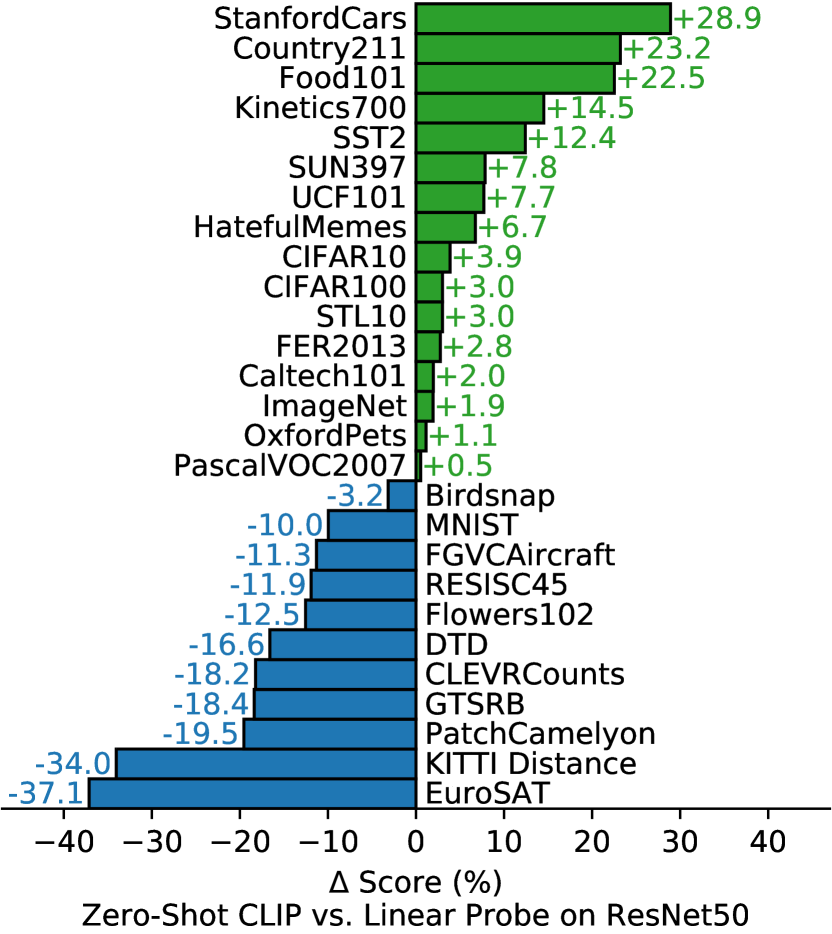
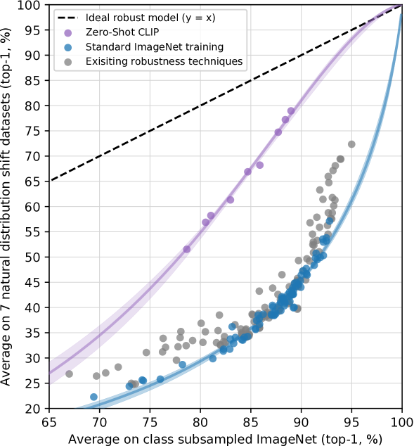

# CLIP: 自然言語の教師信号から転移可能な視覚モデルを学習する

> 原典: [[translations/clip]] ・ `raw/papers/Learning Transferable Visual Models From Natural Language Supervision.md`
> 著者: Alec Radford, Jong Wook Kim, Chris Hallacy, Aditya Ramesh, Gabriel Goh, Sandhini Agarwal, Girish Sastry, Amanda Askell, Pamela Mishkin, Jack Clark, Gretchen Krueger, Ilya Sutskever（OpenAI）
> 出典: arXiv:2103.00020（2021 年 2 月）→ ICML 2021

> 翻訳メモ: 本要約は CLAUDE.md §4 の標準ルールと異なり、**Appendix も翻訳済み**（[[translations/clip]] 参照）。ユーザー指示による特例。

---

## 一言まとめ

**「インターネット上の 4 億の（画像, テキスト）ペアを集めて、画像とその正しいキャプションを対比学習で結びつけるだけ」**で、ImageNet 等で訓練していないのに ResNet-50 同等のゼロショット分類性能（76.2%）を達成した、CV における基盤モデル時代の起点となった論文。**「a photo of a {class}」というプロンプトでクラス名をテキスト化するだけで、追加訓練なしに 30+ データセットの分類器が即座に動く**。30 以上のベンチマークで広範な評価を行い、自然分布シフトに対する頑健性が ImageNet 訓練モデルより圧倒的に高い（robustness gap を最大 75% 削減）ことを実証。後の **DALL-E, Stable Diffusion, LLaVA, BLIP, SigLIP, PE, GPT-4V, Claude Vision** すべての出発点となった、現代マルチモーダル AI の祖。

---

## 背景と問題意識

### この論文以前の状況

- **NLP では「ウェブテキストから事前学習 → ゼロショット転移」が主流に**: BERT, GPT-2, GPT-3 の成功。NLP モデルはタスクをテキストで記述するだけでファインチューニング不要に
- **CV では「ImageNet 教師ありで事前学習 → ファインチューニング」が依然支配的**: ImageNet は 1000 クラスの「ゴールドラベル」で、これを超える視覚的概念には別途データ収集が必要
- **画像-テキストペアからの学習は長い歴史を持つが、性能が貧弱だった**: [Joulin et al., 2016]、[Li et al., 2017]（Visual N-Grams）など。Visual N-Grams のゼロショット ImageNet 精度はわずか **11.5%**
- **同時期の弱教師あり学習**: Instagram ハッシュタグで事前学習する Mahajan et al.（2018）の WSL や、JFT-300M で訓練する BiT / ViT などが性能を伸ばしていた。しかし、これらは依然として「ImageNet 1000 / JFT 18291 という固定クラスを予測する」というパラダイム

### この論文が解決すべき問題

> **「NLP のように、自然言語の教師信号からウェブスケールで学習することで、CV にも汎用視覚モデルを作れるか？」**

OpenAI チームは 3 つのキーアイデアでこれに取り組む：

1. **データのスケール**: VirTex/ICMLM/ConVIRT は 10-20 万画像で訓練していたが、CLIP は **4 億画像-テキストペア**を新規収集（WIT, [[entities/wit-400m]]）
2. **訓練効率**: 「キャプションの単語を予測」より「**画像とキャプションが対になっているか予測する対比目的**」が **4 倍効率的**であることを発見
3. **ゼロショット転移**: テキストエンコーダを使って **「クラス名をテキストにして埋め込みを取り、それを線形分類器として使う」** という発想で、追加訓練不要の分類器を実現

---

## 提案手法

### A. 学習目的: 対比学習（contrastive learning）

詳細: [[concepts/contrastive-learning]]

```
バッチ N=32,768 の (画像, テキスト) ペア
   ↓
画像エンコーダ I → 画像埋め込み I_1, ..., I_N
テキストエンコーダ T → テキスト埋め込み T_1, ..., T_N
   ↓
N×N の類似度行列 sim(I_i, T_j) = I_i · T_j / (||I_i|| ||T_j||) × exp(τ)
   ↓
対称的なクロスエントロピー損失:
  L = (CE(行方向 softmax, 対角) + CE(列方向 softmax, 対角)) / 2
```

つまり、**バッチ内で正しい対を当てる多項分類**。InfoNCE 損失 [van den Oord 2018]、N-pair 損失 [Sohn 2016] の系統。

> **補足: なぜ対比目的が予測目的より効率的か** — 「画像から正確なキャプションを生成する」のは難しい（同じ画像にも無数の正しいキャプションがある）。一方「画像とキャプションがマッチしているか」を判定するのは**はるかに容易**で、必要なのは正しい対と他のすべての対を区別すること。これだけで意味的な埋め込み空間が学習される。

### B. データ: WIT（WebImageText）

詳細: [[entities/wit-400m]]

- **インターネットから 4 億（画像, テキスト）ペア**を新規収集
- 50 万のクエリ（テキスト検索語）を使い、各クエリにつき最大 20,000 ペアでクラスバランス
- GPT-2 の WebText データセットと同程度の総単語数

### C. アーキテクチャ

**画像エンコーダ**: 2 系統
- **ResNet 系**: RN50, RN101, RN50x4, RN50x16, RN50x64（EfficientNet 風に幅・深さ・解像度を同時スケール）
- **ViT 系**: ViT-B/32, ViT-B/16, ViT-L/14, ViT-L/14@336px（**最良のモデル**）

**テキストエンコーダ**: 6300 万パラメータの Transformer
- 12 層 × 512 幅 × 8 ヘッド
- BPE トークナイザ（語彙 49,152）
- 最大系列長 76
- **`[EOS]` トークンの最終層出力**をテキスト表現として使用
- 結合埋め込み空間に**線形射影**（非線形なし、ConVIRT との違い）

### D. 訓練

| 項目 | 値 |
|---|---|
| バッチサイズ | **32,768**（非常に大規模）|
| エポック | 32 |
| Optimizer | Adam + decoupled weight decay |
| Learning rate | コサインスケジュール |
| 温度 $\tau$ | **学習可能**（log-parameterized、100 倍以下にクリップ） |
| Mixed precision | あり |
| 訓練計算量 | RN50x64: 18 日 × 592 V100 GPU、ViT-L/14: 12 日 × 256 V100 GPU |

### E. ゼロショット推論

```
1. 各クラス名にプロンプトを付ける: "a photo of a {dog}", "a photo of a {cat}", ...
2. テキストエンコーダで各プロンプトを埋め込み → 線形分類器の重みになる
3. 画像を画像エンコーダで埋め込み
4. 画像埋め込みとテキスト埋め込みのコサイン類似度を計算、最大値を予測
```

これが **CLIP の革命的なポイント**: テキストエンコーダが**ハイパーネットワーク**として機能し、テキストから線形分類器の重みを生成する。

詳細: [[concepts/zero-shot-transfer]]

> **補足: プロンプトエンジニアリングとアンサンブル** — クラス名そのまま（例: `dog`）よりも `"a photo of a dog"` のようなプロンプトを使うと精度 +1.3%。さらに 80 種類の異なるプロンプト（`"a photo of a big dog"`, `"a satellite photo of ..."` 等）の埋め込みを**平均化**してアンサンブルすると追加で +3.5%。合計約 5% の改善。これが「prompt engineering」の起源の 1 つ。

---

## 実験結果と知見

### ゼロショット ImageNet 性能（§3.1）

| Method | ImageNet zero-shot |
|---|---|
| Visual N-Grams (2017) | 11.5% |
| ResNet-50 (教師あり, 128 万訓練例) | **76.2%** |
| **CLIP ViT-L/14@336px (ゼロショット)** | **76.2%** |

**訓練例ゼロで ResNet-50 と同等**。これが論文の最も印象的な結果。

### 30+ データセットでのゼロショット性能（§3.1.5）

<figure>



<figcaption>図5（再掲）: 27 データセットで完全教師あり ResNet-50 線形分類器とゼロショット CLIP を比較。CLIP は 27 のうち 16 で勝つ。</figcaption>
</figure>

- **強い領域**: STL10 (99.3%), Food101 (CLIP > RN-50 +20%), Stanford Cars, Kinetics-700 (+14.5%)
- **弱い領域**: 衛星画像（EuroSAT, RESISC45）、腫瘍検出（PatchCamelyon）、物体カウント（CLEVR）、交通標識（GTSRB）、距離推定（KITTI）

「専門的・抽象的タスクは弱い、一般的・自然な物体は強い」というはっきりした傾向。

### Few-shot との比較（§3.1.5）

**ゼロショット CLIP ≈ 4-shot ロジスティック回帰**（同じ CLIP 特徴量空間で）。

これは反直観的だが、「自然言語による概念の明示的指定」が「画像例からの暗黙的推論」より効率的だから、と説明される。

### 線形プローブ表現品質（§3.2）

- **27 データセット平均**: CLIP ViT-L/14@336px が EfficientNet-L2 (Noisy Student) を **+5%** で上回り SOTA
- **計算効率**: CLIP ViT は CLIP ResNet より **3 倍計算効率が良い**
- **iBOT/MAE/MoCo/BYOL/SimCLRv2 等の SSL を含む全比較で最良**

### 自然分布シフトへの頑健性（§3.3）— 論文の最重要発見

<figure>



<figcaption>図13（再掲）: ゼロショット CLIP は ImageNet 派生分布（V2, A, R, Sketch, ObjectNet 等）で標準 ImageNet モデルを大幅に上回り、robustness gap を最大 75% 削減する。</figcaption>
</figure>

| Model | IN | IN-V2 | IN-A | IN-R | ObjectNet | IN-Sketch |
|---|---|---|---|---|---|---|
| NS EfficientNet-L2 | 88.3 | 80.2 | 84.9 | 74.7 | 68.5 | 47.6 |
| ResNet-101 | 77.4 | 65.5 | 6.7 | 37.6 | 32.6 | 25.3 |
| **Zero-Shot CLIP** | 76.2 | **70.1** | **77.2** | **88.9** | **72.3** | **60.2** |

ImageNet 精度は同等の ResNet-101 と CLIP が、ImageNet-A では **CLIP 77.2% vs RN-101 6.7%** と圧倒的な差。

> **補足: なぜゼロショットが頑健か** — ImageNet で訓練されたモデルは、ImageNet 固有の偽相関（テクスチャに依存、特定の構図、撮影条件など）を学習してしまい、新しい分布ではそれらが崩れる。CLIP は ImageNet で訓練していないため、それらの偽相関を学べず、結果として「**本物の意味理解**」に基づく汎化が起こる、という解釈。これは「Effective Robustness」という概念で定量化される。

### 興味深い副次効果

- **OCR が emerge**: 訓練していないのに、テキストを含む画像を意味的に処理できる（Rendered SST2 で 80% 精度）
- **地理位置特定が可能**: 風景写真から国を推定（Country211 ベンチマーク自作）
- **動画行動認識**: 中央フレームだけで Kinetics-700 で ResNet-50 +14.5%
- **動詞の認識**: ImageNet の名詞中心教師信号と違い、自然言語は動詞も含む

---

## なぜこの研究が CV にとって重要か

1. **CV における基盤モデル時代の起点**: 「事前学習 → ゼロショット転移」というパラダイムを CV に持ち込んだ。後の DALL-E, Stable Diffusion, BLIP, LLaVA, GPT-4V, Claude Vision すべての出発点
2. **テキストと画像を結ぶ最初の本格的成功例**: マルチモーダル AI の基盤
3. **自然言語の教師信号の有効性を実証**: ImageNet の固定 1000 クラスを超えて、**任意のテキストで指定可能な分類器**を実現
4. **頑健性パラダイムシフト**: ImageNet 精度と OOD 性能は別物、ゼロショットモデルが頑健性で勝てることを示した
5. **公開モデルの広範な利用**: github.com/OpenAI/CLIP は CV/ML 界で最もダウンロードされたモデルの一つ
6. **後の競合モデル群の出発点**:
   - **OpenCLIP** (LAION, 2022): オープンソース再現＋ LAION-2B/5B で拡大
   - **SigLIP / SigLIP 2** (Google, 2023/2024): sigmoid 損失で効率化。[[entities/siglip]]
   - **Perception Encoder (PE)** (Meta, 2024): 86B ペアで超大規模化。[[entities/perception-encoder]]
   - **MetaCLIP, DFN, EVA-CLIP, BLIP-2** など多数

---

## 限界・批判的視点

論文 §6 が自ら明示している限界：

- **タスク学習の限界**: 細粒度分類（車種, 花種, 航空機）、抽象タスク（カウント, 距離推定）、新規タスク（PatchCamelyon の腫瘍検出）でほぼランダム
- **OOD 汎化の限界**: 「自然な分布」には頑健だが、本当に新しいドメイン（手書き MNIST）では失敗。CLIP の戦略は「巨大データで in-distribution にする」だけで、根本的な脆弱性は解決していない
- **クラスのみ予測、生成不可**: 画像キャプション生成のような柔軟性はない
- **データ効率の悪さ**: 32 epoch で 128 億画像（1 秒 1 枚で 405 年）を見る
- **少ショット学習の不自然さ**: ゼロショットから 1 ショット、2 ショットへの遷移で精度が**下がる**現象。人間は逆（54% → 76%）
- **検証セットへの暗黙的最適化**: ゼロショットを謳いつつ、ハイパーパラメータ調整に検証セットを繰り返し使った
- **社会的バイアス**: §7 で詳細に分析（後述）

### §7 Broader Impacts（広範な影響）の重要な指摘

- **クラス設計（class design）の問題**: CLIP は誰でもクラスを定義できる柔軟性ゆえ、設計次第で深刻なバイアスが出る
- **顔分類実験**: FairFace データセットで、`['animal', 'gorilla', 'chimpanzee', 'thief', 'criminal']` 等のクラスを含めると、**黒人画像の 14% が非人間カテゴリに分類**、男性画像の 16.5% が犯罪関連クラスに分類（女性は 9.8%）。0-20 歳が最も影響を受ける
- **「child」カテゴリを追加するだけで状況が大きく改善** → クラス設計の重要性
- **監視 (Surveillance)**: CelebA で 100 クラスから 59.2% の顔識別精度。商用認識ほどではないが、ノーチューニングでこれが出ることに警鐘

---

## 用語と略称

| 略称 | 展開 | 短い意味 |
|---|---|---|
| **CLIP** | Contrastive Language-Image Pre-training | 本論文の手法 |
| **WIT** | WebImageText | CLIP の訓練データ、4 億（画像, テキスト）対。[[entities/wit-400m]] |
| **ConVIRT** | Contrastive Visual Representation from Text | CLIP の直接の祖先（医療画像）|
| **VirTex / ICMLM** | 関連先行研究 | 画像キャプション予測 SSL |
| **Visual N-Grams** | Li et al., 2017 | CLIP 以前のゼロショット転移、IN 11.5% |
| **InfoNCE** | Information Noise Contrastive Estimation | CLIP が使う対比損失（symmetric CE 版）|
| **N-pair loss** | Sohn 2016 | 起源、多クラス対比 |
| **prompt engineering** | プロンプトエンジニアリング | `"a photo of a {class}"` 等の工夫 |
| **prompt ensembling** | プロンプトアンサンブル | 複数プロンプト埋め込みの平均化 |
| **zero-shot transfer** | ゼロショット転移 | 訓練していないタスクへの転移。[[concepts/zero-shot-transfer]] |
| **effective robustness** | 有効頑健性 | ID と OOD 性能の予測関係を超える改善 |
| **relative robustness** | 相対頑健性 | OOD 性能の絶対改善 |
| **WebText** | GPT-2 の訓練データ | WIT と類似サイズ |
| **GPT-3** | OpenAI の言語モデル | CLIP と同時期、few-shot/zero-shot の motivation |
| **DALL-E** | OpenAI の text-to-image | CLIP と並ぶ OpenAI のマルチモーダル成果。dVAE エンコーダを BEiT も利用 |
| **dVAE** | discrete VAE | DALL-E 由来、BEiT が CLIP との対比で言及 |
| **JFT-300M** | Google の私的画像-ラベルデータ | 比較対象 |
| **YFCC100M** | Yahoo Flickr Creative Commons 100M | 公開の画像-メタデータ集合 |
| **MS-COCO** | Microsoft COCO | 画像キャプションデータセット |
| **Country211** | CLIP 論文で新作成 | 地理位置特定ベンチマーク |
| **Rendered SST2** | CLIP 論文で新作成 | OCR + 感情分析ベンチマーク |
| **FairFace** | 顔データセット | バイアス研究用 |
| **FixRes** | 訓練・推論解像度ギャップ調整 | ViT-L/14@336px に応用 |
| **ImageNet-V2/A/R/Sketch** | ImageNet の派生 | 自然分布シフト評価 |
| **BPE** | Byte Pair Encoding | テキストトークナイザ |
| **CE** | Cross Entropy | 対比損失の基本 |
| **EMA** | Exponential Moving Average | このページでは出てこないが他の SSL で頻出 |
| **InceptionV4 / EfficientNet / BiT / SimCLRv2 / BYOL / MoCo** | 比較対象モデル | 詳細は対応エンティティ参照 |

---

## 関連ページ

- 翻訳: [[translations/clip]]
- 概念:
  - [[concepts/contrastive-learning]] — CLIP の中核の学習目的関数
  - [[concepts/zero-shot-transfer]] — CLIP が CV に持ち込んだ評価パラダイム
  - [[concepts/weakly-supervised-pretraining]] — CLIP が代表する系統の枠組み
  - [[concepts/foundation-model]] — CLIP は最初の本格的 CV foundation model
  - [[concepts/vision-transformer]] — CLIP-ViT の主要バックボーン
- エンティティ:
  - [[entities/clip]] — CLIP モデルファミリと OpenCLIP のスペックシート
  - [[entities/wit-400m]] — 訓練データ
  - [[entities/imagenet]] — ベンチマークの中心
  - [[entities/siglip]] / [[entities/perception-encoder]] — CLIP の主要後継・競合
  - [[entities/dinov2]] / [[entities/dinov3]] — CLIP に対抗する純粋 SSL 系統
