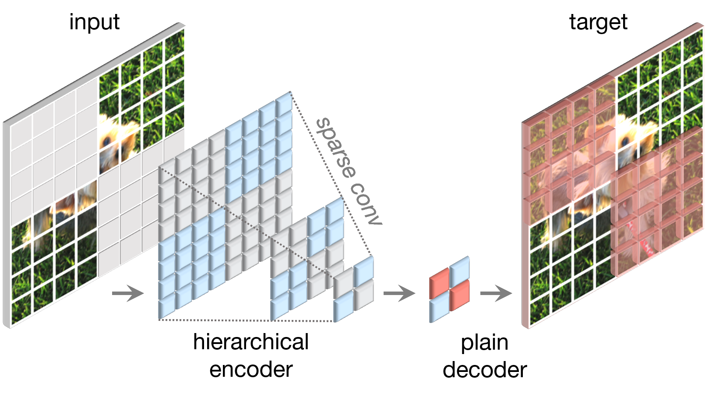
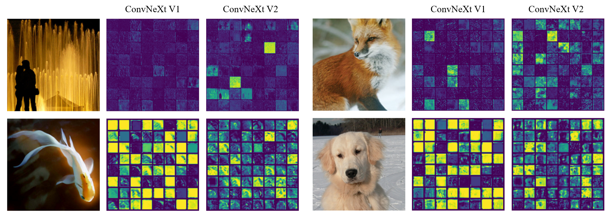
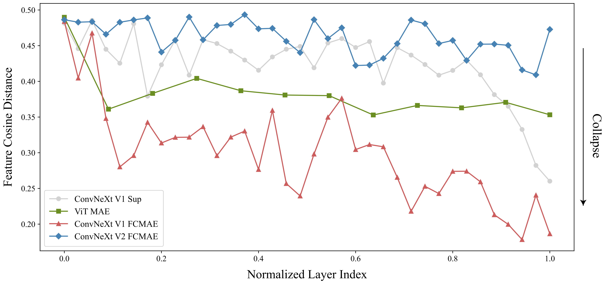
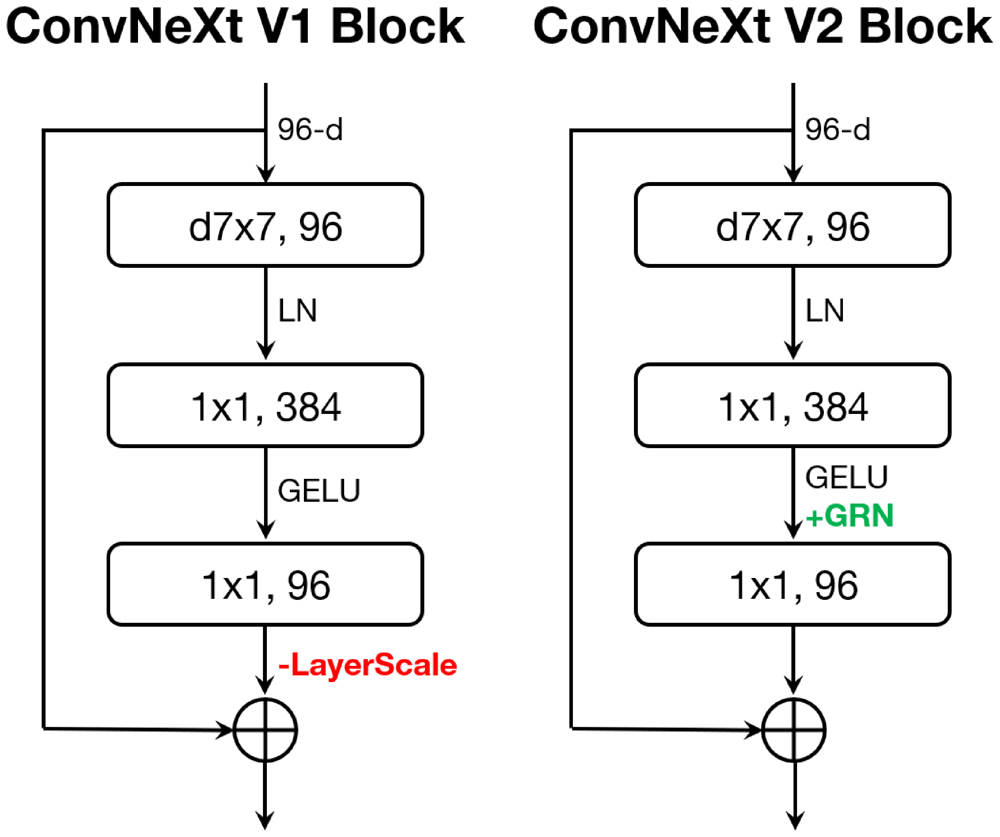
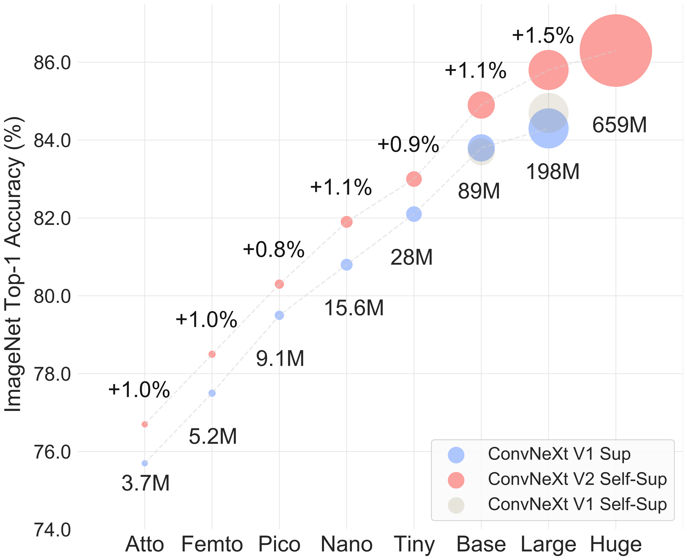

# ConvNeXt V2: マスクオートエンコーダによる ConvNet の共設計とスケーリング

> 原典: [[translations/convnext-v2]] ・ `raw/papers/ConvNeXt V2_ Co-designing and Scaling ConvNets with Masked Autoencoders.md`
> 著者: Sanghyun Woo, Shoubhik Debnath, Ronghang Hu, Xinlei Chen, **Zhuang Liu**, In So Kweon, **Saining Xie**（Meta AI / FAIR, NYU, KAIST）
> 出典: arXiv:2301.00808（2023 年 1 月）→ CVPR 2023
> コード: <https://github.com/facebookresearch/ConvNeXt-V2>

> 翻訳メモ: 対応する [[translations/convnext-v2]] は CLAUDE.md §4 の標準ルールと異なり **Appendix A〜D も翻訳済み**（ユーザーからの個別指示による）。原典 markdown には図 2・3・5 のみ画像があったため、残り 5 点は arXiv の e-print ソースから生成した。

---

## 一言まとめ

**[[sources/convnext|ConvNeXt V1]] に MAE（マスクオートエンコーダ）を素直に組み合わせると性能が出ない**——という失敗から出発し、原因が「**特徴崩壊**（チャネル間で活性化が冗長になる現象）」だと突き止め、**疎畳み込みによる FCMAE** と **GRN 層**の 2 つを *co-design*（共設計）することで解決した論文。**「CNN は MIM と相性が悪い」という V1 時点の制約を、CNN 側から正面突破した**。ImageNet で 88.9%（公開データのみで当時 SOTA）、3.7M の Atto から 659M の Huge まで 8 サイズを提供する。

---

## 背景と問題意識

### V1 が残した宿題

[[sources/convnext|ConvNeXt V1]]（CVPR 2022）は「訓練レシピと設計を揃えれば純粋 ConvNet は Swin を上回る」ことを示したが、**教師あり学習の土俵での話**だった。一方その頃 CV の表現学習は、ラベルなしの自己教師あり学習（[[concepts/self-supervised-learning]]）、特に **MAE（[[entities/mae]]）流のマスク画像モデリング**（[[concepts/masked-image-modeling]]）へ急速に移行していた。

そこで自然な問いが立つ。**ConvNeXt に MAE を載せればもっと強くなるのでは？**

### ところが素直に組み合わせると失敗する

著者らはまず、ConvNeXt-Base に MAE を素朴に適用してみて、うまくいかないことを確認している。

| 設定 | IN-1K ft |
|---|---|
| 教師あり 100ep | 82.7 |
| **教師あり 300ep（V1 の本来のレシピ）** | **83.8** |
| FCMAE 事前学習（V1 のまま） | 83.7 |

**自己教師あり事前学習をしても、教師ありに勝てない**。これは、MAE が ViT で教師ありを大きく上回るのとは対照的である。

原因は 2 つある。

1. **構造的な非互換**: MAE の効率は「エンコーダが可視パッチだけを処理する」非対称設計から来る。しかし ConvNet は密なスライディングウィンドウで動くので、**マスクされた領域からの情報漏洩（コピー＆ペーストのショートカット学習）を防げない**。入力側に学習可能なマスクトークンを置く素朴な解は、事前学習効率を下げ、かつテスト時にマスクトークンが存在しないため訓練・テストの分布不整合を生む。
2. **未知の学習挙動**: そもそも ConvNet と Transformer は特徴の学習の仕方が違うかもしれない。

### 論文の立て方 — co-design

ここが本論文の骨格である。**「アーキテクチャは教師あり学習で設計し、自己教師あり手法はそこに後から載せる」という業界の慣行そのものを疑う**。

> 自己教師あり学習における一般的な慣行は、教師あり学習のために設計された*あらかじめ決められた*アーキテクチャを用い、その設計を固定されたものとみなすことである。

著者らは代わりに、**枠組みとアーキテクチャを同じ土俵で一緒に設計する（co-design）**ことを提案する。これは既存 wiki の観点で言うと、[[entities/hiera]] が「MAE 互換であることを設計目標に据えて階層型 ViT を作り直した」のと同じ発想を、ConvNet 側で実行したものにあたる。

---

## 提案手法 1: FCMAE（完全畳み込み型マスクオートエンコーダ）

<figure>

<figcaption>図2: FCMAE の枠組み。マスクされた画像を「2D の疎な画素配列」とみなし、疎畳み込み（sparse conv）で可視部分のみを処理する。デコーダは単一の ConvNeXt ブロックという軽量なもので、エンコード済み画素とマスクトークンから画像を再構成する。損失はマスク領域のみで計算される。</figcaption>
</figure>

### 中核のアイデア: マスク画像を「疎データ」として見る

**マスクされた画像は 2D の疎な画素配列である**——この見方（3D 点群処理からの着想）が鍵。事前学習中はエンコーダの標準畳み込みを **submanifold sparse convolution** に置き換え、**可視データ点のみ**で演算する。

- **ファインチューニング時は特別な扱いなしに標準の密な畳み込みへ戻せる**。ここが実用上とても重要。
- 代替として「密畳み込みの**前後**に二値マスクを掛ける」実装も可能で、数値的に同一。理論上は計算量が多いが TPU 等では扱いやすい（論文本体の実験は TPU v3-256 で後者、GPU では MinkowskiEngine による前者）。

**この一点が決定的だった**:

| | IN-1K ft |
|---|---|
| 疎畳み込みなし | 79.3 |
| **疎畳み込みあり** | **83.7** |

**+4.4 ポイント**。情報漏洩を防ぐことがすべての前提になっている。

### その他の設計

- **マスク率 0.6**、マスク単位は 32×32 パッチ。マスクは最終段階で生成し、最も細かい解像度まで再帰的にアップサンプリング（階層型ゆえの工夫）。
  - 補足: [[entities/mae]] の 75% より低い。Appendix D のアブレーションでは 0.5〜0.7 が良く、0.6 が最良。
- **デコーダは単一の ConvNeXt ブロック**（次元 512）。UNet や Transformer デコーダも試したが、単一ブロックが精度同等（83.7）で**最速**（7.7 時間 vs UNet 12.9 時間、**1.7× 高速**）。ブロック数を増やしても改善しない（12 ブロックでは 83.3 に低下）。
- **再構成ターゲットはパッチ単位正規化画像の MSE**、損失はマスク領域のみ。ここは MAE と同じ。
- データ拡張は**ランダムリサイズクロップのみ**。

---

## 提案手法 2: GRN（Global Response Normalization）

### 発見: 特徴崩壊

FCMAE で事前学習した ConvNeXt V1 の活性化を可視化すると、**死んだ／飽和したチャネルが多数現れ、チャネル間で活性化が冗長になる**。著者らはこれを「特徴崩壊（feature collapse）」と呼ぶ。主に**次元拡大 MLP 層**（1×1 で 4 倍に広げる箇所）で起きていた。

<figure>

<figcaption>図3: 特徴活性化の可視化（各小正方形が 1 チャネルの活性化マップ、64 チャネル表示）。ConvNeXt V1（左列）は多くのチャネルが暗いまま、あるいは一様に飽和しており冗長。V2（右列）は多様な活性化パターンを保っている。</figcaption>
</figure>

定量化のため **特徴コサイン距離**（チャネル間の平均対ごとコサイン距離、高いほど多様）を層ごとに測る。

<figure>

<figcaption>図4: 特徴コサイン距離の層方向の変化。ConvNeXt V1 + FCMAE（赤）が全層で最も低く深刻な特徴崩壊を示す。ConvNeXt V1 教師あり（灰）は最終層付近でのみ低下する（交差エントロピー損失がクラス識別的な特徴に集中させるため）。ViT + MAE（緑）は中程度で安定。ConvNeXt V2 + FCMAE（青）が最も高く、多様性が全層で維持されている。</figcaption>
</figure>

> **補足: なぜ「多様性が高い＝良い」のか** — すべてのチャネルが似た反応をするなら、実質的なチャネル数が減っているのと同じで、モデルの表現容量が無駄になっている。教師あり学習では交差エントロピー損失が「クラスを区別する特徴だけ残せ」と圧力をかけるので終盤の低下は説明がつくが、**再構成が目的の FCMAE で全層が崩壊するのは異常**であり、これが性能不足の正体だと著者らは診断した。

### GRN の定義

チャネル間に**競合**を持ち込む。生物の**側方抑制**（活性化したニューロンが周囲を抑制し、応答の鋭敏さと集団としての多様性を高める仕組み）に着想を得ている。入力 $X\in R^{H\times W\times C}$ に対し 3 段階:

1. **大域的特徴集約**: 各チャネルを空間方向の **L2 ノルム**でスカラーに集約 → $gx=\{||X_1||,\ldots,||X_C||\}$
2. **特徴正規化**: **除法正規化** $\mathcal{N}(||X_i||) = ||X_i|| / \sum_j ||X_j||$ ——「そのチャネルは他と比べてどれだけ重要か」という**相対的重要度**
3. **特徴較正**: $X_i \leftarrow X_i * \mathcal{N}(\mathcal{G}(X)_i)$

最適化のため学習可能パラメータ $\gamma, \beta$（**ゼロ初期化**）と残差接続を加えた最終形:

$$X_{i}=\gamma*X_{i}*\mathcal{N}(\mathcal{G}(X)_{i})+\beta+X_{i}$$

ゼロ初期化 + 残差により、**GRN 層は最初は恒等写像として振る舞い、訓練とともに徐々に効いてくる**。実装は 3 行で済み、**追加パラメータも FLOPs も実質ゼロ**。

### アブレーションが示す設計の必然性（表2）

| 軸 | 結果 |
|---|---|
| **集約関数** | 大域平均プーリング 83.7 / L1 84.3 / **L2 84.6** — 広く使われる g.avg. が最悪 |
| **正規化関数** | 標準化 84.5 / $1/\sum$ 83.8 / **除法正規化 84.6** |
| **残差接続** | なし 84.0 / **あり 84.6** |
| **他の正規化との比較** | ベースライン 83.7 / LRN 83.2 / **BN 80.5** / LN 83.8 / **GRN 84.6** |
| **ゲーティングとの比較** | SE 84.4（109M）/ CBAM 84.5（109M）/ **GRN 84.6（89M、パラメータ増なし）** |
| **事前学習/FT での役割** | ft で外す 78.8 / ft でのみ足す 80.6 / **両方で使う 84.6** |

読みどころが 3 つある。

- **BN が 80.5 と大きく落ちる**。BN はバッチ軸に沿って空間的に正規化するため、**マスクされた入力とは根本的に相性が悪い**。V1 が BN→LN に切り替えていたことが、ここで効いてくる。
- **SE / CBAM でも 84.4-84.5 は出る**が、GRN は**追加パラメータ 0 で同等以上**（89M vs 109M）。
- **GRN は事前学習と FT の両方に入っていないと意味がない**（片方だけだと 78.8 / 80.6 と壊滅的）。アーキテクチャと学習枠組みが不可分だという co-design の主張を、最も直接的に裏づける実験。

Appendix D の構成要素分析（表16）も同じ方向を指す: 集約だけ（83.9）でも正規化だけ（**訓練が不安定化**）でもだめで、**両方揃って初めて 84.6** になる。

### ブロックへの組み込み

<figure>

<figcaption>図5: ConvNeXt V1 ブロック（左）と V2 ブロック（右）。V2 は次元拡大 MLP（1×1, 384）の GELU 直後に GRN を追加し、冗長になった LayerScale を削除している。それ以外の構造（d7×7 → LN → 1×1 → GELU → 1×1 + 残差）は V1 と同一。</figcaption>
</figure>

**変更は「GRN を足して LayerScale を消す」だけ**。V1 のブロック設計（[[entities/convnext]] 参照）はほぼそのまま残っている。

---

## 実験結果と知見

### co-design の効果が本体（表3）

| Backbone | Method | IN-1K ft |
|---|---|---|
| ConvNeXt V1-B | 教師あり | 83.8 |
| ConvNeXt V1-B | FCMAE | 83.7 |
| ConvNeXt V2-B | 教師あり | 84.3 (+0.5) |
| **ConvNeXt V2-B** | **FCMAE** | **84.6 (+0.8)** |
| ConvNeXt V1-L | 教師あり | 84.3 |
| ConvNeXt V1-L | FCMAE | 84.4 |
| ConvNeXt V2-L | 教師あり | 84.5 (+0.2) |
| **ConvNeXt V2-L** | **FCMAE** | **85.6 (+1.3)** |

**この表が論文の主張そのもの**である。

- **FCMAE だけ（V1 + FCMAE）では効かない**: 83.8 → 83.7、むしろ微減
- **GRN だけ（V2 + 教師あり）でも効きが小さい**: +0.5 / +0.2
- **両方揃うと大きく効く**: +0.8 / **+1.3**、しかも**モデルが大きいほど差が開く**

「アーキテクチャと学習の枠組みは一緒に設計せよ」という主張の、きれいな実証になっている。

### モデルスケーリング（図1、Appendix B 表14）

<figure>

<figcaption>図1: 8 サイズ（Atto 3.7M 〜 Huge 659M）での V1 教師あり（青）vs V2 自己教師あり（赤）の比較。全サイズで +0.8〜+1.5 ポイント上回り、モデルが大きいほど差が広がる。</figcaption>
</figure>

**表**: V1 教師あり → V2 + FCMAE の全 8 サイズ比較（Appendix B 表14 より）

| サイズ | params | V1 教師あり | V2 教師あり | **V2 + FCMAE** |
|---|---|---|---|---|
| Atto | 3.7M | 75.7 | 76.2 (+0.5) | **76.7 (+1.0)** |
| Femto | 5.2M | 77.5 | 78.0 (+0.5) | **78.5 (+1.0)** |
| Pico | 9.1M | 79.5 | 79.7 (+0.2) | **80.3 (+0.8)** |
| Nano | 15.6M | 80.8 | 81.2 (+0.4) | **81.9 (+1.1)** |
| Tiny | 28.6M | 82.1 | 82.5 (+0.4) | **83.0 (+0.9)** |
| Base | 89M | 83.8 | 84.3 (+0.5) | **84.9 (+1.1)** |
| Large | 198M | 84.3 | 84.5 (+0.2) | **85.8 (+1.5)** |
| Huge | 660M | — | — | **86.3** |

**マスク画像モデリングの利点がこれほど広いモデル範囲（3.7M〜660M）で実証されたのは本論文が初めて**、と著者らは主張する。MAE 系は従来 Base 以上の大モデルでしか恩恵が確認されておらず、**軽量モデルでも +1.0 出る**のは実務的に大きい。

### 他の MIM 手法との比較（表4）

| Backbone | Method | params | FT acc. |
|---|---|---|---|
| ViT-B | MAE (1600ep) | 88M | 83.6 |
| Swin-B | SimMIM (800ep) | 88M | 84.0 |
| **ConvNeXt V2-B** | **FCMAE (1600ep)** | 89M | **84.9** |
| ViT-L | MAE (1600ep) | 307M | 85.9 |
| Swin-L | SimMIM (800ep) | 197M | 85.4 |
| **ConvNeXt V2-L** | **FCMAE (1600ep)** | 198M | **85.8** |
| **ViT-H** | **MAE (1600ep)** | 632M | **86.9** |
| ConvNeXt V2-H | FCMAE (1600ep) | 659M | 86.3 |

- **SimMIM（Swin）は全サイズで上回る**
- **MAE（ViT）は Large まで互角**（198M vs 307M と**パラメータは 2/3 以下**で 85.8 vs 85.9）
- **Huge では ViT-H MAE 86.9 に対し 86.3 と負ける**。著者らは「巨大 ViT の方が自己教師あり事前学習からより多くを得られるためかもしれない」と正直に書いている

### IN-22K 中間ファインチューニング（表5）— 論文の看板数字

3 段階（FCMAE 事前学習 → IN-22K FT → IN-1K FT）で **ConvNeXt V2-H @512² が 88.9%**。**公開データのみを使う手法として当時の SOTA**で、MViTV2-H（88.8）、**[[entities/maxvit|MaxViT]]-XL（88.7、[[sources/maxvit]]）**、CoAtNet-4（88.1）を上回る。

Appendix B 表15 の指摘も鋭い: **V2-Base（86.8/87.7）が V1-Large（86.6/87.5）を、V2-Large（87.3/88.2）が V1-XLarge（87.0/87.8）を上回る**——つまり **1 段階上のモデルサイズに相当する性能が、共設計だけで手に入る**。

### 転移学習

| タスク | ConvNeXt V2-H + FCMAE | 比較 |
|---|---|---|
| COCO 検出（Mask R-CNN） | **55.7 AP^box / 48.9 AP^mask** | Swin V2-H SimMIM 54.4 AP^box |
| ADE20K セグ（UPerNet） | **55.0 mIoU**（22K ft, 640² で **57.0**） | Swin V2-H SimMIM 54.2 |

**ただし ADE20K の Base では Swin-B SimMIM 52.8 に対し V2-B 52.1 と負けている**。全面勝利ではなく、**大モデル領域で差が開く**というのが正確な読み方。

### Appendix 由来の知見

- **疎畳み込みは副産物として効率も上げる**（Appendix C）: 平均で **スループット 1.3×、最大メモリ 2× 削減**。ただし著者自身が「疎畳み込みライブラリは現代ハードウェア向けに高度に最適化されているわけではない」と留保している。
- **クラス選択性指標**（Appendix C）: 深い層で **V2 は二峰性、V1 は単峰性**になり、**V2 の方がクラス汎用的な特徴を多く含む**。クラス非依存的な特徴の方が転移しやすいため、これが下流性能の良さにつながるという説明。
- **MoCo v3（対比学習）との直接比較**（Appendix D）: 同じ ConvNeXt V2-B で教師あり 300ep 84.3 / MoCo v3 **83.7** / FCMAE **84.9**。**MIM が対比学習を上回るという ViT 側の知見が、ConvNet でも成立する**ことを示した。
- **セグメンテーションの初期化は自己教師あり重みを直接使わない**（Appendix A.4）: IN-1K 教師ありファインチューニング後の重みの方が良い。SimMIM も同じ運用。

---

## 限界・批判的視点

- **Huge 領域で ViT-H MAE に負ける**（86.3 vs 86.9）。IN-1K 事前学習のみの土俵では、最大規模では依然 ViT が上。
- **ADE20K の Base 領域で Swin-B SimMIM に負ける**（52.1 vs 52.8）。「Swin を全面的に上回る」わけではない。
- **疎畳み込みへの依存**は実装上の負担。外部ライブラリ（MinkowskiEngine）が要り、著者自身が最適化不足を認めている。TPU では密マスク実装に切り替えるなど、**環境ごとに実装を変える必要がある**のは V1 の「標準モジュールだけで作られた単純さ」という美点からの後退でもある。
- **評価が end-to-end ファインチューニングに偏っている**。著者らは「転移学習における実践的関連性のため」と明言しているが、**線形プロービングや k-NN（[[concepts/knn-evaluation-protocol]]）の結果が一切ない**。凍結特徴量の質は不明で、[[entities/dinov2]] のような「凍結して使う基盤モデル」との比較はできない。
- **言語との接続は依然として射程外**。V1 の限界としてこの wiki が指摘した「パッチ列表現が言語トークンと接続しやすい」という ViT の優位は、V2 でも何も変わっていない。実際その後も CLIP / MLLM の視覚エンコーダは ViT のままである。
- **細かい瑕疵**: Appendix D の冒頭で GRN が "Global **Relation Network**" と書かれているが、本文全体では "Global **Response Normalization**" であり、明らかな誤記。
- **本文と Appendix で V2-B FCMAE の数値が違う**（本文 §4 の 84.6 は 800 エポック、Appendix B 表14 の 84.9 は 1600 エポック）。矛盾ではないが、引用時は事前学習エポック数の明示が必要。

---

## 用語と略称

- **FCMAE** = Fully Convolutional Masked AutoEncoder（完全畳み込み型マスクオートエンコーダ）。本論文の事前学習枠組み
- **GRN** = Global Response Normalization（大域応答正規化）。チャネル間競合を生む正規化層
- **co-design（共設計）** = アーキテクチャと学習枠組みを固定せず一緒に設計すること。本論文の方法論的主張
- **特徴崩壊（feature collapse）** = チャネル間で活性化が冗長になり、死んだ／飽和したチャネルが増える現象。SSL の「表現崩壊」（[[concepts/self-supervised-learning]]）とは**別概念**で、こちらはチャネル多様性の話
- **sparse convolution（疎畳み込み）** / **submanifold sparse convolution** = 有効なデータ点のみで演算する畳み込み。もとは 3D 点群処理の技法
- **除法正規化（divisive normalization）** = 値を全体の総和で割る正規化。神経科学由来
- **側方抑制（lateral inhibition）** = 活性化したニューロンが周囲を抑制し、応答の選択性と集団の多様性を高める生物の機構
- **LayerScale** = 残差ブロック出力に学習可能な小スカラーを掛ける安定化手法。GRN 導入により V2 では削除
- **クラス選択性指標（class selectivity index）** = フィルタが特定クラスにのみ反応する度合い（0〜1）。低いほどクラス汎用的で転移しやすい
- **LRN** = Local Response Normalization、**BN** = Batch Normalization、**LN** = Layer Normalization
- **SE** = Squeeze-and-Excitation、**CBAM** = Convolutional Block Attention Module（いずれも特徴ゲーティング手法）
- **MIM** = Masked Image Modeling（[[concepts/masked-image-modeling]]）
- **Atto / Femto / Pico / Nano** = SI 接頭辞に由来する超軽量モデルの呼称（10⁻¹⁸ / 10⁻¹⁵ / 10⁻¹² / 10⁻⁹）
- **MoCo v3** = 対比学習型 SSL の当時の代表（[[entities/moco]]）
- **SimMIM** = Swin 向けの MIM 手法（[[concepts/masked-image-modeling]] 参照）

## 関連ページ

- [[sources/convnext]] / [[entities/convnext]] — 直接の前作。V2 は V1 のブロックに GRN を足しただけの最小変更
- [[entities/convnext-v2]] — ConvNeXt V2 のスペック・8 サイズ構成・系譜
- [[concepts/masked-image-modeling]] — 本論文が「CNN でも MIM は効く」を示した対象領域
- [[entities/mae]] / [[sources/mae]] — FCMAE の直接の下敷き。非対称エンコーダ・デコーダとパッチ正規化 MSE を継承
- [[entities/hiera]] — 「MAE 互換であることを設計目標にアーキテクチャを作り直す」という同じ発想の Transformer 側
- [[concepts/convolutional-neural-network]] — CNN の帰納バイアスと部品。BN がマスク入力と相性が悪い理由の背景
- [[concepts/self-supervised-learning]] — SSL 全体の中での位置づけ。「特徴崩壊」と「表現崩壊」の区別に注意
- [[entities/moco]] — Appendix D で比較された対比学習型 SSL
- [[sources/nfnet]] / [[entities/nfnet]] — 「BN はマスク入力と相性が悪い」の背景。BN の欠点を体系的に整理した論文
