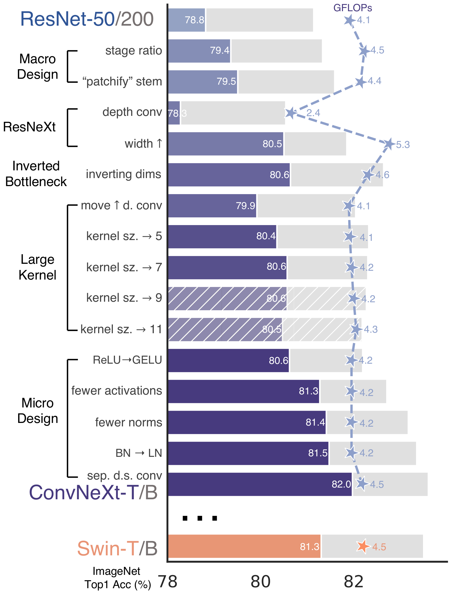
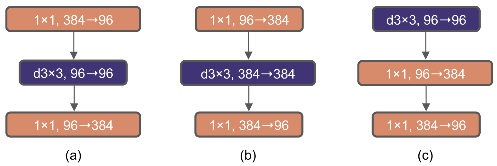
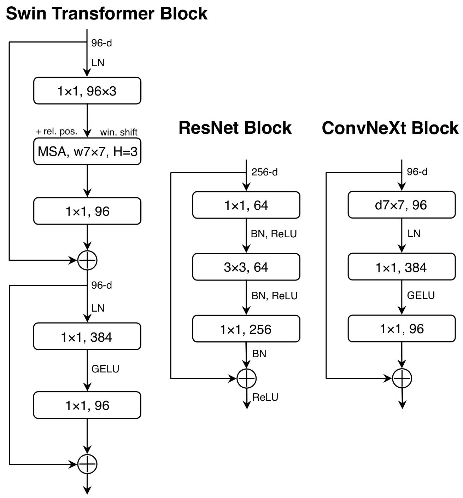

# ConvNeXt: 2020 年代のための ConvNet

> 原典: [[translations/convnext]] ・ `raw/papers/A ConvNet for the 2020s.md`
> 著者: Zhuang Liu, Hanzi Mao, Chao-Yuan Wu, Christoph Feichtenhofer, Trevor Darrell, Saining Xie（Facebook AI Research / UC Berkeley）
> 出典: arXiv:2201.03545（2022 年 1 月）→ CVPR 2022
> コード: <https://github.com/facebookresearch/ConvNeXt>

> 翻訳メモ: 対応する [[translations/convnext]] は CLAUDE.md §4 の標準ルールと異なり **Appendix A〜G も翻訳済み**（ユーザーからの個別指示による）。また原典 markdown には画像が含まれていなかったため、図は arXiv の e-print ソースに同梱された PDF から生成した。

---

## 一言まとめ

**ResNet-50 を出発点に、訓練レシピと設計選択を一つずつ Transformer 流に「近代化」していくと、attention を一切使わない純粋な ConvNet が Swin Transformer を上回る**——という、引き算ではなく「対照実験」で示した論文。到達点である **ConvNeXt** は ImageNet で 87.8%、COCO・ADE20K でも Swin を超える。個々の設計要素はすべて既に個別研究されていたもので、新規性は「**まとめて適用し、交絡変数を潰して比較したこと**」にある。「ViT が CNN を置き換えた」という物語に対する、最も影響力のある反証。

---

## 背景と問題意識

### この論文以前の状況

- **2020 年、ViT（[[concepts/vision-transformer]]）が画像分類で ResNet を大差で抜いた**。ViT は画像を 16×16 のパッチ列に変換して素の Transformer に流すだけで、画像固有の帰納バイアスをほぼ持たない。
  - **補足: 帰納バイアス（inductive bias）** — モデルが構造として最初から持っている「世界はこうなっているはず」という仮定。CNN の場合は「**局所性**（近い画素どうしが関係する）」と「**平行移動同変性**（物体が動けば特徴も同じだけ動く）」が畳み込み演算そのものに埋め込まれている。ViT はこれをほぼ持たず、データから学ぶ必要がある。
- **しかし素の ViT は汎用バックボーンになれなかった**。大域的 self-attention は入力サイズに対して**二次の計算量**を持つため、検出やセグメンテーションで必要な高解像度入力に耐えられない。
- **[[sources/swin-transformer|Swin Transformer]]（2021）が解決した方法が、皮肉だった**。Swin は「局所窓内でのみ attention する」「段階的に解像度を下げる階層構造」という、**元々 ConvNet が持っていた性質を Transformer に輸入する**ことで汎用バックボーン化に成功した。
  - 詳細: [[sources/swin-transformer]] / [[entities/swin-transformer]]。階層型 ViT から飾りを削ぐ方向の後続として [[entities/hiera]] がある。

### この論文が突いた論点

著者らの指摘はこうである。**Swin の成功は「畳み込みの発想が有効だ」ということを示したのに、性能差の説明は依然として「Transformer が本質的に優れているから」とされている**。しかし ConvNet と階層型 Transformer を比べる既存の比較は**システムレベルの比較**（Swin 全体 vs ResNet 全体）であり、訓練手続き・マクロ設計・ミクロ設計という複数の交絡変数がまとめて動いてしまっている。

> **核心の問い**: 「**Transformer における設計上の決定は、ConvNet の性能にどう影響するのか？**」——交絡変数を 1 つずつ剥がして測れば、性能差の正体が分かるはずだ。

これは既存 wiki の [[concepts/vision-transformer]] にある「帰納バイアスが弱い分データと事前学習が肝」という説明に対し、**「ConvNet 側が負けていたのは帰納バイアスの問題ではなく、訓練レシピと設計の細部だった」**という角度から補正を加える論文である。

---

## 提案手法：近代化ロードマップ

ResNet-50 / Swin-T（約 4.5 GFLOPs）と ResNet-200 / Swin-B（約 15.0 GFLOPs）の 2 つの計算領域で、FLOPs をおおむね揃えながら段階的に改造する。全段階を通して**訓練レシピは固定**し、ResNet-50 領域の各数値は 3 シードの平均。

<figure>

<figcaption>図2: 近代化ロードマップ。ResNet-50 から出発し、マクロ設計・ResNeXt 化・inverted bottleneck・大カーネル・ミクロ設計の順に改造していく。斜線のバーは採用されなかった変更（カーネル 9、11）。星印と破線は GFLOPs。最下段のオレンジが比較対象の Swin-T（81.3）。</figcaption>
</figure>

### 全 13 段階の正確な数値（Appendix C 表10）

| 段階 | IN-1K top-1 | GFLOPs | 何をしたか |
|---|---|---|---|
| ResNet-50 (PyTorch) | 76.13 | 4.09 | 出発点 |
| **訓練レシピ強化のみ** | **78.82** ±0.07 | 4.09 | **+2.7。アーキテクチャは 1 バイトも変えていない** |
| stage ratio | 79.36 ±0.07 | 4.53 | ブロック配分 (3,4,6,3) → **(3,3,9,3)**（Swin-T の 1:1:3:1 に倣う） |
| "patchify" stem | 79.51 ±0.18 | 4.42 | 7×7 s2 conv + maxpool → **4×4 s4 の非重複 conv** |
| depthwise conv | 78.28 ±0.08 | 2.35 | 一旦低下（FLOPs も半減） |
| increase width | 80.50 ±0.02 | 5.27 | 幅 64 → **96**（Swin-T に合わせて容量を補償） |
| inverting dimensions | 80.64 ±0.03 | 4.64 | **inverted bottleneck**（中間を 4 倍に膨らませる） |
| move up depthwise conv | 79.92 ±0.08 | 4.07 | 一時的に低下（大カーネル化の前提工事） |
| kernel size → 7 | 80.57 ±0.14 | 4.15 | **7×7 で飽和**（9・11 は改善せず不採用） |
| ReLU → GELU | 80.62 ±0.14 | 4.15 | **ほぼ変化なし**（+0.05、誤差範囲） |
| **fewer activations** | **81.27** ±0.06 | 4.15 | **+0.7。ブロック内の GELU を 1 個だけに。Swin-T に並ぶ** |
| fewer norms | 81.41 ±0.09 | 4.15 | BN を 1 個だけに。**ここで Swin-T 81.30 を超える** |
| BN → LN | 81.47 ±0.09 | 4.46 | LayerNorm に置換 |
| separate d.s. conv | **81.97** ±0.06 | 4.49 | 段階間に独立ダウンサンプリング層 + LN → **ConvNeXt-T** |
| *(参考) Swin-T* | *81.30* | *4.50* | |

### この表から読み取るべき 3 点

1. **最大の単一要因は訓練レシピ（+2.7）だった**。300 エポック化、AdamW、Mixup/Cutmix/RandAugment/Random Erasing、Stochastic Depth、Label Smoothing——これだけで ResNet-50 は 76.1 → 78.8 になる。総改善幅 5.84（76.13→81.97）のうち**約 46% がアーキテクチャと無関係**。「ViT が CNN より強い」とされていた差のかなりの部分は、**比較していた ResNet が 2015 年のレシピで訓練された古い数字だった**ことに由来する。
2. **効いた設計はミクロだった**。「活性化を減らす」(+0.65) と「正規化を減らす」(+0.14)、「独立ダウンサンプリング」(+0.50) という、論文の花形になりにくい細部が終盤の伸びを作っている。逆に **ReLU→GELU はほぼ無効**（+0.05）で、「Transformer 的な部品を入れれば良くなる」わけではないことを示す。
3. **一時的な性能低下を挟む**。depthwise 化（-1.23）と depthwise を上に移動（-0.72）は単独では損だが、それぞれ「幅を拡げる」「大カーネルを入れる」ための前提工事になっている。**貪欲法では到達できない経路**であり、これが「個別には研究されていたが、まとめて試されていなかった」の実体。

### ブロック構造の変化

<figure>

<figcaption>図3: ブロック変形の 3 段階。(a) ResNeXt ブロック（1×1 で 384→96 に絞り、depthwise conv、1×1 で 96→384 に戻す）→ (b) inverted bottleneck（96→384 に広げ、広いまま depthwise conv、384→96 に戻す）→ (c) depthwise conv を先頭に移動。d3×3 は 3×3 の depthwise convolution。</figcaption>
</figure>

<figure>

<figcaption>図4: ResNet / Swin Transformer / ConvNeXt のブロック設計比較。Swin は特殊モジュール（MSA、相対位置バイアス、window shift）と 2 本の残差接続を持ち込み入っている。ConvNeXt は「d7×7 → LN → 1×1(96→384) → GELU → 1×1(384→96)」という一直線で、正規化 1 個・活性化 1 個しか持たない。</figcaption>
</figure>

**最終的な ConvNeXt ブロックは、ResNet ブロックより部品が少ない**（BN×3 + ReLU×3 → LN×1 + GELU×1）。ConvNeXt が Swin より速い理由も、shifted window attention や相対位置バイアスといった特殊モジュールを一切持たないことにある。

---

## 実験結果と知見

### ImageNet

- **ConvNeXt-XL で 87.8%**（IN-22K 事前学習、384²）。同規模の Swin を全サイズで上回る（表1）。
- **ConvNeXt-B @384² が Swin-B を +0.6%（85.1 vs 84.5）上回りつつ、スループットは +12.5% 高い**。解像度を上げるほど ConvNeXt の効率優位が広がる。
- **「大規模事前学習では帰納バイアスの少ない Transformer が有利」という通説への反証**: IN-22K 事前学習でも ConvNeXt は Swin と同等以上（表1 下部）。EfficientNetV2 も上回る。

### 下流タスク

| タスク | ConvNeXt-XL ‡ | 比較 |
|---|---|---|
| COCO 検出（Cascade Mask R-CNN） | **55.2 AP^box / 47.7 AP^mask** | Swin-L ‡ 53.9 / 46.7 |
| ADE20K セグメンテーション（UperNet） | **54.0 mIoU** | Swin-L ‡ 53.5 |

同規模比較では ConvNeXt-B ‡ が Swin-B ‡ に対し **+1.0 AP^box / +1.1 AP^mask**、ADE20K で **+1.4 mIoU**。**訓練メモリも少ない**（Cascade Mask-RCNN で 17.4GB vs 18.5GB）。

### 効率（Appendix E）— 本論文で最も実務的な発見

V100 では ConvNeXt は Swin より「わずかに速い」程度だが、**A100 + TF32 + channel-last メモリレイアウトでは最大 +49%**（ConvNeXt-S 1275.3 vs Swin-S 857.3 image/s）。「depthwise conv は FLOPs あたり遅い」という通念に反し、**現代ハードウェアではむしろ ConvNeXt が有利**になる。

### isotropic 版も ViT と互角（§3.3）

ダウンサンプリングを持たない ViT 型の等方的構成にしても、ConvNeXt ブロックは ViT と同等（ConvNeXt-B iso **82.0** vs ViT-B 81.8、ConvNeXt-L iso 82.6 vs ViT-L 82.6）。**しかも訓練メモリは常に少ない**（B で 7.7GB vs 9.1GB）。階層構造という交絡要因を外しても結論が変わらないことを示す重要なアブレーション。

### 頑健性（Appendix B）

ConvNeXt-XL ‡ が **ImageNet-A 69.3 / ImageNet-R 68.2 / Sketch 55.0、mCE 38.8**（低いほど良い）。頑健性特化の Transformer（RVT）を複数ベンチで上回る。**特殊モジュールも追加ファインチューニングもなし**。

### Appendix 由来の非自明な知見

- **近代化の効き方はモデル規模に依存する**（Appendix C 表11）。ResNet-200 領域では、inverted bottleneck が **+0.79（ResNet-50 では +0.14）**と大きく効き、**カーネルは 7 ではなく 5 で飽和**し、正規化削減は **+0.46（同 +0.14）**。「ConvNeXt のレシピが唯一最適」ではなく、**規模ごとに再探索の余地がある**。
- **BatchNorm を持つモデルでは EMA が性能を著しく害する**ため、近代化実験では EMA を無効化している（Appendix A.1）。BN と EMA の相互作用は実務で踏みやすい落とし穴。
- **ファインチューニングは EMA 重みではなく最終重みから始める**（Appendix A.2）。唯一の例外は過学習した IN-1K 事前学習の ConvNeXt-L。
- **独立ダウンサンプリング層は、そのまま入れると訓練が発散する**（§2.6）。解像度が変わる箇所すべて（stem 後・各ダウンサンプリング前・最終 GAP 後）に LN を足して初めて安定する。

---

## 限界・批判的視点

### 著者自身が挙げる限界（Appendix F, G）

- **マルチモーダル学習では cross-attention が望ましいかもしれない**。多数のモダリティ間の特徴相互作用のモデル化は ConvNeXt の守備範囲外。
- **離散的・疎・構造化された出力を要するタスクでは Transformer の方が柔軟かもしれない**。
- 巨大モデルの探索は炭素排出を増やす。単純さの追求はその緩和策でもある（Appendix G）。

### 本 wiki の視点から見た限界

- **検証範囲が「認識」タスクに閉じている**。分類・検出・セグメンテーションのみで、**言語との接続（[[entities/clip]] 系の対比学習）や SSL でのスケールは一切検証されていない**。著者自身が Appendix F でマルチモーダルを弱点として挙げている通り、これは論文の射程外。
- **実際その後の歴史は ViT に流れた**。CLIP / SigLIP / DINOv2 / MLLM の視覚エンコーダはほぼ例外なく ViT であり、ConvNeXt が汎用バックボーンの主流を奪うことはなかった。**理由は本論文が扱わなかった軸——パッチ列という表現が言語トークンと素直に接続でき、可変解像度や MIM（[[concepts/masked-image-modeling]]）と相性が良いこと**にある。ConvNeXt の完全畳み込み性は解像度変更を容易にする一方、マスクトークンを扱う MIM とは相性が悪い（同じ理由で Swin も MAE と相性が悪く、[[entities/hiera]] が生まれた）。
  - **ただし MIM 非互換の方は翌年に解決される**。[[sources/convnext-v2|ConvNeXt V2]]（CVPR 2023）が疎畳み込みベースの FCMAE と GRN 層の共設計で、ConvNeXt に MIM を効かせることに成功した（IN-1K 88.9%）。したがって「CNN は MIM に向かない」は V1 の設計上の制約であって CNN の本質的限界ではなかった。**言語との接続性という残りの軸は V2 でも手つかず**であり、そこが ViT 収束の決定的な理由として残る。
- **ただし「効率が要る場所」で生き残った**。[[entities/dinov3]]（2025）は ViT-7B から **ConvNeXt-T/S/B/L を蒸留**して量子化・エッジ展開向けに提供している。本論文の主張「現代ハードウェアで ConvNeXt は実際上効率的」が、3 年後に基盤モデルの配布形態として実を結んだ形。
- **「近代化」の経路依存性**。13 段階の順序は著者らが選んだ 1 本の経路にすぎず、著者自身「より最適な設計が存在する可能性は高い」（§2.2）と認めている。各段階の寄与は順序に依存するため、表10 の差分を「その設計単体の効果」と読むことはできない。

---

## 用語と略称

- **ConvNeXt** = Convolutional Next。本論文が提案した純粋 ConvNet ファミリー（T/S/B/L/XL）
- **ConvNet** = Convolutional Network（畳み込みニューラルネットワーク、CNN と同義）。詳細: [[concepts/convolutional-neural-network]]
- **帰納バイアス（inductive bias）** = モデルが構造として持つ事前の仮定。CNN は局所性と平行移動同変性を持つ
- **平行移動同変性（translation equivariance）** = 入力がずれたら出力も同じだけずれる性質。検出に有用
- **depthwise convolution** = グループ数 = チャネル数のグループ化畳み込み。チャネルを混ぜず空間方向だけ混合する。self-attention の重み付き和と役割が似る
- **grouped convolution** = フィルタをグループに分けて適用する畳み込み（ResNeXt が普及）
- **inverted bottleneck** = 中間層を入出力より**広く**する構造（MobileNetV2 由来）。Transformer の MLP（4 倍幅）と同じ形
- **patchify stem** = 画像冒頭を非重複の大カーネル畳み込み（ConvNeXt では 4×4 stride 4）で一気にダウンサンプリングする入口。ViT のパッチ分割と等価
- **stage compute ratio** = 各解像度段階へのブロック数の配分（ResNet-50 は 3:4:6:3、Swin-T / ConvNeXt-T は 3:3:9:3）
- **isotropic（等方的）** = ダウンサンプリングを持たず全深さで解像度一定の構成。素の ViT がこれ
- **BN** = Batch Normalization、**LN** = Layer Normalization
- **GELU** = Gaussian Error Linear Unit（ReLU の滑らかな変種。BERT/GPT-2/ViT が採用）
- **EMA** = Exponential Moving Average（重みの指数移動平均）
- **stochastic depth** = 訓練時にブロックを確率的にスキップする正則化
- **layer scale** = 残差ブロックの出力に学習可能な小さいスカラーを掛ける安定化手法（初期値 1e-6）
- **mCE** = mean Corruption Error（ImageNet-C の平均劣化誤差、低いほど頑健）
- **UperNet** = セマンティックセグメンテーションのデコーダヘッド
- **Cascade Mask R-CNN** = 多段階の IoU 閾値で精緻化する検出・インスタンスセグメンテーション器
- **MSA** = Multi-head Self-Attention
- **FLOPs** = 浮動小数点演算数（計算量の指標）

## 関連ページ

- [[concepts/convolutional-neural-network]] — CNN の帰納バイアス・部品・系譜。本論文が実証データを提供する概念ページ
- [[entities/convnext]] — ConvNeXt のスペック・バリアント・系譜
- [[concepts/vision-transformer]] — 本論文の比較対象。「CNN との比較」節と対で読む
- [[sources/vision-transformer]] — ViT 原論文。「大規模訓練は帰納バイアスに勝る」という主張の出所
- [[entities/hiera]] — 階層型 ViT から特殊モジュールを削ぐ研究。ConvNeXt と同じ *simplicity* 論の Transformer 側
- [[sources/nfnet]] / [[entities/nfnet]] — 前年に **BN を LN に替えるのではなく完全排除**した別解（ICML 2021）
- [[entities/dinov3]] — ViT-7B から ConvNeXt-T/S/B/L を蒸留し、量子化・エッジ向けに配布
- [[concepts/masked-image-modeling]] — ConvNeXt が主流バックボーンになれなかった理由の一つ（MIM との相性）
- [[concepts/object-detection]] — COCO 評価で用いた Mask R-CNN / Cascade Mask R-CNN の位置づけ
- [[questions/vit-architecture-evolution]] — 「CNN 風階層性への部分回帰」という進化軸に本論文を接続
