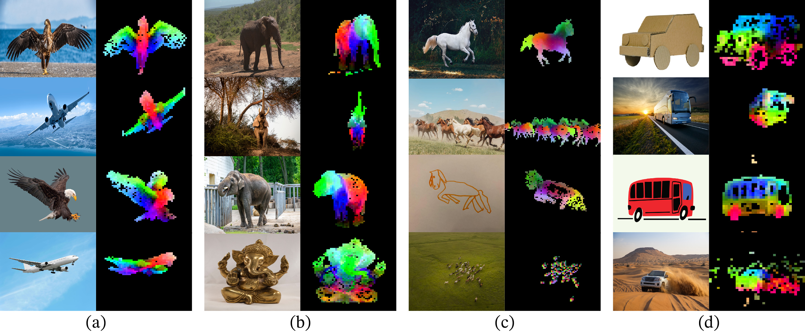

# DINOv2: 教師なしで頑健な視覚特徴量を学習する

> 原典: [[translations/dinov2-learning-robust-visual-features-without-supervision]] ・ `raw/papers/DINOv2_ Learning Robust Visual Features without Supervision.md`
> 著者: Maxime Oquab ほか（Meta AI Research, Inria）
> 出典: arXiv:2304.07193（2023）→ TMLR 2024

---

## 一言まとめ

[[entities/dino]] の正統な後継として 2 年後に発表された **「CV における基盤モデル（foundation model）」を目指した実装版**。先行手法 **iBOT**（[[entities/ibot]]、DINO + Masked Image Modeling）の学習レシピを大規模化向けに磨き込み、**自動キュレーションで構築した 142M 画像の LVD-142M**（[[entities/lvd-142m]]）で **ViT-g（11 億パラメータ）** を学習。そこから ViT-S/B/L へ知識蒸留することで、**凍結特徴量のまま OpenCLIP-G を多くのベンチマークで上回る**ことを示した。深度推定・セグメンテーション・PCA による部位対応など、線形プローブのみで強力に機能することが本論文の核となる主張。

---

## 背景と問題意識

### この論文以前の状況

- **NLP の常識**: BERT/GPT 以降、「巨大データでラベルなし事前学習 → そのまま下流タスク」というパイプライン（**基盤モデル paradigm**）が支配的になった。詳細: [[concepts/foundation-model]]。
- **CV における対抗潮流 1: テキスト誘導事前学習（weakly-supervised pretraining）**: **CLIP**（[[entities/clip]]）が画像 - キャプション対比学習で汎用視覚特徴量を獲得。**OpenCLIP** は LAION で再現・拡張し、現実的な汎用特徴量の事実上の標準になっていた。
- **CV における対抗潮流 2: 自己教師あり学習（SSL）**: [[entities/dino]] や MAE などが ImageNet-1k で強い性能を示していたが、「**より大きく多様なデータでスケールしても本当に良い汎用特徴量が作れるか**」は未解決だった。SSL を未キュレーションの大規模 Web データに適用する試みは特徴量品質が落ちる傾向があった。

> **補足: 「foundation model（基盤モデル）」とは** — Bommasani ら（Stanford CRFM, 2021）が定義した「大規模データで自己教師あり事前学習され、多様な下流タスクに適用される単一の大規模モデル」のこと。BERT, GPT, CLIP などが典型例。CV では DINOv2 が SSL ベースでこの位置を取りに行った最初の本格事例。詳細: [[concepts/foundation-model]]。

### この論文が問うたこと

> 「**SSL は、十分にキュレーションされた大規模データさえあれば、テキストなしでも汎用視覚基盤モデルを作れるのか？**」

著者ら（Meta AI）はこれに対し、**データ・モデル・学習レシピの 3 軸を同時にスケール**することで「Yes」を示そうとした。

---

## 提案手法: DINOv2

DINOv2 は 1 つのアルゴリズムというより、**「データ構築 + 学習レシピ + 効率化 + 蒸留」の総合パッケージ**である。

### A. データ: LVD-142M

**自動キュレーションパイプライン**で 1.2B 枚の Web 画像から 142M 枚を選別。詳細: [[entities/lvd-142m]]。

1. **キュレーション済みソース**（ImageNet-22k, ImageNet-1k, Google Landmarks, 細粒度データセット群）を「お手本」として用意
2. Web からクロールした 1.2B 枚の生画像を、ImageNet-22k で事前学習した ViT-H/16 で埋め込み化
3. **重複排除**（PCA hash, NSFW フィルタ, 顔ぼかしを経て、コピー検出パイプラインで近重複も除去）
4. **検索**: お手本に近い画像を未キュレーションプールから k-NN（N=4 近傍）で取得
5. **k-means クラスタリングで再バランス**（少数の支配的モードへの過剰適合を防ぐ）

ポイントは「**テキストもメタデータも使わず、画像の視覚的類似度だけ**」でキュレーションを実現したこと。LAION のようにテキストフィルタリングに頼らない。

### B. 学習目的関数: iBOT ベース

ベースは **iBOT**（[[entities/ibot]]）= DINO + Masked Image Modeling。具体的には以下を組み合わせる：

| 損失 | 内容 |
|---|---|
| **DINO 損失** | [CLS] トークン上のクロスエントロピー。teacher-student 自己蒸留。詳細: [[entities/dino]] |
| **iBOT 損失** | パッチをランダムにマスクし、student のマスクトークンを teacher の対応する可視パッチトークンに一致させるクロスエントロピー。詳細: [[concepts/masked-image-modeling]] |
| **KoLeo 正則化** | バッチ内で特徴量が一様に広がるよう促す微分エントロピー推定子。`-1/n Σ log(min_{j≠i} ‖x_i - x_j‖)`。インスタンス検索性能が +8% 向上する重要要素 |
| **Sinkhorn-Knopp centering** | DINO の centering を SwAV 由来の SK 正規化に置換（3 反復のみ）|

DINO/iBOT のヘッド重みは**分離**する（iBOT 原論文では共有が良いとされていたが、スケール時は逆）。

> **補足: 略称まとめ**
> - **MIM** = Masked Image Modeling（マスク画像モデリング、BERT 流のマスク予測の画像版）
> - **iBOT** = image BERT pre-Training with Online Tokenizer
> - **SK** = Sinkhorn-Knopp（クラスタ割当を均等化する反復アルゴリズム、SwAV 由来）
> - **EMA** = Exponential Moving Average
> - **MLP** = Multi-Layer Perceptron
> - **FFN** = Feed-Forward Network
> - **SwiGLU** = Swish + Gated Linear Unit（FFN の活性化、Transformer で広く採用）
> - **FSDP** = Fully-Sharded Data Parallel（PyTorch のシャーディング並列学習）
> - **DDP** = Distributed Data Parallel
> - **PUE** = Power Usage Effectiveness（データセンタの電力効率指標）

### C. 効率化（§5）

ViT-g（1B パラメータ）を現実的な時間で学習するための工夫：

- **独自版 FlashAttention**: 自己注意のメモリと速度を改善。ViT-g の embed_dim を 1408→1536（64×24 ヘッド）にして GPU 効率を最大化
- **Sequence packing**: NLP 由来。global crop と local crop を 1 本の長系列に連結し、block-diagonal mask で attention を分離。multi-crop の forward を 1 パスに統合
- **Efficient stochastic depth**: drop 率 40% で計算もメモリも 40% 節約
- **FSDP 混合精度**: モデル複製を GPU にまたいでシャード。重みは float32、通信は float16。DDP+autocast を上回る効率
- 結果: **iBOT 比で 2 倍速、メモリ 1/3**

### D. 蒸留

ViT-g を一度しっかり学習し、ViT-S / B / L はそこから蒸留して作る。**スクラッチ学習よりすべての評価で良い**。蒸留時は、masking と stochastic depth を外し、iBOT 損失は 2 つの global crop に適用、student の EMA を最終モデルとする。

> **補足: なぜ蒸留が効くか** — 大きな teacher の出力（soft target）は単純なラベルより情報が豊富で、小さな student が「正解クラスはこれだが、他のクラスとの類似度関係はこう」という暗黒知識（dark knowledge）まで吸収できる。詳細: [[concepts/knowledge-distillation]]。

---

## 実験結果と知見

### ImageNet 線形分類 (§7.1)

| Method | Arch | Linear | k-NN |
|---|---|---|---|
| iBOT | ViT-L/16 | 82.3 | 72.9 |
| DINO | ViT-S/8 | 79.2 | 78.6 |
| OpenCLIP | ViT-G/14 | 86.2 | 83.2 |
| EVA-CLIP | ViT-g/14 | 86.4 | 83.5 |
| **DINOv2** | ViT-g/14 | **86.5** | **83.5** |

**OpenCLIP-G を線形評価で上回り、k-NN でも追いついた**最初の SSL モデル。ImageNet-V2 では +1.1% で**汎化も上回る**。

### 頑健性 (§7.1 Table 6)

| Method | Im-A | Im-R | Sketch |
|---|---|---|---|
| iBOT ViT-L/16 | 41.5 | 51.0 | 38.5 |
| OpenCLIP ViT-G/14 | 63.8 | 87.8 | 66.4 |
| **DINOv2 ViT-g/14** | **75.9** | 78.8 | 62.5 |

**ImageNet-A（自然敵対的サンプル）で +29.6% を iBOT に対して獲得**。ImageNet-R/Sketch では OpenCLIP に劣るが、SSL 系では断然強い。

### 細粒度・動画 (§7.2)

- **iNaturalist** で OpenCLIP-G を +8〜10% 上回る（テキスト誘導が苦手な細粒度カテゴリで強い）
- **動画行動認識（K-400, UCF-101, SSv2）** は動画で学習していないのに OpenCLIP と同等以上

### インスタンス認識 (§7.3)

Oxford-Hard で **mAP +41%** を iBOT に対して、**+34%** を OpenCLIP に対して獲得。「画像検索の延長」としてのタスクで圧倒的。

### 密予測 (§7.4)

- **セマンティックセグメンテーション**: 凍結バックボーン + 線形分類器で iBOT を上回り、+ms で MAE のフル fine-tune に匹敵。ViT-Adapter + Mask2Former で ADE20K 60.2 mIoU
- **単眼深度推定**: NYUd, KITTI, SUN-RGBd zero-shot 転移すべてで OpenCLIP-G と iBOT を上回り、専用研究の最先端 [76] にも匹敵

### 創発的性質 (§7.5)

<figure>

<figcaption>図1（再掲）: パッチ特徴量を PCA すると、教師なしで「同じ部位（馬の頭、車の窓など）が異なる画像間でマッチする」性質が現れる。背景は第 1 成分の符号で自動分離される。</figcaption>
</figure>

- **PCA で物体の部位がドメイン横断で対応**: 画像・絵画・スタイル違いでも「翼は翼に」「頭は頭に」マッチする
- 教師信号なしに「**物体の部位構造とシーン幾何**」を表現が獲得している

---

## なぜこの研究が CV にとって重要か

1. **「CV における BERT」が現実になった瞬間**: DINO が示唆した方向性を、データ・モデル・効率化の総力戦で実用レベルに引き上げた。CV で「事前学習済み凍結特徴量をそのまま使う」が現実的選択肢になった。
2. **テキストに頼らない汎用特徴量**: CLIP 系がキャプションに引っ張られて細部や深度を捨ててしまう問題を、純粋画像 SSL が回避できることを示した。
3. **自動データキュレーション手法**: ラベルもテキストもメタデータも使わずに、視覚的類似度だけでスケール可能なキュレーションが可能であることを実証。後続の DINOv3 や SAM 系データ構築にも影響。
4. **公開モデル群**: ViT-S/B/L/g + register 版が広く利用可能で、産業応用（医療画像、衛星画像、ロボティクス、3D 再構成など）の標準特徴抽出器となった。

---

## 限界・批判的視点

- **計算コスト**: ViT-g 単体で 22k GPU 時間（プロジェクト全体で 200k GPU-days、$0.5\sim 1$ k tCO₂eq）。学術機関での再現は事実上不可能。著者らも §9 で正直に開示。
- **データセット非公開**: LVD-142M 自体は公開されておらず、収集パイプラインの再現も Web クロールが必要で容易ではない。
- **地理的バイアスは残る**: §8.1 で「アフリカと欧州で 25.7% の精度差」を著者自身が報告。多様性向上は中途半端で、西洋・高所得世帯に偏る。
- **テキストとの統合は別問題**: 「言語と接続できる視覚特徴量」を作るには別途 alignment が必要。DINOv2 + LLM の VLM 化は本論文の射程外。
- **ImageNet で OpenCLIP-G に勝ったが微差**: +0.3% は実用差としては小さい。本当の差は dense prediction や robustness で現れる。

---

## 用語と略称

| 略称 | 展開 | 短い意味 |
|---|---|---|
| **DINOv2** | DINO version 2 | 本論文の提案モデル群 |
| **DINO** | self-DIstillation with NO labels | DINOv2 の前身。[[entities/dino]] |
| **iBOT** | image BERT pre-Training with Online Tokenizer | DINO + MIM。DINOv2 の直接の祖先。[[entities/ibot]] |
| **MIM** | Masked Image Modeling | BERT 流マスク予測の画像版。[[concepts/masked-image-modeling]] |
| **MAE** | Masked Autoencoder | He et al. 2022 の代表的 MIM。詳細: [[concepts/masked-image-modeling]] |
| **BEiT** | BERT pre-training of image transformers | Bao et al. 2021 の MIM 先駆け |
| **CLIP** | Contrastive Language-Image Pre-training | Radford et al. 2021。代表的弱教師ありモデル。[[entities/clip]] |
| **OpenCLIP** | open-source CLIP reproduction | LAION-2B/5B での CLIP 再現＋拡大版 |
| **SK** | Sinkhorn-Knopp | クラスタ割当均等化アルゴリズム |
| **KoLeo** | Kozachenko-Leonenko | 微分エントロピー推定子、特徴量正則化に使用 |
| **EMA** | Exponential Moving Average | モメンタム・エンコーダの更新方式 |
| **SwiGLU** | Swish-Gated Linear Unit | Transformer FFN の活性化、性能向上 |
| **FFN** | Feed-Forward Network | Transformer ブロックの MLP 部分 |
| **FSDP** | Fully-Sharded Data Parallel | PyTorch の大規模分散学習方式 |
| **DDP** | Distributed Data Parallel | 標準的データ並列。FSDP の前身 |
| **DPT** | Dense Prediction Transformer | 密予測用 Transformer デコーダ |
| **PUE** | Power Usage Effectiveness | データセンタ電力効率（1.0 が理想）|
| **GLDv2** | Google Landmarks Dataset v2 | ランドマーク画像データセット |
| **LVD-142M** | Large-scale Visual Dataset (142M) | DINOv2 用に構築されたキュレーション済み画像集合。[[entities/lvd-142m]] |
| **VLM** | Vision-Language Model | 画像言語マルチモーダルモデル |
| **WSL** | Weakly-Supervised Learning | 弱教師あり学習。[[concepts/weakly-supervised-pretraining]] |
| **SSL** | Self-Supervised Learning | 自己教師あり学習。[[concepts/self-supervised-learning]] |
| **NSFW** | Not Safe For Work | 不適切コンテンツのフィルタ用語 |

---

## 関連ページ

- 翻訳: [[translations/dinov2-learning-robust-visual-features-without-supervision]]
- エンティティ:
  - [[entities/dinov2]] — DINOv2 モデル群のスペックシート
  - [[entities/lvd-142m]] — 学習用キュレーションデータセット
  - [[entities/ibot]] — DINOv2 の直接の祖先
  - [[entities/dino]] — 前身
  - [[entities/clip]] — 主要ベースライン
- 概念:
  - [[concepts/foundation-model]] — DINOv2 の位置づけ
  - [[concepts/self-supervised-learning]]
  - [[concepts/masked-image-modeling]]
  - [[concepts/weakly-supervised-pretraining]]
  - [[concepts/knowledge-distillation]]
  - [[concepts/knn-evaluation-protocol]]
  - [[concepts/vision-transformer]]
