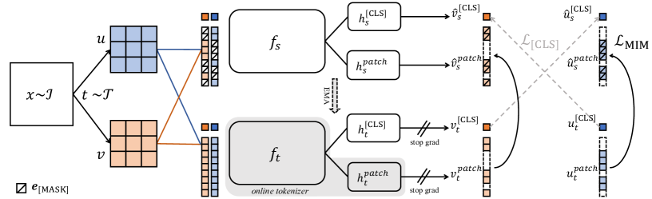
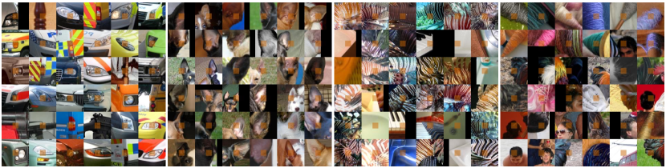

# iBOT: オンライントークナイザを用いた画像 BERT 事前学習

> 原典: [[translations/ibot]] ・ `raw/papers/iBOT _ Image BERT Pre-Training with Online Tokenizer.md`
> 著者: Jinghao Zhou ほか（ByteDance, Johns Hopkins University, Shanghai Jiao Tong University, UC Santa Cruz）
> 出典: arXiv:2111.07832（2021 年 11 月）→ ICLR 2022

> 翻訳メモ: 本要約は CLAUDE.md §4 の標準ルールと異なり、**Appendix も翻訳済み**（[[translations/ibot]] 参照）。ユーザー指示による特例。

---

## 一言まとめ

「**DINO（[[entities/dino]]）の自己蒸留と MAE（[[entities/mae]]）流のマスク画像モデリング（MIM）を融合した最初の本格的成功例**」。具体的には、(1) DINO の [CLS] トークン自己蒸留と、(2) **teacher ネットワーク自体をマスクパッチの「視覚トークナイザ」として使う**新しい MIM 損失、の 2 つを共同最適化する。後者が iBOT の最大の概念的貢献で、これを著者らは「**online tokenizer**（オンライントークナイザ, [[concepts/online-tokenizer]]）」と呼ぶ。BEiT のように事前訓練された dVAE トークナイザを別途用意する必要がない（**単一段階訓練**）。結果として、ImageNet-1K で linear probing 81.0%（ViT-L/16）、fine-tuning 84.8%、ImageNet-22K 事前学習で linear 82.3% / fine-tune 87.8% という当時の SOTA を達成。後の **DINOv2（[[entities/dinov2]]）・DINOv3（[[entities/dinov3]]）の損失関数の直接の源**となった、CV SSL 史における重要なターニングポイント論文。

---

## 背景と問題意識

### この論文以前の状況

iBOT 登場時（2021 年 11 月）の CV SSL は、**2 つの系統が並立**していた：

1. **識別型 / 自己蒸留型 SSL**（DINO, BYOL, MoCo v3, SwAV）
   - [CLS] トークン経由でグローバル画像表現を学習
   - **凍結特徴量・k-NN・linear probing で強い**
   - 弱み: **dense prediction（segmentation, detection）で弱い**

2. **マスク画像モデリング（MIM）**（BEiT, MAE はほぼ同時期 2021/11）
   - 画像パッチをマスクして予測
   - **dense prediction と fine-tuning で強い**
   - 弱み: **凍結特徴量と linear probing が弱い**

加えて、当時の MIM には**「視覚トークナイザ」問題**があった：

| 既存 MIM | トークナイザ | 問題点 |
|---|---|---|
| Context Encoder, iGPT, MAE | 画素（恒等写像） | 高周波詳細をモデル化、意味抽象化に苦闘 |
| BEiT | 事前訓練済み dVAE（DALL-E のもの）| **多段階訓練**（dVAE を別途訓練）、低レベル意味性のみ捕捉、ドメイン固定 |

### この論文が問うた根本的な疑問

**「MIM の視覚トークナイザを、事前訓練不要・意味的に豊か・対象モデルと同時学習可能なものにできないか？」**

著者ら（ByteDance + JHU 等）は次の鋭い観察をする：

> Eq. (1) BEiT の MIM 損失と Eq. (2) DINO の自己蒸留損失は**同じ形式**をしている。

つまり、両者ともに「**ある分布を別の分布にクロスエントロピーで近づける**」構造を持つ。BEiT では teacher が「事前訓練済み dVAE」だが、これを DINO 流の「**EMA で動的に更新される teacher 自身**」に置き換えれば、両者が統合できる。

これが iBOT の core insight。

> **補足: なぜこの統合が重要か** — 「MIM と self-distillation を別系統と見る」のではなく、「**両者は同じ knowledge distillation の枠組みで、teacher が違うだけ**」と再解釈することで、両者の長所を取りに行ける。これは数式レベルで似ているからこそ自然に統合できる、という美しい論文。

---

## 提案手法: iBOT

<figure>

<figcaption>図3（再掲）: iBOT のフレームワーク。画像 x の 2 ビュー u, v それぞれをマスク化し、student に渡す。teacher にはマスクなしで渡す。2 つの損失を最小化: (1) [CLS] トークンのクロスビュー自己蒸留（DINO 由来）、(2) マスクされたパッチトークンの teacher 出力に対する自己蒸留（iBOT の新規部分）。</figcaption>
</figure>

### 学習目的関数（2 つの損失の合計）

**(1) [CLS] トークン損失（DINO 由来）**:

$$
\mathcal{L}_{\texttt{[CLS]}} = -P_{\theta'}^{\texttt{[CLS]}}(v)^\top \log P_\theta^{\texttt{[CLS]}}(\hat{u})
$$

- 画像の 2 つのビュー $u, v$ → ブロック単位マスキングで $\hat{u}, \hat{v}$ を得る
- student（$\theta$）にはマスク済みビューを通す
- teacher（$\theta'$, EMA 更新）には**マスクされていない**ビューを通す
- それぞれの [CLS] トークン出力分布のクロスエントロピーを最小化
- 損失は対称化（$\hat{v}_s$ と $u_t$ の組も加算）

**(2) MIM 損失（iBOT の新規）**:

$$
\mathcal{L}_{\mathrm{MIM}} = -\sum_{i=1}^N m_i \cdot P_{\theta'}^{\mathrm{patch}}(u_i)^\top \log P_\theta^{\mathrm{patch}}(\hat{u}_i)
$$

- マスクされた位置 $i$（$m_i = 1$）のみで計算
- student の**マスクされたパッチ**の出力を、teacher の**対応する非マスクパッチ**の出力に近づける
- これが「**teacher = online tokenizer**」の本質: teacher は事前訓練不要、EMA で動的に更新される。詳細: [[concepts/online-tokenizer]]

**総損失**: $\mathcal{L}_{\texttt{[CLS]}} + \mathcal{L}_{\mathrm{MIM}}$（スケーリングなしの単純合計が最良）

### 設計上の重要な決定

| 設定 | 値 | 補足 |
|---|---|---|
| マスキング戦略 | **ブロック単位マスキング**（BEiT 由来） | MAE のランダムマスキングと違って局所的に大きな塊をマスク |
| 予測比率 $r$ | **ランダム**: 確率 0.5 で 0、確率 0.5 で [0.1, 0.5] からサンプリング | マルチクロップとの相互作用で重要 |
| projection head | **[CLS] とパッチで完全共有**（$h^{\texttt{[CLS]}} = h^{\mathrm{patch}}$） | アブレーションで shared > non-shared、shared > semi-shared |
| 出力次元 $K$ | 8192 | DINO と同じ規模 |
| トークン化 | **ソフトマックス分布**（連続的）| one-hot ハードラベルだと精度大幅低下 |
| センタリング | 必須（patch tokens 用に別途 $m', \tau_t'$ ） | [CLS] のものより重要性は低い |

> **補足: なぜブロック単位マスキングか** — 隣接するパッチをまとめてマスクすることで「単一パッチを近傍から補間する」を防ぎ、より高次の文脈推論を必要とするタスクになる。MAE が「ランダム 75% マスク」で同じ目的を達成するのに対し、iBOT は「ブロック単位 + 中程度のマスク率」で達成する。

> **補足: なぜ shared head が良いか** — [CLS] トークンへの自己蒸留で獲得された意味性が、共有された射影ヘッドを通してパッチトークンの MIM 訓練にも転移する。「意味性の伝達経路」として機能する。

### マルチクロップ拡張との統合（Appendix B）

iBOT の重要な実装上の発見の 1 つ：**「マスクしすぎる」と訓練が不安定になる**。

| パイプライン | 説明 | 結果 |
|---|---|---|
| (a) マルチクロップなし | 2 global crop のみ、両方 MIM | 安定だが精度は中程度 |
| (b) global のみ MIM、local は MIM なし | 標準的な使い方 | **不安定**（NMI ディップ）、global と local の分布不一致 |
| (c) 全 crop で MIM | local もマスク | 不安定（local crop が小さすぎて MIM 信号が弱い） |
| (d) global の 1 つだけ MIM | 片方の global は非マスク | 安定 |
| **iBOT 採用: (b) + ランダム比率 $r$** | global 2 つに対し、$r = 0$ or $r \in [0.1, 0.5]$ をランダム選択 | **安定 + 高精度** |

→ つまり、訓練の半分は MIM なしの DINO として動作させ、もう半分で MIM を行う。これにより「マスク画像と非マスク画像の分布ギャップ」を吸収する。

---

## 実験結果と知見

### ImageNet-1K Linear Probing（凍結特徴量）

| Method | Arch | Param | Linear |
|---|---|---|---|
| DINO | ViT-S/16 | 21M | 77.0 |
| DINO | ViT-B/16 | 85M | 78.2 |
| **iBOT** | ViT-S/16 | 21M | 77.9 (+0.9) |
| **iBOT** | ViT-B/16 | 85M | 79.5 (+1.3) |
| **iBOT** | ViT-L/16 | 307M | **81.0** |
| **iBOT (IN-22K)** | ViT-L/16 | 307M | **82.3** |

**重要**: 「**より大きなモデルほど DINO に対する利得が大きい**」（+0.9% → +1.3% → ...）= **scalability** の証拠。

### ImageNet-1K Fine-tuning

| Method | ViT-S/16 | ViT-B/16 | ViT-L/16 | ViT-L/16 (22K, 512) |
|---|---|---|---|---|
| DINO | 82.0 | 83.6 | - | - |
| BEiT | - | 83.4 | 85.2 | - |
| MAE | - | 83.6 | 85.9 | - |
| **iBOT** | **82.3** | **84.0** | **84.8** | **87.8** |

- ViT-L/16 で BEiT に 0.4% 劣るが、ImageNet-22K 事前学習だと逆転（86.6 vs 86.0）
- ImageNet-22K + 512 解像度で **87.8%**（MAE の ViT-H と同点）

### 下流タスク（COCO 検出 + ADE20K セグメンテーション）

ViT-B/16:

| Method | COCO AP^b | COCO AP^m | ADE20K Lin. mIoU | ADE20K UperNet mIoU |
|---|---|---|---|---|
| Sup. | 49.8 | 43.2 | 35.4 | 46.6 |
| BEiT | 50.1 | 43.5 | **27.4**（大幅低下）| 45.8 |
| DINO | 50.1 | 43.4 | 34.5 | 46.8 |
| **iBOT** | **51.2** | **44.2** | **38.3** | **50.0** |

**BEiT の Lin. mIoU が壊滅的に低い**ことに注目: dVAE トークナイザが低レベル意味性しか持たないため、線形ヘッドだけでは pixel-level 分類が解けない。iBOT は **+2.9 mIoU** で教師ありベースラインを上回り、「**iBOT のパッチ表現には強い局所意味性がある**」ことを示す。

### 創発的特性: パッチトークンに現れる部位レベル意味性 (§4.3.1)

<figure>

<figcaption>図4（再掲）: iBOT のパッチトークンに、車のヘッドライト・犬の耳・縞模様などの「部位レベルパターン」が教師なしで創発する。BEiT の dVAE トークナイザでは見られない性質。</figcaption>
</figure>

著者らの最も興味深い発見の 1 つ: **iBOT のパッチトークン射影出力の最大確信度クラスタを可視化すると、「犬の耳」「車のヘッドライト」「縞テクスチャ」などの意味的部位が現れる**。

これは BEiT には現れない iBOT 固有の性質で、「**画素ではなく semantic に意味のあるトークナイザ（self-distillation 由来）を使うこと**」がもたらす効果。

### Part-wise Linear Probing（§4.3.1）

「**[CLS] トークン**を使った標準 linear probing」 vs 「**上位 k 個の自己注意スコアを持つパッチトークン**を平均した linear probing」を比較:

| 使用トークン | DINO | iBOT | 差 |
|---|---|---|---|
| [CLS] のみ | 77.0 | 77.9 | +0.9 |
| Top-56 patch (平均) | ~70 | ~76 | **+5.9** |
| Top-1 patch | 〜50 | 〜68 | **+17.9** |

**少数のパッチだけで分類するほど iBOT の優位性が大きくなる** = iBOT のパッチ表現は単独でも意味的に強い。

### Robustness (§4.3.3)

ViT-S/16 で比較:

| | DINO | iBOT |
|---|---|---|
| 背景変更 (IN-9) | 96.4 | **96.8** |
| 遮蔽 (S.5) | 64.7 | **65.9** |
| 自然敵対例 (IN-A) | 12.3 | **13.8** |
| 破損 (IN-C ↓) | 51.7 | **48.1** |

MIM 由来の「マスクされた部分から推論する訓練」が、未知の入力への robustness につながる。

---

## なぜこの研究が CV にとって重要か

1. **MIM × Self-Distillation のハイブリッドという新パラダイムを確立**: 後の DINOv2 / DINOv3 はすべて iBOT の損失設計を継承。iBOT がなければ DINO 系列は dense prediction で勝てなかった。
2. **「online tokenizer」という概念的革新**: 「事前訓練された tokenizer は必要ない、teacher 自身を tokenizer として動的に使えばいい」という発想は、BEiT の多段階パイプラインを単一段階に簡略化。これが後の DINOv2/v3 の効率性の出発点。
3. **凍結特徴量と密予測の両立**: 当時の SSL の根本的トレードオフ（DINO 系は dense が弱い、MAE 系は linear probing が弱い）を統合で解決した最初の本格事例。
4. **部位レベル意味性の創発**: パッチトークンが教師なしで「犬の耳」「車のヘッドライト」などのパターンを学習することを定量的・定性的に示した（後の DINOv3 の PCA 可視化や VGGT の 3D 対応に直接つながる）。
5. **ByteDance + JHU からの貢献**: Meta（FAIR）一強だった CV SSL に、別組織からの貢献が出てきた重要な瞬間でもある。

---

## 限界・批判的視点

- **マルチクロップ依存**: 表 10 の通り、マルチクロップ拡張なしでは性能が大きく落ちる（ViT-S linear: 77.9 → 76.2）。DINO と同じ性質を継承
- **計算コスト**: マルチクロップ MIM はメモリ +25%、訓練時間 +7.4% 余分にかかる（DINO 比、表 19）
- **マルチクロップ + MIM の安定性問題**: Appendix B 全体がこの問題への対策。実装が複雑
- **ViT-L 以上での dense feature 劣化**: 後の DINOv3 が暴いた問題で、iBOT の時点では未認識（200k+ 反復で dense 性能が低下する）。これが DINOv3 の Gram anchoring（[[concepts/gram-anchoring]]）の動機になった
- **ImageNet 規模のキュレーションデータに最適化**: 後の DINOv2/v3 のような巨大データキュレーションパイプラインはまだ持っていない
- **MAE と比較するとファインチューニング性能でやや劣る**: ViT-L/16 で MAE 85.9 vs iBOT 84.8（IN-1K のみ事前学習時）

---

## 用語と略称

| 略称 | 展開 | 短い意味 |
|---|---|---|
| **iBOT** | image BERT pre-Training with Online Tokenizer | 本論文の手法 |
| **online tokenizer** | オンライントークナイザ | teacher ネットワーク自体を tokenizer として用いる発想。[[concepts/online-tokenizer]] |
| **MIM** | Masked Image Modeling | 画像版マスク予測。[[concepts/masked-image-modeling]] |
| **MLM** | Masked Language Modeling | NLP 版（BERT） |
| **DINO** | self-DIstillation with NO labels | [CLS] 自己蒸留損失の出所。[[entities/dino]] |
| **MAE** | Masked Autoencoder | 同時期の画素再構成型 MIM。[[entities/mae]] |
| **BEiT** | BERT pre-training of image Transformers | dVAE トークナイザ MIM の先駆者 |
| **dVAE** | discrete VAE | DALL-E 由来の離散トークナイザ |
| **DALL-E** | OpenAI の text-to-image モデル | dVAE エンコーダ提供元 |
| **EMA** | Exponential Moving Average | teacher 更新方式 |
| **CE** | Cross Entropy | 主要損失 |
| **CLS token** | classification token | グローバル画像表現用の特殊トークン |
| **[MASK] token** | mask token | マスクされたパッチを示す学習可能ベクトル |
| **SH** | Shared Head | [CLS] とパッチで射影ヘッドを共有する設計 |
| **NMI** | Normalized Mutual Information | クラスタリング品質指標 |
| **ARI** | Adjusted Rand Index | クラスタリング品質指標 |
| **FMI** | Fowlkes-Mallows Index | クラスタリング品質指標 |
| **Cascade Mask R-CNN** | 多段階の物体検出 + インスタンスセグメンテーション | COCO 実験で使用 |
| **UperNet** | Unified Perceptual Parsing Network | ADE20K セグメンテーションヘッド |
| **MoBY** | Moco + BYOL | Swin 用 SSL 手法、比較相手 |
| **EsViT** | Efficient self-supervised ViT | 別の SSL 手法、比較相手 |
| **MoCov3** | MoCo v3 | 対比学習の代表 |
| **SwAV** | Swapping Assignments between Views | クラスタリング型 SSL |
| **BYOL** | Bootstrap Your Own Latent | 非対比型 SSL |
| **SimCLRv2** | Simple Contrastive Learning v2 | 対比学習 |
| **MPP** | Masked Patch Prediction | ViT 論文付録の素朴な MIM |
| **WordPiece** | BERT のサブワードトークナイザ | NLP の analog として参照 |
| **LD** | Layerwise Learning Rate Decay | ファインチューニング時の標準テクニック |
| **DS** | DeepSpeed | 混合精度訓練ライブラリ |
| **DAE** | Denoising Autoencoder | MIM の理論的祖先。[[concepts/denoising-autoencoder]] |
| **JHU** | Johns Hopkins University | 著者所属の 1 つ |

---

## 関連ページ

- 翻訳: [[translations/ibot]]
- 概念:
  - [[concepts/online-tokenizer]] — 本論文の核心アイデア
  - [[concepts/masked-image-modeling]] — iBOT が属する MIM 系統
  - [[concepts/self-supervised-learning]] — SSL 全般
  - [[concepts/knowledge-distillation]] — iBOT が KD の枠組みで再解釈する MIM
  - [[concepts/denoising-autoencoder]] — MIM の理論的祖先
- エンティティ:
  - [[entities/ibot]] — iBOT モデルのスペックシート
  - [[entities/dino]] — [CLS] 自己蒸留損失の出所
  - [[entities/mae]] — 同時期の画素再構成 MIM
  - [[entities/dinov2]] — iBOT を 142M 画像 × 1B param に scale した直接の後継
  - [[entities/dinov3]] — DINOv2 をさらに scale + Gram anchoring で改良
  - [[entities/imagenet]] — 事前学習データ
- 系譜: [[entities/dino]] + [[entities/mae]]（祖先 2 系統）→ **iBOT** → [[entities/dinov2]] → [[entities/dinov3]]
