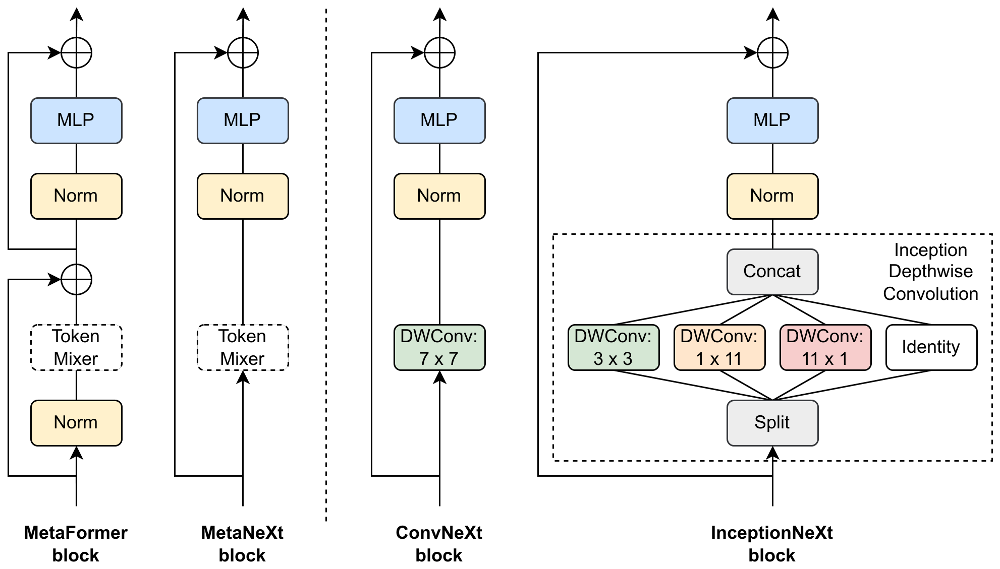
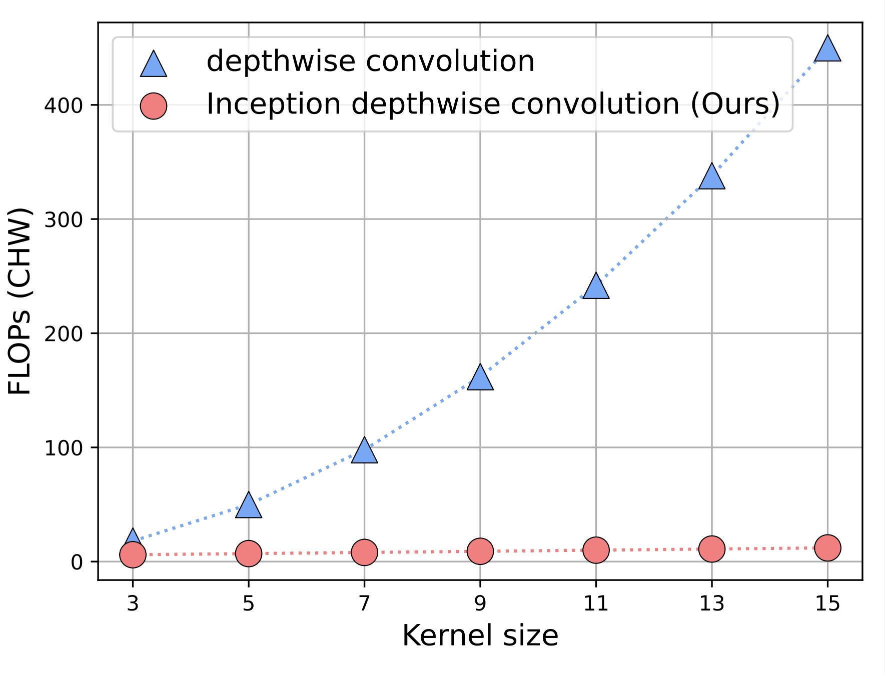
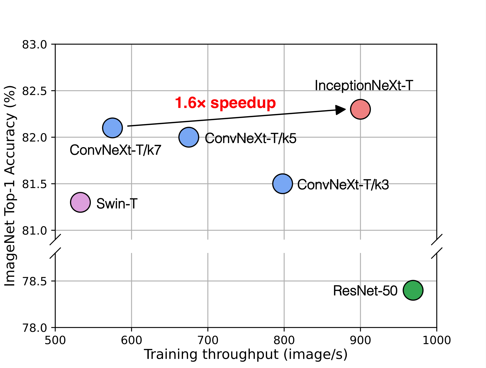
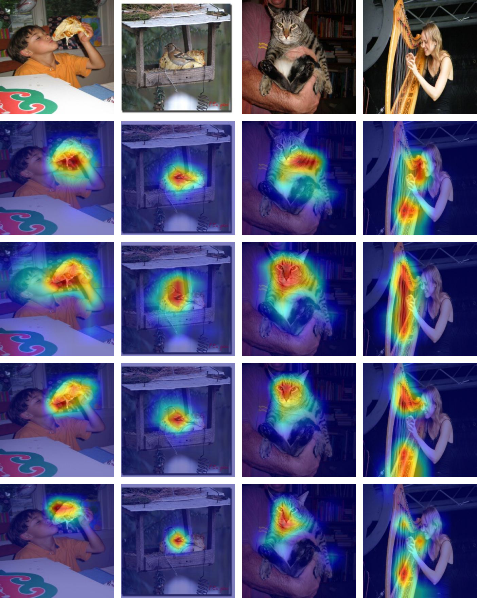

# InceptionNeXt: 大カーネルを 4 分岐に割って速くする

> 原典: [[translations/inceptionnext]] ・ `raw/papers/InceptionNeXt_ When Inception Meets ConvNeXt.md`
> 著者: Weihao Yu, Pan Zhou, Shuicheng Yan, Xinchao Wang（NUS / SMU / Sea AI Lab / Skywork AI）
> 出典: arXiv:2303.16900 → **CVPR 2024**
> コード: <https://github.com/sail-sg/inceptionnext>

## 一言まとめ

**[[sources/convnext|ConvNeXt]] の 7×7 depthwise 畳み込みは FLOPs は小さいが実機では遅い。** 原因は**メモリアクセスコスト**。大カーネルを **3×3 + 1×11 + 11×1 + 恒等写像の 4 分岐**に分解すると、**訓練スループット 1.6 倍**で精度も **+0.2%** 上がる。

## 背景と問題意識

### FLOPs が嘘をつく

本論文の出発点は 1 つの数字である。

> **ConvNeXt-T は ResNet-50 と同程度の FLOPs を持つが、A100 GPU 上で完全精度で訓練したときのスループットは約 60% しか達成しない。**

**ConvNeXt-T 575 img/s に対し ResNet-50 969 img/s**（表4）。FLOPs は 4.5G vs 4.1G でほぼ同じなのに、実測は 1.7 倍の差がつく。

原因は **depthwise 畳み込みのメモリアクセスコスト**である。depthwise conv はチャネルごとに独立して畳み込むので、演算量（FLOPs）に対して**読み書きするデータ量の比が悪い**。7×7 と大きくすればなおさらで、GPU は演算器を遊ばせたままメモリ帯域に律速される。

> **これは本 wiki で繰り返し現れる論点の、最も直接的な形である。** [[sources/convnext]] 自身が「A100 で Swin 比 +49% スループット」を強調し、[[sources/rdnet]] が「b1 レイテンシで 7 倍差」を示し、[[sources/nfnet]] は「**理論 FLOPS でも推論レイテンシでもなく、実機の訓練レイテンシを最適化対象にした**」と明言した。本論文はその ConvNeXt 自身を実測で刺している。

### カーネルを小さくすれば速いが、精度が落ちる

素朴な対処は「カーネルを縮める」だが、それでは精度が落ちる。論文の予備実験（ConvNeXt-T ベース）が明快である。

**表**: 予備実験（原典 表1）

| DWConv カーネル | 畳み込み比率 | 訓練スループット | Top-1 (%) |
|---|---|---|---|
| **7×7** | 1.0 | **575** | **82.1** |
| 5×5 | 1.0 | 675 | 82.0 |
| **3×3** | 1.0 | **798 (1.4×)** | **81.5 (−0.6)** |
| 3×3 | 1/4 | 871 | 81.3 |
| 3×3 | **1/8** | **901** | 80.8 |
| 3×3 | 1/16 | 916 | **80.1** |

**「大カーネル depthwise 畳み込みに基づく CNN を、性能を保ちながらどう高速化するか」**——これが論文が立てた問いである。

**この表から 2 つの発見が読み取れる。**

1. **大カーネルは精度に必要だが、正方の大カーネルは実速度が遅い**（7×7 → 3×3 で 1.4 倍速いが −0.6%）
2. **全チャネルを畳み込みに通す必要はない**。比率 1/4 まで下げても −0.2% に留まる（ShuffleNet V2 の知見）が、1/16 では −1.4% と崩れる

## 提案手法

### MetaNeXt — まず ConvNeXt を抽象化する

手法の前に、著者は **MetaFormer**（同じ筆頭著者 Weihao Yu の先行研究）の枠組みで ConvNeXt を抽象化する。

<figure>

<figcaption>図2（再掲）: MetaFormer / MetaNeXt / ConvNeXt / InceptionNeXt のブロック。MetaFormer はトークン混合器と MLP それぞれにショートカットを持つ（2 本）のに対し、MetaNeXt は 1 本に統合されている。ConvNeXt は MetaNeXt のトークン混合器を DWConv 7×7 とした具体化、InceptionNeXt は Inception depthwise 畳み込み（Split → DWConv 3×3 / 1×11 / 11×1 / Identity → Concat）とした具体化。</figcaption>
</figure>

**MetaNeXt と MetaFormer の決定的な違いはショートカットの本数である。**

| | MetaFormer | **MetaNeXt** |
|---|---|---|
| ショートカット | **2 本**（トークン混合器用と MLP 用） | **1 本**（統合） |
| 構造 | Norm → TokenMixer → (+) → Norm → MLP → (+) | TokenMixer → Norm → MLP → (+) |

**MetaNeXt は MetaFormer の 2 つの残差サブブロックを 1 つに統合した単純化版**である。ConvNeXt はそのトークン混合器を `DWConv 7×7` とした具体化にすぎない、という整理になる。

> **この抽象化は [[concepts/skip-connection]] の議論と直接つながる。** ショートカットを 2 本から 1 本に減らすという設計変更が、後述する「トークン混合器を複雑にできない」という制約を生む。**ショートカットの本数が、別の部品の選択肢を制限している**という関係で、[[sources/rdnet]] のときに整理した「skip があるから他の要素の要否が決まる」という論点の一例である。

### Inception depthwise convolution

2 つの発見を素直に設計に落とす。**大カーネルは要るが正方は遅い → 帯状に分解する。全チャネルは要らない → 一部を恒等写像で通す。**

入力をチャネル方向に 4 分割し、それぞれ別の処理をして連結する。

| 分岐 | 処理 | チャネル数 | 役割 |
|---|---|---|---|
| $X_{\mathrm{hw}}$ | `DWConv 3×3` | $g$ | 局所的な空間混合 |
| $X_{\mathrm{w}}$ | `DWConv 1×11` | $g$ | **水平方向の広い受容野** |
| $X_{\mathrm{h}}$ | `DWConv 11×1` | $g$ | **垂直方向の広い受容野** |
| $X_{\mathrm{id}}$ | **恒等写像** | $C-3g$ | 何もしない（既定で全体の 5/8） |

既定では $g=C/8$ なので、**畳み込みを通るのは全チャネルの 3/8 だけ、残り 5/8 はそのまま通り抜ける。**

**計算量が本質的に変わる。**

| 畳み込みの型 | Params | FLOPs |
|---|---|---|
| 通常の畳み込み | $k^{2}C^{2}$ | $2k^{2}C^{2}HW$ |
| Depthwise 畳み込み | $k^{2}C$ | $2k^{2}CHW$ |
| **Inception depthwise 畳み込み** | $(2k+9)C/8$ | $(2k+9)CHW/4$ |

**通常/depthwise はカーネルサイズ $k$ の 2 次だが、Inception depthwise は $k$ の 1 次になる。** 帯状カーネルは $1\times k$ なので当然だが、これにより**カーネルを大きくするコストが劇的に下がる**。

<figure>

<figcaption>図3（再掲）: depthwise 畳み込みと Inception depthwise 畳み込みの FLOPs の比較。カーネルサイズが大きくなるにつれ、前者が 2 次で急増するのに対し後者は 1 次で緩やかに増える。</figcaption>
</figure>

### アーキテクチャ

**ConvNeXt をほぼそのまま踏襲する**（4 ステージ、ブロック数も同じ [3,3,9,3] / [3,3,27,3]）。違いは 3 点だけ。

1. **トークン混合器が Inception depthwise 畳み込み**
2. **BatchNorm を使う**（ConvNeXt は LayerNorm）——「本論文は速度を重視するため」
3. **第 4 ステージの MLP 比を 3 にし**（他は 4）、節約したパラメータを分類器に回す

**A（Atto）/ T / S / B の 4 スケール。** 帯状カーネルは既定 11（Atto のみ 9）、畳み込み分岐比は既定 1/8（Atto のみ 1/4）。

## 実験結果と知見

### 速度と精度を同時に取る

**表**: ImageNet-1K（原典 表4 より抜粋。スループットは img/s）

| Model | Params | MACs | A100 訓練 | A100 推論 | Top-1 |
|---|---|---|---|---|---|
| ResNet-50 | 26 | 4.1 | 969 | 3149 | 78.4 |
| RSB-ResNet-50 | 26 | 4.1 | 969 | 3149 | 79.8 |
| Swin-T | 29 | 4.5 | 564 | 1768 | 81.3 |
| **ConvNeXt-T** | 29 | 4.5 | **575** | 2413 | 82.1 |
| **InceptionNeXt-T** | 28 | 4.2 | **901 (+57%)** | **2900 (+20%)** | **82.3 (+0.2)** |

**「ResNet-50 の速度と ConvNeXt-T の精度の両方を享受する」**という要旨の主張は、この行を見れば正確である。901 は ResNet-50 の 969 に迫り、82.3 は ConvNeXt-T の 82.1 を上回る。

<figure>

<figcaption>図1（再掲）: 精度 vs 訓練スループット。ConvNeXt-T/k7（575, 82.1）から InceptionNeXt-T（約 900, 82.3）へ「1.6× speedup」の矢印。ConvNeXt はカーネルを縮めると右下（速いが低精度）へ落ちるのに対し、InceptionNeXt は右上へ抜ける。</figcaption>
</figure>

**軽量モデルでの差が異常である。**

| Model | Params | MACs | A100 訓練 | Top-1 |
|---|---|---|---|---|
| ConvNeXt-A | 3.7 | 0.55 | 835 | 75.7 |
| **InceptionNeXt-A** | 4.2 | 0.51 | **2661 (+219%)** | 75.3 (−0.4) |

**訓練スループットが 3.2 倍。** 精度は −0.4 と落ちるが、この速度差は別次元である。

### 論文自身が説明する「なぜ大きいモデルほど効かないか」

**この説明が本論文で最も実務的に有用な部分**かもしれない。

> **速度の改善は軽量なモデルサイズで遥かに顕著であり、モデルサイズが大きくなるにつれて改善は徐々に小さくなる。理由は、depthwise 畳み込みと Inception depthwise 畳み込みの計算量がチャネル数について線形 $\mathcal{O}(C)$ であるのに対し、MLP の計算量は $\mathcal{O}(C^{2})$ であるためである。**

つまり **$C$ が大きくなると計算が MLP に支配され、depthwise 部分をいくら速くしても全体には効かない**。実際 Atto で +219%、Tiny で +57% と減衰していく。

> **これは「この手法をどこに使うべきか」を明確にする。エッジ・軽量モデルでは劇的に効き、大規模モデルでは効果が薄い。** 論文が「経済的なベースライン」「炭素排出量を削減する」と位置づけるのはこの性質と整合する。

### MetaNeXt-Attn が収束しない

**表5 に埋もれた重要な負の結果がある。**

| Model | Params | MACs | Top-1 |
|---|---|---|---|
| DeiT-S | 22 | 4.6 | 79.8 |
| **MetaNeXt-Attn** | 22 | 4.6 | **3.9** |
| ConvNeXt-S (iso.) | 22 | 4.3 | 79.7 |
| InceptionNeXt-S (iso.) | 22 | 4.2 | 79.7 |

**MetaNeXt のトークン混合器を自己注意にすると top-1 が 3.9%——つまり訓練が収束しない。**

論文の結論は「**MetaNeXt ブロックのトークン混合器は複雑すぎてはならない**」。ショートカットを 2 本から 1 本に減らした代償がここに出ている。

> **これは MetaNeXt という抽象化の限界を示す実験であり、著者が自ら仕掛けて自ら失敗を報告している**点で価値が高い。「2 つの残差サブブロックを統合できるか」という問いに対する答えは「**トークン混合器が単純なら可**」であり、[[concepts/skip-connection]] の「ショートカットの本数が他の部品の選択肢を制限する」という論点の直接的な実証になっている。

### セマンティックセグメンテーションでも勝つ

**表**: ADE20K（原典 表6・表7 より抜粋）

| Backbone | Params | FPS | mIoU (%) |
|---|---|---|---|
| *UperNet* | | | |
| Swin-T | 60 | 20.6 | 45.8 |
| ConvNeXt-T | 60 | 20.6 | 46.7 |
| **InceptionNeXt-T** | **56** | **22.7** | **47.9** |
| ConvNeXt-B | 122 | 15.7 | 49.9 |
| **InceptionNeXt-B** | **115** | **17.5** | **50.6** |
| *Semantic FPN* | | | |
| PoolFormer-S24 | 23 | 28.8 | 40.3 |
| **InceptionNeXt-T** | 28 | **31.4** | **43.1** |

**パラメータが少なく、FPS が高く、mIoU も高い**という三方良しになっている。特に Semantic FPN では PoolFormer-S24 に **+2.8 mIoU** と大差をつける。

### アブレーション

**表**: 主要なアブレーション（原典 表8。ベースライン InceptionNeXt-T = 82.3）

| 変更 | 訓練スループット | Top-1 |
|---|---|---|
| **水平の帯状カーネルを除去** | 947 | **81.9 (−0.4)** |
| **垂直の帯状カーネルを除去** | 954 | **81.9 (−0.4)** |
| 小さな正方カーネル（3×3）を除去 | 940 | 82.0 (−0.3) |
| 帯状カーネルを並列 → 逐次に | 903 | 82.1 (−0.2) |
| 帯状カーネル 11 → 7 | 905 | 82.1 |
| **帯状カーネル 11 → 13** | 896 | **82.0（下がる）** |
| 畳み込み分岐比 1/8 → 1/4 | **834（遅くなる）** | 82.2 |
| **畳み込み分岐比 1/8 → 1/16** | 936 | **81.8** |
| **BatchNorm → LayerNorm** | **721（−20%）** | **82.4（+0.1）** |

**読みどころが 3 つある。**

**(1) 帯状カーネルの 2 本が本体である。** どちらか一方を落とすと −0.4 と最大の劣化。論文の説明は「**この 2 つの帯状カーネルの分岐がモデルの受容野を広げられるため**」。一方 3×3 の除去は −0.3 で済み、しかもスループットが上がる——**著者自身が「もし速度を重視するなら 3×3 は落としてもよい」と示唆している。**

**(2) 帯状カーネルは 11 で頭打ちで、13 では下がる。** 論文は「最適化に起因するかもしれず、構造的な再パラメータ化で解決できる可能性がある」と留保している。**[[concepts/convolutional-neural-network]] に記録した「ConvNeXt は 7×7 で飽和」と同型の現象**で、大カーネルの利得には上限がある。

**(3) LayerNorm の方が精度は高い（82.4 vs 82.3）が、スループットが 20% 落ちる。** 論文は速度を優先して BatchNorm を選んだと明記している。**[[sources/convnext]] が「他の近代化をすべて済ませた後なら LN の方がわずかに良い」と結論したのと、判断が逆になっている**——目的関数が違えば結論も変わる、という素直な例である。

### Grad-CAM

<figure>

<figcaption>図4（再掲）: Grad-CAM の活性化マップ。上から入力画像、RSB-ResNet-50、Swin-T、ConvNeXt-T、InceptionNeXt-T。InceptionNeXt-T は他のモデルより小さな活性化領域で重要な部分をより正確に位置特定している。</figcaption>
</figure>

## 限界・批判的視点

**論文自身が認めている点**

- **大きなモデルほど効果が薄い**（$\mathcal{O}(C)$ vs $\mathcal{O}(C^2)$ の議論）
- **帯状カーネル 13 で性能が落ちる**理由が説明できていない（「最適化に起因するかもしれない」と留保）
- **MetaNeXt-Attn が収束しない**——抽象化の適用範囲が狭い

**本 wiki の視点から見た限界**

- **スループットの測定条件が結論を左右する。** A100 で TF32、2080Ti で FP32、「Channel First と Channel Last の良い方」と条件が細かく、**バッチサイズも「GPU が収容できるまで減らす」**という可変設定。[[sources/rdnet]] が「b1 で 7 倍、b128 で並ぶ」と示したように、**この種の比較は条件で大きく動く**。本論文は 1 条件あたり 1 つの数字しか出していない。
- **精度の絶対値では最新モデルに届いていない。** InceptionNeXt-T 82.3 に対し FocalNet-T 82.3（同点）、[[entities/rdnet\|RDNet-T]] 82.8。本論文の価値は精度でなく**精度あたりの速度**にある。
- **BatchNorm を選んだことの副作用が検証されていない。** BN はバッチサイズ依存で、[[sources/nfnet]] が整理した通り訓練・推論の乖離や対比学習での情報漏洩といった既知の問題を持つ。**下流タスクや自己教師あり学習への適性**は本論文の射程外である。
- **[[entities/rdnet]] との直接比較がない**（時期的に不可能）。両者は「ConvNeXt の 7×7 depthwise を別のものに置き換える」という同じ問題に、**分解（InceptionNeXt）と連結ショートカット（RDNet）**という違う解を出している。RDNet の比較表には InceptionNeXt-T が載っており（82.3, 132ms で**表中最速のレイテンシ**）、RDNet-T（82.8, 175ms）は**精度で勝ち速度で負けている**。

## 既存 wiki との接続

**[[sources/convnext]] への最も直接的な反論である。** ConvNeXt の近代化ロードマップは「カーネル 3 → 5 → **7** で改善し 7×7 で飽和」を発見の 1 つとして挙げたが、**その 7×7 が実機で遅いという副作用は評価されていなかった**（ConvNeXt 論文は A100 のスループットを Swin との比較でしか出していない）。本論文は **ResNet-50 という同 FLOPs のベースラインを持ち出すことで、この副作用を可視化した。**

**[[entities/rdnet]] と問題意識が完全に一致する。** どちらも「ConvNeXt の 7×7 depthwise が実速度のボトルネック」から出発する。

| | **InceptionNeXt**（2024） | **[[entities/rdnet]]**（2024） |
|---|---|---|
| **診断** | 大カーネル depthwise はメモリアクセスコストが高い | 同左（+ 加算ショートカットの表現力の限界） |
| **処方** | **大カーネルを 4 分岐に分解**（3×3 + 1×11 + 11×1 + Identity） | **ショートカットを連結にする** + 遷移層を増やす |
| **ConvNeXt との関係** | ブロック構造を踏襲しトークン混合器だけ差し替え | ブロック設計を借りてショートカットを変更 |
| **Tiny の結果** | 82.3 / **A100 訓練 901 img/s** | **82.8** / b128 175ms |
| **効きどころ** | **軽量モデル**（Atto で +219%） | 小バッチ・低レイテンシ |

**両者は競合ではなく直交しうる**——Inception depthwise 畳み込みを連結ショートカットの中で使う、という組み合わせは誰も試していない ⚠。

**[[concepts/skip-connection]] に一次情報を追加する。** MetaNeXt が MetaFormer の 2 本のショートカットを 1 本に統合した結果、**トークン混合器に自己注意を置くと収束しなくなる**（MetaNeXt-Attn が 3.9%）。**ショートカットの本数が他の部品の選択肢を制限する**という、同ページの主題の直接的な実証である。

**[[concepts/convolutional-neural-network]] の「カーネルサイズ」節を更新すべき論点がある。** 同節は現在「3 → 5 → 7 で改善し 7×7 で飽和」とだけ書いているが、**7×7 は精度の観点で飽和しているだけでなく、速度の観点では既に払いすぎている**。本論文はそこに「分解すれば $k$ の 1 次で済む」という別の道を示した。

## 用語と略称

- **InceptionNeXt** = 本論文のモデル。A（Atto）/ T / S / B の 4 スケール
- **Inception depthwise convolution** = 大カーネル depthwise 畳み込みをチャネル方向に 4 分岐（3×3 / 1×$k_b$ / $k_b$×1 / 恒等）に分解したもの
- **MetaFormer** = 「Transformer の本質はトークン混合器の中身でなく全体の構造である」という抽象化（同じ筆頭著者の先行研究、本 wiki 未取り込み ⚠）
- **MetaNeXt** = MetaFormer の 2 本のショートカットを 1 本に統合した抽象ブロック。ConvNeXt はその具体化
- **トークン混合器（token mixer）** = 空間方向の情報を混ぜる部品。ConvNeXt では DWConv、ViT では自己注意
- **帯状カーネル（band kernel）** = $1\times k$ または $k\times 1$ の細長いカーネル
- **畳み込み分岐比（convolution branch ratio）** $r_g$ = 畳み込みを通すチャネルの割合。既定 1/8（3 分岐で計 3/8）
- **メモリアクセスコスト（memory access cost）** = データの読み書きに要するコスト。FLOPs に現れないが実速度を支配しうる
- **MACs** = Multiply-Accumulate operations。FLOPs のおよそ半分
- **スループット（throughput）** = 単位時間あたりの処理枚数（img/s）。**訓練と推論で別に測る**
- **等方的（isotropic）アーキテクチャ** = ViT のように 1 ステージで解像度を落とさない構成
- **TF32 / FP32** = NVIDIA GPU の数値形式。TF32 は Ampere 以降で行列演算を高速化する
- **Channel First / Channel Last** = テンソルのメモリレイアウト（NCHW / NHWC）。実速度に影響する
- **Grad-CAM** = 勾配を使って CNN の注目領域を可視化する手法
- **ShuffleNet V2** = 「全チャネルを畳み込みに通す必要はない」という知見の出どころ ⚠
- **PoolFormer** = MetaFormer のトークン混合器を単純なプーリングにしたモデル ⚠
- **RSB-ResNet** = ResNet Strikes Back。現代的レシピで再訓練された ResNet
- **UperNet / Semantic FPN** = セマンティックセグメンテーションのヘッド

## 関連ページ

- [[translations/inceptionnext]] — 全文和訳（Appendix A・B 込み）
- [[entities/inceptionnext]] — モデルとしての InceptionNeXt
- [[sources/convnext]] / [[entities/convnext]] — 直接の批判対象。ブロック構造は踏襲している
- [[entities/rdnet]] / [[sources/rdnet]] — 同じ問題意識から別の解を出した同年の論文
- [[concepts/skip-connection]] — MetaNeXt のショートカット統合と、その代償（MetaNeXt-Attn の非収束）
- [[concepts/convolutional-neural-network]] — カーネルサイズと depthwise 畳み込みの議論
- [[entities/nfnet]] — 「実機の訓練レイテンシを最適化対象にする」という同型の態度
- [[entities/swin-transformer]] — スループットの比較対象
