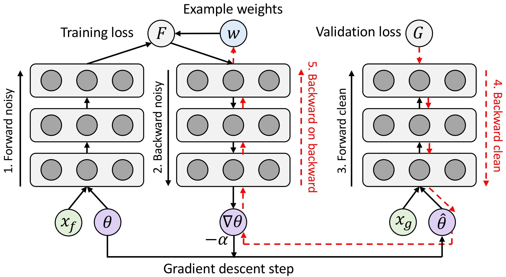
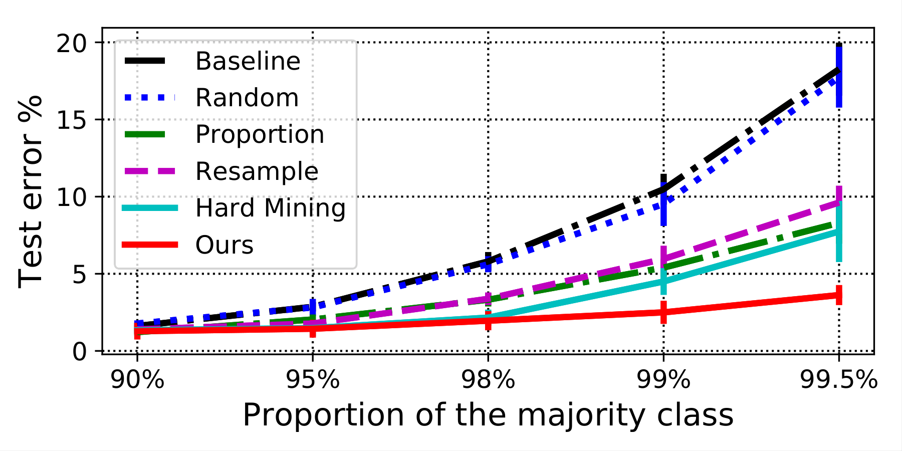
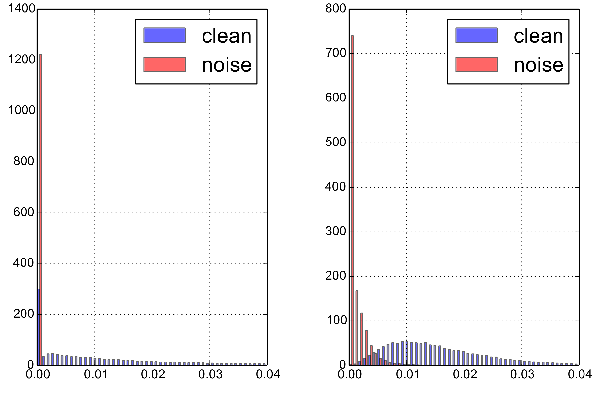
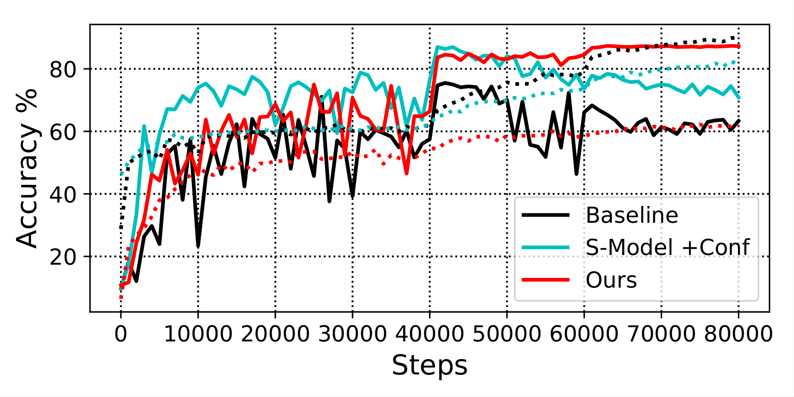
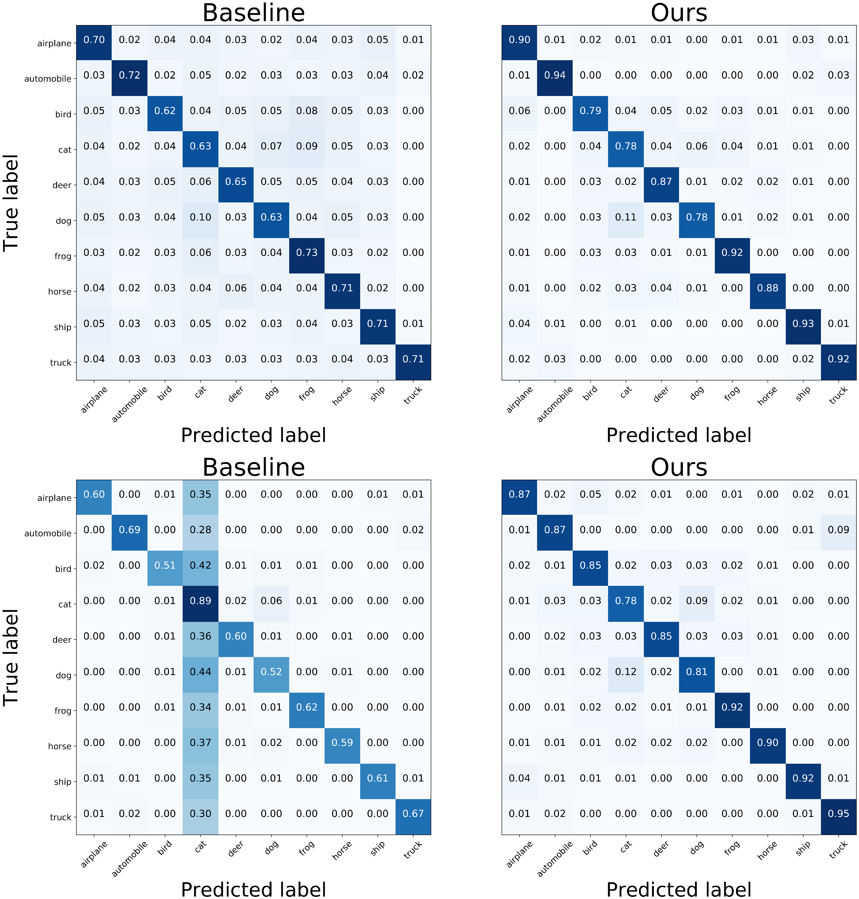
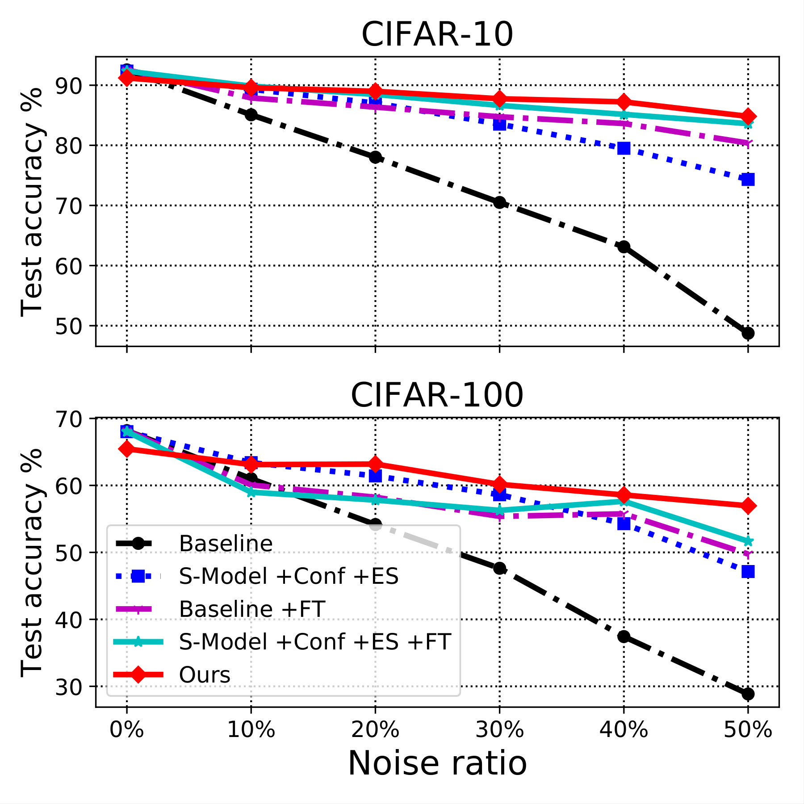
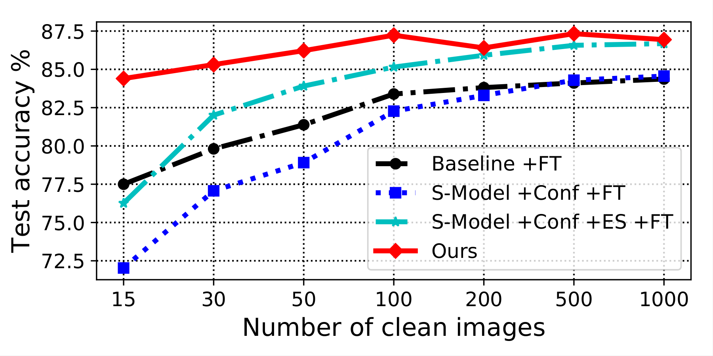

# L2RW: ロバストな深層学習のための事例の重み付けの学習

> 原典: [[translations/l2rw]] ・ `raw/papers/Learning to Reweight Examples for Robust Deep Learning.md`
> 著者: Mengye Ren, Wenyuan Zeng, Bin Yang, Raquel Urtasun（Uber ATG + University of Toronto）
> 出典: arXiv:1803.09050 → **ICML 2018**

## 一言まとめ

**訓練事例の重みを「損失の大きさ」ではなく「小さなクリーンな検証セットの勾配方向との一致度」で決める**メタ学習アルゴリズム。追加ハイパーパラメータがゼロで、**クラス不均衡とラベルノイズという従来は相反する処方箋が必要だった 2 つの問題に、同時に効く**。

## 背景と問題意識

### 「重みを付ける」は古い発想だが、その根拠が割れていた

訓練事例に重みを付けて重み付き損失を最小化するという発想自体は、AdaBoost（1997）まで遡る古典的なものである。問題は**何を根拠に重みを決めるか**にある。従来手法はほぼすべて**訓練損失の値**を根拠にしてきたが、そこには正面から矛盾する 2 つの流儀が併存していた。

| 流儀 | 代表手法 | 優先する事例 | 暗黙の前提 |
|---|---|---|---|
| **hard 優先** | AdaBoost / hard negative mining / **Focal Loss** | 損失が**大きい** | 損失が大きい＝難しい＝少数クラス |
| **easy 優先** | self-paced learning / Reed bootstrapping / robust loss | 損失が**小さい** | 損失が大きい＝ラベルがノイズ |

**この 2 つは同時に成り立たない。** クラス不均衡の問題では hard を優先するのが正しく、ラベルノイズの問題では easy を優先するのが正しい。そして現実のデータセットは**不均衡かつノイジー**であることが多く、そこでは両方の前提が誤る。

本 wiki の既存ページで言えば、[[concepts/object-detection]] に「Focal Loss = クラス不均衡対応」と記録されているのが hard 優先側の代表であり、これは本論文が Related Work で名指しで挙げている手法そのものである。

> **補足: hard negative mining（難負例マイニング）** — 検出器の訓練で、背景（負例）が圧倒的多数を占めるとき、損失の大きい「間違えやすい背景」だけを選んで学習に使う手法。**Focal Loss** はこれをソフトにしたもので、易しい事例の損失を $(1-p_t)^\gamma$ で減衰させて難しい事例に相対的な重みを寄せる。

> **補足: self-paced learning（自己ペース学習）** — 人間のカリキュラムに倣い、易しい事例（損失の小さいもの）から順に学習させる手法。モデルパラメータと二値の事例の重みを交互に最適化する。

### 論文の出発点にある鋭い指摘

本論文が最初に置く主張は、単なる手法の提案よりも強い認識論的なものである。

> **不偏なテストセットの適切な定義なしには、訓練セットのバイアス問題を解くことは本質的に ill-defined（不良設定）である。**

モデルには「何が正しくて何が誤りか」を区別する手がかりがそもそも存在しない。だからこそ、人工的なノイズ設定では**強い正則化をかけるだけで驚くほどうまくいってしまう**——本当に問題を解いたのか、単に何も学習しなかったのか区別がつかない。この指摘は後述する「Random ベースラインが強すぎた」という実験結果と直結する。

そこで著者らは、モデルの仮定を作り込むのをやめて、**最も基本的な仮定だけ**を置く。すなわち「**最良の事例の重み付けとは、評価手続きと整合する不偏でクリーンな検証事例の損失を最小化するもの**」。これは定義に近く、ほとんど反論の余地がない。実務上も、大量の粗いラベルと少量の正確なラベルという 2 層構造のデータセットは珍しくない、という現実的な裏付けも添えている。

## 提案手法

### 二重ループを 1 ステップに畳む

素直に定式化すると、これは**二重レベル（bilevel）最適化**になる。

$$\theta^{*}(w)=\arg\min_{\theta}\sum_{i}w_{i}f_{i}(\theta), \qquad w^{*}=\arg\min_{w\geq 0}\frac{1}{M}\sum_{i}f_{i}^{v}(\theta^{*}(w))$$

内側で重み $w$ を固定してモデルを訓練し切り、外側でその結果を検証損失で評価して $w$ を更新する。**入れ子の最適化が 2 重にかかるので、そのままでは計算不可能**である。

論文の中核は、これを**通常の訓練ループの中に 1 ステップの近似として畳み込む**ことにある。各ステップ $t$ で:

1. 現在のミニバッチの各事例に摂動 $\epsilon_i$（**ゼロで初期化**）を掛けた損失で、仮の 1 ステップ更新 $\hat{\theta}_{t+1}(\epsilon)$ を作る
2. その仮パラメータでの検証損失を $\epsilon$ について微分し、符号を反転して整流する: $\tilde{w}_{i,t}=\max(u_{i,t},0)$
3. バッチ内で総和が 1 になるよう正規化する

**この 3 番目の正規化が地味に効いている。** 論文は「バッチ正規化があることでメタ学習率 $\eta$ を実質的に打ち消している」と述べており、**これが「追加ハイパーパラメータがゼロ」という本手法の売りを成立させている**。正規化がなければ実効学習率が変わってしまい、1 ステップ先読みが保守的すぎる選択になりかねない（著者らの別論文 [Wu, Ren, Liao, Grosse, ICLR 2018] の short-horizon bias の議論を参照している）。

### 中核の式 — なぜこれが「勾配方向の一致度」なのか

MLP について展開すると（Appendix A に完全な導出）、$\epsilon$ に対するメタ勾配は次の形に分解される。

$$\frac{\partial}{\partial\epsilon_{i,t}}\mathbb{E}[f^{v}] \propto -\frac{1}{m}\sum_{j=1}^{m}\sum_{l=1}^{L}\underbrace{(\tilde{z}^{v}_{j,l-1}{}^{\top}\tilde{z}_{i,l-1})}_{\text{入力の類似度}}\underbrace{(g^{v}_{j,l}{}^{\top}g_{i,l})}_{\text{勾配方向の類似度}}$$

**2 つの内積の積を、全層・全検証事例について足し上げたもの**になっている。読み方は明快で:

- 訓練事例 $i$ と検証事例 $j$ の**入力が層ごとに似ていて**、
- かつそれらが**似た勾配方向を与える**なら、

その訓練事例は有用なので重みを上げる。逆に**反対の勾配方向**を与えるなら有害なので重みを下げる（整流されて 0 になる）。

Appendix B の証明ではこれがさらに簡潔な形で書かれていて、更新則が

$$\theta_{t+1}=\theta_{t}-\frac{\alpha_{t}}{n}\sum_{i\in B}\max\{\nabla G^{\top}\nabla f_{i},0\}\nabla f_{i}$$

となる。**重み = 検証損失の勾配と訓練事例の勾配の内積を整流したもの**、と一行で言える。検証損失を下げる方向に貢献する事例だけが生き残る。

### 実装 — backward-on-backward

<figure>

<figcaption>図1（再掲）: 計算グラフ。1. ノイジーデータの順伝播 → 2. その逆伝播 → 3. クリーンデータの順伝播 → 4. その逆伝播 → 5. backward on backward（赤い破線）で事例の重み w への勾配を得る。</figcaption>
</figure>

一般のネットワークでは自動微分に任せられる。訓練バッチの**勾配のグラフ自体を展開して、それをもう一度逆伝播する**（2 階微分）。TensorFlow や PyTorch のような一般的なフレームワークでそのまま書ける。

**代償は訓練時間が約 3 倍**になること。順伝播・逆伝播が訓練と検証で 2 セット、加えて backward-on-backward が 1 パス（現代のネットワークでは順伝播 1 回とほぼ同じコスト）、最後に重み付き目的関数の逆伝播が 1 回。著者らは「早期停止やファインチューニングのスケジュールを選ぶ煩わしさを避けられるなら払う価値がある」と主張している。

### 理論保証

穏やかな条件（検証損失が定数 $L$ で Lipschitz 平滑、訓練損失が $\sigma$-有界勾配、$\alpha_{t}\leq 2n/(L\sigma^{2})$）のもとで:

- **補題 1**: 検証損失は任意の訓練バッチ列に対して**単調に減少する**。等号が成り立つのは $\nabla G=0$ のときに限る
- **定理 2**: 収束レートは $O(1/\epsilon^{2})$ ——**SGD と同じ**

論文が丁寧なのは、ここに但し書きを付けている点である。「**我々の手法はこの小さな検証セットだけでモデルを訓練することと等価ではない**」。小さな検証セットで直接訓練すれば深刻な過学習を起こすが、本手法は大きな訓練セットから有用な情報を引き出しつつ、検証セットが好む分布に収束する。この主張は後述の「Clean Only」ベースラインの惨憺たる数字（CIFAR-10 で 15.90%）で裏付けられる。

> **補足: Lipschitz 平滑** — 勾配の変化が入力の変化に比例して抑えられる性質。$\|\nabla f(x)-\nabla f(y)\|\leq L\|x-y\|$。最適化の収束証明でほぼ必ず仮定される標準的な条件。**$\sigma$-有界勾配**は勾配のノルムが $\sigma$ 以下に抑えられること。

## 実験結果と知見

### クラス不均衡（MNIST 4-9、LeNet）

<figure>

<figcaption>図2（再掲）: 多数クラスの比率を 90% から 99.5% まで変えたときのテスト誤り率。バランスの取れた検証事例はわずか 10 枚で、しかもそれは訓練セットから分割したもの（データ量で有利になっていない）。</figcaption>
</figure>

比率 99.5%（約 199:1）で、**本手法は約 3.7% に留まる**のに対しベースラインは約 18%。Proportion（頻度の逆数）・Resample・Hard Mining はいずれも 8〜10% 程度で、本手法の 2 倍以上の誤りを出す。

論文の説明が的確である。「**我々のアプローチはクラスや訓練損失に基づいてサンプルを捨てない。サンプルが検証損失に対して有用である限り、それは訓練損失の一部として含められる**」。再サンプリングや hard mining は情報を捨てるが、重み付けは捨てない。

### ラベルノイズ（CIFAR-10/100、40% ノイズ）

2 つのノイズ型を設計している。**UniformFlip**（任意のクラスに一様に反転、文献で最も研究されている）と、**BackgroundFlip**（すべてのクラスが単一の背景クラスに反転）。後者は「アノテータが陽性を見落として背景に残す」という現実的な状況を模しており、**ラベル不均衡とラベルノイズの組み合わせ**になっている点が重要である。

**表1**: CIFAR UniformFlip 40% ノイズ、WideResNet-28-10（原典 表I より抜粋）

| Model | CIFAR-10 | CIFAR-100 |
|---|---|---|
| Baseline | 67.97 | 50.66 |
| Reed-Hard | 69.66 | 51.34 |
| S-Model | 70.64 | 49.10 |
| MentorNet | 76.6 | 56.9 |
| **Random**（乱数の重み） | **86.06** | 58.01 |
| Baseline +FT | 78.66 | 54.52 |
| MentorNet +FT | 78 | 59 |
| **Ours** | **86.92** | **61.34** |

**表2**: CIFAR BackgroundFlip 40% ノイズ、ResNet-32（原典 表II より抜粋）

| Model | CIFAR-10 | CIFAR-100 |
|---|---|---|
| Baseline | 59.54 | 37.82 |
| Baseline +ES | 64.96 | 39.08 |
| Weighted（オラクルのノイズ比を知っている） | 79.17 | 36.56 |
| S-Model +Conf +ES | 79.24 | 54.50 |
| **Clean Only**（クリーンな 10 枚/クラスのみで訓練） | **15.90** | **8.06** |
| Baseline +ES +FT | 85.19 | 55.22 |
| S-Model +Conf +ES +FT | 85.86 | 55.75 |
| **Ours** | **86.73** | **59.30** |

**CIFAR-100 で最先端手法に 3% 以上の差**をつけている。しかも比較対象の「S-Model +Conf」は**各クラスのオラクルのノイズ比率を知っている**——本手法が持たない情報を与えられてなお負けている。

### 最も面白い結果 — 「Random」が強すぎた

論文が自ら真っ先に挙げるのが、**整流ガウス乱数で重みを振っただけの「Random」ベースラインが UniformFlip で 86.06 を出し、比較した既存手法のすべてを上回った**という事実である。MentorNet（76.6）にも Reed（69.66）にも大差をつけている。

著者らの仮説は「**ランダムな事例の重みが強い正則化子として働いており、UniformFlip では学習の目的関数が依然として一貫している**」というもの。UniformFlip はノイズが全クラスに一様に散るので、ラベルの期待値は正しいクラスにバイアスしたまま残る——つまり**問題を解かなくても正則化さえかければ勝ててしまう**設定だった。

> **これは論文にとって不都合な結果に見えて、実は §「背景」の主張を補強している。** 「不偏なテストセットの定義なしには問題は ill-defined で、人工ノイズでは強い正則化が驚くほどうまくいく」という冒頭の指摘が、自分たちの実験で実証されてしまった形である。そして重要なのは、**Random は BackgroundFlip（69.51）と MNIST 不均衡では平凡**だということ。ノイズ型を変えると崩れる。本手法が両方で首位を保つことが、正則化以上のことをしている証拠になっている。
>
> **既存手法の多くは、実は正則化として効いていただけかもしれない** —— この読み方は、本 wiki の [[sources/convnext]] が示した「性能差の最大の単一要因は訓練レシピだった」という発見と同型の教訓である。**強いベースラインを置かないと何が効いているか分からない。**

### 重み付けは本当にノイズを検出できているのか

<figure>

<figcaption>図3（再掲）: 事例の重みの分布（青 = clean、赤 = noise）。左はランダムなバッチ、右は単一クラスに条件付けたバッチ。いずれもノイズ（赤）が重み 0 付近に鋭く集中し、clean（青）が正の重みに広く分布している。</figcaption>
</figure>

モデルが一度も見たことのない検証画像に対して、**ノイジーな画像のほとんどが正しく重みゼロに押しやられている**。右のパネル（単一クラスに条件付け、40% を背景に反転）では分離がさらに鮮明で、赤がほぼ完全に 0 付近に固まる。

### ノイズへの過学習が起きない

<figure>

<figcaption>図7（再掲）: BackgroundFlip 40% ノイズでの訓練曲線。実線が検証精度、点線が訓練精度。Baseline（黒）と S-Model（水色）は 40K ステップの学習率減衰後に検証精度が崩れるが、Ours（赤）は終了まで約 86% を保つ。</figcaption>
</figure>

この図には、論文本文が明示していない読みどころがある。**本手法の訓練精度（赤い点線）は約 60% で頭打ちになっている。** ノイズ率が 40% なのでクリーンなデータの割合はちょうど 60%——つまり**モデルはクリーンな事例だけを適合させ、ノイズには一切適合していない**。一方 Baseline の訓練精度（黒い点線）は 90% 近くまで上がり続けており、ノイズを丸暗記していることが分かる。

その結果、**本手法では早期停止が不要**になる。ベースラインでは早期停止が CIFAR-10 の S-Model を 10% 以上助けており、それだけノイズ過学習が深刻だったことの裏返しでもある。

<figure>

<figcaption>図6（再掲）: 混同行列。上が UniformFlip、下が BackgroundFlip（背景クラスは cat）。下段の Baseline では全クラスの 28〜44% が cat 列に流れ込んでいるが、Ours ではその列がほぼ消えている。</figcaption>
</figure>

BackgroundFlip の混同行列（下段）が特に劇的である。Baseline は airplane の 35%、bird の 42%、dog の 44% を背景クラス（cat）に誤分類しており、**cat の列だけが縦に一本明るく光る**。本手法ではこの列がほぼ完全に消え、対角成分が 0.78〜0.95 に揃う。**ノイズ遷移確率が予測から取り除かれている**ことが視覚的に確認できる。

### ノイズ率への耐性

<figure>

<figcaption>図5（再掲）: ノイズ率 0%〜50% でのテスト精度。上が CIFAR-10、下が CIFAR-100。Ours（赤）はほぼ水平を保つが、Baseline（黒）は直線的に崩れる。</figcaption>
</figure>

CIFAR-10 でノイズ率を 0% → 50% に上げたとき、**本手法は約 6% しか落ちない**（91.2 → 84.8）のに対し、**ベースラインは 40% 以上落ちる**（92.5 → 48.5）。

ただし **0% ノイズでは本手法がベースラインをわずかに下回る**。論文はその理由を正直に書いており、「検証セット上で最適化しているが、それは厳密には完全な訓練セットの部分集合なので、それ自身のサブサンプルバイアスを被る」。**きれいなデータしかないなら、この手法を使う理由はない。**

### クリーンな検証セットは何枚必要か — 最も実務的な発見

<figure>

<figcaption>図4（再掲）: クリーンな画像の枚数を 15 枚から 1000 枚まで変えたときのテスト精度。Ours（赤）は 15 枚の時点で既に約 84.4% あり、1000 枚でも約 87.0% にしかならない。</figcaption>
</figure>

**わずか 15 枚（全クラス合計）で性能低下は約 2%、100 枚を超えると伸びが止まる。** 一方、同じ 15 枚でベースラインをファインチューニングすると 77.5% しか出ず、1,000 枚（クラスあたり 100 枚）でようやく追いつく。

著者らの解釈が本質を突いている。

> **クリーンな検証セットは、パラメータのファインチューニングのための「データ源」ではなく「正則化子」として働いている。**

15 枚では明らかにモデルを訓練できる量ではない。それでも効くのは、**勾配方向を照合する「基準」としてしか使っていない**からである。この非対称性が本手法の実用性を決定的にしている——「不偏でクリーンなデータを大量に用意せよ」なら実務では使えないが、「15 枚でよい」なら現実的である。

## 限界・批判的視点

**論文自身が認めている点**

- **訓練時間が約 3 倍**。backward-on-backward の追加パスの分
- **ノイズ 0% ではベースラインをわずかに下回る**（サブサンプルバイアス）
- クリーンセットが大きくなればファインチューニング系の手法と相補的になりうる、と留保している

**本 wiki の視点から見た限界**

- **「不偏でクリーンな検証セットが手に入る」という前提が最大の弱点**。論文自身が冒頭で「不偏なテストセットの定義なしに問題は解けない」と論じている通り、この前提こそが問題の核心である。実務では**「何をもって不偏とするか」自体が難問**で、その判断を人間が下した時点でバイアスは入る。本手法はバイアスの問題を解いたのではなく、**バイアスの判断を 15 枚のキュレーションに集約した**と読むのが正確である。
- **検証規模が MNIST・CIFAR に留まる**。ImageNet 規模での検証がなく、2 階微分のコストが大規模モデルでどう振る舞うかは未検証。
- **大規模事前学習の時代とは向きが違う**。2018 年以降、CV の重心は「事例ごとの重みを訓練中に調整する」より「**訓練前にデータセット規模で選別する**」方向へ移った。本 wiki にある [[entities/dfn]]（Data Filtering Networks, 2023）はその代表で、小さな CLIP モデルに 12.8B から 2B を選別させる。**「小さな高品質データで、大量の粗いデータの使い方を決める」という骨格は L2RW と同じ**だが、粒度（事例 vs データセット）と適用タイミング（訓練中 vs 訓練前）が違う。
- **Random ベースラインの強さが示すもの**。UniformFlip で乱数の重みが既存手法を全部倒したという事実は、**この分野のベンチマーク設計そのものへの警告**でもある。人工ノイズの実験は、正則化の効果と真の頑健化を区別できていない可能性がある。

## 既存 wiki との接続

**[[entities/flexmatch]] の SVHN 失敗と正面から重なる。** FlexMatch（2021）の CPL（Curriculum Pseudo Labeling）は「学習が難しいクラスの閾値を下げる」というクラス別の動的閾値を導入したが、**SVHN では FixMatch より悪化した**（40 ラベルで 8.19% vs 3.81%、+4.38 の悪化）。原因は SVHN がクラス不均衡なデータセットだったこと——**CPL は「クラス別サンプル数がほぼ均等」という前提に依存していた**。L2RW はまさにこの前提を置かずに同じ問題に当たった 3 年前の先行研究であり、**「クラス単位の閾値」ではなく「事例単位の重み」で解いている**点が対照的である。

**[[concepts/object-detection]] の Focal Loss は、本論文の批判対象である。** Focal Loss は「難しい事例に重みを寄せる」＝ hard 優先側の代表で、クラス不均衡には効くがラベルノイズには逆効果になる。本論文は損失値ベースの重み付けが**原理的に片側にしか対応できない**ことを指摘した。

**ベンチマークの土俵が [[sources/mixmatch]] / [[sources/fixmatch]] / [[sources/flexmatch]] と同じ。** CIFAR-10/100 + WideResNet-28-10 / ResNet-32 という設定は半教師あり学習の系譜と共通で、数値を横に並べて読める。ただし解こうとしている問題は違う（ラベルが足りない vs ラベルが汚い）。

**[[concepts/weakly-supervised-pretraining]] の前提を裏から支える。** CLIP 以降の弱教師あり事前学習は「粗いラベルを大量に使う」ことで成立しているが、本論文の Introduction はまさに「粗いラベルは安価で入手性が高いが、ノイズがモデル性能を害する」という問題設定から出発している。**粗いラベルをどう扱うかという問いの、2018 年時点での回答**である。

## 原典の誤り（正誤）

- Appendix B の Eq. 29 で全体の訓練損失が $F(\theta)=\frac{1}{M}\sum_{i=1}^{N}f_{i}(\theta)$ と書かれているが、**係数は $\frac{1}{N}$ であるべき**（$N$ 個のデータの平均）。証明の後続では $F$ 自体を使わないため結論に影響はない。翻訳では原典に忠実に訳している。

## 用語と略称

- **L2RW** = Learning to Reweight（事例の重み付けの学習）。本論文の手法の通称
- **メタ学習（meta-learning）** = 「学習の仕方を学習する」枠組み。ここでは事例の重みというハイパーパラメータを学習で決めること
- **bilevel（二重レベル）最適化** = 内側の最適化の解を、外側の最適化の目的関数が参照する入れ子構造。本手法はこれを 1 ステップ近似で畳む
- **MAML** = Model-Agnostic Meta-Learning（Finn et al., 2017）。メタ目的関数に対して 1 ステップの勾配降下を取る点で本手法と似ている
- **backward-on-backward** = 逆伝播で作った勾配のグラフをもう一度逆伝播すること。2 階の自動微分
- **Lipschitz 平滑（Lipschitz-smooth）** = 勾配の変化が入力の変化に比例して抑えられる性質。収束証明の標準的な仮定
- **$\sigma$-有界勾配（$\sigma$-bounded gradients）** = 勾配のノルムが $\sigma$ 以下
- **UniformFlip** = 任意のクラスへ一様にラベルが反転するノイズ設定
- **BackgroundFlip** = すべてのクラスが単一の背景クラスへ反転するノイズ設定。ラベル不均衡とノイズの複合
- **MentorNet**（Jiang et al., 2017）= 損失値の系列を RNN に入れて事例の重みを出力するメタ学習モデル。本論文の主要な比較対象
- **Reed bootstrapping**（Reed et al., 2014）= 訓練目標をモデルの予測と与えられたラベルの凸結合にする手法
- **S-Model**（Goldberger & Ben-Reuven, 2017）= 分類出力の後にノイズ遷移行列をモデル化する softmax 層を足す手法
- **hyper-validation set** = ベースラインのハイパーパラメータ調整と訓練監視のために訓練セットから分割した集合。**本手法の使うクリーンな検証セットとは別物**で、同じノイズで破損させてある
- **ES** = Early Stopping（早期停止）。**FT** = Fine-Tuning（ファインチューニング）
- **WRN-28-10** = WideResNet-28-10（深さ 28、幅の倍率 10）
- **LeNet** = 1998 年の古典的な小規模 CNN。MNIST の標準的なベースライン
- **OHKM / hard negative mining** = 損失の大きい事例だけを選んで学習に使う手法
- **self-paced learning** = 損失の小さい事例から順に学習させる手法

## 関連ページ

- [[translations/l2rw]] — 全文和訳（Appendix A〜C 込み）
- [[concepts/example-reweighting]] — 事例の重み付けという主題の全体像（本論文が受け皿になっている）
- [[concepts/object-detection]] — Focal Loss / hard negative mining の文脈
- [[concepts/semi-supervised-learning]] — CIFAR + WRN という共通の土俵、および CPL との対比
- [[entities/flexmatch]] — クラス別閾値が不均衡データで失敗した事例
- [[entities/dfn]] — 「小さな高品質データで大量の粗いデータの使い方を決める」同じ骨格の、データセット規模版
- [[concepts/weakly-supervised-pretraining]] — 粗いラベルを大量に使うという前提
- [[sources/convnext]] — 「強いベースラインを置かないと何が効いているか分からない」という同型の教訓
