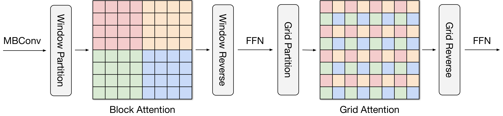
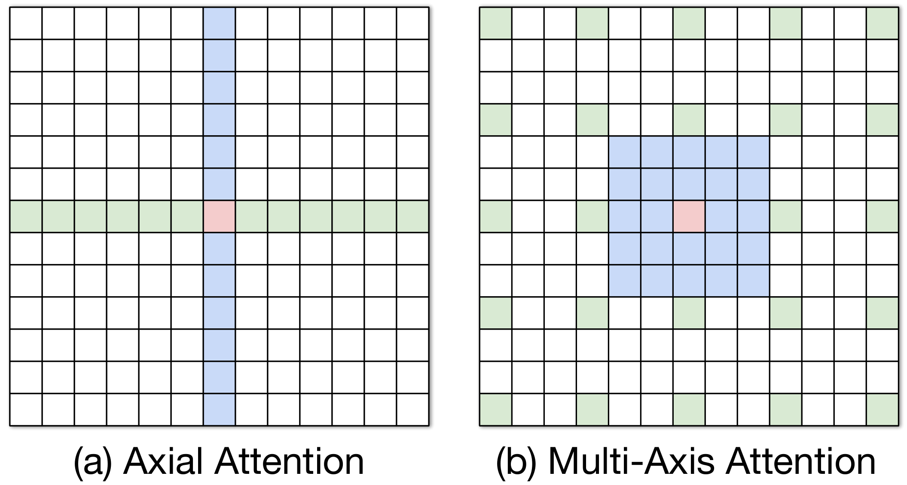
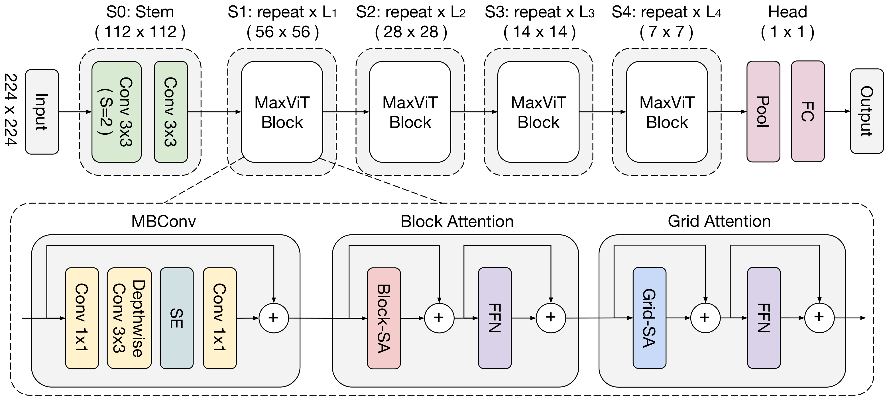
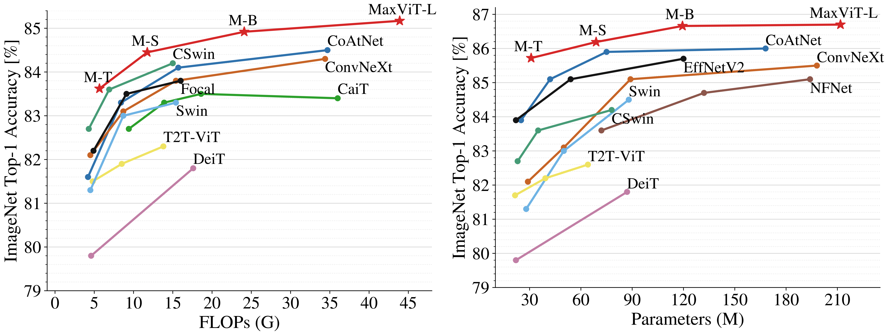
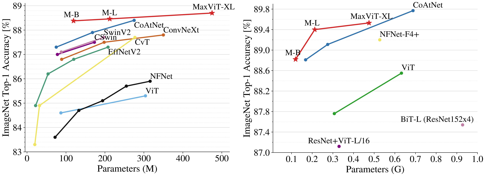
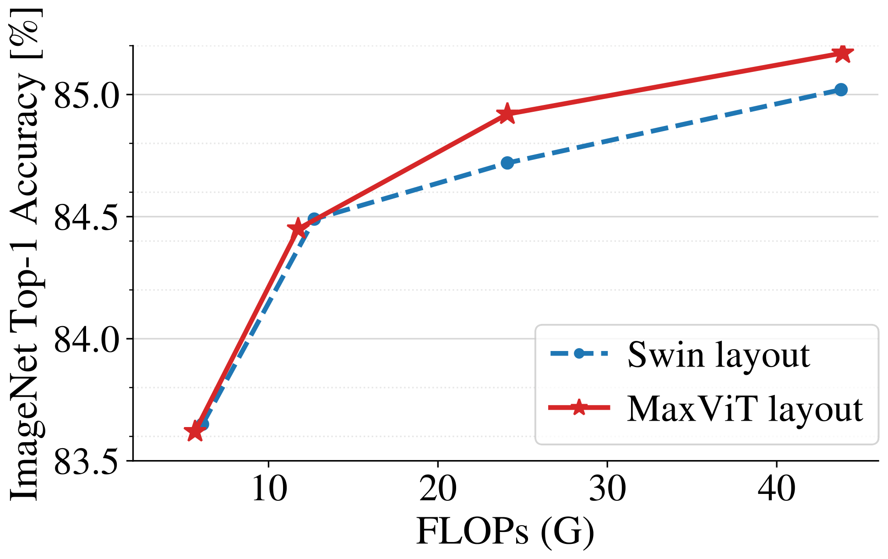

# MaxViT: 多軸 Vision Transformer

> 原典: [[translations/maxvit]] ・ `raw/papers/MaxViT_ Multi-Axis Vision Transformer.md`
> 著者: Zhengzhong Tu, Hossein Talebi, Han Zhang, Feng Yang, Peyman Milanfar, Alan Bovik, Yinxiao Li（Google Research / UT Austin）
> 出典: arXiv:2204.01697（2022 年 4 月）→ ECCV 2022
> コード: <https://github.com/google-research/maxvit>

> 翻訳メモ: 対応する [[translations/maxvit]] は CLAUDE.md §4 の標準ルールと異なり **Appendix 0.A〜0.C も翻訳済み**（ユーザーからの個別指示による）。原典 markdown には図 8 のみ画像があったため、図 1-7 は arXiv の e-print ソースから生成した。

---

## 一言まとめ

**「窓の中で attention する（局所）」と「等間隔に飛び飛びの画素どうしで attention する（大域）」を逐次に並べるだけで、線形計算量のまま第 1 層から大域的な視野を得る**手法。[[sources/swin-transformer|Swin]] の shifted window が「窓をずらして窓間を繋ぐ」ことで大域性を*間接的に*獲得したのに対し、MaxViT は **grid attention** で*直接*獲得する。しかも **Swin の attention モジュールとパラメータ数・FLOPs が完全に同一の drop-in 置換**でありながら、**マスキングも cyclic shift も不要**。MBConv と組み合わせた MaxViT ブロックを積むだけで、IN-1K 86.7% / IN-21K 88.7% / JFT 89.53% を達成した。

---

## 背景と問題意識

### Swin が解決し、そして残した問題

[[sources/swin-transformer|Swin Transformer]]（2021）は窓内 attention で計算量を線形化し、ViT を汎用バックボーンに変えた。しかし著者らはその代償を指摘する。

> ViT で用いられる完全注意よりも柔軟性と汎化性を持つにもかかわらず、**窓ベースの注意は非局所性の損失によりモデル容量が制限される**ことが観察されており、それゆえ ImageNet-21K や JFT のようなより大きなデータ領域で**不利にスケールする**。

つまり**局所性を導入して効率を得た代わりに、大規模データでの伸びしろを失った**。かといって高解像度の初期段階で完全 attention を使うのは二次計算量ゆえ不可能である。

> **核心の問い**: 「**計算予算のもとで、大域的相互作用と局所的相互作用をどう効率的に組み込めばモデル容量と汎化性のバランスが取れるか？**」

### 既存 wiki との位置づけ

本 wiki には既に「Transformer に CNN の性質を輸入する」（[[sources/swin-transformer]]）と「CNN を Transformer 流に近代化する」（[[sources/convnext]]）の両側が入っている。**MaxViT はその中間、「畳み込みと attention を 1 ブロックに統合する」ハイブリッド路線**にあたり、ConvNeXt V2 の比較表（[[sources/convnext-v2]] 表5）で 88.5/88.7 として登場していた相手でもある。

---

## 提案手法

### 中核: multi-axis attention（Max-SA）

<figure>

<figcaption>図3: 多軸自己注意（Max-SA）の流れ。MBConv → Window Partition → Block Attention（窓の中で attention、同色が混ざる）→ Window Reverse → FFN → Grid Partition → Grid Attention（等間隔に散らばった画素どうしで attention）→ Grid Reverse → FFN。窓／グリッドサイズはいずれも 7×7 固定なので、双方とも入力サイズに対して線形。</figcaption>
</figure>

入力 $X\in\mathbb{R}^{H\times W\times C}$ を、**同じ「軸を分解する」という発想の 2 通りの切り方**で扱う。

| | 分解の形 | 意味 | attention する軸 |
|---|---|---|---|
| **block attention**（局所） | $(\frac{H}{P}\times\frac{W}{P},\ P\times P,\ C)$ | $P\times P$ の重複しない窓に分割 | 窓の**中**（$P^2$） |
| **grid attention**（大域） | $(G\times G,\ \frac{H}{G}\times\frac{W}{G},\ C)$ | $G\times G$ の一様グリッドで間引く | グリッドの**格子点間**（$G^2$） |

**この対称性が本論文の美しさ**である。block は「近くの $P^2$ 個」、grid は「$H/G$ 画素おきに散らばった $G^2$ 個」を見る。$P=G=7$（Swin に合わせる）とすると**局所と大域の計算量が完全に釣り合い、どちらも線形**になる。

> **補足: grid attention はなぜ「大域」なのか** — グリッド分割は画像全体に格子を重ね、**格子点にあたる画素だけを集めて attention する**。集められた画素は画像の端から端まで散らばっているので、1 回の演算で画像全体に情報が行き渡る。これは畳み込みの **dilated convolution（拡張畳み込み）** を attention でやっているのに近い。

### なぜ shifted window より良いのか

著者らの主張は明快である。Max-SA は **Swin の attention モジュールと「まったく同じパラメータ数と FLOPs」で drop-in 置換できる**。その上で:

- **マスキング・パディング・cyclic shift が一切不要**。Swin が cyclic shift + マスクという込み入った実装を要したのに対し、Max-SA は einops の `rearrange` 2 つで書ける（Appendix の擬似コード参照）
- **第 1 層から大域的視野を持つ**。Swin は窓をずらして層を重ねることで*徐々に*受容野を広げるが、MaxViT は最初の段階から画像全体を見る
- **軸注意（axial attention）とも違う**: 軸注意は「列方向 → 行方向」で $\mathcal{O}(N\sqrt{N})$。Max-SA は「局所 → 疎な大域」で $\mathcal{O}(N)$

<figure>

<figcaption>図6: 軸注意（左）と提案する多軸注意（右）の比較。軸注意は列方向・行方向の順に attention して O(N√N)、Max-SA は局所 → 疎な大域の順で O(N)。</figcaption>
</figure>

### MaxViT ブロックとアーキテクチャ

<figure>

<figcaption>図2: MaxViT のアーキテクチャ。上段は ResNet 流の階層構造（S0 Conv ステム 112² → S1 56² → S2 28² → S3 14² → S4 7² → Pool → FC）。下段が MaxViT ブロックの中身で、MBConv（Conv1×1 → Depthwise Conv3×3 → SE → Conv1×1 + 残差）→ Block Attention（Block-SA + FFN）→ Grid Attention（Grid-SA + FFN）を一直線に並べたもの。</figcaption>
</figure>

**MBConv → block attention → grid attention** を順に並べた 1 ブロックを、4 段階にわたって単に繰り返すだけ。設計の単純さが売りである。

- **MBConv を前に置く 2 つの理由**: (1) attention と併用すると汎化性と訓練しやすさが上がる、(2) **depthwise 畳み込みが条件付き位置エンコーディング（CPE）として働くため、明示的な位置エンコーディング層が不要になる**
- **[CLS] トークンなし**（最終段階の大域平均プーリング）
- 相対位置バイアス付きの relative attention を全 attention で使用。head 次元 32、MBConv 拡大率 4、SE 縮小率 0.25

---

## 実験結果と知見

### ImageNet — スケールするほど強くなる

<figure>

<figcaption>図1: ImageNet-1K における性能比較。(a) 精度 vs FLOPs（224² 訓練）、(b) 精度 vs パラメータ数（384/512 でのファインチューニングを含む）。MaxViT が両方の曲線で従来の vision Transformer を上回る。</figcaption>
</figure>

| 設定 | 結果 | 比較 |
|---|---|---|
| IN-1K のみ 224² | MaxViT-L **85.17** | CoAtNet-3 に **+0.67** |
| IN-1K のみ 512² | MaxViT-L **86.70** | **当時の IN-1K 通常訓練 SOTA** |
| IN-21K → 1K | MaxViT-B **88.38** | **CoAtNet-4 を +0.28 上回る（パラメータ 43% / FLOPs 38% で）** |
| IN-21K → 1K | MaxViT-XL 512² **88.70** | 当時の SOTA |
| JFT-300M → 1K | MaxViT-XL **89.53** | 同規模の従来モデルを上回る |

<figure>

<figcaption>図4: 大規模事前学習でのスケーリング。(a) ImageNet-21K、(b) JFT-300M。MaxViT が同程度の複雑度の従来の注意ベースモデルより全面的に良くスケールする。</figcaption>
</figure>

**MaxViT-B が CoAtNet-4 をパラメータ 43%・FLOPs 38% で上回った**のが最も強い数字。冒頭で述べた「窓ベース attention は大規模データで不利にスケールする」という問題設定に、直接答える結果になっている。

### COCO 検出 — 効率で圧倒

| Backbone | 解像度 | AP | AP^m | FLOPs |
|---|---|---|---|---|
| Swin-B | 1280×800 | 51.9 | 45.0 | 982G |
| ConvNeXt-B | 1280×800 | 52.7 | 45.6 | 964G |
| **MaxViT-S** | 896×896 | **53.1** | **45.4** | **595G** |
| **MaxViT-B** | 896×896 | **53.4** | **45.7** | 856G |

**MaxViT-S が約 40% 少ない計算量で base 級（Swin-B / UViT-B）を上回る**。ただし著者は公平性のため HTC++ や instaboost といったシステムレベルの強化を**あえて使っていない**（[[sources/swin-transformer|Swin]] の 58.7 AP はそれらを使った数字なので直接比較はできない）。

### 汎用モジュールであることの実証 — 美観評価と GAN

本論文の隠れた主張は「**MaxViT ブロックは分類バックボーン専用ではない**」ことにある。

- **画像美観評価（AVA）**: MaxViT-T 512² で PLCC **0.745** / SRCC **0.708**。多重解像度入力を使う MUSIQ（0.720 / 0.706）を上回る。**入力解像度を上げるほど良くなる**のは、grid attention の大域性が効いている証拠
- **無条件画像生成（GAN）**: MaxViT-GAN が **FID 30.77 / IS 22.58**（HiT の 30.83 / 21.64）を、**18.6M vs 32.9M と約半分のパラメータで**達成。しかも progressive growing・noise injection といった GAN の定番の小技を一切使わずに

### アブレーションの読みどころ

**表**: 主要アブレーション（MaxViT-T、IN-1K top-1、[[translations/maxvit]] 表7-10 より）

| 軸 | 結果 | 含意 |
|---|---|---|
| **grid attention を除去** | S3 で -0.62、S1/S2 で -0.26/-0.24 | 大域注意はどの段階でも効く |
| **grid を block で置換**（同 FLOPs） | -0.13 〜 -0.23 | **パラメータ・FLOPs 一定でも grid の方が良い** = 大域性そのものの寄与 |
| **MBConv を除去** | S3 で **-0.97**、全段階で -0.38〜-0.60 | 畳み込みは飾りではなく必須 |
| **ブロック順序 6 通り** | C-BA-GA が最良（83.62）、MBConv を後ろに置くと -0.54〜-0.60 | **畳み込みは attention の前**（局所→大域の順） |
| **逐次 vs 並列** | 並列は **-0.98 〜 -1.63**、しかもパラメータは多い | **逐次的積み重ねが局所と大域の融合を学べる** |
| **垂直レイアウト** | 小モデルは Swin と同等、大モデルで大きく優位 | 段階配分が大規模化の鍵 |

特に重要なのが 2 点。

1. **「grid を block に置き換える」実験**（表7 Replace-S*）: パラメータ数も FLOPs も完全に同じにした上で -0.13〜-0.23 落ちる。これは**大域性そのものの純粋な寄与**を切り出した綺麗な対照実験である。
2. **逐次 > 並列が最大 -1.63 と大差**: HiT などの並列設計に対する明確な反証。著者は「並列は相互作用の少ない補完的な手がかりを学ぶが、逐次は局所層と大域層のより強力な融合を学べる」と説明する。

**生成タスクだけは順序が逆（GA-BA-C）が良い**（FID 30.77 vs 31.40）という発見も面白い。「生成ではまず大域構造を決めてから細部を埋める方が自然」という仮説が添えられている。

<figure>

<figcaption>図5: 垂直レイアウトのアブレーション。MaxViT のレイアウトは小さいモデルでは Swin と同程度だが、大きなモデルでは大幅に良くスケールする。</figcaption>
</figure>

---

## 限界・批判的視点

- **スループットは Swin / ConvNeXt に劣る**。表2 で MaxViT-T は 349.6 img/s、対する Swin-T は 755.2、ConvNeXt-T は 774.7 で**2 倍以上遅い**。精度は +2.3 高いが、**MBConv + 2 種の attention という 3 段構えのブロックは重い**。本 wiki が [[sources/convnext]] で記録した「A100 で ConvNeXt が Swin 比 +49%」という話と合わせると、**MaxViT は精度優先で効率は犠牲**という位置づけになる。
- **パラメータ効率も良くない**。MaxViT-B は 120M で 84.95、ConvNeXt-B は 89M で 83.8。精度は勝つがパラメータは 35% 多い。IN-21K 以降で効率が逆転するのが本論文の主張だが、**IN-1K のみの領域では ConvNeXt / Swin の方がパラメータ効率は良い**。
- **JFT-300M は非公開データ**。最高スコア 89.53% は Google 内部データセットに依存し、**再現できない**。
- **検出の比較が横並びでない**。MaxViT は 896×896、Swin/ConvNeXt は 1280×800 と入力解像度が異なる。FLOPs で正規化した議論はされているが、解像度を揃えた比較はない。
- **「単純さ」の主張には留保が要る**。著者は「基本ブロックを設計して単に繰り返すだけ」と単純さを強調するが、**1 ブロックに MBConv + SE + block attention + grid attention + FFN×2 が入っている**のは、[[entities/hiera]] の「pool attention だけ」や [[entities/convnext]] の「LN 1 個 + GELU 1 個」と比べると明らかに複雑である。simplicity の基準が違う。
- **その後の主流にはならなかった**。本 wiki の視点で言えば、CLIP / DINOv2 / MLLM の視覚エンコーダは plain ViT に収束しており、ハイブリッド路線（MaxViT / CoAtNet）は分類ベンチマークの精度競争では強かったものの、**言語との接続性や SSL との相性という軸で選ばれなかった**（[[concepts/convolutional-neural-network]] の「CNN は終わったのか」節と同じ構図）。
- **原典の誤植**: Appendix の表13 で MaxViT-L @384 が **84.40** と記されているが、本文の表2 では **86.40**。文脈上 86.40 が正しい。

---

## 用語と略称

- **MaxViT** = **M**ulti-**ax**is **Vi**sion **T**ransformer
- **Max-SA** = Multi-Axis Self-Attention。block attention と grid attention の組
- **block attention（ブロック注意）** = $P\times P$ の重複しない窓の内部で attention。Swin の W-MSA に相当する局所注意
- **grid attention（グリッド注意）** = $G\times G$ の一様グリッドの格子点どうしで attention。**dilated（拡張された）大域注意**
- **MBConv** = Mobile Inverted Bottleneck Convolution（MobileNetV2 由来）。Conv1×1 拡大 → Depthwise Conv3×3 → SE → Conv1×1 縮小 + 残差
- **SE** = Squeeze-and-Excitation。チャネル方向のゲーティング
- **CPE** = Conditional Position Encoding（条件付き位置エンコーディング）。depthwise 畳み込みが位置情報を担うため明示的な位置埋め込みが不要になる
- **relative attention（相対注意）** = attention ロジットに相対位置バイアス $B$ を加算する方式。[[sources/swin-transformer|Swin]] と同じ発想
- **axial attention（軸注意）** = 列方向・行方向に順に attention する手法。$\mathcal{O}(N\sqrt{N})$。Max-SA とは別物
- **CoAtNet** = Google の先行ハイブリッドモデル。本論文の最大の比較対象（本 wiki 未取り込み）
- **HiT** = 局所-大域注意ベースの生成 Transformer。GAN 実験の比較対象
- **AVA** = 美観評価のベンチマーク（255K 画像、平均 200 人が 1-10 で評定）
- **PLCC / SRCC** = Pearson の線形相関係数 / Spearman の順位相関係数
- **FID / IS** = Fréchet Inception Distance（低いほど良い）/ Inception Score（高いほど良い）
- **JFT-300M** = Google 内部の約 3 億枚の弱ラベル画像データセット（非公開）

## 関連ページ

- [[entities/maxvit]] — MaxViT のスペック・バリアント・系譜
- [[sources/swin-transformer]] / [[entities/swin-transformer]] — 最大の比較対象。Max-SA は Swin の attention の drop-in 置換
- [[concepts/vision-transformer]] — 出発点の ViT と、その二次計算量の問題
- [[sources/convnext]] / [[entities/convnext]] — 同時期の「ConvNet 側からの回答」。MaxViT は「両者を 1 ブロックに統合する」第 3 の道
- [[sources/convnext-v2]] — MaxViT を 88.5/88.7 の比較対象として引用している後続研究
- [[concepts/convolutional-neural-network]] — MBConv / SE / inverted bottleneck の背景
- [[entities/hiera]] — 「工夫を削ぐ」方向の対極。MaxViT は「工夫を足して統合する」方向
- [[concepts/object-detection]] — COCO 検出におけるバックボーン比較の文脈
- [[sources/nfnet]] / [[entities/nfnet]] — 比較表の NFNet-F0/F1（83.6 / 84.7）と JFT の NFNet-F4+ 89.20 の原典
