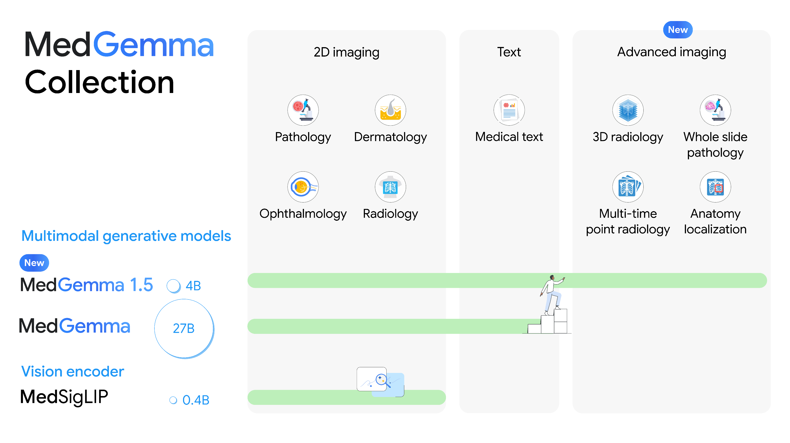
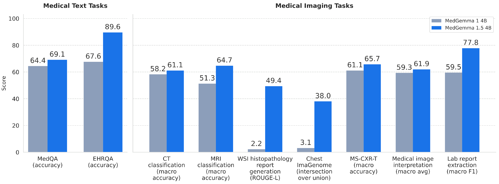

# MedGemma 1.5: 3D・全スライド画像・局在化・経時解析を単一アーキテクチャに載せる

> 原典: [[translations/medgemma-1-5]] ・ `raw/papers/MedGemma 1.5 Technical Report.md`
> 著者: Google Research + Google DeepMind（責任著者: Chufang Fang, Daniel Golden, Andrew Sellergren）
> 出典: arXiv:2604.05081
> モデル: <https://goo.gle/medgemma>

## 一言まとめ

**アーキテクチャを一切変えずに** 3D CT/MRI・病理の全スライド画像・解剖学的局在化・経時解析を 4B モデルに載せた。効かせたのは**前処理と [[entities/gemma-3]] の 128K 長コンテキスト**である。

## 背景と問題意識

[[sources/medgemma]] は意図的に **2D 医療画像に絞り、3D ボリュームとゲノムを外した**。しかし臨床の現実では CT も MRI も 3D であり、病理は 1 枚が数ギガピクセルの全スライド画像（WSI）である。**「標準的な 2D 画像のタスクに取り組むモデルとベンチマークに比べ、より複雑な画像タスクに取り組むものは限られている」**というのが本レポートの出発点である。

普通なら 3D 用のエンコーダ（3D CNN、ViT の時間軸拡張など）を新設するところだが、本レポートの選択は違う。

> **MedGemma 4B 1.5 は Gemma 3 に基づき同一のアーキテクチャを持つ。視覚エンコーダは 400M の MedSigLIP エンコーダである。**

**アーキテクチャは 1.0 とも Gemma 3 とも同じ。** 新しいのは「3D をどう 2D の列に落とすか」という前処理と、それを受け止める長コンテキストである。

<figure>

<figcaption>図1（再掲）: MedGemma コレクションの対応範囲。MedGemma 1.5 4B（緑の帯）だけが 2D imaging / Text / Advanced imaging の 3 領域すべてに届いており、MedGemma 27B は 2D + Text まで、MedSigLIP は 2D imaging のみ。</figcaption>
</figure>

## 提案手法 — 本レポートの心臓部は前処理にある

### 3D ボリューム: 軸位断スライスの列に落とす

> **画像エンコーダは 2D の RGB 画像しか処理できないため、3D の CT と MR の画像ボリュームは個々の 2D 軸位断画像の列に前処理**され、そのそれぞれが 896×896 画素に再スケールされた。

**スライス数の上限 85 の根拠が明快である。**

| 項目 | 値 | 根拠 |
|---|---|---|
| 最大スライス数 | **85** | — |
| 視覚トークン数 | **21,760** | 85 × 256 トークン/画像 |
| 制約 | **合計 32K トークン以内** | 放射線レポートの適応（indication、プロンプト側）と所見（findings、出力側）を含めて訓練時のメモリを扱える範囲に収めるため |

85 を超える場合は **z 軸に沿って等間隔にサンプル**する。選択基準は「1 スライス 512×512 以内 / 軸位断 / 同じスライス厚 / 5 スライス以上」。**CT では同一スキャンの異なる再構成カーネル、MRI では T1w・T2w・GRE・SWI という異なるシーケンス**が、z 方向に積まれて 1 つの列になる。

> つまり **3D ボリュームは「動画」でも「立体」でもなく、単に長い画像列として扱われている**。空間的な z 方向の連続性はモデルが位置から学ぶしかないが、それでも動く、というのが本レポートの主張である。

### HU を RGB に写像する — チャネルごとに理由がある

[[sources/medgemma]] でも CT の 3 ウィンドウ写像は使われていたが、1.5 では**各チャネルの割り当て理由が明示されている**点が読みどころである。

**表**: CT のウィンドウ写像（原典 §2.3.1）

| チャネル | 範囲（HU） | 対象 | 割り当ての理由 |
|---|---|---|---|
| **R** | (-1024, 1024) | 全体の形態 | 訓練データが脳・胸部・腹部にまたがるため、**広いウィンドウで肺実質から皮質骨まで境界を可視に保つ** |
| **G** | (-135, 215) | 軟部組織 | **緑チャネルは標準的な画像処理で輝度に最も大きく寄与する**ため、テクスチャへのエンコーダの感度を活かせる軟部組織を割り当てた |
| **B** | (0, 80) | 脳実質・出血 | 狭く高コントラストで、灰白質/白質の区別と急性頭蓋内出血、血管の石灰化を強調 |

**「緑は輝度への寄与が最大だから最も繊細な組織を置く」**という理屈が面白い。RGB は本来カラー表示のための枠だが、ここでは**エンコーダの感度分布を利用する 3 本の独立チャネル**として設計的に使われている。

**MRI は扱いが違う。** ボクセル値がすべて相対的で生理学的なウィンドウが存在しないため、ウィンドウ処理を一切適用せず、**ボリュームごとの min-max 正規化**で R=G=B の同値にする。物理単位を持つ CT と持たない MRI で処理を分けている。

### WSI: 倍率をサイコロで選び、順序を保つ

病理の全スライド画像は数ギガピクセルあるので、そのままでは入らない。

1. **5x 倍率で組織マスク**を生成（**HSV 色空間**でのカスタム多段階セグメンテーション）→ 組織のある領域だけに限定
2. **1 スライドにつき光学倍率を 1 つ確率的に選択**: P(5x)=0.34、P(10x)=0.33、P(20x)=0.33
3. 896×896 の**非重複パッチ**を格子状に抽出
4. **最大 126 パッチ（32,256 視覚トークン）**まで復元なしランダムサブサンプリング
5. **選択されたパッチの元の空間的な順序を保存**

> **設計上の非自明な点が 2 つある。**
>
> **(1) 倍率を確率的に選ぶ。** 病理医は 5x で全体像を見て 20x で細胞を見る、という倍率の行き来をする。1 スライドにつき 1 倍率をサイコロで決めることで、訓練を通じてモデルは全倍率を経験する。マルチスケールを 1 サンプル内で持つのではなく、**サンプル間の分散として持たせている**。
>
> **(2) 空間的順序を保存する。** ランダムにサブサンプルした後も元の格子順を保つ。位置エンコーディングが暗黙の空間情報を運ぶので、パッチ列が「スライドを走査した順」になっていることに意味がある。

CT の 85 と WSI の 126 で上限が違うのは、**伴うテキスト入力の長さが違うから**（CT は放射線レポートの適応と所見で長く、WSI はキャプションが短い）。トークン予算の配分の話である。

### 訓練の変更点

| 項目 | MedGemma 1 | **MedGemma 1.5** |
|---|---|---|
| 視覚エンコーダ | SigLIP → 医療微調整（= MedSigLIP を作る） | **MedSigLIP を凍結** |
| 更新対象 | エンコーダ + デコーダ | **言語デコーダのみ** |
| 蒸留の教師 | 大規模 IT 教師 1 つ | 改善された IT 教師 + **モダリティ別の補助教師**（CT / MRI / 病理でそれぞれ訓練） |
| 蒸留の方式 | — | トークンあたり **256 の教師ロジット**を教師確率で重み付けサンプル、交差エントロピー |

**視覚エンコーダを凍結したのが効率上の要点**である。1.0 で作った MedSigLIP は既に医療画像を読めるので、「3D を扱う」という課題は**視覚側ではなく言語側（長い画像列をどう統合するか）の問題**だと切り分けている。

## 実験結果と知見

### 新しい能力 — 「改善」ではなく「できなかったことができるようになった」

<figure>

<figcaption>図2（再掲）: MedGemma 1 4B（灰）と MedGemma 1.5 4B（青）の比較。左がテキスト QA、右が画像タスク。WSI 病理レポート生成が 2.2 → 49.4、Chest ImaGenome の IoU が 3.1 → 38.0 と、ベースラインがほぼゼロの項目がある。</figcaption>
</figure>

**表**: 新しい評価タスク（原典 表4 より抜粋）

| Task | Metric | MedGemma 1 4B | **MedGemma 1.5 4B** | Qwen3 VL 4B | Gemini 3.0 Pro | External SOTA |
|---|---|---|---|---|---|---|
| WSI Histopath | ROUGE-L | **2.2** | **49.4** | ? | 12.2 | 49.8（PolyPath） |
| Chest ImaGenome（局在化） | Mean IoU | **3.1** | **38.0** | 8.7 | 39.1 | 30.7-34.4（CoCa-CXR） |
| MRI Dataset 1 (3D MRI) | Accuracy | 51.3 | **64.7** | 49.6 | 55.5 | – |
| CT Dataset 1 (3D CT) | Accuracy | 58.2 | **61.1** | 52.8 | 61.0 | – |
| MS-CXR-T（経時） | Macro-Accuracy | 61.1 | **65.7** | 53.5 | 62.9 | 68.5（BioViL-T） |
| EHR Dataset 4 | Macro F1 | 25 | **64** | – | 81 | – |

**この表の読み方には注意が要る。** 論文の要旨は「WSI で 47% のマクロ F1 の向上」「IoU で 35% の向上」と書くが、実態は **2.2 → 49.4** と **3.1 → 38.0** である。つまり:

> **MedGemma 1 はこれらのタスクを「下手にできた」のではなく、「まったくできなかった」。**

ROUGE-L 2.2 も IoU 3.1 も、ほぼランダム出力の水準である。**「+47pt の改善」ではなく「0 から 1 になった」**と読むのが正確で、その分だけ**外部 SOTA に対して即座に肩を並べている**（WSI 49.4 vs PolyPath 49.8、局在化 38.0 vs CoCa-CXR 30.7-34.4 で**上回っている**）ことの意味も大きい。前処理を工夫しただけで専用手法に届いた、ということになる。

3D については **MRI が +13.4pt に対し CT は +2.9pt** と差がある。MRI の方が伸びたのは、T1w/T2w/GRE/SWI という**複数シーケンスを z 方向に積む**という扱いが効いたためと推測できるが、論文は理由を述べていない。

### 分布外の 3D CT で汎用大規模モデルを 3 倍上回る

Appendix A の CT-RATE（**分布外**、非造影胸部 CT、18 状態）:

| Model | Macro F1 |
|---|---|
| MedGemma 1 4B | 23.5 |
| **MedGemma 1.5 4B** | **26.9** |
| Gemini 3.0 Flash | **8.5** |

**4B が Gemini 3.0 Flash の 3 倍以上**。しかも MedGemma にとって OOD である。3D 医療画像という領域では、モデル規模より**前処理と訓練データの適合**が支配的であることを示す最も鮮明な結果である。

なお論文は運用上の代償も書いている。**特化した CT アーキテクチャが単一の順伝播で多ラベルを出すのに対し、生成モデルである MedGemma は 1 検査あたり 18 回問い合わせる必要があった**。精度で勝っても推論回数で不利、という現実的なトレードオフである。

### Qwen3-VL 4B との対比 — 設計思想の違いが数字に出る

本 wiki 的に最も重要な比較である。論文自身が「明確に異なる設計思想を明らかにする」と述べている。

| 領域 | 代表タスク | MedGemma 1.5 4B | [[entities/qwen3-vl\|Qwen3 VL 4B]] | 勝者 |
|---|---|---|---|---|
| **テキスト知識** | MedQA | 69.1 | **76.8** | Qwen3-VL |
| | MMLU Med | 69.7 | **78.3** | Qwen3-VL |
| | EHRNoteQA | 80.4 | **90.6** | Qwen3-VL |
| **医療視覚** | MIMIC-CXR (Med-Gemini) | **89.5** | 78.5 | MedGemma |
| | CheXpert | **48.2** | 33.5 | MedGemma |
| | PathMCQA | **70.0** | 41.8 | MedGemma |
| | EyePACS | **76.8** | 41.9 | MedGemma |
| | Chest ImaGenome (IoU) | **38.0** | 8.7 | MedGemma |
| | 3D CT / 3D MRI | **61.1 / 64.7** | 52.8 / 49.6 | MedGemma |

> **すべての視覚タスクにおいて MedGemma 1.5 は Qwen3 VL 4B を上回った。**（原典 §4）

**綺麗な非対称である。** 同じ 4B で、テキストの医学知識は汎用モデルが勝ち、医療画像の解釈は特化モデルが勝つ。理由も推測しやすい——医学知識は教科書や Web に大量にテキストとして存在し汎用の事前学習で吸収できるが、**眼底写真や病理パッチのラベル付きデータは Web にない**。

これは [[sources/medgemma]] で見た「皮膚科では Gemini 2.5 Pro に負けるが眼底では圧勝する」という現象と同じ構図で、**ドメイン特化の利得はデータの Web 上での希少性と相関する**という仮説を補強する。

### 何が退行したか

論文は Limitations で正直に書いている。

| 退行した項目 | MedGemma 1 4B | MedGemma 1.5 4B | 差 |
|---|---|---|---|
| **SLAKE (VQA)** | 72.3 | **59.8** | **-12.5** |
| **PubMedQA** | 73.4 | 67.6 | -5.8 |
| **MMLU Pro（非医療）** | 39.1 | **33.8** | **-5.3**（Gemma 3 4B の 43.6 から -9.8） |
| VQA-RAD | 49.9 | 48.1 | -1.8 |
| CXR14 | 50.1 | 48.4 | -1.7 |
| MMLU Med | 70.0 | 69.7 | -0.3 |

論文は SLAKE / VQA-RAD の退行に対して「**これらのベンチマークはトークンの重複に依存し、正解の回答が標準化されていない**という限界を持つ」と反論している。これは妥当な指摘だが、**SLAKE の -12.5pt は反論だけで片づけるには大きい**。

**MMLU Pro の劣化は論文自身がより率直である**（Appendix A 表6）:

> この低下は 4B パラメータのクラスにおける**明確なトレードオフ**を示唆しており、モデルを画像に特化させるために必要とされた集中的な微調整が、**領域外の汎用のタスクに対する能力の減少**をもたらした可能性を示している。それでも我々は……このトレードオフは価値があると信じている。

**[[sources/medgemma]] では「汎用性能はほとんど落ちていない」（MMLU Pro -4.5pt）ことが売りの 1 つだったが、1.5 ではそれが崩れている**（Gemma 3 4B 比 -9.8pt）。**4B に高次元画像を詰め込んだ代償が汎用知識で払われた**、という素直な読み方ができる。「医療のジェネラリスト」化と「汎用のジェネラリスト」性は 4B では両立しなかった。

なお **PubMedQA も 73.4 → 67.6 と下がっている**が、論文本文はこれに触れていない。

## 限界・批判的視点

**論文自身が認めている点**

- **SLAKE / VQA-RAD の退行**（ただしベンチマーク側の限界も指摘）
- **MMLU Pro の劣化 = 4B クラスの明確なトレードオフ**（Appendix A）
- Qwen3-VL との比較の**一部が「内部評価フレームワークの実務上の制約」で実施できていない**（表4 の "–" と WSI の "?"）
- CT-RATE で 1 検査あたり **18 回の問い合わせ**が必要という推論効率の不利

**本 wiki の視点から見た限界**

- **3D の扱いは「本当の 3D」ではない**。軸位断スライスを最大 85 枚まで等間隔にサンプルするので、**薄いスライスでしか見えない小病変は原理的に落ちうる**。空間的な連続性もモデルが位置エンコーディングから学ぶしかない。前処理で解いたことの代償がここにある。
- **図3 のヒーロー図に幻覚が写っている**。肝腫瘍の症例で、放射線科医は腫瘍の存在・不均一性・造影の性状・肝実質の歪みには同意したが、**「実質的な肝内胆管拡張は明らかでない」と不同意を示している**。論文が自ら選んだ代表例ですらこの状態で、**もっともらしい所見を 1 つ付け足してしまう**という生成モデルの典型的な失敗が可視化されている。
- **訓練データの中核が非公開**（CXR-IND1 60 万、CT Dataset 1 28 万、MRI Dataset 1 17 万、Internal WSI 34 万）。[[sources/medgemma]] と同じ問題で、重みは開いているが訓練は再現できない。
- **RadGraph F1 の数値が 1.0 の論文と食い違う**（MedGemma 1 4B が本論文では 21.9、[[sources/medgemma]] では 29.5）。プロンプトを「更新し標準化した」ためで、**世代をまたいだ数値の直接比較には注意が要る**。
- **人間の専門家評価が 1.0 より薄い**。[[sources/medgemma]] は 306 症例の放射線科医による比較評価を図で公開していたが、本レポートにはそれに相当する系統的な人間評価がない（正解ラベル作成の一部で放射線科医のレビューが入るのみ）。**新しい能力ほど自動指標だけで測られている**。

## 既存 wiki との接続

**「長コンテキストは何に使えるか」という問いへの具体的な回答**になっている。[[entities/gemma-3]] の 128K 文脈は本 wiki では「長い文書を読む」文脈で記述されていたが、本レポートは**それを 3D ボリュームと WSI を流し込む器として使った**。21,760 トークン（CT）や 32,256 トークン（WSI）は、長コンテキストがなければ成立しない。**アーキテクチャの新規性ではなく、既存の容量の使い道の発明**である。

**[[entities/qwen3-vl]] との比較が「汎用 vs ドメイン特化」に一次情報を与える。** 本 wiki は [[entities/mini-internvl]] のドメイン適応や [[entities/dinov3]] の蒸留など「特化の作り方」を扱ってきたが、**同一パラメータ数で汎用と特化を横並びにした表**は初めてである。結論は「テキスト知識は汎用が、視覚は特化が勝つ」という明快な非対称だった。

**[[concepts/medical-foundation-model]] における位置づけ**は「汎用基盤モデルのドメイン適応」型の最も進んだ例である。[[entities/eva-x]]（単一モダリティ特化 SSL）や [[entities/i-synmed]]（合成データ SSL）とは、モダリティの広さと必要な計算資源の両方で対極にある。

## 用語と略称

- **MedGemma 1.5** = 本論文のモデル。**4B のみ**（27B は 1.0 のまま据え置き）
- **WSI** = Whole Slide Image（全スライド画像）。病理標本をデジタル化した数ギガピクセルの画像
- **HU（Hounsfield Unit）** = CT の画素値の物理単位。水 = 0、空気 = -1000、骨 > +1000
- **軸位断（axial）** = 体を輪切りにする断面の向き。他に矢状断（sagittal）・冠状断（coronal）がある
- **T1w / T2w / GRE / SWI** = MRI の撮像シーケンスの種類。同じ部位でも組織のコントラストが変わる
- **CT-RATE** = 公開されている胸部 CT のデータセット。18 の状態のラベルを持つ
- **Chest ImaGenome** = 胸部 X 線に解剖学的バウンディングボックスを付与した IBM Research のデータセット
- **MS-CXR-T** = 経時的な胸部 X 線の推移（改善 / 安定 / 悪化）を判定するベンチマーク
- **EHRNoteQA** = MIMIC-IV の退院サマリから作られた 962 問の臨床推論ベンチマーク
- **ROUGE-L** = 生成テキストと正解の最長共通部分列に基づく指標。**トークンの重複しか見ない**
- **IoU** = Intersection over Union。バウンディングボックスの重なり具合
- **マクロ精度 / マクロ F1** = クラスごとに計算してから平均する方式。クラス不均衡の影響を抑える
- **LOINC / FHIR** = 検査項目の標準コード体系 / 医療情報交換の標準規格。構造化抽出の下流にある
- **Synthea** = 合成患者記録の生成器。EHRQA の基
- **ISIC** = 皮膚病変のダーモスコピー画像の公開データセット（CC-0 部分を利用）
- **PolyPath / CoCa-CXR / BioViL-T** = それぞれ WSI レポート生成・CXR 局在化・CXR 経時解析の外部 SOTA

## 関連ページ

- [[translations/medgemma-1-5]] — 全文和訳（Appendix A 込み）
- [[entities/medgemma-1-5]] — モデルとしての MedGemma 1.5（1.0 との差分表）
- [[sources/medgemma]] / [[entities/medgemma]] — 前身。アーキテクチャは共通
- [[entities/medsiglip]] — 1.5 では**凍結**して使われる視覚エンコーダ
- [[concepts/medical-foundation-model]] — 医療基盤モデルの 3 類型
- [[entities/gemma-3]] — 128K 長コンテキストの出どころ
- [[entities/qwen3-vl]] — 同サイズの汎用 MLLM。設計思想の対比
- [[entities/eva-x]] / [[entities/i-synmed]] — 対極にあるアプローチ
