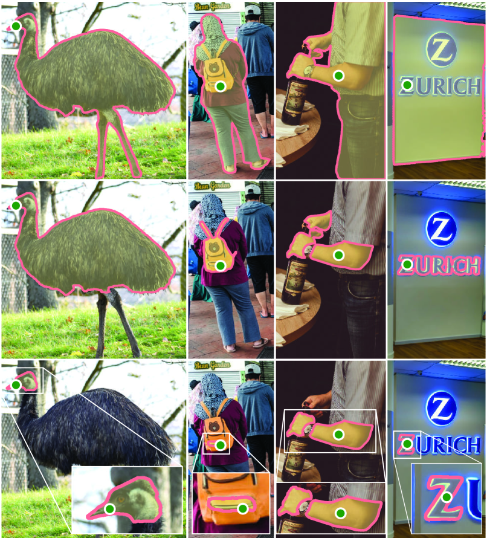
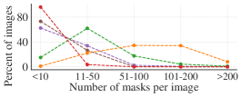

# Segment Anything（SAM）

> 原典: [[translations/segment-anything]] ・ `raw/papers/Segment Anything.md`
> 著者: Kirillov, Mintun, Ravi, Mao, Rolland, Gustafson, Xiao, Whitehead, Berg, Lo, Dollár, Girshick（Meta AI Research, FAIR）
> 発表: arXiv:2304.02643 / ICCV 2023
> プロジェクト: <https://segment-anything.com>

## 一言まとめ

**「セグメンテーションのための基盤モデル（[[concepts/foundation-model]]）」を初めて本格的に構築した論文**。promptable segmentation（プロンプト可能セグメンテーション, [[concepts/promptable-segmentation]]）という新タスクを定義し、これを学習目的にすることで、ファインチューニングなしに任意のセグメンテーション問題へゼロショット転移（[[concepts/zero-shot-transfer]]）できる単一モデル **SAM** を実現した。同時に、モデル自体をアノテーションループに組み込んだ「**データエンジン**」で 11M 画像 × **1.1B マスク**のデータセット **SA-1B**（[[entities/sa-1b]]）を構築し、これは既存最大の Open Images の 400 倍のマスク数を持つ。

## 背景と問題意識

### CV における foundation model の遅れ

NLP では GPT/PaLM などの基盤モデルが「**プロンプティング**」でゼロショット応答する世界が確立されていた。CV でも CLIP（[[entities/clip]] / [[sources/clip]]）が「画像-テキスト対 + 対比学習（[[concepts/contrastive-learning]]）」で似たことをやったが、これは **画像分類** が主な応用範囲だった。

セグメンテーション（pixel ごとにラベルを付ける）のような **密予測タスク** に対応する foundation model はなかった。理由：

1. **マスクは Web に大量に存在しない**: CLIP は alt text 付き画像を 4 億枚集めれば済んだが、セグメンテーション正解マスクは人手アノテーションが必要。
2. **タスクが断片化**: instance / semantic / panoptic / interactive / edge / proposal など、セグメンテーションの定義自体が複数あり、それぞれ別モデルが標準。
3. **ゼロショットの定義が曖昧**: 「未知のカテゴリ」を分類するのと、「未知の画像分布で任意のマスクを返す」のは違う。

SAM はこれら 3 つに正面から答えた。

### 3 つの問いに分解

論文 §1 はあえて 3 問に分解する：

1. **どんなタスクならゼロショット汎化を可能にするか？** → promptable segmentation
2. **対応するモデルアーキテクチャは？** → 画像エンコーダ + プロンプトエンコーダ + 軽量マスクデコーダ
3. **このタスク・モデルを駆動できるデータは？** → データエンジンによる 11M × 1.1B マスク（SA-1B）

3 つは絡み合っており、3 点セット（task + model + data）で同時に解く必要がある。これが論文の最大の構造的特徴。

## 提案手法

### 1. Promptable segmentation タスク

**「任意のプロンプトが与えられたとき、妥当な（valid）セグメンテーションマスクを返す」**。プロンプトは：

- **点**（前景／背景）
- **ボックス**
- **粗いマスク**
- **自由形式テキスト**（"a wheel", "beaver tooth grille" など）

プロンプトが曖昧（例: シャツ上の 1 点はシャツも人物も指し得る）でも、「少なくとも 1 つの合理的なマスク」を返せばよい。これが NLP の「曖昧プロンプトに対しても整合した応答を返す」LM の挙動と並列する設計判断。

> **補足: なぜ "promptable" が革命的か** — セグメンテーションを **「タスク独立な API」** にした。インスタンスセグメンテーション、エッジ検出、object proposal、テキスト → マスクなどはすべて「SAM をどうプロンプトするか」というプロンプトエンジニアリング（[[concepts/zero-shot-transfer]]）の問題に還元される。詳細は [[concepts/promptable-segmentation]]。

### 2. SAM アーキテクチャ

3 コンポーネント設計（図 4）。**画像 1 枚あたり 1 回だけ画像エンコーダが走り**、プロンプトエンコーダ + マスクデコーダは Web ブラウザ・CPU 上で **約 50ms** で動く。

<figure>

<figcaption>図4（再掲）: SAM の全体構成。(1) 重い画像エンコーダが画像埋め込みを 1 回だけ計算する。(2) プロンプトエンコーダが点・ボックス・マスク・テキストを 256 次元埋め込みに変換する。(3) 軽量マスクデコーダが画像埋め込みとプロンプト埋め込みから、複数の妥当マスクと信頼度（推定 IoU）を約 50ms で出力する。</figcaption>
</figure>

| コンポーネント | 構成 | 動機 |
|---|---|---|
| **画像エンコーダ** | **MAE 事前学習済み ViT-H/16**（[[entities/mae]] / [[concepts/vision-transformer]]）、14×14 windowed attention + 4 ブロックのみ global attention、1024×1024 入力 → 64×64×256 埋め込み | スケーラビリティ + 強力な SSL 事前学習を利用。1 回だけ計算するので重くてよい |
| **プロンプトエンコーダ** | 疎: 点・ボックスは位置エンコーディング + 学習埋め込み、テキストは **CLIP テキストエンコーダ**（[[entities/clip]]）。密: マスクは畳み込みで埋め込み、画像埋め込みに加算 | 多様なプロンプト型を統一表現に |
| **マスクデコーダ** | 修正 Transformer デコーダ × 2 層。出力トークンを使い動的線形分類器でマスク予測 | 軽量（画像エンコーダの 1% 未満）で実時間性を確保 |

### 3. 曖昧性への対応（ambiguity-aware）

**1 つのプロンプトに対して 3 つのマスクを同時予測**（whole, part, subpart の入れ子）。訓練時は損失が最小のマスクからのみ逆伝播。各マスクに **推定 IoU**（信頼度）を予測する小ヘッドを併設。これにより図 3 のような「シャツ vs. 人物」の曖昧性を自然に扱える。

<figure>

<figcaption>図3（再掲）: 単一の点プロンプト（緑円）から SAM が生成した 3 つの妥当マスク。SAM はあえて「whole / part / subpart」の入れ子構造を表現するため、3 つの出力トークンを並列に予測する。</figcaption>
</figure>

### 4. データエンジン（最大の発明）

セグメンテーションの正解マスクは Web に存在しないので、**「SAM を訓練する → SAM がアノテーションを助ける → 新データで SAM を再訓練」のループ**を 3 段階で回す。これは CLIP の「Web から 4 億対を集める」とも MAE の「ImageNet で自己教師あり」とも異なる、**第 3 のデータ収集パラダイム**。

| 段階 | 方式 | 収集 | アノテーション速度 |
|---|---|---|---|
| **1. assisted-manual** | アノテーターが SAM 補助のブラウザツールで前景/背景点をクリック | 120k 画像 / 4.3M マスク | 34s → 14s/マスク（COCO の 6.5 倍速） |
| **2. semi-automatic** | SAM が自信あるマスクを事前充填、アノテーターが残りを追加 | +180k 画像 / +5.9M マスク（計 10.2M） | 34s/マスク（残りは難しい） |
| **3. fully automatic** | SAM に 32×32 点グリッドをプロンプト、IoU/安定性で NMS フィルタ | 11M 画像 / 1.1B マスク | ヒト不要 |

最終的に SA-1B（[[entities/sa-1b]]）には **完全自動マスクのみが含まれる**（99.1%）。アブレーションで「自動マスクのみで訓練 ≈ 全データで訓練」と確認されている（§7.6 図 13 左）。

> **補足: なぜ「教師ありデータをスケールできた」と SAM は言うか** — Discussion §8 で著者は「[8]（CRFM の foundation model 論文）は自己教師あり学習を強調するが、我々のデータエンジンはアノテーションをスケールできたため大部分が **教師あり** で機能する」と明示。これは DINOv2/v3 や MAE の純粋 SSL 路線と対照的。**SAM は WSL でも純粋 SSL でもなく、「モデル支援で人手アノテーションをスケール」する第 3 の道**を切り拓いた。

### 5. SA-1B データセット

- **11M 画像 × 1.1B マスク**（既存最大の Open Images の **400 倍** のマスク数）
- 画像 1 枚あたり平均 **約 100 マスク**
- 平均解像度 **3300×4950 px**（公開時は短辺 1500 にダウンサンプル）
- **顔・ナンバープレートはぼかし処理**
- 写真プロバイダからライセンス取得
- **94% のマスクが専門家修正版と 90% 超 IoU**（先行研究のアノテーター間整合性 85〜91% を上回る）

<figure>

<figcaption>図6（再掲）: SA-1B と他データセットの比較。凡例は画像数 / マスク数。SA-1B は Open Images 比で画像 11×、マスク 400×、画像あたりマスク数 36×。LVIS や ADE20K より画像コーナーのカバレッジが大きく、COCO や Open Images の中心バイアスを緩和。</figcaption>
</figure>

## 実験結果と知見

### ゼロショット転移（§7）

**訓練に使ったのは promptable segmentation タスクだけ**だが、SAM はプロンプトエンジニアリングを介して 5 つの異なる下流タスクをゼロショットで解く：

1. **単一点 → マスク**（§7.1, 図 9）: 23 個の多様なデータセット（医療、X 線、水中、エゴセントリック、絵画、ドローン等）で評価。**16/23 で RITM（強力な対話的セグメンタ）を mIoU で上回り**、最大 +47 IoU の差。人手評価では 7/7 のサブセットで RITM を有意に上回る（評価平均 7〜9 ＝「小さなエラーのみ」レベル）。
2. **エッジ検出**（§7.2, 表 3）: BSDS500 で ODS 0.768。HED (2015) と同等、Canny/Felz-Hutt 等の古典手法を圧倒。BSDS500 で訓練していないため、SOTA EDETR (2022, ODS 0.840) には劣るが、「BSDS のバイアスを学んでいないだけで、より多くの妥当エッジを返している」と分析。
3. **オブジェクト提案**（§7.3, 表 4）: LVIS v1 で AR@1000 = 59.3。LVIS 訓練済み ViTDet-H（63.0）に近く、**中/大オブジェクトと希少カテゴリでは ViTDet を上回る**。
4. **インスタンスセグメンテーション**（§7.4, 表 5）: ViTDet のボックス出力を SAM にプロンプト。COCO AP で 46.5（ViTDet 51.0）。AP では負けるが、**人手評価では SAM が ViTDet を上回る**（図 11）――ViTDet が COCO の特異なアノテーションバイアスを学んでいるが、SAM はそれを学べないため AP が下がるという解釈。
5. **テキスト → マスク**（§7.5, 図 12）: 訓練時に CLIP **画像** 埋め込みをプロンプトとして使い、推論時に CLIP **テキスト** 埋め込みに置き換える巧妙な設計（CLIP の画像-テキスト埋め込みアラインメントを利用）。"a wheel" や "beaver tooth grille" のような句でも動く。

> **補足: 「人手評価では勝つが AP では負ける」が示すこと** — これは [[concepts/zero-shot-transfer]] でも論じる **dataset-specific bias** の典型例。COCO は「マスクに穴を含めない」「modal アノテーション」など多くの特異性を持ち、ViTDet はこれらを学習する。SAM はそれらを学習しないので AP が下がるが、視覚的にはより自然な境界を生成する。

### スケーリングと頑健性

- **画像エンコーダのスケール**: ViT-B → ViT-L → ViT-H で改善するが、ViT-L → ViT-H は限界的（図 13 右）。「現時点ではこれ以上の画像エンコーダスケーリングは実りある様子ではない」と明言。
- **データ量**: 全 11M の **10% (1M 画像)** でほぼ同等の性能。0.1M では大きく低下（図 13 中央）。
- **地理的公平性**: SA-1B は COCO/Open Images よりヨーロッパ・アジア・中所得国の表現が高く、北米偏重を緩和（表 1）。SAM 自体は性別・年齢・肌色グループ間で性能が概ね均等（表 2）。ただし衣服セグメンテーションでは知覚される男性 vs. 女性で互いに素な信頼区間（§C 表 6）。

## なぜ重要か（CV 史上の位置づけ）

CLIP・DINOv2・SAM は **CV foundation model の 3 大系統** を作った：

| 系統 | 代表 | データ収集 | 学習目的 | 強み |
|---|---|---|---|---|
| **画像-テキスト WSL** | [[entities/clip]] | Web から 4 億対を crawl | 対比学習（[[concepts/contrastive-learning]]） | ゼロショット分類、VLM |
| **純粋 SSL** | [[entities/dinov2]] / [[entities/dinov3]] / [[entities/mae]] / [[entities/ibot]] | ラベルなしキュレーション | 自己蒸留 + MIM | 密予測、細粒度、凍結特徴量 |
| **モデル支援アノテーション** | **SAM** | **データエンジンで自己生成** | **promptable segmentation（教師あり）** | **セグメンテーション特化、プロンプト可能** |

SAM は「**foundation model における自己教師あり vs. 教師ありの議論**」に第 3 の立場（"データを生成できれば教師ありで十分"）を持ち込み、Discussion §8 で CRFM の前提（"foundation model = SSL"）を明示的に修正している。

実用的影響：

- **SAM 2**（2024）が動画拡張版として登場（[[entities/perception-encoder]] 等の文脈でも参照）
- **Grounded-SAM, FastSAM, MobileSAM, HQ-SAM** など派生・改良が急速に展開
- **医療画像** （MedSAM）、衛星画像、エゴセントリック等、ドメイン適応が活発
- **3D 復元**: VGGT 系統が DINOv3 と組み合わせる構成と並んで、SAM プロンプト + 3D 復元（MCC, Probe3D 等）の流れが定着

## 限界・批判的視点（§8 + 著者発言）

1. **微細構造を見逃す / 小さな切断成分の幻覚**: 「ズームイン」する手法（FocalClick 等）には敵わない
2. **多数点プロンプトでは専用手法に劣る**: SAM は 1〜数点での汎用性を優先しており、高 IoU 対話的セグメンテーションでは SimpleClick 等が勝つ
3. **重い画像エンコーダで全体性能は非実時間**: プロンプト処理だけが 50ms。画像エンコーダは GPU でも遅い → MobileSAM などの蒸留版が後に登場
4. **テキスト → マスクは proof-of-concept**: 完全には頑健ではないと明示
5. **セマンティック/パノプティックセグメンテーションのプロンプト設計が不明**: 「これらをどうプロンプトで表現するかは未解決」
6. **特定ドメインでは専門ツールが勝つ**: 医療画像の ilastik 等
7. **データセットの非マスクメタデータ非公開**: キャプションは画像プロバイダ要件で非公開（地理分析にのみ内部利用）
8. **modal vs. amodal の選択は不可能**: ゼロショットなので、データセット固有の規約（LVIS の穴なしポリゴンなど）を学習できない

## 用語と略称

- **SAM** = Segment Anything Model（[[entities/sam]]）
- **SA-1B** = Segment Anything 1 Billion dataset（[[entities/sa-1b]]）
- **promptable segmentation** = プロンプト可能セグメンテーション（[[concepts/promptable-segmentation]]）
- **data engine** = データエンジン（モデル自身でアノテーションを生成・改善するループ）
- **ViT-H/16** = Vision Transformer Huge、パッチサイズ 16（[[concepts/vision-transformer]]）
- **MAE** = Masked Autoencoder（[[entities/mae]]、SAM の画像エンコーダ初期化に使用）
- **CLIP** = Contrastive Language-Image Pre-training（[[entities/clip]]、SAM のテキストプロンプトに使用）
- **RITM** = Reviving Iterative Training with Mask guidance（SAM の主要対話的セグメンテーションベースライン）
- **ViTDet** = Vision Transformer Detector（SAM のインスタンスセグメンテーションでボックス供給元）
- **LVIS** = Large Vocabulary Instance Segmentation（1203 クラス検証データセット）
- **COCO** = Common Objects in Context（80 クラス検出/セグメンテーションのデファクト）
- **NMS** = Non-Maximum Suppression（重複マスク抑制）
- **IoU** = Intersection over Union（マスク評価指標）
- **mIoU** = mean IoU
- **AP / AR / ODS / OIS / R50** = 各タスクの標準指標
- **focal loss / dice loss** = SAM のマスク予測損失（20:1 で結合）
- **MIAP** = More Inclusive Annotations for People（公平性評価用データセット）
- **RAI** = Responsible AI
- **stuff / things** = 不可算オブジェクト（空、草など）/ 可算オブジェクト（人、車など）の区別
- **modal / amodal mask** = 可視部分のみ / 遮蔽部含む（人間の認知）マスク

## 関連ページ

- [[translations/segment-anything]] — 全文和訳（Abstract + §1-8 + Appendix A-G）
- [[concepts/promptable-segmentation]] — SAM が定義した新タスクパラダイムの詳細
- [[entities/sam]] — SAM モデルファミリーのスペックシート
- [[entities/sa-1b]] — SA-1B データセットの詳細
- [[concepts/foundation-model]] — SAM がもたらした「教師あり foundation model」という第 3 の道
- [[concepts/zero-shot-transfer]] — SAM がセグメンテーションで実証したゼロショット転移
- [[entities/mae]] — SAM の画像エンコーダ事前学習に使われている
- [[entities/clip]] — SAM のテキストプロンプトに使われている（§7.5 / §D.5）
- [[concepts/vision-transformer]] — SAM の画像エンコーダは ViT-H/16
- [[concepts/contrastive-learning]] — CLIP との対比で SAM の学習目的を理解
- [[overview]] — CV 全体俯瞰における SAM の位置づけ
