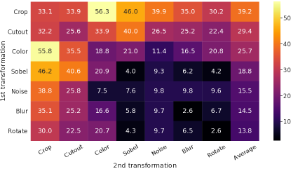
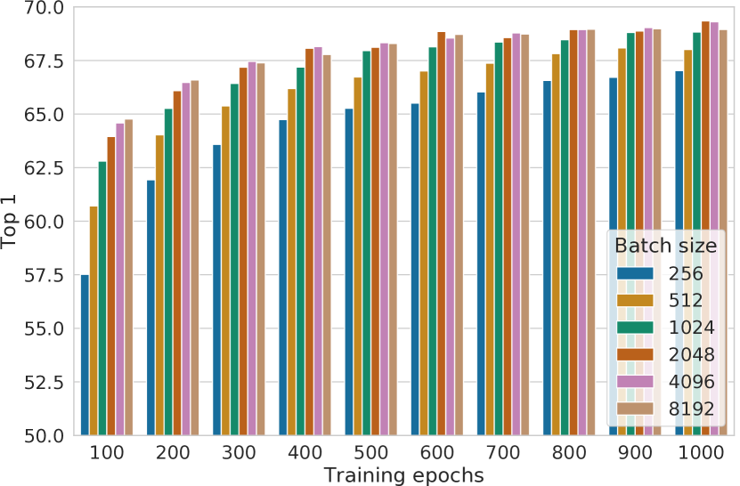
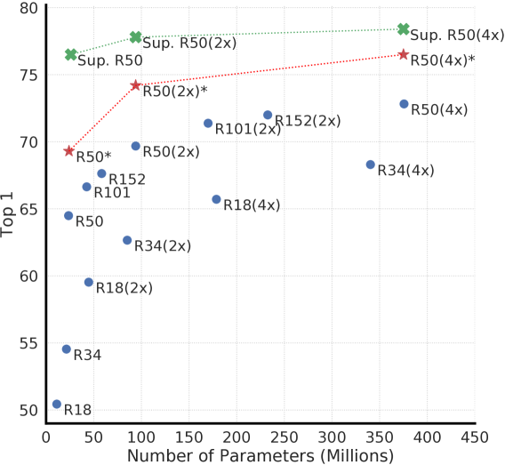

# A Simple Framework for Contrastive Learning of Visual Representations（SimCLR）

> 原典: [[translations/simclr]] ・ `raw/papers/A Simple Framework for Contrastive Learning of Visual Representations.md`
> 著者・年・会議: Ting Chen, Simon Kornblith, Mohammad Norouzi, Geoffrey Hinton / 2020 / ICML 2020

---

## 一言まとめ

「4 つのシンプルな要素（強いデータ拡張 + エンコーダ + 非線形射影ヘッド + NT-Xent 損失）を正しく組み合わせれば、特殊なアーキテクチャやメモリバンクなしで対比的表現学習を大幅に改善できる」という発見。**2020 年の CV 自己教師あり学習の標準的ベースライン**を確立した論文であり、DINO / MoCo v3 / iBOT / SigLIP に至る系統の実験的基盤となっている。

---

## 背景と問題意識

2020 年以前の対比的自己教師あり学習は、高性能を得るために以下のいずれかを必要としていた：

- **特殊なアーキテクチャ**: CPC（コンテキスト集約ネットワーク）、AMDIM（カスタム受容野制限 ResNet）
- **メモリバンク**: MoCo、InstDisc（大量の負例を保持するキューが必要）
- **複雑な pretext タスク**: ジグソーパズル、回転予測、着色など

「どの要素が本当に効いているのか」が不明のまま、複数の複雑な工夫が積み重なっていた。SimCLR はこれを分解し、「何が重要か」を体系的なアブレーションで明らかにした。

> **既存知識との接続**: [[concepts/contrastive-learning]] に示す通り、対比学習の原点は 2006 年の Hadsell ら「Dimensionality Reduction by Learning an Invariant Mapping」まで遡れる。SimCLR はその系統を、バッチ内負例サンプリングという最もシンプルな形で大規模化した。

---

## フレームワークの 4 コンポーネント

SimCLR の構造は極めてシンプル：

```
元画像 x
  ├── 拡張 t  ~ T → x_i（拡張ビュー i）
  └── 拡張 t' ~ T → x_j（拡張ビュー j）
         ↓              ↓
      f(·) エンコーダ（ResNet）
      h_i             h_j     ← ここが「表現」（下流タスクに使う）
         ↓              ↓
      g(·) 射影ヘッド（非線形 MLP）
      z_i             z_j     ← ここで対比損失を計算（訓練後は捨てる）
         ↓              ↓
      NT-Xent 損失で z_i と z_j を引き寄せる
      バッチ内の他の 2(N-1) 例を負例とする
```

### コンポーネント 1: データ拡張モジュール

同じ画像 $x$ に 2 つの異なるランダム変換を適用して「正例ペア」を生成する。使用する拡張：

1. **ランダムクロップ＋リサイズ**（Inception スタイル, 面積比 0.08〜1.0, アスペクト比 3/4〜4/3）
2. **ランダムカラー歪み**（輝度・コントラスト・彩度・色相をランダム変動, 確率 0.8）＋**グレースケール化**（確率 0.2）
3. **ガウシアンブラー**（確率 0.5, $\sigma \in [0.1, 2.0]$）

> **補足: なぜカラー歪みが決定的に重要か** — ランダムクロップだけでは「同じ画像の 2 つのパッチはほぼ同じカラーヒストグラムを持つ」という特徴をショートカットとして利用できてしまう。カラー歪みを加えると、モデルは「色に頼らず意味的な一致」を見つけなければならなくなる。これが汎化可能な特徴の鍵。

### コンポーネント 2: 基盤エンコーダ f(·)

ResNet（実験では ResNet-50 が主役）の平均プーリング後の出力 $\bm{h}_i \in \mathbb{R}^d$。アーキテクチャの選択は原理上自由。

> **補足: なぜ h を使うのか（z ではなく）** — 直感に反するが、**対比損失は z = g(h) で計算するが、下流タスクには h を使う**。理由: z は変換不変になるよう圧縮されるため、色・向きなど下流に有用な情報が失われる。g がそのバッファ役を担い、h に豊かな情報を維持させる。

### コンポーネント 3: 射影ヘッド g(·)

```
h (2048次元) → W1 → ReLU → W2 → z (128次元)
```

1 つの隠れ層を持つ MLP（非線形）。訓練完了後は **捨てる**。

**3 種類の比較（線形評価 top-1）**:

| ヘッドの種類 | top-1 | 差 |
|---|---|---|
| なし（恒等写像） | ~57% | - |
| 線形 | ~60% | +3% |
| **非線形 MLP（SimCLR のデフォルト）** | **~63-64%** | **+10%以上** |

なし → 非線形の差は 10% 以上。**この 1 つの設計変更が最も大きな単独効果を持つ**。

### コンポーネント 4: NT-Xent 損失（対比損失）

$$\ell_{i,j} = -\log \frac{\exp(\text{sim}(\bm{z}_i, \bm{z}_j)/\tau)}{\sum_{k=1}^{2N} \mathbbm{1}_{[k\neq i]} \exp(\text{sim}(\bm{z}_i, \bm{z}_k)/\tau)}$$

- $\text{sim}(\cdot, \cdot)$: コサイン類似度（$\ell_2$ 正規化後の内積）
- $\tau$: 温度パラメータ（デフォルト 0.1 付近が最適）
- 分母: バッチ内の全他サンプル（正例ペアの相方の拡張も含む）を負例とする
- **NT-Xent = Normalized Temperature-scaled Cross Entropy**（正規化温度スケールクロスエントロピー損失）

> **補足: NT-Xent は InfoNCE の実装** — InfoNCE 損失（van den Oord ら 2018）と本質的に同じ式。CLIP の softmax 損失もこれと同系統。SimCLR が命名した NT-Xent という呼称が広く使われるようになった。

**損失の比較（top-1）**:

| Margin | NT-Logistic | Margin (semi-hard) | NT-Logistic (semi-hard) | **NT-Xent** |
|---|---|---|---|---|
| 50.9 | 51.6 | 57.5 | 57.9 | **63.9** |

$\ell_2$ 正規化と温度の両方が必要。内積のみ（正規化なし）では大幅低下。

---

## 主要な発見（アブレーション結果）

<figure>



<figcaption>図5（再掲）: データ拡張の個別・組み合わせ適用での線形評価 top-1 精度。行と列それぞれの単一拡張、対角外は 2 拡張の組み合わせ。最も重要な発見: **ランダムクロップ × カラー歪み** の組み合わせが最強。</figcaption>
</figure>

### 発見 1: 拡張の組み合わせが必須

- **単一拡張では不十分**（たとえ対比タスク正解率が高くても表現品質が低い）
- **「ランダムクロップ × カラー歪み」が飛び抜けて重要**
- 対比学習は教師あり学習より **強い拡張を必要とする**（表 1: AutoAugment より強いカラー歪みが有効、教師あり学習には逆効果）

### 発見 2: 非線形射影ヘッドが劇的に改善

h（射影前）vs z = g(h)（射影後）の情報保持実験（表 3）:

- h は変換の種類（カラー/回転/ノイズなど）を高精度で予測できる
- z は変換不変になり、回転情報（67.6% → **25.6%**, ランダム推測レベル）が消失
- **対比損失で「不要な変換情報を捨てる」ために g が存在し、h には全情報が保持される**

### 発見 3: 大バッチ・長期訓練が効く

<figure>



<figcaption>図9（再掲）: バッチサイズと訓練エポック数による性能変化。100 エポックでは大バッチが圧倒的に有利；訓練を伸ばすとギャップが縮まる。</figcaption>
</figure>

- 少エポック時: 大バッチが有利（負例の多様性が多い）
- 長期訓練: ギャップが縮小（十分なステップで同等）
- **教師あり学習と違い、対比学習は長く訓練し続けるほど改善する**

### 発見 4: 大きなモデルほど SSL の恩恵が大きい

<figure>



<figcaption>図7（再掲）: 深さ・幅を変えた場合の線形評価。モデルを大きくすると、SSL と教師ありの性能ギャップが縮まる。SSL は大モデルで特に有利。</figcaption>
</figure>

- 教師あり学習でもスケールで性能向上するが、**SSL はスケールでより多くの恩恵を受ける**
- ResNet-50 (4×) の SSL 表現で、教師あり ResNet-50 の性能に匹敵

---

## 実験結果と知見

### ImageNet 線形評価（最重要比較）

| 手法 | アーキテクチャ | Top-1 |
|---|---|---|
| MoCo | ResNet-50 | 60.6 |
| PIRL | ResNet-50 | 63.6 |
| CPC v2 | ResNet-50 | 63.8 |
| **SimCLR** | **ResNet-50** | **69.3** |
| CPC v2 | ResNet-161 (*) | 71.5 |
| **SimCLR** | **ResNet-50 (2×)** | **74.2** |
| **SimCLR** | **ResNet-50 (4×)** | **76.5** |
| 教師あり ResNet-50 | ResNet-50 | ~76.5 |

**ResNet-50 (4×) の 76.5% = 教師あり ResNet-50 の性能に一致**。これが当時の SSL の重要なマイルストーン。

### 半教師あり学習（1% / 10% ラベル）

| 手法 | 1% Top-5 | 10% Top-5 |
|---|---|---|
| PIRL | 57.2 | 83.8 |
| CPC v2 | 77.9 | 91.2 |
| SimCLR (ResNet-50) | 75.5 | 87.8 |
| **SimCLR (4×)** | **85.8** | **92.6** |

100 倍少ないラベルで AlexNet（当時の完全教師あり）を上回る。

### 転移学習（12 データセット）

ResNet-50 (4×) を 12 の自然画像分類データセットでテスト：
- ファインチューニング時: 5 つで教師あり baseline を大幅に上回り、2 つで劣るのみ
- 線形評価時: 教師ありとほぼ同等

---

## 限界・批判的視点

1. **大バッチ依存**: デフォルト 4096（ベスト結果 8192）。大量のメモリ・TPU コアが必要。MoCo はメモリバンクで解決したが SimCLR は正面から大バッチで解決（コスト高）。
2. **ViT 時代への対応**: SimCLR は ResNet が主役。ViT + 対比学習（MoCo v3 など）は別途検討が必要。
3. **Dense 予測への弱さ**: グローバル表現（平均プーリング後）に特化しており、セグメンテーション・深度推定など dense タスクには不向き。この弱点は iBOT / DINOv2 が MIM 損失の追加で解決した（[[concepts/masked-image-modeling]]）。
4. **パッチレベル情報が弱い**: ViT 時代の dense 評価（ADE20k など）では MIM 系手法に大きく劣る。
5. **温度・バッチサイズへの敏感性**: ハイパーパラメータ調整が難しい。

---

## SimCLR v2（後継）との比較

SimCLR の続編（Chen et al., 2020b）では：
- より深い射影ヘッド（2 層 → 3 層）
- 半教師あり学習における**知識蒸留**の活用
- ResNet に限らずより大きなモデルでの評価

本 wiki では SimCLR v1（原論文）に焦点を当てる。

---

## 用語と略称

- **SimCLR**: A Simple Framework for Contrastive Learning of Visual Representations
- **NT-Xent**: Normalized Temperature-scaled Cross Entropy（正規化温度スケールクロスエントロピー損失）、InfoNCE とも呼ばれる
- **projection head（射影ヘッド）**: エンコーダ出力 h を対比損失の空間 z にマッピングする MLP。訓練後は捨てる
- **InfoNCE**: Information Noise-Contrastive Estimation loss（van den Oord et al. 2018）。NT-Xent の理論的基盤
- **LARS**: Layer-wise Adaptive Rate Scaling optimizer。大バッチ学習を安定化させるオプティマイザ
- **Global BN**: Global Batch Normalization。分散訓練でデバイス間の BN 統計を共有し、情報リークを防ぐ
- **linear evaluation（線形評価プロトコル）**: 凍結した表現の上に線形分類器だけ訓練して性能評価する標準プロトコル。下流ファインチューニングより表現品質に敏感
- **CPC**: Contrastive Predictive Coding（van den Oord et al. 2018）。CPC v2（Hénaff et al. 2019）は SimCLR の主要比較対象
- **MoCo**: Momentum Contrast（He et al. 2019）。momentum encoder + memory bank で大規模化した先行手法
- **PIRL**: Pretext-Invariant Representations Learning（Misra & van der Maaten 2019）。pretext タスク不変表現学習
- **AMDIM**: Augmented Multiscale DIM（Bachman et al. 2019）。特殊アーキテクチャを使う先行手法

---

## 関連ページ

- [[concepts/contrastive-learning]]: SimCLR が代表する対比学習パラダイムの全体像
- [[concepts/self-supervised-learning]]: SimCLR が属する SSL の系譜と崩壊回避の文脈
- [[concepts/knowledge-distillation]]: SimCLR v2 で活用。本論文（v1）ではなく後続の展開
- [[sources/dino-emerging-properties-in-self-supervised-vit]]: SimCLR と同系統から発展した自己蒸留 SSL
- [[sources/ibot]]: SimCLR の後継路線（MIM との統合）
- [[sources/siglip]]: SimCLR の対比学習を WSL に応用した SigLIP の系譜
- [[sources/siglip-2]]: 対比学習を超えた統合レシピ（SigLIP 2）
- [[entities/simclr]]: SimCLR のエンティティページ
