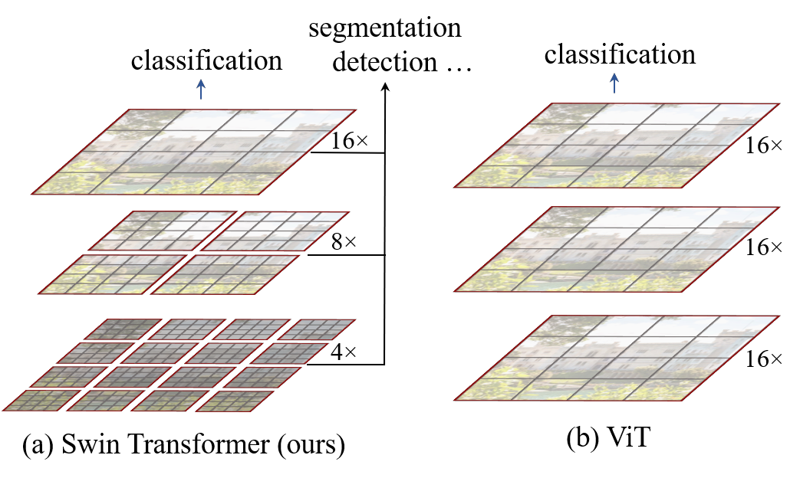
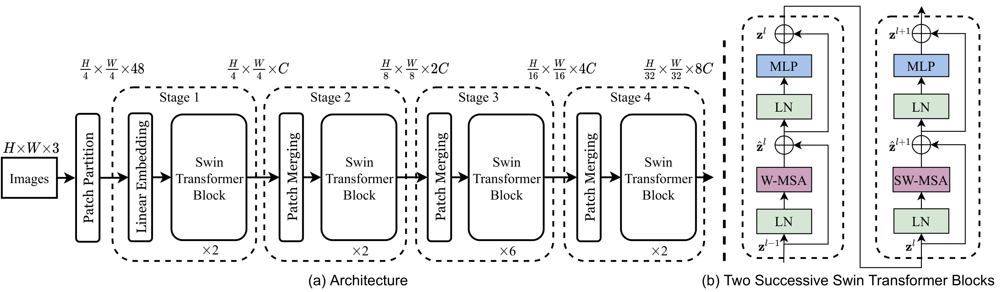
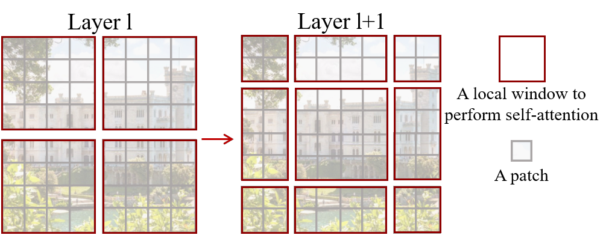
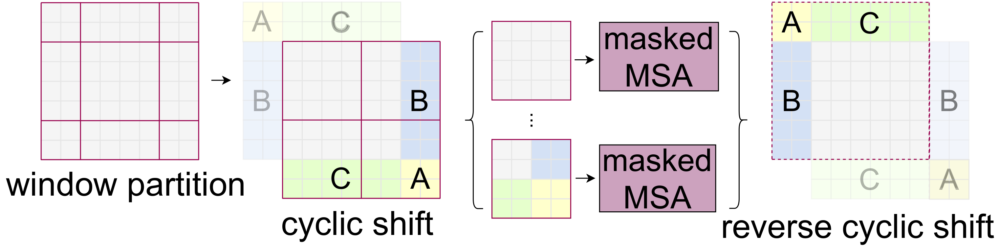

# Swin Transformer: シフトウィンドウを用いた階層型 Vision Transformer

> 原典: [[translations/swin-transformer]] ・ `raw/papers/Swin Transformer_ Hierarchical Vision Transformer using Shifted Windows.md`
> 著者: Ze Liu, Yutong Lin, Yue Cao, Han Hu, Yixuan Wei, Zheng Zhang, Stephen Lin, Baining Guo（Microsoft Research Asia）
> 出典: arXiv:2103.14030（2021 年 3 月）→ **ICCV 2021 最優秀論文賞（Marr Prize）**
> コード: <https://github.com/microsoft/Swin-Transformer>

> 翻訳メモ: 対応する [[translations/swin-transformer]] は CLAUDE.md §4 の標準ルールと異なり **Appendix A1〜A3 も翻訳済み**（ユーザーからの個別指示による）。原典 markdown には図 1・2 のみ画像があったため、図 3・4 は arXiv の e-print ソースから生成した。

---

## 一言まとめ

**「局所窓の中だけで self-attention し、次の層で窓を半分ずらす」というだけで、ViT を汎用視覚バックボーンに変えた論文**。窓内 attention により計算量が画像サイズに対して**二次から線形**になり、パッチ統合による**階層構造**で FPN や U-Net といった既存の密予測パイプラインにそのまま差し込めるようになった。COCO 58.7 box AP / ADE20K 53.5 mIoU で当時の SOTA を大差で更新し、**「Transformer は分類しかできない」という状況を終わらせた**。ICCV 2021 最優秀論文賞。

**本 wiki にとっての意味**: これまで [[entities/glip]] / [[entities/grounding-dino]] / [[entities/dino-detector]] / [[entities/yolo-world]] / [[entities/hiera]] / [[sources/convnext]] など多数のページが「Swin-T/L backbone」「Swin と比較して」と言及しながら原典ページが存在しなかった。**その最大の穴がこのページで埋まる**。

---

## 背景と問題意識

### ViT が汎用バックボーンになれなかった 2 つの理由

[[sources/vision-transformer|ViT]]（2020）は画像分類で CNN を抜いたが、検出やセグメンテーションには使えなかった。著者らは原因を**言語と視覚のモダリティの違い**に求める。

1. **スケールの変動**: 言語の単語トークンは基本単位が一定だが、**視覚的実体は大きさが激しく変わる**（遠くの人と近くの人）。ViT はすべてのトークンが固定スケールで、この変動を扱えない。
2. **解像度の高さ**: セマンティックセグメンテーションのような密予測は画素レベルの出力を要求するが、**self-attention の計算量は画像サイズに対して二次**なので高解像度入力では破綻する。
   - **補足**: ViT-B/16 で 224² なら 196 トークンで済むが、検出で使う 1333×800 級の入力では数千トークンになり、その 2 乗のペア計算が必要になる。

> **核心の問い**: 「**Transformer を、CNN がそうであるように汎用の視覚バックボーンにするには何が足りないのか？**」

### 答えは「CNN が元から持っていた 2 つの性質を輸入する」

- **階層性**: 浅い層は高解像度・低チャネル、深い層は低解像度・高チャネル。VGG/ResNet と同じ解像度系列にすれば、**FPN や U-Net といった既存の密予測手法をそのまま流用できる**（[[concepts/convolutional-neural-network]] 参照）。
- **局所性**: attention を局所窓に閉じ込めれば計算量が線形になる。

この 2 つは、まさに ConvNet の帰納バイアスである。**この「輸入」が、翌年 [[sources/convnext|ConvNeXt]] に「ならば元から全部持っている ConvNet は何が足りなかったのか」という反問を書かせることになる**。

---

## 提案手法

<figure>

<figcaption>図1: (a) Swin Transformer は深い層で画像パッチ（灰色）を統合して階層的特徴マップを構築し、自己注意を各局所窓（赤）の内部でのみ計算するため入力画像サイズに対して線形の計算量を持つ。(b) 対照的に従来の ViT は単一の低解像度特徴マップしか生成せず、大域的な自己注意ゆえ二次の計算量を持つ。</figcaption>
</figure>

### 全体構造：4 段階の階層

<figure>

<figcaption>図3: (a) Swin-T のアーキテクチャ。Patch Partition → Linear Embedding → Stage 1-4（各段階の入口に Patch Merging）。解像度は H/4 → H/8 → H/16 → H/32、チャネルは C → 2C → 4C → 8C と CNN と同じ系列で変化する。(b) 2 つの連続する Swin Transformer ブロック。前半が W-MSA（通常窓）、後半が SW-MSA（シフト窓）で、いずれも LN → (S)W-MSA → 残差 → LN → MLP → 残差 の pre-norm 構成。</figcaption>
</figure>

- **パッチ分割**: 4×4 パッチ（ViT の 16×16 より細かい）。各パッチの初期特徴は生の RGB を連結した 4×4×3 = **48 次元**。
- **Patch Merging**: 隣接する 2×2 パッチの特徴を連結（4C 次元）して線形層で 2C に落とす。これで**解像度 1/2・チャネル 2 倍**という CNN 的なダウンサンプリングを実現。
- **[CLS] トークンを使わない**: 分類は最終段階の特徴マップに**大域平均プーリング**を掛ける。「ViT/DeiT のクラストークンと同程度に正確」と Appendix A2.1 で報告。

### 中核 1: 窓内 self-attention で計算量を線形化

$h\times w$ パッチの画像に対し、窓サイズ $M\times M$（既定 $M=7$）として:

$$\Omega(\text{MSA})=4hwC^{2}+2(hw)^{2}C \qquad \Omega(\text{W-MSA})=4hwC^{2}+2M^{2}hwC$$

**第 2 項に注目**。大域 MSA は $(hw)^2$ で二次、窓 MSA は $M$ が固定なので $hw$ に**線形**。これが高解像度入力を可能にする。

### 中核 2: シフトウィンドウ（本論文の名前の由来）

<figure>

<figcaption>図2: シフトウィンドウのアプローチ。層 l（左）は通常の窓分割で各窓内で自己注意を計算する。層 l+1（右）では窓分割を M/2 だけずらすため、新しい窓が前層の窓境界をまたぎ、窓どうしを結合する。</figcaption>
</figure>

窓に閉じ込めると**窓をまたぐ結合がなくなり**モデル化能力が落ちる。そこで**連続する 2 ブロックで窓の切り方を $(\lfloor M/2\rfloor, \lfloor M/2\rfloor)$ だけずらす**。

$$\hat{z}^{l}=\text{W-MSA}(\text{LN}(z^{l-1}))+z^{l-1}, \quad z^{l}=\text{MLP}(\text{LN}(\hat{z}^{l}))+\hat{z}^{l}$$
$$\hat{z}^{l+1}=\text{SW-MSA}(\text{LN}(z^{l}))+z^{l}, \quad z^{l+1}=\text{MLP}(\text{LN}(\hat{z}^{l+1}))+\hat{z}^{l+1}$$

**W-MSA と SW-MSA は必ずペアで使う**ため、各段階のブロック数が必ず偶数（{2,2,6,2} など）なのはこのためである。

> **なぜ sliding window ではなく shifted window なのか** — 「窓をずらす」より「1 画素ずつ窓を滑らせる（sliding window）」方が自然に思えるが、著者らはレイテンシで選んでいる。**shifted window では同じ窓内のすべての query が同じ key 集合を共有する**のでメモリアクセスが効率的。sliding window は query ごとに key 集合が違うため、一般的なハードウェアで極端に遅い。実測で **naive 実装比 4.1× / カーネル最適化実装比 1.5× 高速**（表5）でありながら、精度はほぼ同じ（表6、81.3 vs 81.4）。**「精度が同じなら速い方を採る」という工学的判断**。

### 中核 3: cyclic shift による効率的バッチ計算

<figure>

<figcaption>図4: 効率的なバッチ計算。窓分割 → 特徴マップを左上方向に cyclic shift → 隣接しない部分窓が同じバッチ窓に混在するのでマスク付き MSA を適用 → reverse cyclic shift で戻す。窓数が増えないため計算効率が保たれる。</figcaption>
</figure>

窓をずらすと窓の数が $\lceil h/M\rceil \times \lceil w/M\rceil$ から $(\lceil h/M\rceil+1)\times(\lceil w/M\rceil+1)$ に**増えて**しまい、端の窓は $M\times M$ より小さくなる。素朴にパディングすると $2\times2 \to 3\times3$ で **2.25 倍**の計算増。

そこで**特徴マップ自体を巡回シフトさせ、はみ出した部分を反対側に回り込ませる**。これで窓数は元のままだが、1 つの窓に空間的に隣接しない領域が混ざるので、**マスクで部分窓ごとに attention を閉じる**。実装は 13-18% 高速化（表5）。

### 中核 4: 相対位置バイアス

$$\text{Attention}(Q,K,V)=\text{SoftMax}(QK^{T}/\sqrt{d}+B)V$$

窓内の相対位置は $[-M+1, M-1]$ に収まるので、$(2M-1)\times(2M-1)$ の小さな表 $\hat{B}$ をパラメータ化して引く。**ViT の絶対位置埋め込みは使わない**（足すとむしろ悪化する）。

---

## 実験結果と知見

### ImageNet-1K 分類

| モデル | 入力 | params | FLOPs | top-1 | 比較 |
|---|---|---|---|---|---|
| Swin-T | 224² | 29M | 4.5G | **81.3** | DeiT-S 79.8（**+1.5**） |
| Swin-S | 224² | 50M | 8.7G | **83.0** | |
| Swin-B | 224² | 88M | 15.4G | **83.5** | DeiT-B 81.8（**+1.5**） |
| Swin-B | 384² | 88M | 47.0G | **84.5** | DeiT-B 83.1（+1.4） |
| Swin-B ‡ | 384² | 88M | 47.0G | **86.4** | ViT-B/16 ‡ 84.0（**+2.4**） |
| Swin-L ‡ | 384² | 197M | 103.9G | **87.3** | ViT-L/16 ‡ 85.2 |

（‡ = IN-22K 事前学習）。RegNet / EfficientNet に対しても速度-精度でわずかに優位。**ただし著者自身「RegNet/EfficientNet は徹底的なアーキテクチャ探索の産物だが Swin は標準 Transformer からの適応にすぎない」と、まだ伸びしろがあると主張している**。

### COCO 検出 — ここが本論文の主戦場

- **枠組みを問わず効く**（表2a）: Cascade Mask R-CNN / ATSS / RepPointsV2 / Sparse R-CNN の 4 つすべてで、ResNet-50 を Swin-T に差し替えるだけで **+3.4 〜 +4.2 box AP**。
- **同規模の ResNeXt を圧倒**（表2b）: Swin-B 51.9 box AP vs X101-64 48.3（**+3.6**）。
- **DeiT に対して精度も速度も勝つ**（表2b）: Swin-T 50.5 AP / 15.3 FPS vs DeiT-S 48.0 AP / 10.4 FPS。**DeiT が遅いのは二次計算量ゆえ**。
- **SOTA 更新**（表2c）: Swin-L (HTC++) + マルチスケールテストで **COCO test-dev 58.7 box AP / 51.1 mask AP**。従来最良を **+2.7 box AP**（Copy-paste）/ **+2.6 mask AP**（DetectoRS）で更新。

### ADE20K セグメンテーション

UperNet + Swin-L ‡ で **53.5 mIoU**、従来最良の SETR（50.3、しかもより大きなモデル）を **+3.2** 更新。Swin-S は同程度の計算量で DeiT-S を **+5.3 mIoU** 上回る（49.3 vs 44.0）。

### アブレーション（表4）— 2 つの設計の寄与

| 設定 | IN top-1 | COCO AP^box | ADE20K mIoU |
|---|---|---|---|
| シフトなし（窓固定） | 80.2 | 47.7 | 43.3 |
| **シフトウィンドウ** | **81.3**（+1.1） | **50.5**（+2.8） | **46.1**（+2.8） |
| 位置符号化なし | 80.1 | 49.2 | 43.8 |
| 絶対位置埋め込み | 80.5 | 49.0 | 43.2 |
| 絶対 + 相対 | 81.3 | 50.2 | 44.0 |
| **相対位置バイアス** | **81.3** | **50.5** | **46.1** |

**読みどころが 2 つある**。

1. **シフトの効果は分類（+1.1）より密予測（+2.8）で大きい**。窓をまたぐ結合は、位置が問われるタスクでこそ効く。
2. **絶対位置埋め込みは分類を +0.4 改善するが、検出 -0.2 AP / セグ -0.6 mIoU と害になる**。著者らはここから踏み込んだ主張をする:

> 最近の ViT / DeiT のモデルは、視覚的モデル化にとって長らく決定的であると示されてきたにもかかわらず画像分類において平行移動不変性を放棄しているが、我々は、**ある種の平行移動不変性を促す帰納バイアスが汎用的な視覚モデル化、特に密予測のタスクにとって依然として望ましい**ことを見出した。

これは [[concepts/vision-transformer]] の「ViT は帰納バイアスをほぼ持たない」という説明に対する、**当時最も明確な反論**である。

### Appendix 由来の知見

- **入力解像度を上げると素直に良くなる**（表8）: Swin-T が 224² 81.3 → 384² 82.2。ただしスループットは 755 → 220 と 1/3.4。
- **ResNe(X)t の比較はオプティマイザを揃えている**（表9）: Cascade Mask R-CNN の既定は SGD だが、**AdamW にすると ResNet-50 が 45.0 → 46.3 と上がる**。著者らは意図的に強い方（AdamW）をベースラインに採用しており、**比較の公正さに配慮している**。
- **Swin-Mixer: 設計思想は attention に依存しない**（表10）: 階層設計 + シフトウィンドウを MLP-Mixer に移植すると、**MLP-Mixer 76.4% → Swin-Mixer 81.3%**（計算量はより小さい 10.4G vs 12.7G）。しかも **shift を外すと 80.3 に落ちる**（-1.0）。**「シフトウィンドウは self-attention 固有の工夫ではなく、トークン混合一般に効く」**という一般化可能性の実証。

---

## 限界・批判的視点

- **速度の主張には留保が要る**。著者自身「ResNe(X)t は高度に最適化された cuDNN 関数で構築されているが、我々は必ずしも最適化されていない PyTorch 組み込み関数で実装している。徹底的なカーネル最適化は本論文の範囲を超える」と書いている。FPS 比較は実装成熟度の差を含む。
- **特殊モジュールの複雑さ**。cyclic shift + マスク + 相対位置バイアス + W/SW ペア制約（ブロック数が偶数でなければならない）と、実装は ViT よりかなり込み入る。この点は後に 2 方向から批判される:
  - **[[entities/hiera]]**（2023）: 「MAE で適切に事前学習すれば、shifted window も相対位置バイアスも**全部要らない**」
  - **[[sources/convnext|ConvNeXt]]**（2022）: 「そもそも ConvNet が元から持っていた性質を苦労して輸入しているだけ。**訓練レシピを揃えれば純粋 ConvNet が Swin を上回る**」（実際 ConvNeXt-T 82.1 > Swin-T 81.3、しかも A100 で最大 +49% 高速）
- **MIM との相性が悪い**。窓構造がマスクと干渉するため、Swin で MIM をやるには SimMIM のような専用手法が要る。これが [[entities/hiera]] を生む直接の動機になった（[[concepts/masked-image-modeling]] の「MIM とアーキテクチャの相性」表を参照）。
- **可変解像度に弱い**。相対位置バイアスは窓サイズに紐づくため、窓サイズを変えると bi-cubic 補間が必要（著者も §3.2 で言及）。後の可変解像度 MLLM が [[concepts/rotary-position-embeddings|RoPE]] へ移行した理由の一つ（[[questions/vit-dynamic-resolution-evolution]]）。
- **言語との接続は将来展望どまり**。著者らは結論で「視覚と言語の統一的モデル化」への期待を述べるが、本論文自体は純粋な認識タスクに閉じている。実際 CLIP / MLLM の視覚エンコーダは plain ViT が主流であり続けた。**Swin が真価を発揮したのは検出・セグメンテーションのバックボーンという領域**である（[[entities/glip]] / [[entities/grounding-dino]] が Swin-T/L を採用）。

---

## 用語と略称

- **Swin** = **S**hifted **win**dows の略。論文名の由来
- **W-MSA** = Window-based Multi-head Self-Attention（通常の窓分割）
- **SW-MSA** = Shifted Window-based MSA（半窓ずらした分割）。W-MSA と必ずペアで使う
- **patch merging（パッチ統合）** = 隣接 2×2 パッチを連結して線形層で次元を半分にする、Swin のダウンサンプリング機構
- **cyclic shift（巡回シフト）** = 特徴マップを左上へずらし、はみ出しを反対側に回り込ませる実装技法。窓数を増やさずにシフト窓を実現する
- **relative position bias（相対位置バイアス）** = attention ロジットに窓内の相対位置に応じたバイアスを加算。$(2M-1)^2$ の表を学習する
- **sliding window（スライディングウィンドウ）** = 1 画素ずつ窓を滑らせる方式。Swin が採らなかった対抗案（query ごとに key 集合が変わり遅い）
- **HTC++** = Hybrid Task Cascade の改良版。instaboost + 強いマルチスケール訓練 + 6x スケジュール + soft-NMS + 追加の大域自己注意層
- **UperNet** = Unified Perceptual Parsing Network。セマンティックセグメンテーションのデコーダヘッド
- **FPN** = Feature Pyramid Network。多スケール特徴を融合する検出用ネック
- **ATSS / RepPoints v2 / Sparse R-CNN** = アブレーションで使われた検出フレームワーク群
- **Performer** = 線形近似 attention の代表。速度比較の対象
- **Swin-Mixer** = 階層設計 + シフトウィンドウを MLP-Mixer に適用した派生（Appendix A3.3）
- **Marr Prize** = ICCV の最優秀論文賞。本論文が 2021 年に受賞

## 関連ページ

- [[entities/swin-transformer]] — Swin のスペック・バリアント・採用先の一覧
- [[concepts/vision-transformer]] — 出発点となる ViT。本論文はその「汎用バックボーン化」
- [[sources/convnext]] / [[entities/convnext]] — 「ConvNet の性質を輸入するくらいなら ConvNet を近代化せよ」という直接の反論（CVPR 2022）
- [[entities/hiera]] — 「MAE で事前学習すれば Swin の工夫は全部要らない」という簡素化の後続（ICML 2023）
- [[concepts/masked-image-modeling]] — 窓構造が MIM と干渉する問題。SimMIM / Hiera / ConvNeXt V2 の背景
- [[concepts/object-detection]] — 本論文が塗り替えた検出のバックボーン事情
- [[entities/glip]] / [[entities/grounding-dino]] / [[entities/grounding-dino-1-5]] / [[entities/dino-detector]] / [[entities/yolo-world]] — Swin-T/L をバックボーンに採用した後続研究群
- [[concepts/convolutional-neural-network]] — Swin が Transformer に輸入した「階層性」「局所性」の出どころ
