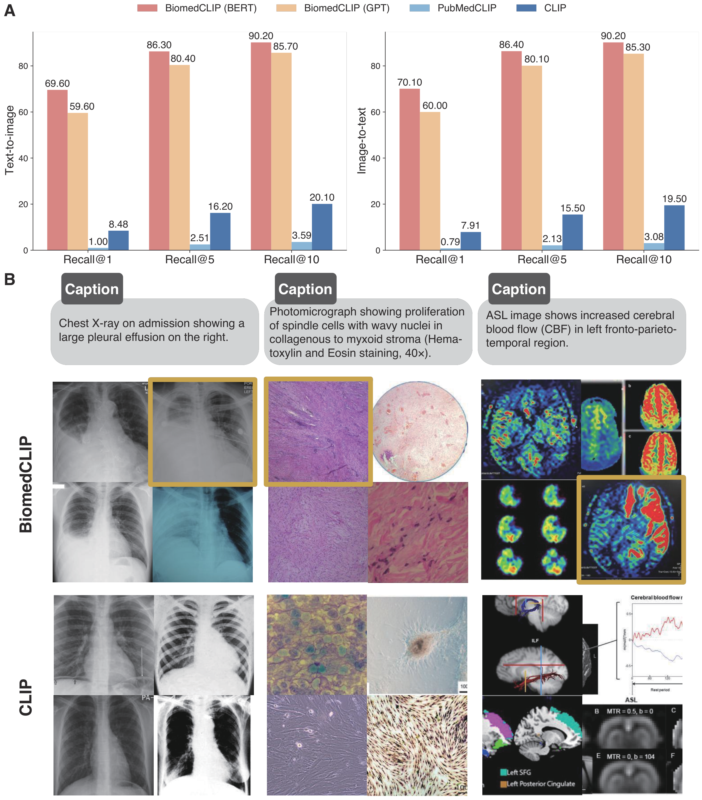
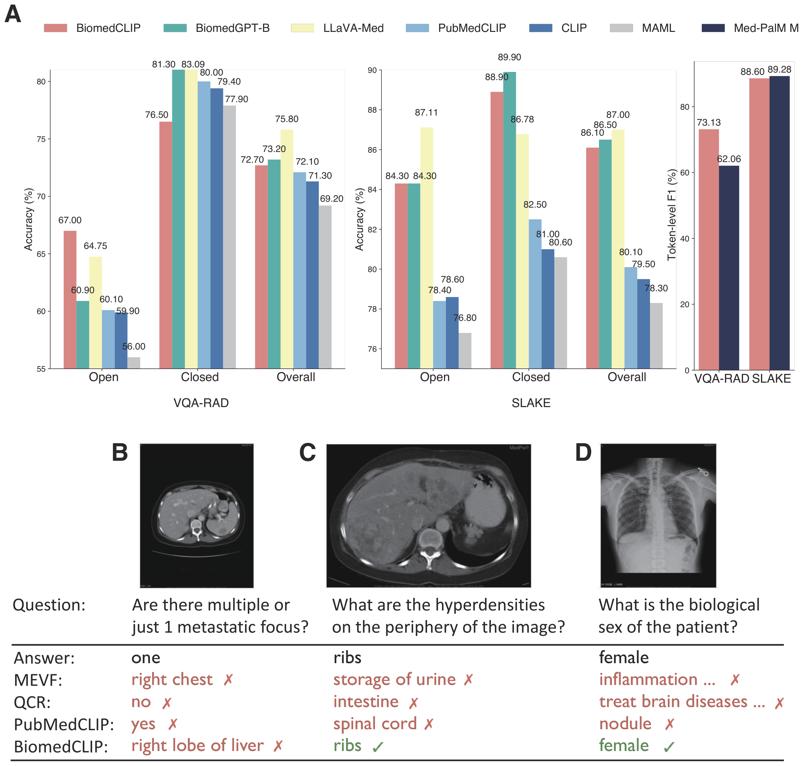
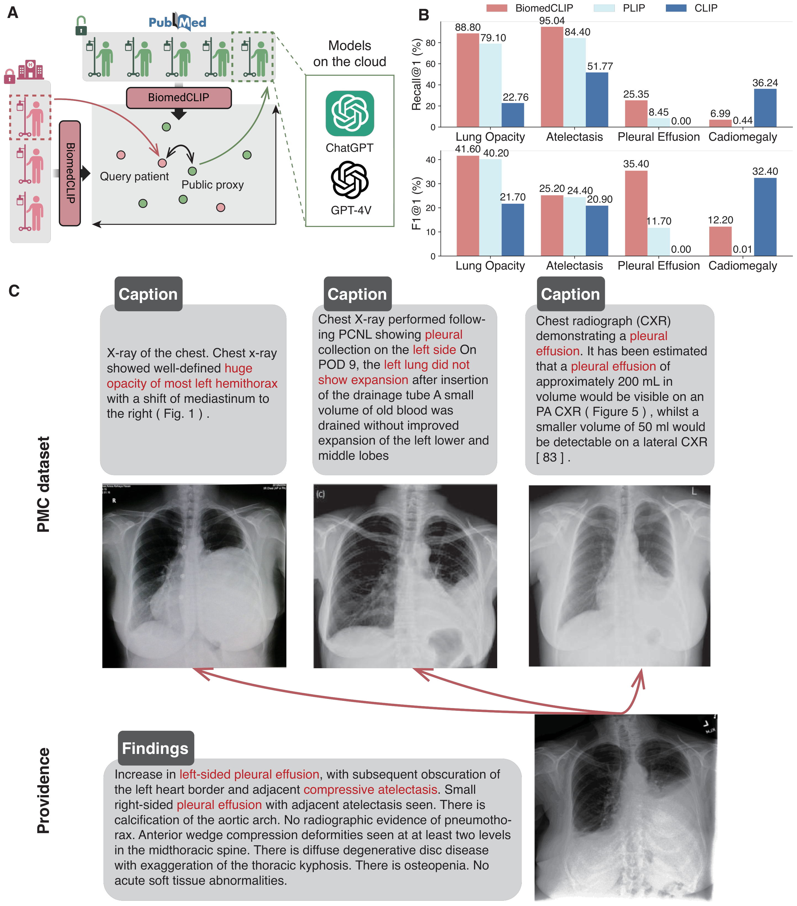

# BiomedCLIP: 1,500 万の科学論文の画像–テキスト対から事前学習されたマルチモーダル生物医学基盤モデル

> 原題: BiomedCLIP: a multimodal biomedical foundation model pretrained from fifteen million scientific image-text pairs
> 著者: Sheng Zhang*, Yanbo Xu*, Naoto Usuyama*, Hanwen Xu*, Jaspreet Bagga, Robert Tinn, Sam Preston, Rajesh Rao, Mu Wei, Naveen Valluri, Cliff Wong, Andrea Tupini, Yu Wang, Matt Mazzola, Swadheen Shukla, Lars Liden, Jianfeng Gao, Angela Crabtree, Brian Piening, Carlo Bifulco, Matthew P. Lungren, Tristan Naumann, Sheng Wang‡, Hoifung Poon‡
> 所属: Microsoft Research（Redmond）/ University of Washington Paul G. Allen School / Providence Genomics
> 出典: arXiv:2303.00915
> モデル: <https://aka.ms/biomedclip>

> 翻訳メモ: 本翻訳は CLAUDE.md §4 の標準ルールと異なり、**Supplementary Note（アーキテクチャの詳細とアブレーション研究）も翻訳対象に含めている**（ユーザーからの個別指示による）。References は除外。原典 markdown には画像が 4 枚しか埋め込まれておらず（**図3 が欠落**）、図はすべて arXiv e-print（arXiv:2303.00915）に同梱された PDF から生成した。HTML テーブルは markdown テーブルに変換している。

## Abstract（要旨）

生物医学のデータは本質的にマルチモーダルであり、物理的な測定値と自然言語による記述からなる。汎用の生物医学 AI モデルは、テキストと画像を含む異なるモダリティのデータを同時に処理する必要がある。したがって、効果的な汎用生物医学モデルを訓練するには、**並行する画像–テキスト対**のような高品質のマルチモーダルデータが必要である。ここで我々は、MIMIC-CXR のような既存の生物医学マルチモーダルデータセットより**2 桁大きい**新規のデータセット **PMC-15M** を提示する。PMC-15M は多様な生物医学の画像型にまたがり、**440 万件の科学論文から収集された 1,500 万の生物医学の画像–テキスト対**を含む。PMC-15M に基づき、我々は生物医学の視覚–言語処理に合わせた領域特有の適応を施したマルチモーダル基盤モデル **BiomedCLIP** を事前学習した。我々は検索から分類、視覚質問応答（VQA）に至る標準的な生物医学の画像タスクについて広範な実験とアブレーション研究を行った。BiomedCLIP は検索・画像分類・視覚質問応答を含む幅広い標準データセットで新たな最先端の結果を達成し、従来のアプローチを大幅に上回った。**興味深いことに、多様な生物医学の画像型に対する大規模事前学習により、BiomedCLIP は RSNA 肺炎検出のような放射線科特有のタスクにおいて、BioViL のような放射線科特化の最先端モデルさえ上回る。** さらに、PMC-15M を代理として用いることで BiomedCLIP が専有データのプライバシー保護的な解析をどのように促進しうるかを示した。要約すると、BiomedCLIP はさまざまな生物医学のタスクで最先端の性能を達成する**完全にオープンアクセスな**基盤モデルであり、変革的なマルチモーダルの生物医学的発見と応用への道を拓くものである。

## Introduction（はじめに）

生物医学のデータは本質的にマルチモーダルであり、物理的な測定値と自然言語による記述の両方からなる。しかしながら、手作業によるキュレーションは高価でスケールしにくいため、そのようなデータのうち解釈され構造化された形で利用可能なものはごく一部にすぎない。マルチモーダル学習は、**モダリティ間の対応から自己教師を活用する**ことでキュレーションのボトルネックを緩和しうる。またマルチモーダルの融合を通して、単独のモダリティでは潜在したままかもしれない予測的な信号を明らかにする助けにもなる。その結果、生物医学の画像（例: デジタル病理と放射線科の画像）と生物医学のテキスト（例: 科学論文と臨床記録）を集合的にモデル化する生物医学の視覚–言語基盤モデルが開発されてきた。

生物医学の視覚–言語基盤モデルには 2 つの主要な利点がある。第一に、自己教師あり学習を用いて大規模データで事前学習することにより、これらのモデルは**少量のファインチューニングデータしか利用できない低資源の設定**において、多様な下流応用にわたって優れた性能を発揮し、データ注釈に伴うコストを大幅に減らす。第二に、高品質の並行する画像–テキストデータで事前学習することにより、画像とテキストの双方の包括的な理解を要求するタスク（画像記述の生成や視覚質問応答など）を解くことができる。

両方の利点が高品質の生物医学の画像テキストデータに依存するため、そのようなデータを得ることが正確で汎化可能なモデルを構築するうえで決定的に重要である。汎用領域の視覚–言語モデルが用いる事前学習データと対照的に、**既存の生物医学の視覚–言語モデルが用いる事前学習データには 3 つの大きな限界がある**。第一に、多くの事前学習データが**私的なデータ**であり、その結果として多くの生物医学の基盤モデルがアクセス不可能になっている。第二に、生物医学領域の既存の並行画像–テキストデータセットは**比較的小さく**、7k から 377k 対の範囲にある（例: MIMIC-CXR が 377,110 対、CheXpert が 224,316 対、ARCH が 7,562 対、ROCO が 87,952 対）。最後に、既存のデータセットは概して**多様性を欠き、その多くが胸部 X 線に焦点を当てている**ため、他の生物医学の画像型への汎化可能性が制限される。汎用領域における先行研究は多様で広大なデータセットでの事前学習の利点を実証してきたが、生物医学の画像–テキスト対はそのような Web の資源では比較的乏しく、品質もばらつく。

本論文では、**PubMed Central（PMC）の科学出版物から抽出した高品質の並行画像–テキスト対からなる大規模な生物医学データセット PMC-15M** を開発する。1,500 万の生物医学の画像–テキスト対からなる PMC-15M は、先行する生物医学の視覚–言語モデルの 3 つの限界に対処することを目指す。第一に、PMC-15M は科学論文から収集された**公開データ**であり、プライバシーの問題がない。したがって PMC-15M で訓練された基盤モデルは公開してアクセス可能である。第二に、PMC-15M は MIMIC-CXR のような従来の大規模データセットより**2 桁大きい**。最後に、PMC-15M は生物医学研究にとって関心のある本質的にあらゆるカテゴリを網羅し、**30 の主要な生物医学の画像型**にまたがる。

PMC-15M に基づき、我々はクロスモーダル検索、ゼロショット画像分類、医療 VQA といった幅広い下流応用に優れる最先端の生物医学の視覚–言語基盤モデル BiomedCLIP を事前学習した。**BiomedCLIP は汎用領域の CLIP モデルを全面的に大差で上回り**、生物医学のための領域特有のモデルを探求することの重要性を確認した。はるかに大規模で多様なデータで事前学習することにより、BiomedCLIP は PubMedCLIP や MedCLIP のような従来の最先端の生物医学の視覚–言語モデルも、**特に低資源の設定において**大幅に上回った。**驚くべきことに、BiomedCLIP は RSNA 肺炎検出のような放射線科特有のタスクにおいて BioViL のような放射線科特化の最先端モデルさえ上回り**、多様な画像カテゴリからの事前学習における**正の転移（positive transfer）**の可能性を強調している。

## Results（結果）

### Overview of dataset, model and benchmark（データセット・モデル・ベンチマークの概観）

#### Dataset（データセット）

我々は PubMed Central（PMC）から収集した科学論文から大規模な並行画像–テキストデータセット PMC-15M を作成した（図1A、B）。PMC は生物医学の研究論文の包括的なリポジトリである。我々は以前 PubMed の論文を用いて最先端の生物医学の大規模言語モデル（PubMedBERT、BioGPT など）を事前学習した。ここでは PMC 全文論文における豊富な**図–キャプション対**を視覚–言語の事前学習にさらに活用することを提案する。PMC は 440 万件の公開全文論文（2022 年 6 月 15 日時点）を含む。我々は圧縮されたディレクトリを完全な論文パッケージとしてダウンロードし展開した。各論文は XML・PDF・メディア・補足資料のパッケージとして表現される。我々は図のファイルと対応するキャプションを、出典論文の PMID と PMCID とともに抽出した。これにより **15,282,336 の画像–キャプション対**を持つデータセットが得られた。データの処理には Azure Databricks を用いた。Apache Spark を用いて大規模データセットと複雑なワークフローを並列に扱うよう設計された、スケーラブルで信頼性のあるプラットフォームを提供するためである（図1C）。

図1A に PMC-15M の要約統計を示す。我々は、**生物医学の画像が汎用領域の標準的な画像サイズ（$224\times 224$）よりはるかに大きく、生物医学の画像キャプションが標準的な CLIP 手法が用いる既定の最大長（77）よりはるかに長い**ことを見出した。これが生物医学の画像とテキストの事前学習のための新しいモデル構成の探求を必要にしている。PMC-15M における画像クラスの多様性と網羅性を探るため、我々は各科学図を個々のパネル画像に分割することで **PMC-Fine-Grained-46M** を作成した（Methods を参照）。次に、手動で割り当てた画像型のキーワードを持つキュレートされた分類体系を用い、BiomedCLIP から学習された埋め込み空間で各画像を最も近いキーワードに割り当てることで各画像型の頻度を推定した。これらの数値は実際のクラス頻度を過大に数えている可能性が高いが、おおよその見積もりとしては十分に近い。図1B は PMC-Fine-Grained-46M における上位 30 の画像型を示す。**PMC の画像は極めて多様であり**、汎用的な生物医学の図解（例: 統計図表、グラフ、チャート、表、フォーム）から放射線撮影（例: 磁気共鳴、コンピュータ断層撮影、X 線）、デジタル病理と顕微鏡（例: 光学顕微鏡、電子顕微鏡）などに及ぶ。

<figure>

<figcaption>図1: BiomedCLIP と PMC-15M の概観。A: PMC-15M における画像サイズとキャプション長の統計。B: 画像型の分布（画像分類体系に従う。円周方向の対数目盛の棒グラフで上位 30 型を示す）。C: BiomedCLIP は 440 万件の公開全文科学論文を収集する。これらの論文は Azure Databricks で処理され並行画像–テキスト対が得られる。これらの対が対比学習に基づくマルチモーダル生物医学基盤モデルの訓練に用いられる。D: BiomedCLIP はクロスモーダル検索・ゼロショット画像分類・視覚質問応答といったさまざまな下流応用に優れる。</figcaption>
</figure>

#### Modeling（モデリング）

BiomedCLIP は **CLIP（Contrastive Language–Image Pretraining）モデルの高度な適応**であり、生物医学領域に特化して仕立てられている。CLIP は画像エンコーダとテキストエンコーダを訓練して（画像, テキスト）対を共有空間に埋め込み、**InfoNCE 損失**を通して正例対のコサイン類似度を高く、負例対の類似度を低くするよう最適化する。インターネット由来の画像–テキスト対でゼロから訓練された元の CLIP と異なり、BiomedCLIP はこのアプローチを生物医学の画像とテキストの独特な特性により良く適合するよう適応させる。この適応は、テキストエンコーダについて汎用領域の GPT-2 の代わりに**領域特有の言語モデル PubMedBERT** を用いること、および典型的により長い生物医学の文献に対応するようトークナイザと文脈サイズを調整することを伴う。これは PubMedCLIP と MedCLIP と対照的である。PubMedCLIP は PubMed Central からの限られたデータセットで元の CLIP を単にファインチューニングするだけであり、MedCLIP は医学知識を学習プロセスに組み込むが依然として元の CLIP アーキテクチャの制約の内側にある。BiomedCLIP はまた画像処理にも領域特有の適応を導入し、**より大きな Vision Transformer モデルとより高い画像解像度**を利用して生物医学の理解に必要な詳細な視覚情報をより良く捉える。加えて、事前学習の効率を保ちつつモデルの性能を高めるため **patch dropout** の戦略を実装する。BiomedCLIP の**バッチサイズの最適化**もその生物医学領域向けのカスタムな適応を裏づけている。

#### Benchmark（ベンチマーク）

事前学習の包括的な目的は、広範な下流応用にわたって性能を改善することである。汎用領域では ELEVATER のような包括的なベンチマークが、事前学習済みモデル間の直接比較を促進することで視覚–言語の事前学習の急速な進歩を促してきた。対照的に、生物医学の視覚–言語の事前学習に関する先行研究は下流の評価に異なるタスクとデータセットを用いる傾向がある。生物医学の視覚–言語の事前学習の評価を促進し進歩を早めるため、我々は主要な下流タスクにまたがる**8 つの標準的な視覚–言語データセット**を集めた。すなわち、画像→テキストとテキスト→画像の検索、画像分類、視覚質問応答である（図1D）。表1 は下流応用で用いるデータセットの概観を提供する。

### BiomedCLIP enables accurate cross-modal retrieval（BiomedCLIP は正確なクロスモーダル検索を可能にする）

我々はまず、キャプションから対応する画像を検索する（テキスト→画像検索）、またはその逆（画像→テキスト検索）を目指すクロスモーダル検索のタスクを評価する。検索のタスクは実世界の応用におけるさまざまな画像検索とテキスト生成を反映し、取り置かれた画像–テキスト対で自動的に評価できる。我々は **725,739 の PMC 画像–キャプション対**からなる PMC-15M の取り置きテストセットを用いる。結果は図2A に要約されている。まず、**汎用領域の CLIP モデルが生物医学領域で低い性能を示す**ことに気づく。これは領域特有の視覚言語モデルの開発を必要にする。対照的に、BiomedCLIP は著しく高い検索精度を達成する。**70 万を超える候補のうち、BiomedCLIP の上位 5 件は 77% 超の割合で正解を含み、上位 1 件は 56% 超の割合で正解である。** 驚いたことに、**PubMedCLIP は生物医学の適応を施しているにもかかわらず CLIP よりさらに悪い性能を示す**。我々はこれを PubMedCLIP が用いた訓練データに帰する。PubMed にちなんで名付けられているにもかかわらず、PubMedCLIP は放射線画像の小さな集合しか用いていない。

<figure>

<figcaption>図2: クロスモーダル検索の比較。A: テキスト→画像検索（左）と画像→テキスト検索（右）のテスト結果。横軸は Recall@1、Recall@5、Recall@10 といった異なる評価指標を示す。BiomedCLIP (BERT) と BiomedCLIP (GPT) はそれぞれエンコーダとして PubMedBERT と GPT を用いることを表す。テキスト→画像では BERT 版が R@1 69.60 / R@5 86.30 / R@10 90.20、GPT 版が 59.60 / 80.40 / 85.70、PubMedCLIP が 1.00 / 2.51 / 3.59、CLIP が 8.48 / 16.20 / 20.10。B: PMC のサンプルキャプションについて BiomedCLIP と汎用領域 CLIP のテキスト→画像検索を比較する 3 例（上位 4 予測）。金色の枠がそのキャプションの正解の図を示す。</figcaption>
</figure>

BiomedCLIP が生物医学のクロスモーダル検索で汎用領域の CLIP をどう上回るかを理解するため、図2B に 3 つのランダムな例を示す。汎用の CLIP は「chest X-ray」のような一般的なキーワードに一致する画像を見つけられるが、「pleural effusion（胸水）」「spindle shaped cells（紡錘形細胞）」のような**微妙な意味の区別**、あるいは「ASL（Arterial Spin Labeling、動脈スピンラベリング）」のような重要な生物医学の画像カテゴリでさえ困難を抱える。対照的に、BiomedCLIP は高レベルのカテゴリだけでなく「a large pleural effusion on the right（右側の大きな胸水）」といった詳細も認識する。

### BiomedCLIP enables accurate biomedical image classification（BiomedCLIP は正確な生物医学の画像分類を可能にする）

次に 5 つのデータセットで BiomedCLIP の生物医学の画像分類の性能を評価する。クラスを記述する短いテキストプロンプトが分類を助けるゼロショットの性能を調べる。**BiomedCLIP はゼロショット分類で優れた性能を示し、すべてのデータセットにわたって最も高い全体精度（スコアの平均）を達成する**（図3A、B）。PubMedCLIP は放射線データを用いて継続事前学習されているので RSNA ベンチマークでは汎用領域の CLIP を上回るが、LC25000 や TCGA-TIL のようなデジタル病理のベンチマークでは概して劣る性能をもたらす。PLIP はソーシャルメディア由来のデジタル病理データで事前学習されたので、いくつかの病理ベンチマークでは妥当に機能するが、**RSNA でははるかに劣る性能**をもたらす。驚くべきことに、**PLIP は病理ベンチマークの PCam でもかなり低い性能を示す**。PCam の病理画像（転移性腫瘍を伴うリンパ節）が PLIP の事前学習に用いられたソーシャルメディアのデータで過小に表現されている可能性を疑う。**Med-Flamingo** はインターリーブされた画像–テキストデータで few-shot 学習器として事前学習されており、その事前学習が開放型 VQA として定式化されている。**プロンプトのテンプレートやテスト例にかかわらずほとんど常に同じ答えや選択を生成し**、これがゼロショットのマルチモーダル推論の能力を制限し、閉集合の分類のための指示に従う能力を妨げている。対照的に、BiomedCLIP は多様な画像ソースからのすべてのデータセットで良好な結果を達成する。

<figure>

<figcaption>図3: 画像分類の比較。A, B: 5 つの標準データセットにおけるゼロショット画像分類のテスト結果。先行研究の標準的な慣行に従い、TCGA-TIL については AUROC (%)、他については精度 (%) を報告する（TCGA-TIL は他と異なりクラスが大きく不均衡）。MedCLIP は元論文では RSNA のサブサンプルで評価されたが、ここでは他手法との直接比較のため全データセットで評価している。MedCLIP・PubMedCLIP・Med-Flamingo は生物医学の研究論文からの画像–テキスト対で事前学習されたのに対し、PLIP は Twitter データから抽出された画像–テキスト対で事前学習された。LLaVA-Med は BiomedCLIP を画像–言語の対話のための指示追従データでファインチューニングして拡張したものである。C, D: PCam (C) と RSNA (D) におけるファインチューニング（linear probe）のテスト精度。GLoRIA と BioViL は RSNA のような放射線科特有のタスクに合わせた放射線科特化の最先端モデルである。</figcaption>
</figure>

我々はまた PCam と RSNA について、訓練データのそれぞれ 1%、10%、100% でモデルを linear probing することで few-shot と full-shot の性能も評価する（図3C、D）。**注目すべきことに、すべての生物医学の画像クラスにわたる多様なデータで事前学習することにより、BiomedCLIP は標準的な放射線科ベンチマーク RSNA において最先端の放射線科特化モデル BioViL さえ上回る。さらに BiomedCLIP はラベル付きデータのわずか 10% を用いるだけで、完全教師ありの BioViL を既に上回る。** 図1B に示すように、**BiomedCLIP の事前学習で用いられた放射線関連の画像は BioViL の事前学習で用いられた MIMIC-CXR より多くはなく**、画像–テキスト対はおそらくはるかにノイジーである。これは BiomedCLIP の RSNA における優れた性能がより多くの放射線科特有の事前学習に由来する可能性を排除する。**代わりに、非放射線科の画像型を含む大規模で多様な PMC-15M に対する全体的な事前学習が、より頑健な画像エンコーダの事前学習を助けた**のであり、これもまたマルチモーダル基盤モデルの開発に PMC-15M を用いることの優位性を示している。

### BiomedCLIP improves medical visual question answering（BiomedCLIP は医療 VQA を改善する）

画像分類における BiomedCLIP の優れた性能を観察した後、次に医療 VQA で評価する。先行研究の標準的なアプローチに従い、**METER** の枠組みを用いて VQA を分類タスクとして定式化する。2 つの標準データセット VQA-RAD と SLAKE でモデルを評価する（図4A）。ここでも BiomedCLIP は放射線科特化の最先端 PubMedCLIP と比較して両方の放射線科ベンチマークで優れた性能を示し、**全体精度でそれぞれ約 1 点と 6 点の増加**を示す。BiomedCLIP の向上は **VQA-RAD の開放型の質問**と **SLAKE のすべての質問型**で特に顕著である。さらに、BiomedCLIP がはるかに大きなモデルである **Med-PaLM M（562B）**や指示認識のファインチューニングを施した **BiomedGPT-B** と比較して同等の性能を達成することが見て取れる。注目すべきことに、**LLaVA-Med は BiomedCLIP を中核の視覚エンコーダとして LLaVA に統合した**ものである。

<figure>

<figcaption>図4: 医療視覚質問応答の比較。A: VQA-RAD と SLAKE における 3 つの異なる設定での精度とトークンレベル F1。Open: 開放型の答え。Closed: 多肢選択（多くは yes / no）。VQA-RAD では BiomedCLIP が Open 67.00・Closed 76.50・Overall 72.70、LLaVA-Med が 64.75 / 83.09 / 75.80、PubMedCLIP が 60.10 / 80.00 / 72.10。SLAKE では BiomedCLIP が 84.30 / 88.90 / 86.10、LLaVA-Med が 87.11 / 82.50 / 87.00、PubMedCLIP が 78.40 / 82.50 / 80.10。トークンレベル F1 は VQA-RAD で BiomedCLIP 73.13 対 Med-PaLM M 62.06、SLAKE で 88.60 対 89.28。B: PubMedCLIP 論文が選んだ VQA-RAD の 3 例で、従来のすべての VQA モデル（当時この課題の最先端であった PubMedCLIP を含む）が正解を出せなかったもの。BiomedCLIP は C と D の質問に正しく答える。B については技術的には正しくないものの、その答えは転移巣として肝臓を正しく同定している。</figcaption>
</figure>

BiomedCLIP が提供する答えをさらに調べるため、PubMedCLIP 論文で強調された最も困難な例のいくつかで BiomedCLIP を評価する（図4B-D）。2 つ目の例（図4C）では従来のモデルは正しい答えを返せず、3 つ目の例（図4D）ではその答えは**質問が何についてのものかさえ理解できていない**ことを示している。BiomedCLIP は両方を完璧に言い当てる。最も困難な最初の例（図4B）では、MEVF は画像に表示された身体部位を誤同定し、QCR と PubMedCLIP は質問を二値（yes/no）のものと誤解釈する。BiomedCLIP も正解は得られなかったが、**画像に提示された関連する臓器は正しく同定した**。

### BiomedCLIP and PMC-15M enable privacy-preserving analysis of proprietary data（BiomedCLIP と PMC-15M は専有データのプライバシー保護的な解析を可能にする）

最後に、BiomedCLIP と PMC-15M が専有の患者データのプライバシー保護的な解析に使えるかを調べる（図5A）。**専有の患者データは GPT-4 のような外部のモデルと共有することがしばしば許されず**、臨床医がこれらのモデルを使ってそれらを解析することを妨げている。これに取り組むため、我々の考えは **PMC-15M を専有の患者データの代理として用いる**ことである。具体的には、各専有データ点について BiomedCLIP を用いて PMC-15M 内の最も類似したデータ点を検索する。次にこれらの類似した公開データ点を用いて外部のモデルに問い合わせ、その答えを集約して専有データ点の代理の出力とする。**このプロセスの間、専有データ点は GPT-4 に晒されることなく外部のモデルを用いて解析されうる。**

この近似の正確さを検証するため、Providence から **980 枚の放射線画像**と関連する臨床レポートを収集し、これらを専有の患者データとして扱った。次に専有データに割り当てられた CheXbert ベースのラベルと、最も類似したデータ点に割り当てられたラベルを比較した。我々はこれらのラベルの間に recall と F1 の点で良好な一致を観察し、それは PLIP と CLIP による一致より大幅に高い。特に、我々の手法は**肺の陰影（lung opacity）で 88.80、無気肺（atelectasis）で 95.04 の recall** を得ることができ（図5B）、BiomedCLIP が専有の放射線データの高品質な代理として PMC-15M 内の関連するデータ点を正確に検索できることを示している。一方で、**BiomedCLIP は心拡大（Cardiomegaly）については CLIP より低い recall を得ており**（図5B）、BiomedCLIP を用いた近似が科学論文のキャプションによって制限されうることを示唆している。キャプションは臨床レポートほど包括的にすべての状態を提示しているとは限らないのである。

<figure>

<figcaption>図5: プライバシー保護的な専有データの解析。A: PMC-15M のデータセットが専有の患者データの代理として用いられ、専有データが外部の分類器に晒されることなく外部のモデルで解析されうる。B: 専有の Providence 放射線データと最も類似した PMC-15M のデータの間で分類されたラベルを Recall と F1 の点で比較。Recall@1 は BiomedCLIP が Lung Opacity 88.80・Atelectasis 95.04・Pleural Effusion 25.35・Cardiomegaly 6.99、CLIP が 22.76 / 51.77 / 0.00 / 36.24。F1@1 は BiomedCLIP が 41.60 / 25.20 / 35.40 / 12.20、CLIP が 21.70 / 20.90 / 0.00 / 32.40。CheXbert が外部の分類器としてラベルの導出に用いられている。C: Providence の専有の放射線画像の例（下）と BiomedCLIP が検索した上位 3 つの最も類似した PMC-15M の画像（上）。</figcaption>
</figure>

## Discussion（考察）

我々は、PubMed Central の全文論文から抽出した 1,500 万の画像–キャプション対を用いた、我々の知る限り最大の生物医学の視覚–言語事前学習の研究を提示する。我々の事前学習データは従来のデータセットより少なくとも 2 桁大きく、極めて多様な範囲の生物医学の画像にまたがる。我々は生物医学領域のための領域特有の適応について体系的な研究を行い、生物医学の視覚–言語処理のための BiomedCLIP を提案した。8 つの標準的な生物医学データセットにおける広範な実験で、BiomedCLIP はクロスモーダル検索・画像分類・視覚質問応答といった標準的な応用で新たな最先端を確立する。

我々の研究は生物医学のマルチモーダル表現学習と最も関連する。**既存の視覚–言語事前学習の研究のほとんどは限られた量の訓練データを伴う胸部 X 線（CXR）に焦点を当てている。** ConVIRT は自然に生じる医療の画像–テキスト対を自己教師に用いることを先駆け、視覚–言語事前学習における対比学習の可能性を実証した。その画像エンコーダは下流の CXR 分類と検索のタスクに利益をもたらす。**そのテキストエンコーダは汎用領域の語彙を継承しており**、医療テキストを処理する際に語彙外の単語に頻繁に遭遇することにつながる。word-piece のトークン化がこの問題を緩和するとはいえ、**一般的な生物医学の用語はしばしば断片に砕かれ**、最適でない性能につながる。GLoRIA は同じ汎用領域の語彙を用い、注意で重み付けした画像領域を対になるレポート中の単語と対比することにより、医療画像のマルチモーダルな大域的・局所的表現を同時に学習して ConVIRT を拡張する。LoVT も画像領域の局所表現を整列させる類似の事前学習アプローチを提案している。

将来的には、事前学習とファインチューニングのさらなる改善、マルチモーダル生成、および画像検索・デジタル病理・精密医療のためのマルチモーダル融合といった実世界の応用を探求したい。BiomedCLIP は生物医学の視覚–言語処理のための大規模な領域特有の事前学習の明確な利点を示しているが、**現在の手法にはいくつかの限界がある**。第一に、キャプションに加えて、**論文中の引用箇所（citances、in-line references）も抽出して対応する図と対にすることで追加の訓練信号を作れる**。PMC-15M は現在そのようなデータを含んでいない。第二に、**PMC-15M の画像の半分は複合図（composite figures）である**。そのような複合図を部分図に分割することで、より細粒度のモデリングが可能になり、より良い視覚–言語の表現とグラウンディングにつながりうる。PMC-Fine-Grained-46M は引用箇所と細粒度の画像–テキスト対の双方で拡張されている。PMC-Fine-Grained-46M の現在の利用は細粒度の画像分布の集計に限られているが、今後活用を探求する計画である。

## Methods（手法）

### Details of creating PMC-15M（PMC-15M の作成の詳細）

PubMed Central Open Access Subset（PMC-OA）は 440 万件の公開全文論文（2022 年 6 月 15 日時点）を含む。我々は PMC-OA をダウンロードし、XML・PDF・メディア・補足資料を含む論文の完全なパッケージを展開する。**PubMed Parser** を用いて XML ファイルを解析し、キャプションと対応する図の参照を、出典論文の PMID と PMCID とともに抽出する。この処理は JSONL 形式で保存された JSON オブジェクトをもたらし、各行が 1 つの論文を表す。**図の参照を持たない論文や、構文エラーや情報の欠落のエラーで不正な形式の XML ファイルを持つ論文は無視される。** このクリーンアップの後、300 万件を超える異なる論文から **1,500 万の図–キャプション対（PMC-15M）**を収集する。

### Details of creating PMC-Fine-Grained-46M（PMC-Fine-Grained-46M の作成の詳細）

PMC-Fine-Grained-46M は PMC-15M から画像–テキスト対を抽出し洗練する新規のデータキュレーションのパイプラインを用いて作成される。このパイプラインは**複合図を部分図と部分キャプションに分解する**よう設計されており、論文からの**引用箇所（in-line text references）**も画像–テキスト対の追加のデータ源として組み込む。プロセスは論文ファイルをダウンロードし処理する **Data Ingestor** から始まる。次に **Citance Extractor** が論文本文から図の参照を解析し、**Caption Splitter** が正規表現と規則を用いて図のキャプションを個別のラベルを持つ部分キャプションに分ける。次に **Citance Splitter** が引用箇所のブロックを各ラベルに割り当て、**OCR** が図中のテキストを検出し、**Label-To-Box Matcher** がラベルを OCR で検出されたテキストと照合する。最後に **Figure Splitter** が複合画像をパネル（部分図）に分割し、**Label-to-Panel Matcher** がラベルをパネルと照合する。

### Cross-modal retrieval（クロスモーダル検索）

検索の性能を評価するため、先行研究に従って画像とテキストの埋め込みを事前計算し**近似最近傍探索**を行う。具体的には、CLIP モデルの事前学習済みの視覚エンコーダとテキストエンコーダを用いてそれぞれ図とキャプションの埋め込みを事前計算する。図の埋め込みが与えられると、テストセット中のすべてのキャプションとのコサイン類似度を計算し、最も類似した $k$ 件のキャプションを検索する。評価指標は、その図の元のキャプションが検索された $k$ 件の中にあるかを測る、すなわち **Recall@$k$（R@$k$）**である。

ベースラインとしていくつかの CLIP モデルを考える。**OpenAI CLIP**（インターネットから収集された 4 億の汎用領域の（画像, テキスト）対で事前学習）、**PubMedCLIP**（8 万の放射線画像–キャプション対で OpenAI CLIP をファインチューニング）。我々の BiomedCLIP の派生（BiomedCLIP ViT-B/16-224-GPT/77、OpenAI CLIP を PMC-15M で継続事前学習したもの）とも比較する。

### Biomedical image classification（生物医学の画像分類）

画像分類の実験には評価ツールキット **ELEVATER** を用いる。ELEVATER は事前学習済みの視覚–言語モデルを効率的に適応させハイパーパラメータを自動的に調整できる使いやすいツールキットである。ゼロショット・few-shot・full-shot の評価に対応し、後者 2 つには linear probing と全モデルのファインチューニングが利用できる。生物医学のデータセット **PatchCamelyon** を含む 20 の画像分類データセットも含む。加えて 3 つの標準的な生物医学の画像ベンチマーク **LC25000・TCGA-TIL・RSNA** で評価する。

- **PatchCamelyon（PCam）**: リンパ節切片の組織病理スキャンから取られた 327,680 枚のカラー画像（96×96px）。**転移組織を含むかどうかの二値ラベル**。
- **LC25000**: 25,000 枚の組織病理画像（768×768px）。肺組織 750 枚（良性 250、腺癌 250、扁平上皮癌 250）と結腸組織 500 枚（良性 250、腺癌 250）から拡張により生成。**5 クラス**、各 5,000 枚。
- **TCGA-TIL**: TCGA の肺腺癌（LUAD）症例の H&E 全スライド画像から分割された 2,480 枚の画像パッチ（500×500px）。**パッチの 5.9% が LUAD とラベル付け**（大きく不均衡）。
- **RSNA Pneumonia**: NIH の公開胸部 X 線データベースから収集された約 30,000 枚の正面像胸部 X 線。**肺炎対正常の二値ラベル**。

比較手法には CLIP、**MedCLIP**（BioClinicalBERT と Swin Transformer をバックボーンとし MIMIC-CXR と CheXpert でファインチューニング）、**PubMedCLIP**（ROCO の 8 万の放射線画像–テキスト対で CLIP をファインチューニング）、**PLIP**（**医療 Twitter** からの約 20.8 万の病理画像と自然言語記述からなる OpenPath で事前学習）、**Med-Flamingo**（OpenFlamingo-9B に基づく few-shot 学習器、出版物と教科書からの 200 万のインターリーブされた医療画像–テキストデータでさらに事前学習）、**LLaVA-Med** を含む。

### Medical Visual Question Answering（医療視覚質問応答）

VQA の実験には **METER** の枠組みを用いる。これは VQA タスクを分類タスクとして定式化する。METER の中核モジュールは、画像とテキストの符号化に対するクロスモーダル表現を生成する transformer ベースの **co-attention マルチモーダル融合モジュール**であり、その出力が最終的な答えを予測する分類器に供給される。BiomedCLIP を汎用領域の CLIP、視覚データのみで事前学習された **MAML** ネットワーク、PubMedCLIP と比較する。3 つのモデルはすべて、融合モジュールとして条件付き推論を伴う MLP ベースの注意ネットワークを交互に用いる **QCR** の枠組みを用いて VQA タスクにファインチューニングされた。

**VQA-RAD** は臨床医が手動で構築した 315 枚の放射線画像と 3,515 の質問–回答対からなる。**テストセットの画像は訓練セットにも存在するが質問–回答対は重複しない。** **SLAKE**（英語のみ）は経験豊富な医師が注釈した 642 枚の放射線画像と 7,000 を超える質問–回答対からなる。VQA-RAD より多くの身体部位を扱い、**訓練とテストの間で共通の画像を持たない**。

精度の指標は、訓練データから集めた事前定義された答えの候補集合を持つ分類タスクとして VQA を扱うことで文字列レベルの正しさを評価する。**トークンレベル F1** の指標は答えを GPT-2 に供給してトークンを得ることでトークンレベルの一致を評価する。

### Privacy-preserving proprietary data analysis（プライバシー保護的な専有データの解析）

Providence Healthcare 組織から 980 枚の胸部 X 線画像と関連する臨床レポートを収集し、専有データとして扱った。PMC-15M 内で最も類似した画像を見つけるため BiomedCLIP を**画像→画像検索**に用いた。計算効率を最適化するため PMC-15M を 2 段階でダウンサンプルした。最初に 1,000 枚の MIMIC-CXR のシード画像をサンプルし、BiomedCLIP を用いて PMC-15M から 100,000 枚の CXR 関連画像を検索した。続いて、画像とキャプションの埋め込みの間の低い類似度スコアに基づき、**最も一貫性のない下位 90% の画像–キャプション対を除外**し、最終的な画像→画像検索に用いる PMC-15M の 10,000 枚の CXR 画像の洗練された部分集合を得た。

専有画像については、対応する臨床レポートの Findings と Impression のセクションに **CheXbert** を実行して、「No Findings」を除く **13 の CheXbert ラベル**を得た。各ラベルは陽性か陰性に分類され、CheXbert からの不確実・空白・陰性の出力はすべて陰性に分類された。検索された PMC 画像については、対応するキャプションに CheXbert を適用してラベルを取得した。PLIP と CLIP を用いて同様の画像→画像検索の実験を行い、上位 1 件の検索結果と専有画像の間のラベルの一致を F1 と Recall の指標で評価した。

## Data availability / Code availability（データとコードの入手性）

PubMed Central Open-Access Data（PMC-OA）から PMC-15M と PMC-Fine-Grained-46M を再現するスクリプトを提供する。BiomedCLIP はモデルの重みと事前学習・ファインチューニング・推論のための関連ソースコードを含めて完全に利用可能にする。いずれも <https://aka.ms/biomedclip> で公開される。

## Supplementary Note（補足ノート）

### Details of BiomedCLIP architecture and ablation studies（BiomedCLIP のアーキテクチャの詳細とアブレーション研究）

#### Review of CLIP（CLIP の復習）

まず CLIP の事前学習のアプローチを簡潔に復習する。$N$ 個の（画像, テキスト）対のバッチが与えられると、CLIP は画像エンコーダとテキストエンコーダを同時に訓練することでマルチモーダルの埋め込み空間を学習する。バッチ中の $N$ 個の対の画像とテキストの埋め込みの間のコサイン類似度を最大化しつつ、他の $N^{2}-N$ 個の非対の埋め込みのコサイン類似度を最小化する。具体的には、CLIP は **InfoNCE 損失**、すなわちこれらの類似度スコアに対する対称的な交差エントロピー損失を最小化する。

$$
\mathcal{L}=-\frac{1}{2N}\left(\sum_{i=1}^{N}\log\frac{e^{\cos({\bm{I}}_{i},{\bm{T}}_{i})/\tau}}{\sum_{j=1}^{N}e^{\cos({\bm{I}}_{i},{\bm{T}}_{j})/\tau}}+\sum_{i=1}^{N}\log\frac{e^{\cos({\bm{I}}_{i},{\bm{T}}_{i})/\tau}}{\sum_{j=1}^{N}e^{\cos({\bm{I}}_{j},{\bm{T}}_{i})/\tau}}\right),
$$

ここで $\tau$ は学習可能な温度パラメータであり、対数パラメータ化された乗法的スカラーとして訓練中に直接最適化される。${\bm{I}}_{i}$ と ${\bm{T}}_{i}$ は画像エンコーダとテキストエンコーダの上の線形射影層が生成する $i$ 番目の画像とテキストの埋め込みである。**事前学習済みの重みで初期化するのではなく、CLIP は画像エンコーダとテキストエンコーダをゼロから訓練する。** 画像エンコーダについて CLIP は ResNet-50 と Vision Transformer の 2 つの異なるアーキテクチャを考える。テキストエンコーダは実質的に transformer に基づく GPT-2 である。

#### Adapting CLIP to BiomedCLIP（CLIP を BiomedCLIP へ適応させる）

生物医学のテキストと画像は CLIP の事前学習で用いられる Web データと劇的に異なる。**我々は標準的な CLIP の設定が生物医学の視覚–言語事前学習には最適でないことを見出す。** そこで潜在的な適応の体系的な研究を行い、生物医学領域のための一連の領域特有の適応を特定した。初期の探索の指針として最適化の損失と検証セットでのクロスモーダル検索の結果を用い、詳細なアブレーション研究を行った。

**テキスト側では、白紙状態の GPT-2 を生物医学により適した事前学習済み言語モデルで置き換える。** 具体的には、領域特有の事前学習から大幅な向上を示す **PubMedBERT** で初期化する。それに対応して、トークナイザについては **Byte-Pair Encoding を WordPiece で置き換える**。WordPiece はすべての単語を文字に砕いて頻度に基づいて貪欲により大きなトークンを形成するのではなく、ユニグラムに基づく尤度を用いる。元の CLIP は 77 トークンの文脈を用いるが、生物医学のテキストは典型的により長い（図1A）。そこで**文脈サイズを 256 に増やし、これは PMC のキャプションの 90% を覆う**。

**補足表1**: テキスト側の領域特有の適応による改善（PMC-15M の検証セットで測定）。訓練エポックは 8。

| text encoder | vocab | context length | loss (↓) | img2txt R@1 (↑) | txt2img R@1 (↑) |
| --- | --- | --- | --- | --- | --- |
| GPT | 50k 汎用領域 | 77 | 0.6626 | 64.53 | 63.56 |
| PubMedBERT | 30k 領域特有 | 77 | 0.5776 | 69.03 | 67.41 |
| **PubMedBERT** | **30k 領域特有** | **256** | **0.4807** | **73.50** | **72.26** |

**画像側では**、まず Vision Transformer（ViT）を ViT-Small から ViT-Medium、ViT-Base まで異なるスケールにわたって評価した。ViT のモデル名の接尾辞「/16」は 16×16 画素のパッチサイズを指す。表2 に示すように、**より大きな ViT がより良い性能をもたらす**ことを見出し、新しいデータセット PMC-15M におけるモデルのスケーラビリティの重要性を確認した。以降のすべての実験で最大のもの（ViT-B/16）を用いた。

**補足表2**: さまざまな ViT モデル（Small, Medium, Base）の検証性能。すべての実験でテキストエンコーダの初期化に PubMedBERT、最大文脈長 256 を用いる。訓練エポックは 8。

| vision encoder | trainable params | hidden dim | loss (↓) | img2txt R@1 (↑) | txt2img R@1 (↑) |
| --- | --- | --- | --- | --- | --- |
| ViT-S/16 | 22M | 384 | 0.5342 | 69.45 | 68.02 |
| ViT-M/16 | 39M | 512 | 0.5063 | 71.85 | 70.22 |
| **ViT-B/16** | **86M** | **768** | **0.4807** | **73.50** | **72.26** |

**補足表3**: 異なる重みで初期化された視覚エンコーダの検証性能。

| vision encoder | initialization | loss (↓) | img2txt R@1 (↑) | txt2img R@1 (↑) |
| --- | --- | --- | --- | --- |
| ViT-B/16 | ランダム初期化 | 0.3814 | **83.15** | 81.75 |
| ViT-B/16 | ImageNet で事前学習 | 0.3819 | 82.90 | **81.86** |

次に、視覚エンコーダを初期化する 2 つの異なる方法を比較した。表3 は **ImageNet で事前学習された視覚エンコーダがランダム初期化に対して優位を持たない**ことを示す。しかしながら、**我々の下流タスクでは ImageNet で事前学習された重みがより安定した性能を提供する。したがって ViT-B/16 を ImageNet で事前学習された重みで初期化することを選んだ。**

最後に、生物医学の画像理解はしばしば細粒度の視覚特徴を必要とする。表4 では入力画像の解像度について 224×224 と 384×384 の 2 つの選択を比較した。**画像解像度を上げることで検証結果に大きな向上が観察される。しかしこれは事前学習時間の倍増にもつながる。加えて、画像解像度の増加は下流タスクの性能を一貫して高めるわけではない。**

**補足表4**: 異なる画像サイズの視覚エンコーダの事前学習時間と検証性能。

| image size | training time | loss (↓) | img2txt R@1 (↑) | txt2img R@1 (↑) |
| --- | --- | --- | --- | --- |
| 224px | 1.00x | 0.3819 | 82.90 | 81.86 |
| **384px** | **1.92x** | **0.3406** | **84.63** | **83.56** |

**補足表5**: 異なる画像サイズの視覚エンコーダの下流のゼロショット画像分類での性能。TCGA-TIL は AUROC (%)、他は精度 (%)。

| image size | PCam | LC25000 (Lung) | LC25000 (Colon) | TCGA-TIL | RSNA | mean |
| --- | --- | --- | --- | --- | --- | --- |
| **224px** | **73.41** | **65.23** | **92.98** | **67.04** | **78.95** | **75.52** |
| 384px | 67.15 | 61.80 | 87.42 | 57.00 | 78.49 | 70.37 |

**補足表6**: 異なるバッチサイズでの検証性能。

| batch size | img2txt R@1 (↑) | txt2img R@1 (↑) |
| --- | --- | --- |
| 2k | 79.69 | 78.43 |
| **4k** | **82.90** | **81.86** |

**補足表7**: 全 40 エポックで一定のバッチサイズ 4k を用いる場合と、4k（最初の 8 エポック）から 64k（残り 32 エポック）へバッチサイズを増やす場合の検証性能。

| batch size | img2txt R@1 (↑) | txt2img R@1 (↑) |
| --- | --- | --- |
| 4k → 4k | 83.98 | 82.71 |
| **4k → 64k** | **87.32** | **86.66** |

最後に、バッチサイズの影響を調べた。表6 では**より大きなバッチサイズが概してより良い検証性能を持つ**ことを示す。表7 では CLIP らの選択に合わせてバッチサイズを 64k まで増やすことを研究した。**検証性能はさらに増加したが、その利得はバッチサイズ 4k に達した後の下流の評価には転移しないことを見出した。** これの潜在的な説明は、極端に大きなバッチサイズがより多くの訓練データとより長いエポックを必要とすることかもしれない。CLIP は 4 億の画像–テキスト対を用いるが、**PMC-15M は 1,500 万対である**。我々は BiomedCLIP の訓練に 4k のバッチサイズを選んだ。

#### Putting it all together（すべてを組み合わせる）

上記の最適なバッチのスケジュールを用いて PMC-15M 上で一連の BiomedCLIP モデルを事前学習し、汎用領域の CLIP モデルと比較した。表8 が示すように、**PMC-15M での大規模事前学習または継続事前学習は常に有用であり**、最良の検証性能は概して生物医学の事前学習済み言語モデル（PubMedBERT）、より大きな Vision Transformer、より高い画像解像度を用いることで得られる。

**補足表8**: BiomedCLIP と汎用領域の CLIP モデルの検証性能の比較。「WIT-400M → PMC-15M」は WIT-400M で事前学習された OpenAI CLIP の重みで初期化し、続いて PMC-15M で継続事前学習することを示す。

| model | config | data | img2txt R@1 (↑) | txt2img R@1 (↑) |
| --- | --- | --- | --- | --- |
| OpenAI CLIP | ResNet-50-224-GPT/77 | WIT-400M | **10.31** | **10.38** |
| OpenAI CLIP | ViT-B/16-224-GPT/77 | WIT-400M | **11.82** | **11.65** |
| BiomedCLIP | ResNet-50-224-GPT/77 | WIT-400M → PMC-15M | 81.17 | 80.17 |
| BiomedCLIP | ViT-B/16-224-GPT/77 | WIT-400M → PMC-15M | 81.57 | 80.89 |
| **BiomedCLIP** | **ViT-B/16-224-BERT/256** | **ImageNet/PubMed → PMC-15M** | **82.90** | **81.86** |

**補足表9**: 事前学習の設定のハイパーパラメータ。

| Hyperparameters | Value |
| --- | --- |
| optimizer | AdamW |
| peak learning rate | 5.0e-4 |
| weight decay | 0.2 |
| optimizer momentum | $\beta_{1}$, $\beta_{2}$ = 0.9, 0.98 |
| eps | 1.0e-6 |
| learning rate schedule | cosine decay |
| epochs | 32 |
| warmup (in steps) | 2000 |
| random seed | 0 |
| image mean | (0.48145466, 0.4578275, 0.40821073) |
| image std | (0.26862954, 0.26130258, 0.27577711) |
| augmentation | RandomResizedCrop |
| validation frequency | every epoch |

#### Implementation（実装）

我々の実装は、対比的な画像–テキストの教師を用いた大規模分散訓練に適応されたオープンソースソフトウェアである **OpenCLIP** に基づく。事前学習の実験は **最大 16 台の NVIDIA A100 GPU または 16 台の NVIDIA V100 GPU** で PyTorch DDP を介して行われた。メモリ消費を減らすため、**勾配チェックポインティング**と（ハードウェアが対応する場合は）**bfloat16 の自動混合精度（AMP）**を有効にする。加えて、InfoNCE と同一の勾配を達成しつつ冗長な計算を排除して各 GPU で局所的に関連する特徴の類似度のみを計算することでメモリ使用量を減らす **sharding contrastive loss** を用いる。

**補足表10**（抜粋）: ゼロショット画像分類に用いたプロンプト。

| dataset | classes | templates |
| --- | --- | --- |
| PCam | normal lymph node / lymph node metastasis | `this is an image of {}` ; `{} presented in image` |
| LC25000 (Lung) | lung adenocarcinomas / normal lung tissue / lung squamous cell carcinomas | `this is an image of {}` ; `{} presented in image` |
| LC25000 (Colon) | colon adenocarcinomas / normal colonic tissue | `a photo of {}` ; `{} presented in image` |
