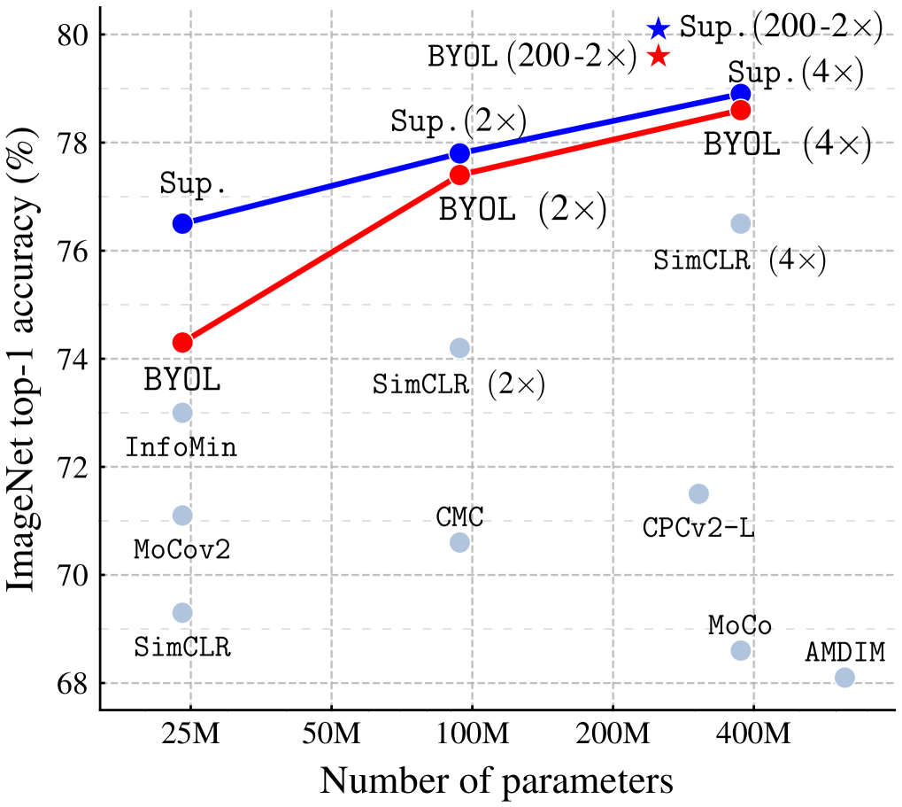
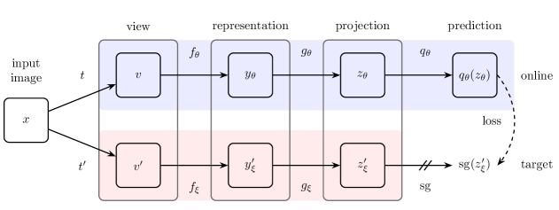
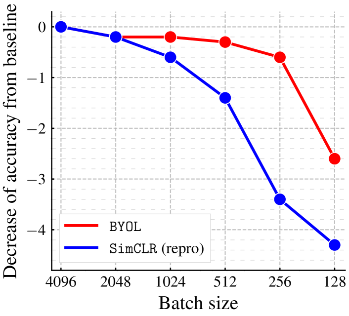

# 自分自身の潜在表現をブートストラップする：自己教師あり学習の新しいアプローチ

> 原題: Bootstrap Your Own Latent: A New Approach to Self-Supervised Learning
> 著者: Jean-Bastien Grill, Florian Strub, Florent Altché, Corentin Tallec, Pierre H. Richemond, Elena Buchatskaya, Carl Doersch, Bernardo Avila Pires, Zhaohan Daniel Guo, Mohammad Gheshlaghi Azar, Bilal Piot, Koray Kavukcuoglu, Rémi Munos, Michal Valko
> 所属: DeepMind, Imperial College
> arXiv: 2006.07733（2020）

## Abstract（要旨）

我々は、自己教師あり画像表現学習への新たなアプローチである Bootstrap Your Own Latent（BYOL）を紹介する。BYOL は、オンラインネットワークとターゲットネットワークと呼ばれる 2 つのニューラルネットワークに依拠しており、これらが互いに相互作用しながら学習する。ある画像の拡張されたビューから、異なる拡張ビューにおける同一画像のターゲットネットワーク表現を予測するようにオンラインネットワークを訓練する。同時に、オンラインネットワークの緩やかな移動平均でターゲットネットワークを更新する。最先端手法は負例ペアに依存しているが、BYOL はそれらを使用せずに新たな最高性能を達成する。BYOL は ResNet-50 アーキテクチャを用いた線形評価で ImageNet の top-1 分類精度 74.3%、より大きな ResNet では 79.6% を達成する。我々は BYOL が転移ベンチマークと半教師あり学習ベンチマークの両方において現在の最先端と同等以上の性能を示すことを示す。実装と事前学習済みモデルは GitHub で公開している。

## 1 Introduction（はじめに）

<figure>

<figcaption>図1: ResNet-50 と最良アーキテクチャ ResNet-200 (2×) を使った ImageNet での BYOL の性能（線形評価）と、他の教師なし・教師あり（Sup.）ベースラインとの比較。</figcaption>
</figure>

優れた画像表現を学習することは、コンピュータビジョンにおける重要な課題であり、下流タスクでの効率的な訓練を可能にする。このような表現を学習するために多くの異なる訓練アプローチが提案されており、通常は視覚的プリテキストタスクに依存している。その中でも、最先端の対比手法は、同一画像の異なる拡張ビューの表現間の距離を縮め（「正例ペア」）、異なる画像の拡張ビューの表現間の距離を広げる（「負例ペア」）ことで訓練される。これらの手法は、負例ペアの慎重な扱いを必要としており、大きなバッチサイズ、メモリバンク、またはカスタマイズされたマイニング戦略によって負例ペアを取得する。さらに、これらの性能は画像拡張の選択に大きく依存する。

本論文では、画像表現の自己教師あり学習のための新しいアルゴリズムである Bootstrap Your Own Latent（BYOL）を紹介する。BYOL は負例ペアを使用せずに最先端の対比手法より高い性能を達成する。BYOL はネットワークの出力を反復的にブートストラップし、より良い表現へのターゲットとして機能させる。さらに、BYOL は対比手法と比べて画像拡張の選択に対してより頑健である。負例ペアに依存しないことが、この改善された頑健性の主要因の一つであると我々は推測している。以前のブートストラッピングに基づく手法が擬似ラベル、クラスタインデックス、または少数のラベルを使用していたのに対し、我々は表現を直接ブートストラップすることを提案する。特に BYOL は、互いに相互作用しながら学習する、オンラインネットワークとターゲットネットワークと呼ばれる 2 つのニューラルネットワークを使用する。ある画像の拡張ビューから出発し、BYOL はその同一画像の別の拡張ビューのターゲットネットワーク表現を予測するようにオンラインネットワークを訓練する。この目的関数は、例えば全画像に同じベクトルを出力するといった崩壊解を許容するが、BYOL がそのような解に収束しないことを実験的に示す。（i）オンラインネットワークへのプレディクタ（predictor, 予測器）の追加と（ii）オンラインパラメータの緩やかな移動平均をターゲットネットワークとして使用することの組み合わせが、オンライン射影内にますます多くの情報のエンコードを促し、崩壊解を回避すると我々は仮説立てる（セクション 3.2 参照）。

我々は ImageNet と他の視覚ベンチマークにおいて ResNet アーキテクチャを用いて BYOL が学習した表現を評価する。凍結表現の上に線形分類器を訓練するという ImageNet 上の線形評価プロトコルの下で、BYOL は標準の ResNet-50 で top-1 精度 74.3%、より大きな ResNet では top-1 精度 79.6% を達成する（図 1）。ImageNet での半教師あり学習と転移設定において、我々は現在の最先端と同等以上の結果を得る。我々の貢献は次のとおりである：（i）BYOL を紹介する。これは負例ペアを使用せずに ImageNet 上の線形評価プロトコルで最先端の結果を達成する自己教師あり表現学習手法である（セクション 3）。（ii）学習された表現が半教師あり学習と転移ベンチマークで最先端を上回ることを示す（セクション 4）。（iii）バッチサイズや画像拡張セットの変化に対し、BYOL が対比手法と比べてより頑健であることを示す（セクション 5）。特に BYOL は、画像拡張としてランダムクロップのみを使用した場合に、強力な対比ベースラインである SimCLR と比較してはるかに小さな性能低下にとどまる。

## 2 Related work（関連研究）

表現学習のほとんどの教師なし手法は、生成的または識別的のいずれかに分類できる。表現学習への生成的アプローチは、データと潜在埋め込み上の分布を構築し、学習された埋め込みを画像表現として使用する。これらのアプローチの多くは画像のオートエンコーディングまたは敵対的学習に依存しており、データと表現を共同でモデル化する。生成的手法は通常、画素空間で直接動作する。しかし、これは計算コストが高く、画像生成に必要な高いレベルの詳細が表現学習には不要な場合がある。

識別的手法の中では、対比手法が現在の自己教師あり学習で最先端の性能を達成している。対比アプローチは、同一画像の異なるビューの表現を近づけ（「正例ペア」）、異なる画像からのビューの表現を引き離す（「負例ペア」）ことで、画素空間での高コストな生成ステップを回避する。対比手法は多くの場合、各サンプルを多くの他のサンプルと比較する必要があり、負例ペアの使用が本当に必要かという問いが生じている。

DeepCluster はこの問いに部分的に答えている。それは以前のバージョンの表現に対するブートストラッピングを使用して次の表現のターゲットを生成する。具体的には、以前の表現を用いてデータポイントをクラスタリングし、各サンプルのクラスタインデックスを新しい表現の分類ターゲットとして使用する。負例ペアの使用を回避しているが、これはコストの高いクラスタリングフェーズと自明解への崩壊を避けるための特別な予防措置を必要とする。

一部の自己教師あり手法は対比的ではないが、表現の学習に補助的な手作りの予測タスクを使用する。特に、相対的パッチ予測、グレースケール画像の着色、画像インペインティング、画像ジグソーパズル、画像超解像、および幾何変換が有用であることが示されている。しかし、適切なアーキテクチャを用いても、これらの手法は対比手法に性能で上回られている。

我々のアプローチは、強化学習（RL）のための自己教師あり表現学習技術である Predictions of Bootstrapped Latents（PBL）と一定の類似点を持つ。PBL はエージェントの履歴表現と将来の観測のエンコーディングを共同で訓練する。BYOL とは異なり、PBL は安定したターゲットを提供するために緩やかな移動平均を使用しておらず、第 2 のネットワークを必要とする。

緩やかな移動平均ターゲットネットワークを使ってオンラインネットワークに安定したターゲットを提供するというアイデアは、深層 RL から着想を得ている。ターゲットネットワークはベルマン方程式による更新を安定化し、BYOL のブートストラップ機構を安定化させる上で魅力的である。ほとんどの RL 手法は固定されたターゲットネットワークを使用しているが、BYOL はターゲット表現の滑らかな変化を提供するために以前のネットワークの加重移動平均を使用する。

半教師あり学習の設定では、教師なし損失を少数のラベル上の分類損失と組み合わせて訓練を固定する。これらの手法の中で、Mean Teacher（MT）もまた、teacher と呼ばれる緩やかな移動平均ネットワークを使ってオンラインネットワーク（student と呼ばれる）のターゲットを生成する。teacher と student の softmax 予測間の $\ell_2$ 一致損失を分類損失に加える。MT は半教師あり学習の場合にその有効性を示しているが、セクション 5 では、分類損失を取り除くと同様のアプローチが崩壊することを示す。これに対して、BYOL はオンラインネットワークの上に追加のプレディクタを導入し、崩壊を防ぐ。

最後に、自己教師あり学習において、MoCo はメモリバンクから取得した負例の一貫した表現を維持するために緩やかな移動平均ネットワーク（モメンタムエンコーダ）を使用する。これに対して BYOL は移動平均ネットワークを予測ターゲットの生成に使用し、ブートストラップステップを安定化させる手段とする。セクション 5 では、この単なる安定化効果が、同数の負例を使用する場合でも既存の対比手法を改善できることを示す。

## 3 Method（手法）

### 3.1 BYOL の説明

<figure>

<figcaption>図2: BYOL のアーキテクチャ。オンラインネットワークは q_θ(z_θ) と sg(z'_ξ) の間の類似度損失を最小化する。θ は訓練される重み、ξ は θ の指数移動平均であり、sg はストップグラジエントを意味する。訓練終了後、f_θ 以外はすべて破棄され、y_θ が画像表現として使用される。</figcaption>
</figure>

BYOL の目標は、下流タスクに使用できる表現 $y_\theta$ を学習することである。前述のように、BYOL は 2 つのニューラルネットワーク、すなわちオンラインネットワークとターゲットネットワークを使用して学習する。オンラインネットワークは重みセット $\theta$ によって定義され、エンコーダ $f_\theta$、プロジェクタ（projector, 射影器）$g_\theta$、プレディクタ（predictor, 予測器）$q_\theta$ の 3 つのステージで構成される（図 2 および図 8 参照）。ターゲットネットワークはオンラインネットワークと同じアーキテクチャを持つが、異なる重みセット $\xi$ を使用する。ターゲットネットワークはオンラインネットワークを訓練するための回帰ターゲットを提供し、そのパラメータ $\xi$ はオンラインパラメータ $\theta$ の指数移動平均である。より正確には、ターゲット減衰率 $\tau \in [0,1]$ が与えられると、各訓練ステップの後に次の更新を実行する：

$$\xi \leftarrow \tau \xi + (1-\tau)\theta.$$

画像セット $\mathcal{D}$、$\mathcal{D}$ から一様にサンプリングされた画像 $x \sim \mathcal{D}$、2 つの画像拡張の分布 $\mathcal{T}$ と $\mathcal{T}'$ が与えられると、BYOL はそれぞれ $t \sim \mathcal{T}$ と $t' \sim \mathcal{T}'$ を適用して $x$ から 2 つの拡張ビュー $v \triangleq t(x)$ と $v' \triangleq t'(x)$ を生成する。最初の拡張ビュー $v$ から、オンラインネットワークは表現 $y_\theta \triangleq f_\theta(v)$ と射影 $z_\theta \triangleq g_\theta(y)$ を出力する。ターゲットネットワークは第 2 の拡張ビュー $v'$ から $y'_\xi \triangleq f_\xi(v')$ とターゲット射影 $z'_\xi \triangleq g_\xi(y')$ を出力する。次に $q_\theta(z_\theta)$ の予測 $z'_\xi$ を出力し、$q_\theta(z_\theta)$ と $z'_\xi$ の両方を $\ell_2$ 正規化して $\overline{q_\theta}(z_\theta) \triangleq q_\theta(z_\theta)/\|q_\theta(z_\theta)\|_2$ と $\bar{z}'_\xi \triangleq z'_\xi/\|z'_\xi\|_2$ を得る。このプレディクタはオンラインブランチにのみ適用されており、オンラインとターゲットのパイプライン間でアーキテクチャを非対称にしていることに注意する。最後に、正規化された予測とターゲット射影間の以下の平均二乗誤差を定義する：

$$\mathcal{L}_{\theta,\xi} \triangleq \|\overline{q_\theta}(z_\theta) - \bar{z}'_\xi\|_2^2 = 2 - 2 \cdot \frac{\langle q_\theta(z_\theta), z'_\xi \rangle}{\|q_\theta(z_\theta)\|_2 \cdot \|z'_\xi\|_2}.$$

式 2 の損失 $\mathcal{L}_{\theta,\xi}$ を、$v'$ をオンラインネットワークに、$v$ をターゲットネットワークに別々に供給して $\widetilde{\mathcal{L}}_{\theta,\xi}$ を計算することで対称化する。各訓練ステップで、$\theta$ のみに関して（$\xi$ には関して行わず）$\mathcal{L}^{\text{BYOL}}_{\theta,\xi} = \mathcal{L}_{\theta,\xi} + \widetilde{\mathcal{L}}_{\theta,\xi}$ を最小化するための確率的最適化ステップを実行する。BYOL のダイナミクスは次のようにまとめられる：

$$\theta \leftarrow \text{optimizer}(\theta, \nabla_\theta \mathcal{L}^{\text{BYOL}}_{\theta,\xi}, \eta),$$
$$\xi \leftarrow \tau\xi + (1-\tau)\theta,$$

ここで optimizer は最適化器、$\eta$ は学習率である。

訓練終了後、エンコーダ $f_\theta$ のみを保持する。他の手法との比較では、最終表現 $f_\theta$ の推論時重みの数のみを考慮する。完全な訓練手続きは付録 A にまとめられており、JAX と Haiku ライブラリに基づく Python 擬似コードは付録 J に提供されている。

### 3.2 BYOL の挙動に関する直観

BYOL は崩壊を明示的に防ぐ項（負例など）を使用していないため、$(\theta, \xi)$ に関して $\mathcal{L}_{\theta,\xi}^{\text{BYOL}}$ の最小値（例えば、崩壊した定数表現）に収束するように思われるかもしれない。しかし BYOL のターゲットパラメータ $\xi$ の更新は $\nabla_\xi \mathcal{L}_{\theta,\xi}^{\text{BYOL}}$ の方向ではない。より一般的に、BYOL のダイナミクスが $L$ を $\theta, \xi$ に対して共同で勾配降下したものとなるような損失 $L_{\theta,\xi}$ は存在しないと我々は仮説立てる。これは GAN と同様で、識別器と生成器のパラメータの両方に関して共同で最小化される損失が存在しない。したがって、BYOL のパラメータが $\mathcal{L}^{\text{BYOL}}_{\theta,\xi}$ の最小値に収束するという先験的な理由はない。

BYOL のダイナミクスはまだ望ましくない均衡を許容するが、我々の実験ではそのような均衡への収束は観察されなかった。さらに、BYOL のプレディクタが最適である（$q_\theta = q^\star$、ここで $q^\star(z_\theta) = \mathbb{E}[z'_\xi | z_\theta]$）と仮定すると、望ましくない均衡は不安定であると我々は仮説立てる。この最適プレディクタの場合、$\theta$ に関する BYOL の更新は期待値において条件付き分散の期待値の勾配に従う：

$$\nabla_\theta \mathbb{E}\left[\|q^\star(z_\theta) - z'_\xi\|_2^2\right] = \nabla_\theta \mathbb{E}\left[\sum_i \text{Var}(z'_{\xi,i} | z_\theta)\right],$$

ここで $z'_{\xi,i}$ は $z'_\xi$ の $i$ 番目の特徴である。

定数特徴 $c$ と任意の確率変数 $z_\theta$ と $z'_\xi$ に対して $\text{Var}(z'_\xi | z_\theta) \leq \text{Var}(z'_\xi | c)$ であるため、$z_\theta$ に定数特徴を持つことは回避される。これらの崩壊した定数均衡が不安定であるという我々の仮説を支持している。さらに、もし $\xi$ に関して $\mathbb{E}[\sum_i \text{Var}(z'_{\xi,i}|z_\theta)]$ を最小化すれば、定数 $z'_\xi$ で分散が最小化されるため、崩壊した $z'_\xi$ が得られる。代わりに、BYOL は $\xi$ を $\theta$ に近づけることで、オンライン射影によって捉えられた変動源をターゲット射影に組み込む。

オンラインパラメータ $\theta$ をターゲットパラメータ $\xi$ にハードコピーすることは、新しい変動源を伝播させるのに十分である。しかし、ターゲットネットワークの突然の変化は最適なプレディクタの仮定を破壊する可能性があり、その場合 BYOL の損失が条件付き分散に近いことが保証されない。BYOL の移動平均ターゲットネットワークの主な役割は、訓練を通じてプレディクタの最適性に近い状態を確保することであると我々は仮説立てる。

### 3.3 実装の詳細

#### 画像拡張

BYOL は SimCLR と同じ画像拡張セットを使用する。まず、画像のランダムパッチを選択してランダムな水平反転とともに $224 \times 224$ にリサイズし、続いて明るさ、コントラスト、彩度、色相の調整のランダムシーケンスとオプションのグレースケール変換で構成される色歪みを適用する。最後にガウスブラーとソラリゼーションをパッチに適用する。

#### アーキテクチャ

ベースのパラメトリックエンコーダ $f_\theta$ と $f_\xi$ として、50 層と事後活性化を持つ畳み込み残差ネットワーク（ResNet-50 (1×) v1）を使用する。また、SimCLR と同様に、より深い（50, 101, 152, 200 層）およびより広い（1× から 4×）ResNet も使用する。表現 $y$ は最終平均プーリング層の出力に対応し、特徴次元は 2048（幅乗数 1× の場合）である。SimCLR と同様に、表現 $y$ は多層パーセプトロン（MLP）$g_\theta$ によってより小さな空間に射影される。この MLP は出力サイズ 4096 の線形層に続いてバッチ正規化、ReLU、そして出力次元 256 の最終線形層から成る。SimCLR と異なり、この MLP の出力はバッチ正規化されない。プレディクタ $q_\theta$ は $g_\theta$ と同じアーキテクチャを使用する。

#### 最適化

コサイン減衰学習率スケジュールを伴う LARS オプティマイザを使用し、10 エポックのウォームアップ期間を経て、リスタートなしで 1000 エポック訓練する。基本学習率は 0.2 に設定し、バッチサイズに応じて線形にスケーリングする（学習率 $= 0.2 \times$ バッチサイズ $/256$）。さらに、バイアスとバッチ正規化パラメータを LARS 適応と重み減衰の両方から除外しながら、グローバル重み減衰パラメータを $1.5 \cdot 10^{-6}$ に設定する。ターゲットネットワークについては、指数移動平均パラメータ $\tau$ は $\tau_{\text{base}} = 0.996$ から始まり、訓練中に 1 に向けて増加する。具体的には $\tau \triangleq 1-(1-\tau_{\text{base}}) \cdot (\cos(\pi k/K)+1)/2$ と設定する（$k$ は現在の訓練ステップ、$K$ は最大訓練ステップ数）。バッチサイズは 512 個の Cloud TPU v3 コアに分散した 4096 を使用する。この設定では、ResNet-50 (×1) の訓練に約 8 時間かかる。

## 4 Experimental evaluation（実験的評価）

ImageNet ILSVRC-2012 データセットの訓練セットでの自己教師あり事前学習後の BYOL の表現の性能を評価する。まず ImageNet（IN）で線形評価と半教師あり学習の両方で評価する。次に、分類、セグメンテーション、物体検出、深度推定を含む他のデータセットとタスクへの転移能力を測定する。比較のため、ImageNet のサブセットのラベルを使用して訓練された表現（Supervised-IN と呼ぶ）の結果も報告する。

#### ImageNet での線形評価

凍結表現の上に線形分類器を訓練することで BYOL の表現を評価する（表 1）。標準の ResNet-50 (×1) で BYOL は top-1 精度 74.3%（top-5 精度 91.6%）を達成し、以前の自己教師あり最先端を 1.3 ポイント（それぞれ 0.5 ポイント）改善する。深くて広いアーキテクチャで、BYOL は一貫して以前の最先端を上回り、top-1 精度 79.6% の最高性能を得る。

**表1（a）: ResNet-50 エンコーダでの線形評価（ImageNet top-1 / top-5）**

| 手法 | Top-1 | Top-5 |
|---|---|---|
| Local Agg. | 60.2 | - |
| PIRL | 63.6 | - |
| CPC v2 | 63.8 | 85.3 |
| CMC | 66.2 | 87.0 |
| SimCLR | 69.3 | 89.0 |
| MoCo v2 | 71.1 | - |
| InfoMin Aug. | 73.0 | 91.1 |
| **BYOL（ours）** | **74.3** | **91.6** |

**表1（b）: 他の ResNet アーキテクチャ**

| 手法 | アーキテクチャ | パラメータ | Top-1 | Top-5 |
|---|---|---|---|---|
| SimCLR | ResNet-50 (2×) | 94M | 74.2 | 92.0 |
| BYOL | ResNet-50 (2×) | 94M | **77.4** | **93.6** |
| SimCLR | ResNet-50 (4×) | 375M | 76.5 | 93.2 |
| BYOL | ResNet-50 (4×) | 375M | 78.6 | 94.2 |
| BYOL | ResNet-200 (2×) | 250M | **79.6** | **94.8** |

#### ImageNet での半教師あり学習

BYOL の表現を ImageNet の訓練セットの小さなサブセット（1% と 10%）を用いて分類タスクでファインチューニングした場合の性能を評価する（表 2）。BYOL は幅広いアーキテクチャにわたって以前のアプローチを一貫して上回る。

**表2（a）: ResNet-50 での半教師あり学習（top-1）**

| 手法 | 1% | 10% |
|---|---|---|
| Supervised | 25.4 | 56.4 |
| SimCLR | 48.3 | 65.6 |
| **BYOL** | **53.2** | **68.8** |

#### 他の分類タスクへの転移

BYOL は 12 個のベンチマーク全てで SimCLR を上回り、12 個中 7 個で Supervised-IN ベースラインを上回る（表 3）。BYOL の表現は CIFAR のような小画像、SUN397 のような風景、DTD のようなテクスチャに転移できる。

#### 他の視覚タスクへの転移

VOC2012 意味的セグメンテーションで BYOL は Supervised-IN ベースライン（+1.9 mIoU）と SimCLR（+1.1 mIoU）の両方を上回る。物体検出では Faster R-CNN アーキテクチャを使用し、Supervised-IN ベースライン（+3.1 AP50）と SimCLR（+2.3 AP50）より大幅に改善する。深度推定では NYU v2 データセットで、各メトリクスで他の手法と同等以上の性能を示す。

**表4（a）: セグメンテーションと物体検出への転移**

| 手法 | AP50 | mIoU |
|---|---|---|
| Supervised-IN | 74.4 | 74.4 |
| MoCo | 74.9 | 72.5 |
| SimCLR (repro) | 75.2 | 75.2 |
| **BYOL** | **77.5** | **76.3** |

## 5 Building intuitions with ablations（アブレーションによる直観構築）

<figure>

<figcaption>図3（a）: バッチサイズの影響。BYOL は 256〜4096 の広いバッチサイズ範囲で安定しているが、SimCLR はバッチサイズが小さくなるにつれて急速に性能が低下する。</figcaption>
</figure>

再現性のため、各パラメータ設定を 3 シードで実行し、平均性能を報告する。アブレーションは 64 TPU v3 コアで 300 エポック実行する。

#### バッチサイズ

対比手法の中でミニバッチから負例を取得するものは、バッチサイズを減らすと性能が低下する。BYOL は負例を使用しないため、より小さなバッチサイズに対して頑健であることが期待される。図 3(a) に示すように、SimCLR の性能はバッチサイズとともに急速に低下するが、BYOL の性能は 256 から 4096 の広いバッチサイズ範囲で安定している。

#### 画像拡張

対比手法は画像拡張の選択に敏感である。例えば SimCLR は色歪みを取り除くとうまく機能しない。BYOL は色ヒストグラムに焦点を当てる以外の特徴も保持するインセンティブがあるため、画像拡張の選択に対してより頑健であると信じている。BYOL の性能は色歪みを除去したときに SimCLR（-22.2 ポイント）に対してはるかに影響が少ない（-9.1 ポイント）。画像拡張をランダムクロップのみに削減すると、BYOL はまだ良好な性能（59.4%）を示すが、SimCLR はパフォーマンスの 3 分の 1 以上を失う（40.3%）。

#### ブートストラッピング

ターゲット減衰率が 1 のとき、ターゲットネットワークは決して更新されず、初期化に対応する定数値にとどまる。減衰率が 0 のとき、ターゲットネットワークは各ステップでオンラインネットワークに瞬時に更新される。表 5(a) に示すように、頻繁すぎるターゲット更新（τ=0）は訓練を不安定にし非常に低い性能をもたらし、ターゲットを更新しないこと（τ=1）は訓練を安定させるが反復的改善を妨げ、低品質の最終表現で終わる。0.9 から 0.999 の間の減衰率値はすべて、300 エポックで 68.4% 以上の top-1 精度をもたらす。

**表5（a）: 異なるターゲットモードでの結果**

| ターゲット | τ_base | Top-1 |
|---|---|---|
| 定数ランダムネットワーク | 1 | 18.8±0.7 |
| オンラインの移動平均 | 0.999 | 69.8 |
| オンラインの移動平均 | 0.99 | **72.5** |
| オンラインの移動平均 | 0.9 | 68.4 |
| オンラインのストップグラジエント | 0 | 0.3 |

#### 対比手法へのアブレーション

BYOL と SimCLR を同じ形式で再解釈し、どこに改善の源があるかをより深く理解する。負例なし（β=0）でうまく機能する唯一のバリアントは、ブートストラップターゲットネットワークとプレディクタの両方を使用する BYOL である。SimCLR にターゲットネットワークを追加するだけで性能が改善する（+1.6 ポイント）。これにより、MoCo でのターゲットネットワークの使用に新たな光が当たる。つまり、同数の負例を使用した場合でも、単なる安定化効果によってターゲットネットワークの使用が有益であることが示される。

**表5（b）: BYOL と SimCLR の中間バリアント**

| 手法 | プレディクタ | ターゲットネットワーク | β | Top-1 |
|---|---|---|---|---|
| BYOL | ✓ | ✓ | 0 | **72.5** |
| - | ✓ | ✓ | 1 | 70.9 |
| - | | ✓ | 1 | 70.7 |
| SimCLR | | | 1 | 69.4 |
| - | ✓ | | 1 | 69.1 |
| - | ✓ | | 0 | 0.3 |
| - | | ✓ | 0 | 0.2 |
| - | | | 0 | 0.1 |

#### Mean Teacher との関係

別の半教師あり学習アプローチである Mean Teacher（MT）は、少数のラベルで教師あり損失に一致損失を補う。BYOL からプレディクタを取り除くと、分類損失のない MT の教師なしバージョンが得られるが、これは崩壊する（表 5 の 7 行目）。これは追加のプレディクタが教師なしシナリオでの崩壊を防ぐのに重要であることを示唆している。

#### 最適なプレディクタの重要性

プレディクタとターゲットネットワークの組み合わせが必要であることが示されている。ターゲットネットワークなしでも、プレディクタを最適に近い状態に保つことで（例えばバッチ上の最適線形プレディクタを使用することで、52.5% top-1 精度）崩壊なしでターゲットネットワークを取り除けることをさらに発見した。これは、崩壊を防ぐために常にプレディクタを最適に近い状態に保つことが重要であり、それが BYOL のターゲットネットワークの役割の一つである可能性を示している。

## 6 Conclusion（結論）

我々は画像表現の自己教師あり学習のための新しいアルゴリズム BYOL を紹介した。BYOL は負例ペアを使用せずに、以前の出力を予測することで表現を学習する。BYOL が様々なベンチマークで最先端の結果を達成することを示す。特に、ResNet-50 (1×) を用いた ImageNet での線形評価プロトコルの下で、BYOL は新たな最先端を達成し、自己教師あり手法と教師あり学習ベースラインの間の残りのギャップのほとんどを埋める。ResNet-200 (2×) を使用して、BYOL は以前の最先端（76.8%）を上回りながら、30% 少ないパラメータで top-1 精度 79.6% に達する。

それにもかかわらず、BYOL は依然として視覚アプリケーションに特化した既存の拡張セットに依存している。BYOL を他のモダリティ（音声、動画、テキストなど）に一般化するためには、それぞれに同様に適した拡張を取得する必要がある。そのような拡張の設計は多大な労力と専門知識を必要とする可能性がある。したがって、これらの拡張の探索を自動化することは BYOL を他のモダリティに一般化するための重要な次のステップとなる。

## Broader Impact（より広い影響）

本研究は教師なし学習の分野における研究として分類されるべきである。この研究は新しいアルゴリズム、理論的、実験的調査を刺激する可能性がある。ここで提示されるアルゴリズムは多くの異なる視覚アプリケーションに使用でき、特定の使用は positive と negative の両方の影響を持つ可能性があり、これはデュアルユース問題として知られている。また、視覚データセットにはバイアスが含まれている可能性があるため、BYOL が学習した表現はこれらのバイアスを複製しやすい可能性がある。

## Appendix A Algorithm（アルゴリズム）

**入力:**

| 記号 | 説明 |
|---|---|
| $\mathcal{D}$, $\mathcal{T}$, $\mathcal{T}'$ | 画像セットと変換の分布 |
| $\theta$, $f_\theta$, $g_\theta$, $q_\theta$ | 初期オンラインパラメータ、エンコーダ、プロジェクタ、プレディクタ |
| $\xi$, $f_\xi$, $g_\xi$ | 初期ターゲットパラメータ、ターゲットエンコーダ、ターゲットプロジェクタ |
| optimizer | オンラインパラメータを損失勾配で更新する最適化器 |
| $K$ と $N$ | 最適化ステップの総数とバッチサイズ |
| $\{\tau_k\}_{k=1}^K$ と $\{\eta_k\}_{k=1}^K$ | ターゲットネットワーク更新スケジュールと学習率スケジュール |

$k=1$ から $K$ まで繰り返す:

- $\mathcal{B} \leftarrow \{x_i \sim \mathcal{D}\}_{i=1}^N$ // $N$ 枚の画像のバッチをサンプリング
- $x_i \in \mathcal{B}$ の各サンプルに対して:
  - $t \sim \mathcal{T}$ と $t' \sim \mathcal{T}'$ // 画像変換をサンプリング
  - $z_1 \leftarrow g_\theta(f_\theta(t(x_i)))$ と $z_2 \leftarrow g_\theta(f_\theta(t'(x_i)))$ // 射影を計算
  - $z'_1 \leftarrow g_\xi(f_\xi(t'(x_i)))$ と $z'_2 \leftarrow g_\xi(f_\xi(t(x_i)))$ // ターゲット射影を計算
  - $l_i \leftarrow -2\cdot\left(\frac{\langle q_\theta(z_1), z'_1 \rangle}{\|q_\theta(z_1)\|_2 \cdot \|z'_1\|_2} + \frac{\langle q_\theta(z_2), z'_2 \rangle}{\|q_\theta(z_2)\|_2 \cdot \|z'_2\|_2}\right)$ // $x_i$ の損失を計算
- $\delta\theta \leftarrow \frac{1}{N}\sum_{i=1}^N \partial_\theta l_i$ // θ に関する総損失勾配を計算
- $\theta \leftarrow \text{optimizer}(\theta, \delta\theta, \eta_k)$ // オンラインパラメータを更新
- $\xi \leftarrow \tau_k \xi + (1-\tau_k)\theta$ // ターゲットパラメータを更新

**出力:** エンコーダ $f_\theta$

## Appendix B Image augmentations（画像拡張）

自己教師あり訓練中、BYOL は以下の画像拡張を使用する：

- ランダムクロップ: 元画像の面積の 8% から 100% の間で一様にサンプリングされた面積、3/4 から 4/3 の間で対数的にサンプリングされたアスペクト比を持つランダムパッチを選択し、双三次補間を使用してターゲットサイズ $224\times 224$ にリサイズする
- オプションの左右反転
- 色ジッタリング: 全画素に適用されるランダムオフセットで明るさ、コントラスト、彩度、色相を変更する。シフトの順序は各パッチに対してランダムに選択される
- 色削除: オプションのグレースケール変換。適用される場合、ピクセル $(r,g,b)$ の出力輝度は輝度成分 $0.2989r+0.5870g+0.1140b$ に対応する
- ガウスブラー: $224\times 224$ 画像の場合、$[0.1, 2.0]$ から一様にサンプリングされた標準偏差を持つ $23\times 23$ のガウスカーネルを使用する
- ソラリゼーション: $[0,1]$ の値を持つ画素に対して $x \mapsto x \cdot \mathbf{1}_{\{x<0.5\}} + (1-x) \cdot \mathbf{1}_{\{x\geq 0.5\}}$ という色変換

各拡張は所定の確率で適用される。 $\mathcal{T}$ と $\mathcal{T}'$ で唯一の違いは Gaussian blur probability（1.0 vs 0.1）と solarization probability（0.0 vs 0.2）である。
