# 自然言語の教師信号から転移可能な視覚モデルを学習する

> 原題: Learning Transferable Visual Models From Natural Language Supervision
> 著者: Alec Radford, Jong Wook Kim, Chris Hallacy, Aditya Ramesh, Gabriel Goh, Sandhini Agarwal, Girish Sastry, Amanda Askell, Pamela Mishkin, Jack Clark, Gretchen Krueger, Ilya Sutskever
> 所属: OpenAI
> 出典: arXiv:2103.00020、ICML 2021（原文: <https://ar5iv.labs.arxiv.org/html/2103.00020>）

> 翻訳メモ: 本翻訳は本文 §1〜§9 に加え、**Appendix A〜F まで含む全文翻訳**である。References のみ除外。

---

## Abstract（要旨）

最先端のコンピュータビジョンシステムは、事前に決められた固定された物体カテゴリ集合を予測するように訓練される。

この制限された形の教師信号は、その汎用性と利用可能性を制限する。なぜなら、他の任意の視覚的概念を指定するには追加のラベル付きデータが必要になるからである。

画像に関する生のテキストから直接学習することは有望な代替案であり、はるかに広範な教師信号源を活用する。

われわれは、どのキャプションがどの画像に対応するかを予測するというシンプルな事前学習タスクが、インターネットから収集された 4 億の（画像, テキスト）ペアのデータセット上でゼロから SOTA 画像表現を学習する効率的かつスケーラブルな方法であることを示す。

事前学習後、自然言語は学習された視覚的概念を参照する（または新しい概念を記述する）ために用いられ、モデルの下流タスクへのゼロショット転移を可能にする。

OCR、動画中の行動認識、地理位置特定、多くの種類の細粒度物体分類といったタスクにまたがる、30 以上の既存のコンピュータビジョンデータセットでベンチマークを行うことによって、このアプローチの性能を研究する。

モデルは多くのタスクに非自明に転移し、データセット固有の訓練を必要とせず、完全教師ありベースラインと競合することが多い。

例えば、われわれは元の ResNet-50 の ImageNet での精度を、それが訓練された 128 万の訓練例を 1 つも使うことなくゼロショットで一致させる。

コードと事前学習モデル重みは <https://github.com/OpenAI/CLIP> で公開している。

---

## 1 Introduction and Motivating Work（はじめにと動機となる研究）

生のテキストから直接学習する事前学習手法は、過去数年間で NLP に革命をもたらした [31, 150, 79, 153, 36, 155]。

自己回帰やマスク言語モデリングのようなタスクに依存しない目的関数は、計算量・モデル容量・データの多くの桁にわたってスケールし、能力を着実に改善してきた。

「text-to-text」を標準的な入出力インターフェースとして開発したこと [124, 154, 155] は、タスクに依存しないアーキテクチャが下流データセットにゼロショット転移することを可能にし、特殊な出力ヘッドやデータセット固有のカスタマイズの必要性を取り除いた。

GPT-3 [15] のような旗艦システムは、データセット固有の訓練データをほとんどまたはまったく必要とせずに、多くのタスクで特注モデルと競合できるようになっている。

これらの結果は、ウェブスケールのテキストコレクション内で現代の事前学習手法がアクセス可能な集約的な教師信号が、高品質なクラウドラベル付き NLP データセットのそれを上回ることを示唆している。

しかしながら、コンピュータビジョンのような他の分野では、ImageNet [33] のようなクラウドラベル付きデータセットでモデルを事前学習することが依然として標準的な実践である。

ウェブテキストから直接学習するスケーラブルな事前学習手法は、コンピュータビジョンでも同様のブレイクスルーをもたらしうるだろうか？

先行研究は励みになる。

<figure>

<figcaption>図1: CLIP の概要。標準的画像モデルは画像特徴量抽出器と線形分類器を共同訓練するが、CLIP は画像エンコーダとテキストエンコーダを共同訓練し、訓練例の (画像, テキスト) ペアの (正しい) ペアリングを予測する。テスト時には、学習されたテキストエンコーダが対象データセットのクラス名やその説明を埋め込むことでゼロショット線形分類器を合成する。</figcaption>
</figure>

20 年以上前、[133] は画像と組になったテキスト文書内の名詞と形容詞を予測するモデルを訓練することで、内容ベース画像検索を改善することを探求した。

[152] は、画像に関連付けられたキャプション内の単語を予測するように訓練された分類器の重み空間における多様体学習を介して、よりデータ効率の良い画像表現を学習することが可能であることを実証した。

[174] は、低レベル画像とテキストタグ特徴量の上にマルチモーダル深層ボルツマンマシンを訓練することによって、深層表現学習を探求した。

[85] はこの研究系統を現代化し、画像キャプション内の単語を予測するように訓練された CNN が有用な画像表現を学習することを実証した。

彼らは YFCC100M データセット [182] 内の画像のタイトル、説明、ハッシュタグメタデータを bag-of-words マルチラベル分類タスクに変換し、これらのラベルを予測するように AlexNet [97] を事前学習することで、転移タスクで ImageNet ベースの事前学習と同様の性能を発揮する表現を学習することを示した。

[107] はこのアプローチを単語に加えてフレーズ n-gram の予測に拡張し、学習された視覚 n-gram の辞書に基づいてターゲットクラスをスコアリングし、最高スコアのものを予測することで、システムが他の画像分類データセットにゼロショット転移する能力を実証した。

より最近のアーキテクチャと事前学習アプローチを採用して、VirTex [35]、ICMLM [17]、ConVIRT [210] は最近、テキストから画像表現を学習する transformer ベースの言語モデリング、マスク言語モデリング、対比目的の可能性を実証した。

概念実証としてエキサイティングだが、画像表現学習に自然言語の教師信号を使用することは依然として稀である。

これは恐らく、共通のベンチマークで実証された性能が代替アプローチよりもはるかに低いためである。

例えば、[107] はゼロショット設定で ImageNet で 11.5% の精度に達するのみである。

これは、現在の最先端の 88.4% の精度 [201] をはるかに下回る。

古典的なコンピュータビジョンアプローチの 50% の精度 [34] すら下回る。

代わりに、より狭い範囲だがよく狙いを定めた弱教師信号の使用が性能を改善している。

[122] は Instagram 画像で ImageNet 関連のハッシュタグを予測することが効果的な事前学習タスクであることを示した。

ImageNet にファインチューニングされたとき、これらの事前学習モデルは精度を 5% 以上増加させ、当時の全体的な最先端を改善した。

[94] と [40] は、ノイズの多くラベル付けされた JFT-300M データセットのクラスを予測するようにモデルを事前学習することで、より広範な転移ベンチマークでも大きな利得を実証した。

この研究系統は、限られた量の教師あり「ゴールドラベル」からの学習と、事実上無制限の量の生テキストからの学習との間の、現在の実用的な中間点を表している。

しかしながら、それは妥協なしではない。

両研究は、その教師信号を 1000 クラスと 18291 クラスにそれぞれ慎重に設計、そしてその過程で制限している。

自然言語はその汎用性を通じて、はるかに広い視覚的概念の集合を表現し、したがって監督することができる。

両アプローチも予測を実行するために静的なソフトマックス分類器を使用し、動的な出力のメカニズムを欠いている。

これは、その柔軟性を大きく制限し、その「ゼロショット」能力を制限する。

これらの弱教師ありモデルと、自然言語から直接画像表現を学習する最近の探索との間の決定的な違いは**スケール**である。

[122] と [94] は数百万から数十億の画像でモデルをアクセラレータ年訓練したが、VirTex、ICMLM、ConVIRT は 1 から 2 億の画像でアクセラレータ日訓練した。

本研究では、このギャップを埋め、大規模に自然言語の教師信号で訓練された画像分類器の挙動を研究する。

この形式のインターネット上の大量の公開データに支えられて、4 億の（画像, テキスト）ペアの新しいデータセットを作成し、ConVIRT の単純化版（**Contrastive Language-Image Pre-training の略で CLIP と呼ぶ**）がゼロから訓練され、自然言語の教師信号から学習する効率的な方法であることを実証する。

CLIP のスケーラビリティを、計算量のほぼ 2 桁の範囲にまたがる 8 つのモデルを訓練することで研究し、転移性能が計算の滑らかに予測可能な関数であることを観察する [75, 87]。

CLIP が GPT ファミリーに類似して、OCR、地理位置特定、行動認識、その他多くを含む幅広いタスクを事前学習中に実行することを学習することを発見する。

30 以上の既存データセットで CLIP のゼロショット転移性能をベンチマークすることでこれを測定し、事前のタスク固有教師ありモデルと競合できることを発見する。

線形プローブ表現学習分析でこれらの発見を確認し、CLIP が公開されている最良の ImageNet モデルを上回りつつ、より計算効率も良いことを示す。

ゼロショット CLIP モデルが同等精度の教師あり ImageNet モデルよりはるかに頑健であることも追加で発見し、これはタスク非依存モデルのゼロショット評価がモデルの能力をはるかに代表的に表すことを示唆する。

これらの結果は、第 7 節で考察する重要な政策的・倫理的含意を持つ。

<figure>

<figcaption>図2: CLIP は対比目的でゼロショット ImageNet 分類を学習する点で、画像のキャプションを予測する transformer 言語モデルや bag-of-words モデルよりも訓練効率がはるかに高い。</figcaption>
</figure>

---

## 2 Approach（アプローチ）

### 2.1 Natural Language Supervision（自然言語の教師信号）

われわれのアプローチの中核は、自然言語に含まれる教師信号から知覚を学習するというアイデアである。

序論で議論したように、これは決して新しいアイデアではないが、この分野の研究を記述するために用いられる用語は多様で、一見矛盾しているようにも見え、述べられた動機も多様である。

[210], [51], [85], [35] はすべて画像と組になったテキストから視覚表現を学習する手法を導入するが、彼らのアプローチをそれぞれ unsupervised, self-supervised, weakly supervised, supervised と記述している。

われわれは、この研究系統に共通するのは特定の手法の詳細ではなく、**訓練信号としての自然言語の認識**であることを強調する。

これらのすべてのアプローチは**自然言語の教師信号**から学習している。

初期の研究はトピックモデルや n-gram 表現を使う際に自然言語の複雑さに苦闘したが、深層文脈表現学習の改善は、われわれが今やこの豊富な教師信号源を効果的に活用するツールを持つことを示唆する [123]。

自然言語から学習することは、他の訓練方法に対していくつかの潜在的な強みを持つ。

画像分類のための標準的なクラウドソース・ラベリングと比較して、自然言語の教師信号を**スケールさせることがはるかに容易**である。なぜなら、注釈が古典的な「機械学習互換フォーマット」、例えば標準の 1-of-N 多数決「ゴールドラベル」である必要がないからである。

代わりに、自然言語で動作する手法は、インターネット上の膨大なテキストに含まれる教師信号から**受動的に学習できる**。

自然言語から学習することは、ほとんどの教師なしまたは自己教師あり学習アプローチに対しても、重要な利点を持つ: 単に表現を学習するだけでなく、その表現を言語に**接続する**ことで、柔軟なゼロショット転移を可能にする。

以下のサブセクションでは、われわれが落ち着いた特定のアプローチを詳述する。

### 2.2 Creating a Sufficiently Large Dataset（十分に大きなデータセットの作成）

既存の研究は主に MS-COCO [112]、Visual Genome [96]、YFCC100M [182] の 3 つのデータセットを使用してきた。

MS-COCO と Visual Genome は高品質なクラウドラベル付きデータセットだが、現代の標準では小さく、各々約 100,000 枚の訓練写真しかない。

比較として、他のコンピュータビジョンシステムは最大 35 億枚の Instagram 写真で訓練されている [122]。

YFCC100M は 1 億枚の写真で、可能な代替案だが、各画像のメタデータはまばらで品質がさまざまである。

多くの画像が `20160716_113957.JPG` のような自動生成のファイル名を「タイトル」として使用したり、カメラの露出設定の「説明」を含んだりする。

英語の自然言語タイトルおよび/または説明を持つ画像のみを残すようにフィルタリングした後、データセットは 6 倍縮小して 1500 万枚の写真のみになる。

これは ImageNet とほぼ同じサイズである。

自然言語の教師信号の主な動機は、インターネット上で公開されているこの形式の大量のデータである。

既存のデータセットがこの可能性を十分に反映していないため、それらのみの結果を考慮することは、この研究系統の可能性を過小評価するだろう。

これに対処するため、われわれはインターネット上のさまざまな公開ソースから収集された 4 億の（画像, テキスト）ペアの新しいデータセットを構築した。

可能な限り広範な視覚的概念をカバーするように、構築プロセスの一部として、テキストが 50 万のクエリの集合の 1 つを含むような（画像, テキスト）ペアを検索する。

クエリごとに最大 20,000 の（画像, テキスト）ペアを含めることで、結果をほぼクラスバランスさせる。

結果として得られるデータセットは、GPT-2 の訓練に使われた WebText データセットと類似した総単語数を持つ。

このデータセットを **WIT**（WebImageText の略）と呼ぶ。

### 2.3 Selecting an Efficient Pre-Training Method（効率的な事前学習方法の選択）

最先端のコンピュータビジョンシステムは非常に大量の計算を使用する。

[122] は ResNeXt101-32x48d を訓練するのに 19 GPU 年を要し、[201] は Noisy Student EfficientNet-L2 を訓練するのに 33 TPUv3 コア年を要した。

これら両システムが 1000 ImageNet クラスのみを予測するように訓練されたことを考慮すると、自然言語からオープン集合の視覚的概念を学習するタスクは恐ろしく見える。

われわれの努力の過程で、訓練効率が自然言語の教師信号をうまくスケールさせるための鍵であることを発見し、この指標に基づいて最終的な事前学習方法を選択した。

われわれの初期アプローチは、VirTex に類似して、画像 CNN とテキスト transformer を共同してゼロから訓練し、画像のキャプションを予測するものであった。

しかしながら、この方法を効率的にスケールさせることに困難を遭遇した。

図 2 では、すでに ResNet-50 画像エンコーダの 2 倍の計算を使用する 6300 万パラメータの transformer 言語モデルが、同じテキストの bag-of-words エンコーディングを予測するはるかに単純なベースラインよりも、ImageNet クラスの認識を 3 倍遅く学習することを示す。

両アプローチは重要な類似性を共有する。

両者とも、各画像に伴うテキストの**正確な単語**を予測しようとする。

これは、画像と共起する記述、コメント、関連テキストの多様性のために困難なタスクである。

画像の対比表現学習の最近の研究は、対比目的が同等の予測目的よりも良い表現を学習できることを発見している [183]。

他の研究は、画像の生成モデルが高品質な画像表現を学習できるが、同じ性能の対比モデルよりも 1 桁以上多くの計算を必要とすることを発見している [20]。

これらの発見に注目し、われわれは、より容易な代理タスク、つまり**そのテキストの正確な単語ではなく、どのテキスト全体がどの画像と組になっているかのみを予測する**システムを訓練することを探求した。

同じ bag-of-words エンコーディングベースラインから始めて、図 2 で予測目的を対比目的に切り替え、ImageNet へのゼロショット転移の率でさらなる 4 倍の効率向上を観察した。

$N$ 個の（画像, テキスト）ペアのバッチが与えられたとき、CLIP は、バッチ全体にわたる $N \times N$ 個の可能な（画像, テキスト）ペアリングのうち**どれが実際に発生したか**を予測するように訓練される。

これを行うために、CLIP はマルチモーダル埋め込み空間を学習する。それは、バッチ内の $N$ 個の実際のペアの画像とテキストの埋め込みのコサイン類似度を最大化しつつ、$N^2 - N$ 個の不正なペアリングの埋め込みのコサイン類似度を最小化するように画像エンコーダとテキストエンコーダを共同訓練することによって。

これらの類似度スコア上で**対称的なクロスエントロピー損失**を最適化する。

図 3 では、CLIP の実装の中核の擬似コードを含める。

われわれの知る限り、このバッチ構築技術と目的関数は、深層メトリック学習の領域で多クラス N-pair 損失 [170] として最初に導入され、[143] によって対比表現学習用に **InfoNCE 損失**として人気化され、最近 [210] によって医療画像のドメインで対比（テキスト, 画像）表現学習に適応された。

事前学習データセットの大きさのため、過学習は主要な懸念事項ではなく、CLIP の訓練の詳細は [210] の実装と比較して単純化されている。

CLIP をゼロから訓練し、画像エンコーダを ImageNet 重みで初期化したり、テキストエンコーダを事前学習済み重みで初期化したりはしない。

[6] によって導入され、[22] によって人気化された変更である、表現と対比埋め込み空間の間の非線形射影は使用しない。

代わりに、各エンコーダの表現からマルチモーダル埋め込み空間へマッピングするために線形射影のみを使用する。

2 つのバージョン間で訓練効率の差を観察せず、非線形射影は現在の画像のみの自己教師あり表現学習手法の詳細と共適応している可能性があると推測する。

[210] からテキスト変換関数 $t_u$（テキストから一様に単一文をサンプリング）も削除する。なぜなら、CLIP の事前学習データセット内の（画像, テキスト）ペアの多くが単一文だからである。

画像変換関数 $t_v$ も単純化する。

訓練中に使用される唯一のデータ拡張はリサイズされた画像からのランダムな正方形クロップである。

最後に、ソフトマックスのロジットの範囲を制御する温度パラメータ $\tau$ は、ハイパーパラメータとしての調整を避けるため、対数パラメータ化された乗算スカラーとして訓練中に直接最適化される。

<figure>

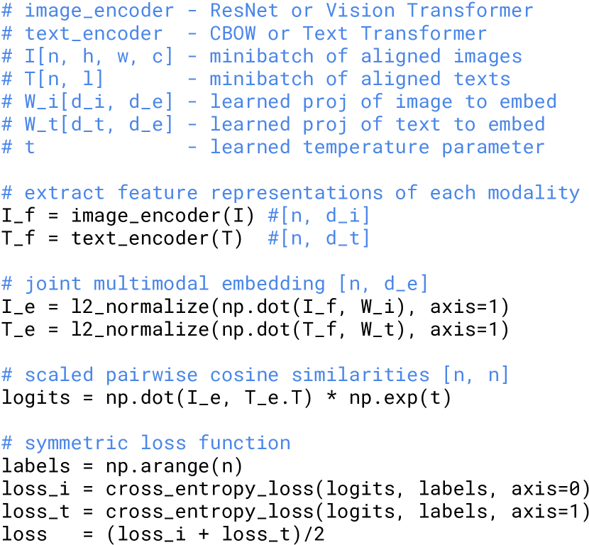

<figcaption>図3: CLIP の中核の擬似コード実装。N 個の画像とテキストの対のバッチに対して、画像エンコーダと テキストエンコーダで埋め込みを計算し、コサイン類似度の N×N 行列上で対称的なクロスエントロピー損失を計算する。</figcaption>
</figure>

### 2.4 Choosing and Scaling a Model（モデルの選択とスケーリング）

画像エンコーダには 2 つの異なるアーキテクチャを考慮する。

最初の 1 つは、その広範な採用と実証された性能のため、ResNet-50 [63] を画像エンコーダのベースアーキテクチャとして使用する。

[66] の ResNet-D 改善と [209] のアンチエイリアス rect-2 ブラープーリングを使用して、元のバージョンにいくつかの修正を加える。

グローバル平均プーリング層も**注意プーリングメカニズム**に置き換える。

注意プーリングは、クエリが画像のグローバル平均プーリング表現に条件付けられた「transformer スタイル」の多頭 QKV 注意の単一層として実装される。

2 つ目のアーキテクチャでは、最近導入された Vision Transformer（ViT）[40] で実験する。

その実装を密接に追従し、transformer の前の結合されたパッチと位置埋め込みに追加のレイヤ正規化を加えるという小さな修正のみを行い、わずかに異なる初期化スキームを使用する。

テキストエンコーダは、[154] で記述されたアーキテクチャ修正を伴う **Transformer** [188] である。

ベースサイズとして、8 注意ヘッドを持つ 6300 万パラメータ 12 層 512 幅モデルを使用する。

transformer は語彙サイズ 49,152 の **byte pair encoding（BPE）** 表現の小文字テキスト上で動作する [163]。

計算効率のため、最大系列長は 76 に制限された。

テキスト系列は `[SOS]` と `[EOS]` トークンで囲まれ、`[EOS]` トークンでの transformer の最高層の活性値がテキストの特徴表現として扱われ、層正規化された後マルチモーダル埋め込み空間に線形射影される。

マスク自己注意がテキストエンコーダで使用され、事前学習済み言語モデルでの初期化や、言語モデリングを補助目的として追加する能力を保持するが、その探索は将来の研究として残す。

先行のコンピュータビジョン研究はしばしば幅 [122] または深さ [63] を単独で増加させることでモデルをスケールしたが、ResNet 画像エンコーダについては、追加計算を幅・深さ・解像度のすべてに割り当てることが、モデルの 1 次元のみに割り当てるよりも優れていることを発見した [180] のアプローチを適応する。

[180] が EfficientNet アーキテクチャに対して各次元に割り当てる計算の比率を調整するのに対し、われわれは追加計算をモデルの幅・深さ・解像度の増加に等しく割り当てる単純なベースラインを使用する。

テキストエンコーダについては、CLIP の性能はテキストエンコーダの容量にあまり敏感でないことを発見したため、モデルの幅のみを計算された ResNet の幅の増加に比例するようスケールし、深さは全くスケールしない。

### 2.5 Training（訓練）

5 つの ResNet と 3 つの Vision Transformer の系列を訓練する。

ResNet については、ResNet-50、ResNet-101、それからさらに 3 つを EfficientNet スタイルのモデルスケーリングに従って訓練し、ResNet-50 のおよそ 4x、16x、64x の計算を使用する。

それらは **RN50x4**, **RN50x16**, **RN50x64** とそれぞれ表記される。

Vision Transformer については、**ViT-B/32**, **ViT-B/16**, **ViT-L/14** を訓練する。

すべてのモデルを 32 エポック訓練する。

Adam optimizer [91] を使用し、ゲインやバイアスでないすべての重みに decoupled weight decay 正則化 [118] を適用し、コサインスケジュール [117] で学習率を減衰させる。

初期ハイパーパラメータは、1 エポック訓練したベースライン ResNet-50 モデルでグリッドサーチ、ランダムサーチ、手動チューニングの組み合わせを用いて設定された。

ハイパーパラメータは計算上の制約のため、より大きなモデルではヒューリスティックに適応された。

学習可能な温度パラメータ $\tau$ は [200] からの 0.07 と同等の値で初期化され、ロジットを 100 倍以上スケーリングすることを防ぐためにクリップされた、これは訓練の不安定性を防ぐために必要であった。

非常に大きなミニバッチサイズ **32,768** を使用する。

訓練を加速しメモリを節約するために mixed-precision [125] を使用した。

追加のメモリ節約のために、勾配チェックポインティング [55, 21]、半精度 Adam 統計 [37]、半精度確率的丸めテキストエンコーダ重みが使用された。

埋め込み類似度の計算もシャーディングされ、個々の GPU がローカルバッチの埋め込みに必要なペアワイズ類似度のサブセットのみを計算した。

最大の ResNet モデル RN50x64 は 592 V100 GPU で 18 日かかり、最大の Vision Transformer は 256 V100 GPU で 12 日かかった。

ViT-L/14 については、FixRes [186] と類似して、性能向上のため 336 ピクセル解像度で 1 追加エポック事前学習する。

このモデルを **ViT-L/14@336px** と表記する。

特に指定しない限り、本論文で「CLIP」として報告されるすべての結果は、最良の性能を発揮することがわかったこのモデルを使用する。

---

## 3 Experiments（実験）

### 3.1 Zero-Shot Transfer（ゼロショット転移）

#### 3.1.1 Motivation（動機）

コンピュータビジョンにおいて、**ゼロショット学習**は通常、画像分類で未見の物体カテゴリへの汎化を指す [101]。

代わりに、より広い意味でこの用語を使用し、未見のデータセットへの汎化を研究する。

[102] のゼロデータ学習論文で熱望されたように、未見のタスクを実行する代理としてこれを動機付ける。

教師なし学習の分野の研究の多くが機械学習システムの表現学習能力に焦点を当てるが、われわれは機械学習システムの**タスク学習能力**を測定する方法としてゼロショット転移を研究することを動機付ける。

この見方では、データセットは特定の分布上のタスクでの性能を評価する。

しかしながら、多くの人気のあるコンピュータビジョンデータセットは、特定タスクでの性能を測定するためではなく、汎用画像分類手法の開発を導くベンチマークとして研究コミュニティによって主に作成された。

SVHN データセットが Google Street View 写真の分布上で街路番号転写のタスクを測定すると言うのは合理的だが、CIFAR-10 データセットが測定する「実際の」タスクが何かは不明である。

しかしながら、CIFAR-10 が引き出されている分布が何かは明確である ― TinyImages [185]。

この種のデータセットでは、ゼロショット転移はタスク汎化というより、CLIP の分布シフトとドメイン汎化への頑健性の評価である。

これに焦点を当てた分析については §3.3 を参照されたい。

われわれの知る限り、Visual N-Grams [107] が、上記の方法で既存の画像分類データセットへのゼロショット転移を最初に研究した。

汎用的に事前学習されたモデルを使用して標準的な画像分類データセットへのゼロショット転移を研究した唯一の他の研究でもあり、CLIP の性能を文脈化するための最良の参照点として機能する。

#### 3.1.2 Using CLIP for Zero-Shot Transfer（ゼロショット転移のための CLIP の使用）

CLIP は、画像とテキストスニペットがそのデータセットで対になっているかどうかを予測するように事前学習されている。

ゼロショット分類を実行するため、この能力を再利用する。

各データセットについて、データセット内のすべてのクラスの名前を可能なテキストペアリングの集合として使用し、CLIP に従って最も確率の高い（画像, テキスト）ペアを予測する。

もう少し詳細に言うと、まずそれぞれのエンコーダで画像の特徴埋め込みと可能なテキストの集合の特徴埋め込みを計算する。

これらの埋め込みのコサイン類似度が次に計算され、温度パラメータ $\tau$ でスケーリングされ、ソフトマックスを介して確率分布に正規化される。

この予測層は、L2 正規化された入力、L2 正規化された重み、バイアスなし、温度スケーリングを持つ多項ロジスティック回帰分類器であることに注意。

このように解釈すると、画像エンコーダは画像の特徴表現を計算するコンピュータビジョンバックボーンで、テキストエンコーダはクラスが表す視覚的概念を指定するテキストに基づいて線形分類器の重みを生成する**ハイパーネットワーク** [57] である。

#### 3.1.3 Initial Comparison to Visual N-Grams（Visual N-Grams との初期比較）

| | aYahoo | ImageNet | SUN |
| --- | --- | --- | --- |
| Visual N-Grams | 72.4 | 11.5 | 23.0 |
| **CLIP** | **98.4** | **76.2** | **58.5** |

**表1**: 先行ゼロショット転移画像分類結果との CLIP の比較。CLIP は 3 つのデータセットすべてで性能を大幅に改善する。

表 1 で Visual N-Grams を CLIP と比較する。

最良の CLIP モデルは、このデータセットで利用可能な 128 万のクラウドラベル付き訓練例を 1 つも使用しないにもかかわらず、ImageNet での精度を概念実証の 11.5% から **76.2%** に改善し、元の ResNet-50 の性能と一致する。

加えて、CLIP モデルの top-5 精度はその top-1 よりも顕著に高く、このモデルは Inception-V4 [178] と一致する 95% の top-5 精度を持つ。

ゼロショット設定で強力な完全教師ありベースラインの性能と一致する能力は、CLIP が柔軟で実用的なゼロショットコンピュータビジョン分類器に向けた有意な一歩であることを示唆する。

#### 3.1.4 Prompt Engineering and Ensembling（プロンプトエンジニアリングとアンサンブル）

<figure>

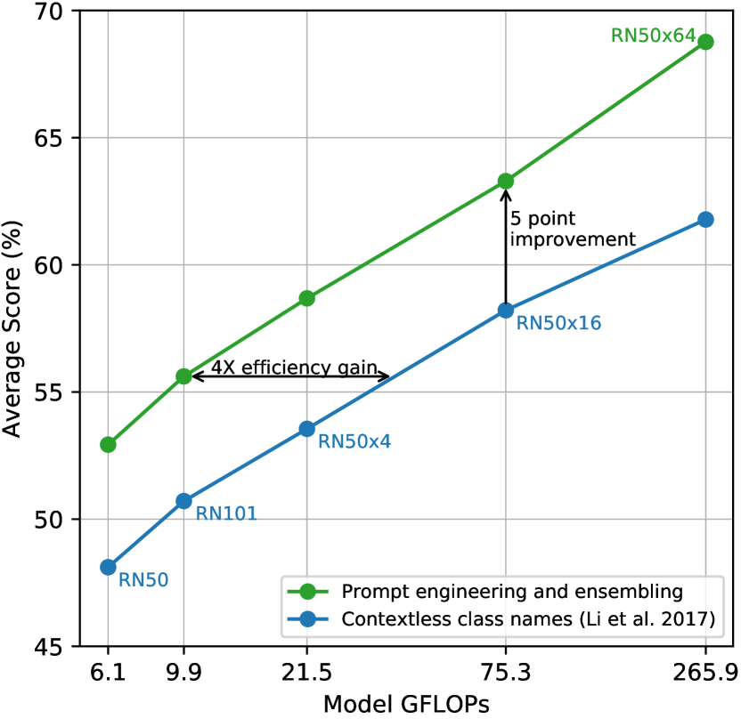

<figcaption>図4: プロンプトエンジニアリングとアンサンブルは、ImageNet 精度を約 5% 改善する。ベースラインのコンテキストなしクラス名のみのアプローチと比較。</figcaption>
</figure>

ほとんどの標準的な画像分類データセットは、自然言語ベースのゼロショット転移を可能にするクラスの命名や記述の情報を後付けとして扱う。

データセットの圧倒的多数は、画像にラベルの数値 ID のみで注釈を付け、これらの ID を英語の名前に戻すマッピングのファイルを含む。

Flowers102 や GTSRB のような一部のデータセットは、リリースされたバージョンにこのマッピングを全く含んでいないように見え、ゼロショット転移を完全に妨げる。

多くのデータセットで、これらのラベルは多少手当たり次第に選ばれており、タスクの記述に依拠してうまく転移するゼロショット転移に関連する問題を予期していないことを観察した。

一般的な問題は**多義性**である。

クラス名が CLIP のテキストエンコーダに提供される唯一の情報である場合、文脈の欠如のため、どの語義が意図されているかを区別できない。

場合によっては、同じ単語の複数の意味が同じデータセット内で異なるクラスとして含まれていることもある！

これは、建設用クレーンと飛ぶ鶴の両方を含む ImageNet で起こる。

別の例は Oxford-IIIT Pet データセットのクラスで見つかる。そこでは「boxer」という単語が文脈から明らかに犬種を指しているが、文脈を欠くテキストエンコーダにとっては運動選手の一種を指す可能性も同様にある。

遭遇したもう 1 つの問題は、事前学習データセットで画像と組になっているテキストが単一の単語であることは比較的稀である、ということである。

通常、テキストは何らかの方法で画像を記述する完全な文である。

この分布のギャップを埋めるのを助けるため、**プロンプトテンプレート「A photo of a {label}.」** をよい既定として使用することが、テキストが画像の内容に関するものであることを指定するのに役立つことを発見した。

これは、ラベルテキストのみを使用するベースラインよりも性能を改善することが多い。

例えば、このプロンプトを使うだけで ImageNet の精度が 1.3% 改善される。

GPT-3 [15, 46] 周辺の「プロンプトエンジニアリング」の議論と類似して、ゼロショット性能が各タスクに対してプロンプトテキストをカスタマイズすることで有意に改善できることも観察した。

複数のゼロショット分類器の**アンサンブル**を性能改善の別の方法として実験した。

これらの分類器は「A photo of a big {label}」や「A photo of a small {label}」のような異なるコンテキストプロンプトを使用して計算される。

ImageNet では 80 個の異なるコンテキストプロンプトをアンサンブルし、これにより上記で議論された単一の既定プロンプトに対してさらに 3.5% 性能が改善される。

プロンプトエンジニアリングとアンサンブルを合わせると、ImageNet 精度がほぼ 5% 改善される。

#### 3.1.5 Analysis of Zero-Shot CLIP Performance（ゼロショット CLIP 性能の分析）

<figure>

<figcaption>図5: 27 データセットでゼロショット CLIP と ResNet-50 線形分類器（完全教師あり）の比較。CLIP は 27 のうち 16 のデータセットで勝利。</figcaption>
</figure>

タスク非依存ゼロショット分類器がコンピュータビジョンで未研究であるため、CLIP はこの種のモデルのよりよい理解を得る有望な機会を提供する。

第一の質問として、ゼロショット分類器がどれほどよく機能するかを単純に見る。

これを文脈化するため、単純な off-the-shelf ベースラインの性能と比較する: ResNet-50 の正準的特徴量に完全教師あり、正則化されたロジスティック回帰分類器を当てはめる。

図 5 では、27 データセットにわたるこの比較を示す。

ゼロショット CLIP はこのベースラインに対し、過半数を少し上回る回数勝利し、27 データセットのうち 16 で勝つ。

個々のデータセットを見るといくつかの興味深い挙動が明らかになる。

細粒度分類タスクでは、性能に幅広いばらつきを観察する。

これらのデータセットの 2 つ、Stanford Cars と Food101 では、ゼロショット CLIP が ResNet-50 特徴量上のロジスティック回帰を 20% 以上上回るが、他の 2 つ、Flowers102 と FGVCAircraft では、ゼロショット CLIP は 10% 以上下回る。

これらの違いは主に WIT と ImageNet 間の各タスクあたりの教師信号量の違いによると推測する。

ImageNet、CIFAR10/100、STL10、PascalVOC2007 のような「一般的な」物体分類データセットでは、ゼロショット CLIP がすべてのケースでわずかな優位を持って、性能は比較的類似している。

STL10 では、CLIP は訓練例を使用しないにもかかわらず、新しい最先端であるように見える 99.3% を達成する。

ゼロショット CLIP は動画での行動認識を測定する 2 つのデータセットで ResNet-50 を有意に上回る。

Kinetics700 では、CLIP は ResNet-50 を 14.5% 上回る。

ゼロショット CLIP はまた UCF101 で ResNet-50 の特徴量を 7.7% 上回る。

ImageNet の名詞中心の物体教師信号と比較して、自然言語が動詞を含む視覚的概念により広い教師信号を提供するためだと推測する。

ゼロショット CLIP が顕著に劣る場所を見ると、衛星画像分類（EuroSAT と RESISC45）、リンパ節腫瘍検出（PatchCamelyon）、合成シーンの物体を数える（CLEVRCounts）、ドイツ交通標識認識（GTSRB）、最も近い車までの距離認識（KITTI Distance）のような自動運転関連タスクなど、いくつかの専門的、複雑、または抽象的タスクでゼロショット CLIP が非常に弱いことがわかる。

これらの結果は、より複雑なタスクでのゼロショット CLIP の貧弱な能力を強調する。

<figure>

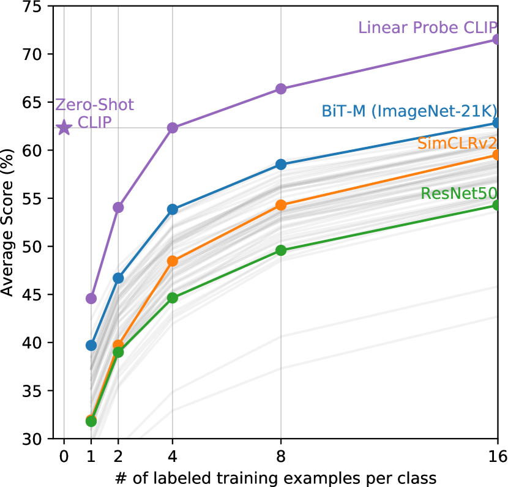

<figcaption>図6: ゼロショット CLIP は 4-shot 線形分類器（同じ特徴量空間上）の性能と一致する。多くの画像モデルの特徴量上の few-shot ロジスティック回帰と比較。</figcaption>
</figure>

ゼロショット性能を完全教師ありモデルと比較することが CLIP のタスク学習能力を文脈化する一方、few-shot 手法との比較はより直接的な比較である。なぜなら、ゼロショットはその極限だからである。

図 6 では、ゼロショット CLIP を、公開された最良の ImageNet モデル、自己教師あり学習手法、CLIP 自体を含む多くの画像モデルの特徴量上の few-shot ロジスティック回帰と比較する。

ゼロショットが one-shot を下回ることを直観的に期待するが、代わりにゼロショット CLIP が同じ特徴量空間上の **4-shot ロジスティック回帰の性能と一致する**ことを発見する。

これは、ゼロショットアプローチと few-shot アプローチの間の重要な違いによる可能性が高い。

CLIP のゼロショット分類器は自然言語を介して生成され、視覚的概念を直接「コミュニケート」できる。

対照的に、「通常の」教師あり学習は訓練例から概念を間接的に推論しなければならない。

コンテキストレスな例ベース学習には、特に one-shot の場合、多くの異なる仮説がデータと一貫し得るという欠点がある。

<figure>

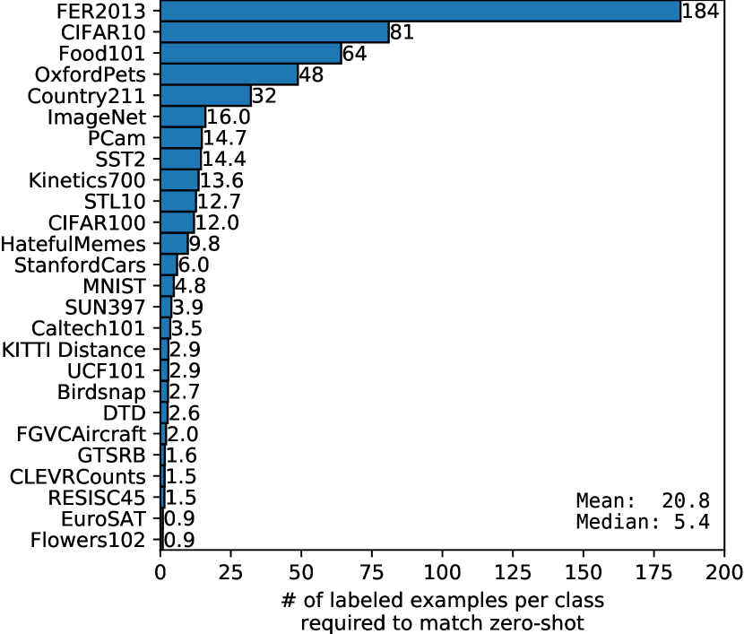

<figcaption>図7: ゼロショット CLIP の性能と一致する完全教師あり線形分類器が必要とするクラスあたりのラベル付き例の数。データ効率はデータセット間で大きく異なる。</figcaption>
</figure>

<figure>

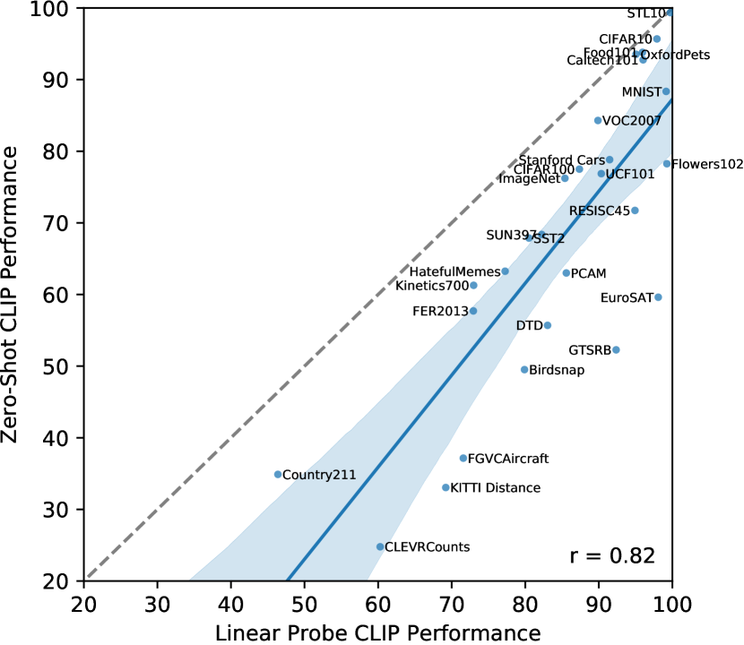

<figcaption>図8: ゼロショット CLIP と完全教師あり線形分類器の比較。ほとんどのデータセットで、ゼロショット分類器は完全教師ありを 10-25% 下回り、CLIP のタスク学習能力にまだ改善の余地があることを示す。</figcaption>
</figure>

評価データセットが線形分類器のパラメータがよく推定されるほど大きいと仮定すれば、CLIP のゼロショット分類器も線形分類器であるため、完全教師あり分類器の性能はゼロショット転移が達成できることの上限をほぼ設定する。

図 8 では、データセット全体での CLIP のゼロショット性能を完全教師あり線形分類器と比較する。

ほとんどのデータセットで、ゼロショット分類器の性能はまだ完全教師あり分類器を 10% から 25% 下回り、CLIP のタスク学習とゼロショット転移能力を改善する余地がまだ多くあることを示唆する。

<figure>

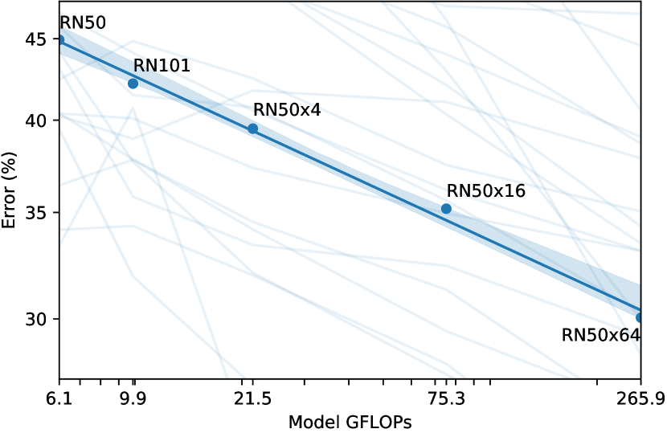

<figcaption>図9: ゼロショット CLIP の性能は計算量に対してログ・ログ線形にスケールする。GPT ファミリーと類似のスケーリング挙動。</figcaption>
</figure>

過去数年間、深層学習システムの経験的研究は、性能が訓練計算量やデータセットサイズのような重要な量の関数として予測可能であることを文書化してきた [75, 87]。

GPT ファミリーモデルは、これまで訓練計算量の 1000 倍の増加にわたってゼロショット性能の一貫した改善を実証してきた。

図 9 では、CLIP のゼロショット性能が類似のスケーリングパターンに従うかをチェックする。

36 の異なるデータセットでの 39 評価にまたがる 5 つの ResNet CLIP モデルの平均誤差率をプロットし、CLIP がモデル計算量の 44 倍の増加にわたって類似の log-log 線形スケーリング傾向に従うことを発見する。

### 3.2 Representation Learning（表現学習）

<figure>

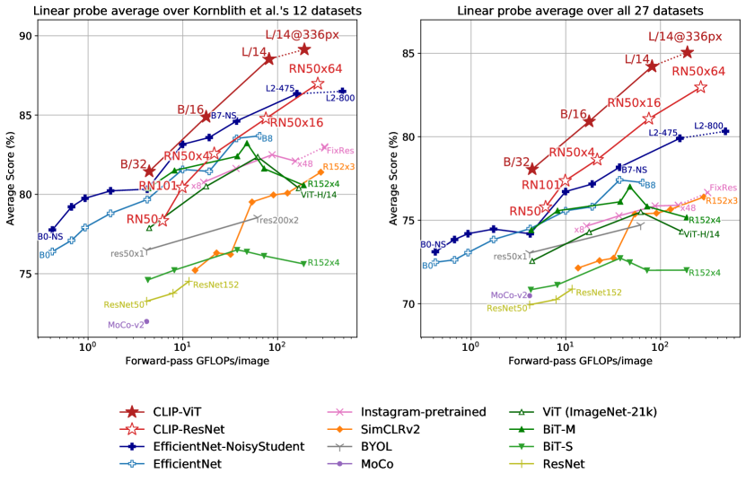

<figcaption>図10: CLIP の線形プローブ性能と最先端コンピュータビジョンモデルの比較。CLIP は計算効率が良く、最大モデルは EfficientNet L2 を上回る。</figcaption>
</figure>

前のセクションでゼロショット転移を通じて CLIP のタスク学習能力を広範に分析したが、モデルの**表現学習能力**を研究することはより一般的である。

表現の品質を評価する多くの方法と、「理想的な」表現がどんな特性を持つべきかについての不一致がある [116]。

モデルから抽出された表現に線形分類器を当てはめ、さまざまなデータセットでその性能を測定することは一般的なアプローチである。

代替は、モデルのエンドツーエンドファインチューニングの性能を測定することである。

これは柔軟性を増し、先行研究は、ほとんどの画像分類データセットでファインチューニングが線形分類を上回ることを説得力のある形で実証してきた [95, 208]。

ファインチューニングの高性能がその研究を実用的理由で動機付けるが、われわれはいくつかの理由で依然として線形分類器ベース評価を選択する。

われわれの研究は、高性能なタスク・データセット非依存事前学習アプローチの開発に焦点を当てている。

ファインチューニングは、ファインチューニング段階で各データセットに表現を適応させるため、事前学習段階での一般的で頑健な表現の学習の失敗を補い、潜在的に隠蔽できる。

線形分類器は、その制限された柔軟性のため、代わりにこれらの失敗を強調し、開発中に明確なフィードバックを提供する。

CLIP については、教師あり線形分類器の訓練が、ゼロショット分類器に使用されるアプローチに非常に類似しているという追加の利点を持ち、§3.1 での広範な比較と分析を可能にする。

図 10 はわれわれの発見を要約する。

[95] の 12 データセット評価スイートで性能を最初に研究する。

ResNet-50 や ResNet-101 のような小さな CLIP モデルは ImageNet-1K で訓練された他の ResNet（BiT-S と元のもの）を上回るが、ImageNet-21K で訓練された ResNet（BiT-M）を下回る。

これらの小さな CLIP モデルは、類似の計算要件を持つ EfficientNet ファミリーのモデルも下回る。

しかしながら、CLIP で訓練されたモデルは非常にスケールし、われわれが訓練した最大のモデル（ResNet-50x64）は、全体スコアと計算効率の両方で最良の既存モデル（Noisy Student EfficientNet-L2）をわずかに上回る。

CLIP vision transformer は CLIP ResNet よりも約 3 倍計算効率が良いことも発見し、これはわれわれの計算予算内で全体的により高い性能に達することを可能にする。

最良の全体モデルは、われわれのデータセットで 1 追加エポックで 336 ピクセルのより高い解像度でファインチューニングされた **ViT-L/14** である。

このモデルは、この評価スイートで最良の既存モデルを平均 2.6% 上回る。

<figure>

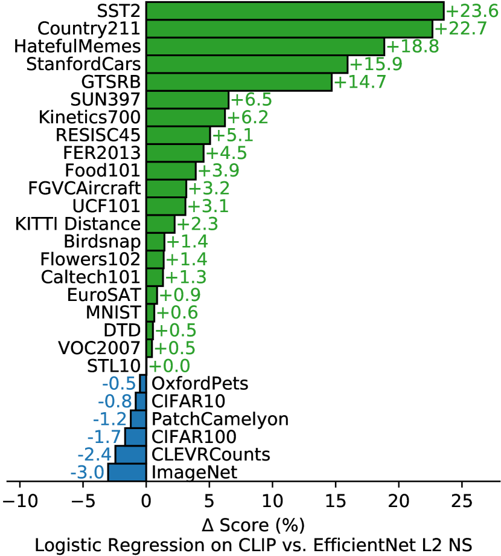

<figcaption>図11: 個々のデータセットでの CLIP と Noisy Student EfficientNet-L2 の性能差。CLIP は OCR、地理位置特定、動画行動認識、細粒度車・交通標識認識で大きく上回る。</figcaption>
</figure>

<figure>

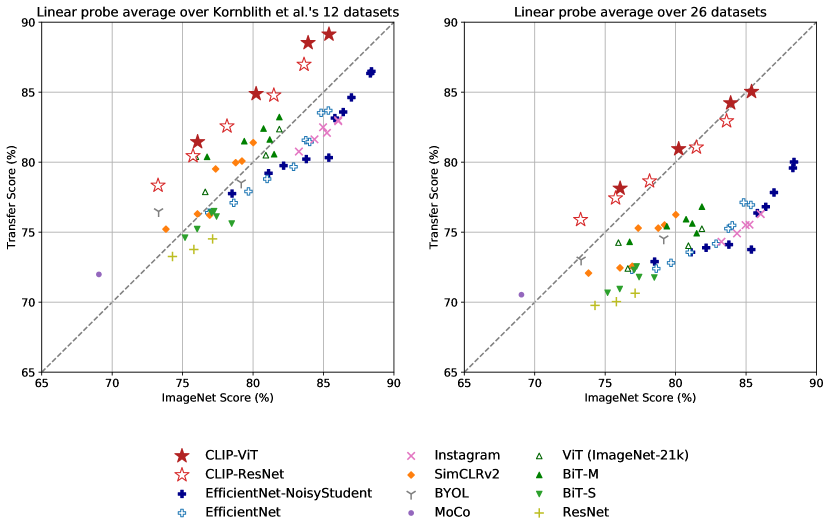

<figcaption>図12: CLIP の特徴量は、類似の ImageNet 性能を持つ他のモデルと比較してタスクシフトに対してより頑健。ImageNet で事前学習されたモデルの表現がそのタスクに多少過学習していることを示唆する。</figcaption>
</figure>

このより広い評価スイートでは、CLIP の利益はより明確である。

すべての CLIP モデルが、スケールに関わらず、計算効率の点で評価したすべてのシステムを上回る。

先行システムに対する最良モデルの平均スコアの改善は 2.6% から 5% に増加する。

自己教師ありシステムがわれわれのより広い評価スイートで顕著によく機能することも発見する。

例えば、SimCLRv2 は依然として平均で 12 データセットで BiT-M を下回るが、われわれの 27 データセット評価スイートでは BiT-M を上回る。

これらの発見は、システムの「一般的」性能をよりよく理解するために、タスクの多様性とカバレッジを拡大し続けることを示唆する。

### 3.3 Robustness to Natural Distribution Shift（自然分布シフトに対する頑健性）

<figure>

<figcaption>図13: ゼロショット CLIP は標準 ImageNet モデルよりも分布シフトに対してはるかに頑健。「robustness gap」を最大 75% 縮小する。</figcaption>
</figure>

2015 年に、深層学習モデルが ImageNet テストセットで人間のパフォーマンスを上回ることが発表された [62]。

しかしながら、その後数年の研究は、これらのモデルが依然として多くの単純な間違いをすることを繰り返し発見し [39, 49, 3]、これらのシステムをテストする新しいベンチマークは、しばしばその性能が ImageNet 精度と人間の精度の両方よりもはるかに低いことを発見した [159, 7]。

この不一致は何を説明するか？

[181] は ImageNet モデルのこの挙動を定量化・理解するための最近の包括的研究である。

[181] は、ImageNet モデルの性能が自然分布シフトで評価されたときにどう変化するかを研究する。

彼らは 7 つの分布シフトのセットで性能を測定する: ImageNetV2 [159], ImageNet Sketch [193], Youtube-BB と ImageNet-Vid [164], ObjectNet [7], ImageNet Adversarial [72], ImageNet Rendition [73]。

これらのデータセットすべてで、ImageNet モデルの精度は ImageNet 検証セットによって設定された期待を大きく下回る。

ResNet-101 は、これらの自然分布シフトで評価されたとき、ImageNet 検証セットと比較して 5 倍多くの間違いをする。

[181] は、分布シフト下の精度が ImageNet 精度とともに予測可能に増加し、logit 変換された精度の線形関数としてよくモデル化されることを発見する。

[181] はこの発見を使って、頑健性分析が**有効頑健性**（effective robustness）と**相対頑健性**（relative robustness）を区別すべきだと提案する。

有効頑健性は、in-distribution と out-of-distribution 精度の間の文書化された関係によって予測されるものを超えた、分布シフト下の精度の改善を測定する。

相対頑健性は、out-of-distribution 精度の任意の改善を捉える。

[181] で研究されたほとんどすべてのモデルは ImageNet データセットで訓練またはファインチューニングされている。

直観的に、ゼロショットモデルは特定の分布で訓練されていないため、その分布のみで成立する偽の相関やパターンを利用できないはずである。

したがって、ゼロショットモデルがはるかに高い有効頑健性を持つことを期待するのは合理的である。

図 13 では、ゼロショット CLIP の性能を自然分布シフトで既存の ImageNet モデルと比較する。

すべてのゼロショット CLIP モデルが、有効頑健性を大幅に改善し、ImageNet 精度と分布シフト下の精度の間のギャップのサイズを**最大 75%** 削減する。

<figure>

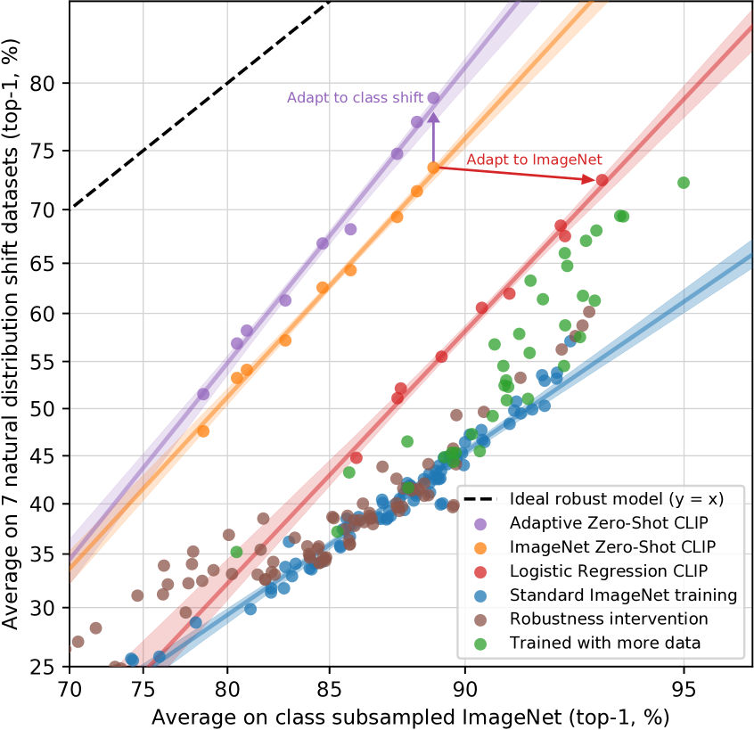

<figcaption>図14: ImageNet への教師あり適応は ImageNet 精度を 9.2% 増加させるが、平均頑健性をわずかに減少させる。CLIP をデータセット固有にカスタマイズすることは頑健性を改善する。</figcaption>
</figure>

これらの結果はゼロショットモデルがはるかに頑健であり得ることを示すが、必ずしも ImageNet 上の教師あり学習が頑健性のギャップを引き起こすことを意味しない。

CLIP の他の詳細、例えばその大規模で多様な事前学習データセットや自然言語の教師信号の使用も、ゼロショットかファインチューンされたかに関わらず、はるかに頑健なモデルをもたらしうる。

これを潜在的に絞り込み始める初期実験として、ImageNet 訓練セット上の CLIP 特徴量に当てはめられた L2 正則化ロジスティック回帰分類器を介して ImageNet 分布に適応した後の CLIP モデルの性能の変化も測定する。

CLIP を ImageNet 分布に適応させると、その ImageNet 精度が 9.2% 増加して全体で 85.4% になり、[122] の 2018 SOTA 精度と並ぶが、分布シフト下の平均精度はわずかに減少する。

<figure>

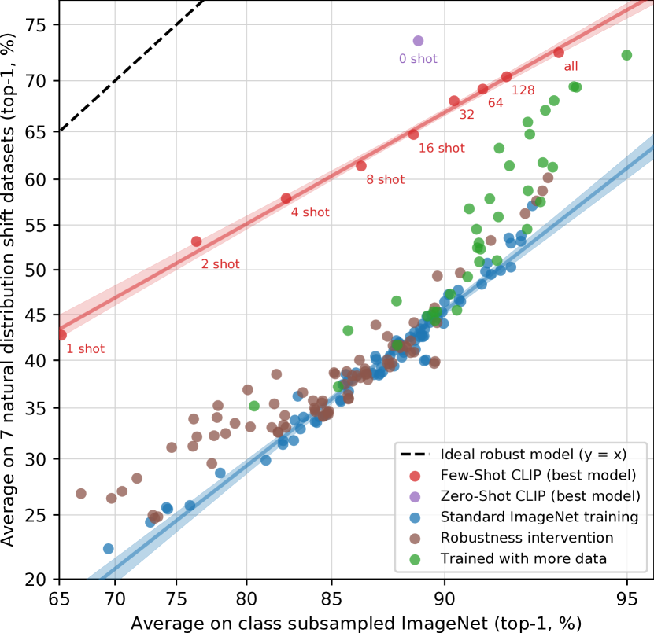

<figcaption>図15: 0-shot から完全教師ありまでの連続体で、有効頑健性は in-distribution 性能とともに減少する。ゼロショット CLIP が同等 ImageNet 性能を持つ few-shot モデルよりも顕著に頑健。</figcaption>
</figure>

これらの結果を総合すると、大規模なタスク・データセット非依存事前学習と、広範な評価スイートでのゼロショット・few-shot ベンチマーキングへの再方向付けの最近のシフトが、より頑健なシステムの開発を促進し、より正確な性能評価を提供することを示唆する。

---

## 4 Comparison to Human Performance（人間の性能との比較）

CLIP は人間の性能と人間の学習とどう比較されるか？

CLIP に類似の評価設定で人間がどれほどよく機能するかをよりよく理解するため、われわれのタスクの 1 つで人間を評価した。

これらのタスクで人間のゼロショット性能がどれほど強いか、そして 1 つまたは 2 つの画像サンプルが示された場合に人間の性能がどれほど改善されるかを感じ取りたかった。

5 人の異なる人間に Oxford IIT Pets データセット [146] のテスト分割の 3669 画像のそれぞれを見せ、37 の猫または犬の品種のうちどれが画像に最もよく一致するかを選択させた（または完全に不確実な場合は「わからない」）。

| | Accuracy | Majority Vote on Full Dataset | Accuracy on Guesses | Majority Vote on Guesses |
| --- | --- | --- | --- | --- |
| Zero-shot human | 53.7 | 57.0 | 69.7 | 63.9 |
| **Zero-shot CLIP** | **93.5** | **93.5** | **93.5** | **93.5** |
| One-shot human | 75.7 | 80.3 | 78.5 | 81.2 |
| Two-shot human | 75.7 | 85.0 | 79.2 | 86.1 |

**表2**: Oxford IIT Pets での人間の性能の比較。

興味深いことに、人間は 1 クラスあたりわずか 1 つの訓練例で 54% から 76% の性能平均に上がり、追加の訓練例からの限界利得は最小限である。

ゼロから 1 ショットへの精度の利得は、人間が不確実だった画像にほぼ完全に現れる。

これは、人間が「自分が何を知らないかを知っている」ことを示唆し、最も不確実な画像で単一の例に基づいてその事前知識を更新できる。

これを考えると、CLIP がゼロショット性能（図 5）に対する有望な訓練戦略であり、自然分布シフトのテスト（図 13）でうまく機能する一方で、人間が少数の例から学習する方法と本論文の few-shot 手法の間には大きな違いがあると思われる。

---

## 5 Data Overlap Analysis（データ重複分析）

非常に大規模なインターネットデータセットで事前学習することの懸念は、下流評価との意図しない重複である。

これを調査するため、重複の量と重複による性能の変化を文書化する。

35 のデータセットを研究したうち、9 のデータセットは検出された重複が全くない。

これらのデータセットのほとんどは合成または専門化されており、通常の画像としてインターネットに投稿される可能性が低い（例: MNIST, CLEVR, GTSRB）または、われわれのデータセットが作成された日付以降の新規データを含むため重複がないことが保証される（ObjectNet と Hateful Memes）。

中央値の重複は 2.2%、平均重複は 3.2% である。

この小さな量の重複のため、全体の精度は 0.1% 以上シフトすることは稀で、この閾値を超えるのは 7 データセットのみである。

このうち、ボンフェローニ補正後に統計的に有意なのはわずか 2 つである。

検出された最大の改善は Birdsnap でわずか 0.6% で、これは 12.1% で 2 番目に大きな重複を持つ。

これらの結果は、大規模事前学習に関する先行研究の類似の重複分析の発見に密接に従う。

---

## 6 Limitations（限界）

CLIP には依然として多くの限界がある。

訓練分割を持つデータセットでは、ゼロショット CLIP の性能は、ResNet-50 特徴量の上の線形分類器という単純な教師ありベースラインと平均的に競合する。

これらのデータセットのほとんどで、このベースラインの性能は今や全体的な最先端を大きく下回る。

CLIP のタスク学習と転移能力を改善するために、有意な作業がまだ必要である。

§3.1 の分析は、CLIP のゼロショット性能がいくつかの種類のタスクで依然としてかなり弱いことを発見した。

タスク固有モデルと比較した場合、CLIP の性能は車のモデル、花の種、航空機の派生を区別するような細粒度分類のいくつかの種類で貧弱である。

CLIP はまた、画像内の物体の数を数えるようなより抽象的で体系的なタスクで苦闘する。

CLIP の事前学習データセットに含まれる可能性が低い新規タスク、例えば写真の最も近い車までの距離の分類では、CLIP の性能はランダムに近くなりうる。

ゼロショット CLIP は §3.3 で調査したように多くの自然画像分布によく汎化するが、CLIP にとって本当に out-of-distribution であるデータには依然として汎化が貧弱であることを観察した。

例示的な例は、付録 E で報告される OCR のタスクで起こる。

CLIP は事前学習データセットで一般的なデジタルレンダリングされたテキストでうまく機能する高品質な意味的 OCR 表現を学習する、Rendered SST2 での性能によって証明されるように。

しかしながら、CLIP は MNIST の手書き数字でわずか 88% の精度を達成する。

恥ずかしいほど単純な生ピクセル上のロジスティック回帰ベースラインがゼロショット CLIP を上回る。

意味的および近重複の最近傍検索の両方が、事前学習データセット内に MNIST 数字に似た画像がほとんどないことを検証する。

これは、CLIP が深層学習モデルの脆弱な汎化の根本的な問題にほとんど対処していないことを示唆する。

代わりに CLIP は問題を回避しようとし、そのような大きく多様なデータセットで訓練することにより、すべてのデータが事実上 in-distribution になることを願う。

CLIP は多くの種類の視覚的概念を表現できる柔軟なゼロショット分類器を生成できるが、CLIP は特定のゼロショット分類器内の概念のみから選択することに依然として制限されている。

これは、新しい出力を生成できる画像キャプションのような真に柔軟なアプローチと比較すると有意な制限である。

CLIP は深層学習のデータ効率の悪さにも対処しない。

代わりに CLIP は、何億もの訓練例にスケールできる教師信号源を使用することで補償する。

CLIP モデルの訓練中に見られたすべての画像が 1 秒に 1 つの率で提示された場合、32 訓練エポックで見られる 128 億の画像を反復するのに 405 年かかる。

CLIP は、インターネット上の画像と組になっているテキストで訓練される。

これらの画像-テキストペアはフィルタリングされておらず、キュレーションされておらず、CLIP モデルが多くの社会的バイアスを学習することにつながる。

---

## 7 Broader Impacts（広範な影響）

CLIP は任意の画像分類タスクを実行する能力により、広範な能力を持つ。

例えば、猫と犬の画像を与えて猫を分類するように頼んだり、デパートで撮影された画像を与えて万引き犯を分類するように頼んだりできる（重要な社会的含意を持つタスクで、AI が適していない可能性があるタスク）。

任意の画像分類システムと同様、CLIP の性能と目的への適合性は評価される必要があり、その広範な影響は文脈で分析される必要がある。

CLIP はまた、そのような問題を拡大し、変える能力を導入する: CLIP は、再訓練を必要とせずに、独自のカテゴリ分類を簡単に作成すること（「独自の分類器を構築する」こと）を可能にする。

この能力は、GPT-3 [15] のような他の大規模生成モデルの特徴付けで見られるものと類似の課題を導入する。

### 7.1 Bias（バイアス）

アルゴリズム的決定、訓練データ、クラスの定義と分類方法の選択（非公式に「クラス設計」と呼ぶ）はすべて、AI システムの使用によって生じる社会的バイアスと不平等に寄与し、それらを増幅できる [139, 9, 14]。

クラス設計は CLIP のようなモデルに特に関連する。なぜなら、任意の開発者がクラスを定義でき、モデルが何らかの結果を提供するからである。

| Model | Race | Gender | Age |
| --- | --- | --- | --- |
| FairFace Model | 93.7 | 94.2 | 59.7 |
| Linear Probe CLIP | **93.4** | **96.5** | **63.8** |
| Zero-Shot CLIP | 58.3 | 95.9 | 57.1 |
| Linear Probe Instagram | 90.8 | 93.2 | 54.2 |

**表3-5**: FairFace の人種・性別・年齢分類精度。CLIP（線形プローブ）は多くのカテゴリで FairFace モデルを上回るが、ゼロショット CLIP の性能はカテゴリによって変動する。

ZS CLIP モデルが FairFace データセットから 10,000 画像を分類することを要求された実験を行った。

FairFace クラスに加えて、次のクラスを追加した: 'animal', 'gorilla', 'chimpanzee', 'orangutan', 'thief', 'criminal', 'suspicious person'。

画像の 4.9%（信頼区間 4.6%-5.4%）が、われわれが使用した非人間クラスの 1 つに誤分類されたことを発見した。

これらのうち、「黒人」画像が最高の誤分類率（約 14%、信頼区間 [12.6%, 16.4%]）を持ち、他のすべての人種は 8% 未満の誤分類率であった。

0-20 歳の人々が、このカテゴリに分類される最高の割合 14% を持っていた。

男性画像の 16.5% が犯罪関連クラス（'thief', 'suspicious person', 'criminal'）に誤分類されたのに対し、女性画像は 9.8% であった。

人種をまたいだ犯罪関連用語の分類で有意な格差を発見した、これは表 6 で捕捉されている。

クラスを正しく作成すること、特に「child」カテゴリを追加することは、20 歳未満の人々を不適切なカテゴリから外す効果を持つことが分かった。

これは、クラス設計がモデルの性能と望ましくないバイアスや挙動の両方の主要な決定要因となりうることを示す。

### 7.2 Surveillance（監視）

次に、有意な社会的感受性を持つ下流タスクである監視に関連してモデルの性能を特徴付けることを試みた。

CCTV カメラからの画像の分類とゼロショット有名人識別でモデルの性能を測定する。

515 監視画像で粗粒度分類のテストを行い、top-1 精度 91.8% を達成した。

「ストレステスト」（似た選択肢を含める）では精度が 51.1% に大きく低下した。

細粒度検出ではゼロショットモデルの性能はランダムに近く貧弱であった。

CelebA データセットでの「野生で」のアイデンティティ検出もテストした。

100 可能クラスから 59.2% top-1 精度を持ったが、クラスサイズを 1k 有名人名に増加させると 43.3% に低下した。

| Model | 100 Classes | 1k Classes | 2k Classes |
| --- | --- | --- | --- |
| CLIP L/14 | 59.2 | 43.3 | 42.2 |
| CLIP RN50x64 | 56.4 | 39.5 | 38.4 |

**表8**: CelebA ゼロショット Top-1 アイデンティティ認識精度。

CLIP のような汎用視覚モデルが訓練データから「相対的にマイナーな公人」に関する情報を提供する能力を示すことは、社会的含意を持つ。

CLIP はゼロショット能力を持つため、データが少ないタスクに対して有意な利益を提供するが、CLIP の比較的魅力はそのような用途には低い。

しかしながら、CLIP は訓練データの必要性を取り除く特定の側面の使いやすさを解放する。

これは、特注のニッチな監視ユースケースを可能にし、そのようなアプリケーションを構築するためのスキル要件を下げる。

### 7.3 Future Work（将来の研究）

この予備分析は、汎用コンピュータビジョンモデルが提示する課題のいくつかを例示し、そのバイアスと影響の一端を見せることを意図している。

---

## 8 Related Work（関連研究）

書き言葉、話し言葉、手話、または他の人間の言語の任意の形式を訓練信号の一部として活用する任意のモデルは、議論の余地なく自然言語を教師信号源として使用している。

これは認めて非常に広い領域で、トピックモデル [12]、単語・文・段落ベクトル [129, 93, 103]、言語モデル [10] を含む分布意味論の分野の大部分の研究をカバーする。

CLIP は、言語以外のドメインについて学習するために自然言語を訓練信号として使用する例である。

CLIP の事前学習タスクは画像-テキスト検索を最適化する。

このような研究領域は 90 年代半ばに遡り、[133] が早期の研究を代表する。

初期の努力は予測目的に主に焦点を当てたが、時間とともに研究は、kernel Canonical Correlation Analysis やさまざまなランキング目的のような技術で結合マルチモーダル埋め込み空間を学習することにシフトした [196, 167, 77]。

その後、研究は訓練目的、転移、より表現力のあるモデルの多くの組み合わせを探求し、性能を着実に改善した [44, 169, 88, 92, 42]。

CLIP に関連するアイデアは **webly supervised learning** である。

この研究系統は、画像検索エンジンに用語をクエリし、返された画像のラベルとしてそのクエリを使用して画像データセットを構築する [43]。

最後に、CLIP は最近のビジョンと言語の結合モデル学習活動の爆発に関連する [119, 179, 26, 110, 206]。

この研究系統は、複雑な下流タスク、例えば視覚的質問応答、視覚的常識推論、マルチモーダル含意を解くために、ビジョンと言語をリッチに接続することに焦点を当てる。

これらのアプローチは、3 つ（またはそれ以上）の事前学習済みサブシステム（典型的に画像特徴量モデル、領域提案/物体検出モデル、BERT のような事前学習済みマスク言語モデル）を組み合わせる印象的に工学化されたモデルを活用する。

CLIP は対照的に自然言語の教師信号を介して**ビジョンモデルをゼロから学習する**ことに焦点を当て、結合注意モデルで 2 つのドメインを密に接続しない。

CLIP モデル内の画像とテキストドメインの間の唯一の相互作用は、**学習された結合埋め込み空間における単一のドット積**である。

---

## 9 Conclusion（結論）

タスク非依存ウェブスケール事前学習の NLP での成功を別のドメインに転移できるかを調査してきた。

この公式の採用がコンピュータビジョンの分野で類似の挙動の出現をもたらすことを発見し、この研究系統の社会的含意を議論する。

訓練目的を最適化するため、CLIP モデルは事前学習中に幅広いタスクを実行することを学習する。

このタスク学習は、自然言語プロンプティングを介して活用され、多くの既存データセットへのゼロショット転移を可能にする。

十分な規模で、このアプローチの性能はタスク固有教師ありモデルと競合でき、はるかに改善の余地はあるものの。

**Acknowledgments**: CLIP の訓練データを作成することに関与した何百万人もの人々に感謝したい。

---

## Appendix A: Linear-probe evaluation（線形プローブ評価）

### A.1 Datasets（データセット）

[95] によって導入された 12 データセットからなる、よく研究された評価スイートを使用し、より広範な分布とタスクでのモデルの性能を評価するために 15 の追加データセットを加える。

これらは MNIST, FER2013, STL-10, EuroSAT, NWPU-RESISC45, GTSRB, KITTI, PatchCamelyon, UCF101, Kinetics 700, CLEVR, Hateful Memes, ImageNet-1k を含む。

加えて、われわれは **Country211** と **Rendered SST2** という 2 つのデータセットを作成した。

Country211 データセットは視覚表現の地理位置特定能力を評価するために設計されている。

YFCC100m データセット [182] をフィルタリングして、少なくとも 300 枚の GPS 座標付き写真を持つ 211 か国（ISO-3166 国コードを持つと定義）を見つけ、各国 200 枚の訓練と 100 枚のテスト写真をサンプリングすることで、211 カテゴリのバランスのとれたデータセットを構築した。

Rendered SST2 データセットは視覚表現の光学文字認識能力を測定するために設計されている。

Stanford Sentiment Treebank データセット [168] からの文を使用し、448 × 448 解像度で白い背景に黒いテキストの画像にレンダリングした。

<figure>

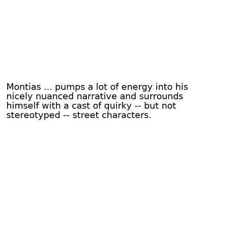

<figcaption>Rendered SST2 データセットの例画像。SST2 文がレンダリングされた画像として表される。</figcaption>
</figure>

### A.2 Models（モデル）

以下のモデル系列を線形プローブを使用して評価する: **LM RN50**（自己回帰損失を使用するマルチモーダルモデル）、**CLIP-RN**（5 つの ResNet ベース対比 CLIP モデル）、**CLIP-ViT**（ViT-B/32, ViT-B/16, ViT-L/14, ViT-L/14@336px）、**EfficientNet**（B0-B8 + Noisy Student 変種）、**Instagram-pretrained ResNeXt**（4 つの 32x*d モデル）、**Big Transfer (BiT)**（BiT-S と BiT-M）、**Vision Transformer (ViT)**（ImageNet-21k 事前学習）、**SimCLRv2**、**BYOL**、**MoCo v1/v2**、**VirTex**、**ResNet**。

### A.3 Evaluation（評価）

各モデルの最後から 2 番目の層からの画像特徴量を使用し、提供される任意の分類層を無視する。

scikit-learn の L-BFGS 実装、最大 1,000 反復を使用してロジスティック回帰分類器を訓練し、各データセットに対応する指標を報告する。

L2 正則化強度 $\lambda$ は、$10^{-6}$ と $10^{6}$ の間の範囲、96 対数間隔ステップを使用して、検証セット上のハイパーパラメータスイープを介して決定する。

### A.4 Results（結果）

最良の CLIP モデル（ViT-L/14 アーキテクチャと 336×336 ピクセル画像）は、27 データセットのうち 21 で最先端を達成した。

多くのデータセットで CLIP は他のモデルよりも有意に性能が良く、画像分類に基づく伝統的な事前学習アプローチに対する自然言語の教師信号の利点を実証する。

---

## Appendix B: Zero-Shot Prediction（ゼロショット予測）

CLIP のゼロショット性能の定性的な要約/概観を提供するため、図 21 で 36 の異なるゼロショット CLIP 分類器について、ランダムに選択された予測を可視化する。

加えて、表 22 と図 22 で各データセットの個々のゼロショット性能スコアを示す。

<figure>

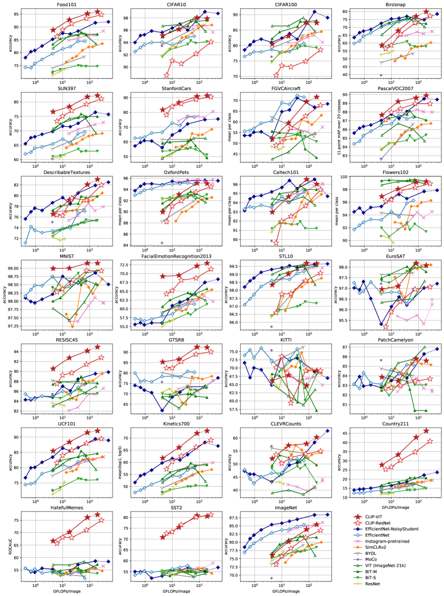

<figcaption>図21: 36 の異なるゼロショット CLIP 分類器からランダムに選択された予測例。CLIP が幅広いドメインで動作することを定性的に示す。</figcaption>
</figure>

<figure>

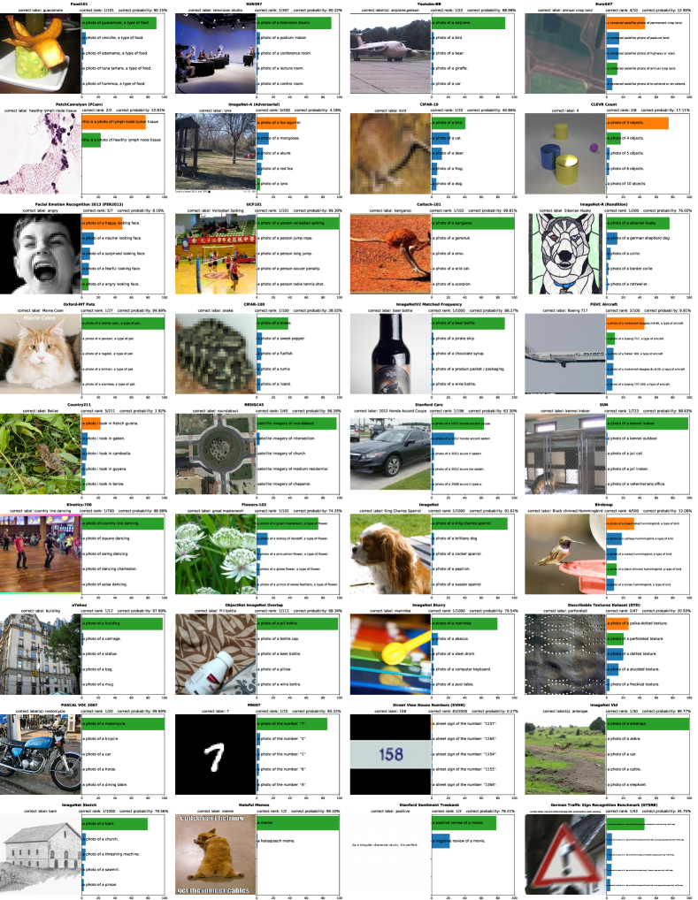

<figcaption>図22: 各データセットでの個々のゼロショット CLIP 性能。</figcaption>
</figure>

<figure>

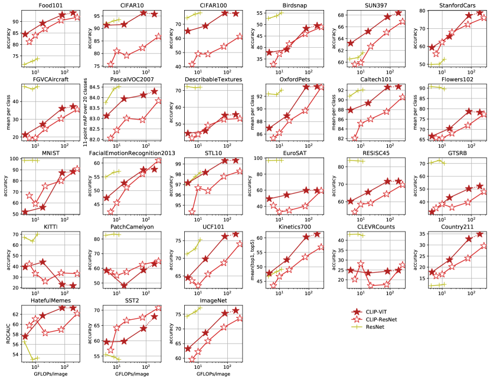

<figcaption>表11: 27 データセット上の CLIP モデルのゼロショット性能。</figcaption>
</figure>

---

## Appendix C: Duplicate Detector（重複検出器）

初期の重複検出と分析の試みは、モデルの学習された埋め込み空間内の最近傍を使用した。

モデル自身の類似性の概念を使用することは直観的だが、問題に遭遇した。

モデルの特徴量空間が意味的類似性に非常に重く重み付けされていることを発見した。

似たように記述される異なる物体（サッカーボール、同じ種の花など）がほぼ完璧な類似性を持つため、多くの偽陽性が発生した。

この問題を修正するため、われわれ自身の近重複検出器を構築した。

ランダムクロッピングとズーミング、アスペクト比歪曲、異なる解像度へのダウンサイジングとアップスケーリング、軽微な回転、JPEG 圧縮、HSV カラージッターを組み合わせた、合成データ拡張パイプラインを作成した。

次に、訓練バッチ内の他のすべての画像との類似性を最小化しつつ、画像とその変換された変種の類似性を最大化するようにモデルを訓練した。

固定温度 0.07 を持つ CLIP と同じ n-pair / InfoNCE 損失を使用した。

ResNet-50 をモデルアーキテクチャとして選択した。

事前学習データセットからサンプリングされた約 3000 万画像で、合計バッチサイズ 1,712 でモデルを訓練した。

訓練の終わりに、その代理訓練タスクでほぼ 100% の精度を達成する。

---

## Appendix D: Dataset Ablation on YFCC100M（YFCC100M でのデータセットアブレーション）

| | Linear Classifier | | | Zero Shot | | |
|---|---|---|---|---|---|---|
| Dataset | YFCC | WIT | Δ | YFCC | WIT | Δ |
| Birdsnap | 47.4 | 35.3 | +12.1 | 19.9 | 4.5 | +15.4 |
| Country211 | 23.1 | 17.3 | +5.8 | 5.2 | 5.3 | +0.1 |
| Flowers102 | 94.4 | 89.8 | +4.6 | 48.6 | 21.7 | +26.9 |
| GTSRB | 66.8 | 72.5 | -5.7 | 6.9 | 7.0 | -0.1 |
| UCF101 | 69.2 | 74.9 | -5.7 | 22.9 | 32.0 | -9.1 |
| Stanford Cars | 31.4 | 50.3 | -18.9 | 3.8 | 10.9 | -7.1 |
| ImageNet | 62.0 | 60.8 | +1.2 | 31.3 | 27.6 | +3.7 |
| Dataset Average | 65.5 | 66.6 | -1.1 | 29.6 | 30.0 | -0.4 |

**表12**: CLIP は YFCC100M のみで訓練された場合と類似の性能を発揮する。

カスタムデータセットが CLIP の性能に決定的かどうかを研究するため、YFCC100M データセットのフィルタリングされたサブセットでモデルを訓練し、その性能を同じサイズの WIT サブセットで訓練された同じモデルと比較した。

評価スイート全体で、YFCC と WIT はゼロショットと線形プローブ設定の両方で平均的に類似の性能を発揮する。

しかしながら、特定の細粒度分類データセットでの性能は、時として 10% 以上、大きく変動しうる。

これらの差異が各事前学習データセットの関連データの相対密度を反映していると推測する。

例えば、YFCC100M（鳥と花の写真が多く含まれる可能性が高い、写真家の一般的な被写体）での事前学習は Birdsnap と Flowers102 でより良い性能をもたらし、WIT での事前学習はより良い車とペット分類器（われわれのデータセットに一般的に現れる）をもたらす。

全体として、これらの結果は励みになる、なぜならわれわれのアプローチが合理的にフィルタリングされた任意の（テキスト, 画像）ペアデータコレクションを使用できることを示唆するからである。

---

## Appendix E: Selected Task and Dataset Results（選択されたタスクとデータセット結果）

### E.1 Image and Text Retrieval（画像とテキスト検索）

CLIP は、ノイズの多いウェブスケールデータセット上で画像-テキスト検索のタスクで事前学習する。

ゼロショット CLIP は Flickr30k と MSCOCO の 2 つのデータセットで以前のすべてのゼロショット結果と一致または上回る。

ゼロショット CLIP は Flickr30k でのテキスト検索のタスクに対する現在の全体的な SOTA とも競合する。

### E.2 Optical Character Recognition（光学文字認識）

CLIP の OCR 性能は、ドメイン（レンダリングされたまたは自然画像）と認識されるテキストのタイプ（数字または単語）のいくつかの組み合わせに依然として高度に変動し、敏感に見える。

CLIP の OCR 性能は Hateful Memes と SST-2 で最も強い、これはテキストがデジタルレンダリングされ、主に単語からなるデータセットである。

CLIP の 51% 精度の完全数字 SVHN はあらゆる公開結果を大きく下回る。

| | MNIST | SVHN | IIIT5K | Hateful Memes | SST-2 |
|---|---|---|---|---|---|
| Finetune SOTA | 99.8 | 96.4 | 98.9 | 78.0 | 97.5 |
| Linear CLIP | 99.2 | - | - | 77.3 | 80.5 |
| **Zero-Shot CLIP** | **88.4** | 51.0 | 90.0 | 63.3 | 67.9 |

### E.3 Action Recognition in Videos（動画での行動認識）

学習にとって、自然言語の潜在的に重要な側面は、極めて広範な概念の集合を表現する能力である。

ImageNet-1K のラベルが共通名詞のみであるのに対し、CLIP モデルは、ほぼ任意のテキストと画像を組み合わせるように訓練されているため、共通名詞と固有名詞、動詞、形容詞の両方を含む幅広い視覚的概念の教師信号を受ける可能性が高い。

ImageNet モデルの広い教師信号の欠如は、名詞ではない視覚的概念の認識を含むタスクへの ImageNet モデルのより弱い転移につながるか？

調査するため、CLIP と ImageNet モデルの性能を、動詞を認識するモデルの能力を測定するいくつかの動画行動分類データセットで測定し比較する。

| | UCF101 Top-1 | K700 AVG | RareAct mWAP | RareAct mWSAP |
|---|---|---|---|---|
| Linear CLIP | 92.0 | 73.0 | - | - |
| **Zero-Shot CLIP** | 80.3 | 69.6 | **40.7** | **44.8** |

CLIP 特徴量はこのタスクに驚くほどうまく転移する。

CLIP は線形プローブ評価設定で UCF-101 の最良の事前結果と一致し、評価スイート内の他のすべてのモデルも上回る。

### E.4 Geolocalization（地理位置特定）

CLIP の開発中に観察したもう 1 つの挙動は、多くの場所と位置を認識する能力であった。

これを定量化するため付録 A に記述したように Country211 データセットを作成し、論文全体で結果を報告する。

| | 1km | 25km | 200km | 750km | 2500km |
|---|---|---|---|---|---|
| ISNs | 16.9 | 43.0 | 51.9 | 66.7 | 80.2 |
| CPlaNet | 16.5 | 37.1 | 46.4 | 62.0 | 78.5 |
| **CLIP** | 13.9 | 32.9 | 43.0 | 62.0 | 79.3 |

100 万画像のみをクエリすることで、CLIP はいくつかのタスク固有モデルと類似に機能する。

### E.5 Robustness to Distribution Shift（分布シフトに対する頑健性）

ゼロショット CLIP は ImageNet-R, ObjectNet, ImageNet-Sketch, ImageNet-Vid, Youtube-BB の 5 つのデータセットで最先端を改善する。

| | IN | IN-V2 | IN-A | IN-R | ObjectNet | IN-Sketch |
|---|---|---|---|---|---|---|
| NS EfficientNet-L2 | 88.3 | 80.2 | 84.9 | 74.7 | 68.5 | 47.6 |
| Linear Probe CLIP | 85.4 | 75.9 | 75.3 | 84.2 | 66.2 | 57.4 |
| **Zero-Shot CLIP** | 76.2 | 70.1 | **77.2** | **88.9** | **72.3** | **60.2** |

CLIP の改善は ImageNet-Vid と Youtube-BB で最大で、これは柔軟なゼロショット能力によるもの。

ImageNet-R での大きな改善は、CLIP の事前学習分布に有意な量の創造的コンテンツが含まれることを反映する可能性が高い。

---

## Appendix F: Model Hyperparameters（モデルハイパーパラメータ）

**表18**: 共通 CLIP ハイパーパラメータ

| Hyperparameter | Value |
| --- | --- |
| Batch size | 32768 |
| Vocabulary size | 49408 |
| Training epochs | 32 |
| Maximum temperature | 100.0 |
| Weight decay | 0.2 |
| Warm-up iterations | 2000 |
| Adam β₁ | 0.9 |
| Adam β₂ | 0.999 (ResNet), 0.98 (ViT) |
| Adam ε | 10⁻⁸ (ResNet), 10⁻⁶ (ViT) |

**表19**: CLIP-ResNet ハイパーパラメータ

| Model | LR | Embed dim | Input res | ResNet blocks | ResNet width |
| --- | --- | --- | --- | --- | --- |
| RN50 | 5×10⁻⁴ | 1024 | 224 | (3,4,6,3) | 2048 |
| RN101 | 5×10⁻⁴ | 512 | 224 | (3,4,23,3) | 2048 |
| RN50x4 | 5×10⁻⁴ | 640 | 288 | (4,6,10,6) | 2560 |
| RN50x16 | 4×10⁻⁴ | 768 | 384 | (6,8,18,8) | 3072 |
| RN50x64 | 3.6×10⁻⁴ | 1024 | 448 | (3,15,36,10) | 4096 |

**表20**: CLIP-ViT ハイパーパラメータ

| Model | LR | Embed dim | Input res | ViT layers | ViT width | ViT heads |
| --- | --- | --- | --- | --- | --- | --- |
| ViT-B/32 | 5×10⁻⁴ | 512 | 224 | 12 | 768 | 12 |
| ViT-B/16 | 5×10⁻⁴ | 512 | 224 | 12 | 768 | 12 |
| ViT-L/14 | 4×10⁻⁴ | 768 | 224 | 24 | 1024 | 16 |
| ViT-L/14-336px | 2×10⁻⁵ | 768 | 336 | 24 | 1024 | 16 |

すべてのテキストエンコーダは 12 層・8 ヘッド（B/32 以上は同じ設定）。
