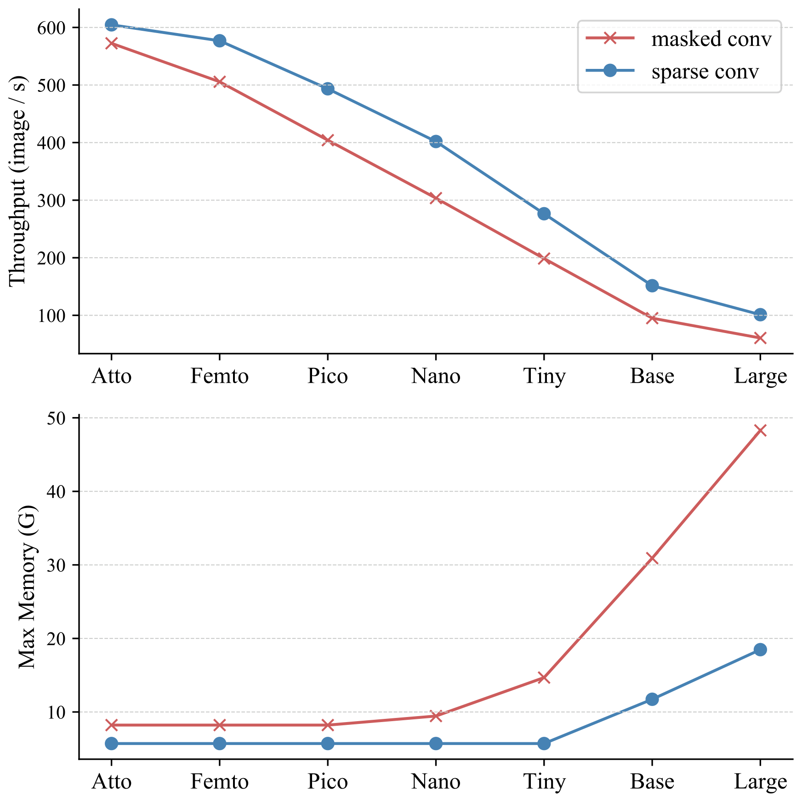
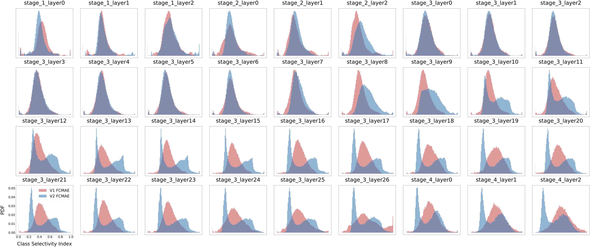
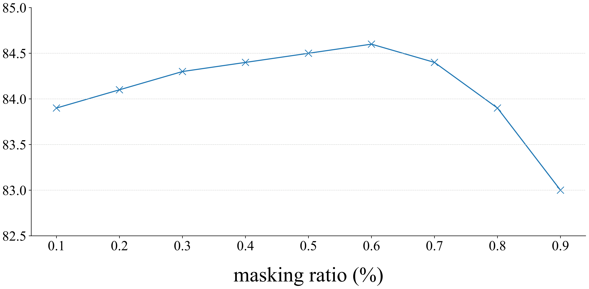

# ConvNeXt V2: マスクオートエンコーダによる ConvNet の共設計とスケーリング

> 原題: ConvNeXt V2: Co-designing and Scaling ConvNets with Masked Autoencoders
> 著者: Sanghyun Woo, Shoubhik Debnath, Ronghang Hu, Xinlei Chen, Zhuang Liu, In So Kweon, Saining Xie
> 所属: Meta AI (FAIR), New York University, KAIST
> 出典: arXiv:2301.00808 → CVPR 2023
> コード: <https://github.com/facebookresearch/ConvNeXt-V2>

> 翻訳メモ: 本翻訳は CLAUDE.md §4 の標準ルールと異なり、**Appendix A〜D も翻訳対象に含めている**（ユーザーからの個別指示による）。References と Acknowledgments は除外。原典 markdown には図 2・3・5 のみ画像が含まれていたため、残りの図（1, 4, 6, 7, 8）は arXiv ソース（arXiv:2301.00808 の e-print）に同梱された PDF から生成した。

## Abstract（要旨）

改善されたアーキテクチャとより良い表現学習の枠組みに牽引され、視覚認識の分野は 2020 年代初頭に急速な近代化と性能向上を享受してきた。例えば、ConvNeXt に代表される現代的な ConvNet は、様々な場面で強い性能を実証している。これらのモデルはもともと ImageNet のラベルを用いた教師あり学習のために設計されたものだが、マスクオートエンコーダ（MAE）のような自己教師あり学習の技法からも潜在的に恩恵を受けうる。しかし我々は、この 2 つのアプローチを単純に組み合わせると水準以下の性能しか得られないことを見出した。本論文では、完全畳み込み型のマスクオートエンコーダの枠組みと、ConvNeXt アーキテクチャに追加してチャネル間の特徴競合を強化できる新しい Global Response Normalization（GRN）層を提案する。この自己教師あり学習技法とアーキテクチャ改善の共設計（co-design）は ConvNeXt V2 と呼ぶ新しいモデルファミリーをもたらし、ImageNet 分類、COCO 検出、ADE20K セグメンテーションを含む様々な認識ベンチマークにおいて純粋 ConvNet の性能を大幅に改善する。我々はまた、ImageNet で 76.7% の top-1 精度を持つ効率的な 3.7M パラメータの Atto モデルから、公開されている訓練データのみを用いて最先端の 88.9% の精度を達成する 650M の Huge モデルまで、様々なサイズの事前学習済み ConvNeXt V2 モデルを提供する。

## 1 Introduction（はじめに）

<figure>


<figcaption>図1: ConvNeXt V2 のモデルスケーリング。我々の完全畳み込み型マスクオートエンコーダの枠組みを用いて事前学習された ConvNeXt V2 モデルは、広範なモデルサイズにわたって前バージョンよりも大幅に良い性能を発揮する。</figcaption>
</figure>

過去数十年の研究上の突破に立脚して、視覚認識の分野は大規模な視覚表現学習の新時代を迎えた。事前学習済みの大規模視覚モデルは、特徴学習と幅広い視覚応用を可能にするための本質的な道具となった。視覚表現学習システムの性能は、主に 3 つの要因に大きく影響される。すなわち、選択されたニューラルネットワークのアーキテクチャ、ネットワークの訓練に用いられる手法、そして訓練に用いられるデータである。視覚認識の分野では、これらの各領域における進歩が全体的な性能改善に寄与する。

ニューラルネットワークのアーキテクチャ設計における革新は、表現学習の分野で一貫して主要な役割を果たしてきた。畳み込みニューラルネットワークのアーキテクチャ（ConvNets）は、手作業の特徴量工学に頼るのではなく、多様な視覚認識タスクに対して汎用的な特徴学習手法を用いることを可能にすることで、コンピュータビジョン研究に大きな影響を与えてきた。近年では、もともと自然言語処理のために開発された transformer アーキテクチャも、モデルとデータセットのサイズに関する強いスケーリング挙動のために人気を得ている。より最近では、ConvNeXt アーキテクチャが伝統的な ConvNet を近代化し、純粋な畳み込みモデルもスケーラブルなアーキテクチャでありうることを実証した。しかし、ニューラルネットワークのアーキテクチャの設計空間を探索するための最も一般的な手法は、依然として ImageNet における*教師あり学習*の性能をベンチマークすることである。

これとは別の研究の流れとして、視覚表現学習の焦点は、ラベルを用いた教師あり学習から、事前タスク（pre-text objective）を用いた自己教師あり事前学習へと移行してきた。多くの異なる自己教師ありアルゴリズムの中でも、マスクオートエンコーダ（MAE）は最近、マスク言語モデリングの成功を視覚領域にもたらし、視覚表現学習の一般的なアプローチとして急速に普及した。しかし、自己教師あり学習における一般的な慣行は、教師あり学習のために設計された*あらかじめ決められた*アーキテクチャを用い、その設計を固定されたものとみなすことである。例えば MAE は vision transformer アーキテクチャを用いて開発された。

アーキテクチャの設計要素と自己教師あり学習の枠組みを組み合わせることは可能だが、ConvNeXt をマスクオートエンコーダとともに用いる場合、そうすることは課題を提示しうる。一つの問題は、MAE が transformer の系列処理能力に最適化された特有のエンコーダ・デコーダ設計を持っており、それが計算量の重いエンコーダを可視パッチに集中させ、事前学習のコストを削減することを可能にしている点である。この設計は、密なスライディングウィンドウを用いる標準的な ConvNet とは互換性がないかもしれない。加えて、アーキテクチャと訓練目的の関係が考慮されない場合、最適な性能が達成できるかどうかは不明瞭でありうる。実際、先行研究はマスクベースの自己教師あり学習で ConvNet を訓練することが困難でありうることを示しており、経験的な証拠は transformer と ConvNet が表現の質に影響しうる異なる特徴学習の振る舞いを持ちうることを示唆している。

この目的のために、我々はネットワークアーキテクチャとマスクオートエンコーダを同じ枠組みのもとで*共設計（co-design）*することを提案する。その狙いは、マスクベースの自己教師あり学習を ConvNeXt モデルに対して有効にし、transformer を用いて得られるものと同様の結果を達成することにある。

マスクオートエンコーダを設計するにあたり、我々はマスクされた入力を疎なパッチの集合として扱い、疎畳み込み（sparse convolution）を用いて可視部分のみを処理する。この発想は、大規模な 3D 点群の処理における疎畳み込みの利用に着想を得ている。実際には、ConvNeXt を疎畳み込みで実装することができ、ファインチューニング時には重みが特別な扱いを必要とせずに標準的な密な層へと変換される。事前学習の効率をさらに改善するため、我々は transformer デコーダを単一の ConvNeXt ブロックで置き換え、設計全体を完全畳み込み型にする。これらの変更については混在した結果が観察された。学習された特徴は有用でありベースラインの結果を改善するが、ファインチューニング性能は依然として transformer ベースのモデルほど良くはない。

そこで我々は ConvNeXt の異なる訓練構成について特徴空間の分析を行う。マスクされた入力で ConvNeXt を直接訓練するとき、MLP 層において特徴崩壊（feature collapse）という潜在的な問題が生じることを特定する。この問題に対処するため、我々はチャネル間の特徴競合を強化する Global Response Normalization 層を追加することを提案する。この変更はモデルがマスクオートエンコーダで事前学習されるときに最も効果的であり、教師あり学習から固定されたアーキテクチャ設計を再利用することが次善でありうることを示唆している。

要約すると、我々はマスクオートエンコーダと併用されたときに改善された性能を実証する ConvNeXt V2 を導入する。我々は、このモデルが ImageNet 分類、COCO 物体検出、ADE20K セグメンテーションを含む様々な下流タスクにわたって純粋 ConvNet の性能を大幅に改善することを見出した。ConvNeXt V2 モデルは多様な計算領域で用いることができ、様々な複雑度のモデルを含む。ImageNet で 76.7% の top-1 精度を達成する効率的な 3.7M パラメータの *Atto* モデルから、IN-22K ラベルを用いたとき最先端の 88.9% の精度に達する 650M の *Huge* モデルまでである。

## 2 Related Work（関連研究）

#### ConvNets.

1980 年代に初めて導入され誤差逆伝播法で訓練された ConvNet の設計は、長年にわたり最適化・精度・効率の面で数多くの改善を経てきた。これらの革新は主に ImageNet データセットにおける教師あり訓練を通して発見されてきた。近年では、UnNAS の場合のように、回転予測や着色といった自己教師あり事前タスクを用いてアーキテクチャ探索を行う取り組みもいくつかなされている。最近、ConvNeXt は設計空間の包括的な再検討を行い、純粋 ConvNet が、多くの応用で支配的なアーキテクチャとなった vision transformer と同程度にスケーラブルでありうることを実証した。ConvNeXt は特に、より低い複雑度を必要とする場面で優れている。自己教師あり学習によって強化された我々の ConvNeXt V2 モデルは、既存のモデルをアップグレードし、幅広い利用場面にわたって大幅な性能向上を達成する単純な方法を提供する。

#### Masked Autoencoders.

マスクオートエンコーダに代表されるマスク画像モデリングは、最新の自己教師あり学習戦略の一つである。ニューラルネットワークの事前学習の枠組みとして、マスクオートエンコーダは視覚認識に広範な影響を示してきた。しかし、元のマスクオートエンコーダは、その非対称なエンコーダ・デコーダ設計のために ConvNet に直接は適用できない。代替の枠組みはこのアプローチを ConvNet で用いるために適応させることを試みてきたが、結果はまちまちであった。MCMAE はいくつかの畳み込みブロックを入力トークナイザとして用いる。我々の知る限り、自己教師あり学習が最良の ConvNeXt 教師あり結果を改善できることを示す事前学習済みモデルは存在しない。

## 3 Fully Convolutional Masked Autoencoder（完全畳み込み型マスクオートエンコーダ）

我々のアプローチは概念的に単純であり、完全畳み込み的に動作する。学習信号は、高いマスク率で生の入力視覚情報をランダムに*マスク*し、残された文脈が与えられたときにモデルに欠損部分を*予測*させることによって生成される。我々の枠組みは図2 に示されており、以下その主要な構成要素をより詳細に説明する。

#### Masking.（マスキング）

我々はマスク率 0.6 のランダムマスキング戦略を用いる。畳み込みモデルは階層的な設計を持ち、特徴が異なる段階でダウンサンプリングされるため、マスクは最終段階で生成され、最も細かい解像度まで再帰的にアップサンプリングされる。実際にこれを実装するには、元の入力画像から $32\times 32$ のパッチの 60% をランダムに除去する。我々は最小限のデータ拡張のみを用い、ランダムリサイズクロッピングのみを含む。

#### Encoder design.（エンコーダの設計）

我々はアプローチのエンコーダとして ConvNeXt モデルを用いる。マスク画像モデリングを有効にする上での一つの課題は、モデルがマスクされた領域から情報をコピー＆ペーストできるようなショートカットを学習することを防ぐことである。これは transformer ベースのモデルでは比較的容易に防げる。エンコーダへの入力として可視パッチのみを残すことができるからである。しかし ConvNet でこれを達成するのはより難しい。2D の画像構造が保持されなければならないからである。入力側に学習可能なマスクトークンを導入するという素朴な解決策もあるが、これらのアプローチは事前学習の効率を低下させ、テスト時にはマスクトークンが存在しないため訓練時とテスト時の不整合をもたらす。これはマスク率が高いときに特に問題となる。

この問題に取り組むため、我々の新しい洞察は、3D タスクにおける疎な点群上の学習に着想を得て、マスクされた画像を「疎データの観点」から見ることである。我々の鍵となる観察は、マスクされた画像が画素の 2D 疎配列として表現できるということである。この洞察に基づけば、マスクオートエンコーダの事前学習を促進するために疎畳み込みを我々の枠組みに組み込むのは自然である。実際には、事前学習中に、エンコーダ内の標準的な畳み込み層を submanifold sparse convolution へと変換することを提案する。これによりモデルは可視データ点*のみ*で動作できるようになる。疎畳み込み層はファインチューニング段階で、追加の扱いを必要とせずに標準的な畳み込みへ戻せることに注意されたい。代替として、密な畳み込み演算の前後に二値マスク演算を適用することも可能である。この演算は数値的に疎畳み込みと同じ効果を持ち、理論的には計算量がより多いが、TPU のような AI アクセラレータではより扱いやすい場合がある。

**表1**: ImageNet-1K における ConvNeXt-Base を用いた MAE デコーダのアブレーション実験。ファインチューニング（ft）精度（%）を報告する。事前学習スケジュールは 800 エポック。デコーダ設計の探索において、実時間は JAX を用いて 256 コアの TPU-v3 pod でベンチマークされている。速度向上は UNet デコーダのベースラインに対する相対値である。本論文で採用した最終的な設計上の選択は灰色で示されている（下表では **太字**）。

(a) デコーダの種類

| dec. type | ft | hours | speedup |
| --- | --- | --- | --- |
| UNet w/ skip | 83.7 | 12.9 | – |
| UNet w/o skip | 83.5 | 12.9 | – |
| Transformer | 83.4 | 8.5 | 1.5× |
| **ConvNeXt block** | **83.7** | **7.7** | **1.7×** |

(b) ブロック数

| blocks | ft |
| --- | --- |
| **1** | **83.7** |
| 2 | 83.5 |
| 4 | 83.7 |
| 8 | 83.6 |
| 12 | 83.3 |

(c) 次元

| dim | ft |
| --- | --- |
| 128 | 83.5 |
| 256 | 83.7 |
| **512** | **83.7** |
| 768 | 83.6 |
| 1024 | 83.5 |

<figure>


<figcaption>図2: 我々の FCMAE の枠組み。我々は完全畳み込み型マスクオートエンコーダ（FCMAE）を導入する。これは疎畳み込みベースの ConvNeXt エンコーダと、軽量な ConvNeXt ブロックのデコーダから構成される。全体として、我々のオートエンコーダのアーキテクチャは非対称である。エンコーダは可視画素のみを処理し、デコーダは符号化された画素とマスクトークンを用いて画像を再構成する。損失はマスクされた領域についてのみ計算される。</figcaption>
</figure>

<figure>


<figcaption>図3: 特徴活性化の可視化。各特徴チャネルの活性化マップを小さな正方形で可視化する。明瞭さのため、各可視化では 64 チャネルを表示している。ConvNeXt V1 モデルは特徴崩壊の問題に苦しんでおり、これはチャネル間にわたる冗長な活性化（死んだ、あるいは飽和したニューロン）の存在によって特徴づけられる。この問題を修正するため、我々は訓練中に特徴の多様性を促進する新しい手法、global response normalization（GRN）層を導入する。この技法はすべてのブロックの高次元特徴に適用され、ConvNeXt V2 アーキテクチャの開発につながる。</figcaption>
</figure>

#### Decoder design.（デコーダの設計）

我々は軽量な素の ConvNeXt ブロックをデコーダとして用いる。エンコーダの方が重く階層を持つため、これは全体として非対称なエンコーダ・デコーダのアーキテクチャを形成する。我々は階層型デコーダや transformer といったより複雑なデコーダも検討したが、より単純な単一 ConvNeXt ブロックのデコーダがファインチューニング精度の点で良好に機能し、事前学習時間を大幅に削減した。これは表1 で実証されている。我々はデコーダの次元を 512 に設定する。

#### Reconstruction target.（再構成のターゲット）

我々は再構成された画像とターゲット画像の間の平均二乗誤差（MSE）を計算する。MAE と同様に、ターゲットは元の入力のパッチ単位で正規化された画像であり、損失はマスクされたパッチについてのみ適用される。

#### FCMAE.

ここで、上述の提案を組み合わせて Fully Convolutional Masked AutoEncoder（FCMAE）を提示する。この枠組みの有効性を評価するため、我々は ConvNeXt-Base モデルをエンコーダとして用い、一連のアブレーション研究を行う。本論文を通して、転移学習における実践的な関連性のため end-to-end のファインチューニング性能に焦点を当て、それを学習された表現の質の評価に用いる。

我々は ImageNet-1K（IN-1K）データセットを用いてそれぞれ 800 エポックと 100 エポックの事前学習とファインチューニングを行い、単一の 224×224 センタークロップに対する top-1 の IN-1K 検証精度を報告する。実験設定に関する追加の詳細は付録にある。

我々の FCMAE の枠組みにおける疎畳み込みの使用の影響を理解するため、まずそれがマスク画像事前学習中の学習された表現の質にどのように影響するかを調査する。我々の経験的な発見は、良い結果を達成するためには**マスクされた領域からの情報漏洩を防ぐことが本質的である**ことを示している。

| w/o Sparse conv. | w/ Sparse conv. |
| --- | --- |
| 79.3 | 83.7 |

次に、我々の自己教師ありアプローチを教師あり学習と比較する。具体的には、2 つのベースラインの実験結果を得る。すなわち、同じレシピを用いた教師あり 100 エポックのベースラインと、元の ConvNeXt 論文で提供されている 300 エポックの教師あり訓練のベースラインである。我々は FCMAE 事前学習がランダムなベースラインよりも良い初期化を提供する（*すなわち* 82.7 $\rightarrow$ 83.7）ことを見出したが、元の教師あり設定で得られる最良の性能にはまだ追いつく必要がある。

| Sup, 100ep | Sup, 300ep. | FCMAE |
| --- | --- | --- |
| 82.7 | 83.8 | 83.7 |

これは、事前学習済みモデルが教師ありの対応物を大幅に上回る、transformer ベースのモデルを用いたマスク画像モデリングの最近の成功とは対照的である。このことは、マスクオートエンコーダの事前学習中に ConvNeXt エンコーダが直面する固有の課題を調査する動機となる。これを次に議論する。

## 4 Global Response Normalization（大域応答正規化）

本節では、FCMAE の事前学習を ConvNeXt アーキテクチャと併せてより有効にするための新しい Global Response Normalization（GRN）技法を導入する。まず定性的および定量的な特徴分析を通してアプローチの動機づけを行う。

#### Feature collapse.（特徴崩壊）

学習の振る舞いへのより深い洞察を得るため、まず特徴空間における定性的な分析を行う。FCMAE で事前学習された ConvNeXt-Base モデルの活性化を可視化すると、興味深い「特徴崩壊」現象に気づく。すなわち、死んだあるいは飽和した特徴マップが多く存在し、活性化がチャネル間で冗長になる。可視化の一部を図3 に示す。この振る舞いは主に ConvNeXt ブロック内の次元拡大 MLP 層で観察された。

<figure>


<figcaption>図4: 特徴コサイン距離の分析。アーキテクチャによって総層数が異なるため、距離の値を正規化された層インデックスに対してプロットしている。ConvNeXt V1 の FCMAE 事前学習モデルが深刻な特徴崩壊の振る舞いを示すことが観察される。教師ありモデルも特徴の多様性の減少を示すが、それは最終層のみである。教師ありモデルにおけるこの多様性の減少は、モデルがクラス識別的な特徴に集中し他を抑制するよう促す交差エントロピー損失の使用によるものと思われる。</figcaption>
</figure>

#### Feature cosine distance analysis.（特徴コサイン距離の分析）

この観察を定量的にさらに検証するため、特徴コサイン距離の分析を行う。活性化テンソル $X\in R^{H\times W\times C}$ が与えられたとき、$X_{i}\in R^{H\times W}$ は $i$ 番目のチャネルの特徴マップである。これを $HW$ 次元のベクトルとして再形成し、チャネル間の平均的な対ごとのコサイン距離を $\frac{1}{C^{2}}\sum_{i}^{C}\sum_{j}^{C}\frac{1-{cos}(X_{i},X_{j})}{2}$ によって計算する。距離の値が高いほど特徴が多様であることを示し、低い値は特徴の冗長性を示す。

この分析を行うため、ImageNet-1K 検証セットの異なるクラスから 1,000 枚の画像をランダムに選択し、FCMAE モデル、ConvNeXt 教師ありモデル、MAE 事前学習済み ViT モデルを含む異なるモデルの各層から高次元特徴を抽出する。そして各画像について層ごとの距離を計算し、全画像で値を平均する。結果は図4 にプロットされている。FCMAE 事前学習済み ConvNeXt モデルは特徴崩壊への明確な傾向を示しており、これは前述の活性化可視化からの観察と一貫している。このことは、学習中に特徴を多様化し特徴崩壊を防ぐ方法を検討する動機となる。

**表2**: ConvNeXt-Base を用いた GRN のアブレーション。ImageNet-1K でのファインチューニング精度を報告する。我々の最終的な提案は灰色で示されている（下表では **太字**）。

(a) 集約関数

| case | ft |
| --- | --- |
| g.avg. | 83.7 |
| L1 | 84.3 |
| **L2** | **84.6** |

(b) 正規化関数

| case | ft |
| --- | --- |
| $(\|\|X_{i}\|\|-\mu)/\sigma$ | 84.5 |
| $1/\sum\|\|X_{i}\|\|$ | 83.8 |
| **$\|\|X_{i}\|\|/\sum\|\|X_{i}\|\|$** | **84.6** |

(c) 残差接続

| case | ft |
| --- | --- |
| w/o skip | 84.0 |
| **w/ skip** | **84.6** |

(d) 他の正規化手法との比較

| case | ft |
| --- | --- |
| Baseline | 83.7 |
| LRN | 83.2 |
| BN | 80.5 |
| LN | 83.8 |
| **GRN** | **84.6** |

(e) 特徴ゲーティング手法との比較

| case | ft | #param |
| --- | --- | --- |
| Baseline | 83.7 | 89M |
| SE | 84.4 | 109M |
| CBAM | 84.5 | 109M |
| **GRN** | **84.6** | **89M** |

(f) 事前学習／ファインチューニングでの役割

| case | ft |
| --- | --- |
| Baseline | 83.7 |
| drop at ft. | 78.8 |
| add at ft. | 80.6 |
| **both** | **84.6** |

#### Approach.（アプローチ）

脳にはニューロンの多様性を促進する多くの機構が存在する。例えば側方抑制（lateral inhibition）は、活性化したニューロンの応答を鋭敏化し、刺激に対する個々のニューロンのコントラストと選択性を高めると同時に、ニューロン集団にわたる応答の多様性も高めるのに役立ちうる。深層学習において、この形の側方抑制は応答正規化によって実装できる。本研究では、チャネルのコントラストと選択性を高めることを狙いとする、global response normalization（GRN）と呼ぶ新しい応答正規化層を導入する。入力特徴 $X\in R^{H\times W\times C}$ が与えられたとき、提案する GRN ユニットは 3 つの段階からなる。すなわち、1) 大域的特徴集約、2) 特徴正規化、3) 特徴較正である。

まず、大域関数 $\mathcal{G}(\cdot)$ によって空間的特徴マップ $X_{i}$ をベクトル $gx$ に集約する。

$$
\mathcal{G}(X):=X\in\mathcal{R}^{H\times W\times C}\rightarrow gx\in\mathcal{R}^{C}.
$$

これは単純なプーリング層とみなせる。我々は表2 で異なる関数を実験した。興味深いことに、広く用いられる特徴集約器である大域平均プーリングは、我々の場合うまく機能しなかった。代わりに、ノルムベースの特徴集約、特に L2 ノルムを用いることがより良い性能をもたらすことを見出した。これにより集約値の集合 $\mathcal{G}(X)=gx=\{||X_{1}||,||X_{2}||,\ldots,||X_{C}||\}\in\mathcal{R}^{C}$ が得られ、ここで $\mathcal{G}(X)_{i}=||X_{i}||$ は i 番目のチャネルの統計量を集約したスカラーである。

次に、集約された値に応答正規化関数 $\mathcal{N}(\cdot)$ を適用する。具体的には、以下のように標準的な除法正規化（divisive normalization）を用いる。

$$
\mathcal{N}(||X_{i}||):=||X_{i}||\in\mathcal{R}\rightarrow\frac{||X_{i}||}{\sum_{j=1,\ldots,C}||X_{j}||}\in\mathcal{R},
$$

ここで $||X_{i}||$ は $i$ 番目のチャネルの L2 ノルムである。直観的には、i 番目のチャネルについて、式 2 は他のすべてのチャネルと比較した*相対的な重要度*を計算する。他の形の正規化と同様に、この段階は相互抑制によってチャネル間の特徴競合を作り出す。表2 では他の正規化関数の使用も検討し、単純な除法正規化が最もうまく機能することを見出した。ただし、同じ L2 ノルム集約値に適用したとき標準化 $(||X_{i}||-\mu)/\sigma$ も同様の結果をもたらす。

**Algorithm 1**: PyTorch 風のスタイルによる GRN の擬似コード

```python
# gamma, beta: learnable affine transform parameters
# X: input of shape (N,H,W,C)
gx = torch.norm(X, p=2, dim=(1,2), keepdim=True)
nx = gx / (gx.mean(dim=-1, keepdim=True)+1e-6)
return gamma * (X * nx) + beta + X
```

最後に、計算された特徴正規化のスコアを用いて元の入力応答を較正する。

$$
X_{i}=X_{i}*\mathcal{N}(\mathcal{G}(X)_{i})\in\mathcal{R}^{H\times W}
$$

中核となる GRN ユニットは実装が非常に容易であり、わずか 3 行のコードしか必要とせず、学習可能なパラメータを持たない。GRN ユニットの擬似コードは Algorithm 1 にある。

最適化を容易にするため、我々は 2 つの追加の学習可能パラメータ $\gamma$ と $\beta$ を加え、それらをゼロに初期化する。また GRN 層の入力と出力の間に残差接続を加える。結果として得られる最終的な GRN ブロックは $X_{i}=\gamma*X_{i}*\mathcal{N}(\mathcal{G}(X)_{i})+\beta+X_{i}$ である。この設定により、GRN 層は最初は恒等関数として機能し、訓練中に徐々に適応することができる。残差接続の重要性は表2 で実証されている。

#### ConvNeXt V2.

我々は図5 に図示されているように、GRN 層を元の ConvNeXt ブロックに組み込む。GRN が適用されるとき LayerScale は不要になり除去できることを経験的に見出した。この新しいブロック設計を用いて、我々は様々な効率と容量を持つ複数のモデルを作成し、これを ConvNeXt V2 モデルファミリーと呼ぶ。これらのモデルは軽量なもの（*例えば* Atto）から計算集約的なもの（*例えば* Huge）まで及ぶ。詳細なモデル構成は付録にある。

#### Impact of GRN.（GRN の影響）

ここで FCMAE の枠組みを用いて ConvNeXt V2 を事前学習し、GRN の影響を評価する。図3 の可視化と図4 のコサイン距離分析から、ConvNeXt V2 が特徴崩壊の問題を効果的に緩和することが観察できる。コサイン距離の値は一貫して高く、特徴の多様性が層をまたいで維持されていることを示している。この振る舞いは MAE 事前学習済み ViT モデルのそれと類似している。全体として、これは同様のマスク画像事前学習の枠組みのもとで、ConvNeXt V2 の学習の振る舞いが ViT に似うることを示唆している。

次に、ファインチューニング性能を評価する。

| V1 + Sup, 300ep. | V1 + FCMAE | V2 + FCMAE |
| --- | --- | --- |
| 83.8 | 83.7 | 84.6 |

GRN を備えると、FCMAE 事前学習モデルは 300 エポックの教師ありの対応物を大幅に上回ることができる。GRN は、V1 モデルには欠けていたがマスクベースの事前学習にとって決定的であることが証明された特徴の多様性を高めることによって、表現の質を改善する。この改善が追加のパラメータのオーバーヘッドや FLOPS の増加*なしに*達成されていることに注意されたい。

<figure>


<figcaption>図5: ConvNeXt のブロック設計。ConvNeXt V2 では、次元拡大 MLP 層の後に GRN 層を追加し、冗長になるため LayerScale を除去している。</figcaption>
</figure>

#### Relation to feature normalization methods.（特徴正規化手法との関係）

他の正規化層は global response normalization（GRN）層と同程度にうまく機能しうるだろうか。表2 では、GRN を広く用いられる 3 つの正規化層と比較する。すなわち Local Response Normalization（LRN）、Batch Normalization（BN）、Layer Normalization（LN）である。GRN のみが教師ありベースラインを大幅に上回れることが観察される。LRN は近傍のチャネル内でのみ対比するため大域的な文脈を欠く。BN はバッチ軸に沿って空間的に正規化するが、これはマスクされた入力には適さない。LN は大域的な平均と分散の標準化によって暗黙的に特徴競合を促すが、GRN ほどうまくは機能しない。

#### Relation to feature gating methods.（特徴ゲーティング手法との関係）

ニューロン間の競合を強化するもう一つの方法は、動的な特徴ゲーティング手法を用いることである。表2 では、我々の GRN を 2 つの古典的なゲーティング層と比較する。すなわち squeeze-and-excite（SE）と convolutional block attention module（CBAM）である。SE はチャネルのゲーティングに焦点を当て、CBAM は空間的なゲーティングに焦点を当てる。どちらのモジュールも、GRN が行うのと同様に個々のチャネルのコントラストを高めることができる。GRN は追加のパラメータ層（MLP など）を必要としないため、はるかに単純で効率的である。

#### The role of GRN in pre-training/fine-tuning.（事前学習／ファインチューニングにおける GRN の役割）

最後に、事前学習とファインチューニングにおける GRN の重要性を検討する。表2 に、ファインチューニングから GRN を除去した場合、あるいは新しく初期化された GRN をファインチューニング時にのみ追加した場合の結果を示す。いずれの場合も大幅な性能低下が観察され、事前学習とファインチューニングの両方で GRN を維持することが重要であることを示唆している。

**表3**: 共設計が重要である。アーキテクチャと学習の枠組みが共設計され併用されるとき、マスク画像事前学習は ConvNeXt に対して有効になる。800 エポックの FCMAE 事前学習モデルからのファインチューニング性能を報告する。相対的な改善はより大きなモデルでより大きい。

| Backbone | Method | #param | FLOPs | Val acc. |
| --- | --- | --- | --- | --- |
| ConvNeXt V1-B | Supervised | 89M | 15.4G | 83.8 |
| ConvNeXt V1-B | FCMAE | 89M | 15.4G | 83.7 |
| ConvNeXt V2-B | Supervised | 89M | 15.4G | 84.3 (+0.5) |
| ConvNeXt V2-B | FCMAE | 89M | 15.4G | 84.6 (+0.8) |
| ConvNeXt V1-L | Supervised | 198M | 34.4G | 84.3 |
| ConvNeXt V1-L | FCMAE | 198M | 34.4G | 84.4 |
| ConvNeXt V2-L | Supervised | 198M | 34.4G | 84.5 (+0.2) |
| ConvNeXt V2-L | FCMAE | 198M | 34.4G | 85.6 (+1.3) |

## 5 ImageNet Experiments（ImageNet 実験）

本節では、マスクベースの自己教師あり事前学習を成功させるために共設計された 2 つの鍵となる提案、FCMAE *事前学習の枠組み*と ConvNeXt V2 *アーキテクチャ*を提示し分析する。これらの設計がうまく相乗し、モデルを様々なサイズへスケールするための強固な基盤を提供することを示す。加えて、実験を通して我々のアプローチを従来のマスク画像モデリングのアプローチと比較する。さらに、FCMAE の枠組みで事前学習され ImageNet-22K データセットでファインチューニングされた我々の最大の ConvNeXt V2 Huge モデルが、公開されているデータのみを用いて ImageNet-1K データセットで 88.9% の top-1 精度という新しい最先端を達成できることを示す。

**表4**: 従来のマスク画像モデリングのアプローチとの比較。事前学習データは IN-1K の訓練セットである。すべての自己教師あり手法は、画像サイズ 224 での end-to-end のファインチューニング性能でベンチマークされている。各モデルサイズについて最高精度に下線を、我々の最良の結果を太字で示す。

| Backbone | Method | #param | PT epoch | FT acc. |
| --- | --- | --- | --- | --- |
| ViT-B | BEiT | 88M | 800 | 83.2 |
| ViT-B | MAE | 88M | 1600 | 83.6 |
| Swin-B | SimMIM | 88M | 800 | 84.0 |
| ConvNeXt V2-B | FCMAE | 89M | 800 | 84.6 |
| ConvNeXt V2-B | FCMAE | 89M | 1600 | **84.9** |
| ViT-L | BEiT | 307M | 800 | 85.2 |
| ViT-L | MAE | 307M | 1600 | 85.9 |
| Swin-L | SimMIM | 197M | 800 | 85.4 |
| ConvNeXt V2-L | FCMAE | 198M | 800 | 85.6 |
| ConvNeXt V2-L | FCMAE | 198M | 1600 | **85.8** |
| ViT-H | MAE | 632M | 1600 | 86.9 |
| Swin V2-H | SimMIM | 658M | 800 | 85.7 |
| ConvNeXt V2-H | FCMAE | 659M | 800 | 85.8 |
| ConvNeXt V2-H | FCMAE | 659M | 1600 | **86.3** |

#### Co-design matters.（共設計が重要である）

本論文では、学習の振る舞いの経験的研究を通して、自己教師あり学習の枠組み（FCMAE）とモデルアーキテクチャの改善（GRN 層）の両方を*共設計*するという独自の研究を行う。表3 に示された結果はこのアプローチの重要性を実証している。

我々は、モデルアーキテクチャを変更せずに FCMAE の枠組みを用いることは表現学習の質に限られた影響しか与えないことを見出した。同様に、新しい GRN 層は教師あり設定のもとでは性能への影響がかなり小さい。しかし、この 2 つの組み合わせはファインチューニング性能の大幅な改善をもたらす。これは、特に自己教師あり学習に関しては、モデルと学習の枠組みの両方を一緒に考慮すべきだという考えを支持する。

#### Model scaling.（モデルのスケーリング）

本研究では、低容量の 3.7M Atto モデルから高容量の 650M Huge モデルまで、異なるサイズの 8 つのモデルを評価した。我々はこれらのモデルを提案する FCMAE の枠組みで事前学習し、ファインチューニングの結果を完全教師ありの対応物と比較した。

図1 に示された結果は、すべてのモデルサイズにわたって教師ありベースラインを一貫して上回る、強いモデルスケーリングの振る舞いを実証している。マスク画像モデリングの利点が、有効性と効率の両面でこれほど広いモデルの範囲で実証されたのはこれが初めてである。完全な表形式の結果は付録にある。

#### Comparisons with previous methods.（従来手法との比較）

我々のアプローチを、すべて transformer ベースのモデル向けに設計された従来のマスクオートエンコーダ手法と比較する。結果は表4 にまとめられている。我々の枠組みは、SimMIM で事前学習された Swin transformer を*すべてのモデルサイズにわたって*上回る。MAE で事前学習された素の ViT と比較すると、我々のアプローチは Large モデルの領域までは、はるかに少ないパラメータ（198M 対 307M）にもかかわらず同程度の性能を発揮する。しかし huge モデルの領域では、我々のアプローチはわずかに遅れをとった。これは、huge の ViT モデルが自己教師あり事前学習からより多くの恩恵を受けられるためかもしれない。次に見るように、この差は追加の中間ファインチューニングによって埋まるかもしれない。

**表5**: IN-21K ラベルを用いた ImageNet-1K ファインチューニングの結果。FCMAE 事前学習を備えた ConvNeXt V2 Huge モデルは他のアーキテクチャを上回り、公開データのみを用いる手法の中で 88.9% という新しい最先端の精度を打ち立てる。

| Type | Backbone | size | #param | FLOPS | Val acc. |
| --- | --- | --- | --- | --- | --- |
| Conv | Efficient V2-XL | 480² | 208M | 94.0G | 87.3 |
| Conv | ConvNeXt V1-XL | 384² | 350M | 179.0G | 87.8 |
| Hybrid | CoAtNet-4 | 512² | 275M | 360.9G | 88.1 |
| Hybrid | MaxViT-XL | 384² | 475M | 293.7G | 88.5 |
| Hybrid | MaxViT-XL | 512² | 475M | 535.2G | 88.7 |
| Trans | MViTV2-H | 384² | 667M | 388.5G | 88.6 |
| Trans | MViTV2-H | 512² | 667M | 763.5G | 88.8 |
| Conv | ConvNeXt V2-H | 384² | 659M | 337.9G | 88.7 |
| Conv | ConvNeXt V2-H | 512² | 659M | 600.7G | **88.9** |

#### ImageNet-22K intermediate fine-tuning.（ImageNet-22K 中間ファインチューニング）

我々は ImageNet-22K の中間ファインチューニングの結果も提示する。訓練過程は 3 段階からなる。1) FCMAE 事前学習、2) ImageNet-22K ファインチューニング、3) ImageNet-1K ファインチューニングである。事前学習とファインチューニングには $384^{2}$ 解像度の画像を用いる。我々は結果を、畳み込みベース、transformer ベース、ハイブリッド設計を含む最先端のアーキテクチャ設計と比較する。これらの結果はすべて ImageNet-22K の教師ありラベルで訓練されたものである。結果は表5 にまとめられている。我々の手法は、畳み込みベースのアーキテクチャを用いて、公開されているデータのみ（*すなわち* ImageNet-1K と ImageNet-22K）を用いる新しい最先端の精度を打ち立てる。

## 6 Transfer Learning Experiments（転移学習実験）

ここで転移学習の性能をベンチマークする。まず、我々の共設計の影響を評価する。*すなわち* ConvNeXt V1 + 教師あり と ConvNeXt V2 + FCMAE を比較する。また、SimMIM で事前学習された Swin transformer モデルとも直接比較する。訓練とテストの詳細は付録に示す。

#### Object detection and segmentation on COCO.（COCO における物体検出とセグメンテーション）

我々は COCO データセットで Mask R-CNN をファインチューニングし、COCO val2017 セットにおける検出の mAP<sup>box</sup> とセグメンテーションの mAP<sup>mask</sup> を報告する。結果は表6 に示されている。我々の提案が適用されるにつれて漸進的な改善が見られる。V1 から V2 へは、GRN 層が新たに導入され性能を高める。これに加えて、教師ありから FCMAE ベースの自己教師あり学習へ移行することで、モデルはより良い初期化からさらに恩恵を受ける。最良の性能は両方が併用されたときに達成される。加えて、FCMAE で事前学習された我々の最終提案 ConvNeXt V2 は、すべてのモデルサイズにわたって Swin transformer の対応物を上回り、最大の差は huge モデルの領域で達成される。

**表6**: Mask-RCNN を用いた COCO 物体検出とインスタンスセグメンテーションの結果。FLOPS は画像サイズ (1280, 800) で計算されている。Swin の結果は SimMIM 論文による。すべての COCO ファインチューニング実験は ImageNet-1K 事前学習モデルに依拠している。

| Backbone | Method | FLOPS | AP^box | AP^box_50 | AP^box_75 | AP^mask | AP^mask_50 | AP^mask_75 |
| --- | --- | --- | --- | --- | --- | --- | --- | --- |
| ConvNeXt V1-B | Supervised | 486G | 50.3 | 71.6 | 56.1 | 44.9 | 68.5 | 48.8 |
| ConvNeXt V2-B | Supervised | 486G | 51.0 | 72.4 | 56.6 | 45.6 | 69.5 | 49.7 |
| Swin-B | SimMIM | 497G | 52.3 | – | – | – | – | – |
| ConvNeXt V2-B | FCMAE | 486G | 52.9 | 72.6 | 58.9 | 46.6 | 70.0 | 51.1 |
| ConvNeXt V1-L | Supervised | 875G | 50.6 | 71.5 | 56.3 | 45.1 | 68.7 | 49.2 |
| ConvNeXt V2-L | Supervised | 875G | 51.5 | 72.5 | 57.3 | 45.8 | 69.4 | 49.9 |
| Swin-L | SimMIM | 904G | 53.8 | – | – | – | – | – |
| ConvNeXt V2-L | FCMAE | 875G | 54.4 | 73.9 | 60.4 | 47.7 | 71.4 | 52.3 |
| Swin V2-H | SimMIM | – | 54.4 | – | – | – | – | – |
| ConvNeXt V2-H | FCMAE | 2525G | **55.7** | 75.2 | 61.8 | **48.9** | 72.8 | 53.6 |

**表7**: UPerNet を用いた ADE20K セマンティックセグメンテーションの結果。Swin の結果は SimMIM 論文による。FLOPS は入力サイズ (2048, 512) または (2560, 640) に基づく。すべての ADE20K ファインチューニング実験は ImageNet-1K 事前学習モデルに依拠しているが、FCMAE, *22K ft* は例外で、この場合 ImageNet-1K 事前学習の後に ImageNet-22K 教師ありファインチューニングが続く。

| Backbone | Method | input | mIoU | #param | FLOPS |
| --- | --- | --- | --- | --- | --- |
| ConvNeXt V1-B | Supervised | 512² | 49.9 | 122M | 1170G |
| ConvNeXt V2-B | Supervised | 512² | 50.5 | 122M | 1170G |
| Swin-B | SimMIM | 512² | 52.8 | 121M | 1181G |
| ConvNeXt V2-B | FCMAE | 512² | 52.1 | 122M | 1170G |
| ConvNeXt V1-L | Supervised | 512² | 50.5 | 235M | 1573G |
| ConvNeXt V2-L | Supervised | 512² | 51.6 | 235M | 1573G |
| Swin-L | SimMIM | 512² | 53.5 | 234M | 1601G |
| ConvNeXt V2-L | FCMAE | 512² | 53.7 | 235M | 1573G |
| Swin V2-H | SimMIM | 512² | 54.2 | – | – |
| ConvNeXt V2-H | FCMAE | 512² | 55.0 | 707M | 3272G |
| ConvNeXt V2-H | FCMAE, *22K ft* | 640² | **57.0** | 707M | 5113G |

#### Semantic segmentation on ADE20K.（ADE20K におけるセマンティックセグメンテーション）

要約すると、我々は UperNet の枠組みを用いて ADE20K セマンティックセグメンテーションのタスクで実験を行う。我々の結果は物体検出の実験と同様の傾向を示し、最終的なモデルは V1 の教師ありの対応物を大幅に改善する。また base と large のモデル領域では Swin transformer と同等の性能を発揮し、huge モデルの領域では Swin を上回る。

## 7 Conclusion（結論）

本論文では、より広範な複雑度をカバーする ConvNeXt V2 と呼ぶ新しい ConvNet モデルファミリーを導入する。アーキテクチャの変更は最小限であるが、自己教師あり学習により適するよう特別に設計されている。我々の完全畳み込み型マスクオートエンコーダの事前学習を用いることで、ImageNet 分類、COCO 物体検出、ADE20K セグメンテーションを含む様々な下流タスクにわたって純粋 ConvNet の性能を大幅に改善できる。

## Appendix（付録）

この付録では、モデル構成、事前学習とファインチューニングのレシピ、FCMAE 事前学習のための疎および密な符号化の手法を含む実装の詳細を提供する（§A 参照）。§B では ImageNet 1K と 22K における ConvNeXt V1 と V2 の完全なファインチューニング精度の比較を提示する。§C では、疎符号化の効率の分析と、クラス選択性指標を用いた一般的な特徴分析を行う。最後に §D では、マスク率と GRN の構成要素の分析について追加のアブレーション研究を行う。また FCMAE（マスク画像モデリング）を MoCo V3（対比学習）と比較する。

## Appendix A Implementation Details（実装の詳細）

### A.1 ConvNeXt V2 model configurations（ConvNeXt V2 のモデル構成）

基本的なモデル、*すなわち* Tiny（28M）、Base（89M）、Large（198M）は、ConvNeXt V1 の段階・ブロック（B）・チャネル（C）の設定と同じ構成に従う。

- ConvNeXt V2-T: $C$=96, $B$=(3, 3, 9, 3)
- ConvNeXt V2-B: $C$=128, $B$=(3, 3, 27, 3)
- ConvNeXt V2-L: $C$=192, $B$=(3, 3, 27, 3)

上記と同じ定義のもとで、我々は多用途な場面を対象として広いモデルサイズの範囲を提供するようモデルをスケールする。まず、効率的なモデルを得るため、以下のようにスケールダウンする。

- ConvNeXt V2-A: $C$=40, $B$=(2, 2, 6, 2)
- ConvNeXt V2-F: $C$=48, $B$=(2, 2, 6, 2)
- ConvNeXt V2-P: $C$=64, $B$=(2, 2, 6, 2)
- ConvNeXt V2-N: $C$=80, $B$=(2, 2, 8, 2)

A, F, P, N はそれぞれ Atto（3.7M）、Femto（5.2M）、Pico（9.1M）、Nano（15.6M）のモデルを表し、もともと別研究で設計されたものである。次に、大容量のバリアントを導入するため、以下のようにスケールアップする。

- ConvNeXt V2-H: $C$=352, $B$=(3, 3, 27, 3)

H は Huge（659M）モデルを表し、本研究で新たに提示されるものである。

### A.2 ImageNet Experiments（ImageNet 実験）

#### Pre-training（事前学習）

すべてのモデルは表8 に記された同じ事前学習の設定を共有する。我々は線形 lr スケーリング則を用いる: lr = base_lr $\times$ batchsize / 256。

#### ImageNet-1K fine-tuning（ImageNet-1K ファインチューニング）

学習の容量はモデルサイズによって異なるため、各モデルに対して異なるファインチューニングのレシピを採用する。それらを表9、10、11 にまとめる。より長いファインチューニングのエポックが小さなモデルに役立つことが分かる。本研究では 2 つの異なる学習率の層減衰戦略を採用する。すなわち、連続する 3 層を単一の「層」として扱い同じ減衰値を用いる group-wise と、各層に別個の値を割り当てる layer-wise であり、いずれも標準的な減衰則に従う。既定は layer-wise 戦略だが、Base と Large のモデルには group-wise の減衰戦略を適用する。

#### ImageNet-22K intermediate fine-tuning（ImageNet-22K 中間ファインチューニング）

我々は FCMAE 事前学習済みの ConvNeXt モデルで ImageNet-22K の中間ファインチューニングを行う。nano, tiny, base, large, huge のモデルを用いる。設定は表12 と 13 にまとめられている。同様に、小さなモデルにはより大きな layer-wise 学習率減衰の値を用いることが有用である。

#### Sparse encoding implementations.（疎符号化の実装）

FCMAE の事前学習を可能にするため、我々は 2 つの実装の可能性を提案する。1) 外部ライブラリでサポートされる疎畳み込みを用いた疎符号化、2) マスクされた密畳み込みによる疎符号化の模倣であり、これは標準的な畳み込み演算の*前後に*二値マスクを適用することで容易に実装できる。両者は数値的に同一の出力を生成するため、異なる利用場面に応じてどちらも採用できる。本研究では、GPU 環境では疎符号化を採用し、MinkowskiEngine ライブラリと PyTorch フレームワークを用いる。TPU アクセラレータでは Jax を用いた密なマスク conv ベースの符号化を用いる。本論文の実験はすべて TPU（v3-256）pod で行われており、我々は PyTorch による再現実装を公開している。

### A.3 Object detection and segmentation on COCO（COCO における物体検出とセグメンテーション）

COCO の実験では、MMDetection ツールボックスと ImageNet-1K 事前学習からの最終的なモデル重みをネットワークの初期化として用いる。すべてのモデルは 3x スケジュール（36 エポック）とバッチサイズ 32 で訓練される。我々は学習率 1e-4、weight decay 0.05 の AdamW オプティマイザを用い、layer-wise 学習率減衰を {0.9, 0.95}、stochastic depth 率を {0.2, 0.3, 0.4, 0.5} で探索する。大規模ジッタリング拡張（1024$\times$1024 解像度、スケール範囲 [0.1, 2.0]）を採用する。推論時にはシングルスケールテストと soft-NMS を用いる。

**表8**: 事前学習の設定。

| config | value |
| --- | --- |
| optimizer | AdamW |
| base learning rate | 1.5e-4 |
| weight decay | 0.05 |
| optimizer momentum | $\beta_{1},\beta_{2}=0.9,0.95$ |
| batch size | 4096 |
| learning rate schedule | cosine decay |
| warmup epochs | 40 |
| training epochs | 800 or 1600 |
| augmentation | RandomResizedCrop |

**表9**: Atto (A), Femto (F), Pico (P), Nano (N) モデルの end-to-end IN-1K ファインチューニング設定。

| config | value |
| --- | --- |
| optimizer | AdamW |
| base learning rate | 2e-4 |
| weight decay | 0.05 (F), 0.3 (A/P/N) |
| optimizer momentum | $\beta_{1},\beta_{2}=0.9,0.999$ |
| layer-wise lr decay | 0.9 |
| batch size | 1024 |
| learning rate schedule | cosine decay |
| warmup epochs | 0 |
| training epochs | 600 |
| augmentation | RandAug (9, 0.5) |
| label smoothing | 0.2 |
| mixup | 0.0 (A), 0.3 (F/P), 0.5 (N) |
| cutmix | 0.0 (A), 0.3 (F/P), 0.5 (N) |
| drop path | 0.1 (A/N), 0.0 (F/P) |
| head init | 0.001 |
| ema | 0.9999 |

**表10**: Tiny モデルの end-to-end IN-1K ファインチューニング設定。

| config | value |
| --- | --- |
| optimizer | AdamW |
| base learning rate | 8e-4 |
| weight decay | 0.05 |
| optimizer momentum | $\beta_{1},\beta_{2}=0.9,0.999$ |
| layer-wise lr decay | 0.9 |
| batch size | 1024 |
| learning rate schedule | cosine decay |
| warmup epochs | 40 |
| training epochs | 300 |
| augmentation | RandAug (9, 0.5) |
| label smoothing | 0.1 |
| mixup | 0.8 |
| cutmix | 1.0 |
| drop path | 0.2 |
| head init | 0.001 |
| ema | 0.9999 |

**表11**: Base (B), Large (L), Huge (H) モデルの end-to-end IN-1K ファインチューニング設定。

| config | value |
| --- | --- |
| optimizer | AdamW |
| base learning rate | 6.25e-3 (B/L), 1.25e-3 (H) |
| weight decay | 0.05 |
| optimizer momentum | $\beta_{1},\beta_{2}=0.9,0.999$ |
| layer-wise lr decay | 0.6 (B/L), 0.75 (H) |
| batch size | 1024 |
| learning rate schedule | cosine decay |
| warmup epochs | 20 (B/L), 10 (H) |
| training epochs | 100 (B/L), 50 (H) |
| augmentation | RandAug (9, 0.5) |
| label smoothing | 0.1 |
| mixup | 0.8 |
| cutmix | 1.0 |
| drop path | 0.1 (B), 0.2 (L), 0.3 (H) |
| head init | 0.001 |
| ema | 0.9999 |

**表12**: end-to-end IN-22K 中間ファインチューニングの設定。

| config | value |
| --- | --- |
| optimizer | AdamW |
| base learning rate | 2.5e-4 |
| weight decay | 0.05 |
| optimizer momentum | $\beta_{1},\beta_{2}=0.9,0.999$ |
| layer-wise lr decay | 0.8 (B/L/H), 0.9 (N/T) |
| batch size | 4096 |
| learning rate schedule | cosine decay |
| warmup epochs | 5 |
| training epochs | 90 |
| augmentation | RandAug (9, 0.5) |
| label smoothing | 0.1 |
| mixup | 0.8 |
| cutmix | 1.0 |
| drop path | 0.(N/T), 0.1 (B/L), 0.3 (H) |
| head init | 0.001 |
| ema | None |

**表13**: end-to-end IN-1K ファインチューニングの設定（IN-22K 中間ファインチューニングの後）。

| config | value |
| --- | --- |
| optimizer | AdamW |
| base learning rate | 2.5e-5 |
| weight decay | 1e-8 |
| optimizer momentum | $\beta_{1},\beta_{2}=0.9,0.999$ |
| layer-wise lr decay | 0.8 (B/L), 0.85 (H), 0.9 (N/T) |
| batch size | 512 |
| learning rate schedule | cosine decay |
| warmup epochs | None |
| training epochs | 30 (B/L/H), 90 (N/T) |
| augmentation | RandAug (9, 0.5) |
| label smoothing | 0.1 |
| mixup | None |
| cutmix | None |
| drop path | 0.1(N/T), 0.2 (B), 0.3 (L), 0.5(H) |
| head init | 0.001 |
| ema | 0.9999 (N/T/B/L), None (H) |

### A.4 Semantic segmentation in ADE20K（ADE20K におけるセマンティックセグメンテーション）

ADE20K の実験では MMSegmentation ツールボックスを用いる。以下のハイパーパラメータで AdamW オプティマイザを用いる。weight decay 0.05、バッチサイズ 16、layer-wise 減衰率を {0.8, 0.9}、学習率を {1e-4, 2e-4, 3e-4}、stochastic depth 率を {0.1, 0.2, 0.3, 0.4} で探索する。すべてのモデルは入力解像度 512$\times$512 で 160K イテレーション訓練される。推論では、512$\times$2048 の [0.75, 0.875, 1.0, 1.125, 1.25] 倍の解像度を用いたマルチスケールテストを採用する。

SimMIM と同様に、我々はセグメンテーションモデルを ImageNet-1K での教師ありファインチューニング後のモデル重みで初期化した。その性能が自己教師あり事前学習の重みを直接用いるより優れていることを見出したためである。

**表14**: 単一の 224$\times$224 クロップによる ImageNet-1K ファインチューニングの結果。V1 教師ありモデルに対する改善を括弧内に示す。

| Backbone | Method | #param | FLOPs | Val acc. |
| --- | --- | --- | --- | --- |
| ConvNeXt V1-A | Supervised | 3.7M | 0.55G | 75.7 |
| ConvNeXt V2-A | Supervised | 3.7M | 0.55G | 76.2 (+0.5) |
| ConvNeXt V2-A | FCMAE | 3.7M | 0.55G | 76.7 (+1.0) |
| ConvNeXt V1-F | Supervised | 5.2M | 0.78G | 77.5 |
| ConvNeXt V2-F | Supervised | 5.2M | 0.78G | 78.0 (+0.5) |
| ConvNeXt V2-F | FCMAE | 5.2M | 0.78G | 78.5 (+1.0) |
| ConvNeXt V1-P | Supervised | 9.1M | 1.37G | 79.5 |
| ConvNeXt V2-P | Supervised | 9.1M | 1.37G | 79.7 (+0.2) |
| ConvNeXt V2-P | FCMAE | 9.1M | 1.37G | 80.3 (+0.8) |
| ConvNeXt V1-N | Supervised | 15.6M | 2.45G | 80.8 |
| ConvNeXt V2-N | Supervised | 15.6M | 2.45G | 81.2 (+0.4) |
| ConvNeXt V2-N | FCMAE | 15.6M | 2.45G | 81.9 (+1.1) |
| ConvNeXt V1-T | Supervised | 28.6M | 4.47G | 82.1 |
| ConvNeXt V2-T | Supervised | 28.6M | 4.47G | 82.5 (+0.4) |
| ConvNeXt V2-T | FCMAE | 28.6M | 4.47G | 83.0 (+0.9) |
| ConvNeXt V1-B | Supervised | 89M | 15.4G | 83.8 |
| ConvNeXt V1-B | FCMAE | 89M | 15.4G | 83.7 |
| ConvNeXt V2-B | Supervised | 89M | 15.4G | 84.3 (+0.5) |
| ConvNeXt V2-B | FCMAE | 89M | 15.4G | 84.9 (+1.1) |
| ConvNeXt V1-L | Supervised | 198M | 34.4G | 84.3 |
| ConvNeXt V1-L | FCMAE | 198M | 34.4G | 84.4 |
| ConvNeXt V2-L | Supervised | 198M | 34.4G | 84.5 (+0.2) |
| ConvNeXt V2-L | FCMAE | 198M | 34.4G | 85.8 (+1.5) |
| ConvNeXt V2-H | FCMAE | 660M | 115G | 86.3 |

**表15**: 単一の 224$\times$224 クロップによる ImageNet-22K 中間ファインチューニングの結果。V1 教師ありモデルに対する改善を括弧内に示す。

| Backbone | image size | #param | FLOPs | Val acc. |
| --- | --- | --- | --- | --- |
| ConvNeXt V2-N | $224^{2}$ | 15.6M | 2.45G | 82.1 |
| ConvNeXt V2-N | $384^{2}$ | 15.6M | 7.21G | 83.4 |
| ConvNeXt V1-T | $224^{2}$ | 28.6M | 4.47G | 82.9 |
| ConvNeXt V2-T | $224^{2}$ | 28.6M | 4.47G | 83.9 (+1.0) |
| ConvNeXt V1-T | $384^{2}$ | 28.6M | 13.1G | 84.1 |
| ConvNeXt V2-T | $384^{2}$ | 28.6M | 13.1G | 85.1 (+1.0) |
| ConvNeXt V1-B | $224^{2}$ | 89M | 15.4G | 85.8 |
| ConvNeXt V2-B | $224^{2}$ | 89M | 15.4G | 86.8 (+1.0) |
| ConvNeXt V1-B | $384^{2}$ | 89M | 45.2G | 86.8 |
| ConvNeXt V2-B | $384^{2}$ | 89M | 45.2G | 87.7 (+0.9) |
| ConvNeXt V1-L | $224^{2}$ | 198M | 34.4G | 86.6 |
| ConvNeXt V2-L | $224^{2}$ | 198M | 34.4G | 87.3 (+0.7) |
| ConvNeXt V1-L | $384^{2}$ | 198M | 101.1G | 87.5 |
| ConvNeXt V2-L | $384^{2}$ | 198M | 101.1G | 88.2 (+0.7) |
| ConvNeXt V1-XL | $224^{2}$ | 350M | 60.9G | 87.0 |
| ConvNeXt V1-XL | $384^{2}$ | 350M | 179.0G | 87.8 |
| ConvNeXt V2-H | $384^{2}$ | 660M | 337.9G | 88.7 |
| ConvNeXt V2-H | $512^{2}$ | 660M | 600.8G | **88.9** |

## Appendix B Complete comparisons with V1（V1 との完全な比較）

表14 と 15 に、ConvNeXt V1 と V2 の実験レベルでの詳細な比較を示す。特に表14 は、低計算量（Atto, 3.7M）から大容量モデル（Huge, 660M）まで及ぶ 8 つのモデル、すなわち Atto, Femto, Nano, Pico, Tiny, Base, Large, Huge を用いた ImageNet-1K のファインチューニング結果を示す。すべてのモデルにわたって一貫した大幅な改善が見られる。最良の性能は、アーキテクチャが V1 から V2 へアップグレードされ、かつ自己教師あり学習の枠組み FCMAE が用いられたときに達成され、共設計の有効性を実証している。表15 では ImageNet-22K の中間ファインチューニングの結果を示す。事前学習とファインチューニングの過程は 3 段階からなる。1) FCMAE 事前学習、2) ImageNet-22K ファインチューニング、3) ImageNet-1K ファインチューニングである。ここでは 5 つの V2 モデル、Nano, Tiny, Base, Large, Huge に焦点を当てる。V1 の対応物に対する一貫した改善が見られる。特に **V2 の Base（86.8%/87.7%）と Large（87.3%/88.2%）のモデルは、V1 の 1 段階上のモデルサイズである Large（86.6%/87.5%）と XLarge（87.0%/87.8%）のモデルを上回る**。V2 の Huge モデルも 88.9% という新しい最先端を達成する。我々の提案は、純粋な畳み込みモデルもマスクベースの事前学習によって強力かつスケーラブルな視覚学習器でありうることを実証している。

## Appendix C Further Analyses（さらなる分析）

#### Sparse encoding efficiency.（疎符号化の効率）

我々の FCMAE の枠組みにおける鍵となる設計上の選択の一つは、事前学習中に疎畳み込みを用いることである。主たる目的は、マスクされた領域からの情報の流れを遮断し、マスクオートエンコーダの事前学習を促進することである。副産物として、カーネルが可視画素にのみ適用されるため、事前学習中の計算とメモリの効率も改善する。しかし、疎畳み込みのライブラリは現代のハードウェア向けに高度に最適化されているわけではなく、達成される効率は実際に用いられるフレームワークに依存することが多いことに注意されたい。

疎畳み込みを用いて実際に達成される事前学習の効率をより良く理解するため、Minkowski Engine v0.5.4 と PyTorch を用いた制御された設定でベンチマーク実験を行った。事前学習のマスク入力（画像サイズ 224$\times$224、マスク率 0.6、マスクサイズ 32$\times$32）を模擬し、疎畳み込みベースと密なマスク畳み込みベースのエンコーダの間で訓練スループット（image/s）と最大 GPU メモリ使用量（G）を比較した。結果は実験環境によって変わりうるが（我々は PyTorch V1.8.0、CUDA 11.1、CuDNN 8.2、NVIDIA RTX A6000 GPU を用いた）、事前学習効率の穏やかな向上、すなわち各モデルにわたって平均で **1.3$\times$ のスループット増加と 2$\times$ の最大メモリ使用量の減少**が観察された。この差はモデルサイズが大きくなるにつれてより顕著になる。

<figure>



<figcaption>図6: 疎符号化の効率。事前学習の設定のもとで、訓練スループット（image/s）と最大 GPU メモリ使用量（G）を測定する。GPU あたりのバッチサイズは 64 で、スループットの値は 20 回の順伝播と逆伝播のステップを用いて測定されている。我々の結果は、疎畳み込みベースのエンコーダが、密なマスク畳み込みベースの対応物と比べて事前学習の効率を改善することを示している。</figcaption>
</figure>

#### Class Selectivity Index.（クラス選択性指標）

FCMAE 事前学習済みの ConvNeXt V2 は V1 と比べて特徴的な性質を持つ。これを理解するため、ConvNeXt V1 と V2 の FCMAE 事前学習済み重みに対してクラス選択性指標の分析を行った。クラス選択性指標は、最も高いクラス条件付き平均活性度と他のすべてのクラス条件付き平均活性度の差を測る指標である。最終的な正規化された値は 0 と 1 の間にあり、1 はフィルタが単一のクラスに対してのみ活性化することを、0 はフィルタがすべてのクラスに対して一様に活性化することを示す。図7 には、各残差ブロックの出力を用いて、モデル内のすべての中間層についてクラス選択性指標の分布をプロットする。分布は初期段階では V1 と V2 で近く一致しているが、深い層、例えば stage 3 layer 12 で乖離し始める。層が深くなるにつれて、**V2（二峰性）は V1（単峰性）よりもクラス汎用的な特徴をより多く含む傾向**があることをプロットは示している。クラス非依存的な特徴はより転移しやすいため、これが下流タスクでのより良いファインチューニング性能につながる。さらなる探索は今後の研究に委ねる。

<figure>



<figcaption>図7: クラス選択性指標の分布。x 軸と y 軸はそれぞれクラス選択性指標とその密度（PDF）を示す。ImageNet-1K 検証データセットを用いて、FCMAE 事前学習済みの ConvNeXt V1（赤）と V2（青）の両方についてクラス選択性指標の分布を計算した。初期段階では両者は近く一致する傾向があるが、深い層では分布が異なってくる。V2 は後段でよりクラス汎用的な特徴を含む傾向がある。</figcaption>
</figure>

**表16**: GRN の構成要素の分析。800 エポックの FCMAE 事前学習後のファインチューニング性能を報告する。ここでは明瞭さのためアフィンパラメータと残差接続は省略されている。base は ConvNeXt V1 のファインチューニング性能を表す。集約と正規化はそれぞれ空間 L2 ノルムプーリングとチャネル単位の除法正規化である。case-(a) は、明示的な特徴正規化を伴わないチャネル単位のスケーリングとシフト（アフィンパラメータ付き）という単純なベースラインを示す。

| case | | aggregation | normalization | Val acc. |
| --- | --- | --- | --- | --- |
| | base | – | – | 83.7 |
| (a) | $X$ | – | – | 83.9 |
| (b) | $X*\mathcal{G}(X)$ | ✓ | – | 83.9 |
| (c) | $X*\mathcal{N}(X)$ | – | ✓ | unstable |
| (d) | $X*\mathcal{N}(\mathcal{G}(X))$ | ✓ | ✓ | **84.6** |

## Appendix D Additional Experiments（追加の実験）

#### GRN component analysis.（GRN の構成要素の分析）

提案する Global Relation Network（GRN）は 3 つの段階からなる。すなわち、大域的特徴集約、特徴正規化、特徴較正である。本文は L2 ノルムベースの集約と除法正規化の組み合わせが実際にうまく機能することを実証している。表16 は ConvNeXt V2-Base をエンコーダとして用いて、これらの構成要素の個別の寄与を検証する。いずれかの構成要素が除かれると性能は大幅に低下し、特徴正規化が大域的集約に先行されない場合には訓練が不安定になる。これは、両方の演算が協働して GRN を有効にするという考えを支持する。

#### Masking ratios.（マスク率）

マスクサイズ $32\times 32$ に対してマスク率のハイパーパラメータ分析を行う。図8 に示された結果は、0.5 から 0.7 の範囲のマスク率が最良の結果を生み、0.6 のマスク率が最高の性能を提供することを示唆している。入力情報の 90% を除去する、あるいは残すという両極端ではモデルの性能は低下するが、より多くの情報が保持される方が頑健である。

<figure>



<figcaption>図8: マスク率。マスク率 0.6 が最良の結果を提供することが観察される。y 軸は ImageNet-1K の精度（%）である。</figcaption>
</figure>

#### Comparison with contrastive SSL.（対比学習型 SSL との比較）

本研究では、2 つの支配的な自己教師あり学習（SSL）のアプローチ、すなわち対比学習とマスク画像モデリングの性能を比較する。具体的には、現在の最先端の対比学習手法である MoCoV3 と、同じ ConvNeXt V2-Base をエンコーダとして用いた我々の提案する FCMAE の枠組みの、end-to-end ファインチューニング性能を比較する。各アプローチについて既定の事前学習とファインチューニングのレシピに従い、以下に結果を示す。

| Sup, 300ep. | MoCo V3 | FCMAE |
| --- | --- | --- |
| 84.3 | 83.7 | **84.9** |

我々は 300 エポックの教師あり学習のベースラインを参照として用いる。上の表は、FCMAE が MoCo V3 よりも良い表現の質をもたらし、教師ありベースラインも上回ることを示している。これは、end-to-end のファインチューニングにおいてマスク画像モデリングが対比学習ベースの SSL より優れた結果を提供するという最近の観察と一貫している。本研究では、この成功が純粋 ConvNet でも可能になった。
