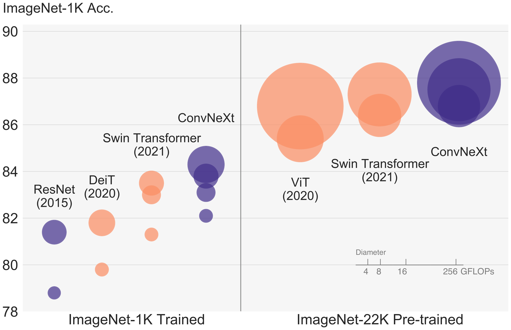

# 2020 年代のための ConvNet

> 原題: A ConvNet for the 2020s
> 著者: Zhuang Liu, Hanzi Mao, Chao-Yuan Wu, Christoph Feichtenhofer, Trevor Darrell, Saining Xie
> 所属: Facebook AI Research (FAIR), UC Berkeley
> 出典: arXiv:2201.03545 → CVPR 2022
> コード: <https://github.com/facebookresearch/ConvNeXt>

> 翻訳メモ: 本翻訳は CLAUDE.md §4 の標準ルールと異なり、**Appendix A〜G も翻訳対象に含めている**（ユーザーからの個別指示による）。References と Acknowledgments は除外。原典 markdown には画像が含まれていなかったため、図 1-4 は arXiv ソース（arXiv:2201.03545 の e-print）に同梱された PDF から生成した。

## Abstract（要旨）

視覚認識における「狂騒の 20 年代（Roaring 20s）」は Vision Transformer（ViT）の登場とともに始まり、ViT は画像分類の最先端モデルとして ConvNet を瞬く間に凌駕した。一方で、素朴な ViT は物体検出やセマンティックセグメンテーションのような一般的なコンピュータビジョンのタスクに適用されると困難に直面する。いくつかの ConvNet の事前分布（prior）を再導入し、Transformer を汎用的な視覚バックボーンとして実用的に成立させ、多様な視覚タスクで顕著な性能を示したのは、階層型 Transformer（例えば Swin Transformer）である。しかし、そうしたハイブリッドなアプローチの有効性は、いまだ大部分が、畳み込みが本来持つ帰納バイアスによるものではなく、Transformer の本質的な優位性によるものだとされている。本研究において我々は設計空間を再検討し、純粋な ConvNet が達成しうる限界を検証する。我々は標準的な ResNet を vision Transformer の設計へ向けて徐々に「近代化（modernize）」していき、その過程で性能差に寄与するいくつかの鍵となる構成要素を発見する。この探求の成果が、ConvNeXt と名付けた純粋 ConvNet モデルのファミリーである。完全に標準的な ConvNet のモジュールのみから構成されているにもかかわらず、ConvNeXt は精度とスケーラビリティの点で Transformer と互角に競い合い、ImageNet top-1 精度 87.8% を達成し、COCO 検出と ADE20K セグメンテーションで Swin Transformer を上回りつつ、標準的な ConvNet の単純さと効率を維持している。

<figure>

<figcaption>図1: ● ConvNet と ○ vision Transformer の ImageNet-1K 分類結果。各バブルの面積はモデルファミリー内のあるバリアントの FLOPs に比例する。ここでの ImageNet-1K / 22K モデルは、それぞれ 224² / 384² の画像を入力とする。ResNet と ViT の結果は、原論文よりも改善された訓練手続きで得られたものである。標準的な ConvNet モデルが、設計上ははるかに単純でありながら、階層型 vision Transformer と同水準のスケーラビリティを達成できることを我々は示す。</figcaption>
</figure>

## 1 Introduction（はじめに）

2010 年代を振り返ると、この 10 年は深層学習の記念碑的な進歩とその影響によって特徴づけられる。その主たる推進力はニューラルネットワークの復興であり、とりわけ畳み込みニューラルネットワーク（ConvNets）であった。この 10 年を通して、視覚認識の分野は特徴量の工学的設計から（ConvNet の）アーキテクチャの設計へと首尾よく移行した。誤差逆伝播法で訓練される ConvNet の発明は 1980 年代にまで遡るが、視覚的特徴学習におけるその真の潜在能力が見出されたのは 2012 年後半になってからであった。AlexNet の登場が「ImageNet の瞬間（ImageNet moment）」を引き起こし、コンピュータビジョンの新時代の幕を開けた。この分野はそれ以来、急速な速度で進化してきた。VGGNet、Inception 群、ResNe(X)t、DenseNet、MobileNet、EfficientNet、RegNet といった代表的な ConvNet は、精度・効率・スケーラビリティの異なる側面に焦点を当て、多くの有用な設計原則を広めた。

コンピュータビジョンにおける ConvNet の完全な支配は偶然ではなかった。多くの応用場面において、特に高解像度画像を扱う際には、「スライディングウィンドウ（sliding window）」戦略は視覚的処理に本質的なものである。ConvNet は、幅広いコンピュータビジョンの応用に適したものにする、いくつかの組み込みの帰納バイアス（inductive bias）を備えている。最も重要なものは平行移動同変性（translation equivariance）であり、これは物体検出のようなタスクにとって望ましい性質である。ConvNet はまた、スライディングウィンドウ的に用いられるとき計算が共有されるという事実により、本質的に効率的でもある。何十年もの間、これは ConvNet の既定の使い方であり、一般には数字・顔・歩行者といった限られた物体カテゴリを対象としていた。2010 年代に入ると、領域ベースの検出器がさらに ConvNet を、視覚認識システムにおける基本的な構成要素という地位にまで押し上げた。

ほぼ同じ頃、自然言語処理（NLP）のためのニューラルネットワーク設計の遍歴はまったく異なる道を辿り、Transformer が再帰型ニューラルネットワークを置き換えて支配的なバックボーンアーキテクチャとなった。言語と視覚の領域における関心対象のタスクの隔たりにもかかわらず、Vision Transformer（ViT）の登場がネットワークアーキテクチャ設計の様相を完全に変えたことで、2 つの流れは 2020 年に驚くべきことに収束した。画像を一連のパッチに分割する最初の「patchify」層を除けば、ViT は画像固有の帰納バイアスを何ら導入せず、元の NLP の Transformer への変更を最小限に留めている。ViT の主たる焦点の一つはスケーリング挙動にある。より大きなモデルとデータセットの助けを借りて、Transformer は標準的な ResNet を大幅に上回ることができる。画像分類タスクにおけるそれらの結果は刺激的であるが、コンピュータビジョンは画像分類に限られない。先に議論したように、過去 10 年の数多くのコンピュータビジョンのタスクに対する解法は、スライディングウィンドウ的で完全畳み込み的なパラダイムに大きく依存していた。ConvNet の帰納バイアスなしでは、素朴な ViT モデルは汎用的な視覚バックボーンとして採用されるにあたり多くの課題に直面する。最大の課題は ViT の大域的注意（global attention）の設計であり、これは入力サイズに対して二次の計算量を持つ。ImageNet 分類ではこれは許容できるかもしれないが、より高解像度の入力では急速に手に負えなくなる。

階層型 Transformer はこの隔たりを埋めるためにハイブリッドなアプローチを採用する。例えば、「スライディングウィンドウ」戦略（例: 局所窓内での注意）が Transformer に再導入され、ConvNet により近い振る舞いをすることを可能にした。Swin Transformer はこの方向における画期的な研究であり、Transformer が汎用的な視覚バックボーンとして採用可能であり、画像分類を超えた広範なコンピュータビジョンのタスクで最先端の性能を達成できることを初めて実証した。Swin Transformer の成功と急速な普及はまた、あることを明らかにした。すなわち、畳み込みの本質は無関係になりつつあるのではなく、むしろ依然として大いに望まれており、決して色褪せてはいないということである。

この観点から見ると、コンピュータビジョンのための Transformer の進歩の多くは、畳み込みを取り戻すことを目指してきた。しかしこうした試みには代償が伴う。スライディングウィンドウ型の自己注意の素朴な実装は高価になりうる。cyclic shifting のような高度な手法を用いれば速度は最適化できるが、システムは設計上より込み入ったものになる。他方で、ConvNet はすでにそうした望ましい性質の多くを、率直で飾り気のない形で満たしているのだから、これはほとんど皮肉と言ってよい。ConvNet が勢いを失っているように見える唯一の理由は、（階層型）Transformer が多くの視覚タスクで ConvNet を上回っており、その性能差が通常、multi-head self-attention を鍵となる構成要素とする Transformer の優れたスケーリング挙動に帰せられていることである。

過去 10 年にわたり漸進的に改良されてきた ConvNet とは異なり、Vision Transformer の採用は段階的な変化（step change）であった。近年の文献では、両者を比較する際に通常はシステムレベルの比較（例: Swin Transformer 対 ResNet）が採用される。ConvNet と階層型 vision Transformer は、同時に異なるものであり、かつ似たものにもなる。すなわち両者は似た帰納バイアスを備えているが、訓練手続きとマクロ／ミクロレベルのアーキテクチャ設計において大きく異なっている。本研究では、ConvNet と Transformer の間のアーキテクチャ上の差異を調査し、ネットワーク性能を比較する際の交絡変数（confounding variables）を特定しようと試みる。我々の研究は、ConvNet にとっての ViT 以前の時代と ViT 以後の時代の間の隔たりを埋めるとともに、純粋な ConvNet が達成しうる限界を検証することを意図している。

これを行うために、我々は改善された手続きで訓練された標準的な ResNet（例: ResNet-50）から出発する。そして階層型 vision Transformer（例: Swin-T）の構成へ向けてアーキテクチャを徐々に「近代化」していく。我々の探求は次の鍵となる問いによって方向づけられる。*Transformer における設計上の決定は ConvNet の性能にどのような影響を与えるのか？* その過程で、性能差に寄与するいくつかの鍵となる構成要素を発見する。その結果として、我々は ConvNeXt と名付けた純粋 ConvNet のファミリーを提案する。我々は ConvNeXt を、ImageNet 分類、COCO における物体検出／セグメンテーション、ADE20K におけるセマンティックセグメンテーションといった多様な視覚タスクで評価する。驚くべきことに、完全に標準的な ConvNet モジュールから構成される ConvNeXt は、すべての主要なベンチマークにおいて精度・スケーラビリティ・頑健性の点で Transformer と互角に競い合う。ConvNeXt は標準的な ConvNet の効率を維持しており、訓練とテストの双方における完全畳み込み的な性質は、実装を極めて単純にする。

我々は、この新しい観察と議論が、いくつかの一般的な信念に異議を唱え、人々にコンピュータビジョンにおける畳み込みの重要性を再考するよう促すことを願っている。

<figure>

<figcaption>図2: 我々は標準的な ConvNet（ResNet）を、注意ベースのモジュールを一切導入することなく、階層型 vision Transformer（Swin）の設計へ向けて近代化する。前景のバーは ResNet-50 / Swin-T の FLOPs 領域におけるモデル精度であり、ResNet-200 / Swin-B 領域の結果は灰色のバーで示されている。斜線のバーはその変更が採用されなかったことを意味する。両領域の詳細な結果は付録にある。Transformer のアーキテクチャ上の選択の多くは ConvNet に取り込むことができ、それらは漸進的により良い性能につながる。最終的に、我々の純粋 ConvNet モデル（ConvNeXt と命名）は Swin Transformer を上回ることができる。</figcaption>
</figure>

## 2 Modernizing a ConvNet: a Roadmap（ConvNet の近代化：ロードマップ）

本節では、ResNet から Transformer に類似した ConvNet へ至る軌跡を提示する。我々は FLOPs の観点から 2 つのモデルサイズを考える。一つは FLOPs がおよそ $4.5\times 10^{9}$ の ResNet-50 / Swin-T 領域であり、もう一つは FLOPs がおよそ $15.0\times 10^{9}$ の ResNet-200 / Swin-B 領域である。単純のため、ResNet-50 / Swin-T の複雑度のモデルで結果を提示する。より大容量のモデルに対する結論も一貫しており、結果は Appendix C にある。

高い水準で言えば、我々の探求は、標準的な ConvNet としてのネットワークの単純さを維持しつつ、Swin Transformer の異なる水準の設計を調査し追随することに向けられている。我々の探求のロードマップは以下の通りである。出発点は ResNet-50 モデルである。まずこれを vision Transformer の訓練に用いられるのと類似した訓練技法で訓練し、元の ResNet-50 と比べて大きく改善された結果を得る。これが我々のベースラインとなる。次に、1) マクロ設計、2) ResNeXt、3) inverted bottleneck、4) 大きなカーネルサイズ、5) 各種の層単位のミクロ設計、として要約した一連の設計上の決定を検討する。図2 に、この「ネットワークの近代化」の各段階における手続きと、我々が達成できた結果を示す。ネットワークの複雑度は最終性能と密接に相関するため、探求の過程を通して FLOPs はおおむね制御されているが、中間の段階では FLOPs が参照モデルより高くなったり低くなったりすることがある。すべてのモデルは ImageNet-1K で訓練・評価されている。

### 2.1 Training Techniques（訓練技法）

ネットワークアーキテクチャの設計とは別に、訓練手続きもまた最終的な性能に影響する。vision Transformer は新しいモジュール群とアーキテクチャ上の設計判断をもたらしただけでなく、異なる訓練技法（例: AdamW オプティマイザ）も視覚分野に導入した。これは主に最適化戦略とそれに関連するハイパーパラメータ設定に関わる。したがって、我々の探求の第一歩は、ベースラインモデル（ここでは ResNet-50/200）を vision Transformer の訓練手続きで訓練することである。最近の研究は、現代的な訓練技法の集合が単純な ResNet-50 モデルの性能を大幅に高めうることを実証している。我々の研究では、DeiT および Swin Transformer に近い訓練レシピを用いる。訓練は ResNet の元の 90 エポックから 300 エポックへと延長される。我々は AdamW オプティマイザ、Mixup・Cutmix・RandAugment・Random Erasing といったデータ拡張技法、そして Stochastic Depth・Label Smoothing を含む正則化の枠組みを用いる。我々が用いるハイパーパラメータの完全な集合は Appendix A.1 にある。この強化された訓練レシピは、それ自体だけで ResNet-50 モデルの性能を 76.1% から 78.8%（+2.7%）へと向上させ、伝統的な ConvNet と vision Transformer の間の性能差のかなりの部分が訓練技法に起因しうることを示唆している。我々は「近代化」の過程を通して、同じハイパーパラメータでこの固定した訓練レシピを用いる。ResNet-50 領域で報告される各精度は、3 つの異なるランダムシードでの訓練から得た平均である。

### 2.2 Macro Design（マクロ設計）

ここで Swin Transformer のマクロなネットワーク設計を分析する。Swin Transformer は ConvNet に倣って多段階（multi-stage）の設計を用い、各段階は異なる特徴マップ解像度を持つ。興味深い設計上の考慮事項が 2 つある。段階ごとの計算比率（stage compute ratio）と、「stem cell」の構造である。

#### Changing stage compute ratio.（段階ごとの計算比率を変える）

ResNet における段階間の計算分配の元の設計は、大部分が経験的なものであった。重い「res4」段階は、検出器ヘッドが 14$\times$14 の特徴平面上で動作する物体検出のような下流タスクとの互換性を意図したものであった。他方 Swin-T は同じ原則に従いつつ、わずかに異なる段階計算比率 1:1:3:1 を採用している。より大きな Swin Transformer では、この比率は 1:1:9:1 である。この設計に従い、我々は各段階のブロック数を ResNet-50 の (3, 4, 6, 3) から (3, 3, 9, 3) へ調整する。これは FLOPs を Swin-T に揃えることにもなる。これによりモデル精度は 78.8% から 79.4% へ改善する。特筆すべきことに、研究者たちは計算の分配を徹底的に調査しており、より最適な設計が存在する可能性は高い。

以降、我々はこの段階計算比率を用いる。

#### Changing stem to "Patchify".（stem を「Patchify」に変える）

典型的には、stem cell の設計はネットワークの冒頭で入力画像がどのように処理されるかに関わる。自然画像に内在する冗長性のため、標準的な ConvNet と vision Transformer の双方において、一般的な stem cell は入力画像を適切な特徴マップサイズへと積極的にダウンサンプリングする。標準的な ResNet における stem cell は、stride 2 の 7$\times$7 畳み込み層とそれに続く max pool を含み、これが入力画像の 4$\times$ のダウンサンプリングをもたらす。vision Transformer では、より積極的な「patchify」戦略が stem cell として用いられ、これは大きなカーネルサイズ（例: カーネルサイズ = 14 または 16）かつ非重複の畳み込みに対応する。Swin Transformer も類似の「patchify」層を用いるが、アーキテクチャの多段階設計に対応するためより小さなパッチサイズ 4 を用いる。我々は ResNet 流の stem cell を、4$\times$4・stride 4 の畳み込み層で実装された patchify 層に置き換える。精度は 79.4% から 79.5% へ変化した。これは、ResNet における stem cell が ViT 流のより単純な「patchify」層で代替可能であり、その結果として同程度の性能が得られることを示唆している。

我々はネットワークにおいて「patchify stem」（4$\times$4 の非重複畳み込み）を用いる。

### 2.3 ResNeXt-ify（ResNeXt 化）

この部分では、素朴な ResNet よりも良い FLOPs／精度のトレードオフを持つ ResNeXt の発想を採用することを試みる。中核となる構成要素はグループ化畳み込み（grouped convolution）であり、そこでは畳み込みフィルタが異なるグループに分離される。高い水準で言えば、ResNeXt の指導原理は「より多くのグループを使い、幅を拡げる」である。より正確には、ResNeXt は bottleneck ブロック内の 3$\times$3 畳み込み層にグループ化畳み込みを用いる。これは FLOPs を大幅に削減するため、容量の損失を補償するようネットワークの幅が拡げられる。

我々の場合、グループ数がチャネル数に等しいというグループ化畳み込みの特殊ケースである depthwise convolution を用いる。Depthwise conv は MobileNet と Xception によって普及した。我々は、depthwise convolution が自己注意における重み付き和の演算に類似していることに注目する。すなわち、それはチャネルごとに作用し、空間次元のみで情報を混合する。Depthwise conv と $1\times 1$ conv の組み合わせは、空間的混合とチャネル的混合の分離をもたらす。これは vision Transformer が共有する性質であり、そこでは各演算が空間次元かチャネル次元のいずれかで情報を混合するが、両方を同時には行わない。Depthwise convolution の使用はネットワークの FLOPs を効果的に削減し、予想通り精度も下げる。ResNeXt で提案された戦略に従い、我々はネットワークの幅を Swin-T と同じチャネル数へ（64 から 96 へ）増やす。これによりネットワークの性能は 80.5% となり、FLOPs は増加する（5.3G）。

我々は以降 ResNeXt の設計を採用する。

### 2.4 Inverted Bottleneck（逆ボトルネック）

あらゆる Transformer ブロックにおける一つの重要な設計は、それが inverted bottleneck を作り出すことである。すなわち、MLP ブロックの隠れ次元が入力次元の 4 倍広い（図4 参照）。興味深いことに、この Transformer の設計は、ConvNet で用いられる拡大率 4 の inverted bottleneck 設計と結びついている。この発想は MobileNetV2 によって普及し、その後いくつかの先進的な ConvNet アーキテクチャで支持を得た。

ここでは inverted bottleneck の設計を探求する。図3 の (a) から (b) がその構成を図示している。depthwise convolution 層での FLOPs 増加にもかかわらず、この変更はネットワーク全体の FLOPs を 4.6G へ削減する。これはダウンサンプリングを行う残差ブロックのショートカットの 1$\times$1 conv 層における大幅な FLOPs 削減によるものである。興味深いことに、この結果としてわずかに性能が改善する（80.5% から 80.6%）。ResNet-200 / Swin-B 領域では、この段階はさらに大きな向上をもたらす（81.9% から 82.6%）。しかも FLOPs は削減されている。

我々は以降 inverted bottleneck を用いる。

### 2.5 Large Kernel Sizes（大きなカーネルサイズ）

探求のこの部分では、大きな畳み込みカーネルの振る舞いに焦点を当てる。vision Transformer の最も際立った側面の一つは、その非局所的な自己注意であり、これは各層が大域的な受容野を持つことを可能にする。大きなカーネルサイズは過去に ConvNet で用いられてきたものの、（VGGNet によって普及した）標準的なやり方は小さなカーネルサイズ（3$\times$3）の conv 層を積み重ねることであり、これは現代の GPU 上で効率的なハードウェア実装を持つ。Swin Transformer は自己注意ブロックに局所窓を再導入したが、その窓サイズは少なくとも 7$\times$7 であり、ResNe(X)t のカーネルサイズ 3$\times$3 よりも大幅に大きい。ここでは ConvNet における大きなカーネルサイズの畳み込みの使用を再検討する。

#### Moving up depthwise conv layer.（depthwise conv 層を上に移動する）

<figure>

<figcaption>図3: ブロックの変更と結果として得られる仕様。(a) は ResNeXt ブロックである。(b) では inverted bottleneck ブロックを作り、(c) では空間的な depthwise conv 層の位置を上に移動している。</figcaption>
</figure>

大きなカーネルを探求するにあたっての前提条件の一つは、depthwise conv 層の位置を上に移動することである（図3 の (b) から (c)）。これは Transformer においても明らかな設計上の決定である。すなわち MSA ブロックは MLP 層に先立って置かれる。我々は inverted bottleneck ブロックを持っているので、これは自然な設計上の選択である。複雑／非効率なモジュール（MSA、大カーネル conv）はより少ないチャネルを持ち、効率的で密な 1$\times$1 層が重い処理を担うことになる。この中間段階は FLOPs を 4.1G へ削減し、結果として一時的に 79.9% へと性能が低下する。

#### Increasing the kernel size.（カーネルサイズを大きくする）

これらの準備をすべて整えた上で、より大きなカーネルサイズの畳み込みを採用する利点は顕著である。我々は 3, 5, 7, 9, 11 を含むいくつかのカーネルサイズで実験した。ネットワークの性能は 79.9%（3$\times$3）から 80.6%（7$\times$7）へと向上する一方、ネットワークの FLOPs はおおむね変わらない。加えて、より大きなカーネルサイズの利点は 7$\times$7 で飽和点に達することを観察する。この振る舞いは大容量モデルでも検証した。ResNet-200 領域のモデルは、カーネルサイズを 7$\times$7 を超えて大きくしてもさらなる向上を示さない。

我々は各ブロックで 7$\times$7 の depthwise conv を用いる。

この時点で、マクロなスケールにおけるネットワークアーキテクチャの検討を終えたことになる。興味深いことに、vision Transformer でなされた設計上の選択のかなりの部分が、ConvNet の具体化へと写像されうる。

### 2.6 Micro Design（ミクロ設計）

本節では、ミクロなスケールでのその他いくつかのアーキテクチャ上の差異を調査する。ここでの探求のほとんどは層の水準で行われ、活性化関数と正規化層の具体的な選択に焦点を当てる。

#### Replacing ReLU with GELU（ReLU を GELU で置き換える）

NLP と視覚のアーキテクチャの間の一つの相違は、どの活性化関数を用いるかという具体的な点である。数多くの活性化関数が長年にわたり開発されてきたが、Rectified Linear Unit（ReLU）は、その単純さと効率のために依然として ConvNet で広く用いられている。ReLU は元の Transformer 論文でも活性化関数として用いられている。Gaussian Error Linear Unit（GELU）は ReLU のより滑らかな変種と考えることができ、Google の BERT や OpenAI の GPT-2、そして最近では ViT を含む最先端の Transformer で利用されている。我々は、我々の ConvNet においても ReLU を GELU で代替できることを見出したが、精度は変わらないままである（80.6%）。

#### Fewer activation functions.（活性化関数を減らす）

Transformer と ResNet ブロックの間の一つの些細な違いは、Transformer の方が活性化関数が少ないことである。key/query/value の線形埋め込み層、射影層、そして MLP ブロック内の 2 つの線形層を持つ Transformer ブロックを考えてみよう。活性化関数は MLP ブロック内に 1 つしか存在しない。それに対して、$1\times 1$ conv を含むあらゆる畳み込み層に活性化関数を付加するのが一般的な慣行である。ここでは、同じ戦略を貫いたとき性能がどう変化するかを検討する。図4 に描かれているように、我々は残差ブロックから、2 つの $1\times 1$ 層の間にある 1 つを除いてすべての GELU 層を取り除き、Transformer ブロックの様式を再現する。この過程は結果を 0.7% 改善して 81.3% とし、実質的に Swin-T の性能に匹敵する。

我々は以降、各ブロックで単一の GELU 活性化を用いる。

<figure>

<figcaption>図4: ResNet、Swin Transformer、ConvNeXt のブロック設計。Swin Transformer のブロックは、複数の特殊なモジュールと 2 つの残差接続の存在によって、より込み入っている。単純のため、Transformer の MLP ブロック内の線形層も等価であるため「1×1 conv」と記している。</figcaption>
</figure>

#### Fewer normalization layers.（正規化層を減らす）

Transformer ブロックは通常、正規化層も少ない。ここでは 2 つの BatchNorm（BN）層を取り除き、conv $1\times 1$ 層の前に 1 つの BN 層だけを残す。これによりさらに性能が 81.4% へと押し上げられ、すでに Swin-T の結果を上回っている。なお、我々のブロックあたりの正規化層は Transformer よりもさらに少ないことに注意されたい。経験的に、ブロックの冒頭に BN 層をもう 1 つ追加しても性能は改善しないことを見出したからである。

#### Substituting BN with LN.（BN を LN で置き換える）

BatchNorm は収束を改善し過学習を低減するため、ConvNet における本質的な構成要素である。しかし BN には、モデルの性能に有害な影響を与えうる多くの厄介な性質もある。代替となる正規化技法を開発する試みは数多くなされてきたが、BN はほとんどの視覚タスクで好まれる選択肢であり続けてきた。他方、より単純な Layer Normalization（LN）は Transformer で用いられており、異なる応用場面にわたって良好な性能をもたらしている。

元の ResNet で BN を LN に直接置き換えると、次善の性能となる。ネットワークアーキテクチャと訓練技法におけるすべての変更を加えた上で、ここでは BN の代わりに LN を用いることの影響を再検討する。我々の ConvNet モデルは LN での訓練に何ら困難を持たないことを観察する。実際、性能はわずかに良くなり、81.5% の精度を得る。

以降、我々は各残差ブロックにおける正規化の選択として 1 つの LayerNorm を用いる。

#### Separate downsampling layers.（独立したダウンサンプリング層）

ResNet では、空間的なダウンサンプリングは各段階の冒頭の残差ブロックによって、stride 2 の 3$\times$3 conv（およびショートカット接続における stride 2 の 1$\times$1 conv）を用いて達成される。Swin Transformer では、段階間に独立したダウンサンプリング層が追加される。我々は、空間的ダウンサンプリングのために stride 2 の 2$\times$2 conv 層を用いるという類似の戦略を探求する。この変更は驚くべきことに訓練の発散をもたらす。さらなる調査により、空間解像度が変化する箇所すべてに正規化層を追加することが訓練の安定化に役立つことが判明した。これらには Swin Transformer でも用いられているいくつかの LN 層が含まれる。すなわち、各ダウンサンプリング層の前に 1 つ、stem の後に 1 つ、そして最終的な大域平均プーリングの後に 1 つである。我々は精度を 82.0% へと改善でき、Swin-T の 81.3% を大幅に上回る。

我々は独立したダウンサンプリング層を用いる。これで我々の最終モデルに到達し、これを ConvNeXt と名付けた。

ResNet、Swin、ConvNeXt のブロック構造の比較は図4 にある。ResNet-50、Swin-T、ConvNeXt-T の詳細なアーキテクチャ仕様の比較は表9 にある。

#### Closing remarks.（結びの所見）

我々は最初の「一巡（playthrough）」を終え、この計算領域における ImageNet-1K 分類で Swin Transformer を上回ることのできる純粋 ConvNet、ConvNeXt を発見した。特筆すべきは、*ここまでに議論したすべての設計上の選択が vision Transformer から適応されたものである*ということである。*加えて、これらの設計は ConvNet の文献においてすら新規なものではない — それらはすべて過去 10 年の間に個別には研究されてきたが、まとめて研究されてはこなかった*。我々の ConvNeXt モデルは Swin Transformer とほぼ同じ FLOPs・パラメータ数・スループット・メモリ使用量を持つが、shifted window attention や相対位置バイアスといった特殊なモジュールを必要としない。

これらの発見は励みになるが、まだ完全に説得力があるとは言えない。ここまでの我々の探求は小さなスケールに限られてきたが、vision Transformer を真に際立たせるのはそのスケーリング挙動だからである。加えて、ConvNet が物体検出やセマンティックセグメンテーションのような下流タスクで Swin Transformer と競争できるかという問いは、コンピュータビジョンの実務家にとって中心的な関心事である。次節では、ConvNeXt モデルをデータとモデルサイズの双方の観点でスケールアップし、多様な視覚認識タスクで評価する。

## 3 Empirical Evaluations on ImageNet（ImageNet における実証評価）

我々は Swin-T/S/B/L と類似の複雑度を持つ異なる ConvNeXt バリアント、ConvNeXt-T/S/B/L を構築する。ConvNeXt-T/B はそれぞれ ResNet-50/200 領域における「近代化」手続きの最終成果物である。加えて、ConvNeXt のスケーラビリティをさらに検証するためより大きな ConvNeXt-XL を構築する。各バリアントはチャネル数 $C$ と各段階のブロック数 $B$ のみが異なる。ResNet と Swin Transformer の双方に従い、チャネル数は新しい段階ごとに倍増する。構成を以下に要約する。

- ConvNeXt-T: $C=(96,192,384,768)$, $B=(3,3,9,3)$
- ConvNeXt-S: $C=(96,192,384,768)$, $B=(3,3,27,3)$
- ConvNeXt-B: $C=(128,256,512,1024)$, $B=(3,3,27,3)$
- ConvNeXt-L: $C=(192,384,768,1536)$, $B=(3,3,27,3)$
- ConvNeXt-XL: $C=(256,512,1024,2048)$, $B=(3,3,27,3)$

### 3.1 Settings（設定）

ImageNet-1K データセットは 1000 の物体クラスと 120 万枚の訓練画像からなる。我々は検証セットにおける ImageNet-1K top-1 精度を報告する。また、より大きなデータセットである ImageNet-22K（21841 クラス、ImageNet-1K の 1000 クラスの上位集合、約 1400 万枚の画像）で事前学習を行い、その後 ImageNet-1K で事前学習済みモデルをファインチューニングして評価も行う。訓練の設定を以下に要約する。より詳細は Appendix A にある。

#### Training on ImageNet-1K.（ImageNet-1K での訓練）

我々は ConvNeXt を、学習率 4e-3 の AdamW を用いて 300 エポック訓練する。20 エポックの線形ウォームアップがあり、その後コサイン減衰スケジュールとなる。バッチサイズ 4096、weight decay 0.05 を用いる。データ拡張については、Mixup、Cutmix、RandAugment、Random Erasing を含む一般的な枠組みを採用する。Stochastic Depth と Label Smoothing でネットワークを正則化する。初期値 1e-6 の Layer Scale を適用する。より大きなモデルの過学習を緩和することを見出したため、Exponential Moving Average（EMA）を用いる。

#### Pre-training on ImageNet-22K.（ImageNet-22K での事前学習）

我々は ConvNeXt を ImageNet-22K で 5 エポックのウォームアップを伴い 90 エポック事前学習する。EMA は用いない。他の設定は ImageNet-1K に従う。

#### Fine-tuning on ImageNet-1K.（ImageNet-1K でのファインチューニング）

我々は ImageNet-22K で事前学習したモデルを ImageNet-1K で 30 エポックファインチューニングする。AdamW、学習率 5e-5、コサイン学習率スケジュール、層ごとの学習率減衰（layer-wise learning rate decay）、ウォームアップなし、バッチサイズ 512、weight decay 1e-8 を用いる。既定の事前学習・ファインチューニング・テストの解像度は 224$^{2}$ である。加えて、ImageNet-22K と ImageNet-1K の双方の事前学習済みモデルについて、より大きな解像度 384$^{2}$ でもファインチューニングを行う。

ViT / Swin Transformer と比べて、ConvNeXt は異なる解像度でファインチューニングするのがより単純である。ネットワークが完全畳み込み的であり、入力パッチサイズを調整したり絶対／相対位置バイアスを補間したりする必要がないからである。

**表1**: ImageNet-1K における分類精度。Transformer と同様に、ConvNeXt もより大容量のモデルとより大きな（事前学習）データセットで有望なスケーリング挙動を示す。推論スループットは V100 GPU で測定した。A100 GPU では、ConvNeXt は Swin Transformer よりもはるかに高いスループットを持ちうる。Appendix E を参照。(☎) ViT の結果は 90 エポックの AugReg 訓練によるもので、著者との個人的な連絡を通じて提供された。（● = ConvNet、○ = vision Transformer）

| モデル | 画像サイズ | パラメータ数 | FLOPs | スループット (image/s) | IN-1K top-1 |
| --- | --- | --- | --- | --- | --- |
| *ImageNet-1K 訓練モデル* | | | | | |
| ● RegNetY-16G | 224² | 84M | 16.0G | 334.7 | 82.9 |
| ● EffNet-B7 | 600² | 66M | 37.0G | 55.1 | 84.3 |
| ● EffNetV2-L | 480² | 120M | 53.0G | 83.7 | 85.7 |
| ○ DeiT-S | 224² | 22M | 4.6G | 978.5 | 79.8 |
| ○ DeiT-B | 224² | 87M | 17.6G | 302.1 | 81.8 |
| ○ Swin-T | 224² | 28M | 4.5G | 757.9 | 81.3 |
| ● ConvNeXt-T | 224² | 29M | 4.5G | 774.7 | 82.1 |
| ○ Swin-S | 224² | 50M | 8.7G | 436.7 | 83.0 |
| ● ConvNeXt-S | 224² | 50M | 8.7G | 447.1 | 83.1 |
| ○ Swin-B | 224² | 88M | 15.4G | 286.6 | 83.5 |
| ● ConvNeXt-B | 224² | 89M | 15.4G | 292.1 | 83.8 |
| ○ Swin-B | 384² | 88M | 47.1G | 85.1 | 84.5 |
| ● ConvNeXt-B | 384² | 89M | 45.0G | 95.7 | 85.1 |
| ● ConvNeXt-L | 224² | 198M | 34.4G | 146.8 | 84.3 |
| ● ConvNeXt-L | 384² | 198M | 101.0G | 50.4 | 85.5 |
| *ImageNet-22K 事前学習モデル* | | | | | |
| ● R-101x3 | 384² | 388M | 204.6G | – | 84.4 |
| ● R-152x4 | 480² | 937M | 840.5G | – | 85.4 |
| ● EffNetV2-L | 480² | 120M | 53.0G | 83.7 | 86.8 |
| ● EffNetV2-XL | 480² | 208M | 94.0G | 56.5 | 87.3 |
| ○ ViT-B/16 (☎) | 384² | 87M | 55.5G | 93.1 | 85.4 |
| ○ ViT-L/16 (☎) | 384² | 305M | 191.1G | 28.5 | 86.8 |
| ● ConvNeXt-T | 224² | 29M | 4.5G | 774.7 | 82.9 |
| ● ConvNeXt-T | 384² | 29M | 13.1G | 282.8 | 84.1 |
| ● ConvNeXt-S | 224² | 50M | 8.7G | 447.1 | 84.6 |
| ● ConvNeXt-S | 384² | 50M | 25.5G | 163.5 | 85.8 |
| ○ Swin-B | 224² | 88M | 15.4G | 286.6 | 85.2 |
| ● ConvNeXt-B | 224² | 89M | 15.4G | 292.1 | 85.8 |
| ○ Swin-B | 384² | 88M | 47.0G | 85.1 | 86.4 |
| ● ConvNeXt-B | 384² | 89M | 45.1G | 95.7 | 86.8 |
| ○ Swin-L | 224² | 197M | 34.5G | 145.0 | 86.3 |
| ● ConvNeXt-L | 224² | 198M | 34.4G | 146.8 | 86.6 |
| ○ Swin-L | 384² | 197M | 103.9G | 46.0 | 87.3 |
| ● ConvNeXt-L | 384² | 198M | 101.0G | 50.4 | 87.5 |
| ● ConvNeXt-XL | 224² | 350M | 60.9G | 89.3 | 87.0 |
| ● ConvNeXt-XL | 384² | 350M | 179.0G | 30.2 | **87.8** |

### 3.2 Results（結果）

#### ImageNet-1K.

表1（上部）は、最近の 2 つの Transformer 変種である DeiT と Swin Transformer、およびアーキテクチャ探索による 2 つの ConvNet — RegNet、EfficientNet、EfficientNetV2 — との結果比較を示す。ConvNeXt は、精度と計算量のトレードオフおよび推論スループットの点で、2 つの強力な ConvNet ベースライン（RegNet と EfficientNet）と互角に競い合う。ConvNeXt はまた、同程度の複雑度の Swin Transformer を*全面的に*上回っており、時にはかなりの差をつける（例: ConvNeXt-T で 0.8%）。shifted window や相対位置バイアスといった特殊なモジュールなしに、ConvNeXt は Swin Transformer と比べて改善されたスループットも享受している。

結果の中の一つの目玉は 384$^{2}$ の ConvNeXt-B である。これは Swin-B を 0.6% 上回る（85.1% 対 84.5%）が、推論スループットは 12.5% 高い（95.7 対 85.1 image/s）。解像度が 224$^{2}$ から 384$^{2}$ へ上がるにつれ、Swin-B に対する ConvNeXt-B の FLOPs／スループットの優位性が大きくなることに注目する。加えて、ConvNeXt-L へさらにスケールすると 85.5% という改善された結果が観察される。

#### ImageNet-22K.

表1（下部）に、ImageNet-22K 事前学習からファインチューニングしたモデルの結果を示す。これらの実験は重要である。というのも、vision Transformer は帰納バイアスが少ないため大規模に事前学習したとき ConvNet より良い性能を発揮しうる、という見方が広く持たれているからである。我々の結果は、適切に設計された ConvNet が大規模データセットで事前学習されたとき vision Transformer に*劣らない*ことを実証している。ConvNeXt は依然として同程度のサイズの Swin Transformer と同等かそれ以上の性能を、わずかに高いスループットで発揮する。加えて、我々の ConvNeXt-XL モデルは 87.8% の精度を達成し、384$^{2}$ の ConvNeXt-L からの相応の改善を示しており、ConvNeXt がスケーラブルなアーキテクチャであることを実証している。

ImageNet-1K では、Squeeze-and-Excitation のような先進的モジュールと漸進的訓練手続きを備えた探索済みアーキテクチャである EfficientNetV2-L が最高の性能を達成する。しかし ImageNet-22K 事前学習を行うと、ConvNeXt は EfficientNetV2 を上回ることができ、大規模訓練の重要性をさらに実証している。

Appendix B では、ConvNeXt の頑健性と領域外（out-of-domain）汎化の結果を議論する。

### 3.3 Isotropic ConvNeXt vs. ViT（等方的 ConvNeXt 対 ViT）

このアブレーションでは、我々の ConvNeXt ブロック設計が、ダウンサンプリング層を持たずすべての深さで同じ特徴解像度（例: 14$\times$14）を保つ ViT 流の等方的（isotropic）アーキテクチャに一般化できるかを検討する。我々は ViT-S/B/L と同じ特徴次元（384/768/1024）を用いて等方的 ConvNeXt-S/B/L を構築する。深さはパラメータ数と FLOPs を揃えるため 18/18/36 に設定する。ブロック構造は同じままである（図4）。ViT-S/B には DeiT の教師あり訓練結果を、ViT-L には MAE の結果を用いる。これらは元の ViT より改善された訓練手続きを採用しているためである。ConvNeXt モデルは以前と同じ設定で訓練されるが、ウォームアップエポックはより長い。224$^{2}$ 解像度の ImageNet-1K の結果を表2 に示す。ConvNeXt は概して ViT と同等の性能を発揮でき、我々の ConvNeXt ブロック設計が非階層型モデルで用いられたときも競争力があることを示している。

**表2**: 等方的 ConvNeXt と ViT の比較。訓練メモリは V100 GPU 上で GPU あたりバッチサイズ 32 で測定した。

| モデル | パラメータ数 | FLOPs | スループット (image/s) | 訓練メモリ (GB) | IN-1K acc. |
| --- | --- | --- | --- | --- | --- |
| ○ ViT-S | 22M | 4.6G | 978.5 | 4.9 | 79.8 |
| ● ConvNeXt-S (iso.) | 22M | 4.3G | 1038.7 | 4.2 | 79.7 |
| ○ ViT-B | 87M | 17.6G | 302.1 | 9.1 | 81.8 |
| ● ConvNeXt-B (iso.) | 87M | 16.9G | 320.1 | 7.7 | 82.0 |
| ○ ViT-L | 304M | 61.6G | 93.1 | 22.5 | 82.6 |
| ● ConvNeXt-L (iso.) | 306M | 59.7G | 94.4 | 20.4 | 82.6 |

## 4 Empirical Evaluation on Downstream Tasks（下流タスクにおける実証評価）

#### Object detection and segmentation on COCO.（COCO における物体検出とセグメンテーション）

我々は ConvNeXt バックボーンを用いて Mask R-CNN と Cascade Mask R-CNN を COCO データセットでファインチューニングする。Swin Transformer に従い、マルチスケール訓練、AdamW オプティマイザ、3$\times$ スケジュールを用いる。さらなる詳細とハイパーパラメータ設定は Appendix A.3 にある。

表3 は、Swin Transformer、ConvNeXt、および ResNeXt のような伝統的な ConvNet を比較した物体検出とインスタンスセグメンテーションの結果を示す。異なるモデル複雑度にわたり、ConvNeXt は Swin Transformer と同等かそれ以上の性能を達成する。ImageNet-22K で事前学習したより大きなモデル（ConvNeXt-B/L/XL）へスケールアップすると、多くの場合 *ConvNeXt は box AP と mask AP の点で Swin Transformer より大幅に良い*（例: +1.0 AP）。

**表3**: Mask-RCNN と Cascade Mask-RCNN を用いた COCO 物体検出とセグメンテーションの結果。‡ はモデルが ImageNet-22K で事前学習されたことを示す。ImageNet-1K 事前学習の Swin の結果はその GitHub リポジトリによる。ResNet-50 と X101 モデルの AP 値は Swin 論文による。FPS は A100 GPU で測定した。FLOPs は画像サイズ (1280, 800) で計算した。

| バックボーン | FLOPs | FPS | AP^box | AP^box_50 | AP^box_75 | AP^mask | AP^mask_50 | AP^mask_75 |
| --- | --- | --- | --- | --- | --- | --- | --- | --- |
| *Mask-RCNN 3× schedule* | | | | | | | | |
| ○ Swin-T | 267G | 23.1 | 46.0 | 68.1 | 50.3 | 41.6 | 65.1 | 44.9 |
| ● ConvNeXt-T | 262G | 25.6 | 46.2 | 67.9 | 50.8 | 41.7 | 65.0 | 44.9 |
| *Cascade Mask-RCNN 3× schedule* | | | | | | | | |
| ● ResNet-50 | 739G | 16.2 | 46.3 | 64.3 | 50.5 | 40.1 | 61.7 | 43.4 |
| ● X101-32 | 819G | 13.8 | 48.1 | 66.5 | 52.4 | 41.6 | 63.9 | 45.2 |
| ● X101-64 | 972G | 12.6 | 48.3 | 66.4 | 52.3 | 41.7 | 64.0 | 45.1 |
| ○ Swin-T | 745G | 12.2 | 50.4 | 69.2 | 54.7 | 43.7 | 66.6 | 47.3 |
| ● ConvNeXt-T | 741G | 13.5 | 50.4 | 69.1 | 54.8 | 43.7 | 66.5 | 47.3 |
| ○ Swin-S | 838G | 11.4 | 51.9 | 70.7 | 56.3 | 45.0 | 68.2 | 48.8 |
| ● ConvNeXt-S | 827G | 12.0 | 51.9 | 70.8 | 56.5 | 45.0 | 68.4 | 49.1 |
| ○ Swin-B | 982G | 10.7 | 51.9 | 70.5 | 56.4 | 45.0 | 68.1 | 48.9 |
| ● ConvNeXt-B | 964G | 11.4 | 52.7 | 71.3 | 57.2 | 45.6 | 68.9 | 49.5 |
| ○ Swin-B ‡ | 982G | 10.7 | 53.0 | 71.8 | 57.5 | 45.8 | 69.4 | 49.7 |
| ● ConvNeXt-B ‡ | 964G | 11.5 | 54.0 | 73.1 | 58.8 | 46.9 | 70.6 | 51.3 |
| ○ Swin-L ‡ | 1382G | 9.2 | 53.9 | 72.4 | 58.8 | 46.7 | 70.1 | 50.8 |
| ● ConvNeXt-L ‡ | 1354G | 10.0 | 54.8 | 73.8 | 59.8 | 47.6 | 71.3 | 51.7 |
| ● ConvNeXt-XL ‡ | 1898G | 8.6 | **55.2** | 74.2 | 59.9 | **47.7** | 71.6 | 52.2 |

#### Semantic segmentation on ADE20K.（ADE20K におけるセマンティックセグメンテーション）

我々はまた ConvNeXt バックボーンを、UperNet を用いた ADE20K セマンティックセグメンテーションのタスクでも評価する。すべてのモデルバリアントはバッチサイズ 16 で 160K イテレーション訓練される。他の実験設定は BEiT に従う（より詳細は Appendix A.3 を参照）。表4 では、マルチスケールテストによる検証 mIoU を報告する。ConvNeXt モデルは異なるモデル容量にわたって競争力のある性能を達成でき、我々のアーキテクチャ設計の有効性をさらに裏付けている。

**表4**: UperNet を用いた ADE20K 検証結果。‡ は IN-22K 事前学習を示す。Swin に従い、マルチスケールテストによる mIoU の結果を報告する。FLOPs は IN-1K と IN-22K 事前学習モデルについて、それぞれ入力サイズ (2048, 512) と (2560, 640) に基づく。

| バックボーン | 入力クロップ | mIoU | パラメータ数 | FLOPs |
| --- | --- | --- | --- | --- |
| *ImageNet-1K 事前学習* | | | | |
| ○ Swin-T | 512² | 45.8 | 60M | 945G |
| ● ConvNeXt-T | 512² | 46.7 | 60M | 939G |
| ○ Swin-S | 512² | 49.5 | 81M | 1038G |
| ● ConvNeXt-S | 512² | 49.6 | 82M | 1027G |
| ○ Swin-B | 512² | 49.7 | 121M | 1188G |
| ● ConvNeXt-B | 512² | 49.9 | 122M | 1170G |
| *ImageNet-22K 事前学習* | | | | |
| ○ Swin-B ‡ | 640² | 51.7 | 121M | 1841G |
| ● ConvNeXt-B ‡ | 640² | 53.1 | 122M | 1828G |
| ○ Swin-L ‡ | 640² | 53.5 | 234M | 2468G |
| ● ConvNeXt-L ‡ | 640² | 53.7 | 235M | 2458G |
| ● ConvNeXt-XL ‡ | 640² | **54.0** | 391M | 3335G |

#### Remarks on model efficiency.（モデル効率に関する所見）

同程度の FLOPs のもとでは、depthwise convolution を持つモデルは密な畳み込みのみを持つ ConvNet より遅く、より多くのメモリを消費することが知られている。ConvNeXt の設計がそれを実際上非効率にしてしまうのではないか、と問うのは自然である。本論文を通して実証してきたように、ConvNeXt の推論スループットは Swin Transformer と同等かそれを上回る。これは分類にも、より高解像度の入力を必要とする他のタスクにも当てはまる（スループット／FPS の比較は表1、3 を参照）。さらに我々は、ConvNeXt の訓練が Swin Transformer の訓練より少ないメモリしか必要としないことに気づいた。例えば ConvNeXt-B バックボーンを用いた Cascade Mask-RCNN の訓練は GPU あたりバッチサイズ 2 でピークメモリ 17.4GB を消費するのに対し、Swin-B の参照値は 18.5GB である。素朴な ViT と比較すると、ConvNeXt と Swin Transformer はいずれも局所的な計算により、より好ましい精度-FLOPs のトレードオフを示す。この改善された効率は *ConvNet の帰納バイアス*の結果であり、vision Transformer における自己注意機構と直接に関係するものではないことは特筆に値する。

## 5 Related Work（関連研究）

#### Hybrid models.（ハイブリッドモデル）

ViT 以前と以後の双方の時代において、畳み込みと自己注意を組み合わせるハイブリッドモデルは活発に研究されてきた。ViT 以前は、長距離依存性を捉えるために ConvNet を自己注意／非局所モジュールで補強することに焦点が置かれていた。元の ViT はハイブリッド構成を最初に研究し、その後の多くの研究は、明示的または暗黙的な形で畳み込みの事前分布を ViT に再導入することに焦点を当てた。

#### Recent convolution-based approaches.（最近の畳み込みベースのアプローチ）

Han らは、局所的な Transformer の注意が非一様な動的 depthwise conv と等価であることを示している。そこでは Swin の MSA ブロックが動的または通常の depthwise convolution で置き換えられ、Swin と同等の性能を達成している。同時期の研究である ConvMixer は、小規模な設定において depthwise convolution が有望な混合戦略として使えることを実証している。ConvMixer は最良の結果を得るためにより小さなパッチサイズを用いており、それがスループットを他のベースラインよりはるかに低くしている。GFNet はトークン混合に高速フーリエ変換（FFT）を採用している。FFT もまた畳み込みの一形態であるが、大域的なカーネルサイズと循環パディングを伴う。最近の多くの Transformer や ConvNet の設計とは異なり、我々の研究の主たる目標の一つは、標準的な ResNet を近代化して最先端の性能を達成する過程を深く見ることである。

## 6 Conclusions（結論）

2020 年代において、vision Transformer、とりわけ Swin Transformer のような階層型のものは、汎用的な視覚バックボーンとして好まれる選択肢として ConvNet を追い越し始めた。広く持たれている信念は、vision Transformer が ConvNet より正確で効率的でスケーラブルだというものである。我々は ConvNeXt を提案する。これは純粋な ConvNet モデルであり、標準的な ConvNet の単純さと効率を保持しつつ、複数のコンピュータビジョンのベンチマークにわたって最先端の階層型 vision Transformer と互角に競い合うことができる。ある意味では、我々の観察は驚くべきものである一方、ConvNeXt モデル自体は完全に新しいわけではない — 多くの設計上の選択は過去 10 年にわたって個別には検討されてきたが、まとめて検討されてはこなかったのである。本研究で報告する新しい結果が、いくつかの広く持たれている見方に異議を唱え、人々にコンピュータビジョンにおける畳み込みの重要性を再考するよう促すことを願っている。

## Appendix（付録）

この付録では、さらなる実験の詳細（§A）、頑健性の評価結果（§B）、さらなる近代化実験の結果（§C）、そして詳細なネットワーク仕様（§D）を提供する。さらに A100 GPU 上でモデルのスループットをベンチマークする（§E）。最後に、本研究の限界（§F）と社会的影響（§G）を議論する。

## Appendix A Experimental Settings（実験設定）

### A.1 ImageNet (Pre-)training（ImageNet の（事前）訓練）

表5 に ConvNeXt の ImageNet-1K 訓練と ImageNet-22K 事前学習の設定を示す。これらの設定は表1（第3.2節）における主要な結果に用いられている。すべての ConvNeXt バリアントは同じ設定を用いるが、stochastic depth の率のみモデルバリアントごとに調整されている。

「ConvNet の近代化」の実験（第2節）についても、表5 の ImageNet-1K の設定を用いる。ただし EMA は無効化する。EMA を用いると BatchNorm 層を持つモデルの性能を著しく害することを見出したためである。

等方的 ConvNeXt（第3.3節）については、表5 の ImageNet-1K の設定も採用するが、ウォームアップは 50 エポックに延長し、等方的 ConvNeXt-S/B では layer scale を無効化する。等方的 ConvNeXt-S/B/L の stochastic depth 率はそれぞれ 0.1/0.2/0.5 である。

**表5**: ImageNet-1K/22K の（事前）訓練設定。複数の stochastic depth 率（例: 0.1/0.4/0.5/0.5）は、それぞれ各モデル（例: ConvNeXt-T/S/B/L）に対応する。

| （事前）訓練の設定 | ConvNeXt-T/S/B/L / ImageNet-1K / 224² | ConvNeXt-T/S/B/L/XL / ImageNet-22K / 224² |
| --- | --- | --- |
| weight init | trunc. normal (0.2) | trunc. normal (0.2) |
| optimizer | AdamW | AdamW |
| base learning rate | 4e-3 | 4e-3 |
| weight decay | 0.05 | 0.05 |
| optimizer momentum | β₁, β₂ = 0.9, 0.999 | β₁, β₂ = 0.9, 0.999 |
| batch size | 4096 | 4096 |
| training epochs | 300 | 90 |
| learning rate schedule | cosine decay | cosine decay |
| warmup epochs | 20 | 5 |
| warmup schedule | linear | linear |
| layer-wise lr decay | None | None |
| randaugment | (9, 0.5) | (9, 0.5) |
| mixup | 0.8 | 0.8 |
| cutmix | 1.0 | 1.0 |
| random erasing | 0.25 | 0.25 |
| label smoothing | 0.1 | 0.1 |
| stochastic depth | 0.1/0.4/0.5/0.5 | 0.0/0.0/0.1/0.1/0.2 |
| layer scale | 1e-6 | 1e-6 |
| head init scale | None | None |
| gradient clip | None | None |
| exp. mov. avg. (EMA) | 0.9999 | None |

**表6**: ImageNet-1K のファインチューニング設定。複数の値（例: 0.8/0.95）は、それぞれ各モデル（例: ConvNeXt-B/L）に対応する。

| ファインチューニングの設定 | 事前学習 IN-1K 224² → FT IN-1K 384²（ConvNeXt-B/L） | 事前学習 IN-22K 224² → FT IN-1K 224² および 384²（ConvNeXt-T/S/B/L/XL） |
| --- | --- | --- |
| optimizer | AdamW | AdamW |
| base learning rate | 5e-5 | 5e-5 |
| weight decay | 1e-8 | 1e-8 |
| optimizer momentum | β₁, β₂ = 0.9, 0.999 | β₁, β₂ = 0.9, 0.999 |
| batch size | 512 | 512 |
| training epochs | 30 | 30 |
| learning rate schedule | cosine decay | cosine decay |
| layer-wise lr decay | 0.7 | 0.8 |
| warmup epochs | None | None |
| warmup schedule | N/A | N/A |
| randaugment | (9, 0.5) | (9, 0.5) |
| mixup | None | None |
| cutmix | None | None |
| random erasing | 0.25 | 0.25 |
| label smoothing | 0.1 | 0.1 |
| stochastic depth | 0.8/0.95 | 0.0/0.1/0.2/0.3/0.4 |
| layer scale | pre-trained | pre-trained |
| head init scale | 0.001 | 0.001 |
| gradient clip | None | None |
| exp. mov. avg. (EMA) | None | None(T-L)/0.9999(XL) |

### A.2 ImageNet Fine-tuning（ImageNet のファインチューニング）

ImageNet-1K でのファインチューニングの設定を表6 に列挙する。ファインチューニングは事前学習で得られた最終的なモデル重みから開始する。たとえ事前学習で EMA が用いられ EMA の精度が報告されていても、EMA の重みは用いない。これは、EMA の重みでファインチューニングしても改善が観察されないためである（DeiT における観察と一貫している）。唯一の例外は ImageNet-1K で事前学習した ConvNeXt-L であり、これは過学習のためモデルの精度が EMA の精度より著しく低い。そのため、事前学習中の最良の EMA モデルをファインチューニングの開始点として選択する。

ファインチューニングでは、連続する 3 つのブロックごとに 1 グループを形成する層ごとの学習率減衰を用いる。モデルを 384$^{2}$ 解像度でファインチューニングするとき、テスト時には 224$^{2}$ での 0.875 ではなく、クロップ比 1.0（すなわちクロップなし）を用いる。

### A.3 Downstream Tasks（下流タスク）

ADE20K と COCO の実験については、BEiT と Swin で用いられている訓練設定に従う。また MMDetection と MMSegmentation のツールボックスを用いる。ネットワークの初期化には、ImageNet 事前学習からの（EMA 重みではなく）最終的なモデル重みを用いる。

COCO の実験については、学習率 {1e-4, 2e-4}、層ごとの学習率減衰 {0.7, 0.8, 0.9, 0.95}、stochastic depth 率 {0.3, 0.4, 0.5, 0.6, 0.7, 0.8} を含む軽量な探索を行う。ImageNet-22K で事前学習した Swin-B/L も、同じ探索を用いて COCO でファインチューニングする。公式のコードと事前学習済みモデル重みを用いる。

ADE20K の実験で探索するハイパーパラメータには、学習率 {8e-5, 1e-4}、層ごとの学習率減衰 {0.8, 0.9}、stochastic depth 率 {0.3, 0.4, 0.5} が含まれる。マルチスケールテストを用いた検証 mIoU の結果を報告する。追加のシングルスケールテストの結果は表7 にある。

**表7**: シングルスケールテストによる ADE20K 検証結果。

| バックボーン | 入力クロップ | mIoU |
| --- | --- | --- |
| *ImageNet-1K 事前学習* | | |
| ● ConvNeXt-T | 512² | 46.0 |
| ● ConvNeXt-S | 512² | 48.7 |
| ● ConvNeXt-B | 512² | 49.1 |
| *ImageNet-22K 事前学習* | | |
| ● ConvNeXt-B ‡ | 640² | 52.6 |
| ● ConvNeXt-L ‡ | 640² | 53.2 |
| ● ConvNeXt-XL ‡ | 640² | 53.6 |

## Appendix B Robustness Evaluation（頑健性の評価）

ConvNeXt モデルの追加の頑健性評価結果を表8 に示す。我々は ImageNet-1K で訓練／ファインチューニングした分類モデルを、ImageNet-A、ImageNet-R、ImageNet-Sketch、ImageNet-C/$\bar{\text{C}}$ といったいくつかの頑健性ベンチマークのデータセットで直接テストする。ImageNet-C については平均劣化誤差（mCE）を、ImageNet-$\bar{\text{C}}$ については劣化誤差を、その他すべてのデータセットについては top-1 精度を報告する。

ConvNeXt（特に大規模なモデルバリアント）は有望な頑健性の振る舞いを示し、いくつかのベンチマークで最先端の頑健な Transformer モデルを上回る。追加の ImageNet-22K データを用いると、ConvNeXt-XL は強い領域汎化能力を実証する（例: ImageNet-A/R/Sketch のベンチマークでそれぞれ 69.3%/68.2%/55.0% の精度を達成）。これらの頑健性の評価結果が、いかなる特殊なモジュールも追加のファインチューニング手続きも用いずに得られたことは特筆すべきである。

**表8**: ConvNeXt の頑健性評価。我々はいかなる特殊なモジュールも追加のファインチューニング手続きも利用していない。（C と C̄ は低い方が良い）

| モデル | データ/サイズ | FLOPs / Params | Clean | C (↓) | C̄ (↓) | A | R | SK |
| --- | --- | --- | --- | --- | --- | --- | --- | --- |
| ResNet-50 | 1K/224² | 4.1 / 25.6 | 76.1 | 76.7 | 57.7 | 0.0 | 36.1 | 24.1 |
| Swin-T | 1K/224² | 4.5 / 28.3 | 81.2 | 62.0 | – | 21.6 | 41.3 | 29.1 |
| RVT-S* | 1K/224² | 4.7 / 23.3 | 81.9 | 49.4 | 37.5 | 25.7 | 47.7 | 34.7 |
| ConvNeXt-T | 1K/224² | 4.5 / 28.6 | 82.1 | 53.2 | 40.0 | 24.2 | 47.2 | 33.8 |
| Swin-B | 1K/224² | 15.4 / 87.8 | 83.4 | 54.4 | – | 35.8 | 46.6 | 32.4 |
| RVT-B* | 1K/224² | 17.7 / 91.8 | 82.6 | 46.8 | 30.8 | 28.5 | 48.7 | 36.0 |
| ConvNeXt-B | 1K/224² | 15.4 / 88.6 | 83.8 | 46.8 | 34.4 | 36.7 | 51.3 | 38.2 |
| ConvNeXt-B | 22K/384² | 45.1 / 88.6 | 86.8 | 43.1 | 30.7 | 62.3 | 64.9 | 51.6 |
| ConvNeXt-L | 22K/384² | 101.0 / 197.8 | 87.5 | 40.2 | 29.9 | 65.5 | 66.7 | 52.8 |
| ConvNeXt-XL | 22K/384² | 179.0 / 350.2 | 87.8 | **38.8** | **27.1** | **69.3** | **68.2** | **55.0** |

## Appendix C Modernizing ResNets: detailed results（ResNet の近代化：詳細な結果）

ここでは、ResNet-50 / Swin-T と ResNet-200 / Swin-B の両領域における*近代化*実験の詳細な表形式の結果を提供する。各段階の ImageNet-1K top-1 精度と FLOPs を表10 と表11 に示す。ResNet-50 領域の実験は 3 つのランダムシードで実行されている。

ResNet-200 については、各段階の初期のブロック数は (3, 24, 36, 3) である。段階比率を変える段階でこれを Swin-B の (3, 3, 27, 3) へ変更する。これは FLOPs を劇的に減少させるため、同時に FLOPs を同程度の水準に保つために幅も 64 から 84 へ増やす。depthwise convolution を採用する段階の後、独立した段階としてさらに幅を 128（Swin-B と同じ）へ増やす。

ResNet-200 領域における観察は、本論文で述べた ResNet-50 の場合とほぼ一貫している。一つの興味深い違いは、次元を反転させること（inverting dimensions）が ResNet-50 領域よりも ResNet-200 領域でより大きな改善をもたらすことである（+0.79% *対* +0.14%）。カーネルサイズを大きくすることで得られる性能も、7 ではなく 5 で飽和するように見える。正規化層を減らすことも、ResNet-50 領域と比べてより大きな向上を持つ（+0.46% *対* +0.14%）。

**表10**: ResNet-50 を近代化する詳細な結果。平均と標準偏差は 3 つの異なるランダムシードでネットワークを訓練することにより得られた。

| モデル | IN-1K acc. | GFLOPs |
| --- | --- | --- |
| ResNet-50 (PyTorch) | 76.13 | 4.09 |
| ResNet-50 (強化レシピ) | 78.82 ± 0.07 | 4.09 |
| stage ratio | 79.36 ± 0.07 | 4.53 |
| "patchify" stem | 79.51 ± 0.18 | 4.42 |
| depthwise conv | 78.28 ± 0.08 | 2.35 |
| increase width | 80.50 ± 0.02 | 5.27 |
| inverting dimensions | 80.64 ± 0.03 | 4.64 |
| move up depthwise conv | 79.92 ± 0.08 | 4.07 |
| kernel size → 5 | 80.35 ± 0.08 | 4.10 |
| kernel size → 7 | 80.57 ± 0.14 | 4.15 |
| kernel size → 9 | 80.57 ± 0.06 | 4.21 |
| kernel size → 11 | 80.47 ± 0.11 | 4.29 |
| ReLU → GELU | 80.62 ± 0.14 | 4.15 |
| fewer activations | 81.27 ± 0.06 | 4.15 |
| fewer norms | 81.41 ± 0.09 | 4.15 |
| BN → LN | 81.47 ± 0.09 | 4.46 |
| separate d.s. conv (ConvNeXt-T) | **81.97 ± 0.06** | 4.49 |
| Swin-T | 81.30 | 4.50 |

**表11**: ResNet-200 を近代化する詳細な結果。

| モデル | IN-1K acc. | GFLOPs |
| --- | --- | --- |
| ResNet-200 | 78.20 | 15.01 |
| ResNet-200 (強化レシピ) | 81.14 | 15.01 |
| stage ratio and increase width | 81.33 | 14.52 |
| "patchify" stem | 81.59 | 14.38 |
| depthwise conv | 80.54 | 7.23 |
| increase width | 81.85 | 16.76 |
| inverting dimensions | 82.64 | 15.68 |
| move up depthwise conv | 82.04 | 14.63 |
| kernel size → 5 | 82.32 | 14.70 |
| kernel size → 7 | 82.30 | 14.81 |
| kernel size → 9 | 82.27 | 14.95 |
| kernel size → 11 | 82.18 | 15.13 |
| ReLU → GELU | 82.19 | 14.81 |
| fewer activations | 82.71 | 14.81 |
| fewer norms | 83.17 | 14.81 |
| BN → LN | 83.35 | 14.81 |
| separate d.s. conv (ConvNeXt-B) | **83.60** | 15.35 |
| Swin-B | 83.50 | 15.43 |

## Appendix D Detailed Architectures（詳細なアーキテクチャ）

我々は表9 に ResNet-50、ConvNeXt-T、Swin-T の詳細なアーキテクチャ比較を提示する。異なるサイズの ConvNeXt については、各段階のブロック数とチャネル数のみが ConvNeXt-T と異なる（詳細は第3節を参照）。ConvNeXt は標準的な ConvNet の単純さを享受しつつ、視覚認識において Swin Transformer と互角に競い合う。

**表9**: ResNet-50、ConvNeXt-T、Swin-T の詳細なアーキテクチャ仕様。`d7×7` は 7×7 の depthwise convolution、`MSA, w7×7, H=3, rel. pos.` は窓サイズ 7×7・ヘッド数 3・相対位置バイアス付きの multi-head self-attention を意味する。

| 段階 | 出力サイズ | ● ResNet-50 | ● ConvNeXt-T | ○ Swin-T |
| --- | --- | --- | --- | --- |
| stem | 56×56 | 7×7, 64, stride 2 3×3 max pool, stride 2 | 4×4, 96, stride 4 | 4×4, 96, stride 4 |
| res2 | 56×56 | [1×1, 64 3×3, 64 1×1, 256] × 3 | [d7×7, 96 1×1, 384 1×1, 96] × 3 | [1×1, 96×3 MSA, w7×7, H=3, rel. pos. 1×1, 96] [1×1, 384 1×1, 96] × 2 |
| res3 | 28×28 | [1×1, 128 3×3, 128 1×1, 512] × 4 | [d7×7, 192 1×1, 768 1×1, 192] × 3 | [1×1, 192×3 MSA, w7×7, H=6, rel. pos. 1×1, 192] [1×1, 768 1×1, 192] × 2 |
| res4 | 14×14 | [1×1, 256 3×3, 256 1×1, 1024] × 6 | [d7×7, 384 1×1, 1536 1×1, 384] × 9 | [1×1, 384×3 MSA, w7×7, H=12, rel. pos. 1×1, 384] [1×1, 1536 1×1, 384] × 6 |
| res5 | 7×7 | [1×1, 512 3×3, 512 1×1, 2048] × 3 | [d7×7, 768 1×1, 3072 1×1, 768] × 3 | [1×1, 768×3 MSA, w7×7, H=24, rel. pos. 1×1, 768] [1×1, 3072 1×1, 768] × 2 |
| FLOPs | | 4.1 × 10⁹ | 4.5 × 10⁹ | 4.5 × 10⁹ |
| パラメータ数 | | 25.6 × 10⁶ | 28.6 × 10⁶ | 28.3 × 10⁶ |

## Appendix E Benchmarking on A100 GPUs（A100 GPU におけるベンチマーク）

Swin Transformer に従い、表1 における ImageNet モデルの推論スループットは V100 GPU を用いてベンチマークされており、そこでは ConvNeXt は同程度のパラメータ数の Swin Transformer よりも推論がわずかに速い。ここでは、TensorFloat32（TF32）テンソルコアをサポートする、より先進的な A100 GPU 上でそれらをベンチマークする。さらなる高速化のため、最新の「Channel Last」メモリレイアウトを用いるべく PyTorch バージョン 1.10 を採用する。

結果を表12 に示す。Swin Transformer と ConvNeXt はいずれも V100 GPU より速い推論スループットを達成するが、ConvNeXt の優位性は今や大幅に大きくなっており、時には*最大 49% 速い*。この予備的な研究は、標準的な ConvNet モジュールを用い設計が単純な ConvNeXt が、現代的なハードウェア上で実際上より効率的なモデルとなりうるという有望な兆候を示している。

**表12**: A100 GPU における推論スループットの比較。TF32 データ形式と「channel last」メモリレイアウトを用いると、ConvNeXt は同程度の FLOPs の Swin Transformer と比べて最大約 49% 高いスループットを享受する。

| モデル | 画像サイズ | FLOPs | スループット (image/s) | IN-1K / 22K 訓練, 1K acc. |
| --- | --- | --- | --- | --- |
| ○ Swin-T | 224² | 4.5G | 1325.6 | 81.3 / – |
| ● ConvNeXt-T | 224² | 4.5G | **1943.5 (+47%)** | 82.1 / – |
| ○ Swin-S | 224² | 8.7G | 857.3 | 83.0 / – |
| ● ConvNeXt-S | 224² | 8.7G | **1275.3 (+49%)** | 83.1 / – |
| ○ Swin-B | 224² | 15.4G | 662.8 | 83.5 / 85.2 |
| ● ConvNeXt-B | 224² | 15.4G | **969.0 (+46%)** | 83.8 / 85.8 |
| ○ Swin-B | 384² | 47.1G | 242.5 | 84.5 / 86.4 |
| ● ConvNeXt-B | 384² | 45.0G | **336.6 (+39%)** | 85.1 / 86.8 |
| ○ Swin-L | 224² | 34.5G | 435.9 | – / 86.3 |
| ● ConvNeXt-L | 224² | 34.4G | **611.5 (+40%)** | 84.3 / 86.6 |
| ○ Swin-L | 384² | 103.9G | 157.9 | – / 87.3 |
| ● ConvNeXt-L | 384² | 101.0G | **211.4 (+34%)** | 85.5 / 87.5 |
| ● ConvNeXt-XL | 224² | 60.9G | 424.4 | – / 87.0 |
| ● ConvNeXt-XL | 384² | 179.0G | 147.4 | – / 87.8 |

## Appendix F Limitations（限界）

我々は、純粋な ConvNet モデルである ConvNeXt が、画像分類、物体検出、インスタンスおよびセマンティックセグメンテーションのタスクにおいて階層型 vision Transformer と同程度に良い性能を発揮できることを実証した。我々の目標は広範な評価タスクを提供することにあるが、コンピュータビジョンの応用がさらに多様であることを我々は認識している。ConvNeXt は特定のタスクにより適しているかもしれない一方、Transformer は他のタスクにはより柔軟であるかもしれない。適例はマルチモーダル学習であり、そこでは多数のモダリティにまたがる特徴の相互作用をモデル化するのに cross-attention モジュールが望ましいかもしれない。加えて、離散的・疎・構造化された出力を必要とするタスクに用いられるとき、Transformer はより柔軟であるかもしれない。我々は、アーキテクチャの選択は単純さを追求しつつ、目前のタスクの必要に応えるべきだと考えている。

## Appendix G Societal Impact（社会的影響）

2020 年代において、視覚表現学習の研究は計算資源に対して莫大な要求を課し始めた。より大きなモデルとデータセットは全面的に性能を改善する一方で、多数の課題も導入する。ViT、Swin、ConvNeXt はいずれも巨大なモデルバリアントで最良の性能を発揮する。そうしたモデル設計の調査は必然的に炭素排出の増加をもたらす。一つの重要な方向性であり、本論文の動機の一つでもあるのは、単純さを追求することである — より込み入ったモジュールを用いると、ネットワークの設計空間は途方もなく拡大し、性能差に寄与する決定的な構成要素を覆い隠してしまう。加えて、大きなモデルとデータセットはモデルの頑健性と公平性の点で問題を提起する。ConvNeXt 対 Transformer の頑健性の振る舞いに関するさらなる調査は興味深い研究の方向性となるだろう。データの点では、我々の発見は ConvNeXt モデルが大規模データセットでの事前学習から恩恵を受けることを示している。我々の手法は公開されている ImageNet-22K データセットを利用しているが、個人が事前学習のために自分自身のデータを取得したいと望むかもしれない。データのバイアスに関する潜在的な懸念を避けるためには、より慎重で責任あるデータ選択のアプローチが必要である。
