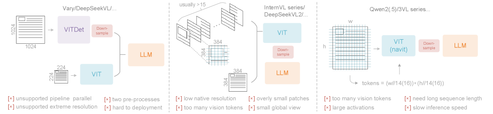
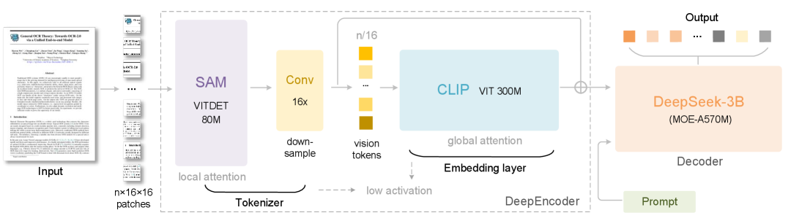
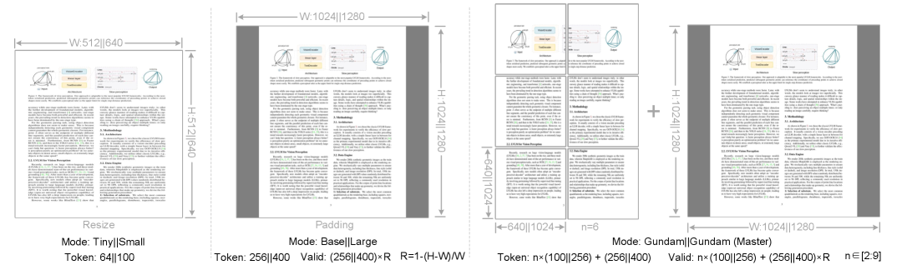

# DeepSeek-OCR: 文脈の光学的圧縮

> 原題: DeepSeek-OCR: Contexts Optical Compression
> 著者: Haoran Wei, Yaofeng Sun, Yukun Li
> 所属: DeepSeek-AI
> 出典: arXiv:2510.18234（2025 年 10 月）
> Code & Models: https://github.com/deepseek-ai/DeepSeek-OCR

**翻訳ノート**: 原典 `raw/papers/DeepSeek-OCR_ Contexts Optical Compression.md` は Web Clipper による抽出が不完全で Abstract と References のみが含まれていた。本文の翻訳は ar5iv（https://ar5iv.labs.arxiv.org/html/2510.18234）から取得した完全版に基づく。

---

## Abstract（要旨）

我々は **DeepSeek-OCR** を提示する。これは **光学的 2D マッピングを介した長文脈圧縮の実現可能性**に関する初期的調査である。DeepSeek-OCR は 2 つの構成要素から成る：**DeepEncoder** と、デコーダとしての **DeepSeek3B-MoE-A570M**。具体的には、DeepEncoder はコア・エンジンとして機能し、高解像度入力下で **低活性化メモリ**を維持しつつ **高圧縮比**を達成し、**最適で管理可能な数の視覚トークン**を保証するよう設計されている。実験は、**テキスト・トークン数が視覚トークンの 10 倍以内（圧縮比 < 10×）**のとき、モデルが **97% のデコード（OCR）精度**を達成できることを示す。**圧縮比 20×** ですら、OCR 精度は **約 60% を維持**する。これは **歴史的長文脈圧縮**や **LLM の記憶忘却機構**などの研究領域に大きな約束を示す。これを超えて、DeepSeek-OCR は高い実用的価値も実証する。**OmniDocBench では、わずか 100 視覚トークンで GOT-OCR2.0（256 トークン/ページ）を凌駕**し、**800 視覚トークン未満で MinerU2.0（平均 6000+ トークン/ページ）を上回る**。プロダクションでは、DeepSeek-OCR は **1 台の A100-40G で 1 日 20 万ページ以上**の LLM/VLM 訓練データを生成できる。コードとモデル重みは https://github.com/deepseek-ai/DeepSeek-OCR で公開されている。

<figure>

<figcaption>図2（原典 Figure 2）: 既存 VLM エンコーダ・アーキテクチャの比較と限界。左: Vary/DeepSeekVL 系の VITDet + VIT 二重前処理アプローチ（パイプライン並列非対応、極端な解像度非対応、2 つの前処理、展開困難）。中: InternVL 系の 384² パッチ多数アプローチ（通常 >15 パッチ、低 native 解像度、視覚トークン過多、小グローバル・ビュー）。右: Qwen2(.5)/3VL 系の NaViT アプローチ（視覚トークン過多、大活性化、長系列必要、推論遅い）。</figcaption>
</figure>

## 1. Introduction（はじめに）

本論文は、**視覚モダリティをテキスト情報の効率的圧縮媒体として活用**する研究を導入する。基本的な洞察は、**単一の文書画像が同等のデジタル・テキストよりも実質的に少ないトークンで相当な情報を符号化**できることであり、これは視覚トークンが伝統的なテキスト表現よりも高い圧縮比を達成できる可能性を示唆する。

著者らは、視覚言語モデル（VLM）を **「LLM 中心の視点」**から再定式化する：視覚エンコーダは **テキスト情報処理の効率を高める**ためのものである。**OCR は理想的な検証台**として機能する。なぜならば、視覚表現とテキスト表現の間の **自然な圧縮-解凍マッピング**を提供し、定量的評価指標を提供するからである。

**主要な主張**:
- **9-10× テキスト圧縮**で **96% 以上の OCR 精度**
- **10-12× 圧縮**で **約 90% の精度**
- **20× 圧縮**で **約 60% の精度**（Fox ベンチマーク）

## 2. DeepEncoder アーキテクチャ

### 設計哲学

DeepEncoder は **5 つの要件**に対応する：
1. **高解像度処理能力**
2. **低活性化メモリ**
3. **最小視覚トークン数**
4. **複数解像度サポート**
5. **適度なパラメータ数**

<figure>

<figcaption>図3（原典 Figure 3）: DeepEncoder のアーキテクチャ概観。SAM（VITDet 80M）が局所アテンションで高解像度入力を処理し、2 層 ConvNet 圧縮器が 16× ダウンサンプリング、CLIP（ViT 300M）がグローバル・アテンションで意味抽出。Tokenizer から Embedding Layer を経て DeepSeek3B デコーダへ。</figcaption>
</figure>

### コンポーネント構造

エンコーダは **2 つのコンポーネントを直列**に組み合わせる：

**Visual Perception Component（視覚知覚成分）**: **SAM-base（80M パラメータ、patch size 16）**、**window attention（ウィンドウ・アテンション）**支配。**局所ウィンドウ化**を介して許容可能な活性化メモリで **高解像度入力**を処理。

**Visual Knowledge Component（視覚知識成分）**: **CLIP-large（300M パラメータ）**、**dense global attention（密大域アテンション）**。**圧縮された表現**から意味的特徴を抽出。

**Compression Bridge（圧縮ブリッジ）**: **2 層畳み込みモジュール**でコンポーネント間に **16× ダウンサンプリング**を行う。各層は **kernel=3, stride=2, padding=1**、チャンネル数 **256→1024** に増加。

### トークン処理の例

1024×1024 入力の場合：
- **SAM セグメンテーション後**: 4096 パッチ・トークン（1024/16 × 1024/16）
- **16× 圧縮後**: 256 トークンが CLIP に入力
- **最終アーキテクチャ・パラメータ**: 合計約 **380M**

### 複数解像度モード

<figure>

<figcaption>図4（原典 Figure 4）: DeepSeek-OCR の複数解像度モード（Tiny/Small/Base/Large/Gundam）の実際の文書例。各モードで使用する視覚トークン数を表示。</figcaption>
</figure>

**ネイティブ解像度モード**:

| Mode | Resolution | Tokens | Process |
| --- | --- | --- | --- |
| **Tiny** | 512×512 | **64** | Resize |
| **Small** | 640×640 | **100** | Resize |
| **Base** | 1024×1024 | **256** | Padding |
| **Large** | 1280×1280 | **400** | Padding |

**動的解像度モード**:
- **Gundam**: n×(640×640) タイル + 1024×1024 グローバル・ビュー
  - 出力トークン: **n×100 + 256**（n は通常 2-9）
- **Gundam-M**: n×(1024×1024) タイル + 1280×1280 グローバル・ビュー
  - Gundam-M のみ継続訓練（負荷バランスのため）

**Valid Token 計算式（パディング・モード用）**:

$$
N_{\text{valid}} = \lceil N_{\text{actual}} \times [1 - \frac{\max(w,h) - \min(w,h)}{\max(w,h)}] \rceil
$$

この式は、パディングを介したアスペクト比保持を考慮する。

## 3. デコーダ・アーキテクチャ

**モデル**: **DeepSeek-3B-MoE** with **A570M 活性化パラメータ**

**構成**:
- **64 個の routed expert**、**推論ごとに 6 個活性化**
- **2 個の shared expert**
- **推論時 約 570M パラメータ活性**
- 圧縮された視覚トークンをテキスト表現にマッピング

デコーダは以下の関数を実装する：

$$
f_{\text{dec}}: \mathbb{R}^{n \times d_{\text{latent}}} \to \mathbb{R}^{N \times d_{\text{text}}}; \quad \hat{X} = f_{\text{dec}}(Z)
$$

ここで **n ≤ N**（圧縮された視覚トークン ≤ 出力テキスト・トークン）であり、これは **「コンパクトな言語モデルが効果的に学習できる非線形マッピング」**を表す。

## 4. 訓練データ構成

**総データ分布**:
- **OCR 1.0 データ**: **70%**
- **一般視覚データ**: **20%**
- **テキスト専用データ**: **10%**

### OCR 1.0 データ（30M+ ページ）

**文書データ**:
- 30M の多様な PDF ページ（約 **100 言語**）
- 中国語: 約 25M ページ
- 他言語: 約 5M ページ
- 2 つの注釈タイプ:
  - **粗注釈 (Coarse annotations)**: 少数言語テキスト認識のため fitz ライブラリを介して直接抽出
  - **精細注釈 (Fine annotations)**: 2M 中国語 + 2M 英語ページ、PP-DocLayout レイアウト・モデルと MinerU/GOT-OCR2.0 検出/認識ペアでラベル付け
  - **少数言語**: GOT-OCR2.0 のモデル・フライホイール手法で 600K サンプル
- **3M Word 文書データ**（HTML 形式の表、数式）
- オープンソース補完（NLLB-OCR, ArXiv）

**シーン OCR**:
- 中国語: **10M サンプル**（LAION + Wukong ソース、PaddleOCR ラベル付け）
- 英語: **10M サンプル**
- 検出ボックス出力はプロンプトで制御可能

### OCR 2.0 データ

**チャート解析**: **10M 合成画像**
- レンダリング: pyecharts / matplotlib
- タイプ: 折れ線、棒、円、複合チャート
- 出力形式: 画像→HTML 表

**化学式**: **5M 画像-テキスト対**
- ソース: PubChem の SMILES 形式
- レンダリング: RDKit
- 出力: SMILES 表記

**平面幾何**: **1M 解析サンプル**
- 生成: **Slow Perception フレームワーク**
- サイズ符号化: セグメントあたり 4 perception-ruler 単位
- 拡張: 幾何変換不変変換
- 出力: 辞書形式（端点、線種、座標）

### 一般視覚データ（20%）

**DeepSeek-VL2** アプローチに従う：
- キャプショニング・タスク
- 検出タスク
- グラウンディング・タスク
- 目的: OCR 専門化を妨げずに一般視覚インターフェースを保持

### テキスト専用データ（10%）

- 社内事前学習データセット
- 系列長: **8192 トークン**（モデル文脈に一致）
- 目的: 言語モデリング能力を維持

## 5. 訓練パイプラインとハイパーパラメータ

### Stage 1: DeepEncoder 訓練

- **データ**: OCR 1.0 + 2.0 データ + 100M LAION サンプル
- **フレームワーク**: コンパクト言語モデルでの次トークン予測
- **ハイパーパラメータ**:
  - バッチサイズ: 1280
  - エポック: 2
  - オプティマイザ: AdamW
  - 学習率: 5e-5
  - スケジューラ: Cosine annealing
  - 系列長: 4096

### Stage 2: DeepSeek-OCR 全訓練

- **インフラ**: **HAI-LLM** プラットフォーム、**20 ノード（各 8× A100-40G）**
- **並列化**: パイプライン並列（4 ステージ）+ データ並列（DP=40）

**コンポーネント配置**:
- **PP0**: SAM + 圧縮器（凍結）
- **PP1**: CLIP（凍結解除、入力埋め込みとして動作）
- **PP2-PP3**: それぞれ 6 つの transformer 層（DeepSeek-3B-MoE）

**ハイパーパラメータ**:
- グローバル・バッチサイズ: 640
- オプティマイザ: AdamW
- 学習率: 3e-5
- スケジューラ: Step-based
- 系列長: 8192
- 訓練速度:
  - テキスト専用: **90B トークン/日**
  - マルチモーダル: **70B トークン/日**

**Gundam-Master**: 事前訓練済みモデルで継続訓練、6M サンプル・データ

## 6. 実験結果

### 6.1 視覚-テキスト圧縮研究（Fox ベンチマーク）

**テスト条件**: **600-1300 テキスト・トークン**を持つ英語文書

**結果 - 64 視覚トークン（512×512、Tiny）**:

| Text Tokens | Precision | Compression |
| --- | --- | --- |
| 600-700 | 96.5% | 10.5× |
| 700-800 | 93.8% | 11.8× |
| 800-900 | 83.8% | 13.2× |
| 900-1000 | 85.9% | 15.1× |
| 1000-1100 | 79.3% | 16.5× |
| 1100-1200 | 76.4% | 17.7× |
| 1200-1300 | **59.1%** | **19.7×** |

**結果 - 100 視覚トークン（640×640、Small）**:

| Text Tokens | Precision | Compression |
| --- | --- | --- |
| 600-700 | **98.5%** | 6.7× |
| 700-800 | **97.3%** | 7.5× |
| 800-900 | **96.8%** | 8.5× |
| 900-1000 | **96.8%** | 9.7× |
| 1000-1100 | 91.5% | 10.6× |
| 1100-1200 | 89.8% | 11.3× |
| 1200-1300 | 87.1% | 12.6× |

**主要発見**: **約 10× 比率で近似ロスレス圧縮**、**20× 圧縮で 60% 精度**

### 6.2 OmniDocBench 性能

パイプラインおよびエンドツーエンド・モデルに対して edit distance（編集距離、低いほど良い）で評価：

**DeepSeek-OCR の結果（全体編集距離）**:

| Mode | Vision Tokens | English | Chinese | Overall |
| --- | --- | --- | --- | --- |
| Tiny | 64 | 0.386 | 0.361 | 0.32 |
| Small | 100 | 0.221 | 0.284 | 0.205 |
| Base | 256 (182*) | 0.137 | 0.24 | 0.156 |
| Large | 400 (285*) | 0.138 | 0.208 | 0.117 |
| **Gundam** | **795** | 0.127 | 0.181 | **0.083** |
| Gundam-M | 1853 (200dpi) | 0.123 | 0.157 | 0.085 |

*Valid tokens（式 1 による）

**競合との比較**:

| Model | Token Count | Overall Edit Distance | Status |
| --- | --- | --- | --- |
| GOT-OCR2.0 | 256 | 0.287 | Baseline |
| MinerU2.0 | 6790 | 0.133 | SOTA |
| dots.ocr (200dpi) | 5545 | 0.125 | SOTA |
| **DeepSeek-OCR (Gundam)** | **795** | **0.083** | **SOTA** |
| **DeepSeek-OCR (Gundam-M)** | **1853** | **0.085** | **SOTA** |

**文書タイプ別性能（Base モード - 256 トークン）**:

| Category | Edit Distance | Notes |
| --- | --- | --- |
| Slides | 0.08 | わずか 64 トークンで十分 |
| Books | 0.037 | 100 トークンで優秀 |
| Exam Papers | 0.13 | 100 トークンで良好 |
| Financial Reports | 0.027 | 卓越 |
| Newspapers | 0.645 | Gundam/Gundam-M が必要 |

**他のエンドツーエンド・モデル（サンプル比較）**:
- Nougat (2352 トークン): 0.452 全体
- SmolDocling (392 トークン): 0.493 全体
- InternVL2-76B (6790 トークン): 0.44 全体
- Qwen2.5-VL-7B (3949 トークン): 0.316 全体
- OCRFlux-3B (3949 トークン): 0.238 全体
- InternVL3-78B (6790 トークン): 0.218 全体
- Qwen2.5-VL-72B (3949 トークン): 0.214 全体

**主要成果**: **DeepSeek-OCR は 100 トークンで GOT-OCR2.0（256 トークン）を凌駕**；**800 トークン未満（Gundam）で MinerU2.0（6790 トークン）を上回る**

## 7. 実用的価値と本番能力

**スループット**: **「1 台の A100-40G で 1 日 20 万ページ以上」**

20 ノード（各 8× A100-40G）にスケール: **1 日 3300 万ページ**

これは **LLM/VLM 事前学習用の大規模合成データ生成**を **プロダクション・グレードの速度**で可能にする。

## 8. 質的能力

### 深層解析（Deep Parsing）

二次的モデル呼び出しで以下を可能にする：
- **チャート解析**（財務報告書からの構造化抽出）
- **化学式認識**（SMILES 形式出力）
- **幾何図形解析**（線分座標）
- 文書内の自然画像キャプショニング

### 多言語サポート

- **約 100 言語**の PDF 文書サポート
- レイアウトあり/なし OCR モード両方
- 実証済み: アラビア語、シンハラ語、その他
- 少数言語にはレイアウト・モデル汎化を使用

### 一般視覚理解

OCR 専門化（70% データ配分）にもかかわらず、モデルは以下を保持：
- 画像キャプショニング
- 物体検出
- グラウンディング・タスク
- 言語理解能力

（注: SFT 段階なし、一部タスクには補完プロンプトが必要）

## 9. 記憶忘却機構（Memory Forgetting Mechanism）

**核心的洞察**: **人間の記憶減衰と視覚知覚劣化の並行性**—両方とも **段階的情報損失**を示す。

**提案実装**:
1. **歴史的会話テキストを画像にレンダリング**
2. **古い画像を段階的に縮小**
3. **多レベル圧縮を達成**:
   - **最近の文脈**: 高解像度（全トークン）
   - **古い文脈**: 削減解像度（少ないトークン）
   - **非常に古い文脈**: 極度に圧縮（60% 精度を維持）

**応用**: 古いやり取りが **自然な忘却曲線**に従って少ないトークンを消費しつつ意味的保持を維持する **多ターン対話システム**。

## 10. 結論

本論文は DeepSeek-OCR を **「効率的視覚-テキスト圧縮の予備的概念実証」**として確立し、**コンパクトなモデルが少数の視覚トークンから 10 倍以上のテキスト・トークンを効果的にデコード**できることを検証する。

**将来の研究方向**:
- デジタル-光学テキスト交互配置事前学習
- Needle-in-haystack 長文脈テスト
- 拡張文脈圧縮の検証
- 超長文脈 LLM 処理への応用

本作は **計算制約に対処するための有望な新方向性**を示唆する—光学圧縮機構を介した長文脈言語モデル処理。
