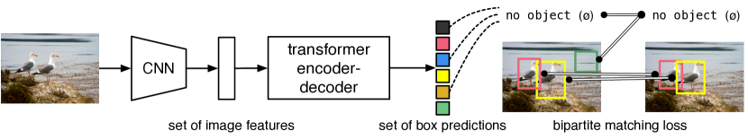
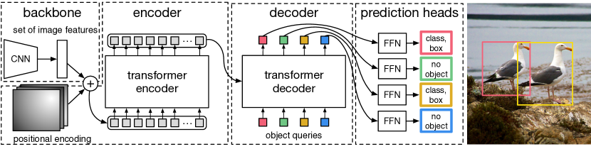
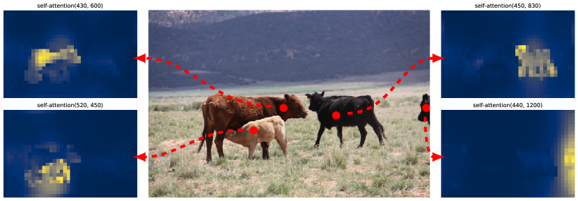
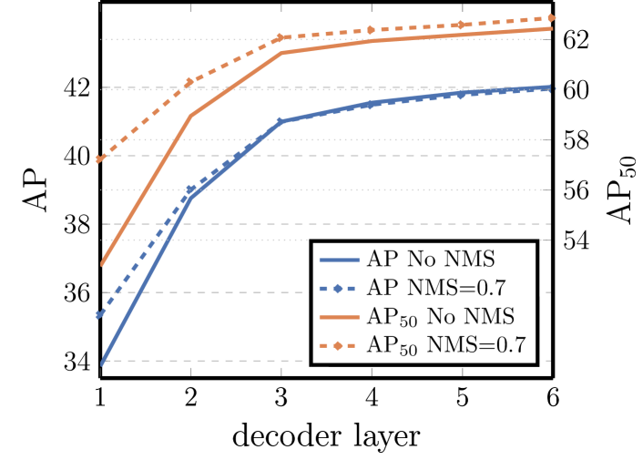
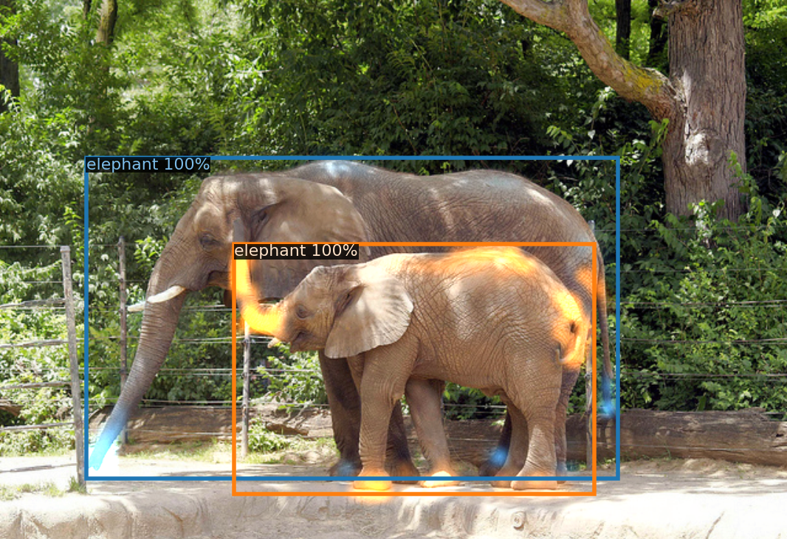
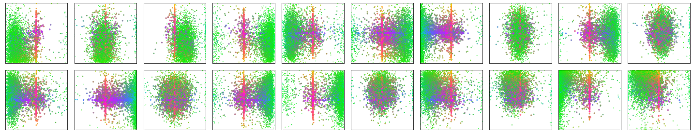
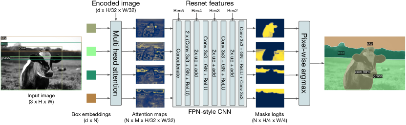
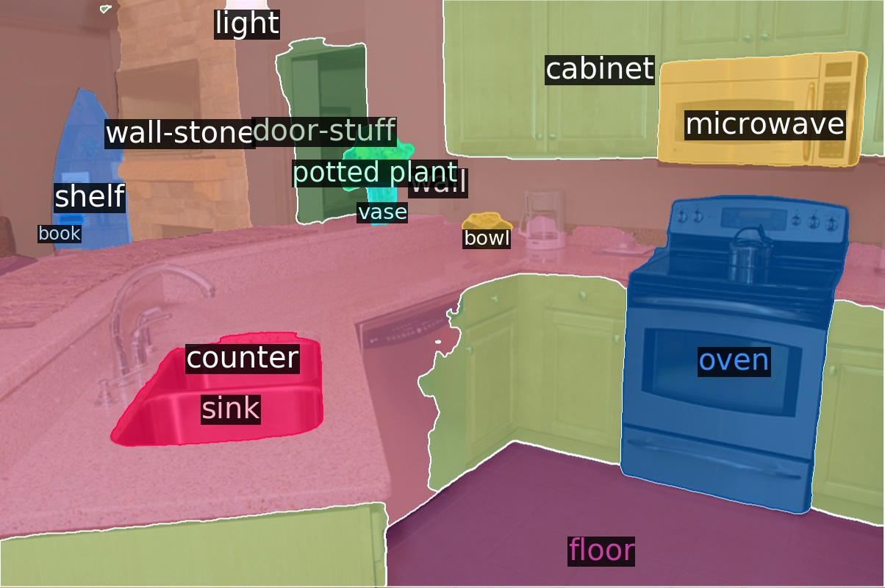

# Transformer による end-to-end 物体検出

> 原題: End-to-End Object Detection with Transformers
> arXiv: 2005.12872
> 著者: Nicolas Carion, Francisco Massa, Gabriel Synnaeve, Nicolas Usunier, Alexander Kirillov, Sergey Zagoruyko（Facebook AI）
> 出典: ECCV 2020
> コード・モデル: <https://github.com/facebookresearch/detr>

## Abstract（要旨）

我々は、物体検出を直接的な **集合予測問題（direct set prediction problem）** と見なす新しい手法を提示する。

我々のアプローチは検出パイプラインを合理化し、**非最大抑制（non-maximum suppression, NMS）の手続きやアンカー生成（anchor generation）** など、タスクに関する事前知識を明示的にエンコードする多くの hand-designed なコンポーネントの必要性を効果的に排除する。

**DEtection TRansformer（DETR）** と呼ばれるこの新しいフレームワークの主な構成要素は、二部マッチング（bipartite matching）によって一意な予測を強制する **集合ベースのグローバル損失**、および **transformer エンコーダ-デコーダアーキテクチャ** である。

少数の固定された学習可能な **object queries**（物体クエリ）が与えられると、DETR は物体間の関係とグローバルな画像コンテキストを推論し、**最終的な予測集合を並列に直接出力** する。

この新しいモデルは概念的にシンプルであり、他の多くの現代的な検出器とは異なり、専用のライブラリを必要としない。

DETR は、難易度の高い COCO 物体検出データセットにおいて、確立された高度に最適化された Faster R-CNN ベースラインと同等の精度および実行時性能を示す。

さらに、DETR は **統一された方法でパノプティックセグメンテーションを生成する** ように容易に一般化でき、競合するベースラインを大幅に上回ることを示す。

訓練コードと事前学習済みモデルは <https://github.com/facebookresearch/detr> で公開している。

## 1 Introduction（はじめに）

物体検出の目標は、対象となる各物体のバウンディングボックスとカテゴリラベルの集合を予測することである。

現代の検出器は、この集合予測タスクに **間接的な方法** で取り組んでおり、大量の **proposals**（提案）[37, 5]、**anchors**（アンカー）[23]、または **window centers**（窓中心）[53, 46] 上で代理的な回帰・分類問題を定義する。

これらの性能は、近接する重複予測を整理するための後処理ステップ、anchor 集合の設計、ground truth ボックスを anchor に割り当てるヒューリスティック [52] によって大きく影響を受ける。

このようなパイプラインを単純化するため、我々はこれらの代理タスクをバイパスする **直接的な集合予測アプローチ** を提案する。

この end-to-end の哲学は、機械翻訳や音声認識のような複雑な構造化予測タスクで大きな進歩をもたらしたが、物体検出ではまだ実現されていなかった。先行する試み [43, 16, 4, 39] は、他の形式の事前知識を追加するか、難易度の高いベンチマーク上で強いベースラインに対して競争力を示せていなかった。本論文はこのギャップを埋めることを目的とする。

我々は、物体検出を直接的な集合予測問題と見なすことによって、訓練パイプラインを合理化する。我々は、系列予測のための人気のあるアーキテクチャである transformer [47] に基づいた **エンコーダ-デコーダアーキテクチャ** を採用する。

transformer の **self-attention 機構**（自己注意機構）は、系列内のすべての要素間の **ペアワイズの相互作用** を明示的にモデル化するため、重複予測の除去のような集合予測の特定の制約に特に適している。

我々の **DEtection TRansformer（DETR、図 1 参照）** はすべての物体を一度に予測し、予測と ground truth 物体の間で **二部マッチング** を行う集合損失関数を用いて end-to-end で訓練される。

DETR は、空間 anchor や NMS のような、事前知識をエンコードする多くの hand-designed なコンポーネントを廃止することで、検出パイプラインを単純化する。既存のほとんどの検出手法とは異なり、DETR はカスタマイズされた層を必要としないため、標準的な CNN と transformer クラスを含む任意のフレームワークで容易に再現できる1。

<figure>

<figcaption>図1: DETR は、共通の CNN と transformer アーキテクチャを組み合わせることで、最終的な検出集合を（並列に）直接予測する。訓練中、二部マッチングが ground truth ボックスに予測を一意に割り当てる。マッチしなかった予測は「物体なし（no object）」クラス（∅）を予測すべきである。</figcaption>
</figure>

直接的な集合予測に関する従来のほとんどの研究と比較して、DETR の主な特徴は **二部マッチング損失** と **（非自己回帰的）並列デコーディング** を持つ transformer の組み合わせである [29, 12, 10, 8]。対照的に、従来研究は RNN による **自己回帰的デコーディング** に焦点を当てていた [43, 41, 30, 36, 42]。我々のマッチング損失関数は予測を ground truth 物体に一意に割り当て、予測物体の置換に対して不変であるため、それらを並列に出力できる。

我々は最も人気のある物体検出データセットの 1 つである COCO [24] 上で、非常に競争力のある Faster R-CNN ベースライン [37] に対して DETR を評価する。Faster R-CNN は多くの設計反復を経ており、その性能は元の出版以降大幅に改善されてきた。我々の実験は、新しいモデルが同等の性能を達成することを示す。より正確には、DETR は **大物体（large objects）で大幅に良い性能** を示し、これは transformer の非局所的な計算によって可能になったと考えられる。しかし、**小物体（small objects）では性能が低い**。FPN [22] の開発が Faster R-CNN に対して行ったのと同じ方法で、将来の研究がこの点を改善することを期待する。

DETR の訓練設定は、標準的な物体検出器とは複数の点で異なる。新しいモデルは **特別に長い訓練スケジュール** を必要とし、transformer での **補助的なデコーディング損失** から恩恵を受ける。我々はどのコンポーネントが実証された性能に重要かを徹底的に探求する。

DETR の設計思想はより複雑なタスクに容易に拡張できる。我々の実験では、事前学習済みの DETR の上に訓練された単純なセグメンテーションヘッドが、**パノプティックセグメンテーション（Panoptic Segmentation）** [19]（最近人気を博している難易度の高い画素レベル認識タスク）において競合するベースラインを上回ることを示す。

## 2 Related work（関連研究）

我々の研究は、いくつかの分野における先行研究に基づいている：集合予測のための **二部マッチング損失**、**transformer ベースのエンコーダ-デコーダ** アーキテクチャ、**並列デコーディング**、**物体検出手法** である。

### 2.1 Set Prediction（集合予測）

集合を直接予測する標準的な深層学習モデルは存在しない。基本的な集合予測タスクは **多ラベル分類** であるが（コンピュータビジョンの文脈での参照は [40, 33] 参照）、そのベースラインアプローチである one-vs-rest は、検出のように要素間に基礎構造（つまりほぼ同じボックス）がある問題には適用できない。

これらのタスクの最初の困難は **近接重複（near-duplicates）を回避する** ことである。現在の検出器のほとんどは、この問題に対処するために **非最大抑制（NMS）** のような後処理を使用するが、直接的な集合予測は後処理が不要である。冗長性を回避するため、**すべての予測要素間の相互作用をモデル化するグローバルな推論スキーム** が必要である。

固定サイズの集合予測には、密な全結合ネットワーク [9] で十分だが計算コストが高い。一般的なアプローチは、リカレントニューラルネットワーク（RNN）のような **自己回帰系列モデル** を使うことである [48]。

すべての場合で、損失関数は予測の置換に対して不変であるべきである。通常の解決策は **Hungarian アルゴリズム** [20] に基づく損失を設計し、ground truth と予測の間の **二部マッチング** を見つけることである。これは置換不変性を強制し、各 target 要素が一意のマッチを持つことを保証する。

我々は二部マッチング損失のアプローチに従う。しかし、ほとんどの先行研究とは対照的に、我々は自己回帰モデルから離れ、**並列デコーディングを用いた transformer** を使用する。これを以下で説明する。

### 2.2 Transformers and Parallel Decoding（Transformer と並列デコーディング）

Transformer は Vaswani ら [47] によって、機械翻訳のための新しい attention ベースの構成要素として導入された。**Attention 機構** [2] は、入力系列全体から情報を集約するニューラルネットワーク層である。

Transformer は **self-attention 層** を導入した。これは Non-Local Neural Networks [49] と同様に、系列の各要素を走査し、系列全体から情報を集約することで更新する。attention ベースのモデルの主な利点の 1 つは、**グローバルな計算と完全な記憶** であり、これにより RNN よりも長い系列に適している。Transformer は現在、自然言語処理、音声処理、コンピュータビジョンの多くの問題で RNN を置き換えつつある [8, 27, 45, 34, 31]。

Transformer は最初、初期の seq-to-seq モデル [44] に従い、**自己回帰モデル** で使用され、出力トークンを 1 つずつ生成していた。しかし、推論コストが法外（出力長に比例し、バッチ化が困難）であるため、音声 [29]、機械翻訳 [12, 10]、単語表現学習 [8]、最近では音声認識 [6] の領域で **並列系列生成** の開発が進んだ。我々もまた、計算コストと集合予測に必要なグローバルな計算を実行する能力との間で適切なトレードオフを持つため、transformer と並列デコーディングを組み合わせる。

### 2.3 Object detection（物体検出）

現代のほとんどの物体検出手法は、何らかの **初期推定値（initial guesses）** に対する予測を行う。**Two-stage 検出器** [37, 5] は **proposals（提案）** に対するボックスを予測し、**single-stage 手法** は **anchors（アンカー）** [23] や可能な物体中心のグリッド [53, 46] に対して予測を行う。最近の研究 [52] は、これらのシステムの最終性能が、これらの初期推定値がどのように設定されるかに大きく依存することを示している。

我々のモデルでは、この hand-crafted なプロセスを取り除き、anchor ではなく **入力画像に対する絶対的なボックス予測** で直接検出集合を予測することで、検出プロセスを合理化できる。

#### 2.3.1 Set-based loss（集合ベース損失）

いくつかの物体検出器 [9, 25, 35] は **二部マッチング損失** を使用していた。しかし、これらの初期の深層学習モデルでは、異なる予測間の関係は畳み込み層や全結合層のみでモデル化され、hand-designed な NMS 後処理がそれらの性能を改善することができた。より最近の検出器 [37, 23, 53] は、**ground truth と予測の間の非一意の割り当てルール** と NMS を組み合わせて使用する。

**Learnable NMS 手法** [16, 4] と **relation networks** [17] は、異なる予測間の関係を attention で明示的にモデル化する。直接的な集合損失を使用するため、後処理ステップを必要としない。しかし、これらの手法は、検出間の関係を効率的にモデル化するために、proposal ボックス座標のような **追加の hand-crafted なコンテキスト特徴** を使用する。一方、我々はモデルにエンコードされる事前知識を減らす解決策を探求する。

#### 2.3.2 Recurrent detectors（再帰型検出器）

我々のアプローチに最も近いのは、物体検出 [43] とインスタンスセグメンテーション [41, 30, 36, 42] のための end-to-end 集合予測である。我々と同様に、これらは CNN 活性化に基づくエンコーダ-デコーダアーキテクチャを持つ二部マッチング損失を使用し、バウンディングボックスの集合を直接生成する。しかし、これらのアプローチは小さなデータセットでのみ評価され、現代のベースラインに対しては評価されていなかった。特に、これらは **自己回帰モデル**（より正確には RNN）に基づいているため、並列デコーディングを伴う最近の transformer を活用していない。

## 3 The DETR model（DETR モデル）

検出における直接的な集合予測には、2 つの構成要素が不可欠である：(1) 予測と ground truth ボックスの間の **一意なマッチング** を強制する **集合予測損失**、および (2) 単一のパスで物体集合を予測し、その関係をモデル化する **アーキテクチャ**。我々は図 2 でアーキテクチャを詳細に説明する。

### 3.1 Object detection set prediction loss（物体検出集合予測損失）

DETR は、decoder を通る **1 回のパス** で、固定サイズの $N$ 個の予測集合を推論する。ここで $N$ は画像内の典型的な物体数よりも大幅に大きく設定される。訓練の主要な困難の 1 つは、予測された物体（クラス、位置、サイズ）を ground truth に対してスコアリングすることである。我々の損失は、予測と ground truth 物体の間の **最適な二部マッチング** を生成し、その後、物体特有の（バウンディングボックス）損失を最適化する。

ground truth の物体集合を $y$、$N$ 個の予測集合を $\hat{y}=\{\hat{y}_{i}\}_{i=1}^{N}$ で示す。$N$ が画像内の物体数より大きいと仮定し、$y$ も $\varnothing$（物体なし）でパディングされたサイズ $N$ の集合と見なす。これら 2 つの集合の間の二部マッチングを見つけるため、最も低いコストを持つ $N$ 要素の置換 $\sigma\in\mathfrak{S}_{N}$ を探す：

$$
\hat{\sigma}=\operatorname*{arg\,min}_{\sigma\in\mathfrak{S}_{N}}\sum_{i}^{N}{\cal L}_{\rm match}(y_{i},\hat{y}_{\sigma(i)}),
$$

ここで ${\cal L}_{\rm match}(y_{i},\hat{y}_{\sigma(i)})$ は ground truth $y_{i}$ とインデックス $\sigma(i)$ の予測の間の **ペアワイズ・マッチングコスト** である。この最適な割り当ては、先行研究（例: [43]）に従い、**Hungarian アルゴリズム** で効率的に計算される。

マッチングコストは、クラス予測と予測ボックス・ground truth ボックスの類似性の両方を考慮する。ground truth 集合の各要素 $i$ は $y_{i}=(c_{i},b_{i})$ と見なせる。ここで $c_{i}$ は target クラスラベル（$\varnothing$ の場合もある）、$b_{i}\in[0,1]^{4}$ は ground truth ボックス中心座標とその画像サイズに対する高さ・幅を定義するベクトルである。インデックス $\sigma(i)$ の予測について、クラス $c_{i}$ の確率を $\hat{p}_{\sigma(i)}(c_{i})$、予測ボックスを $\hat{b}_{\sigma(i)}$ と定義する。これらの記法で、${\cal L}_{\rm match}(y_{i},\hat{y}_{\sigma(i)})$ を $-\mathds{1}_{\{c_{i}\neq\varnothing\}}\hat{p}_{\sigma(i)}(c_{i})+\mathds{1}_{\{c_{i}\neq\varnothing\}}{\cal L}_{\rm box}(b_{i},\hat{b}_{\sigma(i)})$ と定義する。

このマッチングを見つける手順は、現代の検出器で proposal [37] や anchor [22] を ground truth 物体にマッチさせるために使用されるヒューリスティック割り当てルールと同じ役割を果たす。主な違いは、**重複なしの直接的な集合予測のために 1 対 1 マッチングを見つける必要がある** ことである。

第 2 ステップは損失関数の計算、つまり前ステップでマッチしたすべてのペアについての **Hungarian 損失** を計算することである。我々は損失を一般的な物体検出器の損失と同様に、クラス予測の負の対数尤度とボックス損失（後述）の線形組み合わせとして定義する：

$$
{\cal L}_{\rm Hungarian}(y,\hat{y})=\sum_{i=1}^{N}\left[-\log\hat{p}_{\hat{\sigma}(i)}(c_{i})+\mathds{1}_{\{c_{i}\neq\varnothing\}}{\cal L}_{\rm box}(b_{i},\hat{b}_{\hat{\sigma}}(i))\right]\,,
$$

ここで $\hat{\sigma}$ は最初のステップ (1) で計算された最適な割り当てである。実際には、クラス不均衡を考慮するため、$c_{i}=\varnothing$ の場合の対数確率項を **係数 10 でダウンウェイト** する。これは Faster R-CNN の訓練手順が正/負 proposal をサブサンプリングによってバランスする方法に類似している [37]。物体と $\varnothing$ の間のマッチングコストは予測に依存しないため、その場合のコストは定数になることに注意。マッチングコストでは対数確率の代わりに確率 $\hat{p}_{\hat{\sigma}(i)}(c_{i})$ を使用する。これにより、クラス予測項が ${\cal L}_{\rm box}(\cdot,\cdot)$（後述）と通約可能になり、経験的により良い性能が観察された。

#### 3.1.1 Bounding box loss（バウンディングボックス損失）

マッチングコストと Hungarian 損失の第 2 部分は、バウンディングボックスをスコアリングする ${\cal L}_{\rm box}(\cdot)$ である。何らかの初期推定値に対する $\Delta$ としてボックス予測を行う多くの検出器とは異なり、我々は **ボックス予測を直接行う**。このアプローチは実装を簡素化するが、損失の相対的なスケールに関する問題を提起する。最も一般的に使用される $\ell_{1}$ 損失は、相対誤差が同じでも小さなボックスと大きなボックスで異なるスケールを持つ。

この問題を緩和するため、$\ell_{1}$ 損失とスケール不変な **一般化 IoU 損失（generalized IoU, GIoU）** [38] ${\cal L}_{\rm iou}(\cdot,\cdot)$ の線形組み合わせを使用する。全体として、我々のボックス損失 ${\cal L}_{\rm box}(b_{i},\hat{b}_{\sigma(i)})$ は $\lambda_{\rm iou}{\cal L}_{\rm iou}(b_{i},\hat{b}_{\sigma(i)})+\lambda_{\rm L1}||b_{i}-\hat{b}_{\sigma(i)}||_{1}$ と定義され、$\lambda_{\rm iou},\lambda_{\rm L1}\in\mathbb{R}$ はハイパーパラメータである。これらの 2 つの損失はバッチ内の物体数で正規化される。

### 3.2 DETR architecture（DETR アーキテクチャ）

DETR の全体的なアーキテクチャは驚くほどシンプルで、図 2 に示される。3 つの主要なコンポーネントを含む：コンパクトな特徴表現を抽出する **CNN backbone**、**transformer エンコーダ-デコーダ**、最終的な検出予測を行う **シンプルな feed forward network（FFN）**。

<figure>

<figcaption>図2: DETR は従来の CNN backbone を使用して入力画像の 2D 表現を学習する。モデルはそれを平坦化し、transformer encoder に渡す前に位置エンコーディングを補足する。次に transformer decoder が、object queries と呼ぶ少数の固定された学習可能な位置埋め込みを入力として受け取り、さらに encoder 出力にも attend する。decoder の各出力埋め込みを共有 feed forward network (FFN) に渡し、検出（クラスとバウンディングボックス）または「物体なし（no object）」クラスを予測する。</figcaption>
</figure>

多くの現代的な検出器とは異なり、DETR は共通の CNN backbone と transformer アーキテクチャ実装を提供する任意の深層学習フレームワークで、**わずか数百行で実装** できる。DETR の推論コードは PyTorch [32] で **50 行未満** で実装できる。我々はこの手法の単純さが、新しい研究者を検出コミュニティに引き寄せることを願う。

#### 3.2.1 Backbone

最初の画像 $x_{\rm img}\in\mathbb{R}^{3\times H_{0}\times W_{0}}$（3 色チャンネル2）から始め、従来の CNN backbone がより低解像度の活性化マップ $f\in\mathbb{R}^{C\times H\times W}$ を生成する。我々が使用する典型的な値は $C=2048$ と $H,W=\frac{H_{0}}{32},\frac{W_{0}}{32}$ である。

#### 3.2.2 Transformer encoder

まず、1×1 畳み込みが高レベル活性化マップ $f$ のチャンネル次元を $C$ からより小さな次元 $d$ に削減し、新しい特徴マップ $z_{0}\in\mathbb{R}^{d\times H\times W}$ を作成する。Encoder は系列を入力として期待するため、$z_{0}$ の空間次元を 1 次元に潰し、$d\times HW$ 特徴マップを得る。各 encoder 層は標準的なアーキテクチャを持ち、**multi-head self-attention モジュール** と **feed forward network（FFN）** で構成される。Transformer アーキテクチャは順序不変なので、各 attention 層の入力に追加される **固定位置エンコーディング** [31, 3] で補足する。アーキテクチャの詳細な定義は補足資料に従う（[47] に記述）。

#### 3.2.3 Transformer decoder

Decoder は transformer の標準アーキテクチャに従い、multi-head self- と encoder-decoder attention 機構を用いて $N$ 個のサイズ $d$ の埋め込みを変換する。元の transformer との違いは、Vaswani ら [47] が出力系列を 1 要素ずつ予測する自己回帰モデルを使用するのに対し、我々のモデルは **各 decoder 層で $N$ 個の物体を並列にデコード** することである。馴染みのない読者は補足資料を参照されたい。Decoder も順序不変であるため、**$N$ 個の入力埋め込みは異なる結果を生成するために異なる必要がある**。これらの入力埋め込みは学習可能な位置エンコーディングで、**object queries（物体クエリ）** と呼ぶ。encoder と同様に、各 attention 層の入力にそれらを追加する。

$N$ 個の object queries は decoder によって出力埋め込みに変換される。次に、それらは FFN（次節で説明）によって **独立に** ボックス座標とクラスラベルにデコードされ、$N$ 個の最終予測となる。これらの埋め込みに対する self- および encoder-decoder attention を使用することで、モデルは画像全体をコンテキストとして使用しながら、すべての物体について **ペアワイズな関係を介してグローバルに推論** する。

#### 3.2.4 Prediction feed-forward networks (FFNs)（予測フィードフォワードネットワーク）

最終予測は、ReLU 活性化関数と隠れ次元 $d$ を持つ 3 層パーセプトロンと、線形射影層によって計算される。FFN は入力画像に対するボックスの正規化された中心座標、高さ、幅を予測し、線形層は softmax 関数を使用してクラスラベルを予測する。$N$ は通常、画像内の実際の物体数よりも大きいため、固定サイズ $N$ のバウンディングボックスを予測するので、**スロット内で物体が検出されないことを表すために特殊なクラスラベル $\varnothing$** が使用される。このクラスは、標準的な物体検出アプローチの「背景」クラスに類似した役割を果たす。

#### 3.2.5 Auxiliary decoding losses（補助デコーディング損失）

訓練中の decoder で **補助損失（auxiliary losses）** [1] を使用することが、特にモデルが各クラスの正しい物体数を出力するのを助けるために有用であることがわかった。各 decoder 層の後に予測 FFN と Hungarian 損失を追加する。すべての予測 FFN はパラメータを共有する。異なる decoder 層からの予測 FFN への入力を正規化するため、追加の共有 layer-norm を使用する。

## 4 Experiments（実験）

我々は、DETR が COCO 上の定量的評価で Faster R-CNN と比較して競争力のある結果を達成することを示す。次に、アーキテクチャと損失の詳細なアブレーション研究を、洞察と質的結果とともに提供する。最後に、DETR が汎用的で拡張可能なモデルであることを示すため、固定された DETR モデルの上で小さな拡張のみを訓練して、パノプティックセグメンテーションでの結果を提示する。実験を再現するためのコードと事前学習済みモデルを <https://github.com/facebookresearch/detr> で提供する。

#### 4.0.1 Dataset（データセット）

COCO 2017 検出およびパノプティックセグメンテーションデータセット [24, 18] で実験を行う。それぞれ 11.8 万の訓練画像と 5 千の検証画像を含む。各画像はバウンディングボックスとパノプティックセグメンテーションでアノテーションされている。画像あたり平均 7 インスタンス、訓練セットの 1 画像で最大 63 インスタンス、同じ画像で小から大までの範囲がある。指定がない場合は AP として bbox AP（複数のしきい値にわたる積分指標）を報告する。Faster R-CNN との比較では、最終訓練エポックでの検証 AP を報告し、アブレーションでは最後の 10 エポックの検証結果の中央値を報告する。

#### 4.0.2 Technical details（技術詳細）

我々は AdamW [26] で DETR を訓練し、transformer の初期学習率を $10^{-4}$、backbone の初期学習率を $10^{-5}$、weight decay を $10^{-4}$ に設定する。すべての transformer 重みは Xavier 初期化 [11] で初期化され、backbone は torchvision からの ImageNet 事前学習済み ResNet モデル [15]（凍結された batchnorm 層）である。2 つの異なる backbone での結果を報告する：ResNet-50 と ResNet-101。対応するモデルをそれぞれ **DETR** と **DETR-R101** と呼ぶ。

[21] に従って、backbone の最後のステージに dilation を追加し、このステージの最初の畳み込みから stride を削除することによって、特徴解像度を増加させる。対応するモデルをそれぞれ **DETR-DC5** と **DETR-DC5-R101**（dilated C5 stage）と呼ぶ。この変更は解像度を 2 倍にし、小物体の性能を改善する。ただし encoder の self-attention のコストが 16 倍に増加し、計算コストが全体で 2 倍増加するという代償がある。これらのモデルと Faster R-CNN の FLOPs の完全な比較は表 1 に示す。

我々は **scale augmentation** を使用し、入力画像の短辺が少なくとも 480、最大 800 ピクセル、長辺が最大 1333 になるようにリサイズする [50]。encoder の self-attention を通じてグローバルな関係性の学習を助けるため、訓練中に **random crop augmentation** も適用し、これにより約 1 AP の性能改善が得られる。具体的には、訓練画像は 0.5 の確率でランダムな矩形パッチにクロップされ、次に 800-1333 に再リサイズされる。transformer は **デフォルトのドロップアウト 0.1** で訓練される。

推論時には、一部のスロットが空クラスを予測する。AP を最適化するため、これらのスロットの予測を、対応する信頼度を使用して **2 番目に高いスコアを持つクラス** で上書きする。これにより、空スロットをフィルタリングするのと比較して AP が 2 ポイント改善される。他の訓練ハイパーパラメータはセクション 0.A.4 にある。我々のアブレーション実験では、200 エポック後に係数 10 で学習率を下げる **300 エポックの訓練スケジュール** を使用する。ここで 1 エポックはすべての訓練画像を 1 回パスすることである。16 個の V100 GPU 上で 300 エポックのベースラインモデルを訓練するには 3 日かかり、GPU あたり 4 画像（つまり総バッチサイズ 64）である。Faster R-CNN と比較するために使用するより長いスケジュールでは、400 エポック後に学習率を下げて 500 エポック訓練する。このスケジュールはより短いスケジュールと比較して 1.5 AP を追加する。

### 4.1 Comparison with Faster R-CNN（Faster R-CNN との比較）

**表1: COCO 検証セット上での ResNet-50 と ResNet-101 backbone を持つ Faster R-CNN との比較。** 上部セクションは Detectron2 [50] の Faster R-CNN モデルの結果、中部セクションは GIoU [38]、ランダムクロップ訓練時拡張、長い 9× 訓練スケジュールを持つ Faster R-CNN モデルの結果を示す。DETR モデルは大幅に調整された Faster R-CNN ベースラインと同等の結果を達成し、AP_S は低いが AP_L が大幅に改善している。FLOPS と FPS の測定には torchscript Faster R-CNN と DETR モデルを使用する。R101 が名前にないものは ResNet-50 に対応する。

| Model | GFLOPS/FPS | #params | AP | AP_50 | AP_75 | AP_S | AP_M | AP_L |
|---|---|---|---|---|---|---|---|---|
| Faster RCNN-DC5 | 320/16 | 166M | 39.0 | 60.5 | 42.3 | 21.4 | 43.5 | 52.5 |
| Faster RCNN-FPN | 180/26 | 42M | 40.2 | 61.0 | 43.8 | 24.2 | 43.5 | 52.0 |
| Faster RCNN-R101-FPN | 246/20 | 60M | 42.0 | 62.5 | 45.9 | 25.2 | 45.6 | 54.6 |
| Faster RCNN-DC5+ | 320/16 | 166M | 41.1 | 61.4 | 44.3 | 22.9 | 45.9 | 55.0 |
| Faster RCNN-FPN+ | 180/26 | 42M | 42.0 | 62.1 | 45.5 | 26.6 | 45.4 | 53.4 |
| Faster RCNN-R101-FPN+ | 246/20 | 60M | 44.0 | 63.9 | 47.8 | 27.2 | 48.1 | 56.0 |
| **DETR** | 86/28 | 41M | 42.0 | 62.4 | 44.2 | 20.5 | 45.8 | **61.1** |
| **DETR-DC5** | 187/12 | 41M | 43.3 | 63.1 | 45.9 | 22.5 | 47.3 | 61.1 |
| **DETR-R101** | 152/20 | 60M | 43.5 | 63.8 | 46.4 | 21.9 | 48.0 | 61.8 |
| **DETR-DC5-R101** | 253/10 | 60M | **44.9** | 64.7 | 47.7 | 23.7 | 49.5 | **62.3** |

Transformer は通常 Adam または Adagrad オプティマイザで非常に長い訓練スケジュールとドロップアウトで訓練され、これは DETR でも同様である。一方、Faster R-CNN は最小限のデータ拡張で SGD で訓練され、Adam やドロップアウトの成功した応用は我々の知る限り存在しない。これらの違いにもかかわらず、Faster R-CNN ベースラインを強化することを試みる。DETR にアライメントするために、ボックス損失に一般化 IoU [38]、同じランダムクロップ拡張、結果を改善することが知られている長い訓練 [13] を追加する。結果を表 1 に示す。

上部セクションでは、3× スケジュールで訓練された Detectron2 Model Zoo [50] の Faster R-CNN 結果を示す。中部セクションでは、同じモデルだが 9× スケジュール（109 エポック）と説明された強化で訓練された結果（"+" 付き）を示す。これにより合計 1-2 AP が追加される。表 1 の最後のセクションでは、複数の DETR モデルの結果を示す。パラメータ数を比較可能にするため、幅 256、8 個の attention ヘッドを持つ 6 個の transformer と 6 個の decoder 層を持つモデルを選択する。FPN を持つ Faster R-CNN のように、このモデルは 41.3M パラメータを持ち、そのうち 23.5M が ResNet-50、17.8M が transformer にある。

Faster R-CNN と DETR の両方がより長い訓練でさらに改善する可能性が高いが、DETR は同じパラメータ数で Faster R-CNN と競争力があり、COCO val サブセットで 42 AP を達成すると結論できる。DETR がこれを達成する方法は **AP_L を改善する（+7.8）** ことだが、**AP_S では依然として遅れていることに注意**（-5.5）。DETR-DC5 は同じパラメータ数と類似 FLOP カウントで高い AP を持つが、AP_S では依然として大幅に遅れている。Faster R-CNN と DETR with ResNet-101 backbone も同等の結果を示す。

### 4.2 Ablations（アブレーション）

Transformer decoder の attention 機構は、異なる検出の特徴表現間の関係をモデル化するキーコンポーネントである。我々のアブレーション分析では、アーキテクチャと損失の他のコンポーネントが最終性能にどのように影響するかを探求する。研究のため、6 encoder、6 decoder 層、幅 256 の ResNet-50 ベース DETR モデルを選択する。このモデルは 41.3M パラメータを持ち、短いおよび長いスケジュールでそれぞれ 40.6 および 42.0 AP を達成し、同じ backbone を持つ Faster R-CNN-FPN と同様に 28 FPS で動作する。

#### 4.2.1 Number of encoder layers（Encoder 層の数）

グローバルな画像レベルの self-attention の重要性を、encoder 層の数を変更することで評価する（表 2）。Encoder 層がない場合、全体的な AP は 3.9 ポイント低下し、大物体では 6.0 AP のより顕著な低下が見られる。グローバルなシーン推論を使用することで、encoder が物体を分離するために重要であると仮説を立てる。図 3 では、訓練済みモデルの最終 encoder 層の attention マップを、画像内のいくつかの点に焦点を当てて視覚化する。Encoder はすでにインスタンスを分離しているように見え、これが decoder の物体抽出と位置特定を単純化していると考えられる。

**表2: Encoder サイズの効果。** 各行は、encoder 層の数を変動させ decoder 層の数を固定したモデルに対応する。性能は encoder 層が増えるにつれて徐々に改善する。

| #layers | GFLOPS/FPS | #params | AP | AP_50 | AP_S | AP_M | AP_L |
|---|---|---|---|---|---|---|---|
| 0 | 76/28 | 33.4M | 36.7 | 57.4 | 16.8 | 39.6 | 54.2 |
| 3 | 81/25 | 37.4M | 40.1 | 60.6 | 18.5 | 43.8 | 58.6 |
| 6 | 86/23 | 41.3M | 40.6 | 61.6 | 19.9 | 44.3 | 60.2 |
| 12 | 95/20 | 49.2M | 41.6 | 62.1 | 19.8 | 44.9 | 61.9 |

<figure>

<figcaption>図3: 参照点のセットに対する Encoder self-attention。Encoder は個々のインスタンスを分離することができる。予測は検証セット画像上のベースライン DETR モデルで行われる。</figcaption>
</figure>

#### 4.2.2 Number of decoder layers（Decoder 層の数）

<figure>

<figcaption>図4: 各 decoder 層の後の AP と AP_50 性能。単一の長いスケジュールベースラインモデルが評価される。DETR は設計上 NMS を必要としないことが、この図によって検証される。NMS は最終層で AP を低下させ（true positive 予測を削除）、最初の decoder 層では AP を改善する（重複予測を削除、最初の層ではコミュニケーションがないため）。</figcaption>
</figure>

各デコーディング層の後に補助損失を適用する（セクション 3.2.5 参照）ため、予測 FFN は設計上、各 decoder 層の出力から物体を予測するように訓練される。デコーディングの各ステージで予測される物体を評価することで、各 decoder 層の重要性を分析する（図 5）。AP と AP_50 はすべての層の後で改善し、最初と最後の層の間で合計 **+8.2/9.5 AP** という非常に大きな改善になる。

集合ベースの損失により、DETR は設計上 **NMS を必要としない**。これを検証するため、各 decoder の出力に対してデフォルトパラメータ [50] で標準 NMS 手順を実行する。NMS は最初の decoder からの予測の性能を改善する。これは、transformer の単一のデコーディング層が出力要素間の cross-correlation を計算できないため、同じ物体に対して複数の予測を行いやすいという事実によって説明できる。第 2 層以降では、活性化に対する self-attention 機構によりモデルが重複予測を抑制できる。NMS によってもたらされる改善は深さが増すにつれて減少することを観察する。**最終層では、NMS が true positive 予測を不正確に削除するため、AP のわずかな損失** を観察する。

Encoder attention の視覚化と同様に、図 6 で decoder attention を視覚化し、各予測物体の attention マップを異なる色で着色する。**Decoder attention はかなり局所的** であり、主に頭や脚のような物体の **末端（extremities）** に attend することを観察する。Encoder がグローバルな attention を介してインスタンスを分離した後、decoder はクラスと物体境界を抽出するために末端のみに attend する必要があると仮説を立てる。

<figure>

<figcaption>図6: 各予測物体に対する Decoder attention の視覚化（COCO val セットの画像）。予測は DETR-DC5 モデルで行われる。Attention スコアは異なる物体に対して異なる色でコード化される。Decoder は典型的に脚や頭のような物体の末端に attend する。カラー表示推奨。</figcaption>
</figure>

#### 4.2.3 Importance of FFN（FFN の重要性）

Transformer 内の FFN は 1×1 畳み込み層と見なすことができ、encoder を attention augmented convolutional networks [3] に類似させる。完全に削除して transformer 層に attention のみを残すことを試みる。ネットワークパラメータ数を 41.3M から 28.7M に減らし（transformer に 10.8M のみが残る）、性能は **2.3 AP 低下** する。したがって、FFN は良好な結果を達成するために重要であると結論する。

#### 4.2.4 Importance of positional encodings（位置エンコーディングの重要性）

我々のモデルには 2 種類の位置エンコーディングがある：**空間位置エンコーディング**（spatial positional encodings）と **出力位置エンコーディング**（output positional encodings、つまり object queries）。固定および学習エンコーディングの様々な組み合わせを実験する。結果は表 3 にある。

出力位置エンコーディングは必須で削除できないため、decoder 入力で 1 回渡すか、または各 decoder attention 層でクエリに追加するかを実験する。最初の実験では、空間位置エンコーディングを完全に削除し、出力位置エンコーディングを入力で渡す。興味深いことに、モデルは依然として **32 AP 以上** を達成し、ベースラインに対して 7.8 AP 失う。次に、元の transformer [47] のように、固定 sine 空間位置エンコーディングと出力エンコーディングを入力で 1 回渡し、attention に位置エンコーディングを直接渡すのと比較して 1.4 AP 低下することを見出す。学習された空間エンコーディングを attention に渡す場合も同様の結果が得られる。驚くべきことに、**encoder で空間エンコーディングを全く渡さなくても AP 低下はわずか 1.3 AP** に過ぎないことを見出す。エンコーディングを attention に渡す場合、すべての層で共有され、出力エンコーディング（object queries）は常に学習される。

**表3: 各 attention 層で固定 sine 位置エンコーディングを encoder と decoder の両方で渡すベースライン（最下行）と比較した、異なる位置エンコーディングの結果。** 学習埋め込みはすべての層で共有される。空間位置エンコーディングを使用しないと AP が大幅に低下する。興味深いことに、decoder のみで渡すと AP 低下はわずかである。これらすべてのモデルは学習出力位置エンコーディングを使用する。

| spatial pos. enc. (encoder) | spatial pos. enc. (decoder) | output pos. enc. (decoder) | AP | Δ | AP_50 | Δ |
|---|---|---|---|---|---|---|
| none | none | learned at input | 32.8 | -7.8 | 55.2 | -6.5 |
| sine at input | sine at input | learned at input | 39.2 | -1.4 | 60.0 | -1.6 |
| learned at attn. | learned at attn. | learned at attn. | 39.6 | -1.0 | 60.7 | -0.9 |
| none | sine at attn. | learned at attn. | 39.3 | -1.3 | 60.3 | -1.4 |
| sine at attn. | sine at attn. | learned at attn. | **40.6** | - | **61.6** | - |

これらのアブレーションから、**transformer のコンポーネント（encoder のグローバル self-attention、FFN、複数の decoder 層、位置エンコーディング）はすべて最終的な物体検出性能に大きく貢献する** と結論する。

#### 4.2.5 Loss ablations（損失アブレーション）

マッチングコストと損失の異なるコンポーネントの重要性を評価するため、それらをオン/オフして複数のモデルを訓練する。損失には 3 つのコンポーネントがある：**分類損失**、$\ell_{1}$ **バウンディングボックス距離損失**、**GIoU 損失** [38]。分類損失は訓練に不可欠で無効化できないため、バウンディングボックス距離損失なしのモデルと GIoU 損失なしのモデルを訓練し、3 つすべての損失で訓練されたベースラインと比較する。結果は表 4 にある。

**表4: AP に対する損失コンポーネントの効果。** $\ell_{1}$ 損失と GIoU 損失をオフにした 2 つのモデルを訓練し、$\ell_{1}$ は単独では悪い結果を出すが、GIoU と組み合わせると AP_M と AP_L を改善することを観察する。我々のベースライン（最下行）は両方の損失を組み合わせる。

| class | $\ell_{1}$ | GIoU | AP | Δ | AP_50 | Δ | AP_S | AP_M | AP_L |
|---|---|---|---|---|---|---|---|---|---|
| ✓ | ✓ |  | 35.8 | -4.8 | 57.3 | -4.4 | 13.7 | 39.8 | 57.9 |
| ✓ |  | ✓ | 39.9 | -0.7 | 61.6 | 0 | 19.9 | 43.2 | 57.9 |
| ✓ | ✓ | ✓ | **40.6** | - | **61.6** | - | 19.9 | **44.3** | **60.2** |

**GIoU 損失単独でモデル性能のほとんどを占め**、結合損失を持つベースラインに対してわずか 0.7 AP しか失わない。GIoU なしの $\ell_{1}$ の使用は悪い結果を示す。我々は異なる損失の単純なアブレーションのみを研究したが（毎回同じ重み付けを使用）、それらを組み合わせる他の方法は異なる結果を達成する可能性がある。

### 4.3 Analysis（分析）

#### 4.3.1 Decoder output slot analysis（Decoder 出力スロット分析）

<figure>

<figcaption>図7: COCO 2017 val セットからのすべての画像上の、DETR decoder の合計 N=100 個の予測スロットのうち 20 個についてのすべてのボックス予測の可視化。各ボックス予測は、各画像サイズで正規化された 1-by-1 正方形内のその中心の座標を持つ点として表される。緑色は小さなボックス、赤は大きな水平ボックス、青は大きな垂直ボックスに対応するよう色分けされている。各スロットが特定の領域とボックスサイズに特化することを学習し、複数の動作モードを持つことが観察される。ほぼすべてのスロットが、COCO データセットで一般的な、大きな画像全体のボックスを予測するモードを持っていることに注意。</figcaption>
</figure>

図 7 では、COCO 2017 val セットのすべての画像に対して、異なるスロットによって予測されたボックスを視覚化する。**DETR は各クエリスロットに対して異なる特化を学習** する。各スロットが異なる領域とボックスサイズに焦点を当てた複数の動作モードを持つことを観察する。特に、すべてのスロットが画像全体のボックスを予測するモードを持つ（プロットの中央に並んだ赤い点として可視化される）。これは COCO の物体分布に関連していると仮説を立てる。

#### 4.3.2 Generalization to unseen numbers of instances（未見のインスタンス数への汎化）

COCO の一部のクラスは、同じ画像内の同じクラスの多くのインスタンスでよく表現されていない。例えば、訓練セットには 13 体を超えるキリンを含む画像は存在しない。我々は DETR の汎化能力を検証するために合成画像3を作成する（図 5 参照）。我々のモデルは、明らかに分布外の画像内のすべての **24 体のキリン** を発見できる。この実験は、**各 object query に強いクラス特化がない** ことを確認する。

### 4.4 DETR for panoptic segmentation（パノプティックセグメンテーションのための DETR）

<figure>

<figcaption>図8: パノプティックヘッドの図示。各検出された物体に対して並列にバイナリマスクが生成され、次に画素ごとの argmax を使用してマスクが統合される。</figcaption>
</figure>

<figure>

<figcaption>図9: DETR-R101 によって生成されたパノプティックセグメンテーションの定性的結果。DETR は things と stuff の両方に対して統一された方法で整列したマスク予測を生成する。</figcaption>
</figure>

**パノプティックセグメンテーション** [19] は最近、コンピュータビジョンコミュニティから多くの注目を集めている。Faster R-CNN [37] から Mask R-CNN [14] への拡張と同様に、**DETR は decoder 出力の上にマスクヘッドを追加することによって自然に拡張できる**。本節では、stuff（不可算物）と things（可算物）クラスを統一的に扱うことによって、そのようなヘッドがパノプティックセグメンテーションを生成するのに使用できることを実証する。COCO データセットのパノプティックアノテーションで実験を行う。これは 80 things カテゴリに加えて 53 stuff カテゴリを持つ。

同じレシピを使用して、DETR を COCO 上の stuff と things クラスの両方の周りにボックスを予測するように訓練する。Hungarian マッチングがボックス間の距離を使用して計算されるため、ボックスを予測することは訓練が可能になるために必要である。また、各予測ボックスに対してバイナリマスクを予測する **マスクヘッド** を追加する（図 8 参照）。これは各物体に対する transformer decoder の出力を入力として受け取り、encoder の出力に対するこの埋め込みの multi-head（$M$ ヘッド）attention スコアを計算し、低解像度で物体あたり $M$ 個の attention ヒートマップを生成する。最終予測を行い解像度を上げるため、**FPN のようなアーキテクチャ** が使用される。アーキテクチャを補足でより詳細に説明する。マスクの最終解像度は stride 4 を持ち、各マスクは DICE/F-1 損失 [28] と Focal 損失 [23] を使用して独立に教師される。

マスクヘッドは共同で訓練するか、または 2 段階プロセスで訓練することができる。後者では、まず DETR をボックスのみで訓練し、次にすべての重みを凍結してマスクヘッドのみを 25 エポック訓練する。経験的にこれら 2 つのアプローチは同様の結果を提供する。総ウォールクロック訓練時間が短くなるため、後者の方法を使用した結果を報告する。

最終的なパノプティックセグメンテーションを予測するため、各画素でのマスクスコアの **argmax** を使用し、対応するカテゴリを結果のマスクに割り当てる。この手順は、最終マスクが重複しないことを保証し、したがって DETR は異なるマスクを整列させるために頻繁に使用されるヒューリスティック [19] を必要としない。

#### 4.4.1 Training details（訓練詳細）

バウンディングボックス検出のレシピに従って、DETR、DETR-DC5、DETR-R101 モデルを COCO データセットの stuff と things クラスの周りにボックスを予測するように訓練する。新しいマスクヘッドは 25 エポック訓練される（詳細は補足参照）。推論中、まず信頼度 85% 未満の検出をフィルタリングし、次に画素ごとの argmax を計算して各マスクがどのマスクに属するかを決定する。次に、同じ stuff カテゴリの異なるマスク予測を 1 つに統合し、空のもの（4 ピクセル未満）をフィルタリングする。

**表5: COCO val データセット上での state-of-the-art 手法 UPSNet [51] と Panoptic FPN [18] との比較。** 公平な比較のため、DETR と同じデータ拡張、18× スケジュールで PanopticFPN を再訓練した。UPSNet は 1× スケジュールを使用し、UPSNet-M はマルチスケールテスト時拡張のあるバージョン。

| Model | Backbone | PQ | SQ | RQ | PQ^th | SQ^th | RQ^th | PQ^st | SQ^st | RQ^st | AP |
|---|---|---|---|---|---|---|---|---|---|---|---|
| PanopticFPN++ | R50 | 42.4 | 79.3 | 51.6 | 49.2 | 82.4 | 58.8 | 32.3 | 74.8 | 40.6 | 37.7 |
| UPSnet | R50 | 42.5 | 78.0 | 52.5 | 48.6 | 79.4 | 59.6 | 33.4 | 75.9 | 41.7 | 34.3 |
| UPSnet-M | R50 | 43.0 | 79.1 | 52.8 | 48.9 | 79.7 | 59.7 | 34.1 | 78.2 | 42.3 | 34.3 |
| PanopticFPN++ | R101 | 44.1 | 79.5 | 53.3 | 51.0 | 83.2 | 60.6 | 33.6 | 74.0 | 42.1 | 39.7 |
| **DETR** | R50 | 43.4 | 79.3 | 53.8 | 48.2 | 79.8 | 59.5 | **36.3** | 78.5 | 45.3 | 31.1 |
| **DETR-DC5** | R50 | 44.6 | 79.8 | 55.0 | 49.4 | 80.5 | 60.6 | **37.3** | 78.7 | 46.5 | 31.9 |
| **DETR-R101** | R101 | **45.1** | 79.9 | 55.5 | 50.5 | 80.9 | 61.7 | **37.0** | 78.5 | 46.0 | 33.0 |

#### 4.4.2 Main results（主な結果）

質的結果は図 9 に示されている。表 5 では、things と stuff を異なる方法で扱ういくつかの確立された手法と、我々の統一されたパノプティックセグメンテーションアプローチを比較する。**Panoptic Quality (PQ)** と、things（PQ^th）および stuff（PQ^st）の内訳を報告する。我々はまた、things クラスで計算されたマスク AP も報告する（パノプティック後処理の前、つまり画素ごとの argmax を取る前）。

DETR は COCO-val 2017 で公開された結果を上回り、強力な PanopticFPN ベースライン（公平な比較のため DETR と同じデータ拡張で訓練）も上回ることを示す。結果の内訳は、**DETR が特に stuff クラスで支配的** であることを示し、**encoder attention によって許可されるグローバル推論がこの結果の鍵** であると仮説を立てる。things クラスについては、ベースラインに対してマスク AP 計算で最大 8 mAP の深刻な不足にもかかわらず、DETR は競争力のある PQ^th を獲得する。COCO データセットのテストセットでも我々の手法を評価し、**46 PQ** を獲得した。我々のアプローチが、将来の研究におけるパノプティックセグメンテーションのための完全に統一されたモデルの探索を刺激することを願う。

## 5 Conclusion（結論）

我々は、transformer と二部マッチング損失に基づく直接的な集合予測のための物体検出システムの新しい設計である **DETR** を提示した。このアプローチは、難易度の高い COCO データセット上で最適化された Faster R-CNN ベースラインと同等の結果を達成する。

DETR は実装が容易で、柔軟なアーキテクチャを持ち、競争力のある結果でパノプティックセグメンテーションに容易に拡張できる。さらに、self-attention によって実行されるグローバル情報処理のおかげで、**大物体で Faster R-CNN よりも大幅に良い性能を達成** する。

検出器のこの新しい設計は、特に **訓練、最適化、小物体上の性能** に関して、新しい挑戦も伴う。現在の検出器は同様の問題に対処するために数年の改善を必要とした。我々は将来の研究が DETR に対しても成功裏に対処することを期待する。

## 6 Acknowledgements（謝辞）

Sainbayar Sukhbaatar、Piotr Bojanowski、Natalia Neverova、David Lopez-Paz、Guillaume Lample、Danielle Rothermel、Kaiming He、Ross Girshick、Xinlei Chen、および Facebook AI Research Paris チーム全体に、本研究を可能にした議論とアドバイスに対して感謝する。
