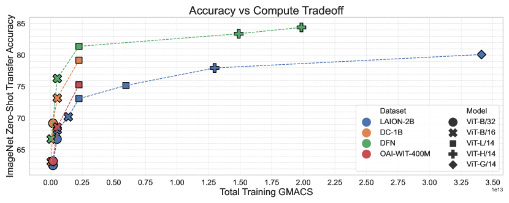
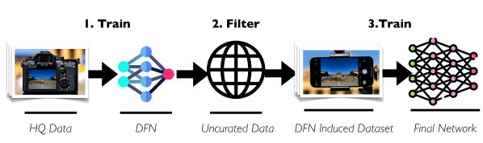
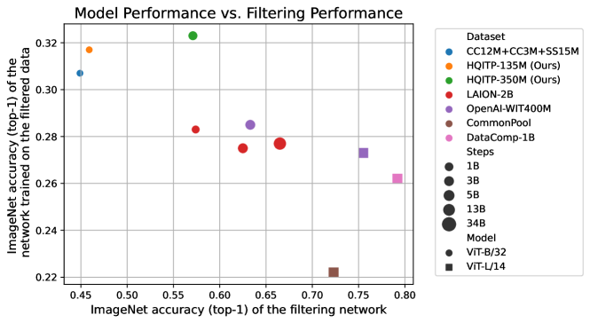
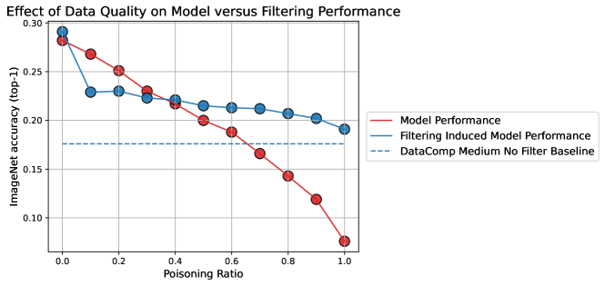
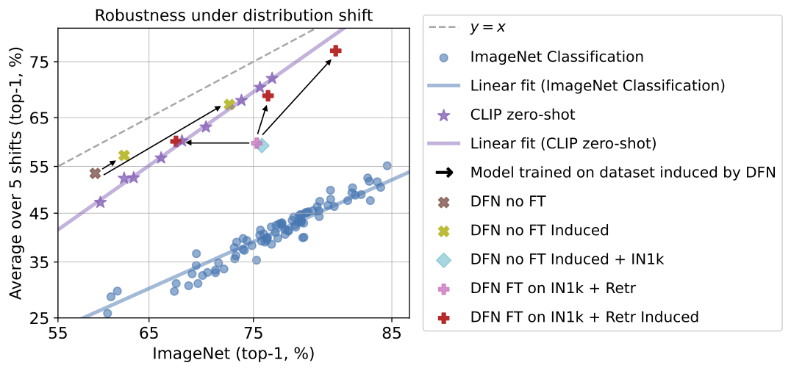
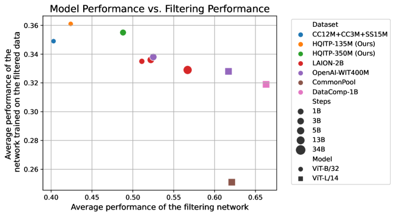
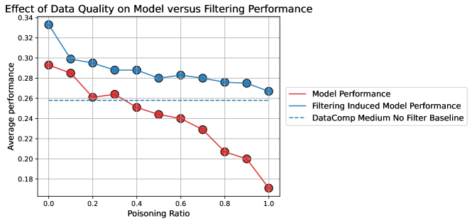
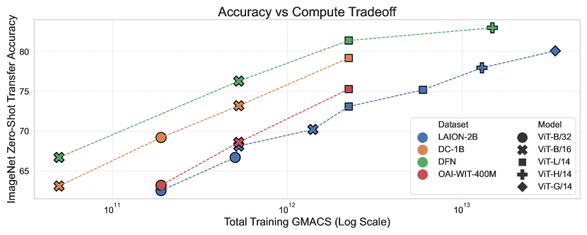

# データ・フィルタリング・ネットワーク（Data Filtering Networks）

> 原題: Data Filtering Networks
> 著者: Alex Fang*¹², Albin Madappally Jose¹, Amit Jain¹, Ludwig Schmidt², Alexander Toshev¹, Vaishaal Shankar¹
> 所属: ¹ Apple, ² University of Washington（* Work done while at Apple）
> 出典: arXiv:2309.17425（2023 年 9 月）、ICLR 2024
> 公開モデル: https://huggingface.co/apple/DFN5B-CLIP-ViT-H-14-378 ほか

## Abstract（要旨）

大規模訓練セットは機械学習の基盤となっており、近年の言語モデリングとマルチモーダル学習の進歩の基盤となっている。事前学習のためのデータ・キュレーションは依然としてアドホックなことが多いが、共通のパラダイムは、まず Web から大量のデータプールを収集し、次に様々なヒューリスティクスでこの候補プールをフィルタリングして実際の訓練セットに絞ることである。本研究では、この第 2 段階の「大規模未キュレーション・データセットのフィルタリング」のために **データ・フィルタリング・ネットワーク（DFN）** を学習する問題を研究する。

**鍵となる発見**: **フィルタリング用ネットワークの品質は下流タスクでの性能と区別される**。たとえば **ImageNet で良い性能を示すモデルが、ImageNet 精度の低い小規模高品質データで訓練したモデルより悪い訓練セットを生み出すことがある**。

この洞察に基づき、SOTA 画像-テキスト・データセットを誘導する新しいデータ・フィルタリング・ネットワークを構築する。具体的には、最高性能データセット **DFN-5B** により、計算予算内で SOTA CLIP モデルを訓練できる：DFN-5B で訓練した **ViT-H は ImageNet ゼロショット転移精度 84.4%** を達成し、**LAION-2B / DataComp-1B / OpenAI WIT で訓練したモデルを上回る**。データセット設計のさらなる研究を促進するため、新しい 20 億サンプル・データセット **DFN-2B** も公開し、**公開データのみで高性能なデータ・フィルタリング・ネットワークをゼロから訓練可能**であることを示す。

## 1 Introduction（はじめに）

慎重にキュレーションされたデータセットは、Bell Labs の初期パターン認識実験から GPT-4、Stable Diffusion、CLIP などの近年の発展まで、数十年にわたり機械学習の進歩を駆動してきた。しかし、その重要な役割にもかかわらず、データセット自体が活発な研究の対象となることは稀である。

機械学習タスクの性能改善の現在のアプローチは **モデル容量または訓練データ量のスケーリング**に焦点を当ててきた。スケーリング則 [^18][^23][^1][^7] はモデルサイズ・データサイズ・性能の関係を明らかにしたが、**これらの量をどうスケールするかについての公式な指針はほとんどない**。モデル側は実験が単純で、十分な計算量があれば幅・深さ・正規化・訓練ハイパラの順列を厳密に評価でき、長年にわたる一貫したモデリング改善につながった。

**データセット側は残念ながらより不透明**。ほとんどの大規模訓練セットは公開されておらず、コミュニティはオープン再現を試みている [^40][^41][^5][^13]。しかしこれらはモデルが享受する反復改良のないワンオフの努力であることが多い。DataPerf、DataComp、MetaCLIP [^31][^12][^47] のような近年の努力は一貫したデータセット評価・再現フレームワークを提供してギャップを埋める助けとなる。

我々は **データセット設計はモデル設計と同じツールを活用できる**と主張する。ほぼすべての大規模データセット構築は 2 つの段階に分解できる：**未キュレーション・データ収集**と **データセット・フィルタリング**。我々は後者に焦点を当て、大規模な未キュレーション・データセットが存在するという前提で作業する。**データ・フィルタリング・ネットワーク（DFN, データをフィルタリングするよう設計されたニューラル・ネットワーク）**が大規模高品質事前学習データセットを誘導できることを示す。ドメイン固有のヒューリスティクスに依存する従来の技法と異なり、**DFN は大規模な未フィルタ画像-テキスト・プールと組み合わせて、十億規模の SOTA データセットをアルゴリズム的に生成する**。DFN はゼロから効率的に訓練でき、標準的な ML モデルと同じ技法で改善できることを実証する。

<figure>



<figcaption>図1: 様々なデータセットで訓練した CLIP モデルの計算スケーリング挙動。DFN-2B（最高性能 DFN が選んだ DataComp-12.8B の部分集合）は、OpenAI の WIT や以前の SOTA CLIP 訓練データセット DataComp-1B を含むすべての他のデータセットを上回る。DFN-2B で訓練した ViT-L は、18 倍多い計算で LAION で訓練した ViT-G を上回る。DFN-2B で訓練した ViT-B/16 は、OpenAI の ViT-L/14（4 倍の計算）を上回る。DFN-5B で訓練した ViT-H/14 は ImageNet で 84.4% を達成し、計算クラス内のあらゆるモデルを上回る。すべての DFN 訓練モデルは DFN-2B で訓練、ViT-H のみ DFN-5B（同じ DFN で誘導）。DFN 自体の訓練コストは全 CLIP 訓練コストの 1/50 未満なのでこのプロットから省略。</figcaption>
</figure>

本研究の貢献は以下：

1. **高品質データセットにつながるデータ・フィルタリング・ネットワークの性質を特徴付ける**。教師信号から訓練データ品質まで DFN の性質をアブレーション。**少量の高品質データのみで訓練した小さな対比画像-テキスト・モデルが SOTA データセット構築に十分**であることを発見。
2. これらの性質を使って DFN を訓練し、**文献中のあらゆる既存データセットより高い精度と良い計算-精度トレードオフを示す CLIP モデル**を誘導するデータセットを構築。DFN 誘導データセット **DFN-2B で訓練した ViT-L/14 を 12.8B サンプルで 81.4% ImageNet ゼロショット精度**（DataComp-1B 上の以前のベスト ViT-L を +2 ポイント超え）。さらに **DFN-5B で訓練した ViT-H/14 を 39B サンプルで 84.4% ImageNet ゼロショット**。
3. **公開データのみで DFN をゼロから構築するレシピ**を提供し、**大規模高品質データセットの民主化**へ向かう一歩。**DFN-2B をコミュニティに公開**して大規模画像-テキスト・モデル研究を可能にする。

## 2 Background and Related Work（背景と関連研究）

### 2.1 Contrastive Image Language Pre-training (CLIP)

**[[sources/clip|CLIP]]** は、Web スクレイピングされた画像-テキスト対の大規模訓練で SOTA 画像表現を構築できることを実証し、安価に入手可能な画像-alt テキスト・データセットの使用法を変革した。**CLIP は別個の視覚エンコーダとテキストエンコーダから成り、訓練中の対比損失で関連画像-テキスト対の表現を近づけ、無関連対を遠ざける**。このプロセスで重要なのは **整列された画像-テキスト対**の大規模データセット（意味的に関連するテキストとペアにされた画像）。

CLIP の公開後、**ALIGN、BASIC、LiT、Open-CLIP** など複数の画像-テキスト・モデルが公開され、本研究ではこれらすべてを **CLIP モデル** と呼ぶ [^22][^34][^49][^21]。CLIP モデルは一般に **3 つの標準サイズの Vision Transformer**：ViT-B/32、ViT-B/16、ViT-L/14。それ以来、オープンソース・コミュニティは **ViT-H/14、ViT-g/14、ViT-G/14** の 3 つの大型変種に拡張した [^9][^48]。一般に **より大きなモデルがゼロショット汎化と転移性質をより良く示す**。CLIP モデルは様々なデータセットで訓練されている：OpenAI の WiT、Google の WebLI と JFT-3B、LAION、COYO、DataComp-1B。

先行研究は CLIP モデルをファインチューンして特定方向の性能を改善する方法も研究してきた。CLIP モデルはテンプレートを使ってラベルをテキストに変換することで画像分類タスクでファインチューン可能 [^11][^15]。さらに実務者は **重みアンサンブル**を使って事前学習モデルの頑健性を保持しつつファインチューンの利益を得る [^46]。本研究ではこれらの技法を活用してフィルタリング・モデルを改善する。

### 2.2 Dataset Construction（データセット構築）

CLIP 以前、コンピュータビジョンで最もよく使われたデータセットは **人手ラベル付きの教師あり**だった [^8][^24]。これらの古いデータセット構築パイプラインは非常に複雑で数百万例を超えてスケールしなかったが、現在の構築と類似点を共有する。ImageNet や CIFAR のような古典的データセットは **大規模で大雑把にキュレーションされた**画像とメタデータのプールから始まり、人間がデータをラベル付けまたはフィルタリングした。

現代のデータセット・パイプラインも同様の手順だがはるかに大規模。初期画像プールは最大 **1000 億画像**に達し、データセット・フィルタリングは純粋に自動化され、しばしばルールとヒューリスティック・フィルタリング段階の集合 [^22]。NLP の過去研究は低品質文書の除去の初期段階としてバイナリ・フィルタを使ってきたが、フィルタリング・パイプラインに複数の構成要素を含む [^45][^4]。

最初の公開 Web スケール画像-テキスト・データセットの 1 つは **LAION**。LAION-400M と LAION-2B は **Common Crawl から画像-テキスト対を収集し、英語でフィルタリング、画像とテキストが整列している対を保持**することで構築。この整列は **CLIP フィルタリング** という手順で行われる。この手順は既存の画像-テキスト・モデル（LAION の場合 OpenAI CLIP ViT-B/32）を活用し、画像とテキスト間の **コサイン類似度が閾値以下のサンプルを除去**。

```python
def clip_filter(image, text, threshold=0.3):
    # 画像とテキスト表現を計算
    image_features = clip.encode_image(image_input)
    text_features = clip.encode_text(text_input)
    # 整列を計算
    dot_product = image_features.T @ text_features
    norm_a = image_features.norm()
    norm_b = text_features.norm()
    similarity = dot_product / (norm_a * norm_b)
    # 整列でフィルタリング
    return similarity > threshold
```

CLIP フィルタリングは便利だが **既存の訓練済み CLIP モデルに依存し、それをフィルタとして使う任意のモデルのトップライン性能で制限される可能性がある**。たとえば LAION-2B は OpenAI のデータセットの 5 倍だが、そこで訓練したモデルは **大幅に大きな計算予算でしか OpenAI の ImageNet ゼロショット性能に並べなかった**。

画像-テキスト・データセット研究を助けるため、**DataComp ベンチマーク** が作られた [^12]。ベンチマークは Common Crawl から **128 億画像-テキスト対** を提供し、様々なデータ・フィルタリング技法の効果を研究できる。**DataComp は結果モデル訓練に使う計算予算を固定**し、最大規模の計算予算を OpenAI ViT-L/14 CLIP モデル訓練コストと一致させる。これらモデルは **38 の下流タスク**で評価され、ImageNet と分布シフト、VTAB、検索タスクを含む。本研究はこのベンチマークをデータ・フィルタリング・ネットワークが作るデータセット評価の主要手法として使う。

DataComp 著者は **DataComp-1B（DC-1B）** ベースライン・データセットも公開し、**CLIP フィルタリング + ImageNet ベース・クラスタリング・アプローチ**で LAION-5B を改善した。しかしこのデータセットは依然として CLIP フィルタリングに OpenAI CLIP モデルを使用し、コストの高い ImageNet 固有のクラスタリング段階をパイプラインに課す。

近年の研究 [^47]（MetaCLIP）は CLIP データセット構築プロセスを解明し、**単純なキーワード・ベース・サンプリングとグローバル・バランシング**で高品質データセット構築が可能と実証。彼らの研究は競争的データセットを作るが、オリジナル CLIP 論文 [^36] のサンプリング・ヒューリスティクスに依存し正確なデータセット再現を可能にする。**我々の研究はデータセット構築でモデル性能を改善することに焦点**。

## 3 Data Filtering Networks（データ・フィルタリング・ネットワーク）

本研究で研究する核心オブジェクトは **データ・フィルタリング・ネットワーク（DFN）**。本節で DFN を定義し評価セットアップを導入する。

### 3.1 Definitions（定義）

数兆例を効率的にフィルタリングする関数を構築するという最終目標があるため、**DFN を大規模データ・プールの要素に点単位で適用するもの**に研究範囲を限定する。データ・プールを DFN で処理することを以下の擬似コードで定義：

```python
def apply_dfn(dfn, data_pool):
    return [x for x in data_pool if dfn(x)]
```

これは並列化に適しており効率的な適用を可能にする。与えられた DFN とプールに対し、**DFN を訓練するデータ・プールを「filter dataset（フィルタデータセット）」と呼ぶ**。さらに、**DFN でプールをフィルタリングして構築されるデータセットを「induced dataset（誘導データセット）」**と呼ぶ。そのデータセットのみで訓練されたモデルを **「induced model（誘導モデル）」** と呼ぶ。

§2.2 で導入したように、DFN の一般的選択は **CLIP 訓練画像-テキスト・モデル**。したがって DFN はデータセット誘導に使えるだけでなく、ゼロショット ImageNet 分類のような一般的評価問題にも適用できる。逆に **CLIP モデルは一般認識にも DFN にも使える**。CLIP モデルを DFN として使うとき、その **フィルタリング性能は誘導モデルの性能で定義**する（標準ベンチマーク、例：ImageNet top-1 で評価）。

<figure>



<figcaption>図2: DFN を使ったデータセット構築パイプラインの概観。</figcaption>
</figure>

### 3.2 Data Filtering Networks Evaluation Setup（DFN 評価セットアップ）

DFN の品質は **誘導できるモデルの強さで決まる**。**DataComp [^12]** の評価フレームワークを基盤に構築。DataComp は CLIP モデルのゼロショット性能を測定することでデータセットのマルチスケール評価フレームワークを提供。**4 つのネストされた未フィルタ画像-テキスト対プール**（増加するサイズ）を提供。本研究では medium（128M データ点）、large（1.28B）、xlarge（12.8B）プールを使う。DataComp のモデル・ハイパラ・ガイドラインに従い、それぞれ **medium = ViT-B/32、large = ViT-B/16、xlarge = ViT-L/14**。正確なハイパラは Table 7（Appendix A）。

DataComp XL プールに **30B 非 DataComp Web スクレイピング画像を組み合わせて 42B 画像のより大きなプール**に拡張。このプールと我々の DFN で誘導したデータセットを **DFN-5B** と呼び、ViT-H/14 モデル訓練に使う。

評価には DataComp ベンチマークの **38 のゼロショット分類・検索タスク**を使う。これらベンチマークの平均性能を単に **「Average」** と呼ぶが、様々な部分集合も追跡：ImageNet 性能（IN）、ImageNet 分布シフト性能（IN shifts）、Visual Task Adaptation Benchmark（VTAB）、検索性能（COCO、Flickr、WinoGAViL）。

実際の訓練は **Nvidia A100 と TPU v4** で実行。**OpenClip** と **AXlearn** を使って GPU と TPU で CLIP モデルを訓練 [^21][^3]。

### 3.3 Understanding Data Filtering Networks（DFN の理解）

<figure>



<figcaption>図3: フィルタリング強度は画像タスク性能と相関しない。モデルは CLIP で訓練、見たサンプル数と訓練データを右側に表示。フィルタリング性能は DataComp medium のフィルタリングで測定。</figcaption>
</figure>

オープンソース CLIP モデルが ImageNet などの標準視覚指標で改善するにつれ、データセット構築プロセスで使う OpenAI CLIP モデルをこれらより良いモデルで置換できるかという問いが生じる。**残念ながらこれは真でないようだ**。**図 3 は CLIP モデルの ImageNet 性能がフィルタリング性能と相関しないことを示す**。フィルタリング性能を測定するため、CLIP モデルを使って DataComp の medium 生プールに CLIP フィルタリングを適用しデータセットを作成し、誘導データセットで訓練したモデルの ImageNet 性能を測定。**OpenAI の CLIP モデルより 30% 低い ImageNet 性能のモデルが、フィルタリング・モデルとして同じくらい良くなり得る**ことは特に印象的。

**データ品質が良いフィルタリング・モデル訓練の鍵**であることを発見。実証のため、**Conceptual 12M（CC12M）の 10M 高品質サンプル・プール**から始め、このプールが Common Crawl のみになるまで未フィルタ・データを Common Crawl から段階的に置換。これらのデータ混合で DFN を訓練し、これら DFN を使って DataComp の medium スケールから 128M Common Crawl サンプルの別プールを CLIP フィルタリング。**図 4** で DFN と各 DFN で生成したデータセットで訓練した誘導モデルの ImageNet 性能を測定。

<figure>



<figcaption>図4: データ品質がモデルのフィルタリング性能を決定。10M サンプルのプール・サイズを固定し CC-12M（高品質）と CommonPool（低品質）の間で補間して様々な品質のフィルタ訓練データセットを作成。次に DFN で誘導されたモデルを DataComp medium のフィルタリングで訓練。</figcaption>
</figure>

**DFN の ImageNet 性能は未フィルタ・データの大きな割合で訓練すると徐々に低下するが、フィルタリング・ネットワークとしての性能は高品質プールが少量の未フィルタ・データで「汚染」されただけで即座に低下**する。フィルタ訓練プールが汚染されると、DFN で誘導されるデータセットは未フィルタ・データよりわずかに良いだけになる。

**表 1**: DataComp medium スケール（ViT-B/32、128M サンプル）のフィルタリング後、様々なフィルタリング・モデルのフィルタリング性能。ImageNet top-1 と「Average」タスク集合の結果。

| DFN タイプ | フィルタ・データセット | ImageNet | Average |
|---|---|---|---|
| No Filter ベースライン | None | 0.176 | 0.258 |
| ResNet-34 画像バイナリ・フィルタ | ImageNet | 0.242 | 0.292 |
| OpenAI ViT-B/32 画像バイナリ・フィルタ | ImageNet | 0.266 | 0.295 |
| ResNet-34 画像バイナリ・フィルタ | CC12M | 0.203 | 0.257 |
| OpenAI ViT-B/32 画像バイナリ・フィルタ | CC12M | 0.218 | 0.276 |
| M3AE ViT-B/16 | CC12M | 0.237 | 0.297 |
| **CLIP ViT-B/32** | CC12M | **0.289** | **0.335** |

次に CLIP モデルを超えるフィルタリング・モデルの使用を探究。DFN はバイナリ関数に還元できる任意のモデルを使えるが、直感的に CLIP モデルが理にかなう。**画像とテキスト間の類似度スコアでフィルタリングすると、画像とテキストが整列したサンプルを保持することを奨励する**。

この直感を検証するため、いくつかの他オプションを検討。**バイナリ分類器**（ImageNet または CC12M を陽性、Common Crawl を陰性として識別、ResNet と凍結 OpenAI CLIP 埋め込みの両方検討）。**M3AE [^14]** を CC12M で訓練した DFN として使う（画像とテキスト両方を考慮、**再構成損失をフィルタリング基準**）。フィルタリング性能は表 1 で **CLIP モデルが他のバックボーンを上回る**。

**バイナリ分類器と CLIP フィルタの鍵となる違いは、バイナリ・フィルタが何が良い分布かについて明示的な仮定をするのに対し、CLIP フィルタはより柔軟**。M3AE と CLIP の両方が CC12M で訓練し両モダリティを調べるが、M3AE はずっと悪い性能（CLIP が画像-テキスト整列を奨励し、CC12M のみからのテキスト再構成が困難なため）。**結論：CLIP モデルが画像-テキスト DFN にとって最も実用的かつ高性能**。

## 4 Creating Better Data Filtering Networks（より良い DFN の作成）

CLIP モデルをデータ・フィルタリング・ネットワークとして理解したので、より良い DFN 作成を目指す。**DFN は標準的な機械学習モデルと同じ方法で訓練・修正できる**。**高品質データセットで CLIP モデルを訓練し、特に良くしたい後続データセットでフィルタリング・ネットワークをファインチューン**。重みアンサンブルでファインチューン・データセットへの過学習を抑える。**拡張、異なる初期化、より大きなバッチサイズで長く訓練するなどの標準的機械学習技法はフィルタリング・モデルを改善する**ようだ。これらの介入の効果を表 2 に示す。一方、異なるモデル・サイズの使用は限定的恩恵、モデル・アンサンブルはフィルタリング・コストを増やしつつ利益をもたらさない。**DataComp-1B（DC-1B）のような以前のデータセットが CLIP フィルタリング + クラスタリング・ベース・ヒューリスティクスの組み合わせだったのに対し、DFN はデータ・フィルタリング・プロセスを単一パイプラインに単純化しつつ計算コストも削減**。

**表 2**: モデル改善の標準介入は DFN にも使え、より強いデータセットを誘導しより良いモデルにつながる。DFN は DataComp large（ViT-B/16、1.28B サンプル）のフィルタリング・訓練に使用。

| 介入 |  | IN | IN Shifts | VTAB | Retrieval | Average |
|---|---|---|---|---|---|---|
|  | ✗ | 0.620 | 0.493 | 0.534 | 0.515 | 0.536 |
| Augmentation | ✓ | 0.626 | 0.501 | 0.534 | 0.516 | 0.542 |
|  | 2.56B / 4096 | 0.626 | 0.506 | 0.536 | 0.511 | 0.545 |
| Samples Seen / Batch Size | **5.12B / 8192** | 0.624 | 0.508 | 0.551 | 0.517 | 0.550 |
|  | ✗ | 0.624 | 0.508 | 0.551 | 0.517 | 0.550 |
| Fine-tune | ✓ | **0.678** | **0.540** | **0.555** | **0.534** | **0.560** |
|  | ✗ | 0.674 | 0.535 | 0.533 | 0.529 | 0.548 |
| OAI-Init | ✓ | 0.678 | 0.540 | 0.555 | 0.534 | 0.560 |

**表 3**: DFN-2B での訓練は SOTA CLIP モデルを生む。LAION-2B、DC-1B、MetaCLIP、OpenAI WIT-400M との DataComp ベンチマーク比較。

|  | DataComp |  |  |  |  |  |
|---|---|---|---|---|---|---|
| データセット | Scale | IN | IN Shifts | VTAB | Retrieval | Average |
| DC-1B | medium | 0.297 | 0.239 | 0.346 | 0.231 | 0.328 |
| **DFN-2B** | medium | **0.371** | **0.298** | **0.388** | **0.288** | **0.373** |
| DC-1B | large | 0.631 | 0.508 | 0.546 | 0.498 | 0.537 |
| **DFN-2B** | large | **0.678** | **0.540** | **0.555** | **0.534** | **0.560** |
| LAION-2B | xlarge | 0.731 | 0.603 | 0.586 | 0.589 | 0.601 |
| OpenAI WIT-400M | xlarge | 0.755 | 0.649 | 0.586 | 0.543 | 0.617 |
| DC-1B | xlarge | 0.792 | 0.679 | 0.652 | 0.608 | 0.663 |
| **DFN-2B** | xlarge | **0.814** | **0.688** | **0.656** | **0.649** | **0.669** |
| LAION-2B | N/A, ViT-G/14-224px | 0.801 | 0.691 | 0.646 | 0.635 | 0.667 |
| DC-1B (CLIPA-v2) | N/A, ViT-G/14-224px | 0.831 | 0.740 | 0.645 | 0.631 | 0.684 |
| MetaCLIP | N/A, ViT-H/14-336px | 0.805 | 0.700 | 0.640 | 0.652 | 0.667 |
| WebLI | N/A, ViT-SO/400M-384px | 0.831 | 0.734 | 0.648 | 0.698 | 0.692 |
| **DFN-5B** | N/A, ViT-H/14-224px | **0.834** | 0.713 | **0.675** | 0.684 | **0.698** |
| **DFN-5B** | N/A, ViT-H/14-378px | **0.844** | 0.738 | **0.685** | 0.695 | **0.710** |

最高 DFN を作成するため、**HQITP-350M で ViT-B/32 CLIP モデルを訓練**（357M 画像-テキスト・サンプルの高品質データセット、**人間検証済みキャプション**付き）。[^38] で使われた HQITP-135M に似ているが 357M に拡張。**OpenAI のチェックポイントで重みを初期化**。次に **MS COCO 訓練セット、Flickr30k 訓練セット、ImageNet 1k（OpenAI テンプレートをキャプションとして）の組み合わせでファインチューン**。訓練・ファインチューン両方で追加拡張を使用。詳細は Appendix B。**この DFN を DataComp の完全な 128 億サンプル CommonPool に適用、上位 15% に相当する閾値で DFN-2B データセットを作成**。

我々の DFN は DataComp の medium、large、xlarge スケールで SOTA を達成するデータセットを誘導する。特に xlarge では **DFN-2B で 12.8B サンプル訓練した ViT-L/14 が ImageNet ゼロショット 81.4%**、38 DataComp 評価データセット平均 0.669 を達成。表 3 に示すように、ImageNet ゼロショット改善で **DC-1B から +2.2%、OpenAI WIT-400M から +5.9%、LAION-2B から +8.3%**。改善は ImageNet を超え、分布シフト、検索、VTAB、平均性能で同様の傾向。最後に **224×224 解像度で DFN-5B を ViT-H/14 で 39B サンプル訓練、378×378 解像度で 5B サンプル訓練 → ImageNet ゼロショット転移 84.4%、DataComp 評価スイート平均 0.710**。

**より良いデータセットはモデル性能だけでなくモデル効率も改善**。**DFN-2B で訓練した ViT-L/14 は LAION-2B で 34B サンプル訓練した ViT-G/14 を ImageNet ゼロショット 1.5%、平均性能 0.002 上回り、16 倍少ない計算コストで達成**。同様に **DFN-2B で 12.8B サンプル訓練した ViT-B/16 は OpenAI の ViT-L/14 と競争的（4 倍の計算コスト削減）**。

**表 4**: 高品質データはフィルタリング・モデル訓練に使うのが最良で、終点モデル訓練に使うより良い。HQITP-350M で DFN を訓練すると、より悪い DFN + HQITP-350M で誘導したデータセットを上回るデータセットを誘導。

| データセット | モデル | IN | IN Shifts | VTAB | Retrieval | Average |
|---|---|---|---|---|---|---|
| OAI ViT-B/32 Induced + HQITP-350M | ViT-B/16 | 0.706 | 0.572 | 0.582 | 0.575 | 0.596 |
| DFN without FT Induced | ViT-B/16 | 0.729 | 0.599 | 0.604 | 0.597 | 0.612 |
| **DFN-2B** | ViT-B/16 | **0.762** | **0.623** | 0.598 | **0.611** | 0.609 |
| OAI ViT-B/32 Induced + HQITP-350M | ViT-L/14 | 0.774 | 0.654 | 0.643 | 0.616 | 0.654 |
| **DFN-2B** | ViT-L/14 | **0.814** | 0.688 | 0.656 | 0.649 | 0.669 |
| DFN-2B + HQITP-350M | ViT-L/14 | 0.813 | **0.691** | **0.662** | **0.656** | **0.670** |

**良い DFN 訓練の鍵は高品質データをフィルタリング・ネットワーク訓練に使うこと**。検証済み高品質データの収集は高コスト（人間の注釈を要する）でスケールが難しい。しかし、相当量の高品質データセットが与えられれば、DFN 訓練に使う代わりに直接訓練する利益があるかを探究できる。表 4 で **DFN 誘導データセットで訓練したモデルと、OpenAI ViT-B/32 で CommonPool を CLIP フィルタリングしたデータセットと HQITP-350M を組み合わせたもの**で訓練したモデルを比較。**DFN 誘導データセットで訓練したモデルが DataComp 評価スイートの全主要カテゴリでベースラインを上回る**。さらに **HQITP-350M と DFN-2B の組み合わせ訓練は DFN-2B のみ訓練と比べて改善が小さい**。**DFN を訓練し直接高品質データで訓練しないことで、大規模高品質データセット作成のための高品質データ活用の成功レシピを実証**。

<figure>



<figcaption>図5: DFN で誘導したデータセットは分布シフトに頑健になり得る。DFN は誘導データセットの頑健性を保つようファインチューンできる（ImageNet で直接訓練する場合と異なる）。誘導データセットが元の DFN より高性能なモデルにつながるため、DFN は蒸留を行っていない。使った分布シフトは IN-V2、ObjectNet、IN-Sketch、IN-R、IN-A。</figcaption>
</figure>

**DFN のファインチューニングと直接ファインチューン・データセットで訓練することの違い**も探究できる。図 5 と表 8（Appendix C）で、ベースライン DFN で誘導したデータセット、ImageNet でファインチューンしたベースライン DFN で誘導したデータセット、ImageNet でファインチューンしないベースライン DFN で誘導したデータセットと ImageNet の組み合わせで訓練したモデルを比較。**ImageNet で直接訓練したモデルは ImageNet と ImageNet-V2 でずっと高い性能だが、ObjectNet、ImageNet-Sketch、ImageNet-R ではベースラインを改善しない**。一方 **ImageNet でファインチューンした DFN は ベースラインを ImageNet と全分布シフトで改善するデータセットを誘導する**。**DFN ファインチューニングはファインチューン・データセットに類似したデータセットを誘導する正則化として機能**しつつ、より分布的に多様な候補プールから引き出される強い頑健性を保つ。

### 4.1 Better Datasets Beyond Vision Tasks: VQA（視覚タスクを超えたより良いデータセット：VQA）

機械学習モデルが多様なタスクにわたって理想的に汎化するように、データセットも多様なタスクにわたって汎化することを望む。**我々のデータセットが視覚タスクで評価するとより良いモデルにつながるだけでなく、視覚質問応答（VQA）モデルにもより良いつながる**ことを示す。CLIP 視覚エンコーダを入力として取る **BLIP2 モデル [^28]** を訓練し、COCO と Visual Genome でゼロショット VQA 訓練、VQAv2、GQA、OKVQA でゼロショット VQA 性能測定 [^16][^20][^30]。**標準 OpenAI ViT-L 視覚エンコーダと DFN-2B で訓練した ViT-L を BLIP2 で比較**。DFN-2B モデルは **OpenAI ViT-L エンコーダを一貫して上回り、LAION-2B で訓練したはるかに大きな EVA ViT-g モデルと競争的**。

**表 5**: 異なる視覚エンコーダ訓練データセットの BLIP-2 変種の性能。DFN-2B で訓練した ViT-L は複数のゼロショット VQA タスクで一貫した改善を提供。

| 視覚エンコーダ |  |  |  |  |
|---|---|---|---|---|
| 訓練データセット | アーキテクチャ | VQAv2 Acc. (%) | GQA Acc. (%) | OKVQ Acc. (%) |
| OAI-WIT-400M | ViT-L | 45.5 | 30.0 | 19.1 |
| **DFN-2B** | ViT-L | **48.3** | **31.3** | 21.9 |
| LAION-2B | ViT-g | 48.7 | 31.1 | **24.5** |

### 4.2 Publicly Reproducible DFNs（公開再現可能な DFN）

**表 6**: DFN は ViT-B/32 で訓練、その後 DataComp プールのフィルタリングに使用。Conceptual 12M、Conceptual Captions 3M、Shutterstock 15M は公開データセットで、**大規模高品質データセットが公開リソースのみで構築可能**であることを実証。

|  | DataComp |  |  |  |  |  |
|---|---|---|---|---|---|---|
| DFN 訓練データ | Scale | IN | IN Shifts | VTAB | Retrieval | Average |
| **CC12M + CC3M + SS15M** | medium | **0.307** | **0.253** | **0.359** | **0.274** | **0.349** |
| OpenAI WIT-400M | medium | 0.285 | 0.240 | 0.355 | 0.253 | 0.338 |
| **CC12M + CC3M + SS15M** | large | **0.591** | **0.481** | 0.522 | **0.503** | **0.532** |
| OpenAI WIT-400M | large | 0.578 | 0.466 | 0.525 | 0.475 | 0.527 |

科学研究は誰もがゼロから再現可能な結果から恩恵を受ける。**OpenAI の内部データセットと HQITP-350M は公開アクセス不可だが、競争的な DFN が公開データソースで訓練可能であることを実証**。**Conceptual Caption12M、Conceptual Captions 3M、Shutterstock 15M で ViT-B/32 を訓練** [^6][^42][^32]。表 6 に示すように、**この DFN は DataComp の medium・large スケールでフィルタリング性能で OpenAI の ViT-B/32 と一致**。さらに、この DFN は前節で記述した方法でさらにフィルタリング性能を改善するよう修正できる。

## 5 Discussion（議論）

**データ・フィルタリング・ネットワーク・パイプラインの単純さは既存ワークフローへの統合の柔軟性**を与える。DFN は個別サンプルに作用するため、このアプローチは候補プール・サイズで線形にスケールし、本研究で導入したものより桁違いに大きなデータセット作成を可能にする。さらに、**本研究で訓練した DFN は比較的小さなニューラル・ネットワーク**で、はるかに大きなネットワークの訓練手順に最小限の追加コストでフィルタリングを直接統合できる。**DFN は生データのバッチをフィルタリングし、それを訓練に使うことで、複雑なデータ前処理手順の必要を削減**。

DFN が高性能モデル構築に有用だが、将来研究で対処すべき未解決質問が多い。**データセット品質を直接最適化する正確な方法は依然として分からず、整列のような弱い代理に頼る**。**音声、テキスト、動画データなど DFN を適用できる他のドメインの代理は何かさえ不明**。これらの未解決質問と DFN がモデリング研究とデータセット研究の間に作る橋が、実りある新しい研究の道につながることを願う。

## Acknowledgements（謝辞）

Bowen Zhang、Ruoming Pang、Brandon McKinzie、Mitchell Wortsman、Gabriel Ilharco、Ross Wightman、Achal Dave、Josh Susskind、Alaaeldin Ali、Fartash Faghri、Preetum Nakkiran、Chen Huang に、プロジェクトの様々な段階での有益なフィードバックを感謝する。

---

## Appendix A: Training Hyperparameters（訓練ハイパーパラメータ）

**表 7**: DataComp 論文のハイパーパラメータ設定を medium、large、xlarge プールで踏襲。

| データセット | モデル | プール・サイズ / # seen サンプル | バッチ・サイズ | Max LR | Weight Decay | Warmup | Beta2 |
|---|---|---|---|---|---|---|---|
| DataComp-medium | ViT-B/32 | 128M | 4096 | 5e-4 | 0.2 | 500 | - |
| DataComp-large | ViT-B/16 | 1.28B | 8192 | 5e-4 | 0.2 | 500 | - |
| DataComp-xlarge | ViT-L/14 | 12.8B | 90112 | 1e-3 | 0.2 | 10000 | 0.95 |
| DFN-5B-pool | ViT-H/14 | 39B | 79872 | 2e-3 | 0.1 | 10000 | 0.95 |

## Appendix B: DFN Hyperparameters（DFN ハイパーパラメータ）

アブレーション用 DFN は DataComp large スケール・ハイパラを ViT-B/16 の代わりに **ViT-B/32** で使用。**DC-2B を誘導する最終 DFN は 5.12B サンプル、16,384 バッチ・サイズ、2,000 ステップ・ウォームアップで訓練**。

## Appendix C: Robustness of Using ImageNet at Filtering vs. Training Time（フィルタリング時 vs 訓練時の ImageNet 使用の頑健性）

**表 8**: ImageNet で DFN をファインチューンすると、直接 ImageNet で訓練する場合に失われる良い頑健性質を持つデータセットを誘導する。DataComp large スケール（ViT-B/16、1.28B サンプル）で実行。

| データセット | IN | IN-V2 | ObjectNet | IN-Sketch | IN-R | IN-A | VTAB |
|---|---|---|---|---|---|---|---|
| Baseline DFN | 0.624 | 0.547 | 0.511 | 0.510 | 0.724 | 0.257 | 0.551 |
| **Baseline DFN FT on ImageNet** | **0.678** | **0.594** | **0.536** | **0.536** | **0.743** | **0.284** | 0.555 |
| Baseline DFN + IN | 0.757 | 0.652 | 0.509 | 0.512 | 0.703 | 0.272 | 0.543 |

## Appendix D: Full Experimental Evaluation & Model Release（完全実験評価とモデル公開）

表 3 のモデルのチェックポイントへのリンクと、38 DataComp 評価データセットでの詳細評価結果。

**表 9**: チェックポイントへのリンクと詳細評価結果

| モデル・リンク | ImageNet | Average |
|---|---|---|
| [DFN5B-CLIP-ViT-H-14-378](https://huggingface.co/apple/DFN5B-CLIP-ViT-H-14-378) | **0.844** | **0.710** |
| [DFN5B-CLIP-ViT-H-14](https://huggingface.co/apple/DFN5B-CLIP-ViT-H-14) | 0.834 | 0.698 |
| [DFN2B-CLIP-ViT-L-14](https://huggingface.co/apple/DFN2B-CLIP-ViT-L-14) | 0.814 | 0.669 |
| [DFN2B-CLIP-ViT-B-16](https://huggingface.co/apple/DFN2B-CLIP-ViT-B-16) | 0.762 | 0.609 |

## Appendix E: Figures measuring average performance instead of ImageNet（ImageNet ではなく平均性能を測る図）

<figure>



<figcaption>図6: 図 3 の平均精度版。</figcaption>
</figure>

<figure>



<figcaption>図7: 図 4 の平均精度版。</figcaption>
</figure>

## Appendix F: Log-Scale plot of Figure（図のログスケール・プロット）

<figure>



<figcaption>図8: 様々なデータセットで訓練した CLIP モデルの計算スケーリング挙動（ログ・スケール）</figcaption>
</figure>

## Appendix G: Additional Tables（追加表）

**表 10**: 完全にゼロから高品質 DFN を作成可能。具体的にこの表の結果には OpenAI CLIP モデルを使わない。本論文の他で使う HQITP-350M の部分集合である **HQITP-135M** を DFN 訓練に使用。

|  | DataComp |  |  |  |  |  |
|---|---|---|---|---|---|---|
| データセット | Scale | IN | IN Shifts | VTAB | Retrieval | Average |
| Induced by DFN HQITP-135M with FT on IN1k, no OAI-Init, no Aug., samples 1B, BS 4096 | xlarge | 0.805 | 0.665 | 0.641 | 0.639 | 0.663 |

