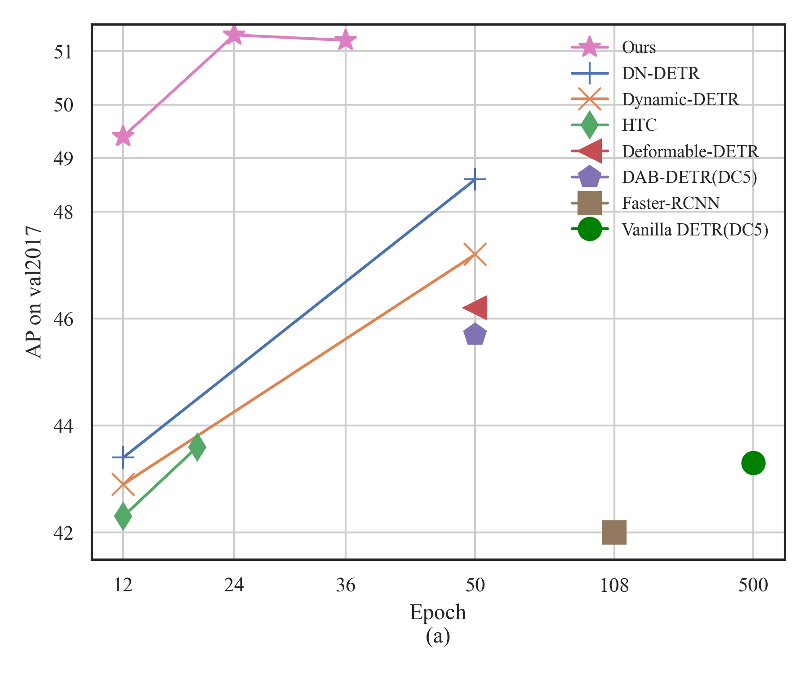
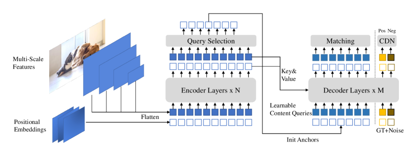
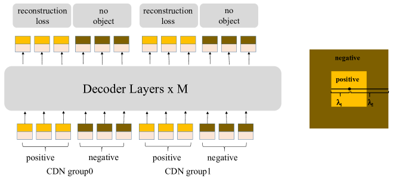
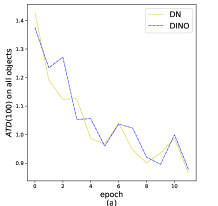
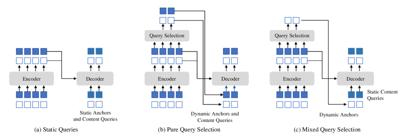
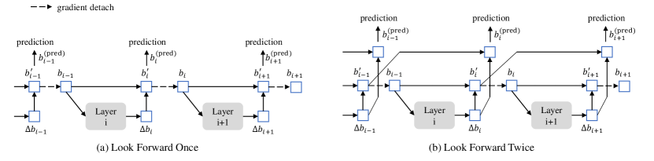
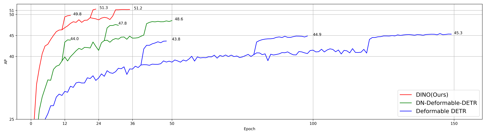
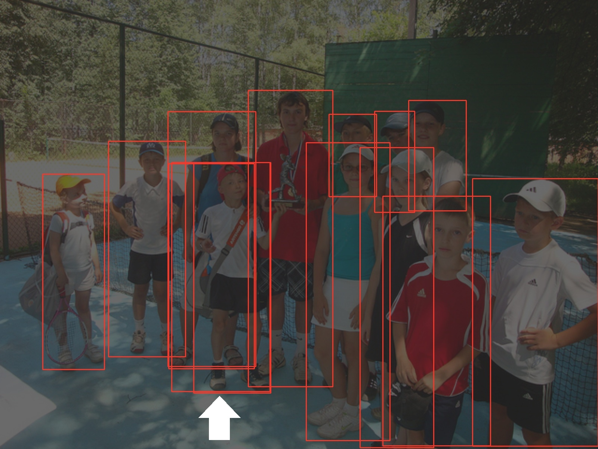

# DINO: end-to-end 物体検出のための改良された DeNoising Anchor Boxes を持つ DETR

> 原題: DINO: DETR with Improved DeNoising Anchor Boxes for End-to-End Object Detection
> arXiv: 2203.03605
> 著者: Hao Zhang, Feng Li, Shilong Liu, Lei Zhang, Hang Su, Jun Zhu, Lionel M. Ni, Heung-Yeung Shum（HKUST / Tsinghua / IDEA / HKUST(GZ)）
> 出典: ICLR 2023
> コード: <https://github.com/IDEACVR/DINO>

> **注**: この DINO は **物体検出モデル**（Zhang et al., 2022/ICLR 2023）であり、自己教師あり学習の DINO（Caron et al., ICCV 2021、[[entities/dino]]）とは **完全に別のモデル** である。両者は名前が衝突しているが、内容・著者・タスクすべて異なる。

## Abstract（要旨）

我々は **DINO（DETR with Improved deNoising anchOr boxes）** を提示する。これは state-of-the-art の end-to-end 物体検出器である。

DINO は、(1) denoising 訓練のための **contrastive**（対比的）な方法、(2) anchor 初期化のための **mixed query selection** 法、(3) box 予測のための **look forward twice** 方式を使用することで、性能と効率の両面で従来の DETR ライクなモデルを改善する。

DINO は ResNet-50 backbone と multi-scale 特徴量を用いて COCO 上で 12 epoch で **49.4 AP**、24 epoch で **51.3 AP** を達成し、先行の最良 DETR ライクモデル DN-DETR と比較してそれぞれ **+6.0 AP**、**+2.7 AP** の大幅な改善を生み出した。

DINO はモデルサイズとデータサイズの両方でよくスケールする。Objects365 データセットで SwinL backbone を用いて事前学習した後、DINO は COCO val2017（**63.2 AP**）と test-dev（**63.3 AP**）の両方で最良の結果を獲得した。

リーダーボードの他のモデルと比較すると、DINO は **より良い結果を達成しながらモデルサイズと事前学習データサイズを大幅に削減**している。我々のコードは <https://github.com/IDEACVR/DINO> で利用可能となる予定である。

**キーワード**: Object Detection（物体検出）; Detection Transformer; End-to-End Detector

<figure>

<figcaption>図1: 他の検出モデルとの COCO における AP 比較。(a) ResNet-50 backbone を持つモデルとの訓練エポック数に関する比較。DC5 とマークされたモデルは dilated でより大きな解像度の特徴マップを使用する。他のモデルは multi-scale 特徴を使用する。(b) 事前学習データサイズとモデルサイズに関する SOTA モデルとの比較。SOTA モデルは COCO test-dev leaderboard からのもの。凡例では、backbone 事前学習データサイズ（最初の数）と検出事前学習データサイズ（2 番目の数）を記載している。* はデータサイズが非公開であることを示す。</figcaption>
</figure>

## 1 Introduction（はじめに）

物体検出はコンピュータビジョンの基本的なタスクである。古典的な畳み込みベースの物体検出アルゴリズム [31, 35, 19, 2, 12] によって顕著な進歩が達成されてきた。これらのアルゴリズムは通常、anchor 生成や非最大抑制（NMS）のような hand-designed なコンポーネントを含むが、DyHead [7]、Swin [23]、SwinV2 [22] と HTC++ [4] のような最良の検出モデルを生み出してきた。これは COCO test-dev leaderboard [1] に証明されている。

古典的な検出アルゴリズムとは対照的に、**DETR** [3] は新しい Transformer ベースの検出アルゴリズムである。これは hand-designed なコンポーネントの必要性を排除し、Faster RCNN [31] のような最適化された古典的検出器と同等の性能を達成する。先行する検出器とは異なり、DETR は物体検出を **集合予測タスク** としてモデル化し、二部グラフマッチングによってラベルを割り当てる。学習可能な **queries** を活用して物体の存在を探り、画像特徴マップからの特徴を結合する。これは soft ROI pooling [21] のように振る舞う。

その有望な性能にもかかわらず、DETR の **訓練収束は遅く、queries の意味は不明確** である。このような問題に対処するため、多くの方法が提案されてきた。例えば、**deformable attention** [41] の導入、位置情報とコンテンツ情報の分離 [25]、空間事前確率の提供 [11, 39, 37] などである。最近、**DAB-DETR** [21] は DETR の queries を **動的 anchor box（DAB）** として定式化することを提案し、古典的 anchor ベース検出器と DETR ライクな検出器の間のギャップを埋めた。**DN-DETR** [17] は **denoising（DN）技法** を導入することで二部マッチングの不安定性をさらに解決した。DAB と DN の組み合わせにより、DETR ライクなモデルは訓練効率と推論性能の両方で古典的検出器と競争力を持つようになった。

現在の最良の検出モデルは、DyHead [8] や HTC [4] のような改善された古典的検出器に基づいている。例えば、SwinV2 [22] で提示された最良の結果は HTC++ [4][23] フレームワークで訓練された。この現象には 2 つの主な理由がある: 1) 先行の DETR ライクなモデルは、改善された古典的検出器より劣っていた。ほとんどの古典的検出器はよく研究され高度に最適化されているため、新しく開発された DETR ライクなモデルと比較してより良い性能をもたらす。例えば、現在最良の性能を持つ DETR ライクなモデルは依然として COCO で 50 AP 未満である。2) DETR ライクなモデルの **スケーラビリティ** はよく研究されていない。DETR ライクなモデルが大きな backbone と大規模なデータセットにスケールしたときどう振る舞うかについての報告された結果はない。本論文ではこれら両方の懸念に対処することを目指す。

具体的には、**denoising 訓練、query 初期化、box 予測を改善** することで、DN-DETR [17]、DAB-DETR [21]、Deformable DETR [41] に基づく新しい DETR ライクなモデルを設計する。我々のモデルを **DINO（DETR with Improved deNoising anchOr box）** と命名する。図 1 に示されるように、COCO 上の比較は DINO の優れた性能を示している。特に、DINO は **優れたスケーラビリティ** を示し、COCO test-dev leaderboard [1] で **63.3 AP** という新記録を樹立した。

DETR ライクなモデルとして、DINO は backbone、multi-layer Transformer encoder、multi-layer Transformer decoder、複数の予測ヘッドを含む。DAB-DETR [21] に従って、我々は decoder の queries を **動的 anchor box** として定式化し、decoder 層を通してそれらを段階的に精錬する。DN-DETR [17] に従って、訓練中の二部マッチングを安定化させるため、ground truth ラベルと box にノイズを加えたものを Transformer decoder 層に追加する。計算効率のため deformable attention [41] も採用する。

さらに、3 つの新しい手法を以下のように提案する:

1. **One-to-one マッチングを改善するため**、同じ ground truth の正例と負例を同時に追加する **contrastive denoising 訓練** を提案する。同じ ground truth box に 2 つの異なるノイズを加えた後、より小さいノイズの box を正例として、もう一方を負例としてマークする。Contrastive denoising 訓練は、モデルが同じターゲットの重複出力を避けるのに役立つ。

2. queries の動的 anchor box 定式化は、DETR ライクなモデルを古典的な two-stage モデルに結びつける。したがって、queries をより良く初期化するのに役立つ **mixed query selection** 法を提案する。我々は [41, 39] と同様に、encoder の出力から **位置クエリ** として初期 anchor box を選択する。しかし、**コンテンツクエリは以前と同様に学習可能なまま** にし、最初の decoder 層が空間事前確率に集中するように促す。

3. 後段層からの精錬された box 情報を活用して隣接する前段層のパラメータを最適化するのに役立てるため、後段層からの勾配で更新されたパラメータを補正する新しい **look forward twice** 方式を提案する。

我々は COCO [20] 検出ベンチマーク上で広範な実験により DINO の有効性を検証する。図 1 に示されるように、DINO は ResNet-50 と multi-scale 特徴を用いて 12 epoch で **49.4 AP**、24 epoch で **51.3 AP** を達成し、先行の最良 DETR ライクなモデルと比較してそれぞれ **+6.0 AP**、**+2.7 AP** の大幅な改善を生み出した。さらに、DINO はモデルサイズとデータサイズの両方でよくスケールする。Objects365 [33] データセットで SwinL [23] backbone を用いて事前学習した後、DINO は COCO val2017（**63.2 AP**）と test-dev（**63.3 AP**）の両方のベンチマークで最良の結果を達成した。表 3 に示すとおり。leaderboard 上の他のモデル [1] と比較すると、SwinV2-G [22] と比較して **モデルサイズを 1/15** に削減した。Florence [40] と比較すると、**事前学習検出データセットを 1/5** に、**backbone 事前学習データセットを 1/60** に削減しながら、より良い結果を達成した。

我々は貢献を以下のように要約する:

1. 我々は、DINO モデルの異なる部分について **contrastive DN 訓練**、**mixed query selection**、**look forward twice** を含むいくつかの新しい技術を持つ新しい end-to-end DETR ライクな物体検出器を設計した。

2. 我々は集中的なアブレーション研究を実施し、DINO の異なる設計選択の有効性を検証した。その結果、DINO は ResNet-50 と multi-scale 特徴を用いて 12 epoch で **49.4 AP**、24 epoch で **51.3 AP** を達成し、先行の最良 DETR ライクなモデルを大幅に上回った。特に、12 epoch で訓練された DINO は **小物体に対してより顕著な改善** を示し、**+7.5 AP** の改善をもたらした。

3. 我々は、bells and whistles なしで、DINO が公的なベンチマークで最良の性能を達成できることを示す。Objects365 [33] データセットで SwinL [23] backbone を用いて事前学習した後、DINO は COCO val2017（63.2 AP）と test-dev（63.3 AP）の両方のベンチマークで最良の結果を達成した。我々の知る限り、**end-to-end Transformer 検出器が COCO leaderboard [1] で SOTA モデルを上回ったのは初めて** である。

## 2 Related Work（関連研究）

### 2.1 Classical Object Detectors（古典的物体検出器）

初期の畳み込みベース物体検出器は、hand-crafted な anchor または参照点に基づく **two-stage** または **one-stage** モデルである。Two-stage モデル [30, 13] は通常、候補 box を提案する **region proposal network (RPN)** [30] を使用し、これらは第 2 段階で精錬される。YOLO v2 [28]、YOLO v3 [29] のような one-stage モデルは、事前定義された anchor に対するオフセットを直接出力する。最近、HTC++ [4] や Dyhead [7] のような畳み込みベースモデルが COCO 2017 データセット [20] でトップ性能を達成した。しかし、畳み込みベースモデルの性能は **anchor の生成方法に依存する**。さらに、重複 box を除去するために NMS のような hand-designed コンポーネントを必要とし、したがって **end-to-end 最適化はできない**。

### 2.2 DETR and Its Variants（DETR とそのバリアント）

Carion ら [3] は、anchor 設計や NMS のような hand-designed コンポーネントを使用しない Transformer ベースの end-to-end 物体検出器 **DETR**（DEtection TRansformer）を提案した。多くの後続論文が、decoder cross-attention によって導入された DETR の遅い訓練収束問題に対処しようと試みてきた。例えば、Sun ら [34] は decoder を使用しない encoder のみの DETR を設計した。Dai ら [7] は複数の特徴レベルから重要な領域に集中する dynamic decoder を提案した。

別の流れの研究は、**DETR の decoder queries のより深い理解** に向けたものである。多くの論文が異なる視点から queries を空間位置と関連付けている。**Deformable DETR** [41] は 2D anchor 点を予測し、参照点周辺の特定のサンプリング点にのみ attend する deformable attention モジュールを設計した。**Efficient DETR** [39] は decoder queries を強化するため、encoder の dense 予測から top K 位置を選択する。**DAB-DETR** [21] は queries を表現するため 2D anchor 点を **4D anchor box 座標** にさらに拡張し、各 decoder 層で box を動的に更新する。最近、**DN-DETR** [17] は DETR 訓練を加速するための **denoising 訓練法** を導入した。これはノイズを加えた ground-truth ラベルと box を decoder に供給し、元のものを再構成するようにモデルを訓練する。本論文の DINO の研究は DAB-DETR と DN-DETR に基づいており、計算効率のため deformable attention も採用している。

### 2.3 Large-scale Pre-training for Object Detection（物体検出のための大規模事前学習）

大規模事前学習は、自然言語処理 [10] とコンピュータビジョン [27] の両方で大きな影響を持ってきた。現在の最良性能検出器のほとんどは、大規模データで事前学習された大きな backbone で達成されている。例えば、**Swin V2** [22] は backbone サイズを **30 億パラメータ** に拡張し、**7000 万** のプライベートに収集された画像でモデルを事前学習している。**Florence** [40] は最初に backbone を **9 億のプライベートにキュレートされた画像-テキスト対** で事前学習し、次に検出器を **900 万のアノテーションまたは pseudo box 付き画像** で事前学習する。対照的に、DINO は **公的に利用可能な SwinL** [23] backbone と **公的データセット Objects365** [33]（170 万のアノテーション画像）のみで SOTA の結果を達成する。

## 3 DINO: DETR with Improved DeNoising Anchor Boxes

<figure>

<figcaption>図2: 我々が提案する DINO モデルのフレームワーク。改善は主に Transformer encoder と decoder にある。最終層の top-K encoder 特徴は、Transformer decoder の位置クエリを初期化するために選択される。一方、コンテンツクエリは学習可能パラメータとして保たれる。我々の decoder には、正例と負例の両方を持つ Contrastive DeNoising (CDN) 部分も含まれる。</figcaption>
</figure>

### 3.1 Preliminaries（予備知識）

Conditional DETR [25] と DAB-DETR [21] で研究されたように、DETR [3] における queries は 2 つの部分から形成されることが明らかになった: **位置部分（positional part）** と **コンテンツ部分（content part）** であり、本論文ではそれぞれ **位置クエリ（positional queries）** と **コンテンツクエリ（content queries）** と呼ぶ。DAB-DETR [21] は DETR の各位置クエリを **4D anchor box** $(x, y, w, h)$ として明示的に定式化する。ここで $x$ と $y$ は box の中心座標で、$w$ と $h$ はその幅と高さに対応する。このような明示的 anchor box 定式化により、decoder で anchor box を **層ごとに動的に精錬** することが容易になる。

**DN-DETR** [17] は、DETR ライクなモデルの訓練収束を加速するための **denoising (DN) 訓練法** を導入する。これは、DETR の遅い収束問題が **二部マッチングの不安定性** によって引き起こされることを示す。この問題を緩和するため、DN-DETR はノイズを加えた ground-truth (GT) ラベルと box を Transformer decoder に追加供給し、モデルを ground-truth のものを再構成するように訓練することを提案する。追加されるノイズ $(\Delta x, \Delta y, \Delta w, \Delta h)$ は $|\Delta x| < \frac{\lambda w}{2}$、$|\Delta y| < \frac{\lambda h}{2}$、$|\Delta w| < \lambda w$、$|\Delta y| < \lambda h$ で制約される。ここで $(x, y, w, h)$ は GT box を示し、$\lambda$ はノイズのスケールを制御するハイパーパラメータである。DN-DETR は DAB-DETR に従って decoder queries を anchor として見なすので、ノイズを加えた GT box は $\lambda$ が通常小さいため、近くに GT box を持つ特別な anchor として見なせる。元の DETR queries に加えて、DN-DETR はノイズを加えた GT ラベルと box を decoder に供給する DN 部分を追加し、補助的な DN 損失を提供する。**DN 損失は DETR 訓練を効果的に安定化・加速し、任意の DETR ライクなモデルにプラグイン可能** である。

**Deformable DETR** [41] は DETR の収束を加速するもう 1 つの初期研究である。deformable attention を計算するため、参照点の概念を導入し、deformable attention が参照点周辺の少数のキーサンプリング点にのみ attend できるようにする。参照点の概念により、DETR 性能をさらに改善するいくつかの技法を開発することが可能になる。第 1 の技法は **query selection** で、encoder から特徴と参照 box を直接 decoder への入力として選択する。第 2 の技法は **iterative bounding box refinement** で、2 つの decoder 層の間で慎重な勾配 detachment 設計を持つ。我々はこの勾配 detachment 技法を本論文で **"look forward once"** と呼ぶ。

DAB-DETR と DN-DETR に従って、DINO は位置クエリを動的 anchor box として定式化し、追加の DN 損失で訓練される。DN-DETR も Deformable DETR からのいくつかの技法（deformable attention 機構や層パラメータ更新における "look forward once" 実装を含む）を採用してより良い性能を達成していることに注意。DINO はさらに位置クエリをより良く初期化するため Deformable DETR からの query selection のアイデアを採用する。この強力なベースラインの上に、DINO は検出性能をさらに改善する **3 つの新しい手法** を導入する。これらはそれぞれ §3.3、§3.4、§3.5 で説明される。

### 3.2 Model Overview（モデル概要）

DETR ライクなモデルとして、DINO は backbone、multi-layer Transformer [36] encoder、multi-layer Transformer decoder、複数の予測ヘッドを含む end-to-end アーキテクチャである。全体のパイプラインは図 2 に示されている。画像が与えられると、ResNet [14] や Swin Transformer [23] のような backbone で **multi-scale 特徴** を抽出し、対応する位置埋め込みとともに Transformer encoder に供給する。Encoder 層による特徴強化の後、我々は decoder の位置クエリとして **anchor を初期化する新しい mixed query selection 戦略** を提案する。この戦略はコンテンツクエリを初期化せず、学習可能なまま残すことに注意。Mixed query selection のさらなる詳細は §3.4 で利用可能である。

初期化された anchor と学習可能なコンテンツクエリにより、deformable attention [41] を使用して encoder 出力の特徴を結合し、queries を **層ごとに更新** する。最終的な出力は、精錬された anchor box と精錬されたコンテンツ特徴によって予測された分類結果で形成される。DN-DETR [17] と同様に、denoising 訓練を実行するための追加の DN 分岐がある。標準的な DN 法を超えて、**hard negative samples を考慮した新しい contrastive denoising 訓練アプローチ** を提案する。これは §3.3 で提示される。後段層からの精錬された box 情報を活用して隣接する前段層のパラメータを最適化するのに役立てるため、隣接する層の間で勾配を渡す **新しい look forward twice 法** が提案される。これは §3.5 で説明される。

### 3.3 Contrastive DeNoising Training（対比的 DeNoising 訓練）

<figure>

<figcaption>図3: CDN グループの構造と正例・負例の図示。正例と負例の両方が 4D anchor で、D 次元空間の点として表現できるが、簡略化のため 2D 空間の同心正方形上の点として図示している。正方形の中心を GT box と仮定すると、内側正方形内の点は正例として、内側と外側正方形の間の点は負例として見なされる。</figcaption>
</figure>

DN-DETR は訓練の安定化と収束加速に非常に効果的である。DN queries の助けを借りて、近くに GT box を持つ anchor に基づいて予測を行うことを学ぶ。しかし、**近くに物体がない anchor に対して「物体なし」を予測する能力に欠ける**。この問題に対処するため、我々は **無用な anchor を *拒絶する*** Contrastive DeNoising (CDN) アプローチを提案する。

**実装**: DN-DETR にはノイズスケールを制御するハイパーパラメータ $\lambda$ がある。DN-DETR はモデルが適度にノイズが加えられた queries から ground truth (GT) を再構成することを望むので、生成されるノイズは $\lambda$ より大きくない。我々の方法では、2 つのハイパーパラメータ $\lambda_1$ と $\lambda_2$ があり、$\lambda_1 < \lambda_2$ である。図 3 の同心正方形に示されるように、我々は 2 種類の CDN queries を生成する: **正クエリ** と **負クエリ**。

- **正クエリ**: 内側正方形内にあり、$\lambda_1$ より小さいノイズスケールを持ち、対応する ground truth box を再構成することが期待される。
- **負クエリ**: 内側と外側正方形の間にあり、$\lambda_1$ より大きく $\lambda_2$ より小さいノイズスケールを持つ。「物体なし」を予測することが期待される。

**GT box により近い hard negative samples の方が性能改善に役立つ** ため、通常は小さい $\lambda_2$ を採用する。図 3 に示されるように、各 CDN グループは正クエリと負クエリのセットを持つ。画像に $n$ 個の GT box があれば、CDN グループは $2 \times n$ 個の queries を持ち、各 GT box が 1 つの正クエリと 1 つの負クエリを生成する。DN-DETR と同様に、我々も方法の効果を改善するため複数の CDN グループを使用する。再構成損失は box 回帰用に $l_1$ と GIOU 損失、分類用に **focal loss** [19] である。負例を背景として分類する損失も focal loss である。

**分析**: 我々の方法が機能する理由は、**混乱を抑制し、bounding box 予測のための高品質 anchor (queries) を選択できる** ことである。**混乱は、複数の anchor が 1 つの物体に近いときに発生する**。この場合、モデルがどの anchor を選ぶか決めるのが難しい。混乱は 2 つの問題を引き起こす可能性がある。第 1 は **重複予測** である。DETR ライクなモデルは集合ベースの損失と self-attention [3] の助けを借りて重複 box を抑制できるが、この能力は限定的である。図 8 の左図に示されるように、CDN queries を DN queries に置き換えると、矢印が指す少年に対して **3 つの重複予測** が出る。CDN queries では、我々のモデルは anchor 間のわずかな違いを区別し、図 8 の右図に示されるように重複予測を回避できる。第 2 の問題は、GT box から遠い不要な anchor が選ばれる可能性があることである。Denoising 訓練 [17] はモデルを近くの anchor を選ぶように改善したが、CDN はモデルにより遠い anchor を拒絶することを教えることでこの能力をさらに改善する。

**有効性**: CDN の有効性を実証するため、**Average Top-K Distance (ATD($k$))** という指標を定義し、マッチング部分で anchor が target GT box からどれだけ離れているかを評価するために使用する。DETR と同様に、各 anchor は GT box または背景にマッチする可能性のある予測に対応する。ここでは GT box にマッチしたもののみを考慮する。検証セットに $N$ 個の GT bounding box ${b_0, b_2, ..., b_{N-1}}$ があると仮定する。ここで $b_i = (x_i, y_i, w_i, h_i)$ である。各 $b_i$ について、その対応する anchor を見つけ、$a_i = (x'_i, y'_i, w'_i, h'_i)$ と表記する。$a_i$ は decoder の初期 anchor box で、最終 decoder 層後の精錬された box がマッチング中に $b_i$ に割り当てられる。すると次のようになる:

$$
ATD(k) = \frac{1}{k} \sum \left\{ \mathop{topK}\left( \left\{ \lVert b_0 - a_0 \rVert_1, \lVert b_1 - a_1 \rVert_1, ..., \lVert b_{N-1} - a_{N-1} \rVert_1 \right\}, k \right) \right\}
$$

ここで $\lVert b_i - a_i \rVert_1$ は $b_i$ と $a_i$ の間の $l_1$ 距離で、$\mathop{topK}(\mathbf{x}, k)$ は $\mathbf{x}$ の最大 $k$ 要素の集合を返す関数である。top-K 要素を選択する理由は、**GT box がより遠い anchor にマッチしたときに混乱問題が起こる可能性が高い** からである。図 4 の (a) と (b) に示されるように、DN は全体として良い anchor を選択するのに十分良い。しかし、**CDN は小物体に対してより良い anchor を見つける**。図 4 (c) は、CDN queries が ResNet-50 と multi-scale 特徴を用いた 12 epoch で、小物体に対して DN queries に対する **+1.3 AP** の改善をもたらすことを示す。

<figure>

<figcaption>図4: (a) と (b) はそれぞれ、すべての物体と小物体に対する ATD(100)。(c) は小物体に対する AP。</figcaption>
</figure>

### 3.4 Mixed Query Selection（混合クエリ選択）

<figure>

<figcaption>図5: 3 つの異なるクエリ初期化方法の比較。「static」という用語は、推論中、異なる画像に対して同じであることを意味する。これらの静的クエリの一般的な実装は、それらを学習可能にすることである。</figcaption>
</figure>

DETR [3] と DN-DETR [17] では、decoder queries は個々の画像からどのような encoder 特徴も取らずに静的な埋め込みである。図 5 (a) に示されている通り。それらは訓練データから直接 **anchor**（DN-DETR と DAB-DETR）または **位置クエリ**（DETR）を学習し、**コンテンツクエリは全て 0 ベクトル** として設定される。**Deformable DETR** [41] は位置クエリとコンテンツクエリの両方を学習する。これは静的クエリ初期化のもう 1 つの実装である。性能をさらに改善するため、Deformable DETR [41] は **query selection** バリアント（[41] で "two-stage" と呼ばれる）を持ち、これは最後の encoder 層からの top K encoder 特徴を decoder queries を強化するための事前確率として選択する。図 5 (b) に示されるように、位置クエリとコンテンツクエリの両方が選択された特徴の線形変換によって生成される。さらに、これらの選択された特徴は予測 box を得るための補助検出ヘッドに供給され、参照 box の初期化に使用される。同様に、**Efficient DETR** [39] も各 encoder 特徴の物体性（クラス）スコアに基づいて top K 特徴を選択する。

我々のモデルの queries の動的 4D anchor box 定式化は decoder 位置クエリと密接に関連しており、query selection によって改善できる。我々は上記の慣行に従い、**mixed query selection** アプローチを提案する。図 5 (c) に示されるように、我々は選択された top-K 特徴に関連する位置情報を使用して **anchor box のみを初期化** するが、**コンテンツクエリは以前と同様に静的のままにする**。Deformable DETR [41] は top-K 特徴を位置クエリだけでなくコンテンツクエリも強化するために利用することに注意。**選択された特徴は予備的なコンテンツ特徴であり、さらなる精錬がないため、曖昧で decoder を誤導する可能性がある**。例えば、選択された特徴は複数の物体を含むか、物体の一部にすぎない可能性がある。対照的に、我々の mixed query selection アプローチは、**位置クエリのみを top-K 選択特徴で強化し、コンテンツクエリは以前と同様に学習可能なまま** にする。これは、モデルがより良い位置情報を使用して encoder からより包括的なコンテンツ特徴をプールするのに役立つ。

### 3.5 Look Forward Twice（先 2 ステップ参照）

<figure>

<figcaption>図6: Deformable DETR と我々の方法における box 更新の比較。</figcaption>
</figure>

我々は本節で box 予測の新しい方法を提案する。Deformable DETR [41] の **iterative box refinement**（反復 box 精錬）は、訓練を安定化させるために勾配逆伝播をブロックする。層 $i$ のパラメータが box $b_i$ の補助損失のみに基づいて更新されるので、我々はこの方法を **look forward once** と呼ぶ。図 6 (a) に示すとおり。しかし、我々は **後段層からの改善された box 情報が、隣接する前段層の box 予測を補正するのにより役立つ** と推測する。したがって、我々は **look forward twice** と呼ばれる box 更新を実行する別の方法を提案する。ここで、層 $i$ のパラメータは層 $i$ と層 $(i+1)$ の両方の損失によって影響を受ける。図 6 (b) に示すとおり。各予測オフセット $\Delta b_i$ について、box を **2 回更新** するために使用される。1 つは $b_i^{\prime}$ のため、もう 1 つは $b_{i+1}^{(\mathrm{pred})}$ のため。したがって、この方法を look forward twice と命名する。

予測された box $b_i^{(\mathrm{pred})}$ の最終精度は 2 つの要因によって決まる: 初期 box $b_{i-1}$ の品質と、box の予測オフセット $\Delta b_i$。Look forward once 方式は後者のみを最適化する。なぜなら、勾配情報が層 $i$ から層 $(i-1)$ に分離されているからである。対照的に、我々は **初期 box $b_{i-1}$ と予測 box オフセット $\Delta b_i$ の両方を改善** する。品質を改善する簡単な方法は、層 $i$ の最終 box $b_i^{\prime}$ を次の層の出力 $\Delta b_{i+1}$ で教師することである。したがって、層 $(i+1)$ の予測 box として $b_i^{\prime}$ と $\Delta b_{i+1}$ の和を使用する。

より具体的には、$i$ 番目の層の入力 box $b_{i-1}$ が与えられると、最終予測 box $b_i^{(\mathrm{pred})}$ を以下で取得する:

$$
\Delta b_i = \mathrm{Layer}_i(b_{i-1}), \quad b_i^{\prime} = \mathrm{Update}(b_{i-1}, \Delta b_i),
$$
$$
b_i = \mathrm{Detach}(b_i^{\prime}), \quad b_i^{(\mathrm{pred})} = \mathrm{Update}(b_{i-1}^{\prime}, \Delta b_i),
$$

ここで $b_i^{\prime}$ は $b_i$ の detach されていないバージョンである。$\mathrm{Update}(\cdot, \cdot)$ は予測 box オフセット $\Delta b_i$ で box $b_{i-1}$ を精錬する関数である。我々は Deformable DETR [41] と同じ box 更新方法を採用する。

## 4 Experiments（実験）

### 4.1 Setup（セットアップ）

**Dataset and Backbone**: 我々は **COCO 2017 物体検出データセット** [20] で評価を実施する。これは train2017 と val2017（minival とも呼ぶ）に分割される。2 つの異なる backbone での結果を報告する: ImageNet-1k [9] で事前学習された **ResNet-50** [14] と ImageNet-22k [9] で事前学習された **SwinL** [23]。ResNet-50 を持つ DINO は追加データなしで train2017 で訓練され、SwinL を持つ DINO は最初に **Object365** [33] で事前学習され、次に train2017 でファインチューンされる。我々は val2017 上で異なる IoU 閾値と物体スケールの下での標準的な平均適合率 (AP) 結果を報告する。SwinL を持つ DINO については test-dev 結果も報告する。

**Implementation Details**: DINO は backbone、Transformer encoder、Transformer decoder、複数の予測ヘッドで構成される。Appendix 0.D では、結果を再現したい人のために、我々のモデルで使用されるすべてのハイパーパラメータとエンジニアリング技法を含むより多くの実装詳細を提供する。Blind review 後にコードを公開する予定である。

### 4.2 Main Results（主な結果）

**表1: ResNet-50 backbone を持つ DINO と他の検出モデルの 12 epoch 訓練（いわゆる 1× 設定）での COCO val2017 結果。** Multi-scale 特徴を持たないモデルについては、最良モデル ResNet-50-DC5 で GFLOPS と FPS をテスト。DINO は 900 queries を使用。† は 900 queries または 300 queries × 3 patterns（900 queries と同様の効果）を使用するモデルを示す。DETR 以外の他の DETR ライクなモデル（DETR は 100 queries）は 300 queries を使用。\* は mmdetection [5] フレームワークでテストされたことを示す。

| Model | Epochs | AP | AP_50 | AP_75 | AP_S | AP_M | AP_L | GFLOPS | Params | FPS |
|---|---|---|---|---|---|---|---|---|---|---|
| Faster-RCNN(5scale) | 12 | 37.9 | 58.8 | 41.1 | 22.4 | 41.1 | 49.1 | 207 | 40M | 21* |
| DETR(DC5) | 12 | 15.5 | 29.4 | 14.5 | 4.3 | 15.1 | 26.7 | 225 | 41M | 20 |
| Deformable DETR(4scale) | 12 | 41.1 | - | - | - | - |  | 196 | 40M | 24 |
| DAB-DETR(DC5)† | 12 | 38.0 | 60.3 | 39.8 | 19.2 | 40.9 | 55.4 | 256 | 44M | 17 |
| Dynamic DETR(5scale) | 12 | 42.9 | 61.0 | 46.3 | 24.6 | 44.9 | 54.4 | - | 58M | - |
| Dynamic Head(5scale) | 12 | 43.0 | 60.7 | 46.8 | 24.7 | 46.4 | 53.9 | - | - | - |
| HTC(5scale) | 12 | 42.3 | - | - | - | - | - | 441 | 80M | 5* |
| DN-Deformable-DETR(4scale)† | 12 | 43.4 | 61.9 | 47.2 | 24.8 | 46.8 | 59.4 | 265 | 48M | 23 |
| **DINO-4scale†** | 12 | **49.0 (+5.6)** | 66.6 | 53.5 | **32.0 (+7.2)** | 52.3 | 63.0 | 279 | 47M | 24 |
| **DINO-5scale†** | 12 | **49.4 (+6.0)** | 66.9 | 53.8 | **32.3 (+7.5)** | 52.5 | 63.9 | 860 | 47M | 10 |

**12-epoch 設定**: 改善された anchor box denoising と訓練損失により、訓練プロセスが大幅に加速できる。表 1 に示されるように、畳み込みベース手法 [30, 4, 7] と DETR ライク手法 [3, 41, 8, 21, 17] の両方を含む強力なベースラインと我々の方法を比較する。公平な比較のため、表 1 にリストされたすべてのモデルについて同じ A100 NVIDIA GPU でテストされた GFLOPS と FPS の両方を報告する。DETR と DAB-DETR を除くすべての方法は multi-scale 特徴を使用する。Multi-scale 特徴を持たないものについては、dilated でより大きな解像度の特徴マップを使用するためより良い性能を持つ ResNet-DC5 での結果を報告する。一部の方法は 5 スケールの特徴マップを採用し、一部は 4 を採用するので、4 スケールと 5 スケールの両方での我々の結果を報告する。

表 1 に示されるように、我々の方法は ResNet-50 と 4 スケール特徴マップを使用する同じ設定の下で **+5.6 AP**、5 スケール特徴マップで **+6.0 AP** の改善をもたらす。我々の 4 スケールモデルは計算とパラメータ数に多くのオーバーヘッドを導入しない。さらに、我々の方法は **小物体に対して特に良好に機能** し、4 スケールで **+7.2 AP**、5 スケールで **+7.5 AP** を獲得する。ResNet-50 backbone での我々のモデルの結果は、エンジニアリング技法のため、論文の初版より高いことに注意。

**ResNet-50 backbone を持つ最良モデルとの比較**:

**表2: ResNet-50 backbone を持つ DINO と他の検出モデルのより多くのエポック（24, 36, またはそれ以上）での COCO val2017 結果。**

| Model | Epochs | AP | AP_50 | AP_75 | AP_S | AP_M | AP_L |
|---|---|---|---|---|---|---|---|
| Faster-RCNN | 108 | 42.0 | 62.4 | 44.2 | 20.5 | 45.8 | 61.1 |
| DETR(DC5) | 500 | 43.3 | 63.1 | 45.9 | 22.5 | 47.3 | 61.1 |
| Deformable DETR | 50 | 46.2 | 65.2 | 50.0 | 28.8 | 49.2 | 61.7 |
| SMCA-R | 50 | 43.7 | 63.6 | 47.2 | 24.2 | 47.0 | 60.4 |
| TSP-RCNN-R | 96 | 45.0 | 64.5 | 49.6 | 29.7 | 47.7 | 58.0 |
| Dynamic DETR(5scale) | 50 | 47.2 | 65.9 | 51.1 | 28.6 | 49.3 | 59.1 |
| DAB-Deformable-DETR | 50 | 46.9 | 66.0 | 50.8 | 30.1 | 50.4 | 62.5 |
| DN-Deformable-DETR | 50 | 48.6 | 67.4 | 52.7 | 31.0 | 52.0 | 63.7 |
| **DINO-4scale** | 24 | **50.4 (+1.8)** | 68.3 | 54.8 | 33.3 | 53.7 | 64.8 |
| **DINO-5scale** | 24 | **51.3 (+2.7)** | 69.1 | 56.0 | 34.5 | 54.2 | 65.8 |
| **DINO-4scale** | 36 | 50.9 (+2.3) | 69.0 | 55.3 | 34.6 | 54.1 | 64.6 |
| **DINO-5scale** | 36 | 51.2 (+2.6) | 69.0 | 55.8 | 35.0 | 54.3 | 65.3 |

<figure>

<figcaption>図7: ResNet-50 を持ち multi-scale 特徴を使用する DINO と先行 SOTA モデル 2 つの COCO val2017 で評価された訓練収束曲線。</figcaption>
</figure>

我々の方法が収束速度と性能の両方を改善する有効性を検証するため、同じ ResNet-50 backbone を使用するいくつかの強力なベースラインと比較する。最も一般的な 50 epoch 設定にもかかわらず、我々の方法はより速く収束し、50 epoch 訓練ではより小さい追加ゲインしか生み出さないため、**24 (2×) と 36 (3×) epoch 設定** を採用する。表 2 の結果は、24 epoch のみを使用して、我々の方法が 4 スケールと 5 スケールでそれぞれ **+1.8 AP**、**+2.7 AP** の改善を達成することを示す。さらに、3× 設定で 36 epoch を使用すると、4 スケールと 5 スケールでそれぞれ **+2.3** と **+2.6 AP** に改善が増加する。詳細な収束曲線比較は図 7 に示されている。

**表3: MS-COCO 上の最良検出モデルの比較。** DETR [3] と同様に、モデルが RPN や NMS のような hand-crafted コンポーネントから自由であるかどうかを示すために「end-to-end」という用語を使用する。「use mask」という用語は、モデルが instance segmentation アノテーションで訓練されているかどうかを意味する。「IN」と「O365」という用語は、それぞれ ImageNet [9] と Objects365 [33] データセットを示すために使用する。「O365」は「FourODs」と「FLD-9M」のサブセットであることに注意。\* DyHead はモデル事前学習に使用されるデータセットの詳細を開示していない。

| Method | Params | Backbone Pre-training Dataset | Detection Pre-training Dataset | Use Mask | End-to-end | val2017 (AP) w/o TTA | val2017 (AP) w/ TTA | test-dev (AP) w/o TTA | test-dev (AP) w/ TTA |
|---|---|---|---|---|---|---|---|---|---|
| SwinL | 284M | IN-22K-14M | O365 | ✓ |  | 57.1 | 58.0 | 57.7 | 58.7 |
| DyHead | ≥284M | IN-22K-14M | Unknown* |  |  | - | 58.4 | - | 60.6 |
| Soft Teacher+SwinL | 284M | IN-22K-14M | O365 | ✓ |  | 60.1 | 60.7 | - | 61.3 |
| GLIP | ≥284M | IN-22K-14M | FourODs, GoldG+ |  |  | - | 60.8 | - | 61.5 |
| Florence-CoSwin-H | ≥637M | FLD-900M | FLD-9M |  |  | - | 62.0 | - | 62.4 |
| SwinV2-G | 3.0B | IN-22K-ext-70M | O365 | ✓ |  | 61.9 | 62.5 | - | 63.1 |
| **DINO-SwinL (Ours)** | **218M** | IN-22K-14M | O365 |  | ✓ | **63.1** | **63.2** | **63.2** | **63.3** |

### 4.3 Comparison with SOTA Models（SOTA モデルとの比較）

SOTA 結果と比較するため、ImageNet-22K で事前学習された公的に利用可能な SwinL [23] backbone を使用する。我々は最初に Objects365 [33] データセットで DINO を事前学習し、次に COCO でファインチューンする。表 3 に示されるように、DINO は COCO val2017 と test-dev でそれぞれ **63.2 AP** と **63.3 AP** という最良の結果を達成し、より大きなモデルサイズとデータサイズへの強力なスケーラビリティを実証している。表 3 のすべての先行 SOTA モデルが Transformer decoder ベース検出ヘッドを使用していない（HTC++ [4] や DyHead [7]）ことに注意。**end-to-end Transformer 検出器が leaderboard [1] で SOTA モデルとして確立されたのは初めて** である。先行 SOTA モデルと比較すると、はるかに小さなモデルサイズ（SwinV2-G [22] と比較して **1/15 のパラメータ**）、backbone 事前学習データサイズ（Florence と比較して **1/60 の画像**）、検出事前学習データサイズ（Florence と比較して **1/5 の画像**）を使用しながら、より良い結果を達成している。さらに、test time augmentation (TTA) なしの我々の報告された性能は、bells and whistles のないきれいな結果である。これらの結果は、従来の検出器と比較した DINO の優れた検出性能を効果的に示している。

### 4.4 Ablation（アブレーション）

**表4: 提案アルゴリズムコンポーネントのアブレーション比較。** 「QS」、「CDN」、「LFT」という用語はそれぞれ「Query Selection」、「Contrastive De-Noising Training」、「Look Forward Twice」を示す。

| #Row | QS | CDN | LFT | AP | AP_50 | AP_75 | AP_S | AP_M | AP_L |
|---|---|---|---|---|---|---|---|---|---|
| 1. DN-DETR | No |  |  | 43.4 | 61.9 | 47.2 | 24.8 | 46.8 | 59.4 |
| 2. Optimized DN-DETR | No |  |  | 44.9 | 62.8 | 48.6 | 26.9 | 48.2 | 60.0 |
| 3. Strong baseline (Row2+pure query selection) | Pure |  |  | 46.5 | 64.2 | 50.4 | 29.6 | 49.8 | 61.0 |
| 4. Row3+mixed query selection | Mixed |  |  | 47.0 | 64.2 | 51.0 | 31.1 | 50.1 | 61.5 |
| 5. Row4+look forward twice | Mixed |  | ✓ | 47.4 | 64.8 | 51.6 | 29.9 | 50.8 | 61.9 |
| 6. **DINO (ours, Row5+contrastive DN)** | Mixed | ✓ | ✓ | **47.9** | **65.3** | **52.1** | **31.2** | **50.9** | **61.9** |

**新しいアルゴリズムコンポーネントの有効性**: 我々の提案手法の有効性を検証するため、§3.1 で説明された最適化された DN-DETR と pure query selection で強力なベースラインを構築する。すべてのパイプライン最適化とエンジニアリング技法（§4.1 と Appendix 0.D を参照）を強力なベースラインに含める。強力なベースラインの結果は表 4 の行 3 で利用可能である。Deformable DETR [41] からの pure query selection なしの最適化された DN-DETR の結果も表 4 の行 2 に提示する。我々の強力なベースラインがすべての先行モデルを上回る一方、DINO の 3 つの新しい方法は性能をさらに大幅に改善する。

## 5 Conclusion（結論）

本論文で我々は、訓練効率と最終的な検出性能の両方を大幅に改善する **contrastive denoising 訓練、mixed query selection、look forward twice** を持つ強力な end-to-end Transformer 検出器 **DINO** を提示した。その結果、DINO は **multi-scale 特徴を使用して 12-epoch と 36-epoch 設定の両方で COCO val2017 上のすべての先行 ResNet-50 ベースモデルを上回る**。改善に動機づけられて、我々はさらに DINO をより強力な backbone でより大きなデータセットで訓練することを探索し、**COCO 2017 test-dev で 63.3 AP という新しい state of the art** を達成した。この結果は、DETR ライクなモデルを **検出フレームワークの主流** として確立する。新規な end-to-end 検出最適化だけでなく、その優れた性能のためにも。

<figure>

<figcaption>図8: 左の図は DN queries で訓練されたモデルを使用した検出結果で、右は我々の方法の結果。左の画像で、矢印が指す少年に対して 3 つの重複 bounding box がある。明確性のため、クラス「人」の box のみを表示している。</figcaption>
</figure>
