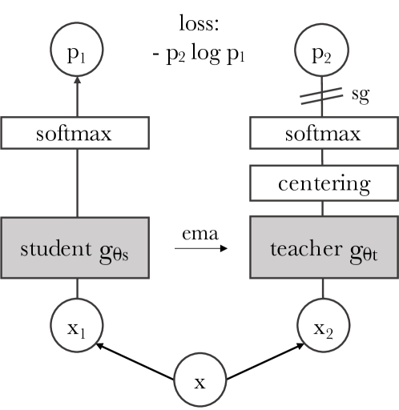
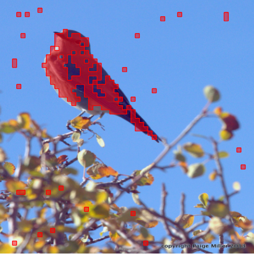
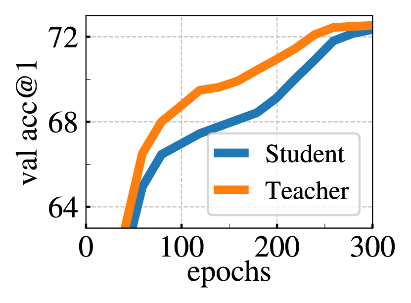
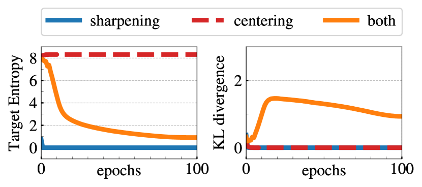

# 自己教師あり Vision Transformer に現れる新たな特性

> 原題: Emerging Properties in Self-Supervised Vision Transformers
> 著者: Mathilde Caron¹², Hugo Touvron¹³, Ishan Misra¹, Hervé Jegou¹, Julien Mairal², Piotr Bojanowski¹, Armand Joulin¹
> 所属: ¹ Facebook AI Research, ² Inria, ³ Sorbonne University
> 出典: arXiv:2104.14294（原文: <https://ar5iv.labs.arxiv.org/html/2104.14294>）

---

## Abstract（要旨）

本論文では、自己教師あり学習（self-supervised learning）が Vision Transformer（ViT）[19] に対して、畳み込みネットワーク（convnets）と比較して際立つ新たな特性を与えるかどうかを問う。

自己教師あり手法をこのアーキテクチャに適合させることが特に良く機能するという事実を超えて、われわれは以下の観察を行う。

第一に、自己教師あり ViT の特徴量は、画像のセマンティック・セグメンテーションに関する明示的な情報を含むが、これは教師あり ViT でも、また convnets でも、これほど明確には現れない。

第二に、これらの特徴量は優れた $k$-NN 分類器でもあり、小型の ViT を用いて ImageNet で top-1 精度 78.3% に達する。

われわれの研究はさらに、モメンタム・エンコーダ（momentum encoder）[33]、マルチクロップ訓練（multi-crop training）[10]、および ViT における小さなパッチの使用の重要性を強調する。

われわれはこれらの知見を、DINO と呼ぶシンプルな自己教師あり手法として実装し、これを「ラベルなしの自己蒸留（self-distillation with no labels）」の一形態として解釈する。

DINO と ViT との相乗効果を示すべく、ViT-Base を用いた線形評価において ImageNet で top-1 精度 80.1% を達成した。

<figure>


<figcaption>図1: 教師なしで訓練された 8×8 パッチの Vision Transformer の自己注意。最終層の各ヘッドにおける [CLS] トークンの自己注意を可視化したもの。このトークンはいかなるラベルや教師信号にも結びついていない。これらのマップは、モデルがクラス固有の特徴量を自動的に学習し、教師なしのオブジェクトセグメンテーションへと至っていることを示す。</figcaption>
</figure>

---

## 1 Introduction（はじめに）

Transformer [70] は、視覚認識のための畳み込みニューラルネットワーク（convnets）の代替として近年台頭してきた [19, 69, 83]。

その採用は、自然言語処理（NLP）から着想を得た訓練戦略、すなわち大規模データでの事前学習と対象データセットでのファインチューニングと結びついている [18, 55]。

結果として得られる Vision Transformer（ViT）[19] は convnets と競合する性能を持つが、convnets を上回る明確な利点をまだ提供してはいない。すなわち、計算量がより多く、より多くの訓練データを必要とし、その特徴量に固有の特性が現れない。

本論文では、視覚分野における Transformer の控えめな成功が、その事前学習における教師の使用によって説明できるのではないかと問う。

われわれの動機は、NLP における Transformer の成功の主要素の一つが、BERT [18] における穴埋め手続きや GPT [55] における言語モデリングといった形での、自己教師あり事前学習の使用であったという点にある。

これらの自己教師あり事前学習の目的関数は、文中の単語を用いて口実タスク（pretext task）を構築し、「文ごとに 1 つのラベルを予測する」という教師あり目的関数よりも豊かな学習信号を提供する。

同様に、画像においても、画像レベルの教師信号はしばしば、画像に含まれる豊かな視覚情報を、あらかじめ定義された数千のオブジェクトカテゴリから選ばれた単一の概念へと縮退させてしまう [60]。

NLP で用いられる自己教師あり口実タスクはテキスト特有のものだが、既存の自己教師あり手法の多くは、convnets を用いて画像でも有望性を示してきた [10, 12, 30, 33]。

それらは通常、似た構造を共有しつつも、自明な解（崩壊, collapse）を回避したり性能を向上させたりするために異なる構成要素を備えている [16]。

本研究では、これらの手法から着想を得て、自己教師あり事前学習が ViT の特徴量に与える影響を調べる。

特に興味深いことに、われわれは、教師あり ViT でも convnets でも現れない、以下のいくつかの興味深い特性を同定した。

- 自己教師あり ViT の特徴量は、図 1 に示すように、シーンのレイアウト、特にオブジェクトの境界を明示的に含む。この情報は、最終ブロックの自己注意モジュールから直接アクセス可能である。
- 自己教師あり ViT の特徴量は、基本的な最近傍分類器（$k$-NN）と組み合わせると、**ファインチューニングも、線形分類器も、データ拡張も一切用いずに**特に良く機能し、ImageNet で top-1 精度 78.3% を達成する。

セグメンテーションマスクの出現は、自己教師あり手法に共通する特性であるように思われる。

しかしながら、$k$-NN での良好な性能は、モメンタム・エンコーダ [33] とマルチクロップ拡張 [10] のような特定の構成要素を組み合わせた場合にのみ現れる。

本研究のもう一つの知見は、ViT で小さなパッチを使うことが、得られる特徴量の品質を向上させるうえで重要であるということである。

総じて、これらの構成要素の重要性に関するわれわれの知見は、ラベルなしの知識蒸留 [35] の一形態として解釈可能な、シンプルな自己教師あり手法の設計へと導く。

結果として得られるフレームワーク DINO は、モメンタム・エンコーダで構築された教師ネットワークの出力を、標準的なクロスエントロピー損失を用いて直接予測することで、自己教師あり訓練を単純化する。

興味深いことに、われわれの手法は、崩壊を避けるために教師の出力に対する centering と sharpening のみで機能する一方で、predictor [30]、高度な正規化 [10]、対比損失 [33] といった他の一般的な構成要素は、安定性や性能の面でほとんど利点を加えない。

特に重要な点として、われわれのフレームワークは柔軟であり、アーキテクチャを変更したり内部正規化を適合させたりすることなく [58]、convnets と ViT の両方で機能する。

さらに、DINO と ViT との相乗効果を、小さなパッチを用いた ViT-Base による ImageNet 線形分類ベンチマークで、従来の自己教師あり特徴量を上回る 80.1% の top-1 精度を達成することで検証する。

また、DINO が ResNet-50 アーキテクチャでも state-of-the-art に匹敵し、convnets でも機能することを確認する。

最後に、計算資源とメモリ容量が限られる状況で DINO を ViT と用いる際の様々なシナリオについて議論する。

特に、DINO を ViT で訓練するには 8-GPU サーバ 2 台で 3 日しかかからず、ImageNet 線形ベンチマークで $76.1\%$ を達成する。これは同程度のサイズの convnets ベースの自己教師ありシステムを、大幅に少ない計算要件で上回る性能である [10, 30]。

<figure>



<figcaption>図2: ラベルなしの自己蒸留（self-distillation with no labels）。簡単のため、ビューのペア（x₁, x₂）が 1 組だけの場合の DINO を図示する。モデルは入力画像の 2 つの異なるランダム変換を student ネットワークと teacher ネットワークに渡す。両ネットワークは同じアーキテクチャを持つが、パラメータは異なる。teacher ネットワークの出力はバッチ全体で計算した平均で centering される。各ネットワークは K 次元の特徴量を出力し、特徴量の次元方向に温度付きソフトマックスで正規化される。それらの類似度はクロスエントロピー損失で測定される。teacher には stop-gradient（sg）演算子を適用し、勾配が student のみを通じて伝播するようにする。teacher のパラメータは student のパラメータの指数移動平均（ema）で更新される。</figcaption>
</figure>

---

## 2 Related work（関連研究）

### Self-supervised learning（自己教師あり学習）

自己教師あり学習に関する大きな研究群は、**instance classification** [12, 20, 33, 73] と呼ばれる識別的アプローチに焦点を当てており、これは各画像を異なるクラスとみなし、データ拡張を行ったうえでそれらを識別することによってモデルを訓練する。

しかしながら、全画像間を識別する分類器を明示的に学習する [20] という方法は、画像数に対して良くスケールしない。

Wu ら [73] は、インスタンスを分類する代わりに比較するために、ノイズ対比推定（NCE）[32] を用いることを提案している。

このアプローチの注意点は、多数の画像の特徴量を同時に比較する必要があるという点である。

実際には、これは大きなバッチ [12] あるいはメモリバンク [33, 73] を必要とする。

いくつかの派生研究は、クラスタリングの形でインスタンスを自動的にグループ化できるようにしている [2, 8, 9, 36, 42, 74, 80, 85]。

近年の研究は、画像間を識別することなく教師なし特徴量を学習できることを示してきた。

特に興味深いものとして、Grill ら [30] は BYOL と呼ばれる距離学習的定式化を提案しており、ここでは特徴量はモメンタム・エンコーダで得られた表現に一致させることで訓練される。

BYOL のような手法は、性能低下を伴うものの、モメンタム・エンコーダなしでも機能する [16, 30]。

他のいくつかの研究もこの方向と呼応しており、より精巧な表現に一致させること [26, 27]、特徴量を一様分布に一致させることで訓練すること [6]、あるいは whitening を用いること [23, 81] が可能であることを示している。

われわれのアプローチは BYOL から着想を得つつも、異なる類似度マッチング損失で動作し、student と teacher にまったく同じアーキテクチャを用いる。

このようにして本研究は、BYOL で開始された「自己教師あり学習をラベルなしの Mean Teacher 自己蒸留 [65] の一形態として解釈する」という見方を完成させる。

### Self-training and knowledge distillation（自己訓練と知識蒸留）

自己訓練（self-training）は、小さな初期注釈集合をラベルなしの大量のインスタンス集合へと伝播させることで特徴量の品質を向上させることを目的とする。

この伝播は、ハードなラベル割り当て [41, 78, 79] あるいはソフトな割り当て [76] のいずれかで行うことができる。

ソフトラベルを使う場合、このアプローチはしばしば知識蒸留（knowledge distillation）[7, 35] と呼ばれ、主としてモデル圧縮のために、小さなネットワークを訓練して大きなネットワークの出力を模倣させるよう設計されてきた。

Xie ら [76] は、蒸留が自己訓練パイプラインにおいてソフトな擬似ラベルを未ラベルデータへと伝播させるために用いられることを示し、自己訓練と知識蒸留の間の本質的なつながりを描いた。

本研究はこの関係の上に構築され、知識蒸留をラベルが利用できない場合へと拡張する。

先行研究も、自己教師あり学習と知識蒸留を組み合わせ [25, 63, 13, 47]、自己教師ありモデル圧縮と性能向上を可能にしてきた。

しかしながら、これらの研究は**事前学習済みで固定された** teacher に依拠する一方、われわれの teacher は訓練中に動的に構築される。

このようにして、知識蒸留は自己教師あり事前学習の後処理ステップとして用いられるのではなく、自己教師あり目的関数として直接定式化される。

最後に、本研究は codistillation [1] とも関連しており、そこでは student と teacher が同じアーキテクチャを持ち、訓練中に蒸留を用いる。

ただし、codistillation における teacher は student からも蒸留される一方、本研究では teacher は student の平均で更新される。

---

## 3 Approach（アプローチ）

### 3.1 SSL with Knowledge Distillation（知識蒸留による自己教師あり学習）

本研究で用いるフレームワーク DINO は、最近の自己教師ありアプローチ [10, 16, 12, 30, 33] と同じ全体構造を共有する。

しかしながら、われわれの手法は知識蒸留 [35] とも類似性を持つため、ここではその角度から提示する。

DINO を図 2 に示し、Algorithm 1 にその擬似コード実装を提示する。

知識蒸留は、与えられた teacher ネットワーク $g_{\theta_{t}}$ の出力に一致させるよう student ネットワーク $g_{\theta_{s}}$ を訓練する学習パラダイムである。ここで $\theta_s$ と $\theta_t$ はそれぞれのパラメータである。

入力画像 $x$ が与えられたとき、両ネットワークは $K$ 次元の確率分布を出力し、これらを $P_s$ と $P_t$ で表す。

確率 $P$ は、ネットワーク $g$ の出力をソフトマックス関数で正規化することで得られる。より厳密には、

$$
P_{s}(x)^{(i)}=\frac{\exp(g_{\theta_{s}}(x)^{(i)}/\tau_{s})}{\sum_{k=1}^{K}\exp(g_{\theta_{s}}(x)^{(k)}/\tau_{s})},
$$

であり、ここで $\tau_s > 0$ は出力分布の尖り（sharpness）を制御する温度パラメータであり、$P_t$ にも温度 $\tau_t$ を伴う同様の式が成り立つ。

固定された teacher ネットワーク $g_{\theta_t}$ が与えられたとき、われわれは student のパラメータ $\theta_s$ に関するクロスエントロピー損失を最小化することで、これらの分布を一致させることを学習する。

$$
\min_{\theta_{s}}H(P_{t}(x),P_{s}(x)),
$$

ここで $H(a,b) = -a \log b$ である。

以下では、式 (2) の問題を自己教師あり学習にどう適合させるかを詳述する。

第一に、マルチクロップ戦略 [10] を用いて画像の異なる歪んだビュー、すなわちクロップ群を構築する。

より厳密には、与えられた画像から、異なるビュー集合 $V$ を生成する。

この集合は 2 つの **global** ビュー $x^g_1$、$x^g_2$ と、より小さい解像度の複数の **local** ビューを含む。

すべてのクロップは student を通過する一方、**global** ビューだけが teacher を通過する。これにより「local-to-global」対応の学習が促される。

次の損失を最小化する。

$$
\min_{\theta_{s}}\sum_{x\in\{x^{g}_{1},x^{g}_{2}\}}\quad\sum_{\begin{subarray}{c}x^{\prime}\in V\\
x^{\prime}\neq\,x\end{subarray}}\quad H(P_{t}(x),P_{s}(x^{\prime})).
$$

**Algorithm 1**: DINO の PyTorch 擬似コード（マルチクロップなし）

```python
# gs, gt: student と teacher のネットワーク
# C: center（K）
# tps, tpt: student と teacher の温度
# l, m: ネットワークと center のモメンタム率

gt.params = gs.params
for x in loader:  # n サンプルのミニバッチ x をロード
    x1, x2 = augment(x), augment(x)  # ランダムなビュー

    s1, s2 = gs(x1), gs(x2)  # student の出力 n×K
    t1, t2 = gt(x1), gt(x2)  # teacher の出力 n×K

    loss = H(t1, s2) / 2 + H(t2, s1) / 2
    loss.backward()  # 誤差逆伝播

    # student, teacher, center の更新
    update(gs)  # SGD
    gt.params = l * gt.params + (1 - l) * gs.params
    C = m * C + (1 - m) * cat([t1, t2]).mean(dim=0)

def H(t, s):
    t = t.detach()  # 勾配を止める
    s = softmax(s / tps, dim=1)
    t = softmax((t - C) / tpt, dim=1)  # center + sharpen
    return -(t * log(s)).sum(dim=1).mean()
```

この損失は一般的であり、任意の本数のビューに対して、2 本だけでも用いることができる。

しかしながら、われわれはマルチクロップの標準設定に従い、元画像の大きな領域（例えば 50% 以上）を覆う解像度 $224^2$ の global ビューを 2 本、および元画像の小さな領域（例えば 50% 未満）だけを覆う解像度 $96^2$ の local ビューを数本用いる。

特に断りのない限り、われわれはこの設定を DINO の基本パラメータ化と呼ぶ。

両ネットワークは同じアーキテクチャ $g$ を異なるパラメータ集合 $\theta_s$ と $\theta_t$ で共有する。

われわれは確率的勾配降下法によって式 (3) を最小化することで、パラメータ $\theta_s$ を学習する。

### Teacher network（teacher ネットワーク）

知識蒸留とは異なり、われわれは事前に与えられた teacher $g_{\theta_t}$ を持たないため、それを student ネットワークの過去の反復から構築する。

第 5.2 節では teacher に対する様々な更新規則を検討し、エポックの間にわたって teacher を凍結することが本フレームワークにおいて驚くほど良く機能する一方、student の重みを teacher にコピーすることは収束しないことを示す。

特に興味深いことに、student の重みに対する指数移動平均（EMA, exponential moving average）、すなわちモメンタム・エンコーダ [33] を用いることが、本フレームワークに特によく適している。

更新規則は $\theta_t \leftarrow \lambda \theta_t + (1-\lambda) \theta_s$ であり、$\lambda$ は訓練中に $0.996$ から $1$ までコサインスケジュールに従う [30]。

もともとモメンタム・エンコーダは、対比学習においてキューの代替として導入されたものである [33]。

しかしながら、本フレームワークにおける役割は異なる。なぜなら、われわれはキューも対比損失も持たないからである。そして、その役割は自己訓練で用いられる mean teacher [65] の役割に近いかもしれない。

実際、この teacher が指数減衰を伴う Polyak-Ruppert 平均化 [51, 59] に類似したモデルアンサンブルの一形態を実行することを観察している。

Polyak-Ruppert 平均化をモデルアンサンブルに用いることは、モデルの性能を向上させるための標準的な実践である [38]。

訓練を通じて teacher が student よりも良い性能を示すこと、したがって teacher がより高品質なターゲット特徴量を提供することで student の訓練を導いていることを、われわれは観察している。

このダイナミクスは先行研究 [30, 58] では観察されていなかった。

**表1**: ネットワーク構成。「Blocks」は Transformer ブロックの数、「dim」はチャネル次元、「heads」はマルチヘッド注意のヘッド数。「#tokens」は $224^2$ 解像度入力を考えたときのトークン列の長さ、「#params」は（projection head を除いた）全パラメータ数、「im/s」は NVIDIA V100 GPU 上で forward あたり 128 サンプルとした時の推論時間を表す。

| model | blocks | dim | heads | #tokens | #params | im/s |
| --- | --- | --- | --- | --- | --- | --- |
| ResNet-50 | – | 2048 | – | – | 23M | 1237 |
| ViT-S/16 | 12 | 384 | 6 | 197 | 21M | 1007 |
| ViT-S/8 | 12 | 384 | 6 | 785 | 21M | 180 |
| ViT-B/16 | 12 | 768 | 12 | 197 | 85M | 312 |
| ViT-B/8 | 12 | 768 | 12 | 785 | 85M | 63 |

### Network architecture（ネットワークアーキテクチャ）

ニューラルネットワーク $g$ はバックボーン $f$（ViT [19] または ResNet [34]）と projection head $h$ で構成される: $g = h \circ f$。

下流タスクで用いられる特徴量はバックボーン $f$ の出力である。

projection head は、隠れ次元 $2048$ の 3 層多層パーセプトロン（MLP）に続いて $\ell_2$ 正規化と、$K$ 次元の重み正規化済み全結合層 [61] からなり、これは SwAV [10] の設計に類似している。

他の projection head も試したが、この特定の設計が DINO に最も良く機能するように見える（付録 C）。

われわれは predictor [30] を用いず、その結果として student と teacher のネットワークはまったく同じアーキテクチャを持つ。

特に興味深い点として、標準的な convnets とは異なり、ViT アーキテクチャは既定でバッチ正規化（BN）を用いない。

したがって、DINO を ViT に適用する際には、projection head にも BN を用いず、システム全体を**完全に BN フリー**にする。

### Avoiding collapse（崩壊の回避）

いくつかの自己教師あり手法は、崩壊を回避するために用いる演算によって区別される。すなわち、対比損失 [73]、クラスタリング制約 [8, 10]、predictor [30]、あるいはバッチ正規化 [30, 58] である。

われわれのフレームワークは複数の正規化 [10] によって安定化できるが、崩壊を回避するためにモメンタム teacher の出力に対する centering と sharpening のみでも機能する。

第 5.3 節で実験的に示すように、centering は 1 つの次元が支配的になることを防ぐ一方で、一様分布への崩壊を促す。sharpening は逆の効果を持つ。

両方の演算を適用するとそれらの効果が釣り合い、モメンタム teacher の存在下で崩壊を回避するのに十分である。

崩壊を回避するためにこの方法を選ぶことは、安定性と引き換えにバッチへの依存を減らすトレードオフとなる。centering 演算はバッチの 1 次統計量にのみ依存し、teacher にバイアス項 $c$ を加えるものとして解釈できる: $g_t(x) \leftarrow g_t(x) + c$。

center $c$ は指数移動平均で更新されるため、第 5.5 節で示すように、様々なバッチサイズで本アプローチが良く機能する。

$$
c\leftarrow mc+(1-m)\frac{1}{B}\sum_{i=1}^{B}g_{\theta_{t}}(x_{i}),
$$

ここで $m > 0$ はレートパラメータ、$B$ はバッチサイズである。

出力の sharpening は、teacher のソフトマックス正規化における温度 $\tau_t$ に低い値を用いることで得られる。

### 3.2 Implementation and evaluation protocols（実装と評価プロトコル）

本節では、DINO を訓練するための実装の詳細と、実験で用いる評価プロトコルを提示する。

### Vision Transformer

Vision Transformer（ViT）[19, 70] の機構を簡単に説明する。Transformer の詳細については Vaswani ら [70] を、画像への適合については Dosovitskiy ら [19] を参照されたい。

実装は DeiT [69] で用いられているものに従う。

本論文で用いる様々なネットワークの構成を表 1 にまとめた。

ViT アーキテクチャは、解像度 $N \times N$ の重ならない連続的な画像パッチのグリッドを入力として受け取る。

本論文では典型的に $N=16$（「/16」）または $N=8$（「/8」）を用いる。

パッチは線形層を通って、埋め込み集合に変換される。

われわれはこの系列に追加の学習可能なトークンを加える [18, 19]。

このトークンの役割は、系列全体から情報を集約することであり、その出力に projection head $h$ を取り付ける。

このトークンを先行研究 [18, 19, 69] との整合性のために class token [CLS] と呼ぶが、本研究の場合、これはいかなるラベルにも教師信号にも結びついていない。

パッチトークン集合と [CLS] トークンは、「pre-norm」レイヤ正規化 [11, 39] を備えた標準的な Transformer ネットワークに入力される。

Transformer は自己注意層とフィードフォワード層の系列で、スキップ接続と並列に構成される。

自己注意層は、注意機構 [4] により他のトークン表現を見ることでトークン表現を更新する。

### Implementation details（実装の詳細）

ImageNet データセット [60] 上で、ラベルを用いずにモデルを事前学習する。

ViT-S/16 を用いる際には、AdamW 最適化器 [44] とバッチサイズ $1024$ を 16 GPU に分散させて訓練する。

学習率は最初の $10$ エポックの間に線形に立ち上げられ、次の線形スケーリング規則 [29] で決定されるベース値に到達する: $lr = 0.0005 \times \text{batchsize}/256$。

このウォームアップ後、学習率はコサインスケジュール [43] で減衰させる。

重み減衰（weight decay）もコサインスケジュールに従い $0.04$ から $0.4$ へと変化する。

温度 $\tau_s$ は $0.1$ に設定し、$\tau_t$ には最初の $30$ エポックの間に $0.04$ から $0.07$ への線形ウォームアップを用いる。

BYOL [30] のデータ拡張（color jittering, Gaussian blur, solarization）と、bicubic 補間による位置埋め込みのスケール適合 [19, 69] を伴うマルチクロップ [10] に従う。

結果を再現するためのコードとモデルは公開されている。

### Evaluation protocols（評価プロトコル）

自己教師あり学習の標準的なプロトコルは、凍結された特徴量上で線形分類器を学習する [82, 33] か、下流タスクで特徴量をファインチューニングするかのいずれかである。

線形評価では、訓練中に random resize crop と水平反転による拡張を適用し、中央クロップでの精度を報告する。

ファインチューニング評価では、事前学習済みの重みでネットワークを初期化し、訓練中にそれらを適合させる。

しかしながら、両評価ともハイパーパラメータに敏感であり、例えば学習率を変えると実行間で精度に大きなばらつきが観察される。

そこでわれわれは、[73] のように単純な加重最近傍分類器（$k$-NN）で特徴量の品質も評価する。

事前学習済みモデルを凍結し、下流タスクの訓練データの特徴量を計算して保存する。

最近傍分類器は、画像の特徴量を $k$ 個の最も近い保存済み特徴量に一致させ、それらがラベルに投票する。

異なる最近傍数を掃引したところ、ほとんどの実行で $20$ NN が一貫して最も良く機能することを発見した。

この評価プロトコルは、他のハイパーパラメータの調整もデータ拡張も必要とせず、下流データセット上を 1 パス通すだけで実行でき、特徴量評価を大きく単純化する。

**表2**: ImageNet 上での線形および $k$-NN 分類。様々な自己教師あり手法に対する ImageNet の検証集合での線形評価と $k$-NN 評価の top-1 精度を報告する。ResNet-50 と ViT-small アーキテクチャに焦点を当てているが、アーキテクチャ横断で得られた最良結果も報告する。$*$ はわれわれが実行したもの。公開重みのあるモデルに対して $k$-NN 評価を実行している。スループット（im/s）は NVIDIA V100 GPU で forward あたり 128 サンプルとして計算。パラメータ（M）は特徴量抽出器のもの。

| Method | Arch. | Param. | im/s | Linear | $k$-NN |
|---|---|---|---|---|---|
| Supervised | RN50 | 23 | 1237 | 79.3 | 79.3 |
| SCLR | RN50 | 23 | 1237 | 69.1 | 60.7 |
| MoCov2 | RN50 | 23 | 1237 | 71.1 | 61.9 |
| InfoMin | RN50 | 23 | 1237 | 73.0 | 65.3 |
| BarlowT | RN50 | 23 | 1237 | 73.2 | 66.0 |
| OBoW | RN50 | 23 | 1237 | 73.8 | 61.9 |
| BYOL | RN50 | 23 | 1237 | 74.4 | 64.8 |
| DCv2 | RN50 | 23 | 1237 | 75.2 | 67.1 |
| SwAV | RN50 | 23 | 1237 | 75.3 | 65.7 |
| **DINO** | RN50 | 23 | 1237 | **75.3** | **67.5** |
| Supervised | ViT-S | 21 | 1007 | 79.8 | 79.8 |
| BYOL* | ViT-S | 21 | 1007 | 71.4 | 66.6 |
| MoCov2* | ViT-S | 21 | 1007 | 72.7 | 64.4 |
| SwAV* | ViT-S | 21 | 1007 | 73.5 | 66.3 |
| **DINO** | ViT-S | 21 | 1007 | **77.0** | **74.5** |
| *Comparison across architectures* | | | | | |
| SCLR | RN50w4 | 375 | 117 | 76.8 | 69.3 |
| SwAV | RN50w2 | 93 | 384 | 77.3 | 67.3 |
| BYOL | RN50w2 | 93 | 384 | 77.4 | – |
| DINO | ViT-B/16 | 85 | 312 | 78.2 | 76.1 |
| SwAV | RN50w5 | 586 | 76 | 78.5 | 67.1 |
| BYOL | RN50w4 | 375 | 117 | 78.6 | – |
| BYOL | RN200w2 | 250 | 123 | 79.6 | 73.9 |
| **DINO** | ViT-S/8 | 21 | 180 | **79.7** | **78.3** |
| SCLRv2 | RN152w3+SK | 794 | 46 | 79.8 | 73.1 |
| **DINO** | ViT-B/8 | 85 | 63 | **80.1** | **77.4** |

---

## 4 Main Results（主要な結果）

まず本研究で用いる DINO フレームワークを、ImageNet の標準的な自己教師ありベンチマークで検証する。

次に、得られた特徴量の検索、オブジェクト発見、転移学習に関する特性を調べる。

### 4.1 Comparing with SSL frameworks on ImageNet（ImageNet における SSL フレームワークとの比較）

2 つの異なる設定を考慮する: 同じアーキテクチャでの比較と、アーキテクチャ横断での比較である。

### Comparing with the same architecture（同じアーキテクチャでの比較）

表 2 の上段では、同じアーキテクチャ、すなわち ResNet-50 [34] か ViT-small（DeiT-S [69] の設計に従う）のいずれかで、DINO を他の自己教師あり手法と比較する。

ViT-S の選択は、ResNet-50 とのいくつかの軸での類似性によって動機づけられている: パラメータ数（21M 対 23M）、スループット（1237/sec 対 1007 im/sec）、および [69] の訓練手順による ImageNet の教師あり性能（79.3% 対 79.8%）である。

ViT-S の派生は付録 D で探求する。

まず、DINO が ResNet-50 上で state-of-the-art と同等の性能を示すことを観察し、DINO が標準設定で機能することを検証する。

ViT アーキテクチャに切り替えると、DINO は線形分類で BYOL、MoCov2、SwAV を +3.5%、$k$-NN 評価で +7.9% 上回る。

より驚くべきことに、単純な $k$-NN 分類器での性能はほぼ線形分類器に匹敵する（74.5% 対 77.0%）。

この特性は、DINO を ViT アーキテクチャと用いた場合にのみ現れ、他の既存自己教師あり手法でも ResNet-50 でも現れない。

### Comparing across architectures（アーキテクチャ横断での比較）

表 2 の下段では、アーキテクチャ横断で得られる最良性能を比較する。

この設定の関心は、手法を直接比較することではなく、より大きなアーキテクチャに移った際に DINO で訓練された ViT の限界を評価することにある。

DINO でより大きな ViT を訓練すると性能が向上するが、パッチサイズを小さくすること（「/8」派生）の方が性能に与える影響が大きい。

パッチサイズを小さくしてもパラメータは増えないが、実行時間の大幅な増加とより大きなメモリ使用量をもたらす。

それでもなお、$8 \times 8$ パッチの base ViT を DINO で訓練すると、線形分類で 80.1% top-1、$k$-NN 分類器で 77.4% を達成し、これは以前の state-of-the-art [13] よりも 10 倍少ないパラメータかつ 1.4 倍速い実行時間で実現される。

### 4.2 Properties of ViT trained with SSL（SSL で訓練された ViT の特性）

最近傍探索、オブジェクト位置に関する情報の保持、下流タスクへの転移可能性の観点から、DINO の特徴量の特性を評価する。

**表3**: 画像検索。ImageNet および Google Landmarks v2（GLDv2）データセットで、教師ありまたは DINO で事前学習された off-the-shelf 特徴量の検索性能を比較する。改訂版 Oxford と Paris での mAP を報告。ランドマークデータセット上で DINO を事前学習すると特に良い性能を示す。参考として、off-the-shelf 特徴量を用いた最良の検索手法 [57] も報告する。

| Pretrain | Arch. | Pretrain data | $\mathcal{R}$Ox M | $\mathcal{R}$Ox H | $\mathcal{R}$Par M | $\mathcal{R}$Par H |
|---|---|---|---|---|---|---|
| Sup. | RN101+R-MAC | ImNet | 49.8 | 18.5 | 74.0 | 52.1 |
| Sup. | ViT-S/16 | ImNet | 33.5 | 8.9 | 63.0 | 37.2 |
| DINO | ResNet-50 | ImNet | 35.4 | 11.1 | 55.9 | 27.5 |
| DINO | ViT-S/16 | ImNet | 41.8 | 13.7 | 63.1 | 34.4 |
| DINO | ViT-S/16 | GLDv2 | **51.5** | **24.3** | **75.3** | **51.6** |

#### 4.2.1 Nearest neighbor retrieval with DINO ViT（DINO ViT による最近傍検索）

ImageNet 分類の結果は、最近傍検索に依拠するタスクに対するわれわれの特徴量の潜在能力を露わにした。

この一連の実験では、ランドマーク検索とコピー検出タスクでこの発見をさらに固める。

### Image Retrieval（画像検索）

改訂版 [53] Oxford と Paris 画像検索データセット [50] を考える。

これらは段階的な難易度を持つクエリ／データベース対の 3 つの異なる分割を含む。

中（M）と難（H）の分割に対する Mean Average Precision（mAP）を報告する。

表 3 では、教師ありまたは DINO 訓練のいずれかで得られた異なる **off-the-shelf** 特徴量の性能を比較する。

特徴量を凍結し、検索のために $k$-NN を直接適用する。

DINO の特徴量がラベル付き ImageNet で訓練されたものを上回ることを観察する。

SSL アプローチの利点は、いかなる注釈も必要とせずに任意のデータセットで訓練できるという点である。

検索目的で設計されたランドマークのデータセットである Google Landmarks v2（GLDv2）[72] の 120 万件のクリーンな集合で DINO を訓練する。

GLDv2 で訓練された DINO ViT 特徴量は著しく良く、off-the-shelf 記述子に基づく既発表手法を上回る [68, 57]。

**表4**: コピー検出。Copydays「strong」サブセット [21] におけるコピー検出の mAP 性能を報告。参考として、特定オブジェクト検索のために特別に訓練された multigrain モデル [5] の性能も報告。

| Method | Arch. | Dim. | Resolution | mAP |
| --- | --- | --- | --- | --- |
| Multigrain | ResNet-50 | 2048 | $224^{2}$ | 75.1 |
| Multigrain | ResNet-50 | 2048 | largest side 800 | 82.5 |
| Supervised | ViT-B/16 | 1536 | $224^{2}$ | 76.4 |
| DINO | ViT-B/16 | 1536 | $224^{2}$ | 81.7 |
| DINO | ViT-B/8 | 1536 | $320^{2}$ | **85.5** |

### Copy detection（コピー検出）

ViT を DINO で訓練したものについて、コピー検出タスクでの性能も評価する。

INRIA Copydays データセット [21] の「strong」サブセットでの平均適合率を報告する。

タスクは、ぼかし、挿入、印刷とスキャンなどによって歪まされた画像を認識することである。

先行研究 [5] に従い、YFCC100M データセット [66] からランダムにサンプリングした 1 万枚のディストラクター画像を追加する。

事前学習されたネットワークから得られる特徴量にコサイン類似度を直接適用してコピー検出を行う。

特徴量は、出力 [CLS] トークンと GeM プーリング [54] された出力パッチトークンを連結したものとして得られる。

これは ViT-B に対して 1536 次元の記述子をもたらす。

[5] に従い特徴量に whitening を適用する。この変換は、ディストラクターとは別の YFCC100M からの追加 2 万枚のランダム画像で学習する。

表 4 は、DINO で訓練された ViT がコピー検出に対して非常に競合的であることを示す。

**表5**: DAVIS 2017 動画オブジェクトセグメンテーション。動画インスタンス追跡における凍結特徴量の品質を評価。平均領域類似度 $\mathcal{J}_m$ と平均輪郭ベース精度 $\mathcal{F}_m$ を報告。既存の自己教師あり手法および ImageNet で訓練された教師あり ViT-S/8 と比較する。画像解像度は 480p。

| Method | Data | Arch. | $(\mathcal{J} \& \mathcal{F})_m$ | $\mathcal{J}_m$ | $\mathcal{F}_m$ |
| --- | --- | --- | --- | --- | --- |
| *Supervised* | | | | | |
| ImageNet | INet | ViT-S/8 | 66.0 | 63.9 | 68.1 |
| STM | I/D/Y | RN50 | 81.8 | 79.2 | 84.3 |
| *Self-supervised* | | | | | |
| CT | VLOG | RN50 | 48.7 | 46.4 | 50.0 |
| MAST | YT-VOS | RN18 | 65.5 | 63.3 | 67.6 |
| STC | Kinetics | RN18 | 67.6 | 64.8 | 70.2 |
| DINO | INet | ViT-S/16 | 61.8 | 60.2 | 63.4 |
| DINO | INet | ViT-B/16 | 62.3 | 60.7 | 63.9 |
| DINO | INet | ViT-S/8 | 69.9 | 66.6 | 73.1 |
| DINO | INet | ViT-B/8 | **71.4** | **67.9** | **74.9** |

<figure>


<figcaption>図3: 複数ヘッドによる注意マップ。DINO で訓練された ViT-S/8 の最終層のヘッド群を考え、[CLS] トークンのクエリに対する自己注意を表示する。色で示される異なるヘッドは、異なるオブジェクトや部位を表す異なる位置に焦点を当てる（さらなる例は付録に）。</figcaption>
</figure>

#### 4.2.2 Discovering the semantic layout of scenes（シーンの意味的レイアウトの発見）

図 1 で定性的に示したように、われわれの自己注意マップは画像のセグメンテーションに関する情報を含む。

本研究では、この特性を標準ベンチマークで、またこれらの注意マップから生成されるマスクの品質を直接探ることで測定する。

### Video instance segmentation（動画インスタンスセグメンテーション）

表 5 では、出力パッチトークンを DAVIS-2017 動画インスタンスセグメンテーションベンチマーク [52] で評価する。

Jabri ら [37] の実験プロトコルに従い、連続するフレーム間の最近傍でシーンをセグメント化する。したがって、特徴量の上にいかなるモデルも訓練せず、タスクのためにいかなる重みもファインチューニングしない。

訓練目的関数もアーキテクチャも密なタスク向けに設計されていないにもかかわらず、本ベンチマーク上で性能が競合的であることを表 5 で観察する。

ネットワークがファインチューニングされていないため、モデルの出力は何らかの空間情報を保持していなければならない。

最後に、この密な認識タスクに対して、小さなパッチを持つ派生（「/8」）の方がはるかに良く機能する（ViT-B で $(\mathcal{J} \& \mathcal{F})_m$ が +$9.1\%$）。

### Probing the self-attention map（自己注意マップの探索）

図 3 では、異なるヘッドが、たとえ遮蔽されていたり（3 行目の茂み）小さかったり（2 行目の旗）しても、画像の異なる意味領域に注意を向けられることを示す。

可視化は $480$p 画像で得られ、ViT-S/8 に対して 3601 トークンの列を生み出す。

図 4 では、教師あり ViT が clutter（雑然とした背景）の存在下でオブジェクトに良く注意を向けないことを、定性的にも定量的にも示す。

自己注意マップを閾値処理して質量の 60% を保持することで得られるセグメンテーションマスクと、ground truth との Jaccard 類似度を報告する。

なお、自己注意マップは滑らかであり、マスクを生成するように最適化されたものではない。

それでもなお、教師ありと DINO モデルとの間に Jaccard 類似度の有意な差があることが明確に見て取れる。

自己教師あり convnets もセグメンテーションに関する情報を含むが、それらの重みから情報を取り出すには専用の手法を要する [31] ことに注意。

<figure>



<figcaption>図4: 教師あり vs. DINO によるセグメンテーション。自己注意マップを閾値処理して質量の 60% を保持することで得られるマスクを可視化する。上段は教師ありおよび DINO で訓練された ViT-S/8 に対する結果マスクを示す。両モデルとも最良のヘッドを示す。下段の表は、これらのマスクと PASCAL VOC12 データセットの検証画像における ground truth との Jaccard 類似度を比較する。</figcaption>
</figure>

#### 4.2.3 Transfer learning on downstream tasks（下流タスクでの転移学習）

表 6 では、DINO で事前学習された特徴量の品質を様々な下流タスクで評価する。

ImageNet 上で教師ありで訓練された同じアーキテクチャの特徴量と比較する。

Touvron ら [69] で用いられているプロトコルに従い、各下流タスクで特徴量をファインチューニングする。

ViT アーキテクチャに対して、自己教師あり事前学習が教師あり特徴量よりも良く転移することを観察する。これは畳み込みネットワークでの観察 [10, 33, 62] と整合的である。

最後に、自己教師あり事前学習は ImageNet 上の結果を大きく向上させる（+1〜2%）。

**表6**: 事前学習済みモデルを異なるデータセットでファインチューニングすることによる転移学習。top-1 精度を報告。DINO による自己教師あり事前学習は、教師あり事前学習よりも良く転移する。

|  | Cifar${}_{10}$ | Cifar${}_{100}$ | INat${}_{18}$ | INat${}_{19}$ | Flwrs | Cars | INet |
| --- | --- | --- | --- | --- | --- | --- | --- |
| **ViT-S/16** |  |  |  |  |  |  |  |
| Sup. | 99.0 | 89.5 | 70.7 | 76.6 | 98.2 | 92.1 | 79.9 |
| DINO | 99.0 | 90.5 | 72.0 | 78.2 | 98.5 | 93.0 | 81.5 |
| **ViT-B/16** |  |  |  |  |  |  |  |
| Sup. | 99.0 | 90.8 | 73.2 | 77.7 | 98.4 | 92.1 | 81.8 |
| DINO | 99.1 | 91.7 | 72.6 | 78.6 | 98.8 | 93.0 | 82.8 |

---

## 5 Ablation Study of DINO（DINO のアブレーション研究）

本節では、ViT に適用された DINO を実証的に研究する。

この研究全体で考慮するモデルは ViT-S である。

追加の研究については付録も参照されたい。

### 5.1 Importance of the Different Components（各構成要素の重要性）

自己教師あり学習からの異なる構成要素を、われわれのフレームワークで訓練された ViT に加えることの影響を示す。

**表7**: 自己教師あり ViT 事前学習における重要な構成要素。モデルは ViT-S/16 で 300 エポック訓練される。$k$-NN と線形（「Lin.」）評価にとって重要な構成要素を研究する。異なる派生について、既定の DINO 設定との違いを強調する。最良の組み合わせは、モメンタム・エンコーダとマルチクロップ拡張、クロスエントロピー損失である。BYOL [30]、MoCo-v2 [15]、SwAV [10] の結果も報告する。

|  | Method | Mom. | SK | MC | Loss | Pred. | $k$-NN | Lin. |
|---|---|---|---|---|---|---|---|---|
| 1 | **DINO** | ✓ | ✗ | ✓ | CE | ✗ | **72.8** | **76.1** |
| 2 |  | ✗ | ✗ | ✓ | CE | ✗ | 0.1 | 0.1 |
| 3 |  | ✓ | ✓ | ✓ | CE | ✗ | 72.2 | 76.0 |
| 4 |  | ✓ | ✗ | ✗ | CE | ✗ | 67.9 | 72.5 |
| 5 |  | ✓ | ✗ | ✓ | MSE | ✗ | 52.6 | 62.4 |
| 6 |  | ✓ | ✗ | ✓ | CE | ✓ | 71.8 | 75.6 |
| 7 | BYOL | ✓ | ✗ | ✗ | MSE | ✓ | 66.6 | 71.4 |
| 8 | MoCov2 | ✓ | ✗ | ✗ | INCE | ✗ | 62.0 | 71.6 |
| 9 | SwAV | ✗ | ✓ | ✓ | CE | ✗ | 64.7 | 71.8 |

> SK: Sinkhorn-Knopp, MC: Multi-Crop, Pred.: Predictor
> CE: Cross-Entropy, MSE: Mean Square Error, INCE: InfoNCE

表 7 では、構成要素を追加または除去するに従い、異なるモデルの派生を報告する。

第一に、モメンタムが存在しない場合、われわれのフレームワークは機能せず（行 2）、崩壊を回避するために例えば SK のようなより高度な操作が必要であることを観察する（行 9）。

しかしながら、モメンタムがあれば SK を使ってもほとんど影響がない（行 3）。

加えて、行 3 と行 9 を比較すると、性能のためのモメンタム・エンコーダの重要性が浮き彫りになる。

第二に、行 4 と行 5 では、マルチクロップ訓練と DINO のクロスエントロピー損失が、良い特徴量を得るための重要な構成要素であることを観察する。

また、student ネットワークに predictor を追加してもほとんど影響がないことを観察する一方（行 6）、BYOL ではこれが崩壊を防ぐために決定的に重要である [16, 30]。

完全を期すため、付録 B でこのアブレーション研究の拡張版を提示する。

### Importance of the patch size（パッチサイズの重要性）

図 5 では、異なるパッチサイズ $16 \times 16$、$8 \times 8$、$5 \times 5$ で訓練された ViT-S モデルの $k$-NN 分類性能を比較する。

また、$16 \times 16$ および $8 \times 8$ パッチの ViT-B とも比較する。

すべてのモデルは 300 エポック訓練される。

パッチサイズを小さくするにつれて性能が大きく向上することを観察する。

追加のパラメータを加えることなく性能を大きく向上させられる点が興味深い。

しかしながら、より小さなパッチを用いることによる性能向上は、スループットの犠牲を伴う: $5 \times 5$ パッチを用いると、スループットは 44 im/s に落ち、$8 \times 8$ パッチでの 180 im/s と対照的である。

<figure>


<figcaption>図5: パッチサイズの効果。ViT-B と ViT-S における異なる入力パッチサイズに対する、スループットの関数としての k-NN 評価。モデルは 300 エポック訓練される。</figcaption>
</figure>

### 5.2 Impact of the choice of Teacher Network（teacher ネットワーク選択の影響）

このアブレーションでは、DINO における teacher の役割を理解するために、異なる teacher ネットワークで実験する。

$k$-NN プロトコルで $300$ エポック訓練されたモデルを比較する。

### Building different teachers from the student（student から異なる teacher を構築）

図 6（右）では、モメンタム teacher 以外に student の過去のインスタンスから teacher を構築する異なる戦略を比較する。

まず、過去のエポックの student ネットワークを teacher として用いることを考える。

この戦略は、メモリバンク [73] あるいはハード蒸留クラスタリングの形 [8, 2, 14] として用いられてきた。

次に、前の反復の student ネットワークと、teacher のための student のコピーを用いることを考える。

われわれの設定では、最近のバージョンの student に基づく teacher を用いると収束しない。

この設定は機能するためにより多くの正規化を必要とする。

興味深いことに、前のエポックの teacher を用いると崩壊せず、MoCo-v2 や BYOL のような既存フレームワークと競合する $k$-NN 評価性能を提供することを観察する。

モメンタム・エンコーダの方がこの素朴な teacher より明らかに優れた性能を提供するが、この発見は teacher の代替案を調査する余地があることを示唆する。

### Analyzing the training dynamic（訓練ダイナミクスの分析）

モメンタム teacher がわれわれのフレームワークで良く機能する理由をさらに理解するため、図 6 の左パネルで ViT の訓練中のそのダイナミクスを研究する。

重要な観察は、この teacher が訓練を通じて student を絶えず上回るということであり、ResNet-50 での訓練でも同じ振る舞いを観察する（付録 D）。

この振る舞いは、モメンタムも用いる他のフレームワーク [33, 30] では観察されておらず、teacher が前のエポックから構築される場合にも観察されない。

われわれは DINO のモメンタム teacher を、指数減衰を伴う Polyak-Ruppert 平均化 [51, 59] の一形態として解釈することを提案する。

Polyak-Ruppert 平均化は、訓練の最後にネットワークの性能を改善するためにモデルアンサンブルを模倣するためにしばしば用いられる [38]。

われわれの手法は、訓練中に Polyak-Ruppert 平均化を適用し、優れた性能を持つモデルアンサンブルを絶えず構築するものとして解釈できる。

このモデルアンサンブルが次に student ネットワークの訓練を導く [65]。

<figure>



<figcaption>図6: ImageNet 検証における k-NN 分類器による top-1 精度。（左）訓練中のモメンタム teacher と student の性能の比較。（右）異なる種類の teacher ネットワークの比較。モメンタム・エンコーダが最良の性能をもたらすが、唯一の実用的選択肢ではない。</figcaption>
</figure>

### 5.3 Avoiding collapse（崩壊の回避）

<figure>



<figcaption>図7: 崩壊の研究。（左）訓練エポックに沿った teacher のターゲットエントロピーの推移。（右）teacher と student の出力間の KL ダイバージェンスの推移。</figcaption>
</figure>

崩壊を回避するための centering とターゲット sharpening の相補的役割を研究する。

崩壊には 2 つの形がある: 入力によらず、モデルの出力がすべての次元にわたって一様であるか、あるいは 1 つの次元によって支配されるかである。

centering は支配的な次元によって引き起こされる崩壊を回避するが、一様な出力を促す。

sharpening は逆の効果を引き起こす。

クロスエントロピー $H$ をエントロピー $h$ と Kullback-Leibler ダイバージェンス（「KL」）$D_{KL}$ に分解することで、この相補性を示す。

$$
H(P_{t},P_{s})=h(P_{t})+D_{KL}(P_{t}|P_{s}).
$$

KL が 0 に等しいことは出力が定数であること、したがって崩壊を示す。

図 7 では、centering と sharpening の有無で訓練中のエントロピーと KL をプロットする。

いずれかの操作が欠けていると、KL は 0 に収束し崩壊を示す。

しかしながら、エントロピー $h$ は異なる値に収束する: centering なしでは $0$、sharpening なしでは $-\log(1/K)$ となり、両操作が異なる形の崩壊を引き起こすことを示す。

両操作を適用することでこれらの効果が釣り合う（付録 D の sharpening パラメータ $\tau_t$ の研究を参照）。

### 5.4 Compute requirements（計算要件）

**表8**: 時間とメモリの要件。8-GPU マシン 2 台で ViT-S/16 DINO モデルを実行する際の総実行時間と GPU あたりのピークメモリ（「mem.」）を示す。マルチクロップのいくつかの派生について、それぞれ異なる計算要件レベルで、線形評価による ImageNet val top-1 精度を報告する。

|  |  | 100 epochs |  |  | 300 epochs |  |  |
| --- | --- | --- | --- | --- | --- | --- | --- |
| multi-crop |  | top-1 | time |  | top-1 | time | mem. |
| $2 \times 224^2$ |  | 67.8 | 15.3h |  | 72.5 | 45.9h | 9.3G |
| $2 \times 224^2 + 2 \times 96^2$ |  | 71.5 | 17.0h |  | 74.5 | 51.0h | 10.5G |
| $2 \times 224^2 + 6 \times 96^2$ |  | 73.8 | 20.3h |  | 75.9 | 60.9h | 12.9G |
| $2 \times 224^2 + 10 \times 96^2$ |  | 74.6 | 24.2h |  | 76.1 | 72.6h | 15.4G |

表 8 では、8-GPU マシン 2 台で ViT-S/16 DINO モデルを実行する際の時間と GPU メモリ要件を詳述する。

マルチクロップ訓練のいくつかの派生について結果を報告し、それぞれ異なる計算要件レベルを持つ。

表 8 では、マルチクロップを用いると DINO 実行の精度／実行時間トレードオフが改善することを観察する。

例えば、マルチクロップなし（すなわち $2 \times 224^2$）では $46$ 時間の訓練後の性能が $72.5\%$ である一方、DINO は $2 \times 224^2 + 10 \times 96^2$ クロップ設定では $24$ 時間で $74.6\%$ に達する。

これは $2 \times$ 少ない時間で $+2\%$ の改善であるが、メモリ使用量はより高い（$15.4G$ 対 $9.3G$）。

マルチクロップによる性能向上は、$2 \times 224^2$ 設定でさらに訓練しても追いつけないことを観察する。これは「local-to-global」拡張の価値を示している。

最後に、より多くのビューを追加することによる利得は減衰する（より長い訓練では $6 \times$ から $10 \times$ $96^2$ クロップへの増加で +.2%）。

全体として、DINO を Vision Transformer で訓練することで、8-GPU サーバ 2 台を 3 日間用いて top-1 精度 $76.1$ を達成する。

この結果は、計算要件を大幅に削減しつつ、同程度のサイズの畳み込みネットワークに基づく state-of-the-art の自己教師ありシステムを上回る [30, 10]。

GPU 数が限られた中で自己教師あり ViT を訓練するためのコードを公開している。

### 5.5 Training with small batches（小バッチでの訓練）

| bs | 128 | 256 | 512 | 1024 |
| --- | --- | --- | --- | --- |
| top-1 | 57.9 | 59.1 | 59.6 | 59.9 |

**表9**: バッチサイズの効果。マルチクロップなしで 100 エポック訓練されたモデルの $k$-NN による top-1。

表 9 では、DINO で得られる特徴量に対するバッチサイズの影響を研究する。

式 4 の centering 更新規則で用いられる平滑化パラメータ $m$ の影響も付録 D で研究する。

学習率はバッチサイズに対して線形にスケールする [29]: $lr = 0.0005 \times \text{batchsize}/256$。

表 9 は、小バッチでもモデルを高性能に訓練できることを確認している。

最小のバッチサイズ（$bs=128$）での結果は既定の訓練設定 $bs=1024$ よりわずかに劣り、例えばモメンタム率のようなハイパーパラメータの再調整が必要となる可能性が高い。

なお、バッチサイズ $128$ の実験は GPU $1$ 台でのみ実行される。

バッチサイズ $8$ でモデルを訓練することも探索しており、50 エポック後に $35.2\%$ に達し、GPU あたり画像 1 枚がやっと収まる程度の大型モデル訓練の可能性を示している。

---

## 6 Conclusion（結論）

本研究では、自己教師あり事前学習が標準的な ViT モデルにおいて、この設定向けに特別に設計された最良の convnets と比較可能な性能を達成し得るという可能性を示した。

また、将来の応用で活用可能な 2 つの特性が現れたのを見た: $k$-NN 分類における特徴量の品質は、ViT が既に有望な結果を示している画像検索に対して潜在能力を持つ [22]。

特徴量におけるシーンレイアウト情報の存在は、弱教師あり画像セグメンテーションにも利益をもたらしうる。

しかしながら、本論文の主要な結果は、自己教師あり学習が ViT に基づく BERT 様モデルを開発するための鍵となり得るという証拠を得たことである。

将来的には、ランダムな未キュレーション画像で DINO を用いて大きな ViT モデルを事前学習することで、視覚特徴量の限界を押し上げられるかどうかを探求することを計画している [28]。
