# DINO-X: Open-World 物体検出と理解のための統一視覚モデル

> 原題: DINO-X: A Unified Vision Model for Open-World Object Detection and Understanding
> arXiv: 2411.14347
> 著者: IDEA Research Team（International Digital Economy Academy）
> 出典: arXiv preprint, November 2024
> プロジェクト: <https://deepdataspace.com/home>
> API: <https://github.com/IDEA-Research/DINO-X-API>

## Abstract（要旨）

本論文は **DINO-X** を導入する。これは IDEA Research が開発した **統一された object-centric 視覚モデル** で、**現時点で最高の open-world 物体検出性能** を持つ。

DINO-X は **[[entities/grounding-dino-1-5|Grounding DINO 1.5]]** と同じ Transformer ベースの encoder-decoder アーキテクチャを採用し、**open-world 物体理解のためのオブジェクトレベル表現** を追求する。

**長尾物体検出を容易にする** ため、DINO-X は入力オプションを拡張し、**text prompt、visual prompt、customized prompt** をサポートする。このような柔軟なプロンプトオプションを用いて、我々は **universal object prompt** を開発し、**prompt-free open-world 検出** をサポート、ユーザーがいかなるプロンプトも提供せずに画像内の任意の物体を検出できるようにする。

**モデルのコアとなる grounding 能力を強化** するため、我々は **1 億超の高品質 grounding サンプル**（**Grounding-100M** と呼ぶ）を持つ大規模データセットを構築し、open-vocabulary 検出性能を進化させた。

このような大規模 grounding データセットでの事前学習は **基盤的なオブジェクトレベル表現** をもたらし、これにより DINO-X が複数の perception head を統合して **検出、セグメンテーション、姿勢推定、物体キャプション、オブジェクトベース QA など複数のオブジェクト perception および理解タスクを同時にサポート** することが可能になる。

DINO-X は 2 つのモデルを含む:
- **DINO-X Pro モデル**: 様々なシナリオで強化された perception 能力を提供
- **DINO-X Edge モデル**: より速い推論速度に最適化、エッジデバイスへのデプロイメントに適する

実験結果は DINO-X の優れた性能を実証する。具体的には:
- **DINO-X Pro**: **COCO で 56.0 AP、LVIS-minival で 59.8 AP、LVIS-val で 52.4 AP** をゼロショット物体検出ベンチマークでそれぞれ達成
- 特筆すべきは、LVIS-minival と LVIS-val の **rare クラス** でそれぞれ **63.3 AP と 56.5 AP**、いずれも **先行 SOTA を +5.8 AP** 改善
- このような結果は、**長尾物体認識能力の大幅な改善** を強調する

デモと API は <https://github.com/IDEA-Research/DINO-X-API> で公開される。

<figure>

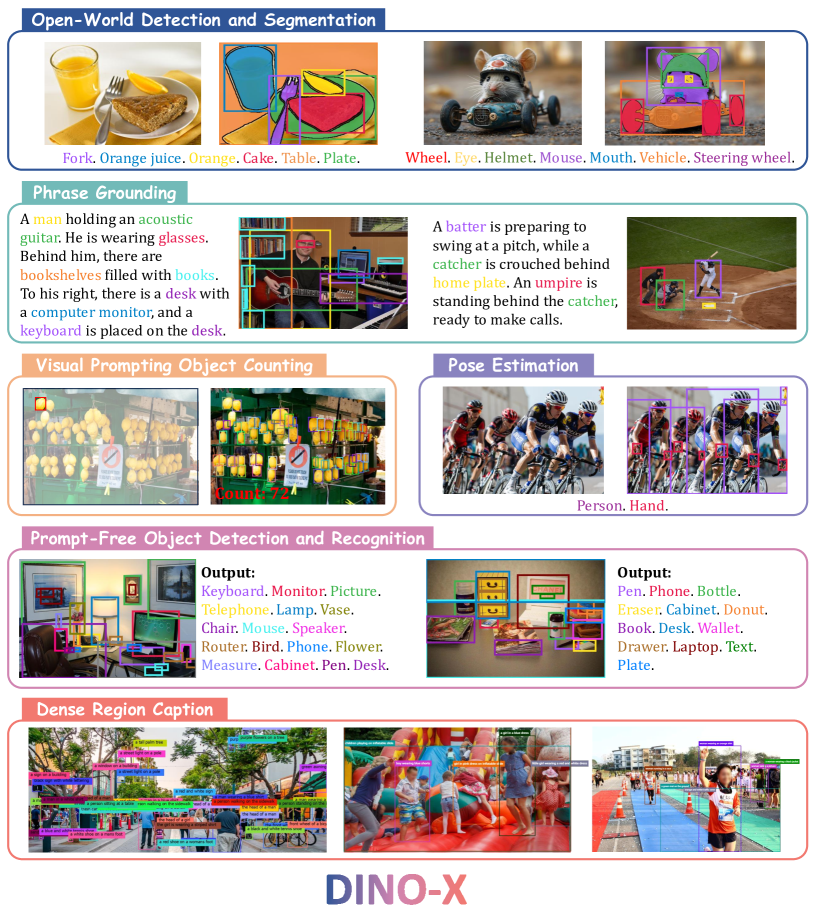

<figcaption>図1: DINO-X は様々な open-world perception とオブジェクトレベル理解タスクをサポートする統一 object-centric 視覚モデル。Open-World 物体検出とセグメンテーション、Phrase Grounding、Visual Prompt Counting、姿勢推定、Prompt-Free 物体検出と認識、Dense Region Caption などを含む。</figcaption>
</figure>

## 1 Introduction（はじめに）

近年、物体検出は **closed-set 検出モデル** [74, 28, 4] から、**ユーザー提供のプロンプトに対応する物体を識別できる open-set 検出モデル** [33, 29, 76] へと徐々に進化してきた。そのようなモデルは多数の実用応用を持つ:

- ロボットの **動的環境への適応性の強化**
- 自律走行車が **新しい物体を迅速に位置特定・反応** することを支援
- **マルチモーダル大規模言語モデル（MLLM）** の知覚能力を改善し、hallucination を減らし、その応答の信頼性を高める

本論文で我々は **DINO-X** を導入する。これは IDEA Research が開発した、**現時点で最高の open-world 物体検出性能を持つ統一 object-centric 視覚モデル** である。

**[[entities/grounding-dino-1-5|Grounding DINO 1.5]]** [47] を基盤として、DINO-X は **同じ Transformer encoder-decoder アーキテクチャ** を採用し、**open-set 検出をコア訓練タスク** とする。

長尾物体検出を容易にするため、DINO-X はモデルの入力段階で **より包括的なプロンプト設計** を組み込む。**伝統的な text prompt のみのモデル** [33, 47, 29] は大きな進歩を遂げたが、**十分に多様な訓練データを収集することが困難** なため、依然として長尾検出シナリオの十分な範囲をカバーするのに苦戦する。この欠点を克服するため、DINO-X ではモデルアーキテクチャを以下の **3 種類のプロンプトをサポート** するように拡張する:

1. **Text Prompt**: ユーザー提供のテキスト入力に基づいて望ましい物体を識別する。これは検出シナリオの大部分をカバーできる
2. **Visual Prompt**: text prompt を超えて、DINO-X は **[T-Rex2](https://example.com)** [18] のように visual prompt もサポートし、テキストだけでは十分に記述できない検出シナリオをさらにカバーする
3. **Customized Prompt**: より多くの長尾検出問題を可能にするため、DINO-X では customized prompt を特に導入する。これは **事前定義済みまたはユーザーが調整した prompt embedding** として実装可能で、カスタマイズされたニーズに対応する。**prompt-tuning** を通じて、異なるドメイン向けの domain-customized prompt や、様々な機能ニーズに対応する function-specific prompt を作成できる。例えば、DINO-X では **universal object prompt** を開発して **prompt-free open-world 物体検出** をサポート、ユーザーが任意のプロンプトを提供することなく、与えられた画像内の任意の物体を検出することを可能にする

強い grounding 性能を達成するため、我々は **多様なソースから 1 億超の高品質 grounding サンプル**（**Grounding-100M** と呼ぶ）を収集・キュレートした。このような大規模 grounding データセットでの事前学習は **基盤的なオブジェクトレベル表現** をもたらし、DINO-X が複数の perception head を統合して **複数のオブジェクト perception および理解タスクを同時にサポート** することを可能にする。

物体検出のための **Box Head** を超えて、DINO-X は 3 つの追加 head を実装する:
1. **Mask Head**: 検出された物体のセグメンテーションマスクを予測
2. **Keypoint Head**: 特定のカテゴリに対してより意味的に有意な keypoint を予測
3. **Language Head**: 検出された各物体に対する細粒度な記述的キャプションを生成

これらの head を統合することで、DINO-X は入力画像のより詳細なオブジェクトレベル理解を提供できる。図 1 では、DINO-X がサポートする様々なオブジェクトレベル視覚タスクを示す。

Grounding DINO 1.5 と同様に、DINO-X も 2 つのモデルを含む:
- **DINO-X Pro モデル**: 様々なシナリオで強化された perception 能力を提供
- **DINO-X Edge モデル**: より速い推論速度に最適化、エッジデバイスへのデプロイメントに適する

実験結果は DINO-X の優れた性能を実証する。図 2 に示されるように:
- **DINO-X Pro モデル** は COCO、LVIS-minival、LVIS-val ゼロショット転送ベンチマークで **56.0 AP、59.8 AP、52.4 AP** をそれぞれ達成
- 特筆すべきは、LVIS-minival と LVIS-val の **rare クラス** で **63.3 AP と 56.5 AP** を得て、**Grounding DINO 1.6 Pro より +5.8 AP と +5.0 AP**、**Grounding DINO 1.5 Pro より +7.2 AP と +11.9 AP** の改善を示す
- これは **長尾物体認識能力の大幅な改善** を強調する

## 2 Approach（手法）

<figure>

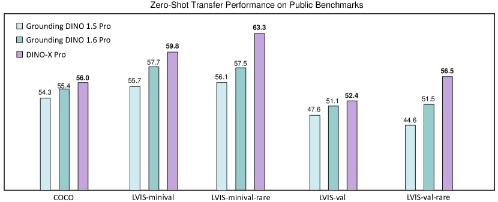

<figcaption>図2: 公開検出ベンチマークでの DINO-X Pro ゼロショット性能。Grounding DINO 1.5 Pro と Grounding DINO 1.6 Pro と比較して、DINO-X Pro は COCO、LVIS-minival、LVIS-val ゼロショットベンチマークで新しい SOTA 性能を達成する。さらに、LVIS-minival と LVIS-val の rare クラスで他のモデルをより大きな差で上回り、長尾物体認識の例外的能力を示す。</figcaption>
</figure>

<figure>

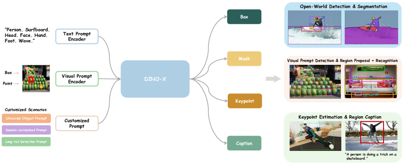

<figcaption>図3: DINO-X は text prompt、visual prompt、customized prompt を受け入れるよう設計され、バウンディングボックスのような粗いレベル表現から、マスク、keypoint、物体キャプションのような細粒度詳細まで、出力を同時に生成できる。</figcaption>
</figure>

### 2.1 Model Architecture（モデルアーキテクチャ）

DINO-X の全体フレームワークは図 3 に示されている。Grounding DINO 1.5 に従って、我々も DINO-X モデルの 2 つのバリアントを開発する: より強力で包括的な **"Pro" 版（DINO-X Pro）** と、より速い **"Edge" 版（DINO-X Edge）**。

#### 2.1.1 DINO-X Pro

DINO-X Pro モデルのコアアーキテクチャは Grounding DINO 1.5 [47] と類似している。我々は **事前学習された ViT** [12] モデルを主要な vision backbone として活用し、特徴抽出段階で **deep early fusion 戦略** を採用する。

Grounding DINO 1.5 と異なり、**長尾物体検出のモデル能力をさらに拡張する** ため、入力段階で DINO-X Pro のプロンプトサポートを広げた:
- **Text prompt**: 日常生活で一般的に遭遇する物体検出シナリオの大部分をカバーできる
- **Visual prompt**: データの希少性と記述の制限のためテキストプロンプトでは不十分なシナリオでモデルの検出能力を強化 [18]
- **Customized prompt**: prompt-tuning [26] 技法で fine-tune 可能な特化プロンプトのシリーズとして定義され、**より長尾、ドメイン特化、または機能特化のシナリオで物体を検出するモデル能力を、他の能力を損なうことなく拡張**

大規模 grounding 事前学習を実行することで、我々は DINO-X の encoder 出力から **基盤的なオブジェクトレベル表現** を取得する。このような頑健な表現は、異なる perception head を導入することで複数のオブジェクト perception または理解タスクをシームレスにサポートすることを可能にする。結果として、DINO-X は **異なる意味レベルにわたる出力** を生成できる。**粗いレベル（バウンディングボックス）から、より細粒度なレベル（マスク、keypoint、物体キャプション）** まで。

以下のパラグラフで、DINO-X でサポートされるプロンプトを最初に紹介する。

##### Text Prompt Encoder（テキストプロンプトエンコーダ）

[[entities/grounding-dino|Grounding DINO]] [33] と Grounding DINO 1.5 [47] は両方とも **BERT** [9] をテキストエンコーダとして採用していた。しかし、**BERT モデルはテキストデータのみで訓練されており、open-world 検出のような multimodal 整列を必要とする perception タスクへの有効性が制限される**。したがって、DINO-X Pro では、**広範な multimodal データで事前学習された CLIP** [65] **モデルをテキストエンコーダとして活用** し、様々な open-world ベンチマークでモデルの訓練効率と性能をさらに強化する。

##### Visual Prompt Encoder（ビジュアルプロンプトエンコーダ）

我々は **T-Rex2** [18] からの visual prompt encoder を採用し、box と point フォーマットの両方でユーザー定義 visual prompt を活用して物体検出を強化するために統合する。これらのプロンプトは sine-cosine 層を使用して位置埋め込みに変換され、統一された特徴空間に射影される。

モデルは異なる線形射影を使用して box と point プロンプトを分離する。次に、T-Rex2 と同じ **multi-scale deformable cross-attention 層** を使用してマルチスケール特徴マップから visual prompt 特徴を抽出する（ユーザー提供の visual prompt に条件付け）。

##### Customized Prompt（カスタマイズプロンプト）

実用的使用ケースでは、カスタマイズされたシナリオのためにモデルを fine-tune する必要に遭遇するのが一般的である。DINO-X Pro では、**customized prompt** と呼ぶ特化プロンプトのシリーズを定義する。これは **prompt-tuning** [26] 技法で fine-tune 可能で、**他の能力を損なうことなく、より長尾、ドメイン特化、機能特化のシナリオをリソース効率的でコスト効果的にカバー** できる。

例えば、我々は **universal object prompt** を開発して **prompt-free open-world 検出** をサポートし、画像内の任意の物体を検出することを可能にした。これにより、画面解析 [35] などの分野での潜在的応用が拡張される。

入力画像とユーザー提供のプロンプト（テキスト、視覚、または customized prompt embedding）が与えられると、**DINO-X はプロンプトと入力画像から抽出された視覚特徴の間で deep feature fusion を実行** し、次に異なる perception タスクのために異なる head を適用する。より具体的には、実装された head は以下のパラグラフで紹介される。

##### Box Head（ボックスヘッド）

Grounding DINO [33] に従って、我々は **language-guided query selection モジュール** を採用して、入力プロンプトに最も関連する特徴を decoder object queries として選択する。各クエリは Transformer decoder に供給され、層ごとに更新される。続いて単純な MLP 層が各 object query に対応するバウンディングボックス座標を予測する。

Grounding DINO と同様に、我々は **L1 損失と G-IoU** [49] **損失** をバウンディングボックス回帰に採用し、**contrastive 損失** を使用して各 object query を分類用の入力プロンプトと整列させる。

##### Mask Head（マスクヘッド）

**Mask2Former** [4] と **Mask DINO** [28] のコア設計に従って、我々は **1/4 解像度の backbone 特徴と Transformer encoder からのアップサンプリングされた 1/8 解像度特徴を融合** することで pixel embedding map を構築する。次に、Transformer decoder からの各 object query と pixel embedding map の **内積を取る** ことで、クエリのマスク出力を得る。

訓練効率を改善するため、backbone からの 1/4 解像度特徴マップはマスク予測でのみ使用された。我々はまた [24, 4] に従い、最終マスク損失計算では **サンプリングされた点に対してのみマスク損失を計算** する。

##### Keypoint Head（キーポイントヘッド）

Keypoint head は DINO-X からの **keypoint 関連の検出出力**（例: person や hand）を入力として取り、別の decoder を使用してオブジェクト keypoint をデコードする。各検出出力はクエリとして扱われ、いくつかの keypoint に拡張される。これらは複数の **deformable Transformer decoder 層** に送られ、望ましい keypoint 位置とその可視性を予測する。

このプロセスは **簡略化された ED-Pose** [68] アルゴリズムと見なすことができる。物体検出タスクを考慮する必要はなく、keypoint 検出にのみ焦点を当てる。DINO-X では、**person 用と hand 用の 2 つの keypoint head** を実装し、それぞれ **17 と 21 の事前定義 keypoint** を持つ。

##### Language Head（言語ヘッド）

Language head は **task-promptable 生成的小型言語モデル** で、DINO-X の領域コンテキストを理解し、**位置特定を超えた perception タスク**（物体認識、領域キャプション、テキスト認識、region-based VQA など）を実行する能力を強化する。我々のモデルのアーキテクチャは図 4 に示されている。

DINO-X からの任意の検出物体に対して、最初に **RoIAlign** [15] 演算子を使用して DINO-X backbone 特徴から領域特徴を抽出し、そのクエリ埋め込みと組み合わせて **object tokens** を形成する。次に、**単純な線形射影** を適用して次元をテキスト埋め込みと整列させる。**軽量な language decoder** は、これらの領域表現と **task tokens** を統合して、**自己回帰的に出力を生成** する。**学習可能な task tokens** は、language decoder が様々なタスクに対応する能力を与える。

<figure>

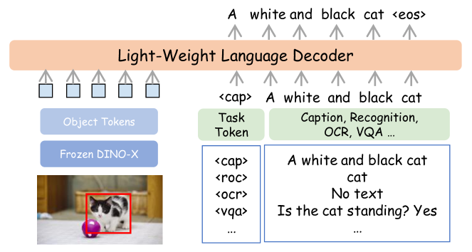

<figcaption>図4: DINO-X の language head の詳細設計。凍結された DINO-X を使用して object tokens を抽出し、線形射影でその次元をテキスト埋め込みと整列させる。軽量な language decoder はこれらの object tokens と task tokens を統合して、自己回帰的に応答出力を生成する。task tokens は language decoder に異なるタスクに対応する能力を装備する。</figcaption>
</figure>

#### 2.1.2 DINO-X Edge

**Grounding DINO 1.5 Edge** [47] に従って、DINO-X Edge も **EfficientViT** [1] を効率的な特徴抽出のための backbone として活用し、類似の Transformer encoder-decoder アーキテクチャを組み込む。DINO-X Edge モデルの性能と計算効率をさらに強化するため、我々は以下のいくつかの側面でモデルアーキテクチャと訓練技法を改善する:

##### Stronger Text Prompt Encoder（より強力なテキストプロンプトエンコーダ）

**より効果的な領域レベル multi-modal 整列を達成する** ため、DINO-X Edge は **Pro モデルと同じ CLIP テキストエンコーダ** を採用する。実際には、テキストプロンプト埋め込みはほとんどの場合事前計算可能で、visual encoder と decoder の推論速度に影響しない。**より強力なテキストプロンプトエンコーダの使用は一般的により良い結果につながる**。

##### Knowledge Distillation（知識蒸留）

DINO-X Edge では、**Pro モデルからの知識を蒸留して Edge モデルの性能を強化** する。具体的には、**feature ベース蒸留と response ベース蒸留の両方** を活用し、Edge モデルと Pro モデルの間で特徴と予測ロジットをそれぞれ整列させる。この知識転送により、DINO-X Edge は **Grounding DINO 1.6 Edge と比較してより強いゼロショット能力** を達成できる。

##### Improved FP16 Inference（改善された FP16 推論）

我々は **浮動小数点乗算の正規化技法** を採用し、**精度を損なうことなく FP16 へのモデル量子化** を可能にする。これにより **20.1 FPS の推論速度** を達成。これは Grounding DINO 1.6 Edge の 15.1 FPS と比較して **33% の増加**、Grounding DINO 1.5 Edge の 10.7 FPS と比較して **87% の改善** である。

## 3 Dataset Construction and Model Training（データセット構築とモデル訓練）

##### Data Collection（データ収集）

**コア open-vocabulary 物体検出能力を保証** するため、我々は **web から収集された 1 億超の画像** からなる高品質で意味豊富な grounding データセット（**Grounding-100M** と命名）を開発した。

- **T-Rex2 からの訓練データ** に **追加の産業シナリオデータ** を加えて visual prompt ベース grounding 事前学習に使用
- **オープンソースセグメンテーションモデル**（**SAM** [23] と **SAM2** [46]）を使用して Grounding-100M データセットの一部に **疑似マスク注釈** を生成、これが **マスクヘッドの主要訓練データ** として機能
- Grounding-100M データセットから **高品質データのサブセット** をサンプリングし、その box 注釈を **prompt-free 検出訓練データ** として活用
- 物体認識、領域キャプション、OCR、region-level QA シナリオをカバーする **1000 万超の region understanding データ** を **language head 訓練** のために収集

##### Model Training（モデル訓練）

複数の視覚タスクの訓練の課題を克服するため、我々は **2 段階戦略** を採用する:

**第 1 段階**: text-prompt ベース検出、visual-prompt ベース検出、物体セグメンテーションのための **共同訓練** を実施。
- この訓練フェーズでは、**COCO** [32]、**LVIS** [14]、**V3Det** [57] データセットの画像や注釈を一切組み込まない（これによりこれらのベンチマークでモデルのゼロショット検出性能を評価できる）
- このような大規模 grounding 事前学習は、DINO-X の優れた open-vocabulary grounding 性能を保証し、**基盤的なオブジェクトレベル表現** をもたらす

**第 2 段階**: DINO-X backbone を凍結し、**2 つの keypoint head（person と hand）と 1 つの language head を追加**、各々を別々に訓練。
- より多くの head を追加することで、DINO-X が姿勢推定、領域キャプション、オブジェクトベース QA などのより細粒度な perception および理解タスクを実行する能力を大幅に拡張
- 続いて、**prompt-tuning 技法を活用して universal object prompt を訓練**、他の能力を保持したまま prompt-free any-object 検出を可能に

このような 2 段階訓練アプローチには以下の利点がある:
1. **モデルのコア grounding 能力が新しい能力の導入によって影響を受けない** ことを保証
2. 大規模 grounding 事前学習が、**他の open-world 理解タスクへのシームレスな転送を可能にする object-centric モデルの頑健な基盤として機能できる** ことを検証

## 4 Evaluation（評価）

本節では、DINO-X シリーズモデルの様々な能力を関連研究と比較する。最良と次良の結果はそれぞれ **太字** と **下線** で示される。

### 4.1 DINO-X Pro

#### 4.1.1 Open-World Detection and Segmentation（Open-World 検出とセグメンテーション）

##### Evaluation on Zero-Shot Object Detection and Segmentation Benchmarks

Grounding DINO 1.5 Pro [47] に従って、我々は DINO-X Pro のゼロショット物体検出とセグメンテーション能力を **COCO** [32] ベンチマーク（80 一般カテゴリ）と **LVIS** ベンチマーク（より豊富で広範な長尾分布カテゴリ）で評価する。

表 1 に示されるように、DINO-X Pro は先行 state-of-the-art 手法と比較して大きな性能改善を示す:
- **COCO ベンチマーク**: Grounding DINO 1.5 Pro と Grounding DINO 1.6 Pro に対してそれぞれ **+1.7 box AP と +0.6 box AP** の増加
- **LVIS-minival と LVIS-val**: それぞれ **59.8 box AP と 52.4 box AP** を達成、先行最良の Grounding DINO 1.6 Pro モデルをそれぞれ **+2.0 AP と +1.1 AP** 上回る
- **LVIS rare クラスの検出性能**: LVIS-minival で **63.3 AP**、LVIS-val で **56.5 AP**、先行 SOTA Grounding DINO 1.6 Pro モデルをそれぞれ **+5.8 AP と +5.0 AP** 大幅に上回り、長尾物体検出シナリオでの DINO-X の例外的能力を実証
- **セグメンテーション指標**: COCO と LVIS ゼロショット instance segmentation ベンチマークで、最も一般的に使用される汎用セグメンテーションモデル **Grounded SAM** [48] シリーズと DINO-X を比較。DINO-X はそれぞれ **37.9、43.8、38.5 mask AP** を達成。Grounded SAM と比較すると、DINO-X にはまだ追いつくべき性能ギャップがあるが、**複数タスクのための統一モデル訓練の課題** を示している。それでも、DINO-X は **複数の複雑な推論ステップなしで各領域の対応マスクを生成** することで、セグメンテーション効率を大幅に改善する

**表1: DINO-X Pro の COCO、LVIS-minival、LVIS-val ベンチマークでの先行手法との性能比較。** 灰色の数字は訓練データセットが COCO または LVIS データセットの画像や注釈を含むことを示す。

| Method | Backbone | COCO Box AP | COCO Mask AP | LVIS-mv AP_all | AP_r | AP_c | AP_f | LVIS-mv Mask AP_all | LVIS-val AP_all | AP_r | AP_c | AP_f | LVIS-val Mask AP_all |
|---|---|---|---|---|---|---|---|---|---|---|---|---|---|
| Grounding DINO Swin-L | Swin-L | 52.5 | - | - | - | - | - | - | - | - | - | - | - |
| OWL-ST | CLIP L/14 | - | - | 40.9 | 41.5 | - | - | - | 35.2 | 36.2 | - | - | - |
| YOLO-World | YOLOv8-L | 45.1 | - | 35.4 | 27.6 | 34.1 | 38.0 | - | - | - | - | - | - |
| T-Rex2 (text) | Swin-L | 52.2 | - | 54.9 | 49.2 | 54.8 | 56.1 | - | 45.8 | 42.7 | 43.2 | 50.2 | - |
| DetCLIPv3 | Swin-L | - | - | 48.8 | 49.9 | 49.7 | 47.8 | - | 41.4 | 41.4 | 40.5 | 42.3 | - |
| Grounded SAM (1.5 Pro + Huge) | - | - | 44.3 | - | - | - | - | 47.7 | - | - | - | - | 41.8 |
| Grounded SAM 2 (1.5 Pro + Large) | - | - | 44.7 | - | - | - | - | 46.2 | - | - | - | - | 40.5 |
| **Grounding DINO 1.5 Pro** | ViT-L | 54.3 | - | 55.7 | 56.1 | 57.5 | 54.1 | - | 47.6 | 44.6 | 47.9 | 48.7 | - |
| **Grounding DINO 1.6 Pro** | ViT-L | 55.4 | - | 57.7 | 57.5 | 60.5 | 55.3 | - | 51.1 | 51.5 | 52.0 | 50.1 | - |
| **DINO-X Pro** | **ViT-L** | **56.0** | **37.9** | **59.8** | **63.3** | **61.7** | **57.5** | **43.8** | **52.4** | **56.5** | **51.1** | **51.9** | **38.5** |

##### Evaluation on Visual-Prompt Based Detection Benchmarks

DINO-X の visual prompt 物体検出能力を評価するため、我々は **few-shot 物体カウントベンチマーク** で実験を行う。このタスクでは、各テスト画像にターゲット物体を表す **3 つの visual exemplar box** が伴い、モデルはターゲット物体の数を出力することが要求される。

**FSC147** [45] と **FSCD-LVIS** [40] データセットで性能を評価。両者とも **小さな物体が密に存在するシーン** を特徴とする。具体的には:
- **FSC147**: 主に single-target シーン（1 画像あたり 1 種類の物体のみが存在）
- **FSCD-LVIS**: multi-target シーン（複数の物体カテゴリを含む）

FSC147 では Mean Absolute Error (MAE) 指標を、FSCD-LVIS では Average Precision (AP) 指標を報告する。先行研究 [17, 18] に従って、visual exemplar box は **対話的 visual prompt** として活用される。表 2 に示されるように、**DINO-X は SOTA 性能を達成**、実用的 visual prompt 物体検出での強い能力を示す。

**表2: DINO-X Pro の few-shot 物体カウントベンチマーク性能。**

| Type | Method | FSC147-test MAE | RMSE | FSCD-LVIS-test AP |
|---|---|---|---|---|
| Density Map Regression | FamNet | 22.1 | 99.5 | - |
| Density Map Regression | BMNet+ | 14.6 | 91.8 | - |
| Density Map Regression | Counting-DETR | 12.0 | 49.8 | 22.7 |
| Detection | T-Rex | 8.72 | - | 40.3 |
| Detection | T-Rex2 | 10.9 | 36.7 | 43.4 |
| **Detection** | **DINO-X Pro** | **5.6** | **27.4** | **44.8** |

#### 4.1.2 Keypoint Detection（キーポイント検出）

##### Evaluation on Human 2D Keypoint Benchmarks

我々は **COCO**、**CrowdPose** [52]、**Human-Art** [20] ベンチマークで DINO-X と他の関連研究との比較を提示する（表 3）。**OKS ベースの Average Precision (AP)** [52] を主要指標として採用。

pose head は MSCOCO、CrowdPose、Human-Art で共同訓練されたため、評価はゼロショット設定ではない。しかし、DINO-X の backbone を凍結し pose head のみを訓練したため、**物体検出とセグメンテーションでの評価は依然としてゼロショット設定** に従う。

複数の pose データセットでの訓練により、我々のモデルは様々な人物スタイル（日常シナリオ、混雑環境、遮蔽、芸術的表現）にわたって keypoint を効果的に予測できる:
- **COCO**: ED-Pose より -1.6 AP（主に pose head の学習可能パラメータ数の制限のため）
- **CrowdPose**: 既存モデルを **+3.4 AP** 上回る
- **Human-Art**: 既存モデルを **+1.8 AP** 上回る

これは **より多様なシナリオでの顕著な汎化能力** を示す。

**表3: COCO-val、CrowdPose-test、Human-Art-val ベンチマークでの SOTA 手法との比較。** † は flipping test を示す。OKS ベースの AP を評価指標として使用。TD、BU、OS、PT はそれぞれ top-down、bottom-up、one-stage、pre-trained を意味する。

| Method | Type | COCO AP | CrowdPose AP | Human-Art AP |
|---|---|---|---|---|
| HRNet † | TD | 74.4 | 71.3 | 39.9 |
| ED-Pose | OS | **75.8** | 76.6 | 72.3 |
| **DINO-X Pro** | PT | 74.4 | **80.0** | **74.1** |

##### Evaluation on Human Hand 2D Keypoint Benchmarks

人体姿勢の評価に加えて、**HInt** ベンチマーク [42] で **PCK@0.05**（Percentage of Correctly Localized Keypoints）で hand pose 結果も提示する。

訓練中、HInt、COCO、OneHand10K [59] 訓練データセット（比較手法 HaMeR [42] のサブセット）を組み合わせ、HInt テストセットで性能を評価。表 4 に示されるように、**DINO-X は PCK@0.05 指標で最良性能を達成**、高精度な hand pose 推定での強い能力を示す。

**表4: HInt データセットでの SOTA 手法との比較。** PCK@0.05 を主要指標として使用。

| Method | All joints (New Days / VISOR / Ego4D) | Visible joints | Occluded joints |
|---|---|---|---|
| HaMeR | 51.6 / 56.5 / 46.9 | 62.9 / 66.5 / 59.1 | 33.2 / 42.6 / 33.1 |
| **DINO-X Pro** | **54.3 / 63.0 / 66.0** | **69.3 / 78.0 / 81.1** | **34.4 / 48.0 / 49.1** |

#### 4.1.3 Object-Level Vision-Language Understanding（オブジェクトレベル視覚-言語理解）

##### Evaluation on Object Recognition

我々は language head の有効性を **物体認識ベンチマーク** で関連研究と比較する。これは画像の指定領域における物体カテゴリを認識する必要がある。

**Osprey** [73] に従って、**Semantic Similarity (SS) と Semantic IoU (S-IOU)** [8] を使用して、object-level **LVIS-val** [14] と part-level **PACO-val** [44] データセットで language head の物体認識能力を評価する。

表 5 に示されるように:
- 我々のモデルは LVIS-val データセットで SS **71.25%** と S-IoU **41.15%** を達成、Osprey を SS で **+6.01%**、S-IoU で **+2.06%** 上回る
- PACO データセットでは Osprey に劣る（PACO は language head 訓練に含まれず、訓練データと PACO の不一致が原因の可能性）
- 我々のモデルは Osprey と比較して **わずか 1% の学習可能パラメータ** しか持たない

**表5: 指示物体分類ベンチマーク結果。** Semantic Similarity (SS) と Semantic-IoU (S-IoU) スコアを使用して領域分類品質を測定。

| Method | Visual Encoder | Language Decoder | LVIS SS | LVIS S-IoU | PACO SS | PACO S-IoU |
|---|---|---|---|---|---|---|
| Kosmos-2 | ViT-L | LM-1.3B | 38.95 | 8.67 | 32.09 | 4.79 |
| Shikra | ViT-L | Vicuna-7B | 49.65 | 19.82 | 43.64 | 11.42 |
| GPT4RoI | ViT-L | Vicuna-7B | 51.32 | 11.99 | 48.04 | 12.08 |
| Ferret | ViT-L | Vicuna-7B | 63.78 | 36.57 | 58.68 | 25.96 |
| Osprey | ConvNeXt-L | Vicuna-7B | 65.24 | 38.19 | **73.06** | **52.72** |
| **DINO-X Pro** | ViT-L | **OPT-125M** | **71.25** | **41.15** | 66.67 | 39.39 |

##### Evaluation on Region Captioning

我々は **Visual Genome** [25] と **RefCOCOg** [37] でモデルの領域キャプション品質を評価する。表 6 に評価結果を提示。

特筆すべきは、**凍結された DINO-X backbone で抽出されたオブジェクトレベル特徴に基づき、Visual Genome 訓練データを一切利用せずに、Visual Genome ベンチマークでゼロショット方式で 142.1 CIDEr スコア** を達成。

さらに、Visual Genome データセットで fine-tuning した後、**わずか軽量な language head で 201.8 CIDEr スコアという新しい SOTA** を樹立。

**表6: 領域キャプションベンチマーク結果。** METEOR と CIDEr スコアを使用して領域キャプション品質を測定。

| Method | Visual Encoder | Language Decoder | Visual Genome CIDEr | METEOR | RefCOCOg CIDEr | METEOR |
|---|---|---|---|---|---|---|
| GRIT | ViT-B | Small-43M | 142.0 | 17.2 | 71.6 | 15.2 |
| AlphaCLIP | ViT-L | Vicuna-7B | 160.3 | 18.9 | 109.2 | 16.7 |
| **DINO-X Pro (zero-shot)** | ViT-L | OPT-125M | 143.2 | 17.5 | 55.7 | 12.2 |
| **DINO-X Pro (fine-tuned)** | ViT-L | OPT-125M | **201.8** | **20.1** | 86.3 | 15.1 |

### 4.2 DINO-X Edge

**表7: DINO-X Edge の COCO、LVIS-minival、LVIS-val 物体検出ベンチマークでの関連研究との比較ゼロショット性能。**

| Method | Backbone | Test Size | COCO | LVIS-mv AP_all | AP_r | AP_c | AP_f | LVIS-val AP_all | AP_r | AP_c | AP_f | A100 FPS (PyT/TRT) | Orin NX (TRT FP32/FP16) |
|---|---|---|---|---|---|---|---|---|---|---|---|---|---|
| GLIP | Swin-T | 800×1333 | 46.3 | 26.0 | 20.8 | 21.4 | 31.0 | - | - | - | - | - | - / - |
| Grounding DINO | Swin-T | 800×1333 | 48.4 | 27.4 | 18.1 | 23.3 | 32.7 | - | - | - | - | 9.4 / 42.6 | 1.1 / - |
| YOLO-Worldv2-L | YOLOv8-L | 640 | - | 33.0 | 22.6 | 32.0 | 35.8 | 26.0 | 18.6 | 23.0 | 32.6 | 37.4 / - | - / - |
| OmDet-Turbo-T | Swin-T | 640 | 42.5 | 30.3 | - | - | - | - | - | - | - | 21.5 / 140.0 | - / - |
| Grounding DINO 1.5 Edge | EfficientViT-L1 | 640 | 42.9 | 33.5 | 28.0 | 34.3 | 33.9 | 27.3 | 26.3 | 25.7 | 29.6 | 21.7 / 111.6 | 10.7 / - |
| Grounding DINO 1.5 Edge | EfficientViT-L1 | 800×1333 | 45.0 | 36.2 | 33.2 | 36.6 | 36.3 | 29.3 | 28.1 | 27.6 | 31.6 | 18.5 / 75.2 | 5.5 / - |
| Grounding DINO 1.6 Edge | EfficientViT-L1 | 800×800 | 44.8 | 36.9 | 34.6 | 39.1 | 35.4 | 31.0 | 31.6 | 30.5 | 31.4 | 20.81 / 152.7 | 10.0 / 15.1 |
| Grounding DINO 1.6 Edge | EfficientViT-L1 | 1024×1024 | 46.5 | 40.1 | 36.8 | 42.0 | 39.0 | 33.3 | 32.6 | 32.8 | 34.3 | 19.4 / 108.1 | 7.6 / 10.5 |
| **DINO-X Edge** | **EfficientViT-L2** | **640** | **48.7** | **44.5** | **41.4** | **47.3** | **42.6** | **38.4** | **38.9** | **38.3** | **38.2** | **19.8 / 138.6** | **10.0 / 20.1** |
| **DINO-X Edge** | **EfficientViT-L2** | **800×1333** | **50.9** | **48.3** | **47.6** | **50.2** | **46.6** | **42.0** | **43.1** | **41.7** | **41.8** | **15.1 / 74.5** | **4.5 / 9.1** |

##### Evaluation on Zero-Shot Object Detection Benchmarks

DINO-X Edge のゼロショット物体検出能力を評価するため、我々は Grounding-100M で事前学習した後、COCO と LVIS ベンチマークでテストを実施する。表 7 に示されるように:

- **COCO ベンチマーク** で DINO-X Edge は既存のリアルタイム open-set 検出器を大差で上回る
- **LVIS-minival で 48.3 AP、LVIS-val で 42.0 AP** を達成、長尾検出シナリオでの優れたゼロショット検出能力を示す

我々は DINO-X Edge の推論速度を **NVIDIA Orin NX 上の FP32 と FP16 TensorRT モデル** の両方で評価し、FPS で性能を測定。PyTorch モデルと FP32 TensorRT モデルの A100 GPU での FPS 結果も含めた。†は YOLO-World の結果が最新の公式コードで再現されたことを示す。

**浮動小数点乗算の正規化技法** を活用することで、**性能を犠牲にすることなく FP16 にモデルを量子化** できる。入力サイズ **640×640** で、DINO-X Edge は **20.1 FPS の推論速度** を達成、Grounding DINO 1.6 Edge と比較して **33% 改善**（15.1 → 20.1 FPS）。

## 5 Case Analysis and Qualitative Visualization（ケース分析と定性的可視化）

本節では、様々な実世界シナリオにおける DINO-X モデルの異なる能力を可視化する。画像は主に COCO [32]、LVIS [14]、V3Det [57]、SA-1B [23]、その他の公開リソースから取得した。

### 5.1 Open-World Object Detection（Open-World 物体検出）

図 5 に示されるように、DINO-X は **与えられたテキストプロンプトに基づいて任意の物体を検出する能力** を実証する。一般カテゴリから長尾クラスや密な物体シナリオまで、幅広い物体を識別でき、その頑健な open-world 物体検出能力を示す。

<figure>

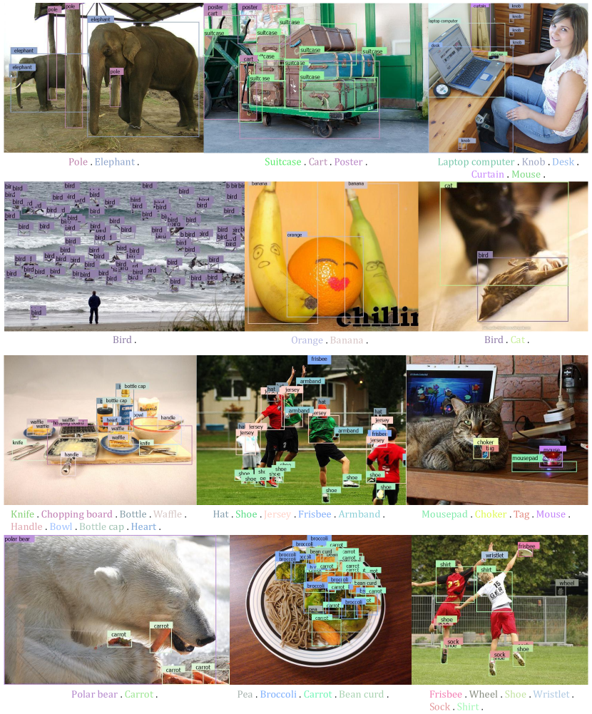

<figcaption>図5: DINO-X による Open-world 物体検出。</figcaption>
</figure>

### 5.2 Long Caption Phrase Grounding（長キャプション Phrase Grounding）

図 6 に示されるように、DINO-X は **長キャプション内の名詞句に基づいて画像内の対応する領域を位置特定する印象的な能力** を示す。詳細なキャプション内の各名詞句を画像内の特定オブジェクトにマッピングする能力は、深い画像理解への重要な進歩を示す。この機能は **MLLM がより正確で信頼性のある応答を生成する** のを可能にするなど、実用的価値が大きい。

<figure>

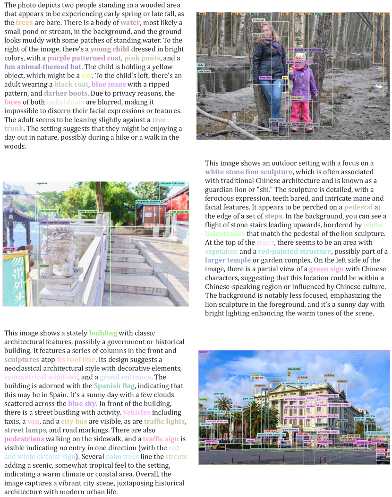

<figcaption>図6: DINO-X による長キャプション phrase grounding。</figcaption>
</figure>

### 5.3 Open-World Object Segmentation and Visual Prompt Counting（Open-World 物体セグメンテーションと Visual Prompt Counting）

図 7 に示されるように、Grounding DINO 1.5 [47] を超えて、DINO-X は **テキストプロンプトに基づく open-world 物体検出だけでなく、各物体に対応するセグメンテーションマスクも生成** し、より豊かな意味的出力を提供する。

さらに、DINO-X はユーザー定義の **visual prompt**（ターゲットオブジェクトにバウンディングボックスや点を描画）に基づく検出もサポートする。この能力は **物体カウントシナリオで例外的な使いやすさ** を実証する。

<figure>

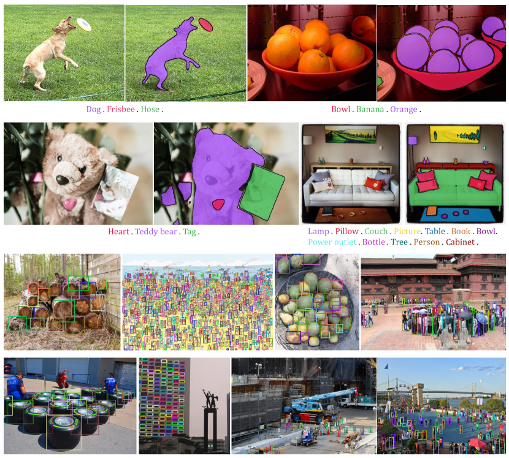

<figcaption>図7: DINO-X による Open-world 物体セグメンテーションと visual prompt 物体カウント。</figcaption>
</figure>

### 5.4 Prompt-Free Object Detection and Recognition（Prompt-Free 物体検出と認識）

DINO-X では、**ユーザーがプロンプトを提供することなく入力画像内の任意の物体を検出できる prompt-free 物体検出** という非常に実用的な機能を開発した。図 8 に示されるように、DINO-X の language head と組み合わせると、**この機能はユーザー入力を必要とせずに画像内のすべての物体のシームレスな検出と識別** を可能にする。

<figure>

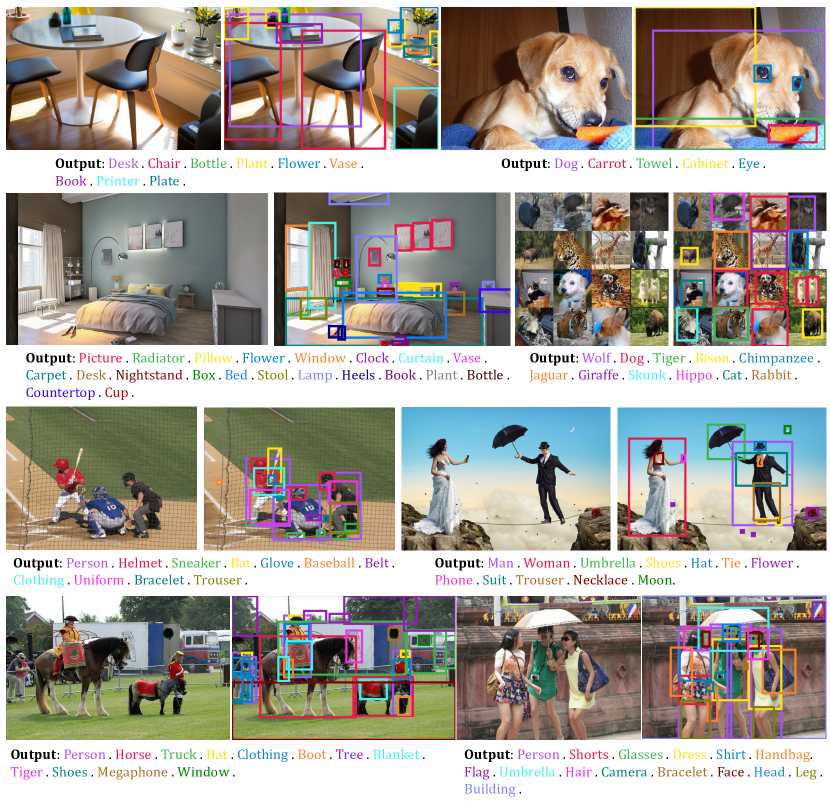

<figcaption>図8: DINO-X による Prompt-free 物体検出と認識。</figcaption>
</figure>

### 5.5 Dense Region Caption（密領域キャプション）

図 9 に示されるように、DINO-X は **任意の指定領域に対してより細粒度なキャプションを生成** できる。さらに、DINO-X の language head により、**region-based QA や他の領域理解タスク** も実行できる。現在、この機能はまだ開発段階にあり、次のバージョンでリリースされる予定。

<figure>

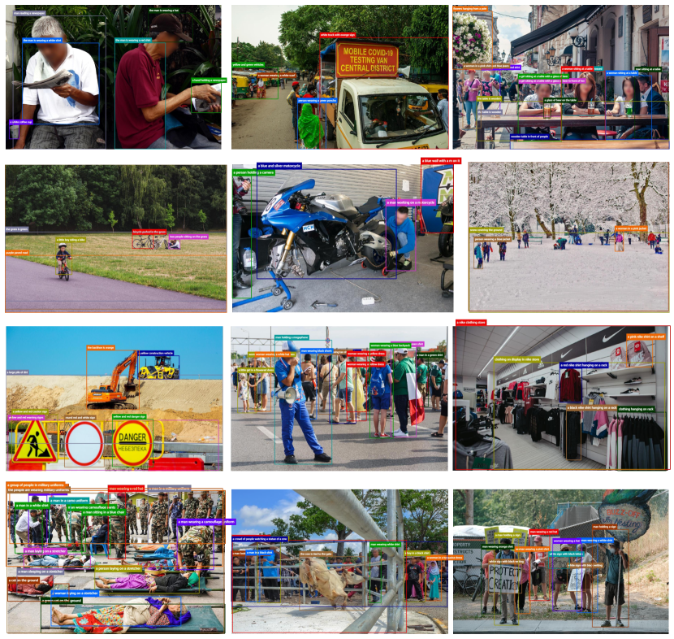

<figcaption>図9: DINO-X による Dense Region Caption。</figcaption>
</figure>

### 5.6 Human Body and Hand Pose Estimation（人体と手の姿勢推定）

図 10 に示されるように、DINO-X は **テキストプロンプトに基づいて keypoint head を通じて特定カテゴリの keypoint を予測** できる。COCO、CrowdHuman、Human-Art データセットの組み合わせで訓練され、DINO-X は様々なシナリオで人体と手の keypoint を予測できる。

<figure>

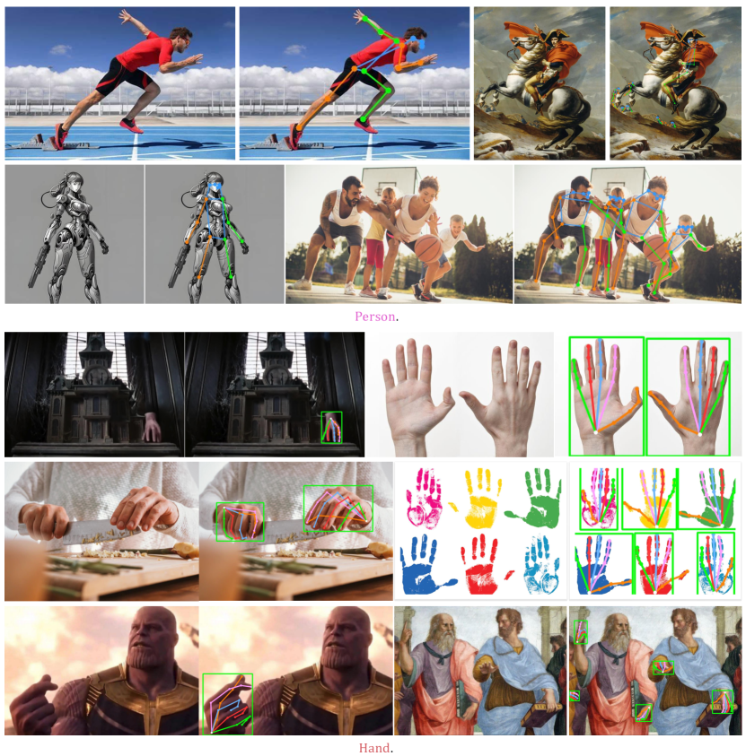

<figcaption>図10: DINO-X による人体と手の姿勢推定。</figcaption>
</figure>

### 5.7 Side-by-side comparison with Grounding DINO 1.5 Pro

我々は DINO-X と先行 SOTA モデル、**Grounding DINO 1.5 Pro と Grounding DINO 1.6 Pro** との並列比較を実施した。図 11 に示されるように、**Grounding DINO 1.5 の基盤の上に構築され、DINO-X は密な物体検出シナリオで顕著な性能を提供しながら、言語理解能力をさらに強化** する。

<figure>

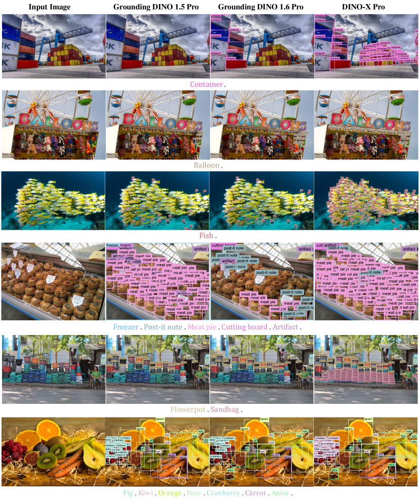

<figcaption>図11: Grounding DINO 1.5 Pro、Grounding DINO 1.6 Pro、DINO-X の比較。</figcaption>
</figure>

## 6 Conclusion（結論）

本論文は **DINO-X** を提示した。これは **open-set 物体検出と理解の分野を進化させる強力な object-centric 視覚モデル** である。

フラッグシップモデルである **DINO-X Pro** は、COCO と LVIS ゼロショットベンチマークで新記録を樹立し、**検出精度と信頼性の顕著な改善** を示す。長尾物体検出を容易にするため、DINO-X は **テキストプロンプトに基づく open-world 検出だけでなく、visual prompt と customized prompt** による物体検出も可能にする。

さらに、DINO-X は **検出からセグメンテーション、姿勢推定、オブジェクトレベル理解タスクなど、より広範な perception タスク** にその能力を拡張する。

エッジデバイスでのより多くのアプリケーションでリアルタイム物体検出を可能にするため、**DINO-X Edge モデル** も開発し、DINO-X シリーズモデルの実用的有用性をさらに拡張する。

## 7 Contributions and Acknowledgments（貢献と謝辞）

DINO-X プロジェクトに関わったすべての方に感謝の意を表したい。貢献は以下の通り（順不同）:

- **DINO-X Pro**: Yihao Chen, Tianhe Ren, Qing Jiang, Zhaoyang Zeng, Yuda Xiong
- **Mask Head**: Tianhe Ren, Hao Zhang, Feng Li, Zhaoyang Zeng
- **Visual Prompt & Prompt-Free Detection**: Qing Jiang
- **Pose Head**: Xiaoke Jiang, Xingyu Chen, Zhuheng Song, Yuhong Zhang
- **Language Head**: Wenlong Liu, Zhengyu Ma, Junyi Shen, Yuan Gao, Yuda Xiong
- **DINO-X Edge**: Hongjie Huang, Han Gao, Qing Jiang
- **Grounding-100M**: Yuda Xiong, Yihao Chen, Tianhe Ren, Qing Jiang, Zhaoyang Zeng, Shilong Liu
- **Language Head and DINO-X Edge Lead**: Kent Yu
- **Overall Project Lead**: Lei Zhang

DINO-X playground と API サポートに関わった方々にも感謝する: アプリケーションリード Wei Liu、プロダクトマネージャー Qin Liu と Xiaohui Wang、フロントエンド開発者 Yuanhao Zhu, Ce Feng, Jiongrong Fan、バックエンド開発者 Zhiqiang Li と Jiawei Shi、UX デザイナー Zijun Deng、運用インターン Weijian Zeng、テスター Jiangyan Wang、カスタマイズシナリオに関する提案とフィードバックを提供してくれた Peng Xiao。
