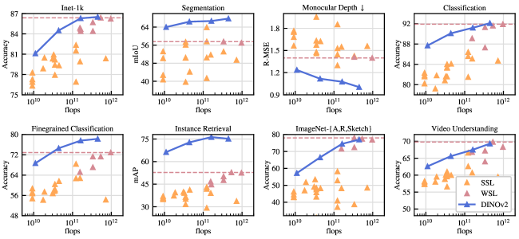
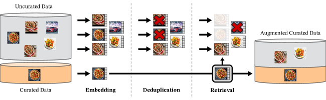
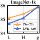
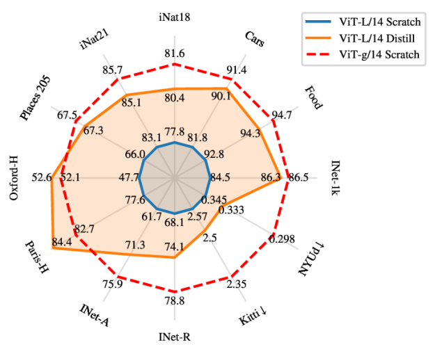
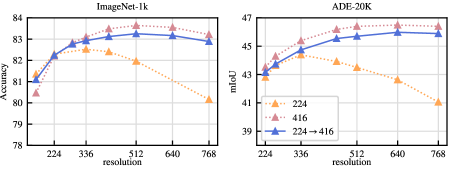
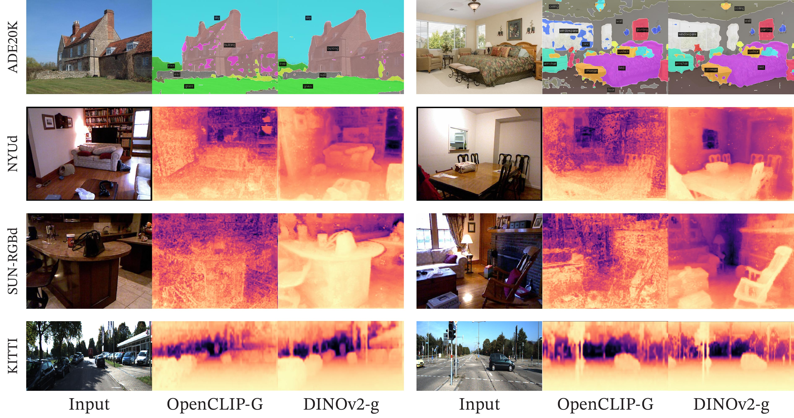
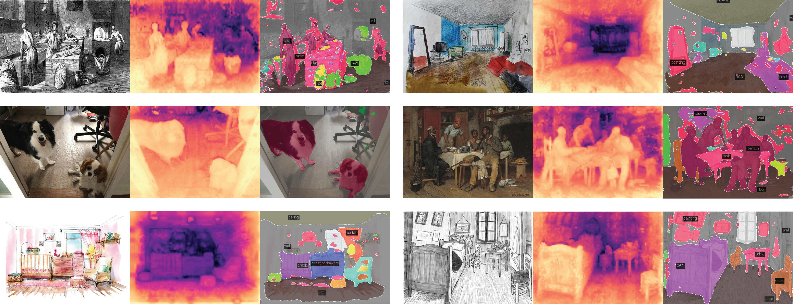
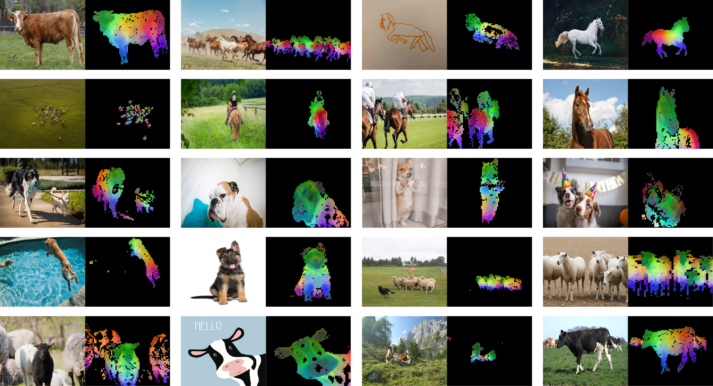
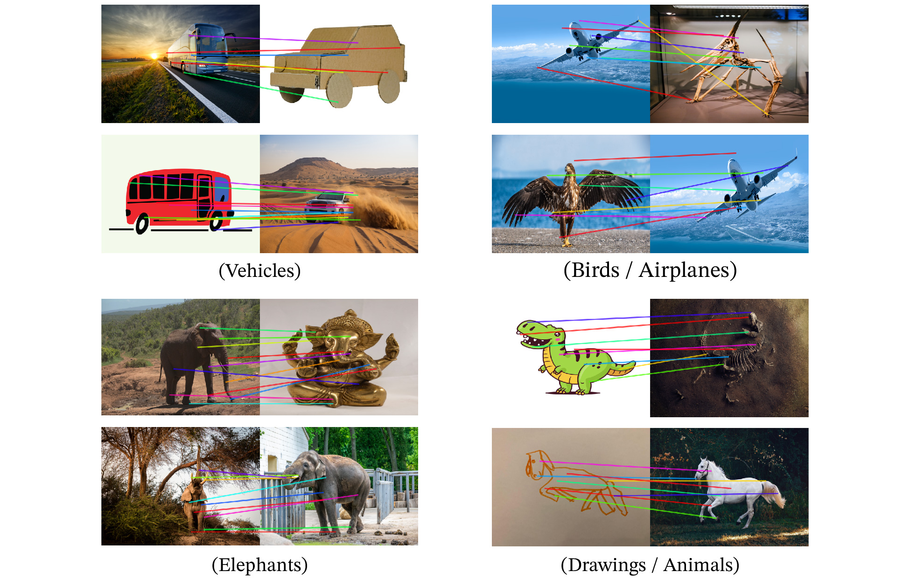

# DINOv2: 教師なしで頑健な視覚特徴量を学習する

> 原題: DINOv2: Learning Robust Visual Features without Supervision
> 著者: Maxime Oquab*, Timothée Darcet*, Théo Moutakanni*（**equal contribution**）, Huy V. Vo*, Marc Szafraniec*, Vasil Khalidov*, Pierre Fernandez, Daniel Haziza, Francisco Massa, Alaaeldin El-Nouby, Mahmoud Assran, Nicolas Ballas, Wojciech Galuba, Russell Howes, Po-Yao Huang, Shang-Wen Li, Ishan Misra, Michael Rabbat, Vasu Sharma, Gabriel Synnaeve, Hu Xu, Hervé Jegou, Julien Mairal¹, Patrick Labatut*, Armand Joulin*, Piotr Bojanowski*
> 所属: Meta AI Research, ¹ Inria
> 注: * は core team、** は equal contribution
> 出典: arXiv:2304.07193（原文: <https://ar5iv.labs.arxiv.org/html/2304.07193>）

---

## Abstract（要旨）

大量のデータでモデルを事前学習する自然言語処理の近年のブレイクスルーは、コンピュータビジョンにおける同様の基盤モデル（foundation model）への道を開いた。

これらのモデルは、ファインチューニングなしで画像分布やタスクをまたいで機能する汎用的な視覚特徴量を生み出すことにより、画像を任意のシステムで使用することを大いに単純化できる可能性がある。

本研究は、既存の事前学習手法、特に自己教師あり手法が、多様なソースからの十分にキュレーションされたデータで訓練されれば、そのような特徴量を生み出せることを示す。

われわれは既存のアプローチを再検討し、事前学習をデータとモデルサイズの観点でスケールさせるために異なる技法を組み合わせる。

技術的な貢献の大半は、スケール時の訓練を高速化・安定化することを目的としている。

データに関しては、自己教師あり文献で典型的に行われてきたような未キュレーションデータの代わりに、専用の、多様で、キュレーションされた画像データセットを構築するための自動パイプラインを提案する。

モデルに関しては、10 億パラメータの ViT モデル [38] を訓練し、これを一連の小型モデルに蒸留して、利用可能な最良の汎用特徴量である OpenCLIP [66] を画像レベルおよびピクセルレベルのほとんどのベンチマークで凌駕する。

---

## 1 Introduction（はじめに）

タスクに依存しない事前学習済み表現を学ぶことは、自然言語処理（NLP）の標準となった [92, 94, 28, 64, 115]。

これらの特徴量を「そのまま」、すなわちファインチューニングなしで使用し、タスク固有モデルが生み出すものよりも有意に良い下流タスク性能を達成できる [15]。

この成功は、言語モデリング [91] や単語ベクトル [35] のように教師信号を必要としない事前学習口実目的を用いた、大量の生テキストでの事前学習によって支えられてきた。

この NLP におけるパラダイムシフトに倣い、コンピュータビジョンにおいても同様の「基盤」モデルが現れることが期待される [13]。

これらのモデルは、画像レベル（たとえば画像分類）でもピクセルレベル（たとえばセグメンテーション）でも、任意のタスクで out-of-the-box（そのまま）で機能する視覚特徴量を生成すべきである。

これらの基盤モデルに向けた最も有望な努力は、テキスト誘導の事前学習、すなわち何らかのテキスト教師信号を用いて特徴量の訓練を導く形式に焦点を当てている [69, 79, 93]。

このようなテキスト誘導事前学習は、キャプションが画像の豊かな情報を近似するだけであり、複雑なピクセルレベルの情報はこの教師信号では表面化しない可能性があるため、画像に関して保持できる情報を制限する。

さらに、これらの画像エンコーダはアラインメントされたテキスト-画像コーパスを必要とするため、テキスト版の柔軟性、すなわち生データのみから学べる柔軟性を提供しない。

<figure>

<figcaption>図1: 第 1 主成分の可視化。同じ列（a, b, c, d）の画像のパッチ間で PCA を計算し、その第 1〜3 主成分を表示する。各成分は異なる色チャネルに対応する。姿勢・スタイル・物体までもが変化しているにもかかわらず、関連画像間で同じ部位がマッチしている。背景は第 1 主成分を閾値処理することで除去している。</figcaption>
</figure>

テキスト誘導事前学習の代替は自己教師あり学習 [16, 21, 58] であり、これは画像のみから特徴量を学習する。

これらのアプローチは言語モデリングのような口実タスクに概念的により近く、画像レベルとピクセルレベルの両方の情報を捉えることができる [19]。

加えて、自己教師ありモデルが出力する特徴量は様々な有用な特性を示すことが示されており、多様な応用を可能にしてきた [1, 116, 84, 55]。

しかしながら、汎用的な特徴量を学習する可能性を持つにもかかわらず、自己教師あり学習における大半の進展は、小さなキュレーション済みデータセットである ImageNet-1k [99] での事前学習の文脈でなされてきた。

これらのアプローチを ImageNet-1k を超えてスケールさせる努力もいくつか試みられている [17, 49, 50] が、それらは未キュレーションデータセットに焦点を当てており、典型的に特徴量の品質が有意に低下する。

これは、良い特徴量を生み出すために本質的な、データ品質と多様性に対する制御の欠如によって説明される。

本研究では、自己教師あり学習が大量のキュレーション済みデータで事前学習されれば、汎用的な視覚特徴量を学習する潜在能力を持つかどうかを探求する。

iBOT [136] のように、画像レベルとパッチレベルの両方で特徴量を学習する既存の識別的自己教師ありアプローチを再検討し、それらの設計選択のいくつかをより大きなデータセットの観点から再考する。

技術的貢献の大半は、モデルおよびデータサイズでスケールする際の識別的自己教師あり学習を安定化・高速化することを目的としている。

これらの改善により、われわれのアプローチは類似の識別的自己教師あり手法の約 2 倍速く、3 倍少ないメモリで動作し、より長い訓練とより大きなバッチサイズの活用を可能にする。

事前学習データに関しては、未キュレーション画像の広範な集合からデータセットをフィルタリング・再バランスする自動パイプラインを構築した。

このパイプラインは NLP [124] で用いられるパイプラインから着想を得ており、外部メタデータの代わりにデータ類似度を用い、手動の注釈付けを必要としない。

野生の画像を扱う際の主要な困難は、概念を再バランスし、いくつかの支配的なモードに過剰適合することを避けることである。

本研究では、素朴なクラスタリングアプローチがこの問題を解決するのに十分に機能することがわかった。

われわれのアプローチを検証するため、小さいが多様な 142M 枚の画像コーパスを収集した。

最後に、われわれのデータ上で異なる Vision Transformer（ViT）[37] アーキテクチャを用いて訓練された、DINOv2 と呼ぶ事前学習済み視覚モデル群を提供する。

すべてのモデルと、任意のデータで DINOv2 を再訓練するためのコードを公開する。

スケールに伴う様々なコンピュータビジョンベンチマークの画像レベルおよびピクセルレベルで DINOv2 の品質を検証し、図 2 に要約する。

自己教師あり事前学習だけで、公開されている最良の弱教師ありモデルと競合する転移可能な凍結特徴量を学習する良い候補であると結論づける。

---

## 2 Related Work（関連研究）

### Intra-image self-supervised training（画像内自己教師あり訓練）

自己教師あり手法の最初のファミリーは、画像から構築された口実タスク、すなわち画像の残りの部分から予測すべき信号を画像から抽出することに焦点を当てる。

このアイデアは [36] の研究で広まり、与えられたパッチの文脈を予測することで訓練する。

例えば、画像の再着色 [133]、変換予測 [46]、塗りつぶし（inpainting）[86]、パッチの並び替え [83, 81] に基づくものなど、他の多くの口実タスクが導入された。

最近では、ViT のようなパッチベースのアーキテクチャの出現により、事前学習のための inpainting [58, 6, 41] が、潜在的には特徴量空間で [4, 5] 再訪されている。

特に興味深いことに、[58] は、マスク自己符号化器（masked auto-encoder, MAE）が下流タスクでファインチューニングされた際に大きな改善をもたらす特徴量を学習することを示している。

MAE のこの特性は、ビデオ [112]、音声 [128]、および他のモダリティをまたいで [47] さらに検証されている。

しかしながら、それらの特徴量は教師ありファインチューニングを必要とする一方、われわれの特徴量は out-of-the-box でうまく機能する。

<figure>

<figcaption>図2: パラメータ数でのスケーリングに伴う性能の進化。第 7 節で提示する 8 種類の視覚タスクでの性能を示し、各タイプ内で指標を平均化する。特徴量はわれわれの自己教師ありエンコーダ DINOv2（濃い青）から抽出し、自己教師あり手法（淡いオレンジ）と弱教師あり手法（濃いピンク）と比較する。最高性能の弱教師ありモデルの性能を破線で報告する。われわれのモデル群は、自己教師あり学習における従来の最先端を劇的に改善し、弱教師あり特徴量と比較可能な性能に達する。詳細な分析は第 7 節を参照。</figcaption>
</figure>

### Discriminative self-supervised learning（識別的自己教師あり学習）

第二の研究系統、われわれのものに近い系統は、画像間または画像群間の識別信号を用いて特徴量を学習する。

このファミリーの手法は初期の深層学習研究 [54] にルーツを持つが、インスタンス分類手法 [37, 12, 126] の出現で人気を博した。

インスタンスレベルの目的関数 [59, 57, 23, 21, 53, 19] またはクラスタリング [16, 2, 18] のいずれかに基づくいくつかの改善が行われた。

これらの手法は ImageNet [99] のような標準ベンチマークで高性能な凍結特徴量を提供するが、より大きなモデルサイズへのスケールが難しい [24]。

本研究では、大規模事前学習データセットとモデルの文脈で、これらのアプローチの訓練を再検討する。

特に、スケーリングに特に適していると考えられる [136] の上に構築する。

### Scaling self-supervised pretraining（自己教師あり事前学習のスケーリング）

データおよびモデルサイズの観点からの自己教師あり学習のスケーリング能力に焦点を当てる研究が増えている [17, 48, 110, 50]。

これらの研究の多くは、教師信号なしでモデルを訓練するために大量の未キュレーションデータを使用する。

それらは識別的手法がデータでスケールする証拠を示すが、事前学習データの品質が低いために、結果の大半は特徴量のファインチューニングによって得られている。

特に興味深いことに、[49] は、これらの手法が十分な事前学習データが与えられた場合にモデルサイズでスケールすることからも恩恵を受けることも示している。

この研究系統は自己教師あり手法が任意のデータで機能する能力を問う一方で、われわれは最良の事前学習済みエンコーダを生み出すことに焦点を当てる。

### Automatic data curation（自動データキュレーション）

われわれのデータセット構築は、画像検索コミュニティ [122, 90, 8, 39, 111, 97] から借用している。

特に、検索を訓練集合の拡張に用いることは半教師あり学習の文脈で研究されてきた [129]。

同様に、他の研究はハッシュタグや他のメタデータ [79, 93]、または事前学習済み視覚エンコーダ [101, 102] を用いて未キュレーションデータセットをフィルタリングしてきた。

これらの研究とは異なり、われわれは事前学習済みエンコーダ、メタデータ、教師信号のいずれも使わずに画像をフィルタリングし、画像間の視覚的類似度を活用する。

われわれのアプローチは、Wikipedia で訓練された言語モデルが未キュレーションソースから抽出されたテキストにスコアを付けるテキストキュレーションパイプライン [124] から着想を得ている。

---

## 3 Data Processing（データ処理）

われわれは、未キュレーションデータの大きなプールから、いくつかのキュレーション済みデータセット中の画像に近いものを取得することで、キュレーション済みの LVD-142M データセットを組み立てる。

以下では、キュレーション済み／未キュレーションデータソース、画像重複排除ステップ、検索システムを含む、データパイプラインの主要構成要素を説明する。

われわれのパイプラインはいかなるメタデータやテキストも必要とせず、図 3 に示すように画像と直接動作する。

アプローチの詳細については付録 A を参照されたい。

<figure>

<figcaption>図3: データ処理パイプラインの概要。キュレーション済みおよび未キュレーションデータソースの画像はまず埋め込みにマッピングされる。未キュレーション画像は重複排除された後、キュレーション済み画像にマッチングされる。結果として得られる組み合わせは、自己教師あり検索システムを通じて初期データセットを拡張する。</figcaption>
</figure>

**Data sources（データソース）**: キュレーション済みデータセットの選択は付録（表 15）に詳述されており、ImageNet-22k、ImageNet-1k の訓練分割、Google Landmarks、およびいくつかの細粒度データセットを含む。未キュレーションデータソースについては、クロールされたウェブデータの公開リポジトリから、生のフィルタリングされていない画像データセットを収集する。リポジトリ内の各ウェブページから、`` タグから画像の URL リンクを抽出する。安全でない、またはドメインによって制限された URL を破棄し、ダウンロードされた画像を後処理する（PCA ハッシュ重複排除、NSFW フィルタリング、識別可能な顔のぼかし）。これにより 12 億枚の一意の画像が得られる。

**Deduplication（重複排除）**: [88] のコピー検出パイプラインを未キュレーションデータに適用し、近重複画像を除去する。これにより冗長性が減少し、画像間の多様性が増加する。本研究で用いる任意のベンチマークのテスト集合または検証集合に含まれる画像の近重複も除去する。

**Self-supervised image retrieval（自己教師あり画像検索）**: 未キュレーションデータソースから、キュレーション済みソース中の画像に近い画像を取得することで、キュレーション済み事前学習データセットを構築する。これを行うために、まず ImageNet-22k で事前学習された自己教師あり ViT-H/16 ネットワークを用いて画像埋め込みを計算し、画像間の距離尺度としてコサイン類似度を用いる。次に、未キュレーションデータの k-means クラスタリングを行う。検索のためのクエリデータセットが与えられた場合、十分大きければ各クエリ画像に対して N（典型的に 4）個の最近傍を取得する。小さければ、各クエリ画像に対応するクラスタから M 個の画像をサンプリングする。視覚的検査では N が 4 よりはるかに大きい場合でも良好な検索品質を示すように思われたが、これはより多くの衝突（複数のクエリの最近傍となる画像）を引き起こす。その意味で良いトレードオフを提供するため N = 4 を選ぶ。

**Implementation Details（実装詳細）**: パイプラインの重複排除と検索段階は、最近傍埋め込みを効率的にインデックス化しバッチ検索するために Faiss ライブラリ [68] に依存する。特に、積量子化コード [67] を伴う逆ファイルインデックスを用いた GPU 加速インデックスへのサポートを大いに活用する。処理全体は 8 V100-32GB GPU を備えた 20 ノードの計算クラスタに分散され、LVD-142M データセットを生成するのに 2 日未満かかる。

---

## 4 Discriminative Self-supervised Pre-training（識別的自己教師あり事前学習）

DINO と iBOT の損失と SwAV [18] の centering の組み合わせとみなせる識別的自己教師あり手法で特徴量を学習する。

加えて、特徴量を広げる正則化と、短い高解像度訓練フェーズも追加する。

これらの各アプローチを簡単に紹介するが、より詳細は関連論文または公開コードを参照されたい。

- **Image-level objective（画像レベル目的関数）[19]**: student と teacher ネットワークから抽出された特徴量間のクロスエントロピー損失を考える。両特徴量は同じ画像の異なるクロップから得られた、ViT のクラストークンに由来する。student クラストークンを student DINO ヘッドに通す。このヘッドは、われわれが「prototype scores」と呼ぶスコアのベクトルを出力する MLP モデルである。次にソフトマックスを適用して p_s を得る。同様に、teacher DINO ヘッドを teacher クラストークンに適用して teacher prototype scores を得る。次にソフトマックスを適用し、移動平均による centering（または後述する Sinkhorn-Knopp centering）を行って p_t を得る。DINO 損失項は次に対応する：

  $$
  \mathcal{L}_{DINO} = -\sum p_t \log p_s
  $$

  student のパラメータを学習し、過去の反復の指数移動平均 [57] で teacher ヘッドを構築する。

- **Patch-level objective（パッチレベル目的関数）[136]**: student に与える入力パッチの一部をランダムにマスクするが、teacher にはマスクしない。次に student iBOT ヘッドを student マスクトークンに適用する。同様に、teacher iBOT ヘッドを、student でマスクされたものに対応する（可視の）teacher パッチトークンに適用する。次に上記と同じようにソフトマックスと centering を適用し、iBOT 損失項を得る：

  $$
  \mathcal{L}_{iBOT} = -\sum_i p_{ti} \log p_{si}
  $$

  ここで i はマスクされたトークンのパッチインデックスである。上記と同様に student のパラメータを学習し、指数移動平均で teacher ヘッドを構築する。

- **Untying head weights between both objectives（両目的関数間のヘッド重みの分離）**: DINO と iBOT の両損失は学習可能な MLP 射影ヘッドを用いる。これは出力トークンに適用され、その上で損失が計算される。[136] では、DINO と iBOT ヘッド間でパラメータを共有することがより良い性能をもたらすことを示すアブレーション研究がある。スケール時には逆が真であることを観察したため、すべての実験で 2 つの分離したヘッドを使用する。

- **Sinkhorn-Knopp centering [18]**: [98] は DINO と iBOT の teacher ソフトマックス centering ステップを、SwAV [18] の Sinkhorn-Knopp（SK）バッチ正規化に置き換えることを推奨している。Sinkhorn-Knopp アルゴリズムを 3 反復実行する。student に対してはソフトマックス正規化を適用する。

- **KoLeo regularizer [100]**: KoLeo 正則化子は Kozachenko-Leonenko 微分エントロピー推定子から派生し（[7, 33] を参照）、バッチ内の特徴量の一様な広がりを促す。n 個のベクトル $(x_1, \dots, x_n)$ の集合が与えられたとき、次のように定義される：

  $$
  \mathcal{L}_{koleo} = -\frac{1}{n}\sum_{i=1}^{n} \log(d_{n,i}),
  $$

  ここで $d_{n,i} = \min_{j \neq i} \|x_i - x_j\|$ は $x_i$ とバッチ内の他の任意の点との最小距離である。この正則化子を計算する前に特徴量を $\ell_2$ 正規化する。

- **Adapting the resolution（解像度の適応）[113]**: 画像解像度を上げることは、低解像度では小さな物体が消失するセグメンテーションや検出のようなピクセルレベル下流タスクに鍵となる。しかしながら、高解像度での訓練は時間とメモリを要するため、代わりに事前学習の最後に短期間、画像の解像度を $518 \times 518$ に上げる。これは [77] の UniViT 訓練や [10] の FlexiViT 訓練にも類似する。

---

## 5 Efficient implementation（効率的な実装）

大規模にモデルを訓練するためのいくつかの改善を考える。

PyTorch 2.0 を用いて A100 GPU 上でモデルを訓練する。

コードと事前学習済みモデルは Apache 2.0 ライセンスで公開されている。

モデルの詳細は付録の表 17 にある。

同じハードウェアで、iBOT 実装と比較して、DINOv2 のコードは約 2 倍速く、メモリは 1/3 で動作する。

### Fast and memory-efficient attention（高速かつメモリ効率の良い注意）

自己注意層でのメモリ使用とスピードを改善するために、独自版の FlashAttention [31] を実装した。

われわれの版は考慮したすべての場合でオリジナルと同等またはより良く、より多くのユースケースとハードウェアをカバーする。

GPU ハードウェアの仕様により、効率はヘッドあたりの埋め込み次元が 64 の倍数のときに最良であり、行列演算は埋め込み次元の合計が 256 の倍数のときにさらに良くなる。

その結果、われわれの ViT-g アーキテクチャは計算効率を最大化するために [132] が提案したアーキテクチャとわずかに異なり、1408 と 16 ヘッド（88 dim/head）の代わりに 1536 と 24 ヘッド（64 dim/head）の埋め込み次元を用いる。

実験では最終精度に有意な差は示されず、われわれの ViT-g バックボーンは 11 億パラメータを持つ。

### Sequence packing（系列パッキング）

DINO アルゴリズムは大きなクロップ（解像度 224）と小さなクロップ（解像度 98）の両方の forward を要求する。

パッチに分割されると、これら 2 つのグループは異なる長さのトークン列で表現され、一緒に forward できない。

訓練を加速するため、NLP [72] に由来する「sequence packing（系列パッキング）」と呼ばれるトリックを用いる。

アイデアは単純である: Transformer を通して forward すべき系列を 1 つの長い系列に連結する。

この系列を通常通り Transformer ブロックに通す。

しかしながら、注意層の自己注意行列にブロック対角マスクが適用され、異なる系列間の注意を防ぐ。

このようにして、forward は各系列を別々に forward することと厳密に等価となる。

このトリックは、先行実装のように別々の forward/backward パスを用いるのと比較して、有意な計算効率向上をもたらす。

セットアップの下位レベルの構成要素は xFormers ライブラリ ([74]) で利用可能である。

### Efficient stochastic depth（効率的な stochastic depth）

ドロップされた残差の計算を、結果をマスキングするのではなくスキップする、改良版の stochastic depth [65] を実装する。

これは、特定の融合カーネルのおかげで、ドロップ率にほぼ等しい比例のメモリと計算を節約する。

高ドロップ率（本研究では d = 40%）では、これは計算効率とメモリ使用に劇的な改善を可能にする。

実装は、バッチ次元で B サンプルをランダムにシャッフルし、最初の $(1-d) \times B$ サンプルをスライスしてブロックでの計算に用いることから成る。

### Fully-Sharded Data Parallel（FSDP）

AdamW 最適化器でわれわれの目的関数を最小化するには、float32 精度で 4 つのモデル複製が必要となる ― student、teacher、optimizer の 1 次モーメント、optimizer の 2 次モーメント。

これは ViT-g のような 10 億パラメータモデルに対しメモリ 16 GB に達する。

GPU あたりのメモリフットプリントを削減するため、PyTorch の FSDP 実装を用いてモデル複製を GPU にまたいで分割、つまり 16 GB を GPU にまたいでシャーディングする。

その結果、モデルサイズは単一 GPU のメモリではなく、計算ノードをまたいだ GPU メモリの合計によって制約される。

Pytorch の FSDP 実装は、第 2 の利点ももたらす ― GPU 間通信コストの節約: 重みシャードは optimizer が要求する通り float32 精度で格納されるが、バックボーンに対する重みのブロードキャストと勾配の reduce は float16 精度で行われる（MLP ヘッドの勾配は訓練不安定性を避けるため float32 で reduce する）。

これは、他の自己教師あり事前学習手法 [19, 136] で用いられている DistributedDataParallel（DDP）における float32 勾配 all-reduce 演算と比較して約 50% の通信コスト削減をもたらす。

その結果、訓練手続きは GPU ノード数のスケーリングに対して float16 autocast を伴う DDP よりも効率的にスケールする。

全体として、Pytorch-FSDP 混合精度は、われわれが遭遇したほぼすべての場合で autocast 付き DDP よりも優れている。

### Model distillation（モデル蒸留）

訓練ループへの技術的改善の大半は、大量データ上で大規模モデルの訓練を改善することを目的とする。

小型モデルに対しては、スクラッチから訓練する代わりに、われわれの最大モデルである ViT-g から蒸留する。

知識蒸留 [63] は、与えられた入力集合に対して両出力間の何らかの距離を最小化することで、大規模モデルの出力を小型モデルで再現することを目的とする。

われわれの目的関数は teacher ネットワークから student ネットワークへの蒸留の一形態であるため、いくつかの例外を伴って同じ訓練ループを活用する: 凍結された teacher としてより大きなモデルを用い、最終モデルとして使用する student の予備 EMA を保持し、マスキングと stochastic depth を削除し、iBOT 損失を 2 つの global crops に適用する。

アブレーションでは、このアプローチが ViT-L であってもスクラッチから訓練するよりも良い性能を達成することを観察する。

われわれの蒸留法は [40] で記述されているものに近い結末を迎えるが、蒸留のために損失項を変更せず、student の EMA を評価する点が異なる。

---

## 6 Ablation Studies（アブレーション研究）

パイプラインの異なる構成要素を実証的に検証する一連のアブレーションを提示する: 第 4 節に記述した技術的修正、事前学習データ、そしてモデル蒸留の影響。

第 7 節に記述する様々な下流タスクを考慮する。

### 6.1 Improved Training Recipe（改善された訓練レシピ）

われわれのアプローチは、第 4 節に記述したいくつかの既存構成要素を組み合わせることで iBOT 法を改善する。

それらの重要性を評価するため、ベースライン iBOT モデルに構成要素を逐次的に追加した複数のモデルを訓練する。

ImageNet-1k の検証集合での Top-1 精度を k-NN と線形プローブで表 1 に報告する。

一般的に、各構成要素が k-NN または線形プローブのいずれか、ほとんどの場合は両方で性能を向上させることを観察する。

LayerScale と Stochastic Depth のみが線形プローブでの性能低下を招くが、われわれの経験では訓練安定性を有意に改善する。

**表1**: iBOT と DINOv2 の訓練上の違いに関するアブレーション研究。

| | INet-1k k-NN | INet-1k linear |
| --- | --- | --- |
| iBOT | 72.9 | 82.3 |
| +(われわれの再現) | 74.5 ↑1.6 | 83.2 ↑0.9 |
| +LayerScale, Stochastic Depth | 75.4 ↑0.9 | 82.0 ↓1.2 |
| +128k prototypes | 76.6 ↑1.2 | 81.9 ↓0.1 |
| +KoLeo | 78.9 ↑2.3 | 82.5 ↑0.6 |
| +SwiGLU FFN | 78.7 ↓0.2 | 83.1 ↑0.6 |
| +Patch size 14 | 78.9 ↑0.2 | 83.5 ↑0.4 |
| +Teacher momentum 0.994 | 79.4 ↑0.5 | 83.6 ↑0.1 |
| +Tweak warmup schedules | 80.5 ↑1.1 | 83.8 ↑0.2 |
| +Batch size 3k | 81.7 ↑1.2 | 84.7 ↑0.9 |
| +Sinkhorn-Knopp | 81.7 = | 84.7 = |
| +Untying heads = DINOv2 | 82.0 ↑0.3 | 84.5 ↓0.2 |

われわれの経験では線形プローブ性能は k-NN 性能で下から押し上げられるため、k-NN 性能のために最適化する。LayerScale や高い Stochastic Depth（rate=0.4）のようないくつかの修正は線形プローブ性能の低下を招くが、訓練中の NaN 損失値を避けることで訓練安定性を増加させる利点を持つ [114]。全体として、これらの修正は次の改善セットを追加可能にした。実験は ImageNet-22k 上で ViT-Large アーキテクチャを用いて実行される。

### 6.2 Pretraining Data Source（事前学習データソース）

特徴量の品質は事前学習データの品質に直接関連する。

この実験では、一般的に使用される事前学習データセットである ImageNet-22k と比較した LVD-142M の影響、または生で未キュレーションのデータを直接使用した場合の影響を探る。

未キュレーションデータセットに対しては、LVD-142M と同じデータソースから 142M 枚の画像をランダムにサンプリングする。

各データセットで同じ反復回数 ViT-g/14 を訓練する。

完全性のため、ImageNet-1k のシンセットを除去して得られる ImageNet-22k の派生（INet-22k \ INet-1k）も含める。

比較を表 2 に報告する。

**表2**: 事前学習データのソースのアブレーション。

| Training Data | INet-1k | Im-A | ADE-20k | Oxford-M | iNat2018 | iNat2021 | Places205 |
| --- | --- | --- | --- | --- | --- | --- | --- |
| INet-22k | 85.9 | 73.5 | 46.6 | 62.5 | 81.1 | 85.6 | 67.0 |
| INet-22k \ INet-1k | 85.3 | 70.3 | 46.2 | 58.7 | 80.1 | 85.1 | 66.5 |
| Uncurated data | 83.3 | 59.4 | 48.5 | 54.3 | 68.0 | 76.4 | 67.2 |
| LVD-142M | 85.8 | 73.9 | 47.7 | 64.6 | 82.3 | 86.4 | 67.6 |

最も顕著な観察は、キュレーション済みの画像集合で訓練することが、ほとんどのベンチマークで未キュレーションデータでの訓練より良く機能するということである。

これは、自己教師あり事前学習の場合でさえ、データをキュレーションすることの利点を確認している。

ImageNet-22k で訓練されたモデルと比較すると、LVD-142M での訓練も ImageNet-1k 以外のすべてのベンチマークで優れている。

これは、より多様な画像集合で訓練することが、ImageNet-22k がカバーしていないドメインでの特徴量品質を改善することを確認している。

また、キュレーション済みデータでの訓練が、キュレーションプロセスで使用されていないドメイン（INaturalist 2018, 2021 および Places205）で性能を増加させることもわかり、スケールと多様性が未見のドメインに利益をもたらしうることを証明する。

全体として、このアブレーションの結論は、われわれのデータセットが異なるタイプの画像の良いバランスを提供し、全体として最良の性能をもたらすということである。

### 6.3 Model Size and Data（モデルサイズとデータ）

モデルサイズとデータのスケーリングの重要性を図 4 に定量化する。

モデルのサイズが大きくなるにつれて、LVD-142M で訓練することが ImageNet-22k で訓練することよりも有益になる。

例えば、LVD-142M で訓練された ViT-g は、ImageNet-1k で ImageNet-22k で訓練されたモデルの性能に匹敵し、他のベンチマークでは大きく上回る。

<figure>

<figcaption>図4: モデルスケール対データスケール。2 つの異なる事前学習データセット（ImageNet-22k（14M 画像）と LVD-142M（142M 画像））に対するモデルサイズの関数としての性能の進化。LVD-142M で訓練された ViT-g は、ほとんどのベンチマークで ImageNet-22k で訓練された ViT-g を上回る。</figcaption>
</figure>

### 6.4 Loss Components（損失成分）

第 6.1 節で提案した技術的改善を増分的に追加することで検証した。

本節では、最良性能モデルから始めて、特定の損失項をアブレートした際に観察される性能低下を分析する。

KoLeo 損失の重要性と、マスク画像モデリング項の影響をアブレートする。

両者について、線形分類器を用いた ImageNet-1k、線形分類器を用いた ADE-20k セグメンテーション、Oxford-M での最近傍画像検索の性能を報告する。

表 3(a) は KoLeo 損失の使用の影響を示す。

インスタンス検索性能が 8% 以上改善されることがわかり、この項が出力空間で特徴量を広げることを助けることを確認する。

同時に、他の指標はこの正則化から損失を被らない。

表 3(b) では、iBOT のマスク画像モデリング項を使用する影響を示す。

この項は密予測タスクにとって決定的に重要で、ほぼ 3% の性能改善をもたらす。

**表3**: (a) KoLeo 損失項の効果。(b) iBOT のマスク画像モデリング（MIM）損失項の効果。

(a) Koleo loss

| KoLeo | INet-1k | Im-A | ADE-20k | Oxford-M |
| --- | --- | --- | --- | --- |
| ✕ | 85.3 | 70.6 | 47.2 | 55.6 |
| ✓ | 85.8 | 72.8 | 47.1 | 63.9 |

(b) MIM objective in iBOT

| MIM | INet-1k | Im-A | ADE-20k | Oxford-M |
| --- | --- | --- | --- | --- |
| ✕ | 85.3 | 72.0 | 44.2 | 64.3 |
| ✓ | 85.8 | 72.8 | 47.1 | 63.9 |

評価は ImageNet-{1k,A}（線形プローブによる分類、精度 %）、ADE-20k（線形層によるセグメンテーション、mIoU）、Oxford-M（画像検索、mAP）で実行される。各モデルは最終実行よりも少ない同じ反復回数で訓練される。KoLeo 損失項は最近傍検索タスク（例: retrieval）を改善し、MIM 損失はパッチレベルタスク（例: segmentation）を改善する。

### 6.5 Impact of Knowledge Distillation（知識蒸留の影響）

小型アーキテクチャに対しては、スクラッチから訓練する代わりに、より大きなモデルを蒸留する。

第 5 節に記述した蒸留手続きを用いる。

このアプローチの有効性を、12 個のベンチマークで ViT-g/14 から蒸留された ViT-L/14 とスクラッチから訓練された ViT-L/14 を比較することで評価する（図 5）。

参考として、蒸留に用いた ViT-g/14 の性能も topline として報告する。

蒸留モデルは全 12 ベンチマークでスクラッチから訓練されたモデルを上回り、小型モデルに対するわれわれの事前学習アプローチを検証する。

<figure>

<figcaption>図5: (a) 個別指標での比較。12 個のベンチマークにおける、ViT-g/14 から蒸留された ViT-L/14（distilled）と、スクラッチから訓練された ViT-L/14（from scratch）の比較。蒸留に用いた ViT-g/14 も topline として報告。</figcaption>
</figure>

### 6.6 Impact of Resolution（解像度の影響）

事前学習中の解像度変更が、画像レベルとパッチレベルの特徴量の性能に与える影響を測定する。

$224 \times 224$ または $416 \times 416$ の固定解像度を用いてスクラッチから訓練されたモデル、および $224 \times 224$ でスクラッチから訓練後、$416 \times 416$ でさらに 10k 反復再開されたモデルを考える。

高解像度訓練は計算集約的であるため、このアブレーションは小規模なセットアップ（ImageNet1k で訓練された ViT-L/16）で行う。

図 6 では、様々な解像度で評価された ImageNet-1k と ADE-20k での線形プローブの性能を報告する。

高解像度画像で訓練されたモデルが解像度全体で最高性能を示すが、これは高コストである: 416 で訓練することは 224 で訓練するよりも約 3 倍計算集約的である。

一方、訓練の最後に高解像度で 10k 反復だけ訓練することはほぼ同じ程度に良く、計算のごく一部しか必要としない。

その結果、最初から高解像度で訓練するのではなく、訓練の最後にこのステップを含める。

<figure>

<figcaption>図6: 解像度の役割。固定解像度（「224」と「416」）または 224 で訓練後短期間 416 で訓練（「224 → 416」）で ImageNet-1k 上で訓練された ViT-L/16 の性能。異なる解像度で凍結特徴量上に線形分類器を訓練し、ImageNet の Top-1 精度と ADE-20k の mIoU を報告する。短期間だけ高解像度で SSL 訓練を行うことが、全訓練を同じ高解像度で行うのに近い挙動と結果を、コストのごく一部で達成することを観察する。</figcaption>
</figure>

---

## 7 Results（結果）

本節では、多くの画像理解タスクでのモデルの実証的評価を提示する。

カテゴリレベルおよびインスタンスレベルの認識、セマンティックセグメンテーション、単眼深度推定、行動認識について、大域および局所の画像表現の両方を評価する。

ベンチマークのリストは付録 C で詳述する。

この評価の目的は二つある。

第一に、われわれの自己教師あり特徴量が現在の最先端を非常に大きなマージンで上回ることを示す。

第二に、それらが相当数のタスクで弱教師ありのものの性能に匹敵または上回ることを示す。

**Baselines（ベースライン）**: 比較では 2 種類のモデルをベースラインとして用いる。公開されている最良性能の自己教師ありモデルと比較する。まず、MAE [58]、DINO [19]、SEERv2 [50]、MSN [3]、EsViT [75]、Mugs [137]、iBOT [136] に対してわれわれの評価を実行する。与えられた手法に複数のアーキテクチャ派生が提案されている場合、ImageNet-1k で最良の top-1 精度をもたらすものの結果を報告する。次に、CLIP [93]、OpenCLIP [66, 27]、SWAG [105] のような公開済み弱教師ありモデルの性能を報告する。ImageNet-1k 上でモデルを評価する際は、上記の手法のそれぞれの性能を報告する。他のすべての評価では、SSL 内で最も性能の良い 4 つのモデルの性能を報告する。また、参考のため、弱教師ありに対しては最も性能の良い OpenCLIP-G を報告する。

### 7.1 ImageNet Classification（ImageNet 分類）

最初の評価として、ImageNet-1k 分類データセット上でモデルが生み出す総合的な画像表現の品質を探る。

凍結バックボーン上に単純な分類器を訓練することで特徴量の品質を評価し、バックボーンの重みのファインチューニングは行わない。

先行研究に従い、再現可能な評価を保証するために線形モデルを単純さのため用いるが、クラスが線形分離可能でない可能性があるという事実にもかかわらず。

ほとんどの SSL 手法は ImageNet-1k 検証性能をデバッグ信号として開発されたため、ImageNet-ReaL と ImageNet-V2 上の top-1 精度も報告する。

この追加の検証性能を報告するため、すべてのモデルについて、われわれのコードで評価を実行する。

凍結特徴量を、アーキテクチャや事前学習データに関わらず、公開されている最良の SSL 特徴量と表 4 で比較する。

本研究で提案した構成要素が、線形評価で従来の最先端（ImageNet-22k で訓練された iBOT ViT-L/16）に対して非常に有意な改善（+4.2%）をもたらすことがわかる。

同時に、代替テストセットでの性能増加もわれわれの手法の方が大きく、より強い汎化を示している。

線形評価の詳細は付録 B.3 で記述する。

**表4**: 凍結事前学習済み特徴量での ImageNet-1k 線形評価。

| | | | Text | kNN | | linear | | |
| Method | Arch. | Data | sup. | val | | val | ReaL | V2 |
|---|---|---|---|---|---|---|---|---|
| *Weakly supervised* | | | | | | | | |
| CLIP | ViT-L/14 | WIT-400M | ✓ | 79.8 | | 84.3 | 88.1 | 75.3 |
| CLIP | ViT-L/14₃₃₆ | WIT-400M | ✓ | 80.5 | | 85.3 | 88.8 | 75.8 |
| SWAG | ViT-H/14 | IG3.6B | ✓ | 82.6 | | 85.7 | 88.7 | 77.6 |
| OpenCLIP | ViT-H/14 | LAION-2B | ✓ | 81.7 | | 84.4 | 88.4 | 75.5 |
| OpenCLIP | ViT-G/14 | LAION-2B | ✓ | 83.2 | | 86.2 | 89.4 | 77.2 |
| EVA-CLIP | ViT-g/14 | custom | ✓ | 83.5 | | 86.4 | 89.3 | 77.4 |
| *Self-supervised* | | | | | | | | |
| MAE | ViT-H/14 | INet-1k | ✕ | 49.4 | | 76.6 | 83.3 | 64.8 |
| DINO | ViT-S/8 | INet-1k | ✕ | 78.6 | | 79.2 | 85.5 | 68.2 |
| SEERv2 | RG10B | IG2B | ✕ | – | | 79.8 | – | – |
| MSN | ViT-L/7 | INet-1k | ✕ | 79.2 | | 80.7 | 86.0 | 69.7 |
| EsViT | Swin-B/W=14 | INet-1k | ✕ | 79.4 | | 81.3 | 87.0 | 70.4 |
| Mugs | ViT-L/16 | INet-1k | ✕ | 80.2 | | 82.1 | 86.9 | 70.8 |
| iBOT | ViT-L/16 | INet-22k | ✕ | 72.9 | | 82.3 | 87.5 | 72.4 |
| **DINOv2** | ViT-S/14 | LVD-142M | ✕ | 79.0 | | 81.1 | 86.6 | 70.9 |
| **DINOv2** | ViT-B/14 | LVD-142M | ✕ | 82.1 | | 84.5 | 88.3 | 75.1 |
| **DINOv2** | ViT-L/14 | LVD-142M | ✕ | 83.5 | | 86.3 | 89.5 | 78.0 |
| **DINOv2** | ViT-g/14 | LVD-142M | ✕ | **83.5** | | **86.5** | **89.6** | **78.4** |

公開データまたは私的データで訓練された、テキスト教師あり（text sup.）の有無のあるモデルに対する検証集合での Top-1 精度を報告。参考として検証集合での kNN 性能も報告。可能な限りのアーキテクチャ（Arch.）にまたがり、特に記載がない限り解像度 $224 \times 224$ で比較する。EVA-CLIP の訓練データはカスタムの混合である [43]。

### How far are we from weakly-supervised models?（弱教師ありモデルからどれだけ離れているか）

われわれの特徴量が最先端のオープンソース弱教師ありモデルと競合することも検証したい。

このため、ImageNet-1k 上で、線形評価を用いて、いくつかのアーキテクチャ派生を持つ 3 つの off-the-shelf 手法と比較する。

すべてのモデルについて、われわれの数値が技術レポートと論文で報告されているものに一致することを確認した後、われわれのコードで線形評価を実行する。

この評価の結果を表 4 に示す。

ViT-G/14 アーキテクチャを持つ OpenCLIP（+0.3%）と ViT-g/14 を持つ EVA-CLIP（+0.1%）の性能をわれわれのバックボーンが上回ることがわかる。

同時に、ImageNet-V2 テストセットでの性能も大きく良く（EVA-CLIP に対し +1.1%）、より良い汎化を示している。

本節の残りでは、弱教師ありモデルの参考として OpenCLIP-G を報告する。

### Can we finetune the encoders?（エンコーダはファインチューニングできるか）

凍結特徴量を生成する能力が、特定データセットで教師ありファインチューニングされた際のモデル性能に影響するかを問う。

これは本論文の核ではないが、この実験はわれわれが意図せず凍結特徴量の線形評価という設定にモデルを特化させていないかを示すものとなる。

このサニティチェックを実行するため、ハイパーパラメータを調整せずに [114] のファインチューニングパイプラインを適用する。

表 5 では、バックボーンがファインチューニングされた場合に ImageNet-1k 検証集合での Top-1 精度が +2% 以上改善されることを示す。

これは解像度 224 と 448 のモデルの両方で真である。

ファインチューニングのハイパーパラメータをチューニングすることでさらなる利得が得られるが、これはこのサニティチェックの目標を超える。

それでもなお、われわれの最良のファインチューニング性能（88.9%）は、[22] によって得られた絶対的最先端（91.1%）よりわずか数 % 下（-2.2%）である。

DINOv2 は線形とファインチューニング両設定で強い特徴量をもたらすため、ファインチューニングが任意であるという強い特性を持つ。

**表5**: ImageNet-1k での教師ありファインチューニング。

| Arch. | Res. | Linear | Finetuned | Δ |
| --- | --- | --- | --- | --- |
| ViT-g/14 | 224 | 86.5 | 88.5 | +2.0 |
| ViT-g/14 | 448 | 86.7 | 88.9 | +2.2 |

エンコーダをファインチューンする [114] のパイプラインを用いて、解像度 $224 \times 224$ または $448 \times 448$ で ImageNet-1k 上でファインチューニング。線形プローブで得られた精度と比較し、ファインチューニングでわずかな改善のみを観察: これは DINOv2 特徴量が out-of-the-box ですでに良く機能することを示唆する。

### Robustness analysis（頑健性分析）

研究を補完し、特徴量の汎化を探るため、線形分類ヘッドで訓練された ImageNet-1k モデルをドメイン汎化ベンチマークで評価する。

上述したように最も性能の良い線形分類器を用い、単にこれらのベンチマーク上で推論を実行する。

文献中のほとんどの結果は、ImageNet-1k 上でエンドツーエンドにファインチューニングされたモデルで得られていることに注意されたい。

この実験の結果を表 6 に示す。

最先端の SSL 手法と比較すると、われわれのモデルは劇的に良い頑健性を示す（iBOT と比較して A [62] で +29.6%、R [61] で +22.1%、Sketch [120] で +23.0%）。

われわれのモデルは ImageNet-A 上で最良の弱教師ありモデルも上回るが、R と Sketch では後れを取る。

**表6**: 凍結特徴量上での線形プローブを用いた解像度 224 でのドメイン汎化。Im-C を除くすべてのベンチマークで数値が高いほど良い。

| Method | Arch | Data | Im-A | Im-R | Im-C ↓ | Sketch |
|---|---|---|---|---|---|---|
| OpenCLIP | ViT-G/14 | LAION-2B | 63.8 | 87.8 | 45.3 | 66.4 |
| MAE | ViT-H/14 | INet-1k | 10.2 | 34.4 | 61.4 | 21.9 |
| DINO | ViT-B/8 | INet-1k | 23.9 | 37.0 | 56.6 | 25.5 |
| iBOT | ViT-L/16 | INet-22k | 41.5 | 51.0 | 43.9 | 38.5 |
| **DINOv2** | ViT-S/14 | LVD-142M | 33.5 | 53.7 | 54.4 | 41.2 |
| **DINOv2** | ViT-B/14 | LVD-142M | 55.1 | 63.3 | 42.7 | 50.6 |
| **DINOv2** | ViT-L/14 | LVD-142M | 71.3 | 74.4 | 31.5 | 59.3 |
| **DINOv2** | ViT-g/14 | LVD-142M | **75.9** | **78.8** | **28.2** | **62.5** |

### 7.2 Additional Image and Video classification Benchmarks（追加の画像・動画分類ベンチマーク）

本節では、下流分類ベンチマークでの特徴量の汎化を研究する。

その文脈で 2 セットの評価を考える。

一方では、iNaturalist や Places205 のような大きく細粒度のデータセットを用いる。

他方では、もともと SimCLR [21] で提案された 12 の画像分類タスクを用いる。

iNaturalist 2018, iNaturalist 2021, Places205 については、第 7.1 節と同様にデータ拡張を伴って線形分類器を訓練する。

これら 3 つのデータセットの top-1 精度を表 7 に報告する。

興味深いことに、われわれのモデルは iNaturalist の両派生で OpenCLIP ViT-G/14 を有意に上回り（2018 で +8.6%、2021 で +9.7%）、Places 205 ではわずかに後れを取る（-2.3%）。

**表7**: 他の画像・動画分類での線形評価。

| | | Image classification | | | Video classification | | |
| Feature | Arch | iNat2018 | iNat2021 | Places205 | K400 | UCF-101 | SSv2 |
|---|---|---|---|---|---|---|---|
| OpenCLIP | ViT-G/14 | 73.0 | 76.0 | 69.8 | 78.3 | 90.7 | 35.8 |
| MAE | ViT-H/14 | 31.0 | 32.3 | 52.4 | 54.2 | 70.6 | 29.2 |
| DINO | ViT-B/8 | 59.6 | 68.3 | 60.4 | 64.5 | 85.0 | 32.6 |
| iBOT | ViT-L/16 | 66.3 | 74.6 | 64.4 | 72.6 | 88.6 | 38.7 |
| **DINOv2** | ViT-S/14 | 69.0 | 74.2 | 62.9 | 67.8 | 87.0 | 33.1 |
| **DINOv2** | ViT-B/14 | 76.4 | 81.1 | 66.2 | 73.2 | 89.1 | 34.4 |
| **DINOv2** | ViT-L/14 | 80.4 | 85.1 | 67.3 | 76.3 | 90.5 | 35.6 |
| **DINOv2** | ViT-g/14 | **81.6** | **85.7** | 67.5 | **78.4** | **91.2** | 38.3 |

画像ベンチマークは物体やシーンに関する大量の細粒度例を含む。動画ベンチマークは行動分類と人間-物体相互作用をカバーする。すべての特徴量は線形プローブ付きで凍結される。

第二セットの評価では、特徴量は動画で訓練されていないにもかかわらず、動画行動認識でのモデル性能を測定する。

3 つのデータセット、すなわち UCF-101 [107]、Kinetics-400 [70]、Something-Something v2 [52] で特徴量を評価した。

この評価のため、動画内で均等に間隔を空けた 8 フレームを選び、UCF と K-400 のために特徴量の平均で線形分類器を訓練する。

SSv2 については、特徴量平均よりも多くの時間情報を保持するため連結を選ぶ。

各データセットについて平均精度を測定し、結果を表 7 に報告する。

自己教師ありアプローチの中で、われわれのモデルは明らかに新しい最先端を達成する。

さらに、われわれのモデルは UCF と Kinetics で OpenCLIP 特徴量の精度に匹敵し（それぞれ +0.1% と +0.5%）、SSv2 では明らかに上回る（+2.5%）。

これは特に興味深い。なぜなら SSv2 は動画フレームのはるかに豊かな理解を必要とするからである。

最後に、表 8 では、[21] によってもともと提案された 12 個の転移分類ベンチマークで選択された凍結特徴量を比較する。

このベンチマークはシーン、物体（食物、車、飛行機）、テクスチャをカバーする。

Birdsnap データセットを CUB で置き換えた。なぜなら前者は全体としては公開されていなかったためである。

[21] で概説された実験プロトコル、すなわち事前計算された特徴量上でロジスティック回帰を訓練することに従う。

われわれのモデルは最先端の SSL モデルを有意に上回り、Stanford Cars（DINO ViT-B/8 に対し +14.8%）と FGVC Aircraft（iBOT ViT-L/16 に対し +14.8%）で最も注目すべき差がある。

これらのベンチマークはテキスト誘導事前学習を有利にするが、われわれの特徴量はほとんどの分類ベンチマークで OpenCLIP と競合し、いくつかのデータセット、特に SUN（-5.3%）と Cars（-4.7%）を除いて競合する。

**表8**: 細粒度ベンチマークでの凍結特徴量の線形評価。

| Feature | Arch | Food | C10 | C100 | SUN | Cars | Aircr | VOC | DTD | Pets | Cal101 | Flowers | CUB | Avg |
|---|---|---|---|---|---|---|---|---|---|---|---|---|---|---|
| OpenCLIP | ViT-G/14 | 94.5 | 98.7 | 91.0 | **84.0** | **96.1** | 80.2 | **89.3** | **86.0** | 95.7 | **98.1** | 99.5 | 89.9 | 91.9 |
| MAE | ViT-H/14 | 78.4 | 96.1 | 83.9 | 63.9 | 56.1 | 63.4 | 84.3 | 75.4 | 89.4 | 95.9 | 92.3 | 57.2 | 78.0 |
| DINO | ViT-B/8 | 85.1 | 97.2 | 86.9 | 70.3 | 76.6 | 70.6 | 86.7 | 79.6 | 93.2 | 95.4 | 97.6 | 81.7 | 85.1 |
| iBOT | ViT-L/16 | 91.0 | 99.0 | 92.8 | 75.6 | 71.8 | 72.4 | 89.0 | 80.7 | 87.7 | 97.5 | 99.6 | 82.1 | 86.6 |
| **DINOv2** | ViT-S/14 | 89.1 | 97.7 | 87.5 | 74.4 | 81.6 | 74.0 | 87.8 | 80.6 | 95.1 | 97.0 | 99.6 | 88.1 | 87.7 |
| **DINOv2** | ViT-B/14 | 92.8 | 98.7 | 91.3 | 77.3 | 88.2 | 79.4 | 88.2 | 83.3 | 96.2 | 96.1 | 99.6 | 89.6 | 90.1 |
| **DINOv2** | ViT-L/14 | 94.3 | 99.3 | 93.4 | 78.7 | 90.1 | 81.5 | 88.3 | 84.0 | 96.6 | 97.5 | 99.7 | 90.5 | 91.2 |
| **DINOv2** | ViT-g/14 | **94.7** | **99.5** | **94.4** | 78.7 | 91.4 | **87.2** | 89.0 | 84.5 | **96.7** | 97.6 | **99.7** | **91.6** | **92.1** |

[21] で提案された評価プロトコルに従い、物体・シーン・テクスチャをカバーする 12 ベンチマークでの精度。

### 7.3 Instance Recognition（インスタンス認識）

この実験では、ノンパラメトリックなアプローチを用いてインスタンスレベル認識タスク上でモデルを探る。

データベースの画像をクエリ画像とのコサイン類似度に従ってランク付けする。

ランドマーク認識ベンチマークである Paris と Oxford でモデルを評価しベースラインと比較する。

メトロポリタン美術館の芸術作品のデータセットである Met、およびアムステルダムの記録写真にマッチングされたストリートビュー画像を含む AmsterTime でも評価した。

平均適合率の平均を計算することで性能を測定し、結果を表 9 に報告する。

われわれの特徴量が SSL（Oxford-Hard で mAP +41%）と弱教師あり（Oxford-Hard で mAP +34%）の両方を有意に上回ることがわかる。

カテゴリレベルとインスタンスレベルの両方で、タスク粒度全体にわたってわれわれの特徴量がうまく機能するのは興味深い。

これは強力な off-the-shelf コンピュータビジョン特徴量にとって望ましい特性である。

**表9**: インスタンスレベル認識での凍結特徴量の評価。

| | | Oxford | | Paris | | Met | | | AmsterTime |
| Feature | Arch | M | H | M | H | GAP | GAP- | ACC | mAP |
|---|---|---|---|---|---|---|---|---|---|
| OpenCLIP | ViT-G/14 | 50.7 | 19.7 | 79.2 | 60.2 | 6.5 | 23.9 | 34.4 | 24.6 |
| MAE | ViT-H/14 | 11.7 | 2.2 | 19.9 | 4.7 | 7.5 | 23.5 | 30.5 | 4.2 |
| DINO | ViT-B/8 | 40.1 | 13.7 | 65.3 | 35.3 | 17.1 | 37.7 | 43.9 | 24.6 |
| iBOT | ViT-L/16 | 39.0 | 12.7 | 70.7 | 47.0 | 25.1 | 54.8 | 58.2 | 26.7 |
| **DINOv2** | ViT-S/14 | 68.8 | 43.2 | 84.6 | 68.5 | 29.4 | 54.3 | 57.7 | 43.5 |
| **DINOv2** | ViT-B/14 | 72.9 | 49.5 | 90.3 | 78.6 | 36.7 | 63.5 | 66.1 | 45.6 |
| **DINOv2** | ViT-L/14 | **75.1** | **54.0** | **92.7** | **83.5** | **40.0** | 68.9 | 71.6 | **50.0** |
| **DINOv2** | ViT-g/14 | 73.6 | 52.3 | 92.1 | 82.6 | 36.8 | **73.6** | **76.5** | 46.7 |

4 つの異なるベンチマークを考慮し、その主要指標を報告する。

### 7.4 Dense Recognition Tasks（密認識タスク）

ネットワークから抽出されたパッチレベル特徴量の品質を、いくつかの密下流タスクで探る。

セマンティック画像セグメンテーションと単眼深度推定をいくつかの設定で考え、各々について複数のデータセットで評価を行う。

### Semantic segmentation（セマンティックセグメンテーション）

セマンティックセグメンテーション評価では、2 つの異なるセットアップを考える。

**Linear**: パッチトークンからクラスロジットを予測するために線形層を訓練する。これは低解像度のロジットマップ（例: パッチサイズ 16 のモデルで 32x32）を生成するために用いられ、これを全解像度（512x512）にアップサンプリングしてセグメンテーションマップを得る。この手続きは極めて単純だが、容易に高解像度のセグメンテーションを生成できない。

**+ms**: 線形セットアップの強化版。最後の 4 層のパッチトークンを連結し、より大きな画像解像度 640 を用い、予測を改善するためにマルチスケールテスト時拡張を用いる。

3 つのデータセットでモデル派生とベースラインの両セットアップ下での性能を表 10 に報告する。

われわれのモデルはすべてのデータセットとすべてのセットアップで非常に良い性能を示す。

興味深いことに、+ms を用いた評価は MAE を Upernet デコーダで完全にファインチューニングしたものに匹敵する（53.0 対 53.6 mIoU）。

これは予測器が有意に単純であるため驚くべきことである。

また、強化レシピで評価したわれわれの最良モデルは、Pascal VOC で最先端にほぼ匹敵する（86.2 対 89.0 mIoU）。

### Frozen backbone in a SOTA pipeline（SOTA パイプラインでの凍結バックボーン）

最終実験では、バックボーンを凍結し、Mask2former ヘッド [26] を持つ ViT-Adapter [25] に組み込む。

アダプタとヘッドの重みをチューンするが、バックボーンを凍結したままにする。これは重みの 66% が凍結されることを意味する。

これは完全エンドツーエンドファインチューニングよりも軽いセグメンテーション訓練を可能にする。

このセットアップで、ADE20k で 60.2 mIoU に達し、62.9 mIoU である競合的な最先端 [119] に近い。

この実験のセットアップは第 5 節に記述した最適化を活用していないが、この実験でのセグメンテーション訓練は 16 V100 GPU で 28 時間かかった。

**表10**: ADE20K, CityScapes, Pascal VOC での凍結特徴量と線形分類器（lin.）およびマルチスケール（+ms）でのセマンティックセグメンテーション。

| | | | ADE20k | | CityScapes | | Pascal VOC | |
| | | | (62.9) | | (86.9) | | (89.0) | |
| Method | Arch. | | lin. | +ms | lin. | +ms | lin. | +ms |
|---|---|---|---|---|---|---|---|---|
| OpenCLIP | ViT-G/14 | | 39.3 | 46.0 | 60.3 | 70.3 | 71.4 | 79.2 |
| MAE | ViT-H/14 | | 33.3 | 30.7 | 58.4 | 61.0 | 67.6 | 63.3 |
| DINO | ViT-B/8 | | 31.8 | 35.2 | 56.9 | 66.2 | 66.4 | 75.6 |
| iBOT | ViT-L/16 | | 44.6 | 47.5 | 64.8 | 74.5 | 82.3 | 84.3 |
| **DINOv2** | ViT-S/14 | | 44.3 | 47.2 | 66.6 | 77.1 | 81.1 | 82.6 |
| **DINOv2** | ViT-B/14 | | 47.3 | 51.3 | 69.4 | 80.0 | 82.5 | 84.9 |
| **DINOv2** | ViT-L/14 | | 47.7 | 53.1 | 70.3 | 80.9 | 82.1 | 86.0 |
| **DINOv2** | ViT-g/14 | | **49.0** | 53.0 | **71.3** | **81.0** | **83.0** | **86.2** |

絶対的最先端（[119], [78], [20] それぞれから）を表の上部に記載。参考として、われわれの凍結 ViT-g/14 バックボーン上で ViT-Adapter [25] 付き Mask2Former パイプライン [108] を用いると ADE-20k で 60.2 mIoU が得られる。

### Depth estimation（深度推定）

この実験では、3 つの単眼深度推定ベンチマーク（NYUd、KITTI、NYUd から SUN3d への zero-shot 転移）でパッチレベル特徴量を評価する。

[76] の評価プロトコルに従う。

この評価のために 3 つの異なるセットアップを考える。

**lin. 1**: 凍結 Transformer の最後の層を抽出し、[CLS] トークンを各パッチトークンに連結する。次にトークンを 4 倍に bi-linear アップサンプリングして解像度を増加させる。最後に、深度予測範囲を 256 個の一様分散ビンに分割し、[11] に従う線形正規化を用いて、分類損失で単純な線形層を訓練する。

**lin. 4**: 1 層と同じプロトコルを用いるが、ViT-S/B の場合は層 $l = \{3,6,9,12\}$、ViT-L の場合は $l = \{5,12,18,24\}$、ViT-g の場合は $l = \{10,20,30,40\}$ からのトークンを連結する。

**DPT**: 凍結モデル上で DPT デコーダ [95] を用い、回帰タスクをセットアップする。各アーキテクチャの特徴量の次元に従ってヘッドのサイズをスケールする。

すべてのベースライン、すべてのデータセット、すべてのセットアップの結果を表 11 に示す。

この表から、われわれの特徴量が利用可能な最良の SSL と WSL の特徴量を明らかに上回ることがわかる。

ViT-L から抽出された iBOT 特徴量が、ViT-G を持つ OpenCLIP のものを上回るのは興味深い。

この観察は、キャプションベースの特徴量学習がこのような微妙なパターンを学習することに失敗するという直観を支持する。

また、われわれのモデルは、DPT デコーダと凍結バックボーンで、[76] の最近の研究の性能に匹敵または超える。

最後に、SUN-RGBd 上のアウトオブドメイン汎化結果は、われわれの特徴量がドメイン間で非常に良い転移を可能にすることを示す。

NYUd の屋内シーンで訓練された深度予測モジュールが、SUN-RGBd の屋外例にかなり良く汎化する。

**表11**: 凍結特徴量での深度推定。1 つ（lin. 1）または 4 つ（lin. 4）の Transformer 層上で線形分類器を訓練した時、および [95] の DPT デコーダ（DPT）の時の性能を報告。3 つのデータセットで RMSE 指標を報告。低いほど良い。

| | | | NYUd | | | KITTI | | | NYUd → SUN RGB-D | | |
| | | | (0.330) | | | (2.10) | | | (0.421) | | |
| Method | Arch. | | lin. 1 | lin. 4 | DPT | lin. 1 | lin. 4 | DPT | lin. 1 | lin. 4 | DPT |
|---|---|---|---|---|---|---|---|---|---|---|---|
| OpenCLIP | ViT-G/14 | | 0.541 | 0.510 | 0.414 | 3.57 | 3.21 | 2.56 | 0.537 | 0.476 | 0.408 |
| MAE | ViT-H/14 | | 0.517 | 0.483 | 0.415 | 3.66 | 3.26 | 2.59 | 0.545 | 0.523 | 0.506 |
| DINO | ViT-B/8 | | 0.555 | 0.539 | 0.492 | 3.81 | 3.56 | 2.74 | 0.553 | 0.541 | 0.520 |
| iBOT | ViT-L/16 | | 0.417 | 0.387 | 0.358 | 3.31 | 3.07 | 2.55 | 0.447 | 0.435 | 0.426 |
| **DINOv2** | ViT-S/14 | | 0.449 | 0.417 | 0.356 | 3.10 | 2.86 | 2.34 | 0.477 | 0.431 | 0.409 |
| **DINOv2** | ViT-B/14 | | 0.399 | 0.362 | 0.317 | 2.90 | 2.59 | 2.23 | 0.448 | 0.400 | 0.377 |
| **DINOv2** | ViT-L/14 | | 0.384 | 0.333 | 0.293 | 2.78 | 2.50 | 2.14 | 0.429 | 0.396 | 0.360 |
| **DINOv2** | ViT-g/14 | | **0.344** | **0.298** | **0.279** | **2.62** | **2.35** | **2.11** | **0.402** | **0.362** | **0.338** |

### 7.5 Qualitative Results（定性的結果）

特徴量の実証的評価のこの最終節では、いくつかの定性分析を提案する。

### Semantic Segmentation and Depth Estimation（セマンティックセグメンテーションと深度推定）

密予測評価のいくつかの定性的結果を示す: ADE20K でのセグメンテーションを図 7 に、NYUd、KITTI、SUN RGB-D での深度推定を図 7 に示す。

各データセットで線形分類器を用いて DINOv2 を OpenCLIP と比較する。

完全ではないが、われわれの DINOv2 バックボーンを用いた線形セグメンテーションモデルは良い結果を生み出し、この評価セットアップ下で OpenCLIP のものよりはるかに良く振る舞う。

実際、OpenCLIP-G が生み出すセグメンテーションマスクは多くのアーティファクトと切断された成分を示す。

深度推定の定性的結果は、OpenCLIP と DINOv2 の間の定量的な差を明確に示している。

これらの結果は、われわれの特徴量と OpenCLIP から抽出された特徴量の両方が、深度のような複雑な情報を線形分離できることを強調する。たとえどちらもこの種の情報で訓練されていなくても。

しかしながら、われわれの特徴量はアーティファクトが少なく、よりなめらかな深度推定をもたらす。

SUN RGB-D 画像の椅子のようないくつかの物体は OpenCLIP によって完全に無視され、われわれの特徴量を用いて正しく位置付けられる。

<figure>

<figcaption>図7: 線形分類器でのセグメンテーションと深度推定。ADE20K, NYUd, SUN RGB-D, KITTI からの例を、凍結 OpenCLIP-G および DINOv2-g 特徴量上の線形プローブで処理。</figcaption>
</figure>

### Out-of-distribution generalization（アウトオブディストリビューション汎化）

深度予測およびセグメンテーション線形分類器をアウトオブディストリビューション例に適用するいくつかの例を図 8 に示す。

定性的結果は、われわれの特徴量がドメイン間で転移するという主張を支持する。

ドメインが非常に異なるにもかかわらず、動物の写真や絵画に対して予測された深度とセグメンテーションの品質は非常に良い。

<figure>

<figcaption>図8: 凍結 DINOv2-g 特徴量と線形プローブによるアウトオブディストリビューション例の例。</figcaption>
</figure>

<figure>

<figcaption>図9: 第 1 主成分のさらなる可視化。すべての画像のパッチ間で PCA を計算し、その第 1〜3 主成分を表示する。各成分は特定の色チャネルに対応する。姿勢・スタイル・物体までもが変化しているにもかかわらず、関連画像間で同じ部位がマッチしている。背景は第 1 主成分のスコアが負のパッチを除去することで除去している。</figcaption>
</figure>

### PCA of patch features（パッチ特徴量の PCA）

われわれのモデルによって抽出されたパッチ特徴量上で実行された主成分分析（PCA）の結果を示す。

第 1 成分を閾値処理した後、正の値を持つパッチのみを保持する。

この手続きは、画像の主要物体を背景から分離することがわかる。

同じカテゴリを表す 3 つの画像にまたがる残りのパッチで第 2 の PCA を計算する。

最初の 3 成分を 3 つの異なる色で着色し、結果を図 1 と図 9 に提示する。

2 つの興味深い観察がある: 第一に、最も高い分散方向を検出することに基づくわれわれの教師なし foreground/background 検出器は非常によく機能し、写真中の主要物体の境界を区切ることができる。

第二に、他の成分は物体の「部位」に対応し、同じカテゴリの画像でよくマッチする。

これは創発的特性である ― われわれのモデルは物体の部位を解析するように訓練されていない。

### Patch matching（パッチマッチング）

最後に、パッチレベル特徴量を画像間でマッチングすることで、それらが含む情報の種類を探る。

上述した手続きを用いて前景物体を検出することから始める。

次に、2 つの画像から抽出されたパッチ特徴量間のユークリッド距離を計算し、割当問題を解くことでそれらをマッピングする。

マッチの数を減らすため、次に最大値抑制（non-maximum suppression）を適用して顕著なものだけを保持する。

図 10 では、そのようなマッチングのいくつかの例を示す。

特徴量は、異なる物体や動物において似た目的に役立つ意味領域に関する情報を捉えているように見えることを観察する。

例えば、飛行機の翼は鳥の翼にマッチする。

モデルはスタイル（画像対描画）と大きな姿勢の変化（象を参照）に対しても頑健であることも観察する。

<figure>

<figcaption>図10: 画像間でのマッチング。異なるドメイン、姿勢、そして類似の意味情報を共有する異なる物体の間でパッチレベル特徴量をマッチする。これは、われわれのモデルがドメインをまたいで転移し、異なる物体の類似部位間の関係を理解する能力を示す。</figcaption>
</figure>

---

## 8 Fairness and Bias Analysis（公平性とバイアス分析）

モデルの 2 つの公平性評価を行う。

地理的公平性と潜在的に有害なラベル関連付けを探る。

両評価について、最大の ViT-g モデルで実験する。

### 8.1 Geographical Fairness（地理的公平性）

[32] で導入された Dollar Street データセット上で、[51] の評価プロトコルを用いて地理的公平性を評価する。

このベンチマークは国と所得レベルをまたいで性能を比較する。

54 か国の 289 世帯からの 16,073 枚の画像を含む。

タスクは、所得や場所に基づいて世帯間で視覚的に変化する 94 の概念を認識することである。

表 12 では、地理的に多様な画像セットで訓練されたモデルである SEERv2 [50] とわれわれのモデルを比較する。

われわれのモデルは地域と所得をまたいで SEERv2 モデルよりわずかに公平であり、[50] が報告する教師ありベースラインよりも有意に良い。

しかしながら、特にアフリカではわれわれのモデル性能がヨーロッパに比べて 25.7% 低下するという、地域間の有意な差を依然として観察する。

これは、われわれのモデルがまだ西洋諸国に偏向していることを示している。

同様に、われわれのモデルは高所得世帯で低所得世帯よりも有意に良く機能し、その差は 31.7% である。

改善にもかかわらず、われわれのモデルには西洋諸国の裕福な世帯への有意なバイアスが観察される。

**表12**: 所得バケットと地域をまたいだ地理的公平性と多様性分析。

| | | | | Income buckets | | | Regions | | | |
| Method | Arch. | Data | | low | medium | high | Africa | Asia | Americas | Europe |
|---|---|---|---|---|---|---|---|---|---|---|
| SEERv2 | RG-10B | IG-1B | | 59.7 | 78.5 | 86.6 | 65.9 | 76.3 | 81.1 | 85.6 |
| DINOv2 | ViT-g/14 | LVD-142M | | **67.4** | **83.3** | **90.5** | **74.0** | **81.6** | **86.2** | **89.7** |

### 8.2 Gender, Skintones and Age（性別、肌の色合い、年齢）

第二セットの評価では、われわれのモデルが異なる性別、肌の色合い、年齢（すべて自己報告）の人々の画像をどのように分類するかを問う。

[51] のプロトコルに従い、ImageNet-22k の 619 クラスのサブセットで多クラス分類器を訓練する。

619 クラスを 4 つのより広いカテゴリ（Human, Possibly Human, Non-Human, Crime）にグループ化する。

Non-Human と Crime は有害とみなされる。

この分類器を用いて、Casual Conversations データセット [56] からの 2955 枚の画像で推論を実行し、確率 0.1 以上が割り当てられたトップ 5 のすべてのラベルを保持する。

そのため、各画像に複数のクラスを割り当てることができる。

元の評価プロトコルに 1 つ修正を加える: バックボーンへの勾配伝播を行わず、凍結したままにする。

われわれのモデルを SEERv2 と表 13 で比較する。

われわれのモデルはしばしばすべてのグループの画像を、肌の色合いにまたがる大きな逸脱なしに Human として分類する。

SEERv2 も DINOv2 も、Non-Human または Crime メタカテゴリから有害なラベルを予測しない（背景に視覚的に刑務所の格子に類似した格子を含む 2 例を除く）。

われわれのモデルは Possibly-Human クラスをしばしばトリガすることがわかる。

このクラスは、Scarf, Glasses, Beard のような、Human にしばしば関連する ImageNet-22k のオブジェクトから構築されている。

われわれのモデルは Beard クラスの prevalence のために男性に対して Possibly-Human クラスをしばしば予測する。

この研究では特定のグループに対するバイアスを示す明確なパターンはない。

これは励みになるが、より徹底的なバイアス評価がわれわれのモデルの欠陥を明らかにする可能性があることも認める。

**表13**: 性別、肌の色合い、年齢グループにまたがるラベル関連付け公平性評価。

| | | Gender Skintone | | | | Age Groups | | | |
| Model | Assoc. | female darker | female lighter | male darker | male lighter | 18-30 | 30-45 | 45-70 | 70+ |
|---|---|---|---|---|---|---|---|---|---|
| SEER RG-10B | Non-Human | 0.0 | 0.0 | 0.0 | 0.0 | 0.0 | 0.0 | 0.0 | 0.0 |
| | Crime | 0.0 | 0.0 | 0.0 | 0.0 | 0.0 | 0.0 | 0.0 | 0.0 |
| | Human | 94.9 | 95.8 | 86.6 | 79.0 | 90.5 | 88.3 | 91.9 | 82.3 |
| | Possibly-Human | 13.6 | 6.7 | 65.0 | 60.2 | 32.8 | 37.2 | 29.4 | 6.5 |
| DINOv2 ViT-g/14 | Non-Human | 0.0 | 0.0 | 0.0 | 0.0 | 0.0 | 0.0 | 0.0 | 0.0 |
| | Crime | 0.0 | 0.0 | 0.2 | 0.0 | 0.0 | 0.1 | 0.0 | 0.0 |
| | Human | 97.3 | 97.7 | 86.1 | 84.0 | 91.2 | 90.2 | 93.2 | 88.7 |
| | Possibly-Human | 15.8 | 17.2 | 52.2 | 48.1 | 35.3 | 37.3 | 23.0 | 9.7 |

[51] によって提案されたプロトコルに小さな修正を加えて従う。バックボーンをファインチューンする代わりに、ImageNet-22k の 619 クラスのサブセットで単に線形分類器を学習する。

---

## 9 Estimating the Environmental Impact of Training our Models（モデルを訓練することの環境への影響の推定）

**表14**: DINOv2 を再現することの炭素フットプリント。A100-40GB の電力消費を 400W、PUE を 1.1、炭素強度係数を KWh あたり 0.385 kg CO₂e と仮定した場合の DINOv2-g の再現時の潜在的炭素排出量を報告する。

| Model to Reproduce | GPU Type | GPU Power consumption | GPU-hours | PUE | Total power consumption | Carbon emitted (tCO₂eq) |
|---|---|---|---|---|---|---|
| DINOv2-g | A100-40GB | 400W | 22,016 | 1.1 | 9.7 MWh | 3.7 |

基盤モデルを訓練することは大量のエネルギーを消費し、結果として二酸化炭素排出を生じる。

[87] は、データセンタとその電力グリッドの仕様に基づいて、モデルの訓練中に排出される炭素の推定値を報告する手法を提案する。

この計算は、モデルの訓練に用いるデータセンタの設計や、データセンタの立地選択に情報を与える。

この手法は訓練に用いるデータセンタの仕様を知る必要があり、複数のデータセンタが時間とともに関与する場合に複雑となる。

加えて、これらの仕様は AI 実践者の制御下にないことが多く、そのためこの手法は実践者が将来の訓練について技術的決定を下す際にはあまり役立たない。

代わりに本節では、米国にある平均的なデータセンタで類似モデルを再訓練することの潜在的炭素排出量を報告する代替を取る。

この手法は、自然言語処理における先行研究 [109, 115] で、事前学習スキーム間の同等な比較を確立するために用いられてきた。

より正確には、すべての外因性変数の値、すなわち電力使用効率（PUE）と電力グリッドの炭素強度係数を [115] と同じ値、すなわち PUE 1.1 と米国平均の炭素強度係数 0.385 kg CO₂eq/KWh に固定する。

[87] と同じ式を用いて、潜在的なエネルギー消費と炭素排出を推定する。

A100-80GB の電力消費については、NVLink システムの熱設計電力（400W）を取る。

DINOv2 ViT-g を再訓練する潜在的炭素排出量を表 14 に報告する。

比較のため、OpenCLIP ViT-L または OpenCLIP ViT-G の再訓練には、同じデータセンタで実行された場合、それぞれ 22.4 MWh と 118.9 MWh が必要となる。

これは 10 倍の炭素排出に相当する。

この比較は彼らに対して公平ではないことに注意されたい。なぜなら彼らはテキストエンコーダも並行して訓練しており、そのため表には報告していないからである。

しかしながら、視覚特徴量だけを訓練することに興味がある人にとっては合理的なガイドラインを与える: この文脈では、自己教師ありモデルを訓練することが炭素排出の観点で好ましい。

テキスト誘導モデルを訓練することは、テキストエンコーダを再利用する予定がある場合には依然として意味がある。

### Carbon footprint of the whole project（プロジェクト全体の炭素フットプリント）

加えて、上記と同じグリッドを用いてプロジェクト全体のフットプリントを 0.5k〜1k tCO₂eq と推定する。

この炭素フットプリントは 200k GPU-days のオーダーに相当する。

排出の主要源はモデルの自己教師あり事前学習である。

例えば、ViT-g モデルの単一事前学習（22k GPU 時間）は 3.7 トンの CO₂eq を排出する一方、ImageNet-1k 上のファインチューニング（1k GPU 時間）は 0.2 トンを排出する。

この推定は GPU の電力消費のみを考慮し、それらの製造や廃棄など他の排出は無視している。

---

## 10 Future work and Discussion（将来の研究と議論）

本研究では、教師信号なしで大規模なキュレーション済みデータで事前学習された新しい画像エンコーダ群である DINOv2 を提示する。

これは、画像データに対する初めての SSL 研究であり、広範なベンチマークにわたって（弱）教師あり代替との性能差を埋め、ファインチューニングを必要としない視覚特徴量をもたらす。

DINOv2 モデル群の強い性能は、いくつかの要因に帰すことができる: (i) より良いハイパーパラメータと正則化を伴う改善された訓練レシピ（表 1）、(ii) 訓練に用いるデータに関わらず結果が改善するより大きなモデル規模（図 4）、(iii) より大きなデータセット（図 4）、(iv) より小さなモデルが最強の ViT-g モデルの性能から恩恵を受けるようにする蒸留プロセス（図 5）。

これらのモデルからは、画像ドメインに関わらず物体の部位とシーンの幾何の理解のような、いくつかの特性が現れる。

大規模言語モデルにおける指示の創発と同様に、モデルとデータの規模がより大きくなるにつれてこれらの特性のさらに多くが現れることを期待し、これらの軸に沿ってスケーリングを続ける計画である。

本論文はまた、これらの視覚特徴量が線形層程度の単純な分類器と互換性があることを実証する ― つまり基礎となる情報がすぐに利用可能である。

将来の研究では、この能力を活用して、視覚特徴量を単語トークンであるかのように処理し、システムを grounding するために必要な情報を抽出できる、言語対応 AI システムを訓練する計画である。
