# DINOv3

> 原題: DINOv3
> 著者: Oriane Siméoni*, Huy V. Vo*, Maximilian Seitzer*, Federico Baldassarre*, Maxime Oquab*（**corresponding authors**）, Cijo Jose, Vasil Khalidov, Marc Szafraniec, Seungeun Yi, Michaël Ramamonjisoa, Francisco Massa, Daniel Haziza, Luca Wehrstedt, Jianyuan Wang, Timothée Darcet, Théo Moutakanni, Leonel Sentana, Claire Roberts, Andrea Vedaldi, Jamie Tolan, John Brandt¹, Camille Couprie, Julien Mairal², Hervé Jégou, Patrick Labatut, Piotr Bojanowski
> 所属: Meta AI Research, ¹ WRI（World Resources Institute）, ² Inria
> 出典: arXiv:2508.10104（原文: <https://ar5iv.labs.arxiv.org/html/2508.10104>）

---

## Abstract（要旨）

自己教師あり学習（self-supervised learning）は、手動データ注釈の必要性を排除し、モデルが大規模データセットとより大きなアーキテクチャに容易にスケールできるようにする可能性を秘めている。

特定のタスクやドメインに合わせて作られていないため、この訓練パラダイムは自然画像から航空画像まで、多様なソースから視覚表現を学習する潜在能力を持つ ― 単一のアルゴリズムを使って。

本技術報告書は、シンプルだが効果的な戦略を活用してこのビジョンを実現する重要なマイルストーンである DINOv3 を紹介する。

第一に、慎重なデータ準備・設計・最適化により、データセットとモデルサイズの両方をスケールさせる利点を活用する。

第二に、長い訓練スケジュール中に dense feature map が劣化するという既知だが未解決の問題に効果的に対処する Gram anchoring と呼ぶ新手法を導入する。

最後に、解像度・モデルサイズ・テキストとの整合性に関して、われわれのモデルの柔軟性をさらに高める事後戦略を適用する。

その結果、ファインチューニングなしで、広範な設定にわたって特化された最先端を上回る、汎用的な視覚基盤モデルを提示する。

DINOv3 は様々な視覚タスクで卓越した性能を達成する高品質な dense feature を生成し、従来の自己教師ありおよび弱教師あり基盤モデルを有意に上回る。

また、多様な資源制約と展開シナリオに対するスケーラブルなソリューションを提供することで、広範なタスクとデータにわたって最先端を進めるよう設計された DINOv3 視覚モデル群も共有する。

---

## 1 Introduction（はじめに）

基盤モデル（foundation model）は現代コンピュータビジョンの中心的な構成要素となり、単一の再利用可能なモデルを通じてタスクとドメインをまたいだ広範な汎化を可能にしている。

自己教師あり学習（SSL）は、生の画素データから直接学習し、画像内のパターンの自然な共起を活用することで、そのようなモデルを訓練するための強力なアプローチである。

弱教師あり・完全教師あり事前学習手法 [144, 48, 18] が高品質メタデータと対になった画像を必要とするのとは異なり、SSL は大規模な生の画像コレクション上の訓練を解放する。

これは、事実上無制限の訓練データが利用可能であることのおかげで、大規模視覚エンコーダの訓練に特に効果的である。

DINOv2 [134] はこれらの強みを例証し、画像理解タスク [199] で印象的な結果を達成し、組織病理学 [31] のような複雑な領域での事前学習を可能にした。

SSL で訓練されたモデルは追加の望ましい特性を示す: 入力分布シフトに対して頑健、強い大域および局所特徴量を提供、物理シーン理解を促進する豊かな埋め込みを生成する。

SSL モデルは特定の下流タスク向けに訓練されていないため、汎用的で頑健なジェネラリスト特徴量を生成する。

例えば、DINOv2 モデルは、タスク固有のファインチューニングを必要とせず多様なタスクとドメインにわたって強い性能を提供し、単一の凍結バックボーンが複数の目的に役立つことを可能にする。

重要なことに、自己教師あり学習は、組織病理学 [197]、生物学 [105]、医用画像 [140]、リモートセンシング [43, 180]、天文学 [136]、高エネルギー粒子物理学 [51] のような領域における膨大な観測データで訓練するのに特に適している。

これらの領域はしばしばメタデータを欠いており、DINOv2 のような基盤モデルから既に恩恵を受けることが示されている。

最後に、SSL は人間の介入を必要としないため、増え続けるウェブデータの量の中で生涯学習（lifelong learning）に適している。

<figure>

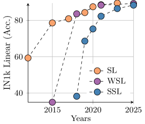

<figcaption>図1: (a) 完全教師あり（SL）、弱教師あり（WSL）、自己教師あり学習（SSL）手法を比較した、ImageNet1k（IN1k）における線形プローブ結果の年次推移。後から登場したにもかかわらず、SSL は急速に進歩し、近年の Imagenet 精度の頭打ちに到達した。一方、われわれは SSL が高品質な dense feature を提供するという固有の約束を持つことを実証する。DINOv3 により、(b) に示すように、最良 WSL モデルと DINOv3 の相対性能で示される通り、dense タスクで弱教師ありモデルを大きく上回る。また、自然画像 (c) と航空画像 (d) で訓練された DINOv3 から高解像度画像で得られた特徴量の PCA マップを生成する。</figcaption>
</figure>

実際、SSL の約束、すなわち大量の制約のないデータを活用して任意に大きく強力なモデルを生み出すことは、スケールでは依然として困難である。

[134] が提案するヒューリスティクスによってモデルの不安定性と崩壊（collapse）は緩和されるが、さらにスケールするとより多くの問題が現れる。

第一に、ラベルなしコレクションから有用なデータを収集する方法が明らかでない。

第二に、通常の訓練実践では、コサインスケジュールを採用することは最適化の地平線を事前に知ることを意味するが、大規模画像コーパスで訓練する場合これは難しい。

第三に、特徴量の性能は訓練初期の後で徐々に低下し、これはパッチ類似度マップの視覚的検査で確認される。

この現象は、ViT-Large サイズ（3 億パラメータ）以上のモデルでの長い訓練実行で現れ、DINOv2 のスケーリングの有用性を低下させる。

上記の問題に対処することがこの研究 *DINOv3* に至り、これは SSL 訓練を大規模にスケールで進める。

われわれは、**単一の凍結 SSL バックボーン**が、教師あり・メタデータ依存の事前学習戦略を上回り、困難な下流タスクで最先端性能を達成する普遍的な視覚エンコーダとして機能できることを実証する。

われわれの研究は次の目的に導かれている: (1) タスクとドメインをまたいで汎用的な基盤モデルを訓練する、(2) dense feature における既存 SSL モデルの欠点を改善する、(3) すぐに使えるモデルファミリを配布する。

以下で 3 つの目的について議論する。

<figure>

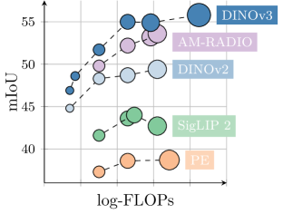

<figcaption>図2: (a) セマンティックセグメンテーション（ADE20k）。スケーリングに伴う性能の推移。</figcaption>
</figure>

### Strong & Versatile Foundational Models（強力で汎用的な基盤モデル）

DINOv3 は、モデルサイズと訓練データのスケーリングによって可能になる、2 つの軸に沿った高いレベルの汎用性を提供することを目指す。

第一に、SSL モデルの重要な望ましい特性は、凍結されたまま卓越した性能を達成すること、理想的には特化されたモデルと同様の最先端結果に到達することである。

その場合、単一の forward pass で複数のタスクにまたがる最先端結果を提供でき、実用的応用、特にエッジデバイスにとって本質的な利点となる大幅な計算節約につながる。

DINOv3 がうまく適用できるタスクの広い幅を §6 で示す。

第二に、メタデータに依存しないスケーラブルな SSL 訓練パイプラインは、多くの科学的応用を解放する。

ウェブ画像や観測データなど多様な画像集合で事前学習することで、SSL モデルは多くのドメインとタスクにまたがって汎化する。

図 1(d) に示すように、高解像度航空画像から抽出された DINOv3 特徴量の PCA は道路・家屋・緑地を明確に分離でき、モデルの特徴量品質を強調している。

### Superior Feature Maps Through Gram Anchoring（Gram Anchoring による優れた特徴マップ）

DINOv3 のもう一つの主要な特徴は、dense feature map の有意な改善である。

DINOv3 SSL 訓練戦略は、高レベルの意味的タスクで優れたモデルを生み出しつつ、深度推定や 3D マッチングのような幾何学的タスクを解くのに適した優れた feature map を生成することを目指す。

特に、モデルは off-the-shelf で、または小さな後処理で使用できる dense feature を生成すべきである。

dense 表現と global 表現の間の妥協は、高レベル理解の目的が dense feature map の品質と衝突しうるため、大量の画像で訓練する場合に特に最適化が難しい。

これらの矛盾する目的は、大きなモデルと長い訓練スケジュールで dense feature の崩壊につながる。

われわれの新しい Gram anchoring 戦略はこの崩壊を効果的に緩和する（§4 を参照）。

結果として、DINOv3 は DINOv2 よりも有意に良い dense feature map を得て、高解像度でもクリーンなままである（図 3 を参照）。

### The DINOv3 Family of Models（DINOv3 モデル族）

Gram anchoring による dense feature map の劣化解決は、スケーリングの力を解放する。

その結果として、はるかに大きなモデルを SSL で訓練することは有意な性能改善につながる。

本研究では、70 億パラメータの DINO モデルの訓練に成功した。

そのような大規模モデルは実行に有意な資源を必要とするため、その知識をより小さな派生に圧縮するために蒸留を適用する。

その結果、コンピュータビジョン課題の広範な範囲に対処するために設計された包括的なスイートである **DINOv3 視覚モデル族**を提示する。

このモデル族は、多様な資源制約と展開シナリオに適応できるスケーラブルなソリューションを提供することで、最先端を進めることを目指す。

蒸留プロセスは、Vision Transformer（ViT）Small, Base, Large、および ConvNeXt ベースのアーキテクチャを含む、複数のスケールのモデル派生を生み出す。

注目すべきは、効率的で広く採用されている ViT-L モデルが、様々なタスクで元の 7B teacher に近い性能を達成することである。

総じて、DINOv3 ファミリは広範なベンチマークで強い性能を示し、global タスクでは競合モデルの精度に匹敵するか上回り、図 2 に見られるように dense 予測タスクでは有意に上回る。

<figure>

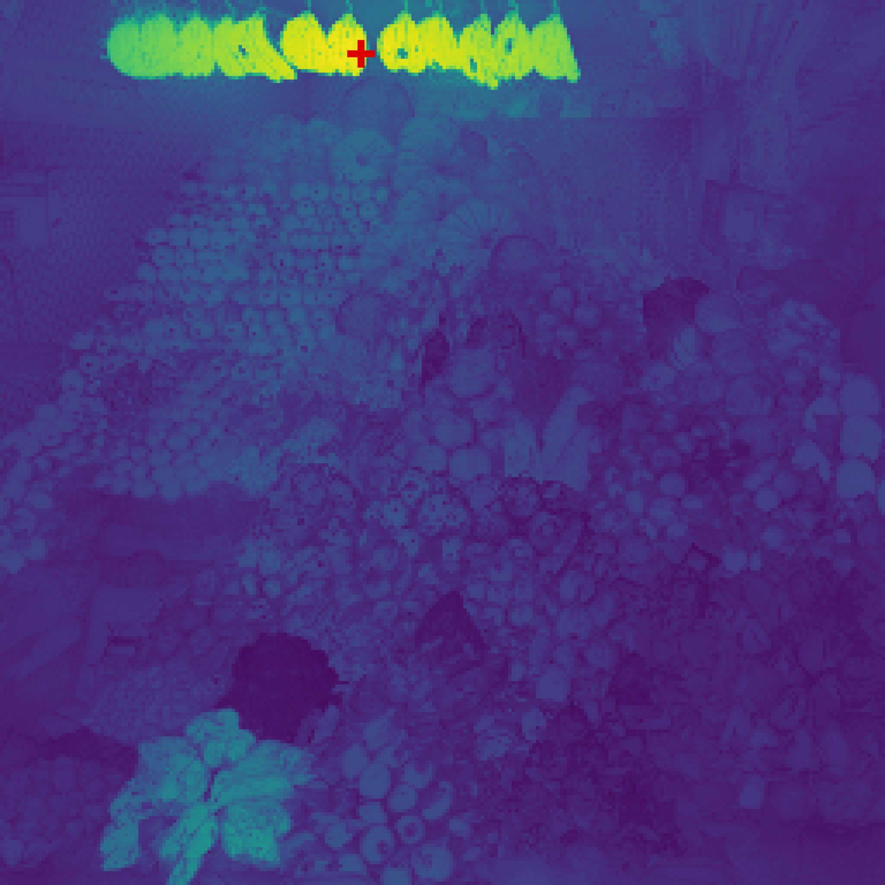

<figcaption>図3: 高解像度 dense feature。DINOv3 出力特徴量を用いた、赤い十字でマークされたパッチと他のすべてのパッチとの間のコサイン類似度マップを可視化する。入力画像は 4096×4096。ズームインしてご覧ください、DINOv3 に同意しますか？</figcaption>
</figure>

### Overview of Contributions（貢献の概要）

本研究では、SSL を大規模なフロンティアモデルに向けてスケールするという課題に対処するため、複数の貢献を導入する。

自動データキュレーション [196] の最近の進歩の上に構築して、少量の特化データ（ImageNet-1k）と注意深く混合する大規模な「背景」訓練データセットを取得する。

これは、モデル性能を改善するために大量の制約のないデータを活用することを可能にする。

データスケーリングに関するこの貢献 (i) は §3.1 で記述する。

ViT アーキテクチャのカスタム派生を定義することで、主モデルサイズを 70 億パラメータに増加させる。

現代的な位置埋め込み（axial RoPE）を含め、位置のアーティファクトを避ける正則化技術を開発する。

DINOv2 における複数のコサインスケジュールから離れ、1M 反復の間、一定のハイパーパラメータスケジュールで訓練する。

これにより、より強い性能を持つモデルを生成できる。

モデルアーキテクチャと訓練に関するこの貢献 (ii) は §3.2 で記述する。

上記の技法により、DINOv2 アルゴリズムに従って大規模にモデルを訓練できる。

しかし、前述のように、スケールは dense feature の劣化につながる。

これに対処するため、Gram anchoring 訓練フェーズによってパイプラインの中核的改善を提案する。

これは feature map のノイズをきれいにし、印象的な類似度マップにつながり、パラメトリックおよび非パラメトリック dense タスクの両方で性能を劇的に改善する。

Gram 訓練に関するこの貢献 (iii) は §4 で記述する。

先行実践に従い、われわれのパイプラインの最後のステップは、高解像度ポスト訓練フェーズと、様々なサイズの一連の高性能モデルへの蒸留からなる。

後者については、新規かつ効率的な single-teacher multiple-students 蒸留手順を開発する。

この貢献 (iv) は、われわれの 7B フロンティアモデルの力を、一般的使用のためのより小さな実用的モデル族に転移し、§5.2 で記述する。

徹底的なベンチマーキングで測定したように、§6 の結果は、われわれのアプローチが dense タスクで新しい標準を定義し、global タスクで CLIP 派生に比較可能に性能することを示す。

特に、凍結された視覚バックボーンで、物体検出（COCO 検出、mAP 66.1）と画像セグメンテーション（ADE20k、mIoU 63.0）のような長年のコンピュータビジョン問題で最先端性能を達成し、特化された fine-tune パイプラインを上回る。

さらに、DINOv3 アルゴリズムを衛星画像に適用することで、§8 でドメインをまたいだアプローチの一般性の証拠を提供し、すべての先行アプローチを上回る。

---

## 2 Related Work（関連研究）

### Self-Supervised Learning（自己教師あり学習）

注釈なしの学習は、訓練のために教師信号を提供する人工的な学習タスクを必要とする。

SSL の技術と挑戦は、下流タスクのための強力な表現を学習するために、これらのいわゆる事前テキストタスク（pretext task）を慎重に設計することにある。

言語ドメインは、その離散的な性質により、そのようなタスクを設定する直接的な方法を提供し、テキストデータの多くの成功した教師なし事前学習アプローチをもたらした。

例には、単語埋め込み [128, 17]、文表現 [50, 121]、プレーン言語モデル [127, 232] が含まれる。

対照的に、コンピュータビジョンは、信号の連続的な性質によりより大きな課題を提示する。

言語アプローチを模倣する初期の試みは、画像の部分から教師信号を抽出して他の部分を予測した。例えば、相対的なパッチ位置予測 [53]、パッチ並び替え [132, 130]、または塗りつぶし [138] による。

他のタスクには、画像の再着色 [236] や画像変換の予測 [73] が含まれる。

これらのタスクの中で、*塗りつぶし（inpainting）ベース*のアプローチは、パッチベースの ViT アーキテクチャ [85, 8, 58] の柔軟性のおかげで有意な関心を集めてきた。

目的は画像の破損した領域を再構成することで、ノイズ除去オートエンコーディングの一形態と見なすことができ、概念的には BERT 事前学習 [50] におけるマスクトークン予測タスクに関連する。

特に、[85] は、画素ベースのマスクオートエンコーダ（MAE）が下流タスクでファインチューニングするための強い初期化として使用できることを実証した。

その後、[5, 6, 3] は、画素空間の代わりに*学習された潜在空間*を予測することがより強力で高レベルの特徴量につながることを示した ― JEPA「Joint-Embedding Predictive Architecture」[113] と呼ばれる学習パラダイムである。

最近、JEPA は動画訓練にも拡張されている [12, 4]。

第二の研究系統、われわれのものに近い系統は、視覚表現を学習するために*画像間の識別信号*を活用する。

このファミリーの手法は初期の深層学習研究 [80] にルーツを持つが、インスタンス分類技法 [54, 16, 211] の導入で人気を博した。

その後の進展は、対比目的と情報理論的基準 [87, 84, 35, 32, 79, 10]、自己クラスタリングベースの戦略 [25, 2, 27, 28] を導入した。

iBOT [240] のようなより最近のアプローチは、これらの識別損失をマスク再構成目的と組み合わせる。

これらすべての手法は、強い特徴量を学習し、ImageNet [155] のような標準ベンチマークで高い性能を達成する能力を示している。

しかしながら、ほとんどはより大きなモデルサイズへのスケーリングで課題に直面する [36]。

### Vision Foundation Models（視覚基盤モデル）

深層学習革命は AlexNet のブレイクスルー [110] で始まった。これは ImageNet チャレンジ [49, 155] で先行手法を上回った深層畳み込みニューラルネットワークである。

早期から、大規模な手動ラベル付き ImageNet データセットでエンドツーエンドに学習された特徴量は、広範な転移学習タスクに高度に効果的であることが見出された [133]。

視覚*基盤モデル*に関する初期の研究は、VGG [167]、GoogleNet [175]、ResNet [83] を含むアーキテクチャ開発に焦点を当てた。

*スケーリング*の有効性を考慮して、後続の研究は大規模データセット上でより大きなモデルを訓練することを探求した。

[172] は、3 億のラベル付き画像を含む独自の JFT データセットで教師あり訓練データを拡張し、印象的な結果を示した。

JFT は [107] にも有意な性能利得を可能にした。

並行して、教師ありデータと教師なしデータの組み合わせを用いてスケーリングが探求された。

例えば、ImageNet 教師ありモデルは教師なしデータのための擬似ラベルを生成するために使用でき、それが次により大きなネットワークを訓練するのに役立つ [220]。

その後、JFT のような大規模教師ありデータセットの利用可能性も、トランスフォーマーアーキテクチャのコンピュータビジョンへの適応を促進した [55]。

特に、JFT へのアクセスなしで元の vision transformer（ViT）に匹敵する性能を達成するには、かなりの努力が必要である [182, 183]。

ViT の学習能力により、[233] によってスケーリングの努力がさらに拡張され、非常に大きな ViT-22B エンコーダ [48] に至った。

大規模データセットの手動ラベル付けの複雑さを考慮して、*弱教師あり訓練* ― 注釈が画像に関連するメタデータから派生する ― は教師あり訓練の効果的な代替を提供する。

早期に、[101] は、ネットワークが画像キャプションのすべての単語を単に予測することで事前学習できることを実証した。

この初期アプローチは、文構造の活用 [114]、他のタイプのメタデータとキュレーションの組み込み [124]、スケーリング [168] によってさらに洗練された。

しかしながら、弱教師ありアルゴリズムは、Align [97] と CLIP [144] が例証するように、対比損失とキャプション表現の共同訓練の導入によってのみ完全な潜在能力に達した。

この非常に成功したアプローチは、多数の*オープンソース再現とスケーリング努力*を触発した。

OpenCLIP [40] は LAION データセット [160] で訓練することによって CLIP を複製する最初のオープンソース努力であり、後続研究は事前学習済みバックボーンを CLIP スタイルにファインチューニングすることで活用する [173, 174]。

データ収集が CLIP 訓練の成功における重要な要因であることを認識して、MetaCLIP [218] は元の CLIP 手順を精密に従ってその結果を再現するが、[63] は事前学習データをキュレートするために教師ありデータセットを使用する。

他の研究は訓練損失の改善に焦点を当てる、例えば SigLIP [235] では sigmoid 損失を使用したり、事前学習された画像エンコーダ [234] を活用したり。

最終的には、最先端の基盤モデルを得るための最も重要な構成要素は、豊富な高品質データと相当な計算資源である。

この点で、SigLIP 2 [185] と Perception Encoder（PE）[18] は、$40$ B 以上の画像-テキスト対で訓練した後、印象的な結果を達成する。

最大の PE モデルは、グローバルバッチサイズ $131$ K で $86$ B サンプルで訓練される。

最後に、より複雑でネイティブにマルチモーダルなアプローチの範囲が提案されている。これらには、対比キャプション [228]、潜在空間でのマスクモデリング [8, 203, 64, 201]、自己回帰訓練 [68] が含まれる。

対照的に、*教師なし画像事前学習をスケールする*ことに焦点を当てた研究は比較的少ない。

初期の努力には、YFCC データセット [178] を利用した [26] と [74] が含まれる。

より大きなデータセットとモデルに焦点を当てる [75, 76]、SSL のためのデータキュレーションの初期の試み [179] により、さらなる進歩が達成されている。

訓練アルゴリズムの慎重な調整、より大きなアーキテクチャ、より広範な訓練データは、DINOv2 [134] の印象的な結果につながる。初めて、SSL モデルがさまざまなタスクでオープンソース CLIP 派生に匹敵または上回った。

この方向は、データキュレーションなしでより大きなモデルにスケーリングする [62] や、オープンデータセットと改善された訓練レシピを使用する [192] によって最近さらに推進されている。

### Dense Transformer Features

<figure>

<figcaption>図4: 入力。事前学習されたトランスフォーマーの dense feature を消費する現代の幅広い視覚応用。</figcaption>
</figure>

事前学習されたトランスフォーマーの*dense feature*を消費する現代の視覚応用には、マルチモーダルモデル [120, 14]、生成モデル [229, 223]、3D 理解 [199]、動画理解 [116, 207]、ロボティクス [56, 104] を含む幅広いものがある。

これに加えて、検出、セグメンテーション、深度推定のような伝統的な視覚タスクは正確な局所記述子を必要とする。

SSL 訓練された局所記述子の品質を向上させるため、相当な研究が*局所 SSL 損失*の開発に焦点を当てている。

例には、動画における時空間的一貫性の活用、例えばポイントトラックループを訓練信号として使用する [94]、同じ画像の異なるクロップ間の空間的アラインメントを活用する [141, 11]、隣接パッチ間の一貫性を強制する [230] がある。

[47] はクラスタ化された局所パッチを予測することが改善された dense 表現につながることを示す。

DetCon [88] と ORL [215] は領域提案で対比学習を行うが、そのような提案が*事前に*存在することを仮定する。

ODIN [89] と SlotCon [210] のようなアプローチによってこの仮定は緩和される。

訓練目的を変えずに、[46] は入力系列に register トークンを追加することが dense feature map を大幅に改善することを示し、最近の研究はこれがモデル訓練なしで行えることを発見している [98, 37]。

最近の傾向は、global と local の特徴量品質において様々な、異なるレベルの教師信号で訓練された複数の画像エンコーダから情報を組み合わせる、蒸留ベースの「*凝集（agglomerative）*」手法である [148, 18]: AM-RADIO [148] は、完全教師あり SAM [106]、弱教師あり CLIP、自己教師あり DINOv2 の強みを統一されたバックボーンに組み合わせる。

Perception Encoder [18] は同様に SAM(v2) を PEspatial と呼ばれる特化された dense 派生に蒸留する。

これらは、student と teacher のパッチ間のコサイン類似度を高くするよう強制する目的を使用し、teacher はマスク注釈で訓練されている。

類似の損失は、特徴量次元の Gram 行列の不一致を減らすことで、スタイル転送の文脈で効果的であることが示されている [71, 99, 226]。

本研究では、student と teacher のパッチ間のコサイン類似度を正則化するために Gram 目的を採用し、それらが近いことを好む。

われわれの場合、SSL モデル自体の早期の反復を teacher として使用し、早期段階の SSL モデルが global と dense タスクの両方に対する SSL 訓練を効果的に導くことを実証する。

他の研究は、SSL 訓練されたモデルの局所特徴量への事後改善に焦点を当てる。

例えば、[242] は事前学習されたモデルを dense クラスタリング目的でファインチューンする; 同様に、[158] はパッチ特徴量を時間的にアラインメントすることでファインチューンする、両方の場合とも局所特徴量の品質を向上させる。

われわれに近いものでは、[135] は student と teacher が一貫した隣接順序を持つ特徴量を生成することを促すパッチソートベースの目的を提案する。

ファインチューニングなしで、STEGO [81] は凍結された SSL 特徴量の上に非線形射影を学習してコンパクトなクラスタを形成し、相関パターンを増幅する。

代わりに、[166] は異なる自己教師あり目的からの勾配を凍結 SSL 特徴量に連結することで、自己教師あり特徴量を増強する。

最近、[212] はノイズの多い feature map がパッチの重み付き平均によって有意に改善されることを示す。

関連するが SSL に特化しないものとして、最近のいくつかの研究は ViT feature map から高解像度 feature map を生成する [70]、これらは画像のパッチ化により低解像度になることが多い。

このような研究と対照的に、われわれのモデルは、図 4 に示すように、解像度をまたいで安定で一貫性のある高品質 dense feature map をネイティブに提供する。

---

## 3 Training at Scale Without Supervision（教師信号なしのスケール訓練）

DINOv3 は、自己教師あり学習の境界を押し広げることによって、最も頑健で柔軟な視覚表現を生成するよう設計された次世代モデルである。

大規模言語モデル（LLM）の成功からインスピレーションを得る。それらにおいては、モデル容量のスケールアップが卓越した*創発的特性*につながる。

桁違いに大きいモデルと訓練データセットを活用することで、SSL の完全な潜在能力を解放し、伝統的な教師ありまたはタスク固有のアプローチに固有の限界に妨げられない、コンピュータビジョンのための同様のパラダイムシフトを推進することを目指す。

特に、SSL は特定の教師信号やタスクに偏らない豊かで高品質の視覚特徴量を生成し、それによって幅広い下流応用に汎用的な基盤を提供する。

SSL モデルをスケーリングする以前の試みは不安定性の問題によって妨げられてきたが、本節では、慎重なデータ準備・設計・最適化でスケーリングの利益をどのように活用するかを記述する。

まずデータセット作成手順を記述し（§3.1）、次に DINOv3 のこの最初の訓練フェーズに使用される SSL レシピを提示する（§3.2）。

これにはアーキテクチャ・損失関数・最適化技法の選択が含まれる。

dense feature に焦点を当てる第二の訓練フェーズは §4 で記述する。

### 3.1 Data Preparation（データ準備）

データスケーリングは、大規模基盤モデルの成功を支える要因の一つである [184, 144, 218, 134]。

しかしながら、訓練データのサイズを単純に増やすことは、必ずしもモデル品質の向上と下流ベンチマークでのより良い性能には変換されない [75, 134, 196]: 成功したデータスケーリングの努力は典型的に慎重なデータキュレーションパイプラインを伴う。

これらのアルゴリズムは異なる目的を持ちうる: データの多様性とバランスの改善、またはデータの有用性 ― 一般的実用的応用への関連性 ― に焦点を当てる。

DINOv3 の開発のために、われわれは 2 つの目的の間でバランスをとる、モデルの汎化可能性と性能の両方を改善するための 2 つの補完的アプローチを組み合わせる。

**表1**: 訓練データが特徴量品質に与える影響を、下流タスクでの性能を介して示す。clustering [196] および retrieval [134] でキュレートされたデータセットを、raw データおよびわれわれのデータ混合と比較する。このアブレーション研究は 200k 反復のより短いスケジュールで実行される。

| Dataset | IN1k k-NN | IN1k Linear | ObjectNet | iNaturalist 2021 | Paris Retrieval |
| --- | --- | --- | --- | --- | --- |
| Raw | 80.1 | 84.8 | 70.3 | 70.1 | 63.3 |
| Clustering | 79.4 | 85.4 | 72.3 | 81.3 | 85.2 |
| Retrieval | 84.0 | 86.7 | 70.7 | 86.0 | 82.7 |
| **LVD-1689M (ours)** | **84.6** | **87.2** | **72.8** | **87.0** | **85.9** |

### Data Collection and Curation（データ収集とキュレーション）

Instagram の公開投稿から収集されたウェブ画像の大規模データプールを活用して、大規模事前学習データセットを構築する。

これらの画像は有害コンテンツの防止を助けるためにプラットフォームレベルのコンテンツモデレーションを既に経ており、約 170 億枚の画像の初期データプールを取得する。

この生データプールを使用して、3 つのデータセット*パート*を作成する。

第一部は、[196] の階層的 $k$-means に基づく自動キュレーション法を適用して構築する。

DINOv2 を画像埋め込みとして採用し、最低レベルから最高レベルへのクラスタ数が $200$ M、$8$ M、$800$ k、$100$ k、$25$ k の 5 レベルのクラスタリングを使用する。

クラスタの階層を構築した後、[196] で提案されたバランスサンプリングアルゴリズムを適用する。

これにより、ウェブ上に現れるすべての視覚的概念のバランスの取れたカバレッジを保証する 1,689 百万画像のキュレートされたサブセット（LVD-1689M と命名）が得られる。

第二部については、[134] によって提案された手順に類似した検索ベースのキュレーションシステムを採用する。

選択されたシードデータセットからのものに類似した画像をデータプールから取得し、下流タスクに関連する視覚概念をカバーするデータセットを作成する。

第三部については、ImageNet1k [49]、ImageNet22k [155]、Mapillary Street-level Sequences [208] を含む、生の公開コンピュータビジョンデータセットを使用する。

この最終部は、[134] に従って、モデルの性能を最適化することを可能にする。

### Data Sampling（データサンプリング）

事前学習中、異なるデータパートを一緒に混合するためにサンプラを使用する。

上記のデータコンポーネントを混合するためのいくつかの異なるオプションがある。

一つは、各反復でランダムに選択された単一のコンポーネントからのデータの均質なバッチで訓練すること。

代わりに、特定の比率を使用して選択されたすべてのコンポーネントからのデータで組み立てられた異質なバッチでモデルを最適化することもできる。

[30] にインスパイアされた、小さなデータセットからの非常に高品質なデータからなる均質なバッチを持つことが有益であることを観察した。各反復でランダムに、ImageNet1k のみからの均質なバッチ、または他のすべてのコンポーネントからのデータを混合する異質なバッチのいずれかをサンプリングする。

われわれの訓練では、ImageNet1k からの均質なバッチが訓練の 10% を占める。

### Data Ablation（データアブレーション）

データキュレーション技法の影響を評価するため、われわれのデータ混合を、クラスタリングのみまたは検索ベース手法でキュレートされたデータセット、および生データプールと比較するアブレーション研究を行う。

このため、各データセットで 1 つのモデルを訓練し、それらの性能を標準的下流タスクで比較する。

効率のため、1M 反復の代わりに 200k 反復のより短いスケジュールを使用する。

表 1 において、単一のキュレーション技法がすべてのベンチマークで最良に機能するわけではなく、われわれの完全なパイプラインが両方の世界の最良を得ることを可能にすることが見て取れる。

### 3.2 Large-Scale Training with Self-Supervision（自己教師ありでの大規模訓練）

SSL で訓練されたモデルは興味深い特性を示してきた [33, 28] が、ほとんどの SSL アルゴリズムはより大きなモデルサイズにスケールアップされていない。

これは、訓練の安定性の問題 [47]、または視覚世界の完全な複雑さを捉えることに失敗する過度に単純化された解決策のいずれかによる。

大規模に訓練された場合 [76]、SSL で訓練されたモデルは必ずしも印象的な性能を示さない。

注目すべき例外は、キュレートされたデータで訓練された 11 億パラメータのモデルである DINOv2 で、CLIP [144] のような弱教師ありモデルの性能に匹敵する。

DINOv2 を 70 億パラメータにスケールする最近の努力 [62] は、global タスクで有望な結果を示すが、dense 予測では残念な結果である。

ここでは、モデルとデータをスケールアップし、改善された global と local の両方の特性を持つ、さらに強力な視覚表現を取得することを目指す。

**表2**: DINOv2 と DINOv3 モデルで使用される teacher アーキテクチャの比較。モデルを $40$ ブロック深く保ち、埋め込み次元を $4096$ に増加させる。重要なことに、パッチサイズ $16$ ピクセルを使用し、与えられた解像度に対する実効系列長を変更する。

| Teacher model | DINOv2 | DINOv3 |
| --- | --- | --- |
| Backbone | ViT-giant | ViT-7B |
| #Params | 1.1B | 6.7B |
| #Blocks | 40 | 40 |
| Patch Size | 14 | 16 |
| Pos. Embeddings | Learnable | **RoPE** |
| Registers | 4 | 4 |
| Embed. Dim. | 1536 | 4096 |
| FFN Type | SwiGLU | SwiGLU |
| FFN Hidden Dim. | 4096 | 8192 |
| Attn. Heads | 24 | 32 |
| Attn. Heads Dim. | 64 | 128 |
| DINO Head MLP | 4096-4096-256 | 8192-8192-512 |
| DINO Prototypes | 128k | 256k |
| iBOT Head MLP | 4096-4096-256 | 8192-8192-384 |
| iBOT Prototypes | 128k | 96k |

### Learning Objective（学習目的）

モデルは、global と local の両方の損失項を持つ複数の自己教師あり目的の混合である識別的自己教師あり戦略で訓練する。

DINOv2 [134] に従い、画像レベルの目的 [28] $\mathcal{L}_{DINO}$ を使用し、パッチレベル潜在再構成目的 [240] $\mathcal{L}_{iBOT}$ とバランスする。

両目的で DINO の centering を SwAV [27] からの Sinkhorn-Knopp に置き換える。

各目的は、損失の計算前に特徴量のある程度の特化を可能にする、バックボーンネットワーク上の専用ヘッドの出力を使用して計算される。

加えて、local と global crop のバックボーン出力に適用される専用のレイヤー正規化を使用する。

経験的に、この変更が訓練後期の ImageNet kNN 分類を安定化させ（+0.2 精度）、dense 性能を改善する（例: ADE20k セグメンテーション +1 mIoU、NYUv2 深度推定 -0.02 RMSE）ことを発見した。

加えて、Koleo 正則化子 $\mathcal{L}_{Koleo}$ がバッチ内の特徴量を空間に均一に広げることを促すために追加される [157]。

GPU をまたいで可能な $16$ サンプルの小バッチに損失が適用される Koleo の分散実装を使用する。

初期の訓練フェーズは次の損失を最適化することで行われる:

$$
\mathcal{L_{\mathrm{Pre}}}=\mathcal{L_{\mathrm{DINO}}}+\mathcal{L}_{\mathrm{iBOT}}+0.1*\mathcal{L_{\mathrm{DKoleo}}}.
$$

### Updated Model Architecture（更新されたモデルアーキテクチャ）

本研究のモデルスケーリングの側面のために、モデルのサイズを 70 億パラメータに増加させ、表 2 で対応するハイパーパラメータを DINOv2 研究で訓練された 11 億パラメータモデルと比較して提供する。

RoPE のカスタム派生も採用する: 基本実装は各パッチに正規化された $[-1,1]$ ボックスの座標を割り当て、次に 2 つのパッチの相対位置に応じて多頭注意操作にバイアスを適用する。

解像度、スケール、アスペクト比に対するモデルの頑健性を改善するため、RoPE-box jittering を採用する。

座標ボックス $[-1,1]$ はランダムに $[-s,s]$ にスケールされ、ここで $s \in [0.5, 2]$ である。

これらの変更を合わせて、DINOv3 が詳細で頑健な視覚特徴量をより良く学習することを可能にし、その性能とスケーラビリティを向上させる。

### Optimization（最適化）

非常に大きなデータセット上で大きなモデルを訓練することは複雑な実験ワークフローを表す。

モデル容量と訓練データの複雑さの相互作用を*事前に*評価することは難しいため、適切な最適化の地平線を推測することは不可能である。

これを克服するため、すべてのパラメータスケジューリングを取り除き、一定の学習率、重み減衰、teacher EMA モメンタムで訓練する。

これは 2 つの主要な利点を持つ。

第一に、下流性能が改善し続ける限り訓練を続けることができる。

第二に、最適化ハイパーパラメータの数が減り、それらを適切に選択しやすくなる。

訓練が適切に開始するため、学習率と teacher 温度には線形ウォームアップを依然として使用する。

一般的な実践に従い、AdamW [123] を使用し、合計バッチサイズを $256$ GPU に分割された $4096$ 画像に設定する。

multi-crop 戦略 [27] を使用してモデルを訓練し、画像ごとに $2$ つの global crop と $8$ つの local crop を取る。

global/local crop には $256$ / $112$ ピクセルの辺長の正方形画像を使用し、パッチサイズの変更とともに、DINOv2 と同じ画像あたりの実効系列長と、バッチあたり合計系列長 $3.7$ M トークンとなる。

追加のハイパーパラメータは付録 C とコードリリースに見つけることができる。

<figure>

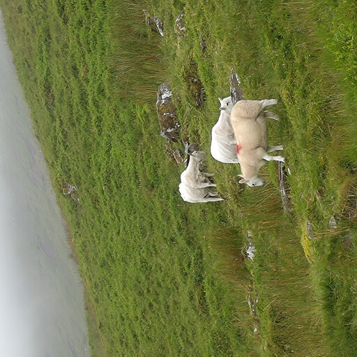

<figcaption>図5: 異なる訓練反復における dense feature の劣化を示すコサイン類似度マップの進化。</figcaption>
</figure>

---

## 4 Gram Anchoring: A Regularization for Dense Features（dense feature のための正則化）

大規模訓練の利益を完全に活用するため、7B モデルを延長期間訓練することを目指す。それは潜在的に無期限に訓練できるという概念で。

予想通り、長期訓練は global ベンチマークで改善をもたらす。

しかしながら、訓練が進むにつれて、dense タスクで性能が劣化する（図 5 と 5）。

この現象は、特徴量表現におけるパッチレベルの不一致の出現によるもので、延長訓練の背後にある関心を損なう。

本節では、まずパッチレベル一貫性の喪失を分析し、次にそれを緩和する *Gram anchoring* と呼ぶ新しい目的を提案する。

最後に、われわれのアプローチが訓練の安定性とモデル性能の両方に与える影響について議論する。

### 4.1 Loss of Patch-Level Consistency Over Training（訓練中のパッチレベル一貫性の喪失）

延長訓練中に、global メトリクスでの一貫した改善を観察するが、dense 予測タスクでの性能の顕著な低下を観察する。

この振る舞いは、DINOv2 の訓練中にもより程度は低いが以前に観察され、[62] のスケーリング努力でも議論された。

しかしながら、われわれの知る限り、現在まで未解決である。

図 5 と 5 でこの現象を例示する。これらは画像分類とセグメンテーションタスクの両方で反復にわたるモデルの性能を提示する。

分類については、CLS トークンを使用して ImageNet-1k 上で線形分類器を訓練し、top-1 精度を報告する。

セグメンテーションについては、Pascal VOC から抽出されたパッチ特徴量上で線形層を訓練し、mean Intersection over Union（mIoU）を報告する。

ViT-g と ViT-7B の両方で、分類精度は訓練中に単調に改善することを観察する。

しかしながら、セグメンテーション性能は約 200k 反復後に低下し、ViT-7B の場合は初期レベル以下に落ちる。

この劣化をよりよく理解するため、パッチ間のコサイン類似度を可視化することでパッチ特徴量の品質を分析する。

図 6 は、バックボーンの出力パッチ特徴量と参照パッチ（赤で強調表示）の間のコサイン類似度マップを示す。

200k 反復では、類似度マップは滑らかで局所化されており、一貫したパッチレベル表現を示す。

しかしながら、600k 反復以降では、マップは大幅に劣化し、参照パッチと高い類似度を持つ無関係なパッチが増加する。

このパッチレベル一貫性の喪失は、dense タスク性能の低下と相関する。

これらのパッチレベルの不規則性は、[46] で記述された高ノルムパッチ外れ値とは異なる。

具体的には、register トークンの統合により、パッチノルムは訓練を通じて安定したままである。

しかしながら、CLS トークンとパッチ出力の間のコサイン類似度が訓練中に徐々に増加することに気づく。

これは予想されることであるが、パッチ特徴量の局所性が減少することを意味する。

この現象を、200k と 1M 反復におけるコサインマップを描いた図 5 で可視化する。

dense タスクでの低下を緩和するため、パッチ特徴量を正則化し、高い global 性能を保持しながら良いパッチレベル一貫性を確保することを特に設計した新しい目的を提案する。

### 4.2 Gram Anchoring Objective（Gram Anchoring 目的）

<figure>

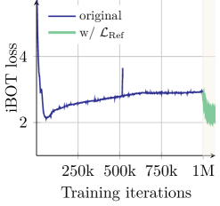

<figcaption>図7: (a) iBOT 損失。Gram 目的が iBOT 損失を有意により速く減少させる影響を可視化する。</figcaption>
</figure>

実験を通じて、強い識別特徴量の学習と局所一貫性の維持の間の相対的独立性を同定した。global と dense の性能の間の相関の欠如で観察される通り。

global DINO 損失と local iBOT 損失を組み合わせることでこの問題に対処し始めたが、訓練が進むにつれて global 表現が支配する不安定なバランスを観察する。

この洞察に基づき、この独立性を明示的に活用する新しい解決策を提案する。

特徴量自体に影響を与えずに、パッチレベル一貫性の品質を強制することで、パッチレベル一貫性の劣化を緩和する新しい目的を導入する。

この新しい損失関数は Gram 行列（画像内のパッチ特徴量のすべてのペアワイズ内積の行列）上で動作する。

student の Gram 行列を、*Gram teacher* と呼ぶ以前のモデルのそれに向けて押し上げたい。

優れた dense 特性を示す teacher ネットワークの早期反復を取ることで Gram teacher を選択する。

特徴量自体ではなく Gram 行列上で動作することで、類似度の構造が同じままであれば、局所特徴量は自由に動くことができる。

$P$ パッチで構成される画像と次元 $d$ で動作するネットワークを持つとする。

student の $\mathbf{L}_2$ 正規化された局所特徴量の $P \times d$ 行列を $\mathbf{X}_S$（それぞれ Gram teacher の場合 $\mathbf{X}_G$）と表記する。

損失 $\mathcal{L}_{\text{Gram}}$ を次のように定義する:

$$
\mathcal{L}_{\text{Gram}}=\left\|\mathbf{X}_{S}\cdot\mathbf{X}_{S}^{\top}-\mathbf{X}_{G}\cdot\mathbf{X}_{G}^{\top}\right\|_{\text{F}}^{2}.
$$

この損失は global crop でのみ計算する。

訓練の早期に適用できるが、効率のため $1$ M 反復後にのみ開始する。

興味深いことに、$\mathcal{L}_{\text{Gram}}$ の遅い適用でも、非常に劣化した局所特徴量を「修復」することができることを観察する。

性能をさらに改善するため、Gram teacher を 10k 反復ごとに更新し、その時点で Gram teacher は主 EMA teacher と同一になる。

訓練のこの第二ステップを *refinement step* と呼び、目的 $\mathcal{L}_{\mathrm{Ref}}$ を最適化する。ここで

$$
\mathcal{L}_{\mathrm{Ref}}=w_{\mathrm{D}}\mathcal{L_{\mathrm{DINO}}}+\mathcal{L}_{\mathrm{iBOT}}+w_{\mathrm{DK}}\mathcal{L}_{\mathrm{DKoleo}}+w_{\mathrm{Gram}}\mathcal{L}_{\mathrm{Gram}}.
$$

異なる損失の進化を図 7 に可視化し、Gram 目的の適用が iBOT 損失に有意に影響し、より速く減少させることを観察する。

これは、安定した Gram teacher によって導入される安定性が iBOT 目的に正の影響を与えることを示唆する。

対照的に、Gram 目的は DINO 損失に有意な影響を与えない。

この観察は、Gram と iBOT 目的が特徴量に類似した方法で影響する一方、DINO 損失はそれらに異なる方法で影響することを示唆する。

性能に関して、新しい損失の影響はほぼ即時であることを観察する。

図 8 に示すように、Gram anchoring を組み込むことは、最初の 10k 反復内で dense タスクで有意な改善をもたらす。

Gram teacher 更新の後、ADE20k ベンチマークで顕著な利得も見られる。

加えて、より長い訓練が ObjectNet ベンチマークでさらに性能を改善し、他の global ベンチマークは新しい損失からわずかな影響を示す。

<figure>

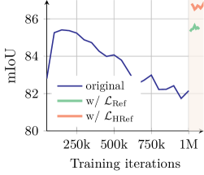

<figcaption>図8: (a) VOC。Gram anchoring を組み込むことで、dense タスクで急速な性能改善が得られる。</figcaption>
</figure>

### 4.3 Leveraging Higher-Resolution Features（高解像度特徴量の活用）

最近の研究は、パッチ特徴量の重み付き平均が、外れ値パッチを平滑化しパッチレベル一貫性を強化することで、より強い局所表現を生み出せることを示している [212]。

一方、より高解像度の画像をバックボーンに供給することは、よりきめ細かく詳細な feature map を生成する。

両方の観察の利点を活用して、Gram teacher のための高品質特徴量を計算する。

具体的には、まず通常の解像度の 2 倍で画像を Gram teacher に入力し、結果として得られる feature map を bicubic 補間で $2 \times$ ダウンサンプリングして、student 出力のサイズに一致する所望の滑らかな feature map を達成する。

図 9(a) は、解像度 256 と 512 の画像で得られたパッチ特徴量の Gram 行列、および 512 解像度の特徴量から $2 \times$ ダウンサンプリングした後に得られたもの（「downsamp.」と表記）を可視化する。

ダウンサンプリングを通じて高解像度特徴量における優れたパッチレベル一貫性が保存され、より滑らかで一貫したパッチレベル表現につながることを観察する。

余談として、われわれのモデルは、[171] によって導入された回転位置埋め込み（RoPE）の採用のおかげで、適応を必要とせずに異なる解像度で画像をシームレスに処理できる。

ダウンサンプリングされた特徴量の Gram 行列を計算し、目的 $\mathcal{L}_{Gram}$ で $\mathbf{X}_G$ を置き換えるために使用する。

結果として得られる新しい refinement 目的を $\mathcal{L}_{HRef}$ と表記する。

このアプローチは、Gram 目的が滑らかな高解像度特徴量の改善されたパッチ一貫性を student モデルに効果的に蒸留することを可能にする。

図 8 と図 9(b) に示すように、この蒸留は dense タスクでより良い予測に変換され、$\mathcal{L}_{Ref}$ がもたらす利益の上にさらなる利得を生む（ADE20k で +2 mIoU）。

図 9(b) で Gram teacher の選択もアブレートする。

興味深いことに、100k または 200k からの Gram teacher を選択することは結果に有意に影響しないが、はるかに遅い Gram teacher（1M 反復）を使用することは、そのような teacher のパッチレベル一貫性が劣るため有害である。

最後に、初期訓練と高解像度 Gram anchoring refinement で得られたパッチ特徴量の Gram 行列を可視化する図 10 で、Gram anchoring のパッチレベル一貫性への効果を定性的に例示する。

われわれの高解像度 refinement 手順がもたらす特徴量相関の大幅な改善を観察する。

<figure>

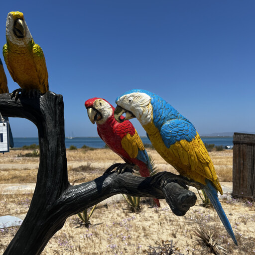

<figcaption>図9: (a) 256, 512 解像度およびダウンサンプリング後の Gram 行列の比較。高解像度の特徴量の優れたパッチレベル一貫性がダウンサンプリングを通じて保存される。</figcaption>
</figure>

<figure>

<figcaption>図10: 初期訓練と高解像度 Gram anchoring refinement で得られた Gram 行列の比較。高解像度 refinement 手順が特徴量相関の大幅な改善をもたらす。</figcaption>
</figure>

---

## 5 Post-Training（ポスト訓練）

本節では *post-training* 段階を提示する。

これには、異なる入力解像度での効果的な推論を可能にする高解像度適応フェーズ（§5.1）、品質と効率の良い小型モデルを生成するモデル蒸留（§5.2）、DINOv3 にゼロショット能力を追加するテキストアラインメント（§5.3）が含まれる。

### 5.1 Resolution Scaling（解像度スケーリング）

速度と有効性の間の良いトレードオフを与える比較的小さな解像度 $256$ でモデルを訓練する。

パッチサイズ $16$ に対して、このセットアップは、解像度 $224$ とパッチサイズ $14$ で訓練された DINOv2 と同じ入力系列長につながる。

しかしながら、多くの現代のコンピュータビジョン応用は、細かい空間情報を捉えるために、しばしば $512 \times 512$ ピクセル以上の有意に高い解像度で画像を処理することを必要とする。

推論画像解像度は実際には固定されておらず、特定の使用例によって変動する。

これに対処するため、高解像度適応ステップ [181] で訓練レジームを拡張する。

解像度の範囲にわたって高い性能を確保するため、ミニバッチごとに異なるサイズの global と local crop のペアをサンプリングする*mixed resolutions*を利用する。

具体的には、global crop サイズを $\{512, 768\}$ から、local crop サイズを $\{112, 168, 224, 336\}$ から考え、10k 追加の反復モデルを訓練する。

主訓練と同様に、この高解像度適応フェーズの重要な構成要素は、Gram teacher として 7B teacher を使用する Gram anchoring の追加である。

この構成要素が本質的であることを発見した: なしでは、モデルの dense 予測タスクでの性能が有意に劣化する。

Gram anchoring は、モデルが空間位置をまたいで一貫した頑健な特徴量相関を維持することを促し、これは高解像度入力の増加した複雑さに対処する際に重要である。

経験的に、この比較的短いが標的的な高解像度ステップが全体的なモデルの品質を大幅に強化し、図 4 に視覚的に示すように、広範な入力サイズにわたって汎化することを可能にすることを観察する。

図 11 では、適応前後の 7B モデルを比較する。

解像度スケーリングが ImageNet 分類（a）でわずかな利得をもたらし、解像度に関して比較的安定した性能をもたらすことを発見した。

しかしながら、ObjectNet OOD 転移（b）では、低解像度でわずかに性能が劣化する傾向があり、高解像度で改善する傾向がある。

これは、ADE20k でのセグメンテーション（c）と DAVIS でのトラッキング（d）の正の傾向で示される、高解像度での局所特徴量の品質の改善によって大きく補償される。

適応は、より大きな解像度で利用可能な豊かな空間情報を活用し、効果的に高解像度推論を可能にする、*画像サイズで改善する*局所特徴量につながる。

興味深いことに、適応されたモデルは最大訓練解像度 768 を遥かに超える解像度をサポートする ― 4k を超える解像度で安定した feature map を視覚的に観察する（図 4 参照）。

<figure>

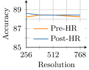

<figcaption>図11: (a) IN1k linear。解像度スケーリングが ImageNet 分類でわずかな利得をもたらし、解像度に対して安定した性能をもたらす。</figcaption>
</figure>

### 5.2 Model Distillation（モデル蒸留）

### A Family of Models for Multiple Use-Cases（複数のユースケースのためのモデル族）

ViT-7B モデルを、管理性と効率性の改善のためにコミュニティに高く評価されている、より小さな Vision Transformer 派生（ViT-S、ViT-B、ViT-L）に知識蒸留する。

われわれの蒸留アプローチは、学習信号の一貫性を確保するため、最初の訓練フェーズと同じ訓練目的を使用する。

しかしながら、モデル重みの指数移動平均（EMA）に依存する代わりに、より小さな student モデルを導くために 7B モデルを直接 teacher として使用する。

この場合、teacher モデルは固定されている。

パッチレベル一貫性の問題を観察しないため、Gram anchoring 技法は適用しない。

この戦略は、蒸留されたモデルが大きな teacher の豊かな表現力を継承しつつ、展開と実験により実用的になることを可能にする。

ViT-7B モデルは、広範な計算予算をカバーし、同時期のモデルとの適切な比較を可能にする一連の ViT モデルに蒸留される。

標準的な ViT-S（21M params）、B（86M）、L（0.3B）、カスタム ViT-S+（29M）、カスタム ViT-H+（0.8B）モデルが含まれ、自己蒸留された 7B teacher モデルとの性能ギャップを埋める。

実際、DINOv2 で、より小さな student モデルが蒸留として teacher と同等の性能に到達できることを観察する。

その結果、蒸留されたモデルは、表 14 に示すように、推論計算の一部でフロンティアレベルの性能を提供する。

モデルを 1M 反復訓練し、続いて 250k 反復の学習率冷却をコサインスケジュールに従って行い、Gram anchoring なしで §5.1 に記述された高解像度フェーズを適用する。

### Efficient Multi-Student Distillation（効率的マルチスチューデント蒸留）

大型 teacher の推論コストは student のそれよりも桁違いに高くなりうるため（図 16(a) を参照）、複数の student を同時に訓練し、訓練に関与するすべてのノード間で teacher 推論を共有することを可能にする並列蒸留パイプラインを設計する（図 12 のダイアグラム参照）。

$C_T$ と $C_S$ をそれぞれ単一サンプルでの teacher 推論と student 訓練のコストとし、バッチサイズ $B$ で $N$ GPU の各々がデータの $B/N$ スライスを処理する single-teacher/single-student 蒸留において、teacher 推論は GPU あたり $B/N \times C_T$、student 訓練は $B/N \times C_S$ コストとなる。

multi-student 蒸留では、次のように進める。

各 student $Si$ は訓練のための $N_{Si}$ GPU セットを割り当てられ、すべての $N_T = \sum N_{Si}$ GPU はグローバル推論グループの一部となる。

各反復で、まずグローバルグループ上で teacher 推論を実行し、GPU あたり $B/N_T \times C_T$ の計算コストとなる。

次に、すべての計算ノードと入力データと推論結果を共有するために all-gather 集合操作を実行する。

最後に、各 student グループが個別に $B/N_{Si} \times C_{Si}$ コストで student 訓練を実行する。

上記の計算は、蒸留パイプラインに追加の student を加えることが (1) 各反復での GPU あたり計算を削減し、グローバルに蒸留速度を改善し、(2) 全 teacher 推論コストが固定されたままなので、新しい student の訓練コストだけ全体計算を増加させることを示す。

実装には GPU プロセスグループの慎重な設定、データローダーと teacher 推論を適応させて NCCL 集合を使用してグループ間で入力と出力が同期されることを確保することのみが必要である。

グループは各反復で同期されるため、速度を最大化するため、各 student の GPU 数を調整して反復時間がほぼ同じになるようにする。

この手順により、複数の student をシームレスに訓練し、フラッグシップ 7B モデルから蒸留モデルの全ファミリを生成する。

<figure>

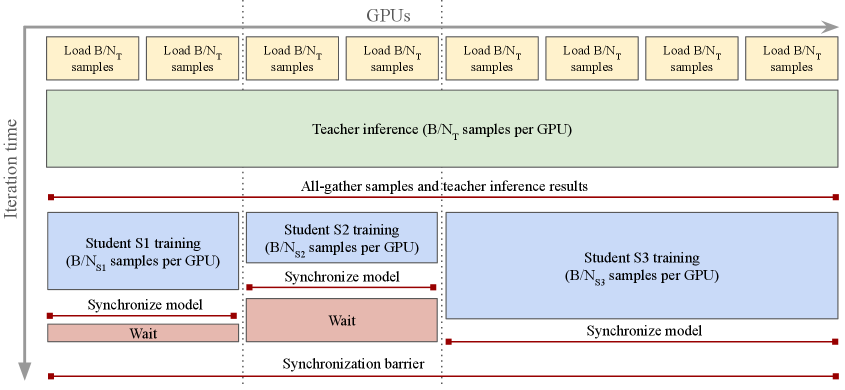

<figcaption>図12: マルチスチューデント蒸留手順。このダイアグラムでは、3 つの student を並列で蒸留する: まずすべての T ノード間で teacher 推論を共有して計算を節約し、すべての GPU に入力と結果を集める。次に、より小さなグループが student 訓練を実行する。同期バリアでの待機時間を最小化するため、訓練ステップがすべての student Si で同じ持続時間になるようにこれらのグループのサイズを調整する。</figcaption>
</figure>

### 5.3 Aligning DINOv3 with Text（DINOv3 のテキスト整合）

オープン語彙画像-テキストアラインメントは、柔軟でスケーラブルなマルチモーダル理解を可能にする潜在能力のおかげで、研究コミュニティから有意な関心と熱意を受けてきた。

膨大な研究は、もともと画像とテキスト表現の間のグローバルアラインメントのみを学習した CLIP [144] の品質を改善することに焦点を当ててきた。

CLIP は印象的なゼロショット能力を実証したが、グローバル特徴量への焦点は、きめ細かい局所化された対応を捉える能力を制限する。

最近の研究 [234] は、事前学習された自己教師あり視覚バックボーンで効果的な画像-テキストアラインメントを達成できることを示している。

これは、これらの強力なモデルをマルチモーダル設定で活用することを可能にし、グローバルな意味論を超えてより豊かで正確なテキスト-画像関連付けを促進し、視覚エンコーディングが既に学習されているため、計算コストを削減する。

[100] で以前に提案された訓練戦略を採用することで、テキストエンコーダを DINOv3 モデルとアラインメントする。

このアプローチは、ビジョンエンコーダを凍結したまま、対比目的で画像をキャプションにマッチさせるためにテキスト表現をゼロから訓練する LiT 訓練パラダイム [234] に従う。

ビジョン側に何らかの柔軟性を持たせるため、凍結された視覚バックボーンの上に 2 つのトランスフォーマー層が導入される。

この手法の重要な拡張は、テキスト埋め込みとマッチングする前の出力 CLS トークンとの mean-pooled パッチ埋め込みの連結である。

これにより、グローバル特徴量と局所視覚特徴量の両方をテキストにアラインメントでき、追加のヒューリスティクスやトリックを必要とせずに dense 予測タスクの性能を改善する。

さらに、一貫性と比較可能性を確保するため、[100] で確立されたものと同じデータキュレーションプロトコルを使用する。

---

## 6 Results（結果）

本節では、われわれのフラッグシップ DINOv3 7B モデルを様々なコンピュータビジョンタスクで評価する。

実験を通じて、特に指定されない限り、*DINOv3 を凍結したまま*、その表現のみを使用する。

DINOv3 によって、強い性能を得るためにファインチューニングが必要でないことを実証する。

本節は次のように構成される。

まず、軽量評価プロトコルを使用して DINOv3 の dense（§6.1）と global（§6.2）画像表現の品質を探り、利用可能な最強の視覚エンコーダと比較する。

DINOv3 が頑健で汎用的なグローバル画像表現を提供しつつ、卓越した dense feature を学習することを示す。

次に、より複雑なコンピュータビジョンシステムを開発するための基盤として DINOv3 を考える（§6.3）。

DINOv3 の上に少しの努力で、物体検出・セマンティックセグメンテーション・3D ビュー推定・相対単眼深度推定のような多様なタスクで最先端と競合または超える結果を達成できることを示す。

### 6.1 DINOv3 provides Exceptional Dense Features（DINOv3 は卓越した dense feature を提供する）

まず、多様な軽量評価セットを使用して DINOv3 の dense 表現の生の品質を調査する。

すべての場合で、最終層の凍結パッチ特徴量を利用し、(1) 定性的可視化（§6.1.1）、(2) dense 線形プローブ（§6.1.2: セグメンテーション、深度推定）、(3) 非パラメトリックアプローチ（§6.1.3: 3D 対応推定、§6.1.4: 物体発見、§6.1.5: トラッキング）、(4) 軽量 attentive プロービング（§6.1.6: 動画分類）を使用してそれらを評価する。

### Baselines（ベースライン）

DINOv3 の dense feature を、弱教師ありおよび自己教師ありの両方の、利用可能な最強の公開画像エンコーダのものと比較する。

CLIP スタイル画像-テキスト対比学習を使用する弱教師ありエンコーダ Perception Encoder（PE）Core [18] と SigLIP 2 [185] を考える。

最強の自己教師あり手法とも比較する: register を持つ DINOv3 の前身 DINOv2 [134] [46]、DINO のスケーリングの最近の努力 Web-DINO [62]、最高のオープンデータ SSL モデル Franca [192]。

最後に、DINOv2 から蒸留された凝集モデル AM-RADIOv2.5 [86]、CLIP [144]、DFN [63]、Segment Anything（SAM）[106]、および SAM 2 [149] を PEcore に蒸留する PEspatial と比較する。

各ベースラインについて、利用可能な最強のモデルの性能を報告し、表でアーキテクチャを指定する。

#### 6.1.1 Qualitative Analysis（定性的分析）

まず DINOv3 の dense feature map を定性的に分析する。

このため、主成分分析（PCA）を使用して dense 特徴量空間を 3 次元に射影し、結果として得られる 3D 空間を RGB にマッピングする。

PCA の符号曖昧性（8 つの派生）と主成分と色の任意のマッピング（6 つの派生）のため、すべての組み合わせを探索し、視覚的に最も魅力的なものを報告する。

結果として得られる可視化を図 13 に示す。

他のビジョンバックボーンと比較して、DINOv3 の特徴量はよりシャープで、ノイズがはるかに少なく、優れた意味的一貫性を示すことが見て取れる。

<figure>

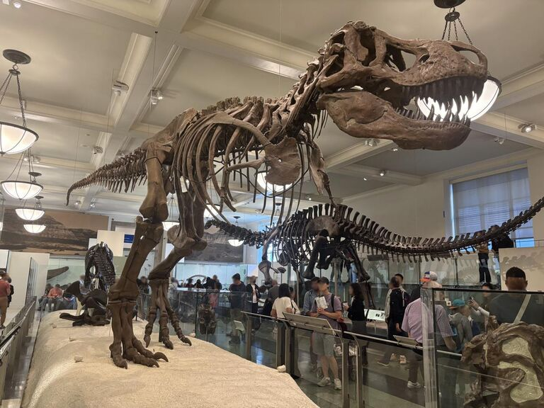

<figcaption>図13: 様々なビジョンバックボーンとの DINOv3 dense feature の PCA 可視化比較。DINOv3 の特徴量はよりシャープでノイズが少なく、優れた意味的一貫性を示す。</figcaption>
</figure>

#### 6.1.2 Dense Linear Probing（dense 線形プローブ）

dense feature の上で 2 つのタスクの線形プローブを行う: セマンティックセグメンテーションと単眼深度推定。

どちらの場合も、DINOv3 の凍結パッチ出力の上で線形変換を訓練する。

セマンティックセグメンテーションについては、ADE20k [239]、Cityscapes [44]、PASCAL VOC 2012 [60] データセットで評価し、mean intersection-over-union（mIoU）指標を報告する。

深度推定については、NYUv2 [163] と KITTI [72] データセットを使用し、root mean squared error（RMSE）を報告する。

**表3**: 凍結バックボーンでのセマンティックセグメンテーションと単眼深度推定での dense 線形プローブ結果。セグメンテーションについては、すべてのモデルは 1024 パッチトークンに適応された入力解像度で評価される（すなわち、パッチサイズ 14 では $448 \times 448$、パッチサイズ 16 では $512 \times 512$）。

| | | | Segmentation | | | Depth | |
| Method | ViT | | ADE20k | Citysc. | VOC | NYUv2 ↓ | KITTI ↓ |
|---|---|---|---|---|---|---|---|
| *Agglomerative backbones* | | | | | | | |
| AM-RADIOv2.5 | g/14 | | 53.0 | 78.4 | 85.4 | 0.340 | 2.918 |
| PEspatial | G/14 | | 49.3 | 73.2 | 82.7 | 0.362 | 3.082 |
| *Weakly-supervised backbones* | | | | | | | |
| SigLIP 2 | g/16 | | 42.7 | 64.8 | 72.7 | 0.494 | 3.273 |
| PEcore | G/14 | | 38.9 | 61.1 | 69.2 | 0.590 | 4.119 |
| *Self-supervised backbones* | | | | | | | |
| Franca | g/14 | | 46.3 | 68.7 | 82.9 | 0.445 | 3.140 |
| DINOv2 | g/14 | | 49.5 | 75.6 | 83.1 | 0.372 | 2.624 |
| Web-DINO | 7B/14 | | 42.7 | 68.3 | 76.1 | 0.466 | 3.158 |
| **DINOv3** | 7B/16 | | **55.9** | **81.1** | **86.6** | **0.309** | **2.346** |

### Results

セグメンテーション結果は、われわれの dense feature の優れた品質を実証する。

一般的な ADE20k データセットで、DINOv3 は自己教師ありベースラインを 6 mIoU ポイント以上、弱教師ありベースラインを 13 ポイント以上上回る。

さらに、DINOv3 は PEspatial を 6 ポイント以上、AM-RADIOv2.5 を約 3 ポイント上回る。

これらは両方とも重く教師ありのセグメンテーションモデル SAM [106] から蒸留された強いベースラインであるため、これらの結果は注目に値する。

類似の結果が自動運転ベンチマーク Cityscapes でも観察され、DINOv3 は最良の mIoU $81.1$ を達成し、AM-RADIOv2.5 を 2.5 ポイント、他のすべてのバックボーンを少なくとも 5.5 ポイント上回る。

単眼深度推定でも、DINOv3 はすべての他のモデルを有意なマージンで上回る: 弱教師ありモデル PEcore と SigLIP 2 は依然として遅れ、DINOv2 と SAM から派生したより高度なモデルが最も近い競合相手である。

興味深いことに、PEspatial と AM-RADIO は NYU で強い性能を示すが、KITTI ではそれらの性能は DINOv2 のものより低い。

そこでも、DINOv3 は 0.278 RMSE で前身 DINOv2 を上回る。

両方の評価セットは、DINOv3 の dense feature の卓越した表現力を示し、図 13 からの視覚結果を反映する。

線形予測器のみで、DINOv3 はオブジェクトカテゴリとマスク、およびシーンの相対深度のような物理測定の頑健な予測を可能にする。

これらの結果は、特徴量が視覚的にシャープで適切に局所化されているだけでなく、基礎となる観測の多くの重要な特性を線形分離可能な方法で表現することを示す。

最後に、ADE20k での線形分類器で得られる絶対性能（55.9 mIoU）自体が印象的である。なぜなら、このデータセットの絶対的最先端（63.0 mIoU）からそう遠くないからである。

#### 6.1.3 3D Correspondence Estimation（3D 対応推定）

3D 世界の理解はコンピュータビジョンの重要な目的であり続けてきた。

画像基盤モデルは最近、*3D 認識特徴量*を提供することで 3D 理解の研究を促進している。

本節では、Probe3D [7] で定義されたプロトコルに従い、DINOv3 の*マルチビュー一貫性* ― つまり、オブジェクトの異なるビューにおける同じキーポイントのパッチ特徴量が類似しているかどうか ― を評価する。

*幾何学的*対応推定と*意味的*対応推定を区別する。

前者は*同じオブジェクトインスタンス*のキーポイントをマッチングすることを指し、後者は*同じオブジェクトクラスの異なるインスタンス*のキーポイントをマッチングすることを指す。

幾何学的対応を NAVI データセット [95] で評価し、意味的対応を SPair データセット [129] で評価し、両方の場合とも対応再現率で性能を測定する。

実験詳細は §D.3 を参照されたい。

**表4**: dense 表現の 3D 一貫性評価。Probe3D [7] の評価プロトコルに従って、ビューをまたいだ 3D キーポイント対応を推定する。性能を測定するため、対応再現率、すなわち指定された距離内に入る対応の百分率を報告する。

| | | | Geometric | | Semantic |
| Method | ViT | | NAVI | | SPair |
|---|---|---|---|---|---|
| *Agglomerative backbones* | | | | | |
| AM-RADIOv2.5 | g/14 | | 59.4 | | 56.8 |
| PEspatial | G/14 | | 53.8 | | 49.6 |
| *Weakly-supervised backbones* | | | | | |
| SigLIP 2 | g/16 | | 49.4 | | 42.6 |
| PEcore | G/14 | | 39.9 | | 23.1 |
| *Self-supervised backbones* | | | | | |
| Franca | g/14 | | 54.6 | | 51.0 |
| DINOv2 | g/14 | | 60.1 | | 56.1 |
| Web-DINO | 7B/14 | | 55.0 | | 32.2 |
| **DINOv3** | 7B/16 | | **64.4** | | **58.7** |

### Results

幾何学的対応については、DINOv3 はすべての他のモデルを上回り、2 番目に良いモデル（DINOv2）を 4.3% 再現率改善する。

他の SSL スケーリング努力（Franca と WebSSL）は DINOv2 に遅れを取り、これが依然として強いベースラインであることを示す。

弱教師ありモデル（PEcore と SigLIP 2）はこのタスクで良くなく、3D 認識の欠如を示す。

SAM 蒸留のモデルでは、AM-RADIO はほぼ DINOv2 の性能に達するが、PEspatial は依然として遅れ（$-11.6$% 再現率）、Franca にも遅れる（$-0.8$% 再現率）。

これは、自己教師あり学習がこのタスクで強い性能のための重要な構成要素であることを示唆する。

意味的対応については、同じ結論が当てはまる。

DINOv3 は最良に性能し、前身（$+2.6$% 再現率）と AM-RADIO（$+1.9$% 再現率）の両方を上回る。

全体として、これらの印象的なキーポイントマッチングの性能は、他の 3D 重視応用での DINOv3 の下流使用のための非常に有望な信号である。

#### 6.1.4 Unsupervised Object Discovery（教師なし物体発見）

強力な自己教師あり特徴量は、注釈*なし*で画像内のオブジェクトインスタンスを発見することを促進する [195, 164, 161, 206, 165]。

異なるビジョンエンコーダのこの能力を、画像内のオブジェクトのクラス非依存セグメンテーションを必要とする教師なし物体発見のタスクを介してテストする [156, 187, 41, 193]。

特に、様々なバックボーンで強い性能を示している非パラメトリックなグラフベース TokenCut アルゴリズム [206] を使用する。

3 つの広く使用されるデータセット（VOC 2007、VOC 2012 [61]、COCO-20k [117, 194]）で実行する。

[164] で定義された評価プロトコルに従い、CorLoc 指標を報告する。

異なる特徴量分布を持つバックボーンを適切に比較するため、TokenCut の主ハイパーパラメータ、すなわちパーティショニングに使用されるパッチグラフを構築する際に適用されるコサイン類似度閾値の探索を行う。

もともと、最良の物体発見結果は、最後の注意層の key を使用して DINO [28] で得られた。

しかしながら、この手作りの選択は他のバックボーンに一貫して汎化しない。

簡略のため、すべてのモデルで常に出力特徴量を採用する。

### Results

元の DINO はこのタスクに非常に高いバーを設定した。

興味深いことに、DINOv2 はピクセル単位の dense タスクで非常に強い性能を示しているが、物体発見では失敗する。

これは、dense feature に存在するアーティファクト（図 13 参照）に部分的に起因しうる。

DINOv3 は、そのクリーンで精密な出力 feature map で、前身の両方を上回り、VOC 2007 で $5.9$ CorLoc 改善し、他のすべてのバックボーン（自己・弱教師ありまたは凝集）を上回る。

この評価は、DINOv3 の dense feature が意味的に強く、適切に局所化されていることを確認する。

これは特に注釈が高価または利用不可能であり、関連クラスのセットが事前に定義されたサブセットに限定されないシナリオで、よりクラス非依存物体検出アプローチへの道を開くと信じる。

<figure>

<figcaption>図14: 教師なし物体発見の例。DINOv3 のクリーンな dense feature により、TokenCut が前景物体を正確に分離できる。</figcaption>
</figure>

#### 6.1.5 Video Segmentation Tracking（動画セグメンテーショントラッキング）

静止画像を超えて、視覚表現の重要な特性は、それらの*時間的一貫性*、すなわち特徴量が時間を通じて安定した方法で進化するかどうかである。

この特性をテストするため、動画セグメンテーショントラッキングのタスクで DINOv3 を評価する: 動画の最初のフレームに ground-truth インスタンスセグメンテーションマスクが与えられたとき、目的はこれらのマスクを後続フレームに伝播することである。

DAVIS 2017 [142]、YouTube-VOS [219]、MOSE [52] データセットを使用する。

リージョン類似度（$\mathcal{J}$）と輪郭精度（$\mathcal{F}$）を組み合わせた標準の $\mathcal{J}\&\mathcal{F}$-mean 指標 [139] を使用して性能を評価する。

[94] に従い、フレーム間のパッチ特徴量の類似度を考慮する非パラメトリックラベル伝播アルゴリズムを使用する。

3 つの入力解像度で評価し、パッチサイズ 14/16 のモデルに対して短辺長 420/480（S）、840/960（M）、1260/1440（L）ピクセルを使用する（パッチトークン数を一致させる）。

$\mathcal{J}\&\mathcal{F}$ スコアは常に動画のネイティブ解像度で計算される。

より詳細な実験設定については §D.5 を参照されたい。

**表5**: 動画セグメンテーショントラッキング評価。複数解像度で DAVIS、YouTube-VOS、MOSE 上の $\mathcal{J}\&\mathcal{F}$-mean を報告する。

| | | DAVIS | | | YouTube-VOS | | | MOSE | | |
| Method | ViT | S | M | L | S | M | L | S | M | L |
|---|---|---|---|---|---|---|---|---|---|---|
| *Agglomerative backbones* | | | | | | | | | | |
| AM-RADIOv2.5 | g/14 | 66.5 | 77.3 | 81.4 | 70.1 | 78.1 | 79.2 | 44.0 | 52.6 | 54.3 |
| PEspatial | G/14 | 68.4 | 74.5 | 70.5 | 68.5 | 67.5 | 55.6 | 39.3 | 40.2 | 34.0 |
| *Weakly-supervised backbones* | | | | | | | | | | |
| SigLIP 2 | g/16 | 56.1 | 62.3 | 62.9 | 52.0 | 57.3 | 55.1 | 28.0 | 30.3 | 29.2 |
| PEcore | G/14 | 48.2 | 53.1 | 49.8 | 34.7 | 33.0 | 25.3 | 17.8 | 19.0 | 15.4 |
| *Self-supervised backbones* | | | | | | | | | | |
| Franca | g/14 | 61.8 | 66.9 | 66.5 | 67.3 | 70.5 | 67.9 | 40.3 | 42.6 | 41.9 |
| DINOv2 | g/14 | 63.9 | 73.6 | 76.6 | 65.6 | 73.5 | 74.6 | 40.4 | 47.6 | 48.5 |
| Web-DINO | 7B/14 | 57.2 | 65.8 | 69.5 | 43.9 | 49.6 | 50.9 | 24.9 | 29.9 | 31.1 |
| **DINOv3** | 7B/16 | **71.1** | **79.7** | **83.3** | **74.1** | **80.2** | **80.7** | **46.0** | **53.9** | **55.6** |

### Results

すべての以前の結果と一致して、弱教師ありバックボーンは説得力のある性能を提供しない。

動画モデル SAMv2 から蒸留された PEspatial は満足のいく性能を提供し、より小さな解像度では DINOv2 を上回るが、より大きな解像度では不足する。

解像度をまたいで、DINOv3 はすべての競合相手を上回り、DAVIS-L で驚異的な $83.3$ $\mathcal{J}\&\mathcal{F}$、DINOv2 を $6.7$ ポイント上回る。

さらに、解像度の関数としての性能は健全な傾向に従い、われわれのモデルがより多くの入力ピクセルを使用して精密で高解像度の feature map を出力できることを確認する（図 3 と 4 参照）。

対照的に、より高い解像度での性能は SigLIP 2 と PEcore でほぼ平坦のままで、PEspatial では劣化する。

興味深いことに、われわれの画像モデルは、動画でのチューニングなしで、時間内のオブジェクトを適切にトラックできる（図 15 参照）。

これにより、強い動画モデルを構築するための、動画を埋め込む候補として優れたものとなる。

<figure>

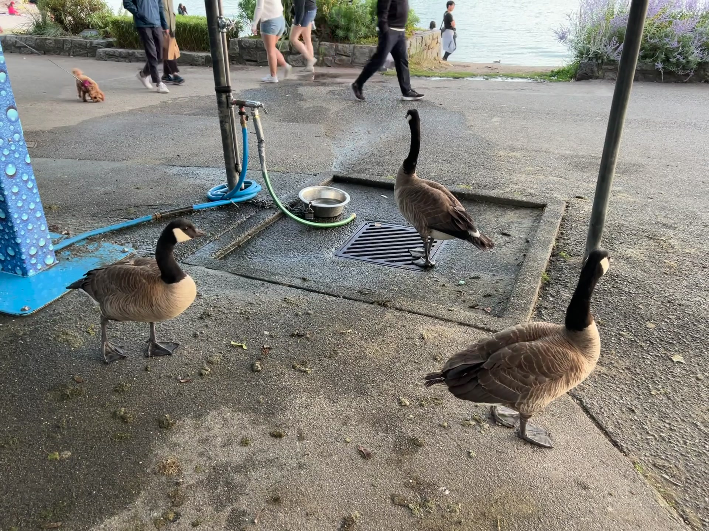

<figcaption>図15: 初期フレーム。DINOv3 を使った動画オブジェクトトラッキングの定性的例。</figcaption>
</figure>

#### 6.1.6 Video Classification（動画分類）

前の結果は DINOv3 表現の低レベルの時間的一貫性を示し、時間内のオブジェクトを正確にトラックできることを示した。

これを超えて、本節では高レベル動画分類のための dense feature の適性を評価する。

V-JEPA 2 [4] のセットアップに類似して、各フレームから抽出されたパッチ特徴量の上に *attentive probe* ― 浅い 4 層トランスフォーマーベース分類器 ― を訓練する。

特徴量はフレームごとに独立に抽出されるため、これにより時間的と空間的次元にわたる推論が可能になる。

評価中、動画ごとに単一のクリップを取るか、動画ごとに 3 つの空間と 2 つの時間 crop の予測を平均することによりテスト時拡張（TTA）を使用する。

実験詳細については §D.6 を参照されたい。

3 つのデータセット（UCF101 [169]、Something-Something V2 [78]、Kinetics-400 [102]）でこの評価を実行し、top-1 精度を報告する。

追加のベースラインとして、動画理解のための最先端 SSL モデル V-JEPA v2 の性能を報告する。

**表6**: attentive probe を使用した動画分類評価。

| | | UCF101 | | SSv2 | | K400 | |
| Method | ViT | Single | TTA | Single | TTA | Single | TTA |
|---|---|---|---|---|---|---|---|
| *Agglomerative backbones* | | | | | | | |
| AM-RADIOv2.5 | g/14 | 92.8 | 92.5 | 69.1 | 70.0 | 84.8 | 85.2 |
| PEspatial | G/14 | 92.7 | 92.8 | 66.4 | 68.4 | 83.5 | 84.8 |
| *Weakly-supervised backbones* | | | | | | | |
| SigLIP 2 | g/16 | 93.6 | 94.2 | 68.8 | 70.2 | 86.9 | 87.7 |
| PEcore | G/14 | 93.1 | 93.3 | 69.0 | 70.4 | 87.9 | 88.8 |
| *Self-supervised backbones* | | | | | | | |
| DINOv2 | g/14 | 93.5 | 93.8 | 67.4 | 68.4 | 84.4 | 85.6 |
| V-JEPA 2 | g/16 | **94.0** | 93.8 | **73.8** | **75.4** | 83.3 | 84.3 |
| Web-DINO | 7B/14 | 93.9 | 94.1 | 67.3 | 68.1 | 86.8 | 87.2 |
| **DINOv3** | 7B/16 | 93.5 | 93.5 | 70.1 | 70.8 | 87.8 | 88.2 |

### Results

前の実験の結論と一致して、DINOv3 は強い動画特徴量の抽出に成功裏に使用できることを発見する。

この評価は self-attention のいくつかの層の訓練を伴うため、モデル間の違いは見えにくい。

しかしながら、DINOv3 は PEcore と SigLIP 2 と同じ範囲に位置し、データセットをまたいで他のモデル（DINOv2、AM-RADIO）を明確に上回る。

UCF101 と K400 は外観に焦点を当てており、強いカテゴリレベルのオブジェクト理解が性能のほとんどを与える。

一方、SSv2 はモーションのより良い理解を必要とする ― 専用動画モデル V-JEPA v2 がこのデータセットで輝く。

興味深いことに、DINOv3 と弱教師ありモデルの間のギャップはこのデータセットでわずかに大きい。

これは、DINOv3 が動画タスクに適していることを再び確認する。

### 6.2 DINOv3 has Robust and Versatile Global Image Descriptors（DINOv3 は頑健で汎用的なグローバル画像記述子を持つ）

本節では、DINOv3 がグローバル画像統計を捉える能力を評価する。

このため、線形プローブを使用した古典的分類ベンチマーク（§6.2.1）とインスタンス検索ベンチマーク（§6.2.2）を考える。

再び、利用可能な最強の公開画像エンコーダと比較する。

前節からのモデルに加えて、共同自己回帰ピクセルとテキスト予測を使用して訓練された AIMv2 [68] と、巨大な EVA-CLIP-18B [174] の 2 つの弱教師ありモデルを評価する。

#### 6.2.1 Image Classification with Linear Probing（線形プローブによる画像分類）

DINOv3 の出力 CLS トークンの上に線形分類器を訓練して、分類ベンチマークでモデルを評価する。

ImageNet1k [49] データセットとその派生を考えてアウトオブディストリビューション頑健性を評価し、DINOv3 の細粒度クラスを区別する能力を理解するために異なるドメインからのデータセットスイートを考える。

評価詳細については §D.7 を参照されたい。

### Domain Generalization from ImageNet（ImageNet からのドメイン汎化）

この実験では、ImageNet-*train*で訓練し、ImageNet-*val*をハイパーパラメータを選択するための*検証セット*として使用し、見つかった最良の分類器を異なるテストデータセットに転移する: ImageNet-V2 [150] と ReaL [13] は ImageNet 用の画像とラベルの代替セットで、ImageNet 検証セットでのオーバーフィッティングをテストするために使用される; Rendition [91] と Sketch [204] は ImageNet クラスのスタイル化された人工バージョンを示す; Adversarial [92] と ObjectNet [9] は故意に選ばれた困難な例を含む; Corruptions [90] は一般的な画像破損に対する頑健性を測定する。

参考のため、巨大な JFT データセット（3B-4B 画像）で教師あり分類を使用して訓練された ViT の [48] からの線形プローブ結果もリストする。

これらの結果はわずかに異なる評価プロトコルに従っており、われわれの結果と直接比較できないことに注意されたい。

DINOv3 はすべての以前の自己教師ありバックボーンを有意に上回り、以前の最強 SSL モデル DINOv2 に対して ImageNet-R で +10%、-Sketch で +6%、ObjectNet で +13% の利得を得る。

最強の弱教師ありモデル SigLIP 2 と PE は、ImageNet-A と ObjectNet のような困難な OOD タスクで、最強の教師ありモデル（ViT-22B）よりも今は良いことに注意する。

DINOv3 は ImageNet-R と -Sketch で同等の結果に達し、困難なタスク ImageNet-A と ObjectNet では PE のすぐ後ろで、SigLIPv2 を上回る。

ImageNet では、検証スコアが SigLIPv2 と PE より 0.7-0.9 ポイント下だが、「よりクリーンな」テストセット -V2 と -ReaL での性能は事実上同じである。

注目すべきは、DINOv3 が破損に対する最良の頑健性（ImageNet-C）を達成することである。

総じて、*これは SSL モデルが画像分類で弱教師ありと教師ありモデルに匹敵する結果に到達した初めてのときである* ― これは（弱）教師あり訓練アプローチの強い分野であった。

これは、ViT-22B、SigLIP 2、PE のようなモデルが巨大な人間注釈データセットを使用して訓練されることを考えると、注目すべき結果である。

対照的に、DINOv3 は純粋に画像から学習し、将来そのアプローチをさらにスケール／改善することを実現可能にする。

**表7**: 凍結バックボーンで ImageNet1k 上で訓練された線形プローブの分類精度。

| | | | ImageNet | | | Rendition | | | Hard | | |
| Method | ViT | | Val | V2 | ReaL | R | S | | A | C ↓ | Obj. |
|---|---|---|---|---|---|---|---|---|---|---|---|
| *Supervised backbones* | | | | | | | | | | | |
| [233] * | G/14 | | 89.0 | 81.3 | 90.6 | 91.7 | — | | 78.8 | — | 69.6 |
| [34] * | e/14 | | 89.3 | 82.5 | 90.7 | 94.3 | — | | 81.6 | — | 71.5 |
| [48] * | 22B/14 | | 89.5 | 83.2 | 90.9 | 94.3 | — | | 83.8 | — | 74.3 |
| *Agglomerative backbones* | | | | | | | | | | | |
| AM-RADIOv2.5 | g/14 | | 88.0 | 80.2 | 90.3 | 83.8 | 67.1 | | 81.3 | 27.1 | 68.4 |
| *Weakly-supervised backbones* | | | | | | | | | | | |
| PEcore | G/14 | | 89.3 | 81.6 | 90.4 | 92.2 | 71.9 | | **89.0** | 22.7 | **80.2** |
| SigLIP 2 | g/16 | | 89.1 | 81.6 | 90.5 | 92.2 | 71.8 | | 84.6 | 30.0 | 78.6 |
| AIMv2 | 3B/14 | | 87.9 | 79.5 | 89.7 | 82.3 | 67.1 | | 74.5 | 29.5 | 69.0 |
| EVA-CLIP | 18B/14 | | 87.9 | 79.3 | 89.5 | 85.2 | 64.0 | | 81.6 | 33.0 | 71.9 |
| *Self-supervised backbones* | | | | | | | | | | | |
| Web-DINO | 7B/14 | | 85.9 | 77.1 | 88.6 | 75.6 | 64.0 | | 71.6 | 31.2 | 69.7 |
| Franca | g/14 | | 84.8 | 75.3 | 89.2 | 67.6 | 49.5 | | 56.5 | 40.0 | 54.5 |
| DINOv2 | g/14 | | 87.3 | 79.5 | 89.9 | 81.1 | 65.4 | | 81.7 | 24.1 | 66.4 |
| **DINOv3** | 7B/16 | | 88.4 | 81.4 | 90.4 | 91.1 | 71.3 | | 86.9 | **19.6** | 79.0 |

### Finegrained Classification（細粒度分類）

**表8**: 細粒度分類ベンチマーク。Fine-S は 12 のデータセット平均、詳細は表 22 参照。

| Method | ViT | Fine-S | Places | iNat18 | iNat21 |
|---|---|---|---|---|---|
| AM-RADIOv2.5 | g/14 | 93.9 | 70.2 | 79.0 | 83.7 |
| SigLIP 2 | g/16 | 93.7 | 70.5 | 80.7 | 82.7 |
| PEcore | G/14 | **94.5** | **71.3** | **86.6** | 87.0 |
| AIMv2 | 3B/14 | 92.9 | 70.7 | 80.8 | 83.2 |
| EVA CLIP | 18B/14 | 92.9 | 71.1 | 80.7 | 83.5 |
| Franca | g/14 | 87.7 | 64.6 | 61.4 | 70.6 |
| DINOv2 | g/14 | 92.6 | 68.2 | 80.7 | 86.1 |
| Web-DINO | 7B/14 | 90.2 | 69.6 | 65.3 | 74.1 |
| **DINOv3** | 7B/16 | 93.0 | 70.0 | 85.6 | **89.8** |

**表9**: インスタンス認識ベンチマーク。詳細指標は表 23 参照。

| | Oxford-H | Paris-H | Met (GAP) | AmsterTime |
|---|---|---|---|---|
| AM-RADIOv2.5 | 47.5 | 85.7 | 30.5 | 23.1 |
| PEspatial | 25.1 | 60.9 | 13.9 | 15.5 |
| SigLIP 2 | 32.7 | 68.9 | 10.6 | 23.1 |
| PEcore | 28.8 | 71.4 | 29.5 | 14.6 |
| AIMv2 | 27.1 | 65.6 | 0.5 | 18.9 |
| EVA-CLIP | 14.3 | 51.6 | 27.2 | 21.1 |
| DINOv2 | 58.2 | 84.6 | 44.6 | 48.9 |
| Web-DINO | 31.2 | 80.3 | 35.2 | 30.6 |
| **DINOv3** | **60.7** | **87.1** | **55.4** | **56.5** |

細粒度分類のためのいくつかのデータセットで線形プローブを訓練する場合の DINOv3 の性能も測定する。

特に、シーン認識のための Places205 [238]、植物および動物種の詳細認識のための iNaturalist 2018 [188] と iNaturalist 2021 [189] の 3 つの大型データセットでの精度、およびシーン・オブジェクト・テクスチャをカバーする 12 のより小さなデータセットの平均（[134] と同様、ここでは Fine-S と命名）を報告する。

これらのデータセットの個別結果については表 22 も参照されたい。

DINOv3 が再びすべての以前の SSL 手法を上回ることを発見する。

弱教師あり手法と比較しても競合する結果を示し、多様な細粒度分類タスクをまたいだ頑健性と汎化能力を示す。

注目すべきは、DINOv3 が難しい iNaturalist21 データセットで 89.8% で最高精度に達し、最良の弱教師ありモデル PEcore の 87.0% を上回ることである。

#### 6.2.2 Instance Recognition（インスタンス認識）

モデルのインスタンスレベル認識能力を評価するため、非パラメトリック検索アプローチを採用した。

ここで、データベース画像は出力 CLS トークンを使用して与えられたクエリ画像とのコサイン類似度でランク付けされる。

いくつかのデータセットで性能をベンチマークする: ランドマーク認識のための Oxford と Paris データセット [143]、メトロポリタン美術館の芸術作品を特徴とする Met データセット [227]、アムステルダムの歴史的アーカイブ画像にマッチした現代のストリートビュー画像で構成される AmsterTime [224]。

検索の有効性は、Oxford、Paris、AmsterTime には mean average precision、Met には global average precision を使用して定量化される。

より多くの評価詳細については §D.8 を参照されたい。

### Results

評価されたすべてのベンチマークで、DINOv3 は大きなマージンで最強の性能を達成する、例えば 2 番目に良いモデル DINOv2 に対して Met で +10.8 ポイント、AmsterTime で +7.6 ポイント改善する。

このベンチマークでは、DINOv2 特徴量から蒸留された AM-RADIO を除いて、弱教師ありモデルが DINOv3 に大きく遅れている。

これらの発見は、伝統的なランドマークデータセットと、芸術や歴史的画像検索のようなより困難なドメインの両方にまたがる、インスタンスレベル検索タスクのための DINOv3 の頑健性と汎用性を強調する。

### 6.3 DINOv3 is a Foundation for Complex Computer Vision Systems（DINOv3 は複雑なコンピュータビジョンシステムの基盤）

前の 2 つの節は、dense と global の両方のタスクで DINOv3 の品質に対する確固たる信号を既に提供した。

しかしながら、これらの結果は「モデルプロービング」実験プロトコルの下で、特徴量の品質を評価するために軽量線形アダプタや非パラメトリックアルゴリズムを使用して得られた。

そのような単純な評価は、複雑な実験プロトコルから交絡因子を除去することを可能にしたが、より大きなコンピュータビジョンシステムの基盤的構成要素としての DINOv3 の完全な潜在能力を評価するには不十分である。

したがって、本節では、軽量プロトコルから離れ、代わりにより複雑な下流デコーダを訓練し、より強力でタスク固有のベースラインを考える。

特に、DINOv3 を (1) Plain-DETR による物体検出（§6.3.1）、(2) Mask2Former によるセマンティックセグメンテーション（§6.3.2）、(3) Depth Anything による単眼深度推定（§6.3.3）、(4) Visual Geometry Grounded Transformer による 3D 理解（§6.3.4）の基盤として使用する。

これらのタスクは、DINOv3 で可能なことの探求としてのみ意図されている。

それでも、DINOv3 の上に構築することが、少しの努力で競合または最先端の結果を解放することを発見する。

#### 6.3.1 Object Detection（物体検出）

最初のタスクとして、コンピュータビジョンの長年の問題である物体検出に取り組む。

画像が与えられたとき、目的は事前に定義されたカテゴリのすべてのオブジェクトインスタンスのためのバウンディングボックスを提供することである。

このタスクは、ボックスがオブジェクトの境界に一致し、正しいカテゴリに対応する必要があるため、精密な局所化と良い認識の両方を必要とする。

COCO [117] のような標準ベンチマークでの性能はほとんど飽和しているが、*凍結された*バックボーンでこのタスクに取り組むことを提案し、上に小さなデコーダのみを訓練する。

### Datasets and Metrics（データセットと指標）

COCO データセット [117] で DINOv3 の物体検出能力を評価し、COCO-VAL2017 分割で結果を報告する。

加えて、COCO-O 評価データセット [126] でアウトオブディストリビューション性能を評価する。

このデータセットは同じクラスを含むが、6 つの分布シフト設定の下で入力画像を提供する。

両方のデータセットで、IoU 閾値 $[0.5:0.05:0.95]$ での mean Average Precision（mAP）を報告する。

COCO-O では、effective robustness（ER）も追加で報告する。

COCO は 118k 訓練画像のみで構成される小さなデータセットなので、デコーダの事前訓練のためにより大きな Objects365 データセット [162] を活用する、これは一般的な実践である。

### Implementation（実装）

Plain-DETR [119] の上に構築するが、次の修正を行う: トランスフォーマーエンコーダをバックボーンに融合せず、それを別個のモジュールとして保つ、元の DETR [24] に類似している。これにより、訓練と推論中に DINOv3 バックボーンを完全に凍結したままにできる。

われわれの知る限り、これは*凍結バックボーンを使用する初めての競争力のある検出モデル*となる。

解像度 1536 で 22 エポック Objects365 上で Plain-DETR 検出器を訓練し、次に解像度 2048 で 1 エポック、続いて解像度 2048 で COCO 上で 12 エポック。

推論時、解像度 2048 で実行する。

オプションで、複数の解像度（1536 から 2880 まで）で画像を forward することによりテスト時拡張（TTA）も適用する。

完全な実験詳細については §D.9 を参照されたい。

### Results

われわれのシステムを 4 つのモデルと比較する: Cascade 検出器を持つ EVA-02 [65]、Co-DETR を持つ EVA-02 [243]、DINO を持つ InternImage-G [202]、DETA を持つ PEspatial [18]。

凍結された DINOv3 バックボーンの上で訓練された軽量検出器（100M パラメータ）が最先端性能に達することを発見する。

COCO-O ではギャップが顕著で、検出モデルが DINOv3 の頑健性を効果的に活用できることを示す。

興味深いことに、われわれのモデルは、最小の比較ポイントが依然として 300M 以上の訓練可能パラメータを使用するのに対して、はるかに少ない訓練済みパラメータですべての以前のモデルを上回る。

バックボーンを特化させずにこのような強い性能を達成することは、様々な実用的応用のための実現要因であると主張する: 単一のバックボーン forward が複数のタスクをサポートする特徴量を提供でき、計算要件を削減する。

**表10**: 物体検出における最先端システムとの比較。*凍結された*DINOv3 バックボーンの上で検出アダプタを訓練する。COCO と COCO-O データセットの検証セットで結果を示し、IoU 閾値にわたる mAP と effective robustness（ER）を報告する。

| | | | Parameters | | | COCO | | COCO-O | |
| Model | Detector | FT | Encoder | Decoder | Trainable | Simple | TTA | mAP | ER |
|---|---|---|---|---|---|---|---|---|---|
| EVA-02 | Cascade | 🔥 | 300M | — | 300M | 64.1 | — | 63.6 | 34.7 |
| InternImage-G | DINO | 🔥 | 6B | — | 6B | 65.1 | 65.3 | — | — |
| EVA-02 | Co-DETR | 🔥 | 300M | — | 300M | 65.4 | 65.9 | 63.7 | 34.3 |
| PEspatial | DETA | 🔥 | 1.9B | 50M | 2B | 65.3 | 66.0 | 64.0 | 34.7 |
| **DINOv3** | Plain-DETR | ❄ | 7B | 100M | **100M** | **65.6** | **66.1** | **66.4** | **36.8** |

#### 6.3.2 Semantic Segmentation（セマンティックセグメンテーション）

前の実験に続いて、もう一つの長年のコンピュータビジョン問題であるセマンティックセグメンテーションを評価する。

このタスクも強い適切に局所化された表現を必要とし、密なピクセルごとの予測を期待する。

しかしながら、物体検出と対照的に、モデルは同じオブジェクトのインスタンスを区別する必要はない。

検出と同様、*凍結された*DINOv3 モデルの上にデコーダを訓練する。

### Datasets and Metrics

評価を ADE20k データセット [239] に焦点を当て、20k 訓練画像と 2k 検証画像にわたる 150 セマンティックカテゴリを含む。

mean Intersection over Union（mIoU）を使用して性能を測定する。

セグメンテーションモデルを訓練するため、COCO-Stuff [22] と Hypersim [154] データセットを追加で使用する。

これらはそれぞれ 171 セマンティックカテゴリで 164k 画像、40 カテゴリで 77k 画像を含む。

### Implementation

DINOv3 特徴量をセマンティックカテゴリにマップするデコーダを構築するため、ViT-Adapter [38] と Mask2Former [39] を組み合わせる、先行研究 [203, 202, 201] と同様。

しかしながら、われわれの場合、DINOv3 バックボーンは訓練中に凍結されたままである。

バックボーン特徴量を変更しないために、injector コンポーネントを削除することで元の ViT-Adapter アーキテクチャをさらに修正する。

ベースラインと比較して、DINOv3 バックボーンの $4096$ 次元出力を処理するために、埋め込み次元を $1024$ から $2048$ に増加させる。

COCO-Stuff でセグメンテーションデコーダを $80$ k 反復事前訓練し、続いて Hypersim [154] で $10$ k 反復、最後に ADE20k の訓練分割で 20k 反復、検証分割で結果を報告する。

すべての訓練は入力解像度 896 で行われる。

推論時、2 つのセットアップを考える: single-scale、すなわち訓練解像度で画像を forward する、または multi-scale、すなわち元の訓練解像度の ${\times}0.9$ と $1.1$ の間の複数の画像比率で予測を平均する。

より多くの実験詳細については §D.10 を参照されたい。

### Results

BEIT-3 [203]、InternImage-H [202]、ONE-PEACE [201] を含むいくつかの最先端ベースラインとモデルの性能を比較し、追加のデータセットでの結果を表 24 に報告する。

凍結された DINOv3 バックボーンに基づくセグメンテーションモデルは最先端性能に達し、ONE-PEACE のものに等しい（$63.0$ mIoU）。

COCO-Stuff [22] と VOC 2012 [60] データセットでもすべての先行モデルを改善する。

セマンティックセグメンテーションは正確なピクセルごとの予測を必要とするため、vision transformer バックボーンは根本的な問題を提起する。

実際、16 ピクセル幅の入力パッチは、予測の粒度を比較的粗くする ― ViT-Adapter のような解決策を促す。

一方、非常に高い解像度（最大 4096 まで）でも高品質の feature map を取得できることを示した（図 3 と 4 参照）。これは 512 トークン幅の dense feature map に対応する。

将来の研究が、ViT-Adapter と Mask2Former のような重いデコーダに依存せずに最先端性能に達するために、これらの高解像度特徴量を活用できることを願う。

**表11**: ADE20k 上のセマンティックセグメンテーションのための最先端システムとの比較。

| | | Parameters | | | mIoU | |
| Model | FT | Encoder | Decoder | Trainable | Simple | TTA |
|---|---|---|---|---|---|---|
| BEIT3 | 🔥 | 1.0B | 550M | 1.6B | 62.0 | 62.8 |
| InternImage-H | 🔥 | 1.1B | 230M | 1.3B | 62.5 | 62.9 |
| ONE-PEACE | 🔥 | 1.5B | 710M | 2.2B | 62.0 | **63.0** |
| **DINOv3** | ❄ | 7B | 927M | 927M | **62.6** | **63.0** |

#### 6.3.3 Monocular Depth Estimation（単眼深度推定）

ここで単眼深度推定のためのシステム構築を考える。

これを行うため、最近の最先端手法である Depth Anything V2（DAv2）[222] のセットアップに従う。

DAv2 の重要な革新は、ground truth 深度注釈を持つ合成生成画像の大規模コレクションを使用することである。

決定的に、これは*sim-to-real*ギャップを埋めることができる特徴量抽出器として DINOv2 に依存する。これは SAM [106] のような他の vision バックボーンが示さない能力である [222]。

したがって、DAv2 パイプラインで DINOv2 を DINOv3 と入れ替えて、類似の結果を達成できるかどうかを確認する。

### Implementation

DAv2 のように、ピクセル単位の深度フィールドを予測するために Dense Prediction Transformer（DPT）[147] を使用し、DINOv3 の 4 つの等間隔の層からの特徴量を入力として使用する。

DAv2 の損失セットを使用してモデルを DAv2 の合成データセットで訓練し、DINOv3 の高解像度能力を利用するために訓練解像度を $1024 \times 768$ に増加させる。

DAv2 と対照的に、DINOv3 の out-of-the-box 能力をテストするため、ファインチューニングする代わりに*バックボーンを凍結したまま*にする。

DINOv3 7B のより大きな特徴量の完全な潜在能力を取得するためには、DPT ヘッドをスケールアップすることも有益であることを発見した。

詳細は §D.11 を参照されたい。

### Datasets and Metrics

[146, 103, 222] と類似のゼロショットスケール不変深度設定で、5 つの実世界データセット（NYUv2 [163]、KITTI [72]、ETH3D [159]、ScanNet（[103] から）、DIODE [190]）でモデルを評価する。

標準的指標 absolute relative error（ARel）（低い方が良い）と $\delta_1$（高い方が良い）を報告する。

これらの指標の説明については [221] を参照されたい。

### Results

相対深度推定のための最先端と比較する: MiDaS [146]、LeReS [225]、Omnidata [57]、DPT [147]、アンサンブルバージョンの Marigold [103]、DAv2。

われわれの深度推定モデルはすべてのデータセットで新しい最先端に到達し、ARel で DIODE で DPT と比較してのみ後塵を拝す。

注目すべきは、これが*凍結バックボーン*を使用して可能であることである、一方すべての他のベースラインは深度推定のためにバックボーンをファインチューンする必要がある。

加えて、これは DINOv3 が DINOv2 の*強い sim-to-real 能力*を継承することを検証し、下流タスクが合成生成された訓練データを使用する可能性を開く望ましい特性である。

**表12**: 相対単眼深度推定のための最先端システムとの比較。DINOv3 を Depth Anything V2 [222] と組み合わせることで、相対深度推定の SotA モデルを取得する。

| | | NYUv2 | | KITTI | | ETH3D | | ScanNet | | DIODE | |
| Method | FT | ARel ↓ | $\delta_1$ ↑ | ARel ↓ | $\delta_1$ ↑ | ARel ↓ | $\delta_1$ ↑ | ARel ↓ | $\delta_1$ ↑ | ARel ↓ | $\delta_1$ ↑ |
|---|---|---|---|---|---|---|---|---|---|---|---|
| MiDaS | 🔥 | 11.1 | 88.5 | 23.6 | 63.0 | 18.4 | 75.2 | 12.1 | 84.6 | 33.2 | 71.5 |
| LeReS | 🔥 | 9.0 | 91.6 | 14.9 | 78.4 | 17.1 | 77.7 | 9.1 | 91.7 | 27.1 | 76.6 |
| Omnidata | 🔥 | 7.4 | 94.5 | 14.9 | 83.5 | 16.6 | 77.8 | 7.5 | 93.6 | 33.9 | 74.2 |
| DPT | 🔥 | 9.8 | 90.3 | 10.0 | 90.1 | **7.8** | 94.6 | 8.2 | 93.4 | **18.2** | 75.8 |
| Marigold | 🔥 | 5.5 | 96.4 | 9.9 | 91.6 | 6.5 | 96.0 | 6.4 | 95.1 | 30.8 | 77.3 |
| DAv2 (ViT-g) | 🔥 | 4.4 | 97.9 | 7.5 | 94.7 | 13.1 | 86.5 | — | — | — | — |
| **DINOv3** | ❄ | **4.3** | **98.0** | **7.3** | **96.7** | 5.4 | **97.5** | **4.4** | **98.1** | 25.6 | **82.2** |

#### 6.3.4 Visual Geometry Grounded Transformer with DINOv3

最後に、最近の Visual Geometry Grounded Transformer（VGGT）[199] による 3D 理解を考える。

3D 注釈データの大規模セットで訓練された VGGT は、カメラ内部・外部、ポイントマップ、深度マップのような、シーンのすべての重要な 3D 属性を単一の forward pass で推定することを学習する。

シンプルで統一されたパイプラインを使用して、専門化された手法よりも効率的でありながら、多くの 3D タスクで最先端の結果に達する ― 3D 理解の主要な進歩を構成する。

### Implementation

VGGT は、シーンの異なるビューの表現を取得するために DINOv2 事前学習バックボーンを使用し、それからトランスフォーマーで融合する。

ここでは、DINOv2 バックボーンを DINOv3 と単に入れ替え、元の研究の DINOv2 ViT-L/14 に一致させるために ViT-L 派生（§7 参照）を使用する。

画像バックボーンのファインチューニングを含む同じ訓練パイプラインを VGGT として実行する。

DINOv3 のパッチサイズ 16 に対応し、結果を VGGT と比較可能に保つために、画像解像度を $518 \times 518$ から $592 \times 592$ に切り替える。

§D.12 で詳述する少数のハイパーパラメータ変更を追加で採用する。

**表13**: Visual Geometry Grounded Transformer（VGGT）[199] を使用した 3D 理解。

(a) Camera pose estimation.

| Method | Re10K | CO3Dv2 |
|---|---|---|
| DUSt3R | 67.7 | 76.7 |
| MASt3R | 76.4 | 81.8 |
| VG GSfM v2 | 78.9 | 83.4 |
| CUT3R | 75.3 | 82.8 |
| FLARE | 78.8 | 83.3 |
| VGGT | 85.3 | 88.2 |
| **DINOv3** | **86.3** | **89.6** |

(b) Multi-view estimation on DTU.

| Method | Acc.↓ | Comp.↓ | Overall ↓ |
|---|---|---|---|
| Gipuma * | 0.283 | 0.873 | 0.578 |
| CIDER * | 0.417 | 0.437 | 0.427 |
| MASt3R * | 0.403 | 0.344 | 0.374 |
| GeoMVSNet * | 0.331 | 0.259 | **0.295** |
| DUSt3R | 2.677 | 0.805 | 1.741 |
| VGGT | 0.389 | 0.374 | 0.382 |
| **DINOv3** | **0.375** | **0.361** | 0.368 |

(c) View matching on ScanNet-1500.

| Method | AUC@5 | AUC@10 |
|---|---|---|
| SuperGlue | 16.2 | 33.8 |
| LoFTR | 22.1 | 40.8 |
| DKM | 29.4 | 50.7 |
| CasMTR | 27.1 | 47.0 |
| Roma | 31.8 | 53.4 |
| VGGT | 33.9 | 55.2 |
| **DINOv3** | **35.2** | **56.1** |

### Datasets and Metrics

[199] に従い、Re10K [241] と CO3Dv2 [151] データセットでカメラ姿勢推定、DTU [96] で密マルチビュー推定、ScanNet-1500 [45] で 2 ビューマッチングを評価する。

カメラ姿勢推定と 2 ビューマッチングについて、標準の area-under-curve（AUC）指標を報告する。

マルチビュー推定について、予測から ground truth への最小 L2 距離を「Accuracy」、ground truth から予測への最小 L2 距離を「Completeness」、それらの平均を「Overall」として報告する。

手法と評価の詳細については [199] を参照されたい。

### Results

DINOv3 を装備した VGGT が、3 つの考慮されたタスクすべてで *VGGT が以前設定した最先端をさらに改善する* ことを発見する ― DINOv3 の使用は明確で一貫した利得につながる。

これは励みになる、DINOv3 に最小限のチューニングのみを適用したことを考えると。

これらのタスクは、シーン内容の高レベル抽象化（カメラ姿勢推定）、密な幾何学的予測（マルチビュー深度推定）、きめ細かいピクセルレベル対応（ビューマッチング）の異なるレベルの視覚的理解にまたがる。

対応推定（§6.1.3）と深度推定（§6.3.3）の以前の結果とあわせて、これを 3D タスクのための基盤としての DINOv3 の強い適性のさらなる経験的証拠として受け取る。

加えて、より大きな DINOv3 7B モデルを使用することからのさらなる改善を期待する。

---

## 7 Evaluating the Full Family of DINOv3 Models（DINOv3 モデルファミリ全体の評価）

本節では、7B パラメータモデルから蒸留されたモデルファミリの定量評価を提供する（§5.2 参照）。

このファミリには、Vision Transformer（ViT）と ConvNeXt（CNX）アーキテクチャに基づく派生が含まれる。

すべてのモデルの詳細なパラメータ数と推論 FLOPs を図 16(a) に提供する。

これらのモデルは、ユーザーの広い範囲と展開シナリオに対応するために、幅広い計算予算をカバーする。

ViT（§7.1）と ConvNeXt 派生すべての徹底的な評価を行い、タスクをまたいだ性能を評価する。

図 2 は、DINOv3 ファミリと他のモデルコレクションの概要比較を提供する。

DINOv3 ファミリは dense 予測タスクで他のすべてを有意に上回る。

これには、AM-RADIO や PEspatial のような教師ありバックボーンから蒸留された特化モデルが含まれる。

同時に、われわれのモデルは分類タスクで類似の結果を達成し、計算予算をまたいで最適な選択肢となる。

§7.1 で ViT モデルを詳述し、他のオープンソース代替と比較する。

次に §7.2 で ConvNeXt モデルについて議論する。

最後に、§5.3 に従い、ViT-L モデルの出力にアラインメントされたテキストエンコーダを訓練した。

このモデルのマルチモーダルアラインメント結果を §7.3 で提示する。

<figure>

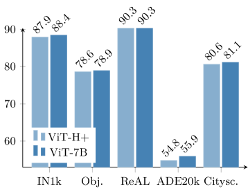

<figcaption>図16: (a) DINOv3 モデル族。様々なサイズの ViT と ConvNeXt 派生のパラメータ数と推論 FLOPs。</figcaption>
</figure>

### 7.1 A Vision Transformer for Every Use Case（あらゆるユースケースのための Vision Transformer）

ViT ファミリは、コンパクトな ViT-S からより大きな 8.4 億パラメータ ViT-H+ モデルまでアーキテクチャに及ぶ。

前者はラップトップのような資源制約のあるデバイスで効率的に実行するよう設計されており、後者はより要求の高いアプリケーションのための最先端性能を提供する。

ViT モデルを対応するサイズの最良のオープンソース画像エンコーダ、すなわち DINOv2 [134]、SigLIP 2 [185]、Perception Encoder [18] と比較する。

公平な比較のため、入力系列長がモデル間で同等であることを確保する。

具体的には、パッチサイズ 16 のモデルに対しては入力画像 $512 \times 512$、パッチサイズ 14 を使用するモデルに対しては $448 \times 448$。

**表14**: 同等のサイズのオープンソース代替に対するモデルファミリの比較。

| | | | Global Tasks | | | | | Dense Tasks | | | |
| Size | Model | | IN-ReaL | IN-R | Obj. | Ox.-H | | ADE20k | NYU ↓ | DAVIS | NAVI | SPair |
|---|---|---|---|---|---|---|---|---|---|---|---|---|
| S | DINOv2 | | 87.3 | 54.0 | 47.8 | 39.5 | | 45.5 | 0.446 | 73.6 | 53.4 | 51.6 |
| S | DINOv3 | | 87.0 | 60.4 | 50.9 | 49.5 | | 47.0 | 0.403 | 72.7 | 56.3 | 50.4 |
| S+ | DINOv3 | | 88.0 | 68.8 | 54.6 | 50.0 | | 48.8 | 0.399 | 75.5 | 57.1 | 55.2 |
| B | PEcore | | 87.5 | 68.4 | 57.9 | 20.2 | | 37.4 | 0.641 | 44.5 | 41.8 | 13.7 |
| B | SigLIP 2 | | 89.3 | 80.6 | 66.9 | 20.2 | | 41.6 | 0.512 | 63.2 | 45.4 | 32.8 |
| B | DINOv2 | | 89.0 | 68.4 | 57.3 | 51.0 | | 48.4 | 0.416 | 72.9 | 56.9 | 57.1 |
| B | **DINOv3** | | 89.3 | 76.7 | 64.1 | **58.5** | | **51.8** | **0.373** | **77.2** | **58.8** | **57.2** |
| L | PEcore | | 90.1 | 87.7 | 74.9 | 25.6 | | 39.7 | 0.650 | 48.2 | 42.1 | 19.2 |
| L | SigLIP 2 | | 90.1 | 89.2 | 75.0 | 21.4 | | 43.6 | 0.484 | 66.3 | 47.8 | 41.9 |
| L | DINOv2 | | 89.7 | 79.1 | 64.7 | 55.7 | | 48.8 | 0.394 | 73.4 | 59.9 | 57.0 |
| L | **DINOv3** | | **90.2** | 88.1 | 74.8 | **63.1** | | **54.9** | **0.352** | **79.9** | **62.3** | **61.2** |
| SO400m | SigLIP 2 | | 90.3 | 90.4 | 76.2 | 23.0 | | 44.0 | 0.402 | 64.8 | 48.8 | 38.7 |
| H+ | **DINOv3** | | **90.3** | 90.0 | **78.6** | **64.5** | | 54.8 | **0.352** | 79.3 | **63.3** | 56.3 |

経験的研究は、DINOv3 モデルが dense 予測タスクで一貫してそれらの対応物を上回ることを明確に実証する。

最も注目すべきは、ADE20k ベンチマークで、DINOv3 ViT-L モデルが最良の競合相手 DINOv2 と比較して 6 mIoU ポイント以上の改善を達成することである。

ViT-B 派生は、次の最良の競合相手に対して約 3 mIoU ポイントの利得を示す。

これらの大幅な改善は、きめ細かい空間詳細を捉える DINOv3 の局所特徴量の有効性を強調する。

さらに、深度推定タスクでの評価も、競合アプローチに対する一貫した性能利得を明らかにする。

これは、異なる dense ビジョン問題にまたがる DINOv3 ファミリの汎用性を強調する。

重要なことに、われわれのモデルは ObjectNet や ImageNet-1k のようなグローバル認識ベンチマークで競合的な結果を達成する。

これは、強化された dense タスク性能がグローバルタスクの精度を犠牲にしてもたらされたものでないことを示す。

このバランスは、DINOv3 モデルが妥協なしに dense と global の両方のビジョンタスクで卓越する、頑健で全方位的な解決策を提供することを確認する。

別の話として、われわれが蒸留する最大のモデルが teacher からすべての情報を捉えているかどうかも検証したい。

このため、最大の ViT-H+ と 7B teacher の比較を実行する。

図 16(b) に示すように、最大の student は 8 倍大きい ViT-7B モデルと同等の性能を達成する。

この結果は蒸留プロセスの有効性を検証するだけでなく、高品質の teacher に導かれたとき、より小さなモデルが匹敵するレベルの性能を提供することを学習できることを実証する。

この発見は、*非常に大きなモデルの訓練が広範なコミュニティに利益をもたらす*というわれわれの信念を強化する。

より大きなモデルの強さは、品質の損失がほとんどまたはまったくない、より効率的でより小さなモデルにうまく蒸留できる。

<figure>

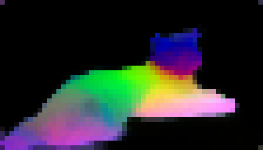

<figcaption>図17: DINOv3 ViT-S+ の異なる解像度での PCA 可視化。解像度間で安定した一貫性のある特徴量を示す。</figcaption>
</figure>

### 7.2 Efficient ConvNeXts for Resource-Constrained Environments（資源制約環境のための効率的 ConvNeXt）

本節では、7B teacher から蒸留された ConvNeXt（CNX）モデルの品質を評価する。

ConvNeXt モデルは FLOPs の点で高度に効率的で、畳み込み計算用に最適化されたデバイスでの展開に適している。

さらに、トランスフォーマーモデルはしばしば量子化に適していない [19] が、convolutional net の量子化はよく探求された主題である。

T、S、B、L のサイズの CNX アーキテクチャを蒸留し（図 16(a) 参照）、元の ConvNeXt モデル [122] と比較する。

これらのベースラインは ImageNet-22k ラベルを使用して教師あり方式で訓練されたため、ImageNet-1k で高い性能を達成し、強い競合相手を表す。

この実験では、入力解像度 256 と 512 でのグローバルタスク、解像度 512 での ADE20k、解像度 640 での NYU の結果を提供する。

**表15**: 蒸留された DINOv3 ConvNeXt モデルの評価。

| | | | Global Tasks | | | | | | | | Dense Tasks | |
| Size | Model | | IN-ReaL | | | IN-R | | | Obj. | | | ADE20k | NYU ↓ |
| | | | 256 | 512 | | 256 | 512 | | 256 | 512 | | | |
|---|---|---|---|---|---|---|---|---|---|---|---|---|---|
| T | Sup. | | 87.3 | 83.0 | | 45.0 | 33.0 | | 44.5 | 27.1 | | 24.8 | 0.666 |
| T | **DINOv3** | | 86.6 | **87.7** | | **73.7** | **74.1** | | **52.6** | **58.7** | | **42.7** | **0.448** |
| S | Sup. | | **88.9** | 86.8 | | 52.8 | 39.1 | | 50.8 | 40.0 | | 22.6 | 0.630 |
| S | **DINOv3** | | 87.9 | **88.7** | | **73.7** | **74.1** | | **52.6** | **58.7** | | **44.8** | **0.432** |
| B | Sup. | | **89.3** | 87.8 | | 57.3 | 46.2 | | 53.6 | 46.5 | | 26.5 | 0.596 |
| B | **DINOv3** | | 88.5 | **89.2** | | **77.2** | **78.2** | | **56.2** | **61.3** | | **46.3** | **0.420** |
| L | Sup. | | **89.6** | 88.1 | | 58.4 | 46.6 | | 55.0 | 47.7 | | 33.3 | 0.567 |
| L | **DINOv3** | | 88.9 | **89.4** | | **81.3** | **82.4** | | **59.3** | **65.2** | | **47.8** | **0.403** |

### Results

in-distribution 画像分類で、われわれのモデルが解像度 256 で教師ありモデルにわずかに遅れることを発見する（例: CNX-T で $-0.7$ IN-ReAL）。

しかしながら、解像度 512 では傾向が逆転し、教師あり ConvNeXt は有意に劣化するが、われわれのモデルは入力解像度の増加でスケールする。

アウトオブディストリビューション分類（IN-R、ObjectNet）では、すべてのサイズで 2 つのモデルファミリの間に有意なギャップがあり、DINOv3 CNX モデルの頑健性の証である。

さらに、DINOv3 モデルは dense タスクで非常に大きな改善を提供する。

実際、CNX-T については、われわれのモデルは $+17.9$ mIoU（42.7 対 24.8）の改善を生み、CNX-L については、$+14.5$ mIoU（47.8 対 33.3）を得る。

高性能と計算効率の組み合わせにより、蒸留された ConvNeXt モデルは、資源制約が重要な実世界応用に特に有望である。

それとは別に、ViT-7B モデルのより小さな ConvNeXt モデルへの蒸留は、2 つの根本的に異なるアーキテクチャを橋渡しするため、特にエキサイティングである。

ViT-7B は CLS トークンを持つトランスフォーマーブロックに基づいているが、ConvNeXt は CLS トークンなしの畳み込み操作に依存するため、この知識転移は非自明である。

この達成は、われわれの蒸留プロセスの汎用性と有効性を強調する。

### 7.3 Zero-shot Inference with DINOv3-based dino.txt（DINOv3 ベース dino.txt によるゼロショット推論）

§5.3 に詳述したように、蒸留された DINOv3 ViT-L モデルの CLS トークンと出力パッチの両方をテキストにアラインメントするために、dino.txt [100] のレシピに従ってテキストエンコーダを訓練した。

標準ベンチマークでグローバルレベルとパッチレベルの両方でアラインメントの品質を評価する。

ImageNet-1k、ImageNet-Adversarial、ImageNet-Rendition、ObjectNet ベンチマークで CLIP プロトコル [144] を使用したゼロショット分類精度を報告する。

画像-テキスト検索について、COCO2017 データセット [186] で評価し、画像から文（I → T）と文から画像（T → I）の両方のタスクで Recall@1 を報告する。

パッチレベルアラインメントの品質を探るため、共通ベンチマーク ADE20k と Cityscapes を使用してオープン語彙セグメンテーションタスクでモデルを評価し、mIoU 指標を報告する。

### Results

同じサイズクラスの競合相手とテキストアラインメントされた DINOv3 ViT-L を比較する。

DINOv2 をテキストにアラインメントする [100] と比較して、DINOv3 はすべてのベンチマークで有意に良い性能をもたらす。

グローバルアラインメントタスクで、元の CLIP [144] および EVA-02-CLIP [173] のような強いベースラインと比較して有利だが、SigLIP2 [185] と Perception Encoder [18] よりわずかに遅れる。

dense アラインメントタスクで、テキストアラインメントされたモデルは、DINOv3 のクリーンな feature map のおかげで 2 つの困難なベンチマーク ADE20K と Cityscapes で卓越した性能を示す。

**表16**: テキストアラインメントされた DINOv3 ViT-L を最先端と比較。

| | | Classification | | | | | Retrieval | | | Segmentation | |
| Method | | IN1k | A | R | Obj. | | I → T | T → I | | ADE20k | Cityscapes |
|---|---|---|---|---|---|---|---|---|---|---|---|
| CLIP | | 76.6 | 77.5 | 89.0 | 72.3 | | 57.9 | 37.1 | | 6.0 | 11.5 |
| EVA-02-CLIP | | 80.4 | 82.9 | 93.2 | 78.5 | | 64.1 | 47.9 | | 10.9 | 14.1 |
| dino.txt | | 81.6 | 83.2 | 88.8 | 74.5 | | 62.5 | 45.0 | | 19.2 | 27.4 |
| SigLIP 2 | | **83.1** | 84.3 | **95.7** | 84.4 | | 71.4 | 55.3 | | 10.8 | 16.3 |
| PE | | 83.5 | **89.0** | 95.2 | **84.7** | | **75.9** | **57.1** | | 17.6 | 21.4 |
| **DINOv3 dino.txt** | | 82.3 | 85.4 | 93.0 | 80.5 | | 63.7 | 45.6 | | **24.7** | **36.9** |

---

## 8 DINOv3 on Geospatial Data（地理空間データ上の DINOv3）

われわれの自己教師あり学習レシピは汎用的で、任意の画像ドメインに適用できる。

本節では、衛星画像のための DINOv3 7B モデルを構築することによってこの普遍性を披露する。衛星画像は、DINOv3 が最初に開発されたウェブ画像とは非常に異なる特徴（例: オブジェクトテクスチャ、センサーノイズ、焦点ビュー）を持つ。

### 8.1 Pre-Training Data and Benchmarks（事前訓練データとベンチマーク）

衛星 DINOv3 7B モデルは、0.6 メートル解像度で Maxar RGB ortho-rectified imagery からランダムにサンプリングされた $512 \times 512$ 画像の 493 百万枚のデータセットである SAT-493M で事前訓練される。

ウェブ DINOv3 7B モデルに使用されるものと完全に同じハイパーパラメータセットを使用するが、衛星画像用に適応された RGB 平均と std 正規化、および訓練長を除く。

ウェブモデルと同様、衛星モデルの訓練パイプラインは、グローバルクロップ（$256 \times 256$）での 100k 反復の初期事前訓練、続いて Gram 正則化を使用した 10k 反復、最後に解像度 $512$ での 8k ステップの高解像度ファインチューニングで構成される。

ウェブモデルと類似に、低予算レジームでの使用を容易にするため、7B 衛星モデルをより管理しやすい ViT-Large モデルに蒸留する。

複数の earth observation タスクで DINOv3 衛星とウェブモデルを評価する。

グローバル canopy 高度マッピングのタスクには、§D.13 で記述される Satlidar データセットを使用する。これは LiDAR ground truth を持つ百万枚の $512 \times 512$ 画像で構成され、train/val/test 分割は 8/1/1 の比率で分割される。

分割には [180] で使用された Neon と São Paulo データセットが含まれる。

国家規模 canopy 高度マッピングについて、Open-Canopy [69] で評価する。これはフランス全土の 87,000 km² にわたる SPOT 6-7 衛星画像と空中 LiDAR データを組み合わせる。

このデータセットの画像は追加の infra-red（IR）チャネルを含む 4 チャネルを持つため、patch embed モジュールの重みの 3 チャネルの平均を取り、4 番目のチャネルとしての重みに追加することで、バックボーンを適応させる。

Maxar の ground sample 解像度に一致するよう 1667 にリサイズされた画像の $512 \times 512$ クロップで DPT デコーダを訓練した。

**表17**: 高解像度 canopy 高度予測のための異なるバックボーンの評価。

| | | | SatLidar | | | | | | | | | | Open Canopy |
| Method | Arch. | | SatLidar Val | | | SatLidar Test | | Neon Test | | São Paulo | | | |
| | | | MAE↓ | $R^2$ ↑ | | MAE↓ | $R^2$ ↑ | MAE↓ | $R^2$ ↑ | MAE↓ | $R^2$ ↑ | | MAE↓ |
|---|---|---|---|---|---|---|---|---|---|---|---|---|---|
| [180] * | ViT-L | | 2.8 | 0.86 | | 4.0 | 0.61 | 2.7 | 0.73 | 5.4 | 0.42 | | — |
| [180] | ViT-L | | 2.4 | 0.90 | | 3.4 | 0.81 | 2.9 | 0.69 | 5.4 | 0.48 | | 2.42 |
| DINOv3 Web | ViT-7B | | 2.4 | 0.90 | | 3.6 | 0.74 | 2.7 | 0.75 | 5.9 | 0.34 | | 2.17 |
| DINOv3 Sat | ViT-L | | **2.2** | 0.91 | | **3.2** | 0.81 | **2.4** | **0.81** | 5.8 | 0.42 | | 2.07 |
| DINOv3 Sat | ViT-7B | | **2.2** | **0.92** | | **3.2** | **0.82** | 2.6 | 0.74 | 5.5 | **0.51** | | **2.02** |

セマンティック地理空間タスクは GEO-Bench [111] で評価され、これは様々な空間解像度と光学帯にわたる 6 つの分類と 6 つのセグメンテーションタスクで構成される。

GEO-Bench タスクは多様で、屋根に設置された太陽光発電システムの検出、地域気候帯の分類、森林伐採の要因の測定、樹冠の検出などが含まれる。

高解像度セマンティックタスクには、土地被覆セグメンテーションデータセット LoveDA [200]、オブジェクトセグメンテーションデータセット iSAID [231]、水平検出データセット DIOR [115] を考える。

### 8.2 Canopy Height Estimation（樹冠高度推定）

衛星画像から樹冠高度を推定することは、傾斜・視野幾何・太陽角度・大気散乱・量子化アーティファクトのランダムな変動にもかかわらず、連続的な空間構造を正確に回復することを必要とする困難なメトリックタスクである。

このタスクは、グローバル炭素モニタリングと森林・農業管理にとって決定的である [82]。

このタスクに対して衛星画像で訓練された SSL バックボーンを最初に活用した [180] に従い、SatLidar1M 訓練セット上で凍結された DINOv3 の上に DPT ヘッドを訓練し、次に SatLidar1M 検証セットの i.i.d. サンプルと、SatLidar1M test、Neon、Sao Paulo を含むアウトオブディストリビューションテストセットで評価する。

Open-Canopy データセットでも訓練と評価を追加で行う。

### Results

異なる SSL バックボーンを比較し、SAT-493M データセットで訓練されたモデルを「DINOv3 Sat」、LVD-1689M で訓練されたモデルを「DINOv3 Web」と表記する（§3.1 参照）。

DINOv3 衛星モデルが、ほとんどのベンチマークで最先端性能をもたらすことが見て取れる。

7B 衛星モデルは SatLidar1M val、SatLidar1M test、Open-Canopy で新しい最先端を設定し、それぞれ MAE を $2.4$ から $2.2$、$3.4$ から $3.2$、$2.42$ から $2.02$ に削減する。

これらの結果は、DINOv3 訓練レシピが汎用的で、他のドメインに out-of-the-box で効果的に適用できることを示す。

興味深いことに、蒸留された ViT-L 衛星モデルは 7B の対応物と同等に性能し、SatLidar1M と Open-Canopy で同等の結果を達成しつつ、Neon テストセットでは驚くほど良い性能を示し、7B モデルの $2.6$ と [180] の $2.9$ と比較して $2.4$ の最低 MAE に達する。

DINOv3 7B ウェブモデルはベンチマークで適切な性能に達し、SatLidar1M val、Neon、Open-Canopy で [180] を上回るが、衛星モデルの後ろに留まる。

これは、センサー固有の事前知識と放射測定の一貫性が重要である樹冠高度推定のような物理的に根拠のあるタスクにとって、ドメイン固有の事前訓練の強さを強調する。

### 8.3 Comparison to the Earth Observation State of the Art（地球観測の最先端との比較）

**表18**: Geo-Bench タスクにおける、強いベースライン DOFA [217]、Prithvi-v2 [176]、[180] に対する DINOv3 モデルの比較。

(a) Classification tasks.

| Method | Arch. | FT | Bands | m-BEnet | m-brick-kiln | m-eurosat | m-forestnet | m-pv4ger | m-so2sat | Mean |
|---|---|---|---|---|---|---|---|---|---|---|
| DOFA | ViT-L | 🔥 | all | 68.7 | 98.4 | 96.6 | 55.7 | 98.2 | 61.6 | 79.9 |
| Best of Prithvi-v2 | ViT-L/H | 🔥 | all | 71.2 | 98.8 | 96.4 | 54.1 | 98.1 | 59.1 | 79.6 |
| [180] | ViT-L | ❄ | RGB | 66.0 | 97.1 | 95.2 | 56.3 | 94.3 | 58.1 | 77.8 |
| DINOv3 Sat | ViT-L | ❄ | RGB | 73.0 | 96.5 | 94.1 | 60.6 | 96.0 | 57.4 | 79.6 |
| DINOv3 Sat | 7B | ❄ | RGB | 74.0 | 97.2 | 94.8 | **62.3** | 96.1 | 62.1 | 81.1 |
| **DINOv3 Web** | 7B | ❄ | RGB | **74.6** | 97.7 | **97.0** | 57.9 | **98.3** | **63.8** | **81.6** |

(b) Segmentation tasks.

| Method | Arch. | FT | Bands | m-cashew * | m-chesapeake | m-NeonTree | m-nz-cattle | m-pv4ger-seg | m-SA-crop | Mean |
|---|---|---|---|---|---|---|---|---|---|---|
| DOFA | ViT-L | 🔥 | all | 81.2 | 61.6 | 58.5 | 77.4 | 95.1 | 35.7 | 68.3 |
| Best of Prithvi-v2 | ViT-L/H | 🔥 | all | 90.2 | 69.4 | 59.1 | 81.0 | 95.3 | **41.9** | 72.8 |
| [180] | ViT-L | ❄ | RGB | 92.8 | 73.7 | 58.1 | 83.1 | 94.7 | 35.1 | 72.9 |
| DINOv3 Sat | ViT-L | ❄ | RGB | 94.2 | 75.6 | 61.8 | **83.7** | 95.2 | 36.8 | 74.5 |
| DINOv3 Sat | 7B | ❄ | RGB | 94.1 | **76.6** | 62.6 | 83.4 | 95.5 | 37.6 | 75.0 |
| **DINOv3 Web** | 7B | ❄ | RGB | **96.0** | 76.5 | **66.4** | **83.7** | **95.9** | 36.8 | **75.9** |

地球観測タスクのための異なる手法の性能を表 18 と表 19 で比較する。

凍結 DINOv3 衛星とウェブモデルは、15 のうち 12 の分類・セグメンテーション・水平物体検出タスクで新しい最先端結果を設定する。

GEO-Bench 結果は、Sentinel-2 と Landsat タスクに 6+ バンドを使用し、タスク固有のファインチューニングも使用する Prithvi-v2 [176] と DOFA [217] を含む先行モデルを上回る（表 18）。

RGB のみ入力の凍結バックボーンを使用しているにもかかわらず、DINOv3 衛星モデルは 3 つの非飽和分類タスクと 6 つのうち 5 つのセグメンテーションタスクで先行手法を上回る。

興味深いことに、DINOv3 7B ウェブモデルはこれらのベンチマークで非常に競合的である。

多くの GEO-Bench タスクで、また大規模・高解像度リモートセンシングセグメンテーション・検出ベンチマークで、同等またはより強い性能を達成する。

表 18 と表 19 に示すように、凍結 DINOv3 ウェブモデルは Geo-Bench タスクや LoveDA と DIOR データセットでのセグメンテーション・検出タスクで新しい主要な結果を確立する。

これらの発見は、地理空間基盤モデルの設計に対する広範な含意を持つ。

これらは最近、多時間集約、マルチセンサー融合、衛星固有のメタデータの組み込みのようなヒューリスティック技法を強調してきた [21, 67]。

われわれの結果は、汎用 SSL が、正確なオブジェクト境界に依存するタスク（セグメンテーションまたは物体検出）に対して、衛星固有のアプローチに匹敵または上回ることを示す。

これは、ドメインに依存しない事前訓練が特化された下流ドメインでも強い汎化を提供できるという新たな証拠を支持する [112]。

総じて、われわれの結果はドメイン固有事前訓練のタスク依存の利益を示唆する。

DINOv3 衛星モデルは深度推定のようなメトリックタスクで卓越し、衛星固有の事前知識を活用する。

対照的に、DINOv3 ウェブモデルは多様で普遍的な表現を通じて、セマンティック地理空間タスクで最先端の結果を達成する。

両モデルの補完的な強みは、DINOv3 SSL パラダイムの広範な適用可能性と有効性を示す。

<figure>

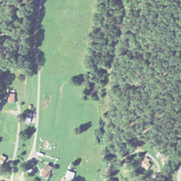

<figcaption>図18: 単一の DINOv3 モデルによって可能になるリモートセンシングでの汎用的応用の例示。DINOv3 特徴量上の PCA は DINOv2 よりも細かい詳細を示す。セグメンテーションマップは GEO-Bench chesapeake ラベルのみを使用して計算された。樹冠高度モデルデコーダは 4 チャネル（RGB + InfraRed）を使用して Open-Canopy データセットで訓練されたが、推論は RGB チャネルのみで実行された。</figcaption>
</figure>

**表19**: 高解像度セマンティック地理空間タスクのための最先端モデル Prithvi-v2 [176]、BillionFM [29]、SkySense V2 [237] と DINOv3 の性能を比較。

| Method | Arch. | FT | | LoveDA | iSAID | DIOR |
|---|---|---|---|---|---|---|
| Prev. SotA | | 🔥 | | BillionFM, ViT-G: 54.4 | SkySense V2, Swin-G*: 71.9 | SkySense V2, Swin-G*: 79.5 |
| Decoder Arch. | | | | UPerNet | UPerNet | Faster-RCNN |
| Privthi-v2 | ViT-H | 🔥 | | 52.2 | 62.8 | — |
| DINOv3 Sat | ViT-L | ❄ | | 54.4 | 62.9 | 72.7 |
| DINOv3 Sat | ViT-7B | ❄ | | 55.3 | 64.8 | 76.6 |
| **DINOv3 Web** | ViT-7B | ❄ | | **56.2** | **71.4** | **80.5** |

<figure>

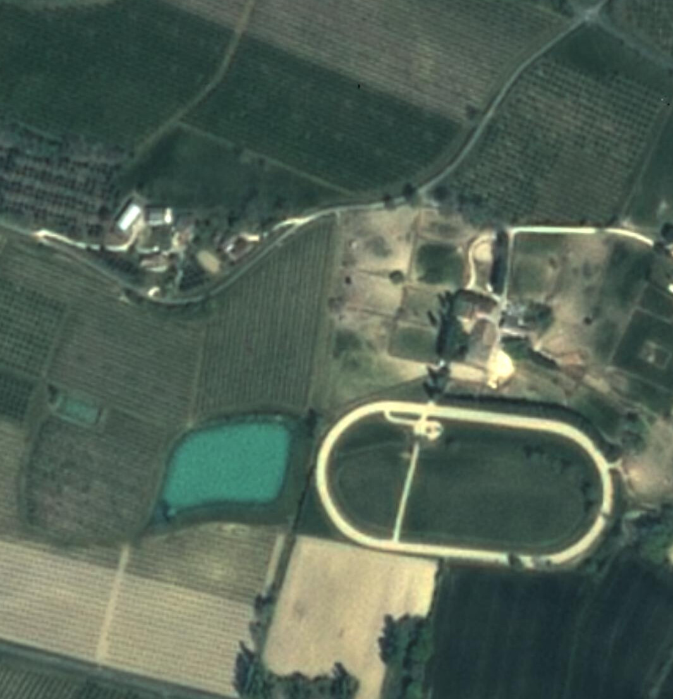

<figcaption>図19: Open Canopy データセット上での DINOv3 7B 衛星モデルと [180] の定性的比較。両モデルとも、デコーダは 448×448 入力画像で訓練された。DINOv3 がより正確なマップを生成することが見て取れる、例えば畑の木々の正確な高度。</figcaption>
</figure>

---

## 9 Environmental Impact（環境への影響）

**表20**: モデル訓練の炭素フットプリント。完全なモデル事前訓練を再現することの潜在的炭素排出を、PUE 1.1 と KWh あたり 0.385kg CO₂eq の炭素強度係数を使用して計算して報告する。

| Model | Arch. | GPU type | Power | Steps | GPU hours | PUE | Total power | Emission |
| --- | --- | --- | --- | --- | --- | --- | --- | --- |
| | | | (W) | | | | (MWh) | (tCO₂eq) |
| MetaCLIP | ViT-G | A100-40GB | 400W | 390k | 368,640 | 1.1 | 160 | 62 |
| DINOv2 | ViT-g | A100-40GB | 400W | 625k | 22,016 | 1.1 | 9.7 | 3.7 |
| DINOv3 | ViT-7B | H100-SXM5 | 700W | 1,000k | 61,440 | 1.1 | 47 | 18 |

事前訓練の炭素排出を推定するため、自然言語処理 [170, 184] と SSL [134] の以前の研究で使用された手法に従う。

すべての外因性変数の値、すなわち電力使用効率（PUE）と電力グリッドの炭素強度係数を [184] で使用されたものと同じ値、すなわち PUE 1.1 と米国平均の炭素強度係数 0.385 kg CO₂eq/KWh と仮定する。

GPU の電力消費については、それらの熱設計電力を取る: A100 GPU で 400W、H100 GPU で 700W。

われわれの ViT-7B の事前訓練のための計算の詳細を表 20 に報告する。

参考として、DINOv2 と MetaCLIP の類似のデータを提供する。

別の比較ポイントとして、1 つの DINOv3 モデル（47 MWh）を訓練するために必要なエネルギーは、平均的な電気自動車での 240,000 km の運転に必要なものとほぼ等しい。

### Carbon Footprint of the Whole Project（プロジェクト全体の炭素フットプリント）

プロジェクト全体の炭素フットプリントを計算するため、合計 9M GPU 時間の粗い推定を使用する。

上記と同じグリッドパラメータを使用して、合計フットプリントを約 2600 tCO₂eq と推定する。

比較として、パリとニューヨーク間のフル Boeing 777 往復便は約 560 tCO₂eq に対応する。

これらの都市間で 1 日 12 便あると仮定すると、われわれのプロジェクトの環境影響は、これらの都市間の全便の 1 日の半分を表す。

この推定は GPU の電力消費のみを考慮し、冷却・製造・廃棄など他の排出を無視している。

---

## 10 Conclusion（結論）

DINOv3 は自己教師あり学習の分野における有意な進歩を表し、様々なドメインにわたって視覚表現が学習される方法を革命化する潜在能力を実証する。

慎重なデータ準備・設計・最適化を通じてデータセットとモデルサイズをスケールすることで、DINOv3 は手動注釈への依存を排除する自己教師あり学習の力を披露する。

Gram anchoring 法の導入は、延長された訓練期間にわたる dense feature map の劣化を効果的に緩和し、頑健で信頼性のある性能を確保する。

高解像度ポスト訓練と蒸留のような事後の磨き上げ戦略の実装とともに、画像エンコーダのファインチューニングなしで、広範な視覚タスクで最先端性能を達成する。

DINOv3 視覚モデルスイートは、新しいベンチマークを設定するだけでなく、様々な資源制約・展開シナリオ・応用使用例にまたがる汎用的な解決策を提供する。

DINOv3 でなされた進歩は、コンピュータビジョン以降において最先端を進めるための自己教師あり学習の約束の証である。
