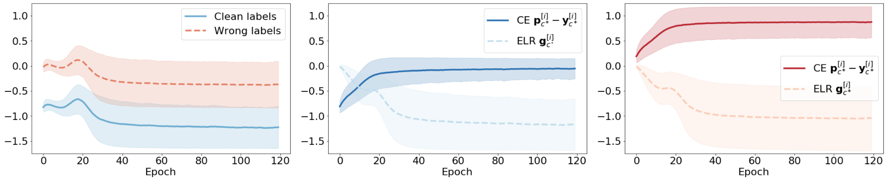
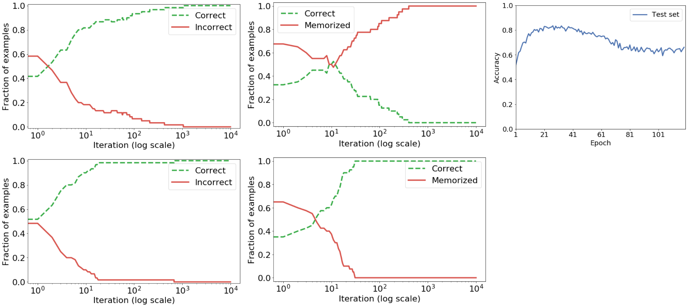
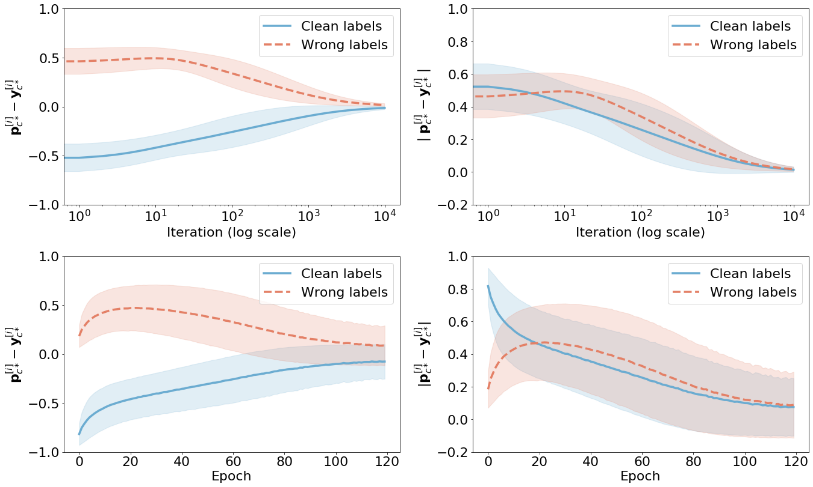
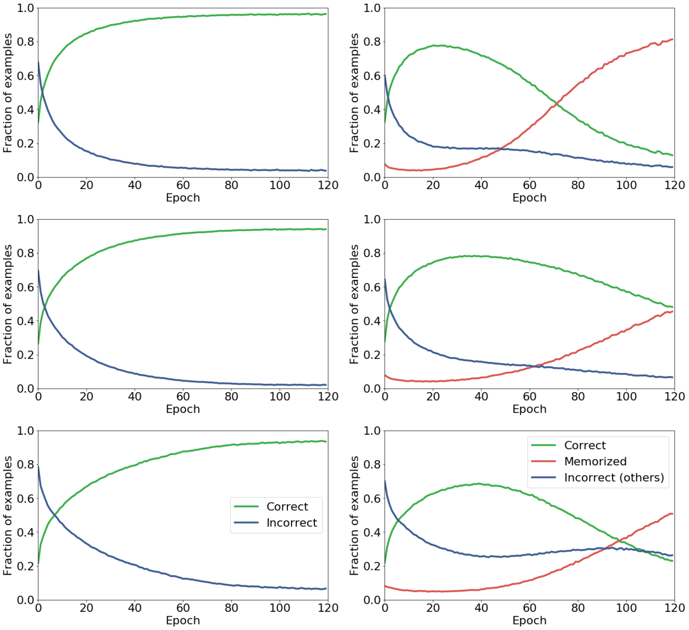
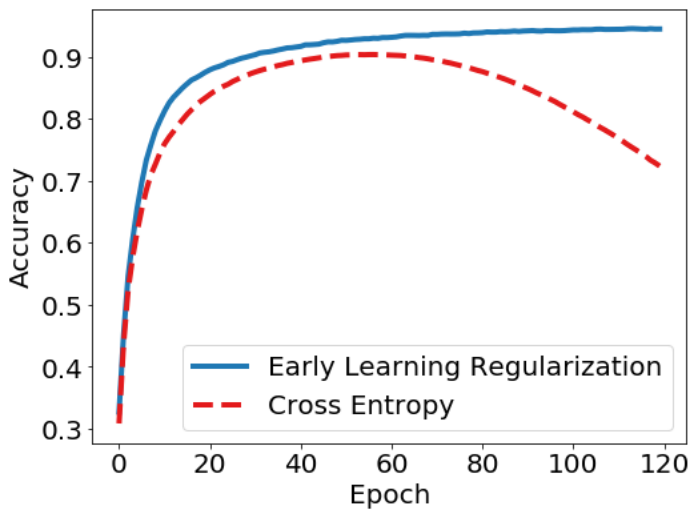
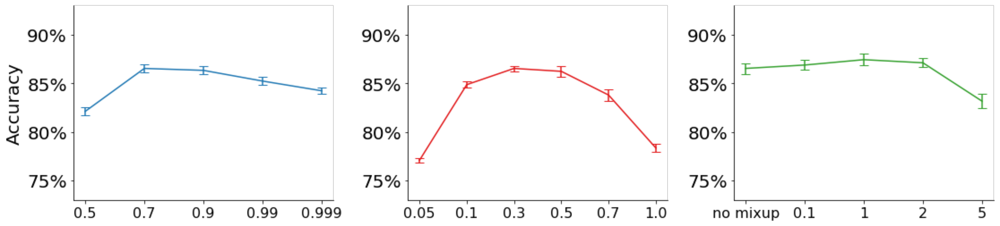

# 早期学習正則化はノイズラベルの暗記を防ぐ

> 原題: Early-Learning Regularization Prevents Memorization of Noisy Labels
> 著者: **Sheng Liu**, Jonathan Niles-Weed, Narges Razavian, Carlos Fernandez-Granda
> 所属: New York University（Center for Data Science / Courant Institute of Mathematical Sciences / NYU School of Medicine）
> 出典: arXiv:2007.00151 → **NeurIPS 2020**
> コード: <https://github.com/shengliu66/ELR>

> 翻訳メモ: 本翻訳は CLAUDE.md §4 の標準ルールと異なり、**Appendix A〜I をすべて翻訳対象に含めている**（ユーザーからの個別指示による）。References のみ除外。**Appendix A（線形モデルにおける早期学習と暗記の理論解析）は命題・定理・補題とその証明からなる密な数式の連鎖**であり、数式は LaTeX 記法のまま保持し、地の文を訳している。
>
> **原典の欠落について**: ar5iv の変換の際に**筆頭著者 Sheng Liu の名前が著者欄から脱落している**（謝辞の「SL was partially supported by NSF grant DMS 2009752」および参考文献 [^25]、コードリポジトリ `shengliu66/ELR` から確認できる）。本翻訳では正しい著者リストを冒頭に記した。また §1 の貢献の箇条書きも変換時に脱落している。図は 7 点すべて arXiv e-print（arXiv:2007.00151）に同梱された PNG から複数パネルを組み合わせて生成した。

## Abstract（要旨）

我々は、ノイジーな注釈が存在するもとで深層学習による分類を行うための新規の枠組みを提案する。ノイズラベルで訓練されたとき、深層ニューラルネットワークは**「早期学習（early learning）」の段階でまずクリーンなラベルを持つ訓練データに適合し、その後に誤ったラベルを持つ事例を暗記（memorize）する**ことが観察されてきた。我々は、**早期学習と暗記が高次元の分類タスクにおける、単純な線形モデルにおいてすら生じる基本的な現象である**ことを証明し、この設定における理論的説明を与える。これらの知見に動機づけられ、我々は早期学習の段階での進捗を活用するノイジーな分類タスクのための新しい技法を開発する。**早期学習の間のモデル出力を用いてクリーンなラベルを持つ事例を検出し、誤ったラベルを無視するか修正しようとする既存のアプローチと対照的に、我々は異なる道を取り、代わりに正則化を介して早期学習を活用する。** 我々のアプローチには 2 つの鍵となる要素がある。第一に、モデル出力に基づいて目標確率を生成するために半教師あり学習の技法を活用する。第二に、モデルをこれらの目標へ向かわせる正則化項を設計し、**暗黙のうちに誤ったラベルの暗記を防ぐ**。得られた枠組みは、いくつかの標準的なベンチマークと実世界のデータセットにおいてノイジーな注釈へのロバスト性を提供し、最先端と同等の結果を達成することが示される。

## 1 Introduction（はじめに）

深層ニューラルネットワークは分類タスクにとって本質的な道具になった。これらのモデルは CIFAR-10 や ImageNet のような大規模にキュレートされたデータセットで訓練される傾向にあり、そこではラベルの大多数が手作業で検証されている。あいにく、多くの応用ではそのようなデータセットは、手作業によるラベル付けのコストや困難さのために利用できない。しかしながら、例えばオンラインのクエリやクラウドソーシングから得られる、より品質の低い注釈を持つデータセットは利用可能かもしれない。そのような注釈は不可避的に多数の誤り、すなわち**ラベルノイズ（label noise）**を含む。したがって、ノイジーな注釈の存在にロバストな方法論を開発することが極めて重要である。

ノイズラベルで訓練されたとき、深層ニューラルネットワークは、誤ったラベルを持つ事例を最終的に**暗記する**前に、**早期学習**の段階でまずクリーンなラベルを持つ訓練データに適合することが観察されてきた。本研究ではこの現象を研究し、ノイズラベルへのロバスト性を達成するためにそれを活用する新規の枠組みを導入する。

<figure>


<figcaption>図1: 従来の交差エントロピー損失（上段）と我々の提案手法（下段）で ResNet-34 を訓練した結果。CIFAR-10 に 40% の対称ノイズを与えている。左列はクリーンなラベルを持つ事例の割合の推移（緑の破線 = 正しく分類、青の一点鎖線 = 誤って分類）。中列は誤ったラベルを持つ事例の推移（緑 = 正しく分類、赤 = 暗記された、青 = その他の誤り）。右上は交差エントロピーでのテスト精度。交差エントロピーでは、暗記された事例の割合（赤）が約 0.05 から 0.87 まで単調に増加し、正しく分類された割合（緑）が約 0.77 をピークに 0.07 まで崩れる。テスト精度もエポック 30 付近の約 0.83 をピークに約 0.65 まで低下する。ELR では暗記された割合が約 0.03 のまま平坦に保たれる。</figcaption>
</figure>

## 2 Related Work（関連研究）

本節では、ノイジーな注釈を持つデータを用いて深層学習の分類モデルを訓練する既存の技法を記述する。議論は、**クリーンなラベルを持つ訓練データの小さな部分集合が利用可能であることを仮定しない**手法に焦点を当てる。また、正しいクラスが既知であることも仮定する。

**ロバスト損失（robust-loss）**の手法は、ノイズラベルの存在下でロバストになるよう特別に設計されたコスト関数を提案する。これらには、**平均絶対誤差（MAE）**、その重み付き版である **Improved MAE**、MAE の一般化と解釈できる **Generalized Cross Entropy**、通常の交差エントロピー損失に逆向きの交差エントロピー項を加える **Symmetric Cross Entropy**、情報理論的な考察に基づく $\mathcal{L}_{\text{DIM}}$ が含まれる。**損失補正（loss-correction）**の手法は、誤ラベル付けの確率の遷移行列によって表現されるノイズの分布を考慮するよう損失関数を明示的に補正する。

ロバスト損失と損失補正の技法は、はじめに述べた早期学習の現象を活用しない。この現象は Arpit ら（および Zhang ら）によって記述され、Li らによって理論的に解析された。**我々の理論的アプローチは彼らのものと 2 点で異なる。** 第一に、Li らは最小二乗回帰のタスクに焦点を当てるが、我々は分類におけるノイズラベルの問題に焦点を当てる。第二に、そしてより重要なことに、**我々は早期学習と暗記が線形モデルにおいてすら生じることを証明する**。

早期学習は**サンプル選択（sample selection）**を通して活用できる。そこでは早期学習の段階でのモデル出力を用いて、どの事例が誤ラベル付けされ、どれが正しくラベル付けされたかを予測する。この予測は、**誤ラベル付けされた事例はより高い損失値を持つ傾向がある**という観察に基づく。**Co-teaching** は 2 つのネットワークを用い、それぞれを他方のネットワークにとって訓練損失が小さい事例の部分集合で訓練することでサンプル選択を行う。**このアプローチの限界は、選択される事例が「より易しい」ものに偏る傾向があること**である。すなわち早期学習の間のモデル出力が真のラベルに近い事例である。その結果、これらの事例に関する交差エントロピーの勾配は小さく、**学習が遅くなる**。加えて、選択された事例の部分集合は効果的に汎化するのに十分豊かでないかもしれない。

サンプル選択の代替として**ラベル修正（label correction）**がある。早期学習の段階では、モデルの予測は誤ラベル付けされた事例の部分集合について正確である（図1 の上段を参照）。これは対応するラベルを修正することを示唆する。これは、モデルが推定した確率に等しい新しいラベル（**ソフトラベル**と呼ばれる）、またはモデルの予測を表すワンホットベクトル（**ハードラベル**）を計算することで達成できる。別の選択肢は、新しいラベルをノイジーなラベルとソフトまたはハードラベルの凸結合に等しく設定することである。ラベル修正は通常、何らかの形の反復的なサンプル選択、または追加の正則化項と組み合わされる。**SELFIE** は過去のモデル出力を考慮して選択されたラベルの部分集合を修正するためにラベル置換を用いる。

**我々の提案するアプローチはラベル修正と精神的にはやや関係している。** 上述のソフトラベルに類似した確率推定を計算し、それを活用して暗記を回避する。しかしながら**根本的にも異なる。ラベルを修正する代わりに、我々は交差エントロピーのコスト関数の勾配を補正するよう明示的に設計された新規の正則化項を提案する。** これは、サンプル選択を組み込む必要なしに、強い経験的性能をもたらす。

## 3 Early learning as a general phenomenon of high-dimensional classification（高次元分類の一般的現象としての早期学習）

図1 の上段が明らかにするように、ノイズラベルで訓練された深層ニューラルネットワークは、暗記が起こる前の早期学習の段階で進捗を上げる。本節では、**これが深層ニューラルネットワークに特有の特徴であるどころか、最も単純な設定においてすら高次元の分類タスクに内在するものである**ことを示す。我々の理論的解析は、§4 で提案する早期学習正則化の手続きの着想源でもある。

我々は、上述と同じ挙動を示すノイズラベル付きの単純な**線形**モデルを提示する。すなわち、分類器がノイジーな事例においてすら真のラベルを正しく予測することを学ぶ**早期学習**の段階と、誤ったラベルを暗記するために分類器が誤った予測をし始める**暗記**の段階である。これは図 A.1 に図示されており、経験的に線形モデルが図1 の深層学習モデルと同じ定性的な挙動を持つことを実証している。**我々は、この挙動が、訓練の早期には正しくラベル付けされた事例に対応する勾配が動力学を支配し——真の最適解への早期の進捗をもたらす——が、誤ったラベルに対応する勾配がやがて支配的になり——その時点で分類器は単にノイジーなラベルへ適合することを学ぶ——ために生じることを示す。**

### 設定

$\mathbb{R}^{p}$ 上の 2 つのガウス分布の混合から抽出されたデータを考える。（クリーンな）データセットは $(\mathbf{x},\mathbf{y}^{*})$ の $n$ 個の独立同分布のコピーからなる。ラベル $\mathbf{y}^{*}\in\{0,1\}^{2}$ はクラスタの割り当てを表すワンホットベクトルであり、

$$
\mathbf{x}\sim\mathcal{N}(+\mathbf{v},\sigma^{2}I_{p\times p})\hskip 10.00002pt\text{ if }\mathbf{y}^{*}=(1,0)
$$
$$
\mathbf{x}\sim\mathcal{N}(-\mathbf{v},\sigma^{2}I_{p\times p})\hskip 10.00002pt\text{ if }\mathbf{y}^{*}=(0,1)\,,
$$

ここで $\mathbf{v}$ は $\mathbb{R}^{p}$ 上の任意の単位ベクトルであり、$\sigma^{2}$ は小さな定数である。2 つのクラスの間の最適な分離面は、原点を通り $\mathbf{v}$ に垂直な超平面である。我々は $\sigma^{2}$ を固定したまま $n,p\to\infty$ とする設定に焦点を当てる。**この領域では分類タスクは自明でない。というのも、クラスタはおよそ、中心が 2 単位離れ半径が $\sigma\sqrt{p}\gg 2$ の 2 つの球だからである。**

我々はノイズラベル付きのデータセット $(\mathbf{y}^{[1]},\dots,\mathbf{y}^{[n]})$ のみを観測する。

$$
\mathbf{y}^{[i]}=\left\{\begin{array}{ll}(\mathbf{y}^{*})^{[i]}&\text{確率 }1-\Delta\text{ で}\\
\tilde{\mathbf{y}}^{[i]}&\text{確率 }\Delta\text{ で,}\end{array}\right.
$$

ここで $\{\tilde{\mathbf{y}}^{[i]}\}_{i=1}^{n}$ は $(1,0)$ と $(0,1)$ を等確率で取る独立同分布のランダムなワンホットベクトルである。

我々は交差エントロピーに対する勾配降下法によって線形分類器を訓練する。

$$
\min_{\Theta\in\mathbb{R}^{2\times p}}\mathcal{L}_{\text{CE}}(\Theta):=-\frac{1}{n}\sum_{i=1}^{n}\sum_{c=1}^{2}\mathbf{y}^{[i]}_{c}\log(\mathcal{S}(\Theta\mathbf{x}^{[i]})_{c})\,,
$$

ここで $\mathcal{S}:\mathbb{R}^{2}\to[0,1]^{2}$ はソフトマックス関数である。真のクラスをよく分離する（そしてノイジーなラベルに過適合しない）ためには、$\Theta$ の行は $\mathbf{v}$ と相関していなければならない。

モデルパラメータ $\Theta$ のクラス $c$ に対応する部分についてのこの損失の勾配は次のようになる。

$$
\nabla\mathcal{L}_{\text{CE}}(\Theta)_{c}=\frac{1}{n}\sum_{i=1}^{n}\mathbf{x}^{[i]}\left(\mathcal{S}(\Theta\mathbf{x}^{[i]})_{c}-\mathbf{y}^{[i]}_{c}\right),
$$

したがって勾配の各項は事例 $\mathbf{x}^{[i]}$ の重み付き和に対応し、**その重みは $\mathcal{S}(\Theta\mathbf{x}^{[i]})_{c}$ と $\mathbf{y}^{[i]}_{c}$ の一致度に依存する**。

### 主定理

我々の主要な理論的結果は、この線形モデルが上述の性質を持つことを示す。早期学習の段階では、アルゴリズムは進捗を上げ、誤ってラベル付けされた事例に対する精度が増加する。しかしながら、この初期の段階の間、誤ってラベル付けされた事例の相対的な重要性は増大し続け、いったん誤ってラベル付けされた事例の影響が支配的になり始めると、暗記が起こる。

###### 定理 1（非形式的）.

ステップサイズ $\eta$ の勾配降下法の反復を $\{\Theta_{t}\}$ で表す。任意の $\Delta\in(0,1)$ について、$\sigma\leq\sigma_{\Delta}$ かつ $p/n\in(1-\Delta/2,1)$ ならば、$n,p\to\infty$ のとき確率 $1-o(1)$ で $T=\Omega(1/\eta)$ が存在して次が成り立つような定数 $\sigma_{\Delta}$ が存在する。

- **早期学習は成功する**: $t<T$ について、$-\nabla\mathcal{L}(\Theta_{t})$ は正しい分離面 $\mathbf{v}$ とよく相関しており、$t=T$ において分類器は初期化時よりも**誤ってラベル付けされた事例に対して高い精度**を持つ。
- **正しい事例からの勾配が消失する**: $t=0$ から $t=T$ の間に、クリーンなラベルを持つ事例に対応する係数 $\left(\mathcal{S}(\Theta_{t}\mathbf{x}^{[i]})_{c}-\mathbf{y}^{[i]}_{c}\right)$ の大きさは**減少**し、誤ったラベルを持つ事例に対応する係数の大きさは**増加**する。
- **暗記が起こる**: $t\to\infty$ のとき、分類器 $\Theta_{t}$ はすべてのノイズラベルを暗記する。

紙面の制約により、定理 1 の形式的な主張とその証明は補足資料に譲る。

定理 1 の証明は 2 つの観察に基づく。**第一に、$\Theta$ がまだ $\mathbf{v}$ とよく相関していない間は、係数 $\mathcal{S}(\Theta\mathbf{x}^{[i]})_{c}-\mathbf{y}^{[i]}_{c}$ はすべての $i$ について似ており、そのため $\nabla\mathcal{L}_{\text{CE}}$ はおよそ事例の平均方向を指す。データ点の大多数が正しくラベル付けされているので、これは早期学習の段階では勾配が依然として正しい方向とよく相関していることを意味する。第二に、いったん $\Theta$ が $\mathbf{v}$ と相関するようになると、勾配は正しい方向 $\mathbf{v}$ に直交する方向を指し始める。次元が十分に大きいとき、これらの直交方向は暗記を許すのに十分なだけ存在する。**

この解析は、**正しいラベルで学習し暗記を避けるためには、(1) クリーンなラベルを持つ事例からの勾配への寄与が大きいままであることを保証し、(2) 誤ったラベルを持つ事例の勾配への影響を中和する**ことが必要であることを示唆する。§4 では、これを正則化を介して達成するよう設計された手法を提案する。

## 4 Methodology（手法）

### 4.1 Gradient analysis of softmax classification from noisy labels（ノイズラベルからのソフトマックス分類の勾配解析）

本節では §3 の線形モデルと深層ニューラルネットワークの間の関連を説明する。交差エントロピー損失の $\Theta$ に関する勾配を思い出そう。勾配降下法を行うことはパラメータを反復的に修正して $\mathcal{S}(\Theta\mathbf{x}^{[i]})$ を $\mathbf{y}^{[i]}$ に近づける。もし $c$ が真のクラスであって $\mathbf{y}^{[i]}_{c}=1$ ならば、$i$ 番目の事例の $\nabla\mathcal{L}_{\text{CE}}(\Theta)_{c}$ への寄与は $-\mathbf{x}^{[i]}$ と整列し、勾配降下法は $\mathbf{x}^{[i]}$ の方向に動く。**しかしながら、ラベルがノイジーで $\mathbf{y}^{[i]}_{c}=0$ ならば、勾配降下法は反対の方向に動き、それが最終的に暗記につながる。**

ここでニューラルネットワークに基づく非線形のモデルについても、ラベルノイズの影響が類似であることを示す。$C$ クラスの分類問題を考え、訓練セットは $n$ 個の事例 $\{\mathbf{x}^{[i]},\mathbf{y}^{[i]}\}_{i=1}^{n}$ からなるとする。分類モデルは各入力 $\mathbf{x}^{[i]}$ を深層ニューラルネットワーク $\mathcal{N}_{\mathbf{x}^{[i]}}(\Theta)$ で $C$ 次元の符号化に写像し、その符号化をソフトマックス関数 $\mathcal{S}$ に供給して各クラスの条件付き確率の推定 $\mathbf{p}^{[i]}$ を生成する。

$$
\mathbf{p}^{[i]}:=\mathcal{S}\left(\mathcal{N}_{\mathbf{x}^{[i]}}(\Theta)\right).
$$

交差エントロピー損失

$$
\mathcal{L}_{\text{CE}}(\Theta):=-\frac{1}{n}\sum_{i=1}^{n}\sum_{c=1}^{C}\mathbf{y}^{[i]}_{c}\log\mathbf{p}^{[i]}_{c},
$$

の $\Theta$ に関する勾配は次に等しい。

$$
\nabla\mathcal{L}_{\text{CE}}(\Theta)=\frac{1}{n}\sum_{i=1}^{n}\nabla\mathcal{N}_{\mathbf{x}^{[i]}}(\Theta)\left(\mathbf{p}^{[i]}-\mathbf{y}^{[i]}\right),
$$

ここで $\nabla\mathcal{N}_{\mathbf{x}^{[i]}}(\Theta)$ は $i$ 番目の入力に対するニューラルネットワークの符号化の $\Theta$ に関するヤコビ行列である。ここで、**ラベルノイズが単純な線形モデルと同じ効果を持つ**ことが見て取れる。もし $c$ が真のクラスであるのにノイズのために $\mathbf{y}^{[i]}_{c}=0$ ならば、$i$ 番目の事例の $\nabla\mathcal{L}_{\text{CE}}(\Theta)_{c}$ への寄与は**反転する**。**詐称者（impostor）**クラス $c^{\prime}$ に対応する項も $\mathbf{y}^{[i]}_{c^{\prime}}=1$ であるために反転する。その結果、確率的勾配降下法を行うと、線形モデルと同様に最終的に暗記が生じる。**決定的に重要なこととして、ラベルノイズの交差エントロピーの勾配への影響は $\mathbf{p}^{[i]}-\mathbf{y}^{[i]}$ の項に限定されている。**

### 4.2 Early-learning regularization（早期学習正則化）

本節では、**早期学習正則化（ELR: early-learning regularization）**と呼ぶノイズラベルからの学習のための新規の枠組みを提示する。各事例 $i$ について、モデルの過去の出力を用いて計算される**目標（target）**確率ベクトル $\mathbf{t}^{[i]}$ が利用可能であると仮定する。§4.3 で目標を計算するいくつかの技法を記述する。ここでは暗記を避けるためにそれらをどう用いるかを説明する。

早期学習の現象により、**最適化のプロセスの初めには目標はノイジーなラベルに過適合していない**と仮定する。ELR はこれを、**モデル出力と目標の内積を最大化しようとする正則化項**を用いて活用する。

$$
\mathcal{L}_{\text{ELR}}(\Theta):=\mathcal{L}_{\text{CE}}(\Theta)+\frac{\lambda}{n}\sum_{i=1}^{n}\log\left(1-\langle\mathbf{p}^{[i]},\mathbf{t}^{[i]}\rangle\right).
$$

**正則化項の対数は、$\mathbf{p}^{[i]}$ におけるソフトマックス関数に暗に含まれる指数関数を打ち消す。** このアプローチのありうる代替は、モデル出力と目標の間の Kullback-Leibler ダイバージェンスにペナルティを課すことであろう。**しかしながらこれは早期学習の現象を効果的に活用しない。§C で実証するように、目標への過適合を招くからである。**

ELR がなぜ効果的かを理解する鍵はその勾配にあり、それを次の補題で導く（証明は §E）。

###### 補題 2（ELR 損失の勾配）.

Eq. (7) で定義された損失の勾配は次に等しい。

$$
\nabla\mathcal{L}_{\text{ELR}}(\Theta)=\frac{1}{n}\sum_{i=1}^{n}\nabla\mathcal{N}_{\mathbf{x}^{[i]}}(\Theta)\left(\mathbf{p}^{[i]}-\mathbf{y}^{[i]}+\lambda\mathbf{g}^{[i]}\right)
$$

ここで $\mathbf{g}^{[i]}\in\mathbb{R}^{C}$ の成分は次で与えられる。

$$
\mathbf{g}^{[i]}_{c}:=\frac{\mathbf{p}^{[i]}_{c}}{1-\langle\mathbf{p}^{[i]},\mathbf{t}^{[i]}\rangle}\sum_{k=1}^{C}(\mathbf{t}_{k}^{[i]}-\mathbf{t}_{c}^{[i]})\mathbf{p}_{k}^{[i]},\hskip 20.00003pt1\leq c\leq C.
$$

<figure>



<figcaption>図2: ELR 損失の勾配に対する正則化の効果の図示（補題 2 を参照）。図1 と同じ深層学習モデルについて。左は交差エントロピーの項がクリーンなラベル（青の実線）と誤ったラベル（赤の破線）で符号が反転していること、中央はクリーンなラベルの事例について交差エントロピー項が 0 付近に消失する一方で ELR の項が約 -1.15 まで大きく保たれること、右は誤ったラベルの事例について交差エントロピー項が約 +0.87 まで増大するのを ELR の項（約 -1.05）が打ち消すことを示す。</figcaption>
</figure>

言い換えると、**$\mathbf{g}^{[i]}_{c}$ の符号は $\mathbf{t}_{c}^{[i]}$ と目標の残りの成分との差の重み付き結合によって決まる**。

もし $c^{\ast}$ が真のクラスならば、$\mathbf{t}^{[i]}$ の $c^{\ast}$ 番目の成分は早期学習の間に支配的になる傾向がある。その場合、$\mathbf{g}^{[i]}$ の $c^{\ast}$ 番目の成分は負である。**これはクリーンなラベルを持つ事例と誤ったラベルを持つ事例の両方にとって有用である。**

- **クリーンなラベルを持つ事例について**: 交差エントロピーの項 $\mathbf{p}^{[i]}-\mathbf{y}^{[i]}$ は $\mathbf{p}^{[i]}$ が $\mathbf{y}^{[i]}$ に非常に近くなるため早期学習の段階の後に消失する傾向があり、**誤ったラベルを持つ事例が勾配を支配することを許してしまう**。$\mathbf{g}^{[i]}$ を加えることは、**クリーンなラベルを持つ事例に対する係数の大きさが大きいままであることを保証**してこの効果を打ち消す。
- **誤ったラベルを持つ事例について**: 交差エントロピーの項が暗記を引き起こす方向を指すのに対し、$\mathbf{g}^{[i]}$ はそれを打ち消す方向を指す。

### 4.3 Target estimation（目標の推定）

ELR は訓練セットの各事例について目標確率を必要とする。**目標はモデル出力に等しく設定できるが、移動平均を用いる方がより効果的である。半教師あり学習ではこの技法は temporal ensembling（時間的アンサンブル）として知られている。** 訓練の反復 $k$ における事例 $i$ の目標とモデル出力をそれぞれ $\mathbf{t}^{[i]}(k)$、$\mathbf{p}^{[i]}(k)$ とする。我々は次のように設定する。

$$
\mathbf{t}^{[i]}(k):=\beta\mathbf{t}^{[i]}(k-1)+(1-\beta)\mathbf{p}^{[i]}(k),
$$

ここで $0\leq\beta<1$ はモメンタムである。提案手法の基本版は、目標の計算と確率的勾配降下法によるコスト関数 (7) の最小化を交互に行う。

目標の推定はさらに 2 つの方法で改善できる。第一に、**訓練の間のモデルの重みの移動平均によって得られるモデルの出力を用いること**である。半教師あり学習では、この**重み平均化（weight averaging）**のアプローチは**確証バイアス（confirmation bias）**を緩和するために提案されてきた。第二に、**2 つの別々のニューラルネットワークを用い、各ネットワークの目標を他方のネットワークの出力から計算すること**である。このアプローチは Co-teaching と関連手法に着想を得ている。§6 のアブレーションの結果は、**重み平均化、2 つのネットワーク、mixup データ拡張がそれぞれ別個に性能を改善する**ことを示す。これらすべての要素の組み合わせを **ELR+** と呼ぶ。

## 5 Experiments（実験）

我々は提案する方法論を、**シミュレートされたラベルノイズを持つ 2 つの標準的なベンチマーク CIFAR-10 と CIFAR-100**、および**2 つの実世界のデータセット Clothing1M と WebVision** で評価する。CIFAR-10 と CIFAR-100 については、訓練セットのラベルの一定の割合を**対称一様分布**に従ってランダムに反転させること、およびより現実的な**非対称のクラス依存の分布**に従うことでラベルノイズをシミュレートする。**Clothing1M** はオンラインショッピングのウェブサイトから収集された 100 万枚の訓練画像からなり、ラベルは周辺のテキストを用いて生成されている。**そのノイズ水準は 38.5% と推定されている。** 比較の容易さのため、mini WebVision を考える。

実験では、我々の結果が既存の文献と比較可能であることを優先する。可能な場合は同じ前処理とアーキテクチャを従来手法と同じにする。我々は提案するアプローチの 2 つの派生に焦点を当てる。**temporal ensembling を伴う ELR（単に ELR と呼ぶ）**と、**temporal ensembling・重み平均化・2 つのネットワーク・mixup データ拡張を伴う ELR（ELR+ と呼ぶ）**である。ハイパーパラメータの選択は別々の検証セットで行われる。§H はさまざまなハイパーパラメータへの感度が非常に低いことを示す。

## 6 Results（結果）

**表1**: CIFAR-10 と CIFAR-100 における対称・非対称ラベルノイズでの最先端手法との比較。⋆ はコサインアニーリング学習率での結果。平均精度とその標準偏差は 5 つのノイズ実現について計算されている。

| データセット | 手法 | 対称 20% | 対称 40% | 対称 60% | 対称 80% | 非対称 10% | 非対称 20% | 非対称 30% | 非対称 40% |
| --- | --- | --- | --- | --- | --- | --- | --- | --- | --- |
| **CIFAR-10**<br>(ResNet34) | Cross entropy | 86.98 ± 0.12 | 81.88 ± 0.29 | 74.14 ± 0.56 | 53.82 ± 1.04 | 90.69 ± 0.17 | 88.59 ± 0.34 | 86.14 ± 0.40 | 80.11 ± 1.44 |
| | Bootstrap | 86.23 ± 0.23 | 82.23 ± 0.37 | 75.12 ± 0.56 | 54.12 ± 1.32 | 90.32 ± 0.21 | 88.26 ± 0.24 | 86.57 ± 0.35 | 81.21 ± 1.47 |
| | Forward | 87.99 ± 0.36 | 83.25 ± 0.38 | 74.96 ± 0.65 | 54.64 ± 0.44 | 90.52 ± 0.26 | 89.09 ± 0.47 | 86.79 ± 0.36 | 83.55 ± 0.58 |
| | GCE | 89.83 ± 0.20 | 87.13 ± 0.22 | 82.54 ± 0.23 | 64.07 ± 1.38 | 90.91 ± 0.22 | 89.33 ± 0.17 | 85.45 ± 0.74 | 76.74 ± 0.61 |
| | SL | 89.83 ± 0.32 | 87.13 ± 0.26 | 82.81 ± 0.61 | 68.12 ± 0.81 | 91.72 ± 0.31 | 90.44 ± 0.27 | 88.48 ± 0.46 | 82.51 ± 0.45 |
| | **ELR** | **91.16 ± 0.08** | **89.15 ± 0.17** | **86.12 ± 0.49** | **73.86 ± 0.61** | **93.27 ± 0.11** | **93.52 ± 0.23** | **91.89 ± 0.22** | **90.12 ± 0.47** |
| | **ELR ⋆** | **92.12 ± 0.35** | **91.43 ± 0.21** | **88.87 ± 0.24** | **80.69 ± 0.57** | **94.57 ± 0.23** | **93.28 ± 0.19** | **92.70 ± 0.41** | **90.35 ± 0.38** |
| **CIFAR-100**<br>(ResNet34) | Cross entropy | 58.72 ± 0.26 | 48.20 ± 0.65 | 37.41 ± 0.94 | 18.10 ± 0.82 | 66.54 ± 0.42 | 59.20 ± 0.18 | 51.40 ± 0.16 | 42.74 ± 0.61 |
| | Bootstrap | 58.27 ± 0.21 | 47.66 ± 0.55 | 34.68 ± 1.1 | 21.64 ± 0.97 | 67.27 ± 0.78 | 62.14 ± 0.32 | 52.87 ± 0.19 | 45.12 ± 0.57 |
| | Forward | 39.19 ± 2.61 | 31.05 ± 1.44 | 19.12 ± 1.95 | 8.99 ± 0.58 | 45.96 ± 1.21 | 42.46 ± 2.16 | 38.13 ± 2.97 | 34.44 ± 1.93 |
| | GCE | 66.81 ± 0.42 | 61.77 ± 0.24 | 53.16 ± 0.78 | 29.16 ± 0.74 | 68.36 ± 0.42 | 66.59 ± 0.22 | 61.45 ± 0.26 | 47.22 ± 1.15 |
| | SL | 70.38 ± 0.13 | 62.27 ± 0.22 | 54.82 ± 0.57 | 25.91 ± 0.44 | 73.12 ± 0.22 | 72.56 ± 0.22 | 72.12 ± 0.24 | 69.32 ± 0.87 |
| | **ELR** | **74.21 ± 0.22** | **68.28 ± 0.31** | **59.28 ± 0.67** | **29.78 ± 0.56** | **74.20 ± 0.31** | **74.03 ± 0.31** | **73.71 ± 0.22** | **73.26 ± 0.64** |
| | **ELR ⋆** | **74.68 ± 0.31** | **68.43 ± 0.42** | **60.05 ± 0.78** | **30.27 ± 0.86** | **74.52 ± 0.32** | **74.20 ± 0.25** | **74.02 ± 0.33** | **73.73 ± 0.34** |

表1 は CIFAR-10 と CIFAR-100 における異なる水準の対称・非対称ラベルノイズでの ELR の性能を評価する。**訓練損失のみを修正する最良の性能の手法と比較する。すべての技法は同じアーキテクチャ（ResNet34）、バッチサイズ、訓練手続きを用いる。ELR は一貫して他を有意な差で上回る。** 訓練手続きの影響を図示するため、異なる学習率スケジューラ（コサインアニーリング）の結果も含める。これはさらに結果を改善する。

**表2**: CIFAR-10 と CIFAR-100 における対称・非対称ノイズでの最先端手法との比較。ELR+ については訓練セットの 10% を検証に用い、その検証セットを取り置きのテストセットとして扱う。他の手法の結果は DivideMix の論文から取っており、**訓練の間に検証セットで観測された最高精度を報告している**。この指標のもとでの ELR+ の性能も最右列（ELR+ ∗）に報告する。

| | ノイズ | Cross entropy | Co-teaching+ | Mixup | PENCIL | MD-DYR-SH | DivideMix | ELR+ | ELR+ ∗ |
| --- | --- | --- | --- | --- | --- | --- | --- | --- | --- |
| **CIFAR-10** | 対称 20% | 86.8 | 89.5 | 95.6 | 92.4 | 94.0 | **96.1** | 94.6 | 95.8 |
| | 対称 50% | 79.4 | 85.7 | 87.1 | 89.1 | 92.0 | **94.6** | 93.8 | 94.8 |
| | 対称 80% | 62.9 | 67.4 | 71.6 | 77.5 | 86.8 | **93.2** | 91.1 | 93.3 |
| | 対称 90% | 42.7 | 47.9 | 52.2 | 58.9 | 69.1 | 76.0 | 75.2 | **78.7** |
| | 非対称 40% | 83.2 | – | – | 88.5 | 87.4 | **93.4** | 92.7 | 93.0 |
| **CIFAR-100** | 対称 20% | 62.0 | 65.6 | 67.8 | 69.4 | 73.9 | 77.3 | **77.5** | 77.6 |

**表3**: Clothing1M におけるテスト精度（%）。すべての手法は ImageNet で事前学習された ResNet-50 を用いる。

| CE | Forward | GCE | SL | Joint-Optim | DivideMix | ELR | **ELR+** |
| --- | --- | --- | --- | --- | --- | --- | --- |
| 69.10 | 69.84 | 69.75 | 71.02 | 72.16 | 74.76 | 72.87 | **74.81** |

表3 は Clothing1M データセットにおいて ELR と ELR+ を最先端手法と比較する。**ELR+ は最先端の性能を達成し、DivideMix をわずかに上回る。**

**表4**: mini WebVision データセットで訓練された最先端手法との比較。すべての手法は InceptionResNetV2 アーキテクチャを用いる。

| | | D2L | MentorNet | Co-teaching | Iterative-CV | DivideMix | ELR | **ELR+** |
| --- | --- | --- | --- | --- | --- | --- | --- | --- |
| **WebVision** | top1 | 62.68 | 63.00 | 63.58 | 65.24 | 77.32 | 76.26 | **77.78** |
| | top5 | 84.00 | 81.40 | 85.20 | 85.34 | 91.64 | 91.26 | **91.68** |
| **ILSVRC12** | top1 | 57.80 | 57.80 | 61.48 | 61.60 | **75.20** | 68.71 | 70.29 |
| | top5 | 81.36 | 79.92 | 84.70 | 84.98 | **90.84** | 87.84 | 89.76 |

表4 は mini WebVision データセットで訓練され WebVision と ImageNet ILSVRC12 の両方の検証セットで評価された最先端手法と ELR / ELR+ を比較する。**ELR+ は WebVision で最先端の性能を達成し、DivideMix をわずかに上回る。ELR もその単純さにもかかわらず強く機能する。ILSVRC12 では DivideMix が（特に top1 精度の点で）優れた結果を生む。**

**表5**: CIFAR-10 における中程度（40%）と高い（80%）水準の対称ノイズについて、重み平均化・2 つのネットワークの使用・mixup データ拡張の影響を評価するアブレーション研究。平均精度とその標準偏差は 5 つのノイズ実現について計算されている。

| ネットワーク | mixup | 40% + 重み平均化 ✓ | 40% ✗ | 80% + 重み平均化 ✓ | 80% ✗ |
| --- | --- | --- | --- | --- | --- |
| 1 個 | ✓ | 93.04 ± 0.12 | 91.05 ± 0.13 | 87.23 ± 0.30 | 81.43 ± 0.52 |
| 1 個 | ✗ | 92.09 ± 0.08 | 90.83 ± 0.07 | 76.50 ± 0.65 | 72.54 ± 0.35 |
| **2 個** | ✓ | **93.68 ± 0.51** | 93.51 ± 0.47 | **88.62 ± 0.26** | 84.75 ± 0.26 |
| 2 個 | ✗ | 92.95 ± 0.05 | 91.86 ± 0.14 | 80.13 ± 0.51 | 73.49 ± 0.47 |

表5 は ELR+ の異なる要素の影響を評価するアブレーション研究の結果を示す。**それぞれの要素が独立した性能の向上を提供するようである。中程度のノイズ水準では改善は控えめだが、高いノイズ水準では非常に有意である。** これは、そのような設定における半教師あり学習の技法の有効性を示す最近の研究と軌を一にする。

## 7 Discussion and Future Work（考察と今後の研究）

本研究では、線形の生成モデルについて早期学習と暗記の現象の理論的な特徴づけを与え、そこから得られる洞察の上に、ノイジーな注釈を持つデータから学習するための新規の枠組みを提案した。提案する方法論はいくつかの異なるネットワークアーキテクチャについて、標準的なベンチマークと実世界のデータセットで強い結果をもたらす。しかしながら、将来の研究のための複数の未解決問題が残っている。**理論の面では、線形と非線形のモデルの間のギャップを埋めること、および提案する正則化の枠組みの動力学を調べることが興味深いだろう。** 方法論の面では、我々の研究が**ラベルノイズへのロバスト性を提供する新しい形の正則化の設計**への関心を引き起こすことを望む。

## 8 Broader Impact（広範な影響）

本研究は、**正確な注釈を集めることが高価な文脈で展開できる機械学習の手法**の開発を前進させる可能性を持つ。これは**医療**のような、機械学習が社会に大きな影響を与える可能性のある応用における重要な問題である。

## Appendix A Theoretical analysis of early learning and memorization in a linear model（線形モデルにおける早期学習と暗記の理論解析）

本節では定理 1 の主張を形式化し実証する。

定理 1 は 3 つの部分を持ち、以下の節でそれぞれを扱う。第一に §A.2 では、**分類器が早期学習の段階で進捗を上げること**を示す。すなわち最初の $T$ 回の反復にわたって、勾配は $\mathbf{v}$ とよく相関し、誤ラベル付けされた事例に対する精度が増加する。しかしながら、本文で述べた通り、この早期の進捗は**正しくラベル付けされた事例に対応する勾配の項が消え始める**ために停止する。これを §A.3 で厳密に証明する。そこでは最初の $T$ 回の反復にわたって、正しくラベル付けされた事例に対応する勾配の項の全体的な大きさが縮小することを示す。最後に §A.4 で、主張された漸近的な挙動を証明する。すなわち $t\to\infty$ のとき勾配降下法はノイズラベルを完全に暗記する。

### A.1 Notation and setup（記法と設定）

我々はパラメータ行列 $\Theta\in\mathbb{R}^{2\times p}$ の行である 2 つの重みベクトル $\Theta_{1}$、$\Theta_{2}$ でパラメータ化されたソフトマックス回帰モデルを考える。**線形の場合、これはロジスティック回帰モデルと等価である。2 クラスの交差エントロピー損失はベクトル $\Theta_{1}-\Theta_{2}$ のみに依存するからである。** ラベルを次のように再パラメータ化し、

$$
\mathbf{\varepsilon}^{[i]}=\left\{\begin{array}{ll}1&\text{ if }\mathbf{y}^{[i]}_{1}=1\\
-1&\text{ if }\mathbf{y}^{[i]}_{2}=1\,,\end{array}\right.
$$

$\theta:=\Theta_{1}-\Theta_{2}$ と置くと、損失は次のように書ける。

$$
\mathcal{L}_{\text{CE}}(\theta)=\frac{1}{n}\sum_{i=1}^{n}\log(1+e^{-\mathbf{\varepsilon}^{[i]}\theta^{\top}\mathbf{x}^{[i]}})\,.
$$

真のクラスタの割り当てを $\mathbf{\varepsilon}^{\ast}$ と書く。$\mathbf{x}^{[i]}$ が平均 $+\mathbf{v}$ のクラスタから来るならば $(\mathbf{\varepsilon}^{\ast})^{[i]}=1$、そうでなければ $-1$ である。この規約のもとで、常に $\mathbf{x}^{[i]}=(\mathbf{\varepsilon}^{\ast})^{[i]}(\mathbf{v}-\sigma\mathbf{z}^{[i]})$ と書けることに注意されたい。ここで $\mathbf{z}^{[i]}$ は他のすべての確率変数と独立な標準ガウス確率ベクトルである。

$\theta$ と $\mathbf{\varepsilon}$ の項で、勾配 (3) は次のようになる。

$$
\nabla\mathcal{L}_{\text{CE}}(\theta)=\frac{1}{2n}\sum_{i=1}^{n}\mathbf{x}^{[i]}\left(\tanh(\theta^{\top}\mathbf{x}^{[i]})-\mathbf{\varepsilon}^{[i]}\right),
$$

本文で述べた通り、**係数 $\tanh(\theta^{\top}\mathbf{x}^{[i]})-\mathbf{\varepsilon}^{[i]}$ が勾配の性質を支配する鍵となる量である**。

**ラベルが正しい添字の集合を $C$、ラベルが誤っている添字の集合を $W$ と書く。**

$\theta_{0}$ は半径 2 の球面上にランダムに初期化され、その後固定ステップサイズ $\eta<1$ の勾配降下法で $\mathcal{L}$ を最小化するよう最適化されると仮定する。反復を $\theta_{t}$ で表す。

$\sigma\ll 1$ と $\Delta$ を定数とし、$p/n\in(1-\Delta/2,1)$ を保ちながら $p,n\to\infty$ とする漸近的な領域を考える。$\sigma_{\Delta}$ で定数を表す。その正確な値は命題ごとに変わりうるが、**いずれの場合も $\sigma$ への要求は $p$ と $n$ に依存しない**。便宜上 $\Delta\leq 1/2$ を仮定するが、以下の解析を $1$ から離れた任意の $\Delta$ に拡張するのは容易である。**$\Delta=1$ のときは観測される各ラベルがデータと独立になるので、学習は不可能である**ことに注意されたい。「高確率で」という語句で、$n,p\to\infty$ のとき確率 $1-o(1)$ で起こる事象を表す。また $o_{P}(1)$ で確率 0 に収束する確率量を表す。

**$T$ を $\theta_{T}^{\top}\mathbf{v}\geq 1/10$ となる最小の正の整数とする。** §A.5 の補題 7 と 8 により、高確率で $T=\Omega(1/\eta)$ である。

### A.2 Early-learning succeeds（早期学習は成功する）

まず、最初の $T$ 回の反復について、負の勾配 $-\nabla\mathcal{L}_{\text{CE}}(\theta_{t})^{\top}$ が $\mathbf{v}$ と定数の相関を持つことを示す。（対照的に、$\mathbb{R}^{p}$ 上の**ランダムな**ベクトルは典型的には $\mathbf{v}$ と**無視できるほどの**相関しか持たないことに注意されたい。）

###### 命題 3.

$\Delta$ のみに依存する定数 $\sigma_{\Delta}$ が存在して、$\sigma\leq\sigma_{\Delta}$ ならば高確率で、すべての $t<T$ について $\|\theta_{t}-\theta_{0}\|\leq 1$ かつ

$$
-\nabla\mathcal{L}_{\text{CE}}(\theta_{t})^{\top}\mathbf{v}/\|\nabla\mathcal{L}_{\text{CE}}(\theta_{t})\|\geq 1/6\,.
$$

###### 証明.

帰納法により主張を証明する。次のように書く。

$$
-\nabla\mathcal{L}_{\text{CE}}(\theta_{t})=\frac{1}{2n}\sum_{i=1}^{n}\mathbf{\varepsilon}^{[i]}\mathbf{x}^{[i]}-\frac{1}{2n}\sum_{i=1}^{n}\mathbf{x}^{[i]}\tanh(\theta_{t}^{\top}\mathbf{x}^{[i]})\,.
$$

$\mathbb{E}\mathbf{v}^{\top}(\mathbf{\varepsilon}^{[i]}\mathbf{x}^{[i]})=(1-\Delta)$ なので、大数の法則により

$$
\mathbf{v}^{\top}\Big(\frac{1}{2n}\sum_{i=1}^{n}\mathbf{\varepsilon}^{[i]}\mathbf{x}^{[i]}\Big)=\frac{1}{2}(1-\Delta)+o_{P}(1)\,.
$$

さらに、補題 9 により、高確率で次を満たす正の定数 $c$ が存在する。

$$
\Big|\mathbf{v}^{\top}\Big(\frac{1}{2n}\sum_{i=1}^{n}\mathbf{x}^{[i]}\tanh(\theta_{t}^{\top}\mathbf{x}^{[i]})\Big)\Big|\leq\frac{1}{2}\Big(\frac{1}{n}\sum_{i=1}^{n}(\mathbf{v}^{\top}\mathbf{x}^{[i]})^{2}\Big)^{1/2}\left(\frac{1}{n}\sum_{i=1}^{n}\tanh(\theta_{t}^{\top}\mathbf{x}^{[i]})^{2}\right)^{1/2}
$$
$$
\leq\frac{1}{2}|\tanh(\theta_{t}^{\top}\mathbf{v})|+c\sigma(1+\|\theta_{t}-\theta_{0}\|)\,.
$$

したがって補題 8 を適用すると高確率で

$$
-\nabla\mathcal{L}_{\text{CE}}(\theta_{t})^{\top}v/\|\nabla\mathcal{L}_{\text{CE}}(\theta_{t})\|\geq\frac{1}{2}((1-\Delta)-|\tanh(\theta_{t}^{\top}\mathbf{v})|)-c\sigma(1+\|\theta_{t}-\theta_{0}\|)\,.
$$

$t=0$ のとき、補題 7 により第 1 項は $\frac{1}{2}(1-\Delta)+o_{P}(1)$ であり、第 2 項は $c\sigma$ である。$\Delta\leq 1/2$ と仮定しているので、$\sigma\leq\sigma_{\Delta}<c^{-1}\left(\frac{2}{3}-\frac{\Delta}{2}\right)$ である限り、高確率で $-\nabla\mathcal{L}_{\text{CE}}(\theta_{0})^{\top}v/\|\nabla\mathcal{L}_{\text{CE}}(\theta_{0})\|\geq 1/6$ が成り立つ。

帰納法を進める。$t<T$ について高確率で $\|\theta_{t}-\theta_{0}\|\leq 1$ であることを示し、(12) を用いてこれが勾配の相関について所望の下界を含意することを示す。主張が時刻 $t$ まで成り立つと仮定すると、勾配降下法の定義により

$$
\theta_{t}-\theta_{0}=\eta\sum_{s=0}^{t-1}\mathbf{g}_{s}\,,
$$

ここで $\mathbf{g}_{s}$ は $\mathbf{g}_{s}^{\top}\mathbf{v}/\|\mathbf{g}_{s}\|\geq 1/6$ を満たす。**この要件を満たすベクトルの集合は凸錐をなす**ので、次を得る。

$$
(\theta_{t}-\theta_{0})^{\top}\mathbf{v}/\|\theta_{t}-\theta_{0}\|\geq 1/6\,
$$

この観察から $\theta_{t}$ について 2 つの事実を得る。第一に、$t<T$ なので $T$ の定義により $\theta_{t}^{\top}\mathbf{v}<.1$ である。補題 7 により $|\theta_{0}^{\top}\mathbf{v}|=o_{P}(1)$ なので、高確率で $\|\theta_{t}-\theta_{0}\|\leq 1$ を得る。第二に、$\theta_{t}^{\top}\mathbf{v}\geq\theta_{0}^{\top}\mathbf{v}$ であり、$|\theta_{0}^{\top}\mathbf{v}|=o_{P}(1)$ なので、特に $\theta_{t}^{\top}\mathbf{v}>-.1$ である。したがって高確率で $|\theta_{t}^{\top}\mathbf{v}|<.1$ でもある。

(12) を検討すると、右辺の量が少なくとも次であることが分かる。

$$
\frac{1}{2}((1-\Delta)-.1)-2c\sigma\,.
$$

再び $\Delta\leq 1/2$ と仮定しているので、$\sigma\leq\sigma_{\Delta}<(2c)^{-1}\left(\frac{2}{3}-\frac{\Delta}{2}-.1\right)$ である限り、(12) により $-\nabla\mathcal{L}_{\text{CE}}(\theta_{t})^{\top}v/\|\nabla\mathcal{L}_{\text{CE}}(\theta_{t})\|\geq 1/6$ を得る。∎

$\theta_{t}$ が与えられたとき、

$$
\hat{\mathcal{A}}(\theta_{t})=\frac{1}{|W|}\sum_{i\in W}\mathds{1}\{\mathrm{sign}(\theta_{t}^{\top}\mathbf{x}^{[i]})=(\mathbf{\varepsilon}^{\ast})^{[i]}\}
$$

で**誤ラベル付けされた事例に対する $\theta_{t}$ の精度**を表す。ここで、最初の $T$ ラウンドにわたって誤ラベル付けされた事例に対する分類器の精度が改善することを示す。**実際、高確率で $\hat{\mathcal{A}}(\theta_{0})\approx 1/2$ である一方 $\hat{\mathcal{A}}(\theta_{T})\approx 1$ であることを示す。**

###### 定理 4.

$\sigma\leq\sigma_{\Delta}$ ならば高確率で

$$
\hat{\mathcal{A}}(\theta_{0})\leq.5001 \qquad かつ \qquad \hat{\mathcal{A}}(\theta_{T})>.9999
$$

となるような $\sigma_{\Delta}$ が存在する。

###### 証明.

$\mathbf{x}^{[i]}=(\mathbf{\varepsilon}^{\ast})^{[i]}(\mathbf{v}-\sigma\mathbf{z}^{[i]})$ と書く。ここで $\mathbf{z}^{[i]}$ は標準ガウスベクトルである。$\theta_{0}$ を固定すると、$\mathrm{sign}(\theta_{0}^{\top}\mathbf{x}^{[i]})=(\mathbf{\varepsilon}^{\ast})^{[i]}$ であるのは $\sigma\theta_{0}^{\top}\mathbf{z}^{[i]}<\theta_{0}^{\top}\mathbf{v}$ のとき、かつそのときに限る。特にこれは次をもたらす。

$$
\mathbb{E}[\mathds{1}\{\mathrm{sign}(\theta_{0}^{\top}\mathbf{x}^{[i]})=(\mathbf{\varepsilon}^{\ast})^{[i]}\}|\theta_{0}]=\mathbb{P}[\sigma\theta_{0}^{\top}\mathbf{z}^{[i]}<\theta_{0}^{\top}\mathbf{v}|\theta_{0}]\leq 1/2+O(|\theta_{0}^{\top}\mathbf{v}|/\sigma)\,.
$$

大数の法則により、$\theta_{0}$ で条件付けると

$$
\hat{\mathcal{A}}(\theta_{0})\leq 1/2+O(|\theta_{0}^{\top}\mathbf{v}|/\sigma)+o_{P}(1)\,,
$$

であり、補題 7 を適用すると $\hat{\mathcal{A}}(\theta_{0})\leq 1/2+o_{P}(1)$ を得る。

逆方向については、Mendelson に基づく手法を用いる。命題 3 の証明は、高確率ですべての $t<T-1$ について $\|\theta_{t}-\theta_{0}\|\leq 1$ であることを確立する。$\eta<1$ かつ $\|\theta_{0}\|=2$ なので、補題 8 により $\sigma<1/2$ である限り高確率で $\|\theta_{T}\|\leq 5$ である。仮定により $\theta_{T}^{\top}\mathbf{v}\geq.1$ なので、高確率で $\theta_{T}^{\top}\mathbf{v}/\|\theta_{T}\|\geq 1/50$ を得る。

$W$ は $[n]$ のランダムな部分集合であることに注意されたい。ここではこの確率変数で条件付ける。$\Phi$ をガウス分布の累積分布関数と書くと、上と同じ論法により、任意の固定された $\theta\in\mathbb{R}^{p}$ について

$$
\mathbb{E}[\mathds{1}\{\mathrm{sign}(\theta^{\top}\mathbf{x}^{[i]})=(\mathbf{\varepsilon}^{\ast})^{[i]}\}]=\mathbb{P}[\sigma\theta^{\top}\mathbf{z}^{[i]}<\theta^{\top}\mathbf{v}]=\Phi(\sigma^{-1}\theta^{\top}\mathbf{v}/\|\theta\|)
$$

したがって $\theta^{\top}\mathbf{v}/\|\theta\|\geq\tau$ ならば、任意の $\delta>0$ について

$$
\hat{\mathcal{A}}(\theta)\geq\Phi(\sigma^{-1}\tau-\delta)-\frac{1}{|W|}\sum_{i\in W}\Phi(\sigma^{-1}\tau-\delta)-\mathds{1}\{\theta^{\top}\mathbf{z}^{[i]}/\|\theta\|<\sigma^{-1}\tau\}
$$

次のように置く。

$$
\phi(x):=\left\{\begin{array}{ll}1&\text{if }x<\sigma^{-1}\tau-\delta\\
\frac{1}{\delta}(\sigma^{-1}\tau-x)&\text{if }x\in[\sigma^{-1}\tau-\delta,\sigma^{-1}\tau]\\
0&\text{if }x>\sigma^{-1}\tau.\end{array}\right.
$$

構成により $\phi$ は $\frac{1}{\delta}$-リプシッツであり、すべての $x\in\mathbb{R}$ について

$$
\mathds{1}\{x<\sigma^{-1}\tau-\delta\}\leq\phi(x)\leq\mathds{1}\{x<\sigma^{-1}\tau\}
$$

を満たす。特に

$$
\Phi(\sigma^{-1}\tau-\delta)-\mathds{1}\{\theta^{\top}\mathbf{z}^{[i]}/\|\theta\|<\sigma^{-1}\tau\}\leq\mathbb{E}[\phi(\theta^{\top}\mathbf{z}^{[i]}/\|\theta\|)]-\phi(\theta^{\top}\mathbf{z}^{[i]}/\|\theta\|)\,.
$$

$\theta^{\top}\mathbf{v}/\|\theta\|\geq\tau$ を満たす $\theta\in\mathbb{R}^{p}$ の集合を $\mathcal{C}_{\tau}$ で表す。直前の式を (15) と組み合わせると

$$
\mathbb{E}\inf_{\theta\in\mathcal{C}_{\tau}}\hat{\mathcal{A}}(\theta)\geq\Phi(\sigma^{-1}\tau-\delta)-\mathbb{E}\sup_{\theta\in\mathcal{C}_{\tau}}\frac{1}{|W|}\sum_{i\in W}\mathbb{E}[\phi(\theta^{\top}\mathbf{z}^{[i]}/\|\theta\|)]-\phi(\theta^{\top}\mathbf{z}^{[i]}/\|\theta\|)\,.
$$

最後の項を制御するため、**対称化と縮小（symmetrization and contraction）**を用いて次を得る。

$$
\mathbb{E}\sup_{\theta\in\mathcal{C}_{\tau}}\frac{1}{|W|}\sum_{i\in W}\mathbb{E}[\phi(\theta^{\top}\mathbf{z}^{[i]}/\|\theta\|)]-\phi(\theta^{\top}\mathbf{z}^{[i]}/\|\theta\|)\leq\mathbb{E}\sup_{\theta\in\mathcal{C}_{\tau}}\frac{1}{|W|}\sum_{i\in W}\epsilon_{i}\phi(\theta^{\top}\mathbf{z}^{[i]}/\|\theta\|)
$$
$$
\leq\frac{1}{\delta}\mathbb{E}\sup_{\theta\in\mathcal{C}_{\tau}}\frac{1}{|W|}\sum_{i\in W}\epsilon_{i}\theta^{\top}\mathbf{z}^{[i]}/\|\theta\|\leq\frac{1}{\delta}\mathbb{E}\sup_{\theta\in\mathbb{R}^{p}}\frac{1}{|W|}\sum_{i\in W}\epsilon_{i}\theta^{\top}\mathbf{z}^{[i]}/\|\theta\|=\frac{1}{\delta}\mathbb{E}\left\|\frac{1}{|W|}\sum_{i\in W}\epsilon_{i}\mathbf{z}^{[i]}\right\|\,.
$$

ここで $\epsilon_{i}$ は独立なラーデマッハー確率変数である。最後の量が高々 $\frac{1}{\delta}\sqrt{p/|W|}$ であることは容易に分かる。したがって

$$
\mathbb{E}\inf_{\theta\in\mathcal{C}_{\tau}}\hat{\mathcal{A}}(\theta)\geq\Phi(\sigma^{-1}\tau-\delta)-\frac{1}{\delta}\sqrt{p/|W|}\,,
$$

であり、**アズマの不等式**の標準的な適用によりこの下界が高確率でも成り立つことが分かる。高確率で $\theta_{T}^{\top}\mathbf{v}/\|\theta_{T}\|\geq 1/50$ かつ $|W|\geq\Delta n/2$ なので、次を満たす正の定数 $c_{\Delta}$ が存在する。

$$
\hat{\mathcal{A}}(\theta_{T})\geq\Phi((50\sigma)^{-1}-\delta)-c_{\Delta}/\delta\,.
$$

$\delta=10^{-4}/2c_{\Delta}$ と選べば、$\Phi((50\sigma_{\Delta})^{-1}-\delta)>1-10^{-4}/2$ となる $\sigma_{\Delta}$ が存在する。任意の $\sigma\leq\sigma_{\Delta}$ について $\hat{\mathcal{A}}(\theta_{T})\leq 1-10^{-4}$ を得る。∎

### A.3 Vanishing gradients（勾配の消失）

ここで、最初の $T$ 回の反復にわたって、**正しくラベル付けされた事例に対応する係数 $\tanh(\theta^{\top}\mathbf{x}^{[i]})-\mathbf{\varepsilon}^{[i]}$ が減少する一方で、誤ラベル付けされた事例に対応する係数が増加する**ことを示す。簡単のため $\kappa^{[i]}:=\tanh(\theta^{\top}\mathbf{x}^{[i]})-\mathbf{\varepsilon}^{[i]}$ と書く。

###### 命題 5.

任意の $\sigma\leq\sigma_{\Delta}$ について高確率で次が成り立つ定数 $\sigma_{\Delta}$ が存在する。

$$
\frac{1}{|C|}\sum_{i\in C}(\kappa^{[i]}(\theta_{T}))^{2}<\frac{1}{|C|}\sum_{i\in C}(\kappa^{[i]}(\theta_{0}))^{2}-.05
$$
$$
\frac{1}{|W|}\sum_{i\in W}(\kappa^{[i]}(\theta_{T}))^{2}>\frac{1}{|W|}\sum_{i\in W}(\kappa^{[i]}(\theta_{0}))^{2}+.05\,.
$$

すなわち、**最初の段階の間、正しい事例に対する係数は減少する一方で誤ってラベル付けされた事例に対する係数は増加する。**

###### 証明.

まず次を考える。

$$
\frac{1}{|C|}\sum_{i\in C}(\tanh(\theta_{0}^{\top}\mathbf{x}^{[i]})-\mathbf{\varepsilon}^{[i]})^{2}
$$

初期化 $\theta_{0}$ を固定すると、大数の法則によりこの量は次に近い。

$$
\mathbb{E}_{\mathbf{x},\mathbf{\varepsilon}}(\mathbf{\varepsilon}\tanh(\theta_{0}^{\top}\mathbf{x})-1)^{2}\geq\left(\mathbb{E}_{\mathbf{x},\mathbf{\varepsilon}}\mathbf{\varepsilon}\tanh(\theta_{0}^{\top}\mathbf{x})-1\right)^{2}\,.
$$

$\mathbf{x}=\mathbf{\varepsilon}^{\ast}(\mathbf{v}-\sigma\mathbf{z})$ と書く。ここで $\mathbf{z}$ は標準ガウスベクトルである。すると $\tanh$ がリプシッツであることから

$$
\mathbb{E}_{\mathbf{x},\mathbf{\varepsilon}}\mathbf{\varepsilon}\tanh(\theta_{0}^{\top}\mathbf{x})\leq\mathbb{E}_{\mathbf{x},\mathbf{\varepsilon}}\mathbf{\varepsilon}\tanh(\mathbf{\varepsilon}^{\ast}\sigma\theta_{0}^{\top}\mathbf{z})+|\theta_{0}^{\top}\mathbf{v}|=|\theta_{0}^{\top}\mathbf{v}|\,,
$$

ここで $\mathbb{E}[\tanh(\mathbf{\varepsilon}^{\ast}\sigma\theta_{0}^{\top}\mathbf{z})|\mathbf{\varepsilon}]=0$ を用いた。補題 7 により $|\theta_{0}^{\top}\mathbf{v}|=o_{P}(1)$ である。したがって

$$
\frac{1}{|C|}\sum_{i\in C}(\tanh(\theta_{0}^{\top}\mathbf{x}^{[i]})-\mathbf{\varepsilon}^{[i]})^{2}\geq 1-o_{P}(1)\,.
$$

反復 $T$ において、仮定により $\theta_{T}^{\top}\mathbf{v}\geq.1$ であり、命題 3 の証明により $\|\theta_{T}-\theta_{0}\|\leq 3$ である。したがって補題 9 を適用して

$$
\left(\frac{1}{|C|}\sum_{i\in C}(\kappa^{[i]})^{2}\right)^{1/2}\leq\left(\frac{1}{|C|}\sum_{i\in C}((\mathbf{\varepsilon}^{\ast})^{[i]}\tanh(\theta_{T}^{\top}\mathbf{v})-\mathbf{\varepsilon}^{[i]})\right)^{1/2}+\sigma(2+3c_{\Delta})+o_{P}(1)
$$
$$
=|\tanh(\theta_{T}^{\top}\mathbf{v})-1|+\sigma(2+3c_{\Delta})+o_{P}(1)\leq|\tanh(.1)-1|+\sigma(2+3c_{\Delta})+o_{P}(1)\,,
$$

を得る。等号は $i\in C$ のすべてについて $(\mathbf{\varepsilon}^{\ast})^{[i]}=\mathbf{\varepsilon}^{[i]}$ であることを用いている。$\sigma\leq\sigma_{\Delta}<.01/(2+3c_{\Delta})$ である限りこの量は厳密に $.95$ 未満である。したがって $\sigma\leq\sigma_{\Delta}$ について高確率で第 1 の主張が成り立つ。

第 2 の主張は類似の論法で確立される。初期化 $\theta_{0}$ を固定すると

$$
\mathbb{E}\tanh(\theta_{0}^{\top}\mathbf{x})^{2}\leq\mathbb{E}(\theta_{0}^{\top}\mathbf{x})^{2}=4\sigma^{2}+(\theta_{0}^{\top}\mathbf{v})^{2}\,,
$$

なので、上と同様に次を結論できる。

$$
\frac{1}{|W|}\sum_{i\in W}(\kappa^{[i]}(\theta_{0}))^{2}\leq 1+4\sigma^{2}+o_{P}(1)\,.
$$

同様に補題 9 のもう一度の適用により

$$
\left(\frac{1}{|W|}\sum_{i\in W}(\tanh(\theta_{T}^{\top}\mathbf{x}^{[i]})-\mathbf{\varepsilon}^{[i]})^{2}\right)^{1/2}\geq|\tanh(-\theta_{T}^{\top}\mathbf{v})-1|-\sigma(2+3c_{\Delta})-o_{P}(1)
$$
$$
\geq 1+\tanh(.1)-\sigma(2+3c_{\Delta})-o_{P}(1)\,.
$$

ここでも $i\in W$ について $(\mathbf{\varepsilon}^{\ast})^{[i]}=-\mathbf{\varepsilon}^{[i]}$ であることを用いた。$\sigma_{\Delta}$ を

$$
1.05+4\sigma_{\Delta}^{2}<(1+\tanh(.1)-\sigma_{\Delta}(2+3c_{\Delta}))^{2}\,,
$$

となるほど小さく選べば、すべての $\sigma\leq\sigma_{\Delta}$ について高確率で第 2 の主張が成り立つ。∎

### A.4 Memorization（暗記）

**ラベルが漸近的に暗記されることを示すには、クラス $S_{+}:=\{\mathbf{x}^{[i]}:\mathbf{\varepsilon}^{[i]}=+1\}$ と $S_{-}:=\{\mathbf{x}^{[i]}:\mathbf{\varepsilon}^{[i]}=-1\}$ が線形分離可能であることを示せば十分である。** 実際、線形分離可能なデータについてはロジスティック損失に対して行われる勾配降下法がラベルを完全に暗記する分類器を生むことがよく知られている。したがって次の定理を確立すれば十分である。

###### 定理 6.

$p,n\to\infty$ かつ $\liminf_{p,n\to\infty}p/n>1-\Delta/2$ ならば、クラス $S_{+}$ と $S_{-}$ は確率 1 に近づく形で線形分離可能である。

###### 証明.

$X=\{\mathbf{x}^{[1]},\dots,\mathbf{x}^{[n]}\}$ と書く。標本 $\mathbf{x}^{[1]},\dots,\mathbf{x}^{[n]}$ はルベーグ測度に関して絶対連続な分布から抽出されているので、確率 1 で**一般の位置（general position）**にある。**Schläfli の定理**により、

$$
C(n,p):=2\sum_{k=0}^{p-1}\binom{n-1}{k}
$$

個の異なる部分集合 $S\subseteq X$ がその補集合から線形分離可能である。特に、分離**不可能**な $X$ の分割は高々

$$
2^{n}-C(n,p)=2\sum_{k=p}^{n-1}\binom{n-1}{k}=2\sum_{k=0}^{n-p-1}\binom{n-1}{k}
$$

個である。

分離不可能な部分集合 $S\subseteq X$ の「悪い」集合を $B$ と書く。$X$ で条件付けると、クラス $S_{+}$ と $S_{-}$ が分離不可能である確率はちょうど $\mathbb{P}[S_{+}\in B|X]$ である。

$T_{+}:=\{\mathbf{x}^{[i]}:(\mathbf{\varepsilon}^{\ast})^{[i]}=+1\}$ と書く。各 $i$ について、事例 $\mathbf{x}^{[i]}$ が $S_{+}$ に入るのは、$i\in T_{+}$ ならば確率 $1-(\Delta/2)$ で、$i\notin T_{+}$ ならば確率 $\Delta/2$ である。したがって任意の $S\subset X$ について

$$
\mathbb{P}[S_{+}=S|X]=(\Delta/2)^{|T_{+}\triangle S|}(1-(\Delta/2))^{n-|T_{+}\triangle S|}\,.
$$

次を得る。

$$
\mathbb{P}[S_{+}\in B|X]=\sum_{S\in B}(\Delta/2)^{|T_{+}\triangle S|}(1-(\Delta/2))^{n-|T_{+}\triangle S|}=\sum_{k=0}^{n}|\{S\in B:|T_{+}\triangle S|=k\}|\cdot(\Delta/2)^{k}(1-(\Delta/2))^{n-k}\,.
$$

集合 $\{S\in B:|T_{+}\triangle S|=k\}$ の濃度は高々 $\binom{n}{k}$ である。さらに $\sum_{k=0}^{n}|\{S\in B:|T_{+}\triangle S|=k\}|=|B|$ である。したがって和 (16) を次の最適化問題で上から抑えられる。

$$
\max_{x_{1},\dots x_{n}}\sum_{k=0}^{n}x_{k}\cdot(\Delta/2)^{k}(1-(\Delta/2))^{n-k}\quad\text{s.t.}\,\,\,x_{k}\in\left[0,\binom{n}{k}\right],\sum_{k=0}^{n}x_{k}=|B|\,.
$$

$\Delta\leq 1$ なので確率 $(\Delta/2)^{k}(1-(\Delta/2))^{n-k}$ は $k$ の非増加関数である。したがって $|B|\leq 2\sum_{k=0}^{n-p-1}\binom{n-1}{k}\leq 2\sum_{k=0}^{n-p}\binom{n}{k}$ であることから、(17) の値は次より小さい。

$$
2\sum_{k=0}^{n-p}\binom{n}{k}(\Delta/2)^{k}(1-(\Delta/2))^{n-k}=2\cdot\mathbb{P}[\mathrm{Bin}(n,\Delta/2)\leq(n-p)]\,.
$$

$\limsup_{n,p\to\infty}1-p/n<\Delta/2$ ならば、大数の法則によりこの確率は 0 に近づく。$\liminf_{n,p}p/n>1-\Delta/2$ ならば

$$
\mathbb{P}[S_{+}\in B|X]\leq 2\cdot\mathbb{P}[\mathrm{Bin}(n,\Delta/2)\leq(n-p)]=o(1)
$$

が $X$ についてほとんど確実に成り立つことを示した。∎

### A.5 Additional lemmas（追加の補題）

###### 補題 7.

$\theta_{0}$ が半径 2 の球面上にランダムに初期化されるとする。このとき $|\theta_{0}^{\top}\mathbf{v}|=o_{P}(1)$ である。

###### 証明.

一般性を失うことなく $\mathbf{v}=\mathbf{e}_{1}$（第 1 の基本基底ベクトル）とする。$\theta_{0}$ の座標はそれぞれ同じ周辺分布を持ち、ほとんど確実に $\|\theta_{0}\|^{2}=2$ なので、$\mathbb{E}|\theta_{0}^{\top}\mathbf{e}_{1}|^{2}=2/p$ でなければならない。主張が従う。∎

###### 補題 8.

$$
\sup_{\theta\in\mathbb{R}^{d}}\|\nabla\mathcal{L}_{\text{CE}}(\theta)\|\leq 1+2\sigma+o_{P}(1)\,.
$$

###### 証明.

成分が $\alpha_{i}=\frac{1}{2\sqrt{n}}[\tanh(\theta^{\top}\mathbf{x}^{[i]})-\mathbf{\varepsilon}^{[i]}]$ であるベクトルを $\alpha$ で表す。すべての $x\in\mathbb{R}$ について $|\tanh(x)|\leq 1$ なので $\|\alpha\|\leq 1$ である。したがって

$$
\nabla\mathcal{L}_{\text{CE}}(\theta)=\frac{1}{\sqrt{n}}\sum_{i=1}^{n}\mathbf{x}^{[i]}\alpha_{i}\leq\left\|\frac{1}{\sqrt{n}}\mathbf{X}\right\|\,,
$$

ここで $\mathbf{X}\in\mathbb{R}^{p\times n}$ は列がベクトル $\mathbf{x}^{[i]}$ で与えられる行列である。補題 10 により

$$
\left\|\frac{1}{\sqrt{n}}\mathbf{X}\right\|=\left\|\frac{1}{n}\mathbf{X}\mathbf{X}^{\top}\right\|^{1/2}\leq 1+2\sigma+o_{P}(1)\,.
$$

これが主張をもたらす。∎

###### 補題 9.

$\|\theta_{0}\|=2$ を満たす初期化 $\theta_{0}$ を固定する。任意の $\tau>0$ と $I=C$ または $I=W$ について

$$
\sup_{\theta:\|\theta-\theta_{0}\|\leq\tau}\left(\frac{1}{|I|}\sum_{i\in I}((\mathbf{\varepsilon}^{\ast})^{[i]}\tanh(\theta^{\top}\mathbf{x}^{[i]})-\tanh(\theta^{\top}\mathbf{v}))^{2}\right)^{1/2}\leq\sigma(2+c_{\Delta}\tau)+o_{P}(1)\,.
$$

$c_{\Delta}$ を 2 に置き換えれば $I=[n]$ についても同じ主張が成り立つ。

###### 証明.

$\mathbf{x}^{[i]}=(\mathbf{\varepsilon}^{\ast})^{[i]}(\mathbf{v}-\sigma\mathbf{z}^{[i]})$ と書く。$\tanh$ は奇関数かつ 1-リプシッツなので

$$
|(\mathbf{\varepsilon}^{\ast})^{[i]}\tanh(\theta^{\top}\mathbf{x}^{[i]})-\tanh(\theta^{\top}\mathbf{v})|=|\tanh(\theta^{\top}\mathbf{v}-\theta^{\top}\sigma\mathbf{z}^{[i]})-\tanh(\theta^{\top}\mathbf{v})|\leq\sigma|\theta^{\top}\mathbf{z}^{[i]}|\,.
$$

したがって

$$
\Big(\frac{1}{|I|}\sum_{i\in I}((\mathbf{\varepsilon}^{\ast})^{[i]}\tanh(\theta^{\top}\mathbf{x}^{[i]})-\tanh(\theta^{\top}\mathbf{v}))^{2}\Big)^{1/2}\leq\sigma\Big(\frac{1}{|I|}\sum_{i\in I}(\theta^{\top}\mathbf{z}^{[i]})^{2}\Big)^{1/2}
$$
$$
\leq\sigma\Big(\frac{1}{|I|}\sum_{i\in I}(\theta_{0}^{\top}\mathbf{z}^{[i]})^{2}\Big)^{1/2}+\sigma\|\theta-\theta_{0}\|\left\|\frac{1}{|I|}\sum_{i\in I}\mathbf{z}^{[i]}(\mathbf{z}^{[i]})^{\top}\right\|\,.
$$

$\|\theta-\theta_{0}\|\leq\tau$ を満たすすべての $\theta$ について上限を取り補題 10 を適用すると主張が得られる。∎

###### 補題 10.

$p\leq n$ を仮定する。$I=C$ または $I=W$ について、$\Delta$ に依存する正の定数 $c_{\Delta}$ が存在して

$$
\frac{1}{|I|}\sum_{i\in I}(\theta_{0}^{\top}\mathbf{z}^{[i]})^{2}\leq 2+o_{P}(1)
$$
$$
\left\|\frac{1}{|I|}\sum_{i\in I}\mathbf{z}^{[i]}(\mathbf{z}^{[i]})^{\top}\right\|^{1/2}\leq c_{\Delta}+o_{P}(1)
$$
$$
\left\|\frac{1}{|I|}\sum_{i\in I}\mathbf{x}^{[i]}(\mathbf{x}^{[i]})^{\top}\right\|^{1/2}\leq 1+\sigma c_{\Delta}+o_{P}(1)\,.
$$

さらに、$c_{\Delta}$ を 2 に置き換えれば $I=[n]$ についても同じ主張が成り立つ。

###### 証明.

第 1 の主張は大数の法則から直ちに従う。後の 2 つの主張については、まず $I=[n]$ の場合を考える。列がベクトル $\mathbf{z}^{[i]}$ で与えられる行列を $\mathbf{Z}$ と書く。すると

$$
\left\|\frac{1}{n}\sum_{i\in[n]}\mathbf{z}^{[i]}(\mathbf{z}^{[i]})^{\top}\right\|^{1/2}=\left\|\frac{1}{n}\mathbf{Z}\mathbf{Z}^{\top}\right\|^{1/2}=\left\|\frac{1}{\sqrt{n}}\mathbf{Z}\right\|\leq 1+\sqrt{p/n}+o_{P}(1)\,,
$$

ここで最後の主張は**ガウス確率行列のスペクトルノルムに対する標準的な上界**の帰結である。仮定により $p\leq n$ なので主張された上界が従う。$I=C$ または $W$ のときも同じ論法が適用されるが、$I$ の添字の集合で条件付けることになり、その結果 $I$ で条件付けて

$$
\left\|\frac{1}{|I|}\sum_{i\in I}\mathbf{z}^{[i]}(\mathbf{z}^{[i]})^{\top}\right\|^{1/2}\leq 2\sqrt{n/|I|}+o_{P}(1)\,.
$$

任意の $\Delta$ について、確率変数 $|I|$ はその期待値 $c_{\Delta}n$ の周りに集中する。

最後に $\left\|\frac{1}{|I|}\sum_{i\in I}\mathbf{x}^{[i]}(\mathbf{x}^{[i]})^{\top}\right\|^{1/2}$ を上から抑えるため、再び列が $\mathbf{x}^{[i]}$ で与えられる行列を $\mathbf{X}$ とする。すると

$$
\mathbf{X}=\mathbf{v}(\mathbf{\varepsilon}^{\ast})^{\top}+\sigma\mathbf{Z}\,,
$$

と書ける。したがって

$$
\left\|\frac{1}{n}\sum_{i\in[n]}\mathbf{x}^{[i]}(\mathbf{x}^{[i]})^{\top}\right\|^{1/2}=\left\|\frac{1}{\sqrt{n}}\mathbf{X}\right\|\leq\frac{1}{\sqrt{n}}\left\|\mathbf{v}(\mathbf{\varepsilon}^{\ast})^{\top}\right\|+\sigma\left\|\frac{1}{\sqrt{n}}\mathbf{Z}\right\|\leq 1+2\sigma+o_{P}(1)\,.
$$

$I=C$ または $W$ への拡張は上と同様である。∎

## Appendix B Early Learning and Memorization in Linear and Deep-Learning Models（線形モデルと深層学習モデルにおける早期学習と暗記）

本節では §3 の理論を図示し、線形モデルと深層学習モデルの挙動の類似性を示す数値例を提供する。$\mathbb{R}^{100}$ 上の 2 つのガウス分布の混合から抽出されたデータで §3 に記述した 2 クラスのソフトマックス線形回帰モデルを訓練する。**ラベルの 40% はランダムに反転されている。**

<figure>



<figcaption>図A.1: 従来の交差エントロピー損失（上段）と提案手法（下段）で 2 クラスのソフトマックス回帰モデルを訓練した結果。左列がクリーンなラベルを持つ事例、中列が誤ったラベルを持つ事例、右上がテスト精度。深層学習モデル（図1）と定性的に同じ挙動を示す。</figcaption>
</figure>

図 A.1 はクリーンなラベルと誤ったラベルを持つ事例についての訓練セットでの訓練精度を示す。**図1 の深層学習モデルと類似して、交差エントロピーで訓練された線形モデルは真のラベルを予測することを学ぶことから始めるが、我々の理論が予測する通り最終的には誤ったラベルを持つ事例を暗記する。**

§4.2 で説明した通り、線形モデルと深層学習モデルの両方について、各事例 $i$ の交差エントロピー損失の勾配へのラベルノイズの影響は $\mathbf{p}^{[i]}-\mathbf{y}^{[i]}$ の項に限定される。

<figure>



<figcaption>図B.1: 各事例 i の交差エントロピー損失の勾配へのラベルノイズの効果は p − y の項に限定される。上段が線形モデル、下段が深層学習モデル。左列はこの項の値、右列はその大きさ。いずれの場合も、ラベルノイズは誤ったラベルについてこの項の符号を反転させ（左列）、早期学習の後にその大きさが支配的になって（右列）最終的に誤ったラベルの暗記を生む。</figcaption>
</figure>

## Appendix C Regularization Based on Kullback-Leibler Divergence（Kullback-Leibler ダイバージェンスに基づく正則化）

我々の提案する正則化の自然な代替は、モデル出力と目標の間の **Kullback-Leibler（KL）ダイバージェンス**にペナルティを課すことであろう。これは次の損失関数をもたらす。

$$
\mathcal{L}_{\text{CE}}(\Theta)-\frac{\lambda}{n}\sum_{i=1}^{n}\sum_{c=1}^{C}\mathbf{t}^{[i]}_{c}\log\mathbf{p}^{[i]}_{c}.
$$

<figure>



<figcaption>図C.1: 40% の対称ノイズを持つ CIFAR-10 で、temporal ensembling で計算した目標を用い、異なる正則化係数 λ で KL ダイバージェンスによる正則化を加えた交差エントロピー損失で ResNet-34 を訓練した結果。上から λ = 1、5、10。左列がクリーンなラベルを持つ事例、右列が誤ったラベルを持つ事例。λ を増やすと暗記は遅れるが除去はされず、代わりにモデルは初期の推定に過適合し、やがて誤ったラベルを暗記する。</figcaption>
</figure>

図 C.1 は、異なる正則化パラメータ $\lambda$ の値についてこの正則化を 40% の対称ノイズを持つ CIFAR-10 データセットに適用した結果を示す。**図1 の下段で実証した通りモデルが効果的に学習することを許しつつ暗記を避けることに成功する ELR と対照的に、KL ダイバージェンスに基づく正則化はロバスト性を提供することに失敗する。$\lambda$ が小さいとき、誤ったラベルの暗記が交差エントロピーの最小化と同様に過適合をもたらす。$\lambda$ を増やすと暗記は遅れるが、それを除去はしない。代わりに、モデルは正しいか誤っているかにかかわらず初期の推定に過適合し始め、やがて誤ったラベルを暗記する。**

コスト関数の勾配を解析するとこの種の正則化が失敗する理由に光が当たる。モデルパラメータ $\Theta$ に関する勾配は次に等しい。

$$
\frac{1}{n}\sum_{i=1}^{n}\nabla\mathcal{N}_{\mathbf{x}^{[i]}}(\Theta)\left(\left(\mathbf{p}^{[i]}-\mathbf{y}^{[i]}\right)+\lambda\left(\mathbf{p}^{[i]}-\mathbf{t}^{[i]}\right)\right).
$$

**この勾配と ELR の勾配の間の鍵となる違いは、正則化の成分の符号の目標への依存の仕方である。ELR では $i$ 番目の事例の $c$ 番目の成分の符号は $\mathbf{t}^{[i]}_{c}$ と $\mathbf{t}^{[i]}$ の残りの成分の差によって決まる（補題 2 を参照）。対照的に、KL ダイバージェンスではそれは $\mathbf{t}^{[i]}_{c}$ と $\mathbf{p}^{[i]}_{c}$ の差に依存する。これが目標確率への過適合をもたらす。**

## Appendix D The Need for Early Learning Regularization（早期学習正則化の必要性）

<figure>



<figcaption>図D.1: 交差エントロピー損失と提案するコスト関数を用いて temporal ensembling で推定された目標が達成する検証精度。モデルは 40% の対称ノイズを持つ CIFAR-10 で訓練された ResNet-34。temporal ensembling のモメンタム β は 0.7 に設定。正則化項がないと目標は最終的にノイジーなラベルに過適合する。</figcaption>
</figure>

**我々の提案する枠組みは 2 つの構成要素からなる。目標の推定と早期学習の正則化項である。図 D.1 は正則化項が暗記を避けるために決定的に重要であることを示す。交差エントロピー損失で訓練しながら temporal ensembling による目標の推定だけを行うと、目標は最終的にノイジーなラベルに過適合し、精度の低下をもたらす。**

## Appendix E Proof of Lemma（補題の証明）

記法を簡単にするため添字 $i$ を無視し、$\mathbf{p}:=\mathbf{p}^{[i]}$、$\mathbf{t}:=\mathbf{t}^{[i]}$ と置く。事例レベルの ELR を次で表す。

$$
\mathcal{R}(\Theta):=\log\left(1-\langle\mathbf{p},\mathbf{t}\rangle\right).
$$

$\mathcal{R}$ の勾配は

$$
\nabla\mathcal{R}(\Theta)=\frac{1}{1-\langle\mathbf{p},\mathbf{t}\rangle}\nabla\left(1-\langle\mathbf{p},\mathbf{t}\rangle\right).
$$

確率の推定をソフトマックス関数と深層学習の写像 $\mathcal{N}_{\mathbf{x}}{(\Theta)}$ の項で表す。$\mathbf{p}:=\frac{e^{\mathcal{N}_{\mathbf{x}}(\Theta)}}{\sum_{c=1}^{C}e^{\left(\mathcal{N}_{\mathbf{x}}(\Theta)\right)_{c}}}$。これを Eq. (21) に代入すると

$$
\nabla\mathcal{R}(\Theta)=\sum_{i=1}^{n}\frac{-\nabla\mathcal{N}_{\mathbf{x}}(\Theta)}{1-\langle\mathbf{p},\mathbf{t}\rangle}\left(\frac{e^{\mathcal{N}_{\mathbf{x}}(\Theta)}\odot\mathbf{t}}{\sum_{c=1}^{C}e^{\left(\mathcal{N}_{\mathbf{x}}(\Theta)\right)_{c}}}-\frac{\langle e^{\mathcal{N}_{\mathbf{x}}(\Theta)},\mathbf{t}\rangle}{\sum_{c=1}^{C}e^{\left(\mathcal{N}_{\mathbf{x}}(\Theta)\right)_{c}}}\cdot\frac{e^{\mathcal{N}_{\mathbf{x}}(\Theta)}}{\sum_{c=1}^{C}e^{\left(\mathcal{N}_{\mathbf{x}}(\Theta)\right)_{c}}}\right).
$$

この式は次のように簡約できる。

$$
\nabla\mathcal{R}(\Theta)=\frac{-\nabla\mathcal{N}_{\mathbf{x}}(\Theta)}{1-\langle\mathbf{p},\mathbf{t}\rangle}\left(\mathbf{p}\odot\mathbf{t}-\langle\mathbf{p},\mathbf{t}\rangle\cdot\mathbf{p}\right)=\frac{\nabla\mathcal{N}_{\mathbf{x}}(\Theta)}{1-\langle\mathbf{p},\mathbf{t}\rangle}\begin{bmatrix}\mathbf{p}_{1}\cdot\sum_{k=1}^{C}\left(\mathbf{t}_{k}-\mathbf{t}_{1}\right)\mathbf{p}_{k}\\
\vdots\\
\mathbf{p}_{C}\cdot\sum_{k=1}^{C}\left(\mathbf{t}_{k}-\mathbf{t}_{C}\right)\mathbf{p}_{k}\end{bmatrix}.
$$

## Appendix F Algorithms（アルゴリズム）

**Algorithm 1**: temporal ensembling を伴う ELR の疑似コード

```
入力: {x[i], y[i]}, 1 ≤ i ≤ n   … 訓練データ（ノイズラベル付き）
入力: β    … temporal ensembling のモメンタム、0 ≤ β < 1
入力: λ    … 正則化パラメータ
入力: N_x(Θ) … 訓練可能なパラメータ Θ を持つニューラルネットワーク

t ← 0_[n×C]                                  ▷ アンサンブル予測の初期化
for t in [1, num_epochs] do
  for each minibatch B do
    for i in B do
      p[i] ← S(N_{x_i}(Θ))                   ▷ ネットワーク出力の評価
      t[i] ← β·t[i] + (1-β)·p[i]             ▷ temporal ensembling
    end for
    loss ← −(1/|B|) Σ_i Σ_c y[i]_c log S(N_{x_i}(Θ))_c      ▷ 交差エントロピー成分
         + (λ/|B|) Σ_{i∈B} log(1 − ⟨S(N_{x_i}(Θ)), t[i]⟩)   ▷ 提案する正則化成分
    確率的勾配降下法で Θ を更新                  ▷ ネットワークパラメータの更新
  end for
end for
return Θ
```

**Algorithm 2**: ELR+ の疑似コード

```
入力: {x[i], y[i]}, 1 ≤ i ≤ n   … 訓練データ（ノイズラベル付き）
入力: β … temporal ensembling のモメンタム、γ … 重み平均化のモメンタム
入力: λ … 正則化パラメータ、α … mixup のハイパーパラメータ
入力: N_x(Θ_1), N_x(Θ_2) … 2 つのニューラルネットワーク

t_1, t_2 ← 0_[n×C], 0_[n×C]                  ▷ 平均化された予測の初期化
Θ̄_1, Θ̄_2 ← 0, 0                             ▷ 平均化された重み（訓練対象外）の初期化
for t in [1, num_epochs] do
  for k in [1, 2] do                          ▷ 各ネットワークについて
    for each minibatch B do
      B̃ ← mixup(B, α)                         ▷ ミニバッチへの mixup 拡張
      Θ̄_k = γ·Θ̄_k + (1-γ)·Θ_k                ▷ 重み平均化
      （目標は他方のネットワークの出力から計算する）
      SGD で Θ_k を更新                        ▷ ネットワークパラメータの更新
    end for
  end for
end for
return Θ_1, Θ_2
```

CIFAR-10 と CIFAR-100 については、シグモイド型の関数 $e^{-5(1-i/40000)^{2}}$（$i$ は現在の訓練ステップ）を用いて重み平均化のモメンタム $\gamma$ をハイパーパラメータとして設定した値までランプアップする。他のデータセットについては $\gamma$ を固定した。CIFAR-100 については、係数 $\lambda$ も同じシグモイド型の関数でランプアップする。さらに、ラベル $y$ の各成分も目標 $t$ によって $\frac{y_{c}t_{c}}{\sum_{c=1}^{C}y_{c}t_{c}}$ で更新される。

mixup データ拡張を適用するため、ミニバッチ中の $i$ 番目の事例 $(\mathbf{x}^{[i]},\mathbf{y}^{[i]},\mathbf{t}^{[i]})$ を処理する際に、別の事例 $(\mathbf{x}^{[j]},\mathbf{y}^{[j]},\mathbf{t}^{[j]})$ をランダムにサンプルし、$i$ 番目の混合データを次のように計算する。

$$
\ell\sim\text{Beta}(\alpha,\alpha),\quad \ell^{\prime}=\max(\ell,1-\ell),
$$
$$
\tilde{\mathbf{x}}^{[i]}=\ell^{\prime}\mathbf{x}^{[i]}+(1-\ell^{\prime})\mathbf{x}^{[j]},\quad
\tilde{\mathbf{y}}^{[i]}=\ell^{\prime}{\mathbf{y}}^{[i]}+(1-\ell^{\prime}){\mathbf{y}}^{[j]},\quad
\tilde{\mathbf{t}}^{[i]}=\ell^{\prime}{\mathbf{t}}^{[i]}+(1-\ell^{\prime}){\mathbf{t}}^{[j]},
$$

ここで $\alpha$ はデータ点の間の凸結合の比率をサンプルする対称ベータ分布を選ぶために用いられる固定のハイパーパラメータである。

## Appendix G Description of the Computational Experiments（計算実験の記述）

実験のソースコードは <https://github.com/shengliu66/ELR> で入手できる。

### G.1 Dataset Information（データセットの情報）

**表G.1**: 実験に用いたデータセットの記述。

| データセット | Train | Val | Test | 画像サイズ | クラス数 |
| --- | --- | --- | --- | --- | --- |
| *クリーンな注釈を持つデータセット* | | | | | |
| CIFAR-10 | 45K | 5K | 10K | 32×32 | 10 |
| CIFAR-100 | 45K | 5K | 10K | 32×32 | 100 |
| *実世界のノイジーな注釈を持つデータセット* | | | | | |
| Clothing-1M | 1M | 14K | 10K | 224×224 | 14 |
| WebVision | — | — | — | — | 50（mini） |

CIFAR-10 と CIFAR-100 は事前定義された検証セットを持たないため、訓練セットの 10% を検証に用いる。

### G.2 Data preprocessing（データの前処理）

すべてのデータセットの訓練セットに正規化と単純なデータ拡張の技法（ランダムクロップと水平反転）を適用する。ランダムクロップのサイズは先行研究と一貫させ、CIFAR データセットでは 32、Clothing1M では（256×256 にリサイズした後）224×224、WebVision では 227×227 とする。

### G.3 Training Procedure（訓練の手続き）

**CIFAR-10 / CIFAR-100**: ResNet-34 を用い、モメンタム 0.9、weight decay 0.001、バッチサイズ 128 の SGD で訓練する。CIFAR-10 では 120 エポック、CIFAR-100 では 150 エポック訓練する。初期学習率は 0.02 とし、CIFAR-10 では 40 と 80 エポック後、CIFAR-100 では 80 と 120 エポック後に 1/100 に減らす。コサインアニーリング学習率も実験する。

**Clothing-1M**: ImageNet で事前学習された ResNet-50 を用いる。バッチサイズ 64、初期学習率 0.001 で訓練し、5 エポック後に 1/100 に減らす（計 10 エポック）。**各エポックで、ノイジーなラベルのクラスがバランスするよう保証しながら訓練データから 2000 ミニバッチをサンプルする。**

**WebVision**: バックボーンとして InceptionResNetV2 を用いる。weight decay（0.0005）とバッチサイズ（32）以外の最適化の詳細は CIFAR-10 と同じである。

### G.4 Hyperparameters selection（ハイパーパラメータの選択）

CIFAR データセットでグリッドサーチによりハイパーパラメータの調整を行う。temporal ensembling のパラメータ $\beta$ は $\{0.5,0.7,0.9,0.99\}$ から、正則化係数 $\lambda$ は $\{1,3,5,7,10\}$ から検証セットを用いて選ぶ。**選ばれた値は、CIFAR-10 の対称ノイズでは $\beta=0.7$、$\lambda=3$、非対称ノイズでは $\beta=0.9$、$\lambda=1$、CIFAR-100 では $\beta=0.9$、$\lambda=7$ である。** Clothing1M と WebVision には CIFAR-10 と同じ値を用いる。ELR+ には同じ $\lambda$ と $\beta$ を用い、mixup の $\alpha$ は 1 に設定する。

**表G.2**: ELR+ の訓練ハイパーパラメータ。

| | CIFAR-10 | CIFAR-100 | Clothing-1M | WebVision |
| --- | --- | --- | --- | --- |
| バッチサイズ | 128 | 128 | 64 | 32 |
| アーキテクチャ | PreActResNet-18 | PreActResNet-18 | ResNet-50（事前学習済み） | InceptionResNetV2 |
| 訓練エポック | 200 | 250 | 15 | 100 |
| 学習率 | 0.02 | 0.02 | 0.002 | 0.02 |
| 学習率スケジューラ | 150 エポックで 1/10 | 200 エポックで 1/10 | 7 エポックで 1/10 | 50 エポックで 1/10 |
| weight decay | 5e-4 | 5e-4 | 1e-3 | 5e-4 |

## Appendix H Sensitivity to Hyperparameters（ハイパーパラメータへの感度）

<figure>



<figcaption>図H.1: 60% の対称ノイズを持つ CIFAR-10 でのテスト精度。4 回の実行の平均精度と 1 標準偏差を表すバーを報告する。左は temporal ensembling のモメンタム β（0.5 から 0.999）、中央は正則化係数 λ（0.05 から 1.0）、右は mixup の α（mixup なしから 5）。いずれも広い範囲で 85% 前後の平坦な領域を持つ。</figcaption>
</figure>

ELR の主なハイパーパラメータは temporal ensembling のパラメータ $\beta$ と正則化係数 $\lambda$ である。図 H.1 の左の画像に示すように、**性能は $\beta$ の値にロバストである。ただしこれは移動平均のモメンタムが大きい限りにおいてであることは特筆に値する。平均化なしにモデル出力を目標の推定に用いると（すなわち $\beta=0$）、性能は 38% まで劣化する。** 正則化パラメータ $\lambda$ は、誤ってラベル付けされた事例の勾配を中和するのに十分大きい必要があるが、損失中の交差エントロピー項を無視することを避けるため大きすぎてもいけない。図 H.1 の中央の画像に示すように、**$\lambda$ への感度もかなり穏やかである。**

## Appendix I Training Time Analysis（訓練時間の解析）

表 I.1 では単一の Nvidia v100 GPU を用いて ELR と ELR+ の訓練時間を 2 つの最先端手法と比較する。**ELR+ は ELR の 2 倍遅い。DivideMix は ELR+ より訓練に 2 倍以上長くかかる。Co-teaching+ は ELR+ の約 2 倍遅い。**

**表I.1**: 40% の対称ラベルノイズを持つ CIFAR-10 における総訓練時間（時間）の比較。

| Co-teaching+ | DivideMix | **ELR** | **ELR+** |
| --- | --- | --- | --- |
| 4.4h | 5.4h | **1.1h** | **2.3h** |
