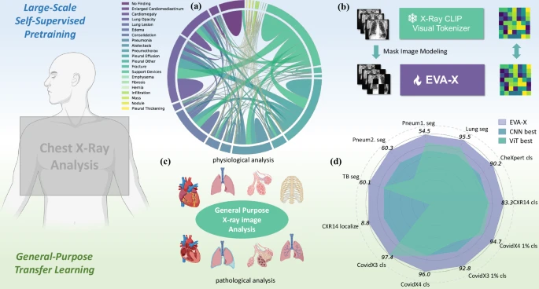
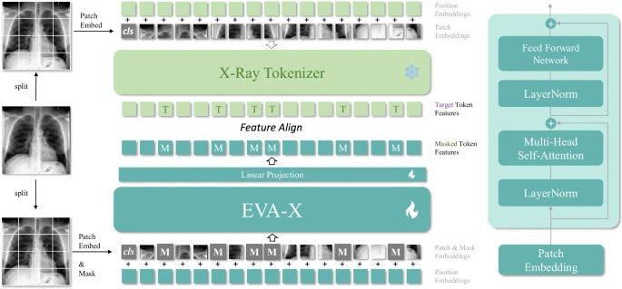
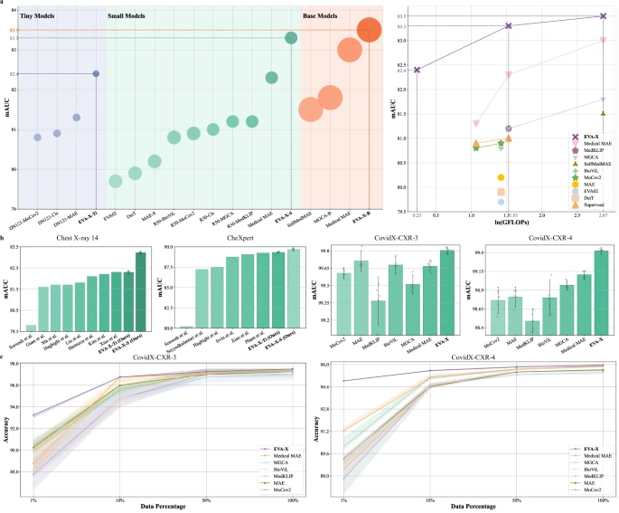
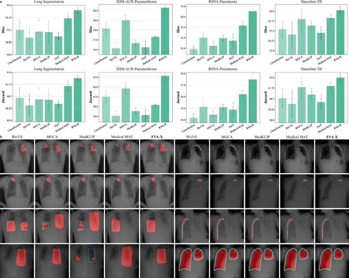
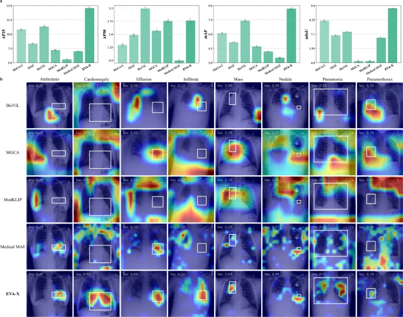
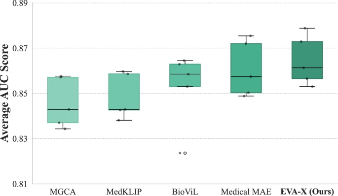

# EVA-X：自己教師あり学習による汎用胸部 X 線解析のための基盤モデル

> 原題: EVA-X: a foundation model for general chest x-ray analysis with self-supervised learning
> 著者: Jingfeng Yao, Xinggang Wang, Yuehao Song, Huangxuan Zhao, Jun Ma, Yajie Chen, Wenyu Liu, Bo Wang
> 所属: 華中科技大学（HUST）など
> 出典: npj Digital Medicine 2025（公開: 2025-11-17）
> コード: https://github.com/hustvl/EVA-X

## Abstract（要旨）

胸部 X 線画像のための人工知能解析手法は、アノテーションデータの不足とアノテーションレベルのばらつきによって制限されており、汎化能力の弱さと臨床普及の困難さをもたらしている。本論文では、X 線画像に基づく広範な適用性を持つ革新的な基盤モデルである **EVA-X** を提示する。EVA-X は、汎用的な X 線画像表現のために、ラベルなし画像から意味情報と幾何情報の両方を捕捉できる自己教師あり学習手法を使用する。胸部疾患解析と位置特定で例外的な性能を実証し、20 以上の異なる胸部病理にわたるモデルとなり、11 以上の異なる病理検出タスクで先導的な結果を達成した。さらに、EVA-X は医療 AI 分野におけるデータアノテーションの負担を大幅に削減し、few-shot 学習領域での強い可能性を示している。EVA-X の登場は基盤医療モデルの開発と応用を大きく推進し、将来の医療研究と臨床実践の潜在的な改善につながる。

## 1. Introduction（はじめに）

胸部 X 線は、COVID-19、肺炎、胸水、肺気腫などを含む心肺異常の診断における有効性により、世界中で年間 36 億件実施される画像化処置の **40%** を構成する。この画像化技術は、手頃な価格、最小限の放射線被曝、広範なアクセス性などのいくつかの利点を提供する。人工知能（AI）の急速な進化により、多数の深層学習モデルが登場し、診断プロセスを迅速化し X 線画像解釈の精度を向上させてきた。しかし、これらのモデルは重大な課題に直面する。広範なラベル付きデータへの強い依存は、重要な医療リソースを消費するだけでなく、臨床設定での有効性とスケーラビリティを制限する。さらに、現在の深層学習モデルのタスク特化的性質は、多様な医療課題に対処する能力を制限し、様々なヘルスケア設定での適応性と柔軟性に影響する。

AI 基盤モデルは最近、目覚ましいマイルストーンを達成し、これらの課題への有望な解決策となっている。広範なデータセットで訓練されたこれらのモデルは、正確な診断支援を提供し、医療専門家のためのより迅速で正確な判断を促進する。それらは通常堅牢で多用途で、幅広いヘルスケアシナリオで最良の性能を達成する。性能スケーラビリティは注目に値し、データとパラメータとともに着実に増加し、多様なヘルスケアニーズに適応する。さらに、その解釈可能性はヘルスケアの安全性を高める。これらの利点は、研究者が特定の医療シナリオのために繰り返し大量にデータをアノテーションし、特定の深層学習モデルを設計する必要性を排除する。**しかし、医療領域では胸部 X 線画像のための効果的で柔軟性があり、スケーラブルで解釈可能な基盤モデルがまだ見られていない。**

これに応えて、我々は自己教師あり学習を使用した包括的な胸部 X 線解析のための基盤モデル EVA-X を導入する。我々は、訓練データとテストデータの両方に 8 つの広く使用されている公開胸部 X 線データセットを採用し、事前学習データは合計 520k 以上に達する（§Methods および Supplementary Section B 参照）。広範なラベルなしデータを活用することで、EVA-X は一般的な視覚表現を獲得し、X 線に基づくすべての胸部疾患検出タスクで効果的なデプロイメントを可能にする。EVA-X は、訓練のためにアノテーションデータを必要とせず、伝統的な対比学習手法と比較して医療リソースの需要を削減することにより、重要な技術的進歩を示す。さらに、EVA-X は X 線領域で**意味的特徴と幾何的特徴を同時に学習する戦略を先駆けて**おり、対比学習事前学習とマスク画像モデリング事前学習の利点を組み合わせている。この革新的なアプローチは、視覚表現の汎用性を高め、多様な胸部疾患検出タスクにわたる広範な利用を促進し、例外的な汎化能力を示す。

広範な実験は EVA-X の X 線領域での優位性を示した。事前学習された視覚表現の観点から、EVA-X はアノテーションデータを一切使用せずに学習できる。16 の以前の事前学習モデルと比較して、EVA-X はより大きなスケーラビリティと柔軟性を示す。転移学習の観点から、我々は EVA-X を 11 の X 線生理学的・病理学的解析タスクでテストした。結果は EVA-X が意味理解と幾何解析で重要な利点を持つことを示している。さらに、EVA-X は下流タスクでのアノテーションデータの必要性を大幅に削減できる。例えば COVID-19 検出では、EVA-X はわずか **1% の訓練データで 95% の精度**を達成する。解釈可能性の観点から、EVA-X はカテゴリ情報のみを使用して病変位置を決定できる。我々は EVA-X が AI の胸部疾患診断性能を大幅に向上させ、それによってヘルスケアにおける AI の応用範囲を広げ、医療リソースの圧迫を軽減し、最終的にグローバル公衆衛生の促進に貢献する可能性を持つと主張する。

## 2. Results（結果）

EVA-X は胸部疾患の解析と診断のために特別に事前学習された医療基盤モデルファミリーである。コンピュータビジョンで広く採用されている [[concepts/vision-transformer]] アーキテクチャを利用し、ラベルなし X 線画像を通じて一般的な視覚表現を獲得する。

図 1a に示すように、我々の事前学習データセットは 20 以上の異なる人間の胸部健康状態を包含し、胸部健康問題の多様性と複雑性を反映している。EVA-X は X 線画像のための新規な自己教師あり事前学習アプローチを設計する（図 1b）。このアプローチは対比学習とマスク画像モデリングの利点を組み合わせ、訓練中に手動アノテーションを必要とせず効率的に意味情報と幾何情報を捕捉する。多様な訓練データと優れた自己教師あり訓練設計のため、EVA-X は様々な X 線ベースの胸部疾患検出シナリオに一般化できる。胸部生理学と病理学解析の幅広いタスクに適用可能である（図 1c）。我々は EVA-X の性能を 11 の異なる X 線画像解析タスクで評価し、以前の最良手法と比較する。図 1d に描かれているように、EVA-X はすべてを上回り、すべてのタスクで SOTA 結果を達成する。我々の知る限り、EVA-X は医療 X 線領域における**高度な ViT 構造の従来の畳み込みモデルに対する包括的な進歩**を表す。この革新は X 線技術の新しい時代の前触れであり、堅牢な視覚基盤モデルが伝統的な設計を置き換える可能性が高い。

<figure>

<figcaption>図1: EVA-X フレームワーク。(a) 20 以上の胸部健康状態を含む事前学習データセットの概要、(b) 対比学習と MIM の利点を組み合わせる新規 SSL 事前学習アプローチ、(c) 胸部生理学・病理学解析の幅広いタスクへの適用、(d) 11 の X 線画像解析タスクで以前の最良手法を上回り SOTA を達成。</figcaption>
</figure>

以下、事前学習、転移学習、解釈可能性の 3 つの主要な観点から EVA-X の優位性を詳細に分析する。EVA-X の自己教師あり学習手法は §Methods で議論する（図 2 参照）。

<figure>

<figcaption>図2: EVA-X 自己教師あり事前学習の全体像。学習可能な EVA-X transformer と凍結トークナイザの dual ViT 構造。マスクされた image token を、対応する凍結トークナイザの特徴に近づける学習。</figcaption>
</figure>

### 2.1 事前学習：性能、効率、柔軟性

EVA-X 事前学習手法を 3 次元で評価する：事前学習された視覚表現の性能、パラメータ数、計算 FLOPs。我々の評価は X 線領域でのベンチマークデータセットとして機能する CXR14 テストセットを採用する（§事前学習データ参照）。EVA-X を DenseNet121、ResNet50、ViTs のような広く使用されているモデルを含む 15 の異なる事前学習 X 線モデルと比較する。医療シナリオの多様な計算要求を考慮して、3 つの異なるスケールの EVA-X モデルを訓練する：**EVA-X-Ti、EVA-X-S、EVA-X-B**。

**EVA-X は SOTA 性能を実証する**。図 3a 左に描かれているように、19 の異なる事前学習モデルをパラメータ数に基づいて 3 つの比較グループ——tiny、small、base モデル——に分類する。注目すべきは、各グループ内で EVA-X が一貫して最低のパラメータ数（6M、22M、86M）を示すことである。EVA-X に著しいスケーラビリティが観察され、パラメータ数が増加するにつれて性能が一貫して向上する。これらのモデルの中で、EVA-X-B は最良の事前学習 X 線モデルとして際立ち、**視覚表現テスト性能 83.5 mAUC** を達成し、Medical MAE のようなすべての以前の医療自己教師あり事前学習手法、MGCA のような対比学習事前学習手法、MAE と MoCov2 のような自然画像のためのよく知られた事前学習手法を上回る。この成果は医療 X 線事前学習における SOTA 性能の新しい基準を設定する。

<figure>

<figcaption>図3: 分類タスクでの性能。(a) 左：パラメータ数別グループでの mAUC 比較（EVA-X-Ti/S/B が各サイズグループで SOTA）。右：FLOPs（対数スケール）vs mAUC のトレードオフ曲線。(b) CXR14、CheXpert、CovidX-CXR-3、CovidX-CXR-4 での比較。(c) ラベル効率実験（COVID-19、訓練データ 1〜100%）。</figcaption>
</figure>

**EVA-X は例外的な効率を達成する**。図 3a 右に描かれているように、テスト中のすべての手法の計算複雑性を評価する。可視化を容易にするため、水平軸の FLOPs を対数スケールで表示する。グラフ上の紫の x マーカーは EVA-X の計算複雑性と性能の相関曲線を示す。EVA-X は他のすべての手法と比較して性能と計算複雑性の卓越したバランスを実現する。

**EVA-X は柔軟性のための小さな代替を提供する**。典型的に高性能を目指す基盤モデルはしばしば高い計算需要を課し、リソース制約のある医療環境では困難である可能性がある。しかし、EVA-X の印象的な能力を活用して、我々はその性能の境界を調査するだけでなく、軽量バリアントである **EVA-X-Ti** も開発する。EVA-X-Ti は **1.26 GFLOPs** という最低の計算複雑性を持ちながら、**82.4 mAUC** という信じられない性能を持つ。EVA-X-Ti と 15 の以前に導入された事前学習モデル（そのほとんどが EVA-X-Ti よりも大きなパラメータ数を持つ）の比較実験を実施する。それにもかかわらず、洗練されたパラメータ（6M）を持つ EVA-X-Ti は、これらのモデルのうち 14 を性能指標で上回った。**EVA-X-Ti の 13 倍の FLOPs を持つ MGCA-B（81.8 mAUC）と SelfMedMAE（81.5 mAUC）すら上回る**。この例外的な性能は、EVA-X-Ti の大規模モデルへのコスト効果的な代替としての可能性を強調し、様々なアプリケーションにわたる EVA-X 技術のより広い採用とより深い統合を促進する。

### 2.2 胸部病理分類における転移学習

X 線画像は胸部疾患診断のための重要なツールの 1 つであり、異なる疾患は X 線画像で異なる症状を示す。我々の実験は、EVA-X 事前学習で学習された視覚表現が汎用的であり、すべての胸部病理の診断タスクに一般化できることを示している。

**マルチラベル分類**は、モデルに複数の異なる疾患の存在について同時に判断を行うことを要求する。我々の研究では、2 つの一般的に使用されるマルチクラス胸部病理診断データセット **Chest X-Ray14** と **CheXpert** を使って EVA-X の一般的な病理検出能力を評価する。追加の設計技術を採用せずに、これら 2 つのデータセットで EVA-X が学習した視覚表現をファインチューニングする。

図 3b CXR14 に示すように、EVA-X の結果を Chest X-Ray14 データセット上の 8 つの異なる手法と比較する。データは平均 ± 95% CI（n = 5）として提示される。これらの手法のほとんどは胸部 X 線分類用に設計されている。その中で、**EVA-X-Ti（6M）の 82.4 mAUC は、DenseNet121（8M）をバックボーンとして使用する Kim et al. が達成した 82.2 mAUC を上回る**。**EVA-X-S（22M）の 83.3 mAUC は、Xiao et al. が ViT-S で達成した 82.3 mAUC を上回る**。総合すると、EVA-X は 2 つの異なるサイズで以前の最良手法を上回り、新しい SOTA 結果に到達する。単一病理診断の観点から、EVA-X は **14 の病理診断のうち 12 で最高精度**を達成することで最良の性能を発揮する。

図 3b CheXpert に示すように、EVA-X を 5 つの以前の手法と比較する。個別のメトリクスでは、EVA-X は 2 つのカテゴリで新しい SOTA 結果に到達する。mAUC の観点では、EVA-X-Ti と EVA-X-S の両方が以前のすべての手法を上回り、新しい SOTA 結果に到達する。中でも EVA-X-Ti はわずか 6M パラメータを持ち、以前のすべての手法より小さく、性能を超え、新しい SOTA 結果を達成する。

**単一ラベル分類**は、モデルに特定の病理について正確な判断を行うことを要求する。本論文では、COVID-19 を例としてこれをテストする。具体的には、最新で収集・アノテーションされたデータセット **COVID-CXR-3** と **COVID-CXR-4** を利用し、各データセットで EVA-X を含む 7 つの異なる事前学習モデルをファインチューニングする。データは平均 ± 95% CI（n = 5）として提示される。図 3b CovidX-CXR-3 と CovidX-CXR-4 に示すように、EVA-X はすべての手法の中で 1 位にランクされ、例外的に高い **99.8 と 99.4 mAUC** を達成する。さらに、EVA-X は際立った安定性を維持し、複数の実験にわたって最も一貫した性能を実証する。具体的には、両データセットでの EVA-X の平均標準偏差は 0.03 で、Medical MAE（0.045）、MGCA（0.055）、BioViL（0.135）等を含むすべての他の手法より低い。

### 2.3 ラベル効率分類における転移学習

大規模データ事前学習で最適化された EVA-X モデルは、下流タスクの小さな訓練データに対する高い感度を示す。最小限のデータで迅速に収束でき、それによってヘルスケアシステムへのアノテーションデータの圧力を直接軽減する。図 3c では、COVID-19 で EVA-X の効率的な訓練能力を検証し、以前の手法と比較する。堅牢な結果を保証するため、各モデルは別個のランダムシード（0-4）を使って 5 回独立に実行する。各訓練エポックの開始時に、訓練セットがシャッフルされ、モデル更新のためにランダムなサブセットがサンプリングされる。性能は 5 回の実行にわたる平均と標準偏差として報告される。すべてのモデルは最終的に公式テストセットで評価される。EVA-X は異なるデータサイズで最も強く最も安定した性能を実証する。**特に非常に少ないアノテーションデータの場合、わずか 1% の訓練データだけで、EVA-X は他の手法に対して明確な利点を示す**。CovidX-CXR-4 データセットでは、**EVA-X はわずか 1% の訓練データで 95% の診断精度を達成**し、リソース制限環境での例外的な学習能力と汎化性能を強調する。

### 2.4 胸部 X 線セグメンテーションにおける転移学習

医療セグメンテーションは、診断を支援するため、深層学習モデルが医療画像で解剖学的構造を正確に描き、病理学的特徴を特定することを要求する。我々は EVA-X の生理学的および病理学的セグメンテーションタスクでの性能を評価することに焦点を当てる。具体的には、生理学的セグメンテーションと、肺炎・気胸・結核の病理学的セグメンテーションを含む 4 つの肺セグメンテーションタスクで、7 つの異なる医療モデルをファインチューニングする。これらのタスクは、多様な健康状態にわたるモデルの堅牢な幾何理解を実証する。図 4 に描かれているように、Dice と Jaccard メトリクスを使ったセグメンテーション結果の定量評価、およびセグメンテーションマスクの可視化が複数の実験を通じて実施された。データは平均 ± 95% CI（n = 5）として提示される。

<figure>

<figcaption>図4: セグメンテーションタスクでの性能。(a) 肺、肺炎、気胸、結核の 4 タスクでの Dice/Jaccard スコア比較。(b) 各タスクのセグメンテーションマスク可視化（EVA-X が最も精緻で正確）。</figcaption>
</figure>

図 4a に示すように、EVA-X は 4 つの異なるタスクで卓越した性能を実証する。具体的には：

- **肺セグメンテーション**: EVA-X は最高の平均 Dice スコア **95.49%** を達成
- **肺炎病理セグメンテーション**: EVA-X は Medical MAE（53.16 Dice、36.20 Jaccard）と BioViL（51.96 Dice、35.10 Jaccard）の両方を **54.51 Dice、37.47% Jaccard** で上回る
- **気胸病理セグメンテーション**: EVA-X は MGCA（59.00 Dice、41.84 Jaccard）と ImageNet 事前学習モデル（57.69 Dice、40.56 Jaccard）を **60.27 Dice、43.13% Jaccard** で上回る
- **肺結核病理セグメンテーション**: EVA-X は **60.10 Dice、42.96% Jaccard** で優秀で、Medical MAE（59.1 Dice、41.96 Jaccard）と MGCA（59.00 Dice、41.84 Jaccard）を上回る

さらに、図 4b に示すように、EVA-X はより正確で細かい粒度の生理学的または病理学的セグメンテーションを提供し、X 線セグメンテーションタスクでの例外的な汎化能力を示す。

### 2.5 解釈可能性

X 線深層学習の解釈可能性は重要なトピックである。**class activation map (CAM)** のようなツールを利用することで、Grad-CAM で議論されているように、ニューラルネットワークの決定の背後にある根拠を解明するのを助けることができる。医療領域では、病理診断はしばしば病変位置特定にかかっている。Saporta et al. は、深層学習が合理的に正確な予測を提供できる一方で、人間の能力と比較して自動的に位置特定する能力には顕著なギャップがあることを観察した。

我々は病理診断の文脈での EVA-X の勾配を解析するために **Grad-CAM** を採用する。我々の解析は、§事前学習データで議論された Chest X-Ray14 データセットからの約 1000 枚の画像を含み、各画像には病変位置がアノテーションされている。続いて、§事前学習：性能、効率、柔軟性で概説されているように事前学習された 7 つの異なるモデル重みを比較評価のために選択する。各事前学習モデルで CAM を取得し、活性化領域とグラウンドトゥルース（GT）ボックスの間の **Intersection over Union (IoU)** と **Average Precision (AP)** を測定する。最適な性能閾値を決定するため、[0.1, 0.6] の範囲内で探索を実施する。

対応する結果を図 5a に提示する。さらに、図 5b に描かれているように、EVA-X と他の 6 モデルの CAM をヒートマップで視覚的に表現する。結果はいくつかの重要な発見を明らかにする。第一に、EVA-X は IoU と AP のような定量化可能なメトリクスで他の 7 手法と比較して優れた性能を実証する。第二に、先行研究の発見と一致して、**MAE で事前学習された ViT は CNN よりも顕著に弱い CAM 性能を示す**。しかし、我々の実験は **EVA-X による支援を受けた場合の ViT の CAM 品質の実質的な改善**を示しており、その結果 **mAP が 3.61 から 8.94 に著しく増加**する。さらに、我々の視覚解析は、EVA-X が以前の手法と比較してより正確で明瞭な活性化マップを生成することを強調する。CNN 手法はマップの連続性で優れた性能を示すが、より小さな病変の位置特定では EVA-X ほど効果的ではない可能性がある。

<figure>

<figcaption>図5: 解釈可能性での性能。(a) 7 つの事前学習モデルの CAM IoU/AP 比較（EVA-X が SOTA）。(b) CAM ヒートマップ可視化（EVA-X が小病変位置特定で優位、ViT-MAE の弱い CAM 性能を補強）。</figcaption>
</figure>

### 2.6 実世界データ評価

EVA-X の実世界シナリオでの可能性を調査するため、内部の実世界データセットで評価を実施した。このデータセットは、武漢同済病院や武漢協和病院を含む **14 の中国の病院**から収集された **10,000 枚の胸部 X 線画像とレポート**を含む。CheXpert と類似の手順に従って、レポートを解析し 14 の異なるラベルのアノテーションを生成するために **Deepseek-v3** を使用する。この変換手法の精度は、ランダムな 1k サブセットでの検証によって確認され、医師のアノテーションに対して **F1 スコア 99%** を達成する。次に、5 分割交差検証スキームを使って、このデータセットで EVA-X-S、Medical MAE、MedKLIP、BioViL、MGCA をテストする。データセットはランダムに 5 つの等サイズの重ならないサブセットに分割される。各分割では、4 つのサブセット（80%）が訓練に使用され、残りのサブセット（20%）がテスト/検証に使用される。図 6 に示すように、**EVA-X は 0.8645 の最良の平均 AUC と 0.8788 の最大 AUC を達成**し、他のすべての手法を上回り、実世界応用での潜在的優位性を実証する。

<figure>

<figcaption>図6: EVA-X の実世界データ評価。中国 14 病院から収集された 10K X 線画像での 5 分割交差検証。EVA-X が平均 AUC 0.8645（最大 0.8788）で SOTA を達成。Deepseek-v3 でレポートをアノテーション（F1 99% 対医師アノテーション）。</figcaption>
</figure>

## 3. Discussion（議論）

我々は X 線画像に特化した医療基盤モデル EVA-X を提案する。以前の研究と異なり、EVA-X は対比学習とマスク画像モデリングの以前の事前学習手法を組み合わせる自己教師あり事前学習戦略を利用する。人間がアノテーションした画像を必要とせずに、すべての X 線タスクのための汎用化可能な視覚表現を学習できる。この独特の利点は EVA-X の事前学習を効果的、効率的、柔軟、スケーラブルにする。15 以上の以前の事前学習深層学習モデルと比較して、EVA-X 基盤モデルは **SOTA 性能と計算のトレードオフ**を達成する。EVA-X モデルを 11 の下流タスクに転移し、以前の SOTA X 線および自然画像事前学習モデルと比較する。結果は EVA-X がすべての下流タスクで以前のすべてのモデルを上回り、X 線画像分類、セグメンテーション、解釈で新しい SOTA 性能を実証することを示す。EVA-X は医療 X 線解析における**汎用基盤モデル**になる大きな可能性を持ち、胸部病理のより速く正確な診断と解析を促進すると我々は主張する。

EVA-X は医療 X 線画像のために設計された基盤モデルである。その訓練プロセスは胸部 X 線に関連するデータに完全に基づいている。したがって、他の医療タスクでの性能は改善の余地がある。EVA-X の独自の高性能自己教師あり事前学習戦略と X 線タスクで示す大きな可能性のため、EVA-X のアプローチは医療領域全体に拡張される可能性が高いと我々は信じる。

EVA-X の訓練データは、公開データセットの Chest X-Ray14、CheXpert、MIMIC-CXR から供給されている。このデータの異質性の完全な分析は補足表 2 に提供される。これらのソースからの固有の異質性と潜在的なバイアス（疾病有病率と患者人口統計の格差、例えば年齢分布等）は、**特定の分布外シナリオでのモデルの性能を損なう可能性がある**。

最近公開された **Ark+** や **CXR-Foundation** のような教師あり公開モデルと比較して、EVA-X はラベルフリーな特性で優れている。実践では、EVA-X の自己教師あり事前学習は教師あり手法を補完でき、モデルがより多くのラベルなし臨床データを活用してより良い性能を達成することを可能にする。

EVA-X のさらなる臨床検証は重要な後続ステップである。一方で、その高効率性（tiny モデルはわずか 6M）を考えると、EVA-X はほとんどの実用的シナリオで補助診断のために迅速に移行・展開できる。他方で、EVA-X は**大規模医療言語モデルやエージェント**と組み合わせた視覚エンコーダとしても機能し、診断性能をさらに向上させることができる。

## 4. Methods（手法）

### 4.1 事前学習データ

EVA-X は公開胸部 X 線データのみを使って訓練される。我々の訓練セットは 3 つの大規模公開データセットの組み合わせである：**Chest X-Ray14、CheXpert、MIMIC-CXR**。これらのデータセットは X 線視覚言語事前学習と画像分類への応用で広く認識されている。以前の研究とは対照的に、我々のアプローチはアノテーションや病理学的レポート情報の利用なしに、純粋にラベルなし画像のみを活用する。

これらのデータセットに対して、以下のように特別に処理する：(1) 以前の研究に従い、主に正面ビュー（AP/PA）画像を使用し、側面ビュー画像を破棄する。(2) ラベルなしであっても、後でテストされる画像のいずれも訓練に使用しない。(3) 訓練を高速化するため、CheXpert と同様に、bilinear 補間を使って元の画像を 336×336 の解像度にリサイズする。組み合わされたデータセットは **Merged520k** と呼ばれる（図 1b 参照）。特に明記しない限り、我々の事前学習実験はこのデータセットで実行される。EVA-X は自己教師あり学習のために直接的なデータ処理手法を利用する。まず、Merged-520k データセット全体を 336 ピクセルの均一サイズにリサイズする。事前学習中、画像を [3/4, 4/3] のサイズにランダムにスケールしてから、**224×224 ピクセルのランダムクロップ**を取得する。最後に、すべての画像は Merged-520k データセットの平均と標準偏差を使って正規化される。

### 4.2 評価データ

自然画像の領域では、**ImageNet** が事前学習の主要なテストデータセットとして典型的に機能する。同様に、X 線画像の領域では、事前学習評価のためにデータセットを選択することが不可欠である。前述のデータセットの中で、**Chest X-Ray14 と CheXpert** の両方が広く利用される分類データセットとして際立つ。これらは 14 の異なる病理にラベルが割り当てられたマルチラベル分類データセットとして特徴付けられる。注目すべきは、これら 14 のラベルが互いに独立していることである。

ここでは、**Chest X-Ray14 を我々の主要テストセット**として選択した。これは最も一般的に使用される X 線分類データセットである。我々の決定は以下の理由に基づく：(1) **より合理的なデータセット分布**。CheXpert データセットは合計 224k 枚の画像から構成されるが、テストにはわずか 200 枚程度しか割り当てられていない。Chest X-Ray では、訓練/検証/テストセット比率は 75/11/25 k である。(2) **より明確なラベル付け**。CheXpert データセットでは「不確実」アノテーションの存在は、医師が状態を特定しなかったことを示す。この不確実性を扱うための様々なアプローチが存在する。一部の手法は均一に「病理あり」として分類し、他は「病理なし」として分類し、より複雑な処理スキームも採用される。しかし、Chest X-Ray14 データセットではラベル付けがより明確である。このテストデータセットの選択は、以前の 2 つの研究とも一致している。

このデータセット選択は、我々がこのデータセットで事前学習研究を実行することを示すが、EVA-X の最終性能をテストするためにこのデータセットのみを使用することを意味しない。

### 4.3 EVA-X アーキテクチャ

EVA-X の事前学習プロセスは **dual Vision Transformer (ViT)** の設計を含む（図 2 参照）。**EVA-X transformer は学習可能であり、トークナイザは凍結されている**。読者の便宜のため、ここで ViT の簡潔な概要から始める。

画像の寸法を $H, W$ と仮定すると、注意計算の前に、ViT は画像を $n = \frac{H}{P} \times \frac{W}{P}$ の異なるパッチに分割する。ここで $P$ はパッチサイズを表す。典型的に、$P$ は 16、14、8 等の値を取ることができる。EVA-X では、特に明記しない限り、すべての ViT のパッチサイズは **16** に設定される。画像パッチについて、ViT は線形射影を使って次元 $d$ の特徴ベクトルに射影する。これは **image token** と呼ばれる。これらのベクトルは **image token sequence** として知られるシーケンスを形成する。さらに、ベクトル間の位置関係を確立するため、ViT は image token sequence に追加される位置エンコーディングを使用する。分類専用のトークンを追加した後、最終入力シーケンスを得る：

$$Z = \{z_0, z_1, \ldots, z_n\} \tag{1}$$

**transformer ブロック**（図 2b 参照）は、入力と同じ出力構造を持つ直接的な構造である。主に 2 つの部分から構成される：**Multi-Head Self-Attention (MHSA)** と **Feed Forward Network (FFN)**。Fang et al.（EVA-02）にインスパイアされ、EVA-X では、**回転位置エンコーディング（rotational positional encoding, RoPE）、Sub-LN、SwiGLU** のような改良された構造を導入し、これらは伝統的な ViT とわずかに異なる。任意の数の transformer ブロックを積み重ねることで、最終的な ViT が構成される。層 $i$ での入力 $Z_i$ について、transformer ブロックは以下の計算を実行して最終出力 $Z_{i+1}$ を生成する。ここで $Z_i$ と $Z_{i+1}$ は同じ構造を持つ：

$$Z' = \text{MHSA}(Z_i) + Z_i \tag{2}$$

$$Z_{i+1} = \text{FFN}(Z'_i) + Z'_i \tag{3}$$

EVA-X は学習可能な Vision Transformer である。ここでは、実験のために 3 つの異なるサイズの ViT を選択した：**ViT-Ti、ViT-S、ViT-B**、各構造のパッチサイズは 16。パラメータ数に基づいて、主に EVA-X-Ti（6M）を DenseNet121（8M）に対してベンチマークし、EVA-X-S（22M）を ResNet50 に対して、EVA-X-B（86M）をパラメータ数のスケールアップの効果と影響を探索するために使用する。

マスク画像モデリングで画像にマスク操作を実行するため、先行研究に従い、$m$ で表される **mask token** を設計した。このトークンは学習可能な $d$ 次元ベクトルである。マスク比 $r$ を仮定すると、$n \cdot r$ image tokens をマスクトークンでランダムに置き換える。このマスクされたトークンのシーケンスを *mask_list* と表記する。すべてのマスクトークンは同じ初期化を持つ。

$$Z_e = \begin{cases} m & \text{if } i \in \text{mask\_list} \\ z_i & \text{otherwise} \end{cases} \tag{4}$$

EVA-X とトークナイザの間に次元の違いがある可能性があるため、線形射影層を使って EVA-X の image tokens の次元を $d_{\text{eva\_x}}$ から $d_{\text{tgt}}$ にマッピングする。EVA-X の最終出力シーケンスは：

$$Z_e = \{ze_0, ze_1, ze_2, \ldots, ze_n\} \tag{5}$$

### 4.4 自己教師あり学習

**トークナイザ**の役割は、画像から意味的に豊かな特徴を抽出することであり、これも ViT 構造である。EVA-X と異なり、一般的により大規模な ViT を選択する。我々は主にトークナイザの事前学習性能のために 2 種類の構造を調査する：**自然画像 CLIP** と**医療画像 CLIP**。自然画像については、**EVA-CLIP** モデルから高度な高性能 ViT-B、ViT-L、ViT-G 視覚エンコーダをトークナイザとして選択する。医療領域では、**MGCA で訓練された ViT-B 視覚エンコーダ**をトークナイザとして選択した。我々の知る限り、MGCA-ViT-B は現在最良のオープンソース X 線 CLIP モデルである。

トークナイザは以下の式に示すようにシーケンス $Z$ を入力として受け取り、ターゲット特徴シーケンス $Z_t$ にマッピングする。事前学習プロセス中、**トークナイザのすべてのパラメータは凍結されたまま**であり、追加の学習可能な線形マッピングは追加されない：

$$Z_t = \{zt_0, zt_1, zt_2, \ldots, zt_n\} \tag{6}$$

前述のように、シーケンス $Z$ について、ランダムに比率 $r$ のトークンを選択し、ランダムに初期化されたマスクトークンで置き換える。ここでは比較的小さなマスク比 **$r = 0.3$** を選択する。マスクされた image tokens のインデックスを *mask_list* と表記する。

EVA-X とトークナイザの最終出力シーケンスについて、*mask_list* の image tokens をそれぞれ選択してシーケンス $Z'$ と $Z'_t$ を形成する。$Z'_e$ と $Z'_t$ の対応するトークン間の**コサイン類似度を最大化することを目指す**：

$$\text{maximize} \sum_{i=1}^{n \cdot r} \frac{Z'(i) \cdot Z'(i)}{\|Z'(i)\| \cdot \|Z'(i)\|} \tag{7}$$

### 4.5 分類における転移学習

分類タスクの場合、すべてのモデルに均一に最も単純なデコード戦略を使用する。ResNet50、DenseNet121 等の CNN については、その最後のネットワーク層から出力された特徴をプーリングのために平均化し、その後プーリングされた特徴を学習可能な線形層に入力して予測を生成する。EVA-X 等の手法で使用される ViT 構造については、最後のブロックから出力されたすべてのトークンを平均化し、その後対応する特徴を予測結果を出力するために学習可能な線形層に入力する。この単純な構造は、複雑な構造設計ではなく、基礎となるモデルを直接比較する能力を保証する。

分類メトリクスとして **mean Area Under the Curve (mAUC)** と **mean Accuracy (mAcc)** を使用する：

$$\text{AUC} = \int_0^1 TPR(FPR)\, dFPR \tag{8}$$

$$\text{Accuracy} = \frac{TP + TN}{TP + TN + FP + FN} \tag{9}$$

### 4.6 セグメンテーションにおける転移学習

先行手法に従い、本論文では主に事前学習された視覚表現性能の比較に焦点を当て、セグメンテーションタスクへの構造改善がもたらす潜在的利点を過度に強調しない。具体的には、X 線事前学習で最も一般的に使用される構造である **ResNet50** と **ViT** をバックボーンとして使用して 2 つのセグメンテーションモデルを構築する。ResNet50 については、ResNet エンコーダと **UNet** デコーダの構造を採用した。ViT については、自然画像での一般的慣行に従い、最後の層の特徴でプーリングとデコンボリューションによって最初に特徴ピラミッドを構築し、その後セグメンテーションタスクのデコーダとして **UperNet** を使用する。構造の単純さを可能な限り保証するため、性能改善をもたらす可能性があっても、高度な適応構造は採用しない。

セグメンテーションメトリクスとして **Dice の平均**と **Jaccard の平均**を使用する：

$$\text{Dice} = \frac{2 \times |S \cap G|}{|S| + |G|} \tag{10}$$

$$\text{Jaccard} = \frac{|S \cap G|}{|S \cup G|} \tag{11}$$

## データとコードの可用性

本研究で使用したすべてのデータセットは公開されている。データ前処理スクリプトとモデル重みは GitHub リポジトリで利用可能：https://github.com/hustvl/EVA-X

データセット入手先：
- Chest X-Ray14: https://www.kaggle.com/datasets/nih-chest-xrays/data
- CheXpert: https://stanfordmlgroup.github.io/competitions/chexpert/
- MIMIC-CXR: https://physionet.org/content/mimic-cxr/2.1.0/
- COVIDx: https://www.kaggle.com/datasets/andyczhao/covidx-cxr2
- SIIM-ACR Pneumothorax: https://www.kaggle.com/datasets/jesperdramsch/siim-acr-pneumothorax-segmentation-data
- RSNA Pneumonia Detection: https://www.kaggle.com/competitions/rsna-pneumonia-detection-challenge
- Tuberculosis Chest X-rays: https://www.kaggle.com/datasets/raddar/tuberculosis-chest-xrays-shenzhen
- Lung Segmentation: https://github.com/YoushanZhang/Lung_Segmentation
