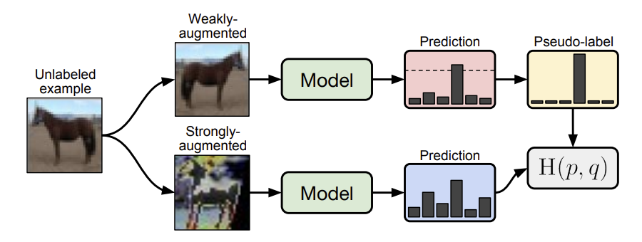

# FixMatch: 一貫性と信頼度による半教師あり学習の単純化

> 原題: FixMatch: Simplifying Semi-Supervised Learning with Consistency and Confidence
> 著者: Kihyuk Sohn\*, David Berthelot\*, Chun-Liang Li, Zizhao Zhang, Nicholas Carlini, Ekin D. Cubuk, Alex Kurakin, Han Zhang, Colin Raffel（\*同等貢献）
> 所属: Google Research
> 出典: NeurIPS 2020

## Abstract（要旨）

半教師あり学習（SSL）はモデルの性能を向上させるためにラベルなしデータを活用する効果的な手段を提供する。このドメインは近年急速に進歩してきたが、それはより複雑な手法を必要とするコストを伴っていた。本論文では、既存の SSL 手法を大幅に単純化したアルゴリズムである FixMatch を提案する。FixMatch はまず、弱く拡張されたラベルなし画像に対するモデルの予測を使って疑似ラベルを生成する。与えられた画像について、モデルが高信頼度の予測を生成した場合にのみ疑似ラベルが保持される。次に、同じ画像を強く拡張したバージョンを入力したときに疑似ラベルを予測するようモデルを訓練する。その単純さにもかかわらず、FixMatch が多くの標準的な半教師あり学習ベンチマークで最先端の性能を達成することを示す。例えば、250 ラベルの CIFAR-10 では 94.93% の精度を達成し、クラスあたりわずか 4 枚——計 40 枚——のラベルで 88.61% の精度を達成する。FixMatch の成功に最も重要な実験的要因を解明するための広範なアブレーション研究を行う。コードは https://github.com/google-research/fixmatch で公開されている。

## 1 Introduction（はじめに）

ディープニューラルネットワークはコンピュータビジョン応用のデファクト・モデルとなっている。その成功は、より大きなデータセットで訓練することがより良い性能を生み出すという経験的観測、すなわちスケーラビリティに部分的に起因している [30, 20, 42, 55, 41, 21]。ディープネットワークは多くの場合、教師あり学習を通じて強力な性能を達成するが、それはラベル付きデータセットを必要とする。大きなデータセットを使用することで得られる性能上の利益は、ラベリングデータが多くの場合人手を必要とするため、大きなコストがかかる可能性がある。このコストは、ラベリングを専門家が行わなければならない場合（例えば、医療応用では医師）に特に大きくなりうる。

ラベルを大量に必要とせずに大量のデータでモデルを訓練するための強力なアプローチが半教師あり学習（SSL）である。SSL は、ラベルなしデータを活用する手段を提供することで、ラベル付きデータの必要性を軽減する。ラベルなしデータは多くの場合最小限の人手で取得できるため、SSL によってもたらされる性能向上はしばしば低コストで実現できる。これにより、深層ネットワーク向けに設計された多数の SSL 手法が生まれてきた [33, 46, 24, 51, 4, 54, 3, 25, 45, 52]。

SSL 手法の一般的なクラスは、ラベルなし画像の人工的なラベルを生成し、ラベルなし画像を入力として与えた際にモデルがその人工的なラベルを予測するよう訓練するものとみなせる。例えば、疑似ラベリング [25]（自己学習 [32, 55, 44, 47] とも呼ばれる）は、モデルのクラス予測をラベルとして使用して学習する。同様に、一貫性正則化 [2, 46, 24] は、入力またはモデル関数をランダムに変更した後のモデルの予測分布を使って人工的なラベルを取得する。

本研究では、最先端の手法が組み合わせる複雑化する仕組みの傾向 [4, 54, 3] を断ち切り、よりシンプルでありながらより精度の高い手法を生み出す。我々のアルゴリズムである FixMatch は、一貫性正則化と疑似ラベリングの両方を使って人工的なラベルを生成する。重要なのは、人工的なラベルが**弱く**拡張されたラベルなし画像（例えば、反転とシフトのみのデータ拡張を使用）に基づいて生成され、モデルが同じ画像の**強く**拡張されたバージョンに対して予測をするよう訓練する際のターゲットとして使用されることである。UDA [54] と ReMixMatch [3] にインスパイアされて、強拡張に Cutout [14]、CTAugment [3]、RandAugment [11] を活用し、これらはすべて与えられた画像の大きく歪んだバージョンを生成する。疑似ラベリングのアプローチ [25] に従い、モデルが可能なクラスのいずれかに高い確率を割り当てた場合にのみ人工的なラベルを保持する。FixMatch の図を図 1 に示す。

<figure>

<figcaption>図1: FixMatch の図。弱く拡張された画像（上）をモデルに入力して予測（赤いボックス）を得る。モデルが閾値（点線）を超える確率を任意のクラスに割り当てた場合、その予測は one-hot 疑似ラベルに変換される。次に、同じ画像の強拡張バージョン（下）に対するモデルの予測を計算する。モデルはクロスエントロピー損失によって強拡張バージョンの予測を疑似ラベルに一致させるよう訓練される。</figcaption>
</figure>

その単純さにもかかわらず、**FixMatch が最も一般的に研究されている SSL ベンチマークで最先端の性能を達成する**ことを示す。例えば、FixMatch は 250 枚のラベルあき例を使って CIFAR-10 で 94.93% の精度を達成し、標準的な実験設定の従来の最先端性能 93.73% [3] を上回る。また、クラスあたりわずか 4 枚のラベルを使って CIFAR-10 で 88.61% の精度を達成し、極めてラベルが少ない設定でのアプローチの限界も探る。FixMatch は既存のアプローチの単純化であるが、大幅に優れた性能を達成するため、その成功に最も貢献する要因を決定するための広範なアブレーション研究を含める。FixMatch の主要な利点の 1 つは、それが既存手法の単純化であることから、追加のハイパーパラメータが大幅に少ないことである。そのため、それぞれについて広範なアブレーション研究を行うことができる。アブレーション研究には、新しい SSL 手法が提案される際しばしば無視または報告されない完全教師あり学習の実験的選択（オプティマイザや学習率スケジュールなど）も含まれる。

## 2 FixMatch

FixMatch は SSL への 2 つのアプローチの組み合わせである：一貫性正則化と疑似ラベリング。その主要な新規性はこれら 2 つの要素の組み合わせ、および一貫性正則化を行う際に別々の弱拡張と強拡張を使用することである。このセクションでは、まず FixMatch を詳細に説明する前に一貫性正則化と疑似ラベリングを概説する。また、FixMatch の経験的成功に貢献する正則化などの他の要因も説明する。

$L$ クラス分類問題について、$\mathcal{X} = \{(x_b, p_b) : b \in (1,\ldots,B)\}$ を $B$ 枚のラベルあき例のバッチとする。ここで $x_b$ は訓練例、$p_b$ は one-hot ラベルである。$\mathcal{U} = \{u_b : b \in (1,\ldots,\mu B)\}$ を $\mu B$ 枚のラベルなし例のバッチとする。ここで $\mu$ はラベルあきとなしの相対的なサイズを決定するハイパーパラメータである。$p_{\rm m}(y \mid x)$ をモデルが入力 $x$ に対して生成する予測クラス分布とする。2 つの確率分布 $p$ と $q$ のクロスエントロピーを $\mathrm{H}(p, q)$ と表記する。FixMatch の一部として 2 種類の拡張を行う：強拡張を $\mathcal{A}(\cdot)$、弱拡張を $\alpha(\cdot)$ と表記する。$\mathcal{A}$ と $\alpha$ の拡張の形を Section 2.3 で説明する。

### 2.1 Background（背景）

*一貫性正則化*は最先端の SSL アルゴリズムの重要な構成要素である。一貫性正則化は、モデルが同じ画像の摂動されたバージョンに対して似た予測を出力すべきという仮定に依拠してラベルなしデータを活用する。このアイデアは [2] で最初に提案され、[46, 24] で普及した。ここでは、モデルが標準的な教師あり分類損失と、損失関数

$$\sum_{b=1}^{\mu B} \|p_{\rm m}(y \mid \alpha(u_b)) - p_{\rm m}(y \mid \alpha(u_b))\|_2^2 \tag{1}$$

によるラベルなしデータの両方で訓練される。式 (1) では $\alpha$ と $p_{\rm m}$ は両方とも確率的関数であるため、2 つの項は実際には異なる値を持つことに注意されたい。このアイデアへの拡張には、$\alpha$ の代わりに敵対的変換を使用する方法 [33]、過去のモデル予測や $p_{\rm m}$ の実行平均を 1 回の $\alpha$ 呼び出しに使用する方法 [51, 24]、二乗 $\ell^2$ 損失の代わりにクロスエントロピー損失を使用する方法 [33, 54, 3]、より強い拡張形式を使用する方法 [54, 3]、および一貫性正則化を大きな SSL パイプラインの構成要素として使用する方法 [4, 3] が含まれる。

*疑似ラベリング*はラベルなしデータの人工的なラベルを取得するためにモデル自体を使うというアイデアを活用する [32, 47]。具体的には、モデルの出力の argmax に相当する「ハード」ラベル（すなわち、最大クラス確率が事前定義された閾値を上回るもの）のみを保持し、人工的なラベルとして保持することを指す [25]。$q_b = p_{\rm m}(y \mid u_b)$ とすると、疑似ラベリングは次の損失関数を使用する：

$$\frac{1}{\mu B} \sum_{b=1}^{\mu B} \mathbb{1}(\max(q_b) \geq \tau) \, \mathrm{H}(\hat{q}_b, q_b) \tag{2}$$

ここで $\hat{q}_b = \arg\max(q_b)$ であり $\tau$ は閾値である。単純化のために、$\arg\max$ が確率分布に適用されると有効な「one-hot」確率分布を返すと仮定する。ハードラベルの使用は、モデルの予測がラベルなしデータに対して低エントロピー（すなわち、高信頼度）であるよう促されるエントロピー最小化 [17, 45] と疑似ラベリングを密接に関連づける。

### 2.2 Our Algorithm: FixMatch（我々のアルゴリズム：FixMatch）

FixMatch の損失関数は 2 つのクロスエントロピー損失項からなる：ラベルあきデータに適用される教師あり損失 $\ell_s$ と教師なし損失 $\ell_u$ である。具体的には、$\ell_s$ は弱く拡張されたラベルあき例に対する標準的なクロスエントロピー損失である：

$$\ell_s = \frac{1}{B} \sum_{b=1}^{B} \mathrm{H}(p_b, p_{\rm m}(y \mid \alpha(x_b))) \tag{3}$$

FixMatch は各ラベルなし例の人工的なラベルを計算し、それを標準的なクロスエントロピー損失に使用する。人工的なラベルを取得するために、まず与えられたラベルなし例の**弱く**拡張されたバージョンに対するモデルの予測クラス分布を計算する：$q_b = p_{\rm m}(y \mid \alpha(u_b))$。次に、$\hat{q}_b = \arg\max(q_b)$ を疑似ラベルとして使用する。ただし、$u_b$ の**強く**拡張されたバージョンに対するモデルの出力に対してクロスエントロピー損失を強制する：

$$\ell_u = \frac{1}{\mu B} \sum_{b=1}^{\mu B} \mathbb{1}(\max(q_b) \geq \tau) \, \mathrm{H}(\hat{q}_b, p_{\rm m}(y \mid \mathcal{A}(u_b))) \tag{4}$$

ここで $\tau$ は疑似ラベルを保持する閾値を表すスカラーハイパーパラメータである。FixMatch によって最小化される損失は単純に $\ell_s + \lambda_u \ell_u$ であり、$\lambda_u$ はラベルなし例の相対的な重みを表す固定スカラーハイパーパラメータである。FixMatch の完全なアルゴリズムを補足資料のアルゴリズム 1 に示す。

式 (4) は式 (2) の疑似ラベリング損失と類似しているが、人工的なラベルが弱く拡張された画像に基づいて計算され、損失がモデルの強く拡張された画像に対する出力に強制されるという点で決定的に異なる。これは、Section 5 で示すように FixMatch の成功に重要な一貫性正則化の形を導入する。また、訓練中にラベルなし損失項（$\lambda_u$）の重みを増加させることが現代の SSL アルゴリズムでは一般的であることにも注意する [51, 24, 4, 36]。FixMatch ではこれが不要であることがわかった。これは、訓練の初期では $\max(q_b)$ が典型的に $\tau$ を下回るという事実によるかもしれない。訓練が進むにつれて、モデルの予測はより確信ある（高信頼度の）ものとなり、$\max(q_b) > \tau$ となるケースがより頻繁になる。これは疑似ラベリングが「自然にカリキュラムを生成する」ことを示唆する。視覚的ドメイン適応において低信頼度の予測を無視する理由付けとして同様の理由が使用されてきた [15]。

### 2.3 Augmentation in FixMatch（FixMatch における拡張）

FixMatch は 2 種類の拡張を活用する：「弱い」と「強い」である。すべての実験において、弱拡張は標準的な反転シフト拡張戦略である。具体的には、SVHN を除くすべてのデータセットで 50% の確率でランダムに画像を水平反転し、垂直および水平方向に最大 12.5% ランダムに画像を平行移動する。

「強」拡張については、AutoAugment [10] に基づく 2 つの方法を試す。AutoAugment は Python Imaging Library からの変換を含む拡張戦略を見つけるための強化学習を使用する。これには拡張戦略を学習するためにラベルあきデータが必要であり、利用可能なラベルデータが限られている SSL 設定では使用が難しい。その結果、RandAugment [11] や CTAugment [3] のように、ラベルあきデータで事前に拡張戦略を学習する必要のない AutoAugment の変形が提案された。RandAugment も CTAugment も、各サンプルに対してランダムに変換を選択する。RandAugment については、すべての歪みの強度を制御する大きさはあらかじめ定義された範囲からランダムにサンプリングされる（RandAugment のランダム大きさは UDA [54] でも使用された）。CTAugment については、個々の変換の大きさはオンラインで学習される。詳細は補足資料 E を参照。

### 2.4 Additional Important Factors（その他の重要な要因）

半教師あり学習の性能は、SSL アルゴリズム自体以外の要因によって大幅に影響される可能性がある。これは、正則化の量などの考慮事項が低ラベル設定で特に重要となりうるためである。これは、画像分類のためのディープネットワークの性能がアーキテクチャ、オプティマイザ、訓練スケジュール等に大きく依存するという事実によってさらに複雑になる。これらの要因は通常、新しい SSL アルゴリズムが導入される際には強調されない。代わりに、我々はその重要性を定量化し、性能に大きな影響を与えるものを特定することに努める。ほとんどの分析はセクション 5 で行う。このセクションでは、いくつかの重要な考慮事項を特定する。

まず、上述のように、正則化が特に重要であることがわかる。すべてのモデルと実験において、単純な重み減衰正則化を使用する。Adam オプティマイザ [22] を使用すると性能が悪化し、代わりにモメンタム付き標準 SGD [50, 40, 34] を使用することがわかった。標準モメンタムと Nesterov モメンタムの間に実質的な差は見つからなかった。学習率スケジュールには、$\eta \cos\left(\frac{7\pi k}{16K}\right)$ に学習率を設定するコサイン減衰 [28] を使用する。ここで $\eta$ は初期学習率、$k$ は現在の訓練ステップ、$K$ は訓練ステップの総数である。最後に、モデルパラメータの指数移動平均を使用して最終性能を報告する。

### 2.5 Extensions of FixMatch（FixMatch の拡張）

その単純さから、FixMatch は SSL 文献の技術で容易に拡張できる。例えば、ReMixMatch [3] のオーギュメンテーション・アンカリング（各ラベルなし例について M 個の強拡張を一貫性正則化に使用する）とDistribution Alignment（ラベルあきセットと同じクラス分布を持つようモデルの予測を促す）は、FixMatch に直接適用できる。さらに、FixMatch の強拡張を MixUp [59] などのモダリティに依存しない拡張戦略や敵対的摂動 [33] に置き換えることができる。これらの拡張についてのいくつかの探索と実験を補足資料 D に示す。

## 3 Related Work（関連研究）

半教師あり学習は幅広いアプローチが存在する成熟した分野である。このレビューでは、FixMatch に密接に関連する手法に焦点を当てる。より広範な紹介は [60, 61, 6] に提供されている。

自己学習のアイデアは何十年も前から存在する [47, 32]。自己学習の一般性（すなわち、ラベルなしデータの人工的なラベルを取得するためにモデルの予測を使用すること）は、NLP [31]、物体検出 [44]、画像分類 [25, 55]、ドメイン適応 [62] など多くのドメインでそれが適用されてきた。疑似ラベリングはモデルの予測がハードラベルに変換される特定の変形を指す [25]（信頼度ベースの閾値処理も使用されることが多い [44]）。一部の研究は疑似ラベリングが単独では他の現代的な SSL アルゴリズムと競合しないと示唆しているが [36]、最近の SSL アルゴリズムはより良い結果を生み出すために疑似ラベリングをパイプラインの一部として使用している [1, 39]。上述のように、疑似ラベリングはエントロピー最小化 [17] の一形態をもたらし、多くの SSL 技術の構成要素として使用されてきた [33]。

一貫性正則化は最初に [2] で提案され、後に「Transformation/Stability」（略して TS）[46] または「Π-Model」[43] と呼ばれた。初期の拡張には、人工的なラベルを生成する際にモデルパラメータの指数移動平均を使用すること [51] や、過去のモデルチェックポイントを使用すること [24] が含まれた。人工的なラベルを生成するためにデータ拡張 [15]、確率的正則化（例えばドロップアウト [49]）[46, 24]、敵対的摂動 [33] など複数の手法が使用されてきた。より近年では、強いデータ拡張を使用することがより良い結果をもたらすことが示されている [54, 3]。これらの大きく拡張された例はほぼ確実にデータ分布外であり、実際に SSL に有益であることが示されている [12]。Noisy Student [55] はこれらの技術を自己学習フレームワークに統合し、大量の追加ラベルなしデータで ImageNet での印象的な性能を示した。

上述の研究のうち、FixMatch は 2 つの最近の手法に最も近い：Unsupervised Data Augmentation（UDA）[54] と ReMixMatch [3]。両者とも弱く拡張された例を使って人工的なラベルを生成し、強く拡張された例に対して一貫性を強制する。どちらも疑似ラベリングを使用しないが、両アプローチとも「シャープニング」して高信頼度の予測を促すよう人工的なラベルを調整する。UDA は特に、予測されたラベル分布で最も高い確率が閾値を上回る場合にのみ一貫性を強制する。FixMatch の閾値付き疑似ラベリングはシャープニングと閾値処理と同様の効果を持つ。さらに、ReMixMatch はラベルなし損失の重みをアニールするが、疑似ラベリングで使用される閾値処理が同様の効果を持つ（Section 2.2 で述べたように）と考えるため、FixMatch からこれを省略する。これらの類似点は、FixMatch が UDA と ReMixMatch の大幅に単純化されたバージョンとみなせることを示唆する。そこでは、2 つの一般的な技術（疑似ラベリングと一貫性正則化）を組み合わせ、シャープニング、訓練信号アニーリング（UDA）、分布アライメントと ReMixMatch からの回転損失などの多くの構成要素を除去している。

FixMatch の核心は多くの以前に提案された SSL アルゴリズムとの大きな類似点も持つため、表 1 に FixMatch を含む各アルゴリズムの簡潔な比較を示す。ここでは、人工的なラベルに使用される拡張、モデルの予測、および人工的なラベルに適用される後処理を一覧にしている。

**表 1**: 一貫性正則化の形を含む SSL アルゴリズムの比較。人工的なラベルに関連する SSL アルゴリズムの構成要素（例えば、Virtual Adversarial Training はエントロピー最小化も使用する、MixMatch と ReMixMatch は MixUp [59] も使用する、UDA は訓練信号アニーリングなどの追加技術を含む）のみ言及する。

| アルゴリズム | 人工ラベルの拡張 | 予測の拡張 | 人工ラベルの後処理 | 備考 |
|---|---|---|---|---|
| TS / Π-Model | 弱 | 弱 | なし | |
| Temporal Ensembling | 弱 | 弱 | なし | 以前の訓練からのモデルを使用 |
| Mean Teacher | 弱 | 弱 | なし | パラメータの EMA を使用 |
| Virtual Adversarial Training | なし | 敵対的 | なし | |
| UDA | 弱 | 強 | シャープニング | 低信頼度の人工ラベルを無視 |
| MixMatch | 弱 | 弱 | シャープニング | 複数の人工ラベルを平均化 |
| ReMixMatch | 弱 | 強 | シャープニング | 複数の予測に対する損失を合算 |
| **FixMatch** | **弱** | **強** | **疑似ラベリング** | |

## 4 Experiments（実験）

いくつかの SSL 画像分類ベンチマークで FixMatch の有効性を評価する。具体的には、様々な量のラベルあきデータと拡張戦略で CIFAR-10/100 [23]、SVHN [35]、STL-10 [9]、ImageNet [13] で実験を行い、標準的な SSL 評価プロトコル [36, 4, 3] に従う。多くの場合、FixMatch は極めてラベルが少ない設定でも有望な結果を示すため、以前に検討されたよりも少ないラベルで実験を行う。ImageNet 以外のすべてのデータセットで $\lambda_u = 1$、$\eta = 0.03$、$\beta = 0.9$、$\tau = 0.95$、$\mu = 7$、$B = 64$、$K = 2^{20}$ のハイパーパラメータを使用する。ハイパーパラメータの完全なリストは補足資料 B.1 に報告する。これらの異なる成分と FixMatch のハイパーパラメータの重要性を解明するための広範なアブレーション研究を Section 5 に含める。

### 4.1 CIFAR-10, CIFAR-100, and SVHN

標準的な CIFAR-10、CIFAR-100、SVHN ベンチマークで FixMatch を様々な既存手法と比較する。[36] が推奨するように、すべての既存ベースラインを再実装し、同じコードベースを使って同じデータ前処理、訓練プロトコル（オプティマイザ、学習率スケジュール、データ前処理等）をすべての SSL 手法で使用して全実験を行った。CIFAR-10 と SVHN には [36] と同様に 1.5M パラメータの Wide ResNet-28-2 [56] を、CIFAR-100 には WRN-28-8 を、STL-10 には WRN-37-2 を使用する。ベースラインとして、Π-Model [43]、Mean Teacher [51]、Pseudo-Label [25]、MixMatch [4]、UDA [54]、ReMixMatch [3] を考慮する。[3] と同様に、以前の研究はこれらのベンチマークでクラスあたり 25 枚以上のラベルを検討していない。ラベルあきデータがはるかに少ない場合の性能を向上させることが実際の SSL の中心的な目標であるため、それを改善した方法でより多くのラベルを使う方が良い。各データセットでクラスあたり 4 枚のラベルのみを与える設定も検討する。これは我々の知る限り、CIFAR-100 でクラスあたり 4 枚のラベルで*いかなる*実験も行った最初のものである。

表 2 に FixMatch とともにすべてのベースラインの性能を報告する。ラベルあきデータの 5 つの異なる「フォールド」で訓練した際の精度の平均と分散を計算する。Π-Model、Mean Teacher、Pseudo-Labeling については 250 ラベルで性能が悪かったため、クラスあたり 4 枚のラベルの結果を省略する。MixMatch、ReMixMatch、UDA はすべて 40 ラベルと 250 ラベルで適度に良く機能するが、FixMatch はそれぞれこれらの手法を大幅に上回ることがわかる。例えば、FixMatch はクラスあたり 4 枚のラベルで CIFAR-10 の平均エラー率 11.39% を達成する。参考として、[36] で研究された手法（同じネットワークアーキテクチャが使用された）では、クラスあたり *400* 枚のラベルで CIFAR-10 で達成された最低エラー率は 13.13% であった。また、我々の結果は、シャッフルを省略して自己教師あり損失などの様々な追加コンポーネントを含む ReMixMatch [3] の最近の最先端結果と有利に比較される。

クラスあたり 4 枚のラベルについて、Π-Model、Mean Teacher、Pseudo-Labeling は 250 ラベルでの性能が悪かったため結果を省略する。CIFAR-100 で ReMixMatch が FixMatch よりわずかに性能が良い理由を理解するために、ReMixMatch の様々なコンポーネントを FixMatch にコピーするいくつかの FixMatch 変形で実験した。最も重要な項は、ラベルあきセットと同じクラス分布を持つようモデルの予測を促す Distribution Alignment（DA）であることがわかった。FixMatch と DA を組み合わせると、400 枚のラベルあき例で 40.14% のエラー率が得られ、ReMixMatch が達成した 44.28% よりも大幅に良くなる。

CTAugment と RandAugment を使用した FixMatch の性能はほとんどの場合において類似していることがわかる。ただし、クラスあたり 4 枚のラベルの設定では、分散は各クラスについて 4 枚のラベルしか提供されないという事実によって説明できる 3.35% と高い。250 ラベルのクラスあたりの場合（0.33%）よりも有意に高い。エラー率はラベルあき例の数が非常に少ない場合に乱数シードによって大幅に影響されることも分かっており、表 8 の補足資料に示される。

### 4.2 STL-10

STL-10 データセットは 10 クラスから 96×96 サイズの 5,000 枚のラベルあき画像と 100,000 枚のラベルなし画像を含む。ラベルなしセットには分布外の画像が存在し、SSL 性能のより現実的で困難なテストとなる。1,000 枚のラベルあき画像の 5 つの事前定義フォールドで SSL アルゴリズムを検証する。[4] に従い、5.9M パラメータからなる WRN-37-2 ネットワークを使用する。表 2 に示すように、FixMatch は大幅に単純でありながら ReMixMatch [3] の最先端性能を達成する。

### 4.3 ImageNet

より大規模で複雑なデータセットでも良好に機能することを確認するために ImageNet で FixMatch を評価する。[54] に従い、訓練データの 10% をラベルありとして使用し、残りをラベルなし例として扱う。ResNet-50 ネットワークアーキテクチャと RandAugment [11] を強拡張として使用する。追加の実装詳細は補足資料 C に含まれる。FixMatch は 28.54 ± 0.52% の top-1 エラー率を達成し、UDA [54] より 2.68% 良い。top-5 エラー率は 10.87 ± 0.28% である。S4L [57] は半教師あり ImageNet で 26.79% のエラー率で最先端に立つが、疑似ラベルの再訓練と教師あきファインチューニングの 2 つの追加訓練フェーズを活用して、最初のフェーズ後の 30.27% から大幅にエラー率を低下させる。FixMatch は最初のフェーズ後の S4L を上回り、同様の性能向上がこれらの技術を FixMatch に組み込むことで達成できる可能性がある。

### 4.4 Barely Supervised Learning（最小教師あり学習）

提案したアプローチの限界を検証するために、**クラスあたり 1 枚のラベルのみ**で CIFAR-10 に FixMatch を適用した。2 セットの実験を行う。

まず、1 つのクラスあたり 1 例をランダムに選択して 4 つのデータセットを作成する。各データセットで 4 回訓練し、中央値 64.28% で 48.58% から 85.32% の間のテスト精度に達する。データセット間分散はずっと低く；例えば、最初のデータセットで訓練された 4 つのモデルはすべて 61% から 67% の精度に達し、2 番目のデータセットは 68% から 75% の間に達する。

この高い分散は、各データセットを構成する 10 枚のラベルあき例の質によって引き起こされると仮定する。低品質の例をサンプリングするとモデルが特定のクラスを効果的に学習することが困難になりうる。これを検証するために、最も典型的なものから最も典型的でないものへと例を整理する CIFAR-10 訓練セットの順序付け [5] を使用して「プロトタイプ性」の範囲で例を持つ 8 つの新しい訓練データセットを構築する。この例の順序付けは CIFAR-10 モデルを全ラベルデータで多数回訓練した後に決定された。したがって、これを SSL でのラベルあき例を選択するための実用的な方法とは考えていないが、より典型的な例がより少ないラベルの訓練に適していることを実験的に検証するためである。この順序付けを 8 つの等しいバケットに均等に分割し（最初のバケットには最も典型的な例がすべて含まれ、最後のバケットにはすべての外れ値が含まれる）、同じバケットから各クラスの 1 例をランダムに選択して 8 つのラベルあき訓練セットを作成する。

同じハイパーパラメータを使用すると、最も典型的な例のみで訓練されたモデルは中央値 78% の精度（最大 84% の精度）に達し；分布の中間での訓練は 65% の精度に達し；外れ値のみでの訓練は完全に収束せず 10% の精度となる。図 2 は FixMatch が中央値 78% の精度を達成した分割の完全なラベルあき訓練データセットを示す。さらなる分析は補足資料 B.7 に示される。

## 5 Ablation Study（アブレーション研究）

FixMatch は 2 つの既存の技術の単純な組み合わせを含むため、なぜ最先端の結果を達成できるのかをよりよく理解するための広範なアブレーション研究を行う。アブレーションにおける実験の数から、単一の 250 ラベル分割で実験を焦点を当て、CTAugment を使用した結果のみを報告する。FixMatch はデフォルトパラメータでこの特定の分割で 4.84% のエラー率を達成することに注意する。より完全なアブレーション結果（オプティマイザ（補足資料 B.3）、学習率減衰スケジュール（補足資料 B.4）、重み減衰（補足資料 B.6）、ラベルありからラベルなしデータ比率 $\mu$（補足資料 B.5））を補足資料に示す。

### 5.1 Sharpening and Thresholding（シャープニングと閾値処理）

「ソフト」バージョンの疑似ラベリングは、予測された分布をシャープニングすることで設計できる。この定式化は UDA に現れ、MixMatch や ReMixMatch などの他の手法もシャープニングを使用する（ただし閾値処理なし）。$\arg\max$ の代わりにシャープニングを使用するとハイパーパラメータ $T$ が導入される [4, 54, 3]。

温度 $T$ と信頼度閾値 $\tau$ の相互作用を研究する。FixMatch では $T \to 0$ として疑似ラベリングが復元されることに注意する。結果を図 3(a) と図 3(b) に示す。閾値 0.95 が最低のエラー率を示し、0.97 や 0.99 に増加させてもそれほど悪化しない。一方、小さい閾値を使用すると精度が 1.5% 以上低下する。閾値値が疑似ラベルの品質と量のトレードオフを制御することに注意する。補足資料 B.2 に示すように、ラベルなしデータの精度は閾値が高い場合に増加し、一方で $\ell_u$ の式 (4) に寄与するラベルなし例の量は減少する。これは高精度に達するためには疑似ラベルの量より品質が重要であることを示唆する。一方、シャープニングは信頼度閾値が使用された場合にパフォーマンスに大きな差を示さなかった。まとめると、疑似ラベリングをシャープニングと閾値処理に置き換えると、パフォーマンスが向上せずに新しいハイパーパラメータが導入されることがわかる。

### 5.2 Augmentation Strategy（拡張戦略）

FixMatch で重要な役割を果たす異なる強いデータ拡張ポリシーに関するアブレーション研究を行う。具体的には、UDA [54] と ReMixMatch [4] でそれぞれ使用されてきた最先端の SSL アルゴリズムに使用されてきた RandAugment [11] と CTAugment [3] を選択した。CIFAR-10、CIFAR-100、SVHN では 2 つのポリシー間で非常に類似した結果が観察されるが、STL-10 では（表 2）CTAugment を使用することで大きな利得が観察される。

表 3 に示す Cutout の効果を測定する。RandAugment と CTAugment の両方の強拡張後にデフォルトで使用される Cutout と CTAugment の両方が最良の性能を得るために必要であることがわかる；どちらかを削除するとエラー率が大幅に増加する。

疑似ラベル生成と予測（すなわち、図 1 の上下のパス）に対する弱拡張と強拡張の異なる組み合わせも研究する。ラベル推定の弱拡張を強拡張に置き換えると、訓練が早期に発散することがわかった。逆に、弱拡張を*拡張なし*に置き換えると、モデルが推測されたラベルなしラベルに過学習する。訓練のために強拡張の代わりに弱拡張を使用すると予測は 45% の精度でピークに達するが安定せず、12% に徐々に崩壊した。これは強いデータ拡張の重要性を示唆する。この観察は教師あり学習からの観察と一致している [10]。

## 6 Conclusion（結論）

SSL では急速な最近の進歩があった。残念ながら、この進歩の多くは、複雑な損失項と多数の調整が困難なハイパーパラメータを持つ複雑化する学習アルゴリズムのコストで来ている。我々は FixMatch を導入する。これは多くのデータセットで最先端の結果を達成するより単純な SSL アルゴリズムである。FixMatch が低ラベル半教師あり学習と few-shot 学習やクラスタリングの間のギャップを埋め始める方法を示す：ラベルがクラスあたり 1 枚のみ提供される場合でも驚くほど高い精度を得られる。ラベルありデータとラベルなしデータの両方に対して標準的なクロスエントロピー損失のみを使用すると、FixMatch の訓練目標はわずか数行のコードで書ける。

この単純さから、FixMatch がどのように機能するかを徹底的に調査することができる。特定の設計選択が重要（そしてしばしば過小評価されている）ことがわかる——最も重要なのは重み減衰とオプティマイザの選択である。これらの要因の重要性は、アーキテクチャが [36] で推奨されているように制御されている場合でも、同じ技術が異なる実装間で常に直接比較できないことを意味する。

全体として、このような単純だが高性能な半教師あり機械学習アルゴリズムの存在は、ラベルが高価または取得困難な実用的なドメインにますます多く機械学習を展開することを可能にするのに役立つと信じる。

## Broader Impact（より広い影響）

FixMatch は 2 つの方法で機械学習の民主化を助ける：その単純さはより広いオーディエンスにアクセス可能にし、わずかなラベルでの精度はラベルが高価または困難な場合には以前は機械学習が実行不可能だったドメインに適用できることを意味する。機械学習研究の民主化の裏返しは、良い行為者と悪い行為者の両方が適用しやすくなることである。この能力が善のために使用されることを望む——例えば、医療スキャンを取得することは専門の医師にラベルを支払うことよりもしばしば低コストである。しかし、より高度な半教師あり学習技術がより高度な監視を可能にするかもしれない：例えば、1 shot 分類の有効性は少数の画像からより正確な人物識別を可能にするかもしれない。大まかに言えば、半教師あり学習におけるいかなる進歩もこれらと同じ結果をもたらす。

---

## Appendix A アルゴリズム（Algorithm）

FixMatch の完全なアルゴリズムをアルゴリズム 1 に示す。

**アルゴリズム 1** FixMatch アルゴリズム

1. **入力**: ラベルありバッチ $\mathcal{X} = \{(x_b, p_b) : b \in (1,\ldots,B)\}$、ラベルなしバッチ $\mathcal{U} = \{u_b : b \in (1,\ldots,\mu B)\}$、信頼度閾値 $\tau$、ラベルなしデータ比率 $\mu$、ラベルなし損失重み $\lambda_u$
2. $\ell_s = \frac{1}{B}\sum_{b=1}^{B}\mathrm{H}(p_b, p_{\rm m}(y \mid \alpha(x_b)))$ \{ラベルあきデータのクロスエントロピー損失\}
3. **for** $b=1$ **to** $\mu B$ **do**
4. $q_b = p_{\rm m}(y \mid \alpha(u_b); \theta)$ \{ラベルなし $u_b$ に弱拡張を適用した後の予測を計算\}
5. **end for**
6. $\ell_u = \frac{1}{\mu B}\sum_{b=1}^{\mu B}\mathbb{1}\{\max(q_b) > \tau\}\mathrm{H}(\arg\max(q_b), p_{\rm m}(y \mid \mathcal{A}(u_b)))$ \{疑似ラベルと信頼度でラベルなしデータのクロスエントロピー損失\}
7. **return** $\ell_s + \lambda_u \ell_u$

## Appendix B 包括的な実験結果（Comprehensive Experimental Results）

### B.1 ハイパーパラメータ（Hyperparameters）

Section 4 で述べたように、CIFAR-10、CIFAR-100、SVHN、STL-10 でほぼ同一のハイパーパラメータを使用した。CIFAR-100 には大きなラベル空間を扱うためにより多くの畳み込みフィルターが使用され（WRN-28-8）、STL-10 には大きな入力サイズを扱うためにより多くの畳み込みが使用されていることに注意する。[4] の提案に従い、過学習を避けるために WRN-28-8 の重み減衰パラメータを 2 倍にした。完全なハイパーパラメータのリストを表 4 に示す。

**表 4**: CIFAR-10、CIFAR-100、SVHN、STL-10 の FixMatch ハイパーパラメータの完全なリスト。

| パラメータ | CIFAR-10 | CIFAR-100 | SVHN | STL-10 |
|---|---|---|---|---|
| $\tau$ | 0.95 | 0.95 | 0.95 | 0.95 |
| $\lambda_u$ | 1 | 1 | 1 | 1 |
| $\mu$ | 7 | 7 | 7 | 7 |
| $B$ | 64 | 64 | 64 | 64 |
| $lr$ | 0.03 | 0.03 | 0.03 | 0.03 |
| $\beta$ | 0.9 | 0.9 | 0.9 | 0.9 |
| Nesterov | True | True | True | True |
| weight decay | 0.0005 | 0.001 | 0.0005 | 0.0005 |

### B.2 信頼度による疑似ラベルの品質と量のトレードオフ（Trade-off between the Quality and the Quantity of Pseudo-Labels with Confidence）

FixMatch における閾値処理の役割をよりよく理解するために、テストセットの精度とともに 2 つの追加測定値、不純度（閾値を超えたラベルなしデータのエラー率）とマスクレート（除外された例の数）を表 5 に示す。

小さな閾値を使用した場合、ほとんどのラベルなし例の信頼度が閾値を上回るため、それらはすべてラベルなし損失の式 (4) に寄与する。残念ながら、これらの例の疑似ラベルが常に正しいわけではなく、ノイズの多い疑似ラベル例によって学習プロセスが大幅に妨げられる。この動作は確認バイアス [1] として知られる。一方、高い閾値を使用すると、見かけ上より高品質の少数のラベルなし例がラベルなし損失に寄与し、強いデータ拡張によって確認バイアスを効果的に減少させ、テストセットのエラー率が低下する。疑似ラベルの品質と量のトレードオフに関する我々の観察から、信頼度キャリブレーションと不確実性推定 [18, 27, 26, 19] の改善技術を FixMatch に統合することが有望な将来の方向性となりうる。

**表 5**: 単一の 250 ラベル分割の CIFAR-10 で異なる閾値を使用した場合の、訓練終了時のマスクレートと不純度、およびテストセットのエラー率。

| $\tau$ | マスクレート | 不純度 | エラー率 |
|---|---|---|---|
| 0.25 | 100.00 | 6.39 | 6.40 |
| 0.5 | 100.00 | 5.40 | 5.87 |
| 0.75 | 99.82 | 5.35 | 5.09 |
| 0.85 | 99.31 | 4.32 | 5.12 |
| 0.9 | 99.21 | 3.85 | 4.90 |
| **0.95** | **98.13** | **3.47** | **4.84** |
| 0.97 | 96.35 | 2.30 | 5.00 |
| 0.99 | 92.14 | 2.06 | 5.05 |

### B.3 オプティマイザのアブレーション研究（Ablation Study on Optimizer）

以前の SSL 研究では異なるオプティマイザとそのハイパーパラメータの研究はほとんど行われていないが、それらが性能に強い影響を与えることがわかった。SGD オプティマイザのモメンタム（$\beta$）の効果を最初に研究した。$\beta$ が大きすぎると（例：$\beta=0.999$ でモデルが収束しない）性能がやや $\beta$ に敏感であり、一方で $\beta$ の小さな値はうまく機能することがわかった。$\beta$ が小さい場合、学習率を上げることで性能が向上したが、$\beta=0.9$ で得られた最良性能には及ばなかった。Nesterov モメンタムは標準 SGD モメンタムよりわずかに低いエラー率を示したが、差は有意ではなかった。

[53, 29] で研究されているように、Adam がモメンタム SGD よりも優れているとは思わなかった。Adam で訓練されたモデルの最良のエラー率はモメンタム SGD のものよりわずか 0.53% 大きいだけだが、モメンタム SGD に対して学習率を 0.002 に増加させた場合の 8% 以上のエラー率増加と比較すると性能が学習率の変化にはるかに敏感であることがわかった。Adam をより競争力のあるものにするための追加の探索として、L2 重み正則化 [29, 58] の代わりに重み減衰を使用することとハイパーパラメータのより良い探索 [7, 8] が含まれる。

### B.4 学習率スケジュールのアブレーション研究（Ablation Study on Learning Rate Schedule）

最近の研究 [28] でコサイン学習率減衰を使用することが一般的な選択となっている。表 6 に示すように、線形学習率減衰もほぼ同様に機能した。コサイン学習率減衰と同様に、適切な減衰率を選択することが重要であることに注意する。最後に、減衰なしを使用すると精度が悪化する（0.86% の劣化）。

### B.5 ミニバッチにおけるラベルありとラベルなしデータの比率（Ratio of Labeled to Unlabeled Data in Minibatch）

図 5(a) に、ミニバッチに異なる比率のラベルなしデータ（$\mu$）での FixMatch のエラー率を示す。大量のラベルなしデータを使用することでエラー率が大幅に低下することを観察しており、これは UDA [54] の発見と一致している。さらに、$\mu$ が小さい場合に特に効果的な大規模バッチ教師あり学習の技術 [16] であるバッチサイズに合わせて線形に学習率 $\eta$ をスケーリングすることが FixMatch に効果的であった。

### B.6 重み減衰（Weight Decay）

WRN-28-2 のデータセット全体で 0.0005 という値が良いデフォルト選択であることがわかったが、重み減衰が低ラベル設定で正しく調整されないと性能に大きな影響を与えることがわかる：最適より 1 桁大きいまたは小さい値を選択すると 10 パーセントポイント以上のコストがかかる可能性がある（図 5(b) に示す）。

### B.7 最小教師あり学習のためのラベルあきデータ（Labeled Data for Barely Supervised Learning）

図 2 に加えて、図 6 で Section 4.4 の最小教師あり学習に使用される完全なラベルあき訓練画像を可視化する。各行は順序付けメカニズム [5] で得られた最も典型的なデータセット（1 行目）から最も典型的でないデータセット（最終行）まで FixMatch の 1 回の実行の完全なラベルあき訓練セットに対応する。CIFAR-10 の 10 クラスからの 10 枚の画像を含む。最初の行には各クラスの最も典型的な画像が含まれ、最終行には最も典型的でない画像が含まれる。各データセットについて 2 つのモデルを訓練し、平均精度を計算して図 7 に示す。最も良い例で訓練すると 80% 以上の精度が得られることがわかる。

### B.8 教師あきベースラインとの比較（Comparison to Supervised Baselines）

表 9 と表 10 に、FixMatch でのラベルなしデータの使用有効性を強調するために、強いデータ拡張を使ったラベルありデータのみで訓練されたモデルの性能を示す。

## Appendix C Section 4.3 の実装詳細（Implementation Details for Section 4.3）

ImageNet の実験では、32 コアの TPU デバイスで分散方式で訓練された標準的な ResNet-50 事前活性化モデルを使用する。5 つのランダムフォールドのラベルデータで結果を報告する。ImageNet モデルに次のハイパーパラメータのセットを使用する：

- **バッチサイズ**: 各ステップのバッチには 1024 枚のラベルあき例と 5120 枚のラベルなし例が含まれる
- **訓練時間**: ラベルなし例の 300 エポック訓練する
- **学習率スケジュール**: 最初の 5 エポックで初期値 0.4 に達するまで線形学習率ウォームアップを利用する。次にエポック 60、120、160、200 で 0.1 を乗じて学習率を減衰させる
- **オプティマイザ**: モメンタム 0.9 の Nesterov モメンタムオプティマイザを使用する
- **指数移動平均（EMA）**: 減衰 0.999 の EMA 技術を利用する
- **FixMatch 損失**: FixMatch 損失でラベルなし損失重み $\lambda_u = 10$ と信頼度閾値 $\tau = 0.7$ を使用する
- **重み減衰**: 重み減衰係数は 0.0003 で、他のデータセット同様にモデルの全重みに L2 ペナルティを追加することで重み減衰を行う
- **ラベルなし画像の拡張**: 強拡張としてランダム大きさ [11] の RandAugment を使用する。弱拡張としてランダムな水平反転を使用する
- **ImageNet 前処理**: 拡張を行う前に全てのラベルあり・なし訓練画像をランダムにクロップして 224×224 サイズにリサイズする。これは標準的な ImageNet 前処理技術とみなされる

## Appendix D FixMatch の拡張（Extensions of FixMatch）

### D.1 オーギュメンテーション・アンカリングと分布アライメント（Augmentation Anchoring and Distribution Alignment）

オーギュメンテーション・アンカリング（各ラベルなし例に M 個の強拡張を一貫性正則化に適用する）と分布アライメント（ラベルあきセットと同じクラス分布を持つようモデルの予測を促す）は、ReMixMatch [3] の成功に 2 つの重要な技術である。その単純さとクリーンな定式化から、これらの技術を FixMatch に組み込むことは直接的になる。まず、オーギュメンテーション・アンカリングを FixMatch に次のように組み込む：

$$\ell_u = \frac{1}{\mu B} \sum_{b=1}^{\mu B} \mathbb{1}(\max(q_b) \geq \tau) \times \frac{1}{M}\sum_{i=1}^{M}\mathrm{H}(\hat{q}_b, p_{\rm m}(y \mid \mathcal{A}(u_b))) \tag{7}$$

強拡張 $\mathcal{A}(u_b)$ は確率的プロセスであり、ラベルなし例 $u_b$ の M 個の異なる強拡張された例を生成することに注意する。$M = 4$ と $\mu = 4$ での CTAugment でのオーギュメンテーション・アンカリングを使用した FixMatch（CTA）は、5 つの異なるフォールドで平均した CIFAR-10 の 250 枚のラベルあき例でのエラー率を 5.07% から 4.81% に削減する。

すでに Section 4.1 で報告したように、分布アライメントを FixMatch に組み合わせると、特にラベルあき訓練データの数が非常に限られている場合に SSL 性能が大幅に向上する。具体的に、弱く拡張された例 $q_b = p_{\rm m}(y \mid \alpha(u_b))$ の予測分布を、ラベルあきデータを使用して推定されるデータセットの周辺クラス分布とラベルなしデータによって推定されるモデルの予測の実行平均を使って調整する：

$$\tilde{q}_b = \text{Normalize}\left(q_b \times \frac{p(y|\mathcal{X})}{p_{\rm m}(y|\mathcal{U})}\right) \tag{8}$$

ここで $\text{Normalize}(x)_i = x_i / \sum_j x_j$ である。これで式 (4) は次のように変更できる：

$$\ell_u = \frac{1}{\mu B} \sum_{b=1}^{\mu B} \mathbb{1}(\max(\tilde{q}_b) \geq \tau)\mathrm{H}(\hat{\tilde{q}}_b, p_{\rm m}(y \mid \mathcal{A}(u_b))) \tag{9}$$

分布アライメントを使った FixMatch（CTA）は CIFAR-10 の 40 枚のラベルあき例でのエラー率を 11.38% から 9.47% に削減する。CIFAR-100 の 400 枚のラベルあき例では、エラー率を 49.95% から 40.14% に削減し、ReMixMatch の 44.28% よりも低い。Section 4.3 に加えて、分布アライメントが特により重要な役割を果たすようになる ImageNet の 1% をラベルあきデータとして使用した SSL 実験も行う：FixMatch モデルは分布アライメントなしではうまく訓練しない。一方、ハイパーパラメータ（ラベルなし損失重み $\lambda_u = 3$ と信頼度閾値 $\tau = 0.9$）の適切な調整後、分布アライメントを使った FixMatch（RA）モデルは top-1 67.1% および top-5 47.7% のエラー率を達成する（これは top-1 32.9% および top-5 52.3% の精度に対応し [57] の結果と同様）。

### D.2 データタイプに依存しないデータ拡張（Datatype-Agnostic Data Augmentation）

強拡張は FixMatch において重要な役割を果たす。FixMatch を視覚以外の異なる問題ドメインに適用するには新しい拡張戦略を考案する必要がある。テキスト分類や音声認識の逆翻訳 [48] や SpecAugment [38] のようなドメイン固有のデータ拡張戦略が異なる応用ドメインに存在するが、FixMatch がデータタイプに依存しない拡張手法と組み合わせられることが望ましい。

このセクションでは、画像分類において RandAugment や CTAugment の代替として MixUp [59] と Virtual Adversarial Training（VAT）[33] の 2 つの拡張スキームを検討する。MixUp については、FixMatch のデータ拡張と一致するために $\alpha = 9$ のみを使用して入力のランダムなペアを混合した。VAT については $\tau = 0.5$ を使用した。5 つの異なるフォールドで CIFAR-10 の 250 枚のラベルあきデータプロトコルで評価し、表 11 に FixMatch 変形と MixMatch [4] および VAT [33] との比較を報告する。入力 MixUp を使った FixMatch 変形は MixMatch と同等のエラー率を得た一方、VAT を使った変形は VAT よりも大幅に低いエラー率を達成した。これはさまざまなデータ拡張戦略に対する FixMatch のフレームワークの一般性を示唆する。

## Appendix E データ変換のリスト（List of Data Transformations）

変換のコレクション（例えば、色反転、平行移動、コントラスト調整など）が与えられると、RandAugment はミニバッチの各サンプルに対して変換をランダムに選択する。元々提案されたように、RandAugment はすべての歪みの強度を制御する単一の固定グローバル大きさを使用する [11]。この大きさは検証セットで最適化する必要があるハイパーパラメータである（例えばグリッドサーチを使用）。訓練の各ステップで事前定義された範囲からランダムに大きさをサンプリングすることが固定グローバル値を使用するよりも良く機能することがわかり、これは UDA [54] での使用と同様である。

変換の大きさをランダムに設定する代わりに、CTAugment [3] は訓練の過程でそれらをオンラインで学習する。そのために、広範囲の変換大きさの値がビンに分割され（AutoAugment [10] のように）、各ビンに重み（初期値は 1）が割り当てられる。全例は一様ランダムにサンプリングされた 2 つの変換からなるパイプラインで拡張される。与えられた変換について、大きさビンはその（正規化された）ビン重みに従って確率的にサンプリングされる。大きさビンの重みを更新するために、ラベルあき例が一様ランダムにサンプリングされた大きさビンを持つ 2 つの変換で拡張される。大きさビンの重みは真のラベルに対するモデルの予測がどの程度近いかに応じて更新される。CTAugment の詳細は [3] に記載されている。

RandAugment [11] と CTAugment [3] に使用された同じ変換セットを使用した。完全性のために、これらの拡張戦略のすべての変換操作を表 12 と表 13 に一覧にした。
