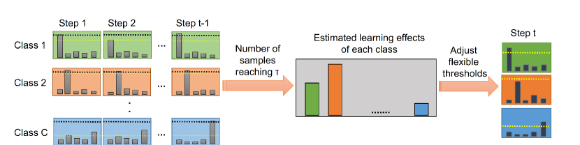
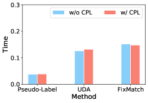
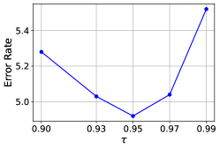

# FlexMatch: カリキュラム疑似ラベリングによる半教師あり学習の強化

> 原題: FlexMatch: Boosting Semi-Supervised Learning with Curriculum Pseudo Labeling
> 著者: Bowen Zhang, Yidong Wang, Wenxin Hou, Hao Wu, Jindong Wang, Manabu Okumura, Takahiro Shinozaki
> 所属: 東京工業大学, Microsoft, Microsoft Research Asia
> 出典: NeurIPS 2021

## Abstract（要旨）

最近提案された FixMatch は、ほとんどの半教師あり学習（SSL）ベンチマークで最先端の結果を達成した。しかし、他の現代的な SSL アルゴリズムと同様に、FixMatch は訓練に貢献するラベルなしデータを選択するために全クラスに対して事前定義された定数閾値を使用しており、クラスごとに異なる学習状態や学習難易度を考慮できていない。この問題に対処するため、我々はカリキュラム疑似ラベリング（CPL: Curriculum Pseudo Labeling）を提案する。これはモデルの学習状態に基づいてラベルなしデータを活用するカリキュラム学習アプローチである。CPL の核心は、各時間ステップにおいてクラスごとに閾値を柔軟に調整し、有益なラベルなしデータとその疑似ラベルを通過させることである。CPL は追加のパラメータや計算（順伝播・逆伝播）を導入しない。我々は CPL を FixMatch に適用し、改善されたアルゴリズムを *FlexMatch* と呼ぶ。FlexMatch は様々な SSL ベンチマークで最先端の性能を達成し、ラベルデータが極端に限られている場合やタスクが困難な場合に特に強い性能を示す。例えば FlexMatch は、1 クラスあたりのラベルが 4 枚しかない場合に、CIFAR-100 と STL-10 データセットで FixMatch に対してそれぞれ 13.96% と 18.96% のエラー率削減を達成する。CPL は収束速度も大幅に向上させる。例えば FlexMatch は FixMatch の訓練時間の 1/5 だけで、さらに優れた性能を達成できる。さらに、CPL が他の SSL アルゴリズムにも容易に適用でき、それらの性能を顕著に改善することを示す。我々のコードは https://github.com/TorchSSL/TorchSSL で公開している。

## 1 Introduction（はじめに）

半教師あり学習（SSL）は、大量のラベルなしデータを活用する優位性から近年注目を集めている。これはラベルデータの量が限られていたり、取得に労力がかかる場合に特に有利である。一貫性正則化と疑似ラベリングは、ラベルなしデータを活用する 2 つの強力な手法であり、現代の SSL アルゴリズムで広く使用されている。最近提案された FixMatch は、これらの手法を弱拡張・強拡張データ拡張と組み合わせ、一貫性正則化の判定基準としてクロスエントロピー損失を使用することで競争力のある結果を達成している。

しかし、FixMatch や Pseudo-Labeling、UDA（Unsupervised Data Augmentation）などの人気 SSL アルゴリズムの欠点は、教師なし損失を計算するために*固定された*閾値に依存し、予測信頼度がその閾値を上回るラベルなしデータのみを使用することである。この戦略はノイズの多い疑似ラベルを排除してモデル訓練に高品質なラベルなしデータのみが貢献できるようにするが、特に訓練初期段階では閾値を超える予測信頼度のラベルなしデータが少ないため、大量のラベルなしデータを無視することになる。さらに、現代の SSL アルゴリズムはクラスごとの異なる学習難易度を考慮せず、すべてのクラスを*均等に*扱う。

これらの問題に対処するため、我々はカリキュラム疑似ラベリング（CPL）を提案する。これは半教師あり学習において各クラスの学習状態を考慮するカリキュラム学習戦略である。CPL は事前定義された閾値を、現在の学習状態に基づいてクラスごとに動的に調整される*柔軟な*閾値に置き換える。特筆すべきは、このプロセスが追加のパラメータ（ハイパーパラメータや学習可能なパラメータ）や追加の計算（順伝播・逆伝播）を一切導入しないことである。我々はこのカリキュラム学習戦略を FixMatch に直接適用し、改善されたアルゴリズムを *FlexMatch* と呼ぶ。

訓練速度は FixMatch と同等の効率性を保ちながら、FlexMatch は大幅に速く収束し、ほとんどの SSL 画像分類ベンチマークで最先端の性能を達成する。CPL 導入の効果は、ラベルが少ない場合やタスクが困難な場合に特に顕著である。例えば STL-10 データセットでは、ラベル数が 400、2500、10000 のとき、FlexMatch は FixMatch に対してそれぞれ 18.96%、16.11%、7.68% の相対的な性能改善を達成する。さらに CPL は収束速度を向上させる——CPL を用いると、FlexMatch は FixMatch の最終精度に達するのに 1/5 未満の訓練時間しか必要としない。CPL を他の現代的な SSL アルゴリズムに適用することでも、精度と収束速度の改善をもたらす。

要約すると、本論文は以下の 3 つの貢献をする：

- SSL のためにラベルなしデータを動的に活用するカリキュラム学習アプローチである CPL を提案する。CPL はほぼコストフリーであり、他の SSL 手法に容易に統合できる。
- CPL は一般的なベンチマーク上でいくつかの人気 SSL アルゴリズムの精度と収束性能を大幅に向上させる。具体的には、FixMatch と CPL を統合した FlexMatch が最先端の結果を達成する。
- SSL アルゴリズムの公平な研究のための統一 PyTorch ベースの半教師あり学習コードベースである TorchSSL をオープンソースとして公開する。TorchSSL には人気 SSL アルゴリズムとその対応する訓練戦略の実装が含まれており、使用やカスタマイズが容易である。

## 2 Background（背景）

一貫性正則化は SSL の連続性仮定に従う。$\Pi$ Model、Mean Teacher、MixMatch のような SSL における最も基本的な一貫性損失は $\ell_2$ 損失である：

$$
\sum_{b=1}^{\mu B}\|p_{m}(y|\omega(u_{b}))-p_{m}(y|\omega(u_{b}))\|_{2}^{2}
$$

ここで $B$ はラベルあきデータのバッチサイズ、$\mu$ はラベルなしデータとラベルあきデータの比率、$\omega$ は確率的データ拡張関数（したがって式(1) の 2 つの項は異なる）、$u_{b}$ はラベルなしデータの一つ、$p_{m}$ はモデルの出力確率を表す。疑似ラベリング技術の導入により、一貫性正則化は分類タスクにより適したエントロピー最小化プロセスに変換される。疑似ラベリングを用いた改善された一貫性損失は以下のように表現できる：

$$
\frac{1}{\mu B}\sum_{b=1}^{\mu B}\mathbf{1}(\max(p_{m}(y|\omega(u_{b})))>\tau)H(\hat{p}_{m}(y|\omega(u_{b})),p_{m}(y|\omega(u_{b})))
$$

ここで $H$ はクロスエントロピー、$\tau$ は事前定義された閾値、$\hat{p}_{m}(y|\omega(u_{b}))$ はハードな one-hot ラベルまたはシャープニングされたソフトなラベルのどちらかとなる疑似ラベルである。閾値を使用する意図は、予測信頼度が低いノイズの多いラベルなしデータをマスクすることである。

FixMatch は強い拡張を伴うこのような一貫性正則化を利用して競争力のある性能を達成する。ラベルなしデータに対して、FixMatch はまず弱い拡張を使って人工ラベルを生成する。これらのラベルは次に強く拡張されたデータのターゲットとして使用される。FixMatch における教師なし損失項は以下の形式をとる：

$$
\frac{1}{\mu B}\sum_{b=1}^{\mu B}\mathbf{1}(\max(p_{m}(y|\omega(u_{b})))>\tau)H(\hat{p}_{m}(y|\omega(u_{b})),p_{m}(y|\Omega(u_{b})))
$$

ここで $\Omega$ は弱い拡張 $\omega$ の代わりに強い拡張関数である。

前述の研究において、事前定義された閾値（$\tau$）は一定である。我々はこれを改善できると考える。なぜならば、あるクラスのデータは本質的に他のクラスよりも学習が難しい場合があるためである。カリキュラム学習はモデルの学習プロセスに応じて学習サンプルを段階的に導入する学習戦略である。このようにして、モデルは常に最適な挑戦を受け続ける。この手法は深層学習研究において広く採用されている。

## 3 FlexMatch

### 3.1 Curriculum Pseudo Labeling（カリキュラム疑似ラベリング）

<figure>

<figcaption>図1: カリキュラム疑似ラベル（CPL）の概念図。各クラスの推定学習効果は、そのクラスに属し固定閾値を超えるラベルなしデータサンプルの数によって決定される。それらは柔軟な閾値を調整して最適なラベルなしデータを通過させるために使用される。なお、推定学習効果は常に増加するわけではなく——後の反復でラベルなしデータの予測が別のクラスに落ちる場合は減少することもある。</figcaption>
</figure>

現在の SSL アルゴリズムが事前定義された閾値によって切り取られた高信頼度ラベルなしデータのみの疑似ラベルを生成するのに対し、CPL は*異なるクラスに*かつ*異なる時間ステップに*疑似ラベルを生成する。このプロセスは、各クラスのモデルの学習状態に応じて閾値を調整することで実現される。

しかし、学習状態に応じて動的に閾値を決定することは非自明である。最も理想的なアプローチは、各クラスの評価精度を計算し、それを使って閾値をスケールすることだろう：

$$
\mathcal{T}_{t}(c)=a_{t}(c)\cdot\tau
$$

ここで $\mathcal{T}_{t}(c)$ は時間ステップ $t$ におけるクラス $c$ の柔軟な閾値、$a_{t}(c)$ は対応する評価精度である。この方法では、クラスの学習状態が不十分であることを示す低い精度は、そのクラスのより多くのサンプルが学習されることを促す低い閾値につながる。しかし、モデル学習プロセスで評価セットを使用できないため、このような精度評価のために訓練セットから別途バリデーションセットを切り分ける必要があるかもしれない。しかし、この実践は 2 つの致命的な問題を示す：第一に、訓練セットから切り分けたこのような*ラベルあき*バリデーションセットは、ラベルあきデータがすでに乏しい SSL シナリオでは高コストである。第二に、訓練プロセスで閾値を動的に調整するために、精度評価を各時間ステップ $t$ で継続的に行う必要があり、これは訓練速度を大幅に低下させる。

本研究では、半教師あり学習のためのカリキュラム疑似ラベリング（CPL）を提案する。我々の CPL は学習状態を推定するための別の方法を使用し、追加の推論プロセスも余分なバリデーションセットも必要としない。FixMatch の信念として、ノイズの多い疑似ラベルをフィルタリングして高品質なものだけを残す高い閾値は確証バイアスを大幅に低減できる。したがって我々の重要な仮定は、閾値が高い場合、クラスの学習効果はそのクラスに属し閾値を超える予測を持つサンプルの数によって反映できるというものである。すなわち、閾値に達する予測信頼度を持つサンプルが少ないクラスは、より大きな学習難易度またはより悪い学習状態を持つとみなされる：

$$
\sigma_{t}(c)=\sum_{n=1}^{N}\mathbf{1}(\max(p_{m,t}(y|u_{n}))>\tau)\cdot\mathbf{1}(\arg\max(p_{m,t}(y|u_{n}))=c)
$$

ここで $\sigma_{t}(c)$ は時間ステップ $t$ におけるクラス $c$ の学習効果を反映する。$p_{m,t}(y|u_{n})$ は時間ステップ $t$ においてラベルなしデータ $u_{n}$ に対するモデルの予測であり、$N$ はラベルなしデータの総数である。ラベルなしデータセットがバランスしている（すなわち、異なるクラスに属するラベルなしデータの数が等しいか近い）場合、より大きな $\sigma_{t}(c)$ はより良い推定学習効果を示す。$\sigma_{t}(c)$ に以下の正規化を適用してその範囲を $0$ から $1$ の間にすることで、固定閾値 $\tau$ をスケールするために使用できる：

$$
\beta_{t}(c)=\frac{\sigma_{t}(c)}{\max_{c}\sigma_{t}}
$$

$$
\mathcal{T}_{t}(c)=\beta_{t}(c)\cdot\tau
$$

このような正規化アプローチの特徴の一つは、最もよく学習されたクラスの $\beta_{t}(c)$ が $1$ に等しくなり、その柔軟な閾値が $\tau$ に等しくなることである。これは望ましい。学習が難しいクラスに対しては、閾値が下げられ、これらのクラスのより多くの訓練サンプルが学習されることが促進される。これによりデータ利用率も向上する。学習が進むにつれて、よく学習されたクラスの閾値は、より品質の高いサンプルを選択的に選ぶために高く引き上げられる。最終的に、すべてのクラスが信頼性の高い精度に達すると、閾値はすべて $\tau$ に近づく。なお、閾値は常に増加するわけではなく、後の反復でラベルなしデータが別のクラスに分類された場合は減少する可能性もある。この新しい閾値は FlexMatch における教師なし損失の計算に使用される：

$$
\mathcal{L}_{u,t}=\frac{1}{\mu B}\sum_{b=1}^{\mu B}\mathbf{1}(\max(q_{b})>\mathcal{T}_{t}(\arg\max(q_{b})))H(\hat{q}_{b},p_{m}(y|\Omega(u_{b})))
$$

ここで $q_{b}=p_{m}(y|\omega(u_{b}))$ である。柔軟な閾値は各反復で更新される。最後に、FlexMatch における損失を教師あり損失と教師なし損失の（$\lambda$ による）重み付き組み合わせとして定式化できる：

$$
\mathcal{L}_{t}=\mathcal{L}_{s}+\lambda\mathcal{L}_{u,t}
$$

ここで $\mathcal{L}_{s}$ はラベルあきデータに対する教師あり損失である：

$$
\mathcal{L}_{s}=\frac{1}{B}\sum_{b=1}^{B}H(y_{b},p_{m}(y|\omega(x_{b})))
$$

CPL を導入するコストはほぼ無料であることに注意されたい。実際には、ラベルなしデータ $u_{n}$ の予測信頼度が固定閾値 $\tau$ を上回るたびに、そのデータと予測されたクラスがマークされ、次の時間ステップで $\beta_{t}(c)$ を計算するために使用される。このようなマーキング動作は、一貫性損失が計算されるたびのボーナス動作である。したがって FlexMatch は、モデルの学習状態を評価するための追加の順伝播プロセスも新しいパラメータも導入しない。

### 3.2 Threshold warm-up（閾値のウォームアップ）

実験において、訓練の初期段階でモデルがパラメータの初期化に依存してほとんどのラベルなしサンプルをある特定のクラスに盲目的に予測する可能性があることを確認した（すなわち、確証バイアスが発生しやすい）。したがって、推定された学習状態はこの段階では信頼性が低い可能性がある。そのため、式(6) の分母を以下のように書き換えてウォームアッププロセスを導入する：

$$
\beta_{t}(c)=\frac{\sigma_{t}(c)}{\max\left\{\max_{c}\sigma_{t},\;N-\sum_{c}\sigma_{t}\right\}}
$$

ここで $N-\sum_{c=1}^{C}\sigma_{t}(c)$ という項は、使用されていないラベルなしデータの数とみなせる。これにより訓練の始まりにおいて、未使用のラベルなしデータの数がもはや支配的でなくなるまで、すべての推定学習効果が $0$ から徐々に上昇することが保証される。このような期間の長さは、ラベルなしデータ量（式(11) の $N$ を参照）とデータセットの学習難易度（式(11) の $\sigma_{t}(c)$ の増加速度を参照）に依存する。実際には、このウォームアッププロセスは非常に実装が容易で、未使用のラベルなしデータを表す追加クラスを加えることで実現できる。したがって、式(11) の分母の計算は単に $C+1$ クラス中の最大値を見つけることに変換される。

### 3.3 Non-linear mapping function（非線形マッピング関数）

式(7) の柔軟な閾値は、線形マッピングによって正規化された推定学習効果によって決定される。しかし、これは実際の訓練プロセスにおいて最適なマッピングではないかもしれない。モデルの予測がまだ不安定な初期段階では、$\beta_{t}(c)$ の増減が大きなジャンプを示す場合があり、クラスが中・後期訓練段階でよく学習された後には小さな変動しか示さない。したがって、$\beta_{t}(c)$ が大きい場合に柔軟な閾値がより敏感になることが望ましい。

$\beta_{t}(c)$ が $0$ から $1$ まで均一に変化する場合に、閾値が非線形な増加曲線を持てるように非線形マッピング関数を提案する：

$$
\mathcal{T}_{t}(c)=\mathcal{M}(\beta_{t}(c))\cdot\tau
$$

ここで $\mathcal{M}(\cdot)$ は非線形マッピング関数である。式(7) は $\mathcal{M}$ を恒等関数に設定することで特殊ケースとして見なせる。マッピング関数 $\mathcal{M}$ は単調増加であり、最大値が $1/\tau$ 以下でなければならない（そうでないと柔軟な閾値が $1$ より大きくなり、すべてのサンプルをフィルタリングしてしまう）。追加のハイパーパラメータ（例：柔軟な閾値の下限）を導入しないようにするため、マッピング関数の値域を $0$ から $1$ とし、柔軟な閾値の値域が $0$ から $\tau$ となるようにする。

単調増加の凸関数は、$\beta_{t}(c)$ が小さい場合に閾値をゆっくり増加させ、$\beta_{t}(c)$ が大きくなるにつれてより敏感になる。したがって、上述の性質を持つ凸関数 $\mathcal{M}(x)=\frac{x}{2-x}$ を直感的に選択する。様々な凸性・凹性を持つマッピング関数の比較アブレーション研究を §4.4 で行う。FlexMatch の完全なアルゴリズムをアルゴリズム 1 に示す。

**アルゴリズム 1：FlexMatch アルゴリズム**

入力: $\mathcal{X}=\{(x_{m},y_{m}):m\in(1,\dots,M)\}$、$\mathcal{U}=\{u_{n}:n\in(1,\dots,N)\}$（$M$ 個のラベルあきデータと $N$ 個のラベルなしデータ）

$\hat{u}_{n}=-1:n\in(1,\dots,N)$（すべてのラベルなしデータの予測を -1 に初期化し、未使用を示す）

最大反復回数に達するまで：

- $c=1$ から $C$ まで：
  - $\sigma(c)=\sum_{n=1}^{N}\mathbf{1}(\hat{u}_{n}=c)$（推定学習効果を計算）
  - もし $\max\{\sigma(c)\}<\sum_{n=1}^{N}\mathbf{1}(\hat{u}_{n}=-1)$ ならば：
    - 式(11) を用いて $\beta(c)$ を計算（未使用データが優勢な間は閾値をウォームアップ）
  - そうでなければ：
    - 式(6) を用いて $\beta(c)$ を計算（正規化された推定学習効果を計算）
  - 式(7) を用いて $\mathcal{T}(c)$ を計算（クラス $c$ の柔軟な閾値を決定）
- $b=1$ から $\mu B$ まで：
  - もし $p_{m}(y|\omega(u_{b}))>\tau$ ならば：
    - $\hat{u}_{b}=\arg\max\{q_{b}\}$（ラベルなしデータ $u_{b}$ の予測を更新）
- 式(8), (10), (9) を通じて損失を計算

返値：モデルパラメータ。

## 4 Experiments（実験）

一般的な SSL データセット（CIFAR-10/100、SVHN、STL-10、ImageNet）で FlexMatch と CPL 適用済みの他のアルゴリズムを評価し、様々なラベルデータ量での性能を広範に調査する。閾値を事前定義するという点で共通する Pseudo-Labeling、UDA、FixMatch との比較を主に行う。他の人気 SSL アルゴリズムの結果は付録 B に示す。完全教師あり実験も各データセットで追加し、SSL アルゴリズムの結果をより良く理解できるようにする。以前に提案されていた完全教師あり比較はラベルセットのみを使用して学習を行い、その目的はラベルなしデータの導入による改善を示すことであった。しかし現代の SSL アルゴリズムの発展に伴い、半教師あり手法は教師あり手法と同等か、一貫性正則化の強さにより場合によってはより良い性能を達成するようになった。したがって、我々の完全教師あり比較はすべてのデータにラベルを付けて行い、式(10) に従った弱いデータ拡張を適用する。すべてのベースラインは我々の PyTorch コードベース TorchSSL（付録 B で紹介）で再実装した。

公平な比較のため、FixMatch と同じハイパーパラメータを使用する。具体的には、すべての実験のオプティマイザはモメンタム 0.9 の標準確率的勾配降下法（SGD）である。すべてのデータセットに対して、初期学習率 $0.03$ とコサイン学習率減衰スケジュール $\eta=\eta_{0}\cos\left(\frac{7\pi k}{16K}\right)$（$\eta_{0}$ は初期学習率、$k$ は現在の訓練ステップ、$K$ は $2^{20}$ に設定された総訓練ステップ）を使用する。またモメンタム 0.999 の指数移動平均も実施する。ラベルあきデータのバッチサイズは ImageNet を除いて $64$ である。$\mu$ は Pseudo-Label に対して $1$、UDA、FixMatch、FlexMatch に対して $7$ に設定する。$\tau$ は UDA に対して $0.8$、Pseudo Label、FixMatch、FlexMatch に対して $0.95$ に設定する。これらの設定は元の論文に従う。実験で使用する強い拡張関数は RandAugment である。ImageNet 実験には ResNet-50 を、他のデータセットには Wide ResNet（WRN）とその亜種を使用する。詳細なハイパーパラメータは付録 A に記載している。

2 つの評価指標を採用する：(1) 最後の 20 チェックポイントの中央値エラー率（既存研究に倣う）、(2) すべてのチェックポイントの最良エラー率。アルゴリズムの収束速度が大幅に異なる場合、中央値アプローチは適切でないと考える——大量の冗長な反復が高速収束アルゴリズムに対して過学習をもたらす可能性があるため。したがって、すべてのアルゴリズムの最良エラー率を報告するが、中央値アプローチの結果も付録 A に示す（我々の FlexMatch が依然として最良の性能を達成することを示す）。誤差棒を得るために、各タスクを異なるランダムシードで 3 回実行する。

**表1: CIFAR-10/100、SVHN、STL-10 データセットのエラー率。'Flex' 接頭辞は CPL をアルゴリズムに適用することを示し、'PL' は Pseudo-Labeling の略称である。STL-10 データセットはラベルなしデータにラベル情報がないため、完全教師あり結果は利用できない。**

| データセット | CIFAR-10 | | | CIFAR-100 | | | STL-10 | | | SVHN | |
|---|---|---|---|---|---|---|---|---|---|---|---|
| ラベル数 | 40 | 250 | 4000 | 400 | 2500 | 10000 | 40 | 250 | 1000 | 40 | 1000 |
| PL | 74.61±0.26 | 46.49±2.20 | 15.08±0.19 | 87.45±0.85 | 57.74±0.28 | 36.55±0.24 | 74.68±0.99 | 55.45±2.43 | 32.64±0.71 | 64.61±5.60 | 9.40±0.32 |
| Flex-PL | 73.74±1.96 | 46.14±1.81 | 14.75±0.19 | 85.72±0.46 | 56.12±0.51 | 35.60±0.15 | 73.42±2.19 | 52.06±2.50 | 32.05±0.37 | 63.21±3.64 | 12.05±0.54 |
| UDA | 10.62±3.75 | 5.16±0.06 | 4.29±0.07 | 46.39±1.59 | 27.73±0.21 | 22.49±0.23 | 37.42±8.44 | 9.72±1.15 | 6.64±0.17 | 5.12±4.27 | 1.89±0.01 |
| Flex-UDA | 5.44±0.52 | 5.02±0.07 | 4.24±0.06 | 45.17±1.88 | 27.08±0.15 | 21.91±0.10 | 29.53±2.10 | 9.03±0.45 | 6.10±0.25 | 3.42±1.51 | 2.02±0.05 |
| FixMatch | 7.47±0.28 | 4.86±0.05 | 4.21±0.08 | 46.42±0.82 | 28.03±0.16 | 22.20±0.12 | 35.97±4.14 | 9.81±1.04 | 6.25±0.33 | 3.81±1.18 | 1.96±0.03 |
| **FlexMatch** | **4.97±0.06** | **4.98±0.09** | **4.19±0.01** | **39.94±1.62** | **26.49±0.20** | **21.90±0.15** | **29.15±4.16** | **8.23±0.39** | **5.77±0.18** | 8.19±3.20 | 6.72±0.30 |
| 完全教師あり | 4.62±0.05 | | | 19.30±0.09 | | | — | | | 2.13±0.02 | |

### 4.1 Main results（主要結果）

CIFAR-10/100、STL-10、SVHN データセットの分類エラー率を表 1 に、ImageNet の結果を §4.2 に示す。SVHN データセットは 531,131 追加サンプルを含む追加セットも含む。FlexMatch は、40 ラベル分割で Flex-UDA（CPL 適用 UDA）が最低エラー率を、1000 ラベル分割で UDA が最低エラー率を持つ SVHN を除いて、ほとんどのベンチマークデータセットで最先端の性能を達成することが示される。精度、再現率、F1、AUC の詳細な結果は付録 A に示す。我々の CPL（FlexMatch）には以下の利点がある：

#### CPL は極端に限られたラベルデータのタスクでより良い性能を達成する

FlexMatch は、ラベルの量が極端に少ない場合に他の手法を大幅に上回る。例えば、400 ラベル（すなわち 1 クラスあたりのラベルサンプル 4 枚のみ）の CIFAR-100 データセットで、FlexMatch は平均エラー率 39.94% を達成し、FixMatch（46.42%）を大幅に上回る。

<figure>

<figcaption>図2: 1 つの GeForce RTX 3090 GPU での 1 反復あたりの平均実行時間。CPL の有無に関わらず実行時間はほぼ同一であり、CPL が追加の計算負担を導入しないことを示す。</figcaption>
</figure>

#### CPL は既存の SSL アルゴリズムの性能を改善する

FixMatch 以外にも、CPL は Pseudo-Labeling や UDA などの既存の SSL アルゴリズムの性能を改善できる。例えば、CPL を導入した後（表 1 の Flex-UDA として参照）、STL-10 40 ラベル分割での UDA のエラー率は 37.4% から 29.53% に削減される。これらの結果は、ラベルなしデータをより良く活用する CPL の有効性をさらに証明する。図 2 は CPL を追加した場合と追加しない場合の 1 反復あたりの平均実行時間を示す。CPL が既存の SSL アルゴリズムの性能を改善しながら追加の計算負担を*導入しない*ことは明らかである。

#### CPL は複雑なタスクでより良い性能を達成する

STL-10 データセットはラベルセットよりも類似しているが広い分布の画像からのラベルなしデータを含む。ラベルなしデータセット内の新しいタイプのオブジェクトの存在は STL-10 をより困難で現実的なタスクにする。FlexMatch はこのような困難な状況でより大きな性能改善を達成する。40 ラベルでの STL-10 のエラー率は 29.15% であり、FixMatch（35.97%）より相対的に 18.96% 良い。同様の強い改善は 100 クラスを持つ CIFAR-100 データセットでも観察される。

FlexMatch が SVHN でなぜ不利に働くかも分析する。これはおそらく SVHN が比較的*単純な*（すなわち数字の分類）にもかかわらず*不均衡な*データセットであるためだ。クラスごとの不均衡は、サンプル数の少ないクラスが式(6) に従って推定学習効果が 1 に近づくことがなく——すでに十分に学習されていても——、その結果、低い閾値が訓練プロセス全体を通じてノイズの多い疑似ラベルサンプルを信頼して学習させ続けることになる。これは損失の降下曲線にも反映されており、低閾値クラスが大きな変動を示す。一方 FixMatch はノイズの多いサンプルをフィルタリングするために閾値を 0.95 に固定している。このような高固定閾値は、前述のように学習困難なクラスの精度と全体的な収束速度の両方の観点から好ましくないが、SVHN が簡単なタスクであるため、モデルは容易にタスクを学習して高信頼度の予測を行えるようになり、高固定閾値の設定はあまり問題にならなくなり、その利点が優位に立つ。

### 4.2 Results on ImageNet（ImageNet での結果）

**表2: $2^{20}$ 反復後の ImageNet でのエラー率**

| 手法 | Top-1 | Top-5 |
|---|---|---|
| FixMatch | 43.66 | 21.80 |
| **FlexMatch** | **41.85** | **19.48** |

はるかに現実的で複雑なデータセットである ImageNet-1K での CPL の有効性も検証する。同じ 100K ラベルデータ（すなわち 1 クラスあたり 100 ラベル、総ラベルの 8% 未満）をランダムに選択する。ImageNet で使用するハイパーパラメータは付録 A に示す（2 つのアルゴリズムは同じハイパーパラメータを共有する）。$2^{20}$ 反復後のエラー率の比較を表 2 に示す。この結果は、タスクが複雑な場合、クラス不均衡問題（各クラス内の画像数は 732 から 1300 まで異なる）にもかかわらず、CPL が依然として改善をもたらせることを示す。この結果は $2^{20}$ 反復後にモデルが完全に収束できないため各アルゴリズムの最良性能を表すものではなく、計算リソースの制限により ImageNet での最良結果を得るためのさらなるハイパーパラメータ調整は行っていない。

### 4.3 Convergence speed acceleration（収束速度の加速）

FlexMatch のもう一つの強力な利点はその優れた収束速度である。図 3(a) と 3(b) は CIFAR-100 400 ラベル分割での損失とトップ 1 精度に関する FlexMatch と FixMatch の比較を示す。FlexMatch の損失は FixMatch よりもはるかに速くスムーズに減少し、その優れた収束速度を示している。FixMatch での損失の大きな変動は、特定のクラスに属するほとんどのラベルなしデータを通過させる事前定義の閾値によるものかもしれない。一方 CPL では、様々なクラスのサンプルを含む大きなバッチのラベルなしデータにより、勾配がより直接的に大域的最適解に向かうことができる。結果として、FlexMatch はわずか 50K 反復で FixMatch の最終結果をすでに上回っている。しかし 800K 反復後には損失と精度のさらなる低下が観察される。これはおそらく過学習によるものであり、FixMatch でも 900K 反復後に同様の現象が発生する。したがって、収束速度が大きく異なるアルゴリズムを評価するために最後のいくつかのチェックポイントの中央値結果を使用することは公平でないと考える。

FlexMatch と FixMatch の CIFAR-10 における早期訓練段階のクラスごとの精度をさらに比較する。図 3(c) と 3(d) に示すように、反復 200K の時点で FixMatch は全体精度わずか 56.35% しか達成せず、クラスの半分がまだ不十分にしか学習されていないのに対し、FlexMatch はすでに 94.29% の全体精度を達成しており、これは FixMatch が 1M 反復後に達成する最終精度よりも高い。CPL の導入がモデルに困難なクラスを積極的に学習させることに成功し、全体的な学習効果を改善することは明らかである。

### 4.4 Ablation study（アブレーション研究）

FlexMatch の 3 つのコンポーネントを評価する実験を行う：閾値の上限 $\tau$、マッピング関数 $\mathcal{M}(x)$、および閾値ウォームアップ。

<figure>

<figcaption>図4(a): 閾値の上限 τ のアブレーション（CIFAR-10 / 40 ラベル）。τ=0.95 付近が最適で、増減いずれもエラー率が悪化する。FlexMatch では τ は閾値の上限だけでなく推定学習効果の計算にも影響する。</figcaption>
</figure>

#### 閾値の上限

CIFAR-10 データセットの 40 ラベルで 5 種類の $\tau$ 値と 3 種類のマッピング関数を調査する。図 4(a) に示すように、$\tau$ の最適選択は 0.95 付近であり、この値を増減させると性能の低下をもたらす。FlexMatch では、$\tau$ の調整は閾値の上限だけでなく、推定学習効果にも影響することに注意——推定学習効果は $\tau$ を超えるサンプルの数によって決定されるためである。

#### マッピング関数

図 4(b) で 3 種類のマッピング関数を探索する：(1) 凹型：$\mathcal{M}(x)=\ln(x+1)/\ln 2$、(2) 線形：$\mathcal{M}(x)=x$、(3) 凸型：$\mathcal{M}(x)=x/(2-x)$。凸型関数が最良の性能を示し、凹型関数が最悪を示す。凸性の度合いを調整することでさらなる改善が得られる可能性があるが、本論文では詳しく調査しない。これらすべての関数の出力は入力が $0$ から $1$ に変化するとき $0$ から $1$ に増加することに注目されたい。値域が例えば $0.5$ から $1$ となる関数を設計することもできる。その場合、訓練の初期においてもこの下限を超える予測信頼度を持つサンプルのみが教師なし損失に貢献するよう、柔軟な閾値に下限を設定することと等価である。FlexMatch ではそのような下限を含まない。新しいハイパーパラメータを導入するためである。しかし、下限を 0.5 に設定すると性能がわずかに改善することは確認した。考えられる理由は、低い閾値が訓練初期段階での誤った疑似ラベルによるノイズの多い訓練を防ぐためである。

#### 閾値ウォームアップ

CIFAR-10（40 ラベル）と CIFAR-100（400 ラベル）の両方で閾値ウォームアップの性能を分析する。図 4(c) に示すように、閾値ウォームアップは CIFAR-10 で約 0.2%、CIFAR-100 で約 1% の絶対的な改善をもたらせる。ウォームアップなしの訓練初期では、式(6) の分母が小さいため、柔軟な閾値が大きな変動を経験する可能性がある。同時に、柔軟な閾値が $\tau$ に達するかそれに近づくクラスが常に存在し、バッチ内のほとんどのラベルなしデータをフィルタリングしてしまう。閾値ウォームアップはすべてのクラスの閾値をゼロから徐々に上昇させることでこの問題を解決する——ほとんどのラベルなしデータを利用できる訓練初期段階での学習ブームを生み出す。

#### クラスバランシング目標との比較

CPL はクロスエントロピー損失を計算するために各バッチで使用されるラベルなしサンプルの数をクラス間でバランスさせる効果がある。周辺クラス分布を各バッチの一様分布に近づけることによって同様の効果が達成できる。FixMatch に追加目標 $\mathcal{L}_{b}=\sum_{c}q_{c}\log(q_{c}/\hat{p}_{c}$) を直接追加する比較実験を行う。ここで $\hat{p}_{c}$ はバッチ内のすべてのサンプルにわたるクラス $c$ の平均予測確率、$q$ は一様分布 $q_{c}=1/C$ である。このような目標を追加するエラー率は CIFAR-10 40 ラベル分割で 7.16%（FixMatch 7.47%±0.28 と FlexMatch 4.97%±0.06 と比較）である。このアプローチはバッチ内の各クラスのインスタンスがバランスしていることを必要とするが、CPL にはそのような制約がない。CPL はモデルの予測を調整するよりも閾値を調整するという点で、より柔軟で人間の介入が少ない。

## 5 Related Work（関連研究）

Pseudo-Labeling はモデル予測から変換されたハードな人工ラベルを使用する先駆的 SSL 手法である。疑似ラベリングとともに信頼度ベースの戦略が用いられ、ラベルなしデータは予測が十分に確信を持てる場合のみ使用される。このような信頼度ベースの閾値処理は最近提案された UDA と FixMatch にも見られ、UDA が温度付きシャープニングされた「ソフト」疑似ラベルを使用するのに対し、FixMatch は one-hot の「ハード」ラベルを採用するという違いがある。UDA と FixMatch の成功は、一貫性正則化を改善するための強いデータ拡張の使用に大きく依存している。ReMixMatch もそのような強い拡張を活用した。

カリキュラム学習と半教師あり学習の組み合わせは近年人気がある。マルチモデル画像分類タスクに対しては、信頼性と識別可能性を判断することでラベルなし画像の学習プロセスを最適化した研究がある。別の研究では、簡単な画像レベルの特性を最初に学習し、それを制約付き CNN によるセグメンテーションを促進するために使用した。カリキュラム学習は、外れ値スコアに応じてラベルなしデータからインドメインサンプルを選択することにより、分布外問題を緩和するためにも使用されている。

感情分析やセマンティックセグメンテーションなどの関連分野での動的閾値に関する研究もある。感情分析の研究では、閾値を徐々に減少させて初期段階で高品質なデータがラベルデータセットに選択され、後の段階で大量のデータが選択されるようにした。ドメインの不整合に対処するために追加の分類器を加えて閾値を自動化した研究もある。別の研究ではカリキュラム学習を自己訓練に導入し、閾値を安定的に増加させて最先端に近い結果を達成した。

## 6 Conclusion and Future Work（結論と今後の課題）

本論文では SSL のためのラベルなしデータを活用するカリキュラム学習アプローチである CPL（カリキュラム疑似ラベリング）を紹介する。CPL は非常にシンプルでほぼコストフリーでありながら、閾値を含む SSL アルゴリズムの性能と収束速度を劇的に改善する。FixMatch の改善アルゴリズムである FlexMatch は様々な SSL ベンチマークで最先端の性能を達成する。今後の課題として、各クラスのラベルなしデータが極端に不均衡なロングテールシナリオでの手法改善に取り組みたい。

## Broader Impact（より広い影響）

CPL は現代の SSL アルゴリズムが訓練中に異なるクラスの本質的な学習難易度を考慮していないというギャップを埋め、そうすることで収束速度と最終精度の両方を改善できることを示す。CPL が、ラベルなしデータをモデルの学習状態に応じて、そしてクラスごとの学習難易度に応じて活用することの有効性を探求する将来の研究にさらなる注目を集めることを期待する。

---

## Appendix A Experimental Results（付録 A 実験結果）

### A.1 Hyperparameter setting（ハイパーパラメータ設定）

再現のため、表 3 と 4 にアルゴリズム依存・非依存のハイパーパラメータ設定を示す。

**表3: アルゴリズム依存パラメータ**

| パラメータ | PL (Flex-PL) | UDA (Flex-UDA) | FixMatch (FlexMatch) |
|---|---|---|---|
| ラベルなし/ラベルあき比 (CIFAR-10/100, STL-10, SVHN) | 1 | 7 | 7 |
| ラベルなし/ラベルあき比 (ImageNet) | — | — | 1 |
| 事前定義閾値 (CIFAR-10/100, STL-10, SVHN) | 0.95 | 0.8 | 0.95 |
| 事前定義閾値 (ImageNet) | — | — | 0.7 |
| 温度 | — | 0.5 | — |

**表4: アルゴリズム非依存パラメータ**

| パラメータ | CIFAR-10 | CIFAR-100 | STL-10 | SVHN | ImageNet |
|---|---|---|---|---|---|
| モデル | WRN-28-2 | WRN-28-8 | WRN-37-2 | WRN-28-2 | ResNet-50 |
| 重み減衰 | 5e-4 | 1e-3 | 5e-4 | 5e-4 | 3e-4 |
| バッチサイズ | 64 | | | | 128 |
| 学習率 | 0.03 | | | | |
| SGD モメンタム | 0.9 | | | | |
| EMA モメンタム | 0.999 | | | | |
| 教師なし損失重み | 1 | | | | |

### A.2 Class-wise accuracy improvement（クラスごとの精度改善）

論文で紹介したように、CPL は各クラスのモデルの学習状態を考慮することにより、学習が困難なクラスの性能を改善できる。表 5 に詳細なクラスごとの精度比較を示す。クラス 2、3、5 の最終精度がもともと悪い性能から改善されている。

**表5: CIFAR-10 40 ラベル分割のクラスごとの精度比較**

| クラス番号 | 0 | 1 | 2 | 3 | 4 | 5 | 6 | 7 | 8 | 9 |
|---|---|---|---|---|---|---|---|---|---|---|
| FixMatch | 0.964 | 0.982 | 0.697 | 0.852 | 0.974 | 0.890 | 0.987 | 0.970 | 0.982 | 0.981 |
| **FlexMatch** | 0.967 | 0.980 | **0.921** | **0.866** | 0.957 | 0.883 | 0.988 | 0.975 | 0.982 | 0.968 |

### A.3 Median error rates（中央値エラー率）

既存研究に倣い、すべての手法に同じ反復数を実行させた最後の 20 チェックポイントの中央値エラー率も報告する。チェックポイント間は 1000 反復である。表 6 の結果は CPL 手法が既存の SSL アルゴリズムの性能を劇的に改善し、FlexMatch が最良の精度を達成することを示す。これらの結論は本文の表 1 の結果と一致しており、提案した CPL アルゴリズムの有効性を示している。

**表6: 最後の 20 チェックポイントの中央値エラー率（参考値）**

| アルゴリズム | CIFAR-10 40L | CIFAR-10 250L | CIFAR-10 4000L | CIFAR-100 400L | CIFAR-100 2500L | STL-10 40L | SVHN 40L |
|---|---|---|---|---|---|---|---|
| FixMatch | 7.99±0.59 | 5.12±0.33 | 4.46±0.11 | 48.95±1.19 | 29.19±0.25 | 44.70±6.58 | 3.92±1.18 |
| **FlexMatch** | **5.19±0.05** | **5.33±0.12** | **4.47±0.09** | **45.91±1.76** | **28.11±0.20** | **44.69±7.49** | 20.81±5.26 |

（注: SVHN では中央値でも FlexMatch が著しく不利。クラス不均衡の影響）

### A.4 Detailed results（詳細結果）

分類設定ですべての手法の性能を包括的に評価するため、CIFAR-10 データセットの精度、再現率、F1 スコア、AUC（曲線下面積）結果をさらに報告する。

**表7: CIFAR-10 の精度・再現率・F1・AUC**

| ラベル数 | 40 ラベル | | | | 4000 ラベル | | | |
|---|---|---|---|---|---|---|---|---|
| 手法 | Precision | Recall | F1 | AUC | Precision | Recall | F1 | AUC |
| FixMatch | 0.9333 | 0.9290 | 0.9278 | 0.9910 | 0.9571 | 0.9571 | 0.9569 | 0.9984 |
| **FlexMatch** | **0.9506** | **0.9507** | **0.9506** | **0.9975** | **0.9580** | **0.9581** | **0.9580** | **0.9984** |

---

## Appendix B TorchSSL: A PyTorch-based SSL Codebase（TorchSSL：PyTorch ベースの SSL コードベース）

PyTorch フレームワークは深層学習研究コミュニティで注目を集めている。しかし、主要な既存 SSL コードベースは TensorFlow ベースである。利便性とカスタマイズ性のため、図 5 に示す PyTorch ベースの SSL ツールボックス *TorchSSL* を再実装してオープンソース公開する。TorchSSL は 8 つの人気半教師あり学習手法を含む：$\Pi$-Model、Pseudo-Labeling、VAT、Mean Teacher、MixMatch、ReMixMatch、UDA、FixMatch、および提案手法 FlexMatch。

### B.1 BatchNorm Controller（バッチ正規化コントローラ）

ラベルあきデータとラベルなしデータを順番に更新する場合、Mean Teacher が非常に不安定になることを観察した。$\Pi$-Model や MixMatch などの他のアルゴリズムも同様の不安定性を示す。したがって、ラベルあきデータとラベルなしデータが別々に順伝播される場合、BatchNorm Controller を使用してラベルあきデータのみに対してバッチ正規化を更新する。バッチ正規化コントローラのコードは以下の通りである。ラベルなしデータの順伝播前にバッチ正規化の統計を記録し、伝播完了後に復元する。

### B.2 Benchmark results（ベンチマーク結果）

TorchSSL に含まれるすべてのアルゴリズムを CIFAR-10、CIFAR-100、SVHN、STL-10 の 4 つの一般的な SSL データセットで包括的に実行し、最良エラー率を報告する。

**表8: CIFAR-10 ベンチマーク結果**

| アルゴリズム | 40 ラベル | 250 ラベル | 4000 ラベル |
|---|---|---|---|
| Π-Model | 74.34±1.76 | 46.24±1.29 | 13.13±0.59 |
| Pseudo-Labeling | 74.61±0.26 | 46.49±2.20 | 15.08±0.19 |
| VAT | 74.66±2.12 | 41.03±1.79 | 10.51±0.12 |
| Mean Teacher | 70.09±1.60 | 37.46±3.30 | 8.10±0.21 |
| MixMatch | 36.19±6.48 | 13.63±0.59 | 6.66±0.26 |
| ReMixMatch | 9.88±1.03 | 6.30±0.05 | 4.84±0.01 |
| UDA | 10.62±3.75 | 5.16±0.06 | 4.29±0.07 |
| FixMatch | 7.47±0.28 | 4.86±0.05 | 4.21±0.08 |
| **FlexMatch** | **4.97±0.06** | **4.98±0.09** | **4.19±0.01** |

**表9: CIFAR-100 ベンチマーク結果**

| アルゴリズム | 400 ラベル | 2500 ラベル | 10000 ラベル |
|---|---|---|---|
| Π-Model | 86.96±0.80 | 58.80±0.66 | 36.65±0.00 |
| Pseudo-Labeling | 87.45±0.85 | 57.74±0.28 | 36.55±0.24 |
| VAT | 85.20±1.40 | 46.84±0.79 | 32.14±0.19 |
| Mean Teacher | 81.11±1.44 | 45.17±1.06 | 31.75±0.23 |
| MixMatch | 67.59±0.66 | 39.76±0.48 | 27.78±0.29 |
| ReMixMatch | 42.75±1.05 | 26.03±0.35 | 20.02±0.27 |
| UDA | 46.39±1.59 | 27.73±0.21 | 22.49±0.23 |
| FixMatch | 46.42±0.82 | 28.03±0.16 | 22.20±0.12 |
| **FlexMatch** | **39.94±1.62** | **26.49±0.20** | **21.90±0.15** |

**表10: STL-10 ベンチマーク結果**

| アルゴリズム | 40 ラベル | 250 ラベル | 1000 ラベル |
|---|---|---|---|
| Π-Model | 74.31±0.85 | 55.13±1.50 | 32.78±0.40 |
| Pseudo-Labeling | 74.68±0.99 | 55.45±2.43 | 32.64±0.71 |
| VAT | 74.74±0.38 | 56.42±1.97 | 37.95±1.12 |
| Mean Teacher | 71.72±1.45 | 56.49±2.75 | 33.90±1.37 |
| MixMatch | 54.93±0.96 | 34.52±0.32 | 21.70±0.68 |
| ReMixMatch | 32.12±6.24 | 12.49±1.28 | 6.74±0.14 |
| UDA | 37.42±8.44 | 9.72±1.15 | 6.64±0.17 |
| FixMatch | 35.97±4.14 | 9.81±1.04 | 6.25±0.33 |
| **FlexMatch** | **29.15±4.16** | **8.23±0.39** | **5.77±0.18** |

**表11: SVHN ベンチマーク結果**（注: SVHN では FlexMatch は不利）

| アルゴリズム | 40 ラベル | 250 ラベル | 1000 ラベル |
|---|---|---|---|
| Π-Model | 67.48±0.95 | 13.30±1.12 | 7.16±0.11 |
| Mean Teacher | 36.09±3.98 | 3.45±0.03 | 3.27±0.05 |
| MixMatch | 30.60±8.39 | 4.56±0.32 | 3.69±0.37 |
| UDA | **5.12±4.27** | **1.92±0.05** | **1.89±0.01** |
| FixMatch | **3.81±1.18** | 2.02±0.02 | 1.96±0.03 |
| FlexMatch | 8.19±3.20 | 6.59±2.29 | 6.72±0.30 |
