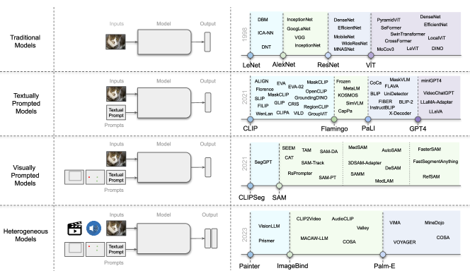
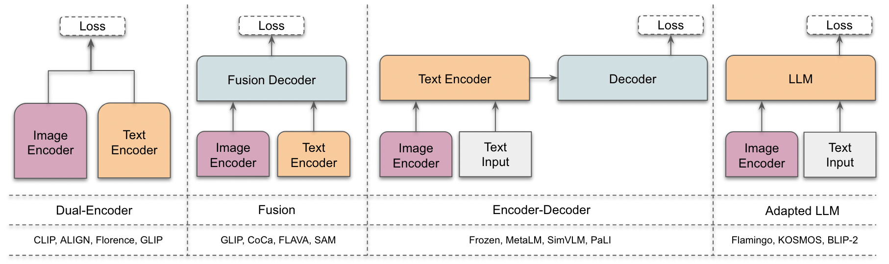
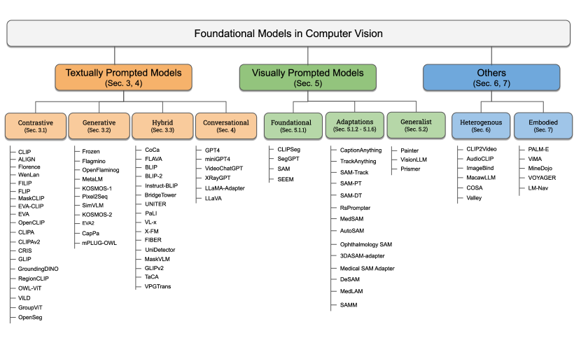
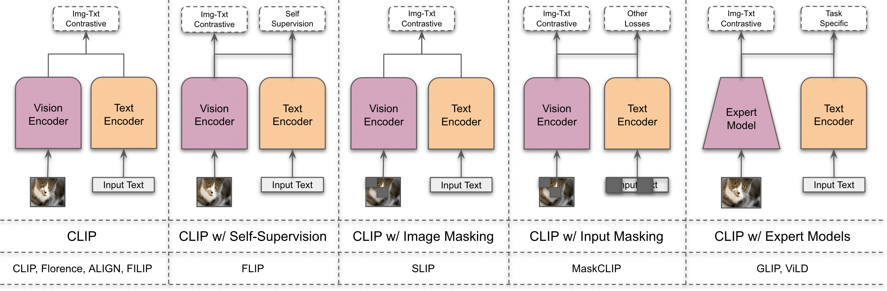
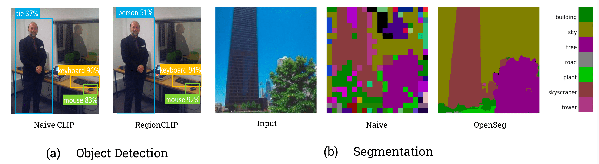
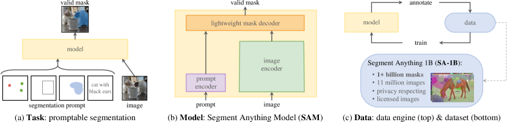
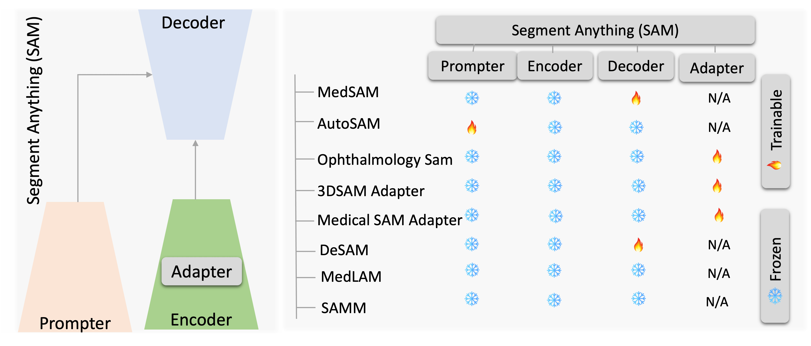
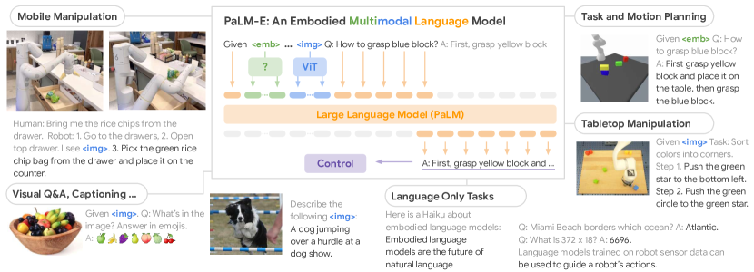

# 視覚における新時代を定義する基盤モデル：サーベイと展望

> 原題: Foundational Models Defining a New Era in Vision: A Survey and Outlook
> 著者: Muhammad Awais, Muzammal Naseer, Salman Khan, Rao Muhammad Anwer, Hisham Cholakkal, Mubarak Shah, Ming-Hsuan Yang, Fahad Shahbaz Khan
> 所属: MBZUAI（モハメド・ビン・ザイード人工知能大学）, Australian National University, Linköping University, University of Central Florida, UC Merced / Yonsei / Google Research
> 出典: arXiv:2307.13721（v1 2023, IEEE TPAMI 掲載）

## Abstract（要旨）

視覚場面の構成的性質を見て推論できる視覚システムは、我々が世界を理解するための根本である。実世界環境におけるオブジェクトとその位置の複雑な関係、曖昧性、変動は、文法規則に支配される人間言語や、音声・深度などの他モダリティによってより良く記述できる。これらモダリティ間のギャップを橋渡しするように学習されたモデルは、大規模な訓練データと結びつくことで、文脈推論、汎化、テスト時のプロンプト能力を可能にする。これらのモデルは *foundational models*（基盤モデル）と呼ばれる。そのようなモデルの出力は、再訓練なしに人間が与えるプロンプトによって変更できる。たとえば、バウンディングボックスを与えて特定のオブジェクトをセグメンテーションする、画像や動画シーンに関する質問で対話を行う、言語指示でロボットの行動を操作する、といったことが可能になる。

本サーベイでは、そのような台頭しつつある基盤モデルを包括的に概観する。具体的には、異なるモダリティ（視覚・テキスト・音声等）を結合する典型的なアーキテクチャ設計、訓練目的（対比型、生成型）、事前学習データセット、ファインチューニング機構、一般的なプロンプト・パターン（テキスト型、視覚型、異種混合型）を扱う。我々はまた、視覚における基盤モデルの未解決の課題と研究方向、すなわち評価とベンチマークの難しさ、実世界理解のギャップ、文脈理解の限界、バイアス、敵対攻撃への脆弱性、解釈可能性の問題を議論する。我々はこの分野における近年の発展を概観し、基盤モデルの幅広い応用を体系的・網羅的に扱う。本論文で扱う基盤モデルの完全なリストは https://github.com/awaisrauf/Awesome-CV-Foundational-Models で公開している。

## 1 Introduction（はじめに）

近年は **基盤モデル（foundation models）** の開発に向けた目覚ましい成功が見られている。基盤モデルは大規模かつ多様なデータで訓練され、一度訓練されれば基礎（basis）として機能し、元の訓練に関連する幅広い下流タスクへと適応（例：ファインチューン）できる [^18]。深層ニューラルネットや自己教師あり学習といった基盤モデルの基本要素は長年存在してきたが、特に大規模言語モデル（LLM）を介した近年の急増は、データとモデルサイズの両方を大規模に拡大したことに主に帰せられる [^346]。たとえば、GPT-3 [^20] のような数十億パラメータを持つ近年のモデルは、ゼロ/少数ショット学習で有効に活用され、大規模なタスク固有データやモデル・パラメータ更新を要さずに目覚ましい性能を達成している。同様に、近年の 5400 億パラメータ Pathways Language Model（PaLM）は、言語理解と生成から推論、コード関連タスクまで多くの困難な問題で SOTA を示している [^52] [^8]。

自然言語処理における LLM と並行して、異なる知覚タスクに向けた大規模基盤モデルも近年探索されている。たとえば、CLIP [^214] のような事前学習済みの **視覚-言語（VL）モデル** は、画像分類や物体検出を含む様々な下流視覚タスクで有望なゼロショット性能を示してきた。これら VL 基盤モデルは典型的には Web から収集された数百万の画像-テキスト対で訓練され、汎化能力と転移能力を持つ表現を提供する。事前学習済み VL 基盤モデルは、与えられたタスクとプロンプトの自然言語記述を提示することで下流タスクへ適応できる。たとえば代表的な CLIP モデルは、慎重に設計されたプロンプトを使ってゼロショット分類など様々な下流タスクに対応する。ここでテキストエンコーダはクラス名や任意のフリーテキストを介して動的に分類器を構築する。テキスト・プロンプトは「A photo of a {label}」のような手作りテンプレートで、テキストが視覚画像の内容に対応することを指定する助けとなる。最近、これら VL モデルを特定の指示集合でファインチューンして対話能力を加える試みも数多く現れている [^169] [^360] [^57] [^190] [^314]。

<figure>

<figcaption>図1: コンピュータビジョンにおける基盤モデルの進化の概観。（左）コンピュータビジョンにおけるモデルの進展を示す。（右）文献に報告された主要マイルストーンを点線で示し、これらモデルの進化を表す。</figcaption>
</figure>

大規模 VL 基盤モデルのほか、視覚入力でプロンプトできる大規模基盤モデルの開発にも多くの研究努力が払われている。たとえば近年提案された SAM [^140] は、画像と視覚プロンプト（ボックス、点、マスクなど画像内で何をセグメントするかを指定するもの）を入力として、クラス非依存のセグメンテーションを行う。このモデルは半自動的な（モデル・イン・ザ・ループの）データセット注釈設定により、数十億のオブジェクトマスクで訓練されている。さらに、このような汎用的な視覚プロンプト型セグメンテーション・モデルは、医療画像セグメンテーション [^189] [^292]、動画オブジェクトセグメンテーション [^316]、ロボティクス [^303]、リモートセンシング [^35] といった特定の下流タスクに適応可能である。テキスト・プロンプト型と視覚プロンプト型の基盤モデルに加え、複数のペアモダリティ（画像-テキスト、動画-音声、画像-深度など）を整列して、異なる下流タスクに有用な意味ある表現を学習することを目指す研究もある [^92] [^102] [^188]。

本論文では、コンピュータビジョンにおける基盤モデルの体系的レビューを行う。まず、よくあるアーキテクチャ種別、自己教師あり学習目的、大規模訓練、プロンプト・エンジニアリングを簡潔に扱う、基盤モデルの背景・準備（Sec. 2）を示す。次に、既存研究を**テキスト・プロンプト型**（Sec. 3-4）、**視覚プロンプト型**（Sec. 5）、**異種モダリティ型**（Sec. 6）、**身体性のある基盤モデル**（Sec. 7）に分類する。テキスト・プロンプト型ではさらに、対比型・生成型・ハイブリッド型（対比と生成の併用）・対話型 VL モデルに細分する。最後に、我々の分析にもとづく未解決の課題と研究方向を議論する（Sec. 8）。続けて、本サーベイに関連する他のサーベイをレビューし、相違点と独自性を議論する。

**関連レビューと相違**: 文献ではいくつかの近年の研究が、自然言語処理における LLM をレビューしている [^346] [^77] [^119] [^65] [^357]。[^346] は LLM の近年の進展をレビューし、事前学習、適応チューニング、LLM 利用、評価といった異なる側面で区別する。このサーベイは LLM 開発に利用可能なリソースもまとめ、将来の方向性を議論する。[^119] はベンチマーク評価における推論能力の観点で LLM を議論する。実務者向けの LLM 利用ガイドは [^306] に提示され、下流タスクの視点から LLM 利用に関する詳細な議論と洞察を提供する。この研究はまた、事前学習・訓練・テストデータが LLM に与える影響を分析し、実世界シナリオでの限界も議論する。VLM の文脈では、[^180] がタスク定義と一般アーキテクチャに関して視覚-言語事前学習モデルを予備的にレビューする。同様に [^73] は、事前学習段階前に画像・テキストを埋め込みに符号化するための異なる技法を議論し、様々な事前学習アーキテクチャをレビューする。[^299] は、幾何学的・トポロジカルな視点から、vanilla Transformer、Vision Transformer、マルチモーダル Transformer をサーベイし、マルチモーダル・データ向けの Transformer 技法をレビューする。マルチモーダル学習の文脈で、近年のレビュー [^364] は生のマルチモーダル・データから監督信号を効果的に利用するための自己教師ありマルチモーダル学習技法に焦点を当てる。このサーベイは目的関数・データ整列・アーキテクチャに基づいて既存アプローチを区別する。[^132] [^84] は様々な視覚-言語事前学習ネットワーク・アーキテクチャ、目的、下流タスクをまとめ、視覚-言語事前学習フレームワークを分類する。近年では [^331] が、視覚プロンプト型基盤セグメンテーション・モデル Segment Anything と、その潜在的な下流タスクをレビューする。

本サーベイと上記研究の主な違いは以下の通り。前述のサーベイが主にテキスト・プロンプトベースの視覚-言語モデルに焦点を当てるのに対し、我々の研究は **基盤モデルの 3 つの異なるクラス**: テキスト・プロンプト型モデル（対比型・生成型・ハイブリッド型・対話型）、視覚プロンプト型モデル（例：SegGPT [^280]、SAM [^140]）、異種モダリティベース・モデル（例：ImageBind [^92]、Valley [^186]）に焦点を当てる。我々は基盤モデルの背景理論を、アーキテクチャからプロンプト・エンジニアリングまで簡潔に扱う（Sec. 2）。我々の研究は近年の視覚基盤モデルの広範かつ最新の概観を提供する（Sec. 3, 5, 6, 7）。最後に、視覚における基盤モデルの未解決課題と潜在的研究方向に関する詳細な議論を提示する（Sec. 8）。

<figure>

<figcaption>図2: 本サーベイで記述する 4 種の異なるアーキテクチャ・スタイルの概観。左から右へ：a) Dual-encoder 設計は、整列された表現を持つ並列の視覚・言語エンコーダを用いる。b) Fusion 設計はデコーダを介して画像・テキスト表現を共同処理する。ここで画像エンコーダは視覚プロンプト（SAM 140 の場合の点やボックスなど）も処理できる。c) Encoder-decoder 設計は、共同特徴符号化と復号を逐次的に適用する。d) Adapter LLM 設計は、視覚・テキスト・プロンプトを LLM に入力してその優れた汎化能力を活用する。各カテゴリの例を下段に示す。これらアーキテクチャの詳細は Sec. 2.2 で議論する。</figcaption>
</figure>

## 2 Preliminaries（準備）

まず、基盤モデルとサーベイの範囲を定義する。続けて、残りの内容を理解する助けとなる簡潔な背景概観を示す。視覚における基盤モデルへの 3 つの主要な貢献要素に焦点を当てる：a) モデル・アーキテクチャ、b) 訓練目的、c) 大規模訓練とプロンプティング。

### 2.1 Foundational Models and Scope of the Survey（基盤モデルとサーベイの範囲）

「基盤モデル（foundational models）」という用語は、[^18] によって Stanford Institute for Human-Centered AI で最初に導入された。基盤モデルは *「大規模データで自己教師ありまたは半教師あり的に訓練され、複数の他の下流タスクに適応可能な基礎モデル」* と定義される。基盤モデルへのパラダイム・シフトが重要なのは、多数の狭いタスク固有モデルを、一度訓練すれば複数の応用に素早く適応できる、より広範で汎用的な基礎モデルで置換できるからである。これは迅速なモデル開発を可能にし、ドメイン内・ドメイン外の両シナリオでより良い性能を提供するだけでなく、大規模データで訓練された大規模基盤モデルから「**創発特性（emergent properties）**」と呼ばれる知能の現出をもたらす [^286] [^21]。

コンピュータビジョンは最近、識別・生成モデルの両方を含む広範な文献群を持つ基盤モデル [^321] [^140] に駆動された目覚ましい進歩を目撃している。本サーベイでは、大規模データで訓練され、非画像出力（生成テキスト、セグメンテーション・マスク等）を伴う様々なコンピュータビジョン・タスクに適応可能な **マルチモーダル（視覚と言語）基盤モデル** に焦点を当てる。GAN、VAE、拡散モデルといった、データ分布をモデル化することを目指す画像生成モデルは扱わない。これは既にこの分野には専用のサーベイ [^24] [^330] [^308] [^56] が存在し、また前者のモデル・クラスはより広範な下流応用をカバーできるためである。

### 2.2 Architecture Types（アーキテクチャ種別）

図 2 に示すように、視覚-言語（VL）モデルは主に 4 つのアーキテクチャ設計を用いる。まず **Dual-Encoder アーキテクチャ** を導入する。これは視覚モダリティとテキスト・モダリティを処理する別々のエンコーダを用い、これらエンコーダの出力は続いて目的関数を介して最適化される。第 2 のアーキテクチャ型 **Fusion** は、視覚エンコーダとテキスト・エンコーダが生成する表現を取り、融合された表現を学習する追加の融合エンコーダを組み込む。第 3 の型 **Encoder-Decoder** は、エンコーダ-デコーダ・ベースの言語モデルと視覚エンコーダから成る。最後に第 4 の型 **Adapted LLM** は、大規模言語モデル（LLM）を中核要素として活用し、視覚エンコーダは画像を LLM と互換性のある形式に変換する。これらアーキテクチャのより包括的な理解のために、サーベイ内で各研究を議論する対応セクションを参照されたい。次に、異なるアーキテクチャ型を訓練するために用いられる損失関数を議論する。

### 2.3 Training Objectives（訓練目的）

#### 2.3.1 Contrastive Objectives（対比型目的）

ラベルなしの画像-テキスト・データから学習するために、[^215] [^129] は単純な **Image-Text Contrastive (ITC) 損失** を活用した。これは画像-テキスト対の正しい対応を予測することで表現を学習することを目指す。$N$ 例のバッチが与えられたとき、ITC 損失は $N\times N$ の組み合わせの中から $N$ 個の正しい画像-テキスト対をマッチングする。ITC 損失は $N$ 個の正しい対のコサイン類似度を最大化し、$N^{2}-N$ 個の誤った対の類似度を最小化する。$(x_{i},t_{i})$ を $i$ 番目の画像-テキスト例、$(v_{i},t_{i})$ をその対応する表現とすると、画像→テキスト損失は以下のように計算される：

$$\mathcal{L}_{v2t}=-\log\bigg{[}\dfrac{\exp(\text{sim}(v_{i},t_{i})/\tau)}{\sum_{j=1}^{N}\exp(\text{sim}(v_{i},t_{j})/\tau)}\bigg{]}$$

ここで $\tau$ は温度である。テキスト→画像損失も同様に計算され、全損失は両項の和 $\mathcal{L}_{ITC}=\dfrac{1}{N}\sum_{i=1}^{N}[\mathcal{L}_{v2t}+\mathcal{L}_{t2v}]$ となる。

**Image-Text Matching (ITM) 損失** [^153] は、画像とテキストの対が正/負どちらでマッチしているかを正しく予測することを目指す。少数のパーセプトロン層が追加され、対がマッチしている確率 $p^{itm}$ を予測する。損失はクロスエントロピー損失に基づいて計算される。

ITC と ITM に類似して、続く論文で複数の対比損失も活用されてきた。画像ベース自己教師あり損失（SimCLR [^39] [^40]）や、ITC 損失の変種（FILIP Loss [^311]、Text-to-Pixel Contrastive (TPC) Loss [^281]、Region-Word Alignment (RWA) [^156]、Multi-label Image-Text Contrastive (MITC) [^296]、Unified Contrastive Learning (UniCL) [^305]、Region-Word Contrastive (RWC) Loss [^332]）が含まれる。

#### 2.3.2 Generative Objectives（生成型目的）

**Masked Language Modeling (MLM) 損失** [^181] は、マスクされたトークンを再構成することを目指す双方向・非因果的な言語モデリング損失である。$\hat{x}^{t}$ をマスクされた入力トークン（一定割合のトークンがランダムにマスクされ特殊トークンに置換される）とすると、MLM はマスクされたトークンが与えられたときの $x^{t}$ をモデル化する：

$$\mathcal{L}_{\text{MLM}}=-\mathbb{E}_{x^{t}\sim D}\big{[}\log p(x^{t}|\hat{x}^{t})\big{]}$$

**Language Modeling (LM) 損失** は自己回帰的に言語生成をモデル化することを目指す。これは以前のトークン（$<l$）が与えられたときに現在の（$l$ 番目）トークンを予測する：

$$\mathcal{L}_{\text{LM}}=-\mathbb{E}_{x^{t}\sim D}\bigg{[}\sum_{l=1}^{L}\log p(x^{t}_{l}|x^{t}_{<l})\bigg{]}$$

ここで $L$ はトークンの総数である。

**Standard Captioning (Cap) 損失** [^114] は、画像（$x^{v}$）と以前のトークンが与えられたときに次のトークンを予測することを目指す：

$$\mathcal{L}_{\text{Cap}}=-\mathbb{E}_{x\sim D}\sum_{l=0}^{L}\log p(x^{t}_{l}|x^{t}_{<l},x^{v})$$

ここで $x=[x^{v},x^{t}]$。同様に [^7] による **Flamingo Loss** も、以前の画像とテキスト・トークンを与えて $l$ 番目のトークンを予測するもの。これはキャプション損失と異なり、トークンが複数のインタリーブされた画像とテキスト入力から成る。

**Prefix Language Modeling (PrefixML)** [^283] は言語モデリング損失を視覚-言語モデリング損失へ拡張する。Web 上ではテキスト記述の前に画像が現れるため、画像をテキスト記述のプレフィックスと見なし、画像トークンをテキスト・トークンに付加する $x=[x^{v},x^{t}]$。次に、ランダムな長さ $L_{p}$ のプレフィックス系列がテキスト・トークンから切り出され、以下を介して再構成される：

$$\mathcal{L}_{\text{PrefixLM}}=-\mathbb{E}_{x\sim D}\bigg{[}\sum_{l=L_{p}}^{L}\log p_{\theta}(x_{l}|x_{[L_{p},l]},x_{<L_{p}})\bigg{]}$$

ここで $x_{l}$ は現在のトークン、$x_{[L_{p},l]}$ はプレフィックス系列、$x_{<L_{p}}$ は以前の系列。

同様に、他にも複数の生成損失が提案されている。例として、Masked Multimodal Modeling (MMM) 損失 [^243]、Semi Causal Language Modeling (SemiCausalLM) [^104]、Image-conditioned Masked Language Modeling (IMLM) 損失 [^341]、Image-grounded Text Generation (ITG) 損失 [^155]、Masked Image Modeling (MIM) [^341]、Captioning with Parallel prediction (CapPa) [^262] がある。

### 2.4 Large-scale Training（大規模訓練）

大規模訓練と、それに続く推論時の効果的なプロンプトは、視覚-言語基盤モデルの重要な要素であった。ここでは事前学習、ファインチューニング、プロンプト技法の役割を議論する（表 I 参照）。

**表 I**: 基盤モデルにおける訓練・ファインチューン・プロンプトに用いられるデータセットの異なる設定の概観。詳細は Sec. 2.4 で議論。

| Data Type | Examples |
|---|---|
| **Pre-training (Sec. 2.4.1)** | |
| Image-Text | WIT, LAION |
| w/ Pseudo Labels | Cap24M, SA-1B |
| Benchmark Combination | UNITER, PMD |
| **Fine-tuning (Sec. 2.4.2)** | |
| Task Specific | ImageNet |
| Capability Specific | OWL-ViT |
| Instruction-Following | InstructBLIP |
| **Prompt Engineering (Sec. 2.4.3)** | |
| Train Time | GLIP |
| Evaluation Time | CLIP |

#### 2.4.1 Pre-training Data（事前学習データ）

大規模データは現代の視覚-言語基盤モデルの中核である。これらモデルを事前学習するために活用されたデータセットは 3 つの広いカテゴリに分けられる：画像-テキスト・データセット（CLIP [^215] で用いた WebImageText など）、部分的に合成されたデータセット（SAM [^140] で用いた SA-1B など）、組合せデータセット（FLAVA [^243] で用いた PMD など）。

**Image-Text Data**: CLIP [^215] は基盤モデルを事前学習するための Web スケール画像-テキスト・データの目覚ましい有効性を示した。このタイプのデータはしばしば Web クロール（例：CommonCrawl）から精製される。最終データセットはノイズや有害データ点を除くためのフィルタリング・プロセスの結果である。多数の続く研究が、ALIGN1.8B [^129]、RUC-CAS-WenLan [^123]、FLD900M [^321]、FILIP300M [^311]、WebLi [^42] などの同様のデータセットを収集した。しかしこれらデータセットは非公開である。大規模訓練をよりアクセス可能にするため、LAION [^226] [^227] や COYO-700M [^22] などのオープンソース・キュレーション努力がコミュニティに大きく貢献している。

**Partially Pseudo Labels-based Data**: 画像-テキスト・モデルと同様、視覚グラウンディングも大規模訓練データから恩恵を受け得るが、そのようなデータセットは Web で利用可能ではない。グラウンディング・データセットの収集も、大量の人手注釈努力を要するため高コストである。コスト効率の良い方法の一つは、優れた教師を利用して画像-テキスト・データセットをマスク-記述データセットに変換することである。この戦略は GLIP [^156] が最初に採用したが、[^140] が SA-1B でこれを 10 億スケールに拡大した。キュレーション過程ではしばしば、マスク生成のための優れた教師を訓練し、それを画像-テキスト・データに NLP パーサと併用する。これらデータセットには SAM、GLIP、KOSMOS-2 が含まれる。GLIP [^156] は人手注釈の LVIS [^99] と Visual Genome [^143] データセットで教師 GLIP を訓練し、それを画像-テキスト・データに対して、NLP モデルが検出した名詞句とともにボックス予測に利用した。KOSMOS-2 [^210] で用いた GRIT も同様に準備される。SAM [^140] は 3 段階（assisted manual、semi-automatic、fully automatic）から成るデータエンジンを導入し、このプロセスで 10 億の高品質マスクを生成した。

<figure>

<figcaption>図3: 視覚-言語基盤モデルに対する我々の分類体系（taxonomy）の概観。入力・出力・利用法に基づき、基盤モデルを 6 つの主要グループに分類する。テキスト・プロンプト型モデルは Sec. 3, 4 で、視覚プロンプト型モデルおよび汎用主義モデルは Sec. 5 で、異種モダリティおよび身体性モデルはそれぞれ Sec. 6, 7 で議論する。</figcaption>
</figure>

**Combination of Datasets**: Web スケール・データセットをキュレートし訓練することは常に可能ではない。この問題を回避するため、いくつかの研究 [^44] [^263] [^295] はベンチマーク視覚データセットの組合せを活用してきた。これらの研究はキャプション・データセットや視覚質問応答などの画像-テキスト対を持つデータセットを組み合わせる。一部の研究は非画像-テキスト・データセットも使い、テンプレートベースのプロンプト・エンジニアリングでラベルを記述に変換する。さらに、視覚グラウンディング関連の研究は、COCO [^163]、OpenImages [^142]、Objects365 [^234] などのグラウンディング・データセットも活用してきた。

#### 2.4.2 Fine-tuning（ファインチューニング）

ファインチューニングは主に 3 つの設定で採用される：特定タスクでのモデル性能を改善する（例：open-world 物体検出）、特定の能力に対するモデルを改善する（例：視覚グラウンディング）、そして指示チューニングを行ってモデルが様々な下流視覚タスクを解けるようにする（例：InstructBLIP [^57]）。第 1 に、特定タスクでのモデル性能は、線形層のみのファインチューンでも改善できる。したがってタスク固有データセット（例：ImageNet）が事前学習済みモデルの改善に使える。第 2 に、一部の研究は事前学習済み視覚-言語モデルをグラウンディング・データセットでファインチューンしてグラウンディング・タスクに使う。たとえば [^196] は ViT を検出データセットでファインチューンしてオープン語彙物体検出器を作る。最後に InstructBLIP [^57] などの研究は、視覚データセットを指示チューニング・データセットに変換し、VL モデルが下流視覚タスクを解けるようにした。

#### 2.4.3 Prompt Engineering（プロンプト・エンジニアリング）

プロンプト・エンジニアリングは主に LLM に特定のタスクをさせるために用いられてきた [^20] [^86]。視覚-言語モデルや視覚プロンプト型モデルの文脈では、プロンプト・エンジニアリングは主に 2 つの目的で使われる：視覚データセットを画像-テキスト訓練データに変換する（例：画像分類向け CLIP）、および基盤モデルに人間が制御可能性を提供して視覚-言語モデルを視覚タスクに使うこと。ほとんどの視覚データセットは画像と対応する 1 単語ラベルから成る。視覚-言語モデルを視覚データセットに活用するため、複数の研究はテンプレートベースのプロンプト・エンジニアリングを使ってきた。たとえば「image of a {label}」、「a type of {type}」のようなテンプレートでラベルから記述を生成する。[^215] [^321] が指摘するように、追加の文脈はモデルを助けるため、これらテキスト・プロンプトは訓練時または評価時に視覚-言語モデルで活用できる。

以上のアーキテクチャ・種別、目的、基盤モデルの訓練に用いられるデータの文脈をもって、次にその主要クラス、すなわちテキスト・プロンプト型（Sec. 3, 4）、視覚プロンプト型（Sec. 5）、異種混合型（Sec. 6）、汎用主義型（Sec. 5.2）、身体性型（Sec. 7）の基盤モデルを説明する（視覚-言語基盤モデルの分類体系は図 3 参照）。

## 3 Textually Prompted Models（テキスト・プロンプト型モデル）

伝統的に、視覚-言語モデルは主に視覚・テキストの両モダリティの共同理解を要するタスクに採用されてきた。しかし CLIP の目覚ましい性能の出現により、言語監督ベースのモデルが顕著な地位を獲得し、主流アプローチとなった。本節では、言語を主要な監督源とする手法の探究に焦点を当てる。これらテキスト・プロンプト型モデルは、訓練目的に基づき大別して 3 つの主要型：対比型・生成型・ハイブリッド型に分類される。対比型は Sec. 3.1、生成型は Sec. 3.2、組合せ手法は Sec. 3.3 で議論する。これらの手法の概観は表 II に、代表的なタスクでのモデル比較は表 III に示す。

**表 II**: テキスト・プロンプト型モデルの概観。事前学習データセットとそのサイズ、事前学習目的、アーキテクチャ、発表会場、オンライン情報など、これらモデルを対比する様々な側面を示す。詳細は Section 2 で議論。（主要モデル抜粋）

| Method | Public | Dataset(s) | Size | Objective | Architecture | Base | Venue |
|---|---|---|---|---|---|---|---|
| CLIP | ✗ | WebImageText | 400M | ITC | Dual-Enc | ResNet/ViT + GPT2 | arXiv'21 |
| ALIGN | ✗ | ALIGN1.8B | 1800M | ITC | Dual-Enc | EffNet-L2 + BERT-L | ICML'21 |
| Florence | ✗ | FLD-900M | 900M | UniCL | Dual-Enc | CoSwinT + GPT2 | ECCV'22 |
| FILIP | ✗ | FILIP300M + CC | 340M | FILIP | Dual-Enc | ViT + GPT2 | ICLR'22 |
| SLIP | ✓ | YFCC15M | 15M | ITC + SimCLR | Dual-Enc | ViT + GPT2 | ECCV'22 |
| FLIP | ✓ | LAION400M | 400M | ITC | Dual-Enc | ViT | arXiv'23 |
| MaskCLIP (1) | ✓ | YFCC15M | 15M | ITC + MLM + Distil | Dual-Enc | ViT + GPT2 | CVPR'23 |
| CLIPA / CLIPAv2 | ✓ | LAION-400M/2B | up to 3000M | ITC | Dual-Enc | ViT | arXiv'23 |
| EVA / EVA-CLIP | ✓ | IN21K + CC + ... / Merged-2B | up to 2000M | ITC | Dual-Enc | ViT-G + BEiT-3 | CVPR'23 / arXiv'23 |
| OpenCLIP | ✓ | LAION-400M / LAION-5B | up to 5400M | ITC | Dual-Enc | ViT + GPT2 | CVPR'23 |
| CRIS | ✓ | RefCOCO/+/G-Ref | 0.4M | TPC | Fusion | ResNet + GPT2 | CVPR'22 |
| GLIP | ✓ | GoldG + OI + O365 + ... | - | RWA | Fusion | ViT + GPT2 | CVPR'22 |
| G-DINO | ✓ | O365 + OI + GoldG + ... | - | GLIP | Fusion | Swin + BERT-base | arXiv'23 |
| OWL-ViT | ✓ | OI + O365 + VG | 2M | DETR | Dual-Enc | ViT + Transformer | ECCV'22 |
| GroupViT | ✓ | YFCC + CC12M | 26M | ITC + MITC | Dual-Enc | ViT + GPT2 | CVPR'22 |
| Frozen | ✓ | CC3M | 3M | Cap | Enc-Dec | NF-ResNet + GPT2 | NeurIPS'21 |
| Flamingo | ✗ | M3W | 43M | Flamingo | AdaptedLLM | NF-ResNet + Chinchilla | NeurIPS'22 |
| OpenFlamingo | ✓ | LAION2B + MMC4 | 2571M | Flamingo | AdaptedLLM | CLIP-ViT + LLM | github'23 |
| KOSMOS-1 / KOSMOS-2 | ✓ | LAION + COYO + CC / GRIT + LLaVA-Inst | up to 3115M | SemiCausalLM | AdaptedLLM | CLIP-ViT + MAGNETO | arXiv'23 |
| SimVLM | ✓ | ALIGN1.8B | 1800M | PrefixLM | Enc-Dec | ViT + BERT | ICLR'22 |
| BLIP / BLIP-2 / InstructBLIP | ✓ | COCO + VG + CC + ... | up to 129M | ITC + ITM + LM/ITG | Fusion / AdaptedLLM | ViT + BERT / OPT / FlanT5 | arXiv'22-23 |
| CoCa | ✗ | JFT3B + ALIGN | 4800M | NSL + Cap | Fusion | ViT + Transformer | TMLR'23 |
| FLAVA | ✓ | PMD | 70M | ITC + ITM + MMM/MIM/MLM | Fusion | ViT + Transformer | CVPR'22 |
| PaLI | ✗ | WebLI + CC3M+ | 1600M | - | Enc-Dec | ViT-e + mT5 | arXiv'23 |

### 3.1 Contrastive Learning (CL)（対比学習）

SOTA のコンピュータビジョン・モデルは事前に決められたカテゴリ集合を予測するように訓練されており、これが汎化と利用可能性を制限する。従来、大半の深層学習手法は ImageNet [^82] のような教師あり事前学習や、画像のハッシュタグでの弱教師あり [^191] を用いてきた。[^215] は自然言語に存在する視覚概念から知覚を学習することを主張し、**Contrastive Language Image Pre-training (CLIP)** を提案した。本節では CLIP と続く対比ベース・アプローチを議論する。これらを 2 つに分けた：汎用基盤モデル向け対比アプローチ（Sec. 3.1.1）と視覚グラウンディング基盤モデル向けアプローチ（Sec. 3.1.2）。CLIP のアーキテクチャと主要な変種を図 4 に示す。

#### 3.1.1 CL for General Purpose Foundational Models（汎用基盤モデル向け対比学習）

本節では、汎用視覚-言語基盤モデルの訓練を目指す対比手法を説明する。主流の流れは CLIP [^215] から始まったが、その後の多くの努力がより良いデータ活用法、改良されたアーキテクチャ・訓練法の提案、有用性の拡大、再現、その性質とスケーリング則の研究を提供してきた。これらの手法をここで記述する。

**CL のみに基づく手法**。[^215] はバッチ内の画像とそのキャプションの正しい対応という対比事前学習タスクで画像エンコーダとテキスト・エンコーダを共同訓練することを提案した。CLIP モデルは画像エンコーダ（ViT またはスケールされた CNN）とテキスト・エンコーダ（GPT 風 Transformer [^20]）から成る。これらエンコーダは $N$ 組の画像-テキスト対に対するマルチモーダル埋め込み空間を生成する。CLIP は対称クロスエントロピー損失を介して、$N$ 個の正しい画像-テキスト対の埋め込みのコサイン類似度を最小化し、$N^{2}-N$ 個の誤った対の類似度を最大化するように訓練される（注：原文は「最小化」「最大化」が逆だが文意は損失最小化）。CLIP フレームワークの主要な動機の一つは自然言語監督データのスケールである。著者らはモデルを大規模に訓練するため、4 億の画像-テキスト対データセットをインターネットからキュレートした。CLIP フレームワークはこのような大規模データセットで訓練すると優秀な性能を示す。CLIP は良好なゼロショット汎化、自然・合成分布シフトに対する有意に高い頑健性、線形プローブ・ファインチューンとの良い組合せを示す。

ALIGN [^129]（Jia et al.）は [^215] が必要とした非自明かつ計算コスト大の前処理・クリーニング（データセット規模を制限していた）を回避し、Conceptual Captions Dataset [^235] から精製した 10 億のノイズの多い画像-キャプション・データセットを収集した。彼らはこのデータセット上で CLIP 風の正規化対比目的を持つ dual-encoder アーキテクチャを訓練した。視覚・言語埋め込みを整列するため、画像-テキスト埋め込みのコサイン類似度が正規化 softmax 損失 [^323] を介して最適化される。著者らはデータセットの規模がノイズ性質を補えることを示した。結果として得られる整列画像-テキスト表現は、クロスモーダル・マッチング/検索タスクおよびゼロショット分類で優秀な性能を示す。

[^321] は、真に基盤的なモデルは Space-Time-Modality 空間で機能すべきと主張した。具体的には、基盤モデルは粗い→細かい（Space）、静的→動的（Time）、RGB→マルチモダリティ（Modality）の表現を扱えるべき。この汎用性を達成するため、彼らは大規模キュレーション・データセットで CLIP 風の事前学習を行い、改良された対比目的と効率的訓練を用いた **Florence モデル** を導入した。事前学習モデルは続いて各空間に対する 3 つの異なるアダプタ・ヘッドを持つように拡張される：Dynamic DETR ベースのアダプタが大規模物体検出データセットで細粒度密タスク向け表現を学習；METER [^70] ヘッドが視覚言語表現に使われ；CSwin [^66] が動画ベース理解に使われる。このフレームワークは、ドメイン横断で汎化する基盤モデルをもたらす。

<figure>

<figcaption>図4: CLIP とその変種の概観。CLIP の後に複数の研究が、新しい損失、画像ベース自己教師あり、入力マスキング、エキスパート・モデルの使用など、異なる変種の有効性を調査した。ここで「expert model」とは特定タスクで訓練されたモデルを意味する（例：ViLD は物体検出エキスパート・モデルとして FPN を用いた）。</figcaption>
</figure>

ほとんどの視覚-言語手法は言語監督に焦点を当て、視覚部分の役割を見過ごしてきた。[^200] は画像ベースの自己教師あり学習が言語監督フレームワークを助けられるか調査した。そのため、入力画像の異なるビュー・拡張に基づく SimCLR [^39] [^40] 損失の自己教師あり版を加えた **SLIP** を提案した。著者らは CLIP 風モデルを YFCC15M データセットで訓練し、ゼロショットや線形プローブ・ベースの一連のタスクにおいて、言語監督単独・自己教師あり単独のどちらよりも SLIP が優れることを示した。

多くのテキスト-画像手法は、対の間に強い意味相関があると仮定する。しかし Web スケール・データには弱い相関の対（例：画像を正確に反映しないキャプション）が散乱している。[^123] はこれを解決するため、2-tower アーキテクチャと、MoCo [^108] に基づくクロスモーダル対比学習（限られた GPU リソースでより多くの負例を活用できる）を用いた **WenLan** を提案した。これは正例・負例の両方と、テキスト→画像・画像→テキスト両方向の対比損失を活用する。結果としてより良いモデルが得られ、訓練効率も改善し、多くのタスクで改善された性能を示す。彼らはまた、5 億データ点の初の大規模中国語画像-テキスト・データセットをキュレートし、中国語タスクを解くためにモデルを訓練して優秀なゼロショット能力を実証した。

CLIP 風の手法は各モダリティ別に別々のエンコーダを使い、エンコーダを分離して事前計算した表現を活用できるため推論効率が良い。しかしこれらモデルはクロスモーダル相互作用にグローバル特徴のみに依存するため、モダリティ間の細粒度情報を捉えるのが難しい。[^311] はトークン単位のクロスモーダル相互作用をモデル化する **クロスモーダル遅延相互作用（FILIP, Fine-grained Interactive Language Image Pre-training）損失** を提案した。各入力視覚トークンと全テキスト・トークンとの類似度を計算し最大値を用いる；逆方向も同様。次に単純な平均で全損失を計算する。これは CLIP の推論効率を犠牲にせず、2 モダリティ間の細粒度相互作用をモデル化する助けとなる。著者らはモデルを訓練するため 340M の大規模画像-テキスト対も収集した。彼らの方法はゼロショット分類および画像-テキスト検索で CLIP やその他の手法を上回る。

**Masked Contrastive Learning**。Masked Auto Encoders [^109] に着想を得て、[^160] は CLIP 訓練で入力ピクセルの 50-75% をマスクする効率的代替 **FLIP** を提案した。このマスキングは計算を 2-4 倍削減し、2-4 倍大きいバッチを許し、精度も改善する。FLIP は同じ精度に到達するのに CLIP より 3 倍以上速く、CLIP ベースラインと比較して 1800 TPU days を節約できる。この高速手法に基づき、モデル・データセット・サイズ・訓練長にわたる CLIP のスケーリングも研究した。

[^67] は、画像の言語記述は連続かつ細粒度の信号としての完全な情報を表現できないと主張し、対比視覚-言語訓練で画像を完全に活用するため、入力画像をランダムにマスクし、平均教師ベースの自己蒸留 [^256] を併用して局所的意味特徴を学習する **MaskCLIP** を提案した。全画像とマスク画像の表現がそれぞれ mean teacher と student から得られ、両者の表現間のクロスエントロピー損失を最小化する。同様に、BERT [^181] の事前学習が言語エンコーダで用いられる。これら 2 つの修正により、モデルは局所的・細粒度の意味を学習する。MaskCLIP はゼロショット、線形プローブ、ファインチューン設定で CLIP を有意に改善する。

前述のアプローチは主に CLIP の効率性側面をマスキングで扱うのに対し、**EVA-CLIP** [^249] は安定性と最適化効率性をマスキングと共に扱う。彼らは改善された初期化、より良いオプティマイザ、画像のランダム・マスキング [^160] を含む、訓練安定性向上と計算コスト削減のソリューションを提供した。彼らの効率的ソリューション・モデル EVA-CLIP はオープンソース・リソースからキュレートされたデータセット版で訓練され、より良い性能を示す。[^80] はこの努力にモデル拡張を補完し、画像-テキスト入力をマスクして CLIP 損失と併せ、10 億パラメータまでモデルをスケールした **EVA** は COCO、LVIS、ImageNet1k など複数の下流タスクで強い性能を示す。

**CLIP のスケーリングと再現**。OpenAI は CLIP の事前学習済み重みとコードを公開したが、訓練機構とデータセットは公開せず、研究能力を制限していた。アクセス可能性を高めるため、複数の続く研究が大規模画像-テキスト・データセットを公開し、CLIP を再現し、その性質を研究してきた。CLIP の優秀な性能は公開されていない大規模画像-テキスト・データセットに依存する。この問題に対処するため、[^226] は Common Crawl からのフィルタリング後 4 億データ点から成る画像-テキスト・データセット **LAION-400M** を公開した。[^227] はさらにスケールアップし、既存 CLIP モデルでフィルタリングして Common Crawl から精製した 58 億データ点を含む多言語マルチモーダル・データセット **LAION-5B** を公開した。LAION データセット [^226] [^227] を活用し、**OpenCLIP** [^124] が CLIP 訓練実験を再現しその性質を研究した。[^49] は CLIP のスケーリング則を研究してこのオープンソース努力を補完した。LAION-5B [^227] で訓練された OpenCLIP は、データ・モデル・計算がスケールするにつれ性能が一貫して改善することを示した。彼らは OpenAI の CLIP [^215] からのスケーリングの乖離も観察し、訓練分布の違いがその原因と推測した。

CLIP の性能はモデル・データセット・サイズでスケールすることが知られている [^215] [^49]。[^159] は驚くべき発見を明らかにした：より大きな画像-テキスト・モデルは、訓練時により小さなトークン・サイズを使っても精度の有意な犠牲なく済む。この発見、**逆スケーリング則（inverse scaling law）** に基づき、彼らは新しい効率的訓練レシピを導入し、学術スケール・リソースで訓練された CLIP 風モデルを **CLIPA** と命名した。CLIPA は 8 つの A100 GPU で 2/3/4 日の訓練でゼロショット ImageNet 精度 63.2%、67.8%、69.3% を達成できる。CLIPA の逆スケーリング則 [^159] に基づき、[^158] は有意に少ない計算予算と訓練コストで CLIP 風モデルを大規模訓練した。彼らの大規模訓練で 2 つの興味深い結果を実証した：第 1 に、逆スケーリング則はファインチューニングにも適用可能で、モデルはより少ない入力トークンでファインチューンできる；第 2 に、より大きなモデルは同じ入力トークン数でファインチューンすると小さなモデルより小さな性能低下を示す。彼らの訓練 CLIPA は 8 つの A100 GPU で 4 日の訓練で 69.3% のゼロショット ImageNet 分類精度を達成する。複数の研究が CLIP と対比手法を異なる視点から探究している [^168] [^175] [^139]。

#### 3.1.2 CL for Visual Grounding Foundational Models（視覚グラウンディング基盤モデル向け対比学習）

CLIP とその変種はグローバル情報を要するタスク（分類、画像-テキスト検索など）で印象的な性能を示すが、細粒度・ピクセル・領域レベルの情報を要する局所化タスクでは性能が悪い。図 5 に [^354] [^90] から得た 2 つの失敗例を示す。本節では、視覚グラウンディング・タスクのために対比学習を活用するように設計された基盤モデルを議論する。

<figure>

<figcaption>図5: CLIP のナイーブな適用は局所化タスクでうまく機能しない。物体検出の失敗例は [354] から、セグメンテーションは [90] から引用。</figcaption>
</figure>

**グラウンディング向け CLIP 適応**: [^67] の MaskCLIP は対比学習向けにマスク自己蒸留を初期に探究した。それと異なり、[^358] による別の MaskCLIP は、CLIP モデルを最小の変更で密予測に使うことを提案する。彼らは視覚エンコーダから密特徴を抽出し、分類にテキスト埋め込みを使うことを提案する。さらに密予測を強化するため、分類用のバックボーン訓練も提案する。彼らの方法は CLIP の局所化タスクで合理的な性能を示す。

[^354] は物体検出のため、画像領域とそのテキスト記述を明示的に整列する CLIP の拡張 **RegionCLIP** を提案した。訓練は 3 段階：CLIP ベースの画像-テキスト事前学習、CLIP 風の領域-テキスト対比訓練、物体検出固有のファインチューンから成る。大規模な領域-記述データセットが広く利用可能でないため、領域-クラス名、プロンプト・テンプレート、事前学習済み CLIP を使ってデータセットをブートストラップする。具体的には、事前学習済み教師エンコーダで領域を抽出；全クラス・ラベルを単純なプロンプト・テンプレートに従って句に変換し、教師言語エンコーダで対応する埋め込みを取得；画像特徴とクラス埋め込みのマッチング・スコアを計算し、最高スコア対を pseudo 領域-テキスト対として用いる。著者らは dual-encoder ベース・モデルをこれら pseudo 領域-記述対で事前学習した。最終的に領域-テキスト対のノイズ性を緩和する単純なファインチューン手法も提案する。タスク固有ファインチューンでは、視覚エンコーダが事前学習済み ViT から初期化されたベース・ネットワークとして使われる。既製の領域提案ネットワーク（RPN）が物体を局所化し、言語エンコーダの埋め込みでオブジェクト・カテゴリを取得する。RegionCLIP はゼロショット能力を持ち、転移時に open-vocabulary 物体検出で新たな SOTA を確立した。

[^281] は CLIP を参照画像セグメンテーション・タスク [^118] [^313] に拡張し、**CLIP-Driven Referring Image Segmentation (CRIS)** を提案した。参照画像セグメンテーションは入力テキスト・プロンプトに基づいて画像の領域をセグメントすることを目指す [^118]。CLIP フレームワークの自然な適用先。しかし CLIP はグローバル特徴に焦点を当てるためピクセル・レベルの情報を学習するように設計されていない。[^281] は 2 つの修正を提案：第 1 に、長距離依存を捉える視覚-言語デコーダの導入；第 2 に、テキスト特徴を対応するピクセル・レベル特徴と整列する text-to-pixel 対比損失の導入。CRIS は 3 つの参照画像セグメンテーション・タスクで以前の SOTA を上回る。

**直接的局所化視覚-意味整列**: CLIP をグラウンディング・タスクに適応するのではなく、いくつかの研究は強力な事前学習済み専門モデルを活用し、対比学習を介して言語-視覚モデリングを追加した。**Phrase grounding** は入力テキスト中の句を画像の対応する領域に対応付けるタスク。[^156] は phrase grounding が物体検出のスケーラブルかつ効果的な事前学習タスクと主張し、物体検出タスクを phrase grounding に再定式化した。両タスクの利益となる：phrase grounding はより良い視覚概念を提供し、物体検出はバウンディング・ボックスのより多くの注釈を提供する。彼らは融合層を持つ dual 視覚-言語エンコーダ・ベース・アーキテクチャを句-領域データセットで訓練する **Grounded Language Image Pretraining (GLIP)** を提案した。大規模訓練のため、事前学習済みグラウンディング・モデルが画像-テキスト・データセットに適用され句-領域 pseudo ラベルを取得。GLIP モデルを物体検出データセットに使うため、すべてのクラス名を 1 文に統合し、領域に関連付けられた正しいクラスを出力するようモデルをプロンプトする。この単純なスケーリング・アプローチは 14 の下流タスクで有意な改善をもたらし、ファインチューン版は COCO データセットで新 SOTA を達成。

CLIP フレームワークを拡張するのでなく、[^174] は SOTA の Transformer ベース物体検出器 DINO [^27] を言語事前学習でグラウンドする **Grounding-DINO** を提案した。彼らは閉セット物体検出器をバックボーン・ネック・ヘッドの 3 部に分け、各レベルで言語特徴を融合した。テキスト・画像バックボーンが多スケール特徴を抽出してネックに送る。ネックが生成するテキスト・画像特徴は言語ガイド・クエリ選択の作成に使われる。これらクロスモーダル・クエリは画像・テキスト特徴と共にクロスモーダル・デコーダ（画像・テキスト・クロスアテンションと FFN 層を持つ）に送られる。モデルは、予測オブジェクトと言語トークン間の対比損失や、L1 損失・Grounded IoU (GIOU) 損失 [^223]・focal 損失 [^165] などのタスク固有損失で end-to-end 訓練される。Grounding-DINO は閉セット・開セット・参照物体検出で GLIP や他の競合を有意に上回る。

[^196] は open-vocabulary 物体検出向けの CLIP ベース訓練レシピ **OWL-ViT** を導入した。訓練法は 2 段階：画像レベル特徴学習用の CLIP 風事前学習と、open-vocabulary 物体検出のためのオブジェクト・レベル特徴ファインチューン段階。彼らの dual-encoder アーキテクチャは、タスク固有修正を除き CLIP と類似。具体的には ViT ベース画像エンコーダの出力は、分類埋め込み用の射影層とボックス予測と確率用の MLP ヘッドから成る。open-vocabulary 検出のため、言語エンコーダは入力プロンプトに基づくテキスト埋め込み（クエリ）を生成し、これは画像ごとに異なり得る。視覚エンコーダの役割は、それに適用されるクエリでバウンディング・ボックスと確率を予測すること。この dual-encoder アーキテクチャはまず CLIP 風対比学習で訓練され、long-tail/open vocabulary 物体検出向けに適応された二部マッチング損失 [^25] で物体検出データセットでファインチューンされる。

[^90] は CLIP 風手法が局所化タスクで性能が悪いのは、まずグルーピングせず局所情報を失うからと主張し、グルーピング後に視覚-意味整列を行う **OpenSeg** を提案。彼らの方法はセグメンテーション・マスクの学習、これらマスクの視覚-意味整列、大規模事前学習用 pseudo マスク生成を含む。モデルは画像をセグメンテーション・マスクで表現し、領域-単語グラウンディングと共にセグメンテーション・ベース弱教師あり学習を可能にする。この訓練はセグメンテーション・ラベルを要するためスケールしにくい。スケール問題解決のため、MuST [^91] に従い、まずモデルをセグメンテーション損失のみでセグメンテーション・データで訓練し、このモデルで画像-テキスト対の pseudo ラベルを生成。OpenSeg ベース・モデルは新データセットによく汎化し、複数のベンチマークで以前の SOTA を上回る。

[^296] は視覚的グルーピング機構 [^264] [^361] を活用して言語監督のみで意味セグメンテーションを得る方法を提案。**階層型 Grouping Vision Transformer (GroupViT)** を画像エンコーダ、標準的 CLIP 風言語エンコーダと併用。提案 GroupViT は複数のグルーピング層を持ち、segment トークンを学習することで、画像の領域を類似視覚概念のセグメントに段階的により大きなセグメントへとグループ化することを学ぶ。各段階は、前段階のより小さなグループの segment トークンをより大きなセグメントへと集約する Transformer 層からも成る。GroupViT は画像-テキスト対比（ITC）損失と、プロンプト・エンジニアリングを使うマルチラベル対比損失（プロンプトを使って単一画像の複数記述を作る）で訓練される。ゼロショット・セグメンテーションでは、最終層の segment トークンは任意形状のセグメントに対応し、そのクラスは segment トークンと最大類似度を持つクラス・ラベルで決定。GroupViT は監督を要さずに専門 SOTA 手法と競合的に性能を出す。同様に、**ODISE** [^297] も事前学習済み拡散特徴を活用する open vocabulary セグメンテーション・モデル。

### 3.2 Generative Learning（生成学習）

大規模言語モデル（LLM）は NLP タスクで印象的なゼロ/少数ショット性能を示してきたが、これら LLM は視覚モダリティを欠き、近年ようやくマルチモーダル・モデルが視覚と言語のモダリティで訓練され始めた。対比視覚-言語モデルも良い汎化能力を示してきたが、テキストと画像間の類似度スコアを提供するのみで、限られた問題にしか対処できない。ここでは、視覚条件付き言語生成タスクで訓練することで LLM に世界を見る目を与えることを目指す研究を記述する。

**マルチモーダル入力での In-context Learning**: LLM は優秀な少数ショット学習器 [^20] だが、従来の形では視覚モダリティに目が見えない。ここでは、インタリーブされた画像-テキスト・データで LLM に視覚モダリティを付与することを目指す手法を説明する。

[^263] は LLM の重みを更新せずに視覚モダリティを追加する効率的アプローチ **Frozen** を提案。Frozen は入力画像を LLM の単語埋め込み空間に符号化する画像エンコーダから成り、LLM が画像キャプションを生成できるようにする。共同埋め込みを学習するため、LLM は凍結し、視覚エンコーダはキャプション・データセットで条件付きキャプション生成タスクで訓練される。Frozen は単一画像-テキスト対で訓練されるが、順序付き複数画像-テキスト対集合と動作でき、少数ショット・タスクができる。推論時、LLM エンコーダと視覚エンコーダは順序付きテキスト・視覚プロンプトでプロンプトされる。テキスト・視覚埋め込みは連結され LLM デコーダに送られ、自己回帰的にテキスト出力を生成。Frozen は視覚-言語タスク横断で少数ショット視覚-言語能力を実証した。

その後の研究は、Flamingo [^7]、PaLI [^42]、MetaLM [^104]、KOSMOS-1/v2 [^120] [^210]、SimVLM [^283]、CapPa [^262]、mPLUG-OWL [^314] など、生成型・PrefixLM・SemiCausalLM・キャプション損失・Flamingo 損失などを駆使した数多くの生成型 VLM へと発展した。これらは LLM のスケールと、画像-テキスト・インタリーブ・データ（M3W、LAION-2B、COYO、MMC4 など）を組み合わせ、少数ショットや指示追従を視覚-言語空間に拡張した。

### 3.3 Hybrid Contrastive and Generative Learning（ハイブリッド対比・生成学習）

対比と生成の両方の目的を統合する手法群。

#### 3.3.1 Foundational Models for Generic Vision-Language Learning

代表例として **UNITER** [^44]、**VL-x** [^51]、**FLAVA** [^243]、**CoCa** [^319]、**BLIP** [^154]、**BridgeTower** [^300]、**X-FM** [^341]、**MaskVLM** [^147]、**BLIP-2** [^155]、**InstructBLIP** [^57]、**TaCA** [^326]、**Pixel2Seq v2** [^41] などがある。これらは ITC・ITM・MLM・MIM・LM・ITG・PrefixLM などを組み合わせ、汎用視覚-言語事前学習を行う。特に **BLIP-2 / InstructBLIP** は事前学習済み画像エンコーダ（CLIP-ViT、EVA-CLIP）と LLM（OPT、FlanT5）を Q-Former で橋渡しし、計算効率を保ちながら強力な生成型 VLM を構築する重要な系譜となった。

#### 3.3.2 Foundational Models for Visual Grounding Tasks

視覚グラウンディングを意識した hybrid 手法。**UniDetector** [^282]、**X-Decoder** [^365]、**GLIPv2** [^332]、**FIBER** [^69] などが代表例。UniDetector は普遍的物体検出を目指す 3 段階訓練（RegionCLIP 風事前学習 → 異種データセット訓練 → 推論時確率校正）でオープン語彙物体検出 SOTA を達成。X-Decoder は画像レベル・オブジェクト・ピクセル・レベルの全タスクを一般デコード手続きに定式化し、Mask2Former 上に構築される。GLIPv2 は画像間 region-word 対比損失を提案し、局所化と理解の両タスクで利益。

## 4 Conversational Vision-Language Models（対話型視覚-言語モデル）

LLM が人間らしい会話を理解・推論・保持する目覚ましい性能の後、視覚モダリティを組み込む試みが複数現れた。対話型 VLM はテキスト・プロンプト型モデルの下位カテゴリだが、マルチモーダル入力に基づいた人間らしい会話を保持できる。本節では対話型 VLM 作成の努力をレビューする。

OpenAI は最初の視覚-言語 **GPT-4** [^204] を開発した。マルチモーダル会話を保持でき、複雑な画像を記述し実世界問題を解ける。「競争環境と倫理的考慮」のためオープンソース化されず、有料 API のみ提供。GPT-4 は Transformer ベース・アーキテクチャ [^265] で、公開・非公開データセットで次単語予測を事前学習し、RLHF [^53] でファインチューンされる。GPT-4 は従来・実世界の NLP・視覚・視覚-言語タスクで優秀な性能を示し、HumanEval [^36] で優秀、職業・学術試験で人間レベル性能、翻訳された MMLU [^111] で従来 SOTA を上回り、人間意図への追従能力を大幅改善した。視覚タスクと複雑シーン記述でも卓越。

<figure>

<figcaption>図13: SAM 140 は一般的なプロンプトベース・タスク、テキストとマスク入力を取れる新規アーキテクチャ、大規模セグメンテーション・データセットを生成したモデル・イン・ザ・ループのデータ・エンジンから成る。図は出典より。</figcaption>
</figure>

GPT-4 の架空のアーキテクチャに迫るオープンソース試みとして **MiniGPT-4** [^360]、**Video-ChatGPT** [^190]、**XrayGPT** [^257]（X 線放射線写真の医療応用）、**LLaVA** [^169]（ChatGPT/GPT-4 でキュレートした視覚指示追従データ + LLaMA + CLIP-ViT、二段階訓練の先駆け）、**LLaMA-Adapter / V2** [^337] [^85]（軽量アダプタで指示追従を効率化、視覚エキスパート追加）、その他多数の応用拡張がある。対話型 VLM は holistic 画像推論に強いが視覚グラウンディングは弱く、視覚的に基底化された会話や ChatGPT との統合、プログラミング・ロボティクス連携などへ拡張中 [^349] [^338] [^141] [^15] [^289] [^359] [^252] [^245] ...。

## 5 Visually Prompted Models（視覚プロンプト型モデル）

本節では非テキスト・プロンプトでプロンプト可能で、様々な視覚タスク向けに設計された基盤モデルを議論する。Sec. 5.1 では画像セグメンテーション向け基盤モデル CLIPSeg [^185]、SegGPT [^280]、SAM [^140]、SEEM [^366] を議論。これらは text・点・bounding box・希望領域のマスクなど多様なプロンプト型でプロンプトされ目標セグメンテーションを得る。SAM のような視覚基盤モデルは 10 億以上のマスクと 1100 万画像を含む大規模データセットで訓練される。医療画像理解などの他ドメインではこの規模のデータセットは利用できないことがある。続けて SAM が医療 [^189] [^288] [^93] [^233] [^87] [^213] [^292] [^81]、追跡 [^307] [^217]、リモートセンシング [^35]、キャプション [^274] など他ドメインへ効果的に適応できることを議論。さらに、SAM のようなモデルは高複雑度の ViT [^136] ベースで高解像度入力で訓練されるため、エッジデバイスにはあまり優しくない。これらをモバイル機器向けに効率的に適応する方法 [^328] [^347] [^316] も議論。Sec. 5.2 では複数タスクを同時実行でき、プロンプトと少数のタスク固有例から新タスクに適応できる（in-context learning）汎用主義モデル [^279] [^276] を記述。

### 5.1 Foundational Models for Segmentation（セグメンテーション基盤モデル）

セグメンテーションは画像内の意味ある概念に基づくピクセル・グルーピングと、ピクセル単位のオブジェクト識別を含む。セグメンテーションの種別（panoptic、instance、semantic 等）に基づき複数の種類がある。既存セグメンテーション・モデルはタイプやデータセットに特化している。基盤セグメンテーション・モデルはこれら全てを普遍的に汎化できるモデル開発を目指す。

古典的セグメンテーション・モデルは関連データセットで再訓練せずに新カテゴリや新クエリを取り込めない。**CLIPSeg** [^185] は CLIP [^215] の汎化能力をゼロショット・ワンショット・セグメンテーション・タスクに活用する。CLIP ベースの画像・テキスト・エンコーダと、U-Net [^224] 風 skip 接続を持つ Transformer ベース・デコーダから成り、共同テキスト-視覚 CLIP 埋め込みでデコーダを条件付ける。任意プロンプトでテスト時に画像セグメンテーションを生成できる。

**セグメンテーション・タスクの多様化**: **SegGPT** [^280] は in-context 学習パラダイムを提供し、これら多様なセグメンテーション・タスクに対する単一基盤モデルを汎化可能な訓練スキームで訓練することを目指す。異なる種類のセグメンテーション・データを同じ形式の画像（データ・サンプルごとにランダムなカラーマッピング）にマップし、in-context 学習フレームワーク [^279] を用いて達成する。目標は文脈に従い、クラス・インスタンス・部位など適切な領域を着色すること。訓練後 SegGPT は下流タスクのファインチューンなしに、few-shot 意味セグメンテーション、動画オブジェクト・セグメンテーション、意味セグメンテーション、panoptic セグメンテーションを実行できる。

**SAM** [^140] は CLIP に依存せず、11M 画像と 11 億マスクのみでゼロから訓練されるゼロショット・セグメンテーション・モデル。画像と視覚プロンプト（box・points・text・mask など、画像で何をセグメントするか指定）が与えられると、それぞれ画像・プロンプト・エンコーダで画像とプロンプト埋め込みを符号化し、軽量マスク・デコーダで結合してセグメンテーション・マスクを予測（図 13）。SAM はプロンプトが曖昧でも有効なマスクを出力するよう訓練される（例：シャツを着た人の点プロンプトでシャツも人も両方有効）。プライバシー尊重画像とモデル・イン・ザ・ループのデータ注釈設定で 10 億以上のマスクを訓練。データ注釈は 3 段階：assisted-manual、semi-automatic、fully automated。最初の段階で SAM がアノテータを支援し、SAM に可能性ある物体位置でプロンプトしてマスクを生成、アノテータは残りに集中。最終段階では前景点の規則的格子でプロンプトして画像あたり平均 100 の高品質マスクを得る。

**SAM のプロンプト機構の多様化**: 対話型 LLM の成功に着想を得て、[^366] は AI と人間のインタラクションが視覚で重要だが十分探究されていないと主張、SAM はこの目的でオプションが限られ高水準意味タスクをサポートしない。彼らは「あらゆるものをあらゆる場所でマルチモーダル・プロンプトで segment する universal interface」、**SEEM** [^366] を提案。点・マスク・テキスト・ボックス・他画像の参照領域など複数プロンプト型を取れ、強力な構成可能性を持つ。

その他、医療セグメンテーション向けの **MedSAM** [^189]（11 モダリティで 200K マスクを統合）、**AutoSAM** [^233]（補助プロンプト・エンコーダ）、**3DSAM-adapter** [^93]（体積医療データへの拡張）、**Medical SAM Adapter (MSA)** [^292]、**DeSAM** [^87]（デコーダ分離）、**MedLAM/SAMM** [^288] [^177]（医療注釈支援）；追跡向け **TAM** [^307]、**SAM-Track** [^48]、**SAM-PT** [^217]、**SAM-DA** [^162]；リモートセンシング向け **RsPrompter** [^35]；モバイル向け **MobileSAM/FasterSAM** [^328]、**Fast Segment Anything** [^347]、**RefSAM** [^316]；キャプション向け **Caption AnyThing (CAT)** [^274] などが続々と提案されている。

<figure>

<figcaption>図14: SAM を医療データセットに適応する異なる戦略の概観。ほとんどの手法ではアダプタ層が SAM のエンコーダ内に導入され、自然画像から医療ドメインへのドメイン・ギャップを最小化する。</figcaption>
</figure>

### 5.2 Generalist Models（汎用主義モデル）

文脈学習を使えば、わずかなプロンプトと例で多様なタスクに素早く適応できる。コンピュータビジョンにおける in-context 学習の困難は、タスクごとに出力表現が大きく異なる（異なる損失・アーキテクチャを要する）ことに起因し、out-of-domain タスク向けに視覚モデルを再構成できる汎用タスク・プロンプトや指示の定義が困難。**Painter** [^279] は複数タスクを同時実行でき、プロンプトと数例で新タスクに適応できる汎用主義モデル。特定タスク向けの入出力画像が与えられると出力画像のピクセルがマスクされ、Painter の目的はマスク出力画像のインペイント。この単純な訓練目的により、深度推定・人物キーポイント検出・意味セグメンテーション・インスタンス・セグメンテーション・画像ノイズ除去・脱雨・画像強調など複数視覚タスクを、アーキテクチャや損失の修正なしに統一する。

**VisionLLM** [^276] は視覚と言語モダリティを整列して open-ended タスクを解く別の汎用主義モデル。画像が与えられると視覚モデルで画像特徴を学習；これら画像特徴と「描画の詳細を記述せよ」のような言語指示が言語誘導画像トークナイザを通過；画像トークナイザの出力と言語指示は、言語指示に従い様々なタスクを編成する open-ended LLM ベース・タスク・デコーダに与えられる。**Prismer** [^173] も視覚-言語モデルで、意味セグメンテーション・物体・テキスト・エッジ検出・表面法線・深度推定など多様な事前学習済みドメイン・エキスパートを活用し、画像キャプションや VQA など複数推論タスクを行う。

## 6 Heterogeneous Modalities based Models（異種モダリティベース・モデル）

本節では画像-テキスト、動画-音声、画像-深度など複数のペアモダリティを整列して意味ある表現を学習する基盤モデルを議論。

**CLIP を異種モダリティへ整列**: [^78] は CLIP モデルを動画に拡張する **CLIP2Video**。動画と言語理解には空間表現（マルチモーダル画像-テキスト訓練）と時間関係（動画フレーム間と動画-言語間）の 2 側面があり、CLIP2Video は提案する Temporal Difference Block (TDB) と Temporal Alignment Block (TAB) で動画-テキスト検索問題に CLIP の空間意味を転送する。同様に **AudioCLIP** [^102] モデルは CLIP を音声も扱えるよう拡張し、ESResNeXt 音声モデルを AudioSet データセットを用いて CLIP フレームワークに組み込む 3 モダリティ・ハイブリッド・アーキテクチャ。

CLIP2Video [^78] と AudioCLIP [^102] は CLIP を 1 つの追加モダリティに拡張するが、実際には複数種のペアモダリティが利用可能。**ImageBind** [^92] はペアデータの様々なモダリティ（例：（動画、音声）や（画像、深度））に共通表現を学習することで複数モダリティを含める。視覚特徴を関連付けられる任意の感覚経験と整列することで、画像はこの「結合」性質を持ち、視覚特徴学習に多くの監督源を提供できる。より良い表現学習のため、異なるセンサが視覚特徴学習のために単一の共同埋め込み空間に整列されるべき。問題は、同じ画像集合で全種・全組合せのペア・データを得ることは実行不可能なこと。共同埋め込み学習に対する大きな障害の一つはモダリティ横断のマルチモーダル・データ欠如。複数種類の画像-ペアデータを用い、ImageBind は単一の共有表現空間を学習し、全モダリティ・データセットが共起する必要がない。ImageBind は大規模ペアデータ（画像、テキスト）を他のペアデータ・モダリティ（動画、音声）や（画像、深度）と組み合わせて共同特徴表現を作り、各他のモダリティ（音声、深度）をテキスト埋め込みと整列する。ImageBind は音声・深度・thermal・IMU 読み取りの 4 モダリティ横断でゼロショット能力を拡大。

<figure>

<figcaption>図15: PaLM-E 72 は視覚-言語知識を身体的推論に適用し、動的環境内でロボットを計画させ、観測可能な現実に関する質問に答えさせる。PaLM-E は様々なモダリティ入力をテキスト・トークン入力に追加するマルチモーダル文を用いて end-to-end 訓練を行う。図は出典より。</figcaption>
</figure>

**LLM を異種モダリティへ整列**: **MACAW-LLM** [^188] は画像・動画・音声・テキスト 4 モダリティを単一モデルに統合する指示チューニング・マルチモーダル LLM。Modality Module、Alignment Module、Cognitive Module の 3 モジュールから成る。**COSA** [^37] は画像-テキスト・コーパスから長形式動画段落サンプルへ動的変換して動画段落コーパスを生成。**Valley** [^186] は動画・画像・言語認識を統合できるマルチモーダル・フレームワーク。

## 7 Embodied Foundational Agents（身体性のある基盤エージェント）

大量テキストデータでの LLM 訓練は実世界に関連する表現をもたらすが、現実に根ざした幅広いコンピュータビジョン・ロボティクス問題を解くには、これら表現を実世界の視覚・物理センサ・モダリティと結ぶことが不可欠。本節ではロボット操作向け身体性基盤エージェント [^72] [^131] を議論。

**ロボット操作向け**: 身体性エージェントのセンサ・モダリティからの連続入力を直接身体性言語モデルに組み込むことで、**PaLM-E** [^72]（図 15）はこの困難なタスクを解き、言語モデル自体が逐次的意思決定についてより根拠ある推論を行えるようにする。Transformer ベース LLM が画像・状態推定など入力を言語トークンと同じ潜在埋め込みに埋め込み、テキストと同様に処理。連続入力はエンコーダを介して事前学習済み LLM に注入され、これら符号化は身体性エージェントが理解できる自然テキスト形式の逐次的決定を出力するよう強制することで end-to-end 訓練される。

**ViMA** [^131] はインタリーブされたテキストと視覚トークンによるマルチモーダル・プロンプトが、幅広いロボット操作タスクの表現に有効と示し、マルチモーダル・プロンプトを介してロボット操作を学習する。Transformer ベース encoder-decoder ネットワーク [^216] に従い、事前学習済み言語モデル [^263] でテキスト・視覚プロンプト・トークンを符号化し、ロボット制御アクションを自己回帰的に復号する。新シミュレーション・ベンチマーク（マルチモーダル・プロンプト付き、60 万以上の専門軌跡）と 4 レベル評価プロトコルも開発。

**継続学習者向け**: **MineDojo** [^76] は Minecraft でタスク仕様や世界設定を指定したり観察・行動したりするための便利な API を提供。30K+ の YouTube 動画と時間整合トランスクリプト、6K+ のフリーフォーム Wiki、340K+ の Reddit 投稿を Minecraft から収集。新しい学習アルゴリズムも考案し、動画-テキスト・モデルが自然言語字幕を時間整合 YouTube 動画と関連付ける。**VOYAGER** [^267] は LLM 駆動の終身学習エージェント、GPT-4 ベースの自動カリキュラム生成、スキル・ライブラリの増分構築、自動探索など、人間が Minecraft をプレイする方法に着想を得る。

**ナビゲーション計画向け**: **LM-Nav** [^231] は目標環境での事前ファインチューンなしに actionable な計画を導出する。事前学習済み視覚・言語モデルと目標条件付きコントローラを組み合わせる：ViNG [^230]（視覚ナビゲーション・モデル）で環境のトポロジー的「メンタル・マップ」を構築 → GPT-3 [^20]（LLM）で自由形式テキスト指示をテキスト・ランドマークに復号 → CLIP [^215]（VLM）でランドマークとノード上の共同尤度を推論し地図に grounding → VNM が新規探索アルゴリズムで計画を見つける。

## 8 Open Challenges & Research Directions（未解決の課題と研究方向）

個々のモデルにそれぞれの欠点と未解決課題があるが、本節ではこれらアプローチ（またはその部分集合）が共有する課題を holistic に概観し、それらに対処できる研究方向を強調する。

**マルチモーダル・オープンソース・モデル**: NLP では GPT-3 から ChatGPT への移行が、指示追従と人間フィードバックに基づく RL の重要性を示した。マルチモーダル入力でも GPT-4 [^204] が視覚-言語入力に基づく推論と理解の能力を主張するが、GPT-4 はクローズドソースでアクセスが制限され訓練詳細も不明。このギャップを橋渡しするため、BLIP-2 [^155]、GIT [^269]、Flamingo [^7] のようなマルチモーダル・オープンソース基盤モデルを指示追従と人間意図整列で拡張して、ChatGPT 風能力をマルチモーダル空間に持ち込める。InstructBLIP、MiniGPT-4、LLaVA、Video-ChatGPT などの初期努力が報告されているが、GPT-4 の能力をオープンソース公開モデルで一致させることは依然主要な課題。

**評価とベンチマーク**: 大規模対話型 VLM の open-ended な性質は包括的評価を難しくする。この課題は LLM の進歩と共通だが、視覚入力では可能なタスクと推論能力が多様化するため広範な評価がより深刻。一つの定量的アプローチは、複数推論側面をカバーする指示集合を定義し、競合する 2 つのチャットボット VLM の応答を GPT-4 に転送して 1-10 で評価する「**LLM-as-a-judge**」。Vicuna-Instruction-80 [^50] [^350] が LLM 向けに導入（9 指示カテゴリ：generic、knowledge、math、counterfactual、Fermi、coding、writing、roleplay、common-sense）し、VLM にも拡張（[^190] は動画 VLM 向けに correctness of information、detail orientation、contextual understanding、temporal understanding、consistency の 4 基準を GPT-4 でスコア）。しかし外部 GPT-4 を金標準として使うことは議論的で、LLM ベンチマークの限界に対処する新努力 [^125] [^151] [^225] [^21] [^167] が報告されている。

**幻覚（Hallucination）**: VLM/LLM が生成する出力が非現実的・意味のないものになる現象。生成型事前学習モデルベースの対話型基盤モデルは、ノイズの多いデータで訓練されるため、現実とそうでないものを区別できないことがある。VLM では視覚入力が条件として与えられる場合、視覚入力を無視してテキスト・プロンプトのみで答える幻覚も。例：緑のリンゴの画像と「何色か？」という質問に「赤」と訓練データ依存で答える。明示的指示（system commands）、chain-of-thought prompting [^184] [^344]、self-consistency [^202] [^161]、検索拡張生成 [^218] [^171] [^206] などが緩和戦略。

**マルチモーダル整列**: 既存 VLM は視覚-言語（や他モダリティ）の整列が悪いことがある。例：SAM [^140] のテキスト・プロンプト性能は視覚プロンプト（点・ボックス・マスク）より弱い。異種モダリティでは整列がさらに困難。ImageBind [^92] のような有望な方法もあるが、より広範な関連入力で強力な整列能力を示す余地が残る。

**大量データと計算要件**: 大規模視覚・言語モデルの訓練はデータ・計算集約的。大規模ラベル付きデータは高コスト、特に専門視覚ドメインや低リソース言語で。推論コストも高く、リアルタイム推論や edge/モバイル・デバイス上の展開を制限。SAM [^140] のような視覚プロンプト型モデルもリアルタイム速度の恩恵を受けるが、現在は高性能画像エンコーダによって overall 処理がリアルタイムでない [^327] [^347]。retentive ネットワーク [^251] などが VLM に統合され得る。

**FM の適応**: FM 訓練はしばしば長い訓練時間と大規模計算を消費する。よって FM は複数の下流タスクと応用に適応される。広範な知識を損なわずに FM を効率適応する方法は未解決研究課題。LLM と拡散モデルへの関心から、これらに対する **Parameter-Efficient Fine-tuning (PEFT)** アプローチが主に探究されているが、他の視覚基盤モデル適応にも直接適用可能。代表例：LoRA [^116]、QLoRA [^60]、GLoRA [^32]、Prefix tuning [^157] [^176]、Adapters [^337] [^85]、Prompt tuning [^149] [^38]。テキスト・視覚プロンプト型 FM の迅速適応のための計算・メモリ・フットプリント削減は依然未解決方向。

**敵対攻撃への脆弱性**: 基盤モデルは他のニューラルネットと同様に敵対攻撃で騙される。対話型 LLM ベース・モデルは敵対的プロンプト注入に弱いことが示されている [^2] [^211] [^3]。Greshake et al. [^96] は LLM 統合アプリで間接プロンプト注入によりリモートからの汚染が可能と実証。Carlini et al. [^26] は対話型 VLM で敵対摂動による有害応答誘発が容易と示した。Maus et al. [^195] は無意味テキストをプロンプトに付加して生成テキスト・画像モデルを騙せると示した。In-Context Learning 用の例示も改変でモデル騙し可能 [^271]。SAM など視覚プロンプト型モデルも入力・プロンプト破壊で攻撃されている [^329] [^121]。

**バイアスと公平性**: 基盤モデルは訓練データのバイアスを継承・増幅し得る。最近の研究 [^237] は CLIP モデルが赤丸に敏感で、人物顔に赤丸を描くだけで「殺人犯」「容疑者」「行方不明者」と誤分類される確率が増す（ニュース・メディアが犯罪者に赤丸を付ける慣習に由来と推測）。バイアス評価ベンチマーク [^103] も開発されている。

**解釈可能性**: 基盤モデルは解釈困難で、動作・出力理由の理解が難しい。chain-of-thought 推論で出力を説明する研究 [^287]、詳細な段階的根拠を提供する ScienceQA [^183] のような新ベンチマーク、GPT-3 の出力根拠を説明可能なニューロシンボリック表現に分解する **Visual Programming** [^100] などが探究されている。

**限定的な文脈理解**: Transformer ベース基盤モデルは皮肉・反語・比喩的入力（ミーム等）の理解に依然苦戦。言語のみモデルでは初期努力があるが、大規模マルチモーダル・モデルで類似の取り組みは未解決。

**実世界理解の欠如**: 基盤モデルは世界の深い理解を欠き、訓練データと整合的なプロンプト条件付き出力しか生成できない。人間の学習・推論は物理現実に根ざす [^115] のと違う。Egocentric 知覚と身体性 AI エージェントは物理に根ざした推論のために世界モデルと異種モダリティ整列を発展させる必要。MineDojo [^76]、VPT [^13]、Voyager [^267] のような身体性基盤モデル研究は Minecraft の open-ended 性質を試験台に使うが、実世界・複雑環境への適用は依然挑戦的。Google の Palm-E [^72] は ViT を Palm LLM と組み合わせ言語と感覚入力で訓練することで、その方向への一歩。

## 9 Conclusion（結論）

複数モダリティ（自然言語と視覚を含む）の基盤的理解を持つモデルは、実世界を効果的に知覚・推論する AI システム開発に不可欠。本サーベイは視覚と言語の基盤モデルを、アーキテクチャ・種別、訓練目的、下流タスク適応、プロンプト設計に焦点を当ててレビューした。テキスト・プロンプト型、視覚プロンプト型、異種モダリティ・モデルの体系的分類を提供。ゼロショット認識・局所化能力、画像/動画の視覚的対話、クロスモーダル・医療データ理解など、多様な視覚タスクでの応用を広範に扱った。視覚の基盤モデルが複数タスクを同時に解く汎用主義モデルとして機能し、大規模言語モデルと組み合わさることで、複雑環境を継続的に学習・ナビゲートできる身体性基盤エージェントを生み出すことをまとめた。本研究が基盤モデルの可能性を活用し、限定的文脈理解、バイアス、悪意ある使用への脆弱性などの限界に対処する研究を刺激することを願う。

