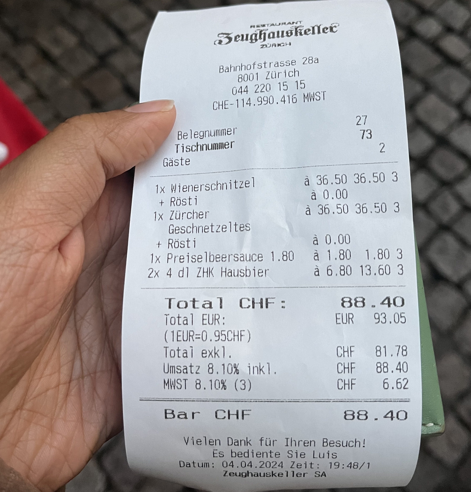
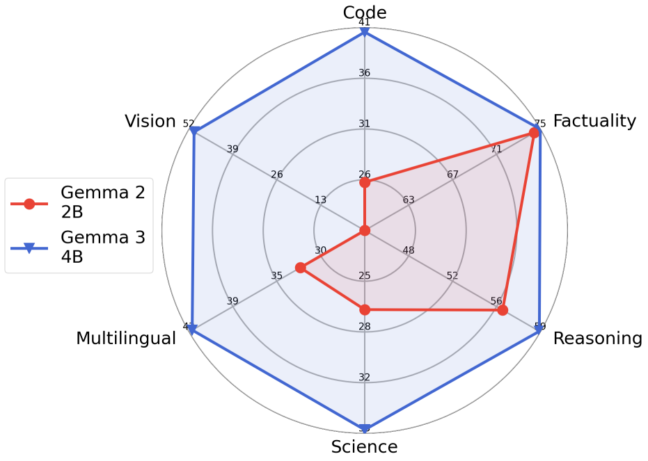
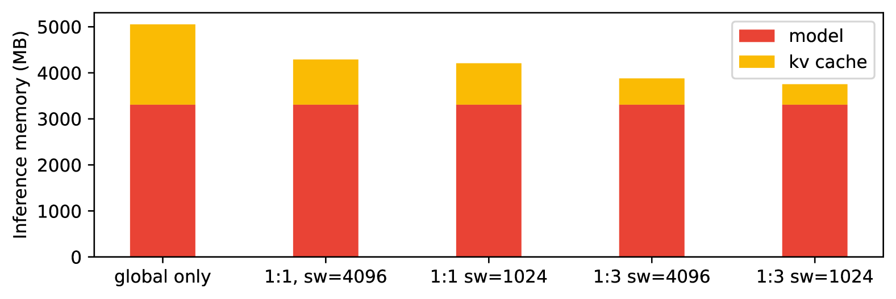
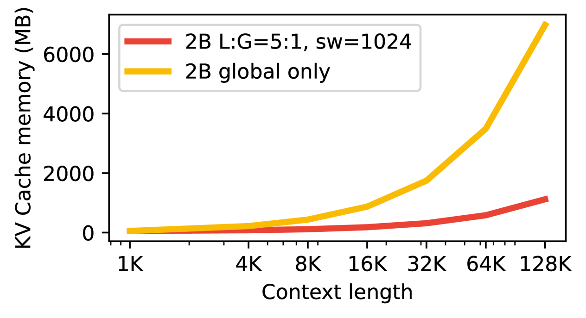
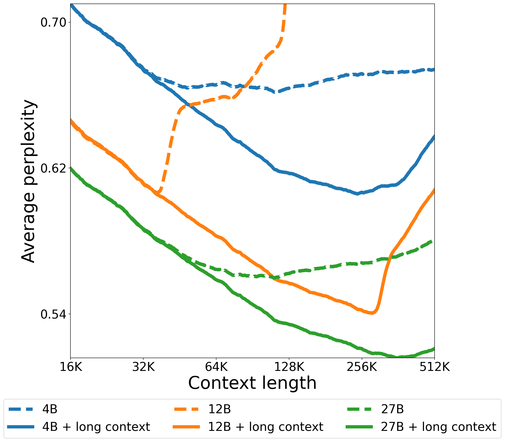

# Gemma 3 テクニカル・レポート

> 原題: Gemma 3 Technical Report
> 著者: Gemma Team Google DeepMind（Core Contributors: Aishwarya Kamath, Johan Ferret, Shreya Pathak, Nino Vieillard, Ramona Merhej, Sarah Perrin, Tatiana Matejovicova, Alexandre Ramé, Morgane Rivière, Louis Rouillard, Thomas Mesnard, Geoffrey Cideron, Jean-bastien Grill, Sabela Ramos, Edouard Yvinec, Michelle Casbon ら）
> 出典: arXiv:2503.19786（2025 年 3 月）
> 連絡先: gemma-3-report@google.com

## Abstract（要旨）

我々は Gemma 3 を紹介する。これは Gemma 系列の軽量オープン・モデル・ファミリーへの **マルチモーダル拡張**で、規模は **10 億から 270 億パラメータ**にわたる。本バージョンは **視覚理解能力**、より広範な言語カバレッジ、そして少なくとも **128K トークン**のより長い文脈を導入する。また、長文脈下で爆発しがちな KV キャッシュ・メモリを削減するためモデル構造も変更する。これは **local（局所）に対する global（大域）attention 層の比率を増加**し、local attention の対象範囲を短く保つことで達成される。Gemma 3 モデルは **知識蒸留**で訓練され、事前学習版・命令微調整版の双方で Gemma 2 を上回る性能を達成する。特に、新規の事後学習レシピが **数学・対話・命令追従・多言語能力**を著しく改善し、Gemma3-4B-IT を **Gemma2-27B-IT に匹敵**させ、Gemma3-27B-IT を **Gemini-1.5-Pro と同等**にする（複数ベンチマーク横断）。全モデルをコミュニティに公開する。

## 1 Introduction（はじめに）

我々は Gemma オープン言語モデルの最新版を提示する。これは **Gemini フロンティア・モデル群と共同設計**された。本新版は Gemma 2 と同等のサイズで提供されるが、**1B モデルが追加**される。これらモデルは **スマートフォン、ラップトップ、ハイエンド GPU** などの標準的な消費者向けハードウェア上で動作するよう設計されている。本版は Gemma ファミリーに **マルチモーダル性、長文脈、多言語性**を追加しつつ、従来版の性能を保持または上回る。

マルチモーダル性に関しては、大多数の Gemma 3 モデルが **専用にカスタマイズされた SigLIP 視覚エンコーダ**と互換である。言語モデルは画像を **SigLIP によって符号化された soft トークン列**として扱う。**視覚埋め込みを固定サイズ 256 ベクトルに圧縮**することで画像処理の推論コストを削減する。エンコーダは固定解像度で動作し、**LLaVA から着想を得た Pan and Scan (P&S) 手法**で柔軟な解像度を可能にする。

第 2 の主要な構造的改善は **文脈サイズを 128K トークンに増加**させたことであり、性能を低下させずに実現する。長文脈の課題は推論中の **KV キャッシュのメモリ爆発**である。この問題を緩和するため、各 global 層の間に複数の local 層を交互配置し、local 層には **1024 トークンの小さな対象範囲**のみ割り当てる。したがって、long context に対応するのは global 層のみで、**1 global 層に対して 5 local 層**の比率となる。

事前学習最適化レシピは Gemma 2 と類似だが、構造設計にいくつかの修正がある。**Gemini 2.0 と同じトークナイザ**を使い、多言語能力を改善するためデータ混合も再検討し、画像理解を導入する。全 Gemma 3 モデルは **知識蒸留**で訓練される。

事後学習では、**数学・推論・対話能力**の改善と、Gemma 3 の新能力（長文脈、画像入力）の統合に焦点を当てる。**新規事後学習アプローチ**が全能力（数学・コーディング・対話・命令追従・多言語）にわたる利得をもたらす。結果として得られる Gemma 3 命令調整モデルは強力かつ汎用的で、前任者を大きく上回る。

以降のセクションでは、モデルの簡潔な概観（構造、事前/事後学習レシピを含む）を提供する。また、定量的・定性的ベンチマークの幅広い詳細評価も提供する。安全で責任ある展開へのアプローチを議論し、Gemma 3 のより広い影響、限界、利点を概説する。

<figure>



<figcaption>図1: Gemma 3 27B IT モデルとの視覚的相互作用の例（チューリッヒでのレシート読み取り）。</figcaption>
</figure>

## 2 Model Architecture（モデル構造）

Gemma 3 モデルは従来世代と同じ一般的な **デコーダのみの Transformer 構造**に従い、ほとんどの構造要素は最初の 2 つの Gemma 版と類似である。**Grouped-Query Attention (GQA, グループ化クエリ注意)** を post-norm と pre-norm（**RMSNorm**）で使用する。Chameleon らに着想を得て、Gemma 2 の **soft-capping を QK-norm に置き換える**。本節では従来版からの主要差異に焦点を当てる。

**5:1 の local/global 層の交互配置**。**local sliding window self-attention** と **global self-attention** を交互配置し、**1 global 層に対して 5 local 層**のパターンとし、モデルの最初の層は local 層から始める。

**表1**: Gemma 3 モデルのパラメータ数。語彙は 256k エントリ。

| Model | Vision Encoder | Embedding Parameters | Non-embedding Parameters |
| --- | --- | --- | --- |
| **1B** | 0 | 302M | 698M |
| **4B** | 417M | 675M | 3,209M |
| **12B** | 417M | 1,012M | 10,759M |
| **27B** | 417M | 1,416M | 25,600M |

**長文脈**。Gemma 3 モデルは **128K トークンの文脈長**をサポートする（**1B は 32K**）。global self-attention 層で **RoPE の base 周波数を 10k から 1M に増加**させ、local 層の周波数を 10k に保つ。global self-attention 層の対象範囲拡張のため、位置補間に類似したプロセスに従う。

### 2.1 Vision modality（視覚モダリティ）

**Vision encoder**。**SigLIP エンコーダの 400M variant**（CLIP 損失の変形で訓練された [[concepts/vision-transformer|Vision Transformer]]）を使用する。Gemma 視覚エンコーダは **896 × 896 にリサイズされた正方形画像**を入力とし、視覚アシスタント・タスクのデータで微調整される。簡潔さのため、**4B / 12B / 27B モデル間で視覚エンコーダを共有**し、訓練中は **凍結**したままにする。

**Pan & Scan (P&S)**。Gemma 視覚エンコーダは **896 × 896 の固定解像度**で動作する。これは非正方形アスペクト比や高解像度画像の処理時に、判読不能なテキストや小オブジェクトの消失などのアーティファクトを引き起こす。我々は **推論時の適応的ウィンドウ・アルゴリズム**でこの問題に対処する。本アルゴリズムは画像を **等サイズの重複しないクロップ**に分割し、画像全体を覆い、それぞれを 896×896 ピクセルにリサイズしてエンコーダに渡す。このウィンドウ化は必要時のみ適用され、最大クロップ数を制御する。**推論時のみの最適化**であり、推論を高速化するため無効化できる。

### 2.2 Pre-training（事前学習）

知識蒸留での事前学習について、Gemma 2 と類似のレシピに従う。

**訓練データ**。事前学習に Gemma 2 よりわずかに大きなトークン予算を使う：**Gemma 3 27B は 14T トークン**、12B 版は 12T、4B は 4T、1B は 2T トークンで訓練する。トークン数の増加は事前学習で使用される画像とテキストの混合を反映する。多言語データ量も増加して言語カバレッジを改善する。単言語と並列の両方のデータを追加し、UniMax に着想を得た戦略で言語表現の不均衡を扱う。

**トークナイザ**。Gemini 2.0 と同じトークナイザを使用：**数字分割、空白保持、バイトレベル符号化**を伴う **SentencePiece トークナイザ**。結果として得られる **語彙は 262k エントリ**。このトークナイザは非英語言語に対してよりバランスが取れている。

**表2**: 訓練インフラとデータ・系列・レプリカ・シャーディング。

| Model | Type | #Chips | Data Shards | Seq. Shards | Replica Shards |
| --- | --- | --- | --- | --- | --- |
| 1B | TPUv5e | 512 | 16 | 16 | 2 |
| 4B | TPUv5e | 2048 | 16 | 16 | 8 |
| 12B | TPUv4 | 6144 | 16 | 16 | 24 |
| 27B | TPUv5p | 6144 | 24 | 8 | 32 |

**フィルタリング**。望ましくないまたは安全でない発話のリスクを削減し、特定の個人情報や他のセンシティブなデータを除去するフィルタリング技術を使用する。事前学習データ混合から評価集合を除染し、機密性のある出力の拡散を最小化することで再現リスクを削減する。低品質データの出現を削減するため、品質再重み付けステップも適用する。

**蒸留**。**1 トークンあたり 256 ロジット**をサンプリングし、教師の確率で重み付けする。生徒は **クロスエントロピー損失**を通じて、これらサンプル内で教師の分布を学習する。教師のターゲット分布は非サンプル・ロジットに対してゼロ確率に設定され、再正規化される。

### 2.3 Quantization Aware Training（量子化を考慮した訓練）

未加工チェックポイントとともに、**異なる標準形式の量子化版モデル**も提供する。これらは各モデルを **5,000 ステップ程度の少数ステップで微調整**し、**Quantization Aware Training (QAT, 量子化考慮訓練)** を使うことで得られる。非量子化チェックポイントからの確率をターゲットとして用い、事前学習・事後学習分布に一致するようデータを適応させる。最も人気のあるオープンソース量子化推論エンジン（例: llama.cpp）に基づき、**3 つの重み表現**に焦点を当てる：**per-channel int4**、**per-block int4**、**switched fp8 (sfp8)**。表 3 では、KV キャッシュありなしで 32k トークン系列に対する未加工および量子化モデルが占めるメモリを報告する。

**表3**: 未加工（bfloat16）と量子化チェックポイントの **32,768 文脈サイズ・8 ビット量子化**における重みと KV キャッシュ（+KV）のメモリ占有量（GB）比較。

| Model | bf16 (Raw) | Int4 | Int4 blocks=32 | SFP8 |
| --- | --- | --- | --- | --- |
| 1B | 2.0 | 0.5 | 0.7 | 1.0 |
| 1B +KV | 2.9 | 1.4 | 1.6 | 1.9 |
| 4B | 8.0 | 2.6 | 2.9 | 4.4 |
| 4B +KV | 12.7 | 7.3 | 7.6 | 9.1 |
| 12B | 24.0 | 6.6 | 7.1 | 12.4 |
| 12B +KV | 38.9 | 21.5 | 22.0 | 27.3 |
| 27B | 54.0 | 14.1 | 15.3 | 27.4 |
| 27B +KV | 72.7 | 32.8 | 34.0 | 46.1 |

### 2.4 Compute Infrastructure（計算インフラ）

**TPUv4、TPUv5e、TPUv5p** でモデルを訓練する（表 2 参照）。各モデル構成は訓練ステップ時間を最小化するよう最適化される。視覚エンコーダについては、**各画像の埋め込みを事前計算し、埋め込みを直接訓練に使用**することで、言語モデルの訓練にコストを追加しない。

オプティマイザ状態は **ZeRO-3** 実装でシャーディングされる。マルチポッド訓練では、**Pathways アプローチ**を用いてデータセンター・ネットワーク上でデータ・レプリカ削減を行う。**Jax と Pathways の単一コントローラ・プログラミング・パラダイム**を、GSPMD パーティショナと MegaScale XLA コンパイラとともに使用する。

**表4**: Gemma IT モデル用のフォーマット。

| Context | Formatting |
| --- | --- |
| User turn | `<start_of_turn>user` |
| Model turn | `<start_of_turn>model` |
| End of turn | `<end_of_turn>` |

例の対話（"Who are you?" / "My name is Gemma!" / "What is 2+2?" / "2+2=4."）のモデル入力：

```
[BOS]<start_of_turn>user
Who are you?<end_of_turn>
<start_of_turn>model
My name is Gemma!<end_of_turn>
<start_of_turn>user
What is 2+2?<end_of_turn>
<start_of_turn>model
```

**表5**: LMSys Chatbot Arena における Gemma 3 27B IT モデルの評価（抜粋、2025 年 3 月 8 日時点の暫定結果）。

| Rank | Model | Elo | Open | Type | #params/#activated |
| --- | --- | --- | --- | --- | --- |
| 1 | Grok-3-Preview-02-24 | 1412 | - | - | - |
| 1 | GPT-4.5-Preview | 1411 | - | - | - |
| 3 | Gemini-2.0-Flash-Thinking-Exp-01-21 | 1384 | - | - | - |
| 3 | Gemini-2.0-Pro-Exp-02-05 | 1380 | - | - | - |
| 3 | ChatGPT-4o-latest (2025-01-29) | 1377 | - | - | - |
| 6 | DeepSeek-R1 | 1363 | yes | MoE | 671B/37B |
| 6 | Gemini-2.0-Flash-001 | 1357 | - | - | - |
| 8 | o1-2024-12-17 | 1352 | - | - | - |
| **9** | **Gemma-3-27B-IT** | **1338** | **yes** | **Dense** | **27B** |
| 9 | Qwen2.5-Max | 1336 | - | - | - |
| 13 | DeepSeek-V3 | 1318 | yes | MoE | 671B/37B |
| 28 | Meta-Llama-3.1-405B-Instruct-bf16 | 1269 | yes | Dense | 405B |
| 38 | Llama-3.3-70B-Instruct | 1257 | yes | Dense | 70B |
| 39 | Qwen2.5-72B-Instruct | 1257 | yes | Dense | 72B |
| 59 | Gemma-2-27B-it | 1220 | yes | Dense | 27B |

## 3 Instruction-Tuning（命令調整）

事前学習済みモデルは、前回のレシピと比較して **改善された事後学習アプローチ**で命令調整モデルに変換される（表 6 参照）。

**技術**。事後学習アプローチは、**大規模 IT 教師からの改善された知識蒸留**と、**BOND、WARM、WARP の改善版に基づく RL 微調整フェーズ**に依存する。

**強化学習目的**。**有用性、数学、コーディング、推論、命令追従、多言語能力**を改善する一方で、モデル有害性を最小化するため、様々な報酬関数を使用する。これには **人間フィードバック・データで訓練された重み平均報酬モデル**、コード実行フィードバック、数学問題解決のための ground-truth 報酬からの学習を含む。

**データ・フィルタリング**。事後学習で使用されるデータを慎重に最適化してモデル性能を最大化する。特定の個人情報、安全でないまたは有害なモデル出力、誤った自己同定データ、重複例を示す例をフィルタする。**より良い文脈内帰属、ヘッジング、拒否を促進する**サブセットの追加は、他指標を劣化させずに事実性指標での性能を改善する。

**[BOS] トークン**。PT と IT 両モデルとも、テキストは **[BOS] トークン**で始まる必要があり、明示的に追加する必要がある（テキスト "[BOS]" は [BOS] トークンにマップされないため）。例えば Flax は `add_bos=True` オプションでトークン化時に自動追加できる。

**PT vs IT フォーマット**。全モデルは同じトークナイザを共有するが、IT フォーマット専用の制御トークンを持つ。主要な違いは、**PT モデルは生成終了時に `<eos>` トークンを出力するのに対し、IT モデルは `<end_of_turn>` を出力**することである。

## 4 Evaluation of final models（最終モデルの評価）

本節では、IT モデルを **MMLU などの静的ベンチマーク**を含む多様な領域の自動ベンチマークと人間評価で評価する。

### 4.1 LMSYS Chatbot Arena

本節では、IT 27B モデルの LMSys Chatbot Arena 上での性能を、他の最先端モデルに対するブラインド side-by-side 評価（人間評価者による）で報告する。表 5 で Elo スコアを報告する。**Gemma 3 27B IT (1338) はトップ 10 ベスト・モデルの一つ**であり、**DeepSeek-V3 (1318)、LLaMA 3 405B (1257)、Qwen2.5-70B (1257) などのはるかに大きなモデルを上回るオープン非推論モデルとしてのスコア**を持つ。最後に、Gemma 3 の Elo は Gemma 2 (1220) より著しく高い。これら他モデルが視覚能力を持たない一方、Elo スコアは視覚能力を考慮していない点に注意。

### 4.2 Standard benchmarks（標準ベンチマーク）

表 6 に、様々なベンチマークでの最終モデルの性能を、前世代と Gemini 1.5 と比較して示す。

**表6**: Gemini 1.5 / Gemini 2.0 / Gemma 2 と比較した命令微調整 (IT) モデルのゼロショット・ベンチマーク性能。

| | Gemini 1.5 Flash | Gemini 1.5 Pro | Gemini 2.0 Flash | Gemini 2.0 Pro | Gemma 2 2B | Gemma 2 9B | Gemma 2 27B | **Gemma 3 1B** | **Gemma 3 4B** | **Gemma 3 12B** | **Gemma 3 27B** |
| --- | --- | --- | --- | --- | --- | --- | --- | --- | --- | --- | --- |
| MMLU-Pro | 67.3 | 75.8 | 77.6 | 79.1 | 15.6 | 46.8 | 56.9 | 14.7 | 43.6 | 60.6 | **67.5** |
| LiveCodeBench | 30.7 | 34.2 | 34.5 | 36.0 | 1.2 | 10.8 | 20.4 | 1.9 | 12.6 | 24.6 | 29.7 |
| Bird-SQL (dev) | 45.6 | 54.4 | 58.7 | 59.3 | 12.2 | 33.8 | 46.7 | 6.4 | 36.3 | 47.9 | 54.4 |
| GPQA Diamond | 51.0 | 59.1 | 60.1 | 64.7 | 24.7 | 28.8 | 34.3 | 19.2 | 30.8 | 40.9 | 42.4 |
| SimpleQA | 8.6 | 24.9 | 29.9 | 44.3 | 2.8 | 5.3 | 9.2 | 2.2 | 4.0 | 6.3 | 10.0 |
| FACTS Grounding | 82.9 | 80.0 | 84.6 | 82.8 | 43.8 | 62.0 | 62.4 | 36.4 | 70.1 | 75.8 | **74.9** |
| Global MMLU-Lite | 73.7 | 80.8 | 83.4 | 86.5 | 41.9 | 64.8 | 68.6 | 34.2 | 54.5 | 69.5 | 75.1 |
| **MATH** | 77.9 | 86.5 | 90.9 | 91.8 | 27.2 | 49.4 | 55.6 | 48.0 | 75.6 | 83.8 | **89.0** |
| HiddenMath | 47.2 | 52.0 | 63.5 | 65.2 | 1.8 | 10.4 | 14.8 | 15.8 | 43.0 | 54.5 | 60.3 |
| MMMU (val) | 62.3 | 65.9 | 71.7 | 72.7 | - | - | - | - | 48.8 | 59.6 | **64.9** |

## 5 Ablations（アブレーション研究）

本節では、構造変更の影響と本モデルに新規追加された視覚能力に焦点を当てる。

### 5.1 Pre-training ability probing（事前学習時の能力プロービング）

事前学習中に標準ベンチマークを **プローブ**として使い、モデルが一般能力を捉えるよう保証する。図 2 で Gemma 2 と 3 の事前学習モデルを、**科学・コード・事実性・多言語性・推論・視覚**の一般能力について比較する。詳細結果は appendix にまとめる。総じて、**視覚の追加にも関わらずほとんどのカテゴリで新版が改善**する。本版では特に多言語性に焦点を当て、これがモデルの品質に直接影響する。除染技術の使用にも関わらず、プローブの汚染リスクは常に存在し、明確な結論を引き出すことを困難にする。

<figure>



<figcaption>図2: 一般能力にわたる Gemma 2 と 3 の異なる事前学習モデルの性能サマリー。これらプロットは簡略化されたサマリーを示すことを意図し、詳細は appendix にある。</figcaption>
</figure>

### 5.2 Local:Global attention layers（local:global attention 層）

local と global self-attention 層の変更が推論中の性能とメモリ消費に与える影響を測定する。

**Local:Global 比**。図 3 では local 対 global attention 層の異なる比率を比較する。**Gemma 2 では 1:1、Gemma 3 では 5:1** を使用する。この比率を変えても **perplexity への影響は最小限**である。

**Sliding window サイズ**。図 4 では異なる global:local 比設定での local attention 層の sliding window サイズを比較する。**Sliding window は perplexity に影響を与えずに大幅に削減できる**。

**KV キャッシュ・メモリへの影響**。図 5 では、32k トークン文脈での推論中にモデルが使用するメモリと KV キャッシュ・メモリのバランスを示す。**"global only" 構成（ほとんどの dense モデルで使用される標準構成）は 60% のメモリ・オーバーヘッドを生む**一方、**1:3 + sliding window 1024 ("sw=1024") では 15% 未満に削減**される。図 6 では、KV キャッシュが使用するメモリを文脈長の関数として計算する。

<figure>



<figcaption>図5: 推論中のモデル vs KV キャッシュ・メモリ（pre-fill KV キャッシュ・サイズ 32k）。異なる local 対 global 比率と sliding window サイズ (sw) を持つ 2B モデルを考える。Gemma 1 と Llama で標準の「global only」と比較。このアブレーションはテキスト専用モデルで実行。</figcaption>
</figure>

<figure>



<figcaption>図6: KV キャッシュ・メモリ vs 文脈長。我々のアーキテクチャ (L:G=5:1, sw=1024) と global attention のみの transformer (LLaMa や Gemma 1 で使用) の KV キャッシュ・メモリ使用量を示す。</figcaption>
</figure>

### 5.3 Enabling long context（長文脈の有効化）

**128K 系列でゼロから訓練**する代わりに、**32K 系列で事前学習**し、その後 4B / 12B / 27B モデルを事前学習終了時に **128K トークンまで RoPE 再スケーリング**でスケールアップする。実践上、**スケーリング係数 8 が良好**に動作することが分かる。Gemma 2 と比較して、**global self-attention 層の RoPE base 周波数を 10k から 1M に増加**させ、local self-attention 層は 10k に保つ。

<figure>



<figcaption>図7: RoPE 再スケーリング前後の事前学習モデルの長文脈性能。</figcaption>
</figure>

### 5.4 Small versus large teacher（小教師 vs 大教師）

一般的な発見として、小さなモデルを訓練するには **より小さな教師から蒸留する方が好ましい**とされている。我々は、これらの研究はしばしば、より悪い教師の正則化効果がより良い教師を使う恩恵を上回る設定で実行されていると推測する。異なるサイズの教師（1 つは大、1 つは小）で生徒を異なる訓練ホライズンで訓練したところ、**短い訓練ホライズンでは小さな教師が良いが、長い訓練ホライズンではこの傾向が逆転**することを観察した。

### 5.5 Vision encoder（視覚エンコーダ）

**表7**: 画像エンコーダ入力解像度の影響。ベンチマークでの 2B Gemma モデルの短いスケジュール性能。

| Resolution | DocVQA | InfoVQA | TextVQA |
| --- | --- | --- | --- |
| 256 | 31.9 | 23.1 | 44.1 |
| 448 | 45.4 | 31.6 | 53.5 |
| **896** | **59.8** | **33.7** | **58.0** |

**画像解像度の影響**。SigLIP に基づく視覚エンコーダを使用する。視覚エンコーダは凍結され、言語モデルのみが訓練される。本マルチモーダル・データの各画像は、それぞれの視覚エンコーダから **256 個の画像トークン**で表現される。より高い解像度エンコーダは出力を 256 トークンに削減するため **average pooling** を使用する。例えば 896 解像度エンコーダは出力に対して **4x4 average pooling** を持つ。表 7 に示すように、**より高解像度エンコーダがより小さなものより良好**に機能する。

**表8**: P&S の影響。事前学習済みチェックポイントでの 4-shot 評価結果（P&S あり/なし）。

| | DocVQA | InfoVQA | TextVQA |
| --- | --- | --- | --- |
| 4B | 72.8 | 44.1 | 58.9 |
| **4B w/ P&S** | **81.0** | **57.0** | **60.8** |
| Δ | (+8.2) | (+12.9) | (+1.9) |
| 27B | 85.6 | 59.4 | 68.6 |
| **27B w/ P&S** | **90.4** | **76.4** | **70.2** |
| Δ | (+4.8) | (+17.0) | (+1.6) |

**Pan & Scan**。P&S はネイティブ・アスペクト比とほぼ画像解像度で画像を捉えることを可能にする。表 8 では、P&S あり/なしで 27B IT モデルを比較する。期待通り、**ネイティブ解像度に近い画像を扱う能力は、画像上のテキスト読み取り**を必要とするタスクで大きく助けとなる、これは視覚言語モデルに特に重要である。

## 6 Memorization and Privacy（記憶化とプライバシー）

大規模言語モデルは訓練で使用されたテキストの近似コピーを生成することがある。複数の事前報告がこのリスクを **記憶化率 (memorization rate)** の測定で定量化してきた。「記憶化率」はモデルからの生成のうち訓練データに一致する比率として定義される。Gemma 2 の方法論に従い測定する：訓練データの大きな部分を異なるコーパスにわたって均一にサブサンプリングし、**長さ 50 のプレフィックスと長さ 50 のサフィックス**を用いた **discoverable extraction** でテストする。継続の全トークンがソース・サフィックスと一致するなら「**正確に記憶化** (exactly memorized)」、編集距離 10% 以内で一致するなら「**近似的に記憶化** (approximately memorized)」と表記する。

図 9 は Gemma と Gemini モデルの記憶化率を比較する。**Gemma 3 モデルは長文形式テキストを以前のすべてのモデルよりはるかに低いレートで記憶化**することが分かる（注: log y 軸）。1B が大型モデルより少なく記憶化することを除けば、4B / 12B / 27B 間ではわずかな差のみ観察される。さらに、**より大きな比率のテキストが近似的に記憶化として特徴付けられ**、正確な記憶化と比較した近似的記憶化の相対的増加は平均で約 24 倍となる。

生成に個人情報が含まれるレートも研究する。潜在的に個人情報を識別するため、**Google Cloud Sensitive Data Protection (SDP) サービス**を使用する。SDP は false positive が多いため、記憶化として分類された出力に含まれる潜在的個人情報の真の量を過大評価していると考えられる。**全 Gemma 3 モデルで、記憶化として特徴付けられた出力に個人情報は観察されなかった**。

## 7 Responsibility, Safety, Security（責任、安全性、セキュリティ）

責任、安全性、セキュリティは Gemma モデル開発で最重要である。Gemma 3 のユーザへのリスク削減のため、開発ワークフロー全体にわたる強化された内部安全プロセスを継続して統合してきた。これは訓練時の安全緩和と、新規導入された image-to-text 能力への堅牢で透明なモデル評価に焦点を当てる。

### 7.1 Governance & Assessment（ガバナンスと評価）

Gemma の利点とリスク評価へのアプローチは、Gemma 1 で概説されたものを反映し、サポートされるモダリティの変化を考慮する。**AI のオープン性は技術の利点を社会全体に広げられる**が、個人および機関レベルで害を引き起こしうる悪意ある使用のリスクに対して評価されなければならない。Gemma 3 を 4B 画像安全性分類器（ShieldGemma 2）で構築するなど、これらモデルは多数の社会的に有益な応用を推進してきた。

### 7.2 Safety policies and train-time mitigations（安全ポリシーと訓練時緩和）

Gemma の安全性アプローチの主要な柱は、Gemini モデルと整合した **Google の安全ポリシー**との微調整モデルの整合である。これらは以下のような有害コンテンツの生成を防止するよう設計されている：

- 児童性的虐待と搾取
- 害を引き起こす可能性のある個人識別可能情報（例: 社会保障番号）
- ヘイト・スピーチとハラスメント
- 危険または悪意あるコンテンツ
- 性的に露骨なコンテンツ
- 科学的または医学的合意に反する医療助言

事前学習・微調整チェックポイントが有害コンテンツを生成する可能性を削減するため、事前学習データの相当な安全フィルタリングを実施した。微調整モデルには **SFT と RLHF の両方**を使用して望ましくない行動から導く。

### 7.3 Assurance Evaluations（保証評価）

IT モデルを **ベースライン保証評価**集合に通して、モデルが引き起こしうる潜在的害を理解する。**ベースライン保証**は安全ポリシーのモデル違反率を、大量の合成敵対的ユーザ・クエリと人間評価者を用いて捕捉する。総じて、**Gemma 3 違反率はこれら安全ポリシーで著しく低い**。

**化学・生物・放射性・核 (CBRN) 知識**については、STEM 関連タスクでの強化された性能のため、内部データセットを使って評価した。**Gemma 3 モデルのこれら領域での知識は低い**ことを示唆する。

### 7.4 Our approach to responsible open models（責任あるオープン・モデルへのアプローチ）

安全、セキュア、責任ある応用設計には **システム・レベルのアプローチ**が必要で、各特定の使用ケースと環境に関連するリスクを緩和する。我々は、モデルからの潜在的リスクに比例する評価と安全緩和を採用し続け、利点が予見可能なリスクを著しく上回ると確信した場合にのみコミュニティと共有する。

## 8 Discussion and Conclusion（議論と結論）

本作で、テキスト・画像・コードのオープン言語モデルである **Gemma ファミリーの最新版 Gemma 3** を提示した。本版では、**画像理解と長文脈の追加**、**多言語性と STEM 関連能力の改善**に焦点を当てた。モデル・サイズと構造は標準ハードウェアとの互換性を持つよう設計され、性能を維持しつつこのハードウェアに合わせて多くの構造改善が施されている。

---

## Appendix（付録）

### Details of pre-trained performances（事前学習性能の詳細）

**表9**: 事前学習後の事実性・常識性能と推論。

| | Gemma 2 2B | Gemma 2 9B | Gemma 2 27B | Gemma 3 1B | Gemma 3 4B | Gemma 3 12B | Gemma 3 27B |
| --- | --- | --- | --- | --- | --- | --- | --- |
| HellaSwag | 72.9 | 81.9 | 86.4 | 62.3 | 77.2 | 84.2 | 85.6 |
| BoolQ | 75.6 | 77.5 | 76.2 | 63.2 | 72.3 | 78.8 | 82.4 |
| PIQA | 78.1 | 81.9 | 83.5 | 73.8 | 79.6 | 81.8 | 83.3 |
| SIQA | 51.8 | 53.3 | 53.8 | 48.9 | 51.9 | 53.4 | 54.9 |
| TriviaQA | 60.2 | 76.5 | 83.8 | 39.8 | 65.8 | 78.2 | 85.5 |
| NQ | 17.2 | 29.2 | 34.7 | 9.48 | 20.0 | 31.4 | 36.1 |
| ARC-C | 55.8 | 69.1 | 71.4 | 38.4 | 56.2 | 68.9 | 70.6 |
| ARC-E | 80.6 | 88.3 | 88.6 | 73.0 | 82.4 | 88.3 | 89.0 |
| WinoGrande | 65.4 | 73.9 | 79.4 | 58.2 | 64.7 | 74.3 | 78.8 |
| BBH | 42.4 | 69.4 | 74.8 | 28.4 | 50.9 | 72.6 | 77.7 |
| DROP | 53.2 | 71.5 | 75.2 | 42.4 | 60.1 | 72.2 | 77.2 |

**事実性と常識**。表 9 で新しい事前学習済みモデルの性能を従来版と比較して報告する。総じて、これら能力は本版の改善の焦点ではないが、Gemma 2 と同等水準にあることが示される。

**表10**: 事前学習後の STEM とコード性能。

| | Gemma 2 2B | Gemma 2 9B | Gemma 2 27B | Gemma 3 4B | Gemma 3 12B | Gemma 3 27B |
| --- | --- | --- | --- | --- | --- | --- |
| MMLU | 52.2 | 71.2 | 75.2 | 59.6 | 74.5 | **78.6** |
| MMLU-Pro | 22.2 | 43.7 | 49.4 | 29.2 | 45.3 | **52.2** |
| AGIE | 31.6 | 53.1 | 55.1 | 42.1 | 57.4 | **66.2** |
| MATH | 16.4 | 36.4 | 42.1 | 24.2 | 43.3 | **50.0** |
| GSM8K | 25.0 | 70.2 | 74.6 | 38.4 | 71.0 | **82.6** |
| GPQA Diamond | 12.5 | 24.8 | 26.3 | 15.0 | 25.4 | 24.3 |
| MBPP | 31.0 | 51.2 | 60.8 | 46.0 | 60.4 | **65.6** |
| HumanEval | 19.5 | 40.2 | 51.2 | 36.0 | 45.7 | 48.8 |

**STEM とコード**。**事前学習済みモデル全体で STEM 能力の一貫した改善**が見られる。コードについては 4B と 12B モデルで類似の改善が見られるが、27B では見られない。

**表11**: 事前学習フェーズ後のマルチモーダル性能（P&S なし、各データセットの val split）。

| | 4B | 12B | 27B |
| --- | --- | --- | --- |
| COCO caption | 102 | 111 | 116 |
| DocVQA | 72.8 | 82.3 | 85.6 |
| InfoVQA | 44.1 | 54.8 | 59.4 |
| MMMU | 39.2 | 50.3 | 56.1 |
| TextVQA | 58.9 | 66.5 | 68.6 |
| RealWorldQA | 45.5 | 52.2 | 53.9 |
| ReMI | 27.3 | 38.5 | 44.8 |
| AI2D | 63.2 | 75.2 | 79.0 |
| ChartQA | 63.6 | 74.7 | 76.3 |
| VQAv2 | 63.9 | 71.2 | 72.9 |
| BLINK | 38.0 | 35.9 | 39.6 |
| OK-VQA | 51.0 | 58.7 | 60.2 |
| TallyQA | 42.5 | 51.8 | 54.3 |
| SpatialSense VQA | 50.9 | 60.0 | 59.4 |
| CountBench VQA | 26.1 | 17.8 | 68.0 |

**画像理解**。表 11 で、視覚エンコーダで訓練された異なるモデルの視覚質問応答ベンチマーク性能を報告する：COCO Caption、DocVQA、InfographicVQA、MMMU、TextVQA、RealWorldQA、ReMI、AI2D、ChartQA、VQA v2、BLINK、OK-VQA、TallyQA、SpatialSense VQA、CountBench VQA。

**表12**: マルチモーダル・ベンチマーク微調整後の事前学習チェックポイント性能（P&S なし、PaliGemma 2 比較）。

| | PaliGemma 2 2B | PaliGemma 2 9B | PaliGemma 2 27B | **Gemma 3 4B** | **Gemma 3 12B** | **Gemma 3 27B** |
| --- | --- | --- | --- | --- | --- | --- |
| DocVQA | 81.6 | 86.3 | 85.1 | 86.1 | 89.0 | **89.5** |
| InfoVQA | 41.4 | 53.1 | 50.2 | 55.6 | 61.6 | **64.6** |
| TextVQA | 76.3 | 76.3 | 75.1 | 79.1 | 81.6 | **83.2** |
| ChartQA | 70.7 | 79.1 | 71.3 | 79.8 | 83.5 | **83.4** |
| AI2D | 76.0 | 84.4 | 84.6 | 80.9 | 85.6 | **86.5** |
| OKVQA | 64.1 | 68.6 | 70.6 | 65.2 | 69.3 | **71.1** |
| CountBenchQA | 82.0 | 85.3 | 87.4 | 79.4 | 83.5 | **87.8** |
| COCO caption | 143. | 145. | 145. | 143. | 143. | 144. |
| VQAv2 | 84.8 | 85.8 | 85.8 | 84.1 | 84.9 | 85.1 |
| Tally QA | 80.6 | 82.4 | 82.1 | 79.0 | 81.3 | 81.7 |

**PaliGemma 2 との比較**。**PaliGemma 2 のプロトコルに従ってマルチモーダル Gemma 3 事前学習チェックポイントを微調整**する—学習率のみスイープし、他は同じ転送設定。表 12 の結果は、**Gemma 3 が文書理解関連ベンチマークで優れ、より大きな PaliGemma 2 variant すら上回る**ことを示す。視覚エンコーダの average pooling のため、**Gemma 3 4B と 12B モデルは同 896x896 解像度の PaliGemma 2 9B と 27B モデルと比較して転送が約 10x 安価**であることに注意。

**表13**: 事前学習フェーズ後の多言語性能。

| | Gemma 2 2B | Gemma 2 9B | Gemma 2 27B | Gemma 3 1B | Gemma 3 4B | Gemma 3 12B | Gemma 3 27B |
| --- | --- | --- | --- | --- | --- | --- | --- |
| MGSM | 18.7 | 57.3 | 68.0 | 2.04 | 34.7 | 64.3 | **74.3** |
| GMMLU | 43.3 | 64.0 | 69.4 | 24.9 | 57.0 | 69.4 | **75.7** |
| WMT24++ | 38.8 | 50.3 | 53.0 | 36.7 | 48.4 | 53.9 | **55.7** |
| Flores | 30.2 | 41.3 | 44.3 | 29.5 | 39.2 | 46.0 | **48.8** |
| XQuAD | 53.7 | 72.2 | 73.9 | 43.9 | 68.0 | 74.5 | **76.8** |
| ECLeKTic | 8.29 | 14.0 | 17.1 | 4.69 | 11.0 | 17.2 | **24.4** |
| IndicGB | 47.4 | 59.3 | 62.1 | 41.4 | 57.2 | 61.7 | **63.4** |

**多言語性**。表 13 では多言語タスクでの事前学習モデルの性能を報告する：MGSM、Global-MMLU-Lite、WMT24++、FLoRes、XQuAD、ECLeKTic、IndicGenBench、XOR QA。

**表14**: 事前学習フェーズ後の詳細 IndicGenBench 性能（省略、原典参照）。

**表15**: 異なる文脈長での事前学習 (PT) と命令微調整 (IT) モデルの長文脈ベンチマーク性能。

| | Context | Gemma 3 PT 4B | Gemma 3 PT 12B | Gemma 3 PT 27B | Gemma 3 IT 4B | Gemma 3 IT 12B | Gemma 3 IT 27B |
| --- | --- | --- | --- | --- | --- | --- | --- |
| RULER | 32K | 67.1 | 90.6 | 85.9 | 61.4 | 80.3 | **91.1** |
| RULER | 128K | 51.7 | 80.7 | 72.9 | 46.8 | 57.1 | 66.0 |
| MRCR | 32K | 44.7 | 59.8 | 63.2 | 49.8 | 53.7 | 63.2 |
| MRCR | 128K | 40.6 | 56.9 | 60.0 | 44.6 | 49.8 | 59.3 |

**長文脈**。表 15 で RULER と MRCR ベンチマークでの 32K と 128K 系列長の評価を含める。

### 8.1 Performance of IT models（IT モデルの性能）

**表16**: 命令微調整 (IT) モデルのマルチモーダル・ベンチマーク性能（P&S 適用、最終テスト集合）。

| | 4B | 12B | 27B |
| --- | --- | --- | --- |
| MMMU (val) | 48.8 | 59.6 | **64.9** |
| **DocVQA** | 75.8 | 87.1 | **86.6** |
| **InfoVQA** | 50.0 | 64.9 | **70.6** |
| TextVQA | 57.8 | 67.7 | 65.1 |
| AI2D | 74.8 | 84.2 | **84.5** |
| ChartQA | 68.8 | 75.7 | **78.0** |
| VQAv2 (val) | 62.4 | 71.6 | 71.0 |
| **MathVista (testmini)** | 50.0 | 62.9 | **67.6** |

### 8.2 Performance of IT models on video understanding（IT モデルの動画理解性能）

**表17**: 命令微調整 (IT) モデルの視覚理解ベンチマーク性能（0-shot、16 frames linspace）。

| | 4B | 12B | 27B |
| --- | --- | --- | --- |
| Perception Test MCVQA | 50.6 | 54.9 | **58.1** |
| ActivityNet-QA | 46.3 | 50.4 | **52.8** |

**表18**: IT モデルの追加内部・外部ベンチマーク性能。

| | Gemma 2 2B | Gemma 2 9B | Gemma 2 27B | Gemma 3 1B | Gemma 3 4B | Gemma 3 12B | Gemma 3 27B |
| --- | --- | --- | --- | --- | --- | --- | --- |
| MMLU | 56.1 | 71.3 | 76.2 | 38.8 | 58.1 | 71.9 | **76.9** |
| MBPP | 36.6 | 59.2 | 67.4 | 35.2 | 63.2 | 73.0 | **74.4** |
| HumanEval | 20.1 | 40.2 | 51.8 | 41.5 | 71.3 | 85.4 | **87.8** |
| N2C | 46.8 | 68.3 | 77.3 | 56.0 | 70.3 | 80.7 | **84.5** |
| LiveCodeBench | 7.0 | 20.0 | 29.0 | 5.0 | 23.0 | 32.0 | **39.0** |
| GSM8K | 62.6 | 88.1 | 91.1 | 62.8 | 89.2 | 94.4 | **95.9** |
| **MATH** | 27.2 | 49.4 | 55.6 | 48.0 | 75.6 | 83.8 | **89.0** |
| HiddenMath | 2.0 | 8.0 | 12.0 | 15.0 | 42.0 | 51.0 | **56.0** |
| BBH | 41.4 | 69.0 | 74.9 | 39.1 | 72.2 | 85.7 | **87.6** |
| BBEH | 5.9 | 9.8 | 14.8 | 7.2 | 11.0 | 16.3 | **19.3** |
| IFEval | 80.4 | 88.4 | 91.1 | 80.2 | 90.2 | 88.9 | **90.4** |
| GMMLU-Lite | 41.9 | 64.8 | 68.6 | 34.2 | 54.5 | 69.5 | **75.1** |
| ECLeKTic | 5.3 | 11.8 | 17.6 | 1.4 | 4.6 | 10.3 | 16.7 |
| WMT24++ | 37.4 | 48.7 | 51.7 | 35.9 | 46.8 | 51.6 | **53.4** |

**追加マルチモーダル評価**。Gemma 3 IT モデルは Gemini 1.5 の評価プロトコルに従って一般視覚ベンチマークで評価された。結果は表 16 で報告される（P&S が有効化されている場合）。

### 評価詳細

評価セットアップの詳細（n-shot、COT 使用、正規化方法）は **表 19（テキスト・ベンチマーク）、表 20（視覚ベンチマーク、CoT・正規化なし、全 4-shot）、表 21（IT ベンチマーク）** に記載される（詳細は原典参照）。
