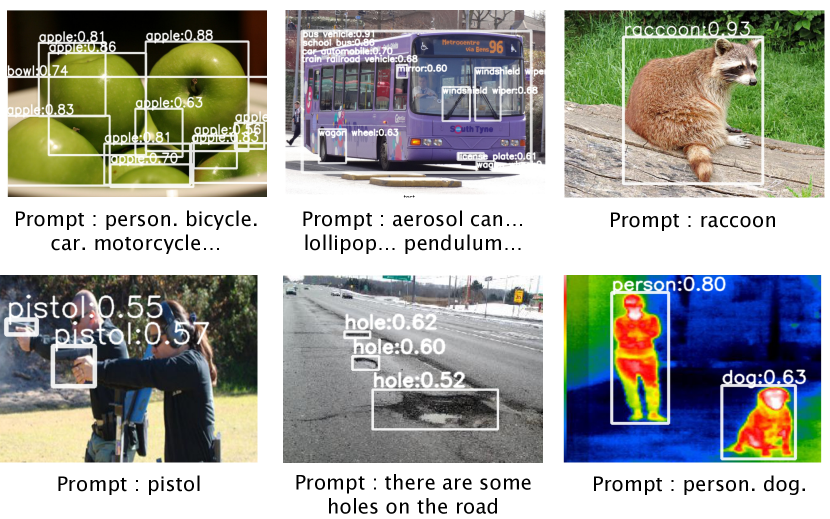
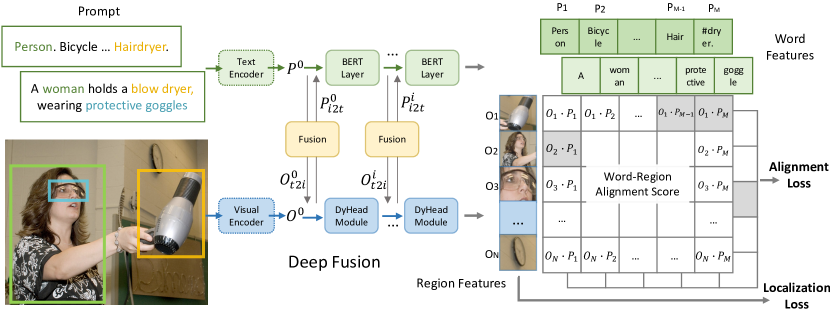
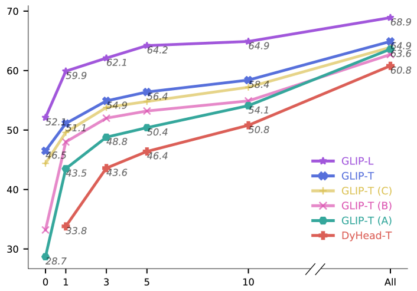
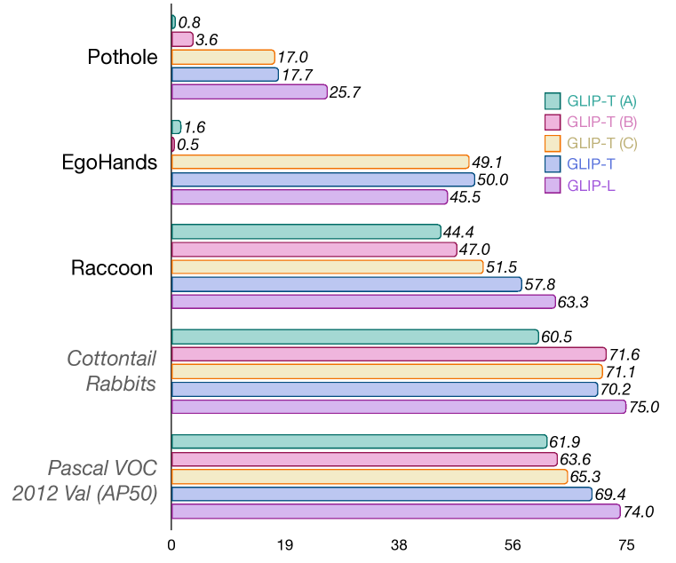
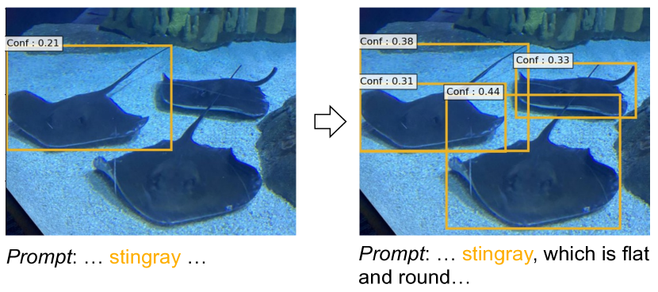
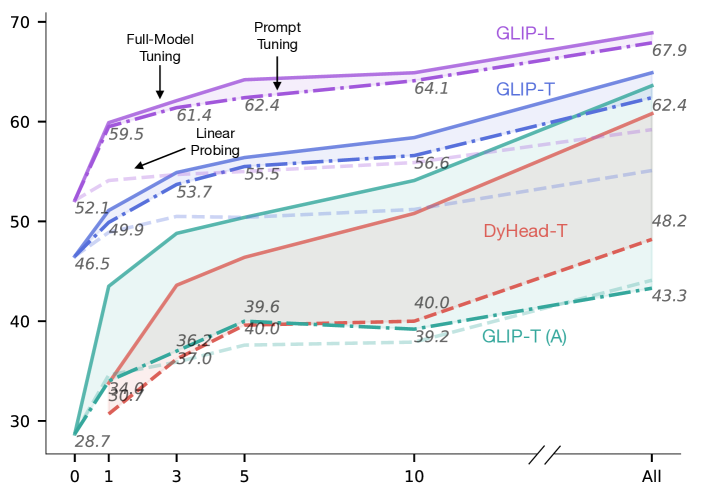

# Grounded Language-Image Pre-training（GLIP）

> 原題: Grounded Language-Image Pre-training
> arXiv: 2112.03857
> 著者: Liunian Harold Li, Pengchuan Zhang, Haotian Zhang, Jianwei Yang, Chunyuan Li, Yiwu Zhong, Lijuan Wang, Lu Yuan, Lei Zhang, Jenq-Neng Hwang, Kai-Wei Chang, Jianfeng Gao（UCLA / Microsoft Research / University of Washington / University of Wisconsin-Madison / Microsoft Cloud and AI / IDEA）
> 出典: CVPR 2022
> コード: <https://github.com/microsoft/GLIP>

## Abstract（要旨）

本論文は、**オブジェクトレベル、言語認識、意味豊富な視覚表現** を学習するための **Grounded Language-Image Pre-training (GLIP)** モデルを提示する。

GLIP は **事前学習のために物体検出と phrase grounding を統一** する。この統一は 2 つの利点をもたらす:

1. GLIP が **検出と grounding の両方のデータから学ぶ** ことを可能にし、両タスクを改善し、良好な grounding モデルを bootstrap する
2. GLIP は **self-training 方式で grounding box を生成することで膨大な画像-テキストペアを活用** でき、学習された表現を意味豊富にする

我々の実験では、GLIP を **2700 万の grounding データ** で事前学習する。これには 300 万の人手注釈データと 2400 万の web からクロールされた画像-テキストペアが含まれる。学習された表現は、様々なオブジェクトレベル認識タスクへの強力な **ゼロショット** および **few-shot** 転送可能性を示す。

1. COCO と LVIS で **直接評価** したとき（事前学習中に COCO の画像を一切見ていない）、GLIP はそれぞれ **49.8 AP** と **26.9 AP** を達成し、多くの教師ありベースラインを上回る
2. COCO で **fine-tune した後**、GLIP は val で **60.8 AP**、test-dev で **61.5 AP** を達成し、先行 SoTA を上回る
3. **13 の下流物体検出タスクに転送** すると、1-shot GLIP は完全教師ありの Dynamic Head と競合する

コードは <https://github.com/microsoft/GLIP> で公開されている。

## 1 Introduction（はじめに）

視覚認識モデルは典型的に **事前定義された固定の物体カテゴリ集合** を予測するように訓練される。これは実世界の応用での使用可能性を制限する。新しい視覚的概念やドメインに一般化するには追加のラベル付きデータが必要だからである。

**CLIP** [45] は、画像レベルの視覚表現が大量の生の画像-テキストペアで効果的に学習できることを示した。ペアになったテキストは、事前定義された概念プールよりも **広い視覚的概念の集合** を含むため、事前学習された CLIP モデルは意味的に豊富であり、ゼロショット設定で下流の画像分類や text-image 検索タスクに容易に転送できる。

しかし、物体検出 [49, 36]、セグメンテーション [40, 7]、人物姿勢推定 [63, 54]、シーン理解 [30, 64, 16]、動作認識 [20]、視覚-言語理解 [41, 55, 8, 53, 33, 32, 73, 35, 34, 70] のような **多くのタスクが要求する細粒度の画像理解** のためには、**オブジェクトレベルの視覚表現** が強く望まれる。

<figure>

<figcaption>図1: GLIP は、関心のあるカテゴリをテキストプロンプトに書き込むことで、様々な検出タスクへゼロショット転送する。</figcaption>
</figure>

本論文で我々は、**phrase grounding**（文中の phrase と画像内の物体/領域の細粒度対応を識別するタスク）が、**オブジェクトレベル、言語認識、意味豊富** な視覚表現を学習するための **効果的でスケーラブルな事前学習タスク** であることを示し、**Grounded Language-Image Pre-training (GLIP)** を提案する。

我々のアプローチは **phrase grounding と物体検出タスクを統一** する。物体検出は **文脈なしの phrase grounding** として、phrase grounding は **文脈付きの物体検出** タスクとして見なせる。主な貢献を以下に強調する。

<figure>

<figcaption>図2: 検出と grounding のための統一フレームワーク。検出された各物体に対してカテゴリクラスを予測する古典的な物体検出モデルとは異なり、我々は検出を grounding タスクとして再定式化し、各 region/box をテキストプロンプト内の phrase に整列させる。GLIP は画像エンコーダと言語エンコーダを共同で訓練し、region と単語の正しいペアリングを予測する。さらに **cross-modality deep fusion** を加えて、2 つのモダリティからの情報を早期に融合し、言語認識の視覚表現を学習する。</figcaption>
</figure>

**物体検出を phrase grounding として再定式化することで統一する**。この再定式化により、検出モデルの入力が変化する: 画像だけでなく、検出タスク内の **すべての候補カテゴリを記述するテキストプロンプト** も入力として取る。例えば、COCO 物体検出 [37] のテキストプロンプトは、80 個の COCO 物体クラス名を "。" で結合した文字列である。

任意の物体検出モデルは、box 分類器の物体分類ロジットを **word-region alignment スコア**（region/box の視覚特徴と token/phrase の言語特徴の内積）に置き換えることで grounding モデルに変換できる。言語特徴は言語モデルを使って計算され、新しい検出（または grounding）モデルに **dual-encoder 構造** を与える。

最後の内積層でのみ vision と language を融合する CLIP [45] とは異なり、GLIP によって適用される **deep cross-modality fusion** が、高品質な言語認識視覚表現を学習し、優れた転送学習性能を達成するために **決定的に重要** である。

検出と grounding の統一により、両方の種類のデータを使って事前学習することも可能になり、両タスクが恩恵を受ける:

- **検出側**: grounding データのおかげで視覚概念のプールが大幅に豊富になる
- **grounding 側**: 検出データがより多くのバウンディングボックス注釈を導入し、新しい SoTA phrase grounding モデルの訓練に役立つ

**大規模画像-テキストデータで視覚概念をスケールアップする**。良い grounding モデル（teacher）が与えられれば、**massive な画像-テキストペアデータに対して grounding box を自動生成** することで GLIP 事前学習データを増強できる。名詞句は NLP パーサ [2] で検出される。

したがって、我々の student GLIP-Large モデル（GLIP-L）を **2700 万の grounding データ**（300 万の人手注釈細粒度データ + 2400 万の web クロール画像-テキストペア）で事前学習できる。2400 万の画像-テキストペアには、信頼度 0.5 超の **7810 万の phrase-box 疑似注釈**（**5840 万のユニーク名詞句**）がある。

教師モデルは、シリンジ、ワクチン、美しいカリブ海のターコイズなど、議論の余地のある難しい概念や、抽象的な単語（the view）まで正確に局所化できる。このような意味豊富なデータで訓練することで、意味豊富な student モデルが生まれる。

対照的に、検出データをスケールアップする先行研究 [77] は、教師モデルの事前定義された語彙の外の概念を予測できない。本研究では、grounding データをスケールアップするこのシンプルな戦略が経験的に効果的であることを示し、LVIS と 13 の下流検出タスクで大きな改善をもたらす（特に rare カテゴリで）。

事前学習された GLIP-L モデルが COCO で fine-tune されると、**COCO 2017val で 60.8 AP、test-dev で 61.5 AP** を達成し、様々なアプローチで物体検出データをスケールアップする現在の公開 SoTA モデル [10, 65] を上回る。

**GLIP による転送学習: すべてのための 1 つのモデル**。grounding 再定式化と意味豊富な事前学習はドメイン転送を促進する。GLIP は **少数または追加の人手注釈なしで様々なタスクに転送** できる。

GLIP-L モデルが COCO と LVIS データセットで直接評価される（事前学習中に COCO の画像を見ていない）と、COCO val2017 で **49.8 AP**、LVIS val で **26.9 AP** を達成し、多くの教師ありベースラインを上回る。

細粒度種検出、ドローン視点検出、自己中心検出を含む **13 の既存物体検出データセット**（"Object Detection in the Wild" (ODinW) と呼ぶ設定、§5.1）で評価すると、GLIP は優れた **データ効率** を示す。例えば、ゼロショット GLIP-L は Objects365 で事前学習された **10-shot 教師ありベースライン（Dynamic Head）を上回り**、1-shot GLIP-L は完全教師ありの Dynamic Head と競合する。

さらに、タスク特有の注釈が利用可能なとき、モデル全体をチューニングするのではなく、**タスク特有の prompt embedding のみをチューニング** することができる（モデルパラメータは変更しない）。このような **prompt tuning** 設定（§5.2）の下で、1 つの GLIP モデルが同時にすべての下流タスクで良好に機能でき、**fine-tuning とデプロイメントコストを削減** する。

## 2 Related Work（関連研究）

標準的な物体検出システムは、COCO [37]、OpenImages (OI) [30]、Objects365 [50]、Visual Genome (VG) [28] のような **crowd-labeled データセットで事前定義された固定の物体クラスを局所化** するように訓練される。これらは 2000 物体クラス以下を含む。このような人手注釈データはスケールアップにコストがかかる [59]。

GLIP は **物体検出を phrase grounding（word-to-region マッチング）問題として再定式化** することで、手頃なソリューションを提示する。これにより grounding と大規模画像-テキストペアデータの使用が可能になる。我々の現在の実装は **Dynamic Head (DyHead)** [10] の上に構築されているが、我々の統一定式化は任意の物体検出システム [48, 36, 10, 9, 49, 6, 4, 76, 10] に一般化できる。

最近、視覚-言語アプローチを視覚認識問題に発展させる傾向があり、視覚モデルは **自由形式の言語による教師** で訓練される。例えば、CLIP [45] と ALIGN [21] は数億から数十億の画像-テキストペアで cross-modal 対比学習を行い、open-vocabulary 画像分類を直接実行できる。CLIP/ALIGN モデルから知識を **two-stage 検出器に蒸留** することで、**ViLD** [14] がゼロショット物体検出を進歩させるために提案された。

あるいは、**MDETR** [23] は、テキスト内の phrase と画像内の物体の明示的整列を持つ既存のマルチモーダルデータセットで end-to-end モデルを訓練する。GLIP はこの研究ラインの意味豊富で言語認識の特性を継承し、SoTA 物体検出性能を達成し、下流検出タスクへの転送可能性を大幅に改善する。

本論文は物体検出のためのドメイン転送に焦点を当てる。目標は **ゼロショットまたは few-shot 方式で様々なタスクとドメインにシームレスに転送する事前学習モデルを 1 つ構築** することである。我々の設定は **ゼロショット検出** [1, 47, 12, 68, 14, 46] とは異なる。ゼロショット検出では一部のカテゴリが unseen/rare として定義され、訓練セットに存在しない。GLIP が rare カテゴリで良好に機能することを期待するが（§4.2）、訓練セットからカテゴリを明示的に除外しない。**grounding データは意味的に非常に豊富であり、多くの rare カテゴリをカバーすることが期待されるため** である。

これは **open-vocabulary 物体検出** [68] の設定に類似する。これは生の画像-テキストデータが多くの rare カテゴリをカバーすることを期待する。一連の研究は、テスト時に任意の novel 物体を提案できる **open-world 物体 proposal モジュール** の構築が鍵の課題であると識別する [74, 75, 60, 22, 25]。GLIP は新しい視点を提供する: **モデルはオープンセットからすべての可能な novel 物体を提案する必要はなく、検出ブランチがプロンプトに条件付けられているため、テキストプロンプトに言及された物体のみを提案すればよい**。

rare カテゴリでの性能を超えて、**実世界シナリオでの転送コスト**（最小限のデータ、訓練予算、デプロイメントコストで最良の性能をどう達成するか、§5）も考慮する。特に、GLIP が **prompt tuning** [31] をサポートし、これが完全 fine-tuning の性能に一致しながらモデルパラメータのごく一部のみをチューニングすることを示す。

我々はまた、新しい発見を提示する: **物体検出において、prompt tuning は GLIP のような deep vision-language fusion を持つモデルで最も効果的であり、shallow-fused モデルでははるかに効果が低い**。これは CLIP のような shallow-fused 視覚-言語モデルに対してのみ prompt tuning を調査した最近の研究 [72, 13, 71] と対照的である。

## 3 Grounded Language Image Pre-training

概念的に、物体検出と phrase grounding は大きな類似性を持つ。両方とも物体を局所化し、それらを意味的概念に整列させようとする。この相乗効果が我々を動機付け、**古典的物体検出タスクを grounding 問題にキャスト** し、統一定式化を提案する（§3.1）。さらに **画像とテキスト間の deep fusion を追加** することを提案し、検出モデルを言語認識にし、強力な grounding モデルにする（§3.2）。再定式化と deep fusion により、**スケーラブルで意味豊富な grounding データで GLIP を事前学習** できる（§3.3）。

### 3.1 Unified Formulation（統一定式化）

**背景: 物体検出**。典型的な検出モデルは、入力画像を CNN [18, 56] または Transformer [39, 69, 67] をバックボーンとする視覚エンコーダ $\text{Enc}_I$ に供給し、region/box 特徴 $O$ を抽出する。各 region/box 特徴は 2 つの予測ヘッド、すなわち box 分類器 $\mathcal{C}$ と box 回帰器 $\mathcal{R}$ に供給され、それぞれ分類損失 $\mathcal{L}_{\text{cls}}$ と局所化損失 $\mathcal{L}_{\text{loc}}$ で訓練される:

$$
\mathcal{L} = \mathcal{L}_{\text{cls}} + \mathcal{L}_{\text{loc}}.
$$

Two-stage 検出器では、前景と背景を区別し anchor を精錬するため、別個の region proposal network (RPN) が RPN 損失 $\mathcal{L}_{\text{rpn}}$ で使用される。$\mathcal{L}_{\text{rpn}}$ は物体クラスの意味情報を使用しないため、局所化損失 $\mathcal{L}_{\text{loc}}$ にマージする。One-stage 検出器では、局所化損失 $\mathcal{L}_{\text{loc}}$ は centerness 損失 [57] も含む可能性がある。

box 分類器 $\mathcal{C}$ は典型的に単純な線形層であり、分類損失 $\mathcal{L}_{\text{cls}}$ は次のように書ける:

$$
O = \text{Enc}_I(\text{Img}),\ S_{\text{cls}} = OW^T,\ \mathcal{L}_{\text{cls}} = loss(S_{\text{cls}}; T).
$$

ここで $O \in \mathbb{R}^{N \times d}$ は入力画像の object/region/box 特徴、$W \in \mathbb{R}^{c \times d}$ は box 分類器 $\mathcal{C}$ の重み行列、$S_{\text{cls}} \in \mathbb{R}^{N \times c}$ は出力分類ロジット、$T \in \{0,1\}^{N \times c}$ は古典的な many-to-1 マッチング [48, 36, 9, 49] または **二部 Hungarian マッチ** [4, 76, 10] から計算される region とクラスの間の target マッチングである。$loss(S;T)$ は two-stage 検出器では典型的にクロスエントロピー損失、one-stage 検出器では focal 損失 [36] である。

**物体検出を phrase grounding として**。各 region/box を $c$ クラスに分類する代わりに、検出を grounding タスクとして再定式化し、**各 region をテキストプロンプト内の $c$ phrase にグラウンディング/整列** させる。検出タスクのテキストプロンプトをどう設計するか？ 物体クラス [person, bicycle, car, ..., toothbrush] が与えられたとき、シンプルな方法は:

$$
\text{Prompt} = \text{"Detect: person, bicycle, car, ..., toothbrush"}
$$

ここで各クラス名はグラウンディングされる候補 phrase である。これらのクラスのより表現的な記述を提供する、または事前学習された言語モデルの好みを利用することで、より良いプロンプトを設計できる。例えば、事前学習された BERT モデル [11] が言語エンコーダ $\text{Enc}_L$ を初期化するために使用される場合、プロンプト "person. bicycle. car. ... toothbrush" は前述のより人間に優しいプロンプトよりも良く機能する。

grounding モデルでは、画像領域とプロンプト内の単語の間の整列スコア $S_{\text{ground}}$ を計算する:

$$
O = \text{Enc}_I(\text{Img}),\ P = \text{Enc}_L(\text{Prompt}),\ S_{\text{ground}} = OP^{\top}
$$

ここで $P \in \mathbb{R}^{M \times d}$ は言語エンコーダからの文脈的単語/トークン特徴で、(2) の重み行列 $W$ と同様の役割を果たす。

grounding モデル（画像エンコーダ $\text{Enc}_I$ と言語エンコーダ $\text{Enc}_L$ の両方からなる）は、**(2) の分類ロジット $S_{\text{cls}}$ を (3) の region-word 整列スコア $S_{\text{ground}}$ に置き換えるだけで**、(1) と (2) で定義された損失を最小化することで end-to-end で訓練される。

しかし (2) では、ロジット $S_{\text{ground}} \in \mathbb{R}^{N \times M}$ と target $T \in \{0,1\}^{N \times c}$ がある。(sub-)単語 token の数 $M$ は、4 つの理由により常にテキストプロンプト内の phrase の数 $c$ より大きい:

1. 一部の phrase は複数の単語を含む（例: "traffic light"）
2. 一部の単一単語 phrase は複数の (sub-)単語 token に分割される（例: "toothbrush" → "tooth#" と "#brush"）
3. 一部は追加 token（"Detect:"、","、言語モデルの特殊 token）
4. tokenized シーケンスの末尾に [NoObj] token が追加される

損失が (focal) binary sigmoid 損失（§4 と §5 で使用する損失）のとき、phrase が positive マッチであれば **すべての sub-word を positive マッチ** にし、すべての追加 token をすべての画像特徴に negative マッチにすることで、元の target 行列 $T \in \{0,1\}^{N \times c}$ を $T^{\prime} \in \{0,1\}^{N \times M}$ に拡張する。この変更により、$loss(S_{\text{ground}}; T^{\prime})$ は同じままである。推論時には、token 確率を平均化して phrase 確率とする。

**検出と grounding の等価性**。上記の再定式化により、**任意の検出モデルを grounding モデルに変換** でき、2 つの見方、すなわち検出と grounding は訓練と推論の両方で **理論的に等価** である。これを経験的にも検証する: Swin-Tiny バックボーンを持つ SoTA DyHead 検出器 [10] は、再定式化の前後で COCO val2017 で **同じ性能** を与える。詳細は付録を参照。

再定式化により、**事前学習された phrase grounding モデルは、言語エンコーダの自由形式入力のおかげで、任意の物体検出タスクに直接適用** できる。これにより、GLIP モデルを **ゼロショット方式で任意の検出タスクに転送** することが可能になる。

**関連研究**: 我々の grounding 定式化は **MDETR** [23] に触発されており、grounding 損失は MDETR の細粒度対比損失と同じ精神を共有する。我々は MDETR を超えて、検出を grounding として再定式化する効果的なアプローチと、検出と grounding 両方のタスクのためのシンプルな統一損失を見つける。我々の grounding モデルは、ゼロショット検出のモデル [1, 47, 14, 75, 46] にも類似する。Bansal ら [1] の独創的研究は、(3) の形式で書かれた場合、事前学習された Glove 単語埋め込み [43] を phrase 特徴 $P \in \mathbb{R}^{c \times d}$ として使用することで、検出モデルがゼロショット検出を実行できるようにする。最近、事前学習された深層言語モデルから抽出された phrase 特徴が open-vocabulary 検出 [68] で導入された。GLIP はゼロショット検出と異なり、**検出と grounding の統一された見方を提供** し、**言語認識 deep fusion と画像-テキストデータでのスケールアップ** という 2 つの重要な要素を可能にする（次に説明）。

### 3.2 Language-Aware Deep Fusion（言語認識深層融合）

(3) では、画像とテキストは別個のエンコーダによってエンコードされ、整列スコアを計算するために最後でのみ融合される。我々はそのようなモデルを **late-fusion モデル** と呼ぶ。視覚-言語文献 [41, 55, 8, 53, 33, 32, 73, 35, 23] では、**視覚と言語特徴の深層融合が高性能な phrase grounding モデルを学習するために必要** である。

我々は画像と言語エンコーダの間に **deep fusion** を導入し、最後の数エンコーディング層で画像とテキスト情報を融合する（図 3 中央）。具体的には、画像エンコーダとして DyHead [10]、テキストエンコーダとして BERT [11] を使用する場合、deep-fused エンコーダは:

$$
O^i_{\text{t2i}}, P^i_{\text{i2t}} = \text{X-MHA}(O^i, P^i), \quad i \in \{0, 1, ..., L-1\}
$$

$$
O^{i+1} = \text{DyHeadModule}(O^i + O^i_{\text{t2i}}), \quad O = O^L,
$$

$$
P^{i+1} = \text{BERTLayer}(P^i + P^i_{\text{i2t}}), \quad P = P^L,
$$

ここで $L$ は DyHead [10] 内の DyHeadModule の数、**BERTLayer は事前学習された BERT の上に新しく追加された BERT 層**、$O^0$ は視覚バックボーンからの視覚特徴、$P^0$ は言語バックボーン（BERT）からの token 特徴を示す。

cross-modality コミュニケーションは **cross-modality multi-head attention モジュール (X-MHA)** (4) によって達成され、その後 (5) と (6) で single modality 融合と更新が行われる。追加のコンテキストベクトル（視覚モダリティのための $O^i_{\text{t2i}}$、言語モダリティのための $P^i_{\text{i2t}}$）なしでは、モデルは late-fusion モデルに帰着する。

X-MHA (4) では、各ヘッドが他のモダリティに attention することで 1 つのモダリティのコンテキストベクトルを計算する:

$$
O^{(q)} = OW^{(q,I)},\ P^{(q)} = PW^{(q,L)},\ Attn = O^{(q)}(P^{(q)})^{\top} / \sqrt{d},
$$

$$
P^{(v)} = PW^{(v,L)},\ O_{\text{t2i}} = \text{SoftMax}(Attn) P^{(v)} W^{(out,I)},
$$

$$
O^{(v)} = OW^{(v,I)},\ P_{\text{i2t}} = \text{SoftMax}(Attn^{\top}) O^{(v)} W^{(out,L)},
$$

ここで $\{W^{(\text{symbol},I)}, W^{(\text{symbol},L)} : \text{symbol} \in \{q, v, out\}\}$ は訓練可能パラメータで、Multi-Head Self-Attention [58] の query, value, output 線形層と同様の役割を果たす。

deep-fused エンコーダ (4)-(6) は 2 つの利点をもたらす:
1. **phrase grounding 性能を改善する**
2. **学習された視覚特徴を言語認識にし、モデルの予測がテキストプロンプトに条件付けられる**。これは 1 つのモデルがすべての下流検出タスクに役立つという目標を達成するために重要である（§5.2）

### 3.3 Pre-training with Scalable Semantic-Rich Data（スケーラブルで意味豊富なデータでの事前学習）

意味豊富で大量の検出データを収集するために多大な労力が払われてきた。しかし、人手注釈はコストがかかり限定的であることが証明されている [30, 15]。先行研究は self-training 方式 [77] でスケールアップを試みる: 事前学習された検出器（teacher）を使用して生画像から box を予測し、student モデルを訓練するための疑似検出ラベルを生成する。しかし、生成されたデータは依然として概念プールのサイズに関して限定的である。**teacher は既存のデータセット上に構築された概念プール内で定義されたラベルしか予測できない**。

対照的に、我々のモデルは **検出と、より重要なことには grounding データの両方** で訓練できる。我々は **grounding データが局所化を促進する豊富な意味を提供し、self-training 方式でスケールアップできる** ことを示す。

まず、**gold grounding データは既存の検出データよりも遥かに大きな視覚的概念の語彙をカバー** する。検出語彙をスケールアップする最大の試みも、**2000 カテゴリ以下** しかカバーしない [28, 15]。grounding データを使うと、grounded キャプションに現れる事実上 **任意の概念** をカバーするように語彙を拡張する。例えば、**Flickr30K** [44] は **44,518 のユニーク phrase** を含み、**VG Caption** [28] は **110,689 のユニーク phrase** を含む（検出データの語彙より桁違いに大きい）。§4.4 で経験的研究を提供し、**0.8M の gold grounding データが追加の 2M 検出データよりも rare カテゴリの検出に大きな改善** をもたらすことを示す。

さらに、検出データをスケールアップする代わりに、**意味豊富なデータを取得する有望なルート: grounding データのスケールアップ** を示す。**self-training に触発されたシンプルなアプローチ** を使用する:

1. まず gold（人手注釈）検出と grounding データで **teacher GLIP** を事前学習
2. 次にこの teacher モデルを使用して、**NLP パーサ [2] で検出された名詞句** を持つ web 収集画像-テキストデータに対して box を予測
3. 最後に、gold データと生成された疑似 grounding データの両方で **student モデル** を訓練

図 3 に示されるように、teacher は **意味豊富なエンティティに対して正確な box を生成** できる。

**なぜ student モデルが teacher モデルを上回ることが可能なのか？** self-training 文献 [77] では議論が活発に続いている。視覚 grounding の文脈では、我々は次のように主張する: **teacher モデルは、本質的に知らないかもしれない概念を正確に grounding するために、言語コンテキストと言語一般化能力を利用している**。

例えば、図 3 では、teacher は gold データに存在しない場合、ワクチンやターコイズのような特定の概念を直接認識しないかもしれない。しかし、構文構造のような **豊富な言語コンテキスト** は、teacher モデルが **「教育された推測」** を行うための強力な指針を提供できる。モデルは、小さな vial を局所化できれば、vaccine を局所化できる。caribbean sea を見つけられれば、turquoise を局所化できる。student モデルを訓練するとき、teacher モデルの「教育された推測」が「教師あり信号」となり、student モデルが vaccine とターコイズの概念を学習することを可能にする。

**表1: GLIP モデルバリアントの詳細リスト。**

| Model | Backbone | Deep Fusion | Detection | Grounding | Caption |
|---|---|---|---|---|---|
| GLIP-T (A) | Swin-T | ✗ | Objects365 | - | - |
| GLIP-T (B) | Swin-T | ✓ | Objects365 | - | - |
| GLIP-T (C) | Swin-T | ✓ | Objects365 | GoldG | - |
| GLIP-T | Swin-T | ✓ | Objects365 | GoldG | Cap4M |
| **GLIP-L** | **Swin-L** | ✓ | **FourODs** | **GoldG** | **Cap24M** |

## 4 Transfer to Established Benchmarks（確立されたベンチマークへの転送）

**表2: COCO 上のゼロショットドメイン転送と fine-tuning。** GLIP は COCO データセットから画像を一切見ずに、先行教師ありモデル（例: Zero-Shot 下の GLIP-T vs Fine-Tune 下の Faster RCNN）と同等または優れた性能を達成できる。COCO で完全 fine-tune されると、GLIP-L は SoTA 性能を上回る。

| Model | Backbone | Pre-Train Data | Zero-Shot 2017val | Fine-Tune 2017val / test-dev |
|---|---|---|---|---|
| Faster RCNN | RN50-FPN | - | - | 40.2 / - |
| Faster RCNN | RN101-FPN | - | - | 42.0 / - |
| DyHead-T | Swin-T | - | - | 49.7 / - |
| DyHead-L | Swin-L | - | - | 58.4 / 58.7 |
| DyHead-L | Swin-L | O365,ImageNet21K | - | 60.3 / 60.6 |
| SoftTeacher | Swin-L | O365,SS-COCO | - | 60.7 / 61.3 |
| DyHead-T | Swin-T | O365 | 43.6 | 53.3 / - |
| GLIP-T (A) | Swin-T | O365 | 42.9 | 52.9 / - |
| GLIP-T (B) | Swin-T | O365 | 44.9 | 53.8 / - |
| GLIP-T (C) | Swin-T | O365,GoldG | 46.7 | 55.1 / - |
| GLIP-T | Swin-T | O365,GoldG,Cap4M | 46.3 | 54.9 / - |
| GLIP-T | Swin-T | O365,GoldG,CC3M,SBU | 46.6 | 55.2 / - |
| **GLIP-L** | Swin-L | FourODs,GoldG,Cap24M | **49.8** | **60.8 / 61.0** |
| GLIP-L | Swin-L | FourODs,GoldG+,COCO | - | - / **61.5** |

事前学習後、GLIP は grounding と検出タスクに容易に適用できる。我々は 3 つの確立されたベンチマークで強力な直接ドメイン転送性能を示す:

1. **MS-COCO 物体検出 (COCO)** [37]: 80 個の一般的な物体カテゴリを含む
2. **LVIS** [15]: 1000 以上の物体カテゴリをカバー
3. **Flickr30K** [44]: phrase grounding 用

GLIP の **5 つのバリアント**（表 1）を訓練し、その 3 つの中核技術を ablation する:
1. 統一 grounding 損失
2. 言語認識 deep fusion
3. 両方のデータタイプでの事前学習

**GLIP-T (A)** は SoTA 検出モデル **Dynamic Head** [10] に基づく。我々の word-region 整列損失が分類損失を置き換える。Swin-Tiny バックボーンに基づき、**O365 (Objects365** [50]、0.66M 画像、365 カテゴリ**)** で事前学習。§3.1 で議論したように、モデルは新しい概念に一般化するために言語エンコーダに純粋に依存する **強力な古典的ゼロショット検出モデル** [1] として見なせる。

**GLIP-T (B)** は **言語認識 deep fusion** で強化されるが、O365 のみで事前学習。

**GLIP-T (C)** は次のデータで事前学習: 1) O365、2) **GoldG**、MDETR [23] によってキュレートされた **0.8M の人手注釈 gold grounding データ**（Flickr30K, VG Caption [28], GQA [19] を含む）。データセットから COCO 画像を削除した。**gold grounding データの有効性を検証** するように設計されている。

**GLIP-T** は Swin-Tiny バックボーンに基づき、次のデータで事前学習: 1) O365、2) GoldG（GLIP-T (C) と同じ）、3) **Cap4M**（GLIP-T (C) で生成された box を持つ web からの 4M 画像-テキストペア）。既存の画像キャプションデータセット **CC (Conceptual Captions, 3M)** [51] と **SBU (1M)** [42] も実験する。CC+SBU GLIP-T が Cap4M GLIP-T より COCO でわずかに良いが、他のデータセットでわずかに悪いことがわかる。

**GLIP-L** は **Swin-Large** に基づき、次のデータで訓練:
1. **FourODs (2.66M データ)**、4 つの検出データセット（Objects365, OpenImages [27], Visual Genome（COCO 画像を除く）[28], ImageNetBoxes [29]）
2. GoldG（GLIP-T (C) と同じ）
3. **CC12M+SBU、24M の画像-テキストデータ**（生成された box を持つ web から収集）

**表3: LVIS へのゼロショットドメイン転送。** LVIS データを使用しない一方、GLIP-T/L は強力な教師ありベースライン（灰色で表示）を上回る。grounding データ（gold と self-supervised の両方）が APr に大きな改善をもたらす。

| Model | Backbone | MiniVal APr | APc | APf | AP | Val v1.0 APr | APc | APf | AP |
|---|---|---|---|---|---|---|---|---|---|
| MDETR | RN101 | 20.9 | 24.9 | 24.3 | 24.2 | - | - | - | - |
| MaskRCNN | RN101 | 26.3 | 34.0 | 33.9 | 33.3 | - | - | - | - |
| Supervised-RFS | RN50 | - | - | - | - | 12.3 | 24.3 | 32.4 | 25.4 |
| GLIP-T (A) | Swin-T | 14.2 | 13.9 | 23.4 | 18.5 | 6.0 | 8.0 | 19.4 | 12.3 |
| GLIP-T (B) | Swin-T | 13.5 | 12.8 | 22.2 | 17.8 | 4.2 | 7.6 | 18.6 | 11.3 |
| GLIP-T (C) | Swin-T | 17.7 | 19.5 | 31.0 | 24.9 | 7.5 | 11.6 | 26.1 | 16.5 |
| GLIP-T | Swin-T | 20.8 | 21.4 | 31.0 | 26.0 | 10.1 | 12.5 | 25.5 | 17.2 |
| **GLIP-L** | Swin-L | **28.2** | **34.3** | **41.5** | **37.3** | **17.1** | **23.3** | **35.4** | **26.9** |

**表4: Flickr30K entities での phrase grounding 性能。** GLIP-L は先行 SoTA を test R@1 で 2.8 ポイント上回る。

| Row | Model | Data | Val R@1 | R@5 | R@10 | Test R@1 | R@5 | R@10 |
|---|---|---|---|---|---|---|---|---|
| 1 | MDETR-RN101 | GoldG+ | 82.5 | 92.9 | 94.9 | 83.4 | 93.5 | 95.3 |
| 2 | MDETR-ENB5 | GoldG+ | 83.6 | 93.4 | 95.1 | 84.3 | 93.9 | 95.8 |
| 3 | GLIP-T | GoldG | 84.0 | 95.1 | 96.8 | 84.4 | 95.3 | 97.0 |
| 4 | GLIP-T | O365,GoldG | 84.8 | 94.9 | 96.3 | 85.5 | 95.4 | 96.6 |
| 5 | GLIP-T | O365,GoldG,Cap4M | 85.7 | 95.4 | 96.9 | 85.7 | 95.8 | 97.2 |
| 6 | **GLIP-L** | FourODs,GoldG,Cap24M | **86.7** | **96.4** | **97.9** | **87.1** | **96.9** | **98.1** |

### 4.1 Zero-Shot and Supervised Transfer on COCO（COCO 上のゼロショットおよび教師あり転送）

MS-COCO で実験を実施し、モデルの一般カテゴリへの転送能力を評価する。2 つの設定で評価する: 1) **ゼロショットドメイン転送**、2) **教師あり転送**（事前学習されたモデルを標準設定で fine-tune）。fine-tuning 設定では、追加で COCO 画像を事前学習データに含めた GLIP-L モデルの性能をテストする（最後の行）。具体的には、完全な GoldG+ grounding データと COCO train2017 を事前学習データに追加する。

我々は追加のベースラインを導入する: **Objects365 で事前学習された DyHead**。**COCO 80 カテゴリは Objects365 で完全にカバーされている** ことを発見する。したがって、Objects365 で訓練された DyHead を「ゼロショット」方式で評価できる: 推論中、365 クラスから予測する代わりに、モデルが COCO 80 クラスのみから予測するように制限する。

結果は表 2 に示されている。**全体として、GLIP モデルは強力なゼロショットおよび教師あり性能を達成する**。ゼロショット GLIP モデルは確立された教師ありモデルと匹敵または上回る。最良の GLIP-T は **46.7 AP** を達成し、Faster RCNN を上回る。GLIP-L は **49.8 AP** を達成し、DyHead-T を上回る。教師あり設定下で、最良の GLIP-T は標準 DyHead（49.7 vs 55.2）に対して **5.5 AP の改善** をもたらす。Swin-Large バックボーンで、**GLIP-L は COCO の現在の SoTA を超え**、2017val で **60.8**、test-dev で **61.5** に達する。先行 SoTA [65] のような **bells and whistles**（model EMA、mix-up、label smoothing、soft-NMS）なしで。

GLIP のゼロショット性能を分析し、3 つの貢献要因を見つける: **Objects365 と COCO の近いドメイン重複、deep fusion、grounding データ**。Objects365 が COCO のすべてのカテゴリをカバーするため、O365 で事前学習された DyHead-T は強力な性能を示し、**43.6 ゼロショット AP** に達する。モデルを grounding モデルに再定式化すると、わずかな性能低下が観察される（GLIP-T (A)）。**deep fusion を追加すると性能が 2 AP 上昇** する（GLIP-T (B)）。**最大の貢献者は gold grounding データ** であり、GLIP-T (C) はゼロショット AP 46.7 に達する。画像-テキストデータの追加は COCO でわずかなまたは改善なし（GLIP-T vs GLIP-T (C)）だが、LVIS 実験で示すように、**rare クラスへの一般化に不可欠** であることがわかる。

### 4.2 Zero-Shot Transfer on LVIS（LVIS 上のゼロショット転送）

ゼロショット設定で多様で rare な物体を認識するモデルの能力を LVIS で評価する。MDETR で導入された 5000 画像を含む **MiniVal** と完全な検証セット **v1.0** で報告する。

結果は表 3 に示されている。LVIS の注釈データで訓練された 3 つの教師ありモデルをリストする。**GLIP はすべてのカテゴリで強力なゼロショット性能を示す**。GLIP-T は教師あり MDETR と同等で、**GLIP-L は Supervised-RFS を大差で上回る**。

**grounding データを使用する利点は明らかである**。gold grounding データは MiniVal APr で **4.2 ポイントの改善** をもたらす（model C vs model B）。画像-テキストデータの追加はさらに 3.1 ポイント性能を改善する。**grounding データの意味的豊かさが、モデルが rare 物体を認識するのに大きく役立つ** と結論する。

### 4.3 Phrase Grounding on Flickr30K Entities（Flickr30K Entities での phrase grounding）

自然言語でエンティティを grounding するモデルの能力を Flickr30K entities [44] で評価する。Flickr30K は gold grounding データに含まれているので、MDETR [23] のように事前学習後に直接モデルを評価する。MDETR で指定された any-box-protocol を使用する。

結果は表 4 に示されている。異なる事前学習データで 3 つのバージョンの GLIP を評価する。MDETR（SoTA grounding モデル）の性能をリストする。MDETR は 1.3M データを含む GoldG+ で訓練される（GoldG は COCO 画像を除く GoldG+ のサブセット）。

**GoldG を持つ GLIP-T**（行 3）は **GoldG+ を持つ MDETR と類似の性能** を達成する。これは Swin Transformer、DyHead モジュール、deep fusion の導入のおかげと推測される。より興味深いことに、**検出データの追加は grounding を助ける**（行 4 vs 3）。これは再び 2 つのタスクの相乗効果と、我々の統一損失の有効性を示す。画像-テキストデータも助ける（行 5 vs 4）。最後に、スケールアップ（**GLIP-L**）は **87.1 Recall@1** を達成し、先行 SoTA を **2.8 ポイント** 上回る。

### 4.4 Analysis（分析）

本節では、GLIP-T を異なるデータソースで事前学習することによる ablation 研究を行う（表 5）。2 つの研究課題に答える。

**第 1**: 我々のアプローチは検出データセットを使用してモデルを bootstrap することを想定している。1 つの自然な疑問は、grounding データが異なる検出データとペアになったときに改善をもたらすかどうかである。**異なる検出データで、grounding データの追加が一貫した改善をもたらす** ことがわかる（行 1-6）。

**表5: 異なる検出データの効果。**

| Row | Pre-Training Data | COCO 2017val | LVIS MiniVal APr | APc | APf | AP |
|---|---|---|---|---|---|---|
| 1 | VG w/o COCO | 26.9 | 4.9 | 10.4 | 23.2 | 16.1 |
| 2 | + GoldG | 29.2 | 7.8 | 14.0 | 24.5 | 18.5 |
| 3 | OpenImages | 29.9 | 12.8 | 12.1 | 17.8 | 14.9 |
| 4 | + GoldG | 33.6 | 15.2 | 16.9 | 24.5 | 20.4 |
| 5 | O365 | 44.9 | 13.5 | 12.8 | 22.2 | 17.8 |
| 6 | + GoldG | 46.7 | 17.7 | 19.5 | 31.0 | 24.9 |
| 7 | O365,GoldG,Cap4M | 46.3 | 20.8 | 21.4 | 31.0 | 26.0 |
| 8 | FourODs | 46.3 | 15.0 | 22.5 | 32.8 | 26.8 |

**第 2**: 共通および rare カテゴリの両方に対する grounding データの有効性を示した。1 つの orthogonal な方向は、より多くの画像とカテゴリを含めることで検出データをスケールアップすることである（§3.3）。**検出データのスケールアップと grounding データのスケールアップの経験的比較を提供する**。**4 つの公開検出データセットで訓練された GLIP**（行 8）を、人手注釈による検出データスケールアップの極端な試みとして提示する。モデルは合計 2.66M 検出データで訓練され、整列された 1,500 以上のカテゴリ語彙を持つ。

しかし、**COCO と LVIS の APr で行 6 に遅れを取る** — 行 6 は 0.66M 検出データと **0.8M gold grounding データのみ** で訓練されている。画像-テキストデータの追加は LVIS APr でさらにギャップを広げる（20.8 vs 15.0）。**grounding データは確かに意味豊富であり、検出データのスケールアップに代わる有望な代替案である** と結論する。

## 5 Object Detection in the Wild（実世界での物体検出）

GLIP の多様な実世界タスクへの転送可能性を評価するために、**"Object Detection in the Wild" (ODinW)** 設定をキュレートする。Roboflow から **13 の公開データセット** を選択する。各々は異なる局所化スキルを必要とする。多くのデータセットは実世界デプロイメントシナリオを模倣する特定の応用目的で設計されている。例えば、**EgoHands** は人物の手の位置特定を必要とし、**Pothole** は道路上の穴の検出に関し、**ThermalDogsandPeople** は赤外線画像で犬と人物を識別することを含む。

GLIP がそのような多様なタスクへの転送を促進することを実証する:
1. **GLIP は大きなデータ効率をもたらし、ベースラインよりも著しく少ないタスク特有データで同じ性能に達する**（§5.1）
2. **GLIP は新しいドメイン転送戦略を可能にする**: 新しいタスクに適応するとき、テキストプロンプトのみを変更し、grounding モデル全体を変更しないでおく。これにより、1 つの中央集権化されたモデルが様々な下流タスクに役立つことが可能になり、デプロイメントコストが大幅に削減される（§5.2）

<figure>

<figcaption>図4: モデルのデータ効率。X 軸はタスク特有データの量（ゼロショットからすべてのデータまで）。Y 軸は 13 データセットでの平均 AP。GLIP は優れたデータ効率を示し、我々の提案アプローチの各々がデータ効率に貢献する。</figcaption>
</figure>

### 5.1 Data Efficiency（データ効率）

タスク特有の注釈データの量を変動させる、ゼロショット（データなし）から $X$-shot（カテゴリあたり少なくとも $X$ 例を提供）、訓練セットのすべてのデータを使用するまで。提供されたデータでモデルを fine-tune し、すべてのモデルに対して同じハイパーパラメータを使用する。各データセットには事前指定されたカテゴリ名が付属する。GLIP は言語認識であるため、**事前指定された名前を一部、より記述的な言語で書き直すことが有益** である（§5.2 で議論）。

SoTA 検出器 DyHead-T（Objects365 で事前学習）と比較する。標準 COCO 訓練の DyHead-T もテストし、類似の性能を与えることがわかる。簡潔さのため、前者のみを報告する。スケーリングされたコサイン類似度アプローチ [61] も実験するが、vanilla アプローチをわずかに下回ることがわかるため、後者のみを報告する。

結果は図 4 に示されている。**統一 grounding 再定式化、deep fusion、grounding データ、モデルスケールアップのすべてが、改善されたデータ効率に貢献する**（最下の赤線 (Dyhead-T) から上の紫線 (GLIP-L) まで）。結果として、GLIP は **変革的なデータ効率** を示す。**ゼロショット GLIP-T は 5-shot DyHead-T を上回り、1-shot GLIP-L は完全教師ありの DyHead-T と競合する**。

さらに図 5 で、5 つの異なるデータセットでの GLIP バリアントのゼロショット性能をプロットする。grounding データの導入が **新規概念をテストする特定のタスク** で大きな改善をもたらすことがわかる。例えば、Pothole と EgoHands では、grounding データなしのモデル（A&B）はひどく機能するが、grounding データありのモデル（C）はそれらを容易に上回る。

<figure>

<figcaption>図5: データセットごとのゼロショット性能。最初の 3 つのデータセットは Objects365 語彙に存在しない新規カテゴリを含む一方、最後の 2 つのデータセットのカテゴリは Objects365 データでカバーされる。grounding データは新規カテゴリに大きな利益をもたらす。</figcaption>
</figure>

<figure>

<figcaption>図6: ODinW の Aquarium データセットからの手動 prompt tuning の例。表現的なプロンプト（"flat and round"）が与えられると、ゼロショット GLIP は新規エンティティ "stingray" をより良く検出できる。</figcaption>
</figure>

### 5.2 One Model for All Tasks（すべてのタスクのための 1 つのモデル）

ニューラルモデルが大きくなるにつれて、**デプロイメントコストの削減** が研究関心を集めている。言語モデル [52]、画像分類 [72]、物体検出 [61] に関する最近の研究は、事前学習されたモデルを新しいドメインに適応させるが、**最小限のパラメータ量のみを変更** することを探求している。そのような設定は、しばしば **linear probing** [26]、**prompt tuning** [72]、**efficient task adapter** [13] と呼ばれる。目標は、1 つのモデルが様々なタスクに役立つこと、各タスクが事前学習されたモデルにわずかなタスク特有パラメータまたはパラメータなしを追加するだけにすることである。これは訓練とストレージのコストを削減する。

本節では、デプロイメント効率の指標に対してモデルを評価する。

**手動 prompt tuning**。GLIP は **言語認識局所化** を実行する（GLIP の出力は言語入力に大きく条件付けられる）ため、GLIP がタスク転送を行う **効率的な方法** を提案する: 任意の新規カテゴリについて、**ユーザーはテキストプロンプトで表現的な記述を使用し、属性や言語コンテキストを追加** してドメイン知識を注入し、GLIP の転送を助けることができる。

例えば、図 6 の左側、モデルは新規エンティティ "stingray" のすべての出現を局所化できない。しかし、プロンプトに **属性 "flat and round" を追加** することで、モデルは stingray のすべての出現を正常に局所化する。このシンプルなプロンプト変更により、**stingray の AP50 を 4.6 から 9.7 に改善** する。これは GPT-3 [3] の prompt design 技法に類似し、**注釈データやモデル再訓練を必要としないため実用的に魅力的** である。

<figure>

<figcaption>図7: prompt tuning の有効性。実線は完全モデルチューニング性能、破線は prompt/linear probing 性能。prompt embedding のみをチューニングすることで、GLIP-T と GLIP-L は完全モデルチューニングに近い性能を達成でき、効率的なデプロイメントを可能にする。</figcaption>
</figure>

**Prompt tuning**。さらに、タスク特有の訓練データにアクセスできるが、**容易なデプロイメントのために最小限のパラメータをチューニングしたい** 設定を考慮する。古典的検出モデルについて、Wang ら [61] は "linear probing"（box 回帰と分類ヘッドのみを訓練）の有効性を報告している。GLIP も "linear probed" できる（box ヘッドと region と prompt embedding 間の射影層のみを fine-tune）。**言語認識 deep fusion のおかげで、GLIP はより強力でありながら効率的な転送戦略**: **prompt tuning** [52, 31] をサポートする。

GLIP では、各検出タスクが 1 つの言語プロンプトを持つので（例: Pothole のプロンプトはすべての画像に対して "Detect pothole." とできる）、まず言語バックボーンから prompt embedding $P^0$ を取得し、次に言語バックボーンを破棄して **$P^0$ のみをタスク特有入力として fine-tune** する（§3.2）。

我々は 3 つの設定下でモデルの性能を評価する（図 7）: **linear probing、prompt tuning（GLIP のみに適用可能）、完全モデルチューニング**。DyHead-T については、prompt tuning は適用不可能である。従来の物体検出モデルは言語入力を受け入れられないからである。**linear probing と完全モデルチューニングのギャップは大きい**。

GLIP-T (A) は言語認識 deep fusion を持たないため、prompt tuning と linear tuning は類似の性能を達成し、完全モデルチューニングに大幅に遅れる。しかし、**GLIP-T と GLIP-L の場合、prompt tuning は完全チューニングの結果にほぼ一致** する。grounding モデルパラメータを変更することなく。興味深いことに、モデルとデータサイズが大きくなるにつれて、**完全モデルチューニングと prompt tuning の間のギャップが小さくなる**（GLIP-L vs GLIP-T）。これは NLP 文献 [38] の知見と同調する。

## 6 Conclusion（結論）

**GLIP は物体検出と phrase grounding タスクを統一** して、オブジェクトレベル、言語認識、意味豊富な視覚表現を学習する。事前学習後、GLIP は確立されたベンチマークと 13 の下流タスクで、ゼロショットおよび fine-tuning 設定で有望な結果を示した。GLIP がテキスト-画像データサイズでどのようにスケールするかの詳細な研究を将来の研究に委ねる。

## Acknowledgement（謝辞）

匿名のレビュアー、コメントと提案に感謝する。プロジェクトへの助力について Xiyang Dai、Zicheng Liu、Yi-Ling Chen に感謝する。LL と KC は DARPA MCS プログラム Cooperative Agreement N66001-19-2-4032 によって部分的に支援されている。
