# Grounding DINO 1.5: Open-Set 物体検出の「Edge」を進化させる

> 原題: Grounding DINO 1.5: Advance the "Edge" of Open-Set Object Detection
> arXiv: 2405.10300
> 著者: Tianhe Ren, Qing Jiang, Shilong Liu, Zhaoyang Zeng, Wenlong Liu, Han Gao, Hongjie Huang, Zhengyu Ma, Xiaoke Jiang, Yihao Chen, Yuda Xiong, Hao Zhang, Feng Li, Peijun Tang, Kent Yu, Lei Zhang（International Digital Economy Academy (IDEA), IDEA Research）
> 出典: arXiv preprint, May 2024
> プロジェクト: <https://deepdataspace.com/home>
> API: <https://github.com/IDEA-Research/Grounding-DINO-1.5-API>

## Abstract（要旨）

本論文は **Grounding DINO 1.5** を導入する。これは IDEA Research が開発した **open-set 物体検出モデルの先進的スイート** で、open-set 物体検出の **「Edge」** [^1] を進化させることを目指す。

[^1]: 「edge」は「分野の境界を押し広げる」という意味と「エッジコンピューティングの "edge"」という両方の意味を込めて使用。

このスイートは 2 つのモデルを含む:
- **Grounding DINO 1.5 Pro**: 幅広いシナリオで **より強い** 汎化能力を持つよう設計された **高性能モデル**
- **Grounding DINO 1.5 Edge**: エッジデプロイメントが要求される多くのアプリケーション向けに、**より速い** 速度に最適化された **効率的モデル**

**Grounding DINO 1.5 Pro モデル** は、モデルアーキテクチャをスケールアップし、**強化された vision backbone を統合**、**grounding 注釈付きの 2000 万画像超に訓練データセットを拡張** することで、前身を進化させ、**より豊かな意味理解** を達成する。

**Grounding DINO 1.5 Edge モデル** は、**特徴スケールを削減した効率性のための設計** ながら、**Pro モデルと同じ包括的データセットで訓練** することで頑健な検出能力を維持する。

実験結果は Grounding DINO 1.5 の有効性を実証する:
- **Grounding DINO 1.5 Pro**: COCO 検出ベンチマークで **54.3 AP**、LVIS-minival ゼロショット転送ベンチマークで **55.7 AP** を達成、**open-set 物体検出の新記録**
- **Grounding DINO 1.5 Edge**: TensorRT で最適化したとき **75.2 FPS** の速度を達成、LVIS-minival ベンチマークで **36.2 AP** のゼロショット性能、**エッジコンピューティングシナリオに適する**

モデル例と API 付きデモは <https://github.com/IDEA-Research/Grounding-DINO-1.5-API> で公開される。

## 1 Introduction（はじめに）

本論文で我々は **Grounding DINO 1.5** を導入する。これは IDEA Research が開発した強力かつ実用的な open-set 物体検出モデルシリーズである。物体検出はコンピュータビジョンの基本タスクであり、最近の取り組みは **幅広い実世界応用にわたって検出を実行できる汎用検出器の開発** に焦点を当てている。多様な物体カテゴリにわたるモデル汎化を改善する鍵となる戦略は、**言語モダリティの統合** であり、近年の研究でますます注目を集め、広範な発展を遂げている。

**Grounding DINO** [18] はこの領域における重要な進歩を表す。Transformer ベースの **DINO** [33] アーキテクチャ上に構築され、**様々なシナリオで open-set 物体検出を可能にする言語情報を組み込む**。**GLIP** [16] に従って、Grounding DINO は物体検出を **phrase grounding タスクとして再定義** し、検出と grounding データセットの両方を使った大規模事前学習を促進する。このアプローチは、**画像-テキストペアのほぼ無限のプールから派生した擬似ラベル付き grounding データでの self-training** と組み合わせて、頑健なアーキテクチャと意味豊富なデータセットによりオープンワールド設定へのモデル適用性を強化する。

Grounding DINO の成功の上に構築し、**Grounding DINO 1.5** はモデルの能力を 2 つの主要領域で拡張する: **より強い検出性能** と **より速い推論速度** で、それぞれ **Grounding DINO 1.5 Pro** モデルと **Grounding DINO 1.5 Edge** モデルとして指定される。

**Grounding DINO 1.5 Pro モデル** は、**モデルの容量とデータセットサイズの両方を大幅に拡張** し、**より強力で汎用的な open-set 物体検出モデル** を作る目標を持つ。具体的には、**事前学習された ViT-L** [6] **アーキテクチャを組み込むことでモデルをスケールアップ** し、**多様なソースから 2000 万画像超を grounding 注釈付きで生成できるデータエンジンを開発** することで、モデルの意味理解を豊かにした。

対照的に、**Grounding DINO 1.5 Edge モデル** は **エッジデバイスのために調整** され、**検出品質を損なうことなく計算効率に焦点** を当てる。我々は **高レベル画像特徴のみを活用する効率的な feature enhancer** を開発し、**マルチスケール特徴の必要性を取り除く**。このスリムなアプローチは、**Pro モデルと同じ 2000 万画像で訓練** した後、モデルの強い文脈認識検出能力を維持する。

我々の実験からの広範な結果が、Grounding DINO 1.5 の優位性を検証する。具体的には:
- **Grounding DINO 1.5 Pro** は **COCO 検出ゼロショット転送ベンチマークで 54.3 AP** を達成、同時に **LVIS-minival で 55.7 AP、LVIS-val で 47.6 AP** をゼロショット転送ベンチマークで達成、これらのベンチマークで **新記録を樹立**
- **TensorRT 最適化下で、Grounding DINO 1.5 Edge モデル** は **75.2 FPS の速度** に達し、**LVIS-minival ベンチマークで 36.2 AP のゼロショット性能** を達成、**エッジコンピューティングシナリオにより適する**

## 2 Model Training（モデル訓練）

### 2.1 Model Architecture（モデルアーキテクチャ）

我々は図 1 に **Grounding DINO 1.5 シリーズの全体フレームワーク** を提示する。このフレームワークは **Grounding DINO の dual-encoder-single-decoder 構造を保持** し、それを **Pro モデルと Edge モデル** の両方に対する **Grounding DINO 1.5** に拡張する。これらはそれぞれ §2.1.1 と §2.1.2 で紹介される。

<figure>

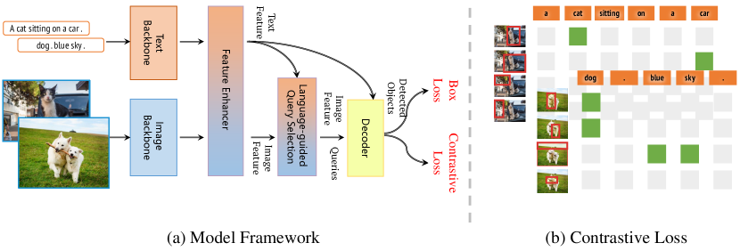

<figcaption>図1: Grounding DINO 1.5 シリーズの全体フレームワーク。</figcaption>
</figure>

#### 2.1.1 Grounding DINO 1.5 Pro

**Grounding DINO 1.5 Pro** は、Grounding DINO のコアアーキテクチャを保持しながら、**より大きな Vision Transformer backbone を組み込む**。我々は **事前学習された ViT-L** [6] **モデルを主要な vision backbone として採用** する。これは下流タスクでの優れた性能と、その純粋な Transformer 設計のためであり、訓練と推論プロセスを最適化するための堅固な基盤を築く。

Grounding DINO [18] と GLIP [16] の方法論に従って、Grounding DINO 1.5 Pro は **特徴抽出中に deep early fusion 戦略を採用** する。これは **デコーディングフェーズの前に言語と画像特徴の間に cross-attention 機構を含む** ことを伴い、より統合された情報融合を促進する。

我々はまた **early fusion と late fusion** の戦略を比較した。**early fusion アーキテクチャ設計で訓練されたモデルは、より高い検出再現率とより良いバウンディングボックス精度** を生み出す傾向があることを観察した。しかし、**このアプローチは入力画像に存在しない物体を予測するなど、モデルの hallucination の増加** にもつながる可能性がある。

対照的に、**late fusion 設計を持つモデル** は、損失計算フェーズでのみ言語と画像モダリティを統合し、**一般に hallucination に対する頑健性を示す** が、検出再現率が低くなる可能性がある。これは主に、**late fusion が損失フェーズまで異なるモダリティの特徴を別々に保つため、vision と language のアラインメントの難しさが増す** ことによる。

したがって、**モデルの予測能力と推論時の頑健性を同時に強化** するため、我々は **early fusion 設計を保持しながら、訓練中の負例サンプルの割合を増やすより包括的な訓練サンプリング戦略を導入** した。このような改善は、**early fusion アーキテクチャの利点と欠点の間でバランスを取る** ことを促進する。

#### 2.1.2 Grounding DINO 1.5 Edge

エッジデバイスでの Grounding DINO のデプロイメントは、**自律走行、医療画像処理、計算写真** などの多くのアプリケーションで強く望まれる。しかし、**open-set 検出モデルが必要とする計算コストと、エッジデバイスで利用可能な限られたリソースの間に大きなギャップが存在する**。Grounding DINO は **マルチスケール画像特徴と重い計算 feature enhancer** をより速い訓練とより良い性能のために使用するが、実世界応用におけるリアルタイムシナリオでは **非実用的** である。

この障害を克服するため、我々は **新しい効率的な feature enhancer** を提案する（図 2）。**低レベル画像特徴は意味情報に欠け、過度な計算コストを導入する** ことを **Lite-DETR** [15] で実証されたように認識し、我々は **cross-modality 融合を高レベル画像特徴（P5 レベル）のみに制限** する。このアプローチは **処理すべき token 数を大幅に削減し、feature enhancer の計算需要を著しく削減** する。

エッジ側 GPU でのより容易なデプロイメントを促進するため、**deformable self-attention を vanilla self-attention で置き換え**、**cross-scale 特徴融合モジュール** [37] **を導入して低レベル画像特徴（P3 と P4 レベル）を統合** する。このような設計は、**特徴強化と計算効率を効果的にバランス** させる。

我々のエッジ最適化モデルである **Grounding DINO 1.5 Edge** では、**元の feature enhancer を新しく提案した効率的なもので置き換え**、**EfficientViT-L1** [1] **を画像 backbone として採用** して高速マルチスケール特徴抽出を行う。我々は **NVIDIA Orin NX プラットフォーム** にモデルをデプロイし、**入力サイズ 640×640 で 10 FPS 超の推論速度** を達成する。NVIDIA Orin NX 上のモデル予測の可視化は図 16 に示されている。これは実世界エッジコンピューティング環境における我々の変更の有効性を実証する。

<figure>

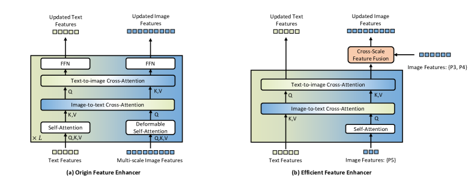

<figcaption>図2: 元の Feature Enhancer と新しい Efficient Feature Enhancer の比較。</figcaption>
</figure>

### 2.2 Training Dataset（訓練データセット）

**頑健な open-set 検出器を訓練するためには、カテゴリが十分に豊富で幅広い検出シナリオを包含する高品質の grounding データセットを構築することが極めて重要** である。

**Grounding DINO 1.5 は公開可能なソースから収集された 2000 万超の grounding 画像（Grounding-20M と命名）で事前学習** される。我々は **grounding 注釈の高品質を保証する一連の注釈パイプラインと後処理ルール** を慎重に開発した。

## 3 Model Evaluation（モデル評価）

我々は Grounding DINO 1.5 を **ゼロショットと fine-tuning 設定の両方** で他の関連研究と比較する。最良と次良の結果はそれぞれ **太字** と **下線** で示される。

### 3.1 Zero-Shot Transfer of Grounding DINO 1.5 Pro（Grounding DINO 1.5 Pro のゼロショット転送）

Grounding DINO [18] の実装に従って、我々はモデルのゼロショット転送性能を **COCO** [17] **データセット**（80 一般的カテゴリ）と、**LVIS** [7] **データセット**（1203 より多様で長尾なカテゴリ）で評価する。LVIS-val と LVIS-minival 分割の両方で **fixed AP** [4] の性能を報告する。

表 1 に示されるように、**我々のモデルは先行 Grounding DINO モデルと比較して大きな性能改善** を示す。例えば:
- **COCO ゼロショット転送ベンチマーク** で、Grounding DINO 1.5 Pro は **54.3 AP** を達成、Grounding DINO Swin-L から **+1.8 AP** 改善
- **LVIS-minival と LVIS-val ゼロショット転送ベンチマーク** で、Grounding DINO 1.5 Pro はそれぞれ **55.7 AP** と **47.6 AP** を達成、先行最良モデル **DetCLIPv3 をそれぞれ +6.9 AP と +6.2 AP 上回る**
- Grounding DINO Swin-T モデルと比較すると、我々のモデルは LVIS-minival ゼロショット転送ベンチマークで **+28.3 AP の顕著な改善**（55.7 AP vs 27.4 AP）を実証

**表1: Grounding DINO 1.5 Pro の COCO, LVIS, ODinW35, ODinW13 ベンチマークでの先行手法との比較。** 灰色の数値は訓練データセットが COCO または LVIS データセットからの画像や注釈を含むことを示す。

| Method | Backbone | Pre-training data | COCO AP | LVIS_minival AP_all | AP_r | AP_c | AP_f | LVIS_val AP_all | AP_r | AP_c | AP_f | ODinW35 | ODinW13 |
|---|---|---|---|---|---|---|---|---|---|---|---|---|---|
| **Supervised Models** ||||||||||||||
| GLIPv2 | Swin-H | FourODs,COCO,GoldG,CC15M,SBU | 60.6 | 50.1 | - | - | - | - | - | - | - | - | 55.5 |
| Grounding DINO | Swin-L | O365,OID,GoldG,Cap4M,COCO,RefC | 60.7 | 33.9 | 22.2 | 30.7 | 38.8 | - | - | - | - | - | - |
| APE (B) | ViT-L | COCO,LVIS,O365,OID,VG | 57.7 | 62.5 | - | - | - | 57.0 | - | - | - | 29.4 | 59.8 |
| APE (D) | ViT-L | COCO,LVIS,O365,OID,VG,RefC,SA-1B,GoldG,PhraseCut | 58.3 | 64.7 | - | - | - | 59.6 | - | - | - | 28.8 | 57.9 |
| GLEE-Pro | ViT-L | GLEE-merged-10M | 62.0 | - | - | - | - | 55.7 | 49.2 | - | - | - | 53.4 |
| **Zero-shot Transfer Models** ||||||||||||||
| OWL-ViT | ViT-L | O365,OID,VG,LiT | 42.2 | - | - | - | - | 34.6 | 31.2 | - | - | - | - |
| MDETR | ResNet101 | COCO,GoldG | - | 22.5 | 7.4 | 22.7 | 25.0 | - | - | - | - | - | - |
| GLIP | Swin-L | FourODs,GoldG,Cap24M | 49.8 | 37.3 | 28.2 | 34.3 | 41.5 | 26.9 | 17.1 | 23.3 | 35.4 | - | 52.1 |
| Grounding DINO | Swin-T | O365,GoldG,Cap4M | 48.4 | 27.4 | 18.1 | 23.3 | 32.7 | - | - | - | - | 22.3 | 49.8 |
| Grounding DINO | Swin-L | O365,OID,GoldG | 52.5 | - | - | - | - | - | - | - | - | 26.1 | 56.9 |
| OmDet-Turbo-B | ConvNeXt-B | O365,GoldG,PhraseCut,Hake,HOI-A | 53.4 | 34.7 | - | - | - | - | - | - | - | 30.1 | 54.7 |
| OWL-ST | CLIP L/14 | WebLI2B | - | 40.9 | 41.5 | - | - | 35.2 | 36.2 | - | - | 24.4 | 53.0 |
| MQ-GLIP | Swin-L | O365 | - | 43.4 | 34.5 | 41.2 | 46.9 | 34.7 | 26.9 | 32.0 | 41.3 | 23.9 | 54.1 |
| DetCLIP | Swin-L | O365,GoldG,YFCC1M | - | 38.6 | 36.0 | 38.3 | 39.3 | 28.4 | 25.0 | 27.0 | 31.6 | - | - |
| DetCLIPv2 | Swin-L | O365,GoldG,CC15M | - | 44.7 | 43.1 | 46.3 | 43.7 | 36.6 | 33.3 | 36.2 | 38.5 | - | - |
| DetCLIPv3 | Swin-L | O365,V3Det,GoldG,GranuCap50M | - | 48.8 | 49.9 | 49.7 | 47.8 | 41.4 | 41.4 | 40.5 | 42.3 | - | - |
| YOLO-World | YOLOv8-L | O365,GoldG,CC3M | 45.1 | 35.4 | 27.6 | 34.1 | 38.0 | - | - | - | - | - | - |
| DINOv | Swin-L | COCO,SA-1B | - | - | - | - | - | - | - | - | - | 15.7 | - |
| T-Rex2 (visual) | Swin-L | O365,OID,HierText,CrowdHuman,SA-1B | 46.5 | 47.6 | 45.4 | 46.0 | 49.5 | 45.3 | 43.8 | 42.0 | 49.5 | 27.8 | - |
| T-Rex2 (text) | Swin-L | O365,OID,GoldG,CC3M,SBU,LAION | 52.2 | 54.9 | 49.2 | 54.8 | 56.1 | 45.8 | 42.7 | 43.2 | 50.2 | 22.0 | - |
| **Grounding DINO 1.5 Pro (zero-shot)** | **ViT-L** | **Grounding-20M** | **54.3** | **55.7** | **56.1** | **57.5** | **54.1** | **47.6** | **44.6** | **47.9** | **48.7** | **30.2** | **58.7** |

我々はさらに **ODinW (Object Detection in the Wild)** [16] ベンチマーク（**35 データセット** を含み幅広い応用領域をカバー）を使って複数の実世界シナリオでモデルの汎化能力を評価する。

ODinW ベンチマーク内では、いくつかのデータセットが **注釈されたカテゴリ名の品質問題** を示すことを観察した。そのような問題を緩和するため、テスト中に **性能が特に貧弱だったデータセットでカテゴリ名を実際のテストシナリオに合うよう精錬する prompt engineering** を実施した。

- **Grounding DINO 1.5 Pro は ODinW13 ベンチマークで 13 データセット平均 58.7 AP を達成**
- **ODinW35 ベンチマークで 35 データセット平均 30.2 AP の新記録を樹立**、Grounding DINO から **+4.2 AP** 改善

ODinW13 上の Grounding DINO 1.5 Pro の包括的なデータセット別性能は表 2 に提示される。ODinW35 上の詳細なデータセット別性能は付録 §7.1 で利用可能。

**表2: Grounding DINO 1.5 Pro と関連研究の ODinW13 ベンチマークでの詳細なゼロショット性能比較。**

| Method | Backbone | PascalVOC | AerialDrone | Aquarium | Rabbits | EgoHands | Mushrooms | Packages | Raccoon | Shellfish | Vehicles | Pistols | Pothole | Thermal | AP_avg |
|---|---|---|---|---|---|---|---|---|---|---|---|---|---|---|---|
| GLIP | Swin-L | 61.7 | 7.1 | 26.9 | 75.0 | 45.5 | 49.0 | 62.8 | 63.3 | 68.9 | 57.3 | 68.6 | 25.7 | 66.0 | 52.1 |
| GLIPv2 | Swin-H | 66.3 | 10.9 | 30.4 | 74.6 | 55.1 | 52.1 | 71.3 | 63.8 | 66.2 | 57.2 | 66.4 | 33.8 | 73.3 | 55.5 |
| Grounding DINO | Swin-L | 66.0 | 12.6 | 28.1 | 72.8 | 52.1 | 73.0 | 63.9 | 67.9 | 64.8 | 62.7 | 71.7 | 31.4 | 78.4 | 56.9 |
| OmDet-Turbo-B | ConvNeXt-B | 63.7 | 16.2 | 28.5 | 70.6 | 55.7 | 71.5 | 65.6 | 63.6 | 39.7 | 61.9 | 65.5 | 30.2 | 78.4 | 54.7 |
| OWL-ST | CLIP L/14 | 53.9 | 19.9 | 32.3 | 84.9 | 47.1 | 76.6 | 70.9 | 63.8 | 35.0 | 58.5 | 62.6 | 27.5 | 55.6 | 53.0 |
| MQ-GLIP-L | Swin-L | 64.7 | 17.4 | 30.3 | 71.8 | 57.2 | 63.9 | 53.0 | 58.1 | 63.0 | 63.2 | 74.4 | 27.0 | 58.7 | 54.1 |
| APE (B) | ViT-L | - | - | - | - | - | - | - | - | - | - | - | - | - | 59.8 |
| APE (D) | ViT-L | - | - | - | - | - | - | - | - | - | - | - | - | - | 57.9 |
| GLEE-Pro-Scale | ViT-L | 69.1 | 13.7 | 34.7 | 75.6 | 38.9 | 57.8 | 50.6 | 65.6 | 62.7 | 67.3 | 69.0 | 30.7 | 59.1 | 53.4 |
| T-Rex2 (visual prompt) | Swin-L | 65.8 | 16.0 | 27.0 | 70.0 | 61.9 | 83.7 | 58.9 | 67.1 | 53.0 | 66.4 | 69.0 | 24.1 | 61.4 | 55.7 |
| **Grounding DINO 1.5 Pro** | **ViT-L** | **67.1** | **19.0** | **38.5** | 65.7 | **61.8** | 82.1 | 58.1 | **72.5** | 62.0 | 64.3 | **71.9** | 29.0 | 71.4 | **58.7** |

### 3.2 Fine-tuning Results on Downstream Datasets（下流データセットでの Fine-tuning 結果）

我々はさらに **Grounding DINO 1.5 Pro の様々な下流データセットでの fine-tuning による転送可能性** を調査する。

表 3 に示されるように、**LVIS データセット上で fine-tune された Grounding DINO 1.5 Pro モデルは LVIS-minival と LVIS-val 分割でそれぞれ 68.1 AP と 63.5 AP を達成**。これは Grounding DINO 1.5 Pro ゼロショット設定から **+12.4 AP と +15.9 AP の強化** を表す。

**表3: Grounding DINO 1.5 Pro の LVIS-minival, LVIS-val, ODinW35, ODinW13 ベンチマークでの fine-tuning 性能。** LVIS-minival と val 分割では fixed AP を報告。† は LVIS base カテゴリのみで fine-tuning した結果を示す。

| Method | Backbone | LVIS_minival AP_all | AP_r | AP_c | AP_f | LVIS_val AP_all | AP_r | AP_c | AP_f | ODinW35 | ODinW13 |
|---|---|---|---|---|---|---|---|---|---|---|---|
| GLIP | Swin-L | - | - | - | - | - | - | - | - | - | 68.9 |
| GLEE-Pro | ViT-L | - | - | - | - | - | - | - | - | - | 69.0 |
| GLIPv2 | Swin-H | 59.8 | - | - | - | - | - | - | - | - | 70.4 |
| OWL-ST+FT † | CLIP L/14 | 54.4 | 46.1 | - | - | 49.4 | 44.6 | - | - | - | - |
| DetCLIPv2 | Swin-L | 60.1 | 58.3 | 61.7 | 59.1 | 53.1 | 49.0 | 53.2 | 54.9 | - | 70.4 |
| DetCLIPv3 | Swin-L | 60.5 | 60.7 | - | - | - | - | - | - | - | 72.1 |
| DetCLIPv3 † | Swin-L | 60.8 | 56.7 | 63.2 | 59.4 | 54.1 | 45.8 | 55.4 | 56.4 | - | - |
| **Grounding DINO 1.5 Pro (zero-shot)** | ViT-L | 55.7 | 56.1 | 57.5 | 54.1 | 47.6 | 44.6 | 47.9 | 48.7 | 30.2 | 58.7 |
| **Grounding DINO 1.5 Pro** | **ViT-L** | **68.1 (+12.4)** | **68.7** | **69.5** | **66.6** | **63.5 (+15.9)** | **64.0** | **63.8** | **63.0** | **70.6 (+40.4)** | **72.4 (+13.7)** |

**ODinW35 データセットで fine-tuning した後、Grounding DINO 1.5 Pro モデルは新記録** を樹立:
- **ODinW35 ベンチマークで 35 データセット平均 70.6 AP**
- **ODinW13 ベンチマークで 13 データセット平均 72.4 AP**
- これはゼロショット設定からの顕著な改善で、それぞれ **+40.5 AP と +13.7 AP** の改善

ODinW13 ベンチマークでの Grounding DINO 1.5 Pro の詳細な fine-tuning 性能は表 4 で報告される。

**表4: Grounding DINO 1.5 Pro の ODinW13 ベンチマークでの詳細な fine-tuning 性能。**

| Method | Backbone | PascalVOC | AerialDrone | Aquarium | Rabbits | EgoHands | Mushrooms | Packages | Raccoon | Shellfish | Vehicles | Pistols | Pothole | Thermal | AP_all |
|---|---|---|---|---|---|---|---|---|---|---|---|---|---|---|---|
| GLIP | Swin-L | 69.6 | 32.6 | 56.6 | 76.4 | 79.4 | 88.1 | 67.1 | 69.4 | 65.8 | 71.6 | 75.7 | 60.3 | 83.1 | 68.9 |
| GLEE-Pro | ViT-L | 72.6 | 36.5 | 58.1 | 80.5 | 74.1 | 92.0 | 67.0 | 76.5 | 66.4 | 70.5 | 66.4 | 55.7 | 80.6 | 69.0 |
| GLIPv2 | Swin-H | 74.4 | 36.3 | 58.7 | 77.1 | 79.3 | 88.1 | 74.3 | 73.1 | 70.0 | 72.2 | 72.5 | 58.3 | 81.4 | 70.4 |
| DetCLIPv2 | Swin-L | 74.4 | 44.1 | 54.7 | 80.9 | 79.9 | 90.0 | 74.1 | 69.4 | 61.2 | 68.1 | 80.3 | 57.1 | 81.1 | 70.4 |
| Grounding DINO | Swin-T | 73.6 | 36.6 | 57.7 | 78.7 | 79.2 | 92.8 | 74.7 | 74.7 | 61.2 | 69.6 | 75.9 | 60.4 | 85.9 | 70.9 |
| MQ-GLIP-L | Swin-L | - | - | - | - | - | - | - | - | - | - | - | - | - | 71.3 |
| DetCLIPv3 | Swin-L | 76.4 | 51.2 | 57.5 | 79.9 | 80.2 | 90.4 | 75.1 | 70.9 | 63.6 | 69.8 | 82.7 | 56.2 | 83.8 | 72.1 |
| **Grounding DINO 1.5 Pro** | **ViT-L** | **77.6** | 37.0 | **60.2** | 75.1 | 78.6 | 89.2 | 72.1 | **81.8** | **70.8** | **74.6** | 77.6 | **62.3** | 84.0 | **72.4** |

### 3.3 Main Results of Grounding DINO 1.5 Edge（Grounding DINO 1.5 Edge の主結果）

**Grounding-20M で事前学習後**、我々は **COCO データセットと LVIS データセットでゼロショット方式で Grounding DINO 1.5 Edge を直接評価** する。先行研究 [18, 3, 35] に従って、LVIS-val と LVIS-minival 分割の両方で評価し、比較のため fixed AP [4] を報告する。

主結果は表 5 に示される:
- **end-to-end テスト設定** で **言語キャッシュを使わない** 現在のリアルタイム open-set 検出器と比較して、**Grounding DINO 1.5 Edge は COCO でゼロショット 45.0 AP を達成**
- LVIS-minival ゼロショット性能に関して、**Grounding DINO 1.5 Edge は AP スコア 36.2 という顕著な性能** を達成、**他のすべての state-of-the-art アルゴリズムを上回る**（OmDet-Turbo-T 30.3 AP、YOLO-Worldv2-L 32.9 AP、YOLO-Worldv2-M 30.0 AP、YOLO-Worldv2-S 22.7 AP）
- 特筆すべきは、**TensorRT で最適化された Grounding DINO 1.5 Edge モデルを NVIDIA Orin NX にデプロイすると入力サイズ 640×640 で 10 FPS 超の推論速度を達成**

**表5: Grounding DINO 1.5 Edge の COCO と LVIS でのゼロショット結果。** 速度測定は A100 GPU で実施、FPS で表現。形式は PyTorch 速度 / TensorRT FP32 速度。NVIDIA Orin NX での FPS も報告。† は YOLO-World の結果が最新の公式コードで再現されたことを示す。‡ は言語キャッシュを使用することを示す（text encoder のレイテンシを計算しない）。

| Method | Backbone | Pre-training data | test size | COCO | LVIS_minival AP_all | AP_r | AP_c | AP_f | LVIS_val AP_all | AP_r | AP_c | AP_f | FPS(A100/TRT) | FPS(Orin NX) |
|---|---|---|---|---|---|---|---|---|---|---|---|---|---|---|
| **End-to-End Open-Set Object Detection** ||||||||||||||
| GLIP-T | Swin-T | O365,GoldG,Cap4M | 800×1333 | 46.3 | 26.0 | 20.8 | 21.4 | 31.0 | - | - | - | - | - | - |
| Grounding DINO-T | Swin-T | O365,GoldG,Cap4M | 800×1333 | 48.4 | 27.4 | 18.1 | 23.3 | 32.7 | - | - | - | - | 9.4 / 42.6 | 1.1 |
| **Real-time End-to-End Open-Set Object Detection** ||||||||||||||
| YOLO-Worldv2-S† | YOLOv8-S | O365,GoldG | 640×640 | - | 22.7 | 16.3 | 20.8 | 25.5 | 17.3 | 11.3 | 14.9 | 22.7 | 47.4 / - | - |
| YOLO-Worldv2-M† | YOLOv8-M | O365,GoldG | 640×640 | - | 30.0 | 25.0 | 27.2 | 33.4 | 23.5 | 17.1 | 20.0 | 30.1 | 42.7 / - | - |
| YOLO-Worldv2-L† | YOLOv8-L | O365,GoldG | 640×640 | - | 33.0 | 22.6 | 32.0 | 35.8 | 26.0 | 18.6 | 23.0 | 32.6 | 37.4 / - | - |
| YOLO-Worldv2-L† | YOLOv8-L | O365,GoldG,CC3M-Lite | 640×640 | - | 32.9 | 25.3 | 31.1 | 35.8 | 26.1 | 20.6 | 22.6 | 32.3 | 37.4 / - | - |
| OmDet-Turbo-T‡ | Swin-T | O365,GoldG | 640×640 | 42.5 | 30.3 | - | - | - | - | - | - | - | 21.5 / 140.0 | - |
| **Grounding DINO 1.5 Edge** | **EfficientViT-L1** | **Grounding-20M** | **640×640** | **42.9** | **33.5** | **28.0** | **34.3** | **33.9** | **27.3** | **26.3** | **25.7** | **29.6** | **21.7 / 111.6** | **10.7** |
| **Grounding DINO 1.5 Edge** | **EfficientViT-L1** | **Grounding-20M** | **800×1333** | **45.0** | **36.2** | **33.2** | **36.6** | **36.3** | **29.3** | **28.1** | **27.6** | **31.6** | **18.5 / 75.2** | **5.5** |

## 4 Case Analysis and Qualitative Visualization（ケース分析と定性的可視化）

本節では、**実世界シナリオにおける Grounding DINO 1.5 モデルの検出結果を可視化** する。画像とテキストプロンプトは主に **COCO** [17], **LVIS** [7], **V3Det** [25], **OpenImages** [13], **CC3M** [2], **SA-1B** [12] から取得した。

### 4.1 Common Object Detection（一般物体検出）

図 3 と図 4 で提示される可視化は、**一般物体検出シナリオでの Grounding DINO 1.5 Pro の頑健な性能** を実証する。

- モデルは **モノクロ画像で物体を識別** する（色のキューが最小、図 3 の最初の例）。これは **モデルが形状とテクスチャに依存して物体を区別する** ことを示す
- **ぼやけた物体の検出**（図 3 の 2 番目の例）は、**一般的な画像劣化に対するモデルの頑健性** の証である
- **小さく部分的に遮蔽された物体の検出能力**（図 3 の最後の画像）は、**細粒度の理解と自律走行シーンでのマルチモーダル情報の繊細な統合** を示す

<figure>

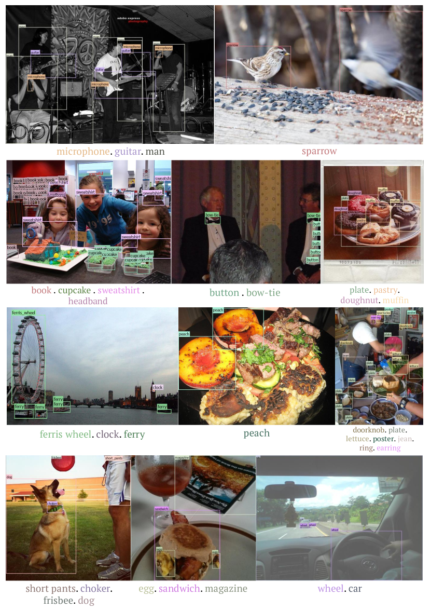

<figcaption>図3: Grounding DINO 1.5 Pro による一般物体予測（パート 1）。</figcaption>
</figure>

<figure>

<figcaption>図4: Grounding DINO 1.5 Pro による一般物体予測（パート 2）。</figcaption>
</figure>

### 4.2 Long-tailed Object Detection（長尾物体検出）

本節では、**Grounding DINO 1.5 Pro の長尾物体検出能力** を探求する。これは物体検出モデルにとってユニークな課題を提起する、より稀に遭遇するカテゴリである。

図 5 の例は、**そのような珍しい物体を理解・検出するモデルの繊細な能力** を強調する。例えば、図の 2 番目の画像は **fungus（菌類）を識別するモデルの能力** を示す。3 番目の画像は **popsicle（アイスキャンディー）を様々な気を散らすものの中で正確に特定する細粒度検出能力** を示す。

<figure>

<figcaption>図5: Grounding DINO 1.5 Pro による長尾カテゴリでの予測。</figcaption>
</figure>

### 4.3 Short Caption Grounding（短いキャプション grounding）

**Grounding モデルは画像内の物体を付随するキャプション内の対応する言及と相関付ける** ことができる。

図 6 で、我々は **短いキャプション grounding における Grounding DINO 1.5 Pro の習熟度** を示す。モデルは異なる視覚領域にわたって物体を grounding する **頑健な性能** を示し、**実世界画像** を巧みに扱う一方、**漫画、スケッチ、アニメーション内の物体を解釈する鋭い能力** も実証する。

<figure>

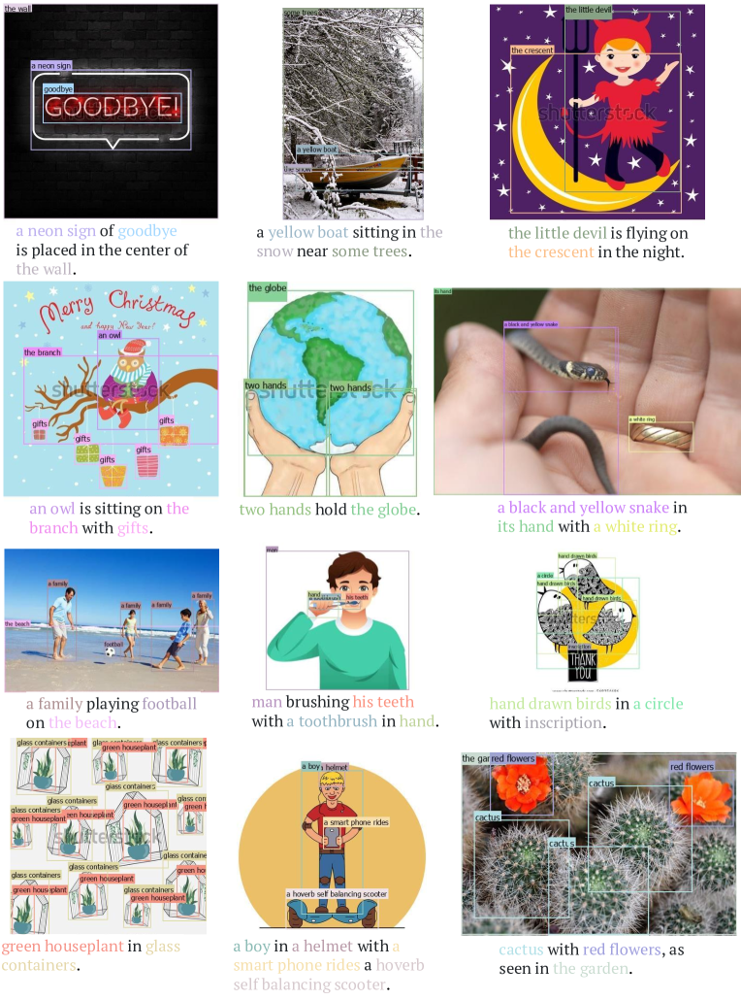

<figcaption>図6: Grounding DINO 1.5 Pro による短いキャプションでの phrase grounding。</figcaption>
</figure>

### 4.4 Long Caption Grounding（長いキャプション grounding）

**Grounding DINO 1.5 Pro** は、図 7、図 8、図 9 に示されるように、**標準の画像-キャプションペアの領域を超えて長いキャプションを巧みに扱う能力** を拡張する。**長いキャプションは画像の視覚的内容をより包括的に記述できる、より豊かな詳細の織物** を提供する。**長いキャプション内の各名詞句を画像内の対応する物体にマッピングする能力** は、より深い画像理解への重要な一歩である。

興味深い観察は、**より短いコンテキストウィンドウのキャプションでの事前学習から、より長いコンテキストを効果的に処理することへ汎化する能力** である。この適応性は、**より大きなモデルが本質的に様々な長さのテキスト入力に対する柔軟性を持つ可能性** があることを示唆する。

さらに、**訓練データに現れなかった用語（3 番目の画像の fiat ロゴなど）を検出できる** ことに注目する。これは **モデルの強い汎化能力** を示す。

<figure>

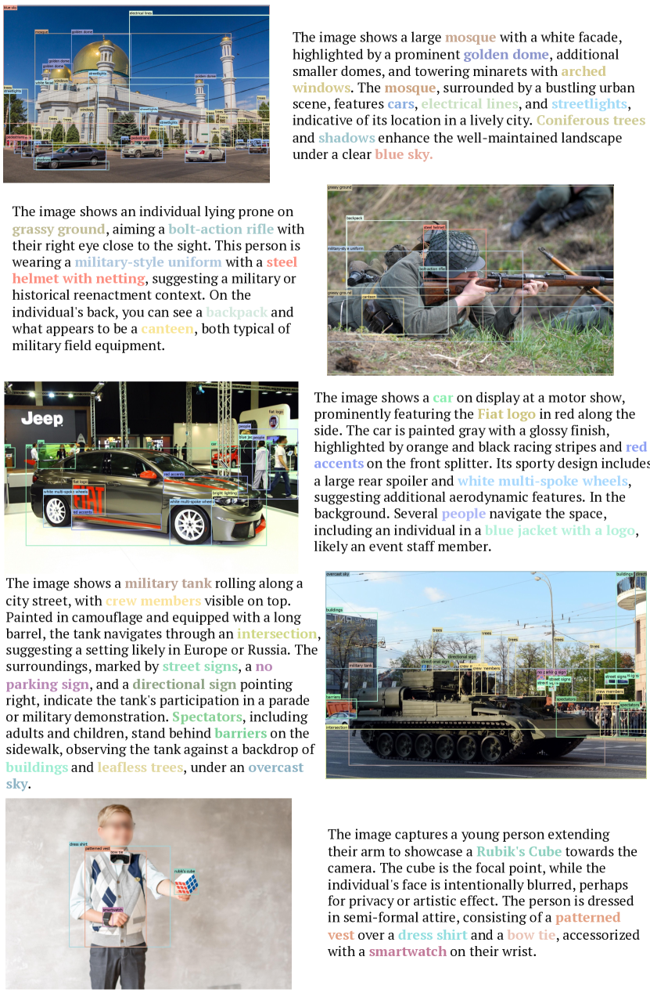

<figcaption>図7: Grounding DINO 1.5 Pro による長いキャプションでの phrase grounding（パート 1）。</figcaption>
</figure>

<figure>

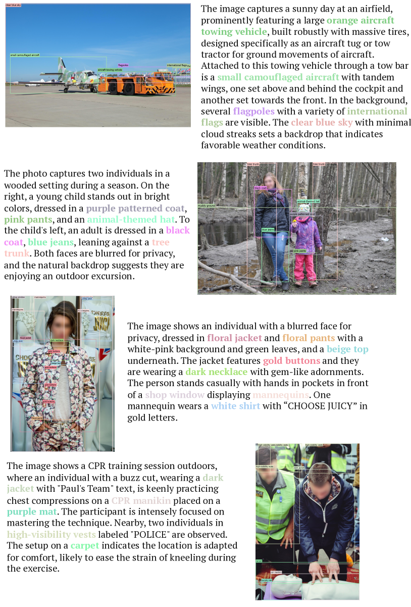

<figcaption>図8: Grounding DINO 1.5 Pro による長いキャプションでの phrase grounding（パート 2）。</figcaption>
</figure>

<figure>

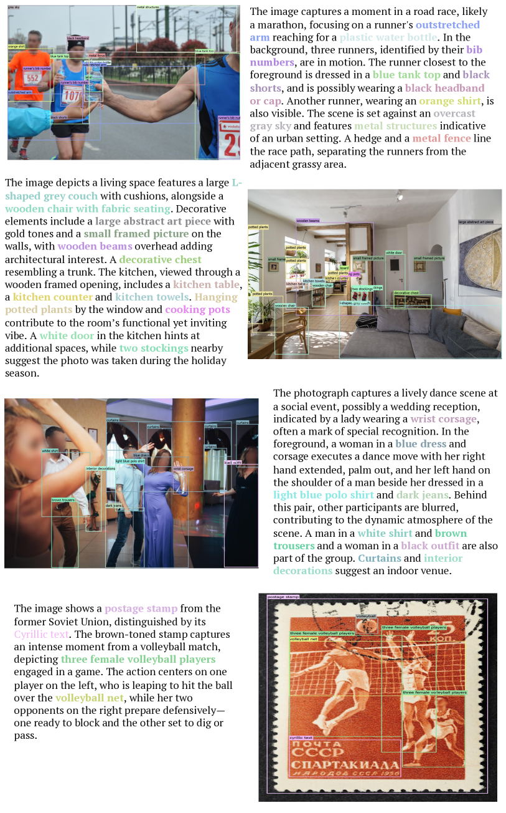

<figcaption>図9: Grounding DINO 1.5 Pro による長いキャプションでの phrase grounding（パート 3）。</figcaption>
</figure>

### 4.5 Dense Object Detection（密な物体検出）

**Grounding DINO 1.5 Pro は密なシナリオで物体を区別する例外的な能力** を示す。**複数の物体が密接に位置しているか重なっており**、検出が挑戦的なタスクとなる。

モデルの性能は **幅広い物体命名法** にわたって注目に値する。**coin, tree, flower, land** のような一般的な名前を持つ物体を巧みに識別し、さらに **kohlrabi（コールラビ、植物の一種）、atlantic puffin（タテゴトザメ）、oxalis purpurea（紫カタバミ）** などの **専門用語で示される物体** の認識にも優れる。

<figure>

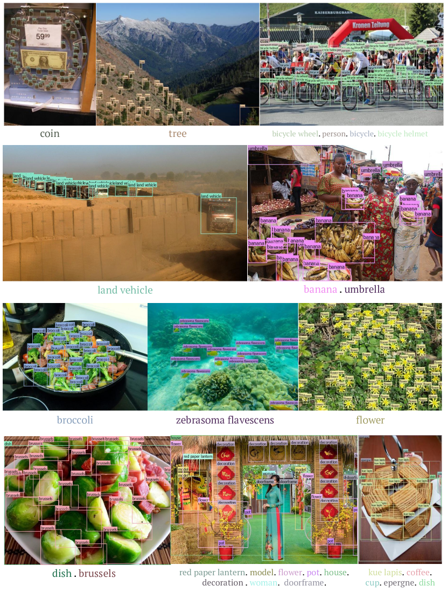

<figcaption>図10: Grounding DINO 1.5 Pro による密な物体シナリオでの予測（パート 1）。</figcaption>
</figure>

<figure>

<figcaption>図11: Grounding DINO 1.5 Pro による密な物体シナリオでの予測（パート 2）。</figcaption>
</figure>

### 4.6 Video Object Detection（動画物体検出）

図 12 で **Grounding DINO 1.5 Pro の動画検出結果** を提示する。**モデルはほとんどの場合一貫した物体バウンディングボックスを生成できる** ことに注目する。動画はオフラインで処理される。

<figure>

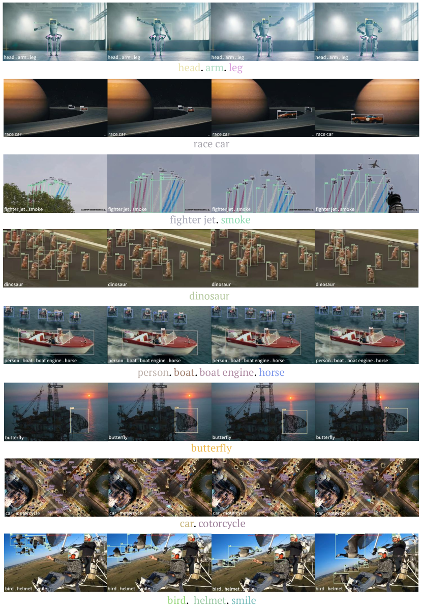

<figcaption>図12: Grounding DINO 1.5 Pro による動画物体検出での予測。</figcaption>
</figure>

### 4.7 Side-by-side Comparison（並列比較）

図 13 と図 14 で **Grounding DINO 1.5 Pro と Grounding DINO の結果の並列比較** を提示する。**Grounding DINO 1.5 Pro モデルは密なシーン検出、長尾物体検出、意味理解の精度の点で Grounding DINO モデルを上回る** 性能を実証する。

さらに、**Grounding DINO 1.5 Pro と Grounding DINO の物体 hallucination を比較**（図 15）。結果は **Grounding DINO 1.5 Pro がより良い精度とより少ない物体 hallucination** を持つことを示す。図 15 の最終行はモデルの **より良い文脈理解能力** を実証する。

<figure>

<figcaption>図13: Grounding DINO 1.5 Pro と Grounding DINO の並列比較（パート 1）。</figcaption>
</figure>

<figure>

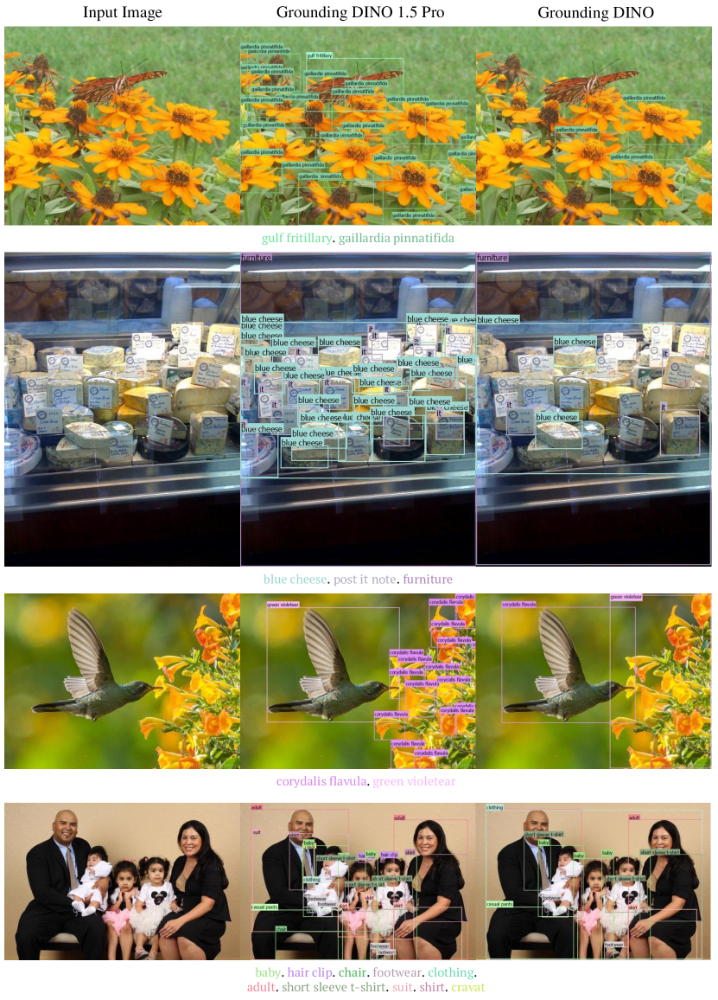

<figcaption>図14: Grounding DINO 1.5 Pro と Grounding DINO の並列比較（パート 2）。</figcaption>
</figure>

<figure>

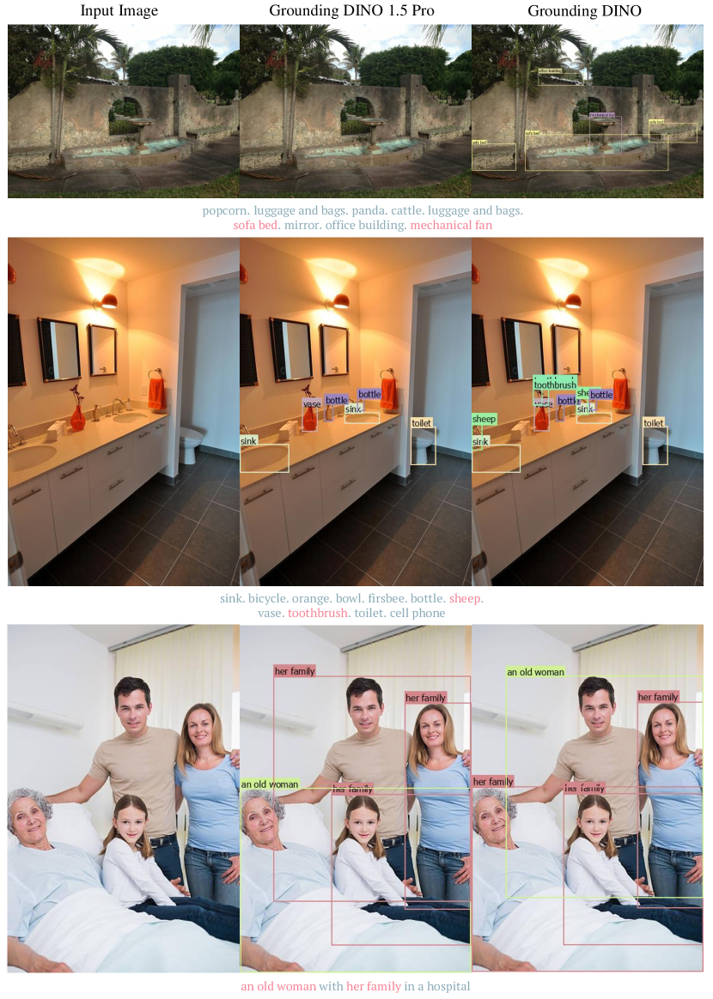

<figcaption>図15: Grounding DINO 1.5 Pro と Grounding DINO の物体 hallucination に関する並列比較。</figcaption>
</figure>

### 4.8 Advanced Object Detection on Edge Devices（エッジデバイス上の高度な物体検出）

図 16 の一連のデモンストレーションを通じて、**Grounding DINO 1.5 Edge の実用的でリアルタイムなアプリケーションの潜在能力** を提示する。**オフィス環境でのモデルの巧みな性能が特に強調** され、ロボティクス研究の分野で大きな有用性を提供する。

<figure>

<figcaption>図16: NVIDIA Orin NX 上の Grounding DINO 1.5 Edge の可視化。画面の左上は FPS とプロンプトを表示し、右上は記録されたシーンのカメラビューを示す。</figcaption>
</figure>

## 5 Conclusion（結論）

本論文は **Grounding DINO 1.5** を提示した。これは **open-set 物体検出の分野を進化させるモデルシリーズ** である。**フラッグシップモデルである Grounding DINO 1.5 Pro は、COCO と LVIS ゼロショットベンチマークで新記録を樹立** し、検出精度と信頼性における大きな前進を示している。さらに、**Grounding DINO 1.5 Edge モデルは様々なアプリケーションにわたるリアルタイム物体検出を可能にし、Grounding DINO 1.5 シリーズの実用的有用性をさらに拡大** する。

## 6 Contributions and Acknowledgments（貢献と謝辞）

Grounding DINO 1.5 プロジェクトに関わったすべての方に感謝の意を表したい。貢献は以下の通り（順不同）:

- **Grounding DINO 1.5 Pro モデル設計、訓練インフラ開発、データ収集、モデル訓練、モデル評価**: Tianhe Ren, Qing Jiang, Shilong Liu, Zhaoyang Zeng
- **Grounding DINO 1.5 Edge モデル設計、訓練、評価、ランタイム最適化**: Wenlong Liu, Han Gao, Qing Jiang, Hongjie Huang, Zhengyu Ma, Xiaoke Jiang, Yihao Chen
- **Grounding-20M データ収集と注釈パイプライン構築**: Yihao Chen, Hao Zhang, Yuda Xiong, Tianhe Ren, Zhaoyang Zeng, Qing Jiang, Shilong Liu, Peijun Tang
- **優れた洞察と技術的サポートの提供**: Hao Zhang, Feng Li
- **Grounding DINO 1.5 Edge モデルリード**: Kent Yu
- **Grounding DINO 1.5 全体プロジェクトリード**: Lei Zhang

Grounding DINO 1.5 デモサポートに関わったすべての方にも感謝する: アプリケーションリード Wei Liu、プロダクトマネージャー Qin Liu と Xiaohui Wang、フロントエンド開発者 Yuanhao Zhu, Ce Feng, Jiongrong Fan、バックエンド開発者 Weiqiang Hu と Zhiqiang Li、UX デザイナー Xinyi Ruan、テスター Yinuo Chen、デモビデオで助けてくれた Zijun Deng。
