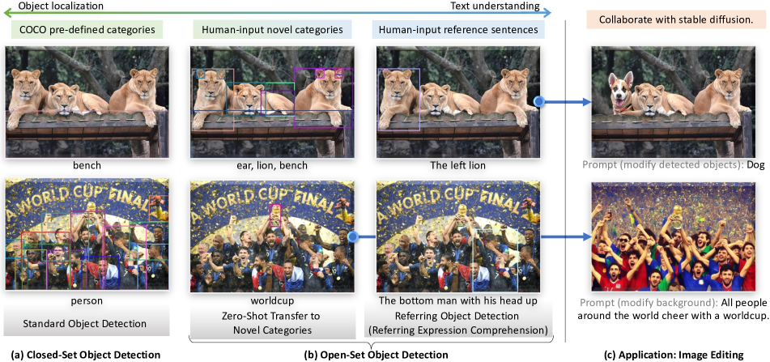
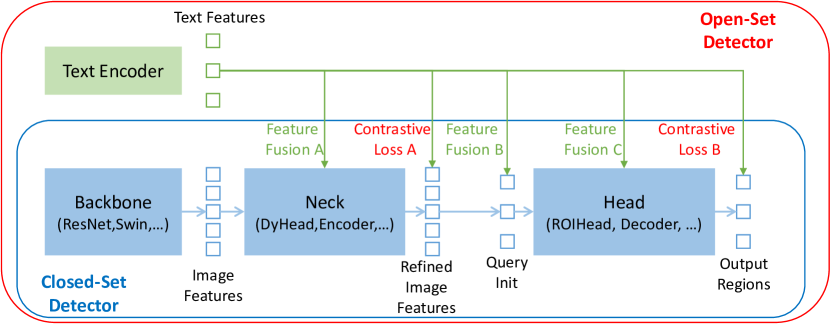
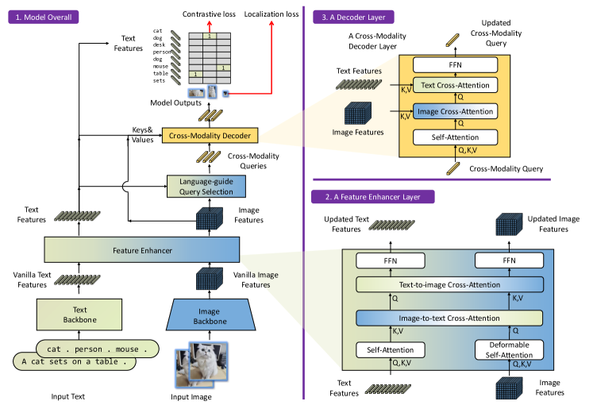
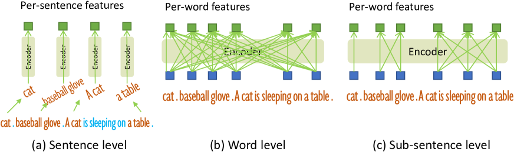
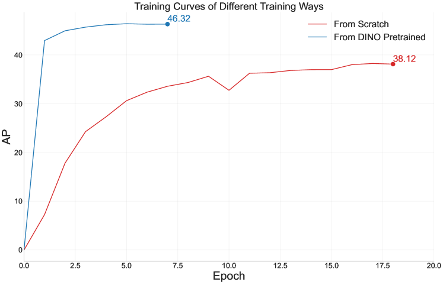

# Grounding DINO: DINO と Grounded Pre-Training を結婚させて Open-Set 物体検出を実現する

> 原題: Grounding DINO: Marrying DINO with Grounded Pre-Training for Open-Set Object Detection
> arXiv: 2303.05499
> 著者: Shilong Liu, Zhaoyang Zeng, Tianhe Ren, Feng Li, Hao Zhang, Jie Yang, Chunyuan Li, Jianwei Yang, Hang Su, Jun Zhu, Lei Zhang（清華大学 / IDEA / HKUST / 香港中文大学（深圳）/ Microsoft Research）
> 出典: ECCV 2024
> コード: <https://github.com/IDEA-Research/GroundingDINO>

## Abstract（要旨）

本論文で我々は **Grounding DINO** と呼ばれる **open-set 物体検出器** を提示する。これは **Transformer ベースの検出器 DINO と grounded pre-training を結婚** させたもので、カテゴリ名や指示表現のような人間入力で任意の物体を検出できる。

open-set 物体検出の鍵は、**closed-set 検出器に言語を導入して open-set 概念汎化を実現する** ことである。言語と視覚モダリティを効果的に融合するため、我々は **closed-set 検出器を 3 つのフェーズに概念的に分割** し、tight fusion ソリューションを提案する。これには **feature enhancer**、**language-guided query selection**、cross-modality 融合のための **cross-modality decoder** が含まれる。

先行研究は主に novel カテゴリで open-set 物体検出を評価していたが、我々は **属性で指定された物体に対する指示表現理解** での評価も行うことを提案する。

Grounding DINO は 3 つのすべての設定で著しい性能を示す。COCO, LVIS, ODinW, RefCOCO/+/g のベンチマークを含む。Grounding DINO は **COCO 検出ゼロショット転送ベンチマークで 52.5 AP** を達成する（つまり、COCO の訓練データを一切使わずに）。COCO データで fine-tune した後、**Grounding DINO は 63.0 AP** に達する。**ODinW ゼロショットベンチマークで平均 26.1 AP** という新記録を樹立する。

コードは <https://github.com/IDEA-Research/GroundingDINO> で公開される予定である。

<figure>



<figcaption>図1: (a) Closed-set 物体検出は事前定義されたカテゴリの物体を検出することをモデルに要求する。(b) 先行研究はモデルを novel カテゴリにゼロショット転送する。我々は **指示表現理解（REC）** をモデル一般化のもう 1 つの評価として追加することを提案する（属性付き novel 物体）。(c) Grounding DINO と Stable Diffusion を組み合わせた画像編集アプリケーションを提示する。</figcaption>
</figure>

## 1 Introduction（はじめに）

novel な概念を理解することは視覚知能の基本的能力である。本研究で我々は、**人間の言語入力で指定された任意の物体を検出する強力なシステム** の開発を目指す。これを **open-set 物体検出** と名付ける。このタスクは、汎用物体検出器としての大きな潜在力を持ち、幅広い応用がある。例えば、生成モデルと協調させて画像編集を行える（図 1(b) 参照）。

open-set 検出の鍵は、**unseen 物体への汎化のために言語を導入** することである [26, 1, 7]。例えば、**GLIP** [26] は物体検出を **phrase grounding タスク** として再定式化し、物体領域と言語句の間で対比訓練を導入する。これは異種データセットに対する大きな柔軟性と、closed-set および open-set 両方の検出での顕著な性能を示す。

その印象的な結果にもかかわらず、**GLIP の性能は、伝統的な one-stage 検出器 Dynamic Head [5] に基づいて設計されているために制約される可能性がある**。open-set と closed-set 検出は密接に関連しているため、**より強力な closed-set 物体検出器がさらに優れた open-set 検出器をもたらすと信じる**。

Transformer ベース検出器 [58, 31, 24, 25] の進歩に動機づけられ、本研究で我々は **DINO** [58] に基づく強力な open-set 検出器を構築することを提案する。これは state-of-the-art の物体検出性能を提供するだけでなく、**grounded pre-training によってマルチレベルテキスト情報をアルゴリズムに統合** することも可能にする。我々はこのモデルを **Grounding DINO** と名付ける。

Grounding DINO は GLIP に対していくつかの利点を持つ:

1. **Transformer ベースアーキテクチャは言語モデルに類似** しており、画像と言語データの両方を処理しやすい。例えば、すべての画像と言語のブランチが Transformer で構築されているため、パイプライン全体で cross-modality 特徴を容易に融合できる
2. Transformer ベース検出器は **大規模データセットを活用する優れた能力** を実証している
3. DETR ライクなモデルとして、DINO は **NMS（非最大抑制）のような hand-crafted モジュールを使わずに end-to-end で最適化** でき、全体的な grounding モデル設計を大幅に簡素化する

<figure>



<figcaption>図2: closed-set 検出器を open-set シナリオに拡張する既存アプローチ。一部の closed-set 検出器は図中の部分的なフェーズしか持たないことに注意。</figcaption>
</figure>

ほとんどの既存の open-set 検出器は、closed-set 検出器を言語情報で open-set シナリオに拡張することによって開発される。図 2 に示されるように、closed-set 検出器は典型的に 3 つの重要なモジュールを持つ:

1. 特徴抽出のための **backbone**
2. 特徴強化のための **neck**
3. 領域精錬（または box 予測）のための **head**

closed-set 検出器は、各領域が言語認識の意味的空間内で novel カテゴリに分類できるように **言語認識の領域埋め込みを学習** することで、novel 物体を検出するように一般化できる。この目標を達成する鍵は、**neck および/または head 出力での領域出力と言語特徴の間に対比損失を使用する** ことである。

モデルが cross-modality 情報を整列するのを助けるため、一部の研究は最終損失段階の前に特徴を融合しようとした。図 2 は **特徴融合が 3 つのフェーズ** で実行できることを示す:

- **neck（Phase A）**: 例えば GLIP [26] は neck モジュールで早期融合を行う
- **query initialization（Phase B）**: 例えば OV-DETR [56] は head 入力として言語認識 queries を使用する
- **head（Phase C）**

我々は **パイプライン内のより多くの特徴融合がモデルの性能を向上させる** と主張する。検索タスクは、効率のために最後でのみマルチモダリティ特徴比較を行う CLIP ライクな two-tower アーキテクチャを好むことに注意。しかし、**open-set 検出では、モデルは通常、ターゲット物体カテゴリや特定の物体を指定する画像とテキスト入力の両方を与えられる**。そのような場合、画像とテキストが最初から利用可能なため、**tight（かつ早期）融合モデルがより良い性能のために好まれる** [1, 26]。

概念的にはシンプルだが、先行研究が 3 つすべてのフェーズで特徴融合を行うのは困難だった。Faster RCNN のような古典的検出器の設計は、ほとんどのブロックで言語情報と相互作用することを困難にする。古典的検出器とは異なり、**Transformer ベース検出器 DINO は言語ブロックと一貫した構造を持つ**。**層ごとの設計により、言語情報と容易に相互作用できる**。

この原則の下で、我々は neck、query initialization、head フェーズで **3 つの特徴融合アプローチ** を設計する:

- より具体的には、neck モジュールとして **self-attention、text-to-image cross-attention、image-to-text cross-attention をスタックした feature enhancer** を設計する
- 次に head のための queries を初期化する **language-guided query selection** 法を開発する
- queries 表現を強化するために、画像とテキスト cross-attention 層を持つ head フェーズのための **cross-modality decoder** も設計する

3 つの融合フェーズは、既存ベンチマークでモデルがより良い性能を達成するのを効果的に助ける（§4.4 で示す）。

マルチモーダル学習で顕著な改善が達成されたが、ほとんどの既存 open-set 検出研究は **novel カテゴリの物体** でモデルを評価する（図 1(b) の左列）。我々は、**属性で物体が記述されるもう 1 つの重要なシナリオ** も考慮すべきと主張する。文献では、このタスクは **Referring Expression Comprehension (REC)**（指示表現理解）[34, 30] と名付けられる。REC のいくつかの例を図 1(b) の右列に提示する。これは密接に関連する分野だが、先行の open-set 検出研究では見落とされがちである。本研究で、我々は open-set 検出を **REC をサポートするように拡張** し、REC データセットでの性能も評価する。

我々は 3 つすべての設定（closed-set 検出、open-set 検出、指示物体検出）で実験を行い、open-set 検出性能を包括的に評価する。Grounding DINO は **競合相手を大差で上回る**。例えば、Grounding DINO は **COCO の訓練データなしで COCO minival で 52.5 AP** に達する。**ODinW [23] ゼロショットベンチマークでも 26.1 mean AP という新たな state of the art** を樹立する。

本論文の貢献を以下にまとめる:

1. closed-set 検出器 DINO を、feature enhancer、language-guided query selection モジュール、cross-modality decoder を含む **複数フェーズでの視覚-言語モダリティ融合** で拡張する **Grounding DINO** を提案する。このような deep fusion 戦略は **open-set 物体検出を効果的に改善** する
2. open-set 物体検出の評価を **REC データセットに拡張** することを提案する。これは自由形式のテキスト入力でモデルの性能を評価するのに役立つ
3. COCO, LVIS, ODinW, RefCOCO/+/g データセットでの実験は、open-set 物体検出タスクにおける Grounding DINO の有効性を実証する

**表1: 先行の open-set 物体検出器との比較。** 我々の要約はそれらの論文での実験に基づくが、モデルを他のタスクに拡張する能力ではない。MDETR [18] や GLIPv2 [59] のような関連研究は当初必ずしも open-set 物体検出のために設計されていない可能性があるが、既存研究との包括的比較のためにここにリストする。「partial label」という用語は、モデルが部分データ（例: base カテゴリ）で訓練され、他のケースで評価される設定に使用する。

| Model | Base Detector | Fusion Phases (Fig. 2) | use CLIP | Text Prompt Level | Closed-Set COCO | Zero-Shot COCO | Zero-Shot LVIS | Zero-Shot ODinW | Referring RefCOCO/+/g |
|---|---|---|---|---|---|---|---|---|---|
| ViLD | Mask R-CNN | - | ✓ | sentence | ✓ | partial label | partial label |  |  |
| RegionCLIP | Faster RCNN | - | ✓ | sentence | ✓ | partial label | partial label |  |  |
| FindIt | Faster RCNN | A |  | sentence | ✓ | partial label |  |  | fine-tune |
| MDETR | DETR | A,C |  | word |  |  | fine-tune | zero-shot | fine-tune |
| DQ-DETR | DETR | A,C |  | word | ✓ |  | zero-shot |  | fine-tune |
| GLIP | DyHead | A |  | word | ✓ | zero-shot | zero-shot | zero-shot |  |
| GLIPv2 | DyHead | A |  | word | ✓ | zero-shot | zero-shot | zero-shot |  |
| OV-DETR | Deformable DETR | B | ✓ | sentence | ✓ | partial label | partial label |  |  |
| OWL-ViT | - | - | ✓ | sentence | ✓ | partial label | partial label | zero-shot |  |
| DetCLIP | ATSS | - | ✓ | sentence |  |  | zero-shot | zero-shot |  |
| OmDet | Sparse R-CNN | C | ✓ | sentence | ✓ |  |  | zero-shot |  |
| **Grounding DINO (Ours)** | **DINO** | **A,B,C** |  | **sub-sentence** | ✓ | **zero-shot** | **zero-shot** | **zero-shot** | **zero-shot** |

## 2 Related Work（関連研究）

**Detection Transformers**. Grounding DINO は DETR ライクなモデル **DINO** [58] の上に構築されている。これは end-to-end の Transformer ベース検出器である。DETR は [2] で最初に提案され、その後多くの方向から改善されてきた [64, 33, 12, 5, 50, 17, 4]。**DAB-DETR** [31] は、より正確な box 予測のために anchor box を DETR queries として導入する。**DN-DETR** [24] は、二部マッチングを安定化させる query denoising アプローチを提案する。**DINO** [58] はさらに **contrastive de-noising** を含むいくつかの技術を開発し、COCO 物体検出ベンチマークで新記録を樹立した。しかし、そのような検出器は主に closed-set 検出に焦点を当てており、事前定義されたカテゴリの限定性のために novel クラスへの一般化が困難である。

**Open-Set Object Detection**. open-set 物体検出は、既存のバウンディングボックス注釈を使用して訓練され、**言語汎化の助けで任意のクラスを検出することを目指す**。**OV-DETR** [57] は、DETR フレームワーク [2] でカテゴリ指定の box をデコードするために、CLIP モデルでエンコードされた画像とテキスト埋め込みを queries として使用する。**ViLD** [13] は、学習された領域埋め込みが言語の意味を含むように、CLIP teacher モデルから R-CNN ライク検出器に知識を蒸留する。**GLIP** [11] は物体検出を **grounding 問題として定式化** し、phrase と region レベルで整列された意味を学ぶのを助けるために追加の grounding データを活用する。それはそのような定式化が完全教師あり検出ベンチマークでさらに強い性能を達成できることを示す。**DetCLIP** [53] は大規模画像キャプションデータセットを使用し、生成された疑似ラベルを使って知識データベースを拡張する。生成された疑似ラベルは検出器の汎化能力を効果的に拡張する。

しかし、**先行研究は部分的なフェーズでのみマルチモーダル情報を融合** しており、これは sub-optimal な言語汎化能力につながる可能性がある。例えば、GLIP は feature enhancement（Phase A）のみで融合を考慮し、OV-DETR は decoder 入力（Phase B）でのみ言語情報を注入する。さらに、**REC タスクは評価で通常見落とされる**。これは open-set 検出の重要なシナリオである。我々は表 1 で他の open-set 手法と我々のモデルを比較する。

<figure>



<figcaption>図3: Grounding DINO のフレームワーク。block 1 で全体フレームワーク、block 2 で feature enhancer 層、block 3 で decoder 層をそれぞれ提示する。</figcaption>
</figure>

## 3 Grounding DINO

Grounding DINO は、与えられた (画像, テキスト) 対に対して **複数の物体 box と名詞句のペア** を出力する。例えば、図 3 に示されるように、モデルは入力画像から猫とテーブルを位置特定し、入力テキストから対応するラベルとして cat と table の単語を抽出する。**物体検出と REC タスクの両方がこのパイプラインに整列** できる。

GLIP [26] に従って、物体検出タスクのために **すべてのカテゴリ名を入力テキストとして連結** する。REC は各テキスト入力に対してバウンディングボックスを必要とする。REC タスクの出力として最大スコアを持つ出力物体を使用する。

Grounding DINO は **dual-encoder-single-decoder アーキテクチャ** である。これは以下を含む:
- 画像特徴抽出のための **画像 backbone**
- テキスト特徴抽出のための **テキスト backbone**
- 画像とテキスト特徴融合のための **feature enhancer**（§3.1）
- query 初期化のための **language-guided query selection** モジュール（§3.2）
- box 精錬のための **cross-modality decoder**（§3.3）

全体的なフレームワークは図 3 にある。

各 (画像, テキスト) 対について、最初に画像 backbone とテキスト backbone を使用してそれぞれ vanilla な画像特徴とテキスト特徴を抽出する。2 つの vanilla 特徴は **cross-modality 特徴融合のための feature enhancer モジュール** に供給される。cross-modality テキストと画像特徴を取得した後、画像特徴から **cross-modality queries を選択するための language-guided query selection モジュール** を使用する。

ほとんどの DETR ライクなモデルの object queries のように、これらの cross-modality queries は **cross-modality decoder に供給され、2 つのモダル特徴から望ましい特徴を探り、自身を更新** する。最後の decoder 層の出力 queries は、物体 box を予測し対応する phrase を抽出するために使用される。

### 3.1 Feature Extraction and Enhancer（特徴抽出と Enhancer）

(画像, テキスト) 対が与えられると、**Swin Transformer** [32] のような画像 backbone でマルチスケール画像特徴を、**BERT** [8] のようなテキスト backbone でテキスト特徴を抽出する。先行 DETR ライク検出器 [64, 58] に従って、マルチスケール特徴は異なるブロックの出力から抽出される。

vanilla 画像とテキスト特徴を抽出した後、cross-modality 特徴融合のために **feature enhancer に供給** する。feature enhancer は複数の feature enhancer 層を含む。図 3 block 2 に feature enhancer 層を図示する。**画像特徴を強化するために Deformable self-attention**、**テキスト特徴 enhancer のために vanilla self-attention** を活用する。GLIP [26] に触発されて、**特徴融合のために image-to-text cross-attention と text-to-image cross-attention を追加** する。これらのモジュールは異なるモダリティの特徴の整列を助ける。

### 3.2 Language-Guided Query Selection（言語誘導クエリ選択）

Grounding DINO は **入力テキストで指定された画像から物体を検出** することを目指す。入力テキストを効果的に活用して物体検出を誘導するため、**入力テキストにより関連する特徴を decoder queries として選択する language-guided query selection モジュール** を設計する。

PyTorch スタイルのアルゴリズム 1 で query selection プロセスを提示する。変数 `image_features` と `text_features` はそれぞれ画像とテキスト特徴に使用される。`num_query` は decoder の queries 数で、我々の実装では **900** に設定される。`bs` と `ndim` はバッチサイズと特徴次元に使用される。`num_img_tokens` と `num_text_tokens` はそれぞれ画像とテキスト token の数に使用される。

```
Input:
  image_features: (bs, num_img_tokens, ndim)
  text_features: (bs, num_text_tokens, ndim)
  num_query: int.

Output:
  topk_proposals_idx: (bs, num_query)

logits = torch.einsum("bic,btc->bit",
    image_features, text_features)
  # bs, num_img_tokens, num_text_tokens

logits_per_img_feat = logits.max(-1)[0]
  # bs, num_img_tokens

topk_proposals_idx = torch.topk(
    logits_per_image_feature,
    num_query, dim=1)[1]
  # bs, num_query
```

**アルゴリズム 1: Language-guided query selection**

language-guided query selection モジュールは `num_query` インデックスを出力する。queries を初期化するため、選択されたインデックスに基づいて特徴を抽出できる。DINO [58] に従って、decoder queries を初期化するために **mixed query selection** を使用する。各 decoder query は 2 つの部分を含む: **content part** と **positional part** [33] である。positional part を **dynamic anchor box** [31] として定式化する。これは encoder 出力で初期化される。もう 1 つの部分、content queries は訓練中に **学習可能** であるよう設定される。

### 3.3 Cross-Modality Decoder（クロスモダリティデコーダ）

我々は画像とテキストモダリティ特徴を組み合わせるための **cross-modality decoder** を開発する（図 3 block 3）。各 cross-modality query は、各 cross-modality decoder 層で以下を通過する:

1. self-attention 層
2. 画像特徴を結合する **image cross-attention 層**
3. テキスト特徴を結合する **text cross-attention 層**
4. FFN 層

各 decoder 層は、より良いモダリティ整列のために queries にテキスト情報を注入する必要があるため、**DINO decoder 層と比較して追加の text cross-attention 層** を持つ。

### 3.4 Sub-Sentence Level Text Feature（サブセンテンスレベルテキスト特徴）

<figure>



<figcaption>図4: テキスト表現の比較。</figcaption>
</figure>

先行研究で 2 種類のテキストプロンプトが探求されており、我々はそれらを **sentence level 表現** と **word level 表現** と名付ける（図 4）。

- **Sentence level 表現** [53, 35]: 文全体を 1 つの特徴にエンコードする。phrase grounding データの一部の文に複数の phrase がある場合、これらの phrase を抽出して他の単語を破棄する。これにより単語間の影響を取り除くが、**文内の細粒度情報を失う**
- **Word level 表現** [11, 18]: 1 回の forward で複数のカテゴリ名をエンコードできるが、**カテゴリ間に不要な依存関係を導入する**（特に入力テキストが任意の順序で複数のカテゴリ名を連結したものの場合）。図 4(b) に示されるように、無関係な単語が attention 中に相互作用する

不要な単語間相互作用を回避するため、我々は **無関係なカテゴリ名間の attention をブロックする attention mask** を導入し、**「sub-sentence」レベル表現** と名付ける。これは異なるカテゴリ名間の影響を排除しながら、**細粒度理解のために単語ごとの特徴を保持** する。

### 3.5 Loss Function（損失関数）

先行 DETR ライク研究 [2, 64, 33, 31, 24, 58] に従って、バウンディングボックス回帰のために **L1 loss と GIOU [41] loss** を使用する。GLIP [26] に従って、分類のために **予測物体と言語 token の間の対比損失** を使用する。具体的には、各 query をテキスト特徴と内積して各テキスト token の logits を予測し、各 logit に対して **focal loss** [28] を計算する。

box 回帰と分類のコストは、予測と ground truth の間の **二部マッチング** に最初に使用される。次に、同じ損失成分で ground truth とマッチした予測の間の最終損失を計算する。DETR ライクモデルに従って、各 decoder 層の後と encoder 出力の後に **補助損失** を追加する。

**表2: COCO 上のゼロショットドメイン転送と fine-tuning。** \* 括弧内の結果は 1.5× 画像サイズ（最大画像サイズ 2000）で訓練。† モデルはゼロショット評価のために O365 カテゴリのサブセットを COCO にマップする。

| Model | Backbone | Pre-Training Data | Zero-Shot 2017val | Fine-Tuning 2017val/test-dev |
|---|---|---|---|---|
| Faster R-CNN | RN50-FPN | - | - | 40.2 / - |
| Faster R-CNN | RN101-FPN | - | - | 42.0 / - |
| DyHead-T | Swin-T | - | - | 49.7 / - |
| DyHead-L | Swin-L | - | - | 58.4 / 58.7 |
| DyHead-L | Swin-L | O365,ImageNet21K | - | 60.3 / 60.6 |
| SoftTeacher | Swin-L | O365,SS-COCO | - | 60.7 / 61.3 |
| DINO(Swin-L) | Swin-L | O365 | - | 62.5 / - |
| DyHead-T† | Swin-T | O365 | 43.6 | 53.3 / - |
| GLIP-T (B) | Swin-T | O365 | 44.9 | 53.8 / - |
| GLIP-T (C) | Swin-T | O365,GoldG | 46.7 | 55.1 / - |
| GLIP-L | Swin-L | FourODs,GoldG,Cap24M | 49.8 | 60.8 / 61.0 |
| DINO(Swin-T)† | Swin-T | O365 | 46.2 | 56.9 / - |
| **Grounding-DINO-T** | Swin-T | O365 | 46.7 | 56.9 / - |
| **Grounding-DINO-T** | Swin-T | O365,GoldG | 48.1 | 57.1 / - |
| **Grounding-DINO-T** | Swin-T | O365,GoldG,Cap4M | 48.4 | 57.2 / - |
| **Grounding-DINO-L** | Swin-L | O365,OI,GoldG | **52.5** | **62.6 / 62.7** (63.0 / 63.0)\* |
| **Grounding-DINO-L** | Swin-L | O365,OI,GoldG,Cap4M,COCO,RefC | **60.7** | 62.6 / - |

**表3: LVIS へのゼロショットドメイン転送。** \* モデルは評価前に LVIS データセットで fine-tune される。

| Model | Backbone | Pre-Training Data | MiniVal AP | APr/APc/APf |
|---|---|---|---|---|
| MDETR\* | RN101 | GoldG,RefC | 24.2 | 20.9/24.9/24.3 |
| Mask R-CNN\* | RN101 | - | 33.3 | 26.3/34.0/33.9 |
| GLIP-T (C) | Swin-T | O365,GoldG | 24.9 | 17.7/19.5/31.0 |
| GLIP-T | Swin-T | O365,GoldG,Cap4M | 26.0 | 20.8/21.4/31.0 |
| **Grounding-DINO-T** | Swin-T | O365,GoldG | 25.6 | 14.4/19.6/32.2 |
| **Grounding-DINO-T** | Swin-T | O365,GoldG,Cap4M | 27.4 | 18.1/23.3/32.7 |
| **Grounding-DINO-L** | Swin-L | O365,OI,GoldG,Cap4M,COCO,RefC | **33.9** | 22.2/30.7/38.8 |

## 4 Experiments（実験）

### 4.1 Setup（セットアップ）

3 つの設定で広範な実験を行う:
1. COCO 検出ベンチマークでの **closed-set 設定**（§C.1）
2. ゼロショット COCO, LVIS, ODinW での **open-set 設定**（§4.2）
3. RefCOCO/+/g での **referring 検出設定**（§4.3）

その後、モデル設計の有効性を示すために ablation を行う（§4.4）。よく訓練された DINO を open-set シナリオに転送する方法も §4.5 で探求する。モデル効率のテストは §I に提示する。

**Implementation Details**. 2 つのモデル変種を訓練した: **Swin-T** [32] を画像 backbone とする **Grounding-DINO-T** と、**Swin-L** [32] を画像 backbone とする **Grounding-DINO-L**。テキスト backbone として Hugging Face [51] からの **BERT-base** [8] を活用した。novel クラスでのモデル性能により焦点を当てるため、本文ではゼロショット転送と referring 検出結果をリストする。さらなる実装詳細は付録 §A にある。

### 4.2 Zero-Shot Transfer of Grounding DINO（Grounding DINO のゼロショット転送）

この設定では、大規模データセットでモデルを事前学習し、新しいデータセットで直接モデルを評価する。我々のモデルと先行研究のより詳細な比較のために、一部の fine-tune 結果もリストする。

#### COCO Benchmark

表 2 で Grounding DINO を GLIP と DINO と比較する。大規模データセットでモデルを事前学習し、COCO ベンチマークで直接モデルを評価する。O365 データセット [44] が COCO のほぼ全てのカテゴリをカバーしているため、O365 で事前学習された DINO を COCO で **ゼロショットベースライン** として評価する。結果は、**DINO が COCO ゼロショット転送で DyHead より良い性能を示す** ことを示す。

Grounding DINO は **ゼロショット転送設定で先行モデルすべてを上回り**、同じ設定下で DINO と GLIP に対してそれぞれ **+0.5 AP と +1.8 AP** を達成する。**grounding データは Grounding DINO にも依然として有用** で、ゼロショット転送設定で **1 AP 以上（46.7 → 48.1）** を導入する。

より強力な backbone とより大きなデータで、**Grounding DINO は COCO 物体検出ベンチマークで 52.5 AP という新記録** を樹立する（COCO 画像を訓練中に一切見ずに）。Grounding DINO は COCO minival で **62.6 AP** を獲得し、DINO の 62.5 AP を上回る。入力画像を 1.5× に拡大すると、利益は減少する。テキストブランチが異なる入力画像のモデル間のギャップを拡大すると推測する。それでも、Grounding DINO は **COCO データで fine-tune して印象的な 63.0 AP** を COCO test-dev で得る（表 2 の括弧内）。

#### LVIS Benchmark

**LVIS** [14] は長尾物体のためのデータセットである。1000 以上のカテゴリを含む。LVIS を **モデルのゼロショット能力をテストする下流タスク** として使用する。GLIP をモデルのベースラインとして使用する。結果は表 3 に示されている。**Grounding DINO は同じ設定下で GLIP を上回る**。

結果に 2 つの興味深い現象を見出す:

1. **Grounding DINO は common オブジェクトで GLIP より良いが、rare カテゴリで悪い**。900 query 設計が長尾オブジェクトの能力を制限すると推測する。対照的に、one-stage 検出器は比較のために特徴マップ内のすべての提案を使用する
2. **Grounding DINO は GLIP より多くのデータでより大きな利得** を持つ。例えば、Grounding DINO はキャプションデータ Cap4M で **+1.8 AP 利得** を導入するが、GLIP は +1.1 AP のみ。**Grounding DINO は GLIP と比較してより良いスケーラビリティ** を持つと信じる。より大規模な訓練を将来の研究として残す

**表4: ODinW ベンチマーク結果。**

| Model | Language Input | Backbone | Model Size | Pre-Training Data | AP_average | AP_median |
|---|---|---|---|---|---|---|
| **Zero-Shot Setting** ||||||||
| MDETR | ✓ | ENB5 | 169M | GoldG,RefC | 10.7 | 3.0 |
| OWL-ViT | ✓ | ViT L/14(CLIP) | >1243M | O365, VG | 18.8 | 9.8 |
| GLIP-T | ✓ | Swin-T | 232M | O365,GoldG,Cap4M | 19.6 | 5.1 |
| OmDet | ✓ | ConvNeXt-B | 230M | COCO,O365,LVIS,PhraseCut | 19.7 | 10.8 |
| GLIPv2-T | ✓ | Swin-T | 232M | O365,GoldG,Cap4M | 22.3 | 8.9 |
| DetCLIP | ✓ | Swin-L | 267M | O365,GoldG,YFCC1M | 24.9 | 18.3 |
| Florence | ✓ | CoSwinH | ≈841M | FLD900M,O365,GoldG | 25.8 | 14.3 |
| **Grounding-DINO-T** | ✓ | Swin-T | 172M | O365,GoldG | 20.0 | 9.5 |
| **Grounding-DINO-T** | ✓ | Swin-T | 172M | O365,GoldG,Cap4M | 22.3 | 11.9 |
| **Grounding DINO L** | ✓ | Swin-L | 341M | O365,OI,GoldG,Cap4M,COCO,RefC | **26.1** | **18.4** |
| **Few-Shot Setting** ||||||||
| DyHead-T | ✗ | Swin-T | ≈100M | O365 | 37.5 | 36.7 |
| GLIP-T | ✓ | Swin-T | 232M | O365,GoldG,Cap4M | 38.9 | 33.7 |
| DINO-Swin-T | ✗ | Swin-T | 49M | O365 | 41.2 | 41.1 |
| OmDet | ✓ | ConvNeXt-B | 230M | COCO,O365,LVIS,PhraseCut | 42.4 | 41.7 |
| **Grounding-DINO-T** | ✓ | Swin-T | 172M | O365,GoldG | **46.4** | **51.1** |
| **Full-Shot Setting** ||||||||
| GLIP-T | ✓ | Swin-T | 232M | O365,GoldG,Cap4M | 62.6 | 62.1 |
| DyHead-T | ✗ | Swin-T | ≈100M | O365 | 63.2 | 64.9 |
| DINO-Swin-T | ✗ | Swin-T | 49M | O365 | 66.7 | 68.5 |
| OmDet | ✓ | ConvNeXt-B | 230M | COCO,O365,LVIS,PhraseCut | 67.1 | 71.2 |
| DINO-Swin-L | ✗ | Swin-L | 218M | O365 | 68.8 | 70.7 |
| **Grounding-DINO-T** | ✓ | Swin-T | 172M | O365,GoldG | **70.7** | **76.2** |

#### ODinW Benchmark

**ODinW（Object Detection in the Wild）** [23] は、実世界シナリオでのモデル性能をテストするためのより挑戦的なベンチマークである。35 以上のデータセットを評価のために集める。表 4 に 3 つの設定（ゼロショット、few-shot、full-shot）の結果を報告する。

**Grounding DINO はこのベンチマークで良好に機能する**。事前学習に O365 と GoldG のみで、**Grounding-DINO-T は few-shot と full-shot 設定で DINO を上回る**。印象的なことに、**Swin-T backbone の Grounding DINO は full-shot 設定で Swin-L の DINO を上回る**。Grounding DINO は同じ backbone でゼロショット設定の GLIP を上回り、masked training のような新技術なしで GLIPv2 [59] と同等。

結果は我々の提案モデルの優位性を示す。**Grounding-DINO-L は ODinW ゼロショットで 26.1 AP という新記録** を樹立し、巨大な Florence モデル [55] さえも上回る。**Grounding DINO の汎化能力とスケーラビリティを示す**。

**表5: 指示表現理解タスクでの Top-1 精度比較。** 最良結果を太字でマーク。すべてのモデルは ResNet-101 backbone で訓練。「CC」「SBU」「VG」「OI」「O365」「YFCC」は Conceptual Captions、SBU Captions、Visual Genome、OpenImage、Objects365、YFCC100M を示す。「RefC」は RefCOCO, RefCOCO+, RefCOCOg の 3 データセットを示す。\* COCO に RefC の検証画像が含まれるためデータ漏洩の可能性があるが、2 データセットの注釈は異なる。

| Method | Backbone | Pre-Train | Fine-tune | RefCOCO val | testA | testB | RefCOCO+ val | testA | testB | RefCOCOg val | test |
|---|---|---|---|---|---|---|---|---|---|---|---|
| MAttNet | R101 | None | ✓ | 76.65 | 81.14 | 69.99 | 65.33 | 71.62 | 56.02 | 66.58 | 67.27 |
| VGTR | R101 | None | ✓ | 79.20 | 82.32 | 73.78 | 63.91 | 70.09 | 56.51 | 65.73 | 67.23 |
| TransVG | R101 | None | ✓ | 81.02 | 82.72 | 78.35 | 64.82 | 70.70 | 56.94 | 68.67 | 67.73 |
| VILLA_L\* | R101 | CC, SBU, COCO, VG | ✓ | 82.39 | 87.48 | 74.84 | 76.17 | 81.54 | 66.84 | 76.18 | 76.71 |
| RefTR | R101 | VG | ✓ | 85.65 | 88.73 | 81.16 | 77.55 | 82.26 | 68.99 | 79.25 | 80.01 |
| MDETR | R101 | GoldG,RefC | ✓ | 86.75 | 89.58 | 81.41 | 79.52 | 84.09 | 70.62 | 81.64 | 80.89 |
| DQ-DETR | R101 | GoldG,RefC | ✓ | 88.63 | 91.04 | 83.51 | 81.66 | 86.15 | 73.21 | 82.76 | 83.44 |
| GLIP-T(B) | Swin-T | O365,GoldG |  | 49.96 | 54.69 | 43.06 | 49.01 | 53.44 | 43.42 | 65.58 | 66.08 |
| GLIP-T | Swin-T | O365,GoldG,Cap4M |  | 50.42 | 54.30 | 43.83 | 49.50 | 52.78 | 44.59 | 66.09 | 66.89 |
| **Grounding-DINO-T** | Swin-T | O365,GoldG |  | 50.41 | 57.24 | 43.21 | 51.40 | 57.59 | 45.81 | 67.46 | 67.13 |
| **Grounding-DINO-T** | Swin-T | O365,GoldG,RefC |  | 73.98 | 74.88 | 59.29 | 66.81 | 69.91 | 56.09 | 71.06 | 72.07 |
| **Grounding-DINO-T** | Swin-T | O365,GoldG,RefC | ✓ | 89.19 | 91.86 | 85.99 | 81.09 | 87.40 | 74.71 | 84.15 | 84.94 |
| **Grounding-DINO-L\*** | Swin-L | O365,OI,GoldG,Cap4M,COCO,RefC | ✓ | **90.56** | **93.19** | **88.24** | **82.75** | **88.95** | **75.92** | **86.13** | **87.02** |

### 4.3 Referring Object Detection Settings（指示物体検出設定）

REC タスクでのモデルの性能をさらに探求する。**GLIP** [26] をベースラインとして活用する。RefCOCO/+/g でモデル性能を直接評価する。結果は表 5 に示されている。

**Grounding DINO は同じ設定下で GLIP を上回る**。それでも、GLIP と Grounding DINO の両方は REC データなしでは良く機能しない。キャプションデータやより大きなモデルのようなより多くの訓練データは最終性能を助けるが、わずか。**RefCOCO/+/g データを訓練に注入した後、Grounding DINO は大きな利得を得る**。結果は、現在の open-set 物体検出器のほとんどが、**より細粒度な検出のためにより注意を払う必要がある** ことを明らかにする。

**表6: 我々のモデルのアブレーション。** すべてのモデルは Swin Transformer Tiny backbone で O365 データセットで訓練される。

| #ID | Model | COCO minival Zero-Shot | COCO Fine-Tune | LVIS minival Zero-Shot |
|---|---|---|---|---|
| 0 | **Grounding DINO (Full Model)** | **46.7** | **56.9** | **16.1** |
| 1 | w/o encoder fusion | 45.8 | 56.1 | 13.1 |
| 2 | static query selection | 46.3 | 56.6 | 13.6 |
| 3 | w/o text cross-attention | 46.1 | 56.3 | 14.3 |
| 4 | word-level text prompt | 46.4 | 56.6 | 15.6 |

**表7: 事前学習された DINO を Grounding DINO に転送。** grounded fine-tuning 中に DINO と Grounding DINO の間で共有モジュールを凍結。すべてのモデルは Swin Transformer Tiny backbone で訓練される。

| Model | DINO Pre-Train | Grounded Fine-Tune | COCO minival Zero-Shot | LVIS minival Zero-Shot | ODinW Zero-Shot |
|---|---|---|---|---|---|
| Grounding-DINO-T (from scratch) | - | O365 | 46.7 | 16.2 | 14.5 |
| Grounding-DINO-T (from scratch) | - | O365,GoldG | 48.1 | 25.6 | 20.0 |
| Grounding-DINO-T (from pre-trained DINO) | O365 | O365 | 46.5 | 17.9 | 13.6 |
| Grounding-DINO-T (from pre-trained DINO) | O365 | O365,GoldG | 46.4 | 26.1 | 18.5 |

### 4.4 Ablations（アブレーション）

本節でアブレーション研究を実施する。open-set 物体検出のための tight fusion grounding モデルと sub-sentence レベルテキストプロンプトを提案する。モデル設計の有効性を検証するため、異なる variant のためにいくつかの融合ブロックを除去する。結果は表 6 に示されている。すべてのモデルは Swin-T backbone で O365 で事前学習される。

結果は **各融合が最終性能を助ける** ことを示す。**Encoder fusion が最も重要な設計** である。**word-level テキストプロンプトの影響は最小** だが、有用でもある。**language-guided query selection と text cross-attention は LVIS と COCO でそれぞれより大きな影響** を示す。

### 4.5 Transfer from DINO to Grounding DINO（DINO から Grounding DINO への転送）

最近の研究は DINO アーキテクチャで検出のための多くの大規模画像モデルを提示した。**Grounding DINO モデルをゼロから訓練するのは計算上高価** である。しかし、事前学習された DINO 重みを活用すれば、コストは大幅に削減できる。したがって、事前学習された DINO を Grounding DINO モデルに転送する実験を行う。

DINO と Grounding DINO に共存するモジュールを凍結し、他のパラメータのみを fine-tune する。結果は表 7 で利用可能である。

**事前学習された DINO を使用して、テキストとブロック融合のみを訓練することで Grounding-DINO-Training と類似の性能を達成できる** ことを示す。興味深いことに、**DINO 事前学習された Grounding DINO は同じ設定下で標準 Grounding DINO を LVIS で上回る**。結果は、モデル訓練改善のための多くの余地があり得ることを示し、我々の将来の研究として探求する。事前学習された DINO 初期化により、モデルは Grounding DINO ゼロから訓練するよりも速く収束する（図 5）。

特筆すべきは、exponential moving average (EMA) なしの結果を図 5 の曲線に使用しており、これは表 7 と異なる最終性能となる。ゼロから訓練されたモデルがより多くの訓練時間を必要とするため、早期エポックの結果のみを示す。

<figure>



<figcaption>図5: 2 つの Grounding DINO variant の比較: ゼロから訓練と DINO 事前学習からの転送。モデルは O365 で訓練され、COCO で直接評価される。</figcaption>
</figure>

## 5 Conclusion（結論）

本論文で我々は **Grounding DINO モデル** を提示した。Grounding DINO は **DINO を open-set 物体検出に拡張** し、テキストをクエリとして与えられた任意の物体を検出することを可能にする。我々は open-set 物体検出器設計をレビューし、cross-modality 情報をより良く融合するための **tight fusion アプローチ** を提案する。**sub-sentence レベル表現** を提案し、検出データをよりリーズナブルな方法でテキストプロンプトに使用する。結果はモデル設計と融合アプローチの有効性を示す。

さらに、open-set 物体検出を **REC タスクに拡張** し、それに従って評価を行う。既存の open-set 検出器は **REC データに対して fine-tuning なしでは良く機能しない** ことを示す。したがって、将来の研究での REC ゼロショット性能により多くの注意を促す。

**限界**: open-set 物体検出設定での優れた性能にもかかわらず、Grounding DINO は **GLIPv2 のように segmentation タスクには使用できない**。さらに、我々の訓練データは最大の GLIP モデルより少ないため、最終性能を制限する可能性がある。

## 6 Acknowledgement（謝辞）

GLIP [26] の著者である Liunian Harold Li、Pengchuan Zhang、Haotian Zhang に有益な議論と指導を感謝する。OmDet [61] の著者である Tiancheng Zhao と、DetCLIP [53] の著者である Jianhua Han にもモデル詳細への回答を感謝する。香港科技大学の He Cao に拡散モデルに関する助力を感謝する。
