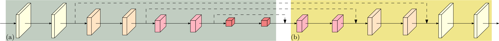
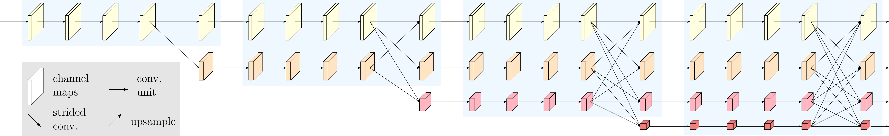
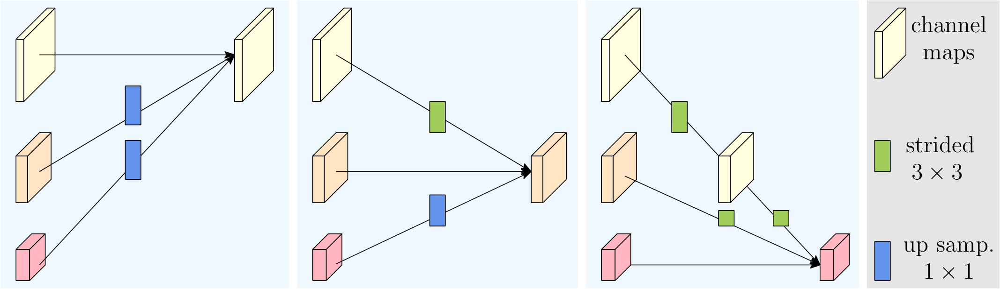
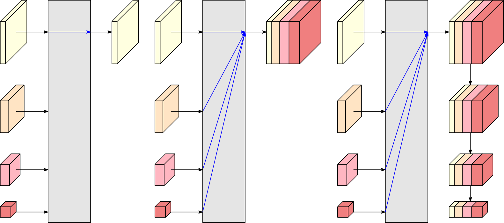
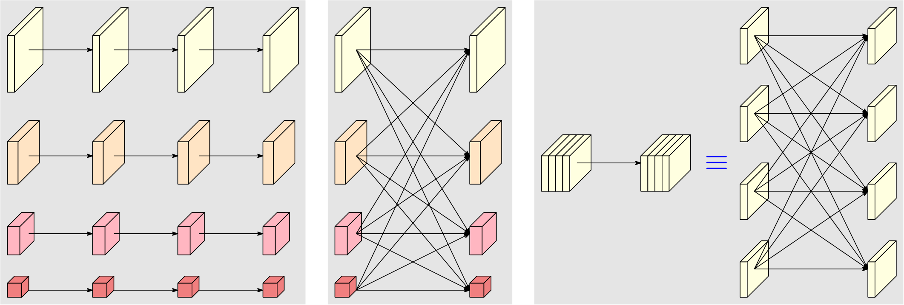
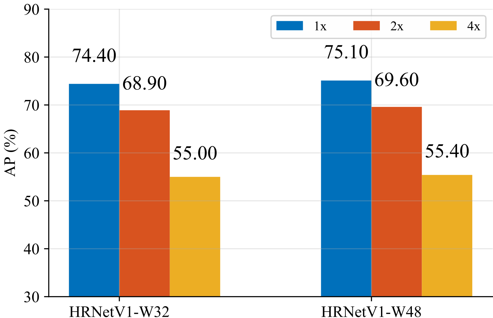
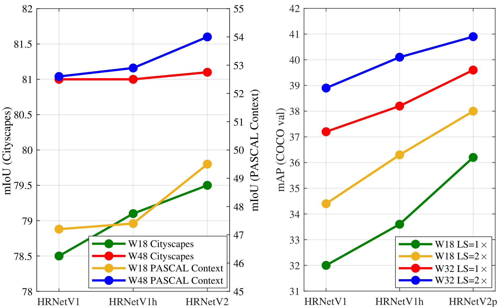
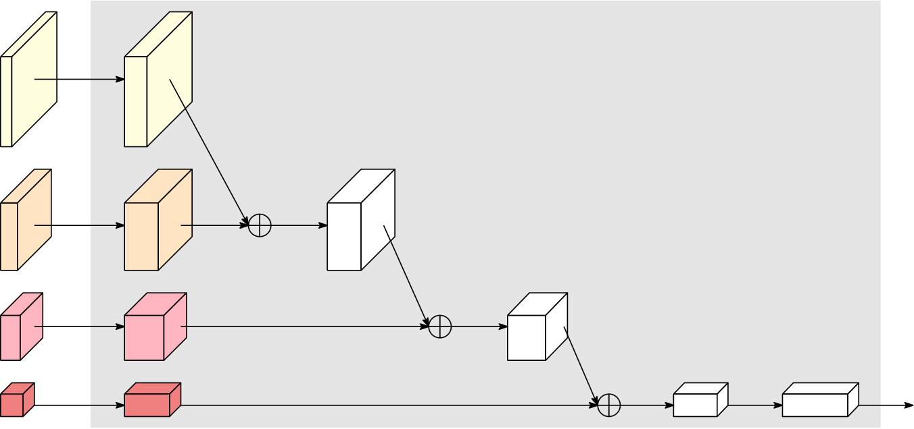

# 視覚認識のための深層高解像度表現学習

> 原題: Deep High-Resolution Representation Learning for Visual Recognition
> 著者: Jingdong Wang, Ke Sun, Tianheng Cheng, Borui Jiang, Chaorui Deng, Yang Zhao, Dong Liu, Yadong Mu, Mingkui Tan, Xinggang Wang, Wenyu Liu, Bin Xiao
> 所属: Microsoft Research Asia ほか（中国科学技術大学、華中科技大学、北京大学、南洋理工大学など）
> 出典: arXiv:1908.07919 → **IEEE TPAMI 2021**（CVPR 2019 の会議論文 HRNet の大幅拡張版）
> コード: <https://github.com/HRNet>

> 翻訳メモ: 本翻訳は CLAUDE.md §4 の標準ルールと異なり、**Appendix A〜E も翻訳対象に含めている**（ユーザーからの個別指示による）。References は除外。原典 markdown には定性例の画像 3 点しか含まれていなかったため、図はすべて arXiv ソース（arXiv:1908.07919 の e-print）に同梱された PDF から生成した。定性例の図 6・7・8（姿勢推定・セグメンテーション・検出の出力例）は本翻訳では省略している。

## Abstract（要旨）

高解像度の表現は、人物姿勢推定、セマンティックセグメンテーション、物体検出のような**位置に敏感な**視覚問題にとって本質的である。既存の最先端の枠組みは、まず高解像度から低解像度への畳み込みを**直列に**接続して形成されたサブネットワーク（例えば ResNet、VGGNet）を通して入力画像を低解像度表現として符号化し、次にその符号化された低解像度表現から高解像度表現を復元する。それに対し、我々が提案する **High-Resolution Network（HRNet）** と名付けたネットワークは、**過程全体を通して高解像度表現を維持する**。2 つの鍵となる特徴がある。(i) 高解像度から低解像度への畳み込みストリームを**並列に**接続する。(ii) 解像度をまたいで情報を**繰り返し交換する**。その利点は、結果として得られる表現が意味的により豊かで、空間的により正確になることである。我々は人物姿勢推定、セマンティックセグメンテーション、物体検出を含む幅広い応用において提案する HRNet の優位性を示し、HRNet がコンピュータビジョンの問題に対するより強力なバックボーンであることを示唆する。すべてのコードは <https://github.com/HRNet> で利用可能である。

## I Introduction（はじめに）

深層畳み込みニューラルネットワーク（DCNN）は、画像分類、物体検出、セマンティックセグメンテーション、人物姿勢推定など多くのコンピュータビジョンのタスクで最先端の結果を達成してきた。その強みは、DCNN が従来の手作業で設計された表現よりも豊かな表現を学習できることにある。

AlexNet、VGGNet、GoogleNet、ResNet などを含む最近開発された分類ネットワークのほとんどは、LeNet-5 の設計規則に従っている。その規則は図1(a) に描かれている。すなわち、**特徴マップの空間サイズを徐々に減らし、高解像度から低解像度への畳み込みを直列に接続し、低解像度表現に至る**というものであり、それがさらに分類のために処理される。

**高解像度表現**は、セマンティックセグメンテーション、人物姿勢推定、物体検出のような**位置に敏感なタスク**に必要である。従来の最先端の手法は、図1(b) に描かれているように、分類ネットワークまたは分類的なネットワークが出力する低解像度表現から表現の解像度を上げる**高解像度復元プロセス**を採用してきた。例えば Hourglass、SegNet、DeconvNet、U-Net、SimpleBaseline、encoder-decoder である。加えて、いくつかのダウンサンプル層を取り除いて中解像度の表現を得るために dilated convolution（拡張畳み込み）が用いられている。

<figure>

<figcaption>図1: 低解像度から高解像度を復元する構造。(a) 高解像度から低解像度への畳み込みを直列に接続して形成される低解像度表現学習サブネットワーク（VGGNet、ResNet など）。(b) 低解像度から高解像度への畳み込みを直列に接続して形成される高解像度表現復元サブネットワーク。代表例は SegNet、DeconvNet、U-Net、Hourglass、encoder-decoder、SimpleBaseline。</figcaption>
</figure>

我々は **High-Resolution Net（HRNet）** という新規のアーキテクチャを提示する。これは**過程全体を通して高解像度表現を維持する**ことができる。我々は高解像度の畳み込みストリームから始め、高解像度から低解像度への畳み込みストリームを 1 つずつ徐々に加え、それらの多解像度ストリームを**並列に接続する**。結果として得られるネットワークは、図2 に描かれているようにいくつか（本論文では 4 つ）の段階からなり、第 $n$ 段階は $n$ 個の解像度に対応する $n$ 本のストリームを含む。我々は並列ストリームをまたいで情報を何度も交換することで、**繰り返しの多解像度融合**を行う。

HRNet から学習される高解像度表現は、意味的に強いだけでなく空間的にも正確である。これは 2 つの側面から生じる。**(i) 我々のアプローチは高解像度から低解像度への畳み込みストリームを直列ではなく並列に接続する**。したがって、低解像度から高解像度を復元するのではなく高解像度を維持でき、それに応じて学習される表現は空間的により正確でありうる。**(ii) 既存の融合方式のほとんどは、低解像度表現をアップサンプルして得られる高解像度の低レベル表現と高レベル表現を集約する**。それに対し我々は、低解像度表現の助けを借りて高解像度表現を強化し、またその逆も行うよう、多解像度融合を繰り返す。その結果、**すべての高解像度から低解像度までの表現が意味的に強くなる**。

我々は HRNet の 2 つのバージョンを提示する。第一のものは **HRNetV1** と名付け、高解像度の畳み込みストリームから計算された高解像度表現のみを出力する。我々はこれをヒートマップ推定の枠組みに従って人物姿勢推定に適用する。COCO キーポイント検出データセットにおいて優れた姿勢推定性能を経験的に実証する。

もう一方は **HRNetV2** と名付け、高解像度から低解像度までのすべての並列ストリームからの表現を結合する。我々はこれを、結合された高解像度表現からセグメンテーションマップを推定することでセマンティックセグメンテーションに適用する。提案するアプローチは、同程度のモデルサイズとより低い計算量で PASCAL-Context、Cityscapes、LIP において最先端の結果を達成する。COCO 姿勢推定では HRNetV1 と HRNetV2 で同様の性能が観察され、セマンティックセグメンテーションでは HRNetV2 の HRNetV1 に対する優位性が観察される。

加えて、我々は HRNetV2 が出力する高解像度表現から **HRNetV2p** と名付けた多段階表現を構成し、これを Faster R-CNN、Cascade R-CNN、FCOS、CenterNet を含む最先端の検出の枠組み、および Mask R-CNN、Cascade Mask R-CNN、Hybrid Task Cascade を含む最先端の検出とインスタンスセグメンテーションの統合枠組みに適用する。結果は、我々の手法が検出性能の改善を得ること、**特に小さい物体で劇的な改善**を得ることを示している。

<figure>

<figcaption>図2: 高解像度ネットワークの例。本体のみを図示しており、ステム（2 つの stride 2 の 3×3 畳み込み）は含まれていない。4 つの段階がある。第 1 段階は高解像度の畳み込みからなる。第 2（第 3、第 4）段階は 2 解像度（3 解像度、4 解像度）のブロックを繰り返す。詳細は第 III 節で与えられる。右下の凡例: channel maps = チャネルマップ、conv. unit = 畳み込みユニット、strided conv. = ストライド付き畳み込み、upsample = アップサンプル。</figcaption>
</figure>

## II Related Work（関連研究）

我々は主に人物姿勢推定、セマンティックセグメンテーション、物体検出のために開発された密接に関連する表現学習の技法を、3 つの側面——低解像度表現学習、高解像度表現の復元、高解像度表現の維持——から概観する。加えて多スケール融合に関するいくつかの研究にも言及する。

**低解像度表現の学習。** 完全畳み込みネットワークのアプローチは、分類ネットワークから全結合層を取り除くことで低解像度表現を計算し、その粗いセグメンテーションマップを推定する。推定されたセグメンテーションマップは、中間の低レベル中解像度表現から推定される細かいセグメンテーションスコアマップと組み合わせるか、プロセスを反復することで改善される。

完全畳み込みネットワークは、いくつか（典型的に 2 つ）のストライド付き畳み込みとそれに関連する畳み込みを dilated convolution で置き換えることによって拡張版へと拡げられ、中解像度の表現をもたらす。これらの表現は、複数のスケールで物体をセグメントするために、特徴ピラミッドを通してさらに多スケールの文脈表現へと強化される。

**高解像度表現の復元。** アップサンプルのプロセスは、低解像度表現から高解像度表現を徐々に復元するために用いられうる。アップサンプルのサブネットワークは、ダウンサンプルのプロセス（例えば VGGNet）の対称版でありえ、プーリングのインデックスを変換するためにいくつかの鏡像化された層をまたぐスキップ接続を伴う（SegNet や DeconvNet）か、特徴マップをコピーする（U-Net や Hourglass、encoder-decoder）などである。U-Net の拡張である full-resolution residual network は、スキップ接続を置き換えるために完全な画像解像度で情報を運ぶ追加の全解像度ストリームを導入する。

非対称なアップサンプルのプロセスも広く研究されている。RefineNet はアップサンプルされた表現とダウンサンプルのプロセスからコピーされた同解像度の表現の組み合わせを改善する。他の研究には、軽量なアップサンプルのプロセス（バックボーンで dilated convolution を用いる場合もある）、軽量なダウンサンプルと重いアップサンプルのプロセス、recombinator networks、より多くのあるいは複雑な畳み込みユニットによるスキップ接続の改善、低解像度のスキップ接続から高解像度のスキップ接続へ情報を送ることやそれらの間で情報を交換すること、アップサンプルのプロセスの詳細の研究、多スケールピラミッド表現の組み合わせ、複数の DeconvNet / U-Net / Hourglass を密な接続とともに積み重ねること、などがある。

初期の 2 つの研究である convolutional neural fabrics と interlinked CNNs は、**いつ低解像度の並列ストリームを開始するか、並列ストリームをまたいでどこでどのように情報を交換するかについての注意深い設計を欠いて**おり、バッチ正規化や残差接続を用いていないため、満足のいく性能を示していない。GridNet は複数の U-Net の組み合わせのようなもので、2 つの対称な情報交換段階を含む。第 1 段階は高解像度から低解像度へのみ情報を渡し、第 2 段階は低解像度から高解像度へのみ情報を渡す。これがそのセグメンテーション品質を制限している。Multi-scale DenseNet は低解像度表現から受け取る情報がないため、強い高解像度表現を学習できない。

**多スケール融合。** 多スケール融合は広く研究されている。素直な方法は、多解像度の画像を別々に複数のネットワークに供給し、出力の応答マップを集約することである。Hourglass、U-Net、SegNet は、高解像度から低解像度へのダウンサンプルのプロセスにおける低レベル特徴を、低解像度から高解像度へのアップサンプルのプロセスにおける同解像度の高レベル特徴へ、スキップ接続を通して漸進的に組み合わせる。PSPNet と DeepLabV2/3 は、ピラミッドプーリングモジュールと atrous spatial pyramid pooling によって得られたピラミッド特徴を融合する。**我々の多スケール（解像度）融合モジュールはこれら 2 つのプーリングモジュールに似ている。違いは、(1) 我々の融合が 1 つだけでなく 4 解像度の表現を出力すること、(2) 我々の融合モジュールが deep fusion に触発されて数回繰り返されることにある。**

**我々のアプローチ。** 我々のネットワークは高解像度から低解像度への畳み込みストリームを並列に接続する。過程全体を通して高解像度表現を維持し、多解像度ストリームからの表現を繰り返し融合することで、強い位置感度を持つ信頼できる高解像度表現を生成する。

本論文は我々の以前の会議論文（CVPR 2019）の非常に実質的な拡張であり、未発表の技術報告からの追加資料および最近開発された最先端の物体検出・インスタンスセグメンテーションの枠組みのもとでのより多くの物体検出結果が加えられている。会議論文と比べた主な技術的新規性は 3 つある。**(1)** 会議論文で提案されたネットワーク（HRNetV1 と名付ける）を **HRNetV2 と HRNetV2p** の 2 つのバージョンへ拡張し、4 解像度すべての表現を探求する。**(2)** 多解像度融合と通常の畳み込みの間の**関連を構築**し、これが HRNetV2 と HRNetV2p で 4 解像度すべての表現を探求することの必要性の根拠を与える。**(3)** HRNetV2 と HRNetV2p の HRNetV1 に対する優位性を示し、セマンティックセグメンテーションと物体検出を含む幅広い視覚問題における応用を提示する。

## III High-Resolution Networks（高解像度ネットワーク）

我々は画像を、解像度を $\frac{1}{4}$ に減少させる 2 つの stride 2 の $3\times 3$ 畳み込みからなる**ステム**に入力し、続いて同じ解像度（$\frac{1}{4}$）の表現を出力する**本体**に入力する。図2 に図示され以下で詳述される本体は、いくつかの構成要素からなる。すなわち、並列多解像度畳み込み、繰り返しの多解像度融合、そして図4 に示される表現ヘッドである。

### III-A Parallel Multi-Resolution Convolutions（並列多解像度畳み込み）

我々は高解像度の畳み込みストリームを第 1 段階として開始し、高解像度から低解像度へのストリームを 1 つずつ徐々に加えて新しい段階を形成し、多解像度ストリームを並列に接続する。その結果、後の段階の並列ストリームの解像度は、前の段階の解像度に加えて 1 つ低いものからなる。

図2 に図示される 4 本の並列ストリームを含むネットワーク構造の例は、論理的には次のようになる。

$$
\begin{array}{llll}\mathcal{N}_{11}&\rightarrow~~\mathcal{N}_{21}&\rightarrow~~\mathcal{N}_{31}&\rightarrow~~\mathcal{N}_{41}\\
&\searrow~~\mathcal{N}_{22}&\rightarrow~~\mathcal{N}_{32}&\rightarrow~~\mathcal{N}_{42}\\
&&\searrow~~\mathcal{N}_{33}&\rightarrow~~\mathcal{N}_{43}\\
&&&\searrow~~\mathcal{N}_{44},\end{array}
$$

ここで $\mathcal{N}_{sr}$ は第 $s$ 段階のサブストリームであり、$r$ は解像度インデックスである。最初のストリームの解像度インデックスは $r=1$ である。インデックス $r$ の解像度は最初のストリームの解像度の $\frac{1}{2^{r-1}}$ である。

<figure>

<figcaption>図3: 融合モジュールが左から右へそれぞれ高解像度・中解像度・低解像度のために情報を集約する様子の図示。凡例: strided 3×3 = stride 2 の 3×3 畳み込み、up samp. 1×1 = 双線形アップサンプリングに続く 1×1 畳み込み。</figcaption>
</figure>

### III-B Repeated Multi-Resolution Fusions（繰り返しの多解像度融合）

融合モジュールの目的は、多解像度の表現をまたいで情報を交換することである。これは数回（例えば 4 つの残差ユニットごとに）繰り返される。

3 解像度の表現を融合する例を見てみよう。これは図3 に図示されている。2 つの表現や 4 つの表現の融合も容易に導出できる。入力は 3 つの表現 $\{\mathbf{R}_{r}^{i},r=1,2,3\}$ からなり、$r$ は解像度インデックスで、対応する出力表現は $\{\mathbf{R}_{r}^{o},r=1,2,3\}$ である。**各出力表現は 3 つの入力を変換したものの和**である。$\mathbf{R}_{r}^{o}=f_{1r}(\mathbf{R}_{1}^{i})+f_{2r}(\mathbf{R}_{2}^{i})+f_{3r}(\mathbf{R}_{3}^{i})$。段階をまたぐ融合（第 3 段階から第 4 段階へ）は追加の出力を持つ。$\mathbf{R}_{4}^{o}=f_{14}(\mathbf{R}_{1}^{i})+f_{24}(\mathbf{R}_{2}^{i})+f_{34}(\mathbf{R}_{3}^{i})$。

変換関数 $f_{xr}(\cdot)$ の選択は、入力解像度インデックス $x$ と出力解像度インデックス $r$ に依存する。

- $x=r$ ならば $f_{xr}(\mathbf{R})=\mathbf{R}$（恒等）
- $x<r$ ならば $f_{xr}(\mathbf{R})$ は $(r-s)$ 個の **stride 2 の $3\times 3$ 畳み込み**を通して入力表現 $\mathbf{R}$ をダウンサンプルする（$2\times$ ダウンサンプリングには 1 つ、$4\times$ には連続する 2 つ）
- $x>r$ ならば $f_{xr}(\mathbf{R})$ は**双線形アップサンプリングに続いてチャネル数を揃える $1\times 1$ 畳み込み**を通して入力表現をアップサンプルする

<figure>

<figcaption>図4: (a) HRNetV1: 高解像度の畳み込みストリームからの表現のみを出力する。(b) HRNetV2: すべての解像度からの（アップサンプルされた）表現を連結する（後続の 1×1 畳み込みは明瞭さのため示していない）。(c) HRNetV2p: HRNetV2 による表現から特徴ピラミッドを形成する。各サブ図の下部にある 4 解像度の表現は図2 のネットワークから出力されるもので、灰色のボックスは入力の 4 解像度表現から出力表現がどのように得られるかを示す。</figcaption>
</figure>

### III-C Representation Head（表現ヘッド）

我々は図4 に図示される 3 種類の表現ヘッドを持ち、それらを HRNetV1、HRNetV2、HRNetV2p と呼ぶ。

**HRNetV1。** 出力は高解像度ストリームからの表現のみである。他の 3 つの表現は無視される。図4(a) に図示。

**HRNetV2。** 低解像度の表現をチャネル数を変えずに双線形アップサンプリングで高解像度へ再スケールし、4 つの表現を連結し、続いて 4 つの表現を混合する $1\times 1$ 畳み込みを適用する。図4(b) に図示。

**HRNetV2p。** HRNetV2 が出力する高解像度表現を複数の段階へダウンサンプルすることで多段階の表現を構成する。図4(c) に図示。

本論文では、HRNetV1 を人物姿勢推定に、HRNetV2 をセマンティックセグメンテーションに、HRNetV2p を物体検出に適用した結果を示す。

<figure>

<figcaption>図5: (a) 多解像度並列畳み込み、(b) 多解像度融合、(c) 通常の畳み込み（左）は全結合された多分岐畳み込み（右）と等価である。</figcaption>
</figure>

### III-D Instantiation（具体化）

本体は 4 本の並列畳み込みストリームを持つ 4 つの段階を含む。解像度は $1/4$、$1/8$、$1/16$、$1/32$ である。**第 1 段階は 4 つの残差ユニット**を含み、各ユニットは幅 64 の bottleneck で形成され、続いて特徴マップの幅を $C$ に変える 1 つの $3\times 3$ 畳み込みが置かれる。**第 2、第 3、第 4 段階はそれぞれ 1、4、3 個のモジュール化されたブロック**を含む。モジュール化されたブロックの多解像度並列畳み込みの各分岐は 4 つの残差ユニットを含む。各ユニットは各解像度について 2 つの $3\times 3$ 畳み込みを含み、各畳み込みの後にバッチ正規化と非線形活性化 ReLU が続く。4 解像度の畳み込みの幅（チャネル数）はそれぞれ $C$、$2C$、$4C$、$8C$ である。

### III-E Analysis（分析）

我々はモジュール化されたブロックを 2 つの構成要素——多解像度並列畳み込み（図5(a)）と多解像度融合（図5(b)）——に分けて分析する。

**多解像度並列畳み込みは group convolution に似ている**。それは入力チャネルをいくつかのチャネルの部分集合に分割し、各部分集合に対して**異なる空間解像度で**別々に通常の畳み込みを行う。一方 group convolution では解像度は同じである。この関連は、多解像度並列畳み込みが group convolution のいくらかの利点を享受することを含意する。

**多解像度融合ユニットは、通常の畳み込みの多分岐全結合形式に似ている**（図5(c) に図示）。通常の畳み込みは複数の小さな畳み込みに分割できる。入力チャネルはいくつかの部分集合に分割され、出力チャネルもいくつかの部分集合に分割される。入力と出力の部分集合は全結合の様式で接続され、各接続は通常の畳み込みである。出力チャネルの各部分集合は、入力チャネルの各部分集合に対する畳み込みの出力の総和である。違いは、**我々の多解像度融合が解像度の変化を扱う必要がある**点にある。**多解像度融合と通常の畳み込みの間のこの関連は、HRNetV2 と HRNetV2p で 4 解像度すべての表現を探求することの根拠を与える。**

## IV Human Pose Estimation（人物姿勢推定）

我々は HRNetV1 が出力する高解像度表現の上でヒートマップを回帰する。HRNetV1 と HRNetV2 で性能がほぼ同じであることを経験的に観察したので、計算量がわずかに低い HRNetV1 を選ぶ。損失関数は平均二乗誤差として定義され、予測されたヒートマップと真のヒートマップを比較するために適用される。真のヒートマップは、各キーポイントの真の位置を中心とする標準偏差 2 画素の 2D ガウシアンを適用することで生成される。

**データセット。** COCO データセットは 17 個のキーポイントでラベル付けされた 200,000 枚超の画像と 250,000 の人物インスタンスを含む。COCO train2017 セット（57K 画像、150K 人物インスタンス）でモデルを訓練し、val2017（5000 枚）と test-dev2017（20K 枚）で評価する。

**評価指標。** 標準的な評価指標は Object Keypoint Similarity（OKS）に基づく。

$$\operatorname{OKS}=\frac{\sum_{i}\exp(-d_{i}^{2}/2s^{2}k_{i}^{2})\delta(v_{i}>0)}{\sum_{i}\delta(v_{i}>0)}$$

ここで $d_{i}$ は検出されたキーポイントと対応する真値の間のユークリッド距離、$v_{i}$ は真値の可視性フラグ、$s$ は物体のスケール、$k_{i}$ は減衰を制御するキーポイントごとの定数である。

**訓練。** 人物検出ボックスを高さまたは幅方向に拡張して固定のアスペクト比 $\text{height}:\text{width}=4:3$ にし、画像からボックスを切り出して固定サイズ $256\times 192$ または $384\times 288$ にリサイズする。データ拡張はランダム回転、ランダムスケール $[0.65,1.35]$、反転を含む。半身データ拡張も含める。Adam オプティマイザを用いる。基準学習率は 1e-3 で、第 170 エポックと第 200 エポックでそれぞれ 1e-4 と 1e-5 に下げる。訓練は 210 エポック以内で終了する。4 枚の V100 GPU で訓練し、HRNet-W32（W48）で約 60（80）時間かかる。

**テスト。** 2 段階のトップダウンのパラダイムを用いる。人物検出器で人物インスタンスを検出し、その後キーポイントを予測する。val と test-dev の双方で SimpleBaseline が提供するのと同じ人物検出器を用いる。元画像と反転画像のヒートマップを平均してヒートマップを計算する。各キーポイントの位置は、最高の熱値の位置を、最高応答から 2 番目に高い応答への方向に 1/4 のオフセットだけ調整することで予測される。

**表I**: COCO val における比較。入力サイズ $256\times 192$ のもとで、我々の小さなモデル HRNetV1-W32 は他の手法を上回る。

| Method | Backbone | Pretrain | Input size | #Params | GFLOPs | AP |
| --- | --- | --- | --- | --- | --- | --- |
| 8-stage Hourglass | 8-stage Hourglass | N | 256×192 | 25.1 M | 14.3 | 66.9 |
| CPN | ResNet-50 | Y | 256×192 | 27.0 M | 6.20 | 68.6 |
| CPN + OHKM | ResNet-50 | Y | 256×192 | 27.0 M | 6.20 | 69.4 |
| SimpleBaseline | ResNet-50 | Y | 256×192 | 34.0 M | 8.90 | 70.4 |
| SimpleBaseline | ResNet-101 | Y | 256×192 | 53.0 M | 12.4 | 71.4 |
| SimpleBaseline | ResNet-152 | Y | 256×192 | 68.6 M | 15.7 | 72.0 |
| **HRNetV1-W32** | HRNetV1-W32 | N | 256×192 | 28.5 M | 7.10 | **73.4** |
| **HRNetV1-W32** | HRNetV1-W32 | Y | 256×192 | 28.5 M | 7.10 | **74.4** |
| **HRNetV1-W48** | HRNetV1-W48 | Y | 256×192 | 63.6 M | 14.6 | **75.1** |
| SimpleBaseline | ResNet-152 | Y | 384×288 | 68.6 M | 35.6 | 74.3 |
| **HRNetV1-W32** | HRNetV1-W32 | Y | 384×288 | 28.5 M | 16.0 | **75.8** |
| **HRNetV1-W48** | HRNetV1-W48 | Y | 384×288 | 63.6 M | 32.9 | **76.3** |

**val セットにおける結果。** 入力サイズ $256\times 192$ でゼロから訓練された HRNetV1-W32 は **AP スコア 73.4** を達成し、同じ入力サイズの他の手法を上回る。(i) Hourglass と比べて **AP を 6.5 ポイント改善**し、GFLOP は半分以下とはるかに低い。(ii) CPN の OHKM なし・ありと比べて、わずかに大きなモデルサイズとわずかに高い計算量で、それぞれ **4.8 と 4.0 ポイントの向上**を達成する。

我々のネットワークは (i) ImageNet 事前学習モデルからの訓練で **HRNetV1-W32 に 1.0 ポイントの向上**、(ii) 幅を増やして容量を増やすことで **HRNetV1-W48 が $256\times 192$ と $384\times 288$ でそれぞれ 0.7 と 0.5 ポイントの向上**、から恩恵を受ける。

入力サイズ $384\times 288$ を考えると、HRNetV1-W32 と HRNetV1-W48 は **75.8 と 76.3 AP** を得る。ResNet-152 をバックボーンとする SimpleBaseline と比較して、HRNetV1-W32 と HRNetV1-W48 は **45% と 92.4% の計算コストで 1.5 と 2.0 ポイントの AP 向上**を得る。

**test-dev セットにおける結果。** 我々のアプローチはボトムアップのアプローチより大幅に良い。小さなネットワーク HRNetV1-W32 は **AP 74.9** を達成し、他のすべてのトップダウンのアプローチを上回り、モデルサイズと計算量の点でより効率的である。大きなモデル HRNetV1-W48 は**最高の AP スコア 75.5** を達成する。同じ入力サイズの SimpleBaseline と比較して、小さいネットワークと大きいネットワークはそれぞれ **1.2 と 1.8 の改善**を受ける。

## V Semantic Segmentation（セマンティックセグメンテーション）

**Cityscapes。** Cityscapes データセットは 5,000 枚の高品質な画素レベル精密注釈シーン画像を含む。精密注釈画像は訓練/検証/テスト用に 2,975/500/1,525 枚に分けられる。30 クラスがあり、そのうち 19 クラスが評価に用いられる。

データはランダムクロップ（$1024\times 2048$ から $512\times 1024$ へ）、$[0.5,2]$ の範囲のランダムスケーリング、ランダム水平反転で拡張される。基準学習率 0.01、モメンタム 0.9、weight decay 0.0005 の SGD オプティマイザを用いる。学習率の低下には power 0.9 の poly 方策を用いる。すべてのモデルは 4 GPU 上でバッチサイズ 12、syncBN で 120K イテレーション訓練される。

**表III**: Cityscapes val におけるセマンティックセグメンテーションの結果（単一スケール、反転なし）。

| | backbone | #param. | GFLOPs | mIoU |
| --- | --- | --- | --- | --- |
| UNet++ | ResNet-101 | 59.5 M | 748.5 | 75.5 |
| Dilated-ResNet | D-ResNet-101 | 52.1 M | 1661.6 | 75.7 |
| DeepLabv3 | D-ResNet-101 | 58.0 M | 1778.7 | 78.5 |
| DeepLabv3+ | D-Xception-71 | 43.5 M | 1444.6 | 79.6 |
| PSPNet | D-ResNet-101 | 65.9 M | 2017.6 | 79.7 |
| **HRNetV2-W40** | HRNetV2-W40 | 45.2 M | **493.2** | **80.2** |
| **HRNetV2-W48** | HRNetV2-W48 | 65.9 M | **696.2** | **81.1** |
| **HRNetV2 + OCR** | HRNetV2-W48 | 70.3 M | 1206.3 | **81.6** |

表III は Cityscapes val セットにおける比較を提供する。(i) **HRNetV2-W40**（40 は高解像度畳み込みの幅を示す）は、DeepLabv3+ と同程度のモデルサイズと**はるかに低い計算量**で、より良い性能を得る。UNet++ に対して 4.7 ポイント、DeepLabv3 に対して 1.7 ポイント、PSPNet と DeepLabv3+ に対して約 0.5 ポイントの向上である。(ii) **HRNetV2-W48** は PSPNet と同程度のモデルサイズと**はるかに低い計算量（696.2 vs 2017.6 GFLOPs、約 1/3）**で、UNet++ に 5.6 ポイント、DeepLabv3 に 2.6 ポイント、約 1.4 ポイントのより大幅な改善を達成する。

**Cityscapes test。** 表IV はテストセットにおける最先端手法との比較を提供する。すべての結果は 6 スケールと反転を伴う。粗いデータを用いない 2 つのケース（train セットで学習したモデルと train+val セットで学習したモデル）が評価され、**双方のケースで HRNetV2-W48 が優れた性能を達成する**。

**PASCAL-Context。** PASCAL-Context データセットは訓練用 4,998 枚とテスト用 5,105 枚のシーン画像を含み、59 の意味ラベルと 1 つの背景ラベルを持つ。

**表V**: PASCAL-Context におけるセマンティックセグメンテーションの結果。59 クラスと 60 クラス（59 + 背景）で評価される。

| | backbone | mIoU (59) | mIoU (60) |
| --- | --- | --- | --- |
| FCN-8s | VGG-16 | – | 35.1 |
| DeepLab-v2 | D-ResNet-101 | – | 45.7 |
| RefineNet | ResNet-152 | – | 47.3 |
| UNet++ | ResNet-101 | 47.7 | – |
| PSPNet | D-ResNet-101 | 47.8 | – |
| EncNet | D-ResNet-101 | 52.6 | – |
| DANet | D-ResNet-101 | 52.6 | – |
| CFNet | D-ResNet-101 | 54.0 | – |
| APCN | D-ResNet-101 | 55.6 | – |
| **HRNetV2-W48** | HRNetV2-W48 | 54.0 | 48.3 |
| **HRNetV2 + OCR** | HRNetV2-W48 | **56.2** | **50.1** |

双方のケースで **HRNetV2-W48 が最先端の結果を達成する**。ただし OCR 方式を用いない場合、APCN の結果が我々より高い。

**LIP。** LIP データセットは 50,462 枚の精密に注釈された人物画像を含み、訓練 30,462 枚、検証 10,000 枚に分けられる。手法は 20 カテゴリ（19 の人体部位ラベルと 1 つの背景ラベル）で評価される。**HRNetV2-W48 の全体的な性能が、より少ないパラメータとより軽い計算コストで最良である**。我々のネットワークは姿勢やエッジのような追加情報を利用していないことにも言及したい。

## VI COCO Object Detection（COCO 物体検出）

我々は HRNetV2p を、Faster R-CNN、Cascade R-CNN、FCOS、CenterNet を含む最先端の検出の枠組み、および Mask R-CNN、Cascade Mask R-CNN、Hybrid Task Cascade を含む検出とインスタンスセグメンテーションの統合枠組みに適用する。

結果は、我々の手法が ResNet および ResNeXt に対して検出性能の改善を得ること、**特に小さい物体（AP_S）で劇的な改善**を得ることを示す。表XI は BN パラメータを固定し多スケール訓練・テストを用いない COCO test-dev における最先端の単一モデル物体検出器との比較を報告し、**HRNet が最先端の物体検出とインスタンスセグメンテーションの枠組みのもとで ResNet と ResNeXt より良い性能を発揮する**ことを示す。

## VII Ablation Study（アブレーション研究）

我々は HRNet の構成要素について、COCO 検証での人物姿勢推定と Cityscapes 検証でのセマンティックセグメンテーションの 2 つのタスクでアブレーション研究を行う。主に姿勢推定には HRNetV1-W32、セマンティックセグメンテーションには HRNetV2-W48 を用いる。

<figure>

<figcaption>図9: 人物姿勢推定のための表現の解像度に関するアブレーション研究。1×、2×、4× はそれぞれ高解像度・中解像度・低解像度の表現に対応する。結果は、より高い解像度が性能を改善することを含意する。</figcaption>
</figure>

**異なる解像度の表現。** 我々は、高解像度から低解像度までの各解像度の特徴マップから推定されるヒートマップの品質を調べることで、表現の解像度が姿勢推定の性能にどう影響するかを研究する。ネットワークは高解像度から低解像度までの 4 つの応答マップを出力する。**最低解像度の応答マップに対するヒートマップ予測の品質は低すぎて AP スコアは 10 ポイント未満である**。他の 3 つのマップに対する AP スコアは図9 に報告されている。この比較は、**解像度がキーポイント予測の品質に確かに影響する**ことを含意する。

**表XII**: COCO val 人物姿勢推定（AP）と Cityscapes val セマンティックセグメンテーション（mIoU）における多解像度融合ユニットのアブレーション研究。Final = 表現ヘッド直前の最終融合、Across = 段階をまたぐ中間融合、Within = 段階内の中間融合。

| Method | Final | Across | Within | Pose (AP) | Segmentation (mIoU) |
| --- | --- | --- | --- | --- | --- |
| (a) | ✓ | | | 70.8 | 74.8 |
| (b) | ✓ | ✓ | | 71.9 | 75.4 |
| **(c)** | ✓ | ✓ | ✓ | **73.4** | **76.4** |

**繰り返しの多解像度融合。** 3 つの変種を研究する。(a) 中間融合ユニットなし（1 融合）: 最終融合ユニット以外に多解像度ストリーム間の融合がない。(b) 段階をまたぐ融合ユニットあり（3 融合）: 各段階内で並列ストリーム間の融合がない。(c) 段階をまたぐ融合と段階内の融合の双方あり（合計 8 融合）: これが提案手法。すべてのネットワークはゼロから訓練される。表XII の結果は、**多解像度融合ユニットが有用であり、より多くの融合がより良い性能をもたらす**ことを示す。

融合設計の他の選択肢も研究した。(i) ストライド付き畳み込みを双線形ダウンサンプルで置き換える、(ii) 和の演算を乗算の演算で置き換える。前者の場合、COCO 姿勢推定 AP と Cityscapes セグメンテーション mIoU はそれぞれ **72.6 と 74.2 に低下**する。理由は、ダウンサンプリングが表現マップの体積サイズ（幅 × 高さ × チャネル数）を減らすため、ストライド付き畳み込みの方が双線形ダウンサンプリングより良い体積サイズの削減を学習するからである。後者の場合、結果はずっと悪い（**54.7 と 66.0**）。乗算が訓練の難度を上げるためと考えられる。

**解像度の維持。** HRNet の変種——4 本の高解像度から低解像度までのストリームがすべて最初から加えられ、4 本のストリームの深さが同じで、融合方式は我々のものと同じ——の性能を研究する。COCO val における姿勢推定性能（AP）は変種で **72.5** であり、HRNetV1-W32 の **73.4** より低い。Cityscapes val におけるセグメンテーション性能（mIoU）は変種で **75.7** であり、HRNetV2-W48 の **76.4** より低い。**理由は、低解像度ストリームの初期段階から抽出される低レベル特徴があまり有用でないためだ**と我々は考える。加えて、低解像度の並列ストリームなしで高解像度ストリームのみを持つ同程度の #parameters と GFLOPs の別の単純な変種は、はるかに低い性能を示す。

<figure>

<figcaption>図10: HRNetV1 と HRNetV2 の比較。(a) HRNetV1 とその変種 HRNetV1h、および HRNetV2 を比較する Cityscapes val と PASCAL-Context のセグメンテーション（単一スケール、反転なし）。(b) HRNetV1 とその変種 HRNetV1h、および HRNetV2p を比較する COCO val の物体検出（LS = 学習スケジュール）。HRNetV2 がセマンティックセグメンテーションと物体検出の双方で HRNetV1 より優れていることが分かる。</figcaption>
</figure>

**V1 対 V2。** 姿勢推定、セマンティックセグメンテーション、COCO 物体検出で HRNetV2 と HRNetV2p を HRNetV1 と比較する。**人物姿勢推定では性能は同様**である。例えば HRNetV2-W32（ImageNet 事前学習なし）は AP 73.6 を達成し、HRNetV1-W32 の 73.4 よりわずかに高いだけである。

図10(a) と (b) に示されるセグメンテーションと物体検出の結果は、**HRNetV2 が HRNetV1 を大幅に上回る**ことを含意する。ただし Cityscapes のセグメンテーションにおける大モデルの場合（$1\times$）は向上が軽微である。我々はまた、出力の高解像度表現の次元を HRNetV2 の次元に揃えるために $1\times 1$ 畳み込みを追加した変種（**HRNetV1h**）もテストした。結果は、この変種が HRNetV1 に対してわずかな改善しか達成しないことを示し、**HRNetV2 において低解像度の並列畳み込みからの表現を集約することがモデルの能力を改善するのに本質的である**ことを含意する。

## VIII Conclusions（結論）

本論文では視覚認識の問題のための高解像度ネットワークを提示した。既存の低解像度分類ネットワークおよび高解像度表現学習ネットワークとの 3 つの根本的な違いがある。**(i) 高解像度と低解像度の畳み込みを直列ではなく並列に接続する。(ii) 低解像度から高解像度を復元するのではなく、過程全体を通して高解像度を維持する。(iii) 多解像度の表現を繰り返し融合し、強い位置感度を持つ豊かな高解像度表現をもたらす。**

幅広い視覚認識の問題における優れた結果は、提案する HRNet がコンピュータビジョンの問題に対するより強力なバックボーンであることを示唆する。**我々の研究はまた、低解像度ネットワーク（ResNet や VGGNet など）から学習された表現を拡張・修繕・修復するのではなく、特定の視覚問題に対して直接ネットワークアーキテクチャを設計するというより多くの研究努力を促すものである。**

**議論。** ありうる誤解として、「解像度が高いので HRNet のメモリコストが大きい」というものがある。実際には、人物姿勢推定、セマンティックセグメンテーション、物体検出の 3 つの応用すべてにおいて、**HRNet のメモリコストは最先端手法と同等**である。ただし物体検出における訓練メモリコストは少し大きい。

加えて PyTorch 1.0 プラットフォームでの実行時コストの比較を要約する。HRNet の訓練・推論の時間コストは従来の最先端と同等である。ただし (1) **セグメンテーションにおける HRNet の推論時間ははるかに小さく**、(2) 姿勢推定における HRNet の訓練時間は少し大きい。ただし静的グラフ推論をサポートする MXNet 1.5.1 プラットフォームでのコストは SimpleBaseline と同様である。**セマンティックセグメンテーションについては推論コストが PSPNet や DeepLabv3 より大幅に小さい**ことを強調したい。

**今後の研究と後続研究。** 我々は HRNet を、セマンティックセグメンテーションとインスタンスセグメンテーションのための他の技法と組み合わせることを研究する。現在、**object-contextual representation（OCR）方式**と HRNet を組み合わせた結果が表III・IV・V・VI に描かれている。表現の解像度を $\frac{1}{2}$ あるいは全解像度にまでさらに上げる研究も行う。

HRNet の応用は上記に限られず、顔ランドマーク検出、超解像、オプティカルフロー推定、深度推定など、他の位置に敏感な視覚応用に適している。既に画像スタイル化、インペインティング、画像強調、画像除霧、時間的姿勢推定、ドローン物体検出といった後続研究がある。

**わずかに修正した HRNet を ASPP と組み合わせたものが、単一モデルの場合の Mapillary パノプティックセグメンテーションで最良の性能を達成した**と報告されている。ICCV 2019 の COCO + Mapillary Joint Recognition Challenge Workshop において、**COCO DensePose チャレンジの優勝者とほぼすべての COCO キーポイント検出チャレンジ参加者が HRNet を採用した**。ICCV 2019 の OpenImage インスタンスセグメンテーションチャレンジの優勝者も HRNet を用いた。

## Appendix A Network Instantiation（ネットワークの具体化）

我々の現在の設計は（標準的なステムとヘッドを除いて）表XIV に示すように 4 つの段階を含む。各段階はモジュール化されたブロックからなり、4 つの段階でそれぞれ **1、1、4、3 回**繰り返される。モジュール化されたブロックは第 1（第 2、第 3、第 4）段階で 1（2、3、4）本の分岐からなる。各分岐は異なる解像度に対応し、**4 つの残差ユニットと 1 つの多解像度融合ユニット**で構成される。

**表XIV**: HRNet（本体）のアーキテクチャ。明瞭さのため融合ユニット（各モジュール化ブロックの後）は表に描かれていない。

| Resolution | Stage 1 | Stage 2 | Stage 3 | Stage 4 |
| --- | --- | --- | --- | --- |
| 4× | [1×1, 64 3×3, 64 1×1, 256] × 4 × 1 | [3×3, C 3×3, C] × 4 × 1 | [3×3, C 3×3, C] × 4 × 4 | [3×3, C 3×3, C] × 4 × 3 |
| 8× | | [3×3, 2C 3×3, 2C] × 4 × 1 | [3×3, 2C 3×3, 2C] × 4 × 4 | [3×3, 2C 3×3, 2C] × 4 × 3 |
| 16× | | | [3×3, 4C 3×3, 4C] × 4 × 4 | [3×3, 4C 3×3, 4C] × 4 × 3 |
| 32× | | | | [3×3, 8C 3×3, 8C] × 4 × 3 |

## Appendix B Network Pretraining（ネットワークの事前学習）

我々は、図11 に示す分類ヘッドで拡張したネットワークを ImageNet で事前学習する。分類ヘッドは以下の通りである。**まず 4 解像度の特徴マップが bottleneck に供給され、出力チャネルが $C$、$2C$、$4C$、$8C$ からそれぞれ 128、256、512、1024 へ増やされる。次に高解像度表現を 256 チャネルを出力する stride 2 の $3\times 3$ 畳み込みでダウンサンプルし、2 番目に高い解像度の表現に加算する。このプロセスを 2 回繰り返して 1024 特徴チャネルを得る。**

<figure>

<figcaption>図11: ImageNet 分類のための表現。ボックスへの入力は 4 解像度の表現である。</figcaption>
</figure>

訓練画像には ResNet と同じデータ拡張方式を採用し、バッチサイズ 256 で 100 エポック訓練する。初期学習率は 0.1 に設定し、エポック 30、60、90 で 10 分の 1 にする。weight decay 0.0001、Nesterov モメンタム 0.9 の SGD を用いる。標準的な単一クロップのテストを採用し、各画像から $224\times 224$ 画素を切り出す。

**表XV**: HRNet と ResNet の ImageNet 分類結果。提案手法は HRNet-W$x$-C と名付ける。$x$ は幅を意味する。

| | #Params. | GFLOPs | top-1 err. | top-5 err. |
| --- | --- | --- | --- | --- |
| *残差分岐が 2 つの 3×3 畳み込みで形成される場合* | | | | |
| ResNet-38 | 28.3 M | 3.80 | 24.6% | 7.4% |
| **HRNet-W18-C** | 21.3 M | 3.99 | **23.1%** | **6.5%** |
| ResNet-72 | 48.4 M | 7.46 | 23.3% | 6.7% |
| **HRNet-W30-C** | 37.7 M | 7.55 | **21.9%** | **5.9%** |
| ResNet-106 | 64.9 M | 11.1 | 22.7% | 6.4% |
| **HRNet-W40-C** | 57.6 M | 11.8 | **21.1%** | **5.6%** |
| *残差分岐が bottleneck で形成される場合* | | | | |
| ResNet-50 | 25.6 M | 3.82 | 23.3% | 6.6% |
| **HRNet-W44-C** | 21.9 M | 3.90 | **23.0%** | **6.5%** |
| ResNet-101 | 44.6 M | 7.30 | 21.6% | 5.8% |
| **HRNet-W76-C** | 40.8 M | 7.30 | **21.5%** | **5.8%** |
| ResNet-152 | 60.2 M | 10.7 | 21.2% | 5.7% |
| **HRNet-W96-C** | 57.5 M | 10.2 | **21.0%** | **5.6%** |

加えて、2 つの代替方式の結果も見る。(i) 各解像度の特徴マップが別々に大域プーリングを通り、その後連結されて $15C$ 次元の表現ベクトルを出力する（**HRNet-W$x$-Ci**）。(ii) 各解像度の特徴マップがいくつかの stride 2 の残差ユニット（bottleneck、各次元が倍に増える）に供給されて次元を 512 に増やし、連結して平均プールすることで 2048 次元の表現ベクトルに至る（**HRNet-W$x$-Cii**、会議論文で用いられたもの）。

**表XVI**: ImageNet 分類における我々のアプローチ（HRNet-W$x$-C）と 2 つの代替方式の比較のアブレーション研究。

| | #Params. | GFLOPs | top-1 err. | top-5 err. |
| --- | --- | --- | --- | --- |
| HRNet-W27-Ci | 21.4 M | 5.55 | 26.0% | 7.7% |
| HRNet-W25-Cii | 21.7 M | 5.04 | 24.1% | 7.1% |
| **HRNet-W18-C** | 21.3 M | 3.99 | **23.1%** | **6.5%** |
| HRNet-W36-Ci | 37.5 M | 9.00 | 24.3% | 7.3% |
| HRNet-W34-Cii | 36.7 M | 8.29 | 22.8% | 6.3% |
| **HRNet-W30-C** | 37.7 M | 7.55 | **21.9%** | **5.9%** |
| HRNet-W45-Ci | 58.2 M | 13.4 | 23.6% | 7.0% |
| HRNet-W43-Cii | 56.3 M | 12.5 | 22.2% | 6.1% |
| **HRNet-W40-C** | 57.6 M | 11.8 | **21.1%** | **5.6%** |

## Appendix C Training/Inference Cost（訓練・推論のコスト）

表XVII、XVIII、XIX は PyTorch プラットフォームにおける訓練と推論の双方について、HRNet と他の標準的なネットワークの間の GPU メモリの比較を提供する。

- **人物姿勢推定**: 同程度のパラメータ複雑度に対して、HRNet の訓練・推論のメモリコストは同等かより低い（表XVII）
- **セマンティックセグメンテーション**: 同程度のパラメータ複雑度に対してメモリコストは同等（表XVIII）
- **物体検出**: 同程度のパラメータ複雑度に対して訓練メモリは少し大きいが、推論メモリは同等でより高い AP スコアを得る（表XIX）

実行時コストの比較も提供する。**(1) セマンティックセグメンテーションでは、HRNet の訓練時間コストはわずかに小さく、推論では PSPNet や DeepLabv3 より大幅に小さい**（表XVIII）。(2) 物体検出では、HRNet の訓練時間コストは ResNet ベースのネットワークより大きく ResNeXt ベースのものより小さい。推論では同程度の GFLOPs に対して HRNet の方が小さい（表XIX）。(3) 人物姿勢推定では、HRNet の訓練時間コストは同様で推論では大きい。ただし**静的グラフ推論をサポートする MXNet 上では SimpleBaseline と同様**である。

## Appendix D Facial Landmark Detection（顔ランドマーク検出）

顔ランドマーク検出（顔アライメント）は顔画像からキーポイントを検出する問題である。我々は 4 つの標準データセット（**WFLW、AFLW、COFW、300W**）で評価を行う。主に正規化平均誤差（NME）を評価に用いる。WFLW、COFW、300W には眼間距離を、AFLW には顔バウンディングボックスを正規化に用いる。曲線下面積スコア（AUC）と失敗率も報告する。

訓練には標準的な方式に従う。すべての顔は提供されたボックスによって中心位置に従って切り出され $256\times 256$ にリサイズされる。データは面内回転 $\pm 30$ 度、$0.75$-$1.25$ のスケーリング、ランダム反転で拡張される。基準学習率は 0.0001 で、第 30 エポックと第 50 エポックで 0.00001 と 0.000001 に下げる。モデルは 1 GPU 上でバッチサイズ 16 で 60 エポック訓練される。**セマンティックセグメンテーションと異なり、ヒートマップは $1/4$ から入力サイズへアップサンプルされず、損失関数は $1/4$ 解像度のヒートマップ上で最適化される。**

## Appendix E More object detection and instance results on COCO val2017（COCO val2017 における追加の物体検出とインスタンスの結果）

本節は COCO val2017 における Faster R-CNN、Cascade R-CNN、FCOS、CenterNet、Mask R-CNN、Cascade Mask R-CNN、Hybrid Task Cascade といった各種の枠組みのもとでの詳細な物体検出およびインスタンスセグメンテーションの結果を提供する。観察は本文と同様であり、**HRNet が同程度のパラメータ複雑度の ResNet および ResNeXt を上回る**こと、**特に小さい物体（AP_S）における改善が顕著**であることを示している。
