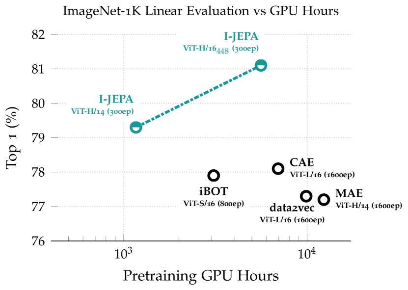
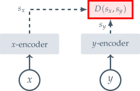
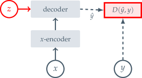
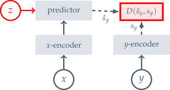
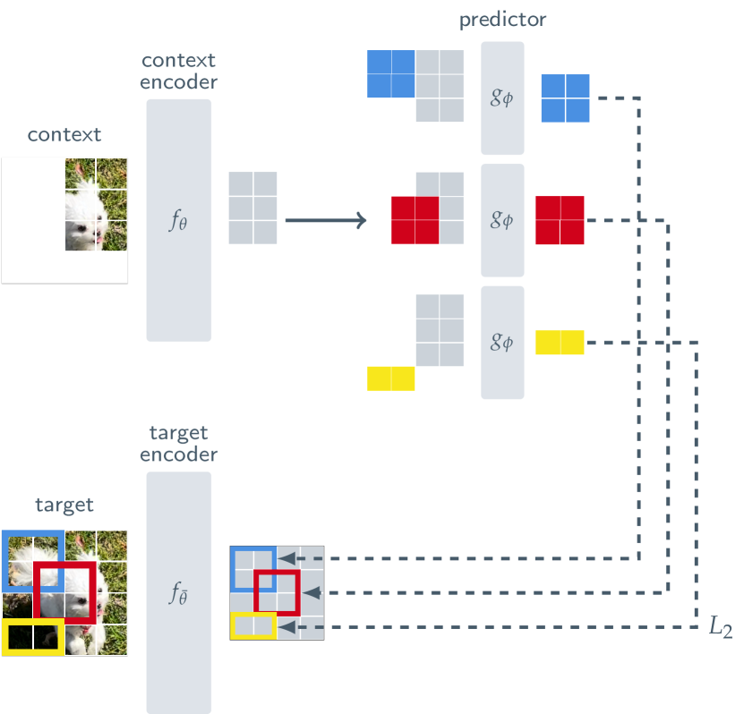
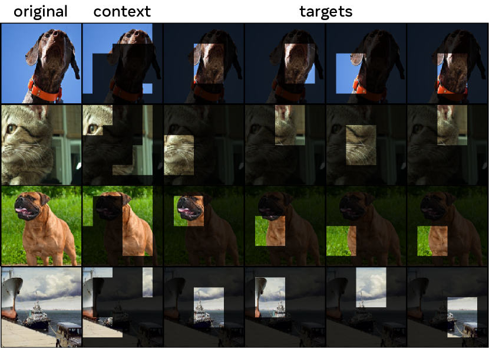
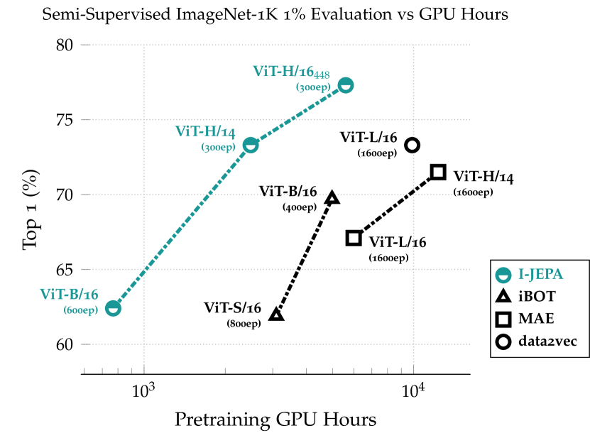
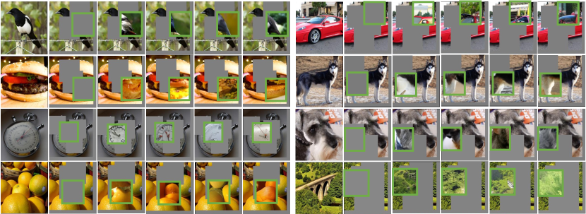
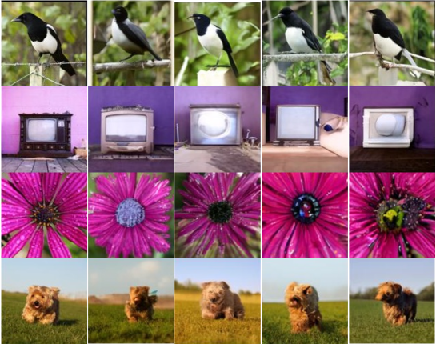
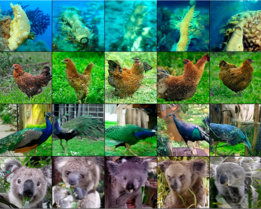

# 画像からの自己教師あり学習：Joint-Embedding Predictive Architecture を用いて

> 原題: Self-Supervised Learning from Images with a Joint-Embedding Predictive Architecture
> 著者: Mahmoud Assran, Quentin Duval, Ishan Misra, Piotr Bojanowski, Pascal Vincent, Michael Rabbat, Yann LeCun, Nicolas Ballas
> 所属: Meta AI (FAIR), McGill University, Mila（Quebec AI Institute）, New York University
> 出典: arXiv:2301.08243 → CVPR 2023

> 翻訳メモ: 本翻訳は CLAUDE.md §4 の標準ルールと異なり、Appendix A〜E も翻訳対象に含めている（ユーザーからの個別指示による）。References と Acknowledgments は除外。

## Abstract（要旨）

本論文は、手作業で設計したデータ拡張に依存せずに、高度に意味的な画像表現を学習するための手法を示す。我々は、画像からの自己教師あり学習のための非生成的アプローチである Image-based Joint-Embedding Predictive Architecture（I-JEPA）を導入する。I-JEPA の背後にある発想は単純である：単一のコンテキストブロックから、同じ画像内のさまざまなターゲットブロックの表現を予測する。I-JEPA を意味的な表現の生成へ導くための中核的な設計上の選択は、マスキング戦略である。具体的には、(a) 十分に大きなスケール（意味的）のターゲットブロックをサンプリングすること、(b) 十分に情報量の多い（空間的に分散した）コンテキストブロックを用いること、が決定的に重要である。経験的に、Vision Transformer と組み合わせたとき、I-JEPA は高いスケーラビリティを持つことがわかった。例えば、ViT-Huge/14 を ImageNet 上で 16 基の A100 GPU を用いて 72 時間未満で訓練し、線形分類から物体カウント、深度予測に至るまでの広範な下流タスクで強い性能を達成する。

<figure>

<figcaption>図1: ImageNet Linear Evaluation（ImageNet 線形評価）。I-JEPA は事前学習中にいかなるビューのデータ拡張も用いずに意味的な画像表現を学習する。表現空間で予測することにより、I-JEPA は従来手法より少ない計算量で意味的な表現を生成する。</figcaption>
</figure>

## 1 Introduction（はじめに）

コンピュータビジョンにおいて、画像からの自己教師あり学習には 2 つの一般的なアプローチの系統が存在する：不変性ベースの手法（invariance-based methods）と生成的手法（generative methods）である。

不変性ベースの事前学習手法は、同じ画像の 2 つ以上のビューに対して類似した埋め込みを生成するようエンコーダを最適化する。画像のビューは典型的には、ランダムスケーリング、クロッピング、カラージッタリングなど（その他多数）の手作業で設計したデータ拡張の集合を用いて構成される。これらの事前学習手法は高い意味レベルの表現を生成できるが、特定の下流タスクや、異なるデータ分布を持つ事前学習タスクにとってさえ有害となりうる強いバイアスも導入する。多くの場合、これらのバイアスを、異なる抽象度を要求するタスクへ一般化する方法は明確でない。例えば、画像分類とインスタンスセグメンテーションは同じ不変性を必要としない。加えて、これらの画像固有のデータ拡張を、音声などの他のモダリティへ一般化することは容易でない。

認知学習理論は、生物システムにおける表現学習の背後にある駆動メカニズムが、感覚入力の応答を予測するために内部モデルを適応させることにある、と示唆してきた。この考えは自己教師あり生成的手法の中核にあり、それらは入力の一部を除去または破損し、破損した内容を予測することを学習する。特に、マスク除去（mask-denoising）アプローチは、入力からランダムにマスクされたパッチを、画素レベルまたはトークンレベルで再構成することにより表現を学習する。マスクされた事前学習タスクは、ビュー不変性アプローチよりも少ない事前知識しか必要とせず、画像モダリティを越えて容易に一般化できる。しかし、結果として得られる表現は典型的に低い意味レベルにあり、既製（off-the-shelf）の評価（例えば線形プロービング）や、意味的分類タスクに対して限られた教師しか持たない転移設定において、不変性ベースの事前学習に劣る。その結果、これらの手法の利点を完全に引き出すには、より手の込んだ適応メカニズム（例えば end-to-end のファインチューニング）が必要となる。

本研究では、画像変換を通して符号化される追加の事前知識を用いることなく、自己教師あり表現の意味レベルをどのように向上させるかを探求する。そのために我々は、画像のための joint-embedding predictive architecture（I-JEPA）を導入する。本手法の図示は図3に示す。I-JEPA の背後にある発想は、抽象的な表現空間において欠落した情報を予測することである。すなわち、単一のコンテキストブロックが与えられたとき、同じ画像内のさまざまなターゲットブロックの表現を予測する。ここでターゲット表現は、学習されたターゲットエンコーダネットワークによって計算される。

画素／トークン空間で予測する生成的手法と比較して、I-JEPA は抽象的な予測ターゲットを利用し、不要な画素レベルの詳細が潜在的に除去される。これによりモデルはより意味的な特徴を学習するように導かれる。I-JEPA を意味的な表現の生成へ導くもう一つの中核的な設計上の選択は、提案する multi-block マスキング戦略である。具体的には、情報量の多い（空間的に分散した）コンテキストブロックを用いて、画像中の十分に大きなターゲットブロックを予測することの重要性を実証する。

広範な経験的評価を通して、我々は以下を示す：

- I-JEPA は、手作業で設計したビュー拡張を用いることなく、強い既製の表現を学習する（図1 参照）。I-JEPA は、ImageNet-1K の線形プロービング、半教師あり 1% ImageNet-1K、および意味的転移タスクにおいて、MAE のような画素再構成手法を上回る。
- I-JEPA は意味的タスクにおいてビュー不変性事前学習アプローチと競争的であり、物体カウントや深度予測のような低レベル視覚タスクにおいてはより良い性能を達成する（第5節および第6節）。より単純で、より硬直的でない帰納バイアスを持つモデルを用いることで、I-JEPA はより広い範囲のタスクに適用可能である。
- I-JEPA はまたスケーラブルかつ効率的である（第7節）。ViT-H/14 を ImageNet 上で事前学習するのに必要な GPU 時間は 1200 時間未満であり、これは iBOT で事前学習した ViT-S/16 よりも $2.5\times$ 以上速く、MAE で事前学習した ViT-H/14 よりも $10\times$ 以上効率的である。表現空間で予測することは、自己教師あり事前学習に必要な総計算量を大幅に削減する。

## 2 Background（背景）

自己教師あり学習（self-supervised learning）は、システムがその入力間の関係を捉えることを学習する表現学習の一アプローチである。この目的は、Energy-Based Models（EBMs）の枠組みを用いて容易に記述できる。EBM では、自己教師あり目的は、両立しない（incompatible）入力に高いエネルギーを割り当て、両立する（compatible）入力に低いエネルギーを割り当てることである。既存の生成的・非生成的な自己教師あり学習アプローチの多くは、実際この枠組みにキャストできる。図2 を参照のこと。

#### Joint-Embedding Architectures（結合埋め込みアーキテクチャ）

不変性ベースの事前学習は、Joint-Embedding Architecture（JEA）を用いて EBM の枠組みにキャストできる。JEA は、両立する入力 ${\bm{x}},{\bm{y}}$ に対して類似した埋め込みを、両立しない入力に対して非類似な埋め込みを出力することを学習する。図2(a) を参照のこと。画像ベースの事前学習の文脈では、両立する ${\bm{x}},{\bm{y}}$ のペアは典型的に、同じ入力画像に手作業で設計したデータ拡張をランダムに適用することで構成される。

JEA の主な課題は表現崩壊（representation collapse）である。これはエネルギーのランドスケープが平坦になる（すなわち、エンコーダが入力によらず一定の出力を生成する）状態を指す。過去数年間で、表現崩壊を防ぐためのいくつかのアプローチが研究されてきた。負例の埋め込みを明示的に押し離す対比損失（contrastive losses）、埋め込み間の情報的冗長性を最小化する非対比損失（non-contrastive losses）、平均埋め込みのエントロピーを最大化するクラスタリングベースのアプローチなどである。また、$x$-エンコーダと $y$-エンコーダの間の非対称なアーキテクチャ設計を活用して崩壊を回避するヒューリスティックなアプローチも存在する。

<figure>

<figcaption>図2(a): Joint-Embedding Architecture（JEA）。両立する入力 x, y から類似した埋め込みを出力するよう学習し、相違度 D(sₓ, s_y) を最小化する。</figcaption>
</figure>

#### Generative Architectures（生成的アーキテクチャ）

再構成ベースの自己教師あり学習手法もまた、Generative Architectures を用いて EBM の枠組みにキャストできる。図2(b) を参照のこと。Generative Architectures は、再構成を容易にするための追加の（潜在変数でありうる）変数 ${\bm{z}}$ に条件付けられたデコーダネットワークを用いて、両立する信号 ${\bm{x}}$ から信号 ${\bm{y}}$ を直接再構成することを学習する。画像ベースの事前学習の文脈では、コンピュータビジョンにおける一般的なアプローチの一つは、マスキングを用いて両立する ${\bm{x}},{\bm{y}}$ のペアを生成することである。ここで ${\bm{x}}$ は画像 ${\bm{y}}$ のコピーだが、一部のパッチがマスクされている。条件付け変数 ${\bm{z}}$ は、デコーダに対してどの画像パッチを再構成すべきかを指定する（学習可能でありうる）マスクおよび位置トークンの集合に対応する。${\bm{z}}$ の情報容量が信号 ${\bm{y}}$ に比べて低い限り、これらのアーキテクチャでは表現崩壊は問題とならない。

<figure>

<figcaption>図2(b): Generative Architecture（生成的アーキテクチャ）。追加変数 z に条件付けられたデコーダで、x から y を直接再構成し、相違度 D(ŷ, y) を最小化する。</figcaption>
</figure>

#### Joint-Embedding Predictive Architectures（結合埋め込み予測アーキテクチャ）

図2(c) に示すように、Joint-Embedding Predictive Architectures（JEPA）は Generative Architectures と概念的に類似している。しかし、決定的な違いは、損失関数が入力空間ではなく埋め込み空間で適用される点である。JEPA は、予測を容易にするための追加の（潜在変数でありうる）変数 ${\bm{z}}$ に条件付けられた予測器（predictor）ネットワークを用いて、両立する信号 ${\bm{x}}$ から信号 ${\bm{y}}$ の埋め込みを予測することを学習する。我々が提案する I-JEPA は、マスキングを用いた画像の文脈におけるこのアーキテクチャの一具体例（instantiation）を提供する。図3 を参照のこと。

Joint-Embedding Architectures とは対照的に、JEPA は手作業で設計したデータ拡張の集合に対して不変な表現を求めるのではなく、追加情報 ${\bm{z}}$ に条件付けたときに互いに予測的（predictive）であるような表現を求める。しかし、Joint-Embedding Architectures と同様、JEPA でも表現崩壊は懸念事項である。我々は表現崩壊を回避するために、${\bm{x}}$-エンコーダと ${\bm{y}}$-エンコーダの間の非対称なアーキテクチャを活用する。

<figure>

<figcaption>図2(c): Joint-Embedding Predictive Architecture（JEPA）。追加変数 z に条件付けられた予測器で、x のエンコードから y の埋め込み s_y を予測し、相違度 D(ŝ_y, s_y) を埋め込み空間で最小化する。</figcaption>
</figure>

## 3 Method（手法）

<figure>

<figcaption>図3: I-JEPA。Image-based Joint-Embedding Predictive Architecture は、単一のコンテキストブロックを用いて、同じ画像から得られるさまざまなターゲットブロックの表現を予測する。コンテキストエンコーダは Vision Transformer（ViT）であり、可視のコンテキストパッチのみを処理する。予測器は狭い（narrow）ViT で、コンテキストエンコーダの出力を受け取り、位置トークン（色で表示）に条件付けられて、特定の位置のターゲットブロックの表現を予測する。ターゲット表現はターゲットエンコーダの出力に対応し、その重みは各反復においてコンテキストエンコーダ重みの指数移動平均（EMA）を通して更新される。</figcaption>
</figure>

ここでは、図3 に示す提案手法 Image-based Joint-Embedding Predictive Architecture（I-JEPA）を説明する。全体の目的は次の通りである：コンテキストブロックが与えられたとき、同じ画像内のさまざまなターゲットブロックの表現を予測する。コンテキストエンコーダ、ターゲットエンコーダ、予測器には Vision Transformer（ViT）アーキテクチャを用いる。ViT は Transformer 層のスタックで構成され、各層は自己注意（self-attention）演算とそれに続く全結合 MLP からなる。我々のエンコーダ／予測器アーキテクチャは、生成的な masked autoencoders（MAE）手法を彷彿とさせる。しかし、一つの決定的な違いは、I-JEPA 手法が非生成的であり、予測が表現空間でなされる点である。

<figure>

<figcaption>図4: 我々のコンテキスト・ターゲットマスキング戦略の例。画像が与えられると、スケールが (0.15, 0.2) の範囲、アスペクト比が (0.75, 1.5) の範囲で 4 つのターゲットブロックをランダムにサンプリングする。次に、スケールが (0.85, 1.0) の範囲のコンテキストブロックをランダムにサンプリングし、重複するターゲットブロックを除去する。この戦略のもとで、ターゲットブロックは比較的意味的であり、コンテキストブロックは情報量が多く、かつ疎（処理が効率的）である。</figcaption>
</figure>

#### Targets（ターゲット）

まず I-JEPA の枠組みにおいてターゲットをどのように生成するかを説明する。I-JEPA において、ターゲットは画像ブロックの表現に対応する。入力画像 ${\bm{y}}$ が与えられると、それを $N$ 個の重複しないパッチの系列に変換し、これをターゲットエンコーダ $f_{\bar{\theta}}$ に通して、対応するパッチレベルの表現 ${\bm{s}}_{y}=\{{\bm{s}}_{y_{1}},\dots,{\bm{s}}_{y_{N}}\}$ を得る。ここで ${\bm{s}}_{y_{k}}$ は $k$ 番目のパッチに関連する表現である。損失のためのターゲットを得るために、ターゲット表現 ${\bm{s}}_{y}$ から（重複してもよい）$M$ 個のブロックをランダムにサンプリングする。$i$ 番目のブロックに対応するマスクを $B_{i}$ で表し、そのパッチレベル表現を ${\bm{s}}_{y}(i)=\{{\bm{s}}_{y_{j}}\}_{j\in B_{i}}$ で表す。典型的には $M$ を 4 に設定し、アスペクト比を $(0.75,1.5)$ の範囲、スケールを $(0.15,0.2)$ の範囲でランダムにブロックをサンプリングする。ターゲットブロックはターゲットエンコーダの*出力*をマスクすることで得られ、入力をマスクするのではないことに注意されたい。この区別は、高い意味レベルのターゲット表現を確保するために決定的に重要である。

#### Context（コンテキスト）

I-JEPA の目標は、単一のコンテキストブロックからターゲットブロックの表現を予測することであったことを思い出されたい。I-JEPA でコンテキストを得るために、まず画像からスケールが $(0.85,1.0)$ の範囲、アスペクト比が 1 の単一ブロック ${\bm{x}}$ をサンプリングする。コンテキストブロック ${\bm{x}}$ に関連するマスクを $B_{x}$ で表す。ターゲットブロックはコンテキストブロックから独立にサンプリングされるため、両者には大きな重複がありうる。非自明な予測タスクを確保するために、コンテキストブロックから重複する領域を除去する。図4 は実際のさまざまなコンテキストブロックとターゲットブロックの例を示している。次に、マスクされたコンテキストブロック ${\bm{x}}$ をコンテキストエンコーダ $f_{\theta}$ に通して、対応するパッチレベル表現 ${\bm{s}}_{x}=\{{\bm{s}}_{x_{j}}\}_{j\in B_{x}}$ を得る。

#### Prediction（予測）

コンテキストエンコーダの出力 ${\bm{s}}_{x}$ が与えられたとき、$M$ 個のターゲットブロック表現 ${\bm{s}}_{y}(1),\ldots,{\bm{s}}_{y}(M)$ を予測したい。そのために、ターゲットマスク $B_{i}$ に対応する所与のターゲットブロック ${\bm{s}}_{y}(i)$ について、予測器 $g_{\phi}(\cdot,\cdot)$ は、コンテキストエンコーダの出力 ${\bm{s}}_{x}$ と、予測したい各パッチに対するマスクトークン $\{{\bm{m}}_{j}\}_{j\in B_{i}}$ を入力として受け取り、パッチレベルの予測 $\hat{{\bm{s}}}_{y}(i)=\{\hat{{\bm{s}}}_{y_{j}}\}_{j\in B_{i}}=g_{\phi}({\bm{s}}_{x},\{{\bm{m}}_{j}\}_{j\in B_{i}})$ を出力する。マスクトークンは、位置埋め込みを加えた共有の学習可能なベクトルでパラメータ化される。$M$ 個のターゲットブロックに対して予測を行いたいので、予測器を $M$ 回適用し、それぞれの回で予測したいターゲットブロック位置に対応するマスクトークンに条件付けて、予測 $\hat{{\bm{s}}}_{y}(1),\ldots,\hat{{\bm{s}}}_{y}(M)$ を得る。

#### Loss（損失）

損失は単純に、予測されたパッチレベル表現 $\hat{{\bm{s}}}_{y}(i)$ とターゲットのパッチレベル表現 ${\bm{s}}_{y}(i)$ の間の平均 $L_{2}$ 距離である。すなわち、

$$
\frac{1}{M}\sum^{M}_{i=1}{D}\left(\hat{{\bm{s}}}_{y}(i),{\bm{s}}_{y}(i)\right)=\frac{1}{M}\sum^{M}_{i=1}\sum_{j\in B_{i}}\lVert\hat{{\bm{s}}}_{y_{j}}-{\bm{s}}_{y_{j}}\rVert^{2}_{2}.
$$

予測器のパラメータ $\phi$ とコンテキストエンコーダのパラメータ $\theta$ は勾配ベースの最適化を通して学習される一方、ターゲットエンコーダのパラメータ $\bar{\theta}$ はコンテキストエンコーダのパラメータの指数移動平均（EMA）を通して更新される。指数移動平均のターゲットエンコーダの使用は、Vision Transformer を用いた JEA の訓練において本質的であることが示されてきたが、我々は I-JEPA についても同様であることを見出した。

## 4 Related Work（関連研究）

長い一連の研究が、欠落した、または破損した感覚入力の値を予測することによる視覚表現学習を探求してきた。Denoising autoencoders は入力の破損としてランダムノイズを用いる。Context encoders は画像領域全体をその周囲に基づいて回帰する。他の研究は、画像のカラー化（colorization）をノイズ除去タスクとしてキャストする。

画像のノイズ除去という発想は、最近、masked image modeling の文脈で再訪されており、そこでは Vision Transformer が欠落した入力パッチを再構成するために用いられる。Masked Autoencoders（MAE）の研究は、エンコーダが可視の画像パッチのみを処理すればよい効率的なアーキテクチャを提案した。欠落したパッチを画素空間で再構成することにより、MAE は大規模なラベル付きデータセットで end-to-end にファインチューニングしたときに強い性能を達成し、良好なスケーリング特性を示す。BEiT は欠落したパッチの値をトークン化された空間で予測する。具体的には、2 億 5000 万枚の画像を含むデータセットで訓練された凍結 discrete VAE を用いて画像パッチをトークン化する。しかし、ファインチューニングにおいては画素レベルの事前学習が BEiT を上回ることが示されている。もう一つの研究 SimMIM は、古典的な Histogram of Gradients 特徴空間に基づく再構成ターゲットを探求し、画素空間再構成に対するいくらかの優位性を示している。これらの研究と異なり、我々の表現空間は Joint-Embedding Predictive Architecture を通して訓練中に学習される。我々の目標は、下流タスクで大規模なファインチューニングを必要としない意味的な表現を学習することである。

**表1**: ImageNet。ImageNet-1k 上での線形評価（ViT-H/16₄₄₈ は解像度 448×448 で事前学習）。I-JEPA は、事前学習中に手作業で設計したビューのデータ拡張に依存しない他手法と比較して、線形プロービング性能を改善する。さらに I-JEPA は良好なスケーラビリティを示す。より大きな I-JEPA モデルは、ビューのデータ拡張を必要とせずにビュー不変性アプローチの性能に匹敵する。

| 手法 | アーキテクチャ | エポック | Top-1 |
| --- | --- | --- | --- |
| *ビューのデータ拡張を用いない手法* | | | |
| data2vec | ViT-L/16 | 1600 | 77.3 |
| MAE | ViT-B/16 | 1600 | 68.0 |
| MAE | ViT-L/16 | 1600 | 76.0 |
| MAE | ViT-H/14 | 1600 | 77.2 |
| CAE | ViT-B/16 | 1600 | 70.4 |
| CAE | ViT-L/16 | 1600 | 78.1 |
| I-JEPA | ViT-B/16 | 600 | 72.9 |
| I-JEPA | ViT-L/16 | 600 | 77.5 |
| I-JEPA | ViT-H/14 | 300 | 79.3 |
| I-JEPA | ViT-H/16₄₄₈ | 300 | 81.1 |
| *追加のビューのデータ拡張を用いる手法* | | | |
| SimCLR v2 | RN152 (2×) | 800 | 79.1 |
| DINO | ViT-B/8 | 300 | 80.1 |
| iBOT | ViT-L/16 | 250 | 81.0 |

我々の研究に最も近いのは data2vec と Context Autoencoders である。data2vec 手法は、オンラインのターゲットエンコーダを通して計算された欠落パッチの表現を予測することを学習する。手作業のデータ拡張を回避することで、本手法は多様なモダリティに適用でき、視覚・テキスト・音声で有望な結果を示す。Context Autoencoders は、再構成損失とアラインメント制約（欠落パッチの表現空間での予測可能性を強制する）の和を通して最適化されるエンコーダ／デコーダアーキテクチャを用いる。これらの手法と比較して、I-JEPA は計算効率において大幅な改善を示し、より意味的な既製の表現を学習する。我々の研究と同時期に、data2vec-v2 はさまざまなモダリティで学習するための効率的なアーキテクチャを探求している。

我々はまた I-JEPA を、joint-embedding architectures に基づくさまざまな手法、例えば DINO、MSN、iBOT と比較する。これらの手法は意味的な画像表現を学習するために事前学習中に手作業で設計したデータ拡張に依存する。MSN の研究は事前学習中の追加のデータ拡張としてマスキングを用い、一方 iBOT は data2vec 流のパッチレベル再構成損失と DINO のビュー不変性損失を組み合わせる。これらのアプローチに共通するのは、各入力画像のユーザー生成的な複数のビューを処理する必要があり、それがスケーラビリティを妨げる点である。対照的に、I-JEPA は各画像の単一ビューのみを処理すればよい。我々は、I-JEPA で訓練された ViT-Huge/14 が、iBOT で訓練された ViT-Small/16 よりも少ない計算量しか必要としないことを見出した。

## 5 Image Classification（画像分類）

**表2**: ImageNet-1%。利用可能なラベルの 1% のみを用いた ImageNet-1K 上での半教師あり評価。モデルは、各手法にとって最も良く機能する方を選んで、ファインチューニングまたは線形プロービングで適応される。ViT-H/16₄₄₈ は解像度 448×448 で事前学習。I-JEPA の事前学習は、同じく事前学習中に手作業のデータ拡張に依存しない MAE を上回る。さらに I-JEPA はスケールから恩恵を受ける。解像度 448 で訓練された ViT-H/16 は、追加の手作業データ拡張を活用する手法を含む従来手法を凌駕する。

| 手法 | アーキテクチャ | エポック | Top-1 |
| --- | --- | --- | --- |
| *ビューのデータ拡張を用いない手法* | | | |
| data2vec | ViT-L/16 | 1600 | 73.3 |
| MAE | ViT-L/16 | 1600 | 67.1 |
| MAE | ViT-H/14 | 1600 | 71.5 |
| I-JEPA | ViT-L/16 | 600 | 69.4 |
| I-JEPA | ViT-H/14 | 300 | 73.3 |
| I-JEPA | ViT-H/16₄₄₈ | 300 | 77.3 |
| *追加のビューのデータ拡張を用いる手法* | | | |
| iBOT | ViT-B/16 | 400 | 69.7 |
| DINO | ViT-B/8 | 300 | 70.0 |
| SimCLR v2 | RN151 (2×) | 800 | 70.2 |
| BYOL | RN200 (2×) | 800 | 71.2 |
| MSN | ViT-B/4 | 300 | 75.7 |

I-JEPA が手作業のデータ拡張に依存せずに高レベルの表現を学習することを示すために、線形プロービングと部分的ファインチューニング（partial fine-tuning）のプロトコルを用いて、さまざまな画像分類タスクで結果を報告する。本節では、ImageNet-1K データセットで事前学習された自己教師ありモデルを考える。事前学習と評価の実装の詳細は Appendix A に記述する。すべての I-JEPA モデルは、特に断りのない限り解像度 224×224 ピクセルで訓練される。

#### ImageNet-1K

表1 は、一般的な ImageNet-1K 線形評価ベンチマークでの性能を示す。自己教師あり事前学習の後、モデルの重みは凍結され、その上に ImageNet-1K の訓練セット全体を用いて線形分類器が訓練される。同じく事前学習中に大規模な手作業データ拡張に依存しない人気手法、例えば Masked Autoencoders（MAE）、Context Autoencoders（CAE）、data2vec と比較して、I-JEPA は線形プロービング性能を大幅に改善しつつ、より少ない計算量しか使わないことがわかる（第7節参照）。I-JEPA の改善された効率性を活用することで、計算量のごく一部を使うだけで最良の CAE モデルを上回るより大きなモデルを訓練できる。I-JEPA はスケールからも恩恵を受ける。特に、解像度 448×448 ピクセルで訓練された ViT-H/16 は、手作業データ拡張の使用を回避しているにもかかわらず、iBOT のようなビュー不変性アプローチの性能に匹敵する。

#### Low-Shot ImageNet-1K（少数ショット ImageNet-1K）

表2 は 1% ImageNet ベンチマークでの性能を示す。ここでの発想は、ImageNet ラベルの 1% のみ（クラスあたりおよそ 12 〜 13 枚の画像に相当）を用いて、事前学習済みモデルを ImageNet 分類のために適応することである。モデルは、各手法にとって最も良く機能する方を選んでファインチューニングまたは線形プロービングで適応される。I-JEPA は、類似のエンコーダアーキテクチャを用いたとき、より少ない事前学習エポックで MAE を上回る。I-JEPA は ViT-H/14 アーキテクチャを用いて、data2vec で事前学習された ViT-L/16 の性能に匹敵し、しかも大幅に少ない計算量しか使わない（第7節参照）。画像入力解像度を上げることで、I-JEPA は、MSN、DINO、iBOT のような事前学習中に追加の手作業データ拡張を活用する joint-embedding 手法を含む従来手法を上回る。

#### Transfer learning（転移学習）

表3 は、線形プローブを用いたさまざまな下流画像分類タスクでの性能を示す。I-JEPA は、データ拡張を用いない従来手法（MAE と data2vec）を大幅に上回り、事前学習中に手作業データ拡張を活用する最良のビュー不変性ベース手法との差を縮め、CIFAR100 と Place205 では線形プローブで人気の DINO をも凌駕する。

**表3**: 画像分類のための線形プローブ転移。下流画像分類タスクでの線形評価。I-JEPA は、同じくデータ拡張を用いない従来手法（MAE と data2vec）を大幅に上回り、事前学習中に手作業データ拡張を活用する最良のビュー不変性ベース手法との差を縮める。

| 手法 | アーキテクチャ | CIFAR100 | Places205 | iNat18 |
| --- | --- | --- | --- | --- |
| *ビューのデータ拡張を用いない手法* | | | | |
| data2vec | ViT-L/16 | 81.6 | 54.6 | 28.1 |
| MAE | ViT-H/14 | 77.3 | 55.0 | 32.9 |
| I-JEPA | ViT-H/14 | 87.5 | 58.4 | 47.6 |
| *追加のビューのデータ拡張を用いる手法* | | | | |
| DINO | ViT-B/8 | 84.9 | 57.9 | 55.9 |
| iBOT | ViT-L/16 | 88.3 | 60.4 | 57.3 |

## 6 Local Prediction Tasks（局所予測タスク）

第5節で示したように、I-JEPA は、MAE や data2vec のような従来手法の下流画像分類性能を大幅に改善する意味的な画像表現を学習する。加えて、I-JEPA はスケールから恩恵を受け、追加の手作業データ拡張を活用するビュー不変性ベース手法との差を縮め、さらには凌駕することさえできる。本節では、I-JEPA が局所的な画像特徴も学習し、物体カウントや深度予測のような低レベルかつ密予測のタスクにおいてビュー不変性ベース手法を上回ることを見出す。

表4 は、線形プローブを用いたさまざまな低レベルタスクでの性能を示す。事前学習の後、エンコーダの重みは凍結され、その上に線形モデルが訓練されて、Clevr データセット上で物体カウントと深度予測を行う。DINO や iBOT のようなビュー不変性手法と比較して、I-JEPA 手法は事前学習中に低レベルの画像特徴を効果的に捉え、物体カウント（Clevr/Count）と（大きな差をつけて）深度予測（Clevr/Dist）で両者を上回る。

**表4**: 低レベルタスクのための線形プローブ転移。物体カウント（Clevr/Count）と深度予測（Clevr/Dist）からなる下流の低レベルタスクでの線形評価。I-JEPA 手法は事前学習中に低レベルの画像特徴を効果的に捉え、物体カウントや深度予測のようなタスクでビュー不変性ベース手法を上回る。

| 手法 | アーキテクチャ | Clevr/Count | Clevr/Dist |
| --- | --- | --- | --- |
| *ビューのデータ拡張を用いない手法* | | | |
| data2vec | ViT-L/16 | 85.3 | 71.3 |
| MAE | ViT-H/14 | 90.5 | 72.4 |
| I-JEPA | ViT-H/14 | 86.7 | 72.4 |
| *追加のデータ拡張を用いる手法* | | | |
| DINO | ViT-B/8 | 86.6 | 53.4 |
| iBOT | ViT-L/16 | 85.7 | 62.8 |

<figure>

<figcaption>図5: Scaling（スケーリング）。事前学習 GPU 時間の関数としての ImageNet-1K 1% 半教師あり評価。I-JEPA は強い性能を達成するために従来手法より少ない計算量しか必要としない。MAE や data2vec と比較して、I-JEPA はより少ない事前学習エポックですむため大幅な高速化を得る。手作業データ拡張に依存する iBOT と比較して、巨大な I-JEPA モデル（ViT-H/14）はその最小モデル（ViT-S/16）よりも少ない計算量しか必要としない。</figcaption>
</figure>

**表5**: データセットとモデルサイズのアブレーション。事前学習データセットサイズとモデルサイズが転移タスクに与える影響の評価。I-JEPA はより大規模で多様なデータセットから恩恵を受ける。事前学習データセットのサイズを増やすと（IN1k 対 IN22k）、ViT-H/14 モデルで性能改善が見られる。さらに、ImageNet-22k 上でより大きな ViT-G/16 モデルを訓練することで、意味的タスクでさらなる性能改善が観察される。ViT-H/14 は IN1k 上で 300 エポック、IN22k 上で IN1K 換算 900 エポック相当で訓練される。ViT-H/16 は IN1k 換算 600 エポック相当で訓練される。

| 事前学習 | アーキテクチャ | CIFAR100 | Place205 | INat18 | Clevr/Count | Clevr/Dist |
| --- | --- | --- | --- | --- | --- | --- |
| IN1k | ViT-H/14 | 87.5 | 58.4 | 47.6 | 86.7 | 72.4 |
| IN22k | ViT-H/14 | 89.5 | 57.8 | 50.5 | 88.6 | 75.0 |
| IN22k | ViT-G/16 | 89.5 | 59.1 | 55.3 | 86.7 | 73.0 |

<figure>

<figcaption>図6: I-JEPA 予測器表現の可視化。各画像について：第 1 列は元の画像、第 2 列は事前学習済み I-JEPA ViT-H/14 エンコーダで処理されたコンテキスト画像を含む。後続の列の緑のバウンディングボックスは、緑のボックスの位置に対応する位置マスクトークンに条件付けられた、事前学習済み I-JEPA 予測器の出力をデコードする生成モデルからのサンプルを含む。サンプル間で共通する性質は、I-JEPA の予測に含まれる情報を表す。I-JEPA 予測器は位置的不確実性を正しく捉え、正しいポーズの高レベルな物体部位（例えば鳥の背中や車の上部）を生成している。サンプル間で変動する性質は、表現に含まれない情報を表す。この場合、I-JEPA 予測器は正確な低レベルの詳細や背景情報を捨てている。</figcaption>
</figure>

## 7 Scalability（スケーラビリティ）

#### Model Efficiency（モデル効率）

I-JEPA は従来のアプローチと比較して高いスケーラビリティを持つ。図5 は、GPU 時間の関数としての 1% ImageNet-1K 半教師あり評価を示す。I-JEPA は従来手法より少ない計算量で、手作業データ拡張に依存せずに強い性能を達成する。画素を直接ターゲットとして用いる MAE のような再構成ベース手法と比較すると、I-JEPA は表現空間でターゲットを計算する追加のオーバーヘッドを導入する（反復あたりの時間で約 7% 遅い）。しかし、I-JEPA はおよそ $5\times$ 少ない反復回数で収束するため、実際には依然として大幅な計算節約が見られる。手作業データ拡張に依存して各画像の複数ビューを生成・処理する iBOT のようなビュー不変性ベース手法と比較しても、I-JEPA は大幅に速く動作する。特に、巨大な I-JEPA モデル（ViT-H/14）は、小さな iBOT モデル（ViT-S/16）よりも少ない計算量しか必要としない。

#### Scaling data size（データサイズのスケーリング）

我々はまた、I-JEPA がより大規模なデータセットでの事前学習から恩恵を受けることを見出した。表5 は、事前学習データセットのサイズを増やしたとき（IN1K 対 IN22K）の意味的タスクと低レベルタスクでの転移学習性能を示す。これらの概念的に異なるタスクでの転移学習性能は、より大規模で多様なデータセットで事前学習すると改善する。

#### Scaling model size（モデルサイズのスケーリング）

表5 はまた、I-JEPA が IN22K で事前学習するときにより大きなモデルサイズから恩恵を受けることを示す。ViT-G/16 の事前学習は、ViT-H/14 モデルと比較して Place205 や INat18 のような画像分類タスクの下流性能を大幅に改善するが、低レベルの下流タスクでの性能は改善しない。ViT-G/16 はより大きな入力パッチを用いており、それは局所予測タスクにとって有害でありうる。

**表6**: マスキング戦略のアブレーション。ViT-B/16 を 300 エポック I-JEPA 事前学習した後の、利用可能なラベルの 1% のみを用いた ImageNet-1K 上での線形評価。提案する multi-block マスキング戦略の比較。rasterized マスキングでは、画像を 4 つの大きな四分割に分け、1 つの四分割をコンテキストとして他の 3 つの四分割を予測する。block マスキングでは、ターゲットは単一の画像ブロックで、コンテキストは画像の補集合である。random マスキングでは、ターゲットはランダムな画像パッチの集合で、コンテキストは画像の補集合である。提案する multi-block マスキング戦略は、I-JEPA を意味的な表現の学習へ導くのに有用である。（注：Avg. Ratio は、画像の総パッチ数に対するコンテキストブロックのパッチ数の平均比率。）

| マスク | ターゲット種別 | ターゲット頻度 | コンテキスト種別 | Avg. Ratio | Top-1 |
| --- | --- | --- | --- | --- | --- |
| multi-block | Block (0.15, 0.2) | 4 | Block (0.85, 1.0) × 補集合 | 0.25 | 54.2 |
| rasterized | Quadrant | 3 | 補集合 | 0.25 | 15.5 |
| block | Block (0.6) | 1 | 補集合 | 0.4 | 20.2 |
| random | Random(0.6) | 1 | 補集合 | 0.4 | 17.6 |

## 8 Predictor Visualizations（予測器の可視化）

I-JEPA における予測器の役割は、コンテキストエンコーダの出力を受け取り、位置マスクトークンに条件付けられて、マスクトークンによって指定された位置のターゲットブロックの表現を予測することである。一つの自然な疑問は、位置マスクトークンに条件付けられた予測器が、ターゲットにおける位置的不確実性を正しく捉えることを学習しているかどうかである。この疑問を定性的に調査するために、予測器の出力を可視化する。我々は、研究コミュニティが我々の発見を独立に再現できるように、以下の可視化アプローチを用いる。事前学習の後、コンテキストエンコーダと予測器の重みを凍結し、RCDM の枠組みに従ってデコーダを訓練して、予測器出力の平均プーリングを画素空間に写像する。図6 はさまざまなランダムシードに対するデコーダ出力を示す。サンプル間で共通する性質は、平均プーリングされた予測器表現に含まれる情報を表す。I-JEPA 予測器は位置的不確実性を正しく捉え、正しいポーズの高レベルな物体部位（例えば鳥の背中や車の上部）を生成する。

## 9 Ablations（アブレーション）

**表7**: ターゲットのアブレーション。利用可能なラベルの 1% のみを用いた ImageNet-1K 上での線形評価。損失が表現空間ではなく画素空間で適用されると、I-JEPA 表現の意味レベルは大幅に劣化し、事前学習中のターゲットエンコーダの重要性が浮き彫りになる。

| ターゲット | アーキテクチャ | エポック | Top-1 |
| --- | --- | --- | --- |
| ターゲットエンコーダ出力 | ViT-L/16 | 500 | 66.9 |
| 画素 | ViT-L/16 | 800 | 40.7 |

#### Predicting in representation space（表現空間での予測）

表7 は、損失を画素空間で計算する場合と表現空間で計算する場合の、1% ImageNet-1K 上での線形プローブによる少数ショット性能を比較する。我々は、I-JEPA の決定的な要素が、損失が完全に表現空間で計算され、それによってターゲットエンコーダが抽象的な予測ターゲット（無関係な画素レベルの詳細が除去されたもの）を生成できる点にある、と推測する。表7 から、画素空間で予測すると線形プロービング性能が大幅に劣化することは明らかである。

#### Masking strategy（マスキング戦略）

表6 は、我々の multi-block マスキングを、画像を 4 つの大きな四分割に分けて 1 つの四分割をコンテキストとして他の 3 つを予測する rasterized マスキングや、再構成ベース手法で典型的に用いられる従来の block・random マスキングと比較する。block マスキングでは、ターゲットは単一の画像ブロックで、コンテキストは画像の補集合である。random マスキングでは、ターゲットはランダムなパッチの集合で、コンテキストは画像の補集合である。考慮したすべての戦略において、コンテキストとターゲットブロックの間に重複はないことに注意されたい。我々は multi-block マスキングが I-JEPA を意味的な表現の学習へ導くのに有用であることを見出した。multi-block マスキングに関する追加のアブレーションは Appendix C にある。

## 10 Conclusion（結論）

我々は I-JEPA を提案した。これは手作業のデータ拡張に依存せずに意味的な画像表現を学習するための、単純かつ効率的な手法である。表現空間で予測することにより、I-JEPA は画素再構成手法よりも速く収束し、高い意味レベルの表現を学習することを示した。ビュー不変性ベース手法とは対照的に、I-JEPA は、手作業のビュー拡張に依存せずに joint-embedding architectures で汎用的な表現を学習する道筋を浮き彫りにする。

## Appendix A Implementation Details（実装の詳細）

### A.1 Pretraining（事前学習）

#### Architectures（アーキテクチャ）

I-JEPA の事前学習には、コンテキストエンコーダ、ターゲットエンコーダ、予測器に Vision Transformer（ViT）アーキテクチャを用いる。コンテキストエンコーダとターゲットエンコーダは標準的な ViT アーキテクチャに対応する一方、予測器は軽量（狭い）ViT アーキテクチャとして設計される。具体的には、予測器の埋め込み次元を 384 に固定し、自己注意ヘッド数はバックボーンのコンテキストエンコーダと同じに保つ。より小さい ViT-B/16 のコンテキストエンコーダに対しては、予測器の深さを 6 に設定する。ViT-L/16、ViT-H/16、ViT-H/14 のコンテキストエンコーダに対しては、予測器の深さを 12 に設定する。最後に、ViT-G/16 は深さ 16 の予測器を用いる。I-JEPA は [cls] トークンなしで事前学習される。評価にはターゲットエンコーダを用い、その出力を平均プーリングしてグローバルな画像表現を生成する。

#### Optimization（最適化）

コンテキストエンコーダと予測器の重みの最適化には AdamW を用いる。デフォルトのバッチサイズは 2048 で、学習率は事前学習の最初の 15 エポックで $10^{-4}$ から $10^{-3}$ へ線形に増加させ、その後コサインスケジュールに従って $10^{-6}$ まで減衰させる。先行研究に従い、weight-decay は事前学習を通して $0.04$ から $0.4$ へ線形に増加させる。ターゲットエンコーダの重みは初期化時にコンテキストエンコーダの重みと同一で、その後は指数移動平均（EMA）を通して更新される。モメンタム値は $0.996$ を用い、先行研究に従って事前学習を通してこの値を $1.0$ まで線形に増加させる。

#### Masking（マスキング）

デフォルトでは、スケールが $(0.15,0.2)$ の範囲、アスペクト比が $(0.75,1.5)$ の範囲で、（重複してもよい）$4$ 個のターゲットブロックマスクをサンプリングする。スケールが $(0.85,1.0)$ の範囲、アスペクト比が 1 の $1$ 個のコンテキストブロックマスクをサンプリングする。続いて、コンテキストブロックマスクのうち $4$ 個のターゲットブロックマスクのいずれかと重複する領域を除去する。コンテキストブロックマスクとターゲットブロックマスクは、ミニバッチ内の各画像について独立にサンプリングされる。効率的なバッチ処理を確保するために、同一 GPU 上に配置されたすべてのコンテキストマスクのサイズを同一に制限する。同様に、同一 GPU 上のすべてのターゲットマスクのサイズも同一に制限する。マスクサンプラーは、データローダのプロセス内で実行される batch-collator 関数を用いて、PyTorch でわずか数行のコードで効率的に実装される。要するに、各反復においてデータローダは、ミニバッチの画像と、各画像に対するコンテキスト・ターゲットマスクの集合（コンテキストビューとターゲットビューのために保持するパッチインデックスを特定するもの）を返す。

### A.2 Downstream Tasks（下流タスク）

#### Linear evaluation（線形評価）

iBOT、DINO、MAE のように追加の [cls] トークンを持つ Vision Transformer を活用する手法を評価する際には、VISSL のデフォルト設定を用いて、すべてのモデルを iNaturalist18、CIFAR100、Clevr/Count、Clevr/Dist、Places205 で評価する。エンコーダを凍結し、以下の表現のうち最良の数値を返す：1) 最終層の [cls] トークン表現、2) [cls] トークンの最終 $4$ 層の連結。各表現について、2 つの異なるヘッドを試す：1) 線形ヘッド、2) バッチ正規化を前置した線形ヘッド、そして最良の数値を返す。VISSL のデフォルトのデータ拡張（ランダムリサイズクロッピングと水平反転）を用いる。ただし Clevr/Count と Clevr/Dist は例外で、ランダムクロッピングが物体カウントや距離推定の能力を妨げ、シーンから重要な物体を取り除いてしまうため、center crop と水平反転のみを用いる。CIFAR100 については、事前学習時に用いたパッチ数と等しく保つために、画像を $224\times 224$ ピクセルにリサイズする。

我々の I-JEPA 実装は [cls] トークンなしの Vision Transformer アーキテクチャを用いるため、デフォルトの VISSL 評価レシピを、[cls] トークンの代わりに平均プーリングされたパッチ表現を利用するように適応する。したがって、以下の表現のうち最良の線形評価数値を報告する：1) 最終層の平均プーリングされたパッチ表現、2) 最終 $4$ 層の平均プーリングされたパッチ表現の連結。それ以外は線形プロービングのレシピを同一に保つ。

#### ImageNet evaluations（ImageNet 評価）

I-JEPA を ImageNet で評価するために、VISSL のレシピを [cls] トークンの代わりに平均プーリング表現を用いるように適応する。MAE に従い、バッチサイズ $16384$ で LARS オプティマイザを用い、線形プローブを 50 エポック訓練する。学習率はステップワイズ減衰を用い、$15$ エポックごとに $10$ で割る。3 つの異なる基準学習率 $[0.01,0.05,0.001]$ と 2 つの weight decay 値 $[0.0005,0.0]$ をスイープする。

#### Low-shot evaluation（少数ショット評価）

ImageNet-1% 少数ショットタスクでモデルを評価するために、MAE のファインチューニングプロトコルを適応する。ViT-L/H モデルを ImageNet-1% 上で AdamW オプティマイザとコサイン学習率スケジューラを用いて 50 エポックファインチューニングする。バッチサイズ 512、学習率の layer decay $0.75$、$0.1$ のラベルスムージングを用いる。MAE と同様にデフォルトの randaugment データ拡張を用いる。MAE で行うファインチューニングとは対照的に、mixup、cutmix、random erasing、drop path は用いない。I-JEPA については、ViT-L/16 に学習率／weight decay = 3e⁻⁵／5e⁻²、ViT-H/14 に 3e⁻⁵／4e⁻¹、ViT-H/16₄₄₈ に 3e⁻⁵／4e⁻¹ を用いる。少数ショット学習のための同様のファインチューニング戦略は、半教師あり学習の文脈で Semi-ViT によって探求されている。

## Appendix B Broader Related Work（より広範な関連研究）

joint-embedding architectures を用いた視覚表現の自己教師あり学習は活発な研究の系統である。これらのアプローチは、同じ画像の 2 つ以上のビューに対して類似した埋め込みを出力するようエンコーダのペアを訓練する。病的な解を回避するために、多くの人気の joint-embedding アプローチは、明示的な正則化またはアーキテクチャ上の制約を用いる。アーキテクチャ上の制約に基づく崩壊防止は、崩壊を回避するために特定のネットワーク設計上の選択を活用する。例えば、joint-embedding の枝の一方で勾配の流れを止める（stop-gradient）、一方の枝でモメンタムエンコーダを用いる、または非対称な予測ヘッドを用いる、などである。最近の研究は、アーキテクチャ上の制約を持つ joint-embedding 手法が、明示的な正則化なしにどのように表現崩壊を回避するかを（特定の単純化された設定において）理論的に理解しようと試みている。

joint-embedding architectures における崩壊防止への典型的な正則化ベースのアプローチは、表現が占める空間の体積を最大化しようと試みる。これはしばしば InfoMax 原理を通して動機づけられる。実際、教師なし表現学習における長年の信念は、結果として得られる表現が入力について最大限に情報的であると同時に、ある種の単純性の制約を満たすべきだ、というものである。前者の目的はしばしば情報最大化原理（InfoMax）と呼ばれ、後者はときに節約性（parsimony）原理と呼ばれる。このような表現学習へのアプローチは数十年にわたって提案されてきており、歴史的には、単純性の制約は、学習された表現を疎（sparse）、低次元、または分離（disentangled）であるよう奨励することによって課されてきた。すなわち、表現ベクトルの個々の次元は統計的に独立であるべきだ、という考えである。現代のアプローチは、自己教師あり損失項を通して、単純性の制約を InfoMax 正則化と結合して課す。一例は広く普及したビュー不変性ペナルティであり、しばしば独立性または低次元性の制約（例えば表現を単位超球面に射影すること）と結合される。しかし、その普及にもかかわらず、InfoMax 原理には多くの批判もある。特に、それは異なる種類の情報（例えばノイズと意味）を区別しないためである。実際、我々がモデルに捉えてほしい特徴の集合は、必ずしも最も高い周辺エントロピー（最大の情報量）を持つものではない。

不変性ベースの事前学習の貢献と直交して、もう一つの研究の系統は、入力の一部を人工的にマスクし、隠された内容を再構成するようネットワークを訓練することで表現を学習しようと試みる。自己回帰モデル、特に denoising autoencoders は、ノイジーなビューからクリーンな視覚入力を予測する。典型的には、目標は画素レベルで、またはトークナイザを用いてパッチトークンレベルで、欠落した入力を予測することである。これらの研究は印象的なスケーラビリティを示すが、通常は joint-embedding アプローチと比較して低い意味的抽象度の特徴を学習する。

より最近では、一連のアプローチが joint-embedding architectures と再構成ベースのアプローチの両方を組み合わせようと試みており、不変性事前学習損失とパッチレベル再構成損失を組み合わせる（iBOT 手法のように）。ビュー不変性ベースのアプローチは典型的にグローバルな画像表現の学習に偏っており、それが他のコンピュータビジョンタスクへの適用性を制限するため、局所的な損失項を加えることが他の人気タスクでの性能を改善できる、という発想である。contrastive predictive coding の枠組みも、局所的損失項に関するこの研究系統と密接に関連している。画像の文脈では、その発想は、対比目的を畳み込みネットワークと組み合わせて、重複する画像パッチ表現を区別することである。具体的には、ある画像パッチの表現を、その直下の画像パッチから予測可能にするよう奨励しつつ、他のパッチビューの表現を押し離すことが目標である。その研究とは対照的に、提案する I-JEPA 手法は非対比的であり、画像パッチを区別しようとはしない。むしろ、目標は単一のコンテキストブロックからさまざまなターゲットブロックの表現を予測することである。これは、画像中のターゲットブロックの位置に対応する位置埋め込みに条件付けられた予測器ネットワークを用いて、Joint-Embedding Predictive Architecture によって達成される。第8節の定性的実験は、我々のアーキテクチャにおける予測器ネットワークが、この局所から局所への領域特徴写像を正しく実行することを学習し、画像中の位置的不確実性を正しく捉えることを学習することを示している。

## Appendix C Additional Ablations（追加のアブレーション）

本節は第9節と同じ実験プロトコルに従う。低ショット 1% ImageNet-1K ベンチマーク上で訓練された、凍結バックボーンを用いた線形プローブの結果を報告する。

#### Multiblock masking strategy（multi-block マスキング戦略）

ターゲットブロックのスケール（表8）、コンテキストのスケール（表9）、ターゲットブロックの数（表10）を変える、multi-block マスキング戦略の拡張アブレーションを提示する。さまざまな multi-block 設定で I-JEPA を用いて ViT-B/16 を 300 エポック訓練し、1% ImageNet-1K ベンチマーク上で線形プローブを用いて性能を比較する。要するに、いくつかの比較的大きな（意味的な）ターゲットブロックを予測すること、そして十分に情報量の多い（空間的に分散した）コンテキストブロックを用いることが重要であることを見出した。

**表8**: multi-block マスキングのターゲットブロックサイズのアブレーション。1% ImageNet-1K（利用可能なラベルの 1% のみを使用）上での線形評価。ViT-B/16 を 300 エポック I-JEPA 事前学習する間の multi-block ターゲットサイズのアブレーション。コンテキストが十分に情報量を持つ限り、より大きな（意味的な）ブロックを予測することが低ショット精度を改善する。

| ターゲット Scale | ターゲット Freq. | コンテキスト Scale | Top-1 |
| --- | --- | --- | --- |
| (0.075, 0.2) | 4 | (0.85, 1.0) | 19.2 |
| (0.1, 0.2) | 4 | (0.85, 1.0) | 39.2 |
| (0.125, 0.2) | 4 | (0.85, 1.0) | 42.4 |
| (0.15, 0.2) | 4 | (0.85, 1.0) | 54.2 |
| (0.2, 0.25) | 4 | (0.85, 1.0) | 38.9 |
| (0.2, 0.3) | 4 | (0.85, 1.0) | 33.6 |

**表9**: multi-block マスキングのコンテキストサイズのアブレーション。1% ImageNet-1K（利用可能なラベルの 1% のみを使用）上での線形評価。ViT-B/16 を 300 エポック I-JEPA 事前学習する間の multi-block コンテキストサイズのアブレーション。multi-block のコンテキストサイズを縮小すると低ショット性能が劣化する。

| ターゲット Scale | ターゲット Freq. | コンテキスト Scale | Top-1 |
| --- | --- | --- | --- |
| (0.15, 0.2) | 4 | (0.40, 1.0) | 31.2 |
| (0.15, 0.2) | 4 | (0.65, 1.0) | 47.1 |
| (0.15, 0.2) | 4 | (0.75, 1.0) | 49.3 |
| (0.15, 0.2) | 4 | (0.85, 1.0) | 54.2 |

**表10**: multi-block マスキングのターゲット数のアブレーション。1% ImageNet-1K（利用可能なラベルの 1% のみを使用）上での線形評価。ViT-B/16 を 300 エポック I-JEPA 事前学習する間の multi-block ターゲット数のアブレーション。ターゲットブロックの数を増やすことが低ショット精度を改善する。

| ターゲット Scale | ターゲット Freq. | コンテキスト Scale | Top-1 |
| --- | --- | --- | --- |
| (0.15, 0.2) | 1 | (0.85, 1.0) | 9.0 |
| (0.15, 0.2) | 2 | (0.85, 1.0) | 22.0 |
| (0.15, 0.2) | 3 | (0.85, 1.0) | 48.5 |
| (0.15, 0.2) | 4 | (0.85, 1.0) | 54.2 |

#### Masking at the output of the target-encoder（ターゲットエンコーダ出力でのマスキング）

I-JEPA における重要な設計上の選択は、ターゲットブロックがターゲットエンコーダの入力ではなく*出力*をマスクすることで得られる点である。表11 は、I-JEPA を用いて ViT-H/16 を 300 エポック事前学習したときの、この設計上の選択が学習表現の意味レベルに与える影響を示す。マスキングが入力に適用される場合は、各ターゲット領域について一度ターゲットエンコーダを順伝播させる。事前学習中にターゲットエンコーダの出力をマスクすることは、より意味的な予測ターゲットをもたらし、線形プロービング性能を改善する。

**表11**: ターゲットエンコーダ出力のマスキングのアブレーション。利用可能なラベルの 1% のみを用いた ImageNet-1K 上での線形評価。I-JEPA を用いて ViT-H/16 を 300 エポック事前学習する間の、ターゲットエンコーダ出力のマスキングの効果のアブレーション。事前学習中にターゲットエンコーダの出力をマスクすることは、事前学習済み表現の線形プロービング性能を大幅に改善する。

| ターゲットマスキング | アーキテクチャ | エポック | Top-1 |
| --- | --- | --- | --- |
| 出力 | ViT-H/16 | 300 | 67.3 |
| 入力 | ViT-H/16 | 300 | 56.1 |

#### Predictor depth（予測器の深さ）

表12 で予測器の深さが下流の低ショット性能に与える影響を調べる。6 層の予測器ネットワークまたは 12 層の予測器ネットワークのいずれかを用いて、ViT-L/16 を 500 エポック事前学習する。より深い予測器を用いて事前学習されたモデルは、より浅い予測器で事前学習されたモデルと比較して、下流の低ショット性能で大幅な改善を示す。

**表12**: 予測器の深さのアブレーション。利用可能なラベルの 1% のみを用いた ImageNet-1K 上での線形評価。500 エポック事前学習された ViT-L/16 に対する予測器の深さの効果のアブレーション。予測器の深さを増やすことは、事前学習済み表現の線形プローブ性能の大幅な改善につながる。

| 予測器の深さ | アーキテクチャ | エポック | Top-1 |
| --- | --- | --- | --- |
| 6 | ViT-L/16 | 500 | 64.0 |
| 12 | ViT-L/16 | 500 | 66.9 |

#### Weight decay

表13 で、事前学習中の weight-decay の影響を評価する。2 つの weight decay 戦略を探求する：weight-decay を $0.04$ から $0.4$ へ線形に増加させる、または固定 weight-decay $0.05$ を用いる。事前学習中により小さい weight decay を用いると、ファインチューニング時の ImageNet-1% の下流性能が改善する。しかし、これは線形評価での性能劣化にもつながる。本論文では、線形評価の下流タスクで性能を改善するため、第 1 の weight decay 戦略を用いる。

**表13**: 事前学習 weight-decay のアブレーション。weight-decay を $0.04$ から $0.4$ へ線形に増加させるデフォルトの事前学習 weight decay 戦略を、固定 weight decay $0.05$ を用いる場合と比較する。事前学習中により小さい weight-decay を用いると ImageNet-1% のファインチューニング性能を改善できるが、線形評価では性能の低下にもつながる。

| Weight Decay | アーキテクチャ | エポック | ImageNet-1% | ImageNet Linear-Eval |
| --- | --- | --- | --- | --- |
| $0.04\rightarrow 0.4$ | ViT-L/16 | 600 | 69.4 | 77.8 |
| $0.05$ | ViT-L/16 | 600 | 70.7 | 76.4 |

#### Predictor width（予測器の幅）

表14 で予測器の幅の影響を探求する。ViT-L エンコーダと $386$ チャネルの予測器を用いる I-JEPA を、$1024$ チャネルの予測器を用いる同様のモデルと比較する。ViT-L エンコーダは $1024$ チャネルを持つことに注意されたい。予測器の幅にボトルネックを用いると、ImageNet-1% の下流性能が改善する。

**表14**: 予測器の幅のアブレーション。ファインチューニングを用いた ImageNet-1K 1% の結果を報告する。幅が $384$ または $1024$ のいずれかである 2 つの予測器を比較する。I-JEPA エンコーダは $1024$ チャネルを持つ ViT-L であることに注意。予測器に幅のボトルネックを持たせると下流性能が改善する。

| 予測器の幅 | アーキテクチャ | エポック | Top-1 |
| --- | --- | --- | --- |
| 384 | ViT-L/16 | 600 | 70.7 |
| 1024 | ViT-L/16 | 600 | 68.4 |

## Appendix D Finetuning on the full ImageNet（フル ImageNet でのファインチューニング）

本節では、フル ImageNet データセットでファインチューニングしたときの I-JEPA の性能を報告する。MAE で最先端の性能を達成するアーキテクチャであるため、ViT-H/16₄₄₈ に焦点を当てる。

MAE と類似のファインチューニングプロトコルを用いる。具体的には、AdamW とコサイン学習率スケジュールを用いてモデルを $50$ エポックファインチューニングする。基準学習率は $10^{-4}$、バッチサイズは $528$ に設定する。mixup を $0.8$、cutmix を $1.0$、drop path 確率を $0.25$、weight decay を $0.04$ に設定して訓練する。layer decay $0.75$ も用いる。最後に、MAE と同じ rand-augment データ拡張を用いる。

表15 はファインチューニングの結果を報告する。I-JEPA は $87.1$ の top-1 精度を達成する。その性能は、I-JEPA が MAE より $5.3$ 倍少ないエポックで訓練されているにもかかわらず、最良の MAE モデルから $1\%$ 未満の差にとどまる。この結果は、フル ImageNet データセットでファインチューニングするとき、I-JEPA が競争的であることを示している。

**表15**: フル ImageNet データセットでのファインチューニング。I-JEPA は競争的な性能を達成する。I-JEPA は MAE より $5.3$ 倍少ないエポックで訓練されているにもかかわらず、MAE アプローチに近い。

| 手法 | アーキテクチャ | エポック | Top-1 |
| --- | --- | --- | --- |
| MAE | ViT-H/14₄₄₈ | 1600 | 87.8 |
| I-JEPA | ViT-H/16₄₄₈ | 300 | 87.1 |

## Appendix E RCDM Visualizations（RCDM 可視化）

事前学習済みニューラルネットワークの表現を画素空間で可視化するために、RCDM の枠組みを用いる。RCDM の枠組みは、デコーダネットワーク $h_{\omega}$（生成的拡散モデルを含む）を訓練して、画像 ${\bm{x}}$ をその画像の表現ベクトル ${\bm{s}}_{x}$ と、その画像のノイジーなバージョン $\hat{{\bm{x}}}\coloneqq{\bm{x}}+\epsilon$（$\epsilon$ は加法的なノイズベクトル）から再構成する。具体的には、デコーダの目的は損失関数 $\lVert h_{\omega}(\hat{{\bm{x}}},{\bm{s}}_{x})-\epsilon\rVert$ を最小化することである。各 RCDM ネットワークをデフォルトのハイパーパラメータで 300,000 反復訓練する。デコーダを訓練した後、未見のテスト画像の表現ベクトル ${\bm{s}}_{y}$ をさまざまなランダムノイズベクトルとともにデコーダに入力することで、その表現のいくつかの画素レベルの可視化を生成でき、それによって事前学習済みネットワークの表現に捉えられた特徴への洞察が得られる。サンプル間で共通する性質は表現に含まれる情報を表す。一方、サンプル間で変動する性質は表現に含まれない情報を表す。

図6 では、特定のターゲット領域に条件付けられた予測器の平均プーリングされた出力を、さまざまなランダムノイズベクトルとともにデコーダネットワークに入力することで、可視化が得られる。図7 と図8 では、ターゲットエンコーダの平均プーリングされた出力を、さまざまなランダムノイズベクトルとともにデコーダネットワークに入力することで、可視化が得られる。

<figure>

<figcaption>図7: ターゲットエンコーダ表現の RCDM 可視化（その 1）。事前学習済み I-JEPA ターゲットエンコーダの平均プーリング出力をデコードしたサンプル。サンプル間で共通する性質は表現に保持された情報を、変動する性質は破棄された情報を表す。</figcaption>
</figure>

<figure>

<figcaption>図8: ターゲットエンコーダ表現の RCDM 可視化（その 2）。図7 と同様に、ターゲットエンコーダ表現に保持される高レベルな意味と、破棄される低レベルの詳細を可視化したもの。</figcaption>
</figure>
