# iBOT: オンライントークナイザを用いた画像 BERT 事前学習

> 原題: iBOT: Image BERT Pre-Training with Online Tokenizer
> 著者: Jinghao Zhou¹, Chen Wei², Huiyu Wang², Wei Shen³, Cihang Xie⁴, Alan Yuille², Tao Kong¹
> 所属: ¹ ByteDance, ² Johns Hopkins University, ³ Shanghai Jiao Tong University, ⁴ UC Santa Cruz
> 出典: arXiv:2111.07832、ICLR 2022（原文: <https://ar5iv.labs.arxiv.org/html/2111.07832>）

> 翻訳メモ: 本翻訳は本文 §1〜§6 に加え、**Appendix A〜G まで含む全文翻訳**である。References は除外。

---

## Abstract（要旨）

言語 Transformer の成功は主としてマスク言語モデリング（MLM）[15] という事前テキストタスクに帰せられ、そこではテキストはまず意味的に有意味な小片にトークン化される。

本研究では、マスク画像モデリング（MIM）を研究し、**意味的に有意味な視覚トークナイザ**を用いることの利点と挑戦を指摘する。

オンライントークナイザを用いたマスク予測を実行できる自己教師ありフレームワーク iBOT を提示する。

具体的には、マスクパッチトークンに対して自己蒸留を実行し、teacher ネットワークをオンライントークナイザとして用い、加えてクラストークンに対して自己蒸留を行うことで視覚的意味を獲得する。

オンライントークナイザは MIM の目的関数とともに同時学習可能で、トークナイザが事前に学習されなければならない多段階訓練パイプラインを不要にする。

iBOT が ImageNet-1K 上で 82.3% の線形プローブ精度と 87.8% のファインチューニング精度を達成することで、その優位性を示す。

state-of-the-art の画像分類結果を超えて、創発する**局所的な意味パターン**を強調する。これは、モデルが一般的な画像破損に対して強い頑健性を獲得し、物体検出・インスタンスセグメンテーション・セマンティックセグメンテーションのような密下流タスクで先導的な結果を達成するのに役立つ。

コードとモデルは <https://github.com/bytedance/ibot> で公開されている。

---

## 1 Introduction（はじめに）

<figure>

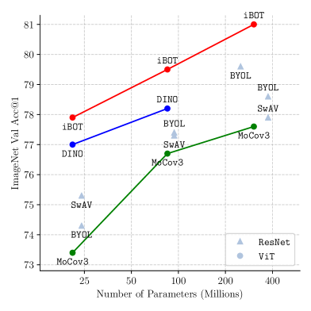

<figcaption>図1: ImageNet 上の線形プローブ精度。iBOT を他の教師なしベースラインと比較する。</figcaption>
</figure>

入力トークンの一部をランダムにマスクして再構成するマスク言語モデリング（MLM）は、言語モデルの人気のある事前学習パラダイムである。

MLM 事前学習された Transformer [15] は大容量モデルとデータセットへのスケーラビリティを実証し、言語タスクの de facto 標準となった。

しかしながら、最近コンピュータビジョン研究を革命化し始めた Vision Transformer（ViT）[43, 17] におけるその潜在能力は、ほとんど未探求のままである。

ビジョンにおける最も一般的な教師なし事前学習スキームの多くは、画像のグローバルビュー [12, 8] を扱い、MLM が局所トークンをモデル化するのとは対照的に、画像の内部構造を無視している。

本研究では、MLM の成功を継続することを試み、ViT のより良い訓練のためにマスク画像モデリング（MIM）を探求し、NLP に対するそれと同じく、標準的構成要素として機能できるようにする。

MLM における最も決定的な構成要素の 1 つは、言語を意味的に有意味なトークンに分割する**言語トークナイザ**（例: BERT における WordPiece [48]）である。

同様に、MIM の核心は**適切な視覚トークナイザの設計**にあり、それはマスクされたパッチを対象モデルの教師信号に変換する（図 2 参照）。

しかしながら、単語頻度の統計分析から自然に生じる言語の意味性 [39] とは異なり、画像の連続的性質のため、視覚的意味性はそう容易に抽出できない。

経験的に、視覚的意味性は、歪んだ画像ビューの類似性を強制するオンライン表現のブートストラップによって徐々に現れる [20, 18, 7]。

この特性は直観的に、対象モデルを訓練する前に、既製の意味的に豊かなトークナイザを最初に訓練する必要がある**多段階訓練パイプライン**を示唆する。

しかしながら、視覚的意味性の獲得はトークナイザと対象モデルの両方の共通の目的であるため、トークナイザと対象モデルを同時に最適化できる**単一段階訓練パイプライン**はさらなる探求を待っている。

先行研究は上記の挑戦に部分的に取り組んでいる。

いくつかの研究は視覚トークナイザとして恒等写像、つまり生の画素値を予測することを使用する [35, 3]。

そのようなパラダイムは意味抽象化に苦闘し、高周波の詳細をモデル化することに容量を浪費し、意味理解での競争力に欠ける性能をもたらす [29]。

最近、BEiT [4] は事前学習済み離散 VAE [36] をトークナイザとして使用することを提案している。

ある程度の抽象化を提供するが、離散 VAE は依然として局所詳細内の低レベル意味性しか捉えないことが見出される（表 9 で観察）。

さらに、トークナイザは固定モデルアーキテクチャと追加データセット [36] で**オフラインで**事前学習される必要があり、異なるドメインからのデータを用いて MIM を実行する適応性が潜在的に制限される。

<figure>

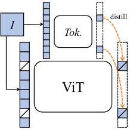

<figcaption>図2: マスク画像モデリング。I は画像、Tok. は視覚トークナイザを表す。</figcaption>
</figure>

このため、image BERT pre-training with Online Tokenizer の略である iBOT を提示する。これは、上記の挑戦を有利に扱うトークナイザを用いて MIM を実行する新しいフレームワークである。

われわれは、MIM を**知識蒸留（KD）**として定式化することによって iBOT を動機付け、トークナイザから知識を蒸留することを学習し、さらに**ツインティーチャーをオンライントークナイザとして用いた自己蒸留により MIM を実行する**ことを提案する。

対象ネットワークにはマスク画像が入力され、オンライントークナイザには元の画像が入力される。

目標は、対象ネットワークが各マスクパッチトークンをその対応するトークナイザ出力に回復することである。

オンライントークナイザは 2 つの主要な挑戦を自然に解決する。

一方では、トークナイザはクロスビュー画像のクラストークン上の類似性を強制することによって段階的に学習される**高レベルの視覚的意味性**を捕捉する。

他方では、トークナイザはモメンタム更新により MIM と同時に最適化されるため、前処理段階としての追加の訓練段階を必要としない。

オンライントークナイザは iBOT が特徴表現に対して卓越した性能を達成することを可能にする。

具体的には、iBOT は ViT-Base/16 を用いてそれぞれ ImageNet-1K 分類ベンチマークの $k$-NN、線形プローブ、ファインチューニングプロトコルで 77.1%、79.5%、84.0% を前進させ、これは先行最良結果より 1.0%、1.3%、0.4% 高い。

ImageNet-22K で事前学習されたとき、ViT-L/16 を用いた iBOT は線形プローブ精度 82.3% とファインチューニング精度 87.8% を達成し、これは先行最良結果より 1.0% と 1.8% 高い。

それを超えて、他のデータセットへの転移時、または半教師ありおよび教師なし分類設定下でも、その向上は有効である。

特に興味深いことに、画像のグローバルおよびローカルスケールでの認識をモデルが助けることができる、**創発する部位レベルの意味性**を同定した。

パッチトークンで学習された意味的パターン（BEiT [4] のオフライントークナイザでは十分に欠如しているもの）は、モデルの線形分類と一般的な画像破損に対する頑健性を前進させるのに役立つ。

下流タスクへの転移時、画像分類・物体検出・インスタンスセグメンテーション・セマンティックセグメンテーションに関連する下流タスクで、iBOT が非自明なマージンで先行手法を超えることを示す。

これらすべての証拠は、iBOT が言語と vision Transformer の間のマスク事前学習のギャップを大きく埋めたことを実証する。

---

## 2 Preliminaries（予備）

### 2.1 Masked Image Modeling as Knowledge Distillation（知識蒸留としてのマスク画像モデリング）

BERT における MLM と類似の定式化を取るマスク画像モデリング（MIM）は、いくつかの最近の研究 [4, 41] で提案されている。

具体的には、画像トークン列 $\bm{x} = \{\bm{x}_i\}_{i=1}^N$ に対し、MIM はまず予測比率 $r$ に従ってランダムなマスク $\bm{m} \in \{0, 1\}^N$ をサンプリングする（$N$ はトークン数）。

$m_i$ が 1 であるパッチトークン $\bm{x}_i$（$\tilde{\bm{x}} \triangleq \{\bm{x}_i | m_i = 1\}$ と表記）は、マスクトークン $\bm{e}_{\texttt{[MASK]}}$ に置換され、破損画像 $\hat{\bm{x}} \triangleq \{\hat{\bm{x}}_i | (1 - m_i)\bm{x}_i + m_i \bm{e}_{\texttt{[MASK]}}\}_{i=1}^N$ を生む。

MIM は、破損画像 $\hat{\bm{x}}$ からマスクトークン $\tilde{\bm{x}}$ を回復することである、つまり次を最大化する: $\log q_{\bm{\theta}}(\tilde{\bm{x}} | \hat{\bm{x}}) \approx \sum_{i=1}^N m_i \cdot \log q_{\bm{\theta}}(\bm{x}_i | \hat{\bm{x}})$、ここで $\approx$ は各マスクトークンが別々に再構成できるという独立性仮定で成立する。

BEiT [4] では、$q_{\bm{\theta}}$ はカテゴリ分布としてモデル化され、タスクは次を最小化することである:

$$
-\sum_{i=1}^{N} m_i \cdot P_{\bm{\phi}}(\bm{x}_i)^T \log P_{\bm{\theta}}(\hat{\bm{x}}_i),
$$

ここで $P(\cdot)$ は入力を $K$ 次元の確率分布に変換し、$\bm{\phi}$ は画像パッチを $K$ 個のカテゴリにクラスタリングし、各パッチトークンに分類を識別する one-hot エンコーディングを割り当てる離散 VAE [36] のパラメータである。

この損失は知識蒸留 [24] に類似して定式化されている、ここで知識は $\bm{\phi}$ でパラメータ化された事前固定トークナイザから $\bm{\theta}$ でパラメータ化された現在のモデルに蒸留される。

### 2.2 Self-Distillation（自己蒸留）

DINO [8] で最近提案された自己蒸留は、知識を事後分布 $P_{\bm{\phi}}(\bm{x})$ からではなく、モデル自身の過去の反復 $P_{\bm{\theta'}}(\bm{x})$ から蒸留し、識別的自己教師あり目的関数として定式化される。

訓練集合 $\mathcal{I}$ を与えられ、画像 $\bm{x} \sim \mathcal{I}$ が一様にサンプリングされ、それに対して 2 つのランダム拡張が適用され、2 つの歪んだビュー $\bm{u}$ と $\bm{v}$ をもたらす。

2 つの歪んだビューは次に teacher-student フレームワークを通って、[CLS] トークンから予測カテゴリ分布を得る: $\bm{v}_t^{\texttt{[CLS]}} = P_{\bm{\theta'}}^{\texttt{[CLS]}}(\bm{v})$ と $\bm{u}_s^{\texttt{[CLS]}} = P_{\bm{\theta}}^{\texttt{[CLS]}}(\bm{u})$。

知識は teacher から student へ、それらのクロスエントロピーを最小化することによって蒸留される:

$$
\mathcal{L}_{\texttt{[CLS]}} = -P_{\bm{\theta'}}^{\texttt{[CLS]}}(\bm{v})^T \log P_{\bm{\theta}}^{\texttt{[CLS]}}(\bm{u}).
$$

teacher と student は同じアーキテクチャを共有し、それはバックボーン $f$（例: ViT）と射影ヘッド $h^{\texttt{[CLS]}}$ から構成される。

student ネットワークのパラメータ $\bm{\theta}$ は teacher ネットワークのパラメータ $\bm{\theta'}$ に指数移動平均（EMA）される。

損失は $\bm{v}_s^{\texttt{[CLS]}}$ と $\bm{u}_t^{\texttt{[CLS]}}$ の間のもう一つのクロスエントロピー項と平均することで対称化される。

---

## 3 iBOT

式 (1) と式 (2) の類似した定式化を同定することによって、われわれの手法を動機付ける。

事前固定 $\bm{\phi}$ の代わりにオンライン $\bm{\theta'}$ でパラメータ化された視覚トークナイザが、こうして自然に生じる。

本節では、自己蒸留をトークン生成自己教師あり目的関数として定式化し、自己蒸留を介して MIM を実行する iBOT を提示する。

図 3 で iBOT のフレームワークを示し、Appendix A で擬似コードを実証する。

第 3.2 節で、アーキテクチャと事前学習設定を簡潔に紹介する。

### 3.1 Framework（フレームワーク）

<figure>


<figcaption>図3: iBOT フレームワークの概要、オンライントークナイザを用いたマスク画像モデリングを実行する。画像 x の 2 つのビュー u と v が与えられ、各ビューは teacher ネットワーク h_t ∘ f_t と student ネットワーク h_s ∘ f_s を通る。iBOT は 2 つの損失を最小化する。最初の損失 L_[CLS] はクロスビュートークン間の自己蒸留。第二の損失 L_MIM は in-view パッチトークン間の自己蒸留で、student ネットワークではいくつかのトークンがマスクされ e_[MASK] で置換される。目的は teacher ネットワークの出力を教師としてマスクされたトークンを再構成すること。</figcaption>
</figure>

まず、2 つの拡張ビュー $\bm{u}$ と $\bm{v}$ に対してブロック単位マスキング [4] を実行し、それらのマスクビュー $\hat{\bm{u}}$ と $\hat{\bm{v}}$ を得る。

簡単のため $\hat{\bm{u}}$ を例に取ると、student ネットワークはマスクビュー $\hat{\bm{u}}$ に対してパッチトークンの射影 $\hat{\bm{u}}_s^{\mathrm{patch}} = P_{\bm{\theta}}^{\mathrm{patch}}(\hat{\bm{u}})$ を出力し、teacher ネットワークは非マスクビュー $\bm{u}$ に対してパッチトークンの射影 $\bm{u}_t^{\mathrm{patch}} = P_{\bm{\theta'}}^{\mathrm{patch}}(\bm{u})$ を出力する。

ここで iBOT における MIM の訓練目的関数を次のように定義する:

$$
\mathcal{L}_{\mathrm{MIM}} = -\sum_{i=1}^N m_i \cdot P_{\bm{\theta'}}^{\mathrm{patch}}(\bm{u}_i)^T \log P_{\bm{\theta}}^{\mathrm{patch}}(\hat{\bm{u}}_i).
$$

損失は $\hat{\bm{v}}_s^{\mathrm{patch}}$ と $\bm{v}_t^{\mathrm{patch}}$ の間のもう一つの CE 項と平均することで対称化される。

teacher ネットワークのバックボーンと射影ヘッド $h_t^{\mathrm{patch}} \circ f_t$ は、したがって、各マスクパッチトークンに対するオンライントークン分布を生成する**視覚トークナイザ**である。

iBOT で使用されるトークナイザは MIM 目的関数と同時に学習可能で、追加段階で事前学習される必要はない。そのおまけの特徴として、ドメイン知識が指定データセットに固定されるのではなく、現在のデータセットから蒸留されうる。

オンライントークナイザが意味的に有意味であることを保証するため、クロスビュー画像の [CLS] トークンに対して自己蒸留を実行し、ブートストラップによって視覚的意味性が得られるようにする。これは自己教師あり手法の多数 [20, 18, 8] が達成していることである。

実際には、iBOT は DINO [8] で提案された式 (2) の $\mathcal{L}_{\texttt{[CLS]}}$ で動作する、ただし今は student ネットワークの入力として $\bm{u}_s^{\texttt{[CLS]}}$ ではなく $\hat{\bm{u}}_s^{\texttt{[CLS]}}$ を持つ。

[CLS] トークンへの自己蒸留から獲得される意味抽象化能力をさらに借りるため、[CLS] トークンとパッチトークンの射影ヘッドのパラメータを共有する、つまり $h_s^{\texttt{[CLS]}} = h_s^{\mathrm{patch}}$、$h_t^{\texttt{[CLS]}} = h_t^{\mathrm{patch}}$。

経験的に、これが分離したヘッドを使うよりも良い結果を生むことを発見する。

トークン化された単語の意味性がほぼ確実であるのとは異なり、画像パッチはその意味的意味において曖昧である。

したがって、one-hot 離散化としてのトークン化は画像にとって sub-optimal となりうる。

iBOT では、教師信号として one-hot トークン ID の代わりにソフトマックス後のトークン分布を使用する。これは表 18 に示すように iBOT 事前学習で重要な役割を果たす。

### 3.2 Implementation（実装）

### Architecture（アーキテクチャ）

異なる量のパラメータを持つ Vision Transformer [17] と Swin Transformer [30]、すなわち ViT-S/16、ViT-B/16、ViT-L/16、Swin-T/{7,14} をバックボーン $f$ として使用する。

ViT については、/16 はパッチサイズが 16 であることを示す。Swin については、/{7,14} はウィンドウサイズが 7 または 14 であることを示す。

Transformer を 224 サイズの画像で事前学習しファインチューニングし、したがってパッチトークンの総数は 196 である。

射影ヘッド $h$ は DINO [8] に従う $\ell_2$ 正規化ボトルネックを持つ 3 層 MLP である。

[CLS] トークンでの蒸留で得られる意味性がパッチトークンの MIM 訓練を助けることを考慮し、視覚的意味性を獲得するためのより良い設計に向けて、射影ヘッド $h^{\texttt{[CLS]}}$ と $h^{\mathrm{patch}}$ の間で異なる共有戦略を研究した。

経験的に、ヘッド全体を共有することが最良の性能を促すことを発見する。

共有ヘッドの出力次元を 8192 に設定する。

### Pre-Training Setup（事前学習設定）

既定で iBOT を ImageNet-1K [14] 訓練集合上で、AdamW [31] 最適化器とバッチサイズ 1024 で事前学習する。

ViT-S/16 で 800 エポック、ViT-B/16 で 400 エポック、ViT-L/16 で 250 エポック、Swin-T/{7,14} で 300 エポック iBOT を事前学習する。

ImageNet-22K 訓練集合でも ViT-B/16 で 80 エポック、ViT-L/16 で 50 エポック事前学習する。

学習率は最初の 10 エポックの間、合計バッチサイズでスケールされたベース値まで線形に立ち上げられる: lr = $5e^{-4} \times$ batch_size / 256。

ランダム MIM を使用し、予測比率 $r$ は確率 0.5 で 0、確率 0.5 で範囲 [0.1, 0.5] から一様にサンプリングされる。

$\mathcal{L}_{\texttt{[CLS]}}$ と $\mathcal{L}_{\mathrm{MIM}}$ をスケーリングなしで合計する。

---

## 4 Experiment（実験）

最初に iBOT を下流タスクに転移し、先行研究で採用された標準評価プロトコルに従う、その詳細は Appendix C で述べる。

次に iBOT で事前学習された Transformer のいくつかの興味深い特性を研究する。

最後に、iBOT の決定的構成に関する短いアブレーション研究を提供する。

### 4.1 Classification on ImageNet-1K（ImageNet-1K での分類）

ImageNet-1K で 5 つの分類プロトコルを考慮する: $k$-NN、線形プローブ、ファインチューニング、半教師あり学習、教師なし学習。

**表1**: ImageNet-1K での $k$-NN と線形プローブ。† は selective kernel を使用。‡ は ImageNet-22K での事前学習を示す。

| Method | Arch. | Par. | im/s | Epo. | $k$-NN | Lin. |
|---|---|---|---|---|---|---|
| *SSL big ResNets* | | | | | | |
| MoCov3 | RN50 | 23 | 1237 | 1600 | - | 74.6 |
| SwAV | RN50 | 23 | 1237 | 2400 | 65.7 | 75.3 |
| DINO | RN50 | 23 | 1237 | 3200 | 67.5 | 75.3 |
| BYOL | RN200w2 | 250 | 123 | 2000 | 73.9 | 79.6 |
| SCLRv2 | RN152w3† | 794 | 46 | 2000 | 73.1 | 79.8 |
| *SSL Transformers* | | | | | | |
| MoCov3 | ViT-S/16 | 21 | 1007 | 1200 | - | 73.4 |
| MoCov3 | ViT-B/16 | 85 | 312 | 1200 | - | 76.7 |
| SwAV | ViT-S/16 | 21 | 1007 | 2400 | 66.3 | 73.5 |
| DINO | ViT-S/16 | 21 | 1007 | 3200 | 74.5 | 77.0 |
| DINO | ViT-B/16 | 85 | 312 | 1600 | 76.1 | 78.2 |
| EsViT | Swin-T/7 | 28 | 726 | 1200 | 75.7 | 78.1 |
| EsViT | Swin-T/14 | 28 | 593 | 1200 | 77.0 | 78.7 |
| **iBOT** | ViT-S/16 | 21 | 1007 | 3200 | 75.2 | 77.9 |
| **iBOT** | Swin-T/7 | 28 | 726 | 1200 | 75.3 | 78.6 |
| **iBOT** | Swin-T/14 | 28 | 593 | 1200 | 76.2 | 79.3 |
| **iBOT** | ViT-B/16 | 85 | 312 | 1600 | **77.1** | **79.5** |
| **iBOT** | ViT-L/16 | 307 | 102 | 1200 | **78.0** | **81.0** |
| **iBOT**‡ | ViT-L/16 | 307 | 102 | 200 | 72.9 | **82.3** |

**表2**: ImageNet-1K でのファインチューニング。

| Method | Arch. | Epo. | Acc. |
|---|---|---|---|
| Rand. | ViT-S/16 | - | 79.9 |
| MoCov3 | ViT-S/16 | 600 | 81.4 |
| DINO | ViT-S/16 | 3200 | 82.0 |
| **iBOT** | ViT-S/16 | 3200 | **82.3** |
| Rand. | ViT-B/16 | - | 81.8 |
| MoCov3 | ViT-B/16 | 600 | 83.2 |
| BEiT | ViT-B/16 | 800 | 83.4 |
| DINO | ViT-B/16 | 1600 | 83.6 |
| **iBOT** | ViT-B/16 | 1600 | **84.0** |
| MoCov3 | ViT-L/16 | 600 | 84.1 |
| **iBOT** | ViT-L/16 | 1000 | **84.8** |
| BEiT | ViT-L/16 | 800 | 85.2 |

**表3**: ImageNet-1K でのファインチューニング。ImageNet-22K での事前学習。

| Method | Arch. | Epo. | Acc. |
|---|---|---|---|
| BEiT | ViT-B/16 | 150 | 83.7 |
| **iBOT** | ViT-B/16 | 320 | **84.4** |
| BEiT | ViT-L/16 | 150 | 86.0 |
| **iBOT** | ViT-L/16 | 200 | **86.6** |
| **iBOT** | ViT₅₁₂-L/16 | 200 | **87.8** |

### $k$-NN and Linear Probing（k-NN と線形プローブ）

事前学習特徴量の品質を評価するため、凍結表現上で $k$ 近傍（$k$-NN）分類器または線形分類器のいずれかを使用する。

DINO [8] の評価プロトコルに従う。

$k$-NN 評価では、異なる最近傍数を掃引する。

線形評価では、異なる学習率を掃引する。

表 1 で、われわれの手法は ViT-S/16 で線形プローブ精度 77.9%、ViT-B/16 で線形プローブ精度 79.5%、ViT-L/16 で $k$-NN 精度 78.0% と線形プローブ精度 81.0% に達し、最先端性能を達成する。

Swin-T/{7,14} を用いて、iBOT はそれぞれ線形プローブ精度 78.6% と 79.3% を達成する。

ViT-L/16 と事前学習データとして ImageNet-22K を使用すると、iBOT はさらに線形プローブ精度 82.3% を達成し、EsViT [26] による Swin-B/14 での 81.3% という先行最先端を超える。

ViT-B/16 での線形プローブ精度 79.5% は、SimCLRv2 with RN152 (3×)† の 79.8% に匹敵するが、10 倍少ないパラメータである。

DINO に対する性能利得がより多くのパラメータで大きくなる（ViT-S で 0.9% 対 ViT-B で 1.3%）ことを強調し、iBOT がより大きなモデルにより**スケーラブル**であることを示唆する。

### Fine-Tuning（ファインチューニング）

ImageNet-1K でのファインチューニングを研究し、Transformer のための自己教師あり手法とその教師ありベースライン（Rand.）[43] との比較に焦点を当てる。

表 2 に示すように、iBOT は ViT-S/16、ViT-B/16、ViT-L/16 でそれぞれ 82.3%、84.0%、84.8% の top-1 精度を達成する。

表 3 に示すように、ImageNet-22K で事前学習された iBOT は ViT-B/16 と ViT-L/16 でそれぞれ 84.4% と 86.6% の top-1 精度を達成し、ImageNet-22K で事前学習された BEiT を 0.7% と 0.6% 上回る。

画像サイズ 512 でファインチューニングされたとき、87.8% の精度を達成する。

ViT-L/16 で、iBOT は 1K データを使う BEiT より 0.4% 悪いが、22K データを使うと 0.6% 良いことに注意する。

これは iBOT がより大きなモデルを訓練するためにより多くのデータを必要とすることを示唆する。

**表4**: ImageNet-1K での半教師あり学習。1% と 10% はラベル分数を示す。SD は自己蒸留を示す。

| Method | Arch. | 1% | 10% |
|---|---|---|---|
| SimCLRv2 | RN50 | 57.9 | 68.1 |
| BYOL | RN50 | 53.2 | 68.8 |
| SwAV | RN50 | 53.9 | 70.2 |
| SimCLRv2+SD | RN50 | 60.0 | 70.5 |
| DINO | ViT-S/16 | 60.3 | 74.3 |
| **iBOT** | ViT-S/16 | **61.9** | **75.1** |

**表5**: ImageNet-1K での教師なし学習。† は凍結特徴量での $k$-means クラスタリングを示す。

| Method | Arch. | ACC | ARI | NMI | FMI |
|---|---|---|---|---|---|
| Self-label† | RN50 | 30.5 | 16.2 | 75.4 | - |
| InfoMin† | RN50 | 33.2 | 14.7 | 68.8 | - |
| SCAN | RN50 | 39.9 | 27.5 | 72.0 | - |
| DINO | ViT-S/16 | 41.4 | 29.8 | 76.8 | 32.8 |
| **iBOT** | ViT-S/16 | **43.4** | **32.8** | **78.6** | **35.6** |

### Semi-Supervised and Unsupervised Learning（半教師ありと教師なし学習）

半教師あり学習について、教師なし事前学習・教師ありファインチューニングのパラダイムに従う手法との比較に焦点を当てる。

表 4 に示すように、iBOT は 1% と 10% データを使用してそれぞれ DINO を 1.6% と 0.8% 前進させ、より高いラベル効率を示唆する。

教師なし学習について、精度（ACC）、調整ランダム指標（ARI）、正規化相互情報量（NMI）、Fowlkes-Mallows 指標（FMI）を含む標準評価指標を使用する。

われわれの手法を SimCLRv2 [10]、Self-label [2]、InfoMin [42]、SCAN [44] と比較する。

表 5 に示すように、32.8% NMI を達成し、先行最先端を 1.8% 上回り、MIM がモデルが大域的スケールでより強い視覚的意味性を学習することを助けることを示唆する。

### 4.2 Downstream Tasks（下流タスク）

**表6**: COCO での物体検出（Det.）& インスタンスセグメンテーション（ISeg.）と、ADE20K でのセマンティックセグメンテーション（Seg.）。

(ViT-S/16)

| Method | Arch. | Param. | AP^b | AP^m | mIoU |
|---|---|---|---|---|---|
| Sup. | Swin-T | 29 | 48.1 | 41.7 | 44.5 |
| MoBY | Swin-T | 29 | 48.1 | 41.5 | 44.1 |
| Sup. | ViT-S/16 | 21 | 46.2 | 40.1 | 44.5 |
| **iBOT** | ViT-S/16 | 21 | **49.4** | **42.6** | **45.4** |

(ViT-B/16)

| Method | AP^b | AP^m | Seg.† mIoU | Seg. mIoU |
|---|---|---|---|---|
| Sup. | 49.8 | 43.2 | 35.4 | 46.6 |
| BEiT | 50.1 | 43.5 | 27.4 | 45.8 |
| DINO | 50.1 | 43.4 | 34.5 | 46.8 |
| **iBOT** | **51.2** | **44.2** | **38.3** | **50.0** |

### Object Detection and Instance Segmentation on COCO（COCO での物体検出とインスタンスセグメンテーション）

物体検出とインスタンスセグメンテーションは同時のオブジェクト位置と分類を必要とする。

COCO データセット [28] でバウンディングボックスとインスタンスマスクを同時に生成する Cascade Mask R-CNN [5, 19] を考慮する。

いくつかの最近の研究 [30, 45] は密下流タスクに適した Vision Transformer を提案している。

比較のため、ViT-S/16 と近似的パラメータ数を共有する教師あり Swin-T [30] とその自己教師あり対応物 MoBY [52] の結果を表 6 に含める。

iBOT は ViT-S の AP^b を 46.2 から 49.4、AP^m を 40.1 から 42.6 に改善し、教師あり Swin-T とその自己教師あり対応物の両方を非自明なマージンで超える。

ViT-B/16 を用いて、iBOT は AP^b 51.2 と AP^m 44.2 を達成し、先行最良結果を大きなマージンで超える。

### Semantic Segmentation on ADE20K（ADE20K でのセマンティックセグメンテーション）

セマンティックセグメンテーションはピクセルレベル分類問題として見ることができる。

ADE20K データセット [56] で 2 つのセグメンテーション設定を主に考慮する。

第一に、分類の線形評価プロトコルに類似して、固定パッチ特徴量で評価し、線形層のみをファインチューニングする。これにより表現品質のより明示的な比較が得られる。

第二に、UPerNet [51] のタスク層を使用し、ネットワーク全体をファインチューニングする。

表 6 から、iBOT が ViT-S/16 で教師ありベースラインを mIoU で大きなマージン 0.9 で前進させ、Swin-T を超えることが見て取れる。

ViT-B/16 で、iBOT は UperNet を用いて先行最良手法 DINO を mIoU で 3.2 前進させる。

線形ヘッドを使う BEiT の性能低下に気づき、BEiT の特徴量が局所意味性を欠くことを示す。

後ほど分析するように、強い局所意味性の特性は、線形ヘッドを用いた教師ありベースラインと比較して 2.9 mIoU の利得を誘発する。

**表7**: 異なるデータセットでのファインチューニングによる転移学習。

(ViT-S/16)

| Method | Cif₁₀ | Cif₁₀₀ | iNa₁₈ | iNa₁₉ | Flwrs | Cars |
|---|---|---|---|---|---|---|
| Rand. | 99.0 | 89.5 | 70.7 | 76.6 | 98.2 | 92.1 |
| BEiT | 98.6 | 87.4 | 68.5 | 76.5 | 96.4 | 92.1 |
| DINO | 99.0 | 90.5 | 72.0 | 78.2 | 98.5 | 93.0 |
| **iBOT** | **99.1** | **90.7** | **73.7** | **78.5** | **98.6** | **94.0** |

(ViT-B/16)

| Method | Cif₁₀ | Cif₁₀₀ | iNa₁₈ | iNa₁₉ | Flwrs | Cars |
|---|---|---|---|---|---|---|
| Rand. | 99.0 | 90.8 | 73.2 | 77.7 | 98.4 | 92.1 |
| BEiT | 99.0 | 90.1 | 72.3 | 79.2 | 98.0 | 94.2 |
| DINO | 99.1 | 91.7 | 72.6 | 78.6 | 98.8 | 93.0 |
| **iBOT** | **99.2** | **92.2** | **74.6** | **79.6** | **98.9** | **94.3** |

### Transfer Learning（転移学習）

転移学習を研究し、ImageNet-1K で事前学習しいくつかのより小さなデータセットでファインチューニングする。

[17] で使用される訓練レシピとプロトコルに従う。

結果を表 7 に実証する。

いくつかのデータセット（例: CIFAR10、CIFAR100、Flowers、Cars）での結果はほぼ頭打ちであるが、iBOT は他の SSL フレームワークに対して一貫して有利に機能し、最先端の転移結果を達成する。

iNaturalist18 や iNaturalist19 のようなより大きなデータセットでより大きな性能利得を観察し、結果がまだ飽和から遠いことを示す。

より大きなモデルでは、典型的に DINO と比較してより大きな性能利得を得ることも発見する（例: iNaturalist18 で ViT/S-16 で 1.7% 対 ViT-B/16 で 2.0%、iNaturalist19 で ViT/S-16 で 0.3% 対 ViT-B/16 で 1.0%）。

### 4.3 Properties of ViT trained with MIM（MIM で訓練された ViT の特性）

前節では、様々なタスクとデータセットでの iBOT の優先性を示した。

iBOT 事前学習された Vision Transformer の強みを明らかにするため、いくつかの側面からその特性を分析する。

#### 4.3.1 Discovering the Pattern Layout of Image Patches（画像パッチのパターンレイアウトの発見）

<figure>


<figcaption>図4: パッチトークンのパターンレイアウト。左 2 つの図は部位の意味性を共有するパターン（車のヘッドライト、犬の耳）を示す。右 2 つの図は部位のテクスチャを共有するパターン（縞模様の曲面）を示す。</figcaption>
</figure>

### What Patterns Does MIM Learn?（MIM はどんなパターンを学習するか？）

自己蒸留に使用される射影ヘッドからの出力は、パッチトークンに対する確率分布を描く。

MIM がどんなパターンを学習に誘導するかを理解する助けに、いくつかのパターンレイアウトを可視化する。

800 エポック事前学習された ViT-S/16 を使用し、ImageNet-1K 検証集合で最高信頼度を持つ上位 36 パッチを可視化する。

各 16×16 パッチ（オレンジで色付け）に対して 5× の文脈を可視化する。

高レベル意味性と低レベル詳細の両方の創発を観察する。

図 4 に示すように、いくつかのパッチは明確な意味的意味でグループ化される、例: ヘッドライトと犬の耳。

そのような挙動は BEiT [4] で使用されるオフライントークナイザと明確な対比を成し、これは図 16 に示すようにほとんど低レベル詳細を内包する。

高レベル意味性を共有するパッチパターンのほかに、低レベルテクスチャを担当するクラスタも観察し、学習された部位パターンの多様性を示す。

先行研究 [8, 4] との比較とより多くのパターンレイアウトの可視化は Appendix G.1 で提供する。

### How Does MIM Help Image Recognition?（MIM はどう画像認識を助けるか？）

より良い部位意味性の特性が画像認識を助けることができることを例示するため、部位単位線形分類を使用してパッチトークンと [CLS] トークンの表現の関係を研究する。

具体的には、最高 $k$ 個の自己注意スコアを持つ $k$ パッチトークンを平均する。

結果を図 5 に実証する。

[CLS] トークンを用いた標準設定で DINO と iBOT の性能ギャップはわずか 0.9%（77.9% 対 77.0%）であるが、パッチ表現を直接使用するとき iBOT が DINO を上回ることを観察する。

上位 56 パッチトークンを使用すると最適な結果が得られ、iBOT は DINO より 5.9% 高い。

より少ないパッチトークンを使用すると性能ギャップはより顕著になる。

最高自己注意スコアを持つパッチトークンのみを使用すると、iBOT は 17.9% 前進する。

これらの結果は、iBOT のパッチトークン表現での多くの意味情報を明らかにし、モデルが局所詳細の損失により頑健になり、画像レベル認識のその性能をさらに押し上げるのに役立つ。

#### 4.3.2 Discriminative Parts in Self-Attention Map（自己注意マップでの識別的部位）

<figure>

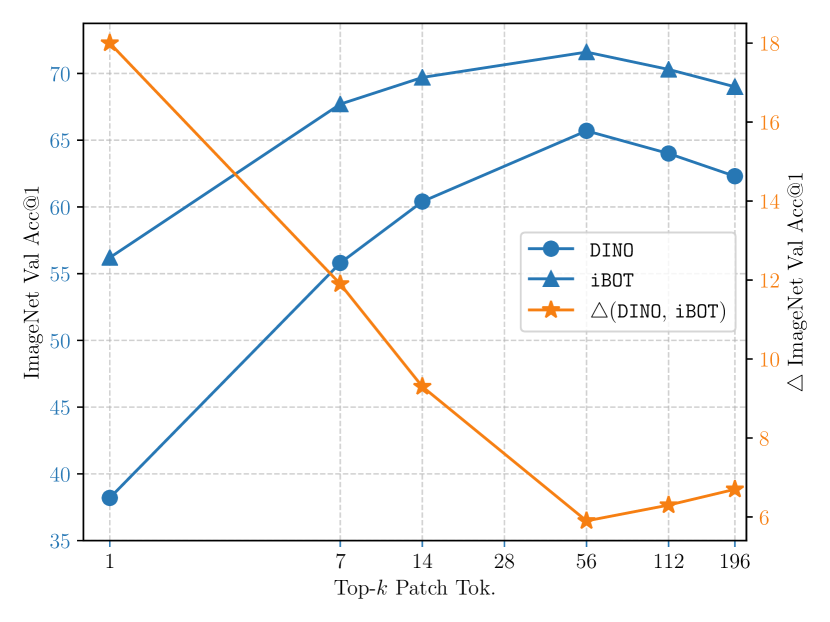

<figcaption>図5: 部位単位線形プローブ精度。最高注意スコアを持つ上位 k トークンが分類のために平均される。</figcaption>
</figure>

分析するため、ViT-S/16 で自己注意マップを可視化する。

[CLS] トークンをクエリとして選び、図 6 に示すように、最後の層の異なるヘッドからの注意マップを異なる色で可視化する。

特に興味深いことに、iBOT が異なるオブジェクト、または 1 つのオブジェクトの異なる部分を分離する確固たる能力を示すことを示す。

例えば、一番左の図で、iBOT が木の枝から鳥をかなり区別することを観察する。

また、iBOT はオブジェクトの識別的部分（例: 車のホイール、鳥のくちばし）に主に焦点を当てる。

これらの特性は、特にオブジェクト遮蔽や妨害インスタンスを伴う複雑なシナリオで、iBOT が画像認識で卓越するために決定的である。

これらの特性は MIM がもたらす固有の強みではなく、DINO でも類似の挙動を観察するが、Appendix G.2 で iBOT が一般により良い可視化結果を与えることを示す。

#### 4.3.3 Robustness（頑健性）

**表8**: 背景変更、遮蔽、アウトオブディストリビューション例に対する事前学習モデルの頑健性評価。

| Method | O.F. | M.S. | M.R. | M.N. | N.F. | O.BB. | O.BT. | IN-9 | S.5 | NS.5 | IN-A | IN-C↓ | IN |
|---|---|---|---|---|---|---|---|---|---|---|---|---|---|
| DINO | 89.2 | 89.2 | 80.4 | 78.3 | 52.0 | 21.9 | **18.4** | 96.4 | 64.7 | 42.0 | 12.3 | 51.7 | 77.0 |
| **iBOT** | **90.9** | **89.7** | **81.7** | **80.3** | **53.5** | **22.7** | 17.4 | **96.8** | **65.9** | **43.4** | **13.8** | **48.1** | **77.9** |

MIM 目的関数がもたらす上記の特性は、モデルの稀な例に対する頑健性を改善できる。

3 つの側面で頑健性を定量的にベンチマークする: 背景変更、遮蔽、アウトオブディストリビューション例、800 エポック事前学習されその後 100 エポック線形評価された ViT-S/16 で。

結果を表 8 に示す。

背景変更について、7 種類の変更下の画像を研究する、詳細は Appendix D。

iBOT は O.BT. を除き背景変更に対してより頑健である。

遮蔽について、[33] に従って情報損失率 0.5 で顕著および非顕著パッチドロップでの線形精度を研究する。

iBOT は両設定下でより小さな性能低下を持つ。

アウトオブディストリビューション例について、ImageNet-A [23] での自然敵対的例と ImageNet-C [22] での画像破損を研究する。

iBOT は ImageNet-A でより高い精度と ImageNet-C でより小さな平均破損エラー（mCE）を持つ。

### 4.4 Ablation Study on Tokenizer（トークナイザのアブレーション研究）

本節では、予測比率 $r = 0.3$ でマルチクロップ拡張なしで 300 エポック事前学習された ViT-S/16 を使用して、意味的に有意味なトークナイザを使用することの重要性をアブレートする。

追加のアブレーションは Appendix E で与えられる。

iBOT は視覚的意味性を獲得するため、クロスビュー画像での [CLS] トークン上の自己蒸留（$\mathcal{L}_{\texttt{[CLS]}}$）で動作する。

検証のため、$\mathcal{L}_{\texttt{[CLS]}}$ なしで MIM を実行する、または代替モデルを視覚トークナイザとして実行する実験を行う。

具体的には、$\circ$ は独立 DINO、$\triangle$ は事前学習済み DALL-E エンコーダ [36] を表す。

**表9**: 意味的に有意味なトークン化の設計選択の効果。

| Method | $\mathcal{L}_{MIM}$ | $\mathcal{L}_{[CLS]}$ | SH | $k$-NN | Lin. | Fin. |
|---|---|---|---|---|---|---|
| **iBOT** | ✓ | ✓ | ✓ | **69.1** | **74.2** | 81.5 |
|  | ✓ | ✓ | ✗ | 69.0 | 73.8 | 81.5 |
|  | ✓ | ✗ | - | 9.5 | 29.8 | 79.4 |
|  | ∘ | ✗ | - | 44.3 | 60.0 | 81.7 |
| BEiT | △ | ✗ | - | 6.9 | 23.5 | 81.4 |
| DINO | ✗ | ✓ | - | 67.9 | 72.5 | 80.6 |
| BEiT + DINO | △ | ✓ | - | 48.0 | 62.7 | 81.2 |

> ∘: 独立 DINO（マルチクロップなし、300 エポック）
> △: 事前学習済み DALL-E エンコーダ

$\mathcal{L}_{\texttt{[CLS]}}$ なしで MIM を実行すると 9.5% の $k$-NN 精度と 29.8% の線形精度という望ましくない結果になり、視覚的意味性が MIM のみではほとんど得られないことを示す。

独立 DINO を視覚トークナイザとして意味性が現れる一方、まだ良好な結果に達するには程遠い（$k$-NN 精度 44.3% 対 69.1%）。

iBOT を DINO と BEiT のマルチタスキング（DINO+BEiT）と比較すると、自己蒸留によって獲得された意味性と視覚トークナイザのものを統合する強みが見える、線形プローブで 11.5% の前進とファインチューニングで 0.3%。

さらに、[CLS] トークンとパッチトークンのために**共有射影ヘッド（SH）**を使用することで性能が向上することを経験的に観察し、これは [CLS] トークンで獲得された意味性を MIM に共有する。

---

## 5 Related Work（関連研究）

### Visual Representation Learning（視覚表現学習）

ほとんどの自己教師あり手法は画像の拡張不変性を仮定し、モデルの崩壊を避けつつ 1 つの画像の歪んだビュー間で類似性を強制することによってそれを達成する。

崩壊回避は、負例を伴うノイズ対比推定 [49, 20, 9] によって、非対称ネットワーク [18, 11] を導入することによって、または画像分布のチャネル分布が一様であるとともに one-hot であることを明示的に強制すること [7, 1, 8] によって達成できる。

実際、一様分布と one-hot を同時に強制するアイデアは、クラスタ割当が自然にこれら 2 つの要件を満たすクラスタリングによる表現学習を実行する初期の研究 [6, 7, 54] から隠れている。

他の手法は、画像ジグソーパズル [34, 47]、回転予測 [25]、相対位置予測 [16] を解くことで、手作りの事前テキストタスクに依拠し、画像表現は代わりに画像拡張を認識すべきと仮定する。

### Masked Prediction in Images（画像でのマスク予測）

マスクされた画像部分を予測することは、オートエンコーディングのアイデアに基づく人気のある自己教師あり事前テキストタスクで、以前は生の画素を回復することで [35, 3, 27]、またはマスク対比学習で [21, 55] 達成されてきた。

最近、視覚トークナイザとして離散 VAE [38, 36] を伴う MIM [4, 41] に定式化されている。

NLP における MLM の対応物として、MIM はマスク予測をトークナイザから出力されるラベルで監督される分類問題に緩和し、高周波詳細への過度の焦点の問題を緩和する。

並行して、マスク画像予測はマルチモダリティ、つまり vision-language 表現学習の分野で探求されている。

これらの手法はグローバル画像ではなく局所領域上で動作するため、関心領域を提案するために事前学習済み検出モデル、つまり Faster-RCNN [37] に依拠する。

[40, 32, 13] は検出モデルから出力されるカテゴリ分布をground truth として用いてマスク領域分類を実行する。

---

## 6 Conclusion（結論）

本研究では、Vision Transformer のための BERT 様事前学習を研究し、意味的に有意味な視覚トークナイザの重要性を強調する。

オンライントークナイザを用いて自己蒸留を介して MIM を実行する自己教師ありフレームワーク iBOT を提示し、分類・物体検出・インスタンスセグメンテーション・セマンティックセグメンテーションに関連する下流タスクで最先端の結果を達成する。

特に興味深いことに、MIM で訓練されたモデルの**創発する部位レベル意味性**を同定し、これは認識精度だけでなく一般的な画像破損に対する頑健性にも役立つ。

将来、iBOT をより大きなデータセット（例: ImageNet-22K）またはより大きなモデルサイズ（例: ViT-L/16 と ViT-H/16）にスケールアップし、MIM が Vision Transformer を未ラベルの野生データにより多くスケーラブルにするのに役立つかどうかを調査する計画である。

**Acknowledgement**: Tao Kong は corresponding author。Feng Wang, Rufeng Zhang, Zongwei Zhou に有益な議論への感謝を述べる。Mathilde Caron, Julien Mairal, Hugo Touvron に DINO の詳細を共有してくれたことに感謝する。Li Dong, Hangbo Bao に BEiT の詳細を共有してくれたことに感謝する。

---

## Appendix A: Pseudocode（擬似コード）

**Algorithm 1**: iBOT PyTorch 風擬似コード（マルチクロップ拡張なし）

```python
# 入力:
# g_s, g_t: student と teacher のネットワーク
# C, C': [CLS] トークンとパッチトークンの center
# τ_s, τ_t: student と teacher の [CLS] トークン用温度
# τ'_s, τ'_t: student と teacher のパッチトークン用温度
# l: ネットワーク momentum 率
# m, m': [CLS] トークンとパッチトークンの center momentum 率

g_t.params = g_s.params
for x in loader:
    u, v = augment(x), augment(x)  # ランダムビュー
    u_hat, m_u = blockwise_mask(u)  # ランダムブロック単位マスキング
    v_hat, m_v = blockwise_mask(v)

    # student 出力: [n, K], [n, S², K]
    u_hat_s_cls, u_hat_s_patch = g_s(u_hat, return_all_tok=True)
    v_hat_s_cls, v_hat_s_patch = g_s(v_hat, return_all_tok=True)

    # teacher 出力（マスクなし入力）
    u_t_cls, u_t_patch = g_t(u, return_all_tok=True)
    v_t_cls, v_t_patch = g_t(v, return_all_tok=True)

    # [CLS] トークン損失（クロスビュー）
    L_cls = H(u_hat_s_cls, v_t_cls, C, τ_s, τ_t) / 2 \
          + H(v_hat_s_cls, u_t_cls, C, τ_s, τ_t) / 2

    # MIM 損失（マスクされたパッチのみ）
    L_mim = (m_u * H(u_hat_s_patch, u_t_patch, C', τ'_s, τ'_t)).sum(dim=1) / m_u.sum(dim=1) / 2 \
          + (m_v * H(v_hat_s_patch, v_t_patch, C', τ'_s, τ'_t)).sum(dim=1) / m_v.sum(dim=1) / 2

    (L_cls.mean() + L_mim.mean()).backward()

    update(g_s)  # SGD
    g_t.params = l * g_t.params + (1 - l) * g_s.params  # EMA
    C  = m  * C  + (1 - m)  * cat([u_t_cls,   v_t_cls]).mean(dim=0)
    C' = m' * C' + (1 - m') * cat([u_t_patch, v_t_patch]).mean(dim=(0, 1))

def H(s, t, c, τ_s, τ_t):
    t = t.detach()  # stop gradient
    s = softmax(s / τ_s, dim=1)
    t = softmax((t - c) / τ_t, dim=1)  # center + sharpen
    return -(t * log(s)).sum(dim=-1)
```

---

## Appendix B: Multi-Crop（マルチクロップ）

最近のいくつかの最先端手法 [8, 7] とともに iBOT も、マルチクロップ拡張に依拠する。

初期実験で、マルチクロップ拡張の直接使用が精度を低下させる不安定性の問題につながることを発見する。

これらの結果が、マスク画像と非マスク画像の分布不一致に帰せられ、iBOT フレームワークの最小限の変更で解決できることを明らかにする。

<figure>

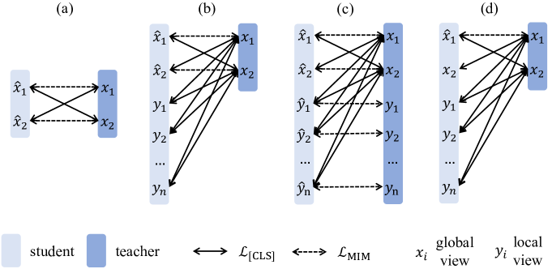

<figcaption>図7: マルチクロップ拡張ありまたはなしの iBOT の計算パイプライン。(a) マルチクロップ拡張なしの iBOT。(b), (c), (d) はマルチクロップ拡張ありの 3 つのパイプライン。(b) は local crops に MIM を実行しない、(c) はすべての crops に MIM を実行する。(d) は 2 つの global crops の 1 つのみに MIM を実行する。iBOT はランダム MIM の (b) を使用する。</figcaption>
</figure>

<figure>

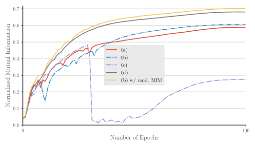

<figcaption>図8: 異なるマルチクロップ戦略の訓練曲線。</figcaption>
</figure>

### Stability of MIM Pre-trained with Multi-Crop（マルチクロップで事前学習された MIM の安定性）

最初に、訓練不安定性が起こるいくつかの実践を披露する、図 7 に示される。

不安定性を明らかにするため、図 8 に示すように各エポックの訓練中の NMI 曲線をモニタする。

最も直観的なアイデアは (b) または (c) のように計算することである。

(b) では、MIM は global crops のみで実行される。

このパイプラインは訓練中不安定で、NMI 訓練曲線にディップを観察する。

マスク global crops と非マスク local crops の分布不一致によって引き起こされうると仮説する。

これを緩和するため、直接的な解決策は (c) のように追加の計算コストで local crops にも MIM を実行することである。

しかしながら、これが訓練不安定性を回避することを観察しない。

local crops のパッチトークンに対応する領域はサイズが小さく、その中に予測すべき有意味な内容がほとんどないと仮説する。

この仮説は、(c) で local crop スケールを $(0.05, 0.4)$ から $(0.2, 0.4)$（(e) と表記）に設定すると、性能低下が緩和されるという実験によって支持される。

### Stabilizing the Training with Non-Masked Global Crops（非マスク global crops での訓練の安定化）

マスク global crops と非マスク local crops の分布不一致を緩和するもう 1 つの解決策は、(d) のように非マスク global crops で訓練することである。

つまり、マルチクロップ拡張で ViT を訓練するときランダム MIM を実行する。

この計算パイプラインは安定で、相当な性能利得を達成する。

実際、訓練に非マスク global crops を含めるため、(b) を使用し、各画像に対して [0, $r$ ($r > 0$)] の間でランダムに予測比率を選ぶ。

比率 0 が選ばれた場合、フレームワーク全体は MIM を除外し、DINO と見なすことができる。

比率 $r$ ($r > 0$) が選ばれた場合、MIM が 2 つの global crops の両方で実行される。

後者の実践がわずかにより良く機能することを観察する、それはタスク構成においてより柔軟で、バッチ内のデータが互いに独立しているため。

### Range of Scales in Multi-Crop（マルチクロップでのスケール範囲）

異なる local と global スケールでの性能をさらに研究する。

DINO [8] に従い、$s$ を調整して実験を行う、ここで $s$ は local と global crops を分けるスケール。

local crops は (0.05, $s$) からサンプリングされ、global crops は ($s$, 1) からサンプリングされる。

| ViT-S/16, 300 epochs | 0.25 | 0.4 | 0.32 |
| --- | --- | --- | --- |
| $k$-NN | 74 | 74.3 | **74.6** |

| ViT-B/16, 50 epochs | 0.25 | 0.4 | 0.32 |
| --- | --- | --- | --- |
| $k$-NN | 70 | 70.1 | **70.4** |

$s = 0.32$ が小型と base 型モデルの両方で最適性能を生むことを経験的に発見する。

したがって、既定で $s$ の 0.32 を使用する。

**表10**: マルチクロップ拡張なし（左）とあり（右）の ImageNet-1K での $k$-NN と線形プローブ精度。

(マルチクロップなし)

| Method | Arch | Param. | Epo. | $k$-NN | Linear |
|---|---|---|---|---|---|
| MoCov3 | RN50 | 23 | 800 | - | 74.6 |
| MoCov3 | ViT-S/16 | 21 | 600 | - | 73.4 |
| MoCov3 | ViT-B/16 | 85 | 600 | - | 76.7 |
| DINO | ViT-S/16 | 21 | 800 | 70.0 | 73.7 |
| DINO | ViT-B/16 | 85 | 400 | 68.9 | 72.8 |
| **iBOT** | ViT-S/16 | 21 | 800 | **72.4** | **76.2** |
| **iBOT** | ViT-B/16 | 85 | 400 | **71.2** | **76.0** |

(マルチクロップあり)

| Method | Arch | Param. | Epo. | $k$-NN | Linear |
|---|---|---|---|---|---|
| SwAV | RN50 | 23 | 800 | 65.7 | 75.3 |
| SwAV | ViT-S/16 | 21 | 800 | 66.3 | 73.5 |
| DINO | RN50 | 23 | 800 | 67.5 | 75.3 |
| DINO | ViT-S/16 | 21 | 800 | 74.5 | 77.0 |
| DINO | ViT-B/16 | 85 | 400 | 76.1 | 78.2 |
| **iBOT** | ViT-S/16 | 21 | 800 | **75.2** | **77.9** |
| **iBOT** | ViT-B/16 | 85 | 400 | **76.8** | **79.4** |

### State-of-the-Art Comparison w/o and w/ Multi-Crop（マルチクロップありとなしの SOTA 比較）

iBOT を含め、いくつかの最近の最先端研究 [8, 7] が事前学習中にマルチクロップ拡張に大きく依拠する。

いくつかの特定の自己教師あり手法 [18] を除き、マルチクロップはほとんどの自己教師あり手法でうまく機能し、一貫して性能利得を生む [8]。

マルチクロップ拡張なしのわれわれの手法とのより公平な比較が行えるが、iBOT がマルチクロップでうまく機能することは固有の強みと信じる。

表 10 で、マルチクロップなしの手法とありの手法という 2 つの部分に最先端比較を分類する。

前者について、われわれの手法（マルチクロップなし）を MoCov3 [12] と DINO（マルチクロップなし）と主に比較する。

ViT-S/16 でわれわれの手法がマルチクロップなしでも最先端性能を達成し、MoCov3 と比較して ViT-B/16 で同等の性能を達成することを観察する。

後者について、われわれの手法を SwAV [7] と DINO（マルチクロップ拡張あり）と主に比較する。

iBOT が ViT-S/16 を使用するときに 79.4% の線形プローブ精度でより高い性能を達成することを観察する。

### Effective Training Epochs（有効訓練エポック）

マルチクロップ拡張がもたらす追加計算コストのため、同じ事前学習エポックで異なる手法は実際には異なる総画像数を見る。

緩和するため、有効訓練エポックを提案する、これはマルチクロップ拡張によって誘発される異なる解像度の追加訓練画像を考慮するスケーリング因子で実際の事前学習エポックを乗算したものとして定義される。

DINO と iBOT は既定でサイズ $224 \times 224$ の 2 global crops とサイズ $96 \times 96$ の 10 local crops で訓練される。

したがって DINO と iBOT に対して $r = 2 + (96/224)^2 \times 10 = 3.84 \approx 4$。

SwAV または RN50 をバックボーンとして 2 global crops と 6 local crops で事前学習された DINO に対して $r \approx 3$。

マルチクロップ拡張なしの対比手法（例: MoCo, SimCLR, BYOL 等）に対して $r = 2$、非対比手法（例: BEiT, Jigsaw 等）に対して $r = 1$。

---

## Appendix C: Additional Implementations（追加の実装）

**表11**: 異なるファインチューニングレシピ。LD はレイヤ単位学習率減衰、DS は DeepSpeed の混合精度訓練を示す。

| | Epo. | LD | DS | BEiT | DINO | iBOT |
|---|---|---|---|---|---|---|
| *ViT-S/16* | | | | | | |
| 1 | 300 | 1.0 | ✗ | 81.5 | 81.1 | 81.2 |
| 2 | 300 | 0.75 | ✓ | 81.7 | 82.0 | **82.3** |
| 3 | 200 | 0.65 | ✗ | 80.7 | - | - |
| 4 | 200 | 0.75 | ✗ | 81.4 | 81.9 | **82.3** |
| 5 | 200 | 0.75 | ✓ | 81.4 | 82.0 | 82.2 |
| 6 | 200 | 0.85 | ✗ | 81.2 | - | - |
| *ViT-B/16* | | | | | | |
| 7 | 300 | 1.0 | ✗ | 82.1 | 82.8 | 82.4 |
| 8 | 200 | 0.65 | ✓ | 82.7 | 83.1 | 83.2 |
| 9 | 100 | 0.65 | ✗ | 83.4 | 83.5 | **84.0** |
| 10 | 100 | 0.65 | ✓ | 83.2 | 83.6 | 83.8 |

**表12**: 半教師あり学習の評価プロトコル。Proj. は射影ヘッドの中間層からのファインチューニング、LR はロジスティック回帰を示す。

| | Method | Proj. | 1% | 10% |
|---|---|---|---|---|
| *frozen features* | | | | |
| 1 | DINO + $k$-NN | - | 61.3 | 69.1 |
| 2 | iBOT + $k$-NN | - | 62.3 | 70.1 |
| 3 | DINO + Lin. | - | 60.5 | 71.0 |
| 4 | iBOT + Lin. | - | 62.5 | 72.2 |
| 5 | DINO + LR | - | 64.5 | 72.2 |
| 6 | iBOT + LR | - | 65.9 | 73.4 |
| *end-to-end fine-tuning* | | | | |
| 7 | DINO | ✗ | 50.6 | 73.2 |
| 8 | iBOT | ✗ | 55.0 | 74.0 |
| 9 | DINO | ✓ | 60.3 | 74.3 |
| 10 | iBOT | ✓ | **61.9** | **75.1** |

### Fine-Tuning Recipes of Classification on ImageNet-1K（ImageNet-1K 分類のファインチューニングレシピ）

既定で、BEiT [4] のファインチューニングプロトコルに従い、レイヤ単位学習率減衰、weight decay、AdamW 最適化器を使用し、small/base 型モデルをそれぞれ 200/100/50 エポック訓練する。

学習率 {$8e^{-4}, 9e^{-4}, 1e^{-3}, 2e^{-3}$} の 4 つを掃引する。

比較として、伝統的ファインチューニングレシピはネットワークを 300 エポック、学習率 $5e^{-4}$、weight decay なし、SGD 最適化器 [43]（行 1 対 8）でファインチューニングすることである。

公平な比較のため、表 12 に示すように異なる手法での異なるファインチューニングレシピの影響を比較する。

BEiT で使用されるファインチューニングプロトコルが一貫してより良いファインチューニング結果を生み、訓練エポックを大きく減らすことを経験的に発見する。

既定で、ViT-S/16 に対しては訓練エポック 200 でレイヤ減衰 0.75、ViT-B/16 に対しては訓練エポック 100 でレイヤ減衰 0.65、ViT-L/16 に対しては訓練エポック 50 でレイヤ減衰 0.75 を使用する。

異なる手法に異なる影響をもたらすため、DS の使用ありとなしの間でより高い結果を報告する。

### Evaluation Protocols of Semi-Supervised Learning on ImageNet-1K（ImageNet-1K での半教師あり学習の評価プロトコル）

半教師あり学習のための異なる評価プロトコルの影響を研究する。

通常の半教師あり評価プロトコル下では、事前学習モデルは線形分類ヘッドでエンドツーエンドにファインチューニングされる。

SimCLRv2 [10] は射影ヘッドの最初の層を保つことが精度を改善できることを発見した、特に少数ショット設定下で。

事前学習モデルを射影ヘッドの最初の層からファインチューニングし、この結論が Vision Transformer に成立することを検証する。

経験的に Vision Transformer は 1% 訓練データで凍結バックボーンでより良く機能することを発見する（行 4 で 62.5% 対 行 7 で 61.9%）。

DINO で、凍結特徴量上に構築されたロジスティック回帰子が、凍結特徴量上のマルチクラス線形分類器と比較してより良く機能することが発見される、特に 1% データで（行 6 で 65.9% 対 行 4 で 62.5%）。

10% データを使用するとき、射影層の最初の層からのエンドツーエンドファインチューニングが最良の性能を生むことを経験的に発見する（行 10 で 75.1% 対 行 6 で 73.4%）。

### Fine-Tuning Recipes of Object Detection and Instance Segmentation on COCO

small と base 型モデルの両方で、マルチスケール訓練（短辺 480 から 800、長辺 1333 以下に画像をリサイズ）、学習率 $1e^{-4}$、weight decay 0.05 を利用し、ネットワーク全体を 1× スケジュール（12 エポック、エポック 9 と 11 で学習率を 10× 減衰）でファインチューニングする。

レイヤ減衰率 {0.65, 0.75, 0.8, 0.9} を掃引する。

レイヤ減衰率 1.0 はどの層も減衰しないことを示す。

階層的 feature map を生成するため、層 4, 6, 8, 12 から出力される特徴量を使用し、それぞれに 2 つのデコンボリューション、1 つのデコンボリューション、恒等写像、max-pooling を追加する。

マルチスケールテストは使用しない。

### Fine-Tuning Recipes of Semantic Segmentation on ADE20K

セマンティックセグメンテーションについて、BEiT [4] の構成に従い、512×512 画像とレイヤ減衰率 0.65 で 160k 反復ファインチューニングする。

マルチスケール訓練とテストは使用しない。

学習率 {$3e^{-5}, 8e^{-5}, 1e^{-4}, 3e^{-4}, 8e^{-4}$} を掃引する。

物体検出とインスタンスセグメンテーションに類似し、階層的 feature map を生成するため、ViT の後に追加のデコンボリューション層を加える。

| DINO, w/o [LN] | DINO, w/ [LN] | iBOT, w/o [LN] | iBOT, w/ [LN] |
| --- | --- | --- | --- |
| 33.7 | 34.5 | 37.8 | **38.3** |

タスク層として線形（Lin.）を使うとき、[CLS] トークンの最後の LayerNorm（[LN]）を各パッチトークンに追加してデコーダの前にすることが一貫してより良い性能を生むことを発見する、一方 UperNet をタスク層として使うときには相当な利得を観察しない。

既定で、線形ヘッドと UperNet ヘッドの両方に対して [LN] でセグメンテーション結果を報告する。

### Part-Wise Linear Probing

複数のヘッドからクエリとして [CLS] を持つ最後の層の自己注意マップの平均を使用してすべてのパッチトークンをランク付けする。

MoCov3 [12] に従って最終ブロック後の追加 LayerNorm（LN）を削除する。

---

## Appendix D: Additional Results（追加の結果）

本節では、密下流タスク、つまり物体検出・インスタンスセグメンテーション・セマンティックセグメンテーションの詳細な結果を提供する。

遮蔽頑健性分析の完全な図を与える。

最近傍検索、遮蔽とシャッフルに対する頑健性分析の追加実験も提供する。

**表13**: small 型モデルでの追加の物体検出・インスタンスセグメンテーション・セマンティックセグメンテーション結果。iBOT を ViT-S/16 で 800 エポック事前学習する。

| Method | Arch. | Param. | AP^b | AP^b₅₀ | AP^b₇₅ | AP^m | AP^m₅₀ | AP^m₇₅ | mIoU | mAcc |
|---|---|---|---|---|---|---|---|---|---|---|
| Sup. | Swin-T | 29 | 48.1 | 67.1 | 52.5 | 41.7 | 64.4 | 45.0 | 44.5 | - |
| MoBY | Swin-T | 29 | 48.1 | 67.1 | 52.1 | 41.5 | 64.0 | 44.7 | 44.1 | - |
| Sup. | ViT-S/16 | 21 | 46.2 | 65.9 | 49.6 | 40.1 | 62.9 | 42.8 | 44.5 | 55.5 |
| **iBOT** | ViT-S/16 | 21 | **49.4** | **68.7** | **53.3** | **42.6** | **65.6** | **45.8** | **45.4** | **56.2** |

**表14**: base 型モデルでの追加の物体検出・インスタンスセグメンテーション・セマンティックセグメンテーション結果。iBOT を ViT-B/16 で 400 エポック事前学習する。

| Method | AP^b | AP^b₅₀ | AP^b₇₅ | AP^m | AP^m₅₀ | AP^m₇₅ | Lin. mIoU | Lin. mAcc | UperNet mIoU | UperNet mAcc |
|---|---|---|---|---|---|---|---|---|---|---|
| Sup. | 49.8 | 69.6 | 53.8 | 43.2 | 66.6 | 46.5 | 35.4 | 44.6 | 46.6 | 57.0 |
| BEiT | 50.1 | 68.5 | 54.6 | 43.5 | 66.2 | 47.1 | 27.4 | 35.5 | 45.8 | 55.9 |
| DINO | 50.1 | 69.5 | 54.3 | 43.4 | 66.8 | 47.0 | 34.5 | 43.7 | 46.8 | 57.1 |
| **iBOT** | **51.2** | **70.8** | **55.5** | **44.2** | **67.8** | **47.7** | **38.3** | **48.0** | **50.0** | **60.3** |

### Object Detection, Instance Segmentation, and Semantic Segmentation

small と base 型モデルでの物体検出・インスタンスセグメンテーション・セマンティックセグメンテーションのより詳細な結果を、それぞれ表 13 と表 14 に提供する。

具体的には、物体検出に AP^b₅₀ と AP^b₇₅、インスタンスセグメンテーションに AP^m₅₀ と AP^m₇₅、セマンティックセグメンテーションに mAcc を含める。

物体検出（Det.）とインスタンスセグメンテーション（Inst. Seg.）には Cascade Mask R-CNN をタスク層として考慮する。

セマンティックセグメンテーション（Seg.）には、線形ヘッド（Lin.）と UPerNet がタスク層として取られる 2 つの評価設定を考慮する。

**表15**: 異なる事前学習データセットでの ImageNet-1K $k$-NN と線形プローブ。

| Arch. | Pre-Train Data | Param. | Epoch | $k$-NN | Linear |
|---|---|---|---|---|---|
| ViT-S/16 | ImageNet-1K | 21 | 800 | **75.2** | **77.9** |
| ViT-S/16 | ImageNet-22K | 21 | 160 | 69.3 | 76.5 |
| ViT-B/16 | ImageNet-1K | 85 | 400 | **77.1** | **79.5** |
| ViT-B/16 | ImageNet-22K | 85 | 80 | 71.1 | 79.0 |
| ViT-L/16 | ImageNet-1K | 307 | 300 | **78.0** | 81.0 |
| ViT-L/16 | ImageNet-22K | 307 | 50 | 72.9 | **82.3** |

### $k$-NN and Linear Probing with ImageNet-22K

ImageNet-22K データセットで事前学習されたモデルを使用した ImageNet-1K での $k$-NN と線形プローブ精度をさらに報告する。

ImageNet-1K 事前学習がより良い ImageNet-1K $k$-NN と線形プローブ性能を誘発することを経験的に観察する、これは表 2 と表 3 で観察されるファインチューニング性能とは逆である。

データ分布が凍結特徴量に基づく評価プロトコル下でより決定的な役割を果たすと仮説し、より小さな ImageNet-1K データセットで事前学習されたモデルは一貫してより良い結果を達成する。

**表16**: 最近傍検索における事前学習特徴量の有効性。

| Method | $\mathcal{R}$Ox M | $\mathcal{R}$Ox H | $\mathcal{R}$Par M | $\mathcal{R}$Par H | DAVIS $(\mathcal{J}\&\mathcal{F})_m$ | DAVIS $\mathcal{J}_m$ | DAVIS $\mathcal{F}_m$ |
|---|---|---|---|---|---|---|---|
| DINO | **37.2** | **13.9** | **63.1** | **34.4** | 61.8 | 60.2 | **63.4** |
| iBOT | 36.6 | 13.0 | 61.5 | 34.1 | 61.8 | **60.4** | 63.2 |

### Nearest Neighbor Retrieval（最近傍検索）

DINO [8] の評価プロトコルに従い、凍結事前学習特徴量を使用して最近傍検索を考慮する。

DINO は事前学習 ViT 特徴量を直接検索に使用する強い潜在能力を実証した。

検証するため、DINO は画像検索と動画オブジェクトセグメンテーションを含むいくつかの下流タスクを設計した、ここで動画オブジェクトセグメンテーションは連続フレーム間で最近傍を見つけてマスクを伝播する密検索タスクとして見ることができる。

これらのベンチマークで同じ評価設定で iBOT を DINO と比較する。

表 16 で実証するように、iBOT は DINO と同等の結果を持つ。

iBOT は ImageNet-1K でより高い $k$-NN 結果を持つが、画像検索での性能は iBOT に対して良くない。

画像検索の結果が画像解像度・マルチスケール特徴量等に敏感で、性能はハイパーパラメータ設定にわずかな違いを持つ事前学習モデルを使って変動することを経験的に発見する。

このため、iBOT をより良い結果のためにさらに押し進めない。

### Robustness against Background Change（背景変更に対する頑健性）

深層モデルは前景オブジェクトと背景の両方に依拠する。

頑健なモデルは背景変更に寛容で、識別的前景部位を位置特定できるべきである。

ImageNet-9（IN-9）データセット [50] でこの特性を評価する。

IN-9 は 9 つの粗粒度クラスと、異なる画像からの前景と背景を混合した 7 つの変種を含む。

Only-FG（O.F.）、Mixed-Same（M.S.）、Mixed-Rand（M.R.）、Mixed-Next（M.N.）は元の前景が存在するが背景が修正された 4 つの変種データセットで、No-FG（N.F.）、Only-BG-B（O.BB.）、Only-BG-T（O.BT.）は前景がマスクされた 3 つの変種である。

表 8 に示すように、O.BT. を除き性能利得を観察し、背景変更に対する iBOT の頑健性を示す。

O.BT. では前景も前景マスクも見えず、MIM の事前学習目的関数と矛盾することに注意する。

<figure>

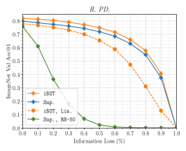

<figcaption>図9: 遮蔽に対する頑健性。異なる情報損失率でのモデルの遮蔽に対する頑健性を研究。3 つのパッチドロップ設定: Random Patch Dropping（左）、Salient Patch Dropping（中）、Non-Salient Patch Dropping（右）を考慮。</figcaption>
</figure>

### Robustness against Occlusion（遮蔽に対する頑健性）

マスク予測は画像の一部がマスクされた場合に自然な強みを持つ、モデルが元の内容を予測するよう訓練されているため。

ここで 3 つのドロップ設定（ランダム、顕著、非顕著）下で異なる情報損失率での遮蔽の詳細な結果を図 9 で提供する。

事前学習バックボーン上でエンドツーエンドファインチューニングされた、または線形ヘッドを持つ iBOT の結果を披露する。

比較のため ViT-S/16 と ResNet-50 の両方の教師あり結果を含める。

ViT は CNN 対応物（つまり ResNet-50）と比較して、Transformer の動的受容野が画像の空間構造への依存を減らすため、より高い頑健性を示す。

iBOT が教師ありベースラインと比較して遮蔽に対してより強い頑健性を持つことを経験的に発見し、MIM が自己注意を使用して画像パッチの系列間の相互作用をモデル化するのに役立ち、要素の比率を捨てても性能が有意に低下しないことを統合する。

<figure>

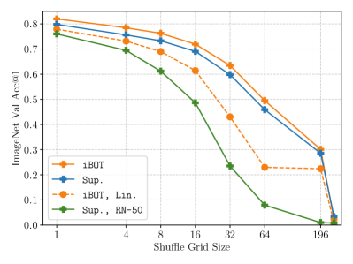

<figcaption>図10: シャッフルに対する頑健性。異なるグリッドシャッフルサイズでのモデルのシャッフルに対する頑健性を研究。</figcaption>
</figure>

### Robustness against Shuffle（シャッフルに対する頑健性）

入力画像パッチのシャッフルによってモデルの空間構造への敏感性を研究する。

具体的には、[33] に従って異なるグリッドサイズで画像パッチをシャッフルする。

事前学習バックボーン上でエンドツーエンドファインチューニングされた、または線形ヘッドを持つ iBOT の結果を披露する。

比較のため ViT-S/16 と ResNet-50 の両方の教師あり結果を含める。

シャッフルグリッドサイズ 1 はシャッフルなし、シャッフルグリッドサイズ 196 はすべてのパッチトークンがシャッフルされることを意味することに注意。

図 10 は iBOT が教師ありベースラインと ResNet-50 よりも精度をより良く保持することを示唆する。

iBOT が正しい分類決定のためにグローバル画像コンテキストを保持するために位置埋め込みに依拠しないことも示す。

---

## Appendix E: Additional Ablations（追加のアブレーション）

本節では、われわれが実験を行った他のパラメータの影響を研究する。

追加の説明なしに、アブレーション研究のため予測比率 $r = 0.3$、マルチクロップ拡張なしで 300 エポック事前学習された ViT-S/16 を使用する。

<figure>

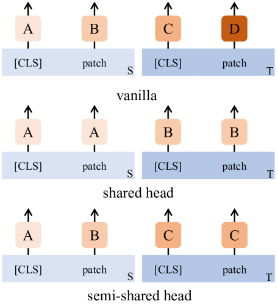

<figcaption>表17: 異なるヘッド共有戦略。</figcaption>
</figure>

### Architecture of Projection Head（射影ヘッドのアーキテクチャ）

前述したように、共有ヘッドは [CLS] トークンで獲得された意味性をパッチトークンに転移し、性能をわずかに改善できる。

student ネットワークのパッチトークン用ヘッドは訓練を通してマスクトークンのみを見ることに気づく、その分布は自然なテクスチャを持つトークンと不一致である。

したがって、student ネットワークに対して非共有ヘッドを使用するが teacher ネットワークに対して共有ヘッドを使用する実験を行う、これを semi-shared head と表記する。

それらの違いは図 18 に実証され、ここで S と T はそれぞれ student と teacher ネットワークを示す。

同じインデックスと色のヘッドは共有パラメータを持つことを示す。

| Arch. | vanilla | shared† | sm. shared | sm. shared† | shared |
| --- | --- | --- | --- | --- | --- |
| $k$-NN. | 68.9 | 68.0 | 68.4 | 68.4 | **69.1** |
| Lin. | 73.9 | 73.7 | 73.7 | 73.8 | **74.2** |

† は 3 層 MLP のうち最初の 2 層のみがパラメータを共有することを示す。

しかしながら、semi-shared head が shared head より良いことを観察しない。

既定で、[CLS] トークンとパッチトークンに対して射影ヘッド全体を共有する。

### Comparing MIM with Dense Self-Distillation（MIM と密自己蒸留の比較）

その代替に対する内部構造をモデル化する MIM の優位性を同定するため、[CLS] トークンとともに元のパッチトークンに対して自己蒸留を実行する実験を行う。

自己蒸留のためのパッチトークンペアを構築する 2 つのマッチング戦略を考慮する。

| Arch. | DINO | DINO + pos. | DINO + feat. | iBOT |
| --- | --- | --- | --- | --- |
| $k$-NN | 67.9 | 67.1 ($-0.8$) | 68.5 ($+0.6$) | **69.1 ($+1.2$)** |
| Lin. | 72.5 | 72.5 ($+0.0$) | 73.4 ($+0.9$) | **74.2 ($+1.7$)** |

具体的には、pos. は 2 つのビューの絶対位置によるマッチングを示す。

[53] と類似。$j$ は $\arg\min_j dist(p_i, p'_j)$ として定義され、ここで $p$ は元の画像空間での位置、$dist(u, v)$ はユークリッド距離。

損失は 2 つのビューの重複領域に対してのみ計算される。

パッチの絶対位置によるマッチングがもたらす相当な利得を観察しない。

feat. は 2 つのビューのバックボーン類似性によるマッチングを示す。

[46] と類似に、各パッチトークン $f_i$ について別のビューから最も類似したパッチトークン $f'_j$ をマッチする、ここで $j = \arg\max_j sim(f_i, f'_j)$。$sim(u, v)$ はコサイン距離。

そのような実践は線形プローブ精度で 0.6% の性能利得をもたらし、これは並行研究の EsViT [26] でも観察される。

比較として、iBOT は線形プローブで 1.2% の利得を促し、MIM の必要性と進歩を検証する。

### Hard Label versus Soft Label

MIM を実行するときに離散化された id（hardmax）の代わりに連続的なトークン分布（softmax†）を使用することの重要性を研究する。

表 18 の結果は連続的トークン化が決定的部分を果たすことを示す。

centering がもたらす改善を経験的に発見し、その役割は [CLS] トークンの自己蒸留での centering と比較して重要性が低い。

sharpening のみが $k$-NN 精度 69.4 と線形プローブ精度 73.9 を生むことができる。

### Centering and Sharpening

[CLS] トークンと異なり、パッチトークンには確実な意味的クラスタがなく、互いにより広く変動する。

蒸留プロセスを決定するいくつかの重要なパラメータの影響を研究し、それらをパッチトークン上の蒸留にカスタマイズする。

| $m'$ | $.8$ | $.99$ | $.999$ | $.9$ | $.9$ | $.9$ |
| --- | --- | --- | --- | --- | --- | --- |
| $\tau'_t$ | $.04 \to .07$ | $.04 \to .07$ | $.04 \to .07$ | $.04 \to .06$ | $.05 \to .08$ | $.04 \to .07$ |
| $k$-NN | 68.7 | 68.8 | 68.9 | 68.5 | 68.7 | **69.1** |
| Lin. | 74.0 | 73.8 | 73.8 | 73.5 | 73.9 | **74.2** |

具体的には、オンライン centering の平滑化 momentum $m'$ と sharpening 温度 $\tau'_t$ を研究する。

[CLS] トークンのパラメータを DINO と同じに保ち、パッチトークン用パラメータのみを研究することに注意。

### Loss Ratio（損失比率）

$\mathcal{L}_{\texttt{[CLS]}}$ と $\mathcal{L}_{\mathrm{MIM}}$ の異なる比率の影響を研究する。

$\mathcal{L}_{\texttt{[CLS]}}$ のベースを 1 に保ち、$\mathcal{L}_{\mathrm{MIM}}$ を異なる比率でスケールする。

| $\mathcal{L}_{[CLS]}$ / $\mathcal{L}_{MIM}$ | $0.5$ | $2$ | $1$ |
| --- | --- | --- | --- |
| $k$-NN | 68.7 | **69.4** | 69.1 |
| Lin. | 73.8 | 74.1 | **74.2** |

スケーリングなしで 2 つの損失を直接合計することが線形プローブ精度で最良の性能を生むことを観察する。

### Output Dimension（出力次元）

$\ell_2$ 正規化ボトルネックを持ち batch normalization なしの DINO の射影ヘッドの構造に従う。

最後の層の出力次元 $K$ の影響を研究する。

| $K$ | $4096$ | $16384$ | $8192$ |
| --- | --- | --- | --- |
| $k$-NN | 68.3 | 68.8 | **69.1** |
| Lin. | **74.5** | 74.0 | 74.2 |

各パッチトークンが出力分布を持つため、われわれの手法は大きな出力次元を除外するが、より大きな出力次元によって相当な性能利得がもたらされることを観察しない。

したがって、既定で $K = 8192$ を選ぶ。

<figure>

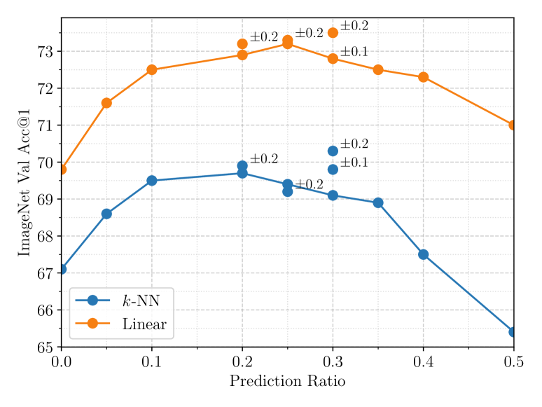

<figcaption>図11: 予測比率の影響。± はある範囲からランダムにサンプリングすることを示す。</figcaption>
</figure>

### Prediction Ratios（予測比率）

マスクモデリングは部分予測の定式化に基づき、その目的関数は非対象トークンに条件付けられた対象トークンの対数尤度を最大化することである。

マスク画像モデリングのための異なる予測比率で実験する。

結果を図 11 に示す。

性能は 0.05 から 0.4 の間の様々な予測比率に敏感でないことを観察する。

固定値に分散を加えることも一貫して性能利得をもたらすことができ、これはより強いデータ拡張として説明できる。

非マスク画像の teacher 出力は、現在異なる比率でマスクされた画像の student 出力と引き寄せられる。

既定で、予測比率として $0.3 (\pm 0.2)$ を使用する。

マルチクロップ拡張を伴うモデルについては、上記の議論に従い、各画像に対して 0 または $0.3 (\pm 0.2)$ の予測をランダムに選ぶ。

### Training Epochs（訓練エポック）

異なるエポックで事前学習された ViT-S/16 の線形プローブ top-1 精度を提供する。

比較のため、ResNet-50 のような同等のパラメータ数を持つ他の手法の精度曲線も含める。

図 12 から、800 エポックでのより長い訓練がモデルの性能を改善することを観察する。

iBOT が 100 エポック未満で 800 エポック事前学習された SwAV [7] の Top-1 精度を達成できることは注目に値する。

800 エポック事前学習された iBOT は先行最先端手法に対して 0.9% の改善をもたらす。

**表19**: 時間とメモリの要件。異なる手法の実際の訓練時間（T）と GPU メモリ（Mem.）、それぞれの線形プローブ（Lin.）とファインチューニング（Fin.）精度。すべての手法は 2 つの 8-GPU V100 マシン、バッチサイズ 1024 で訓練。

| Method | Crops Number | T₁₀₀ | T₃₀₀ | T₈₀₀ | Mem. | Lin.₃₀₀ | Lin.₈₀₀ | Fin.₈₀₀ |
|---|---|---|---|---|---|---|---|---|
| BEiT | 1×224² | 11.3h | 33.7h | 90.1h | 5.6G | 20.7 | 24.2 | 81.4 |
| DINO | 2×224² | 15.1h | 44.7h | 111.6h | 9.3G | 72.5 | 73.7 | 81.6 |
| iBOT | 2×224² | 15.6h | 47.0h | 126.4h | 13.1G | 74.8 | 76.2 | 82.0 |
| DINO | 2×224²+10×96² | 24.2h | 72.6h | 180.0h | 15.4G | 76.2 | 77.0 | 82.0 |
| **iBOT** | 2×224²+10×96² | 24.3h | 73.3h | 193.4h | 19.5G | **77.4** | **77.9** | **82.3** |

### Time and Memory Requirements（時間とメモリの要件）

BEiT は非対比目的関数とマルチクロップ拡張なしで訓練されるため、メモリ 5.6G のみを消費し 800 エポックで 90.1h かかる。

iBOT とマルチクロップ拡張を伴う DINO を比較すると、MIM を伴う iBOT は 25% 多いメモリ要件と 7.4% 多い実際の訓練時間を誘発する。

事前学習効率（精度対時間）を考慮すると、800 エポック事前学習された DINO は 180.0h を必要とする、一方 300 エポック iBOT は 73.3h しか必要とせず、0.4% 高い線形プローブ精度（77.0 対 77.4）。

---

## Appendix F: Alternative Tokenizers（代替トークナイザ）

**表20**: パッチをトークン化する異なるアプローチの方法論比較。300 エポック事前学習された ViT-S/16 で ImageNet-1K $k$-NN, 線形, ファインチューニング検証精度を報告。

| Method | $k$-NN | Linear | Fine-Tune |
|---|---|---|---|
| Rand. | - | - | 79.9 |
| MPP [17] | 16.4 | 37.2 | 80.8 |
| Patch Clustering | 19.2 | 40.1 | 81.3 |
| BEiT [4] | 6.9 | 24.2 | 81.4 |
| Standalone DINO as tokenizer | 44.3 | 60.0 | 81.7 |
| **iBOT** | **70.3** | **74.8** | 81.5 |

パッチをトークン化する異なるアプローチが MIM にどう影響するかを調査するため、いくつかの代替を研究する。

BEiT [4] では、マスクパッチは DALL-E エンコーダによってトークン化される。

MPP [17] は 3 ビット平均色を使ってマスクパッチをトークン化する。

Patch Clustering については、まず各 16×16 パッチの平坦化された色ベクトル（$d = 768$）に $K$-Means アルゴリズムを実行する。

ImageNet-1K 訓練集合の 10% データがサンプリングされクラスタリングされる。

$K$ を 4096 に設定する。

事前学習中、各パッチは最も近い centroid のインデックスでトークン化される。

最後に、300 エポック事前学習された DINO を独立トークナイザとして使用する。

各パッチは事前学習された DINO からの出力の argmax でトークン化できる。

パッチ表現を集約するため平均プーリングを使用する。

表 20 から、すべての手法が教師ありベースラインと比較して適切なファインチューニング結果を達成することがわかる、一方意味的に有意味なトークナイザでトークン化された手法のみが $k$-NN と線形分類で適切な結果を持つ。

MPP [17] とパッチクラスタリングはオフライン統計のみに依拠し、オンライン訓練の追加段階なしで動作する。

パッチクラスタリングが MPP と比較してすべての 3 つのプロトコルでわずかにより良い性能を持つことを発見し、視覚的意味性がもたらす利益を示唆する。

BEiT は $k$-NN と線形プローブ精度が低いが、良いファインチューニング結果は、ファインチューニングプロトコルの高レベル意味性への要件が比較的低いことも示唆する。

---

## Appendix G: Visualization（可視化）

本節では、より多くの可視化されたパターンレイアウトと自己注意マップを最初に与える。

それを超えて、2 つの画像間の疎な対応をマイニングする追加タスクを考慮し、いくつかの可視化された結果を披露して ViT の優位性を例示する。

### G.1 Pattern Layout（パターンレイアウト）

### Pattern Layout for Patch Tokens（パッチトークンのパターンレイアウト）

iBOT が学習した versatile で興味深い挙動を例示するため、パターンレイアウトの可視化を 2 つの図にまとめる。

図 13 では、高レベル意味性を共有する追加のパターンレイアウトを主に披露する。

図 14 では、色・テクスチャ・形状等のような低レベル詳細を共有する追加のパターンレイアウトを主に披露する。

検証集合で最高信頼度を持つ上位 100 パッチが、各 16×16 パッチトークン（オレンジで色付け）周りの 5×5 文脈で可視化される。

### Composing Images with Representative Patterns（代表パターンによる画像構成）

図 15 では、最高自己注意スコアを持つ 4 つのパッチ（非重複割当インデックスで）を可視化し、その割当インデックスのパターンレイアウトも示す。

可視化された結果は、iBOT がいくつかの代表的なパッチでのみ表現でき、これがモデルの頑健性と認識性能を助けることを示す。

これはわれわれの部位単位線形プローブ実験によっても検証される。

### Comparison with Other Methods（他の手法との比較）

図 16 で他の自己教師あり手法 [4, 8] を使用したパッチトークンのパターンレイアウトを可視化する。

BEiT について、DALL-E エンコーダは各パッチトークンに対して離散値を生成する。

DINO について、[CLS] トークン用の射影ヘッドを直接使用し、各パッチトークンに対して 65536 次元の確率分布を生成する。

最高確率のインデックスがトークンに割り当てられる。

### Pattern Layout for [CLS] Token

ここで [CLS] トークンに現れる意味的パターンの追加可視化も提供する、これはクロスビュー画像での自己蒸留を介して得られる。

DINO でも類似の挙動を観察する、それは MIM がもたらす固有の特性ではないため。

実際、1 つの画像の 2 つの歪んだビュー間の類似性が強制される限り意味性が現れると今や信じられている [18, 20, 7, 6]。

### G.2 Self-Attention Visualizations（自己注意の可視化）

第 4.3.2 節の設定に類似し、ここで図 18 で最後の層の複数のヘッドからのより多くの自己注意マップ可視化を提供した。

### G.3 Sparse Correspondence（疎な対応）

1 つの画像の 2 つの拡張ビューからの重複パッチ、または 1 つのクラスとしてラベル付けされた 2 つの画像からのパッチがマッチングされる必要がある疎な対応タスクを考慮する。

ViT-S/16 モデルで最大 $14 \times 14$ のマッチペアが抽出できるため、相関は疎である。

800 エポック事前学習された ViT-S/16 を持つ iBOT から抽出された最高自己注意スコアを持つ 12 個の対応を可視化する。

スコアは最後の層の複数のヘッド間で平均される。

いくつかのサンプリングされた画像ペアの集合が図 19 に示される。

iBOT が 1 つの画像から引き出された 2 つのビューでうまく機能し、対応の大多数を正しくマッチングすることを経験的に観察する。

第二列で、iBOT は同じクラスの 2 つのインスタンスの異なる部分（例: 2 つの車のタイルと窓）を、テクスチャや色の大きな違いにもかかわらずマッチングできる。

DINO も同等の可視化された効果を持つことを観察し、自己蒸留で事前学習された表現がパッチレベルスケールでの検索にもうまく適合することを例示する。

<figure>


<figcaption>図13: 高レベル意味性を共有するパッチトークンのパターンレイアウトの可視化。1 行目では、異なる人間関連の意味的部位を可視化する。人間の髪、肩 & 腕、肘がそれぞれ左中右の図で観察できる。2 行目と 3 行目の左図では動物関連の意味的部位を可視化する。犬の耳、犬の鼻、鳥の翼、トンボの翼が観察できる。3 行目の残りの図では屋外シーン関連の意味的部位を可視化する。車両の前面ウィンドウや建築物の窓が観察できる。最後の行では室内オブジェクト（天井、ガラス瓶等）を可視化する。</figcaption>
</figure>

<figure>

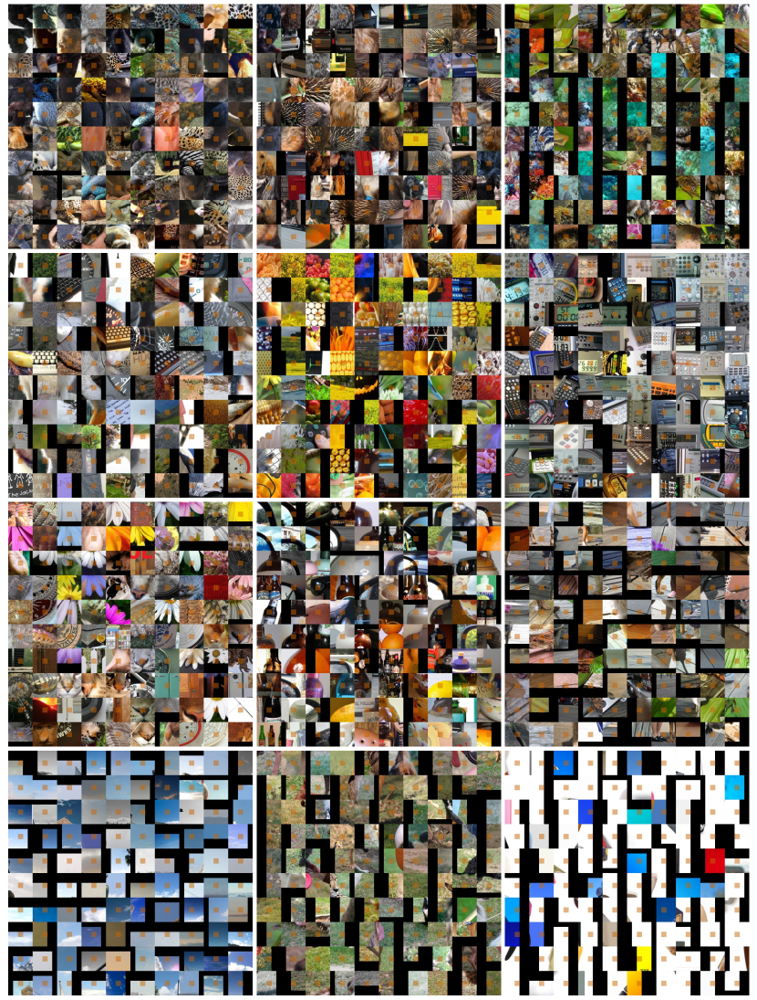

<figcaption>図14: 低レベル詳細を共有するパッチトークンのパターンレイアウトの可視化。最初の 2 列では類似テクスチャを共有するパッチを可視化する。最初の図では、レオパードの毛皮とトカゲの皮が類似した点状テクスチャを共有する。2 番目の図ではハリネズミの殻と象の皮が類似した縞模様テクスチャを共有する。3 列目では形状に関連するパターンレイアウトを可視化する。例えば、左と中央の図のオブジェクトの形状は類似した曲率を共有する。最右のパターンは明確に直線の形状を描く。最後の列で色関連のパターンレイアウトを可視化する。青、緑、白が観察できる。</figcaption>
</figure>

<figure>

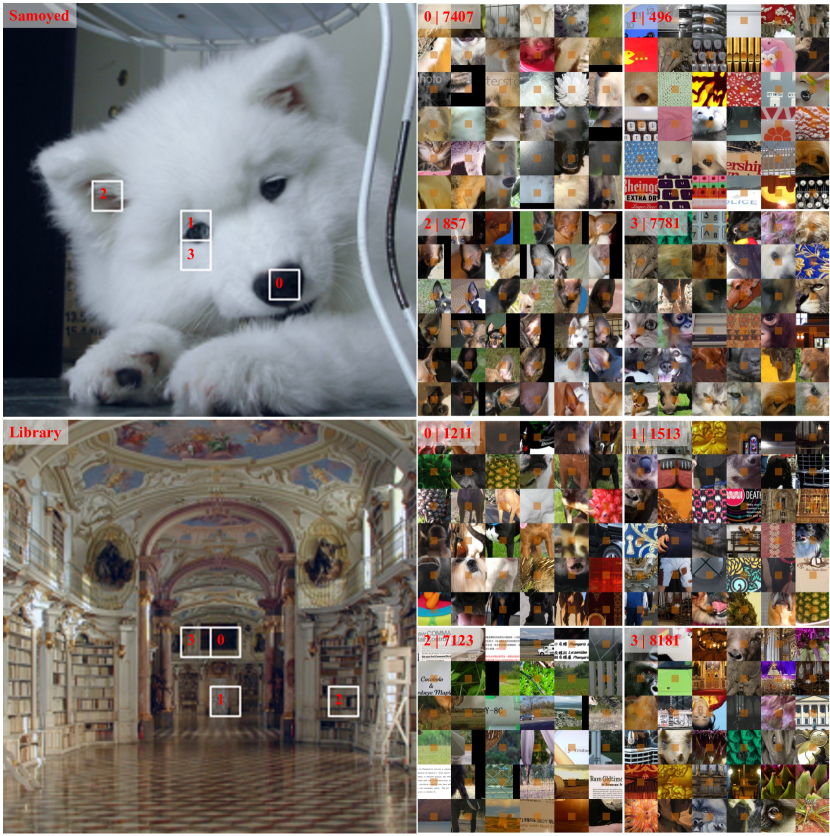

<figcaption>図15: それぞれのパターンレイアウトを持つ上位 4 の代表的パッチ。order index 0, 1, 2, 3 は自己注意スコアでランク付け。各パターンレイアウト sub-figure の左上隅に order index と cluster index が注記される。上部パネルで、パターン 0, 2, 3 は鼻、目、耳の明示的な意味情報を示す。興味深いことに、パッチ 1 もサモエドの目の周りに位置するが、その対応するパターンは意味性ではなく形状の視覚的類似性を共有する。これは各学習されたパターンの多様な挙動を例示する。下部パネルで、図書館は 0 二色または多色接合、1, 3 鋲刻みテクスチャ、2 テキストで表現される。同様に、パターン 0, 1, 3 がテクスチャ & 色により焦点を当て、パターンが意味性により焦点を当てる。これらすべての可視化結果は各インデックスの versatile な挙動を例示する。</figcaption>
</figure>

<figure>

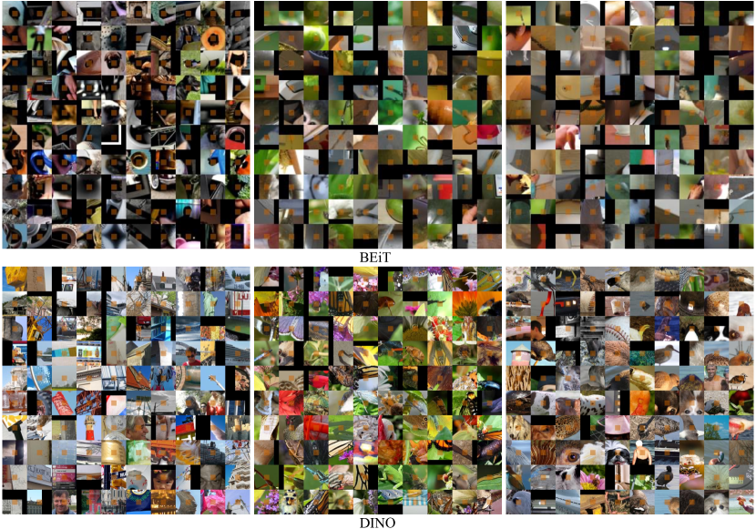

<figcaption>図16: BEiT（上）と DINO（下）を使用したパッチトークンのパターンレイアウトの可視化。DALL-E エンコーダから抽出されたレイアウトでは、最小限の意味的パターンを観察する。ほとんどの場合、類似色（例: 左図の黒領域）または類似テクスチャ（右図の線）を持つパッチがクラスタリングされる。DINO から抽出されたレイアウトでは、より複雑なテクスチャが見えるが、ほとんどのパッチは高レベル意味性ではなく類似する局所詳細を共有する。右図で、意味的部位「目」が何とか観察できるが、無関係な意味的部位の多くと混在している。</figcaption>
</figure>

<figure>

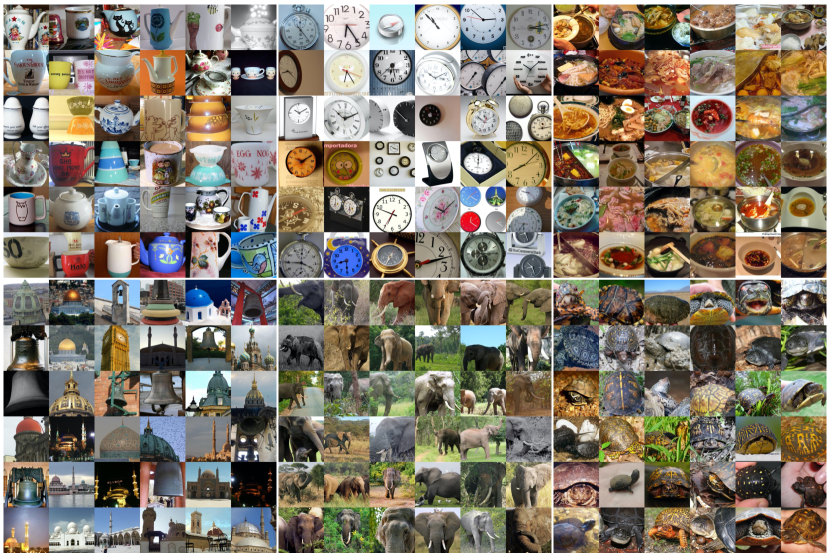

<figcaption>図17: [CLS] トークンのパターンレイアウトの可視化。ここで、クロスビュー画像の自己蒸留によってトークンにもたらされる意味的レイアウトの高品質を示す。この特性は MIM がもたらすものではなく、DINO でも顕著である。</figcaption>
</figure>

<figure>

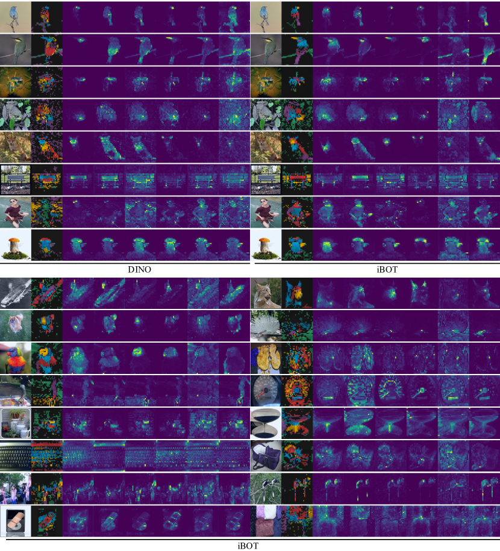

<figcaption>図18: 複数のヘッドからの自己注意マップの可視化。最初の 8 列では、iBOT の注意マップを DINO のものとともに披露する。最後の 10 列では、iBOT からのより多くの注意マップを披露する。iBOT が DINO と比較して、各部位に対してより注意深い可視化結果を与えることで、異なるオブジェクトまたは 1 つのオブジェクトの異なる部分を分離する視覚的に強い能力を示すことを示す。例えば、5 列目で、iBOT にはキツネの耳のみを担当する注意ヘッドがあるが、DINO ではそれは他の部分とともに現れる。8 列目で、iBOT はキノコをより意味的に有意味な部分に分離する。</figcaption>
</figure>

<figure>


<figcaption>図19: 疎な対応の可視化。上部パネルは 1 つの画像の 2 つのビューからサンプリングされた画像ペア。iBOT から抽出された対応はスケールと色の拡張にもかかわらずほとんど正しい。下部パネルは 1 つのクラスの 2 つの画像からサンプリングされた画像ペア。1 行目はサイズ・位置・テクスチャが異なる顕著オブジェクトを持つ画像。2 行目は動物から引き出された画像で、iBOT が動物の意味的部位を正しくマッチングすることがより明確に観察できる（例: キツネの尾、鳥のくちばし）。3 行目は人体や衣服を持つ人間中心画像。4 行目は顕著オブジェクトが見えない自然または家庭シーン。明示的な意味的部位が人間の理解に見えなくても、iBOT がテクスチャや色（看板や箱の木質テクスチャ）に基づいて対応を抽出できることを観察できる。これらすべての視覚結果は iBOT の局所スケールでの部位検索またはマッチングの強い能力を実証する。</figcaption>
</figure>
