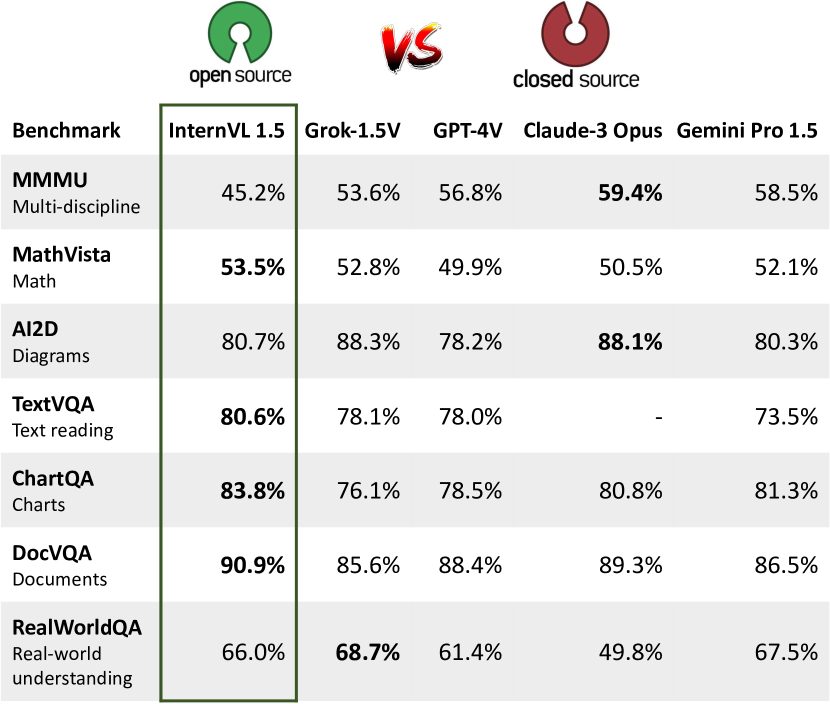
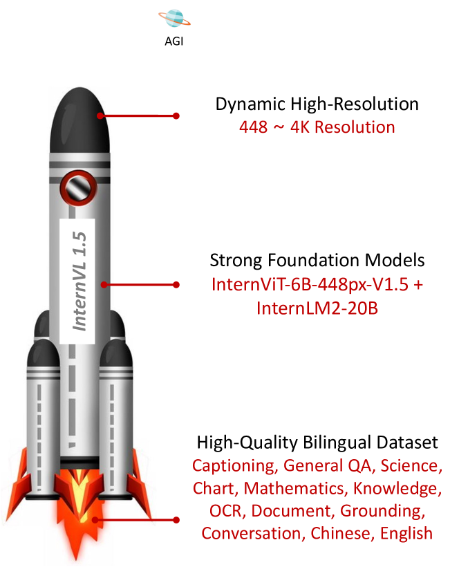
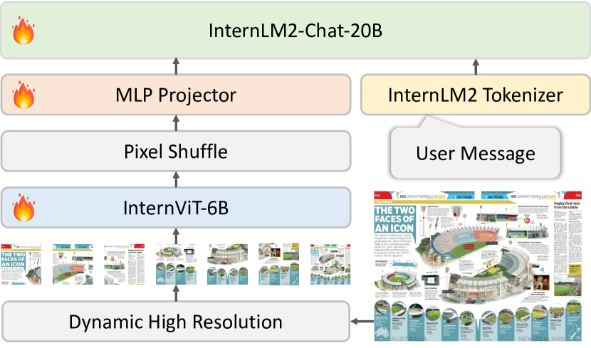
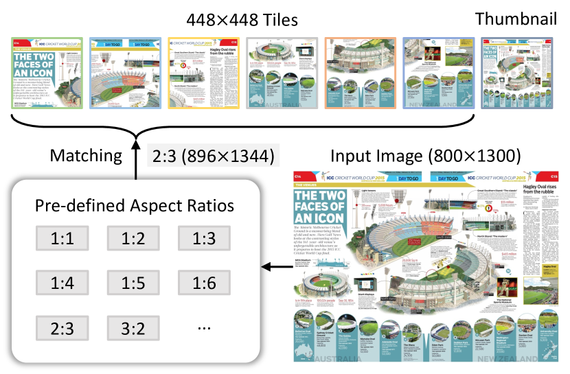
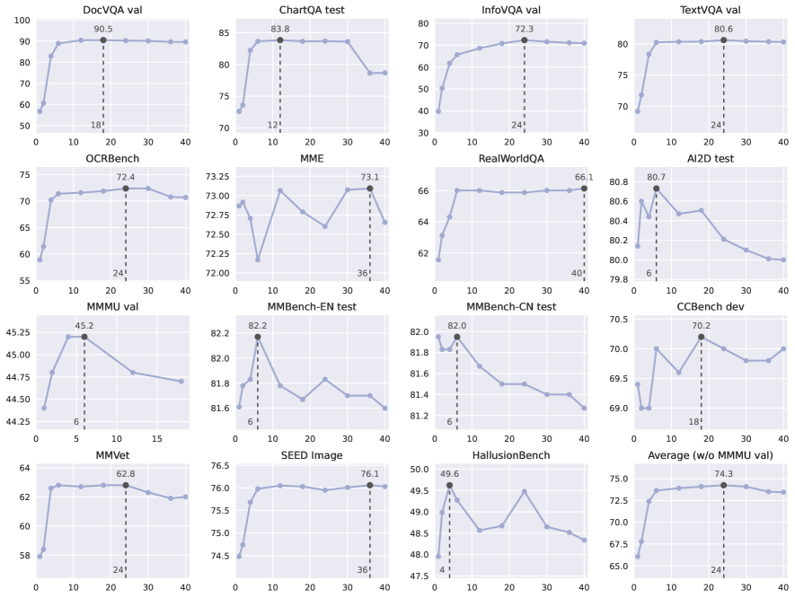

# GPT-4V までの差はどれほどか？ オープンソース・スイートで商用マルチモーダルモデルとの差を埋める

> 原題: How Far Are We to GPT-4V? Closing the Gap to Commercial Multimodal Models with Open-Source Suites
> 著者: Zhe Chen, Weiyun Wang, Hao Tian, Shenglong Ye, Zhangwei Gao, Erfei Cui, Wenwen Tong, Kongzhi Hu, Jiapeng Luo, Zheng Ma, Ji Ma, Jiaqi Wang, Xiaoyi Dong, Hang Yan, Hewei Guo, Conghui He, Botian Shi, Zhenjiang Jin, Chao Xu, Bin Wang, Xingjian Wei, Wei Li, Wenjian Zhang, Bo Zhang, Pinlong Cai, Licheng Wen, Xiangchao Yan, Min Dou, Lewei Lu, Xizhou Zhu, Tong Lu, Dahua Lin, Yu Qiao, Jifeng Dai, Wenhai Wang
> 所属: Shanghai AI Laboratory / SenseTime Research / Tsinghua University / Nanjing University / Fudan University / The Chinese University of Hong Kong
> 出典: arXiv:2404.16821（2024 年 4 月）
> デモ: <https://internvl.opengvlab.com>
> リポジトリ: <https://github.com/OpenGVLab/InternVL>
> モデル: <https://huggingface.co/OpenGVLab/InternVL-Chat-V1-5>

---

## Abstract（要旨）

本レポートでは、マルチモーダル理解においてオープンソースモデルと商用モデルの能力差を埋めるためのオープンソース・マルチモーダル大規模言語モデル（multimodal large language model, MLLM） **InternVL 1.5** を紹介する。3 つの単純な改善を導入した。(1) **強力な視覚エンコーダ**: 大規模視覚基盤モデル InternViT-6B に対する継続学習戦略を探求し、視覚理解能力を高めるとともに、異なる LLM 間で転用・再利用可能にした。(2) **動的高解像度**: 入力画像のアスペクト比と解像度に応じて、画像を 448×448 ピクセルのタイル 1 〜 40 枚に分割することで、最大 4K 解像度の入力を扱える。(3) **高品質バイリンガルデータセット**: 一般的シーンと文書画像をカバーする高品質バイリンガルデータセットを慎重に収集し、英語と中国語の質問応答ペアでアノテーションした。これにより、OCR 関連タスクと中国語関連タスクで性能が大きく向上した。InternVL 1.5 を一連のベンチマークと比較研究で評価した。オープンソースと商用モデルの双方と比較して、InternVL 1.5 は競争力ある性能を示し、**18 のマルチモーダルベンチマークのうち 8 つで最先端を達成** した。

---

## 1. Introduction（はじめに）

<figure>

<figcaption>図1: InternVL 1.5 と商用モデルの比較。これらのベンチマーク結果は、InternVL 1.5 が主要な商用モデルに匹敵する性能を達成することを示す。</figcaption>
</figure>

大規模言語モデル（large language models, LLMs）は人工汎用知能（AGI）システムの発展に大きな役割を果たし、開放世界の言語タスクで顕著な能力を示してきた。LLM の発展を活かし、マルチモーダル大規模言語モデル（MLLMs）も大きな前進を遂げ、テキスト情報と視覚情報のあいだの隙間を橋渡しする複雑な視覚言語の対話と相互作用を可能にしている。これらの成果にもかかわらず、オープンソースモデルと **GPT-4V**、**Gemini シリーズ**、**Qwen-VL-Max** などの独自商用モデルの能力には、依然として明確な隔たりが存在する。

この隔たりは主に以下の 3 つの側面に現れる。(1) **パラメータ規模**: 近年の独自商用 MLLM は通常 1000 億パラメータ以上にスケールしているのに対し、オープンソースモデルは 3 億パラメータ規模の視覚基盤モデル（vision foundation model, VFM）を 70 億あるいは 130 億の LLM と統合するのが一般的。(2) **画像解像度**: 商用モデルは通常、元のアスペクト比を保つ動的解像度方式を採用し、詳細なシーンや文書の理解を可能にする。一方、オープンソースモデルは 336×336 や 448×448 といった固定解像度で訓練することが多く、商用モデルとの能力差を生む。(3) **多言語能力**: 商用モデルはしばしば広範な多言語データセットで訓練され、多様な言語での性能を高める。一方、オープンソースモデルは主に英語データを利用し、他言語については LLM のゼロショット能力に依存する（例: LLaVA-NeXT）。これは非英語のシーン理解や OCR タスクで最適でない性能を招く。

この隔たりを埋めるため、InternVL 1.5 を導入し、性能と使いやすさを高める 3 つの主要な改善を統合した。(1) 大規模 VFM である InternViT-6B に対し継続学習を実装し、高品質な画像-テキストデータで精錬する。これによりモデルの視覚理解能力を高めるだけでなく、種々の LLM への適応性を高める。さらに、**InternLM2-20B** を言語基盤モデルとして用いることで、頑健な初期言語処理能力を提供する。(2) 画像を 448×448 のタイルに分割する動的高解像度戦略を採用し、画像のアスペクト比と解像度に基づきタイル数を 1 〜 40（すなわち 4K 解像度）の範囲で変化させる。グローバル文脈を捉えるため、サムネイルビューも追加する。(3) 高品質な自然シーン、図表、文書、英語・中国語の対話を含む公開データセットの多様な集合を収集する。さらに、オープンソース LLM を用いたデータ翻訳パイプラインを開発し、多言語に容易に拡張できる。

これらの設計により、本モデルは以下の利点を備える。(1) **柔軟な解像度**: GPT-4V の "low" / "high" モードと同様、InternVL 1.5 はユーザが画像に最適な解像度を選択できる。例えば、シーン主題記述には低解像度を、文書理解には高解像度（最大 4K）を使うことで、計算効率と詳細保持のバランスを効果的に取る。(2) **バイリンガル熟達**: InternVL 1.5 は英語と中国語の双方で頑健なマルチモーダル知覚・理解能力を発揮し、特に中国語関連タスクでは商用モデルの GPT-4V を概ね上回る。(3) **強力な視覚表現**: 継続学習戦略により InternViT-6B の視覚表現能力を強化し、柔軟な入力解像度と多様な視覚ドメインに対する頑健性を高めた。InternViT-6B の巨大なパラメータのおかげで、本モデルは 200 億以上のパラメータを持つ LLM の言語能力に匹敵する視覚表現水準を達成する。この視覚と言語処理の相乗効果により、本システムは頑健なマルチモーダル能力を備える。

InternVL 1.5 を 18 の代表的マルチモーダルベンチマークで評価し、これらを OCR 関連、汎用マルチモーダル、数学、マルチターン対話の 4 つに分類した。オープンソースと商用モデルの双方と比較して、InternVL 1.5 は競争力ある性能を示し、**18 ベンチマークのうち 8 つで最先端を達成** する。特に図 1 に示すように、Grok-1.5V、GPT-4V、Claude-3 Opus、Gemini Pro 1.5 などの主要商用モデルを 4 つの特定ベンチマーク、とりわけ TextVQA、ChartQA、DocVQA などの OCR 関連データセットで凌駕する。本評価は、InternVL 1.5 がオープンソースモデルと主要商用モデルの隔たりを効果的に縮めたことを示す。本アプローチとオープンソースモデル重みが MLLM コミュニティの発展に貢献することを願う。

<figure>

<figcaption>図2: InternVL 1.5 の特徴。継続学習による強力な視覚表現、柔軟な解像度能力、英語・中国語の頑健なバイリンガル熟達を備え、競争力ある MLLM として位置づけられる。</figcaption>
</figure>

---

## 2. Related Work（関連研究）

### 2.1 Proprietary Commercial MLLMs（独自商用 MLLM）

LLM は複雑な言語タスクを可能にし、これまで人間専用と考えられてきたタスクで AGI を大きく前進させた。これに基づき、独自商用 MLLM の発展は重要な進化を意味する。例えば、OpenAI の **GPT-4V** は GPT-4 の能力を視覚入力対応に拡張し、テキストと画像の双方を扱える MLLM 領域の重要な発展である。続く Google の **Gemini シリーズ** は Gemini 1.0 から Gemini 1.5 へと進化し、テキスト・画像・音声を処理でき、最大 100 万トークンをサポートする MLLM を強化した。Alibaba の **Qwen-VL-Plus/Max** は Qwen-VL シリーズの主力モデルで、OCR ツールを必要とせずマルチモーダルタスクで優れた能力を発揮する。直近の独自 MLLM の発展としては、Anthropic の **Claude-3V**、HyperGAI の **HPT Pro**、Apple の **MM1**、StepFun の **Step-1V**、xAI の **Grok-1.5V** がある。

### 2.2 Open-Source MLLMs（オープンソース MLLM）

オープンソース MLLM の発展は AGI の状況に大きな影響を与え、視覚とテキストデータの処理能力を統合・拡張してきた。過去 1 年で多くのオープンソース MLLM が登場し、その中には **LLaVA シリーズ**、**MiniGPT-4**、**VisionLLM**、**Qwen-VL**、**CogVLM**、**Shikra** などが含まれる。しかし、これらのモデルは 336×336 や 448×448 といった小さな固定解像度の画像で訓練されることが多く、異常なアスペクト比の画像や文書データに対する性能が最適でないという問題がある。これを解決するため、高解像度画像での訓練に関するアプローチが多く探究されてきた。現在は 2 つの主要な技術路線が存在する。1 つは **dual-branch image encoder の設計**、もう 1 つは **高解像度画像を多数の低解像度タイルに分割する方法** である。これらの高解像度訓練の探求にもかかわらず、オープンソースモデルは文書、図表、インフォグラフィックの理解、シーンテキストの認識などで主要商用モデルとの差が大きい。

<figure>

<figcaption>図3: 全体アーキテクチャ。InternVL 1.5 は LLaVA 系で人気の ViT-MLP-LLM アーキテクチャを採用し、事前学習済みの InternViT-6B と InternLM2-20B を MLP プロジェクタで接続する。視覚トークン数を 1/4 に削減するため、シンプルな pixel shuffle を用いる。</figcaption>
</figure>

### 2.3 Vision Foundation Models for MLLMs（MLLM 向け視覚基盤モデル）

視覚基盤モデル（VFMs）は MLLM コミュニティの研究焦点の 1 つである。現在、**CLIP-ViT** や **SigLIP** のようなモデルが広く使われているが、MLLM に最適な視覚エンコーダを探す研究も多数行われている。例えば Tong らは CLIP と DINOv2 の視覚パターンに顕著な違いを観察し、これら 2 つの VFM を組み合わせる mixture-of-features モジュールを開発した。**LLaVA-HR** は CLIP-ViT を低解像度経路に、CLIP-ConvNext を高解像度経路に用いる dual-branch 視覚エンコーダを導入した。同様に **DeepSeek-VL** は SigLIP-L を低解像度、SAM-B を高解像度に用いる dual vision encoder 設計を採用した。本レポートでは、視覚基盤モデル InternViT-6B に対する **継続学習戦略** を提案する。これは視覚理解能力を継続的に高めつつ、種々の LLM 間で転用・再利用可能とする。

---

## 3. InternVL 1.5

### 3.1 Overall Architecture（全体アーキテクチャ）

図 3 に示すように、InternVL 1.5 は広く使われるオープンソース MLLM のアーキテクチャ、すなわち既存研究で参照される **"ViT-MLP-LLM" 構成** を採用する。本実装はこのアーキテクチャに従い、事前学習済みの InternViT-6B と事前学習済みの InternLM2-20B を、ランダム初期化された MLP プロジェクタで統合する。

訓練中は動的解像度戦略を実装し、画像のアスペクト比と解像度に基づき 448×448 ピクセルのタイル 1 〜 12 枚に分割する。テスト時にはゼロショットで 40 タイル（すなわち 4K 解像度）まで拡張可能。高解像度対応のスケーラビリティを高めるため、視覚トークン数を元の 1/4 に削減する **pixel shuffle 操作** を採用する。したがって本モデルでは、448×448 画像は **256 視覚トークン** で表現される。

### 3.2 Strong Vision Encoder（強力な視覚エンコーダ）

既存 MLLM では、最もよく使われる視覚基盤モデルは通常、対比的に事前学習された ViT である。しかし、これらの ViT は通常、固定低解像度（例: 224×224）でインターネットから収集された画像-テキスト対で訓練されているため、高解像度画像や文書画像のようなインターネット以外の画像を扱う際に性能が劣化する。

**InternViT-6B-448px-V1.2**。この問題に対処するため、InternVL 1.2 のアップデートでは InternViT-6B の継続事前学習を行った。まず、後ろから 4 層目の特徴がマルチモーダルタスクで最良であることを発見したため、最後の 3 層の重みを直接破棄し、InternViT-6B を 48 層から 45 層へと削減した。次に InternViT-6B の解像度を 224 から 448 に上げ、**Nous-Hermes-2-Yi-34B** と統合した。高解像度処理と OCR 能力を備えるため、視覚エンコーダと MLP の両方を訓練対象とし、画像キャプショニングと OCR 固有データセットの混合で訓練した。このプロセスから新たに得られた InternViT 重みは **InternViT-6B-448px-V1.2** として公開した。

**InternViT-6B-448px-V1.5**。InternVL 1.5 の開発は InternViT-6B-448px-V1.2 の強力な基盤を継続事前学習する。本アップデートでは、訓練画像の解像度を固定 448×448 から動的 448×448 に拡張する。基本タイルサイズは 448×448 で、タイル数は 1 〜 12 の範囲。さらに、事前学習データセットの規模・品質・多様性を高め、InternVL 1.5 の頑健性・OCR 能力・高解像度処理能力を実現した。動的解像度と訓練データセットの詳細は §3.3 と §3.4 で述べる。

注目すべきは、InternVL 1.5 で LLM が Nous-Hermes-2-Yi-34B から **InternLM2-20B** に変更されたにもかかわらず、InternViT が新しい LLM と優れた互換性・可搬性を維持した点である。これは、InternViT-6B が MLLM 事前学習段階で学習した視覚特徴が、**特定の LLM に強く束縛されず広く適用可能** であることを示唆する。

<figure>

<figcaption>図4: 動的高解像度の図解。事前定義された比率から最適なアスペクト比を動的にマッチさせ、画像を 448×448 ピクセルのタイルに分割し、グローバル文脈用にサムネイルを作成する。本手法はアスペクト比の歪みを最小化し、訓練中の解像度変動に対応する。</figcaption>
</figure>

### 3.3 Dynamic High-Resolution（動的高解像度）

UReader に着想を得て、入力画像の解像度とアスペクト比の多様性に効果的に適応する **動的高解像度訓練アプローチ** を採用する。この手法は画像をタイルに分割する柔軟性を活かし、多様な画像解像度に対応しつつ詳細視覚情報を処理する能力を高める。主に以下の手順から成る。

**Dynamic Aspect Ratio Matching（動的アスペクト比マッチング）**。図 4 に示すように、処理中に自然なアスペクト比を保つため、事前定義したアスペクト比集合から最適なものを動的にマッチさせる。計算資源の制約から、訓練中は最大 12 タイルとする。したがってこの集合は 1 〜 12 タイルで構成される **35 通り** のアスペクト比すべて（例: {1:1, 1:2, 2:1, 3:1, …, 2:6}）を含む。マッチング時には各入力画像のアスペクト比を計算し、35 個の事前定義比と絶対差で比較する。複数の事前定義比が一致する場合（例: 1:1 と 2:2）、入力画像の面積を 2 倍超えないものを優先し、低解像度画像の過度な拡大を防ぐ。

**Image Division & Thumbnail（画像分割とサムネイル）**。適切なアスペクト比が決まると、画像はその解像度にリサイズされる。例えば 800×1300 画像は 896×1344 にリサイズされる。リサイズ画像は 448×448 ピクセルのタイルに分割される。タイルに加え、全体画像のサムネイルをグローバル文脈捕捉のため含める。このサムネイルは 448×448 にスケールダウンされ、モデルが全体シーンを理解するのを助ける。したがって訓練時の視覚トークン数は **256 〜 3,328** の範囲。テスト時にはタイル数を最大 40 まで増やせ、**10,496 視覚トークン** に達する。

**表1**: InternVL 1.5 で使用したデータセット概要。中国語 OCR を Wukong 画像で、英語 OCR を LAION-COCO 画像で生成するために PaddleOCR を使用した。

(a) **事前学習段階で使用したデータセット**

| task | ratio | dataset |
| --- | --- | --- |
| Captioning | 53.9% | Laion-EN (en), Laion-ZH (zh), COYO (zh), GRIT (zh), COCO (en), TextCaps (en) |
| Detection | 5.2% | Objects365 (en&zh), GRIT (en&zh), All-Seeing (en&zh) |
| OCR (large) | 32.0% | Wukong-OCR (zh), LaionCOCO-OCR (en), Common Crawl PDF (en&zh) |
| OCR (small) | 8.9% | MMC-Inst (en), LSVT (zh), ST-VQA (en), RCTW-17 (zh), ReCTs (zh), ArT (en&zh), SynthDoG (en&zh), COCO-Text (en), ChartQA (en), CTW (zh), DocVQA (en), TextOCR (en), PlotQA (en), InfoVQA (en) |

(b) **ファインチューニング段階で使用したデータセット**

| task | dataset |
| --- | --- |
| Captioning | TextCaps (en), ShareGPT4V (en&zh) |
| General QA | VQAv2 (en), GQA (en), OKVQA (en), VSR (en), VisualDialog (en) |
| Science | AI2D (en), ScienceQA (en), TQA (en) |
| Chart | ChartQA (en), MMC-Inst (en), DVQA (en), PlotQA (en), LRV-Instruction (en) |
| Mathematics | GeoQA+ (en), TabMWP (en), MathQA (en), CLEVR-Math/Super (en), Geometry3K (en) |
| Knowledge | KVQA (en), A-OKVQA (en), ViQuAE (en), Wikipedia (en&zh) |
| OCR | OCRVQA (en), InfoVQA (en), TextVQA (en), ArT (en&zh), COCO-Text (en), CTW (zh), LSVT (zh), RCTW-17 (zh), ReCTs (zh), SynthDoG (en&zh), ST-VQA (en) |
| Document | DocVQA (en), Common Crawl PDF (en&zh) |
| Grounding | RefCOCO/+/g (en), Visual Genome (en) |
| Conversation | LLaVA-150K (en&zh), LVIS-Instruct4V (en), ALLaVA (en&zh), Laion-GPT4V (en), TextOCR-GPT4V (en), SVIT (en&zh) |
| Text-only | OpenHermes2.5 (en), Alpaca-GPT4 (en), ShareGPT (en&zh), COIG-CQIA (zh) |

### 3.4 High-Quality Bilingual Dataset（高品質バイリンガルデータセット）

**Pre-training Dataset（事前学習データセット）**。InternVL 1.5 で使用する事前学習データセットは多様な公開ソースを含む。表 1(a) に概要を示す。これらはキャプショニング（Laion-EN, Laion-ZH, COYO, GRIT 等、全体の 53.9%）、検出・grounding（Objects365, GRIT, All-Seeing 等、5.2%）、OCR（Wukong-OCR, LaionCOCO-OCR, Common Crawl PDFs 等、32.0%）、より特定的・制約的な OCR（MMC-Inst, LSVT, ST-VQA, RCTW-17, ArT 等、8.9%）を含む。これら大規模 OCR データセットは、Wukong の中国語画像と LaionCOCO の英語画像に **PaddleOCR** を適用して構築した。この多様なデータセット構成により、InternVL のロバストな事前学習が保証され、様々な言語・視覚要素のタスクに対応する。

> **データ翻訳パイプラインの説明**: 図 5 に示すように、本パイプラインは最先端のオープンソース LLM または GPT-3.5 を用いて、英語データセットを別言語（例: 中国語）に変換する。一貫性と精度を保ったバイリンガル注釈を実現し、言語プロンプトを調整するだけで手動アノテーションなしに他言語へ容易に拡張できる。プロンプトは次の点に注意する: (1) 固有名詞・ブランド・地名は英語のまま、(2) 専門用語・jargon は英語のまま（必要に応じて目的言語で説明）、(3) 慣用句や諺は目的言語の慣用表現で文化適応、(4) 引用や直接話法は目的言語で自然に響くようにし、原文のトーンを維持、(5) 略語は目的言語のフルフォーム + 括弧内英語略語で示す。

**Fine-tuning Dataset（ファインチューニングデータセット）**。ファインチューニング段階では、多様なマルチモーダルタスクでモデル性能を高めるためデータセットを慎重に選定した。表 1(b) にまとめる。

画像キャプショニングには TextCaps とバイリンガル ShareGPT4V を含め、英語と中国語の記述キャプションを学習させる。汎用 QA には VQAv2, GQA, VisualDialog を含め、多様な質問応答シナリオに対応させる。

科学画像理解には AI2D, ScienceQA, TQA を含め、科学的図解とテキストの解釈能力を高める。チャート解釈は ChartQA, MMC-Inst, PlotQA で強化する。数学では GeoQA+, TabMWP, MathQA が複雑な数値・幾何問題を導入する。知識ベース QA では KVQA とバイリンガル Wikipedia により多言語の事実情報抽出・推論を可能にする。

OCR タスクには OCRVQA, TextVQA、SynthDoG など中国語と英語のテキスト認識データセットを使用する。文書理解は DocVQA や Common Crawl PDFs により実世界の文書解析能力を高める。視覚的グラウンディングは RefCOCO と Visual Genome で訓練し、画像内の正確な物体位置特定を可能にする。マルチモーダル対話領域では LLaVA-150K や ALLaVA がインタラクティブ・エンゲージング・シナリオで対話能力を強化する。最後にテキスト専用データセット（OpenHermes2.5, Alpaca-GPT4 等）は LLM の元来の言語能力を維持するために使用する。

要するに、これらのデータセットはマルチモーダルタスクの幅広い対応能力を高め、実用への準備を整えるための豊かで多様な基盤を構成する。

**Data Translation Pipeline（データ翻訳パイプライン）**。図 5 に示すように、本モデルの多言語能力を高めるためデータ翻訳パイプラインを実装した。このパイプラインは最先端のオープンソース LLM または GPT-3.5 を用いて、英語データセットを他言語（例: 中国語）に変換し、一貫性と精度を保ったバイリンガル注釈を実現する。さらに、言語プロンプトを調整するだけで他言語へ容易に拡張可能で、手動アノテーションプロセスに依存しない。

表 1 では各データセットの言語を注釈した。元々英語のデータセットに対し "zh" 注釈があれば、翻訳パイプラインで中国語に翻訳したことを示す。例えば COYO や GRIT は元々英語データセットで、翻訳パイプラインで中国語化した。この翻訳パイプラインの活用により、InternVL 1.5 の中国語能力は大幅に高まった。

**表2**: 16 マルチモーダルベンチマークでの SoTA 比較。OCR 関連: DocVQA test, ChartQA test, InfographicVQA test, TextVQA val, OCRBench。汎用マルチモーダル: MME, RealWorldQA, AI2D test, MMMU val, MMBench-EN/CN test, CCBench dev, MMVet, SEED Image, HallusionBench。数学: MathVista testmini。\* は Rosetta OCR トークンが TextVQA テストで使用されたことを示す。MME は知覚 + 認知スコアの合計。

| model | open-source | #param | DocVQA | ChartQA | InfoVQA | TextVQA | OCRBench | MME | RWQA | AI2D | MMMU | MMB-EN/CN | CCB | MMVet | SEED | HallB | MathVista |
|---|---|---|---|---|---|---|---|---|---|---|---|---|---|---|---|---|---|
| GPT-4V | ✗ | – | 88.4 | 78.5 | – | 78.0 | 645 | 1926.6 | 61.4 | 78.2 | 56.8 | 77.0/74.4 | 46.5 | 67.6 | 71.6 | 46.5 | 49.9 |
| Gemini Ultra 1.0 | ✗ | – | 90.9 | 80.8 | 80.3 | 82.3 | – | – | – | 79.5 | 59.4 | –/– | – | – | – | – | 53.0 |
| Gemini Pro 1.0 | ✗ | – | 88.1 | 74.1 | 75.2 | 74.6 | 659 | 1933.4 | – | 73.9 | 47.9 | 73.6/74.3 | 52.5 | 64.3 | 70.7 | 45.2 | 45.2 |
| Gemini Pro 1.5 | ✗ | – | 86.5 | 81.3 | 72.7 | 73.5 | – | – | 67.5 | 80.3 | 58.5 | –/– | – | – | – | – | 52.1 |
| Qwen-VL-Max | ✗ | – | 93.1 | 79.8 | 73.4 | – | 723 | 2433.6 | – | 79.3 | 51.3 | 77.6/75.7 | 63.5 | 66.6 | – | 41.2 | 51.0 |
| Qwen-VL-Plus | ✗ | – | 91.4 | 78.1 | – | – | 694 | 2183.4 | – | 75.9 | 45.2 | 67.0/70.7 | 55.1 | 61.1 | 72.7 | 40.6 | 43.3 |
| Claude-3 Opus | ✗ | – | 89.3 | 80.8 | – | – | 694 | 1586.8 | 49.8 | 88.1 | 59.4 | 63.3/59.2 | 26.3 | 58.1 | – | 37.8 | 50.5 |
| Claude-3 Sonnet | ✗ | – | 89.5 | 81.1 | – | – | 646 | 1625.9 | 51.9 | 88.7 | 53.1 | 67.8/64.2 | 27.8 | – | – | 41.3 | 47.9 |
| Claude-3 Haiku | ✗ | – | 88.8 | 81.7 | – | – | 658 | 1453.2 | – | 86.7 | 50.2 | 60.7/57.2 | 24.5 | – | – | 39.2 | 46.4 |
| HPT Pro | ✗ | – | – | – | – | – | – | – | – | – | 52.0 | 77.5/76.7 | – | – | 73.1 | – | – |
| MM1 | ✗ | 30B | – | – | – | 73.5 | – | 2069.0 | – | – | 44.7 | 75.1/– | – | 48.7 | 72.1 | – | 39.4 |
| Step-1V | ✗ | 100B | – | – | – | – | 625 | 2206.4 | – | 79.2 | 49.9 | 80.7/79.9 | 71.2 | 63.3 | 70.3 | 48.4 | 44.8 |
| Grok-1.5V | ✗ | – | 85.6 | 76.1 | – | 78.1 | – | – | 68.7 | 88.3 | – | –/– | – | – | – | – | 52.8 |
| Text-Monkey | ✓ | 10B | 66.7 | 59.9 | 28.6 | 64.3 | 561 | – | – | – | – | –/– | – | – | – | – | – |
| DocOwl-1.5 | ✓ | 8B | 82.2 | 70.2 | 50.7 | 68.6 | 599 | – | – | – | – | –/– | – | – | – | – | – |
| Mini-Gemini | ✓ | 35B | – | – | – | 74.1\* | – | 2141.0 | – | – | 48.0 | 80.6/– | – | 59.3 | – | – | 43.3 |
| LLaVA-NeXT | ✓ | 35B | 84.0 | 68.7 | 51.5 | 69.5\* | 574 | 2028.0 | – | 74.9 | 51.1 | 81.1/79.0 | 49.2 | 57.4 | 75.9 | 34.8 | 46.5 |
| InternVL 1.2 (ours) | ✓ | 40B | 57.7 | 68.0 | 39.5 | 72.5\* | 569 | 2175.4 | 67.5 | 79.0 | 51.6 | 82.2/81.2 | 59.2 | 48.9 | 75.6 | 47.6 | 47.7 |
| **InternVL 1.5 (ours)** | ✓ | **26B** | **90.9** | **83.8** | **72.5** | **80.6** | **724** | **2187.8** | **66.0** | **80.7** | **45.2** | **82.2/82.0** | **69.8** | **62.8** | **76.0** | **49.3** | **53.5** |

**表3**: ConvBench と MMT-Bench での SoTA 比較。ConvBench はマルチターン対話評価ベンチマークで、人間との勝率を提示する（$S_1$/$S_2$/$S_3$ は知覚/推論/創造のスコア、$R_2 = (S_1+S_2+S_3)/3$、$R_1 = (R_2+S_O)/2$）。MMT-Bench は専門知識・意図的視覚認識・位置特定・推論・計画を要するマルチモーダルタスクの包括ベンチマーク（162 サブタスク、\* は視覚認識を除外）。

| model | open-source | #param | ConvBench (Pairwise) $R_1$ | ConvBench (Direct) $R_1$ | MMT-Bench Overall | MMT-Bench Overall\* |
|---|---|---|---|---|---|---|
| GPT-4V | ✗ | – | 39.51 | 7.09 | 62.0 | 55.5 |
| Qwen-VL-Plus | ✗ | – | – | – | 62.3 | 56.6 |
| Gemini Pro 1.0 | ✗ | – | 8.44 | 4.42 | 61.6 | 55.1 |
| Claude-3 Opus | ✗ | – | 36.60 | 6.54 | – | – |
| Claude-3 Haiku | ✗ | – | – | – | 52.2 | 46.4 |
| LLaVA-NeXT | ✓ | 35B | – | – | 60.8 | 56.3 |
| XComposer2 | ✓ | 8B | 15.83 | 5.82 | 55.7 | 50.0 |
| LLaVA-1.5-13B | ✓ | 13B | 16.93 | 4.94 | – | – |
| ShareGPT4V-13B | ✓ | 13B | 17.56 | 4.85 | – | – |
| Qwen-VL-Chat | ✓ | 10B | 14.33 | 5.54 | – | – |
| InternVL 1.2 (ours) | ✓ | 40B | 21.17 | 5.49 | 63.4 | 58.2 |
| **InternVL 1.5 (ours)** | ✓ | **26B** | **17.65** | **5.60** | **59.0** | **56.2** |

---

## 4. Experiments（実験）

### 4.1 Implementation Details（実装詳細）

InternVL 1.5 は InternViT-6B 視覚エンコーダと InternLM2-20B 言語モデルを動的高解像度戦略で統合して開発した。本アプローチでは、訓練時に画像を 448×448 ピクセルタイルに分割し、画像のアスペクト比・解像度に応じて最大 12 タイルとする。テスト段階ではモデルは最大 40 タイル（4K 解像度相当）まで扱え、高解像度入力にゼロショットで適応できる。なお、本モデルは InternLM2-20B のベースモデルではなく **チャット版** を用いて構築した。

InternVL 1.5 の訓練は 2 段階に分かれる。最初に **事前学習段階** では、視覚特徴抽出最適化のため InternViT-6B 視覚エンコーダと MLP プロジェクタを訓練。続く **ファインチューニング段階** では、全 260 億パラメータをファインチューンしマルチモーダル能力を高める。両段階で文脈長 4096 を使用し、LLaVA 1.5 と同じ応答整形プロンプトを採用。評価は主に **VLMEvalKit** で行った。

### 4.2 Comparison with State-of-the-Art MLLMs（SoTA MLLM との比較）

#### 4.2.1 Quantitative Results on 18 Benchmarks（18 ベンチマークでの定量結果）

本節では、本モデルのマルチモーダル理解・推論能力を一連のベンチマークで広範に評価する。これらは OCR 関連、汎用マルチモーダル、数学、マルチターン対話の 4 種に分類される。表 2 に示すように、InternVL 1.5 は大多数のベンチマークで主導的性能を発揮する。

**OCR 関連画像理解**。文書理解（DocVQA）、図表理解（ChartQA）、インフォグラフィック理解（InfographicVQA）、シーンテキスト解釈（TextVQA）の 4 つの主要 OCR 次元でモデル性能を評価する。さらに **OCRBench** でモデルの総合 OCR 能力を包括評価する。表 2 に示すように、本モデルはこれらベンチマークで商用モデルに匹敵する性能を示し、オープンソースの LLaVA-NeXT および前身の InternVL 1.2 を顕著に上回る。特に **ChartQA と OCRBench で全競合商用モデルを凌駕する SoTA** を達成。

<figure>

<figcaption>図6: InternVL 1.5 の異なる画像解像度における性能比較。X 軸はタイル数、Y 軸はベンチマーク性能。各ベンチマークの最大値と対応するタイル数を強調表示。MME と OCRBench のスコアは最大 100 に正規化。訓練では 1〜12 タイルのみ使用したが、テスト時にはゼロショットで 40 タイル（4K 解像度）まで拡張可能。MMMU はサンプルあたり複数画像を含むため、タイル数が大きいとメモリ不足の可能性があり、最大 18 タイルでテストし、平均算出時には MMMU を除外した。</figcaption>
</figure>

**汎用マルチモーダル評価**。OCR 関連に加え、複数の汎用マルチモーダルベンチマークでも評価した。**RealWorldQA** で実世界の空間理解、**HallusionBench** でハルシネーション制御、**MMMU** で多分野能力、**AI2D** で科学図解理解、**MMBench-CN test** と **CCBench** で中国語・中国文化理解、**MME / MMBench-EN / MMVet / SEED / MMT-Bench** で総合的視覚理解・推論能力を評価。

Text-Monkey、DocOwl-1.5、LLaVA-NeXT 等のオープンソースモデルと比較し、InternVL 1.5 はこれらベンチマークで商用モデルとの差を顕著に縮める。特に **HallusionBench で最良性能** を達成し、ハルシネーション削減能力を示した。さらに、高品質バイリンガルデータセットのおかげで本モデルは強い中国語能力を発揮し、**MMBench-CN と CCBench でオープンソース・商用手法の双方を顕著に凌駕** する。一方、MMMU では MM1 を上回り Gemini Pro 1.0 に匹敵するものの、前身の InternVL 1.2 から若干の低下を示す。これは LLM サイズが小さくなったことに起因し、MMT-Bench でも同様の現象が見られる（表 3）。

**数学推論**。**MathVista** は様々な数学・視覚タスクの課題を統合するベンチマーク。これらのタスク完了には深い視覚理解、論理的思考、数学知識が必要で、多くの商用モデルが苦戦する領域である。表 2 に示すように、本モデルは **GPT-4V を含む他モデルを明確な差で上回る**。

**マルチターン対話**。単一ターン対話と比較し、マルチターン対話はより人間の好みに合う。実用では、汎用アシスタントが人間と関わる際の好まれるモードである。本研究では **ConvBench** を用いてマルチターン対話を評価し、MLLM の知覚・推論・創造能力を順に評価する。表 3 に示すように、InternVL はオープンソースモデル中で主導的性能を発揮するが、GPT-4V とは大きな差が残る。今後 InternVL のマルチターン対話能力を継続改善していく。

### 4.3 Ablation Study（アブレーション研究）

**Larger LLMs need Larger VFMs（大規模 LLM には大規模 VFM が必要）**。本研究では LLM と VFM の相互作用を調査する。比較対象は LLaVA-NeXT と InternVL 1.2 で、両者とも 340 億パラメータ LLM を装備する。注目すべきは、両モデルが同規模の LLM を用いるにもかかわらず、InternVL 1.2 は **60 億パラメータの大規模 VFM** を組み込んでおり、LLaVA-NeXT の 3 億パラメータ VFM と対照的である点。LLaVA-NeXT のデータは利用不可のため、類似データセットを自作した。さらに InternVL 1.2 は固定 448×448 解像度で訓練したのに対し、LLaVA-NeXT は 672×672 の高動的解像度を用いた。したがって完全に公平な比較ではないが、結果から注目すべき洞察が得られる。例えば、5 つの OCR 関連データセット・ConvBench・RealWorldQA を除外すると、InternVL 1.2 は残り 11 データセットのうち 9 つで LLaVA-NeXT を上回った。この性能差は、**大規模 LLM（例: 34B）にはより大きな VFM（例: 6B）が複雑なマルチモーダルタスク処理能力を効果的に高め、総合性能を向上させる** という我々の仮説を裏付ける。

**Dynamic Resolution Matters（動的解像度の重要性）**。図 6 に示すように、種々のマルチモーダルベンチマークで動的解像度の有効性を調査した。**すべてのタスクが高解像度を必要とするわけではない** ことを発見した。具体的には、DocVQA、InfoVQA、TextVQA、OCRBench のような OCR 関連タスクは解像度の増加から恩恵を受ける。しかし AI2D、MMMU、MMBench、HallusionBench のようなタスクでは、高解像度で性能がわずかに低下する。全体として InternVL 1.5 は動的解像度に対する強い頑健性を示す。各タスクの要件に応じて解像度を調整でき、高解像度が有益な場合は最適性能を保証し、不要な場合は資源を節約する。

#### 4.3.1 Qualitative Results on Different Scenes（異なる場面での定性結果）

前節では本モデルを様々なベンチマークで評価し強い性能を確認した。本節では GPT-4V との定性比較を、汎用 QA、OCR 関連 QA、科学的理解、中国伝統文化、物体位置特定、複数画像対話の多様なシナリオで実施する。実世界応用での実用性と汎用性を、実ユーザ体験の視点から示すことを目指す。

**汎用 QA**（図 7）。InternVL 1.5 と GPT-4V の汎用能力を比較するため、一般知識を要する画像と単純なユーザクエリの実験を実施。両モデルとも正確に応答し、汎用トピックでの熟達を示す。一方、GPT-4V は個人プライバシー関連の質問への回答を過剰に拒否することがある。

**OCR 関連 QA**（図 8）。InternVL 1.5 と GPT-4V の OCR 能力を比較評価。左側では中国語シーン理解を測る目的で、GPT-4V は画像から有用情報の全抽出に失敗した。右側ではチャート理解で両モデルとも良好。

**科学的理解**（図 9）。複雑な多分野問題で推論精度を評価。最初の質問では両モデルとも空力的観点で正確に応答。2 つ目の質問では本モデルは画像要素を正確に分析し正解を出したが、GPT-4V はアミノ酸輸送傾向を推測するに留まった。

**中国伝統文化**（図 10）。中国伝統芸術関連の代表的マルチモーダル例を選定。InternVL 1.5 と GPT-4V はともに正しく認識するが、InternVL 1.5 はより詳細な文化要素記述を示し、より深い文化理解を示す。

**物体位置特定**（図 11）。InternVL 1.5 は物体を高精度に位置特定し、GPT-4V に匹敵する空間関係理解を示した。

**複数画像対話**（図 12）。本モデルは単一画像入力のみで訓練されたにもかかわらず、複数画像対話に対する強いゼロショット能力を発揮した。

---

## 5. Conclusion（結論）

本研究では、マルチモーダル理解においてオープンソースと独自モデルの性能差を縮めるべく設計されたオープンソース MLLM、**InternVL 1.5** を導入した。継続学習能力を持つ強力な視覚エンコーダの統合、動的高解像度戦略の採用、高品質バイリンガルデータセットの活用により、InternVL 1.5 は様々なベンチマークで頑健な性能を示した。本評価は、本モデルが主要商用モデルと競争力ある性能を達成し、特に OCR 関連タスクで優れ、中国語関連シーン理解で顕著な改善を示すことを示す。InternVL 1.5 はオープンソースのマルチモーダル理解に貢献してきたが、分野には今後も多くの課題がある。我々は InternVL の能力をさらに高め、グローバル研究コミュニティとの協力を歓迎し、オープンソースモデルの豊かさと到達範囲を共に拡大することを願う。
