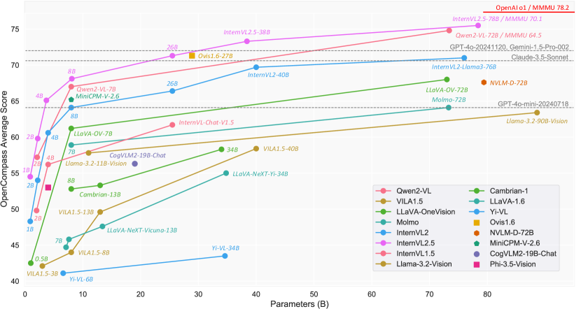
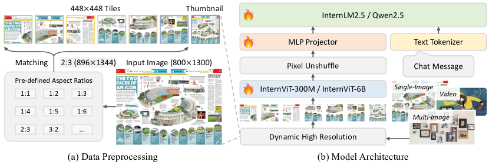
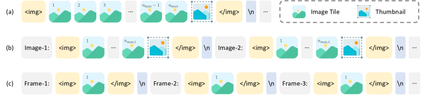
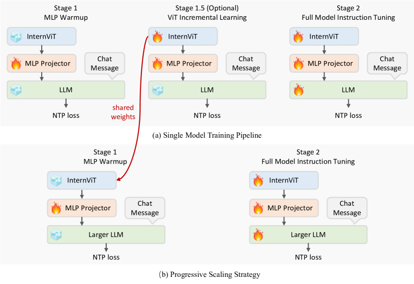
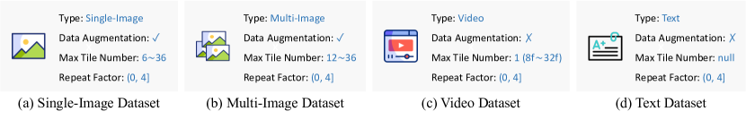
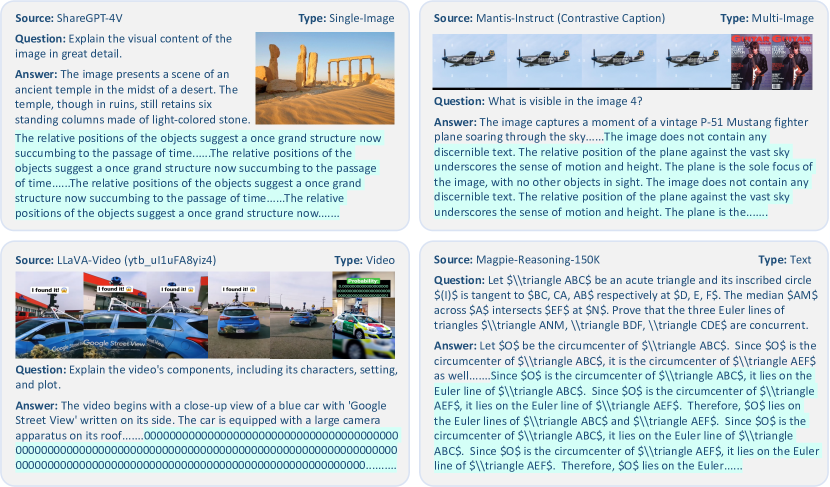
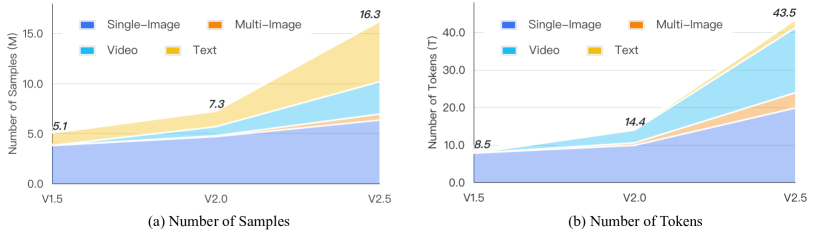
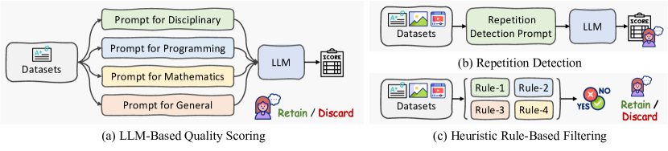
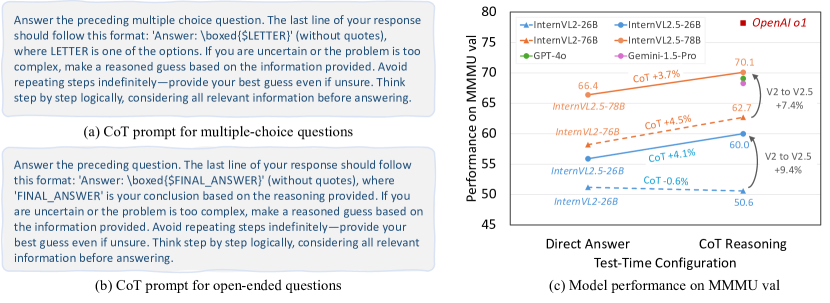
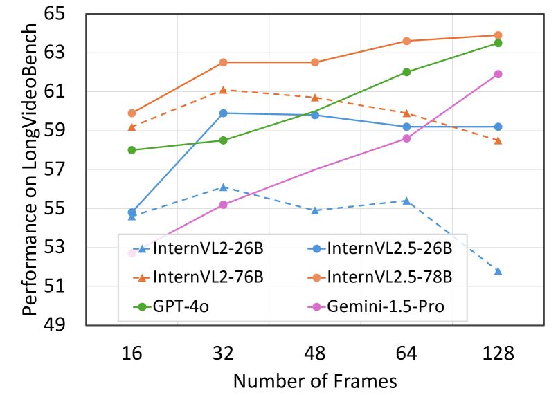

# モデル・データ・テスト時スケーリングによりオープンソースマルチモーダルモデルの性能境界を拡張する

> 原題: Expanding Performance Boundaries of Open-Source Multimodal Models with Model, Data, and Test-Time Scaling
> 著者: Zhe Chen, Weiyun Wang, Yue Cao, Yangzhou Liu, Zhangwei Gao, Erfei Cui, Jinguo Zhu, Shenglong Ye, Hao Tian, Zhaoyang Liu, Lixin Gu, Xuehui Wang, Qingyun Li, Yimin Ren, Zixuan Chen, Jiapeng Luo, Jiahao Wang, Tan Jiang, Bo Wang, Conghui He, Botian Shi, Xingcheng Zhang, Han Lv, Yi Wang, Wenqi Shao, Pei Chu, Zhongying Tu, Tong He, Zhiyong Wu, Huipeng Deng, Jiaye Ge, Kai Chen, Min Dou, Lewei Lu, Xizhou Zhu, Tong Lu, Dahua Lin, Yu Qiao, Jifeng Dai, Wenhai Wang
> 所属: Shanghai AI Laboratory / SenseTime Research / Tsinghua University / Nanjing University / Fudan University / The Chinese University of Hong Kong / Shanghai Jiao Tong University
> 出典: arXiv:2412.05271（2024 年 12 月、technical report）
> リポジトリ: <https://github.com/OpenGVLab/InternVL>
> モデル: <https://huggingface.co/OpenGVLab/InternVL2_5-78B>
> Demo: <https://huggingface.co/spaces/OpenGVLab/InternVL>

---

## Abstract（要旨）

我々は **InternVL 2.5** を導入する。これは InternVL 2.0 を基盤とする高度なマルチモーダル大規模言語モデル（MLLM）系列であり、コアモデルアーキテクチャを維持しつつ、訓練・テスト戦略とデータ品質において顕著な強化を導入する。本研究では、モデルスケーリングと性能の関係に踏み込み、視覚エンコーダ、言語モデル、データセットサイズ、テスト時設定における性能トレンドを体系的に探求する。多分野推論、文書理解、複数画像/動画理解、実世界理解、マルチモーダルハルシネーション検出、視覚的グラウンディング、多言語能力、純粋言語処理を含む幅広いベンチマークでの広範な評価を通じ、InternVL 2.5 は GPT-4o や Claude-3.5-Sonnet のような主要商用モデルに匹敵する競争力ある性能を示す。注目すべきは、**本モデルは MMMU ベンチマークで 70% を超えた初のオープンソース MLLM** であり、Chain-of-Thought（CoT）推論で **3.7 ポイントの改善** を達成し、テスト時スケーリングへの強い潜在能力を示している。

---

## 1. Introduction（はじめに）

<figure>

<figcaption>図1: OpenCompass リーダーボード上の様々な MLLM の性能。InternVL 2.5 は GPT-4o や Claude-3.5-Sonnet のような closed-source モデルに匹敵する強いマルチモーダル能力を示す。ただし OpenCompass スコアは 8 つの学術 VQA ベンチマークから算出され全能力の一部のみをカバーするため、closed-source モデルとの性能差を埋めるさらなる努力が必要。</figcaption>
</figure>

近年、マルチモーダル大規模言語モデル（MLLMs）は人工知能の重要技術として台頭し、テキスト・画像・動画など複数モダリティの情報を処理・理解できる。これらのモデルは自然言語処理・コンピュータビジョン・人間-機械対話を含む分野での突破口を約束する。しかし、大規模 MLLM の開発は依然として困難であり、膨大な計算資源、洗練されたアーキテクチャ、多様なデータタイプを拡張可能に統合する能力が必要となる。

これらの課題に対処するさまざまな試みがある: **モデルアーキテクチャの強化、視覚エンコーダと言語モデルのスケールアップ、より多様で高品質なデータセットの組込、テスト時スケーリングプロセスの精緻化**。GPT-4o や Claude-3.5-Sonnet のような注目すべき商用モデルは卓越した性能を示すが、その閉鎖的性質が透明性とアクセシビリティを制限し、オープンソースコミュニティに隔たりを残している。InternVL シリーズや Qwen-VL シリーズのようなオープンソース MLLM は高性能で透明性のある代替を提供してきたが、依然として望ましい性能と効率の水準には届かない。

本研究では、InternVL 2.0 のアーキテクチャを基盤とする高度な大規模 MLLM 系列 **InternVL 2.5** を導入する。InternVL シリーズ全体の目的を継続し、商用 closed-source モデルとオープンソースマルチモーダルモデルの性能差を埋めることを目指す。InternVL 2.5 では MLLM の各要素を体系的に探求する。具体的には以下の興味深い発見がある:

(1) **大規模視覚エンコーダは MLLM スケールアップ時の訓練データへの依存を顕著に削減する**。表 3 のとおり、600M 視覚エンコーダを装備した Qwen2-VL-72B と比較し、**6B 視覚エンコーダの InternVL2.5-78B は訓練トークンを 1/10 だけで** より良い性能を達成する。これは MLLM スケールアップ時の探索コストを大幅に削減する。

(2) **データ品質が重要**。InternVL 2.0 から 2.5 へのアップグレードでデータセットサイズは倍増したが、厳格なフィルタリングが品質を大きく改善した。例えば、**異常サンプル（繰り返しパターンなど）を慎重に除外** することで、MMMU や OlympiadBench のような **Chain-of-Thought（CoT）推論タスクで大幅改善** を達成。既存オープンソース MLLM の多くは CoT 使用時に性能低下することに注意。

(3) **テスト時スケーリングは難しいマルチモーダル QA に有益**。MMMU のような難しいタスクでは、CoT を用いた InternVL2.5-78B は **70.1%** に達し、直接応答より **3.7 ポイント高い**。さらに CoT が多数決投票（majority voting）と組み合わせて追加改善をもたらすことも検証した。

本研究の貢献は以下の 3 点である:

(1) **InternVL 2.5** をオープンソースコミュニティへリリースし、マルチモーダル AI システムの開発・応用のための強力なツールを提供
(2) 視覚エンコーダ、言語モデル、データセットサイズ、推論時間など MLLM の各要素のスケーリングが性能にどう影響するかを調査
(3) 多分野推論、文書理解、複数画像/動画理解、実世界理解、ハルシネーション検出、視覚的グラウンディング、多言語、純粋言語処理を含む広範な評価で、InternVL 2.5 は GPT-4o や Claude-3.5-Sonnet のような主要商用モデルに匹敵し、**MMMU 検証セットで 70% を超えた初のオープンソース MLLM** として新ベンチマークを打ち立てる

---

## 2. Model Architecture（モデルアーキテクチャ）

<figure>

<figcaption>図2: 全体アーキテクチャ。InternVL 2.5 は InternVL 1.5 / 2.0 と同じモデルアーキテクチャを保持、すなわち広く使われる「ViT-MLP-LLM」パラダイムを採用し、事前学習済み InternViT-300M または InternViT-6B を様々サイズの LLM と MLP プロジェクタで接続する。前バージョンと同様、pixel unshuffle で各 448×448 画像タイルの 1024 視覚トークンを 256 トークンに削減。InternVL 2.0/2.5 は InternVL 1.5 と比較し追加データタイプ（複数画像・動画）を導入。</figcaption>
</figure>

### 2.1 Overall Architecture（全体アーキテクチャ）

図 2 と表 2 に示すように、InternVL 2.5 は前身の InternVL 1.5 と InternVL 2.0 と同じモデルアーキテクチャを保持し、種々の MLLM 研究で広く採用される **「ViT-MLP-LLM」パラダイム** に従う。

本バージョンでは、新たに段階的事前学習された InternViT-6B または InternViT-300M を、種々のサイズ・タイプの事前学習済み LLM（**InternLM 2.5**, **Qwen 2.5** を含む）と、ランダム初期化された 2 層 MLP プロジェクタで統合する。前バージョンと同様、高解像度処理のスケーラビリティを高めるため pixel unshuffle 操作で視覚トークン数を元の 1/4 に削減。448×448 画像タイルは 256 視覚トークンで表現される。

入力データ前処理は InternVL 1.5 と同様の動的解像度戦略を採用。重要な違いは、InternVL 2.0 から **複数画像と動画データのサポート** が追加されたこと。

### 2.2 Vision Encoder（視覚エンコーダ）

InternVL は **InternViT** を視覚エンコーダとして採用。InternViT は **InternViT-6B** と **InternViT-300M** の 2 モデルサイズが存在。

**InternViT-6B**。**InternViT-6B-224px** は CVPR 論文（[[entities/internvl|InternVL 1.0]]）で初出。vanilla ViT 構造に **QK-Norm + RMSNorm** を組み込んだ軽微な調整。5.9B パラメータ、48 層、hidden size 3200、25 heads、対比損失で訓練。当時の利得が限定的だったため、段階的事前学習で重みを継続精緻化。InternViT-6B を MLP プロジェクタで LLM に接続、短い MLP ウォームアップ後、**next token prediction (NTP) 損失** で共同訓練し視覚特徴抽出能力を高めた。V1.0 と V1.2 では 448×448 固定解像度、後のバージョンで動的解像度へ。[[entities/internvl-1-5|InternVL 1.5]] レポートで述べたように、**最後の 3 層を削除して 48 → 45 層へ**（これら層が CLIP 損失目的に強く整列し、ローカル情報よりグローバル整列を優先するため）。すべての後続バージョン（最新 **InternViT-6B-448px-V2.5** 含む）は 45 層、5.5B パラメータ。

**InternViT-300M**。**InternViT-300M-448px-Distill** は教師モデル InternViT-6B-448px-V1.5 から **cosine 蒸留損失** で蒸留した派生版。0.3B パラメータ、24 層、hidden size 1024、16 attention heads。6B 版と異なり、QK-Norm なしの **標準 LayerNorm** を採用。蒸留コスト削減のため可能な限り CLIP-ViT-Large-336px で初期化。蒸留後、LLM と統合し動的高解像度 + NTP 損失で訓練、視覚エンコーダのみ抽出して **InternViT-300M-448px** としてリリース。本レポートでは、より多様なデータ混合で NTP 損失により段階的事前学習を行い、**InternViT-300M-448px-V2.5** へ強化。

**表1**: InternViT-6B / 300M モデル詳細。

| Model Name | Train Res. | Width | Depth | MLP | #Heads | QK-Norm | Norm | Loss | #Param |
|---|---|---|---|---|---|---|---|---|---|
| InternViT-6B-224px | fixed 224 | 3200 | 48 | 12800 | 25 | ✓ | RMS | CLIP | 5.9B |
| InternViT-6B-448px-V1.0 | fixed 448 | 3200 | 48 | 12800 | 25 | ✓ | RMS | NTP | 5.9B |
| InternViT-6B-448px-V1.2 | fixed 448 | 3200 | 45 | 12800 | 25 | ✓ | RMS | NTP | 5.5B |
| InternViT-6B-448px-V1.5 | dynamic 448 | 3200 | 45 | 12800 | 25 | ✓ | RMS | NTP | 5.5B |
| **InternViT-6B-448px-V2.5** | **dynamic 448** | **3200** | **45** | **12800** | **25** | **✓** | **RMS** | **NTP** | **5.5B** |
| InternViT-300M-448px-Distill | fixed 448 | 1024 | 24 | 4096 | 16 | ✗ | LN | Cosine | 0.3B |
| InternViT-300M-448px | dynamic 448 | 1024 | 24 | 4096 | 16 | ✗ | LN | NTP | 0.3B |
| **InternViT-300M-448px-V2.5** | **dynamic 448** | **1024** | **24** | **4096** | **16** | **✗** | **LN** | **NTP** | **0.3B** |

**表2**: InternVL シリーズで使用された事前学習モデル。InternVL 2.5 系列では視覚エンコーダと言語モデル両方をアップグレードし性能向上。

| Model | #Param | Vision Encoder | LLM | OpenCompass |
|---|---|---|---|---|
| InternVL-Chat-V1.5 | 25.5B | InternViT-6B-V1.5 | InternLM2-Chat-20B | 61.7 |
| InternVL2-1B | 0.9B | InternViT-300M | Qwen2-0.5B-Instruct | 48.3 |
| InternVL2-2B | 2.2B | InternViT-300M | InternLM2-Chat-1.8B | 54.0 |
| InternVL2-4B | 4.2B | InternViT-300M | Phi-3-Mini | 60.6 |
| InternVL2-8B | 8.1B | InternViT-300M | InternLM2.5-7B-Chat | 64.1 |
| InternVL2-26B | 25.5B | InternViT-6B-V1.5 | InternLM2-Chat-20B | 66.4 |
| InternVL2-40B | 40.1B | InternViT-6B-V1.5 | Nous-Hermes-2-Yi-34B | 69.7 |
| InternVL2-Llama3-76B | 76.3B | InternViT-6B-V1.5 | Hermes-2-Theta-Llama-3-70B | 71.0 |
| **InternVL2.5-1B** | **0.9B** | InternViT-300M-V2.5 | Qwen2.5-0.5B-Instruct | **54.5** |
| **InternVL2.5-2B** | **2.2B** | InternViT-300M-V2.5 | InternLM2.5-1.8B-Chat | **59.8** |
| **InternVL2.5-4B** | **3.7B** | InternViT-300M-V2.5 | Qwen2.5-3B-Instruct | **65.1** |
| **InternVL2.5-8B** | **8.1B** | InternViT-300M-V2.5 | InternLM2.5-7B-Chat | **68.1** |
| **InternVL2.5-26B** | **25.5B** | InternViT-6B-V2.5 | InternLM2.5-20B-Chat | **71.3** |
| **InternVL2.5-38B** | **38.4B** | InternViT-6B-V2.5 | Qwen2.5-32B-Instruct | **73.3** |
| **InternVL2.5-78B** | **78.4B** | InternViT-6B-V2.5 | Qwen2.5-72B-Instruct | **75.5** |
| InternVL2.5-Pro | – | InternViT-6B-V2.5 | – | – |

### 2.3 Large Language Model（大規模言語モデル）

表 2 に InternVL 1.5 / 2.0 / 2.5 で使用した言語モデルを示す。**InternVL 2.5 では言語バックボーンを最新 SOTA モデル（InternLM 2.5 と Qwen 2.5）に全面アップグレード**。

<figure>

<figcaption>図3: 各データタイプのデータ形式の図解。(a) 単一画像データセットでは最大タイル数 n_max を 1 画像に全割当、最大解像度を保証。(b) 複数画像データセットでは合計タイル数をサンプル内全画像に比例分配。(c) 動画データセットでは n_max=1 とし各フレームを 448×448 固定解像度にリサイズ。</figcaption>
</figure>

---

## 3. Training Strategy（訓練戦略）

### 3.1 Dynamic High-Resolution for Multimodal Data（マルチモーダルデータの動的高解像度）

InternVL 2.0/2.5 では InternVL 1.5 で導入された動的高解像度訓練アプローチを拡張し、**複数画像・動画データセット** への対応を強化。主に以下のステップから成る。

**Closest Aspect Ratio Matching（最近傍アスペクト比マッチング）**。入力画像 I（次元 W×H）が与えられたとき、アスペクト比 r = W/H を計算。タイルサイズ S×S（S=448）にリサイズし、歪み最小の最近傍アスペクト比を選択。タイル数 n_tiles は事前定義範囲 [n_min, n_max] 内に制約。

目標アスペクト比集合 𝓡 = { i/j | 1 ≤ i,j ≤ n, i×j ∈ [n_min, n_max] }

最適アスペクト比 r_best は元アスペクト比 r と各候補 r_target との差を最小化することで選択。複数候補が同じ差を生む場合（例: 1:2 と 2:4）、面積が元画像の 2 倍以下となるものを優先（低解像度画像の過度な拡大防止）。

**Image Resizing and Splitting（画像リサイズと分割）**。新次元 W_new = S × i_best、H_new = S × j_best にリサイズ後、S×S タイルに分割。n_tiles = i_best × j_best。

**Thumbnail Generation（サムネイル生成）**。n_tiles > 1 の場合のみ、元画像 I を S×S 正方形にリサイズしサムネイル I_thumb を生成、タイル列に追加。

**Data Formats for Different Data Types**。

- **単一画像データセット**: n_max を 1 画像に全割当、最大解像度。視覚トークンを `` `</img>` で包む
- **複数画像データセット**: n_max をサンプル内全画像に比例分配（n_max,i = max(1, ⌊n_max / N_image⌋)）。各画像に Image-1, Image-2 等の補助タグ
- **動画データ**: n_max=1 に簡略化。各動画フレームを 448×448 にリサイズ、タイル分割なし。訓練時 32 や 64 フレーム抽出される（8,192 や 16,384 視覚トークンに相当）。Frame-1 等のタグを付与

### 3.2 Single Model Training Pipeline（単一モデル訓練パイプライン）

<figure>

<figcaption>図4: 訓練パイプラインと段階的スケーリング戦略の図解。(a) 単一モデル訓練パイプライン。Stage 1（MLP warmup）+ 任意 Stage 1.5（ViT incremental learning）+ Stage 2（full model instruction tuning）の 3 段階。(b) 段階的スケーリング戦略。早期段階で小型 LLM と訓練した ViT モジュールを大型 LLM に容易統合、低コストでスケーラブルなモデル整列が可能。</figcaption>
</figure>

InternVL 2.5 単一モデル訓練パイプラインは 3 段階構成。

**Stage 1: MLP Warmup**。MLP プロジェクタのウォームアップで開始。MLP のみ訓練可、視覚エンコーダ・LLM は凍結。**この段階から動的高解像度戦略を使用** （訓練コスト増だが性能最適化のため）。表 4 の事前学習データ混合を使用、ChatML 形式 + NTP 損失で最適化。高めの学習率で収束加速。

**Stage 1.5: ViT Incremental Learning（任意）**。視覚エンコーダの段階的学習。視覚エンコーダ + MLP の両方が訓練可、Stage 1 と同じデータ + NTP 損失。Web スケールデータ（LAION-5B 等）で希少なドメイン（多言語 OCR、数学チャート等）の特徴抽出能力を強化。低い学習率で catastrophic forgetting を防止。**訓練済み ViT は再訓練不要で異なる LLM で再利用可能**、Stage 1.5 は任意。

**Stage 2: Full Model Instruction Tuning**。最終段階、**全モデル（ViT + MLP + LLM）が訓練可**。データ品質が極めて重要。**少数のノイズサンプル（数千程度）でもモデルの異常挙動（繰り返し出力等）を招く**。厳格なデータ品質管理を実施。全モデルに統一学習率を適用。Stage 3（後訓練、選好最適化等）は将来の課題。

### 3.3 Progressive Scaling Strategy（段階的スケーリング戦略）

視覚エンコーダ（InternViT）と LLM を効率的に整列する **段階的スケーリング戦略** を提案。**「ViT と LLM を NTP 損失で共同訓練しても、得られる視覚特徴は他の LLM が容易理解できる汎用表現になる」** という観察に基づく。

Stage 1.5 で InternViT を小型 LLM（例: 20B）と訓練、基本視覚能力とクロスモーダル整列を最適化。共有重み機構により、訓練済み InternViT を大型 LLM（例: 72B）へ再訓練なしで転送可能。大型モデル訓練時には Stage 1.5 を **スキップ** できる。

**Qwen2-VL は累計 1.4T トークン処理に対し、InternVL2.5-78B はわずか ~120B トークン** で訓練（**Qwen2-VL の 1/10 未満**）。資源制約環境で特に有利。

### 3.4 Training Enhancements（訓練強化）

**Random JPEG Compression**。過学習回避と実世界性能向上のため、空間情報を保持するデータ拡張として **品質 75-100 のランダム JPEG 圧縮** を適用。インターネット画像によく見られる劣化をシミュレート。

**Loss Reweighting**。NTP 損失重み付けに **square averaging**（w_i = 1/x^0.5）を採用。token averaging（応答長の長いものに勾配が偏る）と sample averaging（短い応答を優先しユーザ体験悪化）の中間を取る平方根スキーム。

<figure>

<figcaption>図5: データセット設定。InternVL 2.0/2.5 ではデータ拡張を画像データのみに選択的適用、動画・テキストでは無効化。最大タイル数 n_max は入力解像度を制御（複数画像で大、動画で小）。繰り返し係数 r でデータセットサンプリング頻度を調整、頑健でバランスの取れた訓練を保証。</figcaption>
</figure>

---

## 4. Data Organization（データ構成）

### 4.1 Dataset Configuration（データセット設定）

3 つの主要パラメータで制御:

- **Data Augmentation**: 画像データセットで有効、動画では無効（フレーム品質統一のため）
- **Maximum Tile Number n_max**: 複数画像/高解像度文書 n_max=24/36、低解像度画像 6/12、動画 1（InternVL 1.5 は全データ統一 12）
- **Repeat Factor r ∈ (0, 4]**: r<1 でダウンサンプリング、r>1 でアップサンプリング、データセット重みをバランス調整

### 4.2 Multimodal Data Packing（マルチモーダルデータパッキング）

GPU 利用率向上と訓練効率改善のためデータパッキング戦略を実装。複数サンプルを長い系列に連結することでパディング削減。**2 次元考慮**: (a) LLM 用系列長 l_max、(b) ViT 用画像タイル数 t_max。

**4 ステップ手順**: Select（独立サンプリング + 閾値超過時切詰）→ Search（バッファから連結可能な相棒探索、二分探索で高速化）→ Pack（連結、サンプル間 attention 不可、位置 index 独立）→ Maintain（閾値超過なら yield、未達ならバッファ挿入）

<figure>

<figcaption>図6: オープンソースデータセット内の異常サンプルの可視化。単一画像・複数画像・動画・純粋テキストすべてのデータタイプに異常サンプルが存在し、「繰り返しパターン」が顕著問題。テスト時スケーリングに最も有害な問題の 1 つで、長文出力や CoT 推論タスクでモデルをループに陥らせる。ファインチューニングデータ混合の徹底フィルタリングで一部緩和可能。</figcaption>
</figure>

### 4.3 Data Filtering Pipeline（データフィルタリングパイプライン）

**重要観察**: LLM は視覚エンコーダよりデータノイズに **顕著に敏感**。Stage 2 で全重み訓練可時、**わずか数千の異常サンプル**（繰り返しパターン等）でも推論時の異常挙動を招く。

**繰り返し生成は最も有害な問題の 1 つ**。フィルタリングパイプラインを設計:

**純粋テキストデータの 3 戦略**:
1. **LLM-Based Quality Scoring**: ドメイン別（学術 / プログラミング / 数学 / 汎用）に LLM がスコア 0-10 を付与、閾値（7 等）以下を除去
2. **Repetition Detection**: LLM + 専用プロンプトで繰り返しパターン検出、閾値（3 等）以下は人手レビュー後除去
3. **Heuristic Rule-Based Filtering**: 異常長文、過度のゼロ列、過度の重複行など

**マルチモーダルデータ**: スコアリングが困難なため繰り返し検出 + ヒューリスティック規則のみ適用。学術データは免除。

> このフィルタリングが **CoT 推論タスクで顕著改善**。ただしフィルタリング単体では問題完全解消は不可能（LLM 事前学習段階のノイズが残る）。

<figure>

<figcaption>図7: ファインチューニングデータ混合の統計。InternVL 1.5 → 2.0 → 2.5 でサンプル数とトークン数が段階的増加。単一画像・複数画像・動画・テキスト各タイプの統計を示す。データ規模と多様性の反復改善を反映、マルチモーダル理解能力を強化。</figcaption>
</figure>

<figure>

<figcaption>図8: データセットフィルタリングパイプライン。テキストデータには (a) LLM スコアリング、(b) 繰り返し検出、(c) ヒューリスティック規則の 3 手法。マルチモーダルデータには (b) と (c) のみ適用。</figcaption>
</figure>

### 4.4 / 4.5 Pre-training / Fine-tuning Data Mixture（事前/ファインチューニングデータ混合）

事前学習データ（表 4）: Captioning, General QA, Mathematics, Chart, OCR, Knowledge, Grounding, Document, Conversation, Medical, GUI など広範ドメイン + 動画。会話形式に変換。Stage 1/1.5 ではパラメータが限定されているため、低品質・高品質データ両方を含める。

ファインチューニングデータ（表 5）: 慎重キュレーション、高品質のみ。**InternVL 1.5: 5.1M → 2.0: 7.3M → 2.5: 16.3M サンプル**（**InternVL 2.0 の倍**）。**InternVL 2.5 構成: 単一画像 45.92%、複数画像 9.37%、動画 39.79%、純粋テキスト 4.92%**。複数画像・動画が最も増加。多言語対応（en / zh + ko / ja / it / ru / de / fr / th / ar / vi）。

---

## 5. Evaluation on Multimodal Capability（マルチモーダル能力評価）

### 5.1 Multimodal Reasoning and Mathematics（多分野推論 + 数学）

**MMMU**（大学レベル、6 分野多分野ベンチマーク）、**MMMU-Pro**（強化版）、**MathVista**, **MATH-Vision**, **MathVerse**, **OlympiadBench** で評価。

**表6 主要結果**:

| Model | MMMU(val) | MMMU-Pro(std/vision/overall) | MathVista | MATH-Vision(mini/full) | MathVerse | OlympiadBench |
|---|---|---|---|---|---|---|
| InternVL2.5-1B | 40.9 | 23.3/15.5/19.4 | 43.2 | 16.8/14.4 | 28.0 | 1.7 |
| InternVL2.5-2B | 43.6 | 27.3/20.1/23.7 | 51.3 | 13.5/14.7 | 30.6 | 2.0 |
| InternVL2.5-4B | 52.3 | 36.4/29.0/32.7 | 60.5 | 21.7/20.9 | 37.1 | 3.0 |
| InternVL2.5-8B | 56.0 | 38.2/30.4/34.3 | 64.4 | 22.0/19.7 | 39.5 | 4.9 |
| InternVL2.5-26B | 60.0 | 41.6/32.6/37.1 | 67.7 | 28.0/23.1 | 40.1 | 8.8 |
| InternVL2.5-38B | 63.9 | 48.0/44.0/46.0 | 71.9 | 32.2/31.8 | 49.4 | 12.1 |
| GPT-4V | 63.1 | – | 58.1 | –/24.0 | 32.8 | 18.0 |
| GPT-4o-20240513 | 69.1 | 54.0/49.7/51.9 | 63.8 | –/30.4 | 50.2 | 25.9 |
| Claude-3.5-Sonnet | 68.3 | 55.0/48.0/51.5 | 67.7 | – | – | – |
| Gemini-1.5-Pro | 62.2 | 49.4/44.4/46.9 | 63.9 | –/19.2 | – | – |
| Qwen2-VL-72B | 64.5 | 49.2/43.3/46.2 | 70.5 | –/25.9 | – | – |
| InternVL2-Llama3-76B | 62.7 | 41.9/38.0/40.0 | 65.5 | 23.7/23.6 | 42.8 | 5.5 |
| **InternVL2.5-78B** | **70.1** | **51.4/45.9/48.6** | **72.3** | **34.9/32.2** | **51.7** | **11.6** |

<figure>

<figcaption>図9: モデルテストに使用した CoT プロンプト。これらを活用してテスト時間を拡張、MMMU 等での InternVL 2.5 の性能を顕著に向上。</figcaption>
</figure>

**主要観察**: 
- InternVL2.5-78B が **MMMU val 70.1** で **MMMU 70% 突破最初のオープン MLLM**、InternVL2-76B から +7.4
- 多数決投票（majority voting）が CoT 推論をさらに改善（InternVL2-76B で 62.7 → 65.3）
- 数学では OlympiadBench で 2.0 系より大幅改善（フィルタリングが CoT デッドロックを軽減）

### 5.2 OCR, Chart, and Document Understanding（OCR・チャート・文書）

**表7 主要結果**（AI2D / ChartQA / TextVQA / DocVQA / InfoVQA / OCRBench / SEED-2Plus / CharXiv / VCR-EN-Easy）:

| Model | AI2D(w/wo M) | ChartQA | DocVQA | InfoVQA | OCRBench | CharXiv(RQ/DQ) | VCR-EN-Easy(EM/Jaccard) |
|---|---|---|---|---|---|---|---|
| InternVL2.5-2B | 74.9/83.5 | 79.2 | 88.7 | 60.9 | 804 | 21.3/49.7 | **93.2/97.6** |
| InternVL2.5-8B | 84.5/92.8 | 84.8 | 93.0 | 77.6 | 822 | 32.9/68.6 | 92.6/97.4 |
| InternVL2.5-26B | 86.4/94.4 | 87.2 | 94.0 | 79.8 | 852 | 35.9/73.5 | 94.4/98.0 |
| InternVL2.5-38B | 87.6/95.1 | 88.2 | 95.3 | 83.6 | 842 | 42.4/79.6 | 94.7/98.2 |
| GPT-4o | 84.6/94.2 | 85.7 | 92.8 | 79.2 | 736 | 47.1/84.5 | 91.6/96.4 |
| Claude-3.5-Sonnet | 81.2/94.7 | 90.8 | 95.2 | 74.3 | 788 | 60.2/84.3 | 63.9/74.7 |
| Qwen2-VL-72B | 88.1/– | 88.3 | **96.5** | **84.5** | **877** | – | 91.3/94.6 |
| **InternVL2.5-78B** | **89.1/95.7** | 88.3 | 95.1 | 84.1 | 854 | 42.4/82.3 | **95.7/94.5** |

**主要観察**: 
- VCR-EN-Easy で 2B モデルが 32.9 → 93.2 と劇的改善（22K サンプル追加の効果）
- 2B 級では Qwen2-VL-2B（600M 視覚 + 1.5B LLM）が OCR で優位、InternVL2.5-2B（300M 視覚 + 1.8B LLM）の課題

### 5.3 Multi-Image Understanding（複数画像理解）

**表8 主要結果**:

| Model | BLINK | Mantis Eval | MMIU | MuirBench | MMT(val) | MIRB(avg) |
|---|---|---|---|---|---|---|
| InternVL2.5-8B | 54.8 | 67.7 | 46.7 | 51.1 | 62.3 | 52.5 |
| InternVL2.5-26B | 61.8 | 75.6 | 49.4 | 61.1 | 66.9 | 55.7 |
| InternVL2.5-38B | 63.2 | 78.3 | 55.3 | 62.7 | 70.0 | 61.2 |
| GPT-4o | 68.0 | – | 55.7 | 68.0 | 65.4 | – |
| **InternVL2.5-78B** | 63.8 | 77.0 | **55.8** | 63.5 | **70.8** | 61.1 |

InternVL2.5-78B は MMIU で GPT-4o とほぼ並ぶ（55.8 vs 55.7）、MMT-Bench で GPT-4o 超え（70.8 vs 65.4）。

### 5.4 Real-World Comprehension（実世界理解）

**表8 右部**: RealWorldQA, MME-RealWorld, WildVision（GPT-4o jury）, R-Bench で評価。InternVL2.5-78B は実世界ベンチで主導的性能。**WildVision 71.4 vs GPT-4o 80.6**: 長応答生成と人間嗜好整合に未だ改善余地。

### 5.5 Comprehensive Multimodal Evaluation（総合マルチモーダル評価）

**表9 主要結果**（MME / MMBench EN/CN / MMVet / MMVet v2 / MMStar / HallBench / MMHal / CRPE / POPE）:

| Model | MME(sum) | MMB(EN/CN) | MMVet(turbo) | MMVet v2 | MMStar |
|---|---|---|---|---|---|
| InternVL2.5-8B | 2344.1 | 84.6/82.6 | 62.8 | 58.1 | 62.8 |
| InternVL2.5-26B | 2373.3 | 85.4/85.5 | 65.0 | 60.8 | 66.5 |
| InternVL2.5-38B | 2455.8 | 86.5/86.3 | 68.8 | 62.1 | 67.9 |
| GPT-4o | – | 83.4/82.1 | 69.1 | 71.0 | 64.7 |
| Claude-3.5-Sonnet | – | 82.6/83.5 | 70.1 | 71.8 | 65.1 |
| Qwen2-VL-72B | 2482.7 | 86.5/86.6 | 74.0 | 66.9 | 68.3 |
| **InternVL2.5-78B** | **2494.5** | **88.3/88.5** | 72.3 | 65.5 | **69.5** |

InternVL2.5-78B が MME（2494.5）、MMB-EN/CN（88.3/88.5）、MMStar（69.5）で SOTA。

### 5.6 Multimodal Hallucination Evaluation（ハルシネーション）

**HallusionBench / MMHal / CRPE / POPE** で評価。InternVL2.5-78B は HallusionBench 57.4 で Qwen2-VL-72B (58.1) / GPT-4o (55.0) と競合。

### 5.7 Visual Grounding（視覚的グラウンディング）

**表10**: RefCOCO / RefCOCO+ / RefCOCOg。

| Model | RefCOCO avg | RefCOCO+ avg | RefCOCOg avg | **overall avg** |
|---|---|---|---|---|
| Qwen2-VL-72B | 93.1 | 89.8 | 90.2 | 91.1 |
| InternVL2-Llama3-76B | 91.8 | 88.2 | 89.9 | 90.0 |
| **InternVL2.5-78B** | **93.9** | **90.7** | **92.5** | **92.3** |

InternVL2.5-78B が **92.3 で SOTA**、Qwen2-VL-72B を +1.2 上回る。

### 5.8 Multimodal Multilingual Understanding（多言語）

**MMMB / Multilingual MMBench**（en/zh/pt/ar/tr/ru）、**MTVQA**（9 言語）で評価。InternVL2.5-78B は Qwen2-VL-72B と類似性能（**多言語能力は基盤 LLM に大きく依存**）。

### 5.9 Video Understanding（動画理解）

**表12 主要結果**（Video-MME / MVBench / MMBench-Video / MLVU / LongVideoBench / CG-Bench）:

| Model | Video-MME(wo/w sub) | MVBench | MMBench-Video | MLVU | LongVideoBench |
|---|---|---|---|---|---|
| InternVL2.5-8B | 64.2/66.9 | 72.0 | 1.68 | 68.9 | 60.0 |
| InternVL2.5-38B | 70.7/73.1 | 74.4 | 1.82 | 75.3 | 63.3 |
| GPT-4o | 71.9/77.2 | – | 1.63 | 64.6 | 66.7 |
| Gemini-1.5-Pro | 75.0/81.3 | – | 1.30 | – | 64.0 |
| Qwen2-VL-72B | 71.2/77.8 | 73.6 | 1.70 | – | – |
| **InternVL2.5-78B** | 72.1/74.0 | **76.4** | **1.97** | **75.7** | 63.6 |

**重要発見**: InternVL 2.5 は **入力フレーム数増加に対する高いスケーラビリティ**（フレーム数を 4-24 → 8-32 に拡張）。InternVL 2.0 は 16 or 32 フレームで頭打ちだが、2.5 は増加とともに改善。

<figure>

<figcaption>図10: LongVideoBench での入力動画フレーム数変化時の性能。</figcaption>
</figure>

---

## 6. Evaluation on Language Capability（言語能力評価）

17 純粋言語ベンチマーク（MMLU / CMMLU / C-Eval / GAOKAO / TriviaQA / NaturalQuestions / C3 / RACE / WinoGrande / HellaSwag / BBH / GSM8K / MATH / TheoremQA / HumanEval / MBPP / MBPP-CN）で評価。

**重要発見**: InternVL 2.0 は基盤 LLM より純粋言語性能が若干低下（InternVL2-2B: -2.1、InternVL2-8B: -2.3）。InternVL 2.5 は **高品質オープンソース言語指示データ + 厳格フィルタリング** で改善、多くのタスクで基盤 LLM と同等以上。

| Dataset | InternVL2-2B → 2.5-2B | InternVL2-8B → 2.5-8B | InternVL2-26B → 2.5-26B |
|---|---|---|---|
| 平均（17 ベンチ） | 39.2 → **48.4 (+9.2)** | 67.2 → **70.0 (+2.8)** | 64.2 → **72.9 (+8.7)** |
| vs 基盤 LLM | -2.1 → **+0.8** | -2.3 → **+0.5** | +0.2 → **+1.4** |

「**高品質言語データの補充は MLLM の純粋言語能力を保持し、マルチモーダルタスクの強力な基盤も確立する**」。

---

## 7. Evaluation on Vision Capability（視覚能力評価）

### 7.1 Image Classification（画像分類）

**表14 ImageNet-1K + 5 variants（IN-ReaL / V2 / A / R / Sketch）の linear probing と attention pooling probing**:

| Model | Linear avg | Attn Pool avg | Δ |
|---|---|---|---|
| InternViT-6B-224px | 82.5 | 85.5 | 3.0 |
| InternViT-6B-448px-V1.0 | 80.6 | 85.9 | 5.3 |
| InternViT-6B-448px-V1.2 | 79.4 | 85.8 | 6.4 |
| InternViT-6B-448px-V1.5 | 77.9 | 85.1 | **7.2** |
| **InternViT-6B-448px-V2.5** | **78.5** | **85.2** | **6.7** |

**興味深い傾向**: InternViT のバージョン更新で **linear probing 性能が低下、attention pooling は維持**。Δ（差）が 3.0 → 6.7 と拡大、これは **最終層の特徴が線形分離性を失う一方、より複雑・非線形な意味表現を獲得していることを示唆**。MLLM 用途では好ましい性質（catastrophic forgetting なし、open-set 意味捕捉）。

### 7.2 Semantic Segmentation（セマンティックセグメンテーション）

**表15 ADE20K + COCO-Stuff-164K の linear probing / head tuning (UperNet) / full tuning**:

| Model | Linear avg | Head Tune avg | Full Tune avg | Δ₁ | Δ₂ |
|---|---|---|---|---|---|
| InternViT-6B-224px | 45.0 | 51.9 | 55.3 | 6.9 | 10.2 |
| InternViT-6B-448px-V1.0 | 41.0 | 52.4 | 54.9 | 11.3 | 13.9 |
| InternViT-6B-448px-V1.2 | 38.4 | 52.0 | 55.2 | 13.6 | 16.8 |
| InternViT-6B-448px-V1.5 | 38.6 | 52.0 | 55.2 | 13.4 | 16.6 |
| **InternViT-6B-448px-V2.5** | **37.5** | **52.6** | **55.2** | **15.1** | **17.7** |

セグメンテーションでも同じ傾向: linear probing 低下、head tuning / full tuning は維持または改善。**Δ₁, Δ₂ が拡大**、**ViT incremental learning が non-linear / open-set 特徴を効果的に蓄積している** ことを実証。

---

## 8. Conclusion（結論）

本研究では **InternVL 2.5** を導入した。InternVL 2.0 のアーキテクチャを基盤とし、訓練・テスト戦略、データ品質を顕著に改善した先進オープンソース MLLM 系列。視覚エンコーダ・言語モデル・データセットサイズ・テスト時設定のスケーリングと性能の関係を体系的探求。多分野推論・文書理解・動画理解・多言語等の幅広い評価で競争力ある性能を達成。**MMMU で 70% を超えた初のオープンソース MLLM** であり、OpenAI o1 のような商用モデルとの差を縮めた。

---

## Acknowledgement（謝辞）

本研究は中国国家重点 R&D プログラム、国家自然科学基金、China Mobile Zijin Innovation Institute、青年博士学生研究プロジェクトの支援を受けた。
