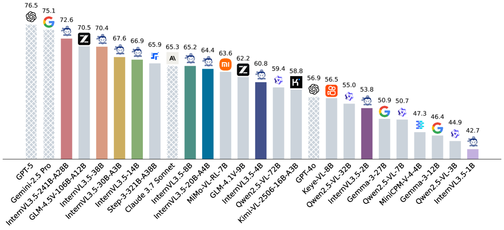
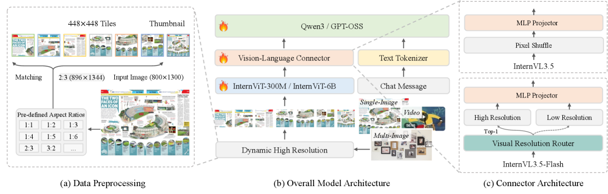
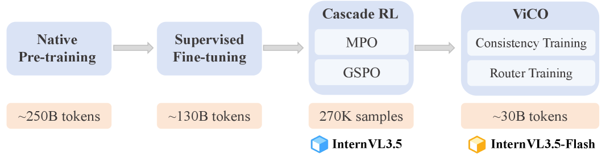
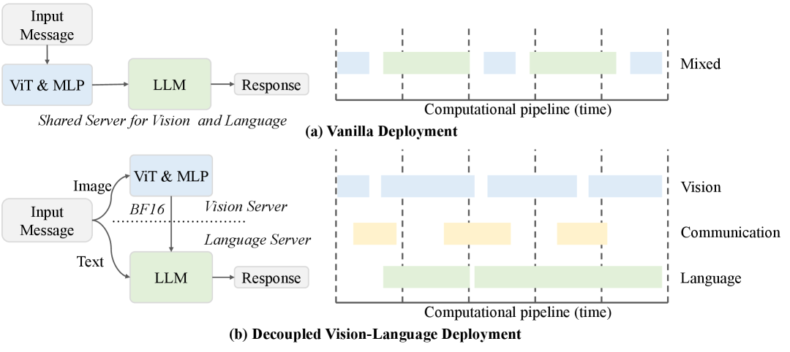
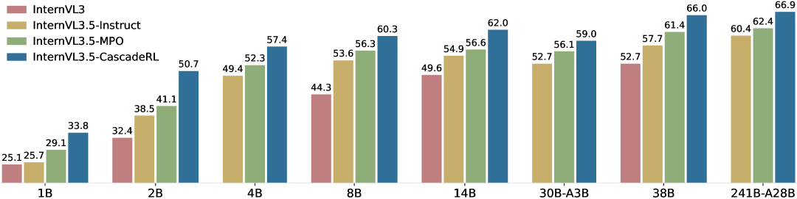

# InternVL3.5: オープンソースマルチモーダルモデルを汎用性・推論能力・効率性で前進させる

> 原題: InternVL3.5: Advancing Open-Source Multimodal Models in Versatility, Reasoning, and Efficiency
> 著者: Weiyun Wang, Zhangwei Gao, Lixin Gu, Hengjun Pu, Long Cui, Xingguang Wei, Zhaoyang Liu, ら 70+ 名（Shanghai AI Laboratory InternVL Team）
> 出典: arXiv:2508.18265（2025 年 8 月、technical report）
> リポジトリ: <https://github.com/OpenGVLab/InternVL>
> モデル: <https://huggingface.co/OpenGVLab/InternVL3_5-241B-A28B>

---

## Abstract（要旨）

我々は **InternVL3.5** を導入する。これは InternVL シリーズに沿って **汎用性・推論能力・推論効率** を大きく前進させる新しいオープンソース・マルチモーダルモデルファミリーである。鍵となるイノベーションは **Cascade Reinforcement Learning (Cascade RL) フレームワーク** で、2 段階プロセスを通じて推論能力を強化する: **(1) 安定収束のための offline RL、(2) 精緻な整列のための online RL**。この **coarse-to-fine** 訓練戦略は MMMU や MathVista のような下流推論タスクで大幅な改善をもたらす。効率を最適化するため **Visual Resolution Router (ViR)** を提案し、性能を犠牲にせず視覚トークンの解像度を動的に調整する。ViR と組み合わせ、**Decoupled Vision-Language Deployment (DvD) 戦略** は視覚エンコーダと言語モデルを別の GPU に分離して計算負荷を効果的にバランスする。これらの貢献により、InternVL3.5 は **前身 InternVL3 と比較して全体推論性能で最大 +16.0% 向上、推論で 4.05× の高速化** を達成。さらに **GUI 対話と embodied 知能** という新しい能力もサポートする。注目すべきは、最大モデル **InternVL3.5-241B-A28B** が、一般マルチモーダル・推論・テキスト・agentic タスクの全領域で **オープンソース MLLM の SOTA** を達成、**GPT-5 のような主要商用モデルとの性能差を縮める**。**すべてのモデルとコードを公開**。

---

## 1. Introduction（はじめに）

近年の MLLM トレンドは単純なマルチモーダル理解を超え、**テキスト関連タスク、推論タスク、agentic タスク** のような一般的で複雑かつ現実的なタスクに焦点を移している。これらの領域では商用モデルが現在のオープンソースモデルと **大きなギャップ** を生み出している。そのため、最近のオープンソースの取り組みは **高度な強化学習（RL）手法** でこの差を埋め、より高いマルチモーダル知能を追求している。しかし、RL アルゴリズムや verifiers への多大な努力にもかかわらず、**MLLM 向けの安定・効果的・スケーラブルな強化学習フレームワーク** はコミュニティでまだ open problem である。さらに、長視覚文脈や高解像度理解などのマルチモーダル能力の成長は **継続的に増加する計算コスト** を伴い、実世界応用の重要なボトルネックとなっている。

本研究では **InternVL3.5** を導入する。これは InternVL シリーズの高度なファミリーで、**汎用性・推論能力・効率性** でより強力な能力を持つ。InternVL3 と比較して、InternVL3.5 は **Cascade RL フレームワーク** で優れた性能を達成し、推論能力を **効率的・スケーラブル・安定的** に強化する。Cascade RL は 2 つの補完的サブステージから成る:
- **offline RL ステージ**: 効率的に満足な性能を達成
- **online RL ステージ**: 出力分布を慎重に精緻化し、モデルの性能上限をさらに押し上げる

offline ステージは効果的な **warm-up** として機能、subsequent online ステージのための高品質 rollouts を保証し、MLLM 推論能力の段階的改善を可能にする。実践では Cascade RL は有望なスケーラビリティと安定性を示し、**InternVL3.5-1B から InternVL3.5-241B まで明確な利得** が見られる（図 5）。

さらに 2 つの新規手法 **Visual Resolution Router (ViR) + Decoupled Vision-Language Deployment (DvD)** で前身よりはるかに高速な推論速度を実現:
- **ViR**: 視覚トークンの最適 trade-off 解像度を動的選択、性能犠牲を無視できる程度に抑えて推論コスト削減。**Visual Consistency Learning (ViCO)** という軽量訓練段階で InternVL3.5 に効率的に統合可能
- **DvD**: ViT と LLM を別 GPU に展開して計算並列性とハードウェア利用率を最大化

InternVL3.5-241B-A28B は **GPT-5 との差を 3.9% に縮める**。**InternVL3.5-8B は MMMU で 73.4、InternVL3.5-241B-A28B は 77.7** を達成。**InternVL3.5-30B-A3B と InternVL3.5-241B-A28B は最新オープンソース MLLM（Step-3）をテキストタスクで +2.0 と +8.4 上回る**。

**主な貢献**:
1. **InternVL3.5 ファミリーをリリース**（1B〜241B、dense と Mixture-of-Experts 両方）。全モデルとコード公開
2. **3 つのイノベーション**: **Cascade RL、ViR、DvD**
3. **広範な実験** で InternVL3.5 が主要オープンソース MLLM 中で leading 性能、一部の一般マルチモーダル能力で GPT-5 をわずかに上回る結果

<figure>



<figcaption>図1: InternVL3.5 と主要 MLLM の一般能力比較。網掛けバーは closed-source 商用モデル。マルチモーダル一般・推論・テキスト・agentic ベンチマークの平均スコアを報告。</figcaption>
</figure>

---

## 2. InternVL3.5

### 2.1 Model Architecture（モデルアーキテクチャ）

**InternVL3.5** は InternVL シリーズの「**ViT–MLP–LLM**」パラダイムに従う。**Qwen3 シリーズ + GPT-OSS** で LLM を初期化、**InternViT-300M + InternViT-6B** で視覚エンコーダを初期化。InternVL1.5 で導入された **動的高解像度** 戦略を保持。

**表1**: InternVL3.5 系列の事前学習モデル（"A" は activated parameters の数）。

| Model | Vision | Language | Vision Param | LLM Param | Total |
|---|---|---|---|---|---|
| **Dense Models** | | | | | |
| InternVL3.5-1B | InternViT-300M | Qwen3-0.6B | 0.3B | 0.8B | 1.1B |
| InternVL3.5-2B | InternViT-300M | Qwen3-1.7B | 0.3B | 2.0B | 2.3B |
| InternVL3.5-4B | InternViT-300M | Qwen3-4B | 0.3B | 4.4B | 4.7B |
| InternVL3.5-8B | InternViT-300M | Qwen3-8B | 0.3B | 8.2B | 8.5B |
| InternVL3.5-14B | InternViT-300M | Qwen3-14B | 0.3B | 14.8B | 15.1B |
| InternVL3.5-38B | InternViT-6B | Qwen3-32B | 5.5B | 32.8B | 38.4B |
| **MoE Models** | | | | | |
| InternVL3.5-20B-A4B | InternViT-300M | GPT-OSS-20B | 0.3B | 20.9B | **21.2B (A4B)** |
| InternVL3.5-30B-A3B | InternViT-300M | Qwen3-30B-A3B | 0.3B | 30.5B | **30.8B (A3B)** |
| InternVL3.5-241B-A28B | InternViT-6B | Qwen3-235B-A22B | 5.5B | 235.1B | **240.7B (A28B)** |

<figure>



<figcaption>図2: 全体アーキテクチャ。InternVL3.5 は前バージョンと同様 ViT–MLP–LLM パラダイム。InternVL3.5-Flash は ViR を追加し、各画像 patch に対して適切な圧縮率（1/4 や 1/16）を動的選択。動的高解像度が画像の幅と高さの観点でのみ patch を分割するのに対し、ViR は **意味的内容の観点から適応性** を導入する。</figcaption>
</figure>

**InternVL3.5-Flash**: ViR を統合した効率版。各画像 patch は最初 1024 視覚トークンで表現され、pixel shuffle で 256 トークンに圧縮される。Flash では **higher compression rate** の追加 pixel shuffle で 64 トークンまで圧縮可能。**patch router が semantic richness を評価して適切な圧縮率にルーティング**。この patch-aware compression により、**視覚トークンを 50% 削減しつつ InternVL3.5 の性能をほぼ 100% 維持**。

### 2.2 Pre-Training（事前学習）

**訓練目標**: 全モデルパラメータを大規模テキスト + マルチモーダルコーパスの組み合わせで共同更新。NTP 損失 + **square averaging** $w_i = 1/N^{0.5}$ で再重み付け（InternVL2.5 と同様）。Random JPEG compression も含める。

**データ**: 2 カテゴリ。(1) **マルチモーダルデータ**: 主に InternVL3 から（image captioning, VQA, math, science, chart, OCR, knowledge grounding, document, multi-turn dialogue, medical 等）。(2) **テキストのみデータ**: InternLM シリーズの訓練コーパスベース + open-source データセット。**約 116M サンプル、250B トークン**。テキスト : マルチモーダル ≈ **1:2.5**。最大系列長 **32K トークン**（long-context 対応）。

> InternVL 3 では言語:マルチモーダル = 1:3 だったが、3.5 では **1:2.5 と若干テキスト寄り**（言語能力強化のため）。

<figure>



<figcaption>図3: InternVL3.5 の訓練レシピ。3 段階: (1) 視覚言語整列のための Native pre-training、(2) 下流タスク適応のための SFT、(3) 推論能力改善のための Cascade RL。InternVL3.5-Flash は ViR を追加統合する効率版。</figcaption>
</figure>

### 2.3 Post-Training（後訓練）

3 段階構成: **(1) SFT、(2) Cascade RL、(3) ViCO**（Flash のみ）。

**Supervised Fine-Tuning**。32K トークン文脈窓。InternVL3 から **多くの高品質・多様な訓練データ** を 3 ソースから採用:
1. **InternVL3 の指示追従データ**（広い視覚言語タスクカバレッジ保持）
2. **"Thinking" モードのマルチモーダル推論データ** — 大規模 reasoning model で rollouts サンプリング、**正解検証 + 厳格な reasoning process フィルタリング**（思考の明確性、redundancy 除去、フォーマット一貫性）
3. **能力拡張データセット** — **GUI 対話、embodied 対話、SVG 理解・生成** の新スキル付与

**Cascade Reinforcement Learning（本論文の中核）**。

```
[従来]
   offline RL（例: DPO/MPO）: 訓練効率は高いが、性能上限は低い
   online RL（例: PPO/GRPO/GSPO）: 効果的だが、計算コスト高・時間がかかる

[Cascade RL]
   Stage 1 (offline RL): MPO で warm-up、満足な性能に到達
       ↓ 高品質 rollouts を保証
   Stage 2 (online RL): GSPO で出力分布を精緻化、性能上限を押し上げ
       ↓
   結果: 大幅な性能改善 × GPU 時間コストの低減
```

**Stage 1: MPO（offline）**。[[entities/mpo|Mixed Preference Optimization]] を採用:
$$\mathcal{L}_{\text{MPO}} = w_p \mathcal{L}_p + w_q \mathcal{L}_q + w_g \mathcal{L}_g$$
DPO loss（preference）+ BCO loss（quality）+ LM loss（generation）。

**Stage 2: GSPO（online）**。**reference model 制約なし**。GRPO 同様、advantage は同クエリからサンプリングした応答間で正規化:
$$\widehat{A}_i = \frac{r(x, y_i) - \text{mean}(\{r(x,y_i)\})}{\text{std}(\{r(x,y_i)\})}$$

GSPO の訓練目標:
$$\mathcal{L}_{\text{GSPO}}(\theta) = \mathbb{E}_{x \sim \mathcal{D}, \{y_i\} \sim \pi_{\theta_{\text{old}}}}\left[\frac{1}{G}\sum_i \min(s_i(\theta)\widehat{A}_i, \text{clip}(s_i(\theta), 1-\varepsilon, 1+\varepsilon)\widehat{A}_i)\right]$$

importance sampling ratio はトークン単位 ratio の **geometric mean**:
$$s_i(\theta) = \left(\frac{\pi_\theta(y_i|x)}{\pi_{\theta_{\text{old}}}(y_i|x)}\right)^{1/|y_i|}$$

**Cascade RL の利点**:
1. **訓練安定性向上**: offline で rollout 収集 + パラメータ更新が分離、reward hacking 軽減。online で **強いモデルがより安定**、MPO 段階の性能向上が GSPO 段階の安定性をさらに高める
2. **訓練効率向上**: MPO 段階で rollouts は **異なるモデル間で共有可能** → online RL のサンプリングコスト償却
3. **性能上限向上**: MPO 微調整したモデルは online RL で **少ない訓練ステップでより高い性能** に到達

**Visual Consistency Learning (ViCO)**。ViR を InternVL3.5 に統合する追加段階、Flash 構築用。2 ステージ:

**(1) Consistency training**: 異なる圧縮率に条件付けされた応答分布の divergence を最小化。**凍結された InternVL3.5 を reference として、KL divergence を最小化**:
$$\mathcal{L}_{\text{ViCO}} = \mathbb{E}_{\xi \sim \mathcal{R}}\left[\frac{1}{N}\sum_i \text{KL}(\pi_{\theta_{ref}}(y_i | y_{<i}, I) \| \pi_{\theta_{policy}}(y_i | y_{<i}, I_\xi))\right]$$
$\xi \in \{1/4, 1/16\}$ から uniform sampling、$\xi=1/4$ で 256 tokens、$\xi=1/16$ で 64 tokens。reference は常に $\xi=1/4$。

**(2) Router training**: ViR をバイナリ分類器として、KL divergence ベースの target で訓練。**loss ratio** が圧縮の影響を定量化:
$$r_i = \frac{\mathcal{L}_{\text{ViCO}}(y_i | I_{1/16})}{\mathcal{L}_{\text{ViCO}}(y_i | I_{1/4})}$$
$$y_i^{\text{router}} = \begin{cases} 0, & r_i < \tau \text{（圧縮影響軽微）} \\ 1, & r_i \geq \tau \text{（圧縮影響大）} \end{cases}$$
$\tau$ は historical $r_i$ の k-th percentile から動的計算。**target 分布をバランス**。**MLLM 凍結、ViR のみ訓練**。

**結果**: **視覚トークン 50% 削減で性能ほぼ 100% 維持**。

**データ（後訓練）**:
- **SFT**: 約 **56M サンプル、130B トークン**、テキスト : マルチモーダル ≈ 1:3.5
- **Cascade RL**: **MMPR-v1.2**（offline、約 200K サンプルペア）+ **MMPR-Tiny**（online、accuracy 0.2-0.8 のクエリのみ、約 70K クエリ）

### 2.4 Test-Time Scaling

**Test-time scaling（TTS）** は LLM/MLLM の推論能力強化に有効。本研究では **deep thinking（推論の深さ）+ parallel thinking（推論の幅）** を同時改善する包括的アプローチを実装。§3 の結果は TTS なし。**TTS は推論ベンチマークのみに適用**（知覚・理解能力は既に強く、TTS の効果が大きくないため）。

**Deep Thinking**: **Thinking モード** を活性化、step-by-step 推論（複雑問題を logical steps に分解、中間結論を検証）してから最終答え生成。複雑問題、特に多段階推論で論理構造を改善。

**Parallel Thinking**: [[entities/internvl-3|InternVL3]] に倣い、**Best-of-N (BoN) 戦略**、**VisualPRM-v1.1** を critic として採用、複数推論候補から最良応答を選択。

### 2.5 Infrastructure（インフラ）

**訓練フレームワーク**: **XTuner** ベース。LLM/MoE 訓練用最適化を含む:
- **Fully Shared Data Parallelism (FSDP)** でモデルパラメータを GPU 分割
- **Data packing** でパディング削減、トークン計算負荷バランス
- **FP8 訓練**（DeepGEMM + liger-kernel fused cross-entropy）で高速化
- **FlashAttention-3** でパッキング入力対応 + attention 計算高速化
- **TMA-Adaptive FP8 Grouped GEMM kernel** で MoE 訓練最適化
- online stage: **verl** をコードベース
- InternVL3.5-20B-A4B では GPT-OSS-20B の **window attention with sink** を Triton で加速版実装

<figure>



<figcaption>図4: Decoupled Vision-Language Deployment の概要。DvD は視覚・言語モデルを分離して別サーバに展開。(a) オリジナル展開では ViT、MLP、LLM が逐次実行され、サイズ・計算パターンの大きな差により推論が遅い。(b) DvD では ViT と LLM の推論が並列・非同期実行。ViT の計算が LLM の prefilling と decoding と重なり、リソース競合を減らし推論速度を改善。</figcaption>
</figure>

**Decoupled Vision-Language Deployment (DvD)**。マルチモーダル推論において、視覚エンコーダと言語モデルは **異なる計算特性** を持つ:
- ViT: 高度に並列化可能、long-term history state に依存しない
- LLM: autoregressive 推論、前状態に依存（**memory bandwidth/latency に敏感**）

オンライン展開時、視覚・言語モデルが互いをブロックし追加推論コストを発生。**DvD は視覚と言語の処理を分離**、prefilling 段階の最適化に重点。ViT/MLP/ViR は **vision server**、LLM のみ **language server**。**BF16 視覚特徴を TCP で単方向通信**（RDMA も使用可能で高速）。視覚処理 → 特徴転送 → 言語処理を **非同期 3 段階パイプライン** で実行、重ね合わせで pipeline stall 最小化。

**DvD の利点**:
- 視覚側 GPU 利用率向上
- 言語サーバが LLM の prefilling/decoding に専念可能
- スループット・応答性向上
- 視覚・言語モジュールの **独立したハードウェアコスト最適化**
- 新モジュールを言語サーバ無修正で seamlessly 統合可能

---

## 3. Experiments（実験）

### 3.1 Overall Comparison（全体比較、表2 概要）

InternVL3.5-241B-A28B が GPT-5 と互角（74.0 vs 74.1）、GPT-5 を **一般マルチモーダルで上回る**。

| Category | InternVL3.5-30B-A3B | InternVL3.5-241B-A28B | Qwen2.5-VL-72B | GPT-5 |
|---|---|---|---|---|
| General Overall | 71.0 | **74.1** | 70.8 | 74.0 |
| Reasoning Overall | 59.5 | 67.1 | 50.9 | **74.3** |
| Text Overall | 78.9 | 85.3 | 59.9 | **91.3** |
| Agentic Overall | 60.6 | **66.2** | – | – |

### 3.2 Multimodal Reasoning（多分野推論 + 数学、表3）

**InternVL3.5 は前世代 InternVL3 から全モデルサイズで Overall +10 ポイント以上の改善**。InternVL3.5-241B-A28B Overall 66.9（InternVL3-78B 54.6 から +12.3）、InternVL3.5-38B 66.0、InternVL3.5-30B-A3B と 14B が MMMU で 75.6/73.3（InternVL3-78B 72.2 超え）。**Cascade RL の威力**: InternVL3.5-2B Overall 50.7（InternVL3-2B 32.4 から +18.3）、InternVL3.5-4B 57.4（MiniCPM-V-4 33.5 から +23.9）、InternVL3.5-8B 60.3（InternVL3-8B 44.3 から +16.0）。

**Parallel Thinking でさらに改善**: 4B +2.6%、8B +2.1%、241B-A28B +1.8%。

### 3.3 OCR / Chart / Document（表4）

InternVL3.5-30B-A3B Overall **83.9**（InternVL3-38B 85.5 に近い、サイズ効率良）。InternVL3.5-241B-A28B OCRBench **907**（[[entities/internvl-3|InternVL3-78B 906]] 同等、史上初の 900 超え維持）。

### 3.4 Multi-Image Understanding（表5）

InternVL3.5-38B Overall 67.4（InternVL3-38B 66.2 超え）、InternVL3.5-241B-A28B 65.5。

### 3.5 Real-World Comprehension（表5 右部）

**WildVision で大幅改善**: InternVL3.5-241B-A28B 82.8（InternVL3-78B 73.6 から +9.2、**GPT-4o 80.6 超え**）。

### 3.6 Comprehensive Multimodal Understanding（表6）

InternVL3.5-30B-A3B MMVet **85.5**（GPT-4o 69.1 / Claude-3.5-Sonnet 70.1 大幅超え）、MMStar 72.0（GPT-4o 64.7 +7.3）。

### 3.7 Multimodal Hallucination（表6 右部）

InternVL3.5-38B HallusionBench 59.7。

### 3.8 Visual Grounding

詳細省略。InternVL シリーズの強み継続。

### 3.9 Multimodal Multilingual

InternVL3.5-241B-A28B MTVQA **39.3**（GPT-4o 27.8 +11.5）。

### 3.10 Video Understanding

InternVL3.5-30B-A3B MVBench 76.5（GPT-5 74.0 同等）、MLVU 78.2（GPT-5 77.3 同等）。

### 3.11 GUI Agent Tasks（表 10）

- **ScreenSpot-v2**: InternVL3.5-241B-A28B **92.9**（UI-TARS-72B 90.3 超え）、Seed1.5-VL 95.2 にわずかに劣る
- **WindowsAgentArena**: InternVL3.5-241B-A28B が **Qwen2.5-VL-72B +8.3、GPT-4o (3.5) を圧倒**
- **WebArena-Lite-v2**: GPT-4o 1.9 vs **InternVL3.5-241B-A28B 11.7**

### 3.12 Embodied Tasks（表 11）

**VSI-Bench で InternVL3.5-241B-A28B 69.5** vs GPT-5 37.5、Gemini-2.5-Pro 47.8、Claude-3.7-Sonnet 47.0、GPT-4o 34.0（**空間推論で全商用モデルを圧倒**）。InternVL3.5-8B も 56.3 で **GPT-5 を +18.8 上回る**。

### 3.13 SVG Tasks

**SGP-Bench**（SVG 理解）: InternVL3.5-241B-A28B 70.7（GPT-5 77.5 のみ上）。**SArena-Icon**（SVG 生成）も商用モデルと競合水準。

### 3.14 Language Capability（表 14）

**InternVL3.5 が同 base の Qwen3 を 16 ベンチ中 15 で上回る**。InternVL3.5-1B Overall **44.8**（Qwen3-0.6B 38.1 から **+6.7**）、InternVL3.5-241B-A28B **87.6**（Qwen3-235B-A22B 85.3 から **+2.3**）。**「マルチモーダル化で言語能力が強くなる」を InternVL 3 から継続実証**。

### 3.15 Ablation Study（重要なアブレーション）

<figure>



<figcaption>図5: Cascade RL のアブレーション。表 3 と同じ多モーダル推論・数学ベンチマークでの平均スコア。</figcaption>
</figure>

**Cascade RL の効果**（表 15 抜粋、Overall 平均）:

| Model | Instruct (SFT) | MPO | CascadeRL | 改善 |
|---|---|---|---|---|
| InternVL3.5-2B | 38.5 | 41.1 | **50.7** | +12.2 |
| InternVL3.5-4B | 49.4 | 52.3 | **57.4** | +8.0 |
| InternVL3.5-8B | 53.6 | 56.3 | **60.3** | +6.7 |
| InternVL3.5-14B | 54.9 | 56.6 | **62.0** | +7.1 |
| InternVL3.5-30B-A3B | 52.7 | 56.1 | **59.0** | +6.3 |
| InternVL3.5-38B | 57.7 | 61.4 | **66.0** | +8.3 |
| InternVL3.5-241B-A28B | 60.4 | 62.4 | **66.9** | +6.5 |

**Cascade RL は全サイズで MPO 単独より +3〜+6 ポイント改善**、SFT 単独より +6〜+12 ポイント改善。

**Cascade RL vs 単独 RL の効率**（表 16、InternVL3.5-8B）:

| Method | GPU Hours | Overall |
|---|---|---|
| Instruct (SFT) | – | 53.6 |
| +MPO | ~0.3K | 56.3 |
| +GSPO (1 episode) | ~5.5K | 57.3 |
| +GSPO (2 episodes) | ~11.0K | 58.2 |
| **+CascadeRL** | **~5.8K** | **60.3** |

**Cascade RL は GSPO 単独の半分の GPU 時間で +2.1 ポイント上回る**。

**ViR の効果**（表 17）: InternVL3.5-Flash は元モデルの **99%以上の性能を維持**:

| Model | Original Overall | Flash Overall | Δ |
|---|---|---|---|
| InternVL3.5-8B | 80.2 | 79.8 | -0.4 |
| InternVL3.5-38B | 83.9 | 83.4 | -0.5 |
| InternVL3.5-235B-MoE | 85.0 | 84.5 | -0.5 |

**DvD + ViR の推論加速**（表 18、Request Throughput）:

| Resolution | InternVL3.5-38B Baseline | +DvD | +DvD+ViR |
|---|---|---|---|
| 448 | 12.39 | 14.69 (1.19×) | 18.62 (1.50×) |
| 896 | 2.71 | 5.06 (1.87×) | 10.97 (**4.05×**) |
| 1344 | 1.48 | 2.92 (1.97×) | 5.14 (3.47×) |

**896 解像度で 4.05× 高速化**。**解像度が高いほど DvD の効果大**。

---

## 4. Conclusion（結論）

InternVL3.5 は InternVL モデルの最新ファミリーで、幅広いタスクで **より強い一般性能とより高速** を示す。新 RL フレームワーク **Cascade RL** は offline RL と online RL の利点を組み合わせ推論能力を boost。さらに 2 つの技術 **ViR + DvD** で推論コスト削減。これらのイノベーションにより InternVL3.5 は InternVL3 と比較し **全体推論性能 +16.0%、推論効率 4.05× 高速化** を達成。さらに InternVL3 に対する **versatility の顕著な改善**。InternVL3.5-241B-A28B は **オープンソース MLLM の全領域（一般・推論・テキスト・agency）で最高 Overall スコア** を達成、**GPT-5 のような top-tier 商用モデルとの差を顕著に縮める**。オープンソースモデルとコードがマルチモーダル AI 研究と実世界応用を前進させることを願う。
