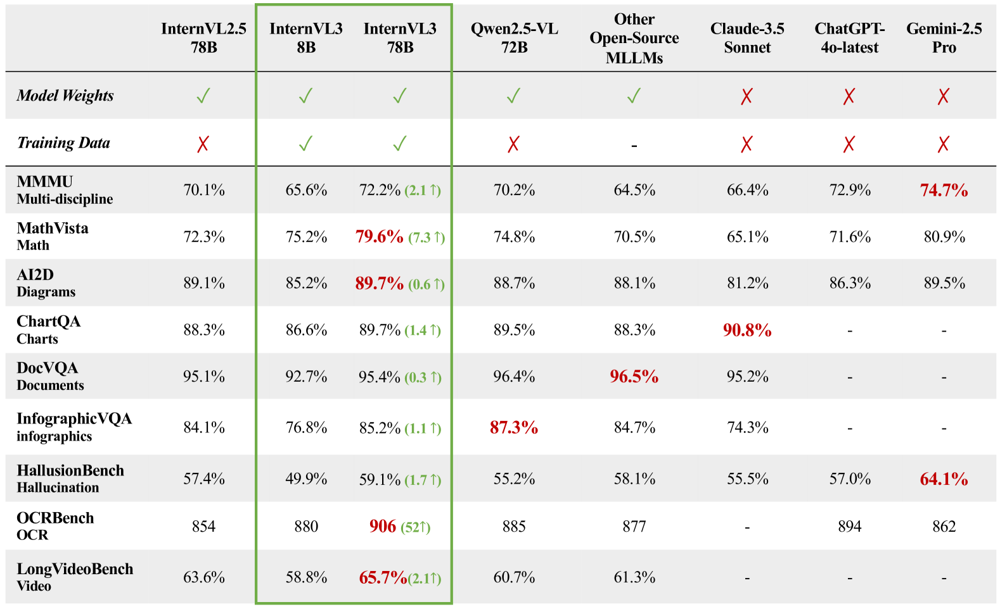
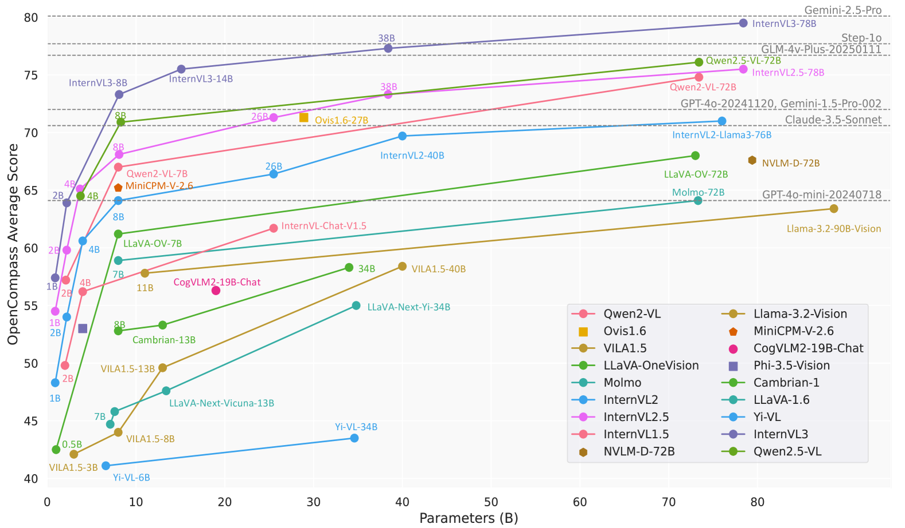
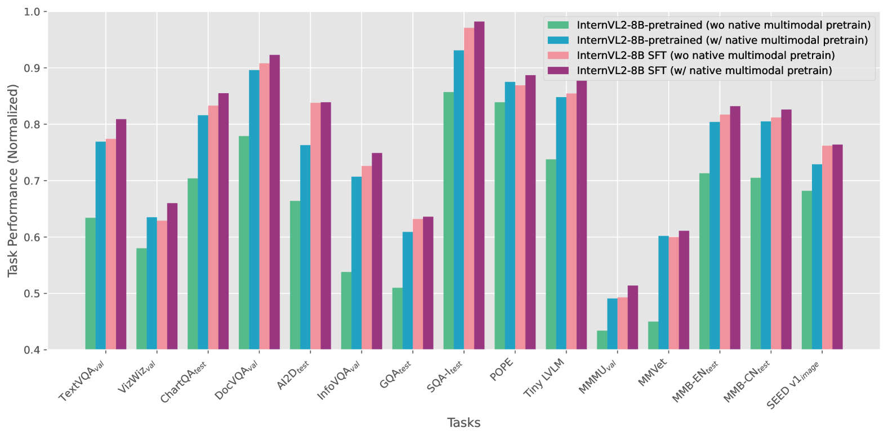

# InternVL3: オープンソースマルチモーダルモデルのための高度な訓練とテスト時のレシピを探る

> 原題: InternVL3: Exploring Advanced Training and Test-Time Recipes for Open-Source Multimodal Models
> 著者: Jinguo Zhu, Weiyun Wang, Zhe Chen, Zhaoyang Liu, Shenglong Ye, Lixin Gu, Hao Tian, Yuchen Duan, Weijie Su, Jie Shao, Zhangwei Gao, Erfei Cui, Xuehui Wang, Yue Cao, Yangzhou Liu, Xingguang Wei, Hongjie Zhang, Haomin Wang, Weiye Xu, Hao Li, Jiahao Wang, Nianchen Deng, Songze Li, Yinan He, Tan Jiang, Jiapeng Luo, Yi Wang, Conghui He, Botian Shi, Xingcheng Zhang, Wenqi Shao, Junjun He, Yingtong Xiong, Wenwen Qu, Peng Sun, Penglong Jiao, Han Lv, Lijun Wu, Kaipeng Zhang, Huipeng Deng, Jiaye Ge, Kai Chen, Limin Wang, Min Dou, Lewei Lu, Xizhou Zhu, Tong Lu, Dahua Lin, Yu Qiao, Jifeng Dai, Wenhai Wang
> 所属: Shanghai AI Laboratory / SenseTime Research / Tsinghua University / Nanjing University / Fudan University / The Chinese University of Hong Kong / Shanghai Jiao Tong University
> 出典: arXiv:2504.10479（2025 年 4 月、technical report）
> リポジトリ: <https://github.com/OpenGVLab/InternVL>
> モデル: <https://huggingface.co/OpenGVLab/InternVL3-78B>
> データ: <https://huggingface.co/datasets/OpenGVLab/InternVL-Data>

---

## Abstract（要旨）

我々は **InternVL3** を導入する。これは InternVL シリーズにおける重要な進展であり、**native multimodal pre-training パラダイム** を特徴とする。テキスト専用大規模言語モデル（LLM）を視覚入力対応のマルチモーダル LLM（MLLM）に **適応** させるのではなく、InternVL3 は **単一の事前学習段階** で多様なマルチモーダルデータと純粋テキストコーパスの **両方から多モーダル能力と言語能力を共同獲得** する。この統一訓練パラダイムは、MLLM の従来の事後訓練パイプラインで一般的に遭遇する複雑性と整列課題に効果的に対処する。性能とスケーラビリティをさらに向上させるため、**Variable Visual Position Encoding (V2PE)** を組み込み拡張マルチモーダル文脈をサポート、**Supervised Fine-Tuning (SFT) と Mixed Preference Optimization (MPO)** のような高度な後訓練技術を採用、さらに **test-time scaling** 戦略と最適化された訓練インフラを併用する。広範な経験的評価により、InternVL3 はマルチモーダルタスクの幅広い範囲で優れた性能を発揮することが示された。特に **InternVL3-78B は MMMU ベンチマークで 72.2 点を達成し、オープンソース MLLM のなかで新しい SOTA を樹立** する。その能力は ChatGPT-4o, Claude 3.5 Sonnet, Gemini 2.5 Pro を含む主要独自モデルと高い競争力を保ちつつ、強い純粋言語能力も維持する。オープンサイエンス原則に従い、訓練データとモデル重みを公開し、次世代 MLLM の研究と発展を促進する。

---

## 1. Introduction（はじめに）

マルチモーダル大規模言語モデル（MLLM）は近年、幅広いタスクで人間水準あるいはそれ以上の性能を達成し、汎用人工知能（AGI）への重要な一歩としての潜在能力を裏付けている。しかし、主要 MLLM（オープンソース・独自双方）の大多数は **テキスト専用 LLM から高度な多段階パイプラインを通じて適応** されてきた。これら「事後的（post-hoc）」アプローチは元のテキストベース事前学習プロセスに基づき構築されるため、視覚等の追加モダリティ統合時に整列課題を生む。実際にはモダリティ間ギャップを橋渡しするため、特殊ドメイン補助データ（例: OCR）の組込や、核となる言語能力を損なわないための複雑なパラメータ凍結・多段階微調整スケジュールが必要となる。こうした資源集約型戦略は、より効率的なマルチモーダル訓練パラダイムの必要性を浮き彫りにする。

本レポートでは InternVL シリーズの最新マイルストーン **InternVL3** を導入する。**native multimodal pre-training 戦略** が特徴。まずテキスト専用 LLM を事前学習しその後マルチモーダル整列で改修するのではなく、**事前学習段階からテキスト専用コーパスと多様なマルチモーダルデータの両方に同時に触れ、多モーダル能力を学習** する。この統一アプローチにより、より効率的かつ統合された方法で言語能力と多モーダル能力を同時獲得できる。

<figure>

<figcaption>図1: InternVL シリーズと他の高度 MLLM のマルチモーダル性能。InternVL シリーズは多モーダル能力で継続的な進化を示してきた。新たにリリースされた InternVL3 は既存オープンソース MLLM を大きく上回り、SOTA closed-source 商用モデルと比較しても高い競争力ある性能を示す。</figcaption>
</figure>

InternVL3 は性能とスケーラビリティを強化する複数の革新によりさらに優れている。**Variable Visual Position Encoding (V2PE)** で長いマルチモーダル文脈に対応。さらに高度な後訓練戦略（**SFT + Mixed Preference Optimization (MPO)**）、**test-time scaling 戦略**、最適化訓練インフラが、InternVL3 の効率と性能を顕著に高める。

包括的実証評価により、InternVL3 は前身（InternVL 2.5 等）を多分野推論、文書理解、複数画像/動画理解、実世界理解、ハルシネーション検出、視覚的グラウンディング、多言語能力など幅広いタスクで上回ることが示された。特にドメイン特化データを拡張組込することで、**ツール使用、GUI エージェント、産業画像分析、空間推論** でも顕著な改善を示し、InternVL シリーズが対応する多モーダルシナリオを大きく拡張。Qwen2.5-VL のような他のオープンソース MLLM と高い競争力ある性能を維持しつつ、ChatGPT-4o, Claude-3.5 Sonnet, Gemini-2.5 Pro と同等水準を保つ。**MMMU 72.2 点** はオープンソース MLLM の新基準を打ち立てる。

<figure>

<figcaption>図2: OpenCompass マルチモーダル学術リーダーボードでの各種 MLLM の性能。強化された InternVL3 は Qwen2.5-VL シリーズや Step-1o, GLM-4v-Plus, GPT-4o のような closed-source モデルを大きく上回る。InternVL3-78B は SOTA の Gemini-2.5-Pro とも高い競争力を保つ。</figcaption>
</figure>

---

## 2. InternVL3

先行 InternVL シリーズを基盤に、InternVL3 を提案する。訓練パイプラインを簡素化しつつ多モーダル能力を顕著に強化することを目的とする。

### 2.1 Model Architecture（モデルアーキテクチャ）

InternVL3 のアーキテクチャは先行と同じ「ViT-MLP-LLM」パラダイム。Native pre-training パラダイムは MLLM を **ゼロから訓練** することも可能だが、計算コスト削減のため ViT と LLM コンポーネントは事前学習済み重みで初期化する。視覚エンコーダは **InternViT-300M と InternViT-6B** の 2 構成。言語モデルは **Qwen2.5 シリーズと InternLM3-8B**（重要: ベースモデルのみ、instruction-tuned 版ではない）。MLP は 2 層ランダム初期化。InternVL2.5 と同様 pixel unshuffle で視覚トークンを 1/4 に削減（448×448 画像タイル = 256 視覚トークン）。

**表1**: InternVL3 シリーズの事前学習モデル。

| Model | #Param | Vision Encoder | Language Model | OpenCompass |
|---|---|---|---|---|
| **InternVL3-1B** | 0.9B | InternViT-300M-V2.5 | **Qwen2.5-0.5B** (base) | 57.4 |
| **InternVL3-2B** | 1.9B | InternViT-300M-V2.5 | **Qwen2.5-1.5B** (base) | 63.9 |
| **InternVL3-8B** | 8.1B | InternViT-300M-V2.5 | **Qwen2.5-7B** (base) | 73.3 |
| **InternVL3-9B** | 9.2B | InternViT-300M-V2.5 | **InternLM3-8B** | 72.4 |
| **InternVL3-14B** | 15.1B | InternViT-300M-V2.5 | **Qwen2.5-14B** (base) | 75.5 |
| **InternVL3-38B** | 38.4B | InternViT-6B-V2.5 | **Qwen2.5-32B** (base) | 77.3 |
| **InternVL3-78B** | 78.4B | InternViT-6B-V2.5 | **Qwen2.5-72B** (base) | 79.5 |

**Variable Visual Position Encoding (V2PE)**。長いマルチモーダル文脈に対応するため、**視覚トークンに対しより小さく柔軟な位置インクリメント** を採用。各サンプル `x = (x_1, x_2, ..., x_L)` の各トークン `x_i` は、textual / visual / その他モダリティの埋め込み。位置インデックス `p_i` は次の漸化式で計算:

$$p_i = p_{i-1} + \begin{cases} 1, & x_i \text{ がテキストトークン} \\ \delta, & x_i \text{ が視覚トークン} \end{cases}$$

ここで $\delta < 1$ は視覚トークンのインクリメント低減用。**画像内では $\delta$ を一定に保ち** 相対位置関係を保持。訓練中 $\delta$ は集合 $\Delta = \{1, 1/2, 1/4, 1/8, 1/16, 1/32, 1/64, 1/128, 1/256\}$ から各画像でランダム選択。推論時は入力系列長に応じて柔軟選択。$\delta=1$ で従来の InternVL 2.5 位置エンコーディングに帰着。

### 2.2 Native Multimodal Pre-Training（ネイティブマルチモーダル事前学習）

**言語事前学習とマルチモーダル整列訓練を単一の事前学習段階に統合する** native multimodal pre-training アプローチを提案。従来パラダイム（言語専用大モデルを先に訓練→追加モダリティへ適応）と異なり、本手法は **マルチモーダルデータ（image-text, video-text, interleaved image-text）と大規模テキストコーパスを事前学習中にインターリーブ** することで統合最適化を行う。この統一訓練スキームにより、事前学習モデルは追加のブリッジモジュールやモデル間整列手順なしで言語能力と多モーダル能力を同時獲得できる。

**Multimodal Autoregressive Formulation（多モーダル自己回帰定式化）**。標準的な左から右への自己回帰目的:

$$\mathcal{L}_{\text{full}}(\theta) = -\sum_{i=2}^L w_i \cdot \log p_\theta(x_i | x_1, \ldots, x_{i-1})$$

ただし損失計算は **テキストトークンのみ** に限定:

$$\mathcal{L}_{\text{text-only}}(\theta) = -\sum_{i=2, x_i \in \text{Text}}^L w_i \cdot \log p_\theta(x_i | x_1, \ldots, x_{i-1})$$

この選択的目的により、**視覚トークンはテキスト予測の条件付け文脈として機能、直接予測されない**。これによりモデルは多モーダル情報を下流言語デコーディングに有益な形で埋め込む。重み $w_i$ は InternVL 2.5 で議論された **square averaging**（$w_i = 1/l^{0.5}$、$l$ はサンプル内損失計算トークン数）を採用。

**Joint Parameter Optimization（共同パラメータ最適化）**。「言語専用訓練 → マルチモーダル適応」パラダイムと異なり、**多モーダル事前学習中に全モデルパラメータを共同更新**:

$$\theta^* = \arg\min_\theta \mathbb{E}_{x \in \mathcal{D}_{\text{multi}}}[\mathcal{L}_{\text{text-only}}(\theta)]$$

$\mathcal{D}_{\text{multi}}$ は大規模テキスト専用 + マルチモーダルコーパスの和集合。この多タスク共同最適化により、テキスト表現と視覚特徴が同時学習され、モダリティ間整列が強化される。**全層を共同訓練** することで、言語と視覚特徴が同期的に進化、最終パラメータは追加調整なしで純粋言語タスクと多モーダルタスク両方で高性能を発揮する。

**Data（データ）**。事前学習データは **マルチモーダルデータ + 純粋言語データ** の 2 カテゴリ。マルチモーダル: [[entities/internvl-2-5|InternVL 2.5]] の事前学習コーパス（image captioning, VQA, math, charts, OCR, knowledge grounding, document, dialogue, medical 等）+ 新規実世界データ（**GUI, ツール使用, 3D シーン理解, 動画理解**）。データ規模は増やしていないが、MLP のみならず **ViT と LLM の重みも更新** することで有用性を大きく改善。

純粋言語データ: マルチモーダルデータセットのテキストが比較的短く多様性に欠けるのを補うため統合。InternLM2.5 の事前学習データを基盤に種々のオープンソーステキストデータで増補。知識集約タスクと数学・推論タスクで性能向上を狙う。

**サンプリング比率**: 2 段階戦略で最適比率決定。最初に分離訓練、次に固定総予算下で組み合わせ。**経験的に言語 : マルチモーダル = 1 : 3 が最適**。総訓練トークン約 **200B**（言語 50B + マルチモーダル 150B）。

### 2.3 Post-Training（後訓練）

Native pre-training 後、2 段階後訓練戦略で会話・推論能力を強化: **Supervised Fine-Tuning (SFT) + Mixed Preference Optimization (MPO)**。

**Supervised Fine-Tuning (SFT)**。InternVL2.5 の技術（random JPEG compression, square loss re-weighting, multimodal data packing）を継続。主な進化は **より高品質で多様な訓練データ**: ツール使用、3D シーン理解、GUI 操作、長文脈タスク、動画理解、科学図解、創造的書きもの、多モーダル推論のサンプル拡張。

**Mixed Preference Optimization (MPO)**。事前訓練と SFT では「正解トークン条件付きで次トークン予測」だが、推論時は「自分の過去出力に基づく予測」となり、**分布シフトが CoT 推論能力を損なう**。MPO は正例・負例両方からの追加監督で応答分布を正解分布に整列させる。MPO 損失は **preference + quality + generation** の和:

$$\mathcal{L} = w_p \mathcal{L}_p + w_q \mathcal{L}_q + w_g \mathcal{L}_g$$

- **$\mathcal{L}_p$（DPO loss）**: chosen と rejected の相対選好を学習
- **$\mathcal{L}_q$（BCO loss）**: 個別応答の絶対品質を学習（chosen + rejected を独立計算）
- **$\mathcal{L}_g$（LM loss）**: 選好応答の生成プロセスを学習

**Data**: SFT データは InternVL2.5 ベース + 追加（**16.3M → 21.7M サンプル**）。MPO データは **MMPR v1.2** から構築、約 **300K サンプル**（VQA、科学、チャート、数学、OCR、文書をカバー）。InternVL3-8B/38B/78B の SFT 版で rollouts 生成。

### 2.4 Test-Time Scaling（テスト時スケーリング）

**Best-of-N 評価戦略 + VisualPRM-8B** を critic モデルとして使用、推論・数学評価で最良応答を選択。

**Visual Process Reward Model (VisualPRM)**。各ステップに品質スコアを付与し平均してソリューション全体スコアを得る。multi-turn chat タスクとして定式化。訓練時はモデルが各ターンで該当ステップの正誤を予測:

$$c_i \sim M(y_i | I, q, s_{\leq i}), \quad c_i \in \{+, -\}$$

推論時は「+」生成確率がそのステップのスコア。VisualPRM400K（MMPR v1.2 ベース）で訓練。

### 2.5 Infrastructure（インフラストラクチャ）

**InternEVO** フレームワーク（元は LLM 大規模訓練用 ZeRO 最適化）を InternVL モデル訓練に拡張。ViT/MLP/LLM コンポーネント向けの柔軟・分離型シャーディング戦略、通信と計算の重ね合わせで訓練効率改善。data/tensor/sequence/pipeline parallelism + 任意の組み合わせサポート。

**主な技術課題**: 視覚トークン vs テキストトークン比率の不均衡による計算負荷の偏り。**動的負荷バランシング** スイートで対処。32K トークン系列対応のため head-parallel + sequence-parallel を統合。**InternVL2.5 比で同サイズモデルの訓練を 50-200% 高速化**（同計算予算）。

---

## 3. Experiments（実験）

### 3.1 Overall Comparison（全体比較）

図 1 が示すように InternVL3 は MMMU, MathVista, AI2D, ChartQA, DocVQA, InfoVQA, HallusionBench, OCRBench, LongVideoBench で前バージョンに対し大幅改善。**InternVL3-78B は MMMU 72.2 を達成**、複雑な多モーダル課題を処理する優れた能力を示す。ChatGPT-4o-latest や Claude-3.5 Sonnet との性能差が顕著に縮まり、**AI2D と ChartQA では商用モデルを上回る**。ただし Gemini-2.5 Pro は HallusionBench などで依然優位。

### 3.2 Multimodal Reasoning and Mathematics（多分野推論 + 数学）

**表2 主要結果（MMMU / MathVista / MathVision / MathVerse / DynaMath / WeMath / LogicVista / Overall）**:

| Model | MMMU | MathVista | MathVision | MathVerse | DynaMath | Overall |
|---|---|---|---|---|---|---|
| InternVL3-1B | 43.4 | 45.8 | 18.8 | 18.7 | 5.8 | 25.1 |
| **w/ VisualPRM-Bo8** | **55.4** | **62.1** | **21.7** | **28.9** | **13.4** | **35.0** |
| InternVL3-2B | 48.6 | 57.0 | 21.7 | 25.3 | 14.6 | 32.4 |
| **w/ VisualPRM-Bo8** | **57.8** | **70.5** | **26.6** | **36.7** | **21.4** | **41.7** |
| InternVL3-8B | 62.7 | 71.6 | 29.3 | 39.8 | 25.5 | 44.3 |
| **w/ VisualPRM-Bo8** | **66.0** | **75.2** | **37.5** | **46.3** | **28.5** | **50.2** |
| InternVL3-14B | 67.1 | 75.1 | 37.2 | 44.4 | 31.3 | 49.9 |
| **w/ VisualPRM-Bo8** | **69.3** | **77.9** | **40.1** | **47.7** | **33.1** | **53.8** |
| InternVL3-38B | 70.1 | 75.1 | 34.2 | 48.2 | 35.3 | 52.8 |
| **w/ VisualPRM-Bo8** | **71.0** | **79.4** | **41.8** | **54.2** | **36.1** | **56.6** |
| GPT-4o-20241120 | 70.7 | 60.0 | 31.2 | 40.6 | 34.5 | 47.9 |
| Claude-3.7-Sonnet | 75.0 | 66.8 | 41.9 | 46.7 | 39.7 | 53.9 |
| Gemini-2.0-Pro | 69.9 | 71.3 | 48.1 | 67.3 | 43.3 | 58.5 |
| Qwen2.5-VL-72B | 68.2 | 74.2 | 39.3 | 47.3 | 35.9 | 52.8 |
| InternVL2.5-78B | 70.0 | 72.3 | 32.2 | 39.2 | 19.2 | 46.0 |
| **InternVL3-78B** | **72.2** | **79.0** | 43.1 | 51.0 | 35.1 | **54.6** |
| **w/ VisualPRM-Bo8** | **72.2** | **80.5** | 40.8 | **54.2** | 37.3 | **56.5** |

**InternVL3-78B MMMU 72.2 はオープンソース SOTA**。**Best-of-N 戦略の効率性**: 小型モデルでも顕著な向上（InternVL3-1B Overall 25.1 → 35.0、+9.9）。

### 3.3 OCR, Chart, and Document Understanding（OCR・チャート・文書）

**表3 主要結果**:

| Model | AI2D(w/wo M) | ChartQA | DocVQA | InfoVQA | OCRBench | CharXiv(RQ/DQ) | VCR(EM/Jaccard) | Overall |
|---|---|---|---|---|---|---|---|---|
| InternVL3-8B | 85.2 / 92.6 | 86.6 | 92.7 | 76.8 | 880 | 37.6 / 73.6 | 94.5 / 98.1 | **81.3** |
| InternVL3-14B | 86.0 / 93.7 | 87.3 | 94.1 | 83.6 | 875 | 43.1 / 82.2 | 94.8 / 98.2 | **83.4** |
| InternVL3-38B | 88.9 / 95.5 | 89.2 | 95.4 | 85.0 | **886** | 46.4 / 87.2 | **96.1 / 98.7** | **85.5** |
| GPT-4o | 84.6 / 94.2 | 85.7 | 92.8 | 79.2 | 736 | 47.1 / 84.5 | 91.6 / 96.4 | 81.6 |
| Claude-3.5-Sonnet | 81.2 / 94.7 | 90.8 | 95.2 | 74.3 | 788 | **60.2** / 84.3 | 63.9 / 74.7 | 78.7 |
| Qwen2.5-VL-72B | 88.7 / – | 89.5 | 96.4 | **87.3** | 885 | 49.7 / 87.4 | – | – |
| **InternVL3-78B** | **89.7 / 96.0** | **89.7** | 95.4 | 86.5 | **906** | 46.0 / 85.1 | **96.0 / 98.6** | **85.8** |

**OCRBench 906 で SOTA**（Qwen2.5-VL-72B 885 超え）。

### 3.4 Multi-Image Understanding（複数画像理解）

**表4 主要結果**: InternVL3-78B が複数画像 Overall **68.0**（InternVL2.5-78B 65.3 +2.7、GPT-4o 同等水準）。

### 3.5 Real-World Comprehension（実世界理解）

**表4 右部**: InternVL3-78B が RealWorldQA **78.0**（GPT-4o 75.4 超え）、MME-RealWorld **65.4**（GPT-4o 45.2 大幅超え）、WildVision **73.6**（InternVL2.5-78B 71.4 から +2.2、GPT-4o 80.6 にはまだ届かず）、R-Bench **77.4**。

### 3.6 Comprehensive Multimodal Evaluation（総合マルチモーダル評価）

**表5 主要結果**:

| Model | MME(sum) | MMB(EN/CN) | MMVet(turbo) | MMVet v2 | MMStar | Overall |
|---|---|---|---|---|---|---|
| InternVL3-8B | **2415.4** | 83.4/82.2 | **81.3** | 66.3 | 68.2 | **77.7** |
| InternVL3-14B | 2478.3 | 85.6/84.1 | 80.2 | 68.4 | 68.8 | **79.0** |
| InternVL3-38B | 2523.6 | 87.6/86.8 | **83.9** | 69.6 | 71.5 | **81.5** |
| GPT-4o | – | 83.4/82.1 | 69.1 | 71.0 | 64.7 | – |
| Claude-3.5-Sonnet | – | 82.6/83.5 | 70.1 | 71.8 | 65.1 | – |
| Qwen2.5-VL-72B | 2448.0 | 88.6/87.9 | 76.2 | – | 70.8 | – |
| **InternVL3-78B** | **2549.8** | **89.0/88.7** | **81.3** | **70.0** | **72.5** | **82.0** |

**MME 2549.8、MMB-EN/CN 89.0/88.7、MMStar 72.5 で SOTA**。**MMVet で 81.3 で Claude-3.5-Sonnet 70.1 を +11.2 大幅超え**（InternVL 2.5 の WildVision 弱点を克服）。

### 3.7 Multimodal Hallucination（ハルシネーション）

**HallusionBench / MMHal / CRPE / POPE** で評価。InternVL3-78B は HallusionBench **59.1**（Qwen2.5-VL-72B 55.2 / GPT-4o 55.0 超え）。

### 3.8 Visual Grounding（視覚的グラウンディング）

**表6 RefCOCO/+/g 平均**:

| Model | Overall |
|---|---|
| Qwen2.5-VL-72B | 90.3 |
| InternVL2.5-78B | **92.3** |
| **InternVL3-38B** | 91.2 |
| **InternVL3-78B** | 91.4 |

**InternVL2.5-78B が依然として SOTA**（92.3）、InternVL3 は若干後退（91.4）。著者は **「訓練データ拡張で grounding 特化データが含まれず、相対的に grounding データ比率が低下したため」** と分析。

### 3.9 Multimodal Multilingual Understanding（多言語）

**表7 MMMB / Multilingual MMBench / MTVQA**: InternVL3-78B 平均 **68.9**（InternVL2.5-78B 68.0 / Qwen2.5-VL-72B 67.2 超え）。

### 3.10 Video Understanding（動画理解）

**表8 主要結果**:

| Model | Video-MME(wo/w sub) | MVBench | MMBench-Video | MLVU | LongVideoBench | CG-Bench | Overall |
|---|---|---|---|---|---|---|---|
| InternVL3-8B | 66.3 / 68.9 | **75.4** | 1.69 | **71.4** | 58.8 | 38.6 / 55.2 | **61.4** |
| InternVL3-38B | **72.7** / 75.0 | 76.9 | 1.81 | **77.8** | **67.3** | 46.9 / 62.8 | **67.5** |
| GPT-4o | 71.9 / 77.2 | – | 1.63 | 64.6 | 66.7 | 41.8 / 58.3 | – |
| Gemini-1.5-Pro | **75.0 / 81.3** | – | 1.30 | – | 64.0 | 40.1 / 56.4 | – |
| Qwen2.5-VL-72B | 73.3 / 79.1 | 70.4 | **2.02** | 74.6 | 60.7 | – | – |
| **InternVL3-78B** | 72.7 / 75.7 | **78.7** | 1.81 | **79.5** | 65.7 | **48.4 / 65.3** | **68.3** |

**MVBench 78.7 / MLVU 79.5 / CG-Bench 48.4/65.3 で複数 SOTA**。

### 3.11 GUI Grounding

**表9**: InternVL3-72B が ScreenSpot **88.7%**（Qwen2.5-VL-72B 87.1 / UI-TARS-72B 88.4 / GPT-4o 18.1 を大幅超え、Aguvis-72B 89.2 にわずかに劣る）。ScreenSpot-V2 **90.9%**（UI-TARS-72B 90.3 超え）。

### 3.12 Spatial Reasoning（空間推論）

**表10 VSI-Bench**:

| Model | Obj.count | Abs.Dist | Rel.Dist | Appr.Order | Overall |
|---|---|---|---|---|---|
| GPT-4o | 46.2 | 5.3 | 37.0 | 28.5 | 34.0 |
| Gemini-1.5 Pro | 56.2 | 30.9 | 51.3 | 34.6 | 45.4 |
| InternVL3-8B | 68.1 | 39.0 | 48.3 | 35.4 | **42.1** |
| **InternVL3-38B** | **71.7** | **50.2** | **53.5** | **60.7** | **48.9** |
| InternVL3-78B | 71.2 | 53.7 | 55.9 | 54.5 | **48.4** |

**全 InternVL3 が GPT-4o / Gemini-1.5 Pro を空間推論で大幅超え、3D シーン理解で新水準**。

### 3.13 Evaluation on Language Capability（言語能力評価）

**表11 主要結果（17 純粋言語ベンチ平均）**:

| Model | Overall | vs Qwen2.5-Chat |
|---|---|---|
| Qwen2.5-0.5B Chat → InternVL3-1B | 33.5 → **42.4** | **+8.9** |
| Qwen2.5-1.5B Chat → InternVL3-2B | 51.6 → **59.2** | **+7.6** |
| Qwen2.5-7B Chat → InternVL3-8B | 69.4 → **72.9** | **+3.5** |
| Qwen2.5-14B Chat → InternVL3-14B | 73.4 → **76.6** | **+3.2** |
| Qwen2.5-32B Chat → InternVL3-38B | 77.4 → **78.9** | **+1.5** |
| Qwen2.5-72B Chat → InternVL3-78B | 78.9 → **80.5** | **+1.6** |

**InternVL3 が同じ Qwen2.5 base から派生した Qwen2.5-Chat を全 LLM サイズで上回る**（小型ほど顕著）。これは **「ネイティブマルチモーダル事前学習が言語能力も強化する」** ことを実証。要因: 約 25% 純粋言語データの統合、共同パラメータ最適化、後訓練段階の高品質テキストコーパス。

### 3.14 Ablation Study（アブレーション）

**Native Multimodal Pre-Training の有効性（図3）**: InternVL2-8B の MLP warmup を native pre-training に置換 → 多モーダルベンチでフル多段階訓練ベースラインと **同等性能**。指示チューニングを追加するとさらに性能向上。

**V2PE の評価（表12）**:

| V2PE | δ | Overall |
|---|---|---|
| ✗ | – | 75.2 |
| ✓ | 1/256 | 75.0 |
| ✓ | 1/64 | 75.3 |
| ✓ | 1/16 | **75.6** |
| ✓ | **1/4** | **75.9** |
| ✓ | 1/1 | 75.7 |

**$\delta = 1/4$ で最良**。短文脈タスクでも小さい $\delta$ が最適性能を達成。

**MPO の効果（表13）**:

| Model | w/o MPO | w/ MPO | Δ |
|---|---|---|---|
| InternVL3-1B | 24.6 | 25.1 | +0.5 |
| InternVL3-2B | 30.7 | 32.4 | +1.7 |
| InternVL3-8B | 41.4 | 44.3 | +2.9 |
| InternVL3-9B | 41.6 | 43.1 | +1.5 |
| InternVL3-14B | 46.2 | 49.9 | **+3.7** |
| InternVL3-38B | 48.3 | 52.8 | **+4.5** |
| InternVL3-78B | 50.5 | 54.6 | **+4.1** |

**MPO が 7 つの多モーダル推論ベンチで一貫した改善**（特に大型モデル）。MPO データは SFT データのサブセットであり、性能改善が **アルゴリズムによる（データではない）** ことを実証。

<figure>

<figcaption>図3: 異なる訓練戦略でのマルチモーダルベンチマーク性能比較。Native multimodal pre-training は後訓練なしでも MLLM に強い多モーダル能力を付与する。</figcaption>
</figure>

---

## 4. Conclusion（結論）

**InternVL3** を導入した。InternVL シリーズにおける重要な進展で、**native multimodal pre-training パラダイム** を実装。事前学習段階で言語能力と多モーダル能力を共同学習することで、従来の事後的 MLLM 訓練パイプラインに伴う訓練の複雑性と最適化課題を回避。**V2PE による拡張マルチモーダル文脈、高度な後訓練戦略（SFT + MPO）、test-time scaling** を組み込み、InternVL3 はマルチモーダルタスクの幅広い範囲でオープンソース新基準を樹立しつつ、強い言語能力を維持。特に **InternVL3-78B は MMMU 72.2 を達成し、先行オープン MLLM を超え、主要独自モデル（Gemini-2.5 Pro 等）との差を縮めた**。コミュニティ主導の MLLM イノベーションへの貢献として、訓練データとモデル重みを公開する。
