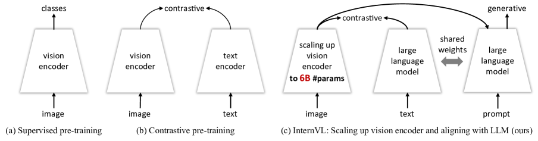
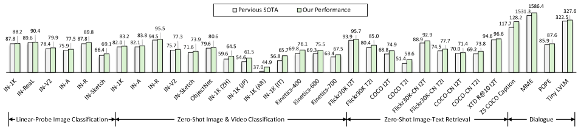
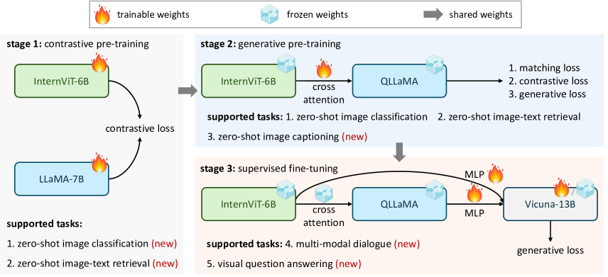
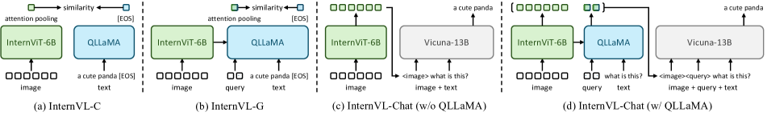

# InternVL: 視覚基盤モデルをスケールアップし、汎用の視覚言語タスクへ整列させる

> 原題: InternVL: Scaling up Vision Foundation Models and Aligning for Generic Visual-Linguistic Tasks
> 著者: Zhe Chen, Jiannan Wu, Wenhai Wang, Weijie Su, Guo Chen, Sen Xing, Muyan Zhong, Qinglong Zhang, Xizhou Zhu, Lewei Lu, Bin Li, Ping Luo, Tong Lu, Yu Qiao, Jifeng Dai
> 所属: OpenGVLab Shanghai AI Laboratory / Nanjing University / The University of Hong Kong / The Chinese University of Hong Kong / Tsinghua University / University of Science and Technology of China / SenseTime Research
> 出典: arXiv:2312.14238（2023 年 12 月）, CVPR 2024
> リポジトリ: <https://github.com/OpenGVLab/InternVL>

---

## Abstract（要旨）

大規模言語モデル（large language models, LLMs）の指数関数的成長は、マルチモーダル AGI（汎用人工知能）システムに数多くの可能性を切り開いてきた。しかし、マルチモーダル AGI においても重要な構成要素である視覚および視覚言語基盤モデルの進歩は、LLM のそれに追いついていない。本研究では、視覚基盤モデルを 60 億パラメータにスケールアップし、それを LLM と段階的に整列させる大規模視覚言語基盤モデル InternVL を設計する。学習には、多様な情報源から得られた Web 規模の画像-テキストデータを用いる。本モデルは、画像レベル・画素レベルの認識といった視覚知覚タスク、ゼロショット画像/動画分類、ゼロショット画像/動画-テキスト検索といった視覚言語タスク、さらに LLM と接続したマルチモーダル対話システムなど、32 の汎用視覚言語ベンチマークで広く適用可能であり、いずれにおいても最先端の性能を達成する。InternVL は強力な視覚能力を持ち、ViT-22B の良い代替となりうる。本研究がマルチモーダル大規模モデルの発展に貢献することを願う。

<figure>

<figcaption>図1: 異なる視覚および視覚言語基盤モデルの比較。(a) は分類タスクで事前学習された ResNet 等の伝統的な視覚基盤モデル。(b) は画像-テキスト対で事前学習された CLIP のような視覚言語基盤モデル。(c) が本論文の InternVL であり、大規模視覚基盤モデル（すなわち InternViT-6B）を大規模言語モデルと整列させる実用可能な方法を示し、対比タスクと生成タスクの両方に汎用的に対応する。</figcaption>
</figure>

---

## 1. Introduction（はじめに）

大規模言語モデル（LLMs）は、その開放世界（open-world）の言語タスクにおける目覚ましい能力により、汎用人工知能（artificial general intelligence, AGI）システムの発展を大きく加速させており、そのモデル規模と性能は今も急速に拡大している。LLM を活用した視覚大規模言語モデル（vision large language models, VLLMs）も大きな飛躍を遂げており、洗練された視覚言語の対話とインタラクションを可能にしている。しかし、VLLMs の鍵となる構成要素である視覚および視覚言語基盤モデルの進歩は、LLM の急速な成長から遅れを取っている。

<figure>

<figcaption>図2: 画像分類・動画分類・画像テキスト検索・画像キャプショニング・マルチモーダル対話を含む、さまざまな汎用視覚言語タスクにおける比較結果。提案する InternVL は全タスクで最良の性能を達成している。なお、公開データのみで訓練されたモデルに限定して比較している。"IN" は ImageNet の略。</figcaption>
</figure>

視覚モデルを LLM と橋渡しするため、既存の VLLMs は通常、QFormer や線形射影といった軽量な「glue（糊）」層を用いて、視覚モデルと言語モデルの特徴を整列させてきた。このような整列には次のような制約がある。(1) **パラメータ規模の乖離（Disparity in parameter scales）**: 大規模 LLM は今や 1000 億パラメータに達する一方、VLLMs で広く使われる視覚エンコーダは依然として 10 億パラメータ前後に留まる。この差は LLM の能力の十分な活用を妨げる可能性がある。(2) **表現の不整合（Inconsistent representation）**: 純粋に視覚データのみで訓練された視覚モデル、あるいは BERT 系と整列された視覚モデルは、しばしば LLM との間で表現の不整合を呈する。(3) **非効率な接続（Inefficient connection）**: 「glue」層は通常軽量でランダムに初期化されるため、マルチモーダル理解・生成にとって重要な、豊かなクロスモーダル相互作用と依存関係を捉えきれない可能性がある。

これらの制約は、視覚エンコーダと LLM のあいだに、パラメータ規模および特徴表現能力の両面で大きな隔たりが存在することを示している。この隔たりを埋めるため、**我々の発想の出発点は、視覚エンコーダを LLM のパラメータ規模に並ぶよう引き上げ、その後で両者の表現を整合させること** にある。しかし、こうした大規模モデルの訓練にはインターネットから得られる膨大な画像-テキストデータが必要であり、そのデータの著しい異種性と品質の差は、訓練プロセスに大きな課題をもたらす。訓練の有効性を高めるため、図 1 に示すように、対比学習を補完するアプローチとして生成的監督（generative supervision）を併用することを検討する。この戦略は訓練中にモデルへ追加の指針を与えることを狙う。しかし、低品質データが生成的訓練に適するかという疑問は残る。さらに、ユーザの指示をどのように表現し、視覚エンコーダと LLM のあいだで表現をどのように整列させるかも、もう一つの未解決問題である。

これらの課題に対処するため、我々は **InternVL** を定式化する。これは、スケールアップされた視覚エンコーダの表現を LLM と整列させ、種々の視覚および視覚言語タスクで最先端性能を達成する大規模視覚言語基盤モデルである。図 1 (c) に示すように、InternVL は 3 つの主要な設計を持つ。(1) **パラメータの均衡が取れた視覚・言語コンポーネント（Parameter-balanced vision and language components）**: 60 億パラメータにスケールアップされた視覚エンコーダと 80 億パラメータの LLM ミドルウェアからなり、後者は実質的な「glue」層として機能し、ユーザの指示に基づいて視覚特徴を再構成する。先行する視覚のみ（図 1 (a)）あるいはデュアルタワー構造（図 1 (b)）と異なり、本モデルの視覚エンコーダとミドルウェアは、対比タスクと生成タスクの双方に対し柔軟に組み合わせ可能である。(2) **整合した表現（Consistent representations）**: 視覚エンコーダと LLM のあいだの表現整合性を保つため、事前学習済みの多言語 LLaMA でミドルウェアを初期化し、その後視覚エンコーダを整列させる。(3) **段階的な画像-テキスト整列（Progressive image-text alignment）**: 多様な情報源からの画像-テキストデータを活用しつつ、段階的な整列戦略により訓練の安定性を確保する。この戦略はまず Web 規模のノイズの多い画像-テキストデータで対比学習を行い、その後、きめ細かな高品質データでの生成的学習に移行する。これによりモデル性能とタスク範囲の継続的な拡張を保証する。

これらの設計により、本モデルは以下の利点を備える。(1) **汎用性（Versatile）**: 単独の視覚エンコーダとして知覚タスクに用いることも、視覚言語タスクやマルチモーダル対話システムのために言語ミドルウェアと連携させることもできる。言語ミドルウェアは視覚エンコーダと LLM デコーダのあいだの隙間を橋渡しする。(2) **強力（Strong）**: 訓練戦略・大規模パラメータ・Web 規模データを活用することで、本モデルは強力な表現を獲得し、図 2 に示すようにさまざまな視覚および視覚言語タスクで最先端の結果を達成する。(3) **LLM フレンドリー（LLM-friendly）**: LLM と整合した特徴空間を持つため、LLaMA 系、Vicuna、InternLM など既存の LLM とスムーズに統合できる。これらの特徴により、本モデルは先行手法と区別され、各種応用の主要な視覚言語基盤モデルとして位置づけられる。

要約すると、本研究の貢献は次の 3 点である。

(1) 大規模視覚エンコーダを LLM と初めて整列させた大規模視覚言語基盤モデル **InternVL** を提案する。本モデルは視覚知覚タスク、視覚言語タスク、マルチモーダル対話を含む幅広い汎用視覚言語タスクで強力な性能を示す。

(2) 大規模視覚言語基盤モデルを効率的に訓練するための **段階的画像-テキスト整列戦略（progressive image-text alignment strategy）** を導入する。本戦略は Web 規模のノイズある画像-テキストデータを対比学習に最大限活用しつつ、きめ細かな高品質データを生成的学習に活用する。

(3) 提案モデルを現行 SoTA の視覚基盤モデルおよび VLLM と広範に比較する。結果は、InternVL が画像分類（ImageNet）、セマンティックセグメンテーション（ADE20K）、動画分類（Kinetics）、画像-テキスト検索（Flickr30K & COCO）、動画-テキスト検索（MSR-VTT）、画像キャプショニング（COCO & Flickr30K & NoCaps）を含む幅広い汎用視覚言語タスクで最先端性能を発揮することを示す。さらに、マルチモーダル対話（MME & POPE & Tiny LVLM）にも有効である。

---

## 2. Related Work（関連研究）

<figure>

<figcaption>図3: 提案する InternVL モデルの訓練戦略。本戦略は 3 段階で進行し、視覚言語対比訓練（vision-language contrastive training）、視覚言語生成訓練（vision-language generative training）、教師あり微調整（supervised fine-tuning）から成る。これらの段階は、Web 上のノイズある画像-テキスト対から、高品質なキャプション・VQA・マルチモーダル対話のデータセットまで、多様な公開データを効果的に活用する。</figcaption>
</figure>

### 2.1 Vision Foundation Models（視覚基盤モデル）

過去 10 年でコンピュータビジョンの分野では基盤モデルが大きく発展してきた。先駆けの AlexNet を皮切りに、種々の畳み込みニューラルネットワーク（CNNs）が次々と登場し、ImageNet ベンチマークを継続的に更新してきた。特に残差接続（residual connections）の導入は勾配消失問題を効果的に解消した。この突破口は「**big & deep**」なニューラルネットワークの時代を切り開き、十分な訓練とデータがあればより大規模かつ深いモデルがより良い性能を達成できることを示した。すなわち、スケールアップが重要である、ということだ。

近年、ViT はコンピュータビジョンのネットワーク構造に新しい可能性を切り開いた。ViT とその派生形は容量を大幅に増やし、さまざまな重要視覚タスクで卓越した性能を上げてきた。LLM 時代において、これらの視覚基盤モデルは、しばしば軽量な「glue」層を介して LLM と接続される。しかし、これらのモデルは主に ImageNet や JFT のような視覚のみのデータセット由来であるか、画像-テキスト対を用いて BERT 系と整列されているため、LLM と直接整列されていないという隔たりが存在する。加えて、LLM 接続用に広く使われている視覚モデルは依然として 10 億パラメータ程度であり、これが VLLMs の性能を制約している。

### 2.2 Large Language Models（大規模言語モデル）

大規模言語モデル（LLMs）は人工知能の分野に革命をもたらし、これまで人間専用と考えられてきた自然言語処理タスクを可能にしてきた。GPT-3 の登場により、特に few-shot および zero-shot 学習において能力が飛躍的に向上し、LLMs の大きな可能性が明らかになった。この約束はその後の ChatGPT と GPT-4 の進展でさらに現実のものとなった。この分野の進展は、LLaMA 系、Vicuna、InternLM、MOSS、ChatGLM、Qwen、Baichuan、Falcon などのオープンソース LLM の登場によりさらに加速している。しかし現実のシナリオでは、対話は自然言語に限定されない。視覚モダリティは追加情報をもたらし、より多くの可能性を意味する。したがって、LLM の優れた能力をマルチモーダルな対話のためにどう活用するかは、次の研究トレンドになると考えられる。

### 2.3 Vision Large Language Models（視覚大規模言語モデル）

近年、視覚大規模言語モデル（vision large language models, VLLMs）が次々と作られている。これは言語モデルに視覚情報の処理・解釈能力を付与することを目指す。Flamingo は視覚と言語の入力をプロンプトとして用い、視覚質問応答（VQA）における顕著な few-shot 性能を示した。続いて GPT-4、LLaVA 系、MiniGPT-4 が **視覚指示チューニング（visual instruction tuning）** を導入し、VLLMs の指示追従能力を改善した。同時期に、VisionLLM、KOSMOS-2、Qwen-VL 等のモデルは **視覚的グラウンディング（visual grounding）** 能力を備え、領域の記述や位置特定といったタスクを可能にした。多くの API ベース手法も視覚 API を LLM と統合し、視覚中心タスクの解決を試みている。さらに PaLM-E や EmbodiedGPT は具現化（embodied）応用への VLLMs の適応を進める高度な取り組みであり、その応用範囲を大きく広げている。これらの研究は VLLMs が大きな飛躍を遂げたことを示している。しかし、VLLMs にとって同様に不可欠な視覚および視覚言語基盤モデルの進歩は追いついていない。

---

## 3. Proposed Method（提案手法）

### 3.1 Overall Architecture（全体アーキテクチャ）

図 3 に示すように、伝統的な視覚のみのバックボーンや dual-encoder モデルとは異なり、提案する **InternVL** は視覚エンコーダ **InternViT-6B** と言語ミドルウェア **QLLaMA** で構成される。具体的には、InternViT-6B は 60 億パラメータの Vision Transformer であり、性能と効率の良いトレードオフを実現するようカスタマイズされている。QLLaMA は 80 億パラメータの言語ミドルウェアで、多言語強化された LLaMA で初期化される。これは画像-テキスト対比学習のための強力な多言語表現を提供することも、視覚エンコーダと既存の LLM デコーダを接続する橋として機能することもできる。

モダリティと構造の隔たりが大きい 2 つの大規模コンポーネントを整列させるため、**段階的整列訓練戦略（progressive alignment training strategy）** を導入する。訓練は段階的に進行し、まず大規模なノイズデータで対比学習を行い、その後、洗練された高品質データでの生成的学習へと移行する。このようにして、多様な情報源からの Web 規模画像-テキストデータを効果的かつ十分に活用する。整列された視覚エンコーダと言語ミドルウェアにより、本モデルはまるでスイスアーミーナイフのように振る舞う。柔軟な構成により、視覚知覚から画像/動画-テキスト検索、画像キャプショニング、VQA、マルチモーダル対話まで、幅広い汎用視覚言語タスクに適応可能である。

**表1**: InternViT-6B モデルのアーキテクチャ詳細。

| name | width | depth | MLP | #heads | #param (M) |
| --- | --- | --- | --- | --- | --- |
| ViT-G | 1664 | 48 | 8192 | 16 | 1843 |
| ViT-e | 1792 | 56 | 15360 | 16 | 3926 |
| EVA-02-ViT-E | 1792 | 64 | 15360 | 16 | 4400 |
| ViT-6.5B | 4096 | 32 | 16384 | 32 | 6440 |
| ViT-22B | 6144 | 48 | 24576 | 48 | 21743 |
| **InternViT-6B (ours)** | **3200** | **48** | **12800** | **25** | **5903** |

<figure>

<figcaption>図4: InternVL のさまざまな使い方。視覚エンコーダと言語ミドルウェアを柔軟に組み合わせることで、対比タスク・生成タスク・マルチモーダル対話を含む種々の視覚言語タスクに対応する。</figcaption>
</figure>

### 3.2 Model Design（モデル設計）

**大規模視覚エンコーダ: InternViT-6B**。InternVL の視覚エンコーダは vanilla Vision Transformer（ViT）で実装する。LLM の規模に合わせるため、視覚エンコーダを 60 億パラメータへスケールアップし、InternViT-6B モデルを得る。精度・速度・安定性のトレードオフを良くするため、InternViT-6B のハイパーパラメータ探索を行う。モデル深さを {32, 48, 64, 80}、head 次元を {64, 128}、MLP 比を {4, 8} の中で変化させた。モデル幅と head 数は、与えられたモデル規模と他のハイパーパラメータから計算する。

LAION-en データセットの 100M サブセット上で対比学習を行い、各構成の InternViT-6B 変種の精度・速度・安定性を測定した。次の知見を報告する。(1) **速度**。異なるモデル設定で、計算が飽和していない場合、深さの小さいモデルは画像あたりの速度が速い。しかし GPU 計算が完全に利用される場合、速度差は無視できる。(2) **精度**。同じパラメータ数では、深さ・head 次元・MLP 比は性能にほとんど影響しない。これらの知見に基づき、最終モデルの最も安定した構成を表 1 に示すとおりに決定した。

**言語ミドルウェア: QLLaMA**。視覚特徴と言語特徴を整列させるための言語ミドルウェアとして QLLaMA を提案する。図 3 に示すように、QLLaMA は事前学習済みの多言語 LLaMA を基盤とし、新たに 96 個の学習可能な query とクロスアテンション層（10 億パラメータ）をランダムに初期化して追加する。これにより QLLaMA は視覚要素を言語モデルへスムーズに統合し、組み合わせ特徴の一貫性と有効性を高める。

QFormer や線形層といった軽量「glue」層を用いる最近の主流アプローチに比べ、本手法には 3 つの利点がある。(1) 多言語 LLaMA の事前学習重みで初期化することで、QLLaMA は InternViT-6B が生成する画像トークンを LLM と整合した表現へ変換できる。(2) QLLaMA は視覚言語整列のために 80 億パラメータを持ち、これは QFormer の 42 倍に相当する。したがって LLM デコーダを凍結したままでも、InternVL はマルチモーダル対話タスクで有望な性能を達成できる。(3) 対比学習にも適用可能であり、ゼロショット画像分類や画像-テキスト検索といった画像-テキスト整列タスクに強力なテキスト表現を提供する。

**「スイスアーミーナイフ」モデル: InternVL**。視覚エンコーダと言語ミドルウェアを柔軟に組み合わせることで、InternVL は種々の視覚・視覚言語タスクに対応する。

(1) **視覚知覚タスクの場合**、InternVL の視覚エンコーダ、すなわち InternViT-6B を視覚タスクのバックボーンとして用いる。入力画像 $I\in\mathbb{R}^{H\times W\times 3}$ に対し、本モデルは dense 予測タスク用の特徴マップ $F\in\mathbb{R}^{H/14\times W/14\times D}$ を生成するか、グローバル平均プーリング + 線形射影と組み合わせて画像分類を行うことができる。

**表2**: ステージ 1 と 2 における InternVL の訓練データ詳細。LAION-en, LAION-multi, COYO, Wukong は Web 規模の画像-テキスト対データ。LAION-COCO は LAION-en から高品質キャプションを生成した合成データセット。CC12M, CC3M, SBU は学術キャプションデータセット。"Multi" は多言語を意味する。

| データセット | 言語 | 元データ | ステージ1 clean | 残存率 | ステージ2 clean | 残存率 |
| --- | --- | --- | --- | --- | --- | --- |
| LAION-en | English | 2.3B | 1.94B | 84.3% | 91M | 4.0% |
| LAION-COCO | English | 663M | 550M | 83.0% | 550M | 83.0% |
| COYO | English | 747M | 535M | 71.6% | 200M | 26.8% |
| CC12M | English | 12.4M | 11.1M | 89.5% | 11.1M | 89.5% |
| CC3M | English | 3.0M | 2.6M | 86.7% | 2.6M | 86.7% |
| SBU | English | 1.0M | 1.0M | 100% | 1.0M | 100% |
| Wukong | Chinese | 100M | 69.4M | 69.4% | 69.4M | 69.4% |
| LAION-multi | Multi | 2.2B | 1.87B | 85.0% | 100M | 4.5% |
| **Total** | **Multi** | **6.03B** | **4.98B** | **82.6%** | **1.03B** | **17.0%** |

(2) **対比タスクの場合**、図 4 (a) (b) に示すように、2 つの推論モードを導入する。**InternVL-C** と **InternVL-G** であり、視覚エンコーダ単体あるいは InternViT と QLLaMA の組合せを用いて視覚特徴を符号化する。具体的には、InternViT の視覚特徴または QLLaMA のクエリ特徴に対しアテンションプーリングを適用してグローバル視覚特徴 $I_{f}$ を計算する。さらに、QLLaMA の [EOS] トークンから特徴を抽出してテキストを $T_{f}$ として符号化する。$I_{f}$ と $T_{f}$ の類似度を計算することで、画像-テキスト検索などの対比タスクに対応する。

(3) **生成タスクの場合**、QFormer と異なり、QLLaMA はスケールアップされたパラメータのおかげで本質的に有望な画像キャプショニング能力を備える。QLLaMA のクエリは InternViT-6B からの視覚表現を再構成し、QLLaMA の前置テキスト（prefix text）として機能する。後続のテキストトークンは逐次的に 1 つずつ生成される。

(4) **マルチモーダル対話の場合**、InternVL を視覚コンポーネントとして LLM と接続した **InternVL-Chat** を導入する。この目的のため、2 つの異なる構成を持つ。1 つは図 4 (c) のように InternViT-6B を独立に用いる構成。もう 1 つは図 4 (d) のように InternVL モデル全体を同時に用いる構成である。

**表3**: ステージ 3 における InternVL の訓練データ詳細。約 400 万サンプルに及ぶ高品質な指示データを多様に収集した。公平比較のため、これらデータセットの訓練分割のみを用いる。

| task | #samples | dataset |
| --- | --- | --- |
| Captioning | 588K | COCO Caption, TextCaps |
| VQA | 1.1M | VQAv2, OKVQA, A-OKVQA, IconQA, AI2D, GQA |
| OCR | 294K | OCR-VQA, ChartQA, DocVQA, ST-VQA, EST-VQA, InfoVQA, LLaVAR |
| Grounding | 323K | RefCOCO/+/g, Toloka |
| Grounded Cap. | 284K | RefCOCO/+/g |
| Conversation | 1.4M | LLaVA-150K, SVIT, VisDial, LRV-Instruction, LLaVA-Mix-665K |

### 3.3 Alignment Strategy（整列戦略）

図 3 に示すように、InternVL の訓練は 3 段階で進行し、視覚言語対比訓練、視覚言語生成訓練、教師あり微調整から成る。これらの段階は、Web 上のノイズある画像-テキスト対から高品質なキャプション・VQA・マルチモーダル対話データセットまで、多様な公開データを効果的に活用する。

**視覚言語対比訓練（Vision-Language Contrastive Training）**。第 1 段階では、Web 規模のノイズある画像-テキスト対上で対比学習を行い、InternViT-6B を多言語 LLaMA-7B と整列させる。データはすべて公開のもので、LAION-en, LAION-multi, LAION-COCO, COYO, Wukong などの多言語コンテンツを含む。これらのデータセットを組み合わせ、極端に低品質なデータを除去してモデルを訓練する。表 2 に示すように、元データは 60.3 億画像-テキスト対であり、クリーニング後 49.8 億が残る。データ準備の詳細は補足資料で示す。

訓練中は LLaMA-7B でテキストを $T_{f}$ として符号化し、InternViT-6B で視覚特徴 $I_{f}$ を抽出する。CLIP の目的関数に従い、バッチ内の画像-テキスト対の類似度に対する対称的クロスエントロピー損失を最小化する。この段階で、InternVL はゼロショット画像分類や画像-テキスト検索のような対比タスクに優れ、この段階の視覚エンコーダはセマンティックセグメンテーションのような視覚知覚タスクにも有用である。

**視覚言語生成訓練（Vision-Language Generative Training）**。訓練の第 2 段階では、InternViT-6B と QLLaMA を接続し、生成的訓練戦略を採用する。具体的に、QLLaMA は第 1 段階の LLaMA-7B の重みを継承する。InternViT-6B と QLLaMA は凍結し、新規追加された学習可能 query とクロスアテンション層のみを高品質フィルタ済みデータで訓練する。表 2 にこの段階のデータセットを示す。低品質キャプションのデータをさらに除外し、第 1 段階の 49.8 億から 10.3 億へ削減している。

BLIP-2 の損失関数に従い、この段階の損失は **image-text contrastive (ITC) 損失、image-text matching (ITM) 損失、image-grounded text generation (ITG) 損失** の 3 成分の和として計算する。これにより、効果的な訓練目的と大規模で LLM 初期化された QLLaMA のおかげで、クエリは強力な視覚表現を抽出し、特徴空間が LLM とさらに整列する。

**表4**: 画像分類における線形評価（linear probing）。ImageNet-1K とその派生上で top-1 精度を報告。\* ViT-22B は非公開の JFT-3B データセットを用いる。

| method | #param | IN-1K | IN-ReaL | IN-V2 | IN-A | IN-R | IN-Ske | avg. |
| --- | --- | --- | --- | --- | --- | --- | --- | --- |
| OpenCLIP-H | 0.6B | 84.4 | 88.4 | 75.5 | – | – | – | – |
| OpenCLIP-G | 1.8B | 86.2 | 89.4 | 77.2 | 63.8 | 87.8 | 66.4 | 78.5 |
| DINOv2-g | 1.1B | 86.5 | 89.6 | 78.4 | 75.9 | 78.8 | 62.5 | 78.6 |
| EVA-01-CLIP-g | 1.1B | 86.5 | 89.3 | 77.4 | 70.5 | 87.7 | 63.1 | 79.1 |
| MAWS-ViT-6.5B | 6.5B | 87.8 | – | – | – | – | – | – |
| ViT-22B \* | 21.7B | 89.5 | 90.9 | 83.2 | 83.8 | 87.4 | – | – |
| **InternViT-6B (ours)** | **5.9B** | **88.2** | **90.4** | **79.9** | **77.5** | **89.8** | **69.1** | **82.5** |

**表5**: ADE20K におけるセマンティックセグメンテーション。InternViT-6B が画素レベルの知覚能力で優位を示す。

(a) **限られた訓練データでの few-shot セマンティックセグメンテーション**。ViT-22B に倣い、線形分類器付きで InternViT-6B を微調整。

| method | #param | crop size | 1/16 | 1/8 | 1/4 | 1/2 | 1 |
| --- | --- | --- | --- | --- | --- | --- | --- |
| ViT-L | 0.3B | 504² | 36.1 | 41.3 | 45.6 | 48.4 | 51.9 |
| ViT-G | 1.8B | 504² | 42.4 | 47.0 | 50.2 | 52.4 | 55.6 |
| ViT-22B | 21.7B | 504² | 44.7 | 47.2 | 50.6 | 52.5 | 54.9 |
| **InternViT-6B (ours)** | **5.9B** | **504²** | **46.5** | **50.0** | **53.3** | **55.8** | **57.2** |

(b) **3 つの設定でのセマンティックセグメンテーション性能**（上から: linear probing, head tuning, full-parameter tuning）。

| method | decoder | #param (train/total) | crop size | mIoU |
| --- | --- | --- | --- | --- |
| OpenCLIP-G frozen | Linear | 0.3M / 1.8B | 512² | 39.3 |
| ViT-22B frozen | Linear | 0.9M / 21.7B | 504² | 34.6 |
| **InternViT-6B frozen** | **Linear** | **0.5M / 5.9B** | **504²** | **47.2** |
| ViT-22B frozen | UperNet | 0.8B / 22.5B | 504² | 52.7 |
| **InternViT-6B frozen** | **UperNet** | **0.4B / 6.3B** | **504²** | **54.9** |
| ViT-22B | UperNet | 22.5B / 22.5B | 504² | 55.3 |
| **InternViT-6B (ours)** | **UperNet** | **6.3B / 6.3B** | **504²** | **58.9** |

**教師あり微調整（Supervised Fine-tuning）**。InternVL のマルチモーダル対話システム構築における利点を示すため、Vicuna や InternLM といった既存 LLM デコーダと MLP 層を介して接続し、教師あり微調整（SFT）を行う。表 3 に示すように、約 400 万サンプルに及ぶ高品質な指示データを多様に収集する。非対話データセットには、先行研究で示された変換手法を採用する。QLLaMA と LLM の特徴空間が類似しているため、LLM デコーダを凍結し、MLP 層のみ、あるいは MLP 層と QLLaMA だけを訓練する選択肢でも頑健な性能を達成できる。このアプローチは SFT を加速するだけでなく、LLM の元来の言語能力を維持する。

**表6**: ゼロショット画像分類性能の比較。"$\Delta\downarrow$": IN-1K top-1 精度と平均 top-1 精度の差。\* CoCa と LiT-22B は訓練に非公開の JFT-3B を用いる。多言語評価は英語（EN）、中国語（ZH）、日本語（JP）、アラビア語（AR）、イタリア語（IT）の 5 言語。

(a) **ImageNet 派生と ObjectNet**。

| method | IN-1K | IN-A | IN-R | IN-V2 | IN-Sketch | ObjectNet | Δ↓ | avg. |
| --- | --- | --- | --- | --- | --- | --- | --- | --- |
| OpenCLIP-H | 78.0 | 59.3 | 89.3 | 70.9 | 66.6 | 69.7 | 5.7 | 72.3 |
| OpenCLIP-g | 78.5 | 60.8 | 90.2 | 71.7 | 67.5 | 69.2 | 5.5 | 73.0 |
| OpenAI CLIP-L+ | 76.6 | 77.5 | 89.0 | 70.9 | 61.0 | 72.0 | 2.1 | 74.5 |
| EVA-01-CLIP-g | 78.5 | 73.6 | 92.5 | 71.5 | 67.3 | 72.3 | 2.5 | 76.0 |
| OpenCLIP-G | 80.1 | 69.3 | 92.1 | 73.6 | 68.9 | 73.0 | 3.9 | 76.2 |
| EVA-01-CLIP-g+ | 79.3 | 74.1 | 92.5 | 72.1 | 68.1 | 75.3 | 2.4 | 76.9 |
| MAWS-ViT-2B | 81.9 | – | – | – | – | – | – | – |
| EVA-02-CLIP-E+ | 82.0 | 82.1 | 94.5 | 75.7 | 71.6 | 79.6 | 1.1 | 80.9 |
| CoCa\* | 86.3 | 90.2 | 96.5 | 80.7 | 77.6 | 82.7 | 0.6 | 85.7 |
| LiT-22B\* | 85.9 | 90.1 | 96.0 | 80.9 | – | 87.6 | – | – |
| **InternVL-C (ours)** | **83.2** | **83.8** | **95.5** | **77.3** | **73.9** | **80.6** | **0.8** | **82.4** |

(b) **多言語 ImageNet-1K**。

| method | EN | ZH | JP | AR | IT | avg. |
| --- | --- | --- | --- | --- | --- | --- |
| M-CLIP | – | – | – | – | 20.2 | – |
| CLIP-Italian | – | – | – | – | 22.1 | – |
| Japanese-CLIP-ViT-B | – | – | 54.6 | – | – | – |
| Taiyi-CLIP-ViT-H | – | 54.4 | – | – | – | – |
| WuKong-ViT-L-G | – | 57.5 | – | – | – | – |
| CN-CLIP-ViT-H | – | 59.6 | – | – | – | – |
| AltCLIP-ViT-L | 74.5 | 59.6 | – | – | – | – |
| EVA-02-CLIP-E+ | 82.0 | 3.6 | 5.0 | 0.2 | 41.2 | – |
| OpenCLIP-XLM-R-B | 62.3 | 42.7 | 37.9 | 26.5 | 43.7 | 42.6 |
| OpenCLIP-XLM-R-H | 77.0 | 55.7 | 53.1 | 37.0 | 56.8 | 55.9 |
| **InternVL-C (ours)** | **83.2** | **64.5** | **61.5** | **44.9** | **65.7** | **64.0** |

**表7**: ゼロショット画像-テキスト検索性能の比較。英語は Flickr30K と COCO、中国語は Flickr30K-CN と COCO-CN で評価。InternVL-C / InternVL-G ともに最先端を達成し、特に第 2 段階で訓練された InternVL-G は QLLaMA による追加画像符号化によって検索性能をさらに高める（数値は本文と Tables 概要に統合、原典表の詳細は省略）。

---

## 4. Experiments（実験）

### 4.1 Implementation Details（実装詳細）

**ステージ1**。画像エンコーダ InternViT-6B はランダムに初期化し、テキストエンコーダ LLaMA-7B は事前学習重みで初期化する。全パラメータが学習可能。

**ステージ2**。InternViT-6B と QLLaMA は第 1 段階の重みを継承し、QLLaMA の新規学習可能 query とクロスアテンション層はランダム初期化する。第 1 段階で得られた強力な表現を活かし、InternViT-6B と QLLaMA は凍結し、新規パラメータのみを訓練する。

**ステージ3**。この段階では 2 つの異なる構成を持つ。1 つは図 4 (c) のように InternViT-6B を独立に用いる構成、もう 1 つは図 4 (d) のように InternVL モデル全体を同時に用いる構成である。詳細は補足資料で述べる。

### 4.2 Visual Perception Benchmarks（視覚知覚ベンチマーク）

まず InternVL の最核心コンポーネントである InternViT-6B の視覚知覚能力を検証する。

**画像分類への転移（Transfer to Image Classification）**。InternViT-6B が生成する視覚表現の品質を ImageNet-1K で評価する。一般慣行に従い、バックボーンを凍結したまま線形分類器を訓練する **linear probing** 評価を採用する。ImageNet-1K 検証セットに加え、いくつかの ImageNet 派生上での性能指標も報告し、ドメイン汎化能力をベンチマークする。表 4 に示すように、InternViT-6B は線形評価で先行 SoTA を顕著に上回る。我々の知る限り、これは JFT データセットを使わない線形評価で最高の結果である。

**セマンティックセグメンテーションへの転移（Transfer to Semantic Segmentation）**。InternViT-6B の画素レベル知覚能力を調べるため、ADE20K で広範なセマンティックセグメンテーション実験を行う。ViT-22B に倣い、まず限定データでバックボーンを線形ヘッド付きで微調整する **few-shot 学習実験** を行う。表 5(a) に示すとおり、InternViT-6B は訓練データ比率を変えた 5 つの実験すべてで ViT-22B を一貫して上回る。さらに、表 5(b) では linear probing、head tuning、full-parameter tuning の 3 設定で検証している。特に linear probing では InternViT-6B が **47.2 mIoU を達成し、ViT-22B から +12.6 mIoU の大幅改善** を示す。これらの結果は InternViT-6B の **取り出してすぐ使える画素レベル知覚能力** の強さを裏付ける。

**表8**: Kinetics 400/600/700 におけるゼロショット動画分類結果の比較。"#F" はフレーム数。

| method | #F | K400 top-1 | K400 avg | K600 top-1 | K600 avg | K700 top-1 | K700 avg |
| --- | --- | --- | --- | --- | --- | --- | --- |
| OpenCLIP-g | 1 | – | 63.9 | – | 64.1 | – | 56.9 |
| OpenCLIP-G | 1 | – | 65.9 | – | 66.1 | – | 59.2 |
| EVA-01-CLIP-g+ | 1 | – | 66.7 | – | 67.0 | – | 60.9 |
| EVA-02-CLIP-E+ | 1 | – | 69.8 | – | 69.3 | – | 63.4 |
| **InternVL-C (ours)** | **1** | **65.9** | **76.1** | **65.5** | **75.5** | **56.8** | **67.5** |
| ViCLIP | 8 | 64.8 | 75.7 | 62.2 | 73.5 | 54.3 | 66.4 |
| **InternVL-C (ours)** | **8** | **69.1** | **79.4** | **68.9** | **78.8** | **60.6** | **71.5** |

**表9**: 9 ベンチマークでの SoTA との比較。画像キャプショニングデータセット: COCO Karpathy test, Flickr30K Karpathy test, NoCaps val。VQA データセット: VQAv2 test-dev, GQA test-balanced, VizWiz test-dev, TextVQA val。\* 訓練中に該当データセットの訓練アノテーションを観測している。"IViT-6B" は InternViT-6B を表す。

| method | visual enc. | glue | LLM | Res. | PT | SFT | train. param | COCO | Flickr | NoCaps | VQAv2 | GQA | VizWiz | VQA_T | MME | POPE |
| --- | --- | --- | --- | --- | --- | --- | --- | --- | --- | --- | --- | --- | --- | --- | --- | --- |
| InstructBLIP | EVA-g | QFormer | Vicuna-7B | 224 | 129M | 1.2M | 188M | – | 82.4 | 123.1 | – | 49.2 | 34.5 | 50.1 | – | – |
| BLIP-2 | EVA-g | QFormer | Vicuna-13B | 224 | 129M | – | 188M | – | 71.6 | 103.9 | 41.0 | 41.0 | 19.6 | 42.5 | 1293.8 | 85.3 |
| InstructBLIP | EVA-g | QFormer | Vicuna-13B | 224 | 129M | 1.2M | 188M | – | 82.8 | 121.9 | – | 49.5 | 33.4 | 50.7 | 1212.8 | 78.9 |
| **InternVL-Chat (ours)** | **IViT-6B** | **QLLaMA** | **Vicuna-7B** | **224** | **1.0B** | **4.0M** | **64M** | **141.4\*** | **89.7** | **120.5** | **72.3\*** | **57.7\*** | **44.5** | **42.1** | **1298.5** | **85.2** |
| **InternVL-Chat (ours)** | **IViT-6B** | **QLLaMA** | **Vicuna-13B** | **224** | **1.0B** | **4.0M** | **90M** | **142.4\*** | **89.9** | **123.1** | **71.7\*** | **59.5\*** | **54.0** | **49.1** | **1317.2** | **85.4** |
| Shikra | CLIP-L | Linear | Vicuna-13B | 224 | 600K | 5.5M | 7B | 117.5\* | 73.9 | – | 77.4\* | – | – | – | – | – |
| IDEFICS-80B | CLIP-H | Cross-Attn | LLaMA-65B | 224 | 1.6B | – | 15B | 91.8\* | 53.7 | 65.0 | 60.0 | 45.2 | 36.0 | 30.9 | – | – |
| IDEFICS-80B-I | CLIP-H | Cross-Attn | LLaMA-65B | 224 | 353M | 6.7M | 15B | 117.2\* | 65.3 | 104.5 | 37.4 | – | 26.0 | – | – | – |
| Qwen-VL | CLIP-G | VL-Adapter | Qwen-7B | 448 | 1.4B† | 50M† | 9.6B | – | 85.8 | 121.4 | 78.8\* | 59.3\* | 35.2 | 63.8 | – | – |
| Qwen-VL-Chat | CLIP-G | VL-Adapter | Qwen-7B | 448 | 1.4B† | 50M† | 9.6B | – | 81.0 | 120.2 | 78.2\* | 57.5\* | 38.9 | 61.5 | 1487.5 | – |
| LLaVA-1.5 | CLIP-L₃₃₆ | MLP | Vicuna-7B | 336 | 558K | 665K | 7B | – | – | – | 78.5\* | 62.0\* | 50.0 | 58.2 | 1510.7 | 85.9 |
| LLaVA-1.5 | CLIP-L₃₃₆ | MLP | Vicuna-13B | 336 | 558K | 665K | 13B | – | – | – | 80.0\* | 63.3\* | 53.6 | 61.3 | 1531.3 | 85.9 |
| **InternVL-Chat (ours)** | **IViT-6B** | **MLP** | **Vicuna-7B** | **336** | **558K** | **665K** | **7B** | **–** | **–** | **–** | **79.3\*** | **62.9\*** | **52.5** | **57.0** | **1525.1** | **86.4** |
| **InternVL-Chat (ours)** | **IViT-6B** | **MLP** | **Vicuna-13B** | **336** | **558K** | **665K** | **13B** | **–** | **–** | **–** | **80.2\*** | **63.9\*** | **54.6** | **58.7** | **1546.9** | **87.1** |
| **InternVL-Chat (ours)** | **IViT-6B** | **QLLaMA** | **Vicuna-13B** | **336** | **1.0B** | **4.0M** | **13B** | **146.2\*** | **92.2** | **126.2** | **81.2\*** | **66.6\*** | **58.5** | **61.5** | **1586.4** | **87.6** |

**表10**: ゼロショット画像キャプショニングの比較。QLLaMA は本質的に有望なゼロショットキャプショニング能力を備える。

| method | glue layer | LLM decoder | COCO | Flickr30K | NoCaps |
| --- | --- | --- | --- | --- | --- |
| Flamingo-9B | Cross-Attn | Chinchilla-7B | 79.4 | 61.5 | – |
| Flamingo-80B | Cross-Attn | Chinchilla-70B | 84.3 | 67.2 | – |
| KOSMOS-2 | Linear | KOSMOS-1 | – | 66.7 | – |
| PaLI-X-55B | Linear | UL2-32B | – | – | 126.3 |
| BLIP-2 | QFormer | Vicuna-13B | – | 71.6 | 103.9 |
| InstructBLIP | QFormer | Vicuna-13B | – | 82.8 | 121.9 |
| Shikra-13B | Linear | Vicuna-13B | – | 73.9 | – |
| ASM | QFormer | Husky-7B | – | 87.7 | 117.2 |
| Qwen-VL | VL-Adapter | Qwen-7B | – | 85.8 | 121.4 |
| Qwen-VL-Chat | VL-Adapter | Qwen-7B | – | 81.0 | 120.2 |
| Emu | QFormer | LLaMA-13B | 112.4 | – | – |
| Emu-I | QFormer | LLaMA-13B | 117.7 | – | – |
| DreamLLM | Linear | Vicuna-7B | 115.4 | – | – |
| **InternVL-G (ours)** | **Cross-Attn** | **QLLaMA** | **128.2** | **79.2** | **113.7** |

### 4.3 Vision-Language Benchmarks（視覚言語ベンチマーク）

本節では InternVL の各種視覚言語タスクにおける固有能力を評価する。

**ゼロショット画像分類（Zero-Shot Image Classification）**。InternVL-C のゼロショット画像分類能力を徹底検証する。表 6(a) に示すように、InternVL-C は ImageNet 派生群および ObjectNet で先行手法を上回る性能を発揮する。EVA-02-CLIP-E+ と比較しても、ImageNet 派生間で精度がより一貫しており、**分布シフトに対するより強い頑健性** を示す。さらに表 6(b) に示すように、本モデルは強い多言語能力を発揮し、多言語 ImageNet-1K ベンチマークで競合モデルを上回る。

**ゼロショット動画分類（Zero-Shot Video Classification）**。先行手法に従い、Kinetics-400/600/700 上で top-1 精度と top-1/top-5 平均を報告する。表 8 に示すように、動画あたり中心 1 フレームのみをサンプリングしても、3 データセットで平均精度 76.1%, 75.5%, 67.5% を達成し、EVA-02-CLIP-E+ をそれぞれ +6.3, +6.2, +4.1 ポイント上回る。動画あたり 8 フレーム一様サンプリングではさらに最低 3.3 ポイントの改善を得て、Web 規模動画データで訓練された ViCLIP を上回る。要するに、InternVL-C は動画分類で顕著な汎化能力を示す。

**ゼロショット画像-テキスト検索（Zero-Shot Image-Text Retrieval）**。InternVL は強力な多言語画像-テキスト検索能力を示す。表 7 では、英語は Flickr30K と COCO、中国語は Flickr30K-CN と COCO-CN で評価する。さらに、補足資料で XTD データセットを用いて 8 言語にわたる多言語検索能力を評価する。要するに、InternVL-C はほぼ全検索指標で最先端を達成し、第 2 段階の事前学習を経た InternVL-G はゼロショット画像-テキスト検索性能をさらに高める。これらの検索タスクの改善は、言語ミドルウェア QLLaMA による追加画像符号化を通じて、視覚特徴と言語特徴のあいだの整列がより効果的に行われていることを示唆する。

**ゼロショット画像キャプショニング（Zero-Shot Image Captioning）**。膨大な高品質画像-テキスト対上での視覚言語生成訓練のおかげで、QLLaMA は有望なゼロショット画像キャプショニング能力を持つ。表 10 に示すように、QLLaMA は COCO Karpathy test 上でゼロショット性能において他モデルを上回る。Flickr30K Karpathy test や NoCaps val でも現在の SoTA と同等の結果を達成する。InternVL を LLM（Vicuna-7B/13B 等）と接続し SFT を行うと、Flickr30K と NoCaps の両方でゼロショット性能の顕著な向上が観察される（表 9 参照）。

### 4.4 Multi-Modal Dialogue Benchmarks（マルチモーダル対話ベンチマーク）

伝統的なマルチモーダルタスクを超え、ChatGPT の登場により、実際の使用シナリオ、特にマルチモーダル対話におけるマルチモーダルモデルの性能評価への関心が高まっている。InternVL-Chat モデルを 2 つの主要なマルチモーダル対話ベンチマーク **MME** と **POPE** で評価した。MME は知覚と認知の能力に焦点を当てた 14 サブタスクからなる総合ベンチマークである。POPE は物体ハルシネーション（object hallucination）の評価に用いられる人気のデータセットである。表 9 に示すように、訓練可能パラメータ数を揃えた公平条件下で、本モデルは先行手法を上回る性能を示す。

### 4.5 Ablation Study（アブレーション研究）

**InternViT-6B のハイパーパラメータ**。3.2 節で述べた通り、モデル深さ {32, 48, 64, 80}、head 次元 {64, 128}、MLP 比 {4, 8} を変化させ、16 の異なるモデルを得た。最適モデル選定のため、まずスループットに基づき 6 モデルに絞り込んだ（表 11）。これらに対し LAION-en 100M サブセット上で 10K iter の対比学習を実施した。実験設定では、訓練を加速するためテキストエンコーダを CLIP-L からランダム初期化で使用した。精度・推論速度・訓練安定性のため、最終的に variant 3 を InternViT-6B として採用した。

**表11**: InternViT-6B のハイパーパラメータ比較。スループット (img/s) と GFLOPs は単一 A100 GPU 上、224×224 入力、バッチサイズ 1 または 128 で測定。Flash Attention と bf16 精度を使用。"zs IN" は ImageNet-1K val でのゼロショット top-1 精度。最終選定モデルを灰色強調。

| name | width | depth | MLP | #heads | #param | FLOPs | throughput (1/128) | zs IN |
| --- | --- | --- | --- | --- | --- | --- | --- | --- |
| variant 1 | 3968 | 32 | 15872 | 62 | 6051M | 1571G | 35.5 / 66.0 | 65.8 |
| variant 2 | 3200 | 48 | 12800 | 50 | 5903M | 1536G | 28.1 / 64.9 | 66.1 |
| **variant 3 (final)** | **3200** | **48** | **12800** | **25** | **5903M** | **1536G** | **28.0 / 64.6** | **66.2** |
| variant 4 | 2496 | 48 | 19968 | 39 | 5985M | 1553G | 28.3 / 65.3 | 65.9 |
| variant 5 | 2816 | 64 | 11264 | 44 | 6095M | 1589G | 21.6 / 61.4 | 66.2 |
| variant 6 | 2496 | 80 | 9984 | 39 | 5985M | 1564G | 16.9 / 60.1 | 66.2 |

**表12**: InternVL を用いたマルチモーダル対話システム構築のアブレーション研究。V-7B と V-13B は Vicuna-7B/13B を表す。"IViT-6B" は InternViT-6B を表す。

| visual encoder | glue layer | LLM | dataset | MME | NoCaps | OKVQA | VizWiz val | GQA |
| --- | --- | --- | --- | --- | --- | --- | --- | --- |
| EVA-E | MLP | V-7B | 665K | 970.5 | 75.1 | 40.1 | 25.5 | 41.3 |
| **IViT-6B** | **MLP** | **V-7B** | **665K** | **1022.3** | **80.8** | **42.9** | **28.3** | **45.8** |
| **IViT-6B** | **QLLaMA** | **V-7B** | **665K** | **1227.5** | **94.5** | **51.0** | **38.4** | **57.4** |
| **IViT-6B** | **QLLaMA** | **V-7B** | **Ours** | **1298.5** | **120.5** | **51.8** | **44.9** | **57.7** |
| **IViT-6B** | **QLLaMA** | **V-13B** | **Ours** | **1317.2** | **123.1** | **55.5** | **55.7** | **59.5** |

**特徴表現の一貫性（Consistency of Feature Representation）**。本研究では、InternVL の特徴表現が既存 LLM と整合していることを検証する。最小限の設定、すなわち LLaVA-Mix-665K データセットのみで単段階の SFT を行い、MLP 層のみを学習可能とする。これにより、種々の視覚基盤モデルと LLM のあいだの固有の整列レベルを確認する。結果は表 12 に示す。EVA-E と比べ、この単純設定でも InternViT-6B はより良い性能を達成することが分かった。さらに、QLLaMA を「glue 層」として用いると 3 タスクすべてで性能が顕著に向上することも注目すべき点である。これらの顕著な改善は、**InternVL の特徴表現が既存 LLM とより整合している** ことを明確に示す。

---

## 5. Conclusion（結論）

本論文では、視覚基盤モデルを 60 億パラメータにスケールアップし、汎用視覚言語タスクへ整列させた大規模視覚言語基盤モデル **InternVL** を提示した。具体的には、大規模視覚基盤モデル **InternViT-6B** を設計し、それを LLM 初期化された言語ミドルウェア **QLLaMA** と段階的に整列させ、多様な情報源から得られた Web 規模の画像-テキストデータを効率的な訓練に活用した。本モデルは視覚基盤モデルと LLM のあいだの隔たりを橋渡しし、画像/動画分類、画像/動画-テキスト検索、画像キャプショニング、VQA、マルチモーダル対話など、幅広い汎用視覚言語タスクで熟達した性能を示した。本研究が VLLM コミュニティの発展に寄与することを願う。

---

## Acknowledgement（謝辞）

我々は訓練フレームワークの最適化に貢献してくれた Shenglong Zhang, Beitong Zhou, Xinyue Zhang, Dongxing Shi, Weigao Sun, Xingcheng Zhang, Zhifeng Yue 各氏に感謝する。データ準備の支援に対し Zhenhang Huang 氏に感謝する。
