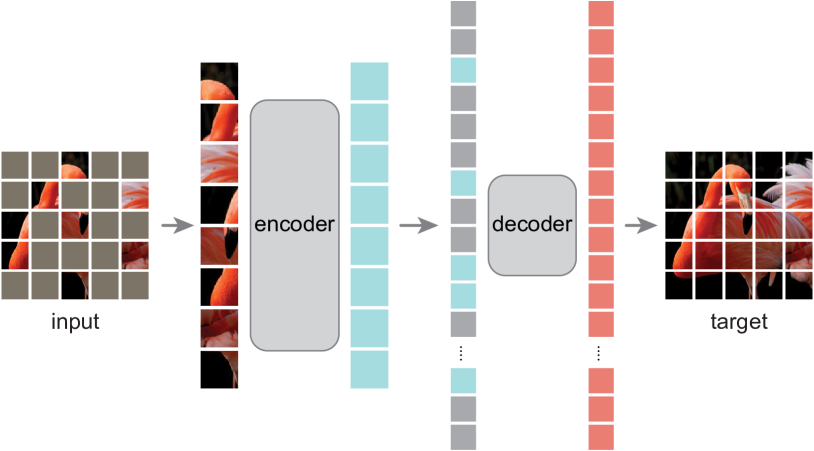
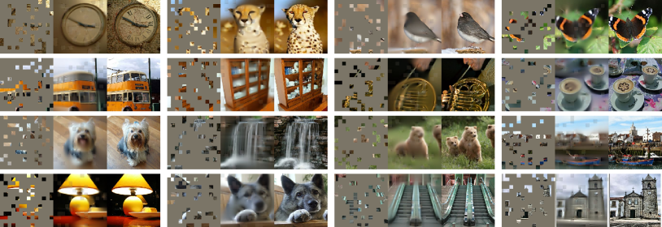
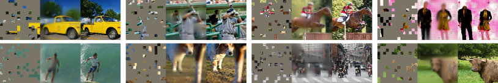
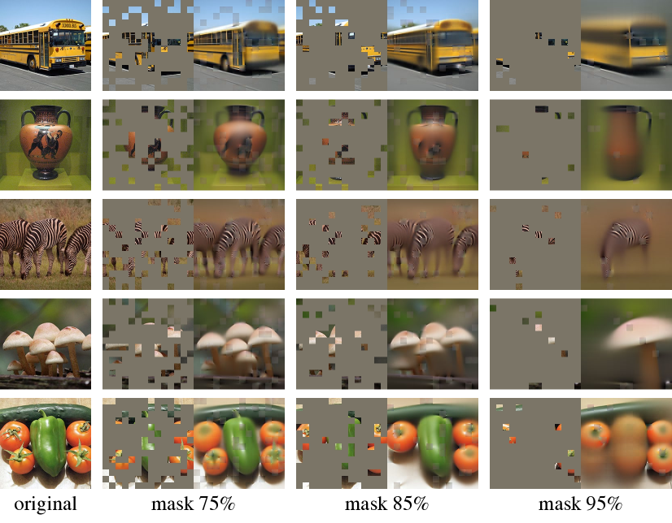
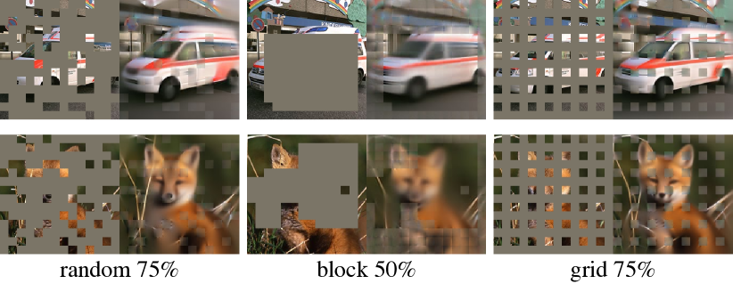
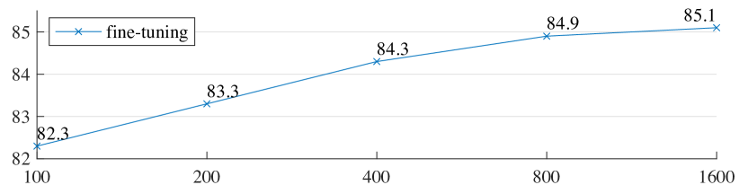
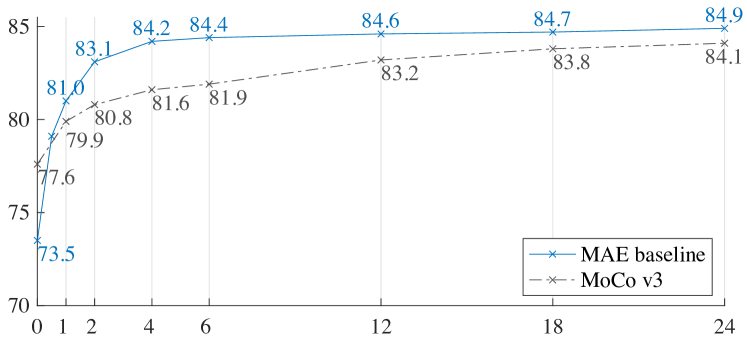
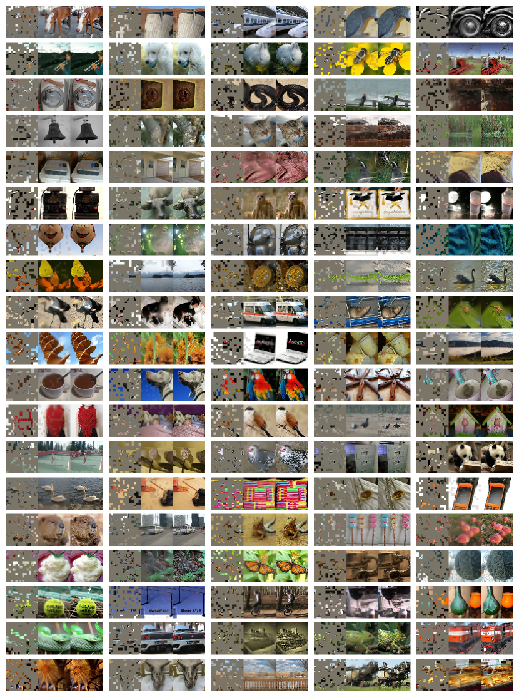
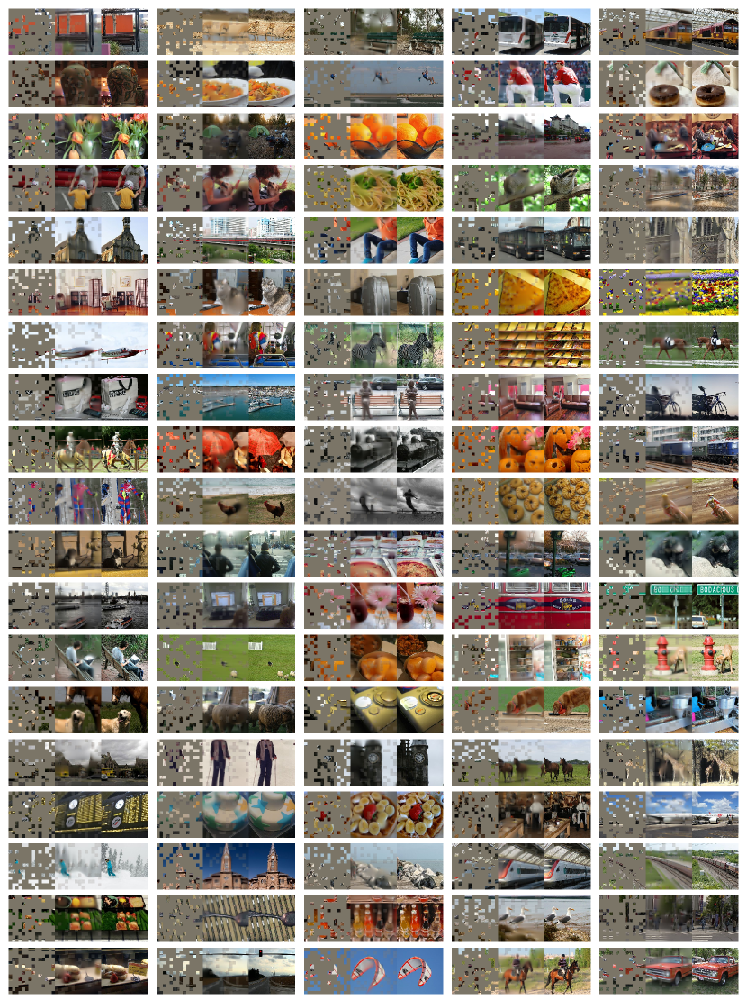

# マスクオートエンコーダはスケーラブルな視覚学習器である

> 原題: Masked Autoencoders Are Scalable Vision Learners
> 著者: Kaiming He*†, Xinlei Chen*, Saining Xie, Yanghao Li, Piotr Dollár, Ross Girshick
> 所属: Facebook AI Research（FAIR）
> 注: * は equal technical contribution、† は project lead
> 出典: arXiv:2111.06377、CVPR 2022（原文: <https://ar5iv.labs.arxiv.org/html/2111.06377>）

> 翻訳メモ: 本翻訳は本文 §1〜§6 に加え、**Appendix A〜C まで含む全文翻訳**である。References は除外。

---

## Abstract（要旨）

本論文は、マスクオートエンコーダ（MAE）がコンピュータビジョンのためのスケーラブルな自己教師あり学習器であることを示す。

われわれの MAE のアプローチはシンプルである: 入力画像のパッチをランダムにマスクし、欠落した画素を再構成する。

これは 2 つのコア設計に基づく。

第一に、われわれは**非対称な**エンコーダ-デコーダアーキテクチャを開発し、エンコーダは可視パッチのサブセットのみ（マスクトークンなし）で動作し、軽量なデコーダが潜在表現とマスクトークンから元の画像を再構成する。

第二に、入力画像の高い割合、例えば 75% をマスクすることが、非自明で有意味な自己教師タスクをもたらすことを発見した。

これら 2 つの設計を組み合わせることで、大規模モデルを効率的かつ効果的に訓練できる: 訓練を 3 倍以上加速し、精度も向上させる。

われわれのスケーラブルなアプローチは、汎化性能の高い大容量モデルの学習を可能にする: 例えば、素朴な ViT-Huge モデルが ImageNet-1K のデータのみを使用する手法の中で最良の精度（87.8%）を達成する。

下流タスクへの転移性能は教師あり事前学習を上回り、有望なスケーリング挙動を示す。

---

## 1 Introduction（はじめに）

<figure>

<figcaption>図1: われわれの MAE アーキテクチャ。事前学習中、画像パッチの大規模なランダムサブセット（例: 75%）がマスクされる。エンコーダは可視パッチの小さなサブセットに適用される。マスクトークンはエンコーダの後で導入され、エンコード済みパッチとマスクトークンの全集合は、画素レベルで元の画像を再構成する小さなデコーダによって処理される。事前学習後、デコーダは破棄され、エンコーダは認識タスクのために無傷の画像（パッチの全集合）に適用される。</figcaption>
</figure>

深層学習は、能力と容量が継続的に成長するアーキテクチャの爆発を目撃してきた [33, 25, 57]。

ハードウェアの急速な進歩に助けられ、現在のモデルは 100 万枚の画像 [13] を容易に過学習し、しばしば公開アクセス不可能な、何億ものラベル付き画像 [16] を要求し始めている。

このデータへの欲求は、自然言語処理（NLP）において自己教師あり事前学習によって成功裏に対処されている。

その解決策は、GPT [47, 48, 4] における自己回帰的言語モデリングや、BERT [14] における**マスクオートエンコーディング**に基づいており、概念的にはシンプルである: データの一部を除去し、除去された内容を予測することを学習する。

これらの手法は今や、1000 億以上のパラメータを持つ汎化可能な NLP モデルの訓練を可能にしている [4]。

マスクオートエンコーダのアイデアは、より一般的なノイズ除去オートエンコーダ [58] の一形態であり、自然であり、コンピュータビジョンにも適用可能である。

実際、ビジョンにおける密接に関連する研究 [59, 46] は BERT に先行していた。

しかしながら、BERT の成功後にこのアイデアへの強い関心があったにもかかわらず、ビジョンにおけるオートエンコーディング手法の進歩は NLP に遅れをとっている。

われわれは問う: マスクオートエンコーディングはビジョンと言語の間で何が違うのか？

以下の観点からこの問いに答えることを試みる:

<figure>

<figcaption>図2: ImageNet 検証画像での例の結果。各トリプレットでは、マスクされた画像（左）、われわれの MAE 再構成†（中）、ground truth（右）を示す。マスキング率は 80% で、196 パッチのうち 39 パッチだけ残されている。さらなる例は付録にある。可視パッチに対しては損失が計算されないため、可視パッチでのモデルの出力は定性的により悪い。出力を可視パッチで単純に重ね合わせることで視覚的品質を向上させることができる。われわれは意図的にこれを行わない、それにより手法の振る舞いをより包括的に実証できるようにする。</figcaption>
</figure>

<figure>

<figcaption>図3: COCO 検証画像での例の結果。図 2 と同じモデル重みで、ImageNet で訓練された MAE を使用。右端の 2 つの例の再構成を見ると、ground truth とは異なるが、意味的にもっともらしい。</figcaption>
</figure>

(i) 最近まで、アーキテクチャは異なっていた。ビジョンにおいては、畳み込みネットワーク [34] が過去十年支配的であった [33]。畳み込みは典型的に規則的なグリッド上で動作し、マスクトークン [14] や位置埋め込み [57] のような「指標」を畳み込みネットワークに統合することは直接的でない。しかしながら、このアーキテクチャ的ギャップは、Vision Transformer（ViT）[16] の導入によって対処されており、もはや障害となるべきではない。

(ii) 情報密度が言語とビジョンで異なる。言語は人間が生成した信号で、高度に意味的かつ情報密度が高い。文ごとに少数の欠落単語のみを予測するようモデルを訓練すると、このタスクは洗練された言語理解を誘発するように見える。一方、画像は重い空間的冗長性を持つ自然信号である。例えば、欠落したパッチは、部位・物体・シーンの高レベルな理解がほとんどなくても、近傍のパッチから回復できる。この違いを克服し、有用な特徴量の学習を促進するため、コンピュータビジョンではシンプルな戦略が良く機能することを示す: ランダムパッチの非常に高い割合をマスクすることである。この戦略は冗長性を大きく減らし、低レベルな画像統計を超える全体的な理解を必要とする困難な自己教師タスクを作り出す。われわれの再構成タスクの定性的感覚を得るには、図 2-4 を参照されたい。

(iii) オートエンコーダのデコーダは、潜在表現を入力へ写し戻すもので、テキストと画像の再構成では異なる役割を果たす。ビジョンにおいて、デコーダは**画素**を再構成するため、その出力は一般的な認識タスクよりも低い意味レベルにある。これは言語と対照的で、そこではデコーダは豊かな意味情報を含む**単語**の欠落を予測する。BERT ではデコーダは些細なもの（MLP）でよいが [14]、画像については、デコーダの設計が学習される潜在表現の意味レベルを決定する重要な役割を果たすことを発見した。

この分析に駆動され、われわれは視覚表現学習のためのシンプルで効果的かつスケーラブルなマスクオートエンコーダ（MAE）の形式を提示する。

われわれの MAE は入力画像からランダムなパッチをマスクし、欠落したパッチを画素空間で再構成する。

非対称なエンコーダ-デコーダ設計を持つ。

エンコーダは可視パッチのサブセットのみ（マスクトークンなし）で動作し、デコーダは軽量で、潜在表現とマスクトークンから入力を再構成する（図 1）。

マスクトークンを小さなデコーダに移行する非対称なエンコーダ-デコーダ設計は、計算の大幅な削減をもたらす。

この設計のもとで、非常に高いマスキング率（例: 75%）は win-win シナリオを達成できる: 精度を最適化しつつ、エンコーダがパッチの小さな部分（例: 25%）のみを処理することを可能にする。

これにより全体の事前学習時間を 3 倍以上削減でき、メモリ消費も同様に削減でき、われわれの MAE を大規模モデルに容易にスケールできる。

われわれの MAE は汎化性能の高い超大容量モデルを学習する。

MAE の事前学習によって、ImageNet-1K で ViT-Large/Huge [16] のようなデータを必要とするモデルを改善された汎化性能で訓練できる。

素朴な ViT-Huge モデルを用いて、ImageNet-1K でファインチューニングした際に 87.8% の精度を達成する。

これは ImageNet-1K データのみを使用するすべての先行結果を上回る。

物体検出、インスタンスセグメンテーション、セマンティックセグメンテーションでの転移学習も評価する。

これらのタスクで、われわれの事前学習は教師あり事前学習対応物より良い結果を達成し、より重要なことに、モデルをスケールアップすることで有意な利得を観察する。

これらの観察は NLP における自己教師あり事前学習で目撃されたものと一致しており [14, 47, 48, 4]、われわれの分野が同様の軌跡を探索できるようになることを願う。

<figure>

<figcaption>図4: マスキング率 75% で事前学習された MAE を、より高いマスキング率の入力に適用したときの ImageNet 検証画像の再構成。予測は元の画像とはもっともらしく異なり、手法が汎化できることを示す。</figcaption>
</figure>

---

## 2 Related Work（関連研究）

### Masked language modeling（マスク言語モデリング）

とその自己回帰的対応物、例えば BERT [14] と GPT [47, 48, 4] は、NLP における事前学習のための高度に成功した手法である。

これらの手法は入力系列の一部を保留し、欠落した内容を予測するようモデルを訓練する。

これらの手法は優れたスケーリングを示し [4]、これらの事前学習済み表現が様々な下流タスクに良く汎化することの豊富な証拠が存在する。

### Autoencoding（オートエンコーディング）

は表現学習の古典的手法である。

入力を潜在表現に写すエンコーダと、入力を再構成するデコーダを持つ。

例えば、PCA と k-means はオートエンコーダである [29]。

ノイズ除去オートエンコーダ（DAE）[58] は、入力信号を破損させ、元の破損していない信号を再構成することを学習する一群のオートエンコーダである。

一連の手法は、異なる破損のもとでの一般化された DAE と考えることができる、例えば画素マスキング [59, 46, 6] や色チャネル除去 [70]。

われわれの MAE はノイズ除去オートエンコーディングの一形態であるが、古典的な DAE とは多くの点で異なる。

### Masked image encoding（マスク画像エンコーディング）

手法は、マスキングによって破損された画像から表現を学習する。

[59] の先駆的研究は、DAE のノイズタイプとしてマスキングを提示した。

Context Encoder [46] は畳み込みネットワークを使用して大きな欠落領域を塗りつぶす（inpaint）。

NLP の成功に動機づけられて、関連する最近の手法 [6, 16, 2] は Transformer [57] に基づいている。

iGPT [6] は画素の系列で動作し、未知の画素を予測する。

ViT 論文 [16] は自己教師あり学習のためのマスクパッチ予測を研究している。

最近では、BEiT [2] が離散トークンの予測を提案している [44, 50]。

### Self-supervised learning（自己教師あり学習）

アプローチはコンピュータビジョンにおいて有意な関心を集めており、しばしば事前学習のための異なる事前テキストタスクに焦点を当てている [15, 61, 42, 70, 45, 17]。

最近では対比学習 [3, 22] が人気となっている、例えば [62, 43, 23, 7] は、2 つ以上のビュー間の画像の類似性と非類似性（または類似性のみ [21, 8]）をモデル化する。

対比および関連手法はデータ拡張に強く依存する [7, 21, 8]。

オートエンコーディングは概念的に異なる方向を追求し、われわれが提示するように異なる挙動を示す。

---

## 3 Approach（アプローチ）

われわれのマスクオートエンコーダ（MAE）は、その部分的観察を与えられた元の信号を再構成するシンプルなオートエンコーディングアプローチである。

すべてのオートエンコーダと同様に、われわれのアプローチは観察された信号を潜在表現に写すエンコーダと、潜在表現から元の信号を再構成するデコーダを持つ。

古典的なオートエンコーダとは異なり、われわれは**非対称な**設計を採用し、エンコーダが部分的・観察された信号のみで動作（マスクトークンなし）し、軽量なデコーダが潜在表現とマスクトークンから完全な信号を再構成することを可能にする。

図 1 がアイデアを例示しており、次に紹介する。

### Masking（マスキング）

ViT [16] に従い、画像を規則的な重ならないパッチに分割する。

次にパッチのサブセットをサンプリングし、残りをマスク（つまり除去）する。

われわれのサンプリング戦略は直接的である: 一様分布に従い、置換なしでランダムにパッチをサンプリングする。

これを単に「ランダムサンプリング」と呼ぶ。

高いマスキング率（つまり、除去されたパッチの比率）でのランダムサンプリングは冗長性を大きく排除するため、可視の近傍パッチからの外挿で容易に解けないタスクを作り出す（図 2-4 を参照）。

一様分布は潜在的な中心バイアス（つまり、画像中心付近にマスクパッチがより多い）を防ぐ。

最後に、高度に疎な入力は効率的なエンコーダを設計する機会を作り出す、それを次に紹介する。

### MAE encoder（MAE エンコーダ）

われわれのエンコーダは ViT [16] であるが、**可視・マスクされていないパッチのみ**に適用される。

標準的な ViT と同様、エンコーダは位置埋め込みを追加した線形射影によってパッチを埋め込み、結果として得られる集合を一連の Transformer ブロックで処理する。

しかしながら、われわれのエンコーダは完全な集合の小さなサブセット（例: 25%）のみで動作する。

マスクされたパッチは除去され、マスクトークンは使用されない。

これにより、計算とメモリのほんの一部で非常に大きなエンコーダを訓練できる。

完全な集合は軽量なデコーダによって扱われ、次に記述する。

### MAE decoder（MAE デコーダ）

MAE デコーダへの入力は、(i) エンコードされた可視パッチと (ii) マスクトークンからなるトークンの全集合である。

図 1 を参照。

各マスクトークン [14] は共有された学習可能なベクトルで、予測すべき欠落パッチの存在を示す。

この全集合のすべてのトークンに位置埋め込みを追加する; これがなければ、マスクトークンは画像内のその位置に関する情報を持たないだろう。

デコーダは別の一連の Transformer ブロックを持つ。

MAE デコーダは画像再構成タスクを実行するための事前学習中のみ使用される（エンコーダのみが認識のための画像表現を生成するために使用される）。

したがって、デコーダのアーキテクチャはエンコーダ設計から**独立**した方法で柔軟に設計できる。

われわれは非常に小さなデコーダで実験する。エンコーダよりも狭く浅い。

例えば、われわれの既定のデコーダは、エンコーダと比較してトークンあたりの計算量が 10% 未満である。

この非対称な設計により、トークンの全集合は軽量なデコーダのみによって処理され、事前学習時間が有意に削減される。

### Reconstruction target（再構成ターゲット）

われわれの MAE は、各マスクパッチの画素値を予測することで入力を再構成する。

デコーダの出力の各要素は、パッチを表す画素値のベクトルである。

デコーダの最後の層は、出力チャネル数がパッチ内の画素値の数に等しい線形射影である。

デコーダの出力は再構成された画像を形成するように再形成される。

われわれの損失関数は、画素空間における再構成された画像と元の画像の間の平均二乗誤差（MSE）を計算する。

BERT [14] と同様に、マスクされたパッチのみで損失を計算する。

各マスクパッチの正規化された画素値を再構成ターゲットとする派生も研究する。

具体的には、パッチ内のすべての画素の平均と標準偏差を計算し、それらを使ってこのパッチを正規化する。

正規化された画素を再構成ターゲットとして使用すると、われわれの実験で表現品質が向上する。

### Simple implementation（シンプルな実装）

われわれの MAE 事前学習は効率的に実装でき、重要なことに、いかなる特殊な疎演算も必要としない。

最初に、各入力パッチに対してトークンを生成する（位置埋め込みを追加した線形射影による）。

次にトークンのリストを**ランダムにシャッフル**し、マスキング率に基づいてリストの最後の部分を**除去**する。

このプロセスはエンコーダのためのトークンの小さなサブセットを生み出し、置換なしのパッチサンプリングと等価である。

エンコーディング後、エンコードされたパッチのリストにマスクトークンのリストを追加し、この完全なリストを**unshuffle**（ランダムシャッフル操作を反転）して、すべてのトークンをそのターゲットに合わせる。

デコーダはこの完全なリスト（位置埋め込みを追加して）に適用される。

述べたように、疎演算は必要ない。

このシンプルな実装は、シャッフルと unshuffle 操作が高速であるため、無視できるオーバーヘッドを導入する。

---

## 4 ImageNet Experiments（ImageNet 実験）

ImageNet-1K（IN1K）[13] の訓練集合で自己教師あり事前学習を行う。

次に、教師あり訓練を行い、(i) エンドツーエンドファインチューニングまたは (ii) 線形プローブで表現を評価する。

単一の 224 × 224 クロップの top-1 検証精度を報告する。

詳細は付録 A.1 にある。

### Baseline: ViT-Large

アブレーション研究のバックボーンとして ViT-Large（ViT-L/16）[16] を使用する。

ViT-L は非常に大きく（ResNet-50 [25] より一桁大きい）、過学習する傾向がある。

以下は、スクラッチから訓練された ViT-L とわれわれのベースライン MAE からファインチューニングされたものの比較である:

| scratch, original [16] | scratch, our impl. | baseline MAE |
| --- | --- | --- |
| 76.5 | 82.5 | 84.9 |

教師あり ViT-L をスクラッチから訓練することは非自明で、強い正則化を伴う良いレシピが必要である（82.5%、付録 A.2 参照）。

そうであっても、われわれの MAE 事前学習は大きな改善に貢献する。

ここでファインチューニングは 50 エポックのみ（スクラッチからの 200 と対比）で、ファインチューニング精度が事前学習に大きく依存することを示唆する。

<figure>

<figcaption>図5: マスキング率の影響。線形プローブ（lin）とファインチューニング（ft）の傾向の違いに注目。最適なマスキング率は驚くほど高く、典型的な BERT の 15% よりはるかに大きい。</figcaption>
</figure>

**表1**: ImageNet-1K 上の ViT-L/16 を用いた MAE アブレーション実験。既定設定が灰色でマーク。

(a) decoder depth

| blocks | ft | lin |
| --- | --- | --- |
| 1 | 84.8 | 65.5 |
| 2 | 84.9 | 70.0 |
| 4 | 84.9 | 71.9 |
| **8** | **84.9** | **73.5** |
| 12 | 84.4 | 73.3 |

(b) decoder width

| dim | ft | lin |
| --- | --- | --- |
| 128 | 84.9 | 69.1 |
| 256 | 84.8 | 71.3 |
| **512** | **84.9** | **73.5** |
| 768 | 84.4 | 73.1 |
| 1024 | 84.3 | 73.1 |

(c) mask token

| case | ft | lin | FLOPs |
| --- | --- | --- | --- |
| encoder w/ [M] | 84.2 | 59.6 | 3.3 × |
| **encoder w/o [M]** | **84.9** | **73.5** | **1 ×** |

(d) reconstruction target

| case | ft | lin |
| --- | --- | --- |
| **pixel (w/o norm)** | **84.9** | **73.5** |
| pixel (w/ norm) | 85.4 | 73.9 |
| PCA | 84.6 | 72.3 |
| dVAE token | 85.3 | 71.6 |

(e) data augmentation

| case | ft | lin |
| --- | --- | --- |
| none | 84.0 | 65.7 |
| crop, fixed size | 84.7 | 73.1 |
| **crop, rand size** | **84.9** | **73.5** |
| crop + color jit | 84.3 | 71.9 |

(f) mask sampling

| case | ratio | ft | lin |
| --- | --- | --- | --- |
| **random** | **75** | **84.9** | **73.5** |
| block | 50 | 83.9 | 72.3 |
| block | 75 | 82.8 | 63.9 |
| grid | 75 | 84.0 | 66.0 |

特に指定しない場合、既定は: デコーダは深さ 8、幅 512、再構成ターゲットは非正規化画素、データ拡張はランダムリサイズドクロップ、マスキング率は 75%、事前学習長は 800 エポック。

### 4.1 Main Properties（主要な特性）

表 1 で既定設定を用いて MAE をアブレートする（キャプション参照）。

いくつかの興味深い特性が観察される。

### Masking ratio（マスキング率）

図 5 はマスキング率の影響を示す。

最適な比率は驚くほど高い。

75% の比率は線形プローブとファインチューニングの両方に良い。

この挙動は、典型的なマスキング率が 15% である BERT [14] と対照的である。

われわれのマスキング率はまた、コンピュータビジョンにおける関連研究 [6, 16, 2]（20% から 50%）のものよりもはるかに高い。

モデルは欠落パッチを推論して、異なるがもっともらしい出力を生成する（図 4）。

物体やシーンの全体性（gestalt）を理解しており、これは線やテクスチャを単に延長することでは完成できない。

この推論のような挙動が有用な表現の学習に結びついていると仮説する。

図 5 はまた、線形プローブとファインチューニングの結果が異なる傾向に従うことを示す。

線形プローブについては、精度はスイートポイントまでマスキング率とともに着実に増加する: 精度ギャップは最大 ~20%（54.6% 対 73.5%）。

ファインチューニングについては、結果は比率に対してより敏感でなく、広範なマスキング率（40〜80%）が良く機能する。

図 5 のすべてのファインチューニング結果は、スクラッチからの訓練（82.5%）より優れている。

### Decoder design（デコーダ設計）

われわれの MAE デコーダは表 1(a) と (b) で研究したように柔軟に設計できる。

表 1(a) はデコーダの深さ（Transformer ブロック数）を変える。

線形プローブには十分深いデコーダが重要である。

これは画素再構成タスクと認識タスクのギャップで説明できる: オートエンコーダの最後の数層は再構成にもっと特化しているが、認識にはあまり関連しない。

合理的に深いデコーダは再構成の特化を吸収でき、潜在表現をより抽象的なレベルに残せる。

この設計は線形プローブで最大 8% の改善をもたらせる（表 1(a), 'lin'）。

しかしながら、ファインチューニングが使用される場合、エンコーダの最後の層は認識タスクに適応するように調整できる。

デコーダの深さはファインチューニングの改善にはあまり影響しない（表 1(a), 'ft'）。

興味深いことに、シングルブロックデコーダの MAE はファインチューニングで強く機能できる（84.8%）。

シングル Transformer ブロックは、可視トークンからマスクトークンに情報を伝播する最小要件であることに注意。

そのような小さなデコーダは訓練をさらに高速化できる。

表 1(b) でデコーダの幅（チャネル数）を研究する。

既定で 512-d を使用し、ファインチューニングと線形プローブの両方で良く機能する。

より狭いデコーダもファインチューニングで良く機能する。

全体として、われわれの既定 MAE デコーダは軽量である。

8 ブロックで幅 512-d を持つ（表 1 灰色）。

ViT-L（24 ブロック, 1024-d）と比較してトークンあたり 9% の FLOPs のみである。

そのため、デコーダはすべてのトークンを処理するが、全体の計算のごく一部に留まる。

**表2**: 訓練の壁時計時間（800 エポック）、128 TPU-v3 コアで TensorFlow を使用してベンチマーク。マスクトークンを持つエンコーダのエントリ（灰色）に対する高速化。デコーダの幅は 512、マスク率は 75%。†: このエントリは 10 エポックの訓練で推定された。

| encoder | dec. depth | ft acc | hours | speedup |
| --- | --- | --- | --- | --- |
| ViT-L, w/ [M] | 8 | 84.2 | 42.4 | - |
| ViT-L | 8 | 84.9 | 15.4 | 2.8 × |
| ViT-L | 1 | 84.8 | 11.6 | 3.7 × |
| ViT-H, w/ [M] | 8 | - | 119.6† | - |
| ViT-H | 8 | 85.8 | 34.5 | 3.5 × |
| ViT-H | 1 | 85.9 | 29.3 | 4.1 × |

### Mask token（マスクトークン）

われわれの MAE の重要な設計は、エンコーダでマスクトークン [M] をスキップし、軽量デコーダで後で適用することである。

表 1(c) でこの設計を研究する。

エンコーダがマスクトークンを使用すると、悪化する: 線形プローブで精度が 14% 落ちる。

この場合、事前学習とデプロイの間にギャップがある: このエンコーダは事前学習で入力にマスクトークンの大部分を持つが、これは無傷の画像には存在しない。

このギャップはデプロイの精度を低下させうる。

エンコーダからマスクトークンを除去することで、エンコーダが常に実パッチを見ることを制約し、それにより精度を改善する。

さらに、エンコーダでマスクトークンをスキップすることで、訓練計算を大きく削減する。

表 1(c) で、全体の訓練 FLOPs を 3.3 × 削減する。

これはわれわれの実装で 2.8 × の壁時計加速をもたらす（表 2 参照）。

壁時計加速はより大きく（3.5-4.1 ×）、より小さなデコーダ（1 ブロック）、より大きなエンコーダ（ViT-H）、または両方の場合。

マスキング率 75% に対して、加速は 4 × 以上になりうることに注意。自己注意の複雑度が二次的であることが部分的な理由である。

加えて、メモリは大きく削減され、これによりさらに大きなモデルの訓練や、大バッチ訓練によるさらなる加速が可能になる。

時間とメモリの効率性は、われわれの MAE を非常に大きなモデルの訓練に有利にする。

### Reconstruction target（再構成ターゲット）

表 1(d) で異なる再構成ターゲットを比較する。

これまでのわれわれの結果は（パッチごとの）正規化なしの画素に基づいている。

正規化を伴う画素を使用すると精度が向上する。

このパッチごとの正規化はローカルにコントラストを強化する。

別の派生では、パッチ空間で PCA を実行し、最大の PCA 係数（ここでは 96）をターゲットとして使用する。

そうすると精度が低下する。

両実験は、高周波成分がわれわれの手法で有用であることを示唆する。

BEiT [2] で使用されたターゲットであるトークンを予測する MAE 派生も比較する。

具体的にはこの派生のため、[2] に従い DALLE 事前学習済み dVAE [50] をトークナイザとして使用する。

ここで MAE デコーダはクロスエントロピー損失を使用してトークンインデックスを予測する。

このトークン化はファインチューニング精度を非正規化画素に対して 0.4% 改善するが、正規化画素に対しては利点がない。

線形プローブ精度も低下させる。

§5 で、トークン化が転移学習で必要でないことをさらに示す。

われわれの画素ベース MAE はトークン化よりはるかにシンプルである。

dVAE トークナイザはさらに 1 つの事前学習段階を必要とし、追加のデータ（2.5 億画像 [50]）に依存しうる。

dVAE エンコーダは大規模な畳み込みネットワークで（ViT-L の 40% FLOPs）、非自明なオーバーヘッドを加える。

画素を使用することはこれらの問題に苦しまない。

<figure>

<figcaption>図6: マスクサンプリング戦略は事前テキストタスクの難易度を決定し、再構成品質と表現に影響する（表1(f)）。各出力は指定されたマスキング戦略で訓練された MAE からのもの。左: ランダムサンプリング（既定）。中: 大きなランダムブロックを除去するブロック単位サンプリング。右: 4 つに 1 つのパッチを保つグリッド単位サンプリング。画像は検証集合から。</figcaption>
</figure>

### Data augmentation（データ拡張）

表 1(e) でデータ拡張がわれわれの MAE 事前学習に与える影響を研究する。

われわれの MAE は、固定サイズまたはランダムサイズ（両方ともランダム水平反転を持つ）のクロップのみの拡張で良く機能する。

色ジッタを加えると結果が悪化するので、他の実験では使用しない。

驚くべきことに、われわれの MAE はデータ拡張を全く使用しなくても適切に振る舞う（中央クロップのみ、反転なし）。

この特性は、対比学習と関連手法 [62, 23, 7, 21] と劇的に異なり、それらはデータ拡張に大きく依存する。

[21] で、クロップのみの拡張を使用すると BYOL [21] と SimCLR [7] でそれぞれ精度が 13% と 28% 低下することが観察された。

加えて、対比学習が拡張なしで機能できるという証拠はない: 画像の 2 つのビューは同じで、容易に自明な解を満たしうる。

MAE では、データ拡張の役割は主にランダムマスキングによって行われる（次にアブレートする）。

マスクは各反復で異なり、データ拡張に関わらず新しい訓練サンプルを生成する。

事前テキストタスクはマスキングによって困難となり、訓練を正則化するためのより少ない拡張で済む。

### Mask sampling strategy（マスクサンプリング戦略）

表 1(f) で、図 6 に例示する異なるマスクサンプリング戦略を比較する。

[2] で提案されたブロック単位マスキング戦略は、大きなブロックを除去する傾向がある（図 6 中）。

ブロック単位マスキングを伴うわれわれの MAE は 50% の比率で合理的に機能するが、75% の比率では悪化する。

このタスクはランダムサンプリングのタスクより難しい、より高い訓練損失が観察される。

再構成もぼやけている。

グリッド単位サンプリングも研究し、これは 4 つのパッチごとに 1 つを規則的に保つ（図 6 右）。

これは簡単なタスクで、より低い訓練損失を持つ。

再構成もよりシャープである。

しかしながら、表現品質はより低い。

シンプルなランダムサンプリングがわれわれの MAE に最も機能する。

これはより高いマスキング率を可能にし、より大きな加速の利益を提供しつつ、良い精度も享受する。

### Training schedule（訓練スケジュール）

これまでのわれわれのアブレーションは 800 エポックの事前学習に基づいている。

図 7 は訓練スケジュール長の影響を示す。

精度は訓練が長くなるにつれて着実に改善する。

実際、われわれは 1600 エポックでも線形プローブ精度の飽和を観察していない。

この挙動は対比学習手法と異なる、例えば MoCo v3 [9] は ViT-L で 300 エポックで飽和する。

MAE エンコーダはエポックあたりパッチの 25% しか見ないが、対比学習ではエンコーダはエポックあたり 200%（two-crop）またはそれ以上（multi-crop）のパッチを見ることに注意。

<figure>

<figcaption>図7: 訓練スケジュール長の影響。MAE は 1600 エポックでも線形プローブ精度が飽和しない。</figcaption>
</figure>

**表3**: ImageNet-1K での先行結果との比較。事前学習データは ImageNet-1K 訓練集合（ただし BEiT のトークナイザは 2.5 億 DALLE データ [50] で事前学習）。すべての自己教師あり手法はエンドツーエンドファインチューニングで評価される。ViT モデルは B/16, L/16, H/14 [16]。各列の最良は下線。画像サイズ 224 ですべての結果、ViT-H は 448 の追加結果を除く。ここでわれわれの MAE は正規化画素を再構成し、1600 エポック事前学習される。

| method | pre-train data | ViT-B | ViT-L | ViT-H | ViT-H₄₄₈ |
| --- | --- | --- | --- | --- | --- |
| scratch, our impl. | - | 82.3 | 82.6 | 83.1 | - |
| DINO [5] | IN1K | 82.8 | - | - | - |
| MoCo v3 [9] | IN1K | 83.2 | 84.1 | - | - |
| BEiT [2] | IN1K+DALLE | 83.2 | 85.2 | - | - |
| **MAE** | IN1K | **83.6** | **85.9** | **86.9** | **87.8** |

### 4.2 Comparisons with Previous Results（先行結果との比較）

### Comparisons with self-supervised methods（自己教師あり手法との比較）

表 3 で自己教師あり ViT モデルのファインチューニング結果を比較する。

ViT-B については、すべての手法が近い性能。

ViT-L については、手法間のギャップがより大きく、より大きなモデルにとっての挑戦は過学習を減らすことであることを示唆する。

**図8（注: 元論文に対応する画像が無いため省略）**: MAE 事前学習対教師あり事前学習の比較、ImageNet-1K（サイズ 224）でファインチューニングで評価。IN1K または JFT300M で訓練された元の ViT 結果 [16] と比較。

われわれの MAE は容易にスケールアップでき、より大きなモデルから着実な改善を示してきた。

ViT-H（サイズ 224）を使用して 86.9% の精度を取得する。

サイズ 448 でファインチューニングすることで、IN1K データのみを使用して 87.8% の精度を達成する。

IN1K データのみを使用するすべての手法の中での先行最良精度は 87.1%（サイズ 512）[67] で、高度なネットワークに基づく。

外部データなしの IN1K の高度に競争的なベンチマークで、われわれは最先端を非自明なマージンで改善する。

われわれの結果は素朴な ViT に基づいており、高度なネットワークがより良く機能することを期待する。

BEiT [2] と比較すると、われわれの MAE はよりシンプルで高速でありながらより正確である。

われわれの手法は画素を再構成する、BEiT がトークンを予測するのと対比して: BEiT は ViT-B で画素を再構成するときに 1.8% の劣化を報告した [2]。

dVAE 事前学習は必要ない。

さらに、われわれの MAE は BEiT より相当に高速（エポックあたり 3.5 ×）であり、表 1(c) で研究した理由による。

表 3 の MAE モデルは、より良い精度のために 1600 エポック事前学習される（図 7）。

それでも、同じハードウェアで訓練したとき、われわれの全事前学習時間は他の手法より少ない。

例えば、128 TPU-v3 コアで ViT-L を訓練、われわれの MAE の訓練時間は 1600 エポックで 31 時間、MoCo v3 は 300 エポックで 36 時間 [9]。

### Comparisons with supervised pre-training（教師あり事前学習との比較）

元の ViT 論文 [16] で、ViT-L は IN1K で訓練したときに劣化する。

われわれの教師あり訓練の実装（A.2 参照）はより良く機能するが、精度が飽和する。

図 8 を参照。

われわれの MAE 事前学習は、IN1K のみを使用してより良く汎化できる: より高容量モデルに対するスクラッチからの訓練に対する利得がより大きい。

[16] の JFT-300M 教師あり事前学習と類似の傾向に従う。

この比較は、われわれの MAE がモデルサイズのスケールアップに役立つことを示す。

<figure>

<figcaption>図9: 表 1 の既定設定下でファインチューニングされた Transformer ブロックの数に対する ViT-L の部分ファインチューニング結果。0 ブロックは線形プローブ、24 は完全ファインチューニング。われわれの MAE 表現は線形分離性は低いが、1 つ以上のブロックがチューニングされれば一貫して MoCo v3 より良い。</figcaption>
</figure>

### 4.3 Partial Fine-tuning（部分ファインチューニング）

表 1 は、線形プローブとファインチューニングの結果がほとんど相関していないことを示す。

線形プローブは過去数年に人気のプロトコルであったが、強いが非線形な特徴量を追求する機会を逃している ― これは実際に深層学習の強みである。

中間案として、部分ファインチューニングプロトコルを研究する: 最後の数層をファインチューニングし、他は凍結する。

このプロトコルは初期の研究でも使用されてきた、例えば [65, 70, 42]。

図 9 は結果を示す。

注目すべきは、1 つの Transformer ブロックのみをファインチューニングすることで、精度を 73.5% から 81.0% に有意に押し上げる。

さらに、最後のブロックの「半分」のみ（つまり、その MLP サブブロック）をファインチューニングすれば、79.1% を取得でき、線形プローブよりはるかに良い。

この派生は本質的に MLP ヘッドのファインチューニングである。

少数のブロック（例: 4 または 6）のファインチューニングは完全ファインチューニングに近い精度を達成できる。

図 9 で、ViT-L の結果が利用可能な対比手法 MoCo v3 [9] とも比較する。

MoCo v3 はより高い線形プローブ精度を持つが、すべての部分ファインチューニング結果は MAE より悪い。

4 ブロックをチューンするときのギャップは 2.6% である。

MAE 表現は線形分離性は低いが、より強い非線形特徴量であり、非線形ヘッドがチューンされたときに良く機能する。

これらの観察は、線形分離性が表現品質を評価する唯一の指標ではないことを示唆する。

線形プローブが転移学習性能、例えば物体検出に良く相関しないことも観察されている（例: [8]）。

われわれの知る限り、線形評価は事前学習のベンチマークのために NLP ではあまり使用されない。

---

## 5 Transfer Learning Experiments（転移学習実験）

**表4**: ViT Mask R-CNN ベースラインを使用した COCO 物体検出とセグメンテーション。すべてのエントリはわれわれの実装に基づく。自己教師ありエントリはラベルなしの IN1K データを使用。Mask AP は box AP と類似の傾向に従う。

| method | pre-train data | ViT-B | ViT-L | ViT-B (mask) | ViT-L (mask) |
| --- | --- | --- | --- | --- | --- |
| supervised | IN1K w/ labels | 47.9 | 49.3 | 42.9 | 43.9 |
| MoCo v3 | IN1K | 47.9 | 49.3 | 42.7 | 44.0 |
| BEiT | IN1K+DALLE | 49.8 | 53.3 | 44.4 | 47.1 |
| **MAE** | IN1K | **50.3** | **53.3** | **44.9** | **47.2** |

表 3 の事前学習済みモデルを使用して、下流タスクでの転移学習を評価する。

### Object detection and segmentation（物体検出とセグメンテーション）

COCO [37] 上で Mask R-CNN [24] をエンドツーエンドでファインチューニングする。

ViT バックボーンは FPN [36] と使用するために適応される（A.3 参照）。

表 4 のすべてのエントリにこのアプローチを適用する。

物体検出に box AP、インスタンスセグメンテーションに mask AP を報告する。

教師あり事前学習と比較して、われわれの MAE はすべての構成で良く機能する（表 4）。

より小さな ViT-B で、われわれの MAE は教師あり事前学習より 2.4 ポイント高い（50.3 対 47.9, AP^box）。

より重要なことに、より大きな ViT-L で、われわれの MAE 事前学習は教師あり事前学習を 4.0 ポイント上回る（53.3 対 49.3）。

画素ベース MAE はトークンベース BEiT より良いまたは同等であり、MAE ははるかにシンプルで高速である。

MAE と BEiT の両方が MoCo v3 より良く、MoCo v3 は教師あり事前学習と同等である。

### Semantic segmentation（セマンティックセグメンテーション）

UperNet [63] を使用して ADE20K [72] で実験する（A.4 参照）。

表 5 はわれわれの事前学習が教師あり事前学習を有意に改善することを示す、例えば ViT-L で 3.7 ポイント。

われわれの画素ベース MAE はトークンベース BEiT も上回る。

これらの観察は COCO のものと一貫している。

### Classification tasks（分類タスク）

表 6 で iNaturalists [56] と Places [71] タスクでの転移学習を研究する（A.5 参照）。

iNat では、われわれの手法は強いスケーリング挙動を示す: より大きなモデルで精度が相当に改善する。

われわれの結果は先行最良結果を大きなマージンで超える。

Places では、われわれの MAE は数十億の画像で事前学習することで得られた先行最良結果 [19, 40] を上回る。

### Pixels vs. tokens（画素対トークン）

表 7 は MAE 再構成ターゲットとして画素対トークンを比較する。

dVAE トークンの使用は非正規化画素より良いが、テストしたすべてのケースで正規化画素と統計的に類似している。

これは再びわれわれの MAE にとってトークン化が必要でないことを示す。

**表5**: UperNet を使用した ADE20K セマンティックセグメンテーション（mIoU）。BEiT 結果は公式コードで再現された。他のエントリはわれわれの実装に基づく。

| method | pre-train data | ViT-B | ViT-L |
| --- | --- | --- | --- |
| supervised | IN1K w/ labels | 47.4 | 49.9 |
| MoCo v3 | IN1K | 47.3 | 49.1 |
| BEiT | IN1K+DALLE | 47.1 | 53.3 |
| **MAE** | IN1K | **48.1** | **53.6** |

**表6**: 分類データセットでの転移学習精度、IN1K で事前学習され次にファインチューニングされた MAE を使用。

| dataset | ViT-B | ViT-L | ViT-H | ViT-H₄₄₈ | prev best |
| --- | --- | --- | --- | --- | --- |
| iNat 2017 | 70.5 | 75.7 | 79.3 | **83.4** | 75.4 [55] |
| iNat 2018 | 75.4 | 80.1 | 83.0 | **86.8** | 81.2 [54] |
| iNat 2019 | 80.5 | 83.4 | 85.7 | **88.3** | 84.1 [54] |
| Places205 | 63.9 | 65.8 | 65.9 | **66.8** | 66.0 [19]† |
| Places365 | 57.9 | 59.4 | 59.8 | **60.3** | 58.0 [40]‡ |

†: 10 億画像で事前学習。‡: 35 億画像で事前学習。

**表7**: MAE 再構成ターゲットとしての画素対トークン。△ は dVAE トークンと正規化画素の差。差は統計的に有意でない。

|  | IN1K B | IN1K L | IN1K H | COCO B | COCO L | ADE20K B | ADE20K L |
|---|---|---|---|---|---|---|---|
| pixel (w/o norm) | 83.3 | 85.1 | 86.2 | 49.5 | 52.8 | 48.0 | 51.8 |
| pixel (w/ norm) | 83.6 | 85.9 | 86.9 | 50.3 | 53.3 | 48.1 | 53.6 |
| dVAE token | 83.6 | 85.7 | 86.9 | 50.3 | 53.2 | 48.1 | 53.4 |
| △ | 0.0 | -0.2 | 0.0 | 0.0 | -0.1 | 0.0 | -0.2 |

---

## 6 Discussion and Conclusion（議論と結論）

シンプルでよくスケールするアルゴリズムは深層学習の中核である。

NLP では、シンプルな自己教師あり学習手法（例: [47, 14, 48, 4]）が指数的にスケールするモデルからの利益を可能にする。

コンピュータビジョンでは、自己教師あり学習の進歩にもかかわらず、実用的な事前学習パラダイムは支配的に教師ありである（例: [33, 51, 25, 16]）。

本研究で、ImageNet と転移学習で、オートエンコーダ ― NLP の技術に類似したシンプルな自己教師あり手法 ― がスケーラブルな利益を提供することを観察する。

ビジョンにおける自己教師あり学習は今や NLP と類似の軌跡に乗り始めているかもしれない。

一方、画像と言語は異なる性質の信号であり、この違いは注意深く対処されなければならないことに注意する。

画像は単なる記録された光であり、視覚的な単語の類似物への意味的分解を持たない。

物体を除去しようとする代わりに、意味的セグメントを形成しない可能性が高いランダムなパッチを除去する。

同様に、われわれの MAE は画素を再構成し、これは意味的実体では**ない**。

それにもかかわらず、われわれの MAE が複雑で全体的な再構成を推論することを観察する（例: 図 4）、これは数多くの視覚概念、つまり意味論を学習したことを示唆する。

この挙動が MAE 内部の豊かな隠れ表現を通じて起こると仮説する。

この見方が将来の研究にインスピレーションを与えることを願う。

### Broader impacts（より広範な影響）

提案された手法は訓練データセットの学習統計に基づいて内容を予測するため、ネガティブな社会的影響を含むそのデータのバイアスを反映する。

モデルは存在しない内容を生成しうる。

これらの問題は、この研究の上に画像を生成するために構築する際にさらなる研究と考慮を保証する。

---

## Appendix A: Implementation Details（実装の詳細）

### A.1 ImageNet Experiments

### ViT architecture（ViT アーキテクチャ）

標準 ViT アーキテクチャ [16] に従う。

Transformer ブロック [57] のスタックを持ち、各ブロックはマルチヘッド自己注意ブロックと MLP ブロックからなり、両方とも LayerNorm（LN）[1] を持つ。

エンコーダは LN で終わる。

MAE エンコーダとデコーダが異なる幅を持つため、エンコーダの後に線形射影層を採用してマッチさせる。

われわれの MAE はエンコーダとデコーダの入力に位置埋め込み [57]（sine-cosine 版）を追加する。

われわれの MAE は [2] のコードで使用される相対位置やレイヤースケーリングを使用しない。

エンコーダ出力からファインチューニングと線形プローブのために特徴量を抽出する。

ViT がクラストークン [16] を持つため、この設計に適応するため、MAE 事前学習でエンコーダ入力に補助的なダミートークンを追加する。

このトークンは線形プローブとファインチューニングで分類器を訓練するためのクラストークンとして扱われる。

われわれの MAE はこのトークンなし（平均プーリングを伴う）でも同様に良く機能する。

### Pre-training（事前学習）

既定設定は表 8 にある。

色ジッタ、drop path、勾配クリップは使用しない。

xavier_uniform [18] を使用してすべての Transformer ブロックを初期化、ViT 公式コードに従う [16]。

線形 lr スケーリング規則 [20] を使用: lr = base_lr × batchsize / 256。

### End-to-end fine-tuning（エンドツーエンドファインチューニング）

ファインチューニングは教師あり ViT 訓練の一般的な実践に従う。

既定設定は表 9 にある。

レイヤー単位 lr 減衰 [10] を [2] に従って使用する。

### Linear probing（線形プローブ）

線形分類器の訓練は [9] に従う。

表 10 を参照。

線形プローブはエンドツーエンドファインチューニングと非常に異なるレシピを必要とすることを観察する。

特に、正則化は線形プローブには一般的に有害である。

[9] に従い、多くの一般的な正則化戦略を無効化する: mixup [69]、cutmix [68]、drop path [30]、色ジッタは使用せず、weight decay をゼロに設定する。

古典的な線形分類器（例: SVM [11]）を訓練するときに分類器の入力を正規化することは一般的な実践である。

同様に、線形プローブ分類器を訓練するときに事前学習特徴量を正規化することは有益である。

[15] に従い、affine 変換なし（affine=False）の追加 BatchNorm 層 [31] を採用する。

この層はエンコーダによって生成された事前学習特徴量に適用され、線形分類器の前にある。

この層は線形性を破らず、訓練後に線形分類器に吸収できることに注意する: 本質的に再パラメータ化された線形分類器である。

この層を導入することは異なる派生間で特徴量の大きさを較正するのに役立つ、それにより lr を追加で探索することなく同じ設定を使用できる。

**表8**: 事前学習設定。

| config | value |
| --- | --- |
| optimizer | AdamW [39] |
| base learning rate | 1.5e-4 |
| weight decay | 0.05 |
| optimizer momentum | β₁, β₂ = 0.9, 0.95 [6] |
| batch size | 4096 |
| learning rate schedule | cosine decay [38] |
| warmup epochs [20] | 40 |
| augmentation | RandomResizedCrop |

**表9**: エンドツーエンドファインチューニング設定。

| config | value |
| --- | --- |
| optimizer | AdamW |
| base learning rate | 1e-3 |
| weight decay | 0.05 |
| optimizer momentum | β₁, β₂ = 0.9, 0.999 |
| layer-wise lr decay [10, 2] | 0.75 |
| batch size | 1024 |
| learning rate schedule | cosine decay |
| warmup epochs | 5 |
| training epochs | 100 (B), 50 (L/H) |
| augmentation | RandAug (9, 0.5) [12] |
| label smoothing [52] | 0.1 |
| mixup [69] | 0.8 |
| cutmix [68] | 1.0 |
| drop path [30] | 0.1 (B/L), 0.2 (H) |

**表10**: 線形プローブ設定。LARS を大バッチで使用して訓練を高速化、SGD は 4096 バッチで同様に機能する。

| config | value |
| --- | --- |
| optimizer | LARS [66] |
| base learning rate | 0.1 |
| weight decay | 0 |
| optimizer momentum | 0.9 |
| batch size | 16384 |
| learning rate schedule | cosine decay |
| warmup epochs | 10 |
| training epochs | 90 |
| augmentation | RandomResizedCrop |

### Partial fine-tuning（部分ファインチューニング）

われわれの MAE 部分ファインチューニング（§4.3）は表 9 の設定に従うが、ファインチューニングエポック数を調整する。

より少ないブロックをチューニングするときはより長いスケジュールが必要であることを観察する。

ファインチューニングエポック数を {50, 100, 200} に設定し、チューンされるブロック数ごとに最適なものを使用する。

### A.2 Supervised Training ViT-L/H from Scratch（教師あり訓練 ViT-L/H をスクラッチから）

ImageNet-1K でスクラッチから教師あり ViT-L/H を訓練することは非自明であることを発見する。

訓練は不安定である。

公開実装を持つ強いベースライン [53] が小型モデルにあったが、より大きな ViT-L/H のレシピは未探求である。

これらのより大きなモデルに以前のレシピを直接適用しても機能しない。

訓練中に頻繁に NaN 損失が観察される。

レシピを表 11 に提供する。

wd 0.3、大きなバッチサイズ 4096、長いウォームアップを使用、元の ViT [16] に従う。

β₂ = 0.95 を [6] に従って使用する。

表 11 にリストされた正則化を使用し、他は無効化、[64] に従う。

これらすべての選択は訓練安定性を改善するためである。

われわれのレシピは NaN 損失なしで訓練を終えることができる。

精度は ViT-L で 82.6%（EMA なしで 81.5%）、ViT-H で 83.1%（EMA なしで 80.9%）。

ViT-L と ViT-H の両方が EMA を使用しなければ過学習の傾向を示す。

副産物として、われわれの ViT-B のレシピは 82.3% 精度（EMA なしで 82.1%）、[53] の 81.8% と対比。

**表11**: 教師あり ViT をスクラッチから訓練。

| config | value |
| --- | --- |
| optimizer | AdamW |
| base learning rate | 1e-4 |
| weight decay | 0.3 |
| optimizer momentum | β₁, β₂ = 0.9, 0.95 |
| batch size | 4096 |
| learning rate schedule | cosine decay |
| warmup epochs | 20 |
| training epochs | 300 (B), 200 (L/H) |
| augmentation | RandAug (9, 0.5) [12] |
| label smoothing [52] | 0.1 |
| mixup [69] | 0.8 |
| cutmix [68] | 1.0 |
| drop path [30] | 0.1 (B), 0.2 (L/H) |
| exp. moving average (EMA) | 0.9999 |

### A.3 Object Detection and Segmentation in COCO

Mask R-CNN [24] における FPN バックボーン [36] の使用のために素朴な ViT を適応させる。

ViT は単一スケール（例: stride 16）で feature map を生成する Transformer ブロックのスタックを持つ。

このスタックを 4 サブセットに均等に分割し、中間 feature map をアップサンプルまたはダウンサンプルする畳み込みを適用して、異なるスケール（stride 4, 8, 16, または 32、標準 ResNet [25] と同じ）を生成する。

FPN はこれらのマルチスケールマップ上に構築される。

異なる手法間の公平な比較のため、表 4 の各エントリ（すべての競合相手を含む）にハイパーパラメータを探索する。

探索するハイパーパラメータは学習率、weight decay、drop path 率、ファインチューニングエポック。

特定の設定とともにコードをリリースする予定。

完全なモデルと訓練の詳細、追加実験については [35] を参照。

### A.4 Semantic Segmentation in ADE20K

[2] のセマンティックセグメンテーションコードに従って UperNet [63] を使用する。

バッチサイズ 16 で 100 エポックエンドツーエンドにファインチューニング。

表 5 の各エントリ（すべての競合相手を含む）に最適な lr を探索する。

[2] のセマンティックセグメンテーションコードは相対位置バイアス [49] を使用する。

われわれの MAE 事前学習は使用しない。

公平な比較のため、転移学習中のみ相対位置バイアスをオンにし、ゼロに初期化する。

われわれの BEiT 再現は彼らのコードに従い、事前学習とファインチューニングの両方で相対位置バイアスを使用することに注意。

### A.5 Additional Classification Tasks

iNaturalist と Places のファインチューニング（表 6）には表 9 の設定に従う。

個別のデータセットごとに lr とファインチューニングエポックを調整する。

---

## Appendix B: Comparison on Linear Probing Results（線形プローブ結果の比較）

**表12**: マスクエンコーディング手法の線形プローブ結果。われわれのファインチューニング結果は表 3 にある。†: われわれの実装。

| method | model | params | acc |
| --- | --- | --- | --- |
| iGPT [6] | iGPT-L | 1362 M | 69.0 |
| iGPT [6] | iGPT-XL | 6801 M | 72.0 |
| BEiT [2] | ViT-L | 304 M | 52.1† |
| **MAE** | ViT-B | 86 M | 68.0 |
| **MAE** | ViT-L | 304 M | 75.8 |
| **MAE** | ViT-H | 632 M | 76.6 |

§4.3 で、線形プローブ精度とファインチューニング精度がほとんど相関しておらず、線形分離性について異なる焦点を持つことを示した。

既存のマスク画像エンコーディング手法が線形プローブで一般的にあまり競争力がないことに気づく（例: 対比学習より）。

完全性のため、表 12 でマスキングベース手法と線形プローブ精度を比較する。

ViT-L でのわれわれの MAE は線形プローブ精度 75.8% を持つ。

これは先行マスキングベース手法より相当に良い。

一方、このプロトコルでは対比手法に依然として遅れる: 例えば MoCo v3 [9] は ViT-L で 77.6% の線形プローブ精度を持つ（図 9）。

---

## Appendix C: Robustness Evaluation on ImageNet（ImageNet でのロバストネス評価）

**表13**: ImageNet 派生でのロバストネス評価（top-1 精度、ただし IN-C [27] は平均破損エラーを評価）。同じ MAE モデル（表 3）を異なる ImageNet 検証集合でテスト、特殊なファインチューニングなしで。

| dataset | ViT-B | ViT-L | ViT-H | ViT-H₄₄₈ | prev best |
| --- | --- | --- | --- | --- | --- |
| IN-Corruption ↓ | 51.7 | 41.8 | 33.8 | **36.8** | 42.5 |
| IN-Adversarial | 35.9 | 57.1 | 68.2 | **76.7** | 35.8 |
| IN-Rendition | 48.3 | 59.9 | 64.4 | **66.5** | 48.7 |
| IN-Sketch | 34.5 | 45.3 | 49.6 | **50.9** | 36.0 |
| *our supervised training baselines:* | | | | | |
| IN-Corruption ↓ | 45.8 | 42.3 | 41.3 | | |
| IN-Adversarial | 27.2 | 29.6 | 33.1 | | |
| IN-Rendition | 49.4 | 50.9 | 50.3 | | |
| IN-Sketch | 35.6 | 37.5 | 38.0 | | |

表 13 で、ImageNet 検証集合の異なる派生でわれわれのモデルのロバストネスを評価する。

元の ImageNet（表 3）でファインチューニングされた同じモデルを使用し、特殊なファインチューニングなしで、異なる検証集合に対して推論のみ実行する。

表 13 は、われわれの手法が強いスケーリング挙動を持つことを示す: モデルサイズを増やすことが有意な利得を持つ。

画像サイズを増やすことは IN-C を除くすべての集合で役立つ。

われわれの結果は先行最良結果（特化システム）を大きなマージンで上回る。

対照的に、教師あり訓練ははるかに悪く機能する（表 13 下、A.2 に記述されたモデル）。

例えば、ViT-H で、われわれの MAE 事前学習は IN-A で教師あり対応物より 35% 良い（68.2% 対 33.1%）。

<figure>

<figcaption>図10: ImageNet 検証画像でのキュレーションされていないランダムサンプル。各トリプレットで、マスクされた画像（左）、われわれの MAE 再構成（中）、ground truth（右）を示す。マスキング率は 75%。</figcaption>
</figure>

<figure>

<figcaption>図11: ImageNet で訓練された MAE を使用した COCO 検証画像でのキュレーションされていないランダムサンプル。各トリプレットで、マスクされた画像（左）、われわれの MAE 再構成（中）、ground truth（右）を示す。マスキング率は 75%。</figcaption>
</figure>
