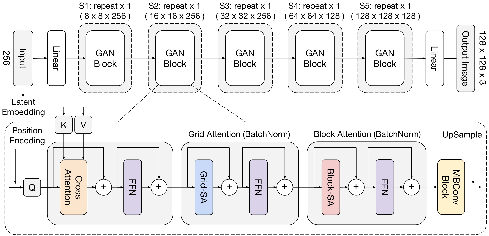

# MaxViT: 多軸 Vision Transformer

> 原題: MaxViT: Multi-Axis Vision Transformer
> 著者: Zhengzhong Tu, Hossein Talebi, Han Zhang, Feng Yang, Peyman Milanfar, Alan Bovik, Yinxiao Li
> 所属: Google Research, University of Texas at Austin
> 出典: arXiv:2204.01697 → ECCV 2022
> コード: <https://github.com/google-research/maxvit>

> 翻訳メモ: 本翻訳は CLAUDE.md §4 の標準ルールと異なり、**Appendix 0.A〜0.C も翻訳対象に含めている**（ユーザーからの個別指示による）。References は除外。原典 markdown には図 8（GAN 生成サンプル）のみ画像が含まれていたため、図 1-7 は arXiv ソース（arXiv:2204.01697 の e-print）に同梱された PDF から生成した。図 8 は 48 枚の生成サンプルのグリッドであり、翻訳ページでは省略している。

## Abstract（要旨）

Transformer は最近、コンピュータビジョンのコミュニティで大きな注目を集めている。しかし、画像サイズに対する自己注意機構のスケーラビリティの欠如が、最先端の視覚バックボーンにおけるその広範な採用を制限してきた。本論文において我々は、multi-axis attention（多軸注意）と呼ぶ効率的でスケーラブルな注意モデルを導入する。これは 2 つの側面、すなわちブロック化された局所注意と拡張された大域注意からなる。これらの設計上の選択は、線形の計算量のみで、任意の入力解像度における大域-局所の空間的相互作用を可能にする。我々はまた、提案する注意モデルを畳み込みと効果的に融合させることで新しいアーキテクチャ要素を提示し、それに応じて、この基本構成ブロックを複数の段階にわたって単に繰り返すだけの単純な階層型視覚バックボーン、MaxViT と名付けたものを提案する。特筆すべきは、MaxViT がネットワーク全体を通して、初期の高解像度の段階においてさえ大域的に「見る」ことができる点である。我々は広範な視覚タスクにおいて本モデルの有効性を実証する。画像分類において、MaxViT は様々な設定で最先端の性能を達成する。追加データなしで MaxViT は ImageNet-1K の top-1 精度 86.5% に達し、ImageNet-21K の事前学習を用いると本モデルは top-1 精度 88.7% を達成する。下流タスクについては、バックボーンとしての MaxViT が物体検出および視覚的美観評価において好ましい性能をもたらす。また我々は、提案するモデルが ImageNet 上で強い生成モデル化の能力を発揮することも示し、汎用視覚モジュールとしての MaxViT ブロックの優れた潜在能力を実証する。ソースコードと訓練済みモデルは <https://github.com/google-research/maxvit> で利用可能になる予定である。

###### キーワード

Transformer, 画像分類, 多軸注意（Multi-axis attention）

## 1 Introduction（はじめに）

畳み込みニューラルネットワーク（ConvNets）は AlexNet 以来、コンピュータビジョンにおける支配的なアーキテクチャ設計の選択であり続けてきた。ConvNets は、より深くすること、より広くすること、密な結合を加えること、効率的な分離可能畳み込み、atrous 畳み込み、エンコーダ・デコーダの枠組みの使用、さらには現代的なミクロ設計の構成要素の導入によって、数多くの視覚問題で優れた性能を発揮し続けている。一方、自然言語処理における Transformer のような自己注意モデルの進化に触発され、数多くの研究者が注意機構を視覚に導入し始めた。Vision Transformer（ViT）はおそらく、視覚のための最初の完全に Transformer ベースのアーキテクチャであり、そこでは画像パッチが単に単語の系列とみなされ、これらの視覚トークンに Transformer エンコーダが適用される。大規模データセットで事前学習されたとき、ViT は画像認識において説得力のある結果を達成できる。

しかし、広範な事前学習なしでは ViT が画像認識で性能を下回ることが観察されてきた。これは、帰納バイアスをあまり与えられていない Transformer の強いモデル容量に起因し、それが過学習をもたらす。モデル容量を適切に正則化しスケーラビリティを改善するため、数多くの後続の取り組みが、局所注意のような視覚タスク向けに調整された疎な Transformer モデルを研究してきた。これらの手法は典型的に、非局所性の損失を補償するために階層的アーキテクチャを再導入する。Swin Transformer は、シフトされた重複しない窓に自己注意を適用することで Transformer を修正した、そうした成功例の一つである。このアプローチは初めて、純粋な vision Transformer で ImageNet ベンチマークにおいて ConvNets を上回った。ViT で用いられる完全注意よりも柔軟性と汎化性を持つにもかかわらず、窓ベースの注意は非局所性の損失によりモデル容量が制限されることが観察されており、それゆえ ImageNet-21K や JFT のようなより大きなデータ領域で不利にスケールする。しかし、階層型ネットワークの初期あるいは高解像度の段階で完全注意を通して大域的な相互作用を獲得することは、注意演算子が二次の計算量を要するため計算的に重い。**計算予算のもとでモデル容量と汎化性のバランスを取るために大域的相互作用と局所的相互作用をどう効率的に組み込むかは、依然として困難な課題である。**

<figure>


<figcaption>図1: ImageNet-1K における最先端の vision Transformer との MaxViT の性能比較。本モデルは精度 vs 計算量、精度 vs パラメータ数の双方のトレードオフにおいて優れた性能を示す。(a) 入力解像度 224×224 の ImageNet-1K 訓練設定における精度 vs FLOPs のスケーリング曲線。(b) より大きなサイズ（384/512）を許容する ImageNet-1K ファインチューニング設定における精度 vs パラメータ数のスケーリング曲線。</figcaption>
</figure>

本論文において我々は、multi-axis self-attention（Max-SA）と呼ぶ新しい種類の Transformer モジュールを提示する。これは単一のブロック内で局所的および大域的な空間的相互作用の双方を実行できる基本的なアーキテクチャ構成要素として有能に機能する。完全自己注意と比較して、Max-SA はより高い柔軟性と効率性を享受する。すなわち、線形の計算量で異なる入力長に自然に適応する。（シフト）窓／局所注意とは対照的に、Max-SA は大域的な受容野を提案することでより強いモデル容量を可能にする。さらに、単に線形の計算量であることから、Max-SA はネットワークの任意の層で、初期の高解像度の段階においてさえ、汎用の独立した注意モジュールとして用いることができる。

その有効性と汎用性を実証するため、我々はさらに Max-SA と畳み込みからなるブロックを階層的に積み重ねることで、Multi-axis Vision Transformer（MaxViT）と呼ぶ単純だが効果的な視覚バックボーンを設計する。我々の提案するモデルはハイブリッド vision Transformer の範疇に属するが、MaxViT が従来のアプローチと異なるのは、**畳み込み・局所注意・大域注意を統合した基本ブロックを設計し、それを単に繰り返すという単純さを追求している**点である。我々の実験は、MaxViT が分類、物体検出とセグメンテーション、画像美観評価、画像生成を含む幅広い視覚タスクにおいて、あらゆるデータ領域で最先端（SOTA）の性能を大幅に改善することを示す。具体的には図1 が示すように、MaxViT は精度 vs FLOPs と精度 vs パラメータ数の双方の曲線において、最近の Transformer ベースのモデルをすべて上回る。我々の貢献は以下の通りである。

- ネットワークのすべての段階を通して局所的および大域的な空間的相互作用の双方を捉えることのできる、汎用的で強力な Transformer バックボーン MaxViT。
- ブロック化された局所注意と拡張された大域注意からなる、線形の計算量で大域的知覚を享受する新規の独立した多軸注意モジュール。
- 層数、レイアウト、MBConv の使用などを含む多数の設計上の選択を広範なアブレーション研究で実証し、最終的に我々の最終的なモジュール設計である MaxViT ブロックへと収束させた。
- 我々の広範な実験は、MaxViT が画像分類、物体検出、画像美観評価、画像生成を含む幅広いタスクにおいて、様々なデータ領域で SOTA の結果を達成することを示す。

## 2 Related work（関連研究）

**畳み込みネットワーク。** AlexNet 以来、畳み込みニューラルネットワーク（ConvNets）は「狂騒の 20 年代」以前、ほぼすべての視覚タスクの事実上の解法として用いられてきた。過去 10 年で驚異的なアーキテクチャ上の改善がなされてきた。残差結合と密な結合、完全畳み込みネットワーク、エンコーダ・デコーダ方式、特徴ピラミッド、深さと幅の増大、空間的およびチャネル方向の注意モデル、非局所的相互作用などである。注目すべき最近の研究である ConvNeXt は vision Transformer の中核的設計を再導入し、「近代化」された純粋な ConvNet が幅広い視覚タスクで Transformer に匹敵する性能を達成できることを示した。

**視覚における Transformer。** Transformer はもともと自然言語処理のために提案された。2020 年の Vision Transformer（ViT）の登場は、純粋な Transformer ベースのアーキテクチャが視覚問題に対しても効果的な解法であることを示した。画像パッチを視覚的単語として扱う ViT の優雅かつ斬新な見方は、視覚 Transformer への爆発的な研究の関心を刺激した。局所性と画像の 2D 的性質を考慮するため、Swin Transformer は階層型アーキテクチャにおいてシフトされた窓で注意を集約する。より最近の研究は、疎な注意、改善された局所性、ピラミッド型設計、改善された訓練戦略を含む、モデルとデータの効率性の改善に焦点を当ててきた。包括的なレビューについては vision Transformer の専門的なサーベイを参照されたい。

**ハイブリッドモデル。** 純粋な Transformer ベースの視覚モデルは、帰納バイアスが比較的少ないために汎化性能が低いことが観察されてきた。Vision Transformer はまた、標準以下の最適化しやすさも示す。興味深いことに単純な改善は、粗い patchify ステムを置き換えるためにいくつかの畳み込みを用いるといった、Transformer 層と畳み込み層のハイブリッド設計を採用することである。幅広い研究がこの範疇に入り、明示的にハイブリッド化されたものと、暗黙的な形のものがある。

**GAN のための Transformer。** Transformer は敵対的生成ネットワーク（GAN）においても効果的であることが証明されている。TransGAN は局所注意とアップサンプリング層の慎重な設計により純粋な Transformer GAN を構築し、小規模データセットにおける有効性を実証した。GANformer は StyleGAN の生成器を改善するために効率的な大域注意機構を探求した。HiT は局所-大域注意に基づく効率的な Transformer 生成器を提示し、1K 高解像度画像生成までスケールできる。

## 3 Method（手法）

先行研究で提示された疎なアプローチに触発され、我々は完全に密な注意機構を 2 つの疎な形式——**窓注意（window attention）**と**グリッド注意（grid attention）**——に分解することで、blocked multi-axis self-attention（Max-SA）と呼ぶ新しい種類の注意モジュールを導入する。これは非局所性を一切損なうことなく、素朴な注意の二次の計算量を線形に削減する。我々の逐次的（sequential）設計はより高い単純さと柔軟性を提供しつつ、従来手法よりもさらに良い性能を発揮する。すなわち、個々のモジュールは単独でも任意の順序で組み合わせても用いることができるのに対し、並列的（parallel）設計はそのような利点を提供しない。Max-SA の柔軟性とスケーラビリティのおかげで、我々は図2 に示すように、階層型アーキテクチャにおいて Max-SA と MBConv の層を交互に単に積み重ねることで、MaxViT と呼ぶ新規の視覚バックボーンを構築できる。MaxViT は浅い段階から深い段階まで、ネットワーク全体を通して大域的および局所的な受容野から恩恵を受け、モデル容量と汎化能力の双方に関して優れた性能を発揮する。

<figure>


<figcaption>図2: MaxViT のアーキテクチャ。我々は ConvNet の慣行（例えば ResNet）における典型的な階層的設計に従うが、代わりに MBConv、ブロック注意、グリッド注意の層を統合した新しい種類の基本構成ブロックを構築する。単純のため正規化層と活性化層は省略している。上段: 入力 224×224 → S0 Conv ステム（112×112）→ S1（56×56）→ S2（28×28）→ S3（14×14）→ S4（7×7）→ Pool → FC → 出力。下段: MaxViT ブロックの内部は MBConv（Conv 1×1 → Depthwise Conv 3×3 → SE → Conv 1×1 + 残差）→ Block Attention（Block-SA + 残差 → FFN + 残差）→ Grid Attention（Grid-SA + 残差 → FFN + 残差）。</figcaption>
</figure>

### 3.1 Attention（注意）

自己注意は、正規化された対ごとの類似度に基づく内容依存の重みから恩恵を受けつつ、空間的（あるいは系列の）位置全体の空間的な混合を可能にする。標準的な自己注意は位置を認識しない、すなわち平行移動同変ではない。これは ConvNets に埋め込まれた重要な帰納バイアスである。相対自己注意（relative self-attention）は、注意重みに加算される相対的な学習バイアスを導入することで素朴な注意を改善するものとして提案されており、多くの視覚タスクで一貫して元の注意を上回ることが示されている。本研究では、主に先行研究で定義された事前正規化された相対自己注意を MaxViT における鍵となる演算子として採用する。

### 3.2 Multi-axis Attention（多軸注意）

大域的相互作用は、局所的な畳み込みと比較したときの自己注意の鍵となる利点の一つである。しかし、注意演算子が二次の計算量を要するため、空間全体に沿って直接注意を適用することは計算的に実行不可能である。この問題に取り組むため、我々は空間軸を単に分解することにより、完全サイズの注意を局所と大域の 2 つの疎な形式に分解する多軸のアプローチを提示する。$X\in\mathbb{R}^{H\times W\times C}$ を入力特徴マップとする。平坦化された空間次元 $HW$ に注意を適用する代わりに、特徴を形状 $(\frac{H}{P}\times\frac{W}{P},P\times P,C)$ のテンソルにブロック化する。これは各サイズ $P\times P$ の重複しない窓への分割を表す。局所的な空間次元、すなわち $P\times P$ に自己注意を適用することは、小さな窓の内部で注意することと等価である。我々はこの**ブロック注意（block attention）**を局所的相互作用の実行に用いる。

<figure>


<figcaption>図3: 多軸自己注意（Max-SA）。自己注意を計算するための多軸アプローチの図示（窓／グリッドサイズは 4×4）。ブロック注意モジュールは窓の内部で自己注意を行い、グリッド注意モジュールは 2D 空間全体に重ねられた疎で一様なグリッド上の画素に大域的に注意する。固定された注意範囲を用いるため、いずれも入力サイズに対して線形の計算量を持つ。同じ色が自己注意の演算によって空間的に混合される。流れは MBConv → Window Partition → Block Attention → Window Reverse → FFN → Grid Partition → Grid Attention → Grid Reverse → FFN。</figcaption>
</figure>

完全自己注意の悪名高い重い計算を回避するにもかかわらず、局所注意モデルは巨大規模のデータセットで学習不足になることが観察されてきた。ブロック注意に触発され、我々は疎な大域注意を得る驚くほど単純だが効果的な方法を提示する。これを**グリッド注意（grid attention）**と呼ぶ。固定された窓サイズを用いて特徴マップを分割する代わりに、固定された $G\times G$ の一様グリッドを用いてテンソルを形状 $(G\times G,\frac{H}{G}\times\frac{W}{G},C)$ にグリッド化する。その結果、窓は適応的なサイズ $\frac{H}{G}\times\frac{W}{G}$ を持つ。分解されたグリッド軸、すなわち $G\times G$ に自己注意を適用することは、トークンの拡張された（dilated）大域的な空間的混合に対応する。同じ固定された窓サイズとグリッドサイズを用いることで（我々は Swin に従い $P=G=7$ を用いる）、局所的演算と大域的演算の間で計算を完全に均衡させることができ、いずれも空間サイズあるいは系列長に対して線形の計算量のみを持つ。

提案する Max-SA モジュールは、**まったく同じパラメータ数と FLOPs で Swin の注意モジュールの drop-in の置き換えとなりうる**ことに注意されたい。それでいて、**マスキング、パディング、cyclic-shifting を必要とせずに大域的相互作用の能力を享受**するため、実装がより容易であり、シフト窓の方式より好ましい。例えば、多軸注意は元の注意演算を修正することなく einops で容易に実装できる（付録を参照）。提案する多軸注意（Max-SA）が軸注意（axial-attention）モデルとは根本的に異なることは特筆に値する。詳細な比較は付録を参照されたい。

**MaxViT ブロック。** 我々は 2 種類の注意を逐次的に積み重ね、単一のブロック内で局所的および大域的な相互作用の双方を得る（図3 に示す）。我々はまた LayerNorm、フィードフォワードネットワーク（FFN）、スキップ接続を含む Transformer における典型的な設計も採用していることに注意されたい。さらに我々は、多軸注意の前に squeeze-and-excitation（SE）モジュールを伴う MBConv ブロックを追加する。**MBConv を注意と併用することがネットワークの汎化性と訓練しやすさをさらに高める**ことを観察したためである。注意の前に MBConv 層を用いることにはもう一つの利点がある。すなわち、**depthwise 畳み込みは条件付き位置エンコーディング（CPE）とみなすことができ、これにより本モデルは明示的な位置エンコーディング層を持たずに済む**。提案する独立した多軸注意は、異なる目的のために併用することも単独で用いることもできることに注意されたい——局所的相互作用にはブロック注意を、大域的混合にはグリッド注意を用いる。これらの要素は多くの視覚アーキテクチャ、特に手頃な計算量で大域的相互作用から恩恵を受けうる高解像度タスクに容易に組み込むことができる。

### 3.3 Architecture Variants（アーキテクチャのバリアント）

我々は提案する MaxViT ブロックの有効性を探求するため、極めて単純な一連のアーキテクチャのバリアントを設計した（図2 に示す）。我々は一般的な ConvNet の慣行と同様の階層型バックボーンを採用し、そこでは入力がまずステム段階（S0）で Conv3x3 層を用いてダウンサンプリングされる。ネットワークの本体は 4 つの段階（S1-S4）を含み、各段階は前の段階の半分の解像度と 2 倍のチャネル数（隠れ次元）を持つ。我々のネットワークでは、バックボーン全体を通して同一の MaxViT ブロックを用いる。各段階の最初の MBConv ブロックの Depthwise Conv3x3 層でダウンサンプリングを適用する。inverted bottleneck の拡大率と squeeze-excitation（SE）の縮小率は既定でそれぞれ 4 と 0.25 である。すべての注意ブロックで注意ヘッドのサイズを 32 に設定する。段階ごとのブロック数 $B$ とチャネル次元 $C$ を増やすことでモデルをスケールアップする。MaxViT バリアントのアーキテクチャ構成を表1 に要約する。

**表1**: MaxViT のアーキテクチャバリアント。B と C は各段階のブロック数とチャネル数を表す。すべての注意層で各注意ヘッドを 32 に設定する。MBConv については、先行研究に従い常に拡大率 4 と SE における縮小率 0.25 を用いる。ステムには 2 つの Conv 層を用いる。

| Stage | Size | MaxViT-T | MaxViT-S | MaxViT-B | MaxViT-L | MaxViT-XL |
| --- | --- | --- | --- | --- | --- | --- |
| S0: Conv-stem | 1/2 | B=2 C=64 | B=2 C=64 | B=2 C=64 | B=2 C=128 | B=2 C=192 |
| S1: MaxViT-Block | 1/4 | B=2 C=64 | B=2 C=96 | B=2 C=96 | B=2 C=128 | B=2 C=192 |
| S2: MaxViT-Block | 1/8 | B=2 C=128 | B=2 C=192 | B=6 C=192 | B=6 C=256 | B=6 C=384 |
| S3: MaxViT-Block | 1/16 | B=5 C=256 | B=5 C=384 | B=14 C=384 | B=14 C=512 | B=14 C=768 |
| S4: MaxViT-Block | 1/32 | B=2 C=512 | B=2 C=768 | B=2 C=768 | B=2 C=1024 | B=2 C=1536 |

## 4 Experiments（実験）

我々は提案するモデルの有効性を様々な視覚タスクで検証した。すなわち ImageNet 分類、画像の物体検出とインスタンスセグメンテーション、画像の美観／品質評価、無条件画像生成である。より詳細な実験の内容は付録にある。

**表2**: ImageNet-1K 設定における性能比較。スループットは先行研究に従い、バッチサイズ 16 の単一 V100 GPU で測定されている。（● = ConvNets、○ = ViTs、⋄ = Hybrid）

| | Model | Eval size | Params | FLOPs | Throughput (image/s) | IN-1K top-1 acc. |
| --- | --- | --- | --- | --- | --- | --- |
| ConvNets | ● EffNet-B6 | 528 | 43M | 19.0G | 96.9 | 84.0 |
| | ● EffNet-B7 | 600 | 66M | 37.0G | 55.1 | 84.3 |
| | ● RegNetY-16 | 224 | 84M | 16.0G | 334.7 | 82.9 |
| | ● NFNet-F0 | 256 | 72M | 12.4G | 533.3 | 83.6 |
| | ● NFNet-F1 | 320 | 132M | 35.5G | 228.5 | 84.7 |
| | ● EffNetV2-S | 384 | 24M | 8.8G | 666.6 | 83.9 |
| | ● EffNetV2-M | 480 | 55M | 24.0G | 280.7 | 85.1 |
| | ● ConvNeXt-S | 224 | 50M | 8.7G | 447.1 | 83.1 |
| | ● ConvNeXt-B | 224 | 89M | 15.4G | 292.1 | 83.8 |
| | ● ConvNeXt-L | 224 | 198M | 34.4G | 146.8 | 84.3 |
| ViTs | ○ ViT-B/32 | 384 | 86M | 55.4G | 85.9 | 77.9 |
| | ○ ViT-B/16 | 384 | 307M | 190.7G | 27.3 | 76.5 |
| | ○ DeiT-B | 384 | 86M | 55.4G | 85.9 | 83.1 |
| | ○ CaiT-M24 | 224 | 186M | 36.0G | – | 83.4 |
| | ○ CaiT-M24 | 384 | 186M | 116.1G | – | 84.5 |
| | ○ DeepViT-L | 224 | 55M | 12.5G | – | 83.1 |
| | ○ T2T-ViT-24 | 224 | 64M | 15.0G | – | 82.6 |
| | ○ Swin-S | 224 | 50M | 8.7G | 436.9 | 83.0 |
| | ○ Swin-B | 384 | 88M | 47.0G | 84.7 | 84.5 |
| | ○ CSwin-B | 224 | 78M | 15.0G | 250 | 84.2 |
| | ○ CSwin-B | 384 | 78M | 47.0G | – | 85.4 |
| | ○ Focal-S | 224 | 51M | 9.1G | – | 83.5 |
| | ○ Focal-B | 224 | 90M | 16.0G | – | 83.8 |
| Hybrid | ⋄ CvT-21 | 384 | 32M | 24.9G | – | 83.3 |
| | ⋄ CoAtNet-2 | 224 | 75M | 15.7G | 247.7 | 84.1 |
| | ⋄ CoAtNet-3 | 224 | 168M | 34.7G | 163.3 | 84.5 |
| | ⋄ CoAtNet-3 | 384 | 168M | 107.4G | 48.5 | 85.8 |
| | ⋄ CoAtNet-3 | 512 | 168M | 203.1G | 22.4 | 86.0 |
| | **⋄ MaxViT-T** | 224 | 31M | 5.6G | 349.6 | **83.62** |
| | **⋄ MaxViT-S** | 224 | 69M | 11.7G | 242.5 | **84.45** |
| | **⋄ MaxViT-B** | 224 | 120M | 23.4G | 133.6 | **84.95** |
| | **⋄ MaxViT-L** | 224 | 212M | 43.9G | 99.4 | **85.17** |
| | **⋄ MaxViT-T** | 384 | 31M | 17.7G | 121.9 | **85.24** |
| | **⋄ MaxViT-S** | 384 | 69M | 36.1G | 82.7 | **85.74** |
| | **⋄ MaxViT-B** | 384 | 120M | 74.2G | 45.8 | **86.34** |
| | **⋄ MaxViT-L** | 384 | 212M | 133.1G | 34.3 | **86.40** |
| | **⋄ MaxViT-T** | 512 | 31M | 33.7G | 63.8 | **85.72** |
| | **⋄ MaxViT-S** | 512 | 69M | 67.6G | 43.3 | **86.19** |
| | **⋄ MaxViT-B** | 512 | 120M | 138.5G | 24.0 | **86.66** |
| | **⋄ MaxViT-L** | 512 | 212M | 245.4G | 17.8 | **86.70** |

**表3**: 大規模データ領域（ImageNet-21K と JFT 事前学習モデル）における性能比較。

| | Model | Eval size | Params | FLOPs | 21K→1K | JFT→1K |
| --- | --- | --- | --- | --- | --- | --- |
| ConvNets | ● BiT-R-101x3 | 384 | 388M | 204.6G | 84.4 | – |
| | ● BiT-R-152x4 | 480 | 937M | 840.5G | 85.4 | – |
| | ● EffNetV2-L | 480 | 121M | 53.0G | 86.8 | – |
| | ● EffNetV2-XL | 512 | 208M | 94.0G | 87.3 | – |
| | ● ConvNeXt-L | 384 | 198M | 101.0G | 87.5 | – |
| | ● ConvNeXt-XL | 384 | 350M | 179.0G | 87.8 | – |
| | ● NFNet-F4+ | 512 | 527M | 367G | – | 89.20 |
| ViTs | ○ ViT-B/16 | 384 | 87M | 55.5G | 84.0 | – |
| | ○ ViT-L/16 | 384 | 305M | 191.1G | 85.2 | – |
| | ○ ViT-L/16 | 512 | 305M | 364G | – | 87.76 |
| | ○ ViT-H/14 | 518 | 632M | 1021G | – | 88.55 |
| | ○ HaloNet-H4 | 512 | 85M | – | 85.8 | – |
| | ○ SwinV2-B | 384 | 88M | – | 87.1 | – |
| | ○ SwinV2-L | 384 | 197M | – | 87.7 | – |
| Hybrid | ⋄ CvT-W24 | 384 | 277M | 193.2G | 87.7 | – |
| | ⋄ R+ViT-L/16 | 384 | 330M | – | – | 87.12 |
| | ⋄ CoAtNet-3 | 384 | 168M | 107.4G | 87.6 | 88.52 |
| | ⋄ CoAtNet-3 | 512 | 168M | 214G | 87.9 | 88.81 |
| | ⋄ CoAtNet-4 | 512 | 275M | 360.9G | 88.1 | 89.11 |
| | ⋄ CoAtNet-5 | 512 | 688M | 812G | – | 89.77 |
| | **⋄ MaxViT-B** | 384 | 119M | 74.2G | **88.24** | **88.69** |
| | **⋄ MaxViT-L** | 384 | 212M | 128.7G | **88.32** | **89.12** |
| | **⋄ MaxViT-XL** | 384 | 475M | 293.7G | **88.51** | **89.36** |
| | **⋄ MaxViT-B** | 512 | 119M | 138.3G | **88.38** | **88.82** |
| | **⋄ MaxViT-L** | 512 | 212M | 245.2G | **88.46** | **89.41** |
| | **⋄ MaxViT-XL** | 512 | 475M | 535.2G | **88.70** | **89.53** |

### 4.1 Image Classification on ImageNet-1K（ImageNet-1K における画像分類）

<figure>


<figcaption>図4: 大規模事前学習モデルにおける性能比較。MaxViT は ImageNet-21K と JFT-300M の双方の事前学習設定で優れたスケーリング性能を示す。(a) ImageNet-21K 事前学習モデルの精度 vs パラメータ数の性能。(b) JFT-300M 事前学習モデルの精度 vs パラメータ数のスケーリング曲線。</figcaption>
</figure>

**ImageNet-1K。** 表2 に ImageNet-1K 分類における性能比較を示す。基本的な 224$\times$224 の設定において、図1(a) に示すように、MaxViT は最も最近の強力なハイブリッドモデルである CoAtNet を FLOPs の全域にわたって大差で上回った。MaxViT-L モデルは追加の訓練戦略なしに $224\times 224$ の訓練で 85.17% という新しい性能記録を打ち立て、CoAtNet-3 を 0.67% 上回った。$224^{2}$ におけるスループット-精度のトレードオフに関して、MaxViT-S は 84.45% の top-1 精度を得ており、これは同程度のスループットで CSWin-B より 0.25%、CoAtNet-2 より 0.35% 高い。

より高い解像度（384/512）でファインチューニングされたとき、MaxViT は強力な ConvNet と Transformer の競合と比較して高い性能を発揮し続ける。(1) $384^{2}$ において MaxViT-B は 86.34% の top-1 精度に達し、EfficientNetV2-L を 0.64% 上回る。(2) $512^{2}$ でファインチューニングされたとき、我々の MaxViT-L（212M）は top-1 精度 86.7% を達成し、通常の訓練設定のもとで ImageNet-1K における新しい SOTA 性能を打ち立てる。図1 が示すように、MaxViT は ImageNet-1K 訓練のモデル規模において SOTA の vision Transformer よりはるかに良くスケールする。

**ImageNet-21K。** 表3 は ImageNet-21K で事前学習されたモデルの結果を示す。特筆すべきことに、MaxViT-B モデルは 88.38% の精度を達成し、**わずか 43% のパラメータ数と 38% の FLOPs で従来最良のモデルである CoAtNet-4 を 0.28% 上回り**、より高いパラメータ効率と計算効率を実証している。図4(a) はモデルサイズの比較を可視化している——MaxViT は同程度の複雑度の従来の注意ベースのモデルより全面的に大幅に良くスケールする。加えて、MaxViT-XL モデルは解像度 $512\times 512$ でファインチューニングされたとき 88.70% の精度という新しい SOTA 性能を達成する。

**JFT-300M。** 我々はまた、約 3 億の弱くラベル付けされた画像を含む、より大規模な独自データセット JFT-300M でもモデルを訓練した。表3 と図4(b) に示すように、我々のモデルは大規模な訓練データにもスケーラブルである——MaxViT-XL は 4 億 7500 万のパラメータで 89.53% という高い精度を達成し、同程度のモデルサイズの従来モデルを上回る。資源の制約により、惑星規模のデータセット（例えば JFT-3B）における十億パラメータ規模のモデルの実験は今後の課題として残す。

### 4.2 Object Detection and Instance Segmentation（物体検出とインスタンスセグメンテーション）

**設定。** 我々は 2 段階の枠組みを用いて COCO2017 の物体バウンディングボックス検出とインスタンスセグメンテーションのタスクで MaxViT アーキテクチャを評価した。物体検出のタスクでは、異なるレベルの物体性を高めるために特徴ピラミッドのアーキテクチャが採用された。インスタンスセグメンテーションのタスクでは、よく知られた Cascade Mask-RCNN の枠組みが採用された。データセットは 118K の訓練サンプルと 5K の検証サンプルを含む。比較したすべてのモデルについて、バックボーンはまず ImageNet-1K を用いて事前学習される。事前学習済みモデルはその後、検出とセグメンテーションのタスクでファインチューニングするために用いられる。

**COCO における結果。** 表4 に示すように、$AP$、$AP_{50}$、$AP_{75}$ が比較のために報告される。モデルの複雑度の参考としてパラメータ数と FLOPs も報告される。物体検出とセグメンテーションのタスクで用いられる MaxViT バックボーンモデルは、Swin、ConvNeXt、UViT を含む他のすべてのバックボーンを、様々なモデルサイズにおいて精度と効率の双方に関して大差で上回る。**MaxViT-S が約 40% 少ない計算コストで他の base レベルのモデル（例えば Swin-B、UViT-B）を上回る**ことに注意されたい。

**表4**: COCO2017 における 2 段階の物体検出とインスタンスセグメンテーションの比較。すべてのモデルは ImageNet-1K で事前学習されている。

| Backbone | Resolution | AP | AP₅₀ | AP₇₅ | AP^m | AP^m₅₀ | AP^m₇₅ | FLOPs | Pars. |
| --- | --- | --- | --- | --- | --- | --- | --- | --- | --- |
| ● ResNet-50 | 1280×800 | 46.3 | 64.3 | 50.5 | 40.1 | 61.7 | 43.4 | 739G | 82M |
| ● X101-32 | 1280×800 | 48.1 | 66.5 | 52.4 | 41.6 | 63.9 | 45.2 | 819G | 101M |
| ● X101-64 | 1280×800 | 48.3 | 66.4 | 52.3 | 41.7 | 64.0 | 45.1 | 972G | 140M |
| ● ConvNeXt-T | 1280×800 | 50.4 | 69.1 | 54.8 | 43.7 | 66.5 | 47.3 | 741G | – |
| ● ConvNeXt-S | 1280×800 | 51.9 | 70.8 | 56.5 | 45.0 | 68.4 | 49.1 | 827G | – |
| ● ConvNeXt-B | 1280×800 | 52.7 | 71.3 | 57.2 | 45.6 | 68.9 | 49.5 | 964G | – |
| ○ Swin-T | 1280×800 | 50.4 | 69.2 | 54.7 | 43.7 | 66.6 | 47.3 | 745G | 86M |
| ○ Swin-S | 1280×800 | 51.9 | 70.7 | 56.3 | 45.0 | 68.2 | 48.8 | 838G | 107M |
| ○ Swin-B | 1280×800 | 51.9 | 70.5 | 56.4 | 45.0 | 68.1 | 48.9 | 982G | 145M |
| ○ UViT-T | 896×896 | 51.1 | 70.4 | 56.2 | 43.6 | 67.7 | 47.2 | 613G | 47M |
| ○ UViT-S | 896×896 | 51.4 | 70.8 | 56.2 | 44.1 | 68.2 | 48.0 | 744G | 54M |
| ○ UViT-B | 896×896 | 52.5 | 72.0 | 57.6 | 44.3 | 68.7 | 48.3 | 975G | 74M |
| ○ As-ViT-L | 1024×1024 | 52.7 | 72.3 | 57.9 | 45.2 | 69.7 | 49.8 | 1094G | 139M |
| **⋄ MaxViT-T** | 896×896 | **52.1** | 71.9 | 56.8 | **44.6** | 69.1 | 48.4 | **475G** | 69M |
| **⋄ MaxViT-S** | 896×896 | **53.1** | 72.5 | 58.1 | **45.4** | 69.8 | 49.5 | **595G** | 107M |
| **⋄ MaxViT-B** | 896×896 | **53.4** | 72.9 | 58.1 | **45.7** | 70.3 | 50.0 | **856G** | 157M |

### 4.3 Image Aesthetic Assessment（画像美観評価）

**設定。** 我々は、アマチュア写真家によって美観スコアが評定された 255K の画像を含む AVA ベンチマークで MaxViT モデルを訓練・評価する。先行研究と同様に、データセットを 80%/20% の訓練セットとテストセットに分割する。先行研究に従い、訓練損失として正規化された Earth Mover's Distance を用いた。MaxViT を 3 つの異なる入力解像度 $224^{2}$、$384^{2}$、$512^{2}$ で、ImageNet-1K 事前学習済み重みで初期化して訓練した。

**AVA における結果。** 我々のモデルを既存手法と評価・比較するため、結果の要約を表5 に提示する。同程度の入力解像度に対して、提案する MaxViT-T モデルは既存の画像美観評価手法を上回る。入力解像度が上がるにつれて、その強い非局所的な能力から恩恵を受け性能が改善する。また MaxViT は、多重解像度の入力を用いる SOTA 手法と比較して、より良い線形相関を示す。

**表5**: AVA ベンチマークにおける画像美観評価の結果。PLCC と SRCC はそれぞれ Pearson の線形相関係数と Spearman の順位相関係数を表す。

| Model | Res. | Pars. | PLCC ↑ | SRCC ↑ |
| --- | --- | --- | --- | --- |
| ● NIMA | 224 | 56M | 0.636 | 0.612 |
| ● EffNet-B0 | 224 | 5.3M | 0.642 | 0.620 |
| ● AFDC | 224 | 44.5M | 0.671 | 0.649 |
| ○ ViT-S/32 | 384 | 22M | 0.665 | 0.656 |
| ○ ViT-B/32 | 384 | 88M | 0.664 | 0.664 |
| ○ MUSIQ | 224〜512 | 27M | 0.720 | 0.706 |
| **⋄ MaxViT-T** | 224 | 31M | 0.707 | 0.685 |
| **⋄ MaxViT-T** | 384 | 31M | **0.736** | 0.699 |
| **⋄ MaxViT-T** | 512 | 31M | **0.745** | **0.708** |

### 4.4 Image Generation（画像生成）

**設定。** 我々は ImageNet-1K 上で 128x128 解像度の画像を生成する MaxViT ブロックの生成能力を評価する。異なる生成器の性能に焦点を当てるため無条件画像生成を選択する。定量的評価指標として Inception Score（IS）と Fréchet Inception Distance（FID）を用いる。FID と IS のスコアを計算するために 50,000 のサンプルがランダムに生成された。我々は MaxViT を、低解像度（例えば 32, 64）で注意を用い高解像度（例えば 128）で暗黙的ニューラル関数を用いる SOTA の生成 Transformer モデルである HiT と比較した。対照的に MaxViT はすべての解像度で提案する MaxViT ブロックを用いる。**より良い性能を発揮することを見出したため、逆のブロック順序（GA-BA-Conv）を用いている**（表8 を参照）ことに注意されたい。Batch Normalization が画像生成でより良い結果を達成するため、この設定ではすべての Layer Norm を Batch Norm に置き換えた。

**ImageNet-1K における結果。** 結果は表6 に示す。我々の MaxViT は**大幅に少ないパラメータ数でより良い FID と IS を達成した**。これらの結果は生成タスクに対する MaxViT ブロックの有効性を実証している。生成実験のより詳細は付録にある。

**表6**: ImageNet における画像生成の比較。‡ は事前学習済みの ImageNet 分類器を用いたことを示す。

| Model | FID ↓ | IS ↑ |
| --- | --- | --- |
| ● GAN | 54.17 | 14.01 |
| ● PacGAN2 | 57.51 | 13.50 |
| ● MGAN | 50.90 | 14.44 |
| ● LogoGAN ‡ | 38.41 | 18.86 |
| ● SS-GAN | 43.87 | – |
| ● SC GAN | 40.30 | 15.82 |
| ● ConvNet-$R_{1}$ | 37.18 | 19.55 |
| ○ HiT (32.9M) | 30.83 | 21.64 |
| **⋄ MaxViT (18.6M)** | **30.77** | **22.58** |

### 4.5 Ablation Studies（アブレーション研究）

本節では ImageNet-1K 画像分類において MaxViT における重要な設計上の選択をアブレーションする。既定では 300 エポック訓練した MaxViT-T モデルを用い、ImageNet-1K における top-1 精度を報告する。アブレーションされる設計上の選択を除き、特に断りのない限り同じ訓練構成を用いた。

**表7**: 大域グリッド注意の効果。Ablate-S1 は段階 1 でグリッド注意を除去することを意味し、Replace-S1 はグリッド注意をブロック注意で置き換えることを意味する。

| Model | Pars. | FLOPs | Top-1 Acc. |
| --- | --- | --- | --- |
| **MaxViT-T** | 30.9M | 5.6G | **83.62** |
| Ablate-S1 | 30.8M | 5.3G | 83.36 (-0.26) |
| Ablate-S2 | 30.5M | 5.3G | 83.38 (-0.24) |
| Ablate-S3 | 26.9M | 4.9G | 83.00 (-0.62) |
| Replace-S1 | 30.9M | 5.6G | 83.49 (-0.13) |
| Replace-S2 | 30.9M | 5.6G | 83.41 (-0.22) |
| Replace-S3 | 30.9M | 5.6G | 83.40 (-0.23) |

**表8**: ブロック順序の研究。C、BA、GA はそれぞれ MBConv、ブロック注意、グリッド注意を表す。

| Model | Pars. | FLOPs | Top-1 acc. |
| --- | --- | --- | --- |
| **C-BA-GA** | 30.9M | 5.6G | **83.62** |
| C-GA-BA | 30.9M | 5.6G | 83.54 (-0.08) |
| BA-C-GA | 31.1M | 5.3G | 83.07 (-0.55) |
| BA-GA-C | 31.1M | 5.3G | 83.02 (-0.60) |
| GA-C-BA | 31.1M | 5.3G | 83.08 (-0.54) |
| GA-BA-C | 31.1M | 5.3G | 83.03 (-0.59) |

*GAN 実験*

| Model | Pars. | FID ↓ | IS ↑ |
| --- | --- | --- | --- |
| **GA-BA-C** | 18.6M | **30.77** | **22.68** |
| C-BA-GA | 18.6M | 31.40 | 21.49 (-1.19) |

**表9**: MBConv のアブレーション。Ablate-S1 は段階 1 で MBConv 層を削除することを意味する。ある段階で MBConv 層をアブレーションするとネットワークも小さくなることに注意されたい。

| Model | Pars. | FLOPs | Top-1 acc. |
| --- | --- | --- | --- |
| **MaxViT-T** | 30.9M | 5.6G | **83.62** |
| Ablate-S1 | 30.8M | 5.2G | 83.24 (-0.38) |
| Ablate-S2 | 30.5M | 5.4G | 83.02 (-0.60) |
| Ablate-S3 | 27.6M | 5.1G | 82.65 (-0.97) |
| Ablate-S4 | 25.7M | 5.4G | 83.09 (-0.53) |

**表10**: 逐次 vs 並列。修正された並列多軸方式 *Paral*-⋆ とモデルを比較した。

| Model | Pars. | FLOPs | Top-1 acc. |
| --- | --- | --- | --- |
| **MaxViT-T** | 30.9M | 5.6G | **83.62** |
| *Paral*-T | 34.5M | 6.2G | 82.64 (-0.98) |
| **MaxViT-S** | 68.9M | 11.7G | **84.45** |
| *Paral*-S | 76.9M | 13.0G | 83.45 (-1.00) |
| **MaxViT-B** | 119.4M | 24.2G | **84.95** |
| *Paral*-B | 133.4M | 26.9G | 83.70 (-1.25) |
| **MaxViT-L** | 211.8M | 43.9G | **85.17** |
| *Paral*-L | 236.6M | 48.8G | 83.54 (-1.63) |

**大域グリッド注意。** 我々の主要な貢献の一つはグリッド注意モジュールであり、これは線形時間で疎な大域的相互作用を可能にし、モデルがすべての段階で大域的情報を捉えられるようにする。その利得を理解するため 2 つのアブレーションを実施した。1) 各段階で大域注意を完全に除去する。2) パラメータ数と FLOPs を同じに保つためグリッド注意をブロック注意で置き換える。表7 が示すように、**より初期の段階で大域注意を有効にすることが、局所注意や畳み込みのみを用いる場合よりもさらに性能を高めうる**。

**MBConv 層。** 我々はまた、各段階のすべての MBConv を除去することで MaxViT における MBConv 層の使用もアブレーションした。MBConv 層を除去する際にはパラメータ数と FLOPs の削減も考慮すべきことに注意されたい。加えて、段階 3 は 5 ブロックを持つ一方、他の段階は 2 ブロックしか持たない。表9 が示すように、**MaxViT における MBConv 層の使用は性能を大幅に高める**。

**ブロック順序の研究。** 我々は MaxViT ブロックを構築する 3 つの異なるモジュール——MBConv、ブロック注意、グリッド注意——を提示しており、これらは局所から大域までの空間的相互作用を捉える。それらを組み合わせる最も効果的な方法を調査するため、6 通りのすべての順列を用いて MaxViT-T モデルを評価した。我々は常に最初の層でダウンサンプリングを適用するため、モデルサイズにわずかな差が生じうる。表8 から、**注意層の前に MBConv を置くことがほぼ常に他の組み合わせより良い**ことが観察できる。その理由は、初期の層で局所的な特徴／パターンを得てからそれらを大域的に集約する方が適しているためかもしれず、これは Conv 層を注意の前に置く既存のハイブリッドモデルとも整合する。しかし生成の実験（第4.4節）では、**最良の順序は大域から局所へ、すなわち GA-BA-C** であることを見出した。生成タスクにとっては、まず大域的処理ブロック（すなわちグリッド注意層）で全体的な構造を正しく得てから、局所的処理ブロック（すなわち MBConv）でより細かい詳細を埋めていく方が有利なのかもしれない、と我々は仮説を立てる。

<figure>


<figcaption>図5: 垂直レイアウトのアブレーション。我々のモデルは Swin のレイアウトより良くスケールする。</figcaption>
</figure>

**逐次 vs 並列。** 我々のアプローチでは先行研究に従い多軸注意モジュールを逐次的に積み重ねるが、並列設計を採用するモデルも存在する。このアブレーションでは、我々の逐次的な Max-SA を、それぞれブロック注意とグリッド注意を含む並列の枝と比較する。MaxViT と同程度の複雑度を保つため、入力の射影でチャネルを 2 倍にしてからヘッドを分割して 2 つの枝に供給し、連結された枝を削減する出力射影を用いることに注意されたい。大まかなパラメータ調整を行い、並列モデルには初期学習率 $10^{-3}$ が $3\times 10^{-3}$ より大幅に良い性能を示すことを見出した。学習率以外はすべて同じパラメータを用いる。表10 が示すように、**我々の逐次的アプローチは、より少ないパラメータと計算量で並列の対応物を著しく上回る**。その理由は、並列設計が相互作用の少ない補完的な手がかりを学習するのに対し、我々の逐次的な積み重ねは局所層と大域層の間のより強力な融合を学習できるためかもしれない。

**垂直レイアウト。** 我々はさらに垂直レイアウトの設計、すなわち各段階のブロック数を検討する。我々の設計を Swin/ConvNeXt の選択と比較した。Swin の段階比率に厳密に従い、MaxViT-T と -S をブロック $B=(2,2,6,2)$ に、MaxViT-B と -L を $B=(2,2,18,2)$ に変更する。図5 から、**我々のレイアウトは小さなモデルでは Swin と同程度の性能を示すが、より大きなモデルでは大幅に良くスケールする**ことが見て取れる。

## 5 Discussion and Conclusion（議論と結論）

2020 年代の最近の研究は ConvNets と vision Transformer が画像認識で同様の性能を達成しうることを間違いなく示してきたが、我々の研究は**両者の長所——効率的な畳み込みと疎な注意——を活かす統一的な設計**を提示し、その上に構築されたモデル、すなわち MaxViT が様々な視覚タスクで最先端の性能を達成でき、さらに重要なことに、大規模なデータサイズへ極めて良くスケールすることを実証する。我々はモデルを視覚タスクの文脈で提示しているが、提案する多軸のアプローチは、線形時間で局所的および大域的な依存性を捉えるために言語モデル化にも容易に拡張できる。我々はまた、動画、点群、視覚-言語のような、より高次元あるいはマルチモーダルな信号における他の形の疎な注意の研究も楽しみにしている。

**社会的影響。** 大規模なモデル設計の性能とスケーラビリティの調査は、相当な計算資源を消費する。これらの取り組みは炭素排出の増加に寄与しうるため、環境上の懸念を生じさせる可能性がある。しかし、提案するモデルは、自動アーキテクチャ設計に関する今後の取り組みのためにネットワークの設計空間を拡げる強力なモジュール的候補を提供する。不適切に訓練された場合、提案するモデルはバイアスと公平性の問題を表出しうる。提案する生成モデルは、誤解を招くメディアやフェイクニュースの生成に悪用されうる。これらの問題は今後の関連研究において慎重さを要求する。

## Appendix（付録）

この付録では以下の資料を提供する。

- 第 0.A 節は、画像分類（0.A.1）、物体検出とセグメンテーション（0.A.2）、画像美観評価（0.A.3）、画像生成（0.A.4）のための MaxViT の詳細なアーキテクチャを記述する。
- 第 0.B 節は、画像分類（0.B.1）、物体検出とセグメンテーション（0.B.2）、画像美観評価（0.B.3）、画像生成（0.B.4）の完全な訓練設定とハイパーパラメータを提示する。
- 第 0.C 節は、ImageNet-1K における画像分類（表13）、ImageNet-21K と JFT（表14）、および ImageNet-1K におけるより多くの画像生成の可視化（図8）を含む包括的な実験結果を実証する。

## Appendix 0.A Model Details（モデルの詳細）

### 0.A.1 Backbone Details（バックボーンの詳細）

#### MBConv

MaxViT は主要な畳み込み演算子として MBConv ブロックを活用する。我々はまた、MBConv ブロックと Transformer ブロックの間の均質性を促進するため事前活性化（pre-activation）構造も採用する。具体的には、$\mathbf{x}$ を入力特徴とすると、ダウンサンプリングを伴わない MBConv ブロックは以下のように定式化される。

$$
\mathbf{x}\leftarrow\mathbf{x}+\mathsf{Proj}(\mathsf{SE}(\mathsf{DWConv}(\mathsf{Conv}(\mathsf{Norm}(\mathbf{x}))))),
$$

ここで $\mathsf{Norm}$ は $\mathsf{BatchNorm}$、$\mathsf{Conv}$ は $\mathsf{BatchNorm}$ と $\mathsf{GELU}$ 活性化（Transformer ベースのモデルの典型的な選択）が続く拡大 Conv1x1 である。$\mathsf{DWConv}$ は $\mathsf{BatchNorm}$ と $\mathsf{GELU}$ が続く Depthwise Conv3x3 である。$\mathsf{SE}$ は Squeeze-Excitation 層であり、$\mathsf{Proj}$ はチャネル数を下方射影する縮小 Conv1x1 である。各段階の最初の MBConv ブロックについては、ストライド 2 の Depthwise Conv3x3 を適用することでダウンサンプリングが行われ、ショートカットの枝もプーリングとチャネル射影を適用すべきことに注意されたい。

$$
\mathbf{x}\leftarrow\mathsf{Proj}(\mathsf{Pool2D}(\mathbf{x}))+\mathsf{Proj}(\mathsf{SE}(\mathsf{DWConv}\!\downarrow\!(\mathsf{Conv}(\mathsf{Norm}(\mathbf{x}))))).
$$

#### Relative Attention（相対注意）

相対注意は NLP と視覚の双方についていくつかの先行研究で探求されてきた。ここでは提示を単純にするため、multi-head 自己注意の単一ヘッドのみを用いてモデルを提示する。実際の実装では常に同じヘッド次元の multi-head 注意を用いる。相対注意は以下のように定義できる。

$$
\mathsf{RelAttention}(Q,K,V)=\mathsf{softmax}(QK^{T}/\sqrt{d}+B)V,
$$

ここで $Q,K,V\in\mathbb{R}^{(H\times W)\times C}$ は query、key、value の行列であり、$d$ は隠れ次元である。注意重みは、学習された静的な位置認識行列 $B$ と、スケールされた入力適応的な注意 $QK^{T}/\sqrt{d}$ によって共に決定される。2D 座標の差を考慮して、相対位置バイアス $B$ は行列 $\hat{B}\in\mathbb{R}^{(2H-1)(2W-1)}$ によってパラメータ化される。典型的な慣行に従い、より高い解像度、例えば $H^{\prime}\times W^{\prime}$ でファインチューニングするときは、双線形補間を用いて相対位置バイアスを $\mathbb{R}^{(2H-1)(2W-1)}$ から $\mathbb{R}^{(2H^{\prime}-1)(2W^{\prime}-1)}$ へ写像する。この相対注意は入力適応性、平行移動同変性、大域的相互作用から恩恵を受け、2D 視覚タスクにおいて素朴な自己注意より好ましい選択である。我々のモデルでは、すべての注意演算子が既定でこの式 3 で定義された相対注意を用いる。

#### Multi-Axis Attention（多軸注意）

式 3 の相対注意演算子は 1D 入力系列の慣例に従う、すなわち入力 $(...,L,C)$ の後ろから 2 番目の次元を常に空間軸とみなす（$L$、$C$ は系列長とチャネルを表す）と仮定する。提案する多軸注意は自己注意演算を修正することなく実装できる。まず、パラメータ $P$ を持つ $\mathsf{Block}(\cdot)$ 演算子を、入力画像／特徴 $\mathbf{x}\in\mathbb{R}^{H\times W\times C}$ を各ブロックがサイズ $P\times P$ を持つ重複しないブロックに分割するものとして定義する。窓分割の後、ブロック次元は空間次元（すなわち -2 軸）に集められることに注意されたい。

$$
\mathsf{Block}:(H,W,C)\rightarrow(\frac{H}{P}\times P,\frac{W}{P}\times P,C)\rightarrow(\frac{HW}{P^{2}},P^{2},C).
$$

$\mathsf{Unblock}(\cdot)$ 演算を上記のブロック分割手続きの逆として表す。同様に、パラメータ $G$ を持つ $\mathsf{Grid}(\cdot)$ 演算を、入力特徴を一様な $G\times G$ グリッドに分割し、各格子が適応的サイズ $\frac{H}{G}\times\frac{W}{G}$ を持つものとして定義する。$\mathsf{block}$ 演算子とは異なり、グリッド次元を想定される空間軸（すなわち -2 軸）に置くために追加の $\mathsf{Transpose}$ を適用する必要がある。

$$
\mathsf{Grid}:(H,W,C)\rightarrow(G\times\frac{H}{G},G\times\frac{W}{G},C)\rightarrow\underbrace{(G^{2},\frac{HW}{G^{2}},C)\rightarrow(\frac{HW}{G^{2}},G^{2},C)}_{\text{swapaxes(axis1=-2,axis2=-3)}}
$$

その逆演算 $\mathsf{Ungrid}(\cdot)$ はグリッド化された入力を通常の 2D 特徴空間に戻す。

これにより多軸注意モジュールを説明する準備が整った。入力テンソル $\mathbf{x}\in\mathbb{R}^{H\times W\times C}$ が与えられたとき、局所的なブロック注意は以下のように表せる。

$$
\displaystyle\begin{split}\mathbf{x}&\leftarrow\mathbf{x}+\mathsf{Unblock}(\mathsf{RelAttention}(\mathsf{Block}(\mathsf{LN}(\mathbf{x}))))\\
\mathbf{x}&\leftarrow\mathbf{x}+\mathsf{MLP}(\mathsf{LN}(\mathbf{x}))\\
\end{split}
$$

一方、大域的で拡張されたグリッド注意モジュールは以下のように定式化される。

$$
\displaystyle\begin{split}\mathbf{x}&\leftarrow\mathbf{x}+\mathsf{Ungrid}(\mathsf{RelAttention}(\mathsf{Grid}(\mathsf{LN}(\mathbf{x}))))\\
\mathbf{x}&\leftarrow\mathbf{x}+\mathsf{MLP}(\mathsf{LN}(\mathbf{x}))\\
\end{split}
$$

ここで単純のため $\mathsf{RelAttention}$ 演算における $QKV$ の入力形式は省略している。$\mathsf{LN}$ は Layer Normalization を表し、$\mathsf{MLP}$ は 2 つの線形層からなる標準的な MLP ネットワーク $\mathbf{x}\leftarrow W_{2}\mathsf{GELU}(W_{1}\mathbf{x})$ である。

#### Comparison to Axial attention（軸注意との比較）

<figure>


<figcaption>図6: 軸注意（Axial attention）と提案する多軸注意（Multi-Axis attention）の比較。(a) 軸注意はまず列方向、次に行方向に注意を適用する。(b) 提案する Max-SA はまず局所注意、次に疎な大域注意を用いる。</figcaption>
</figure>

提案する多軸注意（Max-SA）モジュールが、先行研究で提案された軸注意とはまったく異なることに注意すべきである。図6(a) に示すように、軸注意はまず列方向の注意を適用し、次に行方向の注意を適用することを提案しており、これは $\mathcal{O}(N\sqrt{N})$ の計算量で大域的受容野を達成する（$N$ は画素数に等しいと仮定）。それに対し、図6(b) に示す提案する Max-SA はまず局所注意を用い、次に疎な大域注意を用いることで、**わずか $\mathcal{O}(N)$ の線形計算量で大域的受容野を享受する**。さらに、注意される領域の設計が画像の 2D 構造を考慮している（例えば空間的に局所的な小さい窓の中でトークンを混合する）ため、提案する Max-SA は視覚にとってより自然なアプローチであると我々は考える。

#### MaxViT Block（MaxViT ブロック）

MBConv、ブロック注意、グリッド注意を含む MaxViT ブロックの einops 風の擬似コードを Algo. 1 に示す。

**Algo. 1**: MaxViT ブロックの擬似コード

```python
# input: features (b, h, w, c). Assume h==w; x/output: features (b, h, w, c).
# p/g: block/grid size. Use 7 by default.
def RelSelfAttn(x): return x  # A self-attn function applied on the -2 axis

# Window/grid partition function
from einops import rearrange
def block(x, p):
    return rearrange(x, "b (h y) (w x) c -> b (h w) (y x) c",
                     h=x.shape[1]//p, w=x.shape[2]//p, y=p, x=p)
def unblock(x, g, p):
    return rearrange(x, "b (h w) (y x) c -> b (h y) (w x) c",
                     h=g, w=g, y=p, x=p)

x = MBConv(input)                # MBConv layer
x = block(x, p)                  # window partition
x = RelSelfAttn(x)               # Apply window-attention
x = unblock(x, x.shape[1]//p, p) # reverse
x = block(x, x.shape[1]//g)      # grid partition
x = swapaxes(x, -2, -3)          # move grid-axis to -2
x = RelSelfAttn(x)               # Apply grid-attention
x = swapaxes(x, -2, -3)          # reverse swapaxes
output = unblock(x, g, x.shape[1]//g)  # reverse
```

#### Classification Head（分類ヘッド）

[cls] トークンを用いる代わりに、我々は単に最終段階（S4）の出力に大域平均プーリングを適用して特徴表現を得て、その後に最終的な分類ヘッドを続ける。

#### Architectural Specifications（アーキテクチャの仕様）

最後に、MaxViT モデルファミリー（T/S/B/L）の詳細なアーキテクチャ仕様を表11 に提示する。

**表11**: MaxViT ファミリーの詳細なアーキテクチャ仕様。E は MBConv の拡大率、R は SE の縮小率、P は窓サイズ、G はグリッドサイズ、H はヘッド数を表す。

| | dsp. rate (out size) | MaxViT-T | MaxViT-S |
| --- | --- | --- | --- |
| stem | 2× (112×112) | 3×3, 64, stride 2<br>3×3, 64, stride 1 | 3×3, 64, stride 2<br>3×3, 64, stride 1 |
| S1 | 4× (56×56) | [MBConv, 64, E 4, R 4<br>Rel-MSA, P 7×7, H 2<br>Rel-MSA, G 7×7, H 2] × 2 | [MBConv, 96, E 4, R 4<br>Rel-MSA, P 7×7, H 3<br>Rel-MSA, G 7×7, H 3] × 2 |
| S2 | 8× (28×28) | [MBConv, 128, E 4, R 4<br>Rel-MSA, P 7×7, H 4<br>Rel-MSA, G 7×7, H 4] × 2 | [MBConv, 192, E 4, R 4<br>Rel-MSA, P 7×7, H 6<br>Rel-MSA, G 7×7, H 6] × 2 |
| S3 | 16× (14×14) | [MBConv, 256, E 4, R 4<br>Rel-MSA, P 7×7, H 8<br>Rel-MSA, G 7×7, H 8] × 5 | [MBConv, 384, E 4, R 4<br>Rel-MSA, P 7×7, H 12<br>Rel-MSA, G 7×7, H 12] × 5 |
| S4 | 32× (7×7) | [MBConv, 512, E 4, R 4<br>Rel-MSA, P 7×7, H 16<br>Rel-MSA, G 7×7, H 16] × 2 | [MBConv, 768, E 4, R 4<br>Rel-MSA, P 7×7, H 24<br>Rel-MSA, G 7×7, H 24] × 2 |

| | dsp. rate (out size) | MaxViT-B | MaxViT-L |
| --- | --- | --- | --- |
| stem | 2× (112×112) | 3×3, 64, stride 2<br>3×3, 64, stride 1 | 3×3, 128, stride 2<br>3×3, 128, stride 1 |
| S1 | 4× (56×56) | [MBConv, 96, E 4, R 4<br>Rel-MSA, P 7×7, H 3<br>Rel-MSA, G 7×7, H 3] × 2 | [MBConv, 128, E 4, R 4<br>Rel-MSA, P 7×7, H 4<br>Rel-MSA, G 7×7, H 4] × 2 |
| S2 | 8× (28×28) | [MBConv, 192, E 4, R 4<br>Rel-MSA, P 7×7, H 6<br>Rel-MSA, G 7×7, H 6] × 6 | [MBConv, 256, E 4, R 4<br>Rel-MSA, P 7×7, H 8<br>Rel-MSA, G 7×7, H 8] × 6 |
| S3 | 16× (14×14) | [MBConv, 384, E 4, R 4<br>Rel-MSA, P 7×7, H 12<br>Rel-MSA, G 7×7, H 12] × 14 | [MBConv, 512, E 4, R 4<br>Rel-MSA, P 7×7, H 16<br>Rel-MSA, G 7×7, H 16] × 14 |
| S4 | 32× (7×7) | [MBConv, 768, E 4, R 4<br>Rel-MSA, P 7×7, H 24<br>Rel-MSA, G 7×7, H 24] × 2 | [MBConv, 1024, E 4, R 4<br>Rel-MSA, P 7×7, H 32<br>Rel-MSA, G 7×7, H 32] × 2 |

### 0.A.2 Detection and Segmentation Models（検出とセグメンテーションのモデル）

我々は cascaded Faster-RCNN と Mask-RCNN の設定に従うが、特徴抽出のバックボーンを MaxViT バックボーンで置き換える。また特徴マップの生成に FPN を適用し、そこでは S2、S3、S4（MaxViT においてそれぞれ目標解像度 $1/8$、$1/16$、$1/32$ の多スケール特徴）が用いられる。生成された特徴マップはその後、検出ヘッドに供給される。公平な比較のため、我々は Swin で用いられた HTC の枠組みや instaboost のような、最終性能をさらに高めるためのシステムレベルの戦略を採用せず、元の実装に従う。これら 2 つのタスクにおいて、同程度のモデル複雑度の最近の強力なモデルと比較するため MaxViT-T/S/B の結果を示す。

### 0.A.3 Image Aesthetics Model（画像美観モデル）

このタスクは、人間の知覚的な選好を正確に予測するために画像の局所的情報と大域的情報の双方を組み込むことを要求する。そのため、モデルは鮮鋭度・ノイズ性・コントラストといった画素レベルの品質面と、構図や被写界深度といった意味レベルの面の双方を学習する能力を持つ必要がある。我々は先行研究に従い、訓練損失として正規化された Earth Mover's Distance を用いる。スコアのヒストグラムを表す真の確率質量関数 p と予測された $\widehat{\textbf{p}}$ が与えられたとき、正規化された Earth Mover's Distance は以下のように表せる。

$$
\mbox{EMD}(\textbf{p},\widehat{\textbf{p}})=\left(\frac{1}{N}\sum_{k=1}^{N}|\mbox{CDF}_{\textbf{p}}(k)-\mbox{CDF}_{\widehat{\textbf{p}}}(k)|^{r}\right)^{1/r}
$$

ここで $\mbox{CDF}_{\textbf{p}}(k)$ は累積分布関数 $\sum_{i=1}^{k}\textbf{p}_{i}$ であり、$N=10$ はスコアのビン数を表す。我々の実験では $r=2$ に設定する。MaxViT で用いられる分類ヘッドを除去し、代わりに 10 個のニューロンを持つ全結合層とそれに続く $\mathsf{softmax}$ を付加する。

<figure>



<figcaption>図7: GAN 実験のための MaxViT ブロックを用いた生成器のアーキテクチャ。各段階でまずクロスアテンションモジュールを用いて、入力コードから射影された潜在埋め込みに特徴が注意するようにし、それらがグリッド注意・ブロック注意・MBConv 層からなる提案する MaxViT ブロックに供給される。第 0.A.1 節の主要モデルとは異なり、3 つの層を適用する順序が逆、すなわち大域から局所へとなっていることに注意されたい。</figcaption>
</figure>

### 0.A.4 GAN Model（GAN モデル）

上記の画像認識タスクは、ダウンサンプリング（収縮）モデルで用いられる提案する MaxViT ブロックの力を検証できる。この GAN 実験では、アップサンプリング（拡張）アーキテクチャにおけるその有効性を実証したい。画像生成のための MaxViT-GAN モデルを図7 に図示する。無条件画像生成のため、MaxViT-GAN はまず潜在コード $z\sim\mathcal{N}(\mathbf{0},\mathbf{I})$ を入力として受け取り、階層的なアップサンプリング構造を通して目標解像度の画像を漸進的に生成する。まず入力を空間次元 $8\times 8$ の特徴に線形射影することから始める。生成の過程で、特徴は我々の主要モデルの設計と同様に、空間解像度が段階的に増加する同一の GAN ブロックからなる 5 つの段階を通過する。先行研究と同様に、各段階で MaxViT ブロックの前にクロスアテンション層をメモリ効率の良い形の self-modulation として適用する。これは GAN の訓練を安定化しモード網羅性も改善することが示されている。各段階の終わりにアップサンプリングのために pixel shuffle を用いる。

## Appendix 0.B Experimental Settings（実験設定）

### 0.B.1 ImageNet Classification（ImageNet 分類）

事前学習とファインチューニングの双方について、MaxViT モデルの ImageNet-1K 実験設定を表12 に提供する。すべての MaxViT バリアントは同様のハイパーパラメータを用いたが、各モデルを個別に正則化するため主に stochastic depth 率を調整している。

**表12**: ImageNet-1K の実験で用いた詳細なハイパーパラメータ。「/」で区切られた複数の値はそれぞれ各モデルサイズに対応する。

| Hyperparameter | IN-1K 事前学習 (T/S/B/L) | IN-1K FT | IN-21K 事前学習 (B/L/XL) | IN-21K FT | JFT-300M 事前学習 (B/L/XL) | JFT FT |
| --- | --- | --- | --- | --- | --- | --- |
| Stochastic depth | 0.2/0.3/0.4/0.6 | 0.2/0.3/0.4/0.6 | 0.3/0.4/0.6 | 0.4/0.5/0.9 | 0.0/0.0/0.0 | 0.1/0.2/0.2 |
| Center crop | True | False | True | False | True | False |
| RandAugment | 2, 15 | 2, 15 | 2, 5 | 2, 15 | 2, 5 | 2, 15 |
| Mixup alpha | 0.8 | 0.8 | None | None | None | None |
| Loss type | Softmax | Softmax | Sigmoid | Softmax | Sigmoid | Softmax |
| Label smoothing | 0.1 | 0.1 | 0.0001 | 0.1 | 0 | 0.1 |
| Train epochs | 300 | 30 | 90 | 30 | 14 | 30 |
| Train batch size | 4096 | 512 | 4096 | 512 | 4096 | 512 |
| Optimizer type | AdamW | AdamW | AdamW | AdamW | AdamW | AdamW |
| Peak learning rate | 3e-3 | 5e-5 | 1e-3 | 5e-5 | 1e-3 | 5e-5 |
| Min learning rate | 1e-5 | 5e-5 | 1e-5 | 5e-5 | 1e-5 | 5e-5 |
| Warm-up | 10K steps | None | 5 epochs | None | 20K steps | None |
| LR decay schedule | Cosine | None | Linear | None | Linear | None |
| Weight decay rate | 0.05 | 1e-8 | 0.01 | 1e-8 | 0.01 | 1e-8 |
| Gradient clip | 1.0 | 1.0 | 1.0 | 1.0 | 1.0 | 1.0 |
| EMA decay rate | None | 0.9999 | None | 0.9999 | None | 0.9999 |

### 0.B.2 COCO Detection and Segmentation（COCO の検出とセグメンテーション）

我々は COCO2017 の物体バウンディングボックス検出とインスタンスセグメンテーションのタスクで MaxViT を評価した。データセットは 118K の訓練サンプルと 5K の検証サンプルを含む。用いたすべての MaxViT バックボーンは解像度 $224\times 224$ で ImageNet-1k で事前学習されている。これらの事前学習済みチェックポイントは、その後、検出とセグメンテーションのタスクをファインチューニングするためのウォームアップ重みとして用いられる。双方のタスクについて、入力画像は $896\times 896$ にリサイズされる。訓練はバッチサイズ 256 で、AdamW オプティマイザを用い、MaxViT-T/S/B についてそれぞれ学習率 1e-3、3e-3、3e-3、stochastic depth $0.8, 0.3, 0.3$ で実施される。

### 0.B.3 Image Aesthetics Assessment（画像美観評価）

我々は AVA ベンチマークで MaxViT モデルを訓練・評価した。このデータセットは写真コンテストを通じてアマチュア写真家によって評定された 255K の画像からなる。各画像は平均 200 人の人間の評定者によって評定され、画像に 1 から 10 のスコアが割り当てられる。スコアが高いほど画像の視覚的な美観品質が良い。データセットの各画像にはスコアのヒストグラムが関連付けられており、これを真のラベルとして用いる。先行研究と同様にデータセットを訓練セットとテストセットに分割し、データの 20% をテストに用いる。MaxViT を 3 つの異なる入力解像度 $224\times 224$、$384\times 384$、$512\times 512$ で訓練する。モデルは ImageNet-1K の $224\times 224$ 事前学習済み重みで初期化した。重みとバイアスのモメンタムは 0.9 に設定され、ベースラインネットワークの最終層に 0.75 のドロップアウト率が適用される。初期学習率 1e-3 を用い、10 エポックごとに減衰係数 0.9 で指数的に減衰させる。stochastic depth 率は 0.5 に設定する。

### 0.B.4 Image Generation（画像生成）

我々は先行研究に従い ResNet ベースの識別器を用いる。モデルの訓練には、勾配ペナルティの重みを 10 に設定した $R1$ 勾配ペナルティを識別器に適用した標準的な非飽和ロジスティック GAN 損失も用いた。生成器と識別器の双方に学習率 1e-4 の Adam オプティマイザを採用する。モデルはバッチサイズ 256 で TPU 上で 100 万ステップ訓練される。特筆すべきは、**最近の最先端モデルが良い結果を得るために大きく依存している pixel norm、ノイズ注入、progressive growing といった追加の GAN 訓練の小技を我々は用いていない**ことである。GAN 訓練の全体的な目的関数は以下のように定義される。

$$
\mathcal{L}_{G}=-\mathbb{E}_{z\sim P_{z}}[\log(D(G(z))],
$$
$$
\mathcal{L}_{D}=-\mathbb{E}_{x\sim P_{x}}[\log(D(x))]-\mathbb{E}_{z\sim P_{z}}[\log(1-D(G(z)))]+\gamma\mathbb{E}_{x\sim P_{x}}[\|\nabla_{x}D(x)\|_{2}^{2}],
$$

ここで $\gamma$ は $R_{1}$ 勾配ペナルティの重みを表す。

## Appendix 0.C Complete Experimental Results（完全な実験結果）

ImageNet-1K、ImageNet-21K、JFT のデータセットについての完全な実験比較を表13 と表14 にそれぞれ提供する。また ImageNet-1K における無条件画像生成のより多くの視覚的結果を図8 に提供する。

**表13**: ImageNet-1K のみの設定における完全な性能比較。（表2 の拡張版で、MaxViT の行は同一。以下では表2 に含まれないベースラインを中心に示す）

| | Model | Eval size | Params | FLOPs | throughput (img/s) | IN top-1 acc. |
| --- | --- | --- | --- | --- | --- | --- |
| ConvNets | ● EffNet-B3 | 300 | 12M | 1.8G | 732.1 | 81.6 |
| | ● EffNet-B4 | 380 | 19M | 4.2G | 349.4 | 82.9 |
| | ● EffNet-B5 | 456 | 30M | 9.9G | 169.1 | 83.6 |
| | ● EffNet-B6 | 528 | 43M | 19.0G | 96.9 | 84.0 |
| | ● EffNet-B7 | 600 | 66M | 37.0G | 55.1 | 84.3 |
| | ● RegNetY-8GF | 224 | 39M | 8.0G | 591.6 | 81.7 |
| | ● RegNetY-16GF | 224 | 84M | 16.0G | 334.7 | 82.9 |
| | ● NFNet-F0 | 256 | 72M | 12.4G | 533.3 | 83.6 |
| | ● NFNet-F1 | 320 | 132M | 35.5G | 228.5 | 84.7 |
| | ● NFNet-F2 | 352 | 194M | 62.6G | 129.0 | 85.1 |
| | ● NFNet-F3 | 416 | 255M | 114.7G | 78.8 | 85.7 |
| | ● NFNet-F4 | 512 | 316M | 215.2G | 51.7 | 85.9 |
| | ● NFNet-F5 | 544 | 377M | 289.8G | – | 86.0 |
| | ● EffNetV2-S | 384 | 24M | 8.8G | 666.6 | 83.9 |
| | ● EffNetV2-M | 380 | 55M | 24.0G | 280.7 | 85.1 |
| | ● EffNetV2-L | 480 | 121M | 53.0G | 163.2 | 85.7 |
| | ● ConvNeXt-T | 224 | 29M | 4.5G | 774.7 | 82.1 |
| | ● ConvNeXt-S | 224 | 50M | 8.7G | 447.1 | 83.1 |
| | ● ConvNeXt-B | 224 | 89M | 15.4G | 292.1 | 83.8 |
| | ● ConvNeXt-L | 384 | 198M | 101.0G | 50.4 | 85.5 |
| ViTs | ○ ViT-B/32 | 384 | 86M | 55.4G | 85.9 | 77.9 |
| | ○ ViT-B/16 | 384 | 307M | 190.7G | 27.3 | 76.5 |
| | ○ DeiT-S | 224 | 22M | 4.6G | 940.4 | 79.8 |
| | ○ DeiT-B | 224 | 86M | 17.5G | 292.3 | 81.8 |
| | ○ DeiT-B | 384 | 86M | 55.4G | 85.9 | 83.1 |
| | ○ CaiT-S36 | 224 | 68M | 13.9G | – | 83.3 |
| | ○ CaiT-M24 | 224 | 186M | 36.0G | – | 83.4 |
| | ○ CaiT-M24 | 384 | 186M | 116.1G | – | 84.5 |
| | ○ DeepViT-S | 224 | 27M | 6.2G | – | 82.3 |
| | ○ DeepViT-L | 224 | 55M | 12.5G | – | 83.1 |
| | ○ T2T-ViT-14 | 224 | 22M | 6.1G | – | 81.7 |
| | ○ T2T-ViT-19 | 224 | 39M | 9.8G | – | 82.2 |
| | ○ T2T-ViT-24 | 224 | 64M | 15.0G | – | 82.6 |
| | ○ Swin-T | 224 | 29M | 4.5G | 755.2 | 81.3 |
| | ○ Swin-S | 224 | 50M | 8.7G | 436.9 | 83.0 |
| | ○ Swin-B | 384 | 88M | 47.0G | 84.7 | 84.5 |
| | ○ CSwin-B | 224 | 78M | 15.0G | 250 | 84.2 |
| | ○ CSwin-B | 384 | 78M | 47.0G | – | 85.4 |
| | ○ Focal-S | 224 | 51M | 9.1G | – | 83.5 |
| | ○ Focal-B | 224 | 90M | 16.0G | – | 83.8 |
| Hybrid | ⋄ CvT-13 | 224 | 20M | 4.5G | – | 81.6 |
| | ⋄ CvT-21 | 224 | 32M | 7.1G | – | 82.5 |
| | ⋄ CvT-21 | 384 | 32M | 24.9G | – | 83.3 |
| | ⋄ CoAtNet-0 | 224 | 25M | 4.2G | 534.5 | 81.6 |
| | ⋄ CoAtNet-1 | 224 | 42M | 8.4G | 336.5 | 83.3 |
| | ⋄ CoAtNet-2 | 224 | 75M | 15.7G | 247.6 | 84.1 |
| | ⋄ CoAtNet-3 | 384 | 168M | 107.4G | 48.5 | 85.8 |
| | ⋄ CoAtNet-3 | 512 | 168M | 203.1G | 22.4 | 86.0 |
| | **⋄ MaxViT-T/S/B/L** | 224 | 31/69/120/212M | 5.6/11.7/23.4/43.9G | 349.6/242.5/133.6/99.4 | **83.62/84.45/84.95/85.17** |
| | **⋄ MaxViT-T/S/B/L** | 384 | 31/69/120/212M | 17.7/36.1/74.2/133.1G | 121.9/82.7/45.8/34.3 | **85.24/85.74/86.34/86.40** |
| | **⋄ MaxViT-T/S/B/L** | 512 | 31/69/120/212M | 33.7/67.6/138.5/245.4G | 63.8/43.3/24.0/17.8 | **85.72/86.19/86.66/86.70** |

**表14**: ImageNet-21K と JFT 事前学習モデルの完全な性能比較。（表3 の拡張版）

| | Model | Eval size | Params | FLOPs | 21K→1K | JFT→1K |
| --- | --- | --- | --- | --- | --- | --- |
| ConvNets | ● BiT-R-101x3 | 384 | 388M | 204.6G | 84.4 | – |
| | ● BiT-R-152x4 | 480 | 937M | 840.5G | 85.4 | – |
| | ● EffNetV2-S | 384 | 24M | 8.8G | 85.0 | – |
| | ● EffNetV2-M | 480 | 55M | 24.0G | 86.1 | – |
| | ● EffNetV2-L | 480 | 121M | 53.0G | 86.8 | – |
| | ● EffNetV2-XL | 512 | 208M | 94.0G | 87.3 | – |
| | ● NFNet-F4+ | 512 | 527M | 367G | – | 89.20 |
| | ● ConvNeXt-B | 384 | 89M | 45.1G | 86.8 | – |
| | ● ConvNeXt-L | 384 | 198M | 101.0G | 87.5 | – |
| | ● ConvNeXt-XL | 384 | 350M | 179.0G | 87.8 | – |
| ViTs | ○ ViT-B/16 | 384 | 87M | 55.5G | 84.0 | – |
| | ○ ViT-L/16 | 384 | 305M | 191.1G | 85.2 | – |
| | ○ ViT-L/16 | 512 | 305M | 364G | – | 87.76 |
| | ○ ViT-H/14 | 518 | 632M | 1021G | – | 88.55 |
| | ○ HaloNet-H4 | 384 | 85M | – | 85.6 | – |
| | ○ HaloNet-H4 | 512 | 85M | – | 85.8 | – |
| | ○ Swin-B | 384 | 88M | 47.0G | 86.4 | – |
| | ○ Swin-L | 384 | 197M | 103.9G | 87.3 | – |
| | ○ SwinV2-B | 384 | 88M | – | 87.1 | – |
| | ○ SwinV2-L | 384 | 197M | – | 87.7 | – |
| | ○ CSwin-B | 384 | 78M | 47.0G | 87.0 | – |
| | ○ CSwin-L | 384 | 173M | 96.8G | 87.5 | – |
| Hybrid | ⋄ CvT-13 | 384 | 20M | 16.0G | 83.3 | – |
| | ⋄ CvT-21 | 384 | 32M | 25.0G | 84.9 | – |
| | ⋄ CvT-W24 | 384 | 277M | 193.2G | 87.7 | – |
| | ⋄ ResNet+ViT-L/16 | 384 | 330M | – | – | 87.12 |
| | ⋄ CoAtNet-2 | 384 | 75M | 49.8G | 87.1 | – |
| | ⋄ CoAtNet-3 | 384 | 168M | 107.4G | 87.6 | – |
| | ⋄ CoAtNet-4 | 384 | 275M | 189.5G | 87.9 | – |
| | ⋄ CoAtNet-2 | 512 | 75M | 96.7G | 87.3 | – |
| | ⋄ CoAtNet-3 | 512 | 168M | 203.1G | 87.9 | 88.81 |
| | ⋄ CoAtNet-4 | 512 | 275M | 360.9G | 88.1 | 89.11 |
| | ⋄ CoAtNet-5 | 512 | 688M | 812G | – | 89.77 |
| | **⋄ MaxViT-B** | 384 | 119M | 74.2G | **88.24** | **88.69** |
| | **⋄ MaxViT-L** | 384 | 212M | 128.7G | **88.32** | **89.12** |
| | **⋄ MaxViT-XL** | 384 | 475M | 293.7G | **88.51** | **89.36** |
| | **⋄ MaxViT-B** | 512 | 119M | 138.3G | **88.38** | **88.82** |
| | **⋄ MaxViT-L** | 512 | 212M | 245.2G | **88.46** | **89.41** |
| | **⋄ MaxViT-XL** | 512 | 475M | 535.2G | **88.70** | **89.53** |

**図8**: ImageNet-1K における 128×128 の無条件生成結果。（48 枚の生成サンプルのグリッド。本翻訳では省略）
