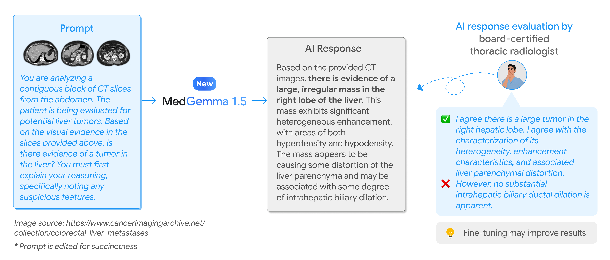

# MedGemma 1.5 テクニカルレポート

> 原題: MedGemma 1.5 Technical Report
> 著者: Google Research and Google DeepMind（全著者リストは原典 §7 を参照）
> 責任著者: {chufang, dangolden, asellerg}@google.com
> 出典: arXiv:2604.05081
> モデル: <https://goo.gle/medgemma>

> 翻訳メモ: 本翻訳は CLAUDE.md §4 の標準ルールと異なり、**Appendix A も翻訳対象に含めている**（ユーザーからの個別指示による）。**Appendix B（Prompts）は原文の英語プロンプト文字列の列挙**であり、日本語に訳すと再現性を損なうため**要旨のみ記載**した。§7 Contributions（著者リスト・謝辞）と References は除外。原典 markdown には画像が 2 枚しか埋め込まれていなかったため、図はすべて arXiv e-print（arXiv:2604.05081）に同梱された PDF から生成した。巨大な HTML テーブルは markdown テーブルに変換している。

## Abstract（要旨）

我々は MedGemma コレクションにおける最新のモデルである **MedGemma 1.5 4B** を紹介する。MedGemma 1.5 は MedGemma 1 を拡張し、追加の能力を統合する。すなわち、**高次元の医療画像（CT/MRI ボリュームと組織病理の全スライド画像）**、**バウンディングボックスによる解剖学的局在化**、**複数時点の胸部 X 線の解析**、そして**医療文書理解の改善**（検査レポート、電子健康記録）である。我々は、新しい訓練データ、**長い文脈による 3D ボリュームのスライス化**、**全スライド病理のサンプリング**を含む、これらのモダリティを**単一のアーキテクチャの内部で**可能にするために必要とされた革新を詳述する。MedGemma 1 4B と比較して、MedGemma 1.5 4B はこれらの新しい領域で有意な向上を示し、**3D MRI の状態分類の精度を 11%、3D CT の状態分類を 3% 改善**する（絶対値での改善）。全スライド病理画像では、MedGemma 1.5 4B は **47% のマクロ F1 の向上**を達成する。加えて、胸部 X 線における**解剖学的局在化を Intersection over Union で 35% 向上**させ、経時的（複数時点）胸部 X 線解析で **4% のマクロ精度**を達成する。MedGemma 1 に対するマルチモーダル性能の改善を超えて、MedGemma 1.5 はテキストに基づく臨床知識と推論も改善し、**MedQA の精度で 5%、EHRQA の精度で 22% の改善**を示す。また 4 つの異なる検査レポート情報抽出データセットで**平均 18% のマクロ F1** を達成する。総合すると、MedGemma 1.5 はコミュニティのための頑健で開かれた資源として、開発者が次世代の医療 AI システムを作るための改善された基盤として設計されている。

## 1 Introduction（はじめに）

開かれた重みを持つ医療の基盤モデルの能力を、複雑で高次元のモダリティを包含するように拡張することは、包括的な医療 AI の開発にとって本質的である。最近の進歩は標準的な 2D 画像のタスクにおけるマルチモーダルモデルの有用性を実証してきたが、**より複雑な画像タスクに取り組むモデルとベンチマークの数はより限られている**。本テクニカルレポートでは、高次元・ボリューム・経時的なデータへの対応を、2D 画像とテキストベースの知識・推論への既存の対応とともに、**すべて単一の統一されたアーキテクチャの内部で**統合した MedGemma コレクションの更新モデル、MedGemma 1.5 を紹介する。

具体的には、MedGemma 1.5 は従来のリリースのマルチモーダル能力を拡張し、4 つの医療画像の能力へのネイティブな対応を導入する。すなわち、**(1) 3D 放射線科の解釈（CT と MRI のボリュームの双方）、(2) 組織病理学のための全スライド画像（WSI）の解釈、(3) X 線に対するバウンディングボックスによる細粒度の解剖学的局在化、(4) 複数時点の放射線科解析**である。追加のキュレートされた訓練データセットを通して、**医療文書（PDF）理解の改善**とテキストに基づく臨床推論の改善の能力も組み込んだ。**単一のアーキテクチャでこれらの多様なベースラインの能力を達成した最初の開かれたモデル**として、MedGemma 1.5 はコミュニティのための頑健で開かれた資源として機能する。

<figure>

<figcaption>図1: MedGemma コレクション内のモデルの能力の概観。更新された MedGemma 1.5 4B のアーキテクチャは 3D 放射線科（CT/MRI ボリューム）、病理の全スライド画像（WSI）、解剖学的局在化、複数時点の解析に対応するようになった。元の MedGemma 27B モデルは複雑な臨床知識と推論のタスクのために利用可能なままであり、MedSigLIP は医療画像の分類と検索のタスクのために利用可能なままである。横軸は 2D imaging / Text / Advanced imaging の 3 領域、縦軸に MedGemma 1.5 4B・MedGemma 27B・MedSigLIP が並び、それぞれの対応範囲が帯で示されている。</figcaption>
</figure>

<figure>

<figcaption>図2: 左のパネルは医療テキスト Q&A のタスク（MedQA と EHRQA）における精度を詳述し、右のパネルは多様な医療画像の能力にわたる性能を強調している。「医療画像の解釈」のスコアは 7 つの異なる画像タスク（MIMIC-CXR の RadGraph F1 とレポート生成のマクロ F1、CheXpert の 5 条件の非加重平均、CXR14 の 3 条件の非加重平均、Path MCQA、DermMCQA、EyePACS）にわたるモデルの性能の非加重マクロ平均を表す。「検査レポート抽出」は EHR データセット 2・3・4 および Mendeley Clinical Laboratory Test Reports の結果のマクロ平均（マクロ F1）である。すべてのスコアはパーセントで報告されている。即応の性能は非常に有望であるが、本モデルは必要な臨床的微調整なしに展開されることを意図していない。微調整は結果を改善し、枠組みを実用に適応させうる。灰色が MedGemma 1 4B、青が MedGemma 1.5 4B。</figcaption>
</figure>

## 2 Methods（手法）

MedGemma 1 と同様に、**MedGemma 4B 1.5 は Gemma 3 に基づき同一のアーキテクチャを持つ**。視覚エンコーダは **400M の MedSigLIP エンコーダ**である。

MedGemma 4B 1.5 の手法上の更新は主に 3 つのカテゴリに分類される。第一に、医学的知識を広げ、3D CT・MRI ボリュームと組織病理学のための全スライド画像（WSI）を含む「高次元」の医療画像のための能力を拡張することを目標として、**いくつかの新しい訓練データセットを組み込んだ**。第二に、訓練の効率とモデルの能力を改善するために**モデリング手法への軽微な変更**を実装した。第三に、更新された能力についてモデルの性能を評価するために**評価を拡張**した。

**表1**: MedGemma 1 に対する MedGemma 4B 1.5 の追加訓練データ。PT: 継続事前学習（LLM の教師あり微調整）、RL: 強化学習、Distill: 教師モデルからの蒸留。

| モダリティ | データセット | 訓練事例数 | 訓練段階 | 説明 |
| --- | --- | --- | --- | --- |
| 放射線 | CXR-IND1 | 605,732 | PT, Distill, RL | インドの大規模病院システムからの胸部 X 線画像と自由文レポートのデータセット |
| | CT Dataset 1 | 282,963 | PT, Distill, RL | 米国の放射線科外来診断センターのネットワークからの、身体部位（頭部・胸部・腹部）を横断する各種の軸位断 CT 検査のデータセット |
| | MRI Dataset 1 | 167,674 | PT, Distill, RL | 米国の放射線科外来診断センターのネットワークからの、身体部位（頭部・腹部・膝）を横断する各種の軸位断マルチパラメトリック MRI 検査のデータセット |
| | Chest ImaGenome | 39,968 | RL | IBM Research による、逐次的な画像とバウンディングボックスを持つ胸部 X 線のデータセット |
| 病理 WSI | Internal WSI Histopathology | 335,825 | PT, RL | 最終診断のテキストレポートと対になった WSI。WSI は個々のパッチにタイル化され、Methods に記述する通り入力のために集約される |
| 皮膚科 | Dermatology Dataset 4 | 25,560 | PT, Distill | 日本からの複数画像と経時的な受診・記録を特徴とする皮膚科データセット |
| | Dermatology Dataset 5 | 87,879 | PT, Distill, RL | ラベルなし画像を特徴とする皮膚科データセット |
| | ISIC | 40,269 | PT, Distill | 病変の診断または属性ラベルを持つダーモスコピー画像 |
| EHR・検査レポート | EHRQA* | 9,809（QA 対） | Distill | 合成 FHIR 記録から引き出された質問応答データセット |
| | EHR Dataset 2 | 1,539（2,846 ページ） | Distill | 生化学、臨床病理、血液学、微生物学、血清学などの各部門の検査レポート |
| | EHR Dataset 3 | 6,214（18,035 ページ） | Distill | 同上 |
| | EHR Dataset 4 | 497（1,278 ページ） | Distill | 米国の各種検査レポートのテンプレートについて LaTeX ベースのカスタム PDF 生成器で作られた合成レポート |
| | EHR Dataset 5 | 33,882（ユーザークエリ） | Distill | 約 60,000 の健康に関連するユーザークエリの合成データセット |

\* EHRQA は MedGemma 1 4B の訓練には以前含まれていなかったが、MedGemma 1 27B の訓練データには含まれていた。

**表2**: MedGemma 1.5 の追加の評価データセット。OOD = 分布外（モデル開発のいかなる段階でも見ていないデータ）。

| タスク | データセット | モダリティ | 評価事例数 | OOD | 公開 |
| --- | --- | --- | --- | --- | --- |
| 医療テキスト QA | EHRNoteQA | テキスト | 962 | ✓ | ✓ |
| CXR 経時解析 | MS-CXR-T | 放射線（経時） | 1,326 | - | ✓ |
| 3D CT 分類 | CT Dataset 1 | 放射線 CT（ボリューム） | 1,229 | - | - |
| | CT-RATE | 放射線 CT（ボリューム） | 1,558 | ✓ | ✓ |
| CXR 所見の局在化 | Chest ImaGenome | 放射線（局在化） | 10,000 | - | ✓ |
| 病理 WSI → テキスト | WSI Histopath | 病理 WSI | 9,614 | - | - |
| 文書理解 | EHR Dataset 2 | PDF 文書 | 170（304 ページ） | - | - |
| | EHR Dataset 3 | PDF 文書 | 702（2,005 ページ） | - | - |
| | EHR Dataset 4 | PDF 文書 | 56（143 ページ） | - | - |
| | Mendeley Clinical Laboratory Test Reports | PNG 画像 | 14 | - | ✓ |

### 2.1 Pretraining（事前学習）

MedGemma 1.5 の訓練にあたり、**MedGemma 1 の視覚エンコーダ（MedSigLIP）は凍結され、言語デコーダが追加の事前学習（LLM の教師あり微調整）を受けた**。元の Gemma の混合からのテキストとインターリーブされた画像データの両方に加えて、表1 に要約した新しい医療領域の画像–テキスト対データを組み込んだ。

放射線科の新しいモダリティと、皮膚科・組織病理学・EHR/検査レポート理解の新しいデータを追加した。具体的には、内部の皮膚科データセットを **ISIC 2017 と 2018 の公開（CC-0）構成要素**および日本の大規模病院からの内部画像セットを含むよう拡張した。加えて、内部の放射線撮影データセット（CXR-IND1、CT Dataset 1、MRI Dataset 1）も事前学習に追加した。

### 2.2 Post-training（後訓練）

事前学習から獲得された知識は、後訓練の段階で蒸留と強化学習（RL）の組み合わせによって洗練された。**Gemma 3 と同じレシピを用いたが、両方の段階に追加の医療データを加えている**。ここで蒸留とは、**トークンあたり 256 の教師モデルのロジットを教師の確率で重み付けしてサンプルする**ことを意味する。学生はこれらのサンプル内で交差エントロピー損失を介して教師の分布を学習する。

MedGemma 1.5 の蒸留のプロセスは、改善された大規模な IT（instruction-tuned）教師に加えて、**領域特有の追加の教師モデル**を組み込むことで強化された。例えば、高次元の医療画像の能力を高めるため、**CT Dataset 1、MRI Dataset 1、Internal histopathology について補助的な教師を訓練した**。表1 に示す通り、放射線科・皮膚科・全スライド病理画像を含む複数のモダリティにわたって追加の Distill および/または RL の訓練が適用され、モデルの性能を臨床の視覚タスクにさらに整合させた。改善された文書理解を可能にするため、EHRQA（Synthea によって作られた合成記録）および EHR データセット 2・3・4・5 で蒸留を行った。

### 2.3 Preprocessing（前処理）

#### 2.3.1 Preprocessing of Volumetric Images（ボリューム画像の前処理）

**画像エンコーダは 2D の RGB 画像しか処理できないため、3D の CT と MR の画像ボリュームは個々の 2D 軸位断画像の列に前処理**され、そのそれぞれが画像エンコーダの入力次元である 896×896 画素に再スケールされた。

訓練と評価の際、**1 クエリあたりの軸位断スライスの数を最大 85 に制限した（これは 21,760 の視覚トークンに相当する）**。これは、プロンプトに含まれる放射線レポートの適応（indication）と対象となる所見（findings）を含めたときに**合計 32K トークンを下回るように保ち、訓練中のメモリ要求を扱いやすくするため**である。スライスは 1 検査あたり複数の z 方向に積まれたボリュームから生じうる。これらの各ボリュームの選択基準は次のとおりであった。(a) 1 スライスあたり最大 512×512 画素、(b) 軸位断の向き、(c) 同じ厚さのスライス、(d) 少なくとも 5 スライス。CT 検査については、これらには同じスキャンから生じる異なる再構成カーネルを持つボリュームが含まれ、MRI 検査については T1 強調（T1w）、T2 強調（T2w）、GRE、SWI を含む異なるシーケンスとコントラストを表すボリュームが含まれる。計算効率のため、最終的な z 方向に積まれたボリュームが合計で 85 スライスを超える場合は、**（積まれたボリュームの）z 軸に沿って等間隔にスライスをサンプルした**。

ボクセル値の写像に関しては、単一スライスの CT 画像についての我々の以前の研究と同様に、**画像エンコーダがチャネルあたり 256 の異なる強度値でのみ訓練されているため、生の Hounsfield 単位（HU）を RGB 値に写像する多チャネルのウィンドウ処理**を用いた。具体的には次の CT のウィンドウ写像を用いた。

- **赤チャネル (-1024, 1024)**: 我々の訓練データの異質性（脳・胸部・腹部にまたがる）を踏まえ、**この広いウィンドウは、空気で満たされた肺実質から緻密な皮質骨まで、すべての解剖学的領域を横断して形態的な境界が可視のままであることを保証する**。
- **緑チャネル (-135, 215)**: **緑チャネルは標準的な画像処理において輝度に最も大きく寄与するため**、内臓器官と縦隔の構造におけるテクスチャに対するエンコーダの感度を活用するべく、複雑な軟部組織のデータをここに写像した。
- **青チャネル (0, 80)**: この狭く高コントラストのウィンドウは、脳実質における微妙な減弱（灰白質/白質の区別）と急性頭蓋内出血、および血管の石灰化を強調する。

対照的に、**MR 画像のボクセル値はすべて相対的であり生理学的なウィンドウが存在しないため、ウィンドウ処理は適用しなかった**。代わりにボリュームごとに min-max 正規化を用いて正規化し、R、G、B のチャネルを同じ値に設定した。

#### 2.3.2 Preprocessing of Histopathology Whole-slide Images（組織病理学の全スライド画像の前処理）

組織病理学の WSI 前処理のパイプラインは、**WSI をマルチモーダル学習に適した代表的な組織パッチの列に変換する**よう設計された。計算効率と関連性を確保するため、パッチの抽出を組織を含む領域に制限した。各スライドについて**低解像度（5x 倍率）で組織マスク**を生成した。**HSV（色相・彩度・明度）色空間**で動作するカスタムの多段階の組織セグメンテーションのアルゴリズムを用いた。

各 WSI について、**パッチ抽出のために単一の光学倍率を確率的に選択**し、標準的な診断の倍率にわたって概ね一様になるように確率を設定した。**P(5x)=0.34、P(10x)=0.33、P(20x)=0.33** である。高解像度の組織マスクは対象の抽出ストライドに合うようダウンスケールされた。組織マスクで定義された規則的な格子から、**サイズ 896×896 画素の非重複のパッチ**が、パッチサイズに等しいストライドで抽出された。下流のモデルのために固定された系列長を維持するため、**復元なしのランダムなサブサンプリングによりスライドあたり最大 126 パッチの上限を課した（32,256 の視覚トークンをもたらす）**。長い視覚タスクに用いる画像の数は CT と WSI で異なることに注意されたい。これはそれらに伴うテキスト入力の長さが異なるためである（CT は WSI と比べて長いテキスト入力を持っていた）。**決定的に重要なこととして、相対的な位置の文脈を保持するために、選択されたパッチの元の空間的な順序が保存された**。結果として得られたパッチは PNG 画像として符号化され、スライドのキャプションとともに保存された。上記の CT と MRI の例より 1 クエリあたりの画像の数を多くした（85 に対し 126）のは、画像のキャプションの符号化に必要なトークンが少なかったためである。

この処理は、事前学習・蒸留・RL（トークンレベルの ROUGE-L に対する）のための合計約 335,825 の全スライド画像–テキスト対、および評価に用いる 9,614 対に適用される。

## 3 Evaluations（評価）

特に報告がない限り、我々が行ったすべての評価は 1 事例あたり 1 回の推論実行から構成された。**MedGemma 1.5 の評価では、チューニングセットの性能の非公式な測定に基づき、すべての評価で温度 0.0 を用いた**。他のベースラインモデルには既定の温度を用いた。一貫性のため MedGemma 1 の新しいデータセットの評価でも温度 0.0 を維持した。すべての評価は、MedGemma の訓練から完全に取り置かれたデータソースまたはその分割を用いて実施された。

### 3.1 Existing MedGemma Benchmarks（既存の MedGemma ベンチマーク）

**プロンプトは MedGemma 1 の評価と比較して更新され標準化された。** 特に MCQ のような類似のタスクについては、より一貫させるために同じ初期の指示プロンプトを利用するようになった。以前のモデルと同様に、評価にうまく機能するプロンプトを見つけるため、訓練と検証の分割で MedGemma 1.5 のプロンプトを手動で最適化した。

**表3**: MedGemma 1 の元の評価タスクにおける MedGemma 1.5 の性能。小規模モデルと大規模モデルで別々に最良を太字にしている。

| Task | Metric | MedGemma 1 4B | **MedGemma 1.5 4B** | MedGemma 1 27B | Qwen3 VL 4B | Gemini 3 Flash | Gemini 3 Pro |
| --- | --- | --- | --- | --- | --- | --- | --- |
| *テキスト評価* | | | | | | | |
| MedQA (4-op) | Accuracy | 64.4 | **69.1** | 85.3 | 76.8 | 94.3 | **95.1** |
| MedMCQA | Accuracy | 55.7 | **59.8** | 70.2 | 63.7 | 85.2 | **86.1** |
| PubMedQA | Accuracy | 73.4 | 67.6 | 77.2 | 74.8 | 80.8 | **82.2** |
| MMLU Med | Accuracy | 70.0 | 69.7 | 86.2 | **78.3** | 87.5 | **88.1** |
| MedXpertQA* (Text Only) | Accuracy | 14.2 | 16.4 | 21.8 | **17.5** | 67.7 | **78.2** |
| AfriMed-QA | Accuracy | 52.0 | 56.0 | 72.0 | **68.0** | **88.0** | 76.0 |
| *電子健康記録の情報検索* | | | | | | | |
| EHRQA | Accuracy | 67.6 | **89.6** | 90.5 | 87.3 | 94.9 | **95.2** |
| *医療画像分類* | | | | | | | |
| MIMIC CXR (Med-Gemini Test Set) | Average F1（5 条件） | 88.9 | **89.5** | 90.0 | 78.5 | **88.4** | 85.0 |
| MIMIC CXR (MAIRA test set) | Average F1（5 条件） | 40.5 | **41.5** | 40.2 | 31.1 | 37.8 | **39.4** |
| CheXpert | Average F1（5 条件） | 48.1 | 48.2 | **49.9** | 33.5 | 47.8 | **51.2** |
| CXR14 | Average F1（3 条件） | **50.1** | 48.4 | 45.3 | 34.6 | 44.8 | **46.9** |
| DermMCQA | Accuracy | 71.8 | **73.5** | 71.7 | 68.0 | 79.5 | **84.0** |
| PathMCQA | Accuracy | 69.8 | 70.0 | **71.6** | 41.8 | **59.3** | 59.1 |
| EyePACS | Accuracy | 64.9 | **76.8** | 75.3 | 41.9 | **66.9** | 63.4 |
| *視覚質問応答* | | | | | | | |
| SlakeVQA | Tokenized F1 | **72.3** | 59.8 | 70.3 | 53.5 | 62.5 | **62.8** |
| VQA-RAD | Tokenized F1 | **49.9** | 48.1 | 46.7 | 46.9 | 59.5 | **60.9** |
| *知識と推論* | | | | | | | |
| MedXpertQA* (text + MM) | Accuracy | 18.8 | 26.4 | **26.8** | 21.9 | 72.8 | **74.4** |
| *レポート生成* | | | | | | | |
| MIMIC CXR | RadGraph F1 | 21.9 | **27.2** | 27.0 | – | 7.4 | **20.8** |

\* MedXpertQA は分布外。⋄ 事前学習中、CXR レポート中の時間的関係への言及は除去された。

### 3.2 New Multi-Modal Evaluations（新しいマルチモーダル評価）

#### 3.2.1 Condition Classification from 3D CT and MR Images（3D CT・MR 画像からの状態分類）

<figure>

<figcaption>図3: MedGemma 1.5 の能力の概観。更新された 4B のアーキテクチャは 3D 放射線科（CT/MRI ボリューム）に対応するようになった。図では腹部 CT の連続スライス塊をプロンプトとして与え、肝腫瘍の有無を推論させた例が示されており、認定を受けた胸部放射線科医が「右肝葉の大きな腫瘍」「その不均一性・造影の性状・肝実質の歪み」については同意した一方、「実質的な肝内胆管拡張は明らかでない」と不同意を示している。画像出典は The Cancer Imaging Archive の colorectal-liver-metastases コレクション。</figcaption>
</figure>

CT と MR の画像について、MedGemma と比較可能なモデルを**一般的な状態の分類**で評価した。

内部の CT Dataset 1 のテスト分割は頭部・胸部・腹部/骨盤の撮影から構成された。モデルは次の状態を検出する能力について評価された。**心臓の石灰化、疑わしい肺結節（胸部）、大動脈瘤、腎結石、腫瘍、虫垂炎（腹部/骨盤）、出血（頭部）**である。二値の正解ラベル（ボリューム内での有無を示す）を抽出するため、多段階のパイプラインを用いた。(1) 陽性の言及に対する正規表現ベースのスクリーニング、(2) Gemini ベースの抽出、(3) **米国の認定を受けた心臓胸部放射線科医によるランダムな部分集合の最終的な手動レビュー**である。

公開されている **CT-RATE** データセットの（内部）検証分割でも CT の性能を評価した。これは 1,304 名の患者からの 1,564 件の非造影胸部 CT 撮影から構成される。内部データセットと同様に、**18 の異なる状態と異常**の二値予測にわたるマクロ精度を測定した。

評価の際、**モデルは各状態について別々に問い合わせられた**。プロンプトは選択された画像スライスの列にスライスの索引（例: SLICE {index}）をインターリーブしたものに続いて、その状態の有無に関する二値の質問から構成された。内部データセットについては、プロンプトには元のレポートからの患者の既往も含まれた。**モデルはクラスの確率ではなく生成的なテキストを産出するため、評価は二値の有無の回答に基づいた。**

#### 3.2.2 Pathology Report Generation from WSI（WSI からの病理レポート生成）

元の病理レポートの最終診断のセクションに対して **ROUGE 指標**を用いて評価した。この指標が同じタスクの画像–テキスト対に対する病理医の採点とよく相関することを以前に示している。各 WSI は §2.3.2 で規定したパッチ抽出の方法で処理・前処理され、テキストの検体ラベル（例: "colon biopsy"）とともに入力として提供された。本解析では単一の WSI–テキスト対のみを用いる。

#### 3.2.3 Longitudinal Chest X-Ray（経時的胸部 X 線）

経時的な医療画像における**時間的推論**の能力を評価するため、**MS-CXR-T** で評価した。このタスクはモデルが胸部 X 線の対——具体的には以前の検査と現在の検査——を解析して、**5 つの特定の心肺の病態（硬化、浮腫、胸水、肺炎、気胸）の推移**を判定することを要求する。評価のパイプラインは 2 枚の X 線写真を構造化されたテキストプロンプトと組み合わせ、各画像対についてモデルは 3 つの可能なクラス——**(A) 改善、(B) 安定、(C) 悪化**——のいずれかを返すよう促される。性能はクラスの不均衡を考慮して**マクロ精度**で定量化される。

#### 3.2.4 Localization of Anatomical Regions（解剖学的領域の局在化）

関心のある解剖学的領域を局在化するモデルの能力を評価するため、**Chest ImaGenome** で評価した。**バウンディングボックスの評価プロトコル**を用いた。モデルは、問い合わせで特定された特定の解剖学的構造について 2D バウンディングボックスの座標を生成するよう促された。局在化の性能を評価する主要な指標は **Intersection over Union（IoU）**であった。

モデルには入力として正面像の胸部 X 線画像とテキストプロンプトが与えられた。プロンプトには、**各オブジェクトがラベルと 2D バウンディングボックスの座標集合 `[y0, x0, y1, x1]` で定義される JSON のリストを出力する**という具体的な指示が含まれていた。座標は $[0,1]$ の範囲に正規化するよう要求され、$(y0,x0)$ が左上隅、$(y1,x1)$ が右下隅を表す。

#### 3.2.5 Document Understanding: Structured Data Extraction from Lab Reports（文書理解: 検査レポートからの構造化データ抽出）

MedGemma 1.5 は**マルチモーダルな検査レポートからの構造化データ抽出**について調整され評価された。文書の画像と PDF（オープンソースのライブラリで画像に描画）から主要な属性を**構造化された JSON 形式**に変換するものである。このタスクは、**LOINC**（Logical Observation Identifiers Names and Codes）の写像や **FHIR**（Fast Healthcare Interoperability Resources）のリソース生成のような、下流の標準化と相互運用性のタスクの前提条件と見なされうる。

頑健な汎化を確保するため、実世界の臨床データの複雑さを反映するよう設計された複合データセットをキュレートした。コーパスの入力は文書画像（例: PNG、JPEG）と PDF として提供される医療の検査レポートから構成される。範囲は病理検査に限定されている。データセットは**デジタルネイティブなレポートとスキャンされた文書の双方**を包含し、後者は手動のデジタル化に内在するノイズ・可変の照明・回転のアーティファクトといった課題を導入する。

対象となる JSON オブジェクトは元の文書の階層的・関係的なデータを反映するよう構造化され、次のデータに焦点を当てる。**name、result、unit、specimen、method、sample collection time** である。F1 の性能は、予測されたラベルを正解の対応物と対にする多段階のラベル照合アルゴリズムを用いて計算される。

### 3.3 New Text-based Evaluations（新しいテキストベースの評価）

##### EHRNoteQA:

実世界の電子健康記録に対する臨床推論の能力を評価するため、**EHRNoteQA** ベンチマークを利用した。このデータセットは **MIMIC-IV** データベースの退院サマリから引き出された 962 の質問–回答対から構成され、治療計画・診断・患者の既往といった多様な臨床トピックを扱う。各事例は特定の患者について蓄積された退院サマリを解析して臨床的に関連する質問に答えることを伴う。ベンチマークは開放型と多肢選択型の双方に対応しているが、**我々の評価は多肢選択（MCQ）の設定のみに焦点を当てた**。各問いについて、モデルには患者の退院記録・質問・5 つの選択肢（A〜E）が提示され、全体の精度が評価された。

**表4**: 新しい評価タスクの結果。

| Task | Metric | MedGemma 1 4B | **MedGemma 1.5 4B** | MedGemma 1 27B | Qwen3 VL 4B | Gemma 3 4B | Gemma 3 27B | Gemini 3.0 Flash | Gemini 3.0 Pro | External SOTA |
| --- | --- | --- | --- | --- | --- | --- | --- | --- | --- | --- |
| *Text Only* | | | | | | | | | | |
| EHRNoteQA | Accuracy | 79.4 | 80.4 | **90.7** | 90.6 | 78.0 | 90.3 | 93.9 | **95.0** | 95.15-97.16（GPT-4） |
| *Document Understanding* | | | | | | | | | | |
| EHR Dataset 2 | Macro F1 | 78 | **91** | 76 | – | 84 | 93 | 92 | **93** | – |
| EHR Dataset 3 | Macro F1 | 50 | **71** | 66 | – | 61 | 74 | 74 | **90** | – |
| EHR Dataset 4 | Macro F1 | 25 | **64** | 5 | – | 41 | 52 | **82** | 81 | – |
| Mendeley Clinical Laboratory Test Reports | Macro F1 | **85** | **85** | 69 | – | 83 | 89 | 89 | **90** | – |
| *CXR Analysis* | | | | | | | | | | |
| Chest ImaGenome (Localization) | Mean IoU | 3.1 | **38.0** | 16.0 | 8.7 | 5.7 | 8.1 | 38.5 | **39.1** | 30.7-34.4（CoCa-CXR） |
| MS-CXR-T (Temporal) | Macro-Accuracy | 61.1 | **65.7** | 50.1 | 53.5 | 59.0 | 52.7 | **67.3** | 62.9 | 68.5（BioViL-T） |
| *High-Dimension Image Analysis* | | | | | | | | | | |
| CT Dataset 1 (3D CT) | Accuracy | 58.2 | **61.1** | 57.8 | 52.8 | 54.5 | 55.7 | **62.9** | 61.0 | – |
| MRI Dataset 1 (3D MRI) | Accuracy | 51.3 | **64.7** | 57.4 | 49.6 | 51.1 | 50.5 | **60.3** | 55.5 | – |
| WSI Histopath | ROUGE-L | 2.2 | **49.4** | 4.1 | ? | 2.3 | 3.2 | **13.9** | 12.2 | 49.8（PolyPath） |

## 4 Discussion（考察）

MedGemma 1.5 のリリースは、オープンソースの医療人工知能にとって重要な一歩を示している。多様なベンチマークにわたるその性能は、**単一の効率的な 4B パラメータのモデルが、確立されたテキストベースのベンチマークにおける能力を保持できるだけでなく、高次元かつ経時的な画像における複雑なタスクへ汎化できる**ことを実証している。特に、改善された蒸留と RL により、モデルが 1.0 と比較して複数のテキストベースのベンチマークで実際に性能を改善できることが見て取れる。MedQA で 5%、MedXpertQA（マルチモーダル）で 8% の改善を含む。

ベンチマークの強い性能を超えて、これらのアーキテクチャ上の改善は MedGemma 1.5 を開発者にとって非常に実用的な基盤として確立する。**強化された解剖学的局在化と複数時点の解析のような革新は即応の時空間的な認識を提供**し、その頑健な EHR と検査レポートの解析の能力は**医療特有の OCR のユースケース**を可能にする。重要なこととして、これらの即応の機能は**基礎的なデータ処理のツールとして設計されており、自動化された臨床判断や医療行為とは別物である**。

##### Comparisons（比較）

より広いオープンウェイトモデルのエコシステムの中で MedGemma 1.5 を文脈づけるため、同程度のサイズの最先端のマルチモーダルモデルである **Qwen3 VL 4B** と性能を比較した。**この比較は明確に異なる設計思想を明らかにする。Qwen3 VL 4B は MedQA のような一般的なテキストベースの生物医学の知識のタスクで優れた性能を実証する。しかしながら、MedGemma 1.5 は領域特有の視覚能力を要求する専門的な臨床の視覚タスクで Qwen3 VL 4B を大幅に上回る。すべての視覚タスクにおいて MedGemma 1.5 はより高い性能を達成した。** この乖離は……を強調する。

新しい評価タスクの比較解析において、我々は Qwen3 VL 4B のような外部のベースラインを含めることで広い視点を提供することを目指した。**一部の評価は、我々の現在の内部評価の枠組みにおける実務上の制約により Qwen3 で実施することが不可能であった。** 今後の研究では、Qwen アーキテクチャの異なる推論プロトコルに対応するようこの枠組みを拡張することが含まれうる。

##### Limitations（限界）

MedGemma 1 と比較して、**能力の拡張に内在するトレードオフ**を観察した。MedGemma 1.5 がより「**医療のジェネラリスト**」になるにつれ、**SLAKE と VQA-RAD のような特定のレガシーなベンチマークで軽微な退行**を認めた。しかしながら、これらのベンチマークは、評価が**トークンの重複に依存し、正解の回答が標準化されていない**という点で、それ自身の限界を持つことに注意したい。我々は、高次元の画像とバウンディングボックスの局在化における改善された性能により、この新しいモデルが医療画像において一般により有用であると信じている。

## 5 Conclusion（結論）

MedGemma 1.5 は、標準的な 2D のタスクを超えて 3D 放射線科・病理の全スライド画像・経時的な画像の列といった**高次元・時空間的なモダリティ**に取り組むことで、元のモデルの有用性を大幅に拡張する。これらの複雑な新しい能力と追加された文書理解の機能にもかかわらず、**モデルは 4B パラメータのアーキテクチャの計算的・コスト的な効率を保持している**。この非常に有能でマルチモーダルに意識的な基盤を開かれた資源として公開することで、我々は開発者コミュニティにさらに有用な出発点を与えることを目指している。

## 6 Model availability（モデルの入手性）

モデルは Google Health AI Developer Foundations のサイト <https://goo.gle/hai-def> で公開されている。MedGemma のコレクションについての詳細は <https://goo.gle/medgemma> にある。

## Appendix A CT-RATE Evaluation（CT-RATE の評価）

我々はモデルの一部を **CT-RATE** データセットでも追加的に評価し、§2.3.1 に従って（再サンプリングなしで）処理した。結果は表5 に要約されている。**単一の順伝播で多ラベルの予測を産出するよう最適化された、特化してカスタムに構築された CT アーキテクチャとは異なり、汎用の視覚–言語モデルをこの高次元のタスクに適用するには、より細粒度の推論の戦略が必要であった。** 具体的には、我々の枠組みは 1 検査あたり **18 回モデルに問い合わせる**ことを必要とした。

表5 に提示された結果は、**高次元の医療画像のタスクにおける領域特化のアーキテクチャと汎用のアーキテクチャの間の性能の有意な乖離**を強調する。最も注目すべきは、**MedGemma 4B のモデル（バージョン 1 と 1.5）が汎用の Gemini 3.0 Flash モデルと比較して優れたゼロショットの汎化能力を実証している**ことである。CT-RATE データセットが MedGemma の訓練カリキュラムにとって分布外（OOD）であるにもかかわらず、これらのモデルははるかに高いマクロ F1 のスコアを達成した。

**表5**: CT-RATE の結果。

| Task | Metric | MedGemma 1 4B | MedGemma 1.5 4B | Gemini 3.0 Flash |
| --- | --- | --- | --- | --- |
| CT-RATE* (3D CT) | Macro F1 | 23.5 | **26.9** | 8.5 |

\* 分布外。

**表6**: 一般的な非医療のベンチマークにおける精度の結果。

| Type | Benchmark | MedGemma 1 4B | MedGemma 1.5 4B | Gemma 3 4B | MedGemma 1 27B | Gemma 3 27B |
| --- | --- | --- | --- | --- | --- | --- |
| Text-only | MMLU Pro | 39.1 | **33.8** | 43.6 | 60.2 | **67.5** |

表6 は、**前身の MedGemma 1 4B と基礎となる Gemma 3 4B の双方と比較して一般的な知識の推論における劣化**を示している。**この低下は 4B パラメータのクラスにおける明確なトレードオフを示唆しており、モデルを画像に特化させるために必要とされた集中的な微調整が、領域外の汎用のタスクに対する能力の減少をもたらした可能性を示している。** それでも我々は、マルチモーダルの医療領域における大きな性能の向上を考えれば、このトレードオフは価値があると信じている。

## Appendix B Prompts（プロンプト）

> 翻訳メモ: 本章は各評価タスク（3D CT/MRI の状態分類、WSI からの病理レポート生成、MS-CXR-T の経時解析、Chest ImaGenome の局在化、検査レポートの構造化抽出、および更新された既存ベンチマーク用の MCQ プロンプト）で用いた**英語のプロンプト文字列がそのまま列挙されている**。日本語に訳すと評価の再現性を損なうため、本翻訳では訳出せず要旨のみ記す。3D CT のプロンプトは「選択されたスライスの列に `SLICE {index}` を挟んだもの + 元のレポートからの患者の既往 + 当該状態の有無を問う二値の質問」という構造、局在化のプロンプトは「`[y0, x0, y1, x1]` を $[0,1]$ に正規化した JSON リストを出力せよ」という構造を取る。原文は原典 Appendix B を参照されたい。
